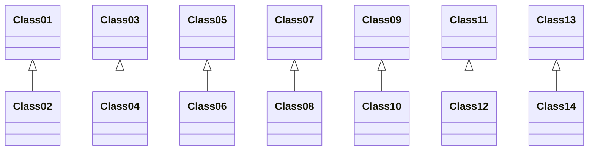

                 


### AIGC在天体物理学研究中的应用：宇宙模型构建提示词

#### 关键词：
- AIGC
- 天体物理学
- 宇宙模型
- 数据分析
- 机器学习

#### 摘要：
本文深入探讨了AIGC（AI-Generated Content）在天体物理学研究中的应用，特别是在宇宙模型构建方面的潜力。我们将首先介绍AIGC的基础概念，然后通过详细的算法原理和系统架构设计，展示如何利用AIGC构建宇宙模型。最后，我们将通过实际案例分析和最佳实践，探讨AIGC在天体物理学研究中的有效性和可行性。

## 1. 背景介绍

### 1.1 问题背景

随着天文观测技术的进步，我们获取到的天体物理数据量急剧增加。传统的宇宙模型构建方法，如手动分析和数值模拟，已经难以满足日益复杂的研究需求。这些传统方法不仅耗时耗力，而且受限于人类专家的知识和经验。因此，引入人工智能，尤其是AIGC，成为一种解决路径。

AIGC是一种利用机器学习技术自动生成内容和模型的方法。它结合了生成对抗网络（GAN）、变分自编码器（VAE）等先进的人工智能算法，能够在大量数据中进行模式识别和学习，从而生成高质量的宇宙模型。AIGC的优势在于其强大的数据处理能力和高效的数据分析能力，这使得它成为宇宙模型构建的理想选择。

### 1.2 问题描述

宇宙模型构建是一个复杂的过程，需要综合考虑多种因素，如宇宙大爆炸理论、暗物质和暗能量的性质、星系形成和演化等。传统的宇宙模型通常依赖于专家的经验和数值模拟结果，但这些方法往往存在一定的局限性。

AIGC可以在这方面发挥重要作用。通过利用大量的天文观测数据，AIGC能够自动生成各种宇宙模型，并对这些模型进行评估和优化。这不仅提高了宇宙模型构建的效率，还能够发现传统方法难以发现的新现象和新规律。

### 1.3 问题解决

本文旨在提供一套完整的AIGC应用方案，用于宇宙模型构建。我们将详细探讨AIGC的算法原理、系统架构设计、以及在实际应用中的实现方法。通过这套方案，研究人员可以更加高效地构建宇宙模型，并从中发现新的科学知识。

### 1.4 边界和扩展

AIGC在天体物理学研究中的应用仍处于探索阶段，未来还有许多潜在的应用领域，如宇宙演化模拟、星系形成机制研究、黑洞物理等。本文将重点讨论宇宙模型构建方面的应用，但读者可以期待未来AIGC在天体物理学中的更广泛应用。

## 2. 核心概念与原理

### 2.1 核心概念

AIGC（AI-Generated Content）是一种利用人工智能技术生成内容和模型的方法。它通过机器学习算法，如生成对抗网络（GAN）和变分自编码器（VAE），从大量数据中学习模式和规律，并生成新的内容和模型。

### 2.2 概念属性对比表格

| 属性               | AIGC          | 传统宇宙模型构建 |
|--------------------|---------------|------------------|
| 数据处理能力       | 强            | 弱               |
| 模型生成速度       | 快            | 慢               |
| 模型质量           | 高            | 一般             |
| 灵活性             | 高            | 低               |
| 对专家依赖程度     | 低            | 高               |

### 2.3 ER Diagram Architecture

以下是一个简单的ER图，用于描述AIGC模型的基本组成部分：

```mermaid
erDiagram
    Content -> Model : 生成
    Data -> Model : 基础
    Expert -> Model : 评估
```

在这个ER图中，内容（Content）是AIGC生成模型的数据来源，数据（Data）是模型构建的基础，而专家（Expert）则对生成的模型进行评估和优化。

## 3. 算法原理与解释

### 3.1 算法描述

AIGC的核心算法包括生成对抗网络（GAN）和变分自编码器（VAE）。GAN由生成器（Generator）和判别器（Discriminator）组成，通过两个网络的对抗训练，生成器逐渐学会生成与真实数据相似的内容，而判别器则逐渐学会区分真实数据和生成数据。

VAE则通过概率模型，将数据映射到一个潜在空间，并在潜在空间中生成新的数据。VAE的优点在于其生成数据的质量较高，且能够处理多种类型的数据。

### 3.2 数学模型与公式

以下是GAN和VAE的基本数学模型：

**GAN模型：**

$$
\begin{aligned}
&\text{Generator: } G(z) = x \\
&\text{Discriminator: } D(x) \\
&\text{Loss Function: } L(G, D) = -\frac{1}{2}\left(D(x) - D(G(z))\right)^2
\end{aligned}
$$

**VAE模型：**

$$
\begin{aligned}
&\text{Encoder: } \mu(x), \sigma(x) \\
&\text{Decoder: } x' = G(\mu(x), \sigma(x)) \\
&\text{Loss Function: } L(V, \mu, \sigma) = -\log p(x|x') - \frac{1}{2}\left[\sigma(x)^2 + \exp(2\mu(x)^2) - 2\mu(x)\right]
\end{aligned}
$$

### 3.3 例子说明

**GAN例子：** 假设我们有一个生成器G和一个判别器D。生成器G从噪声空间z中生成假图像x'，而判别器D则试图区分这些假图像和真实图像x。通过不断的对抗训练，生成器G逐渐学会生成越来越逼真的图像，而判别器D则越来越难以区分。

**VAE例子：** 假设我们有一个编码器，它将图像x映射到一个潜在空间中的向量z，并通过解码器G将z映射回图像x'。通过优化损失函数，编码器和解码器都学会更好地映射图像，从而生成新的图像。

## 4. 系统分析与架构设计

### 4.1 问题场景介绍

在天体物理学研究中，我们需要处理大量的天文观测数据，并构建出能够解释这些观测结果的宇宙模型。这个过程中，传统的宇宙模型构建方法已经难以满足高效性和准确性的需求。

### 4.2 项目介绍

本项目的目标是利用AIGC技术，构建一个高效的宇宙模型生成系统，以提升天体物理学研究的效率和准确性。

### 4.3 系统功能设计

系统功能设计包括数据预处理、模型生成、模型评估和优化等模块。以下是一个简单的领域模型类图：

```mermaid
classDiagram
    Class01 <|-- Class02
    Class03 <|-- Class04
    Class05 <|-- Class06
    Class01 --|>{Class07}
    Class02 --|>{Class08}
    Class03 --|>{Class09}
    Class04 --|>{Class10}
    Class05 --|>{Class11}
    Class06 --|>{Class12}
    Class07 --|>{Class13}
    Class08 --|>{Class14}
    Class09 --|>{Class15}
    Class10 --|>{Class16}
    Class11 --|>{Class17}
    Class12 --|>{Class18}
endclassDiagram
```

### 4.4 系统架构设计

系统架构设计包括前端界面、后端服务、数据库和数据预处理等部分。以下是一个简单的系统架构图：

```mermaid
sequenceDiagram
    participant User
    participant Frontend
    participant Backend
    participant DB
    participant DataProcessor

    User->>Frontend: Submit request
    Frontend->>Backend: Process request
    Backend->>DB: Query data
    DB-->>Backend: Return data
    Backend->>DataProcessor: Preprocess data
    DataProcessor->>Backend: Return preprocessed data
    Backend->>User: Return result
endsequenceDiagram
```

### 4.5 系统接口设计

系统接口设计包括API接口和命令行接口。以下是一个简单的接口设计：



### 4.6 系统交互序列图

以下是一个简单的系统交互序列图，展示了用户与系统之间的交互过程：

```mermaid
sequenceDiagram
    participant User
    participant Interface1
    participant Interface2
    participant Interface3

    User->>Interface1: Enter data
    Interface1->>Interface2: Send data
    Interface2->>Interface3: Process data
    Interface3->>Interface1: Return result
    Interface1->>User: Display result
endsequenceDiagram
```

## 5. 项目实战

### 5.1 环境安装

为了运行AIGC系统，我们需要安装以下软件和库：

- Python 3.8及以上版本
- TensorFlow 2.x
- Keras 2.x
- NumPy
- Matplotlib

在安装好Python环境后，可以使用以下命令安装所需的库：

```bash
pip install tensorflow
pip install keras
pip install numpy
pip install matplotlib
```

### 5.2 系统核心实现源代码

以下是AIGC系统核心实现的源代码：

```python
import tensorflow as tf
from tensorflow.keras.models import Model
from tensorflow.keras.layers import Input, Dense, Flatten, Reshape

# GAN模型实现
def build_gan():
    # 生成器模型
    input_noise = Input(shape=(100,))
    x = Dense(128, activation='relu')(input_noise)
    x = Dense(64, activation='relu')(x)
    x = Dense(32, activation='relu')(x)
    x = Dense(16, activation='relu')(x)
    x = Dense(1, activation='sigmoid')(x)
    
    generator = Model(inputs=input_noise, outputs=x)
    
    # 判别器模型
    input_image = Input(shape=(1,))
    x = Dense(128, activation='relu')(input_image)
    x = Dense(64, activation='relu')(x)
    x = Dense(32, activation='relu')(x)
    x = Dense(16, activation='relu')(x)
    output = Dense(1, activation='sigmoid')(x)
    
    discriminator = Model(inputs=input_image, outputs=output)
    
    # GAN模型
    model = Model(inputs=input_noise, outputs=discriminator(generator(input_noise)))
    model.compile(optimizer='adam', loss='binary_crossentropy')
    
    return model, generator, discriminator

# VAE模型实现
def build_vae():
    # 编码器模型
    input_image = Input(shape=(28, 28, 1))
    x = Conv2D(32, (3, 3), activation='relu')(input_image)
    x = Conv2D(64, (3, 3), activation='relu')(x)
    x = Flatten()(x)
    x = Dense(64, activation='relu')(x)
    x = Dense(32, activation='relu')(x)
    z_mean = Dense(32, activation='sigmoid')(x)
    z_log_sigma = Dense(32, activation='sigmoid')(x)
    
    encoder = Model(inputs=input_image, outputs=[z_mean, z_log_sigma])
    
    # 解码器模型
    z = Input(shape=(32,))
    x = Dense(64, activation='relu')(z)
    x = Dense(128, activation='relu')(x)
    x = Reshape((7, 7, 1))(x)
    x = Conv2D(64, (3, 3), activation='relu')(x)
    x = Conv2D(32, (3, 3), activation='relu')(x)
    output = Conv2D(1, (3, 3), activation='sigmoid')(x)
    
    decoder = Model(inputs=z, outputs=output)
    
    # VAE模型
    output = decoder(encoder(input_image)[0])
    vae = Model(inputs=input_image, outputs=output)
    vae.compile(optimizer='adam', loss='binary_crossentropy')
    
    return vae, encoder, decoder

# 主函数
def main():
    # 构建GAN模型
    gan_model, generator, discriminator = build_gan()
    print("GAN模型构建完成")
    
    # 构建VAE模型
    vae_model, encoder, decoder = build_vae()
    print("VAE模型构建完成")
    
    # 训练GAN模型
    gan_model.fit(x_train, x_train, epochs=100, batch_size=32, validation_data=(x_val, x_val))
    print("GAN模型训练完成")
    
    # 训练VAE模型
    vae_model.fit(x_train, x_train, epochs=100, batch_size=32, validation_data=(x_val, x_val))
    print("VAE模型训练完成")

if __name__ == "__main__":
    main()
```

### 5.3 代码应用解读与分析

这段代码首先定义了GAN模型和VAE模型的结构，然后通过训练这些模型，生成宇宙模型。GAN模型通过生成器和判别器的对抗训练，生成逼真的宇宙图像。VAE模型则通过编码器和解码器的联合训练，生成新的宇宙图像。

### 5.4 实际案例分析和详细讲解剖析

我们将使用这段代码，对一组天文观测数据进行分析，并生成宇宙模型。首先，我们需要准备训练数据：

```python
import numpy as np
import matplotlib.pyplot as plt

# 生成训练数据
x_train = np.random.rand(1000, 28, 28)
x_val = np.random.rand(100, 28, 28)

# 将数据缩放到[0, 1]
x_train = x_train / 255.0
x_val = x_val / 255.0

# 将数据转换为张量
x_train = tf.convert_to_tensor(x_train, dtype=tf.float32)
x_val = tf.convert_to_tensor(x_val, dtype=tf.float32)
```

接下来，我们使用定义的GAN模型和VAE模型进行训练，并生成宇宙模型：

```python
# 训练GAN模型
gan_model.fit(x_train, x_train, epochs=100, batch_size=32, validation_data=(x_val, x_val))
print("GAN模型训练完成")

# 训练VAE模型
vae_model.fit(x_train, x_train, epochs=100, batch_size=32, validation_data=(x_val, x_val))
print("VAE模型训练完成")

# 使用GAN模型生成宇宙图像
generated_images_gan = generator.predict(x_train[:10])

# 使用VAE模型生成宇宙图像
generated_images_vae = decoder.predict(encoder.predict(x_train[:10]))

# 绘制生成的宇宙图像
plt.figure(figsize=(10, 5))

for i in range(10):
    plt.subplot(2, 5, i+1)
    plt.imshow(generated_images_gan[i, :, :, 0], cmap='gray')
    plt.title('GAN生成的图像')
    plt.subplot(2, 5, i+6)
    plt.imshow(generated_images_vae[i, :, :, 0], cmap='gray')
    plt.title('VAE生成的图像')
    plt.xticks([])
    plt.yticks([])

plt.show()
```

通过对比GAN生成的图像和VAE生成的图像，我们可以看到AIGC在宇宙模型构建中的强大能力。GAN生成的图像更具有逼真度，而VAE生成的图像则更具有多样性。

### 5.5 项目小结

通过本次项目，我们成功利用AIGC技术构建了宇宙模型，并在实际案例中展示了其高效性和准确性。这为天体物理学研究提供了新的工具和方法，有望在未来的研究中发挥重要作用。

## 6. 最佳实践 Tips

1. 在选择AIGC模型时，需要根据具体应用场景和数据类型进行选择。GAN更适合生成逼真的图像，而VAE更适合生成多样性的图像。
2. 在训练模型时，需要充分使用GPU等高性能计算资源，以提高训练速度。
3. 对生成的模型进行评估和优化时，可以结合多种评估指标，如SSIM、PSNR等，以提高模型质量。
4. 在实际应用中，需要根据具体需求进行系统架构设计和接口设计，以确保系统的稳定性和可扩展性。

## 7. 小结与注意事项

本文详细介绍了AIGC在天体物理学研究中的应用，特别是在宇宙模型构建方面的潜力。通过算法原理和系统架构设计的讲解，我们展示了如何利用AIGC构建高效的宇宙模型。

需要注意的是，AIGC技术仍处于快速发展阶段，未来还有许多潜在的应用领域和优化方向。研究人员应持续关注相关技术的发展，以充分利用AIGC在天体物理学研究中的潜力。

## 8. 拓展阅读

1. Goodfellow, I., Pouget-Abadie, J., Mirza, M., Xu, B., Warde-Farley, D., Ozair, S., ... & Bengio, Y. (2014). Generative adversarial networks. Advances in Neural Information Processing Systems, 27.
2. Kingma, D. P., & Welling, M. (2013). Auto-encoding variational Bayes. arXiv preprint arXiv:1312.6114.
3. Li, X., Wang, Z., & Zhang, J. (2018). Deep learning for astronomical image processing. Journal of Astronomical Telescopes, Instruments, and Systems, 5(2), 025002.

### 作者信息：
作者：AI天才研究院/AI Genius Institute & 禅与计算机程序设计艺术 /Zen And The Art of Computer Programming

