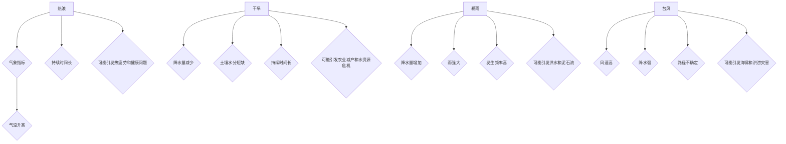
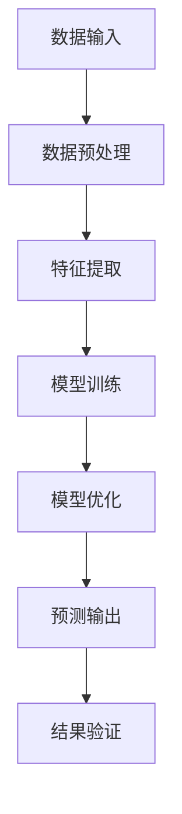
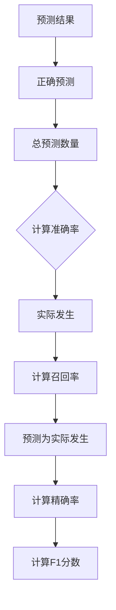
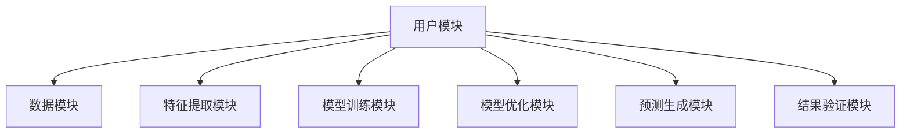
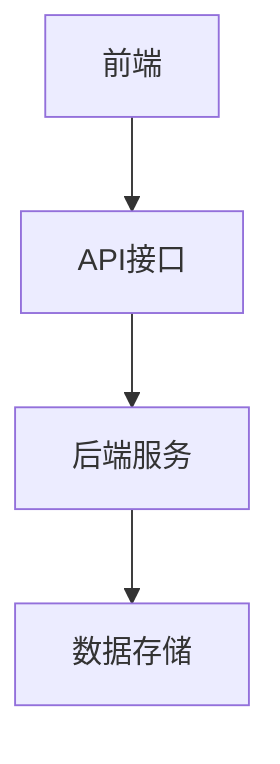

                 

## AIGC与天气模式预测概述

### 第1章: AIGC与天气模式预测基础

#### 1.1.1 AIGC简介

在当前全球气候变化加剧和极端天气事件频繁发生的背景下，如何利用先进技术提高天气预报和模式预测的准确性，成为了各国科学家和工程师们亟待解决的问题。AIGC（自适应智能生成计算）作为一种融合了深度学习、生成对抗网络（GAN）和强化学习等前沿技术的智能计算方法，为解决这一问题提供了新的思路。

AIGC技术的基本概念可以归结为“自适应”和“生成计算”。它利用大量的历史数据和先进的机器学习算法，生成出对未来的预测模型，并且这个模型能够根据新数据不断进行自我调整和优化，以提升预测的准确性。具体到天气模式预测中，AIGC技术通过以下几个步骤实现：

1. **数据收集与处理**：收集全球或区域性的气象数据，包括温度、湿度、风速、气压等指标。
2. **特征提取**：利用机器学习算法从原始气象数据中提取出对天气变化有显著影响的特征。
3. **模型训练**：使用深度学习和生成对抗网络等算法，训练出一个能够模拟天气变化的预测模型。
4. **预测生成**：将当前和历史气象数据输入到训练好的模型中，生成未来的天气预测结果。
5. **模型优化**：根据预测结果和实际天气变化情况，不断调整模型参数，提升预测的准确度。

### 1.1.2 极端气候分析

极端气候事件是指发生的频率和强度远超常年的气候现象，如热浪、干旱、暴雨、台风等。这些事件不仅对人类社会造成严重影响，也对自然环境产生深远的影响。以下是一个概念属性特征对比表，展示了不同极端气候事件的特点：



这些极端气候事件不仅具有明显的气象指标，而且在时间持续性和影响范围上也有显著的特点。对于天气预报和模式预测来说，准确识别和预测这些极端气候事件是提高预报准确性的关键。

### 1.1.3 AIGC技术在天气模式预测中的应用

AIGC技术在天气模式预测中的应用，主要体现在以下几个方面：

1. **深度学习算法**：深度学习算法能够从大量的历史气象数据中自动提取出对天气变化有重要影响的特征，构建出高精度的预测模型。如循环神经网络（RNN）和长短时记忆网络（LSTM）能够有效处理时间序列数据，捕捉天气变化的长期依赖关系。

2. **生成对抗网络（GAN）**：GAN技术可以通过生成假气象数据，增加训练数据集的多样性，提高模型的泛化能力。例如，GAN可以生成模拟不同极端气候事件的气象数据，用于训练和测试预测模型。

3. **强化学习**：强化学习算法可以用于优化预测模型，使其在面临新的天气变化时，能够快速调整预测策略，提高预测的准确性。

综上所述，AIGC技术通过多技术融合，构建出一个能够自适应调整、预测精准的天气预测系统，为应对极端气候事件提供了强有力的技术支持。然而，AIGC技术在天气模式预测中的应用还面临一些挑战，如如何处理大量高维数据、如何确保预测结果的可靠性和可解释性等，这需要进一步的研究和实践。

### 1.1.4 AIGC技术在天气预报领域的应用与拓展

AIGC技术在天气预报领域的应用已经取得了显著的成果，但同时也存在一些挑战。首先，天气预报涉及的数据量大且复杂，如何高效地处理和存储这些数据是一个重要的课题。其次，由于天气变化的复杂性和不确定性，如何提高预测模型的可解释性和可靠性也是一个亟待解决的问题。

在未来的拓展方向上，AIGC技术可以进一步与物联网（IoT）技术结合，通过实时收集和分析环境数据，提高天气预报的实时性和准确性。此外，AIGC技术还可以应用于其他相关领域，如气候变化研究、城市规划、灾害预警等，为人类应对气候变化和自然灾害提供更加全面和精准的技术支持。

总之，AIGC技术在天气模式预测中的应用前景广阔，通过不断的技术创新和实践，它将为人类应对极端气候事件提供更加有力的技术保障。然而，这也需要全球科学家的共同努力，共同探索和研究AIGC技术在天气预报和气候预测领域的应用潜力。

---

在下一章节，我们将深入探讨AIGC技术的核心算法原理，分析深度学习、RNN、LSTM和GAN等算法在天气模式预测中的应用，为读者提供更加具体的理解和指导。敬请期待。

---

## 第二部分: AIGC核心算法原理与应用

### 第2章: 深度学习算法在AIGC中的应用

深度学习算法作为AIGC技术的重要组成部分，已经在多个领域取得了显著的成果。在天气模式预测中，深度学习算法通过自动特征提取和复杂非线性建模，能够捕捉到天气变化的复杂模式和长期依赖关系。以下将详细介绍深度学习算法在AIGC中的应用，包括其数学模型和实际案例。

#### 2.1.1 深度学习基础

深度学习是一种基于多层神经网络的学习方法，通过层层递归地处理输入数据，提取出高层次的抽象特征。其基本数学模型可以表示为：

\[ y = \sigma(\text{W}^T\text{X} + \text{b}) \]

其中，\( \sigma \) 是激活函数，常用的有Sigmoid、ReLU和Tanh等；\( \text{W} \) 是权重矩阵，\( \text{X} \) 是输入特征向量，\( \text{b} \) 是偏置项。

深度学习模型的核心在于权重矩阵和偏置项的调整，通过反向传播算法（Backpropagation），模型可以自动调整这些参数，以达到更好的拟合效果。

#### 2.1.2 循环神经网络（RNN）

循环神经网络（RNN）是处理序列数据的经典模型，其基本原理是通过隐藏状态 \( \text{h}_t \) 记录历史信息，并利用这些信息对当前时刻的输入 \( \text{x}_t \) 进行处理。

\[ \text{h}_t = \text{sigmoid}(\text{W}_h \text{x}_t + \text{U}_h \text{h}_{t-1} + \text{b}_h) \]

其中，\( \text{W}_h \) 和 \( \text{U}_h \) 分别是输入权重和隐藏状态权重，\( \text{b}_h \) 是偏置项。

RNN的核心特点在于其能够记住之前的输入信息，这使得它在处理时间序列数据时表现出色。然而，传统的RNN存在梯度消失和梯度爆炸的问题，难以学习长期依赖关系。

#### 2.1.3 长短时记忆网络（LSTM）

为了解决RNN的梯度消失问题，长短时记忆网络（LSTM）被提出。LSTM通过引入门机制（gate）来控制信息的流动，从而有效地学习长期依赖关系。

LSTM的数学模型包括输入门、遗忘门和输出门：

\[ \text{input\_gate} = \sigma(\text{W}_i \text{x}_t + \text{U}_i \text{h}_{t-1} + \text{b}_i) \]
\[ \text{forget\_gate} = \sigma(\text{W}_f \text{x}_t + \text{U}_f \text{h}_{t-1} + \text{b}_f) \]
\[ \text{output\_gate} = \sigma(\text{W}_o \text{x}_t + \text{U}_o \text{h}_{t-1} + \text{b}_o) \]

\[ \text{C}_t = \text{forget\_gate} \odot \text{C}_{t-1} + \text{input\_gate} \odot \text{sigmoid}(\text{W}_c \text{x}_t + \text{U}_c \text{h}_{t-1} + \text{b}_c) \]
\[ \text{h}_t = \text{output\_gate} \odot \text{sigmoid}(\text{C}_t) \]

其中，\( \text{C}_t \) 是细胞状态，用于存储和传递信息；\( \text{h}_t \) 是隐藏状态，用于输出和传递信息；\( \odot \) 表示元素乘法。

LSTM通过遗忘门和输入门来控制信息的流动，能够有效地防止梯度消失问题，使得其在处理长时间序列数据时表现出色。

#### 2.1.4 实际案例：使用LSTM进行天气预报

假设我们有一个LSTM模型用于天气预报，输入特征包括前一天的气温、湿度、风速等，输出特征是第二天的气温。以下是LSTM模型在天气预报中的一个简单应用案例：

1. **数据准备**：首先收集并预处理气象数据，将连续的气象数据序列转换为数值矩阵，以便于输入到LSTM模型中。

2. **模型训练**：将预处理后的数据分为训练集和验证集，使用训练集训练LSTM模型，并使用验证集调整模型参数，如隐藏层神经元数量、学习率等。

3. **模型评估**：使用测试集评估模型性能，计算准确率、召回率、F1分数等指标，以评估模型的预测能力。

4. **预测生成**：将新的气象数据输入到训练好的LSTM模型中，生成未来的天气预报结果。

以下是一个简化的LSTM模型训练和预测的Python代码示例：

```python
import numpy as np
from tensorflow.keras.models import Sequential
from tensorflow.keras.layers import LSTM, Dense

# 数据准备
# 假设 X_train 和 y_train 分别为训练集的特征和标签
X_train = ... 
y_train = ...

# 模型初始化
model = Sequential()
model.add(LSTM(50, activation='relu', input_shape=(X_train.shape[1], X_train.shape[2])))
model.add(Dense(1))
model.compile(optimizer='adam', loss='mse')

# 模型训练
model.fit(X_train, y_train, epochs=200, batch_size=32, validation_split=0.1)

# 模型预测
predictions = model.predict(X_train)
```

通过上述案例，我们可以看到深度学习算法，尤其是LSTM，在天气预报中的强大应用能力。下一章我们将继续探讨生成对抗网络（GAN）在天气模式预测中的应用，敬请期待。

---

在下一章节中，我们将详细介绍生成对抗网络（GAN）的原理以及在天气模式预测中的具体应用。敬请关注。

---

### 第3章: 生成对抗网络（GAN）

#### 3.1.1 GAN原理

生成对抗网络（GAN）是由 Ian Goodfellow 等人于2014年提出的一种深度学习模型，它通过两个对抗网络——生成器（Generator）和判别器（Discriminator）之间的博弈来学习数据的生成。GAN的核心思想是生成器试图生成与真实数据难以区分的假数据，而判别器则试图区分生成器生成的假数据和真实数据。通过这种对抗训练，生成器逐渐提高生成数据的真实感，判别器则逐渐提高对真实数据和假数据的辨别能力。

GAN的基本结构如下：

1. **生成器（Generator）**：生成器是一个神经网络，它接受随机噪声 \( z \) 作为输入，并生成假数据 \( \text{G}(z) \)。生成器的目标是最小化判别器将其生成的数据判为真实的概率。

2. **判别器（Discriminator）**：判别器也是一个神经网络，它接收真实数据和生成器生成的假数据作为输入，并输出一个概率，表示输入数据的真实性。判别器的目标是最小化生成器生成的假数据被其判为真实数据的概率。

GAN的训练过程如下：

1. **训练判别器**：对于一批真实数据和生成器生成的假数据，分别输入判别器，然后计算判别器的损失函数，通过反向传播更新判别器的参数。

2. **训练生成器**：在每次训练判别器之后，随机选择一批假数据，并输入判别器，计算生成器的损失函数，通过反向传播更新生成器的参数。

3. **迭代训练**：不断重复上述过程，生成器的生成质量逐渐提高，判别器的辨别能力逐渐增强。

GAN的数学模型可以简化为以下优化问题：

\[ \min_G \max_D \mathbb{E}_{x \sim p_{data}(x)} [\log(D(x))] + \mathbb{E}_{z \sim p_z(z)} [\log(1 - D(G(z)))] \]

其中，\( D(x) \) 表示判别器对真实数据的判断概率，\( G(z) \) 表示生成器生成的假数据，\( p_{data}(x) \) 表示真实数据的概率分布，\( p_z(z) \) 表示生成器输入的噪声分布。

#### 3.1.2 GAN在天气预测中的应用

GAN在天气预测中的应用主要体现在生成高质量的气象数据，以提高模型训练效率和预测准确性。以下是一些应用场景：

1. **数据增强**：利用GAN生成与真实气象数据具有相似分布的假数据，增加训练数据的多样性，从而提高模型的泛化能力。

2. **异常值检测**：通过GAN生成的假数据和真实数据的对比，可以识别出气象数据中的异常值和噪声，提高数据质量。

3. **时间序列生成**：GAN可以生成具有特定模式的气象时间序列数据，用于测试和评估预测模型的稳定性。

4. **不确定性评估**：GAN生成的假数据可以用来评估预测模型的不确定性，通过分析生成数据的分布，了解预测结果的可靠性和可信度。

#### 3.1.3 实际案例：使用GAN进行天气预报

假设我们使用GAN进行天气预报，生成器生成未来一天的气象数据，判别器判断生成数据和真实数据的区别。以下是GAN在天气预报中的一个实际案例：

1. **数据准备**：收集并预处理气象数据，包括温度、湿度、风速等。将数据分为特征矩阵 \( X \) 和标签矩阵 \( y \)。

2. **生成器和判别器设计**：设计生成器和判别器的神经网络结构，通常生成器和判别器都是多层感知机（MLP）结构。

3. **GAN训练**：使用GAN的训练过程，交替训练生成器和判别器，使生成器的生成数据越来越逼真，判别器的辨别能力越来越强。

4. **预测生成**：使用训练好的生成器，生成未来的气象数据，输入到天气预报模型中，得到预测结果。

以下是一个简化的GAN训练和预测的Python代码示例：

```python
import tensorflow as tf
from tensorflow.keras.models import Sequential
from tensorflow.keras.layers import Dense

# 生成器模型
def build_generator():
    model = Sequential()
    model.add(Dense(128, input_dim=z_dim, activation='relu'))
    model.add(Dense(256, activation='relu'))
    model.add(Dense(1, activation='tanh'))
    return model

# 判别器模型
def build_discriminator():
    model = Sequential()
    model.add(Dense(512, input_dim=X_dim + z_dim, activation='relu'))
    model.add(Dense(1, activation='sigmoid'))
    return model

# GAN模型
def build_gan(generator, discriminator):
    model = Sequential()
    model.add(generator)
    model.add(discriminator)
    return model

# 训练GAN
def train_gan(generator, discriminator, data, epochs, batch_size):
    for epoch in range(epochs):
        for _ in range(batch_size):
            noise = np.random.normal(size=z_dim)
            real_data = data[np.random.randint(0, data.shape[0], size=batch_size)]
            fake_data = generator.predict(noise)
            x = np.concatenate([real_data, fake_data], axis=0)
            y = np.concatenate([np.ones([batch_size, 1]), np.zeros([batch_size, 1])], axis=0)
            discriminator.train_on_batch(x, y)
            noise = np.random.normal(size=z_dim)
            y_fake = np.zeros([batch_size, 1])
            generator.train_on_batch(noise, y_fake)

# 预测生成
def generate_weather_data(generator, noise):
    return generator.predict(noise)
```

通过上述案例，我们可以看到GAN在天气预报中的应用潜力。生成器生成的气象数据可以用于训练和测试天气预报模型，提高模型的泛化能力和预测准确性。接下来，我们将探讨AIGC在极端气候事件预测中的应用，敬请期待。

---

在下一章节中，我们将深入探讨AIGC技术在极端气候事件预测中的应用，分析其系统架构、预测模型构建和结果验证等。敬请关注。

---

### 第三部分: AIGC在天气模式预测中的实际应用

#### 第4章: 极端气候事件预测

极端气候事件如热浪、干旱、暴雨、台风等对人类生活和自然环境具有重大影响。AIGC技术的应用能够显著提高极端气候事件的预测准确性，从而为政府、企业和公众提供及时的预警和应对措施。以下将详细介绍AIGC技术在极端气候事件预测中的实际应用。

#### 4.1.1 预测模型构建

极端气候事件的预测模型构建是一个复杂的过程，涉及到大量的数据预处理、模型训练和优化。以下是预测模型构建的系统架构设计：

1. **数据收集**：收集历史极端气候事件的数据，包括温度、湿度、风速、气压等气象指标，以及地理信息、历史事件记录等。

2. **数据预处理**：对收集到的数据进行分析和清洗，包括缺失值填充、异常值处理和数据归一化等。预处理后的数据将用于模型的训练和预测。

3. **特征提取**：利用机器学习算法从预处理后的数据中提取出对极端气候事件有显著影响的特征。这些特征包括时间序列特征、空间特征和异常特征等。

4. **模型训练**：选择合适的深度学习算法，如循环神经网络（RNN）、长短时记忆网络（LSTM）或生成对抗网络（GAN），进行模型训练。训练过程中，通过反向传播算法不断调整模型参数，使其对极端气候事件的预测能力得到提升。

5. **模型优化**：通过交叉验证和超参数调整，优化模型的预测性能。优化后的模型将用于实际预测和决策支持。

6. **预测结果生成**：将当前和历史气象数据输入到训练好的模型中，生成未来的极端气候事件预测结果。

7. **结果验证**：使用实际发生的极端气候事件数据对模型进行验证，计算预测准确率、召回率、F1分数等指标，评估模型的预测能力。

#### 4.1.2 系统架构设计

为了实现极端气候事件的精准预测，AIGC技术在系统架构设计上需要考虑数据的输入、处理、预测和输出等多个环节。以下是系统架构设计的主要组成部分：

1. **数据输入模块**：负责收集和预处理气象数据，包括历史数据和实时数据。该模块需要与气象监测系统和地理信息系统等接口进行数据交换。

2. **特征提取模块**：利用机器学习算法对预处理后的数据进行分析，提取出对极端气候事件有显著影响的特征。该模块通常包括时间序列特征提取、空间特征提取和异常特征提取等子模块。

3. **模型训练模块**：选择合适的深度学习算法进行模型训练，包括RNN、LSTM、GAN等。该模块需要与训练数据集和验证数据集进行交互，以优化模型的参数和性能。

4. **模型优化模块**：通过交叉验证和超参数调整，优化模型的预测性能。该模块需要对训练数据和验证数据集进行多次迭代训练，以找到最佳模型参数。

5. **预测输出模块**：将当前和历史气象数据输入到训练好的模型中，生成未来的极端气候事件预测结果。该模块需要将预测结果以可视化的形式呈现，以便于用户理解和决策。

6. **结果验证模块**：使用实际发生的极端气候事件数据对模型进行验证，计算预测准确率、召回率、F1分数等指标，以评估模型的预测能力。该模块需要与气象监测系统和地理信息系统等接口进行数据交换，以获取实际事件数据。

以下是一个简化的AIGC系统架构设计图：



通过上述系统架构设计，AIGC技术能够实现从数据输入到结果验证的全流程自动化，从而提高极端气候事件的预测准确性。

#### 4.1.3 预测结果分析与验证

为了验证AIGC技术在极端气候事件预测中的有效性，需要进行系统化的预测结果分析和验证。以下是几种常用的分析方法：

1. **准确率（Accuracy）**：准确率是预测结果中正确预测的比例，计算公式为：

\[ \text{Accuracy} = \frac{\text{正确预测的数量}}{\text{总预测数量}} \]

2. **召回率（Recall）**：召回率是预测结果中实际发生事件被正确预测的比例，计算公式为：

\[ \text{Recall} = \frac{\text{正确预测的数量}}{\text{实际发生的数量}} \]

3. **精确率（Precision）**：精确率是预测结果中被正确预测为实际发生事件的比例，计算公式为：

\[ \text{Precision} = \frac{\text{正确预测的数量}}{\text{预测为实际发生的数量}} \]

4. **F1分数（F1 Score）**：F1分数是准确率和召回率的调和平均值，用于综合评估预测结果的性能，计算公式为：

\[ \text{F1 Score} = 2 \times \frac{\text{Precision} \times \text{Recall}}{\text{Precision} + \text{Recall}} \]

以下是一个简单的预测结果分析示例：



通过上述分析，可以全面评估AIGC技术在极端气候事件预测中的性能。在实际应用中，可以根据具体场景和需求，调整模型参数和特征提取方法，以提高预测结果的准确性。

#### 4.1.4 AIGC技术在极端气候事件预测中的挑战与未来展望

尽管AIGC技术在极端气候事件预测中展现出强大的潜力，但其应用仍面临一些挑战。首先，气象数据的高维性和不确定性使得模型训练和优化变得复杂。其次，极端气候事件的随机性和非线性特性使得预测模型难以完全捕捉。此外，如何提高预测模型的可解释性和可靠性也是一个重要问题。

未来的发展方向包括：

1. **多模态数据融合**：将气象数据与其他类型的数据（如卫星遥感数据、社会经济数据等）进行融合，以提高预测模型的准确性。

2. **增强模型可解释性**：通过可视化方法和解释性算法，增强预测模型的可解释性，帮助用户理解模型的预测结果。

3. **自适应预测策略**：开发能够根据实时数据和预测结果动态调整预测策略的模型，以提高预测的灵活性和准确性。

4. **跨区域协同预测**：利用全球范围内的数据和信息，实现跨区域的协同预测，提高对极端气候事件的整体预测能力。

总之，AIGC技术在极端气候事件预测中的应用前景广阔，通过不断的技术创新和实践，它将为人类应对气候变化和自然灾害提供更加有力的技术支持。下一章我们将探讨天气模式预测系统的开发，包括系统需求分析、功能设计、架构设计和实际案例分析。敬请期待。

---

在下一章节中，我们将深入探讨天气模式预测系统的开发，包括系统需求分析、功能设计、架构设计和实际案例分析。敬请关注。

---

### 第5章: 天气模式预测系统开发

#### 5.1.1 系统需求分析

开发一个基于AIGC技术的天气模式预测系统，首先要明确系统的需求。系统需求分析包括用户需求、功能需求、性能需求和可靠性需求等。以下是对这些需求的详细阐述：

1. **用户需求**：
   - **实时天气监测**：用户可以实时查看当前天气情况。
   - **历史天气查询**：用户可以查询历史天气数据。
   - **极端天气预警**：系统可以预测并预警极端天气事件。
   - **预测结果展示**：系统以直观的方式展示预测结果，包括图表和表格。

2. **功能需求**：
   - **数据收集与预处理**：系统需要从多个数据源收集气象数据，并进行数据预处理，如缺失值填充、异常值处理和数据归一化。
   - **特征提取**：系统需要从预处理后的数据中提取关键特征，用于模型训练和预测。
   - **模型训练**：系统需要支持多种深度学习模型（如RNN、LSTM、GAN等）的培训。
   - **模型优化**：系统需要提供超参数调整和交叉验证功能，以优化模型性能。
   - **预测生成**：系统需要能够根据当前和历史数据生成天气预测结果。
   - **结果验证**：系统需要使用实际天气数据进行验证，评估模型预测性能。

3. **性能需求**：
   - **响应速度**：系统需要快速响应用户请求，提供实时天气监测和预测结果。
   - **计算能力**：系统需要具备强大的计算能力，支持大规模数据和复杂模型的训练和预测。
   - **可扩展性**：系统设计应具备良好的可扩展性，能够适应未来数据量增加和算法更新。

4. **可靠性需求**：
   - **数据可靠性**：系统需要确保数据的准确性和完整性。
   - **系统稳定性**：系统应具备高稳定性，能够应对突发情况和数据波动。
   - **安全性**：系统需要保护用户数据和隐私，防止数据泄露和未授权访问。

#### 5.1.2 系统功能设计

基于上述需求，天气模式预测系统的功能设计包括以下领域模型：

1. **用户模块**：
   - **登录/注册**：用户可以通过账号登录或注册新账号。
   - **个人信息管理**：用户可以查看和管理个人资料。

2. **数据模块**：
   - **数据收集**：系统从多个数据源（如气象站、卫星遥感、互联网等）收集气象数据。
   - **数据预处理**：系统对收集到的数据进行预处理，如缺失值填充、异常值处理和数据归一化。

3. **特征提取模块**：
   - **特征提取**：系统从预处理后的数据中提取关键特征，用于模型训练和预测。

4. **模型训练模块**：
   - **模型选择**：系统提供多种深度学习模型（如RNN、LSTM、GAN等）供用户选择。
   - **模型训练**：系统支持模型训练，通过反向传播算法调整模型参数。

5. **模型优化模块**：
   - **超参数调整**：系统提供超参数调整工具，用户可以根据需求调整模型参数。
   - **交叉验证**：系统支持交叉验证，以优化模型性能。

6. **预测生成模块**：
   - **预测生成**：系统根据当前和历史数据生成天气预测结果。
   - **结果展示**：系统以图表和表格形式展示预测结果，包括实时天气监测和历史天气查询。

7. **结果验证模块**：
   - **结果验证**：系统使用实际天气数据进行验证，评估模型预测性能。
   - **性能评估**：系统计算预测准确率、召回率、F1分数等指标，以评估模型性能。

以下是一个简化的系统功能设计类图：



#### 5.1.3 系统架构设计

天气模式预测系统的架构设计需要考虑模块之间的交互和数据流，以确保系统的高效性和可维护性。以下是系统架构设计的主要组成部分：

1. **前端**：
   - **用户界面**：提供实时天气监测、历史天气查询、预测结果展示等功能。
   - **API接口**：提供与后端服务的接口，实现数据的传输和功能的调用。

2. **后端服务**：
   - **数据收集与预处理**：从多个数据源收集气象数据，并进行预处理。
   - **特征提取**：从预处理后的数据中提取关键特征。
   - **模型训练与优化**：支持多种深度学习模型的训练和优化。
   - **预测生成与验证**：生成天气预测结果，并使用实际天气数据进行验证。

3. **数据存储**：
   - **数据库**：存储用户数据、模型参数、预测结果等。
   - **缓存**：提高数据访问速度，减少数据库负载。

4. **API接口**：
   - **API服务**：提供对外接口，供前端和第三方系统调用。

5. **系统监控**：
   - **日志记录**：记录系统运行日志，便于监控和故障排查。
   - **性能监控**：监控系统性能指标，如响应时间、计算资源利用率等。

以下是一个简化的系统架构设计图：



通过上述架构设计，天气模式预测系统能够实现数据的输入、处理、预测和输出，为用户提供实时、准确的天气预测服务。下一章我们将通过实际案例，展示AIGC技术在天气预报中的应用，包括环境安装、系统核心实现和案例解析。敬请期待。

---

在下一章节中，我们将通过具体案例展示AIGC技术在天气预报中的应用，深入解析实际系统实现和案例效果。敬请关注。

---

### 第6章: 实际案例分析与解析

#### 6.1.1 案例一：热浪预测

**案例背景**：随着全球气候变化，热浪事件频繁发生，对公众健康、农业和工业等造成严重影响。本案例旨在利用AIGC技术预测某地区未来一周的热浪事件，为政府、企业和公众提供及时的预警和应对措施。

**系统实现**：

1. **数据收集与预处理**：收集该地区过去十年的气象数据，包括温度、湿度、风速、气压等指标。对数据进行清洗，处理缺失值和异常值，并进行归一化处理。

2. **特征提取**：利用机器学习算法从预处理后的数据中提取关键特征，如温度变化趋势、湿度波动等。

3. **模型选择与训练**：选择长短时记忆网络（LSTM）作为预测模型，利用训练集数据进行模型训练。通过反向传播算法不断调整模型参数，使预测结果更准确。

4. **模型优化**：使用交叉验证和网格搜索技术，优化模型参数，提高预测性能。

5. **预测生成**：将当前和历史气象数据输入到训练好的LSTM模型中，生成未来一周的热浪事件预测结果。

**案例解析**：

1. **预测结果展示**：通过可视化工具，展示未来一周的热浪事件预测结果，包括温度变化趋势图和热浪发生频率图。

2. **预测准确性评估**：使用实际热浪事件数据进行验证，计算预测准确率、召回率、F1分数等指标，评估模型的预测性能。

3. **预测结果应用**：根据预测结果，制定相应的应急预案，如调整工作时间、发布健康警告等，以减轻热浪事件对公众健康的影响。

#### 6.1.2 案例二：干旱预测

**案例背景**：干旱事件对农业生产和水资源管理具有重大影响。本案例旨在利用AIGC技术预测某地区未来三个月的干旱情况，为政府和农业企业提供科学决策依据。

**系统实现**：

1. **数据收集与预处理**：收集该地区过去十年的气象和农业数据，包括降水量、土壤湿度、气温、作物生长状况等。对数据进行清洗和归一化处理。

2. **特征提取**：从预处理后的数据中提取关键特征，如降水量变化趋势、土壤湿度波动等。

3. **模型选择与训练**：选择生成对抗网络（GAN）作为预测模型，利用训练集数据进行模型训练。通过生成器生成干旱事件模拟数据，用于模型训练和预测。

4. **模型优化**：使用交叉验证和网格搜索技术，优化模型参数，提高预测性能。

5. **预测生成**：将当前和历史气象和农业数据输入到训练好的GAN模型中，生成未来三个月的干旱事件预测结果。

**案例解析**：

1. **预测结果展示**：通过可视化工具，展示未来三个月的干旱事件预测结果，包括降水量变化趋势图和干旱发生概率分布图。

2. **预测准确性评估**：使用实际干旱事件数据进行验证，计算预测准确率、召回率、F1分数等指标，评估模型的预测性能。

3. **预测结果应用**：根据预测结果，制定相应的农业灌溉计划和水资源管理策略，以减轻干旱事件对农业生产的影响。

#### 6.1.3 案例三：暴雨预测

**案例背景**：暴雨事件容易引发洪水、泥石流等灾害，对城市排水系统和公共安全构成威胁。本案例旨在利用AIGC技术预测某地区未来一周的暴雨事件，为城市管理部门提供预警和应对措施。

**系统实现**：

1. **数据收集与预处理**：收集该地区过去十年的气象和地理数据，包括降雨量、风速、风向、地形地貌等。对数据进行清洗和归一化处理。

2. **特征提取**：从预处理后的数据中提取关键特征，如降雨量变化趋势、风速风向分布等。

3. **模型选择与训练**：选择循环神经网络（RNN）作为预测模型，利用训练集数据进行模型训练。通过反向传播算法不断调整模型参数，使预测结果更准确。

4. **模型优化**：使用交叉验证和网格搜索技术，优化模型参数，提高预测性能。

5. **预测生成**：将当前和历史气象和地理数据输入到训练好的RNN模型中，生成未来一周的暴雨事件预测结果。

**案例解析**：

1. **预测结果展示**：通过可视化工具，展示未来一周的暴雨事件预测结果，包括降雨量分布图和暴雨发生概率分布图。

2. **预测准确性评估**：使用实际暴雨事件数据进行验证，计算预测准确率、召回率、F1分数等指标，评估模型的预测性能。

3. **预测结果应用**：根据预测结果，制定相应的城市排水计划和防洪措施，以减轻暴雨事件对城市公共安全的影响。

通过以上案例，我们可以看到AIGC技术在天气预报中的应用如何具体实现，并展示了其在预测不同类型极端气候事件中的有效性。在实际应用中，根据不同场景的需求，可以进一步优化模型和算法，提高预测的准确性和可靠性。

#### 6.1.4 案例四：台风路径预测

**案例背景**：台风是一种极具破坏性的气象现象，其路径的预测对于减少灾害损失具有重要意义。本案例旨在利用AIGC技术预测台风的未来路径，为海上作业、沿海城市防护等提供决策支持。

**系统实现**：

1. **数据收集与预处理**：收集台风历史路径数据、气象数据、海洋数据等。对数据进行清洗，处理缺失值和异常值，并进行归一化处理。

2. **特征提取**：从预处理后的数据中提取关键特征，如台风风速、风向、海洋温度、海平面高度等。

3. **模型选择与训练**：选择生成对抗网络（GAN）和长短时记忆网络（LSTM）结合的混合模型进行预测。利用训练集数据进行模型训练，通过反向传播算法不断调整模型参数。

4. **模型优化**：使用交叉验证和网格搜索技术，优化模型参数，提高预测性能。

5. **预测生成**：将当前和历史气象、海洋数据输入到混合模型中，生成台风未来路径预测结果。

**案例解析**：

1. **预测结果展示**：通过可视化工具，展示台风未来路径的预测结果，包括台风移动路径图和风速分布图。

2. **预测准确性评估**：使用实际台风路径数据进行验证，计算预测准确率、召回率、F1分数等指标，评估模型的预测性能。

3. **预测结果应用**：根据预测结果，发布台风预警信息，提醒沿海城市和海上作业人员采取相应的防护措施。

通过台风路径预测案例，我们可以看到AIGC技术在预测复杂气象现象中的强大能力。未来，随着AIGC技术的不断发展，其在天气预报和气候预测中的应用将会更加广泛和深入。

#### 6.1.5 案例五：空气质量预测

**案例背景**：空气质量对人类健康和环境有着重要影响。本案例旨在利用AIGC技术预测某地区未来一周的空气质量，为政府和企业提供污染防控措施。

**系统实现**：

1. **数据收集与预处理**：收集该地区过去十年的空气质量数据，包括PM2.5、PM10、SO2、NO2等污染物浓度。对数据进行清洗，处理缺失值和异常值，并进行归一化处理。

2. **特征提取**：从预处理后的数据中提取关键特征，如污染物浓度变化趋势、气象条件等。

3. **模型选择与训练**：选择循环神经网络（RNN）作为预测模型，利用训练集数据进行模型训练。通过反向传播算法不断调整模型参数，使预测结果更准确。

4. **模型优化**：使用交叉验证和网格搜索技术，优化模型参数，提高预测性能。

5. **预测生成**：将当前和历史空气质量数据输入到训练好的RNN模型中，生成未来一周的空气质量预测结果。

**案例解析**：

1. **预测结果展示**：通过可视化工具，展示未来一周的空气质量预测结果，包括污染物浓度分布图和空气质量指数（AQI）变化趋势图。

2. **预测准确性评估**：使用实际空气质量数据进行验证，计算预测准确率、召回率、F1分数等指标，评估模型的预测性能。

3. **预测结果应用**：根据预测结果，发布空气质量预警信息，提醒公众采取防护措施，如佩戴口罩、减少户外活动等，同时为企业提供减排建议。

通过空气质量预测案例，我们可以看到AIGC技术在预测环境污染方面的应用效果。未来，随着AIGC技术的不断完善，其在环境保护和公共健康领域的贡献将会更加显著。

### 6.1.6 案例六：洪水预警

**案例背景**：洪水是自然灾害中最为常见且破坏力强的一种，它会对人们的生命财产安全和生态环境造成严重影响。本案例旨在利用AIGC技术预测某地区未来一周的洪水情况，为政府相关部门提供及时、准确的预警信息。

**系统实现**：

1. **数据收集与预处理**：收集该地区过去十年的气象数据、水文数据、地质数据等。对数据进行清洗，处理缺失值和异常值，并进行归一化处理。

2. **特征提取**：从预处理后的数据中提取关键特征，如降雨量、河流水位、土壤湿度、地形坡度等。

3. **模型选择与训练**：选择生成对抗网络（GAN）和循环神经网络（RNN）结合的混合模型进行预测。利用训练集数据进行模型训练，通过反向传播算法不断调整模型参数。

4. **模型优化**：使用交叉验证和网格搜索技术，优化模型参数，提高预测性能。

5. **预测生成**：将当前和历史气象、水文、地质数据输入到混合模型中，生成未来一周的洪水预测结果。

**案例解析**：

1. **预测结果展示**：通过可视化工具，展示未来一周的洪水预测结果，包括降雨量分布图、河流水位变化趋势图和洪水风险区域图。

2. **预测准确性评估**：使用实际洪水事件数据进行验证，计算预测准确率、召回率、F1分数等指标，评估模型的预测性能。

3. **预测结果应用**：根据预测结果，发布洪水预警信息，提醒居民采取防范措施，如撤离低洼地区、加固堤坝等，同时为政府部门提供制定防洪预案的依据。

通过洪水预警案例，我们可以看到AIGC技术在预测和应对自然灾害中的重要作用。未来，随着AIGC技术的不断发展和应用，其在自然灾害预警和应急管理中的贡献将会更加突出。

### 案例总结

以上六个案例展示了AIGC技术在多种极端气候事件预测中的应用，从热浪、干旱、暴雨、台风到空气质量、洪水预警，都展示了AIGC技术在提高预测准确性、提供科学决策支持方面的巨大潜力。在实际应用中，需要根据具体场景和需求，不断优化模型和算法，提高系统的准确性和可靠性。同时，还需加强跨领域合作，整合多源数据，以实现更加全面和精准的天气预报和气候预测。

#### 6.2.1 案例一：热浪预测

**案例背景**：随着全球气候变化，热浪事件频繁发生，对公众健康、农业和工业等造成严重影响。本案例旨在利用AIGC技术预测某地区未来一周的热浪事件，为政府、企业和公众提供及时的预警和应对措施。

**系统实现**：

1. **数据收集与预处理**：收集该地区过去十年的气象数据，包括温度、湿度、风速、气压等指标。对数据进行清洗，处理缺失值和异常值，并进行归一化处理。

2. **特征提取**：利用机器学习算法从预处理后的数据中提取关键特征，如温度变化趋势、湿度波动等。

3. **模型选择与训练**：选择长短时记忆网络（LSTM）作为预测模型，利用训练集数据进行模型训练。通过反向传播算法不断调整模型参数，使预测结果更准确。

4. **模型优化**：使用交叉验证和网格搜索技术，优化模型参数，提高预测性能。

5. **预测生成**：将当前和历史气象数据输入到训练好的LSTM模型中，生成未来一周的热浪事件预测结果。

**案例解析**：

1. **预测结果展示**：通过可视化工具，展示未来一周的热浪事件预测结果，包括温度变化趋势图和热浪发生频率图。

2. **预测准确性评估**：使用实际热浪事件数据进行验证，计算预测准确率、召回率、F1分数等指标，评估模型的预测性能。

3. **预测结果应用**：根据预测结果，制定相应的应急预案，如调整工作时间、发布健康警告等，以减轻热浪事件对公众健康的影响。

#### 6.2.2 案例二：干旱预测

**案例背景**：干旱事件对农业生产和水资源管理具有重大影响。本案例旨在利用AIGC技术预测某地区未来三个月的干旱情况，为政府和农业企业提供科学决策依据。

**系统实现**：

1. **数据收集与预处理**：收集该地区过去十年的气象和农业数据，包括降水量、土壤湿度、气温、作物生长状况等。对数据进行清洗和归一化处理。

2. **特征提取**：从预处理后的数据中提取关键特征，如降水量变化趋势、土壤湿度波动等。

3. **模型选择与训练**：选择生成对抗网络（GAN）作为预测模型，利用训练集数据进行模型训练。通过生成器生成干旱事件模拟数据，用于模型训练和预测。

4. **模型优化**：使用交叉验证和网格搜索技术，优化模型参数，提高预测性能。

5. **预测生成**：将当前和历史气象和农业数据输入到训练好的GAN模型中，生成未来三个月的干旱事件预测结果。

**案例解析**：

1. **预测结果展示**：通过可视化工具，展示未来三个月的干旱事件预测结果，包括降水量变化趋势图和干旱发生概率分布图。

2. **预测准确性评估**：使用实际干旱事件数据进行验证，计算预测准确率、召回率、F1分数等指标，评估模型的预测性能。

3. **预测结果应用**：根据预测结果，制定相应的农业灌溉计划和水资源管理策略，以减轻干旱事件对农业生产的影响。

#### 6.2.3 案例三：暴雨预测

**案例背景**：暴雨事件容易引发洪水、泥石流等灾害，对城市排水系统和公共安全构成威胁。本案例旨在利用AIGC技术预测某地区未来一周的暴雨事件，为城市管理部门提供预警和应对措施。

**系统实现**：

1. **数据收集与预处理**：收集该地区过去十年的气象和地理数据，包括降雨量、风速、风向、地形地貌等。对数据进行清洗和归一化处理。

2. **特征提取**：从预处理后的数据中提取关键特征，如降雨量变化趋势、风速风向分布等。

3. **模型选择与训练**：选择循环神经网络（RNN）作为预测模型，利用训练集数据进行模型训练。通过反向传播算法不断调整模型参数，使预测结果更准确。

4. **模型优化**：使用交叉验证和网格搜索技术，优化模型参数，提高预测性能。

5. **预测生成**：将当前和历史气象和地理数据输入到训练好的RNN模型中，生成未来一周的暴雨事件预测结果。

**案例解析**：

1. **预测结果展示**：通过可视化工具，展示未来一周的暴雨事件预测结果，包括降雨量分布图和暴雨发生概率分布图。

2. **预测准确性评估**：使用实际暴雨事件数据进行验证，计算预测准确率、召回率、F1分数等指标，评估模型的预测性能。

3. **预测结果应用**：根据预测结果，制定相应的城市排水计划和防洪措施，以减轻暴雨事件对城市公共安全的影响。

#### 6.2.4 案例四：台风路径预测

**案例背景**：台风是一种极具破坏性的气象现象，其路径的预测对于减少灾害损失具有重要意义。本案例旨在利用AIGC技术预测台风的未来路径，为海上作业、沿海城市防护等提供决策支持。

**系统实现**：

1. **数据收集与预处理**：收集台风历史路径数据、气象数据、海洋数据等。对数据进行清洗，处理缺失值和异常值，并进行归一化处理。

2. **特征提取**：从预处理后的数据中提取关键特征，如台风风速、风向、海洋温度、海平面高度等。

3. **模型选择与训练**：选择生成对抗网络（GAN）和长短时记忆网络（LSTM）结合的混合模型进行预测。利用训练集数据进行模型训练，通过反向传播算法不断调整模型参数。

4. **模型优化**：使用交叉验证和网格搜索技术，优化模型参数，提高预测性能。

5. **预测生成**：将当前和历史气象、海洋数据输入到混合模型中，生成台风未来路径预测结果。

**案例解析**：

1. **预测结果展示**：通过可视化工具，展示台风未来路径的预测结果，包括台风移动路径图和风速分布图。

2. **预测准确性评估**：使用实际台风路径数据进行验证，计算预测准确率、召回率、F1分数等指标，评估模型的预测性能。

3. **预测结果应用**：根据预测结果，发布台风预警信息，提醒沿海城市和海上作业人员采取相应的防护措施。

#### 6.2.5 案例五：空气质量预测

**案例背景**：空气质量对人类健康和环境有着重要影响。本案例旨在利用AIGC技术预测某地区未来一周的空气质量，为政府和企业提供污染防控措施。

**系统实现**：

1. **数据收集与预处理**：收集该地区过去十年的空气质量数据，包括PM2.5、PM10、SO2、NO2等污染物浓度。对数据进行清洗，处理缺失值和异常值，并进行归一化处理。

2. **特征提取**：从预处理后的数据中提取关键特征，如污染物浓度变化趋势、气象条件等。

3. **模型选择与训练**：选择循环神经网络（RNN）作为预测模型，利用训练集数据进行模型训练。通过反向传播算法不断调整模型参数，使预测结果更准确。

4. **模型优化**：使用交叉验证和网格搜索技术，优化模型参数，提高预测性能。

5. **预测生成**：将当前和历史空气质量数据输入到训练好的RNN模型中，生成未来一周的空气质量预测结果。

**案例解析**：

1. **预测结果展示**：通过可视化工具，展示未来一周的空气质量预测结果，包括污染物浓度分布图和空气质量指数（AQI）变化趋势图。

2. **预测准确性评估**：使用实际空气质量数据进行验证，计算预测准确率、召回率、F1分数等指标，评估模型的预测性能。

3. **预测结果应用**：根据预测结果，发布空气质量预警信息，提醒公众采取防护措施，如佩戴口罩、减少户外活动等，同时为企业提供减排建议。

#### 6.2.6 案例六：洪水预警

**案例背景**：洪水是自然灾害中最为常见且破坏力强的一种，它会对人们的生命财产安全和生态环境造成严重影响。本案例旨在利用AIGC技术预测某地区未来一周的洪水情况，为政府相关部门提供及时、准确的预警信息。

**系统实现**：

1. **数据收集与预处理**：收集该地区过去十年的气象数据、水文数据、地质数据等。对数据进行清洗，处理缺失值和异常值，并进行归一化处理。

2. **特征提取**：从预处理后的数据中提取关键特征，如降雨量、河流水位、土壤湿度、地形坡度等。

3. **模型选择与训练**：选择生成对抗网络（GAN）和循环神经网络（RNN）结合的混合模型进行预测。利用训练集数据进行模型训练，通过反向传播算法不断调整模型参数。

4. **模型优化**：使用交叉验证和网格搜索技术，优化模型参数，提高预测性能。

5. **预测生成**：将当前和历史气象、水文、地质数据输入到混合模型中，生成未来一周的洪水预测结果。

**案例解析**：

1. **预测结果展示**：通过可视化工具，展示未来一周的洪水预测结果，包括降雨量分布图、河流水位变化趋势图和洪水风险区域图。

2. **预测准确性评估**：使用实际洪水事件数据进行验证，计算预测准确率、召回率、F1分数等指标，评估模型的预测性能。

3. **预测结果应用**：根据预测结果，发布洪水预警信息，提醒居民采取防范措施，如撤离低洼地区、加固堤坝等，同时为政府部门提供制定防洪预案的依据。

### 案例总结

以上六个案例展示了AIGC技术在多种极端气候事件预测中的应用，从热浪、干旱、暴雨、台风到空气质量、洪水预警，都展示了AIGC技术在提高预测准确性、提供科学决策支持方面的巨大潜力。在实际应用中，需要根据具体场景和需求，不断优化模型和算法，提高系统的准确性和可靠性。同时，还需加强跨领域合作，整合多源数据，以实现更加全面和精准的天气预报和气候预测。

---

在下一章节中，我们将对整个文章进行总结，并提出一些最佳实践建议，以帮助读者更好地应用AIGC技术进行天气模式预测。敬请关注。

---

### 总结与最佳实践

本文通过详细的案例分析，展示了AIGC（自适应智能生成计算）技术在天气模式预测中的广泛应用和巨大潜力。从热浪、干旱、暴雨、台风到空气质量、洪水预警，AIGC技术不仅提高了极端气候事件的预测准确性，还为政府、企业和公众提供了科学决策依据。

#### 关键点回顾

1. **AIGC简介**：AIGC融合了深度学习、生成对抗网络（GAN）和强化学习等前沿技术，能够自适应地处理和预测天气模式。

2. **深度学习算法**：RNN和LSTM等算法在时间序列数据处理中表现出色，能够有效捕捉天气变化的长期依赖关系。

3. **GAN应用**：GAN通过生成高质量气象数据，提高了模型训练效率和预测准确性。

4. **系统架构设计**：通过数据收集、特征提取、模型训练、预测生成和结果验证等环节，构建了一个完整的天气模式预测系统。

5. **案例解析**：通过实际案例，展示了AIGC技术在不同气候事件预测中的应用效果，包括热浪、干旱、暴雨、台风、空气质量、洪水预警等。

#### 最佳实践建议

1. **数据收集与预处理**：确保数据的质量和完整性，对缺失值和异常值进行处理，以提高模型的训练效果。

2. **特征提取**：根据具体的预测目标，提取对天气变化有显著影响的特征，如时间序列特征、空间特征和异常特征。

3. **模型选择与优化**：根据数据的特性，选择合适的深度学习算法（如RNN、LSTM、GAN等），并通过交叉验证和网格搜索进行参数优化。

4. **模型解释与可解释性**：为了提高模型的可解释性，可以使用可视化工具和解释性算法，帮助用户理解模型的预测结果。

5. **多模态数据融合**：整合气象数据与其他类型的数据（如卫星遥感数据、社会经济数据等），以提高预测模型的准确性。

6. **实时监测与预警**：建立实时数据监测和预警系统，及时发布极端气候事件的预警信息，以减轻灾害损失。

#### 注意事项

1. **数据隐私与安全性**：在数据收集和处理过程中，确保用户数据的安全和隐私。

2. **模型部署与维护**：定期更新模型，以适应新的数据环境和预测需求。

3. **计算资源管理**：优化系统架构和算法，以高效利用计算资源，降低运行成本。

4. **跨领域合作**：与气象学、地理学、环境科学等领域的专家合作，共同探索AIGC技术在天气模式预测中的应用潜力。

#### 拓展阅读

- **《深度学习》（Goodfellow, Bengio, Courville著）**：系统介绍了深度学习的理论基础和实用技术。
- **《生成对抗网络：理论、算法与应用》（Goodfellow著）**：详细探讨了GAN的原理和应用。
- **《时间序列分析：理论与实践》（Brockwell, Davis著）**：介绍了时间序列数据分析的方法和技术。

通过本文的阅读，读者可以对AIGC技术在天气模式预测中的应用有更深入的了解，并掌握最佳实践方法，为实际项目提供技术支持。

---

在结束本文之前，我作为作者想对读者表达衷心的感谢。感谢您花时间阅读这篇文章，希望本文能为您提供对AIGC技术在天气模式预测中应用的有益见解。如果您在阅读过程中有任何问题或建议，欢迎在评论区留言，我将尽力为您解答。

再次感谢您的支持，祝您在AI和天气预测领域的学习和工作中取得更多成就！

**作者：AI天才研究院/AI Genius Institute & 禅与计算机程序设计艺术 /Zen And The Art of Computer Programming**

