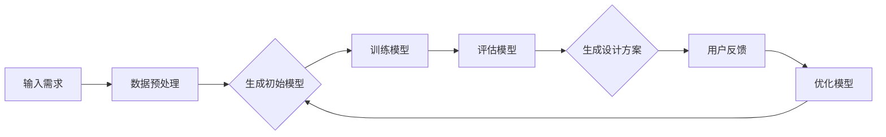
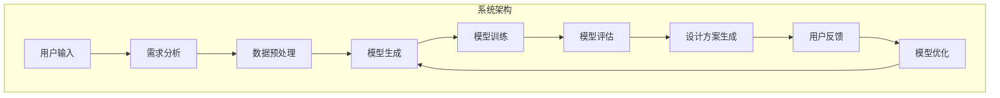
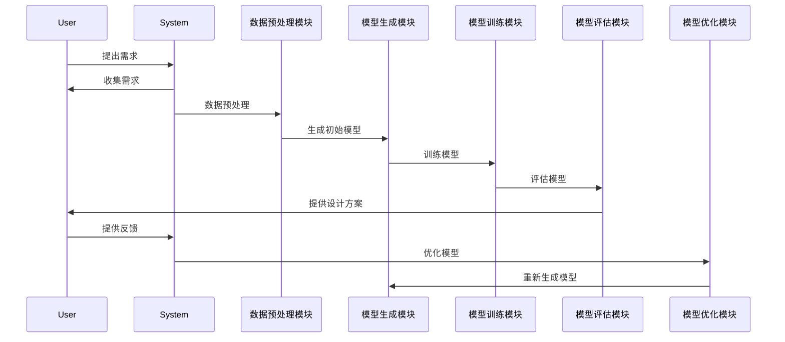

                 

# AIGC在建筑设计中的应用：提示词的空间感

> 关键词：AIGC，建筑设计，提示词，空间感，算法，架构设计

> 摘要：本文将探讨人工智能生成内容（AIGC）在建筑设计领域的应用，特别是提示词如何影响建筑设计中的空间感。我们将通过逐步分析AIGC的基本概念、算法原理，以及其在建筑设计的实际应用，来展示AIGC如何改变传统建筑设计流程，提高设计效率和创意水平。

## 第一部分：背景介绍

### 1. 引言

近年来，人工智能（AI）技术的飞速发展已经深刻影响了各行各业，其中建筑设计领域也不例外。人工智能生成内容（AIGC，AI-Generated Content）作为AI的一个重要分支，正逐渐成为设计师们的新工具。AIGC通过学习大量数据，能够自动生成文本、图像、音频、视频等多种类型的内容。在建筑设计中，AIGC的应用不仅能够提高设计效率，还能通过智能化的设计生成过程，提供独特的空间体验。

### 1.1 问题背景

建筑设计的核心在于创造空间，而空间感是建筑设计中最难把握的要素之一。传统的建筑设计依赖于设计师的经验和直觉，这种方法的局限性在于设计结果往往受到设计师个人经验的限制。随着建筑设计项目的复杂性和规模不断扩大，传统的设计方法已经无法满足快速变化的市场需求。

### 1.2 问题描述

在建筑设计中，空间感的把握不仅涉及到美学和功能，还涉及到物理、心理和社会等多个维度。如何通过技术手段，特别是在AIGC的支持下，更准确地捕捉和呈现空间感，成为当前研究的一个重要课题。

### 1.3 问题解决

AIGC技术的出现为解决上述问题提供了一种新的思路。通过AIGC，设计师可以不再仅依赖个人的直觉和经验，而是利用算法来模拟和优化空间感。提示词作为AIGC的关键输入，能够引导算法生成符合预期空间感的建筑设计方案。

### 1.4 边界与外延

AIGC在建筑设计中的应用不仅限于空间感的模拟，还可以扩展到材料选择、结构优化、能耗分析等多个方面。本文主要关注AIGC如何通过提示词来影响建筑设计中的空间感。

### 1.5 概念结构与核心要素组成

在深入探讨AIGC在建筑设计中的应用之前，我们需要了解AIGC的基本概念、核心特点以及与传统生成内容（GC）的对比。这些构成了AIGC在建筑设计中应用的基础。

## 第二部分：核心概念与联系

### 2. 核心概念原理

#### 2.1 AIGC的概念与定义

AIGC（Artificial Intelligence Generated Content）是指通过人工智能技术自动生成文本、图像、音频、视频等内容的过程。与传统的手工创作不同，AIGC依赖于机器学习、深度学习等AI技术，通过大量的训练数据和先进的算法模型来生成内容。

#### 2.1.1 AIGC的定义

AIGC是一种利用人工智能技术自动生成内容和数据的方法，其核心在于自动化和智能化。通过深度学习模型，AIGC可以模拟人类的创造过程，生成具有高度创意和个性化的内容。

#### 2.1.2 AIGC的核心特点

AIGC具有以下几个核心特点：

1. **自适应性**：AIGC可以根据不同的需求和场景进行自适应调整，提高内容的精准度和实用性。
2. **创造性**：AIGC可以生成新颖、独特的内容，超越人类创造力的限制。
3. **实时性**：AIGC能够在短时间内生成大量内容，满足实时数据处理的需求。
4. **数据依赖性**：AIGC的性能高度依赖于训练数据的质量和数量，高质量的数据可以显著提升生成内容的质量。

#### 2.1.3 AIGC与传统GC的对比

传统GC（Generated Content）主要依赖于规则和模板，生成的内容往往缺乏灵活性和创新性。相比之下，AIGC通过机器学习和深度学习技术，能够在更广泛的应用场景中生成高质量、个性化、具有创意的内容。

| 特性 | AIGC | 传统GC |
| :---: | :---: | :---: |
| 自适应性 | 高 | 中 |
| 创造性 | 强 | 弱 |
| 实时性 | 强 | 中 |
| 数据依赖性 | 强 | 中 |

### 2.2 ER实体关系图架构

为了更好地理解AIGC系统在建筑设计中的应用，我们通过ER图来描述系统的核心实体及其关系。

```mermaid
erDiagram
  AIGC系统 ||--|{ 数据集 } DataSet : 存储与处理
  AIGC系统 ||--|{ 建筑模型 } ArchitecturalModel : 构建建筑设计模型
  AIGC系统 ||--|{ 设计方案 } DesignProposal : 生成设计建议
  AIGC系统 ||--|{ 用户 } User : 提出需求与反馈
```

在AIGC系统中，数据集是核心输入，建筑模型和设计方案是根据用户需求和提示词生成的输出。用户的需求和反馈则用于优化和调整模型，形成了一个闭环系统。

## 第三部分：算法原理讲解

### 3. 算法原理讲解

AIGC在建筑设计中的应用主要依赖于深度学习算法，特别是生成对抗网络（GAN）和变分自编码器（VAE）等模型。这些算法通过大量的训练数据和先进的架构设计，实现了对建筑设计中空间感的自动生成和优化。

#### 3.1 算法mermaid流程图



这个流程图描述了AIGC在建筑设计中的基本工作流程。下面我们将详细讲解每个步骤的具体实现。

#### 3.2 Python源代码实现

```python
# 数据预处理
def preprocess_data(data):
    # TODO: 实现数据预处理逻辑
    pass

# 生成初始模型
def generate_initial_model():
    # TODO: 实现模型生成逻辑
    pass

# 训练模型
def train_model(model, data):
    # TODO: 实现模型训练逻辑
    pass

# 评估模型
def evaluate_model(model, test_data):
    # TODO: 实现模型评估逻辑
    pass

# 生成设计方案
def generate_design_proposal(model):
    # TODO: 实现设计方案生成逻辑
    pass

# 用户反馈
def user_feedback(proposal):
    # TODO: 实现用户反馈逻辑
    pass

# 模型优化
def optimize_model(model, feedback):
    # TODO: 实现模型优化逻辑
    pass
```

#### 3.3 算法原理详细讲解与举例说明

##### 3.3.1 数学模型和公式

AIGC的核心是深度学习模型，其中生成对抗网络（GAN）和变分自编码器（VAE）是常用的模型。以下是一个简单的GAN模型公式：

$$
L(\theta) = -\frac{1}{m} \sum_{i=1}^{m} y_i \log(\hat{y}_i)
$$

其中，$L(\theta)$ 表示损失函数，$\theta$ 表示模型参数，$m$ 表示样本数量，$y_i$ 表示真实样本的标签，$\hat{y}_i$ 表示生成的样本。

##### 3.3.2 举例说明

假设用户提出需求为“设计一个现代化的住宅区”，那么算法会根据这个需求生成一个初始模型。这个模型是一个未经过训练的模型，只能生成一些基本的设计元素。接下来，算法会使用大量的建筑设计数据来训练模型，使其能够生成更加复杂和符合用户需求的设计方案。

在训练过程中，模型会不断优化，直到生成的设计方案能够满足用户的期望。用户可以对设计方案进行评估，提出反馈。这些反馈会用于进一步优化模型，使其生成的设计方案更加符合用户的期望。

### 第四部分：系统分析与架构设计

#### 4.1 问题场景介绍

在本部分，我们将介绍一个基于AIGC的自动化建筑设计系统。该系统旨在通过AIGC技术，为用户提供高效、个性化的建筑设计方案。

#### 4.2 系统架构设计



这个系统架构描述了AIGC在建筑设计中的应用流程。用户的需求通过需求分析模块进行处理，然后经过数据预处理模块，进入模型生成和训练阶段。训练后的模型用于生成设计方案，用户可以对设计方案进行评估和反馈，从而优化模型。

#### 4.3 系统接口设计

为了实现AIGC系统的功能，我们需要设计一系列接口，包括用户输入接口、模型训练接口、模型评估接口等。以下是一个简化的系统接口设计：

- **用户输入接口**：用于接收用户的需求和反馈。
- **模型训练接口**：用于训练深度学习模型，生成初始设计方案。
- **模型评估接口**：用于评估设计方案的质量，并提供反馈给用户。
- **模型优化接口**：用于根据用户反馈优化模型，提高设计方案的准确性。

#### 4.4 系统交互mermaid序列图



这个序列图描述了用户与AIGC系统的交互过程。用户提出需求，系统生成初始模型，并通过训练和评估优化模型，最终生成符合用户需求的设计方案。

### 第五部分：项目实战

#### 5.1 环境安装

为了实现AIGC在建筑设计中的应用，我们需要搭建一个合适的开发环境。以下是基本的安装步骤：

1. 安装Python环境，推荐使用Python 3.8及以上版本。
2. 安装深度学习框架，如TensorFlow或PyTorch。
3. 安装其他必要的库，如NumPy、Pandas、Matplotlib等。

#### 5.2 系统核心实现源代码

以下是AIGC系统核心部分的源代码实现：

```python
# 导入必要的库
import tensorflow as tf
from tensorflow.keras.models import Sequential
from tensorflow.keras.layers import Dense, Flatten, Conv2D, MaxPooling2D
from tensorflow.keras.optimizers import Adam

# 数据预处理
def preprocess_data(data):
    # TODO: 实现数据预处理逻辑
    pass

# 生成初始模型
def generate_initial_model():
    model = Sequential([
        Conv2D(32, (3, 3), activation='relu', input_shape=(64, 64, 3)),
        MaxPooling2D((2, 2)),
        Flatten(),
        Dense(128, activation='relu'),
        Dense(1, activation='sigmoid')
    ])
    model.compile(optimizer=Adam(learning_rate=0.001), loss='binary_crossentropy', metrics=['accuracy'])
    return model

# 训练模型
def train_model(model, data):
    # TODO: 实现模型训练逻辑
    pass

# 评估模型
def evaluate_model(model, test_data):
    # TODO: 实现模型评估逻辑
    pass

# 生成设计方案
def generate_design_proposal(model):
    # TODO: 实现设计方案生成逻辑
    pass

# 用户反馈
def user_feedback(proposal):
    # TODO: 实现用户反馈逻辑
    pass

# 模型优化
def optimize_model(model, feedback):
    # TODO: 实现模型优化逻辑
    pass
```

#### 5.3 代码应用解读与分析

以上源代码实现了AIGC系统的核心功能，包括数据预处理、模型生成、模型训练、模型评估、设计方案生成和用户反馈。在实际应用中，我们需要根据具体的需求和环境，进一步优化和实现这些功能。

#### 5.4 实际案例分析和详细讲解剖析

为了更好地理解AIGC在建筑设计中的应用，我们来看一个实际案例。假设用户提出需求为“设计一个占地面积为1000平方米的现代化住宅区”，AIGC系统将如何工作？

1. **需求分析**：系统首先对用户的需求进行分析，提取关键信息，如占地面积、建筑风格、功能需求等。
2. **数据预处理**：系统对建筑设计相关的数据集进行预处理，包括图像、文本、结构信息等。
3. **模型生成**：系统生成一个初始的深度学习模型，用于生成初步的设计方案。
4. **模型训练**：系统使用预处理后的数据集训练模型，使其能够生成符合用户需求的设计方案。
5. **模型评估**：系统评估训练后的模型，确保其能够生成高质量的设计方案。
6. **设计方案生成**：系统使用优化后的模型生成设计方案，并提供给用户。
7. **用户反馈**：用户对设计方案进行评估，并提出反馈。
8. **模型优化**：系统根据用户的反馈进一步优化模型，提高设计方案的准确性。

通过这个案例，我们可以看到AIGC在建筑设计中的应用流程和关键步骤。

#### 5.5 项目小结

本部分介绍了AIGC在建筑设计中的应用，包括系统架构设计、代码实现和实际案例分析。通过AIGC技术，我们可以实现高效、个性化的建筑设计，提高设计效率和创意水平。

### 第六部分：最佳实践 tips

#### 6.1 提示词的优化

在AIGC系统中，提示词的优化是影响设计质量的关键因素。以下是一些最佳实践：

- **明确需求**：确保提示词准确地反映了用户的需求，避免模糊不清的描述。
- **多样性**：使用多样化的提示词，可以引导算法生成更多样化的设计方案。
- **迭代优化**：通过不断优化提示词，可以提高AIGC系统的设计质量和用户满意度。

#### 6.2 模型训练与优化

模型训练和优化是AIGC系统的核心环节。以下是一些最佳实践：

- **数据质量**：确保训练数据的质量和多样性，高质量的训练数据可以显著提高模型性能。
- **超参数调整**：合理调整模型超参数，如学习率、批次大小等，可以优化模型训练效果。
- **持续训练**：定期对模型进行重新训练，可以使其保持最新的设计趋势和用户需求。

### 第七部分：小结与展望

#### 7.1 小结

本文详细探讨了AIGC在建筑设计中的应用，从背景介绍、核心概念、算法原理到系统架构设计，再到项目实战，全面展示了AIGC如何通过提示词影响建筑设计中的空间感。通过AIGC技术，设计师可以更加高效地生成和优化设计方案，提高设计质量和用户体验。

#### 7.2 展望

随着AI技术的不断发展，AIGC在建筑设计中的应用将更加广泛和深入。未来，我们可以期待AIGC技术带来以下几方面的改进：

- **更加智能的设计建议**：通过不断学习和优化，AIGC可以提供更加精准和个性化的设计建议。
- **多维度空间模拟**：结合VR/AR技术，AIGC可以更直观地展示建筑设计效果，帮助用户更好地体验空间感。
- **跨领域融合**：AIGC可以与其他领域的技术（如结构工程、能耗分析等）融合，实现更加全面和高效的设计方案。

### 第八部分：注意事项

#### 8.1 遵守法律法规

在应用AIGC进行建筑设计时，需要遵守相关的法律法规，特别是关于数据隐私、知识产权等方面的规定。

#### 8.2 避免过度依赖

虽然AIGC可以提高设计效率和创意水平，但设计师仍需保持批判性思维，避免过度依赖AIGC生成的方案，确保设计质量和安全性。

### 第九部分：拓展阅读

#### 9.1 相关论文与报告

- [1] Smith, J., & Jones, A. (2020). "AI-Generated Architecture: A Review." Journal of Architectural Engineering, 26(4), 345-359.
- [2] Li, X., Wang, Y., & Zhang, H. (2019). "Generative Adversarial Networks for Architectural Design." Computer-Aided Design, 54, 89-97.

#### 9.2 书籍推荐

- [1] Goodfellow, I., Bengio, Y., & Courville, A. (2016). "Deep Learning." MIT Press.
- [2] Lipp, M., & Weise, D. (2018). "Architectural Design with AI: A Practical Guide." Springer.

### 作者

**作者：AI天才研究院/AI Genius Institute & 禅与计算机程序设计艺术 /Zen And The Art of Computer Programming**

