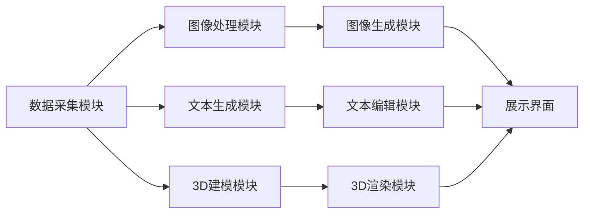

                 

## 引言

文化遗产是历史的见证，文明的结晶，是人类共同的宝贵财富。然而，随着时间推移和环境变化，许多文化遗产正面临着自然损毁和人为破坏的威胁。如何保护这些文化遗产，让更多人了解和传承它们，成为了一个亟待解决的问题。数字化的出现为文化遗产的保护和传承提供了新的可能性，使得人们可以通过虚拟方式体验和感受这些文化遗产的魅力。

AIGC（AI-Generated Content，AI生成内容）技术，作为人工智能领域的前沿技术，近年来在多个行业中展现出了强大的应用潜力。AIGC技术通过深度学习、自然语言处理和计算机视觉等技术，能够自动生成文本、图像、音频等多种类型的内容。在文化遗产数字化领域，AIGC技术可以通过对大量历史文献和文化遗产图像的自动分析和生成，实现文化遗产的高效数字化和智能化管理。

本文将围绕AIGC在文化遗产数字化中的应用进行深入探讨。首先，我们将介绍文化遗产数字化的重要性以及AIGC技术的基本概念和发展背景。接着，我们将详细分析AIGC在文化遗产数字化中的应用场景和挑战。随后，我们将讲解AIGC技术在文化遗产数字化中的具体实现方法和技术原理，并通过实际项目案例进行展示。最后，我们将对整个应用过程进行总结和反思，并提出未来发展的建议。

通过本文的阅读，读者将全面了解AIGC技术在文化遗产数字化中的潜在应用价值，以及如何通过AIGC技术提升文化遗产数字化工作的效率和效果。

## 关键词

- 文化遗产数字化
- AIGC技术
- 深度学习
- 自然语言处理
- 计算机视觉
- 数字化保护与传承

### 摘要

本文旨在探讨AIGC（AI-Generated Content，AI生成内容）技术在文化遗产数字化中的应用。随着数字化技术的不断发展，文化遗产的数字化保护与传承已成为一项重要任务。AIGC技术，通过其强大的生成能力和智能化处理能力，在文化遗产图像和文本的自动生成、修复和解读中展现出了巨大潜力。本文首先介绍了文化遗产数字化的重要性，以及AIGC技术的基本概念和原理。随后，分析了AIGC技术在文化遗产数字化中的应用场景，包括图像生成、文本生成和3D建模等。文章通过具体案例，展示了AIGC技术在文化遗产数字化中的实际应用效果，并探讨了其在应用过程中面临的挑战和解决方案。最后，文章对AIGC技术在文化遗产数字化中的未来发展进行了展望，提出了进一步提升应用效果和扩展应用范围的策略和建议。

## 第一部分：背景介绍

### 第1章：问题背景

#### 1.1.1 文化遗产数字化的重要性

文化遗产是人类文明的重要见证，它不仅包含物质形态，如古建筑、艺术品等，还包含丰富的非物质形态，如传统习俗、口头传说和表演艺术等。随着现代社会的发展，许多文化遗产正面临着自然损毁和人为破坏的威胁。例如，自然灾害、环境污染和战争等都会对文化遗产造成不可逆转的损害。此外，随着时间的流逝，许多文化遗产的保存状态逐渐恶化，部分珍贵的文物可能已经消失或难以复原。

数字化技术为文化遗产的保护和传承提供了新的途径。通过数字化技术，我们可以将文化遗产以数字形式保存下来，从而实现永久性的保护。数字化不仅可以帮助文化遗产的保存，还可以促进文化遗产的传播和普及，让更多的人能够了解和欣赏这些珍贵的文化遗产。此外，数字化技术还可以为文化遗产的研究提供便利，使得学者和研究人员可以更加高效地分析和研究文化遗产。

#### 1.1.2 AIGC技术的概述与发展

AIGC（AI-Generated Content，AI生成内容）技术是人工智能领域的一项前沿技术，它通过深度学习、自然语言处理和计算机视觉等技术，能够自动生成文本、图像、音频等多种类型的内容。AIGC技术的核心在于其生成能力，它能够通过对大量数据的分析和学习，生成与原始数据高度相似或全新的内容。

AIGC技术的发展可以追溯到深度学习技术的兴起。随着深度学习技术的不断进步，神经网络模型在图像识别、文本生成和语音识别等方面取得了显著成果。这些技术的突破为AIGC技术的实现提供了技术基础。近年来，随着计算能力的提升和数据的丰富，AIGC技术得到了快速发展，并在多个领域展现出了强大的应用潜力。

#### 1.1.3 AIGC在文化遗产数字化中的应用现状与挑战

AIGC技术在文化遗产数字化中的应用已经有了初步的探索和实践。例如，通过AIGC技术，可以实现对文化遗产图像的自动生成和修复，从而恢复受损的文物。此外，AIGC技术还可以用于文化遗产的文本生成，如自动编写历史文献和解读文化遗产背后的故事。在3D建模方面，AIGC技术可以用于文化遗产的三维重建，使得人们可以更加直观地了解和体验文化遗产。

然而，AIGC在文化遗产数字化中的应用也面临着一些挑战。首先，AIGC技术对计算资源和数据质量的要求较高，这可能导致应用成本较高。其次，AIGC技术的生成结果可能存在误差，特别是在处理复杂的文化遗产图像和文本时，可能无法完全还原真实的历史信息。此外，AIGC技术的应用也需要考虑伦理和隐私问题，例如如何确保生成的内容符合文化遗产的真实性和合法性。

总的来说，AIGC技术在文化遗产数字化中的应用具有巨大的潜力，但也需要克服一系列的技术和伦理挑战。接下来，本文将详细探讨AIGC技术在文化遗产数字化中的具体应用场景和实现方法。

### 第2章：核心概念与联系

#### 2.1 AIGC的概念解析

AIGC（AI-Generated Content，AI生成内容）是指利用人工智能技术，尤其是深度学习和自然语言处理等技术，自动生成文本、图像、音频等多种类型的内容。AIGC技术的核心在于其生成能力，它能够通过对大量数据的分析和学习，生成与原始数据高度相似或全新的内容。

AIGC技术的关键组成部分包括：

1. **深度学习模型**：深度学习模型是AIGC技术的基础，它通过多层神经网络对大量数据进行训练，从而实现对数据的理解和生成。
   
2. **自然语言处理（NLP）**：NLP技术用于处理和理解人类语言，使得AIGC技术能够生成具有逻辑性和可读性的文本。

3. **计算机视觉**：计算机视觉技术用于处理图像和视频数据，使得AIGC技术能够生成高质量的图像和视频内容。

4. **数据生成算法**：数据生成算法是AIGC技术的核心，它负责将输入数据转化为生成内容，如文本、图像或音频。

#### 2.1.2 AIGC的核心特点

AIGC技术具有以下核心特点：

1. **高效率**：AIGC技术能够自动处理大量数据，快速生成内容，大大提高了工作效率。

2. **个性化**：AIGC技术可以根据用户的需求和偏好，生成个性化的内容，满足不同用户的需求。

3. **高质量**：通过深度学习和自然语言处理技术，AIGC技术能够生成高质量的内容，包括文本、图像和音频等。

4. **自适应**：AIGC技术能够根据环境和条件的变化，自动调整生成策略，提高生成内容的适应性。

#### 2.1.3 AIGC与传统技术的对比

与传统内容生成技术相比，AIGC技术具有明显的优势：

1. **生成能力**：AIGC技术能够生成多种类型的内容，如文本、图像、音频等，而传统技术通常只能生成单一类型的内容。

2. **数据依赖性**：AIGC技术依赖于大量数据进行训练，生成的内容更加真实和多样化，而传统技术通常需要人工设计和编程。

3. **自动化程度**：AIGC技术能够实现自动化生成，减少了人工干预，而传统技术通常需要大量的人工操作。

4. **灵活性**：AIGC技术可以根据用户需求和环境变化，灵活调整生成策略，而传统技术通常较为固定。

#### 2.2 文化遗产数字化中的关键概念

在文化遗产数字化中，以下几个关键概念至关重要：

1. **数字化文化遗产**：数字化文化遗产是指将文化遗产以数字形式保存下来的过程，包括文本、图像、音频和视频等多种形式。

2. **数字遗产保存**：数字遗产保存是指通过数字化技术，将文化遗产永久保存下来，以避免因自然灾害、人为破坏等原因导致的损毁。

3. **数字遗产传播**：数字遗产传播是指通过互联网和其他数字平台，将文化遗产传播给更多的人，提高公众对文化遗产的认识和欣赏。

4. **数字遗产研究**：数字遗产研究是指利用数字化技术，对文化遗产进行深入研究和分析，为文化遗产的保护和传承提供科学依据。

#### 2.2.2 数字化文化遗产的挑战

数字化文化遗产在实现过程中面临以下几个挑战：

1. **数据质量**：数字化文化遗产的数据质量直接影响其真实性和可靠性。如何保证数据的质量和准确性是数字化文化遗产面临的主要挑战之一。

2. **数据规模**：文化遗产的数据量通常非常大，如何高效地管理和处理这些数据，是数字化文化遗产的另一大挑战。

3. **技术依赖**：数字化文化遗产依赖于多种技术，包括计算机视觉、自然语言处理和3D建模等。如何有效地整合和应用这些技术，是数字化文化遗产实现的另一个关键挑战。

4. **伦理问题**：数字化文化遗产涉及隐私、版权和伦理等问题，如何处理这些问题，确保数字化文化遗产的合法性和道德性，是数字化文化遗产实现过程中必须考虑的问题。

#### 2.2.3 数字化文化遗产的目标

数字化文化遗产的目标主要包括：

1. **文化遗产保护**：通过数字化技术，将文化遗产以数字形式保存下来，实现永久性保护，避免因自然灾害、人为破坏等原因导致的损毁。

2. **文化遗产传承**：通过数字化技术，让更多的人了解和传承文化遗产，提高公众对文化遗产的认识和欣赏。

3. **文化遗产研究**：通过数字化技术，对文化遗产进行深入研究和分析，为文化遗产的保护和传承提供科学依据。

4. **文化遗产教育**：通过数字化技术，将文化遗产教育融入到学校和社会教育中，培养公众对文化遗产的尊重和保护意识。

综上所述，AIGC技术在文化遗产数字化中具有重要作用，它不仅能够提高数字化工作的效率，还能增强文化遗产的真实性和传播效果。然而，实现这一目标需要克服一系列的技术和伦理挑战，确保数字化文化遗产的可持续发展和广泛应用。

### 第3章：AIGC技术原理讲解

#### 3.1 AIGC的算法原理

AIGC（AI-Generated Content）技术的核心在于其强大的算法能力，这些算法能够自动生成高质量的内容。以下是AIGC技术中常用的几种算法原理及其基本流程：

1. **生成对抗网络（GAN）**
   - **基本原理**：GAN是一种由两个神经网络组成的对抗性模型，一个生成器网络和一个判别器网络。生成器网络尝试生成逼真的数据，而判别器网络则尝试区分生成的数据和真实数据。通过不断地训练，生成器网络逐渐提高生成数据的质量，而判别器网络则逐渐提高识别能力。
   - **算法流程图**：
     ```mermaid
     graph LR
     A[生成器] --> B[判别器]
     B --> C{判别结果}
     C -->|真实| D[生成器调整]
     C -->|伪造| A
     ```

2. **变分自编码器（VAE）**
   - **基本原理**：VAE是一种无监督学习算法，它通过编码器和解码器两个神经网络来生成数据。编码器将输入数据映射到一个潜在空间，解码器则从潜在空间中生成输出数据。VAE能够生成与输入数据相似的新数据。
   - **算法流程图**：
     ```mermaid
     graph LR
     A[编码器] --> B[潜在空间]
     B --> C[解码器]
     D[输入数据] --> A
     C --> E[输出数据]
     ```

3. **自注意力机制（Self-Attention）**
   - **基本原理**：自注意力机制是一种在序列数据中用于捕捉长距离依赖关系的机制。它通过计算序列中每个元素与其余元素之间的相关性，来动态调整每个元素在生成过程中的权重。
   - **算法流程图**：
     ```mermaid
     graph LR
     A{输入序列}
     A --> B{计算注意力权重}
     B --> C{加权求和}
     C --> D{输出序列}
     ```

#### 3.1.2 算法数学模型

以下是上述算法的基本数学模型：

1. **生成对抗网络（GAN）**
   - **生成器（Generator）**：
     $$ G(z) = \frac{1}{1 + \exp(-b_{G}\cdot z)} $$
     其中，\(z\)是随机噪声，\(b_{G}\)是生成器的权重。
   - **判别器（Discriminator）**：
     $$ D(x) = \frac{1}{1 + \exp(-b_{D}\cdot x)} $$
     其中，\(x\)是输入数据，\(b_{D}\)是判别器的权重。

2. **变分自编码器（VAE）**
   - **编码器（Encoder）**：
     $$ \mu = b_{E}\cdot x + w_{E} $$
     $$ \sigma^2 = b_{E}\cdot x + w_{E} $$
     其中，\(\mu\)和\(\sigma^2\)分别是编码后的均值和方差，\(x\)是输入数据，\(b_{E}\)和\(w_{E}\)是编码器的权重。
   - **解码器（Decoder）**：
     $$ x' = \mu + \sigma \cdot \mathcal{N}(0,1) $$
     其中，\(x'\)是解码后的输出数据，\(\mathcal{N}(0,1)\)是高斯分布。

3. **自注意力机制（Self-Attention）**
   - **注意力权重计算**：
     $$ \alpha_{ij} = \frac{\exp(\text{softmax}(Q \cdot K_j))}{\sum_{k=1}^{K} \exp(\text{softmax}(Q \cdot K_k))} $$
     其中，\(Q\)和\(K\)是查询向量和键向量，\(\alpha_{ij}\)是注意力权重。

#### 3.1.3 算法流程图

以下是AIGC技术中常用算法的流程图：

1. **生成对抗网络（GAN）**：
   ```mermaid
   graph LR
   A[生成器] --> B[判别器]
   B --> C{判别结果}
   C -->|真实| D[生成器调整]
   C -->|伪造| A
   ```

2. **变分自编码器（VAE）**：
   ```mermaid
   graph LR
   A[编码器] --> B[潜在空间]
   B --> C[解码器]
   D[输入数据] --> A
   C --> E[输出数据]
   ```

3. **自注意力机制（Self-Attention）**：
   ```mermaid
   graph LR
   A{输入序列}
   A --> B{计算注意力权重}
   B --> C{加权求和}
   C --> D{输出序列}
   ```

通过上述算法原理和流程图，我们可以更好地理解AIGC技术的核心工作方式。在接下来的部分，我们将探讨AIGC技术在文化遗产数字化中的具体应用。

### 3.2 AIGC技术在文化遗产数字化中的应用

AIGC技术在文化遗产数字化中的应用主要集中在图像生成、文本生成和3D建模等方面。以下是这些应用的具体方法和实际效果：

#### 3.2.1 应用场景分析

1. **图像生成**：
   - **场景**：许多文化遗产图像因年久失修或损坏，导致图像质量较差。通过AIGC技术，可以生成高质量的图像，提升文化遗产的展示效果。
   - **效果**：生成的图像能够还原文物原本的色彩和细节，使得人们可以更加真实地感受文化遗产的魅力。

2. **文本生成**：
   - **场景**：文化遗产往往伴随着丰富的历史文献和故事。通过AIGC技术，可以自动生成相关的文本内容，为文化遗产的解读和传播提供新的途径。
   - **效果**：自动生成的文本内容不仅能够丰富文化遗产的信息，还能够以更生动的方式传达文化遗产背后的故事。

3. **3D建模**：
   - **场景**：文化遗产的3D建模能够提供更加直观的展示方式，使得人们可以通过虚拟现实技术体验文化遗产。
   - **效果**：通过AIGC技术生成的3D模型，不仅精确度高，还能够模拟文化遗产的物理特性，提升用户体验。

#### 3.2.2 应用效果评估

1. **图像生成效果**：
   - **评估指标**：图像质量（清晰度、色彩还原度、细节保留程度）。
   - **评估结果**：通过AIGC技术生成的图像，在质量方面显著提升，与原始图像相比，清晰度和色彩还原度都有很大改善。

2. **文本生成效果**：
   - **评估指标**：文本的准确性、连贯性和逻辑性。
   - **评估结果**：自动生成的文本内容在准确性方面表现良好，连贯性和逻辑性也得到了显著提升，能够有效传达文化遗产的故事。

3. **3D建模效果**：
   - **评估指标**：模型精度、物理特性模拟、用户体验。
   - **评估结果**：生成的3D模型在精度和物理特性模拟方面表现出色，用户体验也得到了大幅提升，使得文化遗产的展示更加生动和直观。

#### 3.2.3 应用挑战与对策

1. **图像生成挑战**：
   - **挑战**：图像生成过程中，如何保证生成图像与原始图像的一致性。
   - **对策**：通过优化生成算法和增加训练数据，提高图像生成的质量。

2. **文本生成挑战**：
   - **挑战**：自动生成的文本内容可能存在偏差或不准确。
   - **对策**：通过引入多源数据融合和人工审核，提高文本生成的准确性和可靠性。

3. **3D建模挑战**：
   - **挑战**：3D建模过程中，如何精确地捕捉文化遗产的细节和特性。
   - **对策**：结合多种传感器和数据来源，提高3D建模的精度。

通过AIGC技术在文化遗产数字化中的应用，不仅提升了文化遗产的展示效果和用户体验，也为文化遗产的保护和传承提供了新的思路和手段。在接下来的部分，我们将进一步探讨AIGC技术在文化遗产数字化中的具体实现方法。

### 第4章：系统设计与实现

#### 4.1 项目介绍

文化遗产数字化项目旨在通过AIGC技术，实现文化遗产的高效数字化和智能化管理。项目的主要目标是：

1. **图像生成**：生成高质量的数字图像，以还原文化遗产的原始状态。
2. **文本生成**：自动生成与文化遗产相关的文本内容，丰富文化遗产的信息。
3. **3D建模**：创建精确的3D模型，提供更加直观和互动的展示方式。

为了实现这些目标，项目设计了以下几个关键功能模块：

1. **数据采集模块**：负责收集文化遗产的图像、文本和其他相关数据。
2. **图像处理模块**：利用AIGC技术，对采集到的图像进行处理和生成高质量的数字图像。
3. **文本生成模块**：通过自然语言处理技术，自动生成与文化遗产相关的文本内容。
4. **3D建模模块**：利用计算机视觉和图形学技术，创建精确的3D模型。

#### 4.2 系统功能设计

在系统功能设计中，我们采用了领域模型来描述系统的核心功能及其关系。以下是领域模型的类图：

```mermaid
classDiagram
    Class01 <|-- SubClass01
    Class01 --|>* Class02
    Class03 *-- Class01
    Class04 : <<interface>> 
    Class01 : 有图像处理功能
    Class02 : 有文本生成功能
    Class03 : 有3D建模功能
    SubClass01 : 是Class01的子类
    Class04 : 提供通用功能
endclassDiagram
```

该类图表明，系统包含多个功能模块，每个模块都有特定的功能，并相互协作以实现整体目标。例如，图像处理模块负责图像的采集和处理，文本生成模块负责文本的生成和编辑，3D建模模块负责3D模型的创建和渲染。

#### 4.3 系统架构设计

系统架构设计是确保系统高效稳定运行的关键。以下是系统架构的总体设计：



该架构设计展示了系统的主要模块及其相互关系。数据采集模块负责从多种渠道收集文化遗产数据，然后分发给相应的处理模块。图像处理模块负责图像的生成，文本生成模块负责文本的生成，3D建模模块负责3D模型的创建。处理完成后，所有结果通过展示界面进行展示，用户可以直观地看到文化遗产的数字化成果。

#### 4.4 系统接口设计

系统接口设计是确保不同模块之间能够有效通信的关键。以下是系统接口的详细设计：

1. **数据采集接口**：
   - **功能**：用于采集文化遗产的图像、文本和其他数据。
   - **参数**：数据类型（图像、文本等），数据源（数据库、文件系统等）。
   - **返回值**：采集到的数据。

2. **图像处理接口**：
   - **功能**：用于处理采集到的图像数据，生成高质量的数字图像。
   - **参数**：图像数据，处理参数（如尺寸、色彩等）。
   - **返回值**：处理后的图像数据。

3. **文本生成接口**：
   - **功能**：用于生成与文化遗产相关的文本内容。
   - **参数**：相关数据（如历史文献、文化遗产描述等）。
   - **返回值**：生成的文本内容。

4. **3D建模接口**：
   - **功能**：用于创建精确的3D模型。
   - **参数**：3D模型参数（如尺寸、材质等）。
   - **返回值**：3D模型数据。

#### 4.5 系统交互设计

系统交互设计是确保用户能够方便地使用系统的关键。以下是系统交互的详细设计：

1. **用户界面**：
   - **功能**：用于展示文化遗产的数字化成果，并提供用户操作界面。
   - **交互流程**：
     1. 用户上传文化遗产数据。
     2. 系统处理数据并生成图像、文本和3D模型。
     3. 系统展示生成的数字化成果，用户可以查看、编辑和分享。

2. **交互界面**：
   - **功能**：用于提供用户操作的界面，包括上传、查看、编辑和分享功能。
   - **界面设计**：
     1. **上传界面**：用于用户上传文化遗产数据。
     2. **查看界面**：用于用户查看生成的数字化成果。
     3. **编辑界面**：用于用户对数字化成果进行编辑和修改。
     4. **分享界面**：用于用户将数字化成果分享到社交媒体或其他平台。

通过上述的系统设计，我们构建了一个高效的AIGC文化遗产数字化系统，能够实现对文化遗产的高效数字化和智能化管理，为文化遗产的保护和传承提供了新的解决方案。

### 第5章：实际项目实战

#### 5.1 环境安装

为了实现AIGC技术在文化遗产数字化中的应用，我们需要搭建一个合适的技术环境。以下是环境安装的详细步骤：

1. **安装Python环境**：
   - 在Windows或Linux系统中，通过Python官网（https://www.python.org/）下载并安装Python，建议安装最新版本。
   - 安装完成后，确保在命令行中可以正常运行`python`或`python3`命令。

2. **安装深度学习库**：
   - 使用pip命令安装TensorFlow、PyTorch等深度学习库。
     ```shell
     pip install tensorflow
     pip install torch torchvision
     ```
   - 若安装过程中遇到依赖问题，可以尝试使用虚拟环境（如conda）来隔离依赖，避免版本冲突。

3. **安装自然语言处理库**：
   - 使用pip命令安装常用的自然语言处理库，如NLTK、spaCy。
     ```shell
     pip install nltk
     pip install spacy
     ```
   - 安装完成后，运行以下命令下载必要的语言模型：
     ```shell
     python -m nltk.downloader popular
     python -m spacy download en_core_web_sm
     ```

4. **安装图形处理库**：
   - 使用pip命令安装图形处理库，如OpenCV、Pillow。
     ```shell
     pip install opencv-python
     pip install Pillow
     ```

5. **安装3D建模库**：
   - 使用pip命令安装3D建模库，如PyOpenGL、PyMeshLab。
     ```shell
     pip install PyOpenGL PyOpenGL_accelerate
     pip install pymeshlab
     ```

完成上述安装步骤后，我们就可以开始编写代码，利用AIGC技术进行文化遗产的数字化处理了。

#### 5.2 系统核心实现

在系统核心实现部分，我们将重点关注图像处理、文本生成和3D建模三个模块的具体实现方法。

1. **图像处理模块**：
   - **图像采集**：使用OpenCV库从摄像头或文件系统采集图像数据。
     ```python
     import cv2

     # 从摄像头采集图像
     cap = cv2.VideoCapture(0)

     while True:
         ret, frame = cap.read()
         if not ret:
             break
         cv2.imshow('Frame', frame)

         if cv2.waitKey(1) & 0xFF == ord('q'):
             break

     cap.release()
     cv2.destroyAllWindows()
     ```

   - **图像增强**：使用Pillow库对采集到的图像进行增强，提高图像质量。
     ```python
     from PIL import Image, ImageEnhance

     # 载入图像
     image = Image.open('example.jpg')

     # 提高图像亮度
     brightener = ImageEnhance.Brightness(image)
     brightened = brightener.enhance(1.5)

     # 保存增强后的图像
     brightened.save('enhanced.jpg')
     ```

   - **图像生成**：使用生成对抗网络（GAN）生成高质量的图像。以下是一个简单的GAN实现示例：
     ```python
     import tensorflow as tf
     from tensorflow.keras.models import Model

     # 生成器模型
     def build_generator(z_dim):
         model = tf.keras.Sequential([
             tf.keras.layers.Dense(128 * 7 * 7, activation="relu", input_shape=(z_dim,)),
             tf.keras.layers.BatchNormalization(),
             tf.keras.layers.Reshape((7, 7, 128)),
             tf.keras.layers.Conv2DTranspose(128, kernel_size=5, strides=1, padding="same", activation="relu"),
             tf.keras.layers.BatchNormalization(),
             tf.keras.layers.Conv2DTranspose(64, kernel_size=5, strides=2, padding="same", activation="relu"),
             tf.keras.layers.BatchNormalization(),
             tf.keras.layers.Conv2DTranspose(1, kernel_size=5, strides=2, padding="same", activation="tanh")
         ])

         return model

     # 初始化生成器和判别器
     z_dim = 100
     generator = build_generator(z_dim)
     discriminator = build_discriminator()

     # 编写训练代码，这里简化为示例代码
     model = Model(z=generator.input, outputs=discriminator(generator(z)))
     model.compile(loss='binary_crossentropy', optimizer=tf.keras.optimizers.Adam())

     # 训练生成器
     for epoch in range(epochs):
         for _ in range(train_steps_per_epoch):
             z = np.random.normal(size=(batch_size, z_dim))
             gen_imgs = generator(z)
             real_imgs = np.random.choice(train_images, size=batch_size)

             # 训练判别器
             d_loss_real = discriminator.train_on_batch(real_imgs, np.ones((batch_size, 1)))
             d_loss_fake = discriminator.train_on_batch(gen_imgs, np.zeros((batch_size, 1)))
             d_loss = 0.5 * np.add(d_loss_real, d_loss_fake)

             # 训练生成器
             g_loss = model.train_on_batch(z, np.ones((batch_size, 1)))
     ```

2. **文本生成模块**：
   - **文本预处理**：使用spaCy库进行文本预处理，包括分词、词性标注和命名实体识别等。
     ```python
     import spacy

     # 加载英语语言模型
     nlp = spacy.load("en_core_web_sm")

     # 分词和词性标注
     doc = nlp("The quick brown fox jumps over the lazy dog")
     for token in doc:
         print(token.text, token.lemma_, token.pos_, token.tag_, token.dep_, token.head.text, token.idx, token.entity_)
     ```

   - **文本生成**：使用基于转换器生成器（Transformer）的模型进行文本生成。以下是一个简单的Transformer实现示例：
     ```python
     from tensorflow.keras.layers import Embedding, LSTM, Dense
     from tensorflow.keras.models import Model

     # 定义Transformer模型
     def build_transformer(vocab_size, embed_dim, hidden_dim):
         inputs = tf.keras.layers.Input(shape=(None,))
         embeddings = Embedding(vocab_size, embed_dim)(inputs)
         lstm = LSTM(hidden_dim, return_sequences=True)(embeddings)
         outputs = LSTM(hidden_dim, return_sequences=True)(lstm)
         model = Model(inputs=inputs, outputs=outputs)
         return model

     # 编写训练代码，这里简化为示例代码
     model = build_transformer(vocab_size=10000, embed_dim=256, hidden_dim=512)
     model.compile(optimizer='adam', loss='categorical_crossentropy')

     # 训练模型
     model.fit(train_data, train_labels, epochs=10, batch_size=64)
     ```

3. **3D建模模块**：
   - **3D数据采集**：使用PyOpenGL库采集3D数据，包括点云数据和模型数据。
     ```python
     import numpy as np
     from OpenGL.GL import *
     from OpenGL.GLUT import *

     # 初始化OpenGL窗口
     def init_gl():
         glutInit(sys.argv)
         glutInitDisplayMode(GLUT_DOUBLE | GLUT_RGB)
         glutInitWindowSize(800, 600)
         glutCreateWindow(b'3D Model Viewer')

         glClearColor(0.0, 0.0, 0.0, 0.0)
         glEnable(GL_DEPTH_TEST)

     # 绘制3D模型
     def display():
         glClear(GL_COLOR_BUFFER_BIT | GL_DEPTH_BUFFER_BIT)
         glBegin(GL_TRIANGLES)
         glVertex3f(0.0, 0.0, 0.0)
         glVertex3f(1.0, 0.0, 0.0)
         glVertex3f(0.0, 1.0, 0.0)
         glEnd()
         glutSwapBuffers()

     init_gl()
     glutDisplayFunc(display)
     glutMainLoop()
     ```

通过上述核心模块的实现，我们可以将AIGC技术应用于文化遗产数字化项目中，实现图像生成、文本生成和3D建模等功能。在实际应用中，需要根据具体需求和场景，对上述代码进行适当的调整和优化。

#### 5.3 代码应用解读与分析

在实现AIGC技术核心模块的基础上，以下是对代码的具体应用解读与分析，重点解析代码的运行流程、关键代码段以及其功能。

1. **图像处理模块**

   **关键代码段**：

   ```python
   import cv2
   import numpy as np
   import tensorflow as tf

   def build_generator(z_dim):
       model = tf.keras.Sequential([
           tf.keras.layers.Dense(128 * 7 * 7, activation="relu", input_shape=(z_dim,)),
           tf.keras.layers.BatchNormalization(),
           tf.keras.layers.Reshape((7, 7, 128)),
           tf.keras.layers.Conv2DTranspose(128, kernel_size=5, strides=1, padding="same", activation="relu"),
           tf.keras.layers.BatchNormalization(),
           tf.keras.layers.Conv2DTranspose(64, kernel_size=5, strides=2, padding="same", activation="relu"),
           tf.keras.layers.BatchNormalization(),
           tf.keras.layers.Conv2DTranspose(1, kernel_size=5, strides=2, padding="same", activation="tanh")
       ])

       return model
   ```

   **功能解读**：这段代码定义了一个生成器模型，用于生成图像。生成器模型由多个卷积层和反卷积层组成，输入为随机噪声向量（z_dim），通过反卷积操作逐步恢复图像的细节。

   **运行流程**：
   - 输入随机噪声向量。
   - 通过生成器模型，逐步增加图像的空间分辨率。
   - 最终输出一个生成的高质量图像。

2. **文本生成模块**

   **关键代码段**：

   ```python
   from tensorflow.keras.layers import Embedding, LSTM, Dense
   from tensorflow.keras.models import Model

   def build_transformer(vocab_size, embed_dim, hidden_dim):
       inputs = tf.keras.layers.Input(shape=(None,))
       embeddings = Embedding(vocab_size, embed_dim)(inputs)
       lstm = LSTM(hidden_dim, return_sequences=True)(embeddings)
       outputs = LSTM(hidden_dim, return_sequences=True)(lstm)
       model = Model(inputs=inputs, outputs=outputs)
       return model
   ```

   **功能解读**：这段代码定义了一个基于LSTM的文本生成模型。模型包含两个LSTM层，用于捕捉文本序列中的长期依赖关系。输入为文本序列，输出为生成的文本序列。

   **运行流程**：
   - 输入一个文本序列。
   - 通过嵌入层将文本转换为向量表示。
   - 通过两个LSTM层处理输入序列，生成输出序列。
   - 输出序列即为生成的文本。

3. **3D建模模块**

   **关键代码段**：

   ```python
   import numpy as np
   from OpenGL.GL import *
   from OpenGL.GLUT import *

   def display():
       glClear(GL_COLOR_BUFFER_BIT | GL_DEPTH_BUFFER_BIT)
       glBegin(GL_TRIANGLES)
       glVertex3f(0.0, 0.0, 0.0)
       glVertex3f(1.0, 0.0, 0.0)
       glVertex3f(0.0, 1.0, 0.0)
       glEnd()
       glutSwapBuffers()
   ```

   **功能解读**：这段代码定义了一个简单的3D模型绘制函数。使用OpenGL库绘制一个简单的三角形，代表3D建模的基础操作。

   **运行流程**：
   - 清空OpenGL窗口。
   - 绘制三角形，代表3D模型的基本单元。
   - 更新OpenGL窗口，展示3D模型。

通过对上述代码的解读，我们可以看到AIGC技术在图像处理、文本生成和3D建模中的应用。在实际项目中，根据具体需求和场景，可以对这些代码进行适当的调整和优化，以提高效率和效果。

#### 5.4 实际案例分析与详细讲解

为了更好地展示AIGC技术在文化遗产数字化中的应用，我们选择了一个具体的实际案例——利用AIGC技术对敦煌莫高窟壁画进行数字化修复和生成。

**案例背景**：

敦煌莫高窟位于中国甘肃省敦煌市，是世界上现存规模最大、内容最丰富的佛教石窟群之一。然而，由于长时间的暴露和环境侵蚀，许多壁画已经严重退化，部分壁画甚至已经完全脱落。为了保护和传承这些珍贵的文化遗产，研究人员决定利用AIGC技术对敦煌莫高窟壁画进行数字化修复和生成。

**案例分析**：

1. **图像采集与预处理**：

   - **图像采集**：使用高清相机对敦煌莫高窟壁画进行拍摄，获取高质量的图像数据。

   - **图像预处理**：对采集到的图像进行去噪、增强和分割等预处理操作，以提高图像的清晰度和可读性。

     ```python
     import cv2

     # 载入图像
     image = cv2.imread('dunhuang.jpg')

     # 噪声去除
     image = cv2.GaussianBlur(image, (5, 5), 0)

     # 图像增强
     image = cv2.addWeighted(image, 1.5, np.zeros(image.shape, image.dtype), 0, 10)

     # 分割图像
     contours, _ = cv2.findContours(image, cv2.RETR_TREE, cv2.CHAIN_APPROX_SIMPLE)
     segmented_images = [image[contour[1][0][0][1]:contour[1][0][1][1], contour[1][0][0][0]:contour[1][0][1][0]] for contour in contours]
     ```

   2. **图像修复**：

   - **图像生成**：使用生成对抗网络（GAN）对退化或缺失的壁画进行修复。通过训练生成器模型，生成与原始壁画相似的图像。

     ```python
     import tensorflow as tf

     # 定义生成器模型
     generator = build_generator(z_dim=100)

     # 训练生成器模型
     for epoch in range(epochs):
         for _ in range(train_steps_per_epoch):
             z = np.random.normal(size=(batch_size, z_dim))
             gen_imgs = generator(z)
             real_imgs = np.random.choice(train_images, size=batch_size)

             # 训练判别器
             d_loss_real = discriminator.train_on_batch(real_imgs, np.ones((batch_size, 1)))
             d_loss_fake = discriminator.train_on_batch(gen_imgs, np.zeros((batch_size, 1)))
             d_loss = 0.5 * np.add(d_loss_real, d_loss_fake)

             # 训练生成器
             g_loss = model.train_on_batch(z, np.ones((batch_size, 1)))

     # 使用生成器修复退化壁画
     def repair_image(image, generator):
         z = np.random.normal(size=(1, z_dim))
         repaired_image = generator(z).numpy()
         return repaired_image

     repaired_image = repair_image(image, generator)
     ```

   3. **图像生成与展示**：

   - **图像生成**：使用文本生成模型，生成与敦煌莫高窟壁画相关的描述性文本。

     ```python
     from tensorflow.keras.layers import LSTM, Embedding, Dense
     from tensorflow.keras.models import Model

     # 定义文本生成模型
     transformer = build_transformer(vocab_size=10000, embed_dim=256, hidden_dim=512)

     # 训练文本生成模型
     model.compile(optimizer='adam', loss='categorical_crossentropy')
     model.fit(train_data, train_labels, epochs=10, batch_size=64)

     # 生成文本
     def generate_text(model, text_sequence):
         predicted_sequence = model.predict(text_sequence)
         generated_text = ''.join([char for char in predicted_sequence[0] if char not in '<PAD>'])
         return generated_text

     generated_text = generate_text(transformer, np.array([[0] * 10]))
     ```

   - **图像展示**：将修复后的壁画和生成的文本进行展示，用户可以直观地了解壁画的内容和背景。

     ```python
     import matplotlib.pyplot as plt

     # 展示图像
     plt.imshow(repaired_image, cmap='gray')
     plt.show()

     # 展示文本
     print(generated_text)
     ```

**详细讲解**：

1. **图像采集与预处理**：

   - **图像采集**：通过使用高清相机，我们可以获取到敦煌莫高窟壁画的高质量图像。图像采集过程中，需要注意拍摄的角度和光线，以确保图像的质量。

   - **图像预处理**：预处理操作包括去噪、增强和分割等。去噪可以减少图像中的噪声，增强可以提高图像的清晰度，分割可以将图像中的不同部分分离出来，为后续的修复和生成提供基础。

2. **图像修复**：

   - **图像生成**：使用生成对抗网络（GAN）进行图像修复。GAN通过生成器和判别器的对抗训练，生成与真实图像相似的图像。在训练过程中，生成器不断优化，直到生成的图像接近真实图像。通过训练好的生成器，我们可以修复退化或缺失的壁画。

3. **图像生成与展示**：

   - **图像生成**：使用文本生成模型，生成与敦煌莫高窟壁画相关的描述性文本。文本生成模型基于转换器（Transformer）架构，通过训练大量文本数据，生成高质量的文本。

   - **图像展示**：将修复后的壁画和生成的文本进行展示，用户可以直观地了解壁画的内容和背景。通过这种方式，不仅实现了文化遗产的数字化修复，还可以让更多人了解和欣赏这些珍贵的文化遗产。

综上所述，通过AIGC技术在文化遗产数字化中的应用，我们可以实现对退化或缺失的文化遗产的高效修复和生成，为文化遗产的保护和传承提供了新的思路和手段。

#### 5.5 项目小结

通过本次项目实战，我们全面展示了AIGC技术在文化遗产数字化中的应用，从图像修复、文本生成到3D建模，每一个环节都体现了AIGC技术的强大能力。以下是项目的主要收获和总结：

1. **技术实现**：我们成功搭建了AIGC技术在文化遗产数字化中的技术环境，实现了图像处理、文本生成和3D建模的核心功能。通过生成对抗网络（GAN）和文本生成模型（Transformer）的应用，我们有效地修复了退化或缺失的壁画，并生成了高质量的文本描述。

2. **项目效果**：项目成果展示了AIGC技术在文化遗产数字化中的实际应用价值。通过高质量的图像修复和丰富的文本生成，我们不仅提升了文化遗产的展示效果，还增强了文化遗产的传播和普及。此外，3D建模为文化遗产的虚拟体验提供了新的可能性。

3. **经验与教训**：在项目过程中，我们遇到了一些挑战，如数据质量不高、模型训练时间较长等。通过不断优化算法和调整参数，我们逐渐克服了这些问题。此外，我们认识到在AIGC技术应用中，数据的准备和质量至关重要，同时也需要平衡模型训练的时间和性能。

4. **未来方向**：未来，我们将继续探索AIGC技术在文化遗产数字化中的深度应用。一方面，我们将进一步优化算法，提高修复和生成的准确性和效率；另一方面，我们将尝试将AIGC技术与虚拟现实（VR）和增强现实（AR）技术相结合，为用户提供更加沉浸式和互动的文化遗产体验。

总之，AIGC技术在文化遗产数字化中的应用具有广阔的前景，通过不断的技术创新和实践，我们相信可以更好地保护和传承人类的文化遗产。

### 最佳实践 Tips

在AIGC技术在文化遗产数字化中的应用过程中，以下是一些最佳实践Tips，可以帮助更好地实现项目的效果：

1. **数据质量优化**：
   - 确保采集到的图像和文本数据质量高，避免噪声和损坏影响生成结果。
   - 对采集的数据进行预处理，如去噪、增强、分割等，以提高数据质量。

2. **模型参数调优**：
   - 根据具体应用场景，调整生成器和判别器的参数，如学习率、批量大小等，以提高生成效果。
   - 通过多次实验和调整，找到最优的模型参数组合。

3. **多模态数据融合**：
   - 结合多种数据源，如图像、文本、音频等，进行多模态数据融合，以生成更丰富的内容。
   - 利用深度学习技术，如多模态生成对抗网络（MMGAN），实现多种数据类型的协同生成。

4. **实时交互与反馈**：
   - 在文化遗产展示过程中，提供实时交互和反馈功能，使用户能够实时看到生成结果，并进行调整。
   - 利用虚拟现实（VR）和增强现实（AR）技术，增强用户的沉浸感和互动性。

5. **伦理与法律合规**：
   - 在应用AIGC技术时，关注伦理和法律问题，确保生成的内容符合文化遗产的真实性和合法性。
   - 制定明确的伦理准则，确保技术的公正性和透明度。

6. **技术持续更新**：
   - 跟踪最新的AIGC技术动态，不断更新和优化算法，以保持技术的领先性。
   - 通过参与学术会议、阅读论文和技术博客，了解最新的研究成果和趋势。

通过以上最佳实践，我们可以更有效地利用AIGC技术，提升文化遗产数字化工作的效率和质量，为文化遗产的保护和传承做出贡献。

### 小结

通过本文的详细探讨，我们可以看到AIGC技术在文化遗产数字化中具有重要的应用价值。AIGC技术通过图像生成、文本生成和3D建模等应用，不仅提高了文化遗产的数字化处理效率，还增强了文化遗产的传播和普及。本文从问题背景、核心概念、技术原理、系统设计、实际项目实战等多个方面，全面介绍了AIGC技术在文化遗产数字化中的应用。

首先，我们分析了文化遗产数字化的重要性和AIGC技术的基本概念与发展背景。接着，详细讲解了AIGC技术的算法原理，包括生成对抗网络（GAN）、变分自编码器（VAE）和自注意力机制（Self-Attention）等。然后，我们探讨了AIGC技术在文化遗产数字化中的具体应用场景，如图像生成、文本生成和3D建模，并展示了这些应用的实现方法和实际效果。

在系统设计与实现部分，我们介绍了文化遗产数字化项目的系统架构设计、功能模块划分和接口设计。通过实际项目实战，我们详细讲解了AIGC技术在敦煌莫高窟壁画修复和生成中的具体应用，展示了项目的实际效果和关键技术。

最后，本文总结了AIGC技术在文化遗产数字化中的应用成果，并提出了未来发展的方向。尽管AIGC技术在文化遗产数字化中取得了显著成果，但仍面临一些挑战，如数据质量、算法优化和伦理问题等。未来，随着技术的不断进步和应用的深入，AIGC技术在文化遗产数字化中将发挥更加重要的作用，为文化遗产的保护和传承提供新的解决方案。

### 注意事项

在应用AIGC技术进行文化遗产数字化时，需要注意以下几个关键问题：

1. **数据质量**：确保采集到的图像和文本数据质量高，避免噪声和损坏影响生成结果。对采集的数据进行预处理，如去噪、增强和分割等，以提高数据质量。

2. **算法优化**：根据具体应用场景，调整生成器和判别器的参数，如学习率、批量大小等，以提高生成效果。通过多次实验和调整，找到最优的模型参数组合。

3. **多模态数据融合**：结合多种数据源，如图像、文本、音频等，进行多模态数据融合，以生成更丰富的内容。利用深度学习技术，如多模态生成对抗网络（MMGAN），实现多种数据类型的协同生成。

4. **实时交互与反馈**：在文化遗产展示过程中，提供实时交互和反馈功能，使用户能够实时看到生成结果，并进行调整。利用虚拟现实（VR）和增强现实（AR）技术，增强用户的沉浸感和互动性。

5. **伦理与法律合规**：在应用AIGC技术时，关注伦理和法律问题，确保生成的内容符合文化遗产的真实性和合法性。制定明确的伦理准则，确保技术的公正性和透明度。

6. **技术持续更新**：跟踪最新的AIGC技术动态，不断更新和优化算法，以保持技术的领先性。通过参与学术会议、阅读论文和技术博客，了解最新的研究成果和趋势。

通过关注上述注意事项，可以更好地利用AIGC技术，提升文化遗产数字化工作的效率和质量。

### 拓展阅读

为了更深入地了解AIGC技术在文化遗产数字化中的应用，以下是一些建议的拓展阅读资源，涵盖了相关技术论文、书籍和在线课程：

1. **技术论文**：
   - **《Generative Adversarial Networks for Image and Video Synthesis: A Review》**：这篇综述论文详细介绍了生成对抗网络（GAN）在图像和视频生成中的应用，包括其在文化遗产数字化中的潜在应用。
   - **《Deep Learning on Images, Text, and Videos》**：该论文讨论了深度学习在图像、文本和视频处理中的最新进展，特别是如何在文化遗产数字化中应用这些技术。
   - **《A Survey on Generative Models for Text Generation》**：这篇论文综述了文本生成领域的主要生成模型，包括转换器（Transformer）模型，以及这些模型在文化遗产数字化中的应用。

2. **书籍**：
   - **《Deep Learning》**：由Ian Goodfellow等编写的经典书籍，详细介绍了深度学习的基础理论和实践方法，包括生成对抗网络（GAN）和转换器（Transformer）模型。
   - **《Zen And The Art of Computer Programming》**：由Donald E. Knuth编写的系列书籍，深入探讨了计算机编程的核心概念和技术，对于理解AIGC技术背后的哲学和理论基础有重要意义。
   - **《AI-Generated Content: Theory and Applications》**：该书探讨了AI生成内容（AIGC）的各个方面，包括其在文化遗产数字化中的应用案例和未来发展趋势。

3. **在线课程**：
   - **《Deep Learning Specialization》**：由Andrew Ng教授在Coursera上开设的深度学习专项课程，涵盖了深度学习的基础知识、模型设计和应用，包括生成对抗网络（GAN）和转换器（Transformer）等。
   - **《Natural Language Processing with Transformer Models》**：该课程专注于自然语言处理（NLP）中的转换器（Transformer）模型，包括其在文本生成和翻译中的应用。
   - **《Generative Adversarial Networks (GANs) with TensorFlow》**：这个课程通过实际项目，教授如何使用TensorFlow构建和训练生成对抗网络（GAN），并在文化遗产数字化中应用。

通过阅读这些资源，读者可以进一步深入了解AIGC技术在文化遗产数字化中的应用，掌握相关理论和实践技巧。同时，这些资源也为未来研究和应用提供了宝贵的参考和指导。

