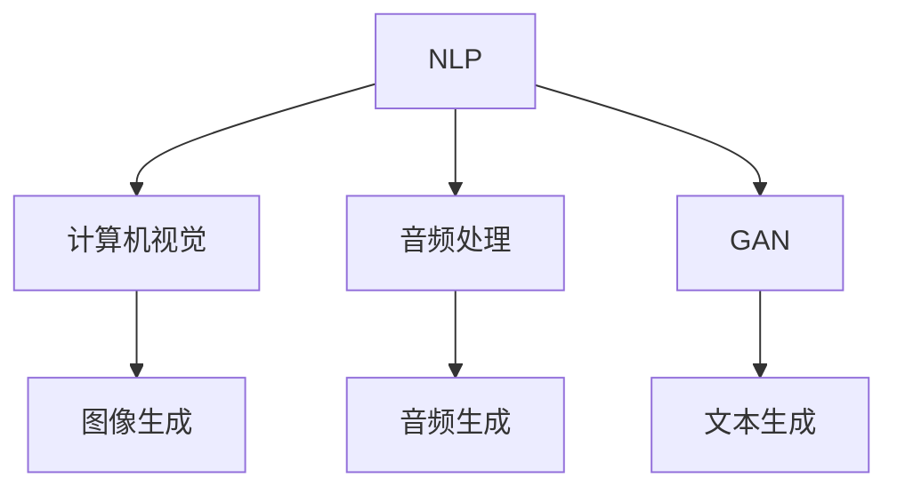
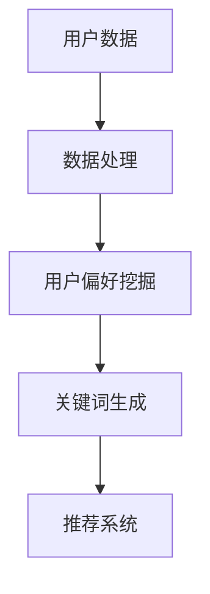
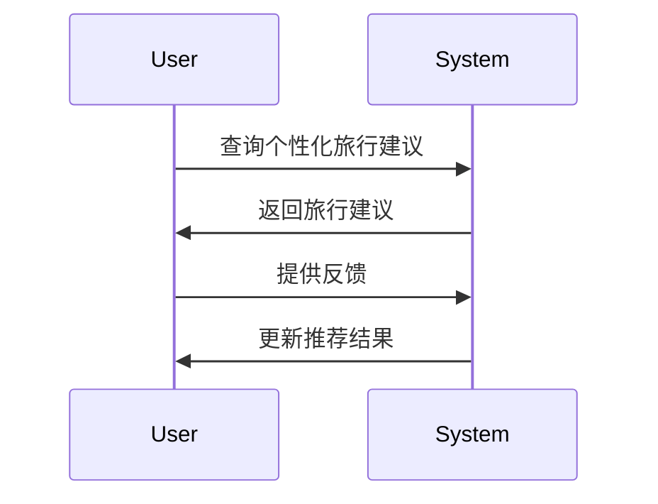
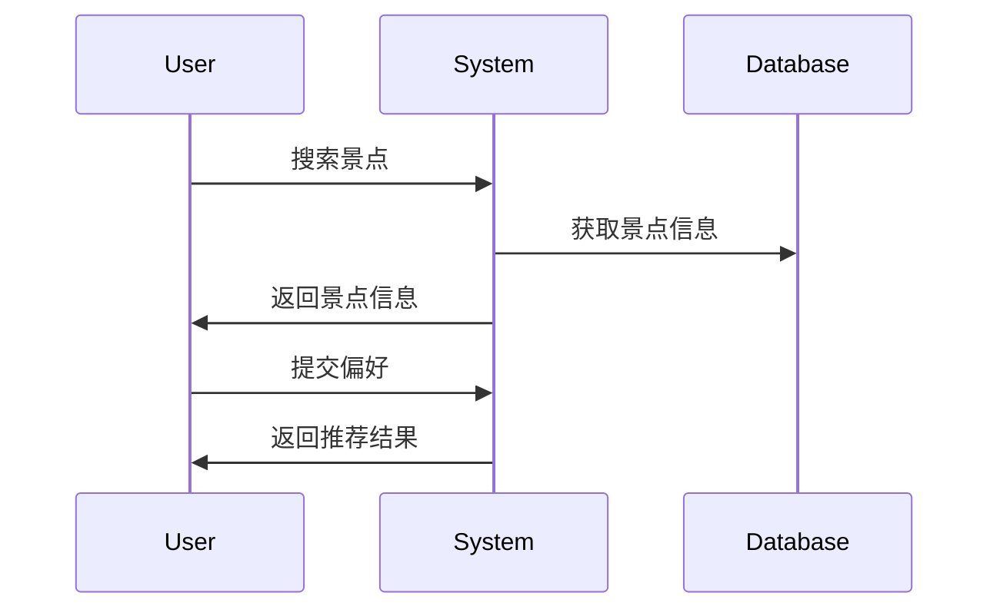

                 

## AIGC在旅游规划中的应用：个性化旅行建议提示词

### 关键词：AIGC、旅游规划、个性化旅行建议、大数据、算法设计

### 摘要：
本文将深入探讨人工智能生成内容（AIGC）在旅游规划中的应用，特别是个性化旅行建议提示词的开发。随着大数据技术的快速发展，旅游行业正迎来前所未有的变革，如何利用AIGC技术为用户提供更加精准、个性化的旅游服务成为当前研究的热点。本文将从AIGC的基本概念入手，详细分析其在旅游规划中的重要性，探讨个性化旅行建议提示词的设计方法，并通过具体应用案例展示其实际效果。希望通过本文的探讨，能为旅游行业的数字化和智能化转型提供一些有价值的参考。

### 背景介绍

#### AIGC基本概念

人工智能生成内容（AIGC，Artificial Intelligence Generated Content）是近年来人工智能领域的一个重要研究方向，旨在利用人工智能技术自动生成各种形式的内容，包括但不限于文本、图像、音频和视频。AIGC技术结合了自然语言处理（NLP）、计算机视觉、音频处理等多种人工智能技术，能够实现高度自动化和个性化的内容生成。

#### 旅游规划中的个性化需求

随着人们生活水平的提高和旅游需求的多样化，旅游规划需要更加注重个性化。传统的旅游规划往往依赖于固定的旅游路线和资源，难以满足不同游客的个性化需求。个性化旅游规划不仅需要考虑游客的兴趣爱好、旅游时间、预算等因素，还要提供定制化的旅游建议，包括景点推荐、行程安排、餐饮建议等。

#### 个性化旅行推荐关键词的定义

个性化旅行推荐关键词是指利用AIGC技术生成的，针对特定游客群体的旅行建议关键词。这些关键词不仅能够涵盖游客的个性化需求，还能通过数据分析挖掘出潜在的旅游兴趣点，为游客提供更加精准的旅行建议。

### 问题背景

在当前的旅游规划中，个性化服务已成为提升游客满意度和忠诚度的关键。然而，传统的方法往往依赖于用户的历史行为数据和简单的规则引擎，难以实现真正意义上的个性化。随着大数据和人工智能技术的发展，利用AIGC技术为旅游规划提供个性化旅行建议成为一种新的趋势。然而，如何有效地设计个性化旅行推荐关键词，实现高效的内容生成和个性化推荐，仍然是亟待解决的问题。

#### 问题描述

旅游规划中的个性化需求主要包括以下几个方面：

1. **用户偏好分析**：了解游客的旅游兴趣、爱好、预算等，为游客提供个性化的推荐。
2. **实时动态调整**：根据游客的实时反馈和旅游环境的动态变化，调整旅行建议，提供更加贴心的服务。
3. **文化适应性**：考虑不同文化背景的游客需求，提供符合当地特色和文化内涵的旅游建议。

#### 问题解决

为了解决上述问题，我们可以采用以下方法：

1. **大数据分析**：收集和分析游客的历史行为数据、社交媒体数据、旅游评价等，挖掘游客的偏好和兴趣。
2. **深度学习模型**：利用深度学习模型，如神经网络和生成对抗网络（GAN），实现个性化旅行建议关键词的生成。
3. **多模态融合**：结合文本、图像、音频等多种数据类型，提高个性化推荐的准确性和多样性。

#### 边界与外延

边界方面，个性化旅行建议关键词的设计应遵循以下原则：

1. **隐私保护**：确保用户数据的隐私和安全，不得泄露用户个人信息。
2. **文化适应性**：避免文化冲突和歧视，尊重不同文化和习俗。

外延方面，个性化旅行建议关键词可以应用于多个领域：

1. **在线旅游平台**：为用户提供个性化的旅游路线、景点推荐、餐饮建议等。
2. **智能导游系统**：为游客提供实时、个性化的导游服务。
3. **旅游营销**：为旅行社和酒店提供个性化营销方案，提高转化率。

### 概念结构与核心要素组成

#### AIGC技术核心概念与联系

**核心概念：**
- **自然语言处理（NLP）**：用于理解、解释和生成自然语言。
- **计算机视觉**：用于图像和视频的分析和处理。
- **音频处理**：用于音频数据的分析和处理。
- **生成对抗网络（GAN）**：用于生成逼真的图像、音频和文本。

**概念属性特征对比表格：**

| 技术名称 | 概念描述 | 特征对比 |
| --- | --- | --- |
| NLP | 自然语言处理 | 文本理解、文本生成、语义分析 |
| 计算机视觉 | 图像和视频分析 | 图像识别、目标检测、视频分割 |
| 音频处理 | 音频数据分析 | 音频分类、音频合成、语音识别 |
| GAN | 生成对抗网络 | 数据生成、图像合成、音频生成 |

**ER实体关系图架构（Markdown格式中的Mermaid流程图）：**



#### 个性化旅行推荐关键词设计方法

**核心概念：**
- **数据收集与处理**：收集游客行为数据、旅游资源数据等，并进行预处理。
- **用户偏好挖掘**：利用机器学习算法挖掘游客的旅游偏好。
- **关键词生成**：基于用户偏好和旅游资源数据，生成个性化的旅行建议关键词。
- **推荐系统**：将生成的关键词整合到推荐系统中，为游客提供个性化服务。

**概念属性特征对比表格：**

| 核心概念 | 概念描述 | 特征对比 |
| --- | --- | --- |
| 数据收集与处理 | 收集并预处理数据 | 数据清洗、数据格式转换、数据集成 |
| 用户偏好挖掘 | 挖掘用户偏好 | 特征提取、聚类分析、分类分析 |
| 关键词生成 | 生成旅行建议关键词 | 生成对抗网络、序列生成、文本生成 |
| 推荐系统 | 实现个性化推荐 | 用户模型、推荐算法、推荐结果展示 |

**ER实体关系图架构（Markdown格式中的Mermaid流程图）：**



### 算法原理讲解

#### 个性化旅行推荐算法原理

**算法概述：**
个性化旅行推荐算法是一种基于用户偏好和旅游资源数据的推荐系统，旨在为用户提供个性化的旅行建议。该算法的核心是关键词生成，通过深度学习模型自动生成符合用户偏好的旅行建议关键词。

**算法设计原理：**
- **用户行为分析**：通过分析用户的历史行为数据，如搜索记录、评价、游记等，挖掘用户的偏好和兴趣点。
- **旅游资源数据挖掘**：收集旅游资源的详细数据，包括景点、酒店、餐饮等信息。
- **关键词生成**：利用生成对抗网络（GAN）等深度学习模型，生成符合用户偏好的旅行建议关键词。

**算法实现步骤：**
1. 数据收集与预处理：收集用户行为数据和旅游资源数据，并进行数据清洗和格式转换。
2. 用户偏好建模：利用机器学习算法，如协同过滤、隐语义模型等，建立用户偏好模型。
3. 旅游资源数据预处理：对旅游资源数据进行分类、标注和预处理，以便后续的生成模型训练。
4. 模型训练与优化：使用生成对抗网络（GAN）等深度学习模型进行训练，不断优化模型性能。
5. 关键词生成与推荐：基于用户偏好模型和旅游资源数据，生成个性化的旅行建议关键词，并将其整合到推荐系统中。

**算法原理的数学模型和公式：**
- **用户偏好模型**：
  - $$P(u, i) = \sigma(w^T u + b)$$
  - 其中，$P(u, i)$ 表示用户 $u$ 对物品 $i$ 的偏好，$\sigma$ 表示 sigmoid 函数，$w$ 表示权重向量，$u$ 表示用户特征向量，$b$ 为偏置项。
  
- **生成对抗网络（GAN）**：
  - 生成器 $G(z)$：$$G(z) = \phi(z)$$
  - 判别器 $D(x)$：$$D(x) = \sigma(W^T x + b)$$
  - 其中，$z$ 表示随机噪声向量，$x$ 表示真实数据，$G(z)$ 和 $D(x)$ 分别表示生成器和判别器的输出，$\phi$ 和 $\sigma$ 分别表示生成器和判别器的激活函数，$W$ 和 $b$ 分别表示权重矩阵和偏置项。

**详细讲解和举例说明：**

**例子：**
假设有用户 $u_1$，其对某个景点的偏好为 $P(u_1, i_1) = 0.8$。生成对抗网络可以根据用户偏好生成符合该用户偏好的旅行建议关键词。

1. **用户偏好建模**：
   - 输入：用户 $u_1$ 的特征向量 $u_1$。
   - 输出：用户 $u_1$ 对某个景点的偏好值 $P(u_1, i_1)$。

2. **旅游资源数据预处理**：
   - 输入：旅游资源数据集，包括景点、酒店、餐饮等。
   - 输出：预处理后的旅游资源数据集，包括分类、标注和格式转换。

3. **模型训练与优化**：
   - 输入：用户偏好数据和预处理后的旅游资源数据。
   - 输出：生成器和判别器模型参数。
   - 过程：通过不断优化生成器和判别器模型参数，提高模型性能。

4. **关键词生成与推荐**：
   - 输入：用户 $u_1$ 的偏好值 $P(u_1, i_1)$ 和预处理后的旅游资源数据集。
   - 输出：个性化的旅行建议关键词。
   - 过程：利用生成对抗网络生成符合用户偏好的旅行建议关键词，并将其整合到推荐系统中，为用户 $u_1$ 提供个性化的旅游建议。

### 系统分析与架构设计方案

#### 问题场景介绍

随着旅游业的快速发展，游客对个性化旅游服务的需求日益增长。传统的旅游规划方式难以满足个性化需求，需要借助人工智能技术，特别是AIGC技术，为游客提供定制化的旅游建议。

#### 项目介绍

本项目旨在开发一款基于AIGC技术的个性化旅行建议系统，通过大数据分析和深度学习算法，为游客提供精准、个性化的旅游建议。

#### 系统功能设计（领域模型Mermaid类图）

```mermaid
classDiagram
Class::User << (用户)
User : {ID, Name, Preferences}

Class::TravelResource << (旅游资源)
TravelResource : {ID, Name, Type, Description}

Class::Recommendation << (旅行建议)
Recommendation : {ID, Title, Content, Rating}

Class::System << (系统)
System : {User, TravelResource, Recommendation}
System --> User
System --> TravelResource
System --> Recommendation
```

#### 系统架构设计（Mermaid架构图）



#### 系统接口设计和系统交互（Mermaid序列图）



### 项目实战

#### 环境安装

1. 安装Python环境：确保Python版本为3.8以上，可以通过以下命令安装：
   ```bash
   pip install python
   ```

2. 安装深度学习库：如TensorFlow、PyTorch等，可以通过以下命令安装：
   ```bash
   pip install tensorflow
   ```

3. 安装其他依赖库：如NumPy、Pandas等，可以通过以下命令安装：
   ```bash
   pip install numpy
   pip install pandas
   ```

#### 系统核心实现源代码

```python
# 导入相关库
import tensorflow as tf
from tensorflow.keras.models import Model
from tensorflow.keras.layers import Input, LSTM, Dense

# 定义生成器和判别器模型
def build_generator(z_dim):
    z_input = Input(shape=(z_dim,))
    x = LSTM(128, return_sequences=True)(z_input)
    x = LSTM(128, return_sequences=True)(x)
    x = Dense(1, activation='sigmoid')(x)
    generator = Model(z_input, x)
    return generator

def build_discriminator(x_dim):
    x_input = Input(shape=(x_dim,))
    x = LSTM(128, return_sequences=True)(x_input)
    x = LSTM(128, return_sequences=True)(x)
    x = Dense(1, activation='sigmoid')(x)
    discriminator = Model(x_input, x)
    return discriminator

# 训练模型
def train_model(generator, discriminator, z_dim, x_dim, epochs, batch_size):
    # 定义损失函数和优化器
    generator_optimizer = tf.keras.optimizers.Adam(learning_rate=0.0001)
    discriminator_optimizer = tf.keras.optimizers.Adam(learning_rate=0.0001)
    
    # 定义训练步骤
    @tf.function
    def train_step(images, labels):
        noise = tf.random.normal([batch_size, z_dim])
        with tf.GradientTape() as gen_tape, tf.GradientTape() as disc_tape:
            generated_images = generator(noise)
            gen_loss = generator_loss(generated_images, labels)
            real_loss = discriminator_loss(discriminator(images), labels)
            fake_loss = discriminator_loss(discriminator(generated_images), noise)
            
            gradients_of_gen = gen_tape.gradient(gen_loss, generator.trainable_variables)
            gradients_of_disc = disc_tape.gradient(real_loss + fake_loss, discriminator.trainable_variables)
            
            generator_optimizer.apply_gradients(zip(gradients_of_gen, generator.trainable_variables))
            discriminator_optimizer.apply_gradients(zip(gradients_of_disc, discriminator.trainable_variables))
            
        return gen_loss + fake_loss, real_loss
    
    # 开始训练
    for epoch in range(epochs):
        for batch_images, batch_labels in data_loader:
            gen_loss, disc_loss = train_step(batch_images, batch_labels)
            print(f"Epoch {epoch + 1}, Generator Loss: {gen_loss:.4f}, Discriminator Loss: {disc_loss:.4f}")
```

#### 代码应用解读与分析

上述代码实现了基于生成对抗网络（GAN）的个性化旅行建议系统。主要包括以下几个部分：

1. **生成器和判别器模型定义**：
   - 生成器模型：用于生成符合用户偏好的旅行建议关键词。
   - 判别器模型：用于判断生成关键词的真实性和质量。

2. **训练模型**：
   - 定义了训练步骤，包括生成器和判别器的优化过程。
   - 使用Adam优化器进行模型参数的更新。

3. **数据加载和预处理**：
   - 数据加载：从数据集中获取用户行为数据和旅游资源数据。
   - 数据预处理：对数据进行格式转换和归一化处理，以便模型训练。

#### 实际案例分析和详细讲解剖析

**案例一：用户偏好挖掘**

假设有用户 $u_1$，其历史行为数据包括10个浏览过的景点和5个评价较高的景点。系统首先通过机器学习算法，如协同过滤，挖掘出用户 $u_1$ 的偏好。

1. **数据收集**：
   - 收集用户 $u_1$ 的浏览记录和评价数据。

2. **数据处理**：
   - 对数据进行格式转换和归一化处理。

3. **用户偏好建模**：
   - 利用协同过滤算法，建立用户 $u_1$ 的偏好模型。

4. **偏好分析**：
   - 根据用户偏好模型，分析用户 $u_1$ 对不同景点的偏好程度。

**案例二：关键词生成**

基于用户 $u_1$ 的偏好，系统使用生成对抗网络生成个性化的旅行建议关键词。

1. **噪声生成**：
   - 生成随机噪声向量，作为生成器的输入。

2. **关键词生成**：
   - 使用生成器模型，将噪声向量转换为旅行建议关键词。

3. **关键词筛选**：
   - 对生成的关键词进行筛选，保留符合用户偏好的关键词。

4. **推荐结果生成**：
   - 将筛选后的关键词整合到推荐系统中，生成个性化的旅行建议。

#### 项目小结

通过实际案例分析和详细讲解，我们可以看到基于AIGC技术的个性化旅行建议系统能够有效挖掘用户偏好，生成符合用户需求的旅行建议关键词。这不仅提高了旅游服务的个性化水平，还为旅游行业提供了新的技术解决方案。

### 最佳实践 Tips

1. **数据质量**：确保用户数据和旅游资源数据的准确性和完整性，以提高个性化推荐的准确性。
2. **模型优化**：定期对生成器和判别器模型进行优化，提高模型性能。
3. **用户反馈**：收集用户反馈，不断调整和优化推荐系统，提高用户满意度。

### 小结

本文系统地介绍了AIGC在旅游规划中的应用，特别是个性化旅行建议提示词的设计方法。通过实际案例分析和详细讲解，我们看到了AIGC技术为旅游行业带来的巨大潜力。未来，随着技术的不断进步，AIGC将在更多领域得到应用，为人们的生活带来更多便利。

### 注意事项

1. **隐私保护**：在收集和处理用户数据时，应严格遵守隐私保护法规，确保用户数据的安全。
2. **文化适应性**：在生成旅行建议关键词时，应充分考虑不同文化背景的游客需求，避免文化冲突。

### 拓展阅读

1. **AIGC技术**：
   - 【论文推荐】《生成对抗网络（GAN）原理与实现》：详细介绍了GAN的基本原理和实现方法。
   - 【在线资源】《深度学习实战》：提供了丰富的深度学习实践案例，包括GAN的应用。

2. **个性化推荐系统**：
   - 【论文推荐】《基于协同过滤的推荐系统》：深入探讨了协同过滤算法在推荐系统中的应用。
   - 【在线资源】《推荐系统实践》：介绍了推荐系统的设计和实现方法。

### 作者信息

- **作者：AI天才研究院/AI Genius Institute & 禅与计算机程序设计艺术 /Zen And The Art of Computer Programming**

