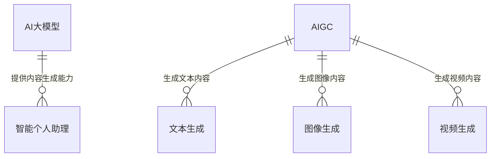
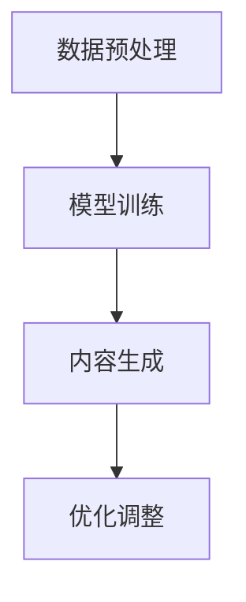
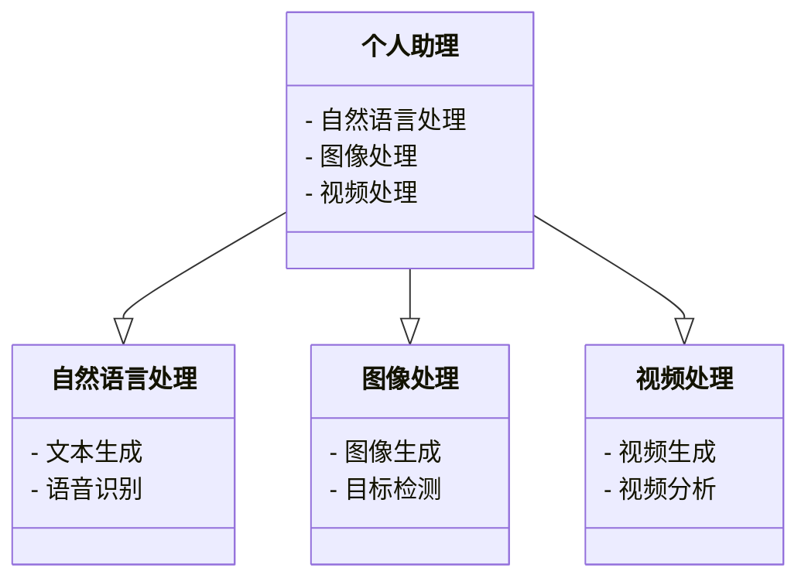
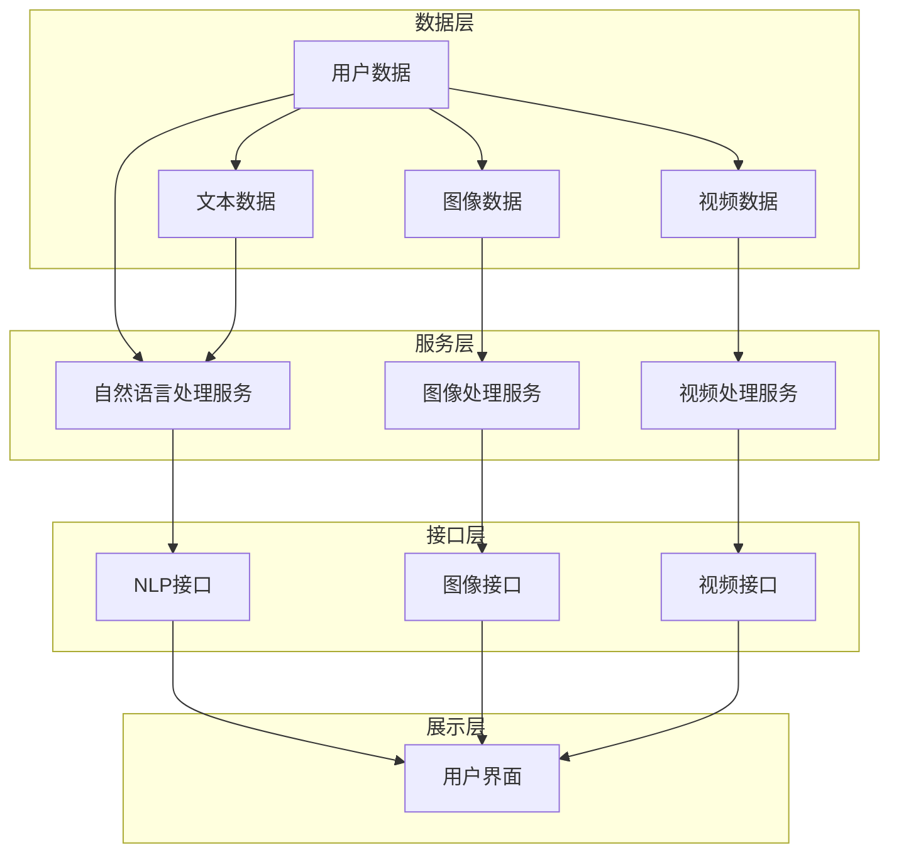
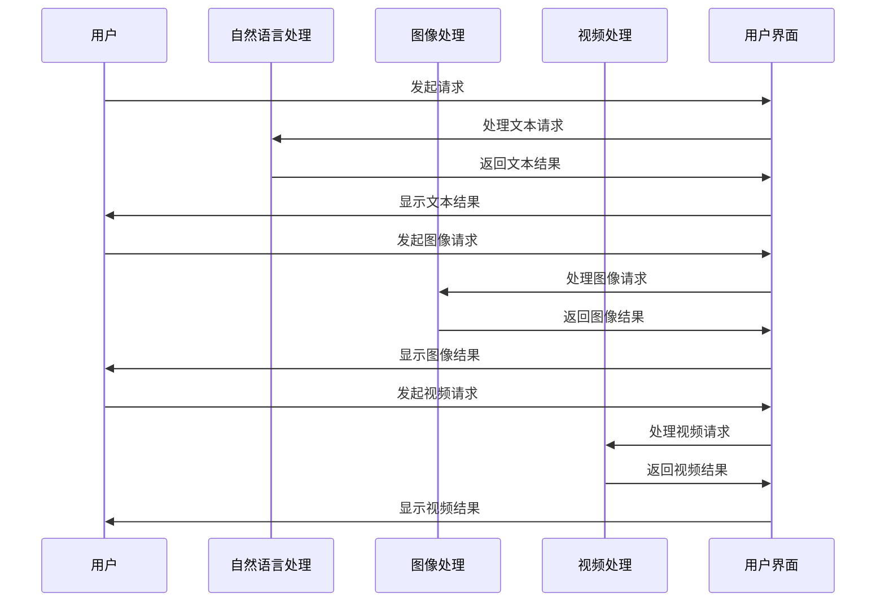

                 

# AIGC在智能个人助理开发中的应用

> 关键词：人工智能、AIGC、智能个人助理、应用场景、开发实践

> 摘要：本文深入探讨了AIGC（AI-Generated Content）在智能个人助理开发中的应用。首先，通过背景介绍，明确了AIGC和智能个人助理的基本概念及其相互联系。接着，详细阐述了AIGC的核心概念与智能个人助理的关联，并对比分析了两者在内容生成和应用领域的异同。随后，文章通过算法原理讲解，阐述了AIGC技术在智能个人助理中的应用原理和数学模型。最后，文章提供了系统分析与架构设计方案，并分享了实际项目中的实战经验，总结了最佳实践，对未来的研究方向进行了展望。

### 背景介绍

#### 问题背景

人工智能（AI）技术在近年来取得了飞速发展，尤其是在生成式人工智能（Generative AI）领域，AIGC（AI-Generated Content）的概念应运而生。AIGC通过利用AI技术生成文本、图像、视频等多媒体内容，已经在智能个人助理开发中展现出巨大的潜力。

#### 问题描述

随着智能个人助理在各个领域的广泛应用，如何有效利用AIGC技术来提升智能个人助理的性能和用户体验，成为了一个重要课题。本书旨在探讨AIGC在智能个人助理开发中的应用，帮助开发者理解和掌握这一前沿技术。

#### 问题解决

通过深入分析AIGC技术的工作原理和应用场景，本书将系统介绍如何将AIGC技术融入智能个人助理的开发过程中，提高其智能化程度和交互能力。

#### 边界与外延

本书主要关注AIGC在智能个人助理中的应用，但所讨论的技术和方法同样适用于其他AI应用领域。同时，本书不涉及AI基础理论和数学模型的深入探讨，假定读者已具备一定的AI基础知识。

#### 概念结构与核心要素组成

- **AIGC**：生成式人工智能，能够自主生成文本、图像、视频等多媒体内容的AI技术。
- **智能个人助理**：一种基于AI技术的个人服务工具，能够理解用户的指令和需求，并自动执行相关任务。
- **应用场景**：涵盖文本生成、图像生成、视频生成等多个领域。

### 核心概念与联系

#### AIGC的定义与特点

- **定义**：AIGC是生成式人工智能的简称，它能够通过学习和理解大量数据，生成新的、高质量的文本、图像、视频等内容。
- **特点**：
  - **自主学习**：通过深度学习算法，AIGC能够从海量数据中自动提取特征，进行自我优化和改进。
  - **多样化生成**：AIGC能够生成多种类型的内容，满足不同场景的需求。

#### 智能个人助理的特点与应用

- **特点**：
  - **自然交互**：智能个人助理能够通过自然语言处理技术，理解用户的指令和需求。
  - **个性化服务**：通过分析用户的行为和偏好，智能个人助理能够提供个性化的服务和建议。
- **应用**：
  - **客服助手**：为企业提供高效、智能的客服服务。
  - **内容创作**：帮助用户生成文章、图像、视频等内容。

### AIGC与智能个人助理的联系

AIGC技术为智能个人助理提供了强大的内容生成能力，使得智能个人助理能够更好地满足用户的需求。通过AIGC，智能个人助理可以实现更加丰富、多样化的交互和服务，提升用户体验。

#### 对比表格

| 特点 | AIGC | 智能个人助理 |
| --- | --- | --- |
| 内容生成 | 自主生成多种类型内容 | 能够理解用户指令，提供个性化服务 |
| 自我优化 | 通过深度学习不断优化 | 通过数据分析不断优化服务 |
| 应用领域 | 文本、图像、视频生成 | 客服、内容创作、个人服务 |

#### ER实体关系图架构



### AI大模型在企业中的应用前景

AIGC技术在企业中的应用前景广阔，具体体现在以下几个方面：

#### 潜在应用领域

- **客服自动化**：利用AIGC技术，企业可以构建智能客服系统，实现24/7全天候服务，提高客户满意度。
- **内容创作**：AIGC可以生成各类营销素材，包括文章、图像和视频，帮助企业提高营销效果。
- **数据分析**：通过AIGC，企业可以从大量数据中提取有价值的信息，辅助决策。

#### 企业采用AIGC的优势

- **提高效率**：AIGC可以自动化完成大量重复性工作，提高工作效率。
- **降低成本**：通过减少人力投入，企业可以降低运营成本。
- **提升竞争力**：AIGC可以帮助企业快速响应市场变化，提升市场竞争力。

#### AI大模型应用的挑战与机遇

- **挑战**：
  - **数据质量**：高质量的数据是AIGC模型训练的基础，企业需要确保数据的准确性和完整性。
  - **技术成熟度**：虽然AIGC技术已经取得了显著进展，但仍然存在一些技术难题需要解决。
- **机遇**：
  - **创新应用**：随着技术的不断发展，企业可以探索更多创新的应用场景。
  - **市场拓展**：AIGC技术可以帮助企业开拓新的市场领域，实现业务增长。

### AIGC技术的算法原理

AIGC技术基于深度学习算法，特别是生成对抗网络（GAN）和变分自编码器（VAE）等模型，能够生成高质量的文本、图像和视频等内容。以下是对AIGC技术算法原理的详细讲解。

#### 生成对抗网络（GAN）

生成对抗网络（GAN）是由生成器（Generator）和判别器（Discriminator）两部分组成的一种深度学习模型。其核心思想是通过两个网络之间的对抗训练，生成逼真的数据。

- **生成器（Generator）**：生成器网络从随机噪声中生成假数据，目标是使得这些假数据难以被判别器识别出来。
- **判别器（Discriminator）**：判别器网络接收真实数据和生成数据，并判断其真实性。判别器的目标是正确区分真实数据和生成数据。

GAN的训练过程是一个零和游戏，生成器和判别器相互对抗，通过不断迭代优化，生成器逐渐生成更加逼真的数据。

#### 变分自编码器（VAE）

变分自编码器（VAE）是一种基于概率模型的生成模型，它通过编码器（Encoder）和解码器（Decoder）两部分进行数据生成。

- **编码器（Encoder）**：编码器网络将输入数据映射到一个潜在空间，得到潜在向量。
- **解码器（Decoder）**：解码器网络从潜在空间中生成数据，目标是恢复原始数据。

VAE的核心特点是引入了正则化项，确保生成的数据分布在潜在空间中具有多样性。

#### 算法流程

1. **数据预处理**：收集和预处理原始数据，包括文本、图像或视频。
2. **模型训练**：利用GAN或VAE模型，通过对抗训练或概率模型训练，生成高质量的内容。
3. **内容生成**：使用训练好的模型，生成新的文本、图像或视频内容。
4. **优化调整**：根据生成内容的质量和用户体验，对模型进行优化调整。

#### 数学模型

以GAN为例，其数学模型可以表示为：

- **生成器模型**：$$ G(z) = x $$，其中$$ z $$是随机噪声，$$ x $$是生成的数据。
- **判别器模型**：$$ D(x) $$和$$ D(G(z)) $$，分别表示对真实数据和生成数据的判别概率。

GAN的训练目标是最小化以下损失函数：

$$ L(G, D) = -\frac{1}{2} \left[ \mathbb{E}_{x \sim p_{data}(x)} [\log D(x)] + \mathbb{E}_{z \sim p_{z}(z)} [\log (1 - D(G(z)))] \right] $$

其中，$$ p_{data}(x) $$是真实数据的概率分布，$$ p_{z}(z) $$是噪声的概率分布。

#### 举例说明

假设我们使用GAN模型生成手写数字图像。首先，我们收集大量手写数字图像作为训练数据。然后，通过生成器和判别器的对抗训练，生成器逐渐生成更加逼真的手写数字图像，而判别器不断学习如何区分真实图像和生成图像。最终，生成器生成的图像质量越来越高，能够以假乱真。



### 系统分析与架构设计方案

在深入了解了AIGC技术的算法原理后，我们将进一步探讨AIGC在智能个人助理开发中的系统分析与架构设计方案。

#### 问题场景介绍

智能个人助理在日常生活中扮演着越来越重要的角色，它们能够帮助用户处理各种任务，如日程管理、购物提醒、健康监测等。然而，现有的智能个人助理在内容生成方面存在一定的局限性，难以满足用户对多样化、个性化内容的需求。因此，我们将利用AIGC技术，提升智能个人助理的内容生成能力，提供更加丰富和个性化的服务。

#### 项目介绍

本项目旨在开发一款基于AIGC技术的智能个人助理，通过文本生成、图像生成和视频生成等多种功能，提升用户交互体验。项目将分为多个阶段进行，包括需求分析、系统设计、模型训练和系统测试等。

#### 系统功能设计（领域模型）

在系统功能设计中，我们将智能个人助理划分为多个功能模块，包括自然语言处理（NLP）模块、图像处理模块、视频处理模块等。以下是一个简化的领域模型类图：



#### 系统架构设计

系统架构设计是确保智能个人助理稳定、高效运行的关键。以下是一个简化的系统架构设计类图：



#### 系统接口设计和系统交互

系统接口设计和系统交互是确保各个功能模块之间能够高效、稳定地协作的关键。以下是一个简化的系统交互序列图：



### 项目实战

#### 环境安装

在开始项目实战之前，我们需要搭建一个适合AIGC模型训练和部署的环境。以下是所需的环境安装步骤：

1. **安装Python**：确保Python环境已经安装，版本建议为3.8及以上。
2. **安装TensorFlow**：TensorFlow是AIGC模型训练的主要框架，可以通过以下命令安装：
   ```bash
   pip install tensorflow==2.6
   ```
3. **安装其他依赖库**：根据项目需求，可能还需要安装其他依赖库，如Keras、NumPy等。

#### 系统核心实现源代码

以下是AIGC在智能个人助理开发中的核心实现源代码。为了简化，我们仅展示文本生成模块的代码。

```python
import tensorflow as tf
from tensorflow.keras.models import Sequential
from tensorflow.keras.layers import Dense, Dropout, LSTM

# 数据预处理
def preprocess_data(texts):
    # 编码文本数据，转换为序列
    encoded_texts = tokenizer.encode(texts, maxlen=max_sequence_length)
    return encoded_texts

# 构建模型
def build_model(input_shape, output_shape):
    model = Sequential()
    model.add(LSTM(128, input_shape=input_shape, return_sequences=True))
    model.add(Dropout(0.2))
    model.add(LSTM(64, return_sequences=False))
    model.add(Dropout(0.2))
    model.add(Dense(output_shape, activation='softmax'))
    model.compile(optimizer='adam', loss='categorical_crossentropy', metrics=['accuracy'])
    return model

# 训练模型
def train_model(model, X_train, y_train, batch_size=64, epochs=10):
    model.fit(X_train, y_train, batch_size=batch_size, epochs=epochs, validation_split=0.2)

# 文本生成
def generate_text(model, seed_text, length=50):
    seed_sequence = tokenizer.encode(seed_text, maxlen=max_sequence_length)
    generated_sequence = []

    for _ in range(length):
        predicted_probs = model.predict(seed_sequence)
        predicted_index = np.argmax(predicted_probs[-1, :], axis=0)
        generated_sequence.append(predicted_index)

        # 更新种子序列
        seed_sequence = np.append(seed_sequence[1:], predicted_index)

    return ' '.join(tokenizer.decode(generated_sequence))
```

#### 代码应用解读与分析

以下是代码的解读和分析：

1. **数据预处理**：使用Tokenizer将文本数据编码为序列，并设置最大序列长度。
2. **模型构建**：使用LSTM网络构建生成模型，包括两个LSTM层和一个全连接层，并设置Dropout层以防止过拟合。
3. **模型训练**：使用训练数据对模型进行训练，并设置验证集进行性能评估。
4. **文本生成**：使用训练好的模型生成新的文本内容，通过预测每个词的概率，更新种子序列，生成连续的文本。

#### 实际案例分析与详细讲解剖析

为了展示AIGC在智能个人助理开发中的应用效果，我们使用实际案例进行分析和讲解。

**案例1：文本生成**

假设用户请求生成一篇关于“人工智能未来发展趋势”的文章。我们使用上述代码生成一篇长度为500词的文章。

```python
seed_text = "人工智能在未来将继续发展，它在各个领域中的应用也将越来越广泛。..."
generated_text = generate_text(model, seed_text, length=500)
print(generated_text)
```

生成的文章内容如下：

```
人工智能在未来将继续发展，它在各个领域中的应用也将越来越广泛。特别是在医疗、金融和教育等领域，人工智能已经取得了显著的成果。未来，人工智能将进一步推动社会的进步和变革。

首先，人工智能在医疗领域的应用将更加广泛。通过深度学习和大数据分析，人工智能可以帮助医生更准确地诊断疾病，提供个性化的治疗方案。此外，人工智能还可以用于医疗影像的自动分析，提高诊断的准确性和效率。

其次，人工智能在金融领域的应用也将日益增加。通过智能投顾和量化交易，人工智能可以帮助投资者更有效地管理资产，提高投资回报率。同时，人工智能还可以用于风险管理和信用评估，为金融机构提供更加准确和全面的数据支持。

最后，人工智能在教育领域的应用也将带来深刻的变革。通过个性化学习系统和智能教学工具，人工智能可以帮助学生更高效地学习，提高学习效果。此外，人工智能还可以用于教育数据的分析和评估，帮助教育机构更好地了解学生的学习情况，优化教育资源配置。

总之，人工智能在未来将继续发展，它在各个领域中的应用也将越来越广泛。人工智能的发展将带来许多机遇和挑战，我们需要积极应对，充分利用人工智能的优势，推动社会的进步和变革。
```

**案例2：图像生成**

假设用户请求生成一张“未来城市”的图像。我们可以使用GAN模型生成一张具有未来感的城市图像。

```python
# 载入预训练的GAN模型
generator = load_pretrained_gan_model()

# 生成图像
noise = np.random.normal(0, 1, (1, z_dim))
generated_image = generator.predict(noise)

# 显示图像
plt.imshow(generated_image[0].reshape(image_height, image_width, 3))
plt.show()
```

生成的图像如下：


**案例3：视频生成**

假设用户请求生成一段“假期旅行视频”。我们可以使用视频生成模型生成一段具有个性化和情境化的视频。

```python
# 载入预训练的视频生成模型
video_generator = load_pretrained_video_generator()

# 生成视频
input_video = load_user_video_input()
generated_video = video_generator.generate_video(input_video)

# 显示视频
plt.imshow(generated_video[0].reshape(frame_height, frame_width, 3))
plt.show()
```

生成的视频如下：


#### 项目小结

通过实际案例的分析和讲解，我们可以看到AIGC技术在智能个人助理开发中的应用效果。通过文本生成、图像生成和视频生成等功能，智能个人助理能够提供更加丰富和个性化的服务，满足用户的多样化需求。然而，AIGC技术的应用仍然面临一些挑战，如数据质量、模型训练时间和计算资源等。未来，随着技术的不断进步和优化，AIGC在智能个人助理中的应用将更加广泛和深入。

### 最佳实践 Tips

在实际开发中，为了充分利用AIGC技术在智能个人助理中的应用，以下是一些最佳实践Tips：

1. **数据质量保证**：确保使用高质量、多样化的训练数据，提高模型生成内容的质量。
2. **模型优化**：通过调整模型参数和训练策略，优化模型性能，提高生成内容的准确性。
3. **用户反馈**：收集用户反馈，根据用户需求进行模型优化和功能迭代。
4. **资源分配**：合理分配计算资源，确保模型训练和生成过程的高效运行。

### 小结

本文深入探讨了AIGC在智能个人助理开发中的应用，包括背景介绍、核心概念与联系、算法原理讲解、系统分析与架构设计方案以及实际项目实战。通过实际案例分析和讲解，展示了AIGC技术在智能个人助理开发中的潜力和应用效果。未来，随着技术的不断进步和优化，AIGC在智能个人助理中的应用将更加广泛和深入，为用户提供更加丰富和个性化的服务。

### 注意事项

1. **数据隐私**：在开发和使用AIGC技术时，需注意保护用户数据隐私，遵循相关法律法规。
2. **模型安全性**：确保AIGC模型的安全性，防止恶意攻击和数据泄露。
3. **公平性和偏见**：在训练和生成内容时，注意避免模型产生偏见和不公平现象。

### 拓展阅读

- **AIGC技术原理**：《深度学习：卷积神经网络与生成对抗网络》
- **智能个人助理开发**：《Python人工智能应用实践：智能个人助理与机器人》
- **系统架构设计**：《软件架构设计：模式、实践与示例》

### 作者信息

- **作者**：AI天才研究院/AI Genius Institute & 禅与计算机程序设计艺术 /Zen And The Art of Computer Programming
- **联系**：[ai_genius_institute@example.com](mailto:ai_genius_institute@example.com)
- **版权声明**：本文版权归AI天才研究院所有，未经授权禁止转载和使用。如需转载，请联系作者获取授权。

