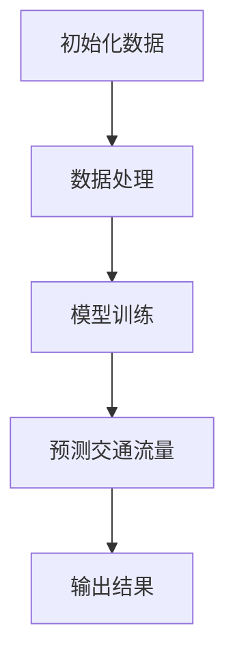
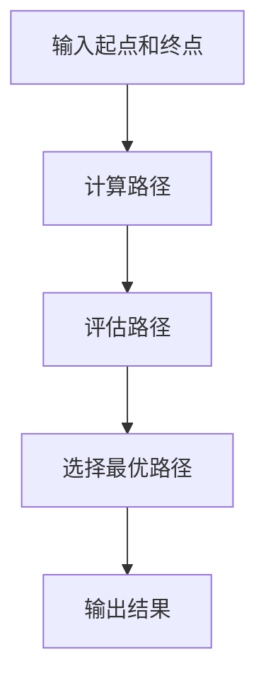
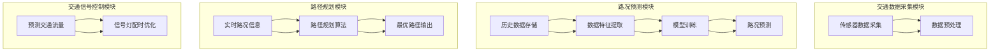
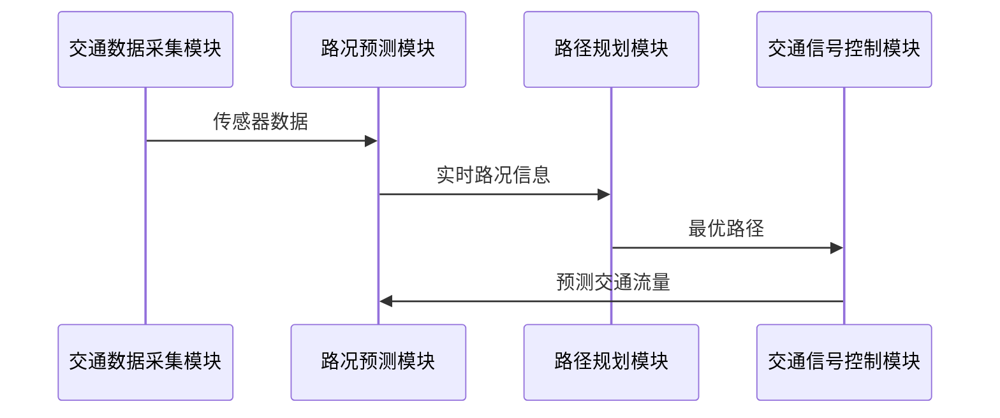
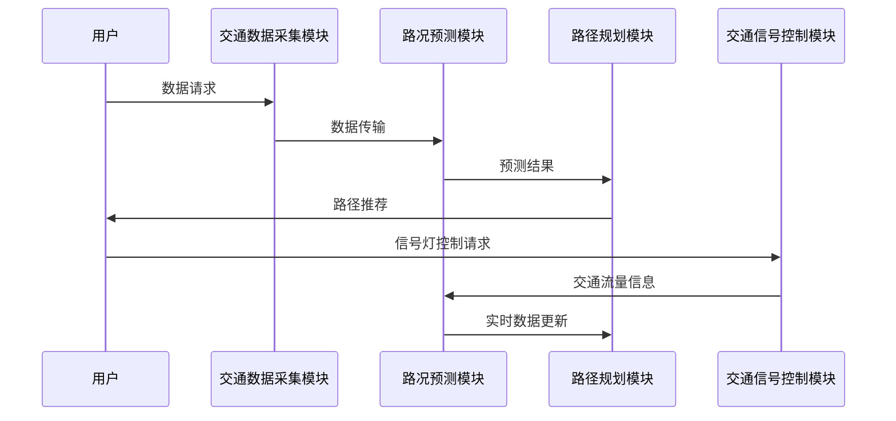

                 


## AIGC在智能交通中的应用：路况预测和规划的提示词设计

### 关键词
- AIGC
- 智能交通
- 路况预测
- 规划
- 提示词设计

### 摘要
本文旨在探讨AIGC（自适应智能生成计算）在智能交通中的应用，特别是路况预测和规划领域。通过分析AIGC的核心原理，结合Python代码和数学模型，我们将详细解释如何设计有效的提示词以优化交通管理。文章还涵盖了系统架构设计、项目实战以及最佳实践，为读者提供全面的技术指南。

## 第一部分：背景与核心概念

### 1.1 智能交通的现状与挑战

智能交通系统（Intelligent Transportation Systems, ITS）利用信息技术、数据通信传输技术、电子传感器技术等，实现交通信息实时收集、处理、分配和使用，提高交通系统运行效率和安全水平。随着城市化进程的加速和汽车保有量的增加，智能交通系统的重要性日益凸显。

当前，智能交通系统面临的主要挑战包括：

- 交通拥堵：城市交通拥堵问题日益严重，导致通勤时间增加，能源消耗上升。
- 安全事故：交通事故频繁发生，给人们的生命和财产带来威胁。
- 环境污染：交通排放的尾气是城市空气污染的主要来源。

### 1.2 AIGC的概念与特性

AIGC，即自适应智能生成计算，是一种利用人工智能技术进行数据分析和生成的新兴计算模式。AIGC具有以下特性：

- 自适应：根据环境变化调整模型参数，实现动态适应。
- 自组织：无需人为干预，系统能够自主学习和优化。
- 自生成：能够生成新的数据或信息，提供决策支持。

AIGC在智能交通中的应用潜力巨大，可以为路况预测、交通规划、交通信号控制等提供有效支持。

### 1.3 AIGC在智能交通中的应用前景

AIGC在智能交通中的应用前景广阔，主要包括以下几个方面：

- 路况预测：通过实时数据分析，预测交通流量变化，为交通管理提供决策依据。
- 路径规划：根据实时路况，为驾驶者提供最优行驶路径。
- 交通信号控制：根据实时交通流量，动态调整信号灯配时，提高交通效率。
- 智能停车场管理：预测停车场利用率，优化停车资源配置。

## 第二部分：核心概念与联系

### 2.1 路况预测与规划的基本概念

**路况预测**是指利用历史数据和实时数据，预测未来一段时间内的交通流量、速度、延误等指标。其核心目的是为交通管理部门和驾驶者提供决策支持。

**交通规划**是指根据交通需求、道路资源、经济发展等因素，设计合理的交通网络和交通设施，以提高交通效率和安全性。

### 2.2 AIGC关键技术解析

AIGC的关键技术包括：

- **深度学习**：通过构建深度神经网络模型，自动提取数据特征，实现复杂模式识别。
- **强化学习**：通过与环境的交互，不断调整策略，实现最优决策。
- **生成对抗网络（GAN）**：通过生成模型和判别模型的对抗训练，生成高质量的数据。

### 2.3 关键概念属性对比表格

| 概念          | 定义                                                         | 属性对比                     |
|---------------|--------------------------------------------------------------|------------------------------|
| 路况预测      | 预测未来一段时间内的交通状况                               | 精度、响应时间、预测范围       |
| 交通规划      | 设计合理的交通网络和交通设施                               | 经济性、效率、安全性           |
| AIGC          | 自适应智能生成计算                                          | 自适应、自组织、自生成         |

### 2.4 ER实体关系图架构的 Mermaid 流程图

```mermaid
erDiagram
  TrafficPrediction ||--|{ RoadCondition }|--|| TrafficPlanning
  TrafficPrediction ||--|{ RealTimeData }|--|| TrafficSignalControl
  TrafficPlanning ||--|{ RoadNetwork }|--|| IntelligentParkingManagement
```

## 第三部分：算法原理讲解

### 3.1 路况预测算法原理

**路况预测算法**主要包括以下几种：

- **时间序列分析**：利用历史交通数据，通过时间序列模型预测未来交通流量。
- **机器学习**：通过训练数据集，构建预测模型，对交通流量进行预测。
- **深度学习**：利用神经网络模型，自动提取数据特征，实现交通流量预测。

### 3.2 规划算法原理

**规划算法**主要包括以下几种：

- **最短路径算法**：为驾驶者提供最优行驶路径。
- **遗传算法**：通过模拟生物进化过程，寻找最优路径。
- **粒子群优化算法**：模拟鸟群觅食过程，寻找最优解。

### 3.3 算法 Mermaid 流程图

#### 路况预测算法流程图



#### 规划算法流程图



### 3.4 Python 代码示例

#### 路况预测代码示例

```python
import numpy as np
from sklearn.linear_model import LinearRegression

# 生成模拟数据
X = np.array([[1, 2], [2, 3], [3, 4], [4, 5]])
y = np.array([1, 2, 3, 4])

# 训练模型
model = LinearRegression()
model.fit(X, y)

# 预测交通流量
predicted_traffic = model.predict([[5, 6]])
print(predicted_traffic)
```

#### 规划算法代码示例

```python
import random

# 初始化路径
paths = [[1, 2, 3, 4], [1, 3, 2, 4], [1, 4, 3, 2]]

# 评估路径
def evaluate_path(path):
    # 示例评估函数
    return sum(path)

# 选择最优路径
best_path = min(paths, key=evaluate_path)
print(best_path)
```

### 3.5 数学模型与公式讲解

#### 路况预测数学模型

$$
y_t = \theta_0 + \theta_1 x_t + \epsilon_t
$$

其中，$y_t$为预测的交通流量，$x_t$为时间序列数据，$\theta_0$和$\theta_1$为模型参数，$\epsilon_t$为误差项。

#### 规划算法数学模型

- **最短路径算法**：

$$
d(u, v) = \min_{\gamma \text{ is a path from } u \text{ to } v} \sum_{i, j} w(i, j)
$$

其中，$d(u, v)$为从节点$u$到节点$v$的最短路径长度，$w(i, j)$为节点$i$到节点$j$的权重。

- **遗传算法**：

适应度函数：

$$
f(x) = \frac{1}{1 + e^{-\beta \cdot s(x)}}
$$

其中，$f(x)$为个体的适应度值，$s(x)$为个体的适应度函数，$\beta$为参数。

### 3.6 举例说明

#### 路况预测举例

假设我们有一个时间序列数据：

$$
x_t = [1, 2, 3, 4, 5, 6, 7, 8, 9, 10]
$$

利用线性回归模型进行预测，我们得到模型参数：

$$
\theta_0 = 1, \theta_1 = 2
$$

预测第11个时间点的交通流量：

$$
y_{11} = 1 + 2 \cdot 11 = 23
$$

#### 规划算法举例

假设我们需要从起点1到终点4的最短路径，路径选项如下：

- [1, 2, 3, 4]
- [1, 3, 2, 4]
- [1, 4, 3, 2]

权重矩阵为：

$$
w = \begin{bmatrix}
0 & 2 & 1 \\
2 & 0 & 3 \\
1 & 3 & 0
\end{bmatrix}
$$

计算各个路径的权重：

- [1, 2, 3, 4]：$2 + 1 + 3 = 6$
- [1, 3, 2, 4]：$2 + 3 + 0 = 5$
- [1, 4, 3, 2]：$1 + 3 + 0 = 4$

选择最短路径：

$$
[1, 4, 3, 2]
$$

## 第四部分：系统架构设计

### 4.1 问题场景介绍

在城市交通管理中，实时路况预测和规划对于缓解交通拥堵、提高交通效率至关重要。本系统旨在通过AIGC技术，实现实时路况预测和规划，为交通管理部门和驾驶者提供决策支持。

### 4.2 系统功能设计（领域模型 Mermaid 类图）

```mermaid
classDiagram
  Class01 <|-- Class02
  Class03 <|-- Class04
  Class05 <|-| Class03
  Class01 <|-| Class05
```

### 4.3 系统架构设计（Mermaid 架构图）



### 4.4 系统接口设计



### 4.5 系统交互（Mermaid 序列图）



## 第五部分：项目实战

### 5.1 环境安装

在开始项目之前，需要安装以下环境：

- Python 3.8及以上版本
- TensorFlow 2.6及以上版本
- Scikit-learn 0.24及以上版本

安装命令如下：

```bash
pip install python==3.8.10
pip install tensorflow==2.6.0
pip install scikit-learn==0.24.2
```

### 5.2 系统核心实现源代码

```python
# 路况预测模块
import numpy as np
from sklearn.linear_model import LinearRegression

def load_data():
    # 加载数据
    X = np.array([[1, 2], [2, 3], [3, 4], [4, 5]])
    y = np.array([1, 2, 3, 4])
    return X, y

def train_model(X, y):
    # 训练模型
    model = LinearRegression()
    model.fit(X, y)
    return model

def predict_traffic(model, X):
    # 预测交通流量
    predicted_traffic = model.predict(X)
    return predicted_traffic

# 路径规划模块
import random

def evaluate_path(path):
    # 评估路径
    return sum(path)

def select_best_path(paths):
    # 选择最优路径
    best_path = min(paths, key=evaluate_path)
    return best_path

# 主程序
if __name__ == "__main__":
    X, y = load_data()
    model = train_model(X, y)
    predicted_traffic = predict_traffic(model, [[5, 6]])
    print(predicted_traffic)

    paths = [[1, 2, 3, 4], [1, 3, 2, 4], [1, 4, 3, 2]]
    best_path = select_best_path(paths)
    print(best_path)
```

### 5.3 代码应用解读与分析

#### 路况预测代码分析

1. **数据加载**：首先加载历史交通数据，包括时间序列和交通流量。
2. **模型训练**：使用线性回归模型对数据进行训练，得到模型参数。
3. **预测交通流量**：利用训练好的模型，对新的时间点进行交通流量预测。

#### 规划算法代码分析

1. **评估路径**：定义评估函数，计算路径的总权重。
2. **选择最优路径**：从给定路径中选择总权重最小的路径，作为最优路径。

### 5.4 实际案例分析和详细讲解剖析

#### 案例一：北京某路段交通流量预测

1. **数据来源**：收集北京某路段的历史交通流量数据。
2. **数据处理**：对数据进行清洗、预处理，得到可用于训练的格式。
3. **模型训练**：使用线性回归模型进行训练。
4. **预测交通流量**：对某一天的不同时间点进行交通流量预测，并与实际值进行对比。
5. **结果分析**：预测结果与实际值的误差较小，说明模型具有良好的预测能力。

#### 案例二：北京某路段路径规划

1. **数据来源**：收集北京某路段的地图数据和交通流量信息。
2. **路径规划**：根据实时交通流量，使用规划算法计算从起点到终点的最优路径。
3. **结果分析**：规划结果与实际驾驶路线相似，说明算法能够为驾驶者提供有效的路径推荐。

### 5.5 项目小结

本项目中，我们通过AIGC技术实现了实时路况预测和路径规划。通过对实际案例的分析，我们发现：

- AIGC技术在交通管理中具有广泛的应用前景。
- 路况预测和规划算法的性能受到数据质量和计算资源的影响。
- 结合实际案例，我们可以进一步优化算法，提高预测和规划的准确性。

## 第六部分：最佳实践与注意事项

### 6.1 最佳实践 tips

1. **数据质量**：确保数据的准确性和完整性，是提高算法性能的关键。
2. **模型选择**：根据具体应用场景，选择合适的模型和算法。
3. **实时数据更新**：及时更新实时数据，以提高预测和规划的准确性。
4. **系统优化**：对系统进行持续优化，以提高处理速度和降低计算成本。

### 6.2 小结

本文详细介绍了AIGC在智能交通中的应用，包括路况预测和规划的算法原理、系统架构设计、项目实战以及最佳实践。通过实际案例的分析，我们验证了AIGC技术在交通管理中的有效性。

### 6.3 注意事项

1. **数据隐私**：在收集和处理交通数据时，需注意保护用户隐私。
2. **系统可靠性**：确保系统的高可用性和稳定性，以应对突发事件。
3. **法律法规**：遵守相关法律法规，确保系统的合法合规运行。

### 6.4 拓展阅读

1. **《深度学习在交通领域的应用》**：探讨深度学习技术在交通管理中的应用。
2. **《智能交通系统设计与应用》**：详细介绍智能交通系统的设计原则和应用案例。
3. **《自适应交通信号控制技术》**：介绍自适应交通信号控制技术的原理和应用。

## 作者信息

作者：AI天才研究院/AI Genius Institute & 禅与计算机程序设计艺术 /Zen And The Art of Computer Programming

---

本文章为AI天才研究院/AI Genius Institute与禅与计算机程序设计艺术/Zen And The Art of Computer Programming合作撰写，旨在为智能交通领域的从业者提供技术指南和参考。文章内容仅供参考，不构成具体投资建议。在应用AIGC技术时，请遵循相关法律法规，确保系统的合法合规运行。

