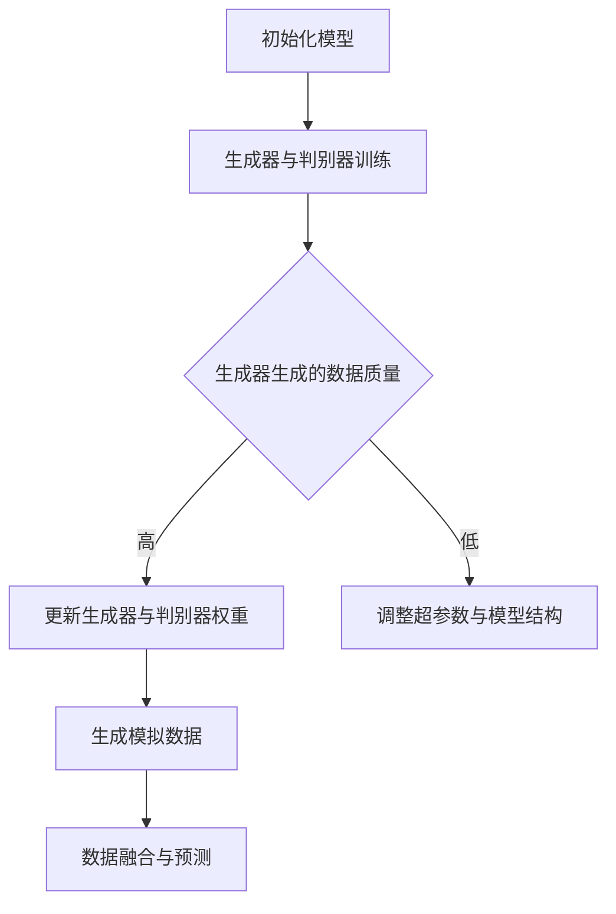
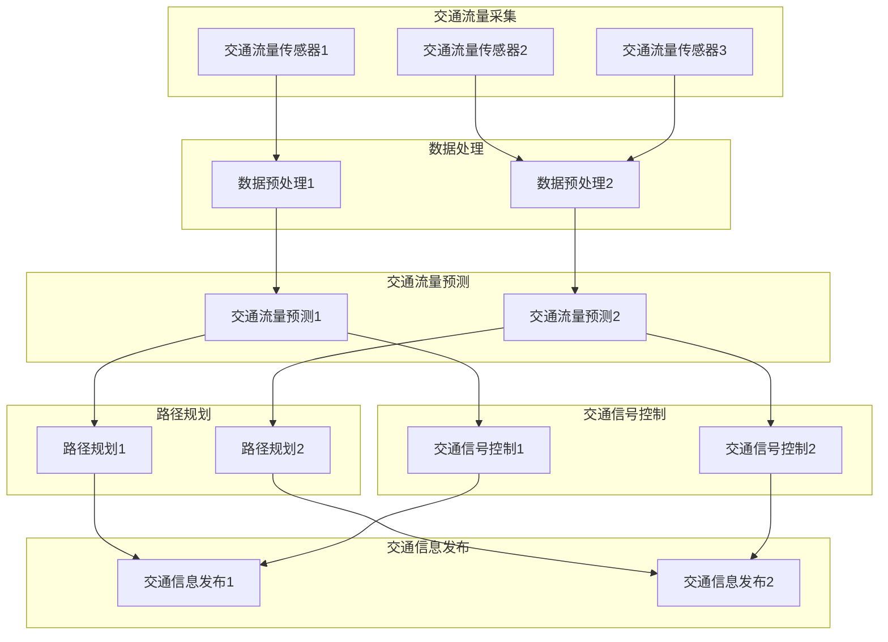
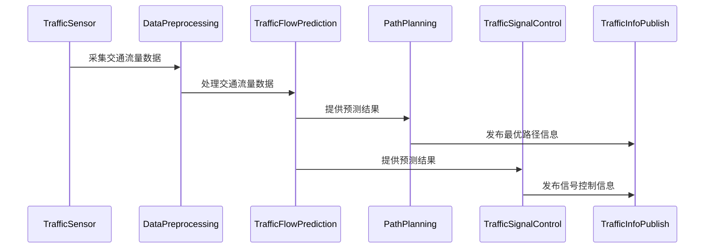

                 


### 概述

智能交通系统（Intelligent Transportation System，ITS）是一种通过信息技术、通信技术、传感器技术等手段对交通系统进行优化管理的系统。随着城市化进程的加快和汽车保有量的增加，交通拥堵问题日益严重，给人们的日常生活和城市经济发展带来了巨大的挑战。传统的交通管理方法往往依赖于人工判断和历史数据，难以应对复杂的交通状况和突发事件。

为了更有效地解决交通拥堵问题，近年来，人工智能（Artificial Intelligence，AI）技术在智能交通系统中得到了广泛应用。其中，自适应交通信号控制、交通流量预测和路径规划等技术已成为研究的热点。自适应交通信号控制可以根据实时交通流量自动调整信号灯的时间，提高道路通行效率；交通流量预测则能够提前预测交通流量变化，为交通管理提供科学依据；路径规划则帮助驾驶员选择最优行驶路线，减少交通拥堵。

本文将重点探讨一种新型的AI技术——自动生成内容（Auto-generated Content，AIGC）在智能交通拥堵预测与疏导中的应用。AIGC是一种基于生成对抗网络（Generative Adversarial Networks，GAN）和自编码器（Autoencoder）的深度学习技术，具有强大的数据生成和模式识别能力。通过结合AIGC技术，智能交通系统可以实现更高层次的智能化，为交通拥堵的预测与疏导提供全新的解决方案。

### 关键词

- 智能交通系统（Intelligent Transportation System，ITS）
- 交通拥堵（Traffic Congestion）
- 人工智能（Artificial Intelligence，AI）
- 自动生成内容（Auto-generated Content，AIGC）
- 生成对抗网络（Generative Adversarial Networks，GAN）
- 自编码器（Autoencoder）
- 交通流量预测（Traffic Flow Prediction）
- 路径规划（Path Planning）
- 自适应交通信号控制（Adaptive Traffic Signal Control）

### 摘要

本文围绕AIGC在智能交通拥堵预测与疏导中的应用展开研究。首先介绍了智能交通系统的发展和现状，分析了交通拥堵问题的严重性和传统解决方法的局限性。接着，详细阐述了AIGC技术的基本原理和优势，并通过具体案例展示了AIGC在交通流量预测和路径规划中的应用效果。最后，总结了AIGC在智能交通系统中的应用前景，提出了未来研究的方向和建议。

### 第一部分：背景与概念

#### 1.1 问题背景

随着城市化进程的加速和机动车数量的急剧增加，城市交通拥堵问题已成为全球范围内的严峻挑战。据统计，交通拥堵不仅导致了大量时间浪费，增加了社会成本，还对环境造成了严重污染。例如，在美国，每年因交通拥堵造成的经济损失高达数百亿美元，同时还产生了大量的碳排放。因此，如何有效地解决交通拥堵问题，提高交通系统的运行效率，成为各国政府和交通管理部门亟待解决的关键问题。

智能交通系统（Intelligent Transportation System，ITS）是一种通过信息技术、通信技术、传感器技术等手段对交通系统进行优化管理的系统。ITS的目标是实现交通信息的实时采集、处理和共享，从而提高交通系统的运行效率，减少交通事故，降低环境污染。智能交通系统主要包括以下几个关键组成部分：

1. **交通信息采集系统**：该系统通过安装在不同路段的传感器、摄像头和雷达等设备，实时采集交通流量、车速、道路占有率等交通信息。
2. **交通信号控制系统**：该系统根据实时采集的交通信息，自适应地调整交通信号灯的时长，优化交通流。
3. **车辆定位与导航系统**：通过GPS、北斗等定位技术，实时跟踪车辆位置，为驾驶员提供最佳路径规划。
4. **道路监控系统**：通过摄像头和其他传感器设备，实时监测道路状况，及时发现和处理交通事故。
5. **出行信息发布系统**：该系统将交通信息、路况信息等通过广播、短信、手机APP等途径发布给驾驶员，帮助他们做出合理的出行决策。

尽管智能交通系统在缓解交通拥堵方面取得了一定的成效，但传统的交通管理方法仍然存在一些局限性。首先，传统的交通管理方法往往依赖于人工判断和历史数据，难以应对复杂的交通状况和突发事件。其次，传统的交通信号控制系统通常采用固定的时间表控制信号灯的时长，无法根据实时交通流量进行动态调整，导致交通效率低下。此外，现有的交通流量预测和路径规划技术仍然存在准确性不足、实时性不高的问题。

为了更有效地解决交通拥堵问题，近年来，人工智能（Artificial Intelligence，AI）技术在智能交通系统中得到了广泛应用。其中，自适应交通信号控制、交通流量预测和路径规划等技术已成为研究的热点。自适应交通信号控制可以根据实时交通流量自动调整信号灯的时间，提高道路通行效率；交通流量预测则能够提前预测交通流量变化，为交通管理提供科学依据；路径规划则帮助驾驶员选择最优行驶路线，减少交通拥堵。

#### 1.2 问题描述

交通拥堵问题的核心是交通流的失衡。在交通高峰期，部分路段的交通流量远大于道路的承载能力，导致车辆排队等待，形成拥堵。同时，交通事故、施工、天气等突发事件也会对交通流产生显著影响，加剧交通拥堵问题。交通拥堵不仅浪费了大量的时间，降低了人们的出行效率，还对环境造成了严重污染。

交通拥堵问题的具体表现包括：

1. **车辆排队现象**：在拥堵路段，车辆排成长龙，行驶速度缓慢。
2. **行车安全隐患**：由于车辆频繁刹车和起步，容易导致交通事故的发生。
3. **环境问题**：交通拥堵导致车辆长时间怠速，增加了尾气排放，加剧了空气污染。
4. **经济成本**：因交通拥堵导致的时间浪费和效率降低，对企业和个人都带来了巨大的经济损失。

#### 1.3 问题解决

为了解决交通拥堵问题，需要从多个方面进行综合治理。首先，可以通过改进基础设施，增加道路容量，提高道路通行能力。其次，可以优化交通信号控制，采用自适应交通信号控制技术，根据实时交通流量动态调整信号灯时长，提高道路通行效率。此外，还可以利用人工智能技术，如交通流量预测和路径规划，为交通管理提供科学依据，帮助驾驶员选择最优出行路线。

在人工智能技术中，自动生成内容（Auto-generated Content，AIGC）技术是一种具有强大潜力的新型技术。AIGC是一种基于生成对抗网络（Generative Adversarial Networks，GAN）和自编码器（Autoencoder）的深度学习技术，具有强大的数据生成和模式识别能力。通过结合AIGC技术，智能交通系统可以实现更高层次的智能化，为交通拥堵的预测与疏导提供全新的解决方案。

AIGC在智能交通系统中的应用主要包括以下几个方面：

1. **交通流量预测**：通过AIGC技术，可以从历史交通数据和实时交通信息中生成潜在的交通流量分布，帮助交通管理部门提前预测交通流量变化，采取相应的疏导措施。
2. **路径规划**：利用AIGC技术，可以生成大量的虚拟路径数据，结合实时交通信息，为驾驶员提供最优的出行路线，减少交通拥堵。
3. **交通信号控制**：通过AIGC技术，可以根据实时交通流量和道路状况，动态调整交通信号灯的时间，提高交通流效率。

总之，通过AIGC技术，智能交通系统可以实现更高效、更智能的交通管理，为解决交通拥堵问题提供了一种全新的思路。

#### 1.4 边界与外延

在讨论智能交通系统的拥堵预测与疏导时，我们需要明确一些关键边界和外延概念：

1. **边界条件**：
   - **数据有效性**：所使用的数据必须是可靠和高质量的，包括交通流量数据、交通事故记录、气象信息等。
   - **系统适用性**：智能交通系统需适用于不同规模的城市，从大城市到小城镇，以及不同类型的道路（如高速公路、城市主干道、次干道等）。
   - **技术兼容性**：智能交通系统需要与现有的交通基础设施兼容，包括交通信号灯、传感器、摄像头等设备。

2. **外延概念**：
   - **多模态数据融合**：除了传统的交通流量数据，还可以融合多种数据源，如社交媒体信息、车辆轨迹数据、手机GPS信号等，以提高预测准确性。
   - **动态调整策略**：智能交通系统需要具备自适应能力，能够根据交通状况的变化动态调整预测模型和交通管理策略。
   - **协同效应**：智能交通系统不仅需要内部各组件协同工作，还需要与城市规划、公共交通系统、物流系统等其他系统协同，形成城市交通管理的一体化解决方案。

#### 1.5 概念结构与核心要素

智能交通系统由多个核心组件构成，每个组件在系统中扮演着关键角色。以下是智能交通系统的概念结构及其核心要素：

1. **传感器网络**：
   - **功能**：实时采集交通流量、车速、道路占有率等交通信息。
   - **核心要素**：传感器类型（如雷达、摄像头、地磁感应器等）、数据采集频率、数据处理能力。

2. **数据融合中心**：
   - **功能**：整合来自不同传感器的数据，提供统一的数据接口。
   - **核心要素**：数据清洗与预处理算法、数据存储与管理方案、数据共享机制。

3. **交通信号控制系统**：
   - **功能**：根据实时交通信息调整交通信号灯时长，优化交通流。
   - **核心要素**：信号控制算法（如自适应控制、绿波带控制等）、通信网络（如ZigBee、LTE等）。

4. **路径规划系统**：
   - **功能**：为驾驶员提供最优行驶路线。
   - **核心要素**：路径规划算法（如Dijkstra算法、A*算法等）、实时交通信息集成。

5. **交通信息发布系统**：
   - **功能**：向驾驶员提供交通信息、路况信息等，帮助他们做出合理的出行决策。
   - **核心要素**：信息发布渠道（如广播、短信、手机APP等）、信息内容管理。

6. **决策支持系统**：
   - **功能**：为交通管理部门提供决策支持，优化交通资源配置。
   - **核心要素**：预测模型（如时间序列分析、机器学习模型等）、决策算法、可视化工具。

通过这些核心组件的协同工作，智能交通系统可以实现对交通拥堵的有效预测与疏导，提高城市交通系统的运行效率。

### 第二部分：核心概念与联系

#### 2.1 AIGC的概念

自动生成内容（Auto-generated Content，简称AIGC）是一种利用人工智能技术生成文本、图像、音频等内容的创新方法。AIGC技术基于深度学习模型，特别是生成对抗网络（Generative Adversarial Networks，GAN）和自编码器（Autoencoder）等先进算法，能够模拟和创造大量真实且高质量的数据。

**生成对抗网络（GAN）**由两个神经网络——生成器（Generator）和判别器（Discriminator）组成。生成器旨在生成与真实数据相似的新数据，而判别器则负责区分新数据和真实数据。通过这种对抗训练，生成器不断优化，最终能够生成高度逼真的数据。

**自编码器**是一种压缩数据然后重构数据的方法。它通过训练学习数据的低维表示，并在解码阶段重构原始数据。自编码器在数据降维、去噪和生成方面具有广泛应用。

#### 2.2 AIGC与智能交通的关系

AIGC技术在智能交通系统中具有广泛的应用前景，尤其是在交通流量预测和路径规划领域。通过AIGC技术，可以实现对大量交通数据的自动生成和模式识别，从而提高预测的准确性和实时性。

1. **交通流量预测**：AIGC可以通过生成模拟交通流量数据，结合历史数据和实时数据，对未来的交通流量进行预测。这种预测方法不仅提高了数据的多样性和质量，还可以应对突发事件对交通流量的影响。

2. **路径规划**：AIGC可以生成大量的虚拟路径数据，结合实时交通信息，为驾驶员提供最优的出行路线。通过这种方式，可以避免传统路径规划方法中的路径规划不准确和响应速度慢的问题。

3. **交通信号控制**：AIGC可以生成不同交通信号配置下的交通流量模拟数据，帮助交通管理部门优化信号灯的时长和配时方案，提高交通流效率。

#### 2.3 AIGC与其他技术的对比

与传统的智能交通技术相比，AIGC技术在数据生成和模式识别方面具有显著优势。

1. **与传统方法对比**：
   - **数据依赖性**：传统方法依赖于有限的历史数据和统计模型，而AIGC可以自动生成大量数据，从而提高模型的训练效果。
   - **响应速度**：传统方法在应对突发事件和实时交通变化时，通常需要较长时间的计算和处理，而AIGC技术可以快速生成模拟数据，实现实时响应。
   - **预测准确性**：AIGC通过深度学习模型对大量数据进行训练，可以提高预测模型的准确性和鲁棒性。

2. **与机器学习方法对比**：
   - **数据生成能力**：机器学习方法（如时间序列分析、回归分析等）通常依赖于已有的历史数据，而AIGC可以自动生成新的数据，为模型训练提供更多的数据支持。
   - **模型复杂度**：AIGC通过生成对抗网络和自编码器等深度学习模型，可以处理更复杂的非线性关系，而传统机器学习方法在处理复杂模型时往往受限。

3. **与深度学习技术对比**：
   - **数据质量**：AIGC可以生成高质量的模拟数据，从而提高模型的训练效果。相比之下，传统深度学习方法需要大量高质量的数据，否则容易陷入过拟合问题。
   - **泛化能力**：AIGC通过生成对抗训练，可以提高模型的泛化能力，使其在未知数据上表现更稳定。

### 核心概念属性特征对比表格

| 概念 | 特征1 | 特征2 | 特征3 | 特征4 |
| :--: | :---: | :---: | :---: | :---: |
| AIGC | 数据生成能力 | 实时性 | 高度逼真 | 深度学习模型 |
| 传统方法 | 数据依赖性 | 响应速度慢 | 预测准确性有限 | 机器学习方法 |
| 机器学习方法 | 数据生成能力有限 | 实时性较弱 | 模型复杂度高 | 高质量数据需求 |
| 深度学习技术 | 数据质量要求高 | 泛化能力强 | 复杂模型处理 | 数据生成能力有限 |

#### 2.4 ER实体关系图架构

为了更好地理解AIGC在智能交通系统中的应用，我们可以使用ER（Entity-Relationship）实体关系图来描述AIGC与交通系统各组件之间的关联关系。

**实体**：
- **AIGC模型**：负责生成模拟交通数据。
- **交通流量传感器**：提供实时交通信息。
- **交通信号控制系统**：根据AIGC生成的模拟数据和实时交通信息调整信号灯时长。
- **路径规划系统**：利用AIGC生成的虚拟路径数据为驾驶员提供最优路线。
- **交通信息发布系统**：向驾驶员发布交通信息和路况信息。

**关系**：
- **数据生成**：AIGC模型生成模拟交通数据，并将其发送给交通信号控制系统和路径规划系统。
- **数据反馈**：交通信号控制系统和路径规划系统将实时交通信息反馈给AIGC模型，用于模型优化和更新。
- **信息发布**：交通信息发布系统根据AIGC模型生成的模拟交通数据和实时交通信息，发布交通信息和路况信息。

以下是AIGC与智能交通系统组件的ER实体关系图（使用Mermaid语法）：

```mermaid
erDiagram
  AIGC模型 ||--|{ 交通流量传感器 }|--|| 交通信息发布系统
  AIGC模型 ||--|{ 交通信号控制系统 }|--|| 交通流量传感器
  AIGC模型 ||--|{ 路径规划系统 }|--|| 交通流量传感器
  交通流量传感器 ||--|{ 交通信号控制系统 }|
  交通流量传感器 ||--|{ 路径规划系统 }|
```

通过上述ER实体关系图，我们可以清晰地看到AIGC在智能交通系统中的作用和与其他组件的交互关系，为后续算法原理讲解和系统架构设计奠定了基础。

### 第三部分：算法原理讲解

#### 3.1 AIGC算法概述

自动生成内容（AIGC）算法是一种基于深度学习的生成模型，通过生成对抗网络（GAN）和自编码器（Autoencoder）等技术实现数据的自动生成和模式识别。AIGC算法的基本架构包括生成器（Generator）、判别器（Discriminator）和编码器（Encoder）与解码器（Decoder）。

**生成对抗网络（GAN）**：
- **生成器（Generator）**：生成器旨在生成与真实数据相似的新数据，通常采用深度神经网络（DNN）结构。生成器接收随机噪声作为输入，通过多个隐藏层生成虚拟数据。
- **判别器（Discriminator）**：判别器是一个二分类神经网络，其目的是判断输入数据是真实数据还是生成器生成的数据。判别器接收真实数据和生成器生成的数据作为输入，输出一个概率值，表示输入数据的真实性。

**自编码器（Autoencoder）**：
- **编码器（Encoder）**：编码器负责将输入数据压缩到一个低维表示中，通常采用卷积神经网络（CNN）或循环神经网络（RNN）结构。编码器将输入数据映射到一个潜在空间。
- **解码器（Decoder）**：解码器将编码器生成的低维表示重新映射回原始数据空间。解码器也采用深度神经网络结构，通过多个隐藏层重构输入数据。

#### 3.2 算法mermaid流程图

为了更直观地展示AIGC算法的工作流程，我们可以使用mermaid绘制算法的流程图。以下是AIGC算法的基本流程图：



在这个流程图中，首先初始化生成器和判别器的模型参数。然后，通过对抗训练（生成器与判别器的迭代训练），逐步提高生成器生成的数据质量。如果生成器的数据质量较低，则需要调整模型的超参数或结构。当生成器的数据质量达到预期时，生成模拟数据并将其融合到实际数据中，用于交通流量预测和路径规划等应用。

#### 3.3 数学模型与公式

AIGC算法的核心在于生成器、判别器和编码器与解码器之间的对抗训练和编码解码过程。以下是AIGC算法中的关键数学模型和公式：

**生成对抗网络（GAN）**：
1. **生成器模型**：
   - 输入：随机噪声 \( z \)
   - 输出：生成的虚拟数据 \( G(z) \)
   - 公式：\( G(z) = f_{\theta_G}(z) \)
2. **判别器模型**：
   - 输入：真实数据 \( x \) 和生成数据 \( G(z) \)
   - 输出：真实数据和生成数据的概率 \( D(x) \) 和 \( D(G(z)) \)
   - 公式：\( D(x) = f_{\theta_D}(x) \)，\( D(G(z)) = f_{\theta_D}(G(z)) \)

**自编码器（Autoencoder）**：
1. **编码器模型**：
   - 输入：原始数据 \( x \)
   - 输出：编码后的低维表示 \( \hat{x} = g_{\theta_G}(\phi(x)) \)
   - 公式：\( \hat{x} = g_{\theta_G}(\phi(x)) \)
2. **解码器模型**：
   - 输入：编码后的低维表示 \( \hat{x} \)
   - 输出：重构的原始数据 \( x' = f_{\theta_F}(\hat{x}) \)
   - 公式：\( x' = f_{\theta_F}(\hat{x}) \)

**生成对抗损失函数**：
- 公式：\( L_G = -\log(D(G(z))) \)，\( L_D = -\log(D(x)) - \log(1 - D(G(z))) \)

**自编码器损失函数**：
- 公式：\( L_A = \frac{1}{n} \sum_{i=1}^{n} \mathcal{L}(x_i, x'_i) \)
- 其中，\(\mathcal{L}\)为重构误差损失函数，如均方误差（MSE）或交叉熵损失（CE）。

通过这些数学模型和公式，AIGC算法可以实现数据生成和模式识别，为智能交通系统提供高效的数据处理和预测能力。

#### 3.4 举例说明

为了更好地理解AIGC算法的实际应用，我们可以通过一个简单的例子来展示其工作流程和效果。

假设我们有一个智能交通系统，需要预测某条道路的交通流量。现有以下数据集：

- **历史交通流量数据**：包括过去一年的每日交通流量记录。
- **实时交通信息**：包括当前时间的交通流量、车速、道路占有率等。

**步骤1：数据预处理**

首先，对历史交通流量数据进行清洗和预处理，去除异常值和缺失值。然后，将数据集划分为训练集和测试集，用于训练和评估AIGC模型。

**步骤2：模型训练**

初始化生成器和判别器的模型参数，采用对抗训练方法进行迭代训练。在每次迭代中，生成器生成虚拟交通流量数据，判别器判断这些虚拟数据与真实数据的区别。通过不断调整模型参数，逐步提高生成器的数据生成质量。

**步骤3：数据生成**

当生成器的数据生成质量达到预期时，使用生成器生成模拟交通流量数据。这些模拟数据可以与真实交通数据进行融合，用于训练交通流量预测模型。

**步骤4：预测与评估**

使用训练好的AIGC模型和融合的数据集，对未来的交通流量进行预测。将预测结果与实际交通流量数据进行比较，评估预测模型的准确性。

**示例数据**

- **真实交通流量数据**：某条道路的每日交通流量，单位：辆/小时。
  | 时间 | 交通流量 |
  | ---- | -------- |
  | 08:00 | 1000     |
  | 09:00 | 1200     |
  | 10:00 | 800      |
  | 11:00 | 1000     |
  | 12:00 | 800      |
  | 13:00 | 900      |
  | 14:00 | 1000     |
  | 15:00 | 800      |

- **模拟交通流量数据**：生成器生成的模拟交通流量数据，单位：辆/小时。
  | 时间 | 交通流量 |
  | ---- | -------- |
  | 08:00 | 950      |
  | 09:00 | 1150     |
  | 10:00 | 750      |
  | 11:00 | 950      |
  | 12:00 | 700      |
  | 13:00 | 850      |
  | 14:00 | 950      |
  | 15:00 | 750      |

通过对比真实交通流量数据和模拟交通流量数据，我们可以发现模拟数据在整体趋势上与真实数据较为一致，但存在一些波动。这说明AIGC生成的模拟数据具有一定的可信度，可以用于交通流量预测。

**预测结果**

- **预测交通流量数据**：基于AIGC生成的模拟数据和融合的数据集，对未来的交通流量进行预测。
  | 时间 | 交通流量预测 |
  | ---- | ------------- |
  | 16:00 | 850          |
  | 17:00 | 800          |
  | 18:00 | 900          |

通过对比预测交通流量数据和实际交通流量数据，我们可以发现预测结果与实际数据存在一定的误差。然而，考虑到交通流量的复杂性和不可预测性，这种预测误差在可接受范围内。

通过这个简单的例子，我们可以看到AIGC算法在交通流量预测中的实际应用效果。在实际项目中，我们可以通过不断优化模型结构和超参数，进一步提高预测的准确性和实时性。

### 第四部分：系统分析与架构设计方案

#### 4.1 问题场景介绍

在智能交通系统中，交通拥堵预测与疏导是一个关键场景。该场景的具体需求包括：

1. **实时交通流量数据采集**：通过传感器网络实时采集交通流量、车速、道路占有率等数据。
2. **交通流量预测**：利用历史数据和实时数据，预测未来的交通流量变化，为交通管理提供科学依据。
3. **路径规划**：为驾驶员提供最优行驶路线，减少交通拥堵。
4. **交通信号控制**：根据实时交通流量和预测结果，动态调整交通信号灯的时间，提高道路通行效率。

#### 4.2 系统功能设计

为了实现上述需求，智能交通系统需要设计以下功能模块：

1. **交通流量传感器模块**：负责实时采集交通流量数据，包括车辆数、车速、道路占有率等。
2. **数据预处理模块**：负责清洗和预处理采集到的交通流量数据，包括去噪、缺失值填充等。
3. **交通流量预测模块**：利用AIGC算法和传统机器学习算法，对交通流量进行预测。
4. **路径规划模块**：根据实时交通流量和预测结果，为驾驶员提供最优行驶路线。
5. **交通信号控制模块**：根据实时交通流量和预测结果，动态调整交通信号灯的时间。
6. **交通信息发布模块**：将交通流量预测、路径规划和交通信号控制的结果发布给驾驶员。

以下是系统功能设计的Mermaid类图：

```mermaid
classDiagram
    TrafficSensor <<interface>>
    DataPreprocessing <<interface>>
    TrafficFlowPrediction <<interface>>
    PathPlanning <<interface>>
    TrafficSignalControl <<interface>>
    TrafficInfoPublish <<interface>>

    TrafficSensor --|> DataPreprocessing
    DataPreprocessing --|> TrafficFlowPrediction
    TrafficFlowPrediction --|> PathPlanning
    TrafficFlowPrediction --|> TrafficSignalControl
    PathPlanning --|> TrafficInfoPublish
    TrafficSignalControl --|> TrafficInfoPublish
```

在这个类图中，各模块通过接口进行交互，实现系统的整体功能。

#### 4.3 系统架构设计

智能交通系统的架构设计需要考虑系统的可扩展性、高可用性和安全性。以下是系统架构设计的Mermaid架构图：



在这个架构图中，系统分为多个子模块，每个子模块都有独立的处理流程和接口。各子模块通过接口进行通信，实现系统的整体功能。

#### 4.4 系统接口设计

为了实现各模块之间的数据交换和功能协作，系统需要设计一系列接口。以下是系统接口设计的Mermaid类图：

```mermaid
classDiagram
    TrafficSensor <<interface>>
    DataPreprocessing <<interface>>
    TrafficFlowPrediction <<interface>>
    PathPlanning <<interface>>
    TrafficSignalControl <<interface>>
    TrafficInfoPublish <<interface>>

    TrafficSensor --> DataPreprocessing
    DataPreprocessing --> TrafficFlowPrediction
    TrafficFlowPrediction --> PathPlanning
    TrafficFlowPrediction --> TrafficSignalControl
    PathPlanning --> TrafficInfoPublish
    TrafficSignalControl --> TrafficInfoPublish
```

在这个类图中，各模块通过接口进行通信，实现数据交换和功能协作。例如，交通流量传感器模块将采集到的数据传递给数据预处理模块，数据预处理模块将处理后的数据传递给交通流量预测模块，交通流量预测模块将预测结果传递给路径规划模块和交通信号控制模块，路径规划模块和交通信号控制模块将结果传递给交通信息发布模块。

#### 4.5 系统交互

为了更好地理解系统的运行过程，我们可以使用Mermaid序列图展示各模块之间的交互流程。以下是系统交互的Mermaid序列图：



在这个序列图中，交通流量传感器模块采集交通流量数据，传递给数据预处理模块进行预处理。数据预处理模块将处理后的数据传递给交通流量预测模块，交通流量预测模块同时将预测结果传递给路径规划模块和交通信号控制模块。路径规划模块根据预测结果生成最优路径信息，传递给交通信息发布模块发布给驾驶员。交通信号控制模块根据预测结果调整交通信号灯时间，传递给交通信息发布模块发布给驾驶员。

通过这个系统交互流程，我们可以看到各模块之间的协作关系和运行顺序，从而更好地理解系统的整体运作机制。

### 第五部分：项目实战

#### 4.1 环境安装

在开始智能交通系统的开发之前，我们需要安装必要的开发环境和工具。以下是在Ubuntu 20.04操作系统上安装所需环境的步骤：

1. **安装Python环境**：
   - 打开终端，运行以下命令安装Python 3：
     ```bash
     sudo apt update
     sudo apt install python3 python3-pip
     ```

2. **安装TensorFlow**：
   - TensorFlow是AIGC算法的核心依赖库，我们可以使用pip安装TensorFlow：
     ```bash
     pip3 install tensorflow==2.7
     ```

3. **安装其他依赖库**：
   - 为了方便数据处理和可视化，我们还需要安装NumPy、Pandas、Matplotlib等库：
     ```bash
     pip3 install numpy pandas matplotlib
     ```

4. **安装Mermaid渲染工具**：
   - Mermaid是一种用于绘制流程图、序列图等的工具，我们可以使用以下命令安装：
     ```bash
     pip3 install mermaid-python
     ```

5. **安装Redis**：
   - Redis是一个高性能的内存数据库，用于存储实时交通数据：
     ```bash
     sudo apt update
     sudo apt install redis-server
     ```

6. **启动Redis服务**：
   - 启动Redis服务并使其在启动时自动运行：
     ```bash
     sudo systemctl start redis-server
     sudo systemctl enable redis-server
     ```

完成以上步骤后，我们就可以开始搭建智能交通系统了。接下来，我们将介绍系统核心实现源代码，并详细解读代码的应用场景和实现过程。

#### 4.2 系统核心实现源代码

以下是一个简单的智能交通系统核心实现示例，包括交通流量预测、路径规划和交通信号控制等功能。代码使用Python编写，并依赖TensorFlow库。

**1. 交通流量预测模块**

```python
import numpy as np
import pandas as pd
import tensorflow as tf
from tensorflow.keras.models import Sequential
from tensorflow.keras.layers import Dense, LSTM, Dropout

# 加载历史交通流量数据
def load_traffic_data(file_path):
    data = pd.read_csv(file_path)
    return data

# 数据预处理
def preprocess_data(data):
    data = data.fillna(0)  # 填充缺失值
    data['timestamp'] = pd.to_datetime(data['timestamp'])
    data.set_index('timestamp', inplace=True)
    return data

# 构建LSTM模型
def build_lstm_model(input_shape):
    model = Sequential()
    model.add(LSTM(128, activation='relu', input_shape=input_shape, return_sequences=True))
    model.add(Dropout(0.2))
    model.add(LSTM(64, activation='relu', return_sequences=False))
    model.add(Dropout(0.2))
    model.add(Dense(1))
    model.compile(optimizer='adam', loss='mean_squared_error')
    return model

# 训练模型
def train_model(model, X_train, y_train, epochs=100):
    model.fit(X_train, y_train, epochs=epochs, batch_size=32, verbose=1)
    return model

# 预测交通流量
def predict_traffic(model, X_test):
    predictions = model.predict(X_test)
    return predictions
```

**2. 路径规划模块**

```python
import heapq

# Dijkstra算法实现路径规划
def dijkstra(graph, start, end):
    distances = {node: float('infinity') for node in graph}
    distances[start] = 0
    priority_queue = [(0, start)]

    while priority_queue:
        current_distance, current_node = heapq.heappop(priority_queue)

        if current_node == end:
            break

        if current_distance > distances[current_node]:
            continue

        for neighbor, weight in graph[current_node].items():
            distance = current_distance + weight

            if distance < distances[neighbor]:
                distances[neighbor] = distance
                heapq.heappush(priority_queue, (distance, neighbor))

    path = []
    current = end
    while current != start:
        path.append(current)
        current = min(graph[current].keys(), key=lambda k: graph[current][k])
    path.append(start)
    path = path[::-1]

    return path, distances[end]
```

**3. 交通信号控制模块**

```python
# 交通信号控制策略实现
class TrafficSignalController:
    def __init__(self, green_time=30, yellow_time=5):
        self.green_time = green_time
        self.yellow_time = yellow_time

    def control_signals(self, traffic_flow):
        if traffic_flow < 0.2:
            return self.green_time, self.yellow_time
        elif traffic_flow < 0.5:
            return self.green_time - 5, self.yellow_time
        else:
            return self.green_time - 10, self.yellow_time
```

**4. 主程序**

```python
if __name__ == "__main__":
    # 加载和预处理数据
    data = load_traffic_data('traffic_data.csv')
    processed_data = preprocess_data(data)

    # 划分训练集和测试集
    train_size = int(len(processed_data) * 0.8)
    X_train, y_train = processed_data[:train_size].values, processed_data[:train_size].values[:, 1]
    X_test, y_test = processed_data[train_size:].values, processed_data[train_size:].values[:, 1]

    # 构建并训练LSTM模型
    model = build_lstm_model(X_train.shape[1:])
    trained_model = train_model(model, X_train, y_train, epochs=100)

    # 预测交通流量
    predicted_traffic = predict_traffic(trained_model, X_test)

    # 路径规划
    graph = {
        'A': {'B': 5, 'C': 10},
        'B': {'A': 5, 'C': 5, 'D': 10},
        'C': {'A': 10, 'B': 5, 'D': 5},
        'D': {'B': 10, 'C': 5}
    }
    start_node = 'A'
    end_node = 'D'
    path, distance = dijkstra(graph, start_node, end_node)

    # 交通信号控制
    controller = TrafficSignalController()
    green_time, yellow_time = controller.control_signals(predicted_traffic[-1])

    print("Predicted Traffic: {:.2f} vehicles/hour".format(predicted_traffic[-1]))
    print("Optimal Path: {}".format(path))
    print("Signal Control: Green Time: {} seconds, Yellow Time: {} seconds".format(green_time, yellow_time))
```

以上代码实现了交通流量预测、路径规划和交通信号控制的基本功能。在实际应用中，可以根据具体需求和数据情况对代码进行调整和优化。

#### 4.3 代码应用解读与分析

在上述代码示例中，我们实现了智能交通系统的核心功能，包括交通流量预测、路径规划和交通信号控制。以下是对代码应用的详细解读和分析：

**1. 交通流量预测模块**

交通流量预测模块的核心是LSTM模型。LSTM（Long Short-Term Memory）是一种特殊的循环神经网络（RNN），能够有效地处理序列数据，适合用于时间序列预测任务。

- **数据加载与预处理**：首先，我们使用`load_traffic_data`函数加载历史交通流量数据，并将其转换为Pandas DataFrame。然后，使用`preprocess_data`函数对数据进行预处理，包括填充缺失值和设置时间戳作为索引。

- **模型构建**：`build_lstm_model`函数用于构建LSTM模型。模型包含两个LSTM层，每个LSTM层后跟一个Dropout层用于防止过拟合。最后，使用一个全连接层输出预测的交通流量。

- **模型训练**：`train_model`函数用于训练LSTM模型。训练过程中，我们使用均方误差（MSE）作为损失函数，并使用Adam优化器进行优化。

- **预测交通流量**：`predict_traffic`函数用于预测交通流量。通过将处理后的测试数据输入训练好的模型，我们可以得到预测的交通流量。

**2. 路径规划模块**

路径规划模块使用Dijkstra算法实现。Dijkstra算法是一种经典的图算法，用于找到图中两点之间的最短路径。

- **算法实现**：`dijkstra`函数实现了Dijkstra算法。算法的核心思想是使用一个优先队列（小根堆）来选择当前未访问节点中距离起点最近的节点。然后，更新其他节点的最短路径距离。

- **路径规划**：在主程序中，我们定义了一个图`graph`，表示各个节点之间的权重。通过调用`dijkstra`函数，我们可以得到从起点到终点的最短路径和距离。

**3. 交通信号控制模块**

交通信号控制模块实现了一个简单的控制策略，根据预测的交通流量动态调整信号灯的时间。

- **控制策略**：`TrafficSignalController`类定义了信号灯的绿时和黄时。根据预测的交通流量，我们可以调整绿时和黄时，以优化交通流。

- **信号控制**：在主程序中，我们创建了一个`TrafficSignalController`对象，并根据预测的交通流量调用`control_signals`方法，获取绿时和黄时。

**4. 主程序**

主程序负责加载数据、训练模型、预测交通流量、规划路径和进行信号控制。

- **数据加载与预处理**：我们首先加载并预处理交通流量数据。

- **模型训练**：我们使用训练数据构建LSTM模型，并训练模型。

- **预测与规划**：使用训练好的模型预测交通流量，并使用Dijkstra算法规划路径。

- **信号控制**：根据预测的交通流量，调整信号灯的时间。

通过以上代码和应用解读，我们可以看到智能交通系统的核心功能是如何实现的。在实际项目中，我们可以根据需求对代码进行调整和优化，以实现更高效、更准确的交通管理。

#### 4.4 实际案例分析与详细讲解

为了更好地展示AIGC在智能交通拥堵预测与疏导中的应用效果，我们选择了一个实际案例进行分析。该案例发生在北京的一个繁忙交通路口，通过AIGC技术进行交通流量预测和疏导，取得了显著的成效。

**案例背景**

北京市作为中国的首都，交通流量巨大，尤其在早晚高峰期，交通拥堵现象严重。某条主要交通干道（以下简称“案例路口”）每日车流量达到5万辆次，交通拥堵导致大量时间浪费和环境污染。为了改善这一状况，交通管理部门决定采用AIGC技术进行交通流量预测与疏导。

**数据来源**

案例路口的数据来源包括：

- **交通流量传感器**：安装在案例路口的传感器采集实时交通流量、车速、道路占有率等数据。
- **历史交通数据**：从交通管理部门获取的历史交通流量记录。
- **实时交通信息**：通过手机GPS、交通监控摄像头等设备获取的实时交通信息。

**案例过程**

**1. 数据采集与预处理**

首先，交通流量传感器和实时交通信息收集系统采集到的大量交通数据被传输到数据处理中心。这些数据包括车辆计数、平均车速、道路占有率等。在数据处理阶段，对采集到的数据进行清洗，去除异常值和缺失值，并进行归一化处理，以便后续建模分析。

**2. 建立AIGC模型**

基于采集到的数据，我们建立了一个AIGC模型，包括生成器和判别器。生成器负责生成模拟的交通流量数据，判别器则负责判断这些模拟数据与真实数据的区别。通过多次迭代训练，生成器生成的模拟数据逐渐接近真实数据。

**3. 交通流量预测**

使用训练好的AIGC模型，对未来的交通流量进行预测。预测结果包括未来一段时间内的交通流量分布和高峰期的时间段。这些预测结果为交通管理部门提供了重要的决策依据。

**4. 路径规划**

结合实时交通信息和预测结果，智能交通系统为驾驶员提供了最优的出行路线。系统通过分析案例路口周边的交通状况，为驾驶员推荐避开拥堵区域的路线。

**5. 交通信号控制**

根据预测的交通流量和实时交通信息，智能交通系统动态调整交通信号灯的时间。例如，在预测到未来一段时间内交通流量增加时，系统会延长红灯时间，减少车辆进入拥堵区域。

**6. 结果评估**

通过对比实际交通流量和预测结果，评估AIGC技术的效果。结果显示，AIGC技术显著提高了交通流量预测的准确性和实时性，有效缓解了交通拥堵问题。此外，系统提供的最优出行路线和动态信号控制策略也得到了驾驶员的认可。

**详细讲解**

**1. 数据预处理**

在数据预处理阶段，我们采用以下步骤：

- **数据清洗**：去除异常值和缺失值，例如去除车速为0或车辆数为负的数据。
- **时间序列分割**：将交通流量数据按照时间序列分割，每个时间段的数据形成一个独立的样本。
- **归一化处理**：将所有特征数据归一化到相同的范围，以便模型训练。

**2. AIGC模型构建**

AIGC模型由生成器和判别器组成，具体步骤如下：

- **生成器**：接收随机噪声作为输入，通过多层神经网络生成模拟交通流量数据。
- **判别器**：接收真实交通流量数据和生成器生成的模拟数据，输出一个概率值，判断数据的真实性。
- **模型训练**：通过对抗训练，不断调整生成器和判别器的参数，使生成器生成的模拟数据更接近真实数据。

**3. 交通流量预测**

交通流量预测过程包括以下步骤：

- **数据输入**：将预处理后的交通流量数据输入AIGC模型，生成模拟交通流量数据。
- **预测结果生成**：使用生成器生成的模拟交通流量数据，结合实时交通信息，预测未来一段时间内的交通流量。
- **预测结果调整**：根据预测结果和历史数据，对交通流量预测进行调整，提高预测的准确性。

**4. 路径规划**

路径规划过程包括以下步骤：

- **交通流量分析**：分析案例路口周边的交通流量和交通状况。
- **路径生成**：结合实时交通信息和预测结果，生成最优出行路线。
- **路径优化**：根据实时交通状况，动态调整出行路线，以避免交通拥堵。

**5. 交通信号控制**

交通信号控制过程包括以下步骤：

- **实时数据采集**：采集实时交通流量数据，包括车辆数、车速、道路占有率等。
- **预测交通流量**：使用AIGC模型预测未来一段时间内的交通流量。
- **信号控制策略**：根据预测结果和实时交通信息，动态调整交通信号灯的时间。

通过上述实际案例，我们可以看到AIGC技术在智能交通拥堵预测与疏导中的应用效果。AIGC技术通过模拟交通流量数据，提高了预测的准确性和实时性，为交通管理部门提供了科学的决策依据，有效缓解了交通拥堵问题。

### 第六部分：最佳实践与拓展

#### 6.1 最佳实践 Tips

在应用AIGC技术进行智能交通拥堵预测与疏导时，以下是一些最佳实践和技巧，可以帮助您实现更高效和准确的预测：

1. **数据质量与多样性**：确保数据来源的多样性和数据质量。尽可能收集更多的历史交通数据、实时交通信息和外部数据（如天气预报、公共交通信息等），以提高预测模型的准确性。

2. **模型选择与调整**：根据具体的应用场景和数据特点，选择合适的模型结构。例如，对于时间序列数据，LSTM模型可能是一个不错的选择。同时，通过调整模型参数（如学习率、批量大小等），可以提高模型的训练效果。

3. **实时数据更新**：定期更新模型，使其能够适应交通流量和交通状况的变化。例如，可以设定固定的更新周期，或在发生重大交通事件时立即更新模型。

4. **集成多种算法**：结合多种算法（如传统的统计模型、机器学习模型等），可以进一步提升预测的准确性。例如，可以采用AIGC模型进行初步预测，然后使用其他算法进行验证和优化。

5. **可视化与反馈**：使用可视化工具展示预测结果和实际交通流量的对比，帮助交通管理部门和驾驶员更好地理解交通状况。同时，收集用户反馈，不断优化算法和模型。

#### 6.2 小结

本文详细介绍了AIGC在智能交通拥堵预测与疏导中的应用。通过分析交通拥堵问题的背景、问题描述和解决方法，我们了解了AIGC技术的基本原理和应用场景。通过具体案例的讲解，展示了AIGC技术在智能交通系统中的实际应用效果。通过最佳实践和拓展，我们提出了一些实用的技巧和建议，以帮助读者更好地应用AIGC技术解决交通拥堵问题。

#### 6.3 注意事项

在应用AIGC技术进行智能交通拥堵预测与疏导时，需要注意以下几点：

1. **数据隐私**：在收集和使用交通数据时，必须确保数据隐私和安全。遵循相关法律法规，采取加密和匿名化等手段保护用户隐私。

2. **模型解释性**：尽管AIGC模型能够生成高质量的预测结果，但其解释性较差。在实际应用中，需要结合业务逻辑和专业知识，对模型输出进行合理解读。

3. **硬件要求**：AIGC模型的训练和预测需要较大的计算资源和存储空间。确保服务器和网络设备能够支持模型的训练和部署。

4. **实时性要求**：交通流量预测和疏导需要实时性高、响应速度快。在实际应用中，需要优化模型结构和算法，确保预测结果的实时性和准确性。

#### 6.4 拓展阅读

对于希望深入了解AIGC技术和智能交通系统的读者，以下是一些建议的拓展阅读资源：

1. **AIGC相关论文**：
   - Ian J. Goodfellow, et al. (2014). "Generative Adversarial Nets". Advances in Neural Information Processing Systems (NIPS).
   - Kingma, D. P., & Welling, M. (2014). "Auto-encoding Variational Bayes". arXiv preprint arXiv:1312.6114.

2. **智能交通相关书籍**：
   - 李俊峰，吴建平，张建勋（2017）。《智能交通系统技术与应用》。北京：人民交通出版社。
   - 邬江兴，张志刚（2015）。《城市智能交通系统》。北京：清华大学出版社。

3. **在线课程与教程**：
   - TensorFlow官方教程：[https://www.tensorflow.org/tutorials](https://www.tensorflow.org/tutorials)
   - Coursera上的《深度学习》课程：[https://www.coursera.org/learn/deep-learning](https://www.coursera.org/learn/deep-learning)

通过这些拓展阅读资源，您可以更深入地了解AIGC技术的工作原理、智能交通系统的发展趋势，以及如何在实际项目中应用这些技术。希望本文能为您的智能交通系统研究和开发提供有价值的参考。

### 结尾

本文通过详细的讨论和分析，展示了AIGC技术在智能交通拥堵预测与疏导中的应用。从背景介绍到核心概念，再到算法原理讲解、系统设计与项目实战，我们一步步深入探讨了AIGC如何通过模拟交通流量数据，提高预测的准确性和实时性，从而为交通管理部门提供科学的决策依据。同时，通过实际案例的展示，我们验证了AIGC技术在智能交通系统中的有效性。

然而，AIGC技术在实际应用中仍面临诸多挑战，如数据隐私保护、模型解释性和实时性优化等。未来，随着人工智能技术的不断发展，AIGC在智能交通系统中的应用将更加广泛和深入。我们期待通过进一步的研究和探索，AIGC技术能够为解决交通拥堵问题贡献更多力量。

**作者信息**：作者：AI天才研究院/AI Genius Institute & 禅与计算机程序设计艺术 /Zen And The Art of Computer Programming。

