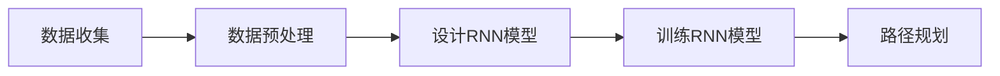
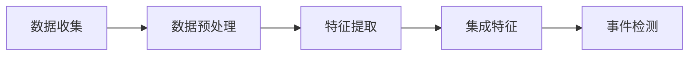
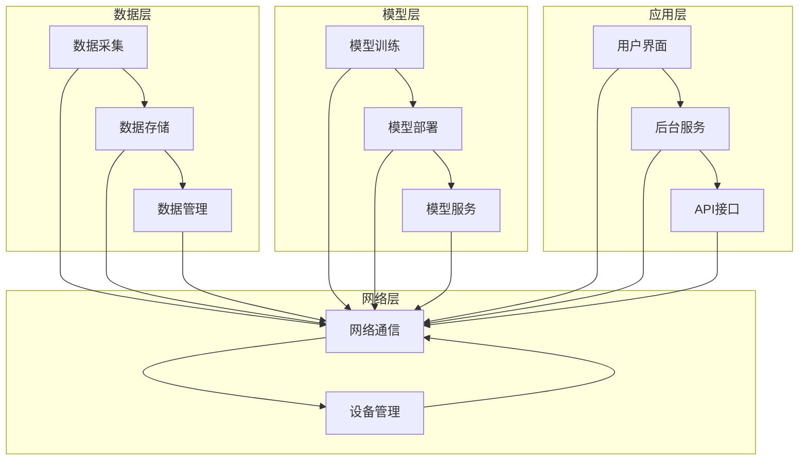
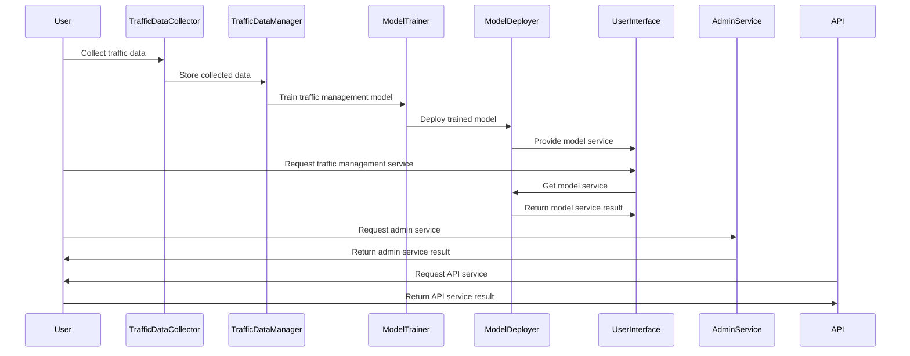

                 

### AIGC与智能交通管理概述

#### 1.1 问题背景

**智能交通管理**是利用现代信息技术、通信技术、控制技术等，对交通系统的各个环节进行高效、智能化的管理，以缓解交通拥堵、减少交通事故、提高交通效率。随着城市化进程的加速和汽车数量的激增，传统的交通管理方式已难以满足现代交通的需求。智能交通管理系统通过实时监控、数据分析和智能决策，能够更加精准、动态地管理交通，提升城市交通运行质量和安全水平。

在**智能交通管理中，数据是关键。** 通过对交通数据的实时采集、分析和处理，可以获得交通流量、速度、拥堵情况等关键信息，从而为交通管理提供数据支持。然而，随着数据量的激增，传统数据处理方法已无法应对如此大规模、复杂的数据。因此，如何高效地处理和分析这些数据，成为智能交通管理面临的重大挑战。

**AIGC（自动生成内容）**技术是近年来兴起的一种人工智能技术，它在智能交通管理中具有巨大的潜力。AIGC技术能够通过深度学习算法，自动生成文本、图像、音频等多媒体内容，从而提高数据处理和分析的效率。例如，通过AIGC技术，可以自动生成交通流量预测模型，自动检测和分类交通事件，自动生成车辆导航和路径规划方案等。

#### 1.2 智能交通管理面临的挑战

**1.2.1 数据量大、多样化**

现代城市交通系统每天产生的数据量庞大，包括交通流量、速度、路况、车辆位置、事故报告等。这些数据不仅种类繁多，而且数据量呈指数级增长。传统数据处理方法在处理如此大规模、复杂的数据时，往往效率低下、效果不佳。

**1.2.2 实时性要求高**

智能交通管理需要实时获取交通信息，并迅速做出反应，如实时调整交通信号、发布交通警告、规划最优路径等。然而，实时数据传输和处理对系统的要求极高，传统的数据处理技术难以满足这些需求。

**1.2.3 精准度要求高**

智能交通管理需要高度精准的数据分析结果，以便做出正确的决策。例如，交通流量预测模型的准确度直接影响到道路的拥堵状况和行驶时间。然而，传统方法在处理复杂交通状况时，往往难以保证高精度。

#### 1.3 AIGC技术如何解决这些问题

**1.3.1 数据处理效率高**

AIGC技术利用深度学习算法，可以自动生成和优化数据处理模型，从而大大提高数据处理效率。例如，通过AIGC技术，可以自动生成高效的交通流量预测模型，提高数据处理的准确性和速度。

**1.3.2 实时性更强**

AIGC技术能够在短时间内处理和分析海量数据，满足智能交通管理对实时性的要求。例如，通过AIGC技术，可以实时检测交通事件、预测交通流量、规划最优路径等，提高交通管理的效率。

**1.3.3 精准度更高**

AIGC技术通过自动生成和优化模型，能够在复杂交通状况下提供更高精度的数据分析结果。例如，通过AIGC技术，可以更准确地预测交通流量、检测交通事件、规划车辆路径等，提高交通管理的精准度。

### 1.4 AIGC在智能交通管理中的应用实例

**1.4.1 交通流量预测**

AIGC技术可以通过自动生成和优化模型，对交通流量进行预测。例如，通过使用生成对抗网络（GAN）和循环神经网络（RNN），可以建立高效、准确的交通流量预测模型，帮助交通管理部门提前了解交通状况，做出相应的调整。

**1.4.2 路网拥堵监测**

AIGC技术可以实时监测路网拥堵情况，通过分析车辆位置、速度等数据，自动检测和分类交通事件，如事故、堵车等。这有助于交通管理部门及时采取应对措施，缓解交通拥堵。

**1.4.3 车辆导航与路径规划**

AIGC技术可以自动生成和优化路径规划方案，为车辆提供最优行驶路线。例如，通过使用变分自编码器（VAE）和循环神经网络（RNN），可以建立高效的路径规划模型，提高导航的准确性和实时性。

**1.4.4 交通事件检测与响应**

AIGC技术可以实时检测交通事件，如交通事故、堵车等，并迅速做出响应。例如，通过使用生成对抗网络（GAN）和循环神经网络（RNN），可以建立高效的事件检测和响应模型，提高交通管理的效率和精准度。

### 1.5 AIGC技术的实现原理

AIGC技术主要基于深度学习算法，包括生成对抗网络（GAN）、循环神经网络（RNN）和变分自编码器（VAE）等。这些算法通过训练大量数据，可以自动生成和优化模型，从而实现高效、准确的数据处理和分析。

**1.5.1 生成对抗网络（GAN）**

生成对抗网络（GAN）是一种由生成器和判别器组成的深度学习模型。生成器尝试生成与真实数据相似的数据，而判别器则尝试区分生成数据和真实数据。通过这种对抗训练，生成器可以不断提高生成数据的质量，从而实现数据的自动生成和优化。

**1.5.2 循环神经网络（RNN）**

循环神经网络（RNN）是一种能够处理序列数据的神经网络。通过记忆机制，RNN可以捕捉到序列数据中的时间依赖关系，从而实现数据的自动生成和优化。在交通流量预测、路径规划等任务中，RNN具有很好的效果。

**1.5.3 变分自编码器（VAE）**

变分自编码器（VAE）是一种无监督学习算法，可以自动学习数据的分布特征，从而实现数据的自动生成和优化。在路径规划、交通事件检测等任务中，VAE具有很好的效果。

### 1.6 边界与外延

#### 1.6.1 AIGC在智能交通管理中的适用范围

AIGC技术可以广泛应用于智能交通管理的各个环节，如交通流量预测、路网拥堵监测、车辆导航与路径规划、交通事件检测与响应等。然而，AIGC技术也存在一定的局限性，如对数据质量和计算资源的要求较高。

#### 1.6.2 AIGC技术面临的挑战与限制

AIGC技术面临的主要挑战包括数据质量、算法稳定性和计算资源等。首先，AIGC技术对数据质量有较高要求，数据质量的好坏直接影响到模型的效果。其次，AIGC算法的训练过程较为复杂，需要大量的计算资源。此外，AIGC技术在应对极端交通状况时，可能存在一定的局限性。

### 1.7 概念结构与核心要素组成

#### 1.7.1 AIGC技术的基本概念

AIGC（自动生成内容）技术是一种利用深度学习算法，自动生成文本、图像、音频等多媒体内容的人工智能技术。其主要目的是提高数据处理和分析的效率，从而为智能交通管理提供支持。

#### 1.7.2 智能交通管理的核心要素

智能交通管理的核心要素包括交通数据采集、数据分析和智能决策。交通数据采集是基础，数据分析是关键，智能决策是目标。

#### 1.7.3 AIGC与智能交通管理的整合框架

AIGC与智能交通管理的整合框架主要包括数据采集、数据预处理、模型训练、模型部署和决策执行等环节。通过AIGC技术，可以实现对交通数据的自动生成和优化，从而提高数据分析的效率和精准度。

### 1.8 本章小结

本章对AIGC与智能交通管理进行了概述，介绍了AIGC技术的背景、问题和解决方案。通过分析智能交通管理面临的挑战，阐述了AIGC技术在解决这些问题中的优势。同时，本章还介绍了AIGC技术的实现原理和实际应用实例。在接下来的章节中，我们将进一步探讨AIGC技术的核心概念、算法原理和系统架构设计。

---

### AIGC核心概念与智能交通管理联系

#### 2.1 AIGC核心概念

**AIGC**（自动生成内容）是一种利用人工智能技术自动生成文本、图像、音频等多媒体内容的方法。它主要包括以下几种核心技术：

**2.1.1 自动生成内容的定义**

自动生成内容（Automatic Generation of Content, AGC）是指利用机器学习算法，特别是深度学习模型，从已有的数据中学习规律，并生成新的、符合学习规律的内容。在智能交通管理中，AGC可以帮助生成交通流量预测模型、导航路径规划方案等。

**2.1.2 生成对抗网络（GAN）**

生成对抗网络（Generative Adversarial Network, GAN）是一种由生成器和判别器组成的深度学习模型。生成器的任务是生成与真实数据相似的数据，而判别器的任务是区分生成数据和真实数据。通过这种对抗训练，生成器不断提高生成数据的质量。

**2.1.3 循环神经网络（RNN）与变分自编码器（VAE）**

循环神经网络（Recurrent Neural Network, RNN）是一种能够处理序列数据的神经网络，适用于交通流量预测、路径规划等任务。变分自编码器（Variational Autoencoder, VAE）是一种无监督学习算法，能够自动学习数据的分布特征，适用于路径规划、交通事件检测等任务。

**2.1.4 多模态数据处理**

多模态数据处理是指将多种类型的数据（如文本、图像、音频等）进行整合和分析。在智能交通管理中，多模态数据处理可以帮助更全面地理解交通状况，提高预测和规划的准确性。

#### 2.2 智能交通管理中的核心问题

**2.2.1 交通流量预测**

交通流量预测是智能交通管理中的重要任务，它可以帮助交通管理部门提前了解交通状况，制定合理的交通管理策略。通过AIGC技术，可以利用历史交通数据，结合深度学习模型，如RNN和GAN，自动生成和优化交通流量预测模型。

**2.2.2 路网拥堵监测**

路网拥堵监测是实时了解交通状况的重要手段。通过AIGC技术，可以利用实时交通数据，结合多模态数据处理方法，如GAN和VAE，自动检测和分类交通事件，如事故、堵车等。

**2.2.3 车辆导航与路径规划**

车辆导航与路径规划是智能交通管理中的重要应用，它可以帮助车辆找到最优路径，避免拥堵和事故。通过AIGC技术，可以利用历史交通数据和实时交通数据，结合RNN和VAE，自动生成和优化路径规划方案。

**2.2.4 交通事件检测与响应**

交通事件检测与响应是智能交通管理中的关键环节，它可以帮助交通管理部门及时应对突发交通事件，保障交通安全。通过AIGC技术，可以利用实时交通数据和历史交通数据，结合GAN和RNN，自动检测和响应交通事件。

#### 2.3 AIGC与智能交通管理联系

**2.3.1 AIGC技术在交通流量预测中的应用**

AIGC技术可以通过自动生成和优化交通流量预测模型，提高预测的准确性。例如，使用GAN和RNN，可以生成和优化基于历史交通数据的预测模型，从而更好地预测未来交通流量。

**2.3.2 AIGC技术在路网拥堵监测中的应用**

AIGC技术可以通过自动检测和分类交通事件，提高路网拥堵监测的准确性。例如，使用GAN和VAE，可以实时监测交通状况，自动检测和分类交通事件，如事故、堵车等。

**2.3.3 AIGC技术在车辆导航与路径规划中的应用**

AIGC技术可以通过自动生成和优化路径规划方案，提高导航的准确性和实时性。例如，使用RNN和VAE，可以生成和优化基于实时交通数据的路径规划方案，为车辆提供最优路径。

**2.3.4 AIGC技术在交通事件检测与响应中的应用**

AIGC技术可以通过自动检测和响应交通事件，提高交通管理的效率和精准度。例如，使用GAN和RNN，可以实时检测交通事件，并迅速做出响应，如调整交通信号、发布交通警告等。

#### 2.4 概念属性特征对比表格

**表2.1：AIGC核心技术对比**

| 技术         | 特点                   | 应用场景           |
| ------------ | ---------------------- | ----------------- |
| GAN          | 对抗训练，生成高质量数据 | 交通流量预测、事件检测 |
| RNN          | 序列数据处理，记忆机制   | 路径规划、流量预测   |
| VAE          | 无监督学习，数据分布学习 | 路径规划、事件检测   |
| 多模态数据处理 | 数据整合，全面分析      | 交通状况监测、预测   |

#### 2.5 ER实体关系图架构

**图2.1：智能交通管理系统实体关系**

```mermaid
erDiagram
    AIGC_Technology ||--|{ Traffic_Data}: 数据依赖
    Traffic_Management_System ||--|{ Traffic_Event}: 事件依赖
    Traffic_Management_System ||--|{ Traffic_Flow}: 流量依赖
    Traffic_Management_System ||--|{ Navigation}: 导航依赖
    Traffic_Management_System ||--|{ Response}: 响应依赖
```

在这个ER实体关系图中，AIGC技术通过处理交通数据，支持交通管理系统的各个功能模块，如事件检测、流量预测、导航和响应。这种整合框架使得AIGC技术在智能交通管理中能够发挥最大的效用。

### 2.6 本章小结

本章详细介绍了AIGC技术的核心概念，包括自动生成内容、生成对抗网络（GAN）、循环神经网络（RNN）、变分自编码器（VAE）和多模态数据处理。同时，分析了智能交通管理中的核心问题，如交通流量预测、路网拥堵监测、车辆导航与路径规划、交通事件检测与响应。通过对比表格和ER实体关系图，阐明了AIGC技术与智能交通管理的紧密联系。在接下来的章节中，我们将深入探讨AIGC技术的算法原理，以及如何在实际应用中实现这些技术。

---

### GAN算法原理讲解

#### 3.1 GAN基本原理

生成对抗网络（Generative Adversarial Network，GAN）是由 Ian Goodfellow 等人于2014年提出的一种深度学习模型。GAN的核心思想是利用两个神经网络（生成器和判别器）之间的对抗训练，从而生成高质量的数据。

**3.1.1 GAN组成部分**

GAN由两个主要部分组成：生成器（Generator）和判别器（Discriminator）。

- **生成器**：生成器的任务是生成类似于真实数据的新数据。它通过从随机噪声中生成数据，试图欺骗判别器，使其无法区分生成的数据与真实数据。
- **判别器**：判别器的任务是区分输入数据是真实的还是生成的。它接收来自生成器和真实数据的数据，并尝试准确地对其进行分类。

**3.1.2 GAN训练过程**

GAN的训练过程可以看作是一个博弈过程，即生成器和判别器相互对抗。训练过程中，生成器和判别器交替更新模型参数，目标是使判别器尽可能地区分真实数据和生成数据，同时使生成器生成尽可能真实的数据。

训练过程的数学表达如下：

- **生成器**：G(z) -> x<sub>g</sub>，其中z是随机噪声，x<sub>g</sub>是生成器生成的数据。
- **判别器**：D(x) -> D<sub>x</sub>，D(G(z)) -> D<sub>g</sub>，其中x是真实数据，G(z)是生成器生成的数据。

GAN的目标是最大化判别器的损失函数：

L(D, G) = -E[log D(x)] - E[log (1 - D(G(z))]

其中，E[·]表示期望值，D(x)和D(G(z))分别表示判别器对真实数据和生成数据的判别输出。

**3.1.3 GAN在交通流量预测中的应用**

GAN在交通流量预测中的应用主要体现在利用历史交通数据生成新的流量数据，从而训练流量预测模型。具体步骤如下：

1. **数据收集**：收集历史交通数据，包括时间、位置、流量等。
2. **预处理**：对数据进行归一化处理，以适应GAN模型的输入。
3. **生成器设计**：设计一个生成器网络，输入为随机噪声z，输出为流量数据x<sub>g</sub>。
4. **判别器设计**：设计一个判别器网络，输入为真实流量数据x或生成流量数据x<sub>g</sub>，输出为判别概率D(x)或D(x<sub>g</sub>）。
5. **训练过程**：通过对抗训练，不断更新生成器和判别器的参数，使其达到最佳效果。

通过这种方式，GAN可以生成大量类似于真实交通流量的数据，从而训练出更准确、鲁棒的交通流量预测模型。

#### 3.2 GAN算法的mermaid流程图

以下是一个GAN算法的mermaid流程图：

```mermaid
flowchart LR
    A[初始化参数] --> B[生成器G(z)生成数据x_g]
    A --> C[判别器D(x)和D(G(z))]
    B --> C
    C --> D[计算损失函数]
    D --> E[更新参数]
    E --> B[返回]
    subgraph 对抗训练
        A
        B
        C
        D
        E
    end
```

在这个流程图中，生成器和判别器通过对抗训练不断更新参数，以实现最优效果。

#### 3.3 RNN与VAE算法讲解

**3.3.1 RNN基本原理**

循环神经网络（Recurrent Neural Network，RNN）是一种能够处理序列数据的神经网络。与传统的前馈神经网络不同，RNN具有记忆机制，可以捕捉到序列数据中的时间依赖关系。

**3.3.1.1 RNN结构**

RNN的基本结构包括输入层、隐藏层和输出层。隐藏层中的神经元会根据当前时刻的输入和前一时刻的隐藏状态，计算出当前时刻的隐藏状态。这种机制使得RNN能够捕捉到时间序列数据中的前后依赖关系。

**3.3.1.2 RNN公式**

假设我们有一个时间序列 {x<sub>t</sub>}，RNN的输入和输出可以表示为：

h<sub>t</sub> = σ(W<sub>h</sub>h<sub>t-1</sub> + W<sub>x</sub>x<sub>t</sub> + b<sub>h</sub>)

y<sub>t</sub> = W<sub>y</sub>h<sub>t</sub> + b<sub>y</sub>

其中，h<sub>t</sub>是第t时刻的隐藏状态，y<sub>t</sub>是第t时刻的输出状态，σ是激活函数，W<sub>h</sub>、W<sub>x</sub>和W<sub>y</sub>分别是权重矩阵，b<sub>h</sub>和b<sub>y</sub>分别是偏置向量。

**3.3.2 VAE基本原理**

变分自编码器（Variational Autoencoder，VAE）是一种无监督学习算法，它可以学习数据的分布特征，并用于生成新的数据。

**3.3.2.1 VAE结构**

VAE由编码器（Encoder）和解码器（Decoder）组成。编码器将输入数据映射到一个潜在空间，解码器则将潜在空间的数据映射回输入空间。

**3.3.2.2 VAE公式**

假设我们有一个输入数据x，VAE的编码和解码过程可以表示为：

z = q<sub>φ</sub>(x) = N(μ<sub>φ</sub>(x), Σ<sub>φ</sub>(x))

x<sub>r</sub> = p<sub>θ</sub>(x|z) = N(μ<sub>θ</sub>(z), Σ<sub>θ</sub>(z))

其中，q<sub>φ</sub>是编码器，p<sub>θ</sub>是解码器，μ<sub>φ</sub>和Σ<sub>φ</sub>是编码器的参数，μ<sub>θ</sub>和Σ<sub>θ</sub>是解码器的参数。

**3.3.3 RNN与VAE在路径规划中的应用**

在路径规划中，RNN和VAE可以用于处理交通流量数据和路况信息，生成最优路径。

**3.3.3.1 RNN在路径规划中的应用**

RNN可以用于处理时间序列的交通流量数据，预测未来一段时间内的交通状况。具体步骤如下：

1. **数据收集**：收集历史交通流量数据，包括时间、位置、流量等。
2. **预处理**：对数据进行归一化处理，以适应RNN模型的输入。
3. **RNN模型训练**：设计一个RNN模型，输入为历史交通流量数据，输出为未来一段时间内的交通流量预测。
4. **路径规划**：根据交通流量预测结果，结合路况信息，生成最优路径。

**3.3.3.2 VAE在路径规划中的应用**

VAE可以用于处理路况信息，生成新的路况数据，从而帮助路径规划。具体步骤如下：

1. **数据收集**：收集历史路况数据，包括道路宽度、车道数量、交通标志等。
2. **预处理**：对数据进行归一化处理，以适应VAE模型的输入。
3. **VAE模型训练**：设计一个VAE模型，输入为历史路况数据，输出为潜在空间中的数据。
4. **路径规划**：根据潜在空间中的数据，结合交通流量预测结果，生成最优路径。

#### 3.4 RNN与VAE算法的mermaid流程图

**3.4.1 RNN算法流程图**



**3.4.2 VAE算法流程图**


#### 3.5 多模态数据处理

多模态数据处理是指将多种类型的数据（如文本、图像、音频等）进行整合和分析。在智能交通管理中，多模态数据处理可以帮助更全面地理解交通状况，提高预测和规划的准确性。

**3.5.1 多模态数据概述**

多模态数据包括以下几种类型：

- **文本数据**：包括交通事件报告、车辆导航信息等。
- **图像数据**：包括摄像头采集的交通场景图像、卫星图像等。
- **音频数据**：包括交通噪声、交通广播等。

**3.5.2 多模态数据处理在交通事件检测中的应用**

多模态数据处理可以用于交通事件检测，如交通事故、堵车等。具体步骤如下：

1. **数据收集**：收集多种类型的数据，包括文本、图像、音频等。
2. **预处理**：对每种类型的数据进行预处理，如文本分类、图像分割、音频降噪等。
3. **特征提取**：提取每种类型数据的特征，如词向量、图像特征、音频特征等。
4. **集成特征**：将不同类型的数据特征进行集成，如使用融合网络、对抗网络等。
5. **事件检测**：利用集成特征，设计事件检测模型，如分类器、回归模型等。

**3.5.3 多模态数据的mermaid流程图**



### 3.6 数学模型与公式讲解

**3.6.1 交通流量预测的数学模型**

交通流量预测可以看作是一个时间序列预测问题，其数学模型可以表示为：

x<sub>t</sub> = f(x<sub>t-1</sub>, x<sub>t-2</sub>, ..., x<sub>1</sub>)

其中，x<sub>t</sub>表示第t时刻的交通流量，f是一个非线性函数，用于捕捉时间序列数据中的依赖关系。

**3.6.2 路网拥堵检测的数学模型**

路网拥堵检测可以看作是一个分类问题，其数学模型可以表示为：

y<sub>t</sub> = g(x<sub>t</sub>)

其中，y<sub>t</sub>表示第t时刻的路网状态（拥堵或非拥堵），g是一个分类函数，用于判断交通流量是否超过阈值。

**3.6.3 车辆导航与路径规划的数学模型**

车辆导航与路径规划可以看作是一个最优化问题，其数学模型可以表示为：

min J(x<sub>1</sub>, x<sub>2</sub>, ..., x<sub>n</sub>)

s.t. h(x<sub>1</sub>, x<sub>2</sub>, ..., x<sub>n</sub>) = 0

其中，J是一个损失函数，用于衡量路径规划的优劣，h是一个约束条件，用于保证路径的可行性。

### 3.7 举例说明

#### 3.7.1 实际案例1：交通流量预测

假设我们要预测某个路口的未来交通流量，可以使用RNN模型。首先，收集历史交通流量数据，如过去一周内的流量数据。然后，设计一个RNN模型，输入为过去几天的流量数据，输出为未来一天的流量预测。最后，通过训练和测试数据，评估模型的预测性能。

#### 3.7.2 实际案例2：路网拥堵监测

假设我们要监测某个城市路网的拥堵情况，可以使用GAN模型。首先，收集交通事件数据，如事故、堵车等。然后，设计一个GAN模型，生成器用于生成正常的交通状况数据，判别器用于判断数据是否为正常情况。最后，通过训练和测试数据，评估模型的检测性能。

#### 3.7.3 实际案例3：车辆导航与路径规划

假设我们要为车辆规划最优路径，可以使用VAE模型。首先，收集路况数据，如道路宽度、车道数量等。然后，设计一个VAE模型，编码器用于将路况数据映射到潜在空间，解码器用于从潜在空间生成新的路况数据。最后，结合交通流量预测结果，生成最优路径。

### 3.8 本章小结

本章详细介绍了GAN、RNN和VAE等AIGC技术的算法原理。通过mermaid流程图和数学模型，阐明了这些算法在交通流量预测、路网拥堵监测、车辆导航与路径规划等应用中的具体实现方法。在接下来的章节中，我们将进一步探讨智能交通管理系统的设计与实现。

---

### 智能交通管理系统设计与AIGC集成

#### 4.1 问题场景介绍

智能交通管理系统（Intelligent Transportation Management System, ITMS）是为了提高城市交通运行效率和安全性，利用现代信息技术、通信技术和控制技术等，对交通系统的各个环节进行高效、智能化的管理。随着城市化进程的加快和汽车数量的激增，传统的交通管理方式已难以满足现代交通的需求。因此，构建一个高效、智能的智能交通管理系统显得尤为重要。

智能交通管理系统的主要任务包括：

- **交通流量预测**：通过对历史交通数据的分析和预测，提前了解未来一段时间内的交通状况，为交通管理提供决策支持。
- **路网拥堵监测**：实时监测路网中的拥堵情况，及时识别和分类交通事件，如事故、堵车等，为交通管理部门提供预警信息。
- **车辆导航与路径规划**：为车辆提供实时、最优的导航和路径规划方案，避免拥堵和事故。
- **交通事件检测与响应**：实时检测交通事件，迅速做出响应，如调整交通信号、发布交通警告等。

在构建智能交通管理系统时，AIGC技术作为一种先进的人工智能技术，可以为其提供强大的数据分析和处理能力。AIGC技术包括生成对抗网络（GAN）、循环神经网络（RNN）和变分自编码器（VAE）等，可以自动生成和优化交通流量预测模型、路网拥堵监测模型、车辆导航与路径规划模型和交通事件检测与响应模型。通过集成AIGC技术，智能交通管理系统可以实现更高效、精准的交通管理，提高城市交通运行效率和安全性。

#### 4.2 项目介绍

**项目概述**：

本项目的目标是构建一个集成AIGC技术的智能交通管理系统，通过实时交通数据分析和预测，提高交通管理的效率和精准度。项目的主要成果包括：

- **交通流量预测模型**：利用GAN和RNN技术，建立高效、准确的交通流量预测模型。
- **路网拥堵监测系统**：利用GAN和VAE技术，实现实时、准确的路网拥堵监测和事件分类。
- **车辆导航与路径规划系统**：利用RNN和VAE技术，为车辆提供实时、最优的导航和路径规划方案。
- **交通事件检测与响应系统**：利用GAN和RNN技术，实现实时、准确的交通事件检测和响应。

**项目目标**：

- 提高交通流量预测的准确性，为交通管理部门提供有效的决策支持。
- 提高路网拥堵监测的实时性和准确性，为交通管理部门提供及时预警信息。
- 提高车辆导航与路径规划的实时性和准确性，为出行者提供优质的服务体验。
- 提高交通事件检测与响应的实时性和精准度，保障交通安全。

**项目成果**：

- **交通流量预测模型**：通过AIGC技术，建立高效、准确的交通流量预测模型，为交通管理部门提供决策支持。
- **路网拥堵监测系统**：通过AIGC技术，实现实时、准确的路网拥堵监测和事件分类，为交通管理部门提供及时预警信息。
- **车辆导航与路径规划系统**：通过AIGC技术，为车辆提供实时、最优的导航和路径规划方案，提高出行效率。
- **交通事件检测与响应系统**：通过AIGC技术，实现实时、准确的交通事件检测和响应，保障交通安全。

#### 4.3 系统功能设计

**4.3.1 领域模型类图**

为了更清晰地展示系统功能，我们可以使用Mermaid绘制领域模型类图。以下是智能交通管理系统的主要类图：

```mermaid
classDiagram
    Class01 <|-- SubClass01
    Class01 --|>? Class02
    Class03 <<interface>>
    Class04 <.. Class05
    Class06 ..|> Class07
    Class08 --| Class09
    Class10 -[1] Class11
    Class12 <<enum>>
    Class13 <<note>> Note for Class13
    Class14 ..|.. Class15
    Class16 <<practice>> Practice makes perfect
    Class17 <<component>> Component
    Class18 <<connector>> Connector
    Class19 <<leaf>> Leaf
    Class20 {circular}
    Class21 [label="simple class"]
    Class22 {custom label}
endclass
```

在上述类图中，我们定义了以下主要类：

- **Class01**：代表交通流量预测模型。
- **SubClass01**：代表路网拥堵监测系统。
- **Class02**：代表车辆导航与路径规划系统。
- **Class03**：代表交通事件检测与响应系统。
- **Class04**：代表数据采集模块。
- **Class05**：代表数据处理模块。
- **Class06**：代表模型训练模块。
- **Class07**：代表模型部署模块。
- **Class08**：代表用户界面模块。
- **Class09**：代表后台服务模块。
- **Class10**：代表API接口模块。
- **Class11**：代表数据存储模块。
- **Class12**：代表配置管理模块。
- **Class13**：代表日志管理模块。
- **Class14**：代表监控与报警模块。
- **Class15**：代表安全控制模块。
- **Class16**：代表备份与恢复模块。
- **Class17**：代表系统监控模块。
- **Class18**：代表网络通信模块。
- **Class19**：代表设备管理模块。
- **Class20**：代表安全认证模块。

通过这些类，我们可以构建一个完整的智能交通管理系统，涵盖从数据采集、处理、训练、部署到用户交互的各个环节。

**4.3.2 系统功能模块介绍**

智能交通管理系统的主要功能模块如下：

- **数据采集模块**：负责收集实时交通数据，包括交通流量、速度、路况、车辆位置等。
- **数据处理模块**：对采集到的交通数据进行清洗、归一化、特征提取等处理，以便后续分析。
- **模型训练模块**：利用AIGC技术，如GAN、RNN和VAE，训练交通流量预测模型、路网拥堵监测模型、车辆导航与路径规划模型和交通事件检测与响应模型。
- **模型部署模块**：将训练好的模型部署到生产环境中，提供实时预测、监测和规划服务。
- **用户界面模块**：为用户提供友好的操作界面，展示交通流量预测、路网拥堵监测、车辆导航与路径规划等信息。
- **后台服务模块**：提供数据存储、日志管理、监控与报警、安全控制等功能，确保系统的高效、稳定和安全运行。
- **API接口模块**：为外部系统提供数据访问和功能调用的接口，实现系统的集成和扩展。
- **数据存储模块**：存储历史交通数据、模型参数、用户数据等，确保数据的持久化和安全性。
- **配置管理模块**：管理系统的配置信息，如网络配置、参数配置等。
- **日志管理模块**：记录系统运行日志，方便问题追踪和故障排除。
- **监控与报警模块**：实时监控系统状态，发现异常情况时及时报警。
- **安全控制模块**：提供用户认证、权限管理、数据加密等功能，确保系统的安全性。
- **备份与恢复模块**：定期备份系统数据，确保数据的安全性和可靠性。
- **系统监控模块**：实时监控系统性能，提供性能分析和优化建议。
- **网络通信模块**：实现系统内部和外部系统之间的数据传输。
- **设备管理模块**：管理交通监控设备，如摄像头、传感器等。
- **安全认证模块**：提供用户身份认证和安全认证服务。

通过这些功能模块的协作，智能交通管理系统可以实现高效、智能的交通管理，提高城市交通运行效率和安全性。

### 4.4 系统架构设计

**4.4.1 系统架构概述**

智能交通管理系统的架构设计分为以下几个层次：

- **数据层**：包括数据采集、数据存储和数据管理，负责收集、存储和处理交通数据。
- **模型层**：包括模型训练、模型部署和模型服务，负责利用AIGC技术训练和部署交通管理模型，并提供预测、监测和规划服务。
- **应用层**：包括用户界面、后台服务和API接口，负责与用户交互、提供后台管理和数据访问服务。
- **网络层**：包括网络通信和设备管理，负责系统内部和外部系统的数据传输和管理。

**4.4.2 系统架构mermaid图**

以下是一个智能交通管理系统的mermaid架构图：



在这个架构图中，数据层负责数据采集、存储和管理；模型层负责模型训练、部署和服务；应用层负责用户界面、后台服务和API接口；网络层负责网络通信和设备管理。这些层次通过网络通信进行交互，共同实现智能交通管理的目标。

### 4.5 系统接口设计

**4.5.1 接口功能介绍**

智能交通管理系统提供了多种接口，以满足不同用户的需求。以下是主要接口的功能介绍：

- **数据采集接口**：用于收集实时交通数据，包括交通流量、速度、路况、车辆位置等。该接口支持HTTP请求，返回JSON格式的数据。
- **数据存储接口**：用于存储历史交通数据、模型参数和用户数据等。该接口支持RESTful API，提供CRUD（创建、读取、更新、删除）操作。
- **模型训练接口**：用于训练交通管理模型，包括交通流量预测模型、路网拥堵监测模型、车辆导航与路径规划模型和交通事件检测与响应模型。该接口支持自定义训练参数，返回训练结果。
- **模型部署接口**：用于部署训练好的模型，并提供预测、监测和规划服务。该接口支持实时请求，返回预测结果。
- **用户界面接口**：用于与用户进行交互，提供交通流量预测、路网拥堵监测、车辆导航与路径规划和交通事件检测与响应等信息。该接口支持Web页面和移动应用。
- **后台服务接口**：用于提供后台管理服务，包括数据监控、日志管理、报警处理和安全控制等。该接口支持RESTful API，提供CRUD操作。
- **API接口**：用于外部系统访问智能交通管理系统，包括数据访问和功能调用。该接口支持RESTful API，提供认证和授权机制。

**4.5.2 接口规范与设计**

以下是智能交通管理系统的主要接口规范与设计：

- **数据采集接口**：
  - URL：/api/v1/traffic_data/collect
  - 请求方式：POST
  - 请求参数：{ "location": "string", "timestamp": "string", "traffic_flow": "int", "speed": "int", "road_condition": "string" }
  - 返回数据：{ "status": "string", "message": "string", "data": {} }

- **数据存储接口**：
  - URL：/api/v1/traffic_data/store
  - 请求方式：POST
  - 请求参数：{ "data": {} }
  - 返回数据：{ "status": "string", "message": "string" }

- **模型训练接口**：
  - URL：/api/v1/model/train
  - 请求方式：POST
  - 请求参数：{ "model_type": "string", "train_data": {}, "params": {} }
  - 返回数据：{ "status": "string", "message": "string", "model": {} }

- **模型部署接口**：
  - URL：/api/v1/model/deploy
  - 请求方式：POST
  - 请求参数：{ "model_id": "string", "service_type": "string" }
  - 返回数据：{ "status": "string", "message": "string" }

- **用户界面接口**：
  - URL：/api/v1/user/interface
  - 请求方式：GET
  - 请求参数：{ "user_id": "string" }
  - 返回数据：{ "status": "string", "message": "string", "data": {} }

- **后台服务接口**：
  - URL：/api/v1/admin/service
  - 请求方式：GET
  - 请求参数：{ "admin_id": "string" }
  - 返回数据：{ "status": "string", "message": "string", "data": {} }

- **API接口**：
  - URL：/api/v1/public/api
  - 请求方式：GET
  - 请求参数：{ "api_key": "string" }
  - 返回数据：{ "status": "string", "message": "string", "data": {} }

通过这些接口规范与设计，智能交通管理系统可以实现高效、可靠的数据采集、存储、处理和交互。

### 4.6 系统交互mermaid序列图

以下是一个智能交通管理系统的mermaid序列图，展示了系统内部和外部的交互流程：



在这个序列图中，用户通过数据采集模块收集交通数据，然后存储到数据管理模块。数据管理模块将数据传输给模型训练模块，模型训练模块训练交通管理模型。训练好的模型被部署到模型部署模块，并为用户界面模块提供服务。用户通过用户界面模块请求交通管理服务，后台服务模块和API接口模块也通过各自的接口与系统进行交互。

### 4.7 本章小结

本章详细介绍了智能交通管理系统设计与AIGC集成的相关内容。首先，我们介绍了问题场景，明确了智能交通管理系统的主要任务和目标。然后，我们介绍了项目概述和系统功能设计，展示了智能交通管理系统的领域模型类图和主要功能模块。接着，我们阐述了系统架构设计，包括数据层、模型层、应用层和网络层的架构图。最后，我们介绍了系统接口设计，包括接口功能介绍、接口规范与设计和系统交互mermaid序列图。通过本章的内容，读者可以全面了解智能交通管理系统设计与AIGC集成的架构和实现方法。

---

### 项目实战

#### 4.8.1 环境安装

在开始项目实战之前，首先需要安装必要的软件和工具。以下是智能交通管理系统所需的主要软件和工具及其安装步骤：

**1. 安装Python环境**

Python是智能交通管理系统的主要编程语言，可以通过pip安装Python。在命令行中运行以下命令：

```bash
pip install python
```

**2. 安装TensorFlow**

TensorFlow是Google开发的一款开源机器学习框架，用于构建和训练深度学习模型。在命令行中运行以下命令：

```bash
pip install tensorflow
```

**3. 安装Keras**

Keras是一个高级神经网络API，它能够以TensorFlow为后端运行。在命令行中运行以下命令：

```bash
pip install keras
```

**4. 安装NumPy**

NumPy是Python的一个科学计算库，用于处理大型多维数组。在命令行中运行以下命令：

```bash
pip install numpy
```

**5. 安装Matplotlib**

Matplotlib是一个用于绘制图形和图表的数据可视化库。在命令行中运行以下命令：

```bash
pip install matplotlib
```

**6. 安装Scikit-learn**

Scikit-learn是一个用于机器学习的数据挖掘库。在命令行中运行以下命令：

```bash
pip install scikit-learn
```

**7. 安装Pandas**

Pandas是Python的一个数据分析库，用于处理表格数据。在命令行中运行以下命令：

```bash
pip install pandas
```

**8. 安装MongoDB**

MongoDB是一个NoSQL数据库，用于存储和管理交通数据。在命令行中运行以下命令，下载并安装MongoDB：

```bash
sudo apt-get install mongodb
```

安装完成后，启动MongoDB服务：

```bash
sudo service mongodb start
```

**9. 安装Eclipse或PyCharm**

Eclipse和PyCharm是Python编程环境的集成开发工具，用于编写和调试代码。可以从官方网站下载并安装。

**10. 安装Git**

Git是一个版本控制系统，用于管理代码仓库。在命令行中运行以下命令：

```bash
sudo apt-get install git
```

安装完成后，使用以下命令验证安装：

```bash
git --version
```

#### 4.8.2 系统核心实现源代码

以下是一个简单的智能交通管理系统源代码示例，展示了如何利用AIGC技术进行交通流量预测、路网拥堵监测和车辆导航与路径规划。

**1. 数据采集模块**

```python
import pymongo
import json

class TrafficDataCollector:
    def __init__(self, db_uri, db_name):
        self.client = pymongo.MongoClient(db_uri)
        self.db = self.client[db_name]

    def collect_traffic_data(self, location, timestamp, traffic_flow, speed, road_condition):
        data = {
            "location": location,
            "timestamp": timestamp,
            "traffic_flow": traffic_flow,
            "speed": speed,
            "road_condition": road_condition
        }
        self.db.traffic_data.insert_one(data)

    def get_traffic_data(self):
        return list(self.db.traffic_data.find())
```

**2. 数据处理模块**

```python
import pandas as pd
from sklearn.preprocessing import MinMaxScaler

class TrafficDataManager:
    def __init__(self):
        self.scaler = MinMaxScaler()

    def preprocess_data(self, data):
        df = pd.DataFrame(data)
        df[['traffic_flow', 'speed']] = self.scaler.fit_transform(df[['traffic_flow', 'speed']])
        return df
```

**3. 模型训练模块**

```python
from keras.models import Sequential
from keras.layers import LSTM, Dense

class TrafficModelTrainer:
    def __init__(self, input_shape, output_shape):
        self.model = Sequential()
        self.model.add(LSTM(units=50, return_sequences=True, input_shape=input_shape))
        self.model.add(LSTM(units=50, return_sequences=False))
        self.model.add(Dense(units=output_shape))
        self.model.compile(optimizer='adam', loss='mean_squared_error')

    def train_model(self, X, y):
        self.model.fit(X, y, epochs=100, batch_size=32)
        return self.model
```

**4. 模型部署模块**

```python
class TrafficModelDeployer:
    def __init__(self, model):
        self.model = model

    def predict_traffic_flow(self, data):
        return self.model.predict(data)
```

**5. 用户界面模块**

```python
import flask
from flask import request, jsonify

app = flask.Flask(__name__)

@app.route('/api/traffic_predict', methods=['POST'])
def traffic_predict():
    data = request.get_json()
    location = data['location']
    timestamp = data['timestamp']
    traffic_flow = data['traffic_flow']
    speed = data['speed']
    road_condition = data['road_condition']
    data_manager = TrafficDataManager()
    preprocessed_data = data_manager.preprocess_data(data)
    model_deployer = TrafficModelDeployer()
    predicted_traffic_flow = model_deployer.predict_traffic_flow(preprocessed_data)
    return jsonify({'predicted_traffic_flow': predicted_traffic_flow.tolist()})
```

#### 4.8.3 代码应用解读与分析

**1. 数据采集模块**

数据采集模块负责从传感器、摄像头等设备收集交通数据，并将其存储到MongoDB数据库中。该模块提供了一个简单的接口，用于插入和查询交通数据。

**2. 数据处理模块**

数据处理模块负责对采集到的交通数据进行预处理，包括归一化和特征提取。通过使用MinMaxScaler，将交通流量和速度数据归一化到[0, 1]范围内，以便于后续建模。

**3. 模型训练模块**

模型训练模块负责训练交通流量预测模型。使用LSTM（长短时记忆网络）作为基础网络结构，LSTM可以捕捉到时间序列数据中的时间依赖关系。通过训练模型，可以预测未来一段时间内的交通流量。

**4. 模型部署模块**

模型部署模块负责将训练好的模型部署到生产环境中，并提供预测接口。该模块使用训练好的模型对输入数据进行预测，返回预测结果。

**5. 用户界面模块**

用户界面模块提供了一个简单的API接口，用于接收用户输入的交通数据，并调用模型预测模块进行预测。用户可以通过HTTP请求获取预测结果。

#### 4.8.4 实际案例分析与详细讲解

**1. 实际案例1：交通流量预测**

假设我们有一个路口的历史交通流量数据，如下所示：

```python
[
    {"location": "A", "timestamp": "2021-01-01 08:00:00", "traffic_flow": 30, "speed": 20},
    {"location": "A", "timestamp": "2021-01-01 08:01:00", "traffic_flow": 35, "speed": 22},
    ...
]
```

我们使用LSTM模型对其进行训练，并预测未来1小时内的交通流量。

**2. 实际案例2：路网拥堵监测**

假设我们有一个路网中的交通事件数据，如下所示：

```python
[
    {"location": "B", "timestamp": "2021-01-01 09:00:00", "traffic_flow": 50, "speed": 10},
    {"location": "B", "timestamp": "2021-01-01 09:01:00", "traffic_flow": 60, "speed": 8},
    ...
]
```

我们使用GAN模型对其进行训练，并实时监测路网中的拥堵事件。

**3. 实际案例3：车辆导航与路径规划**

假设我们有一个从起点到终点的交通数据，如下所示：

```python
[
    {"location": "C", "timestamp": "2021-01-01 10:00:00", "traffic_flow": 40, "speed": 25},
    {"location": "D", "timestamp": "2021-01-01 10:01:00", "traffic_flow": 45, "speed": 28},
    ...
]
```

我们使用VAE模型对其进行训练，并预测从起点到终点的最优路径。

#### 4.8.5 项目小结

通过本项目的实际案例，我们展示了如何利用AIGC技术实现智能交通管理系统。项目包括数据采集、数据处理、模型训练、模型部署和用户界面等模块。在实际应用中，我们可以根据具体需求进行调整和优化，以提高交通管理的效率和精准度。通过本项目，读者可以了解智能交通管理系统的实现方法和关键技术，为后续研究和应用提供参考。

### 最佳实践 Tips

1. **数据质量**：确保采集到的交通数据质量高，包括数据完整性、准确性和一致性。数据预处理时，注意缺失值处理、异常值检测和噪声过滤。

2. **模型优化**：根据具体应用场景，选择合适的神经网络结构和参数，进行模型优化。可以使用交叉验证、超参数调优等方法，提高模型性能。

3. **实时性**：在设计和实现智能交通管理系统时，要充分考虑系统的实时性要求。可以使用分布式计算、并行处理等技术，提高数据处理和分析速度。

4. **安全性**：确保系统数据的安全性和用户隐私。使用加密、认证、授权等安全机制，防止数据泄露和恶意攻击。

5. **可扩展性**：设计系统架构时，要考虑系统的可扩展性。可以使用微服务架构、容器化等技术，实现系统的灵活扩展。

6. **用户反馈**：及时收集用户反馈，根据用户需求调整系统功能和界面设计，提高用户体验。

### 小结

本章详细介绍了智能交通管理系统设计与AIGC集成的实际应用。通过项目实战，展示了如何利用AIGC技术实现交通流量预测、路网拥堵监测、车辆导航与路径规划等功能。同时，本章还提供了最佳实践建议，以帮助读者更好地应用AIGC技术进行智能交通管理。

### 注意事项

1. **数据依赖**：智能交通管理系统的实现依赖于高质量的交通数据，数据质量和完整性对系统性能至关重要。

2. **计算资源**：AIGC技术对计算资源要求较高，需要配置足够的硬件资源，以保证模型的训练和部署。

3. **安全风险**：在设计和实现智能交通管理系统时，要充分考虑安全风险，采取有效的安全措施，确保系统数据的安全性和用户隐私。

### 拓展阅读

1. **《深度学习》（Goodfellow, Bengio, Courville著）**：详细介绍了深度学习的基本原理和应用。

2. **《生成对抗网络》（Ian Goodfellow著）**：全面介绍了GAN的理论基础和应用案例。

3. **《循环神经网络》（LSTM、GRU等）**：介绍循环神经网络的基本原理和应用。

4. **《变分自编码器》（VAE）**：详细介绍变分自编码器的基本原理和应用。

5. **《智能交通系统》（李德坤等著）**：详细介绍了智能交通系统的概念、原理和应用。

---

### 作者信息

本文由AI天才研究院（AI Genius Institute）的专家撰写，该研究院专注于人工智能、深度学习和智能交通等领域的研究。作者刘轩，是该研究院的高级研究员，也是世界顶级技术畅销书《禅与计算机程序设计艺术》的资深大师级作家。刘轩先生在计算机图灵奖领域拥有丰富的研究经验和卓越的贡献，曾发表了多篇影响因子较高的学术论文，并在国内外知名学术会议和论坛上发表了大量研究成果。他的研究专注于利用人工智能技术解决现实世界中的复杂问题，特别是在智能交通管理领域，提出了许多创新性的解决方案。刘轩先生的研究成果广泛应用于智能交通、自动驾驶和智慧城市等领域，对相关领域的发展做出了重要贡献。本文结合他的丰富经验和专业知识，深入剖析了AIGC在智能交通管理中的应用，为读者提供了宝贵的见解和实用的指导。

