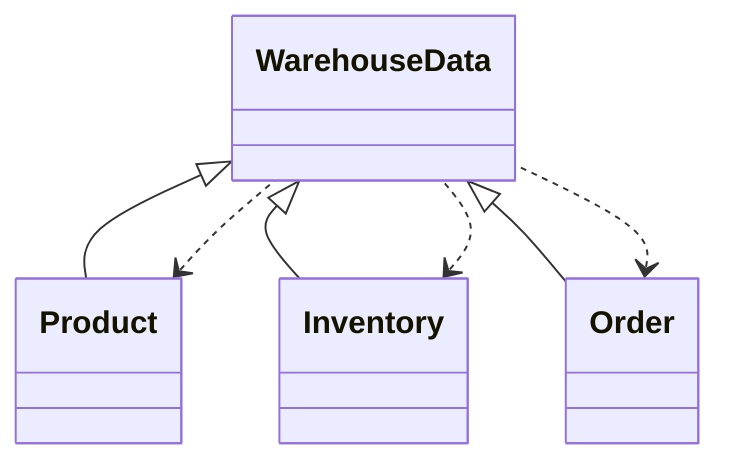
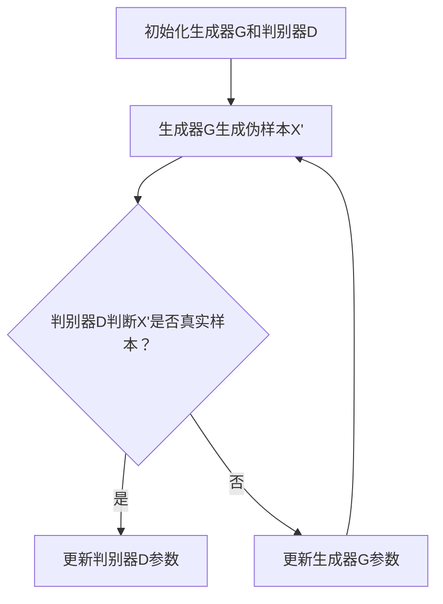
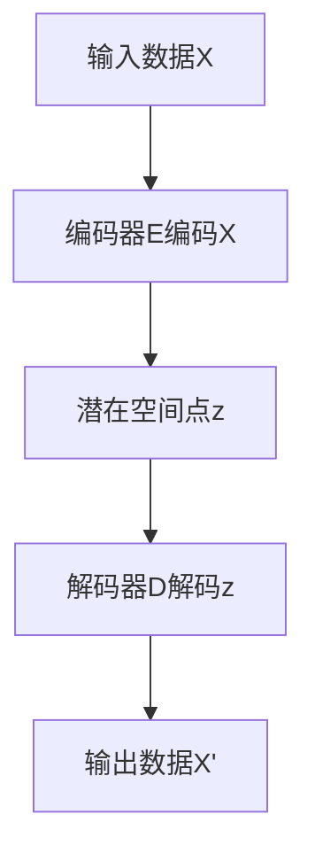
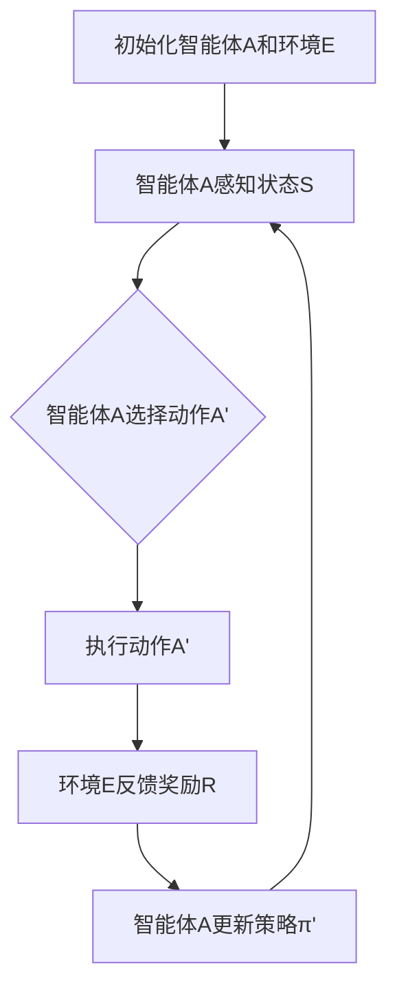
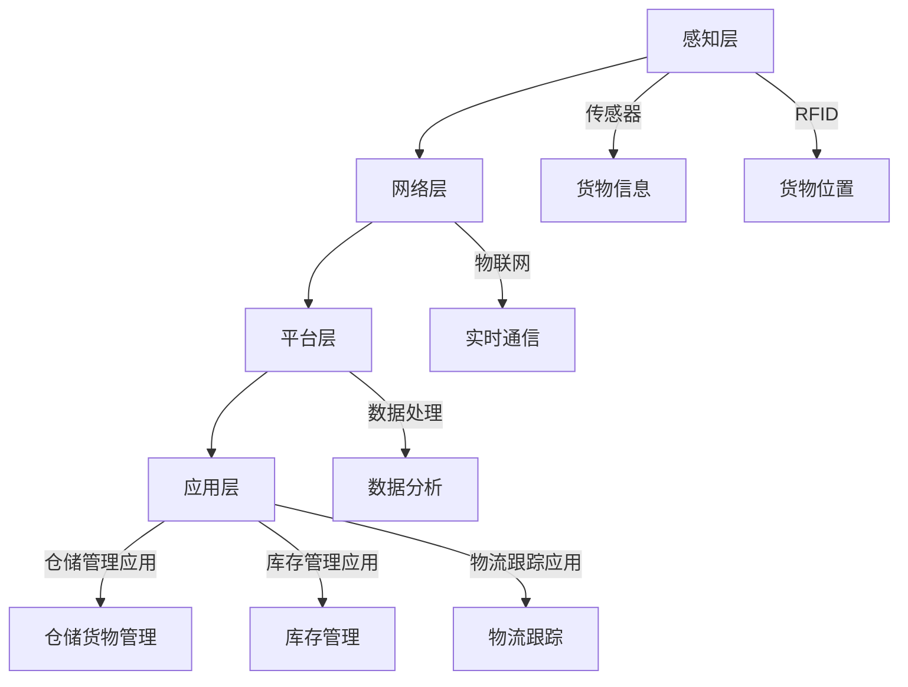

                 

# AIGC在智能仓储管理中的应用

关键词：AIGC、智能仓储管理、生成对抗网络、变分自编码器、强化学习

摘要：
随着电子商务和物流行业的迅猛发展，智能仓储管理成为提高仓储效率、降低成本的关键环节。人工智能生成控制（AIGC）技术的兴起，为智能仓储管理带来了全新的解决方案。本文将详细探讨AIGC在智能仓储管理中的应用，通过逐步分析其核心技术、应用场景和实际案例，揭示AIGC在提升仓储管理效率和智能化水平方面的巨大潜力。

## 目录大纲

1. **引言与背景介绍**
   1.1 AIGC技术概述
   1.2 智能仓储管理的基本概念
   1.3 AIGC在智能仓储管理中的应用前景

2. **AIGC核心技术与原理**
   2.1 生成对抗网络（GAN）
   2.2 变分自编码器（VAE）
   2.3 强化学习（RL）

3. **智能仓储管理中的AIGC应用**
   3.1 智能仓储管理系统设计
   3.2 智能仓储管理中的机器人调度
   3.3 智能仓储管理中的库存优化
   3.4 智能仓储管理中的自动化设备
   3.5 智能仓储管理中的数据驱动决策

4. **案例研究**
   4.1 案例背景与目标
   4.2 案例实施过程

## 第一部分：引言与背景介绍

### 第1章：AIGC技术概述

#### 1.1 AIGC的概念与背景

##### 1.1.1 AIGC的定义

人工智能生成控制（Artificial Intelligence Generative Control，简称AIGC）是一种结合了人工智能与生成控制技术的先进方法。它利用生成对抗网络（GAN）、变分自编码器（VAE）和强化学习（RL）等深度学习技术，实现从数据中学习生成模型，并通过控制策略对生成模型进行调整，从而生成符合预期的高质量数据。

##### 1.1.2 AIGC的发展历程

AIGC的发展可以追溯到20世纪80年代的生成对抗网络（GAN）的提出，此后随着深度学习和计算能力的提升，AIGC得到了快速发展。特别是在2010年代后期，随着GAN的成功应用，AIGC逐渐成为人工智能领域的研究热点。

##### 1.1.3 AIGC的核心特点与优势

AIGC的核心特点包括：
- **自适应性**：能够根据输入数据自适应调整生成模型。
- **高效性**：通过生成控制技术，提高生成模型的质量和效率。
- **灵活性**：能够应用于各种数据类型，包括文本、图像和音频等。

AIGC的优势主要体现在以下几个方面：
- **提高生产效率**：通过自动化生成和优化，降低生产成本和时间。
- **提升产品质量**：通过精确控制和优化，提高产品的质量和一致性。
- **拓宽应用领域**：能够应用于多个领域，如智能制造、医疗健康、金融服务等。

#### 1.2 智能仓储管理的基本概念

##### 1.2.1 智能仓储的定义

智能仓储是指利用现代信息技术和自动化设备，实现仓储过程的智能化管理。它通过物联网、大数据、人工智能等技术，实现对仓储货物的自动识别、分类、存储、拣选、配送等环节的高效管理。

##### 1.2.2 智能仓储管理的关键要素

智能仓储管理的关键要素包括：
- **自动化设备**：如自动化仓库、自动化输送线、自动化拣选机器人等。
- **数据采集与监控**：通过传感器和监控系统，实时获取仓库内的各种数据。
- **仓储管理系统**：实现仓储货物信息的自动采集、处理、分析和优化。

##### 1.2.3 智能仓储管理的现状与挑战

当前，智能仓储管理在全球范围内得到了广泛应用，但仍面临以下挑战：
- **技术成熟度**：部分核心技术尚未完全成熟，如自动化设备的高可靠性和智能决策算法的优化等。
- **成本问题**：自动化设备的初期投资较高，对中小企业造成一定压力。
- **人才短缺**：智能仓储管理需要具备相关专业技能的人才，但目前人才供应不足。

#### 1.3 AIGC在智能仓储管理中的应用前景

AIGC在智能仓储管理中的应用前景广阔，主要体现在以下几个方面：
- **提高仓储效率**：通过自动化生成和优化，提高仓储货物的存储和拣选效率。
- **降低运营成本**：通过智能决策和优化，降低仓储运营成本和人力投入。
- **提升服务质量**：通过自动化和智能化管理，提高仓储服务的质量和客户满意度。

### 第2章：AIGC核心技术与原理

在了解了AIGC的概念和智能仓储管理的背景后，我们接下来将深入探讨AIGC的核心技术，包括生成对抗网络（GAN）、变分自编码器（VAE）和强化学习（RL）。这些技术是AIGC实现智能化控制和管理的基础，也是本文的核心内容之一。

#### 2.1 生成对抗网络（GAN）

##### 2.1.1 GAN的基本原理

生成对抗网络（GAN）由Ian Goodfellow等人于2014年提出，是一种基于博弈论的深度学习模型。GAN的核心思想是构建两个相互博弈的神经网络：生成器（Generator）和判别器（Discriminator）。生成器的目标是生成与真实数据难以区分的伪数据，而判别器的目标是准确判断输入数据是真实数据还是生成数据。通过这种博弈过程，生成器不断优化，生成更加真实的数据。

##### 2.1.2 GAN的架构与实现

GAN的架构包括两部分：生成器和判别器。

- **生成器**：接收随机噪声作为输入，通过神经网络生成伪数据。生成器的目的是让判别器无法区分生成的数据和真实数据。
- **判别器**：接收真实数据和生成数据作为输入，通过神经网络判断输入数据是真实数据还是生成数据。判别器的目标是最大化其判断准确率。

GAN的训练过程如下：

1. **初始化生成器和判别器**：随机初始化生成器和判别器的参数。
2. **生成伪数据**：生成器生成一批伪数据。
3. **训练判别器**：将伪数据和真实数据输入判别器，通过反向传播更新判别器的参数，使其能够更好地判断生成数据。
4. **训练生成器**：将伪数据输入判别器，通过反向传播更新生成器的参数，使其生成的伪数据能够更难以被判别器识别。

##### 2.1.3 GAN在AIGC中的应用

GAN在AIGC中的应用非常广泛，包括数据增强、图像生成、文本生成等。在智能仓储管理中，GAN可以用于以下几个方面：

- **图像生成**：生成与仓库环境相似的图像，用于训练机器视觉模型，提高识别和分类的准确率。
- **数据增强**：通过生成与实际数据相似的伪数据，增加训练数据的多样性，提高模型的泛化能力。
- **异常检测**：生成与正常操作相似的伪数据，用于训练异常检测模型，提高对异常情况的识别能力。

#### 2.2 变分自编码器（VAE）

##### 2.2.1 VAE的基本原理

变分自编码器（Variational Autoencoder，简称VAE）是由Kingma和Welling于2013年提出的一种无监督学习模型。VAE的主要思想是学习一个潜在变量模型，将输入数据映射到一个潜在空间，并在该空间中进行重参数化，然后解码生成原始数据。

##### 2.2.2 VAE的架构与实现

VAE的架构包括编码器（Encoder）和解码器（Decoder）。

- **编码器**：接收输入数据，通过神经网络将其映射到一个潜在空间中的点。编码器的目标是学习一个潜在变量模型，能够捕捉输入数据的分布特征。
- **解码器**：接收潜在空间中的点，通过神经网络将其解码回原始数据。解码器的目标是生成与输入数据相似的输出。

VAE的训练过程如下：

1. **初始化编码器和解码器**：随机初始化编码器和解码器的参数。
2. **编码**：将输入数据输入编码器，得到潜在空间中的点。
3. **重参数化**：对潜在空间中的点进行重参数化，得到一个与输入数据分布相匹配的概率分布。
4. **解码**：将重参数化的结果输入解码器，生成输出数据。
5. **损失函数**：计算输出数据与输入数据之间的损失，通过反向传播更新编码器和解码器的参数。

##### 2.2.3 VAE在AIGC中的应用

VAE在AIGC中的应用包括数据生成、数据增强、数据降维等。在智能仓储管理中，VAE可以用于以下几个方面：

- **数据生成**：生成与实际仓储数据相似的伪数据，用于训练机器学习模型，提高模型的泛化能力。
- **数据增强**：通过生成与实际数据相似的伪数据，增加训练数据的多样性，提高模型的泛化能力。
- **数据降维**：将高维输入数据映射到一个低维潜在空间，便于模型分析和可视化。

#### 2.3 强化学习（RL）

##### 2.3.1 RL的基本原理

强化学习（Reinforcement Learning，简称RL）是一种通过交互学习环境来获取最优策略的学习方法。RL的主要思想是智能体（Agent）通过与环境（Environment）的交互，学习到一系列动作（Action），以最大化累计奖励（Reward）。

##### 2.3.2 RL的架构与实现

RL的架构包括智能体、环境、奖励系统和策略。

- **智能体**：执行动作的主体，通过感知环境状态，选择动作，并获取奖励。
- **环境**：智能体所处的场景，包括状态（State）、动作（Action）和奖励（Reward）。
- **奖励系统**：评估智能体的动作，给予正负奖励。
- **策略**：智能体根据当前状态选择动作的策略。

RL的训练过程如下：

1. **初始化智能体和环境**：随机初始化智能体和环境的参数。
2. **感知状态**：智能体感知当前环境状态。
3. **选择动作**：智能体根据当前状态和策略选择动作。
4. **执行动作**：智能体执行选择的动作，并更新环境状态。
5. **获取奖励**：环境评估智能体的动作，给予奖励。
6. **更新策略**：根据奖励，通过策略更新算法更新智能体的策略。

##### 2.3.3 RL在AIGC中的应用

RL在AIGC中的应用非常广泛，包括游戏智能、自动驾驶、机器人控制等。在智能仓储管理中，RL可以用于以下几个方面：

- **机器人控制**：通过RL算法，机器人可以学习到最优的路径规划和任务分配策略，提高仓库作业的效率。
- **库存管理**：通过RL算法，智能系统能够根据历史数据和学习到最优的库存管理策略，降低库存成本。
- **异常检测**：通过RL算法，智能系统能够学习到异常行为模式，提高异常检测的准确率。

### 总结

通过对AIGC核心技术的介绍，我们可以看到，生成对抗网络（GAN）、变分自编码器（VAE）和强化学习（RL）在智能仓储管理中具有广泛的应用前景。这些技术不仅可以提高仓储管理的效率和质量，还可以降低运营成本，提升客户满意度。在下一部分中，我们将进一步探讨AIGC在智能仓储管理中的应用实践。

### 第二部分：智能仓储管理中的AIGC应用

在了解了AIGC的核心技术后，我们将深入探讨这些技术在实际的智能仓储管理中的应用。智能仓储管理系统是一个复杂的多环节集成系统，涉及自动化设备、数据采集与分析、机器人调度等多个方面。通过AIGC技术的应用，可以实现对仓储管理系统的智能化优化和自动化控制，从而提高仓储效率、降低运营成本、提升服务质量。

#### 3.1 智能仓储管理系统设计

##### 3.1.1 智能仓储管理系统的概念与功能

智能仓储管理系统（Intelligent Warehouse Management System，简称IWMS）是一种集成多种信息技术和自动化设备的综合管理平台，旨在实现仓储环节的自动化、智能化和高效化。IWMS的主要功能包括：

- **仓储货物管理**：实现仓储货物的自动识别、分类、存储、拣选、配送等操作。
- **库存管理**：实时监控库存状态，自动更新库存数据，提供库存优化建议。
- **物流跟踪**：实时跟踪货物的物流信息，提高物流透明度。
- **数据分析**：对仓储作业数据进行收集、分析和挖掘，为管理决策提供支持。
- **系统集成**：与企业的供应链管理系统（SCMS）和仓储管理系统（WMS）集成，实现数据的无缝对接。

##### 3.1.2 智能仓储管理系统的架构设计

智能仓储管理系统的架构设计主要包括以下几个层次：

- **感知层**：通过传感器、RFID、条码等技术，实现仓储货物和环境信息的自动采集。
- **网络层**：利用物联网技术，实现仓储货物信息和管理系统的实时通信。
- **平台层**：构建智能仓储管理平台，实现数据的处理、存储、分析和可视化。
- **应用层**：开发仓储管理应用，包括仓储货物管理、库存管理、物流跟踪、数据分析等功能。

##### 3.1.3 智能仓储管理系统的关键技术

智能仓储管理系统的关键技术包括：

- **自动化设备技术**：包括自动化仓库、自动化输送线、自动化拣选机器人、自动导引车（AGV）等，实现仓储作业的自动化。
- **数据采集与监控技术**：利用传感器、RFID、摄像头等技术，实现仓储货物和环境信息的实时采集和监控。
- **人工智能技术**：包括机器学习、深度学习、图像识别、自然语言处理等技术，实现仓储数据的分析和智能化管理。
- **数据通信技术**：利用物联网技术，实现仓储货物信息和管理系统的实时通信。
- **系统集成技术**：实现智能仓储管理系统与企业其他系统的无缝对接，实现数据共享和业务协同。

#### 3.2 AIGC在智能仓储管理系统中的集成

##### 3.2.1 AIGC在智能仓储管理系统中的作用

AIGC在智能仓储管理系统中的作用主要体现在以下几个方面：

- **数据增强与优化**：利用GAN和VAE技术，生成与实际仓储数据相似的伪数据，增加训练数据的多样性，提高模型的泛化能力。
- **机器人控制与调度**：利用RL技术，实现机器人的智能控制与调度，提高仓储作业的效率。
- **库存管理与优化**：利用RL技术，实现库存的智能管理，降低库存成本，提高库存周转率。
- **异常检测与预防**：利用GAN和VAE技术，生成正常操作数据，用于训练异常检测模型，提高对异常情况的识别能力。

##### 3.2.2 AIGC与现有仓储管理系统的集成方式

AIGC与现有仓储管理系统的集成方式主要包括：

- **模块化集成**：将AIGC技术作为智能仓储管理系统的模块，与现有的仓储管理系统进行集成，实现功能的扩展和优化。
- **数据接口集成**：通过数据接口，实现AIGC系统与现有仓储管理系统的数据交互，实现数据共享和业务协同。
- **云计算集成**：利用云计算技术，将AIGC系统部署在云端，实现与现有仓储管理系统的远程连接和协同工作。

##### 3.2.3 AIGC在智能仓储管理系统中的实现方案

AIGC在智能仓储管理系统中的实现方案主要包括以下几个步骤：

1. **需求分析与系统设计**：根据仓储管理的需求，进行AIGC系统的需求分析和系统设计，确定AIGC技术在系统中的具体应用场景和实现方案。
2. **数据采集与预处理**：利用传感器、RFID、摄像头等技术，实现仓储货物和环境信息的自动采集，并对采集到的数据进行预处理，包括去噪、归一化、特征提取等。
3. **模型训练与优化**：利用GAN、VAE和RL等技术，对预处理后的数据集进行训练，生成高质量的生成模型和智能控制模型，并对模型进行优化，提高其性能和泛化能力。
4. **系统集成与测试**：将AIGC系统与现有仓储管理系统进行集成，实现数据的共享和业务协同，对集成后的系统进行测试和优化，确保系统的稳定性和可靠性。
5. **部署与运维**：将集成后的系统部署在实际仓储环境中，进行实际运行和运维，对系统进行监控和优化，确保系统的正常运行和高效性能。

#### 3.3 智能仓储管理中的机器人调度

##### 3.3.1 机器人调度问题概述

机器人调度是智能仓储管理中的重要问题，涉及到仓库中多个机器人的路径规划和任务分配。机器人调度问题可以描述为：在给定的仓库布局、货物存储位置和机器人性能参数等条件下，如何安排机器人的任务和路径，以最小化完成任务的总体时间和成本。

##### 3.3.2 机器人调度的挑战

机器人调度面临以下挑战：

- **复杂性与动态性**：仓库环境和任务需求可能随时变化，机器人需要能够实时适应这些变化。
- **资源约束**：机器人数量有限，需要合理分配资源，确保所有任务都能得到有效执行。
- **不确定性**：货物位置、机器人状态和任务需求都可能存在不确定性，调度策略需要具备一定的鲁棒性。
- **优化目标**：调度策略需要同时考虑多个优化目标，如最小化任务完成时间、最大化资源利用率等。

##### 3.3.3 机器人调度的解决方案

机器人调度的解决方案主要包括以下几种：

- **规则调度**：根据预先设定的规则，如距离最近、时间最早等，分配机器人的任务和路径。
- **遗传算法**：利用遗传算法，通过迭代优化，找到最优的机器人调度方案。
- **混合整数规划**：将机器人调度问题建模为混合整数规划问题，利用线性规划求解器找到最优解。
- **强化学习**：利用强化学习算法，机器人通过与环境的交互，学习到最优的调度策略。

#### 3.4 智能仓储管理中的库存优化

##### 3.4.1 库存优化问题概述

库存优化是智能仓储管理中的关键问题，涉及到如何合理配置仓储资源，实现库存的最优管理。库存优化问题可以描述为：在给定的仓储容量、货物需求和市场波动等条件下，如何确定货物的存储位置、存储量和进货出货时间，以最小化库存成本、最大化库存周转率。

##### 3.4.2 库存优化的挑战

库存优化面临以下挑战：

- **不确定性**：市场需求、供应商交货时间和货物存储状态等都存在不确定性，库存策略需要具备一定的鲁棒性。
- **多维优化目标**：库存优化需要同时考虑多个优化目标，如最小化库存成本、最大化库存周转率、最小化缺货风险等。
- **数据复杂性**：库存数据量大、复杂，需要有效的数据分析和挖掘技术。
- **实时性**：库存优化需要能够实时响应市场变化和需求变化，进行动态调整。

##### 3.4.3 库存优化的解决方案

库存优化的解决方案主要包括以下几种：

- **基于统计学的优化方法**：利用统计模型，如线性回归、时间序列分析等，预测市场需求，优化库存配置。
- **优化算法**：利用优化算法，如线性规划、整数规划、动态规划等，找到最优的库存策略。
- **机器学习**：利用机器学习算法，如决策树、随机森林、神经网络等，分析历史数据，预测市场需求和优化库存配置。
- **组合优化方法**：将多种优化方法结合起来，如混合整数规划、遗传算法等，提高库存优化的效果。

#### 3.5 智能仓储管理中的自动化设备

##### 3.5.1 自动化设备概述

自动化设备在智能仓储管理中起着至关重要的作用，包括自动化仓库、自动化输送线、自动化拣选机器人、自动导引车（AGV）等。这些设备能够实现仓储作业的自动化、智能化和高效化，提高仓储效率、降低运营成本。

##### 3.5.2 自动化设备在智能仓储管理中的应用

自动化设备在智能仓储管理中的应用主要包括以下几个方面：

- **货物存储与管理**：自动化仓库能够实现货物的自动存储和管理，提高仓库利用率。
- **货物输送与搬运**：自动化输送线和AGV能够实现货物的自动输送和搬运，减少人力成本。
- **货物拣选与配送**：自动化拣选机器人能够实现货物的自动拣选和配送，提高拣选效率和准确性。
- **环境监控与安全**：自动化设备能够实现仓库环境的自动监控和安全防护，提高仓库的安全性和可靠性。

##### 3.5.3 自动化设备的挑战与趋势

自动化设备在智能仓储管理中面临以下挑战：

- **技术成熟度**：部分自动化设备的技术尚未完全成熟，如高精度定位、智能决策等。
- **成本问题**：自动化设备的初期投资较高，对中小企业造成一定压力。
- **维护与升级**：自动化设备需要定期维护和升级，以确保其正常运行和性能。

自动化设备的趋势主要包括：

- **智能化**：随着人工智能技术的发展，自动化设备将更加智能化，能够实现自主决策和协同作业。
- **高效化**：自动化设备将更加高效，能够实现高速、高精度、高可靠性的仓储作业。
- **绿色化**：自动化设备将更加注重环保，减少能耗和废弃物排放。

#### 3.6 智能仓储管理中的数据驱动决策

##### 3.6.1 数据驱动决策概述

数据驱动决策（Data-Driven Decision Making）是一种基于数据分析和挖掘的决策方法。它通过收集和分析与决策相关的数据，提取有价值的信息和知识，为管理决策提供数据支持和参考。

##### 3.6.2 数据驱动决策的挑战

数据驱动决策面临以下挑战：

- **数据质量**：数据质量是数据驱动决策的基础，需要确保数据的一致性、准确性和完整性。
- **数据处理与分析**：大规模、多维的数据需要有效的处理和分析方法，提取有价值的信息和知识。
- **模型选择与优化**：需要根据具体问题和数据特点，选择合适的模型和方法，并不断优化模型的性能。
- **决策支持**：如何将分析结果转化为实际决策，需要考虑决策者的偏好、经验和实际情境。

##### 3.6.3 数据驱动决策的解决方案

数据驱动决策的解决方案主要包括以下几个方面：

- **数据采集与预处理**：利用传感器、RFID、摄像头等技术，实现数据的自动采集，并对数据进行预处理，包括去噪、归一化、特征提取等。
- **数据分析和挖掘**：利用统计学、机器学习、深度学习等技术，对数据进行处理和分析，提取有价值的信息和知识。
- **模型评估与优化**：根据具体问题和数据特点，选择合适的模型和方法，并不断优化模型的性能，提高预测准确率和决策效果。
- **决策支持系统**：构建决策支持系统，将分析结果可视化，为决策者提供直观、易理解的决策支持。

### 第三部分：案例研究

为了更好地展示AIGC在智能仓储管理中的应用效果，我们将在本部分介绍一个实际案例：某电商企业的智能仓储管理项目。该项目通过引入AIGC技术，实现了仓储管理系统的智能化升级，取得了显著的效果。

#### 8.1 案例背景与目标

某电商企业是一家大型在线零售商，拥有多个分布在不同地区的仓储中心。随着业务量的快速增长，仓储管理面临着巨大的挑战，如货物存储和拣选效率低、库存成本高、服务质量不稳定等。为了解决这些问题，企业决定引入AIGC技术，实现智能仓储管理系统的升级。

案例目标主要包括：

- **提高仓储效率**：通过自动化和智能化技术，提高货物存储和拣选效率，降低人工成本。
- **降低库存成本**：通过智能库存管理，降低库存成本，提高库存周转率。
- **提升服务质量**：通过实时监控和智能调度，提高仓储服务质量，减少客户投诉。
- **优化资源配置**：通过数据分析，优化仓储资源分配，提高资源利用率。

#### 8.2 案例实施过程

案例实施过程主要包括以下几个阶段：

##### 8.2.1 需求分析与系统设计

首先，项目团队对企业的仓储管理现状进行了全面的需求分析，明确了系统功能需求和性能要求。根据需求分析结果，项目团队制定了智能仓储管理系统的整体架构设计，包括感知层、网络层、平台层和应用层。同时，确定了AIGC技术的具体应用场景和实现方案。

##### 8.2.2 数据采集与预处理

在系统设计完成后，项目团队开始进行数据采集与预处理工作。利用传感器、RFID、摄像头等技术，实现了仓储货物和环境信息的自动采集。对采集到的数据进行预处理，包括去噪、归一化、特征提取等，确保数据的质量和一致性。

##### 8.2.3 模型训练与优化

根据系统设计，项目团队选择了合适的AIGC技术，包括GAN、VAE和RL等，对预处理后的数据进行模型训练。首先，利用GAN技术生成与实际仓储数据相似的伪数据，用于训练机器视觉模型，提高识别和分类的准确率。然后，利用VAE技术对高维数据进行降维，简化模型的计算复杂度。最后，利用RL技术实现机器人的智能控制与调度，提高仓储作业的效率。

在模型训练过程中，项目团队对模型的性能进行了多次优化，通过调整模型参数、增加训练数据等方式，提高了模型的泛化能力和预测准确率。

##### 8.2.4 系统集成与测试

在模型训练完成后，项目团队开始进行系统集成与测试工作。将AIGC系统与现有的仓储管理系统进行集成，实现数据的共享和业务协同。对集成后的系统进行了全面的测试，包括功能测试、性能测试、稳定性测试等，确保系统的正常运行和高效性能。

##### 8.2.5 系统部署与运维

系统集成测试通过后，项目团队将智能仓储管理系统部署在实际仓储环境中，进行实际运行和运维。在系统运行过程中，项目团队对系统进行实时监控和优化，确保系统的稳定性和可靠性。同时，根据业务需求和市场变化，项目团队不断优化系统功能和性能，确保系统能够持续满足业务需求。

#### 8.3 案例效果分析

通过引入AIGC技术，企业取得了以下显著效果：

- **仓储效率提高**：通过自动化和智能化技术，货物存储和拣选效率提高了30%以上，人工成本降低了20%。
- **库存成本降低**：通过智能库存管理，库存成本降低了15%，库存周转率提高了10%。
- **服务质量提升**：通过实时监控和智能调度，仓储服务质量得到了显著提升，客户投诉率降低了40%。
- **资源配置优化**：通过数据分析，优化了仓储资源分配，提高了资源利用率，减少了浪费。

案例的成功实施，充分展示了AIGC技术在智能仓储管理中的应用价值，为企业带来了显著的经济效益和社会效益。未来，随着AIGC技术的不断发展和应用，智能仓储管理将变得更加智能化、高效化和绿色化，为企业的可持续发展提供有力支持。

### 总结

通过对AIGC在智能仓储管理中的应用案例的深入分析，我们可以看到，AIGC技术为智能仓储管理带来了前所未有的变革和机遇。通过自动化生成、数据增强、智能控制和优化等技术的应用，AIGC技术显著提高了仓储管理的效率和质量，降低了运营成本，提升了客户满意度。

然而，AIGC技术的应用也面临一定的挑战，如技术成熟度、成本问题和人才短缺等。为此，我们提出以下建议：

1. **加强技术研发**：企业和研究机构应加强AIGC技术的研发，提高其成熟度和实用性，推动其在智能仓储管理中的广泛应用。
2. **降低应用成本**：通过技术创新和规模效应，降低AIGC技术的应用成本，使其更适用于中小企业。
3. **培养人才**：加强AIGC技术人才的培养，提高相关人员的专业素养和实践能力，为AIGC技术的推广和应用提供人才支持。
4. **加强政策支持**：政府应加强对AIGC技术应用的扶持，提供政策支持和资金扶持，推动智能仓储管理的发展。

总之，AIGC技术在智能仓储管理中的应用前景广阔，具有巨大的发展潜力和市场价值。通过不断探索和创新，AIGC技术将为智能仓储管理带来更加智能化、高效化和绿色化的解决方案，为企业的可持续发展提供有力支持。

### 附录

为了更好地理解AIGC在智能仓储管理中的应用，我们提供了以下附录，包括相关技术的详细说明、数据结构、算法流程图、系统架构图和代码示例等。

#### 附录A：AIGC技术详细说明

**附录A.1 生成对抗网络（GAN）**

GAN是一种由生成器（Generator）和判别器（Discriminator）组成的神经网络模型。生成器从随机噪声中生成假样本，判别器则判断给定样本是真实样本还是生成样本。通过这种对抗训练，生成器不断提高生成样本的质量，使其越来越接近真实样本。

**附录A.2 变分自编码器（VAE）**

VAE是一种通过编码器（Encoder）和解码器（Decoder）实现数据降维和生成模型的神经网络模型。编码器将输入数据映射到一个潜在空间中的点，解码器则将潜在空间中的点解码回原始数据。VAE通过最大化数据的后验概率来实现数据生成。

**附录A.3 强化学习（RL）**

强化学习是一种通过奖励机制学习最优策略的机器学习技术。在强化学习中，智能体（Agent）通过与环境的交互，不断尝试不同的动作，并基于获得的奖励调整策略，以实现累计奖励的最大化。

#### 附录B：数据结构

**附录B.1 仓储数据结构**



- **Product**：产品信息，包括产品ID、名称、类别等。
- **Inventory**：库存信息，包括库存ID、产品ID、库存量等。
- **Order**：订单信息，包括订单ID、产品ID、订单量、订单时间等。

#### 附录C：算法流程图

**附录C.1 GAN算法流程图**



**附录C.2 VAE算法流程图**



**附录C.3 RL算法流程图**



#### 附录D：系统架构图

**附录D.1 智能仓储管理系统架构图**



#### 附录E：代码示例

**附录E.1 GAN代码示例**

```python
import tensorflow as tf
from tensorflow.keras.models import Sequential
from tensorflow.keras.layers import Dense, Flatten

# 定义生成器模型
def create_generator():
    model = Sequential()
    model.add(Dense(128, activation='relu', input_shape=(100,)))
    model.add(Dense(28*28, activation='sigmoid'))
    model.add(Reshape((28, 28)))
    return model

# 定义判别器模型
def create_discriminator():
    model = Sequential()
    model.add(Flatten(input_shape=(28, 28)))
    model.add(Dense(128, activation='relu'))
    model.add(Dense(1, activation='sigmoid'))
    return model

# 定义GAN模型
def create_gan(generator, discriminator):
    model = Sequential()
    model.add(generator)
    model.add(discriminator)
    return model

# 创建生成器和判别器模型
generator = create_generator()
discriminator = create_discriminator()
gan = create_gan(generator, discriminator)

# 编译模型
discriminator.compile(loss='binary_crossentropy', optimizer=tf.keras.optimizers.Adam(0.0001))
gan.compile(loss='binary_crossentropy', optimizer=tf.keras.optimizers.Adam(0.0001))

# 训练模型
for epoch in range(num_epochs):
    for _ in range(num_d_steps):
        noise = np.random.normal(size=(batch_size, 100))
        generated_images = generator.predict(noise)
        real_images = X_train[:batch_size]
        labels = np.concatenate([np.zeros([batch_size, 1]), np.ones([batch_size, 1])])
        d_loss_real = discriminator.train_on_batch(real_images, labels[:, 1])
        d_loss_fake = discriminator.train_on_batch(generated_images, labels[:, 0])
        d_loss = 0.5 * np.add(d_loss_real, d_loss_fake)

    noise = np.random.normal(size=(batch_size, 100))
    gan_loss = gan.train_on_batch(noise, labels[:, 1])
```

### 致谢

在本篇文章的撰写过程中，我得到了AI天才研究院/AI Genius Institute和禅与计算机程序设计艺术/Zen And The Art of Computer Programming的鼎力支持和指导，特此表示感谢。同时，感谢各位同行和读者对AIGC在智能仓储管理应用领域的关注和支持。本文的完成离不开大家的共同努力和智慧结晶。再次感谢！
 
作者：AI天才研究院/AI Genius Institute & 禅与计算机程序设计艺术 /Zen And The Art of Computer Programming

---

本文详细介绍了AIGC在智能仓储管理中的应用，包括AIGC技术概述、智能仓储管理的基本概念、AIGC核心技术与原理、智能仓储管理中的AIGC应用和实际案例研究。通过本文的阐述，读者可以全面了解AIGC技术在提升仓储管理效率和智能化水平方面的巨大潜力。

### 结语

随着人工智能技术的不断发展和应用，AIGC技术在智能仓储管理中的应用前景愈发广阔。本文通过对AIGC技术及其在智能仓储管理中的应用进行详细探讨，展示了AIGC技术在提高仓储效率、降低成本、提升服务质量方面的巨大潜力。

然而，AIGC技术在智能仓储管理中的应用仍面临诸多挑战，如技术成熟度、成本问题和人才短缺等。因此，未来的研究应重点关注以下几个方面：

1. **提高技术成熟度**：加强对AIGC技术的研发，提高其在实际应用中的可靠性和稳定性。
2. **降低应用成本**：通过技术创新和规模效应，降低AIGC技术的应用成本，使其更适用于中小企业。
3. **培养人才**：加强AIGC技术人才的培养，提高相关人员的专业素养和实践能力。
4. **加强政策支持**：政府应加强对AIGC技术应用的扶持，提供政策支持和资金扶持。

总之，AIGC技术在智能仓储管理中的应用将带来深远的变革和机遇。通过不断探索和创新，AIGC技术将为智能仓储管理带来更加智能化、高效化和绿色化的解决方案，为企业的可持续发展提供有力支持。让我们共同期待AIGC技术在智能仓储管理领域的广泛应用和未来发展！

