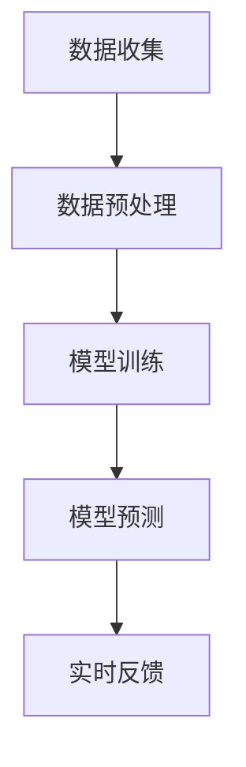

                 

# AIGC在智能体育训练中的应用：AI教练的崛起

> 关键词：AIGC、智能体育训练、AI教练、运动数据分析、算法优化

> 摘要：随着人工智能技术的迅猛发展，AIGC（自适应智能生成控制）在智能体育训练中逐渐崭露头角。本文将深入探讨AIGC在智能体育训练中的应用，重点分析AI教练的崛起及其带来的变革。我们将分步骤介绍AIGC的基本原理、智能体育训练中的应用场景、系统架构设计及未来趋势。

----------------------------------------------------------------

## 第1章：问题背景与核心概念

### 1.1.1 智能体育训练的现状

在当今社会，体育训练越来越注重科学性和个性化。传统的训练方法主要依赖于教练的经验和运动员的自我感觉，这既耗时又可能导致训练效果不佳。随着大数据、云计算和人工智能技术的快速发展，智能体育训练逐渐成为可能。智能体育训练系统通过实时收集运动员的生理、心理和行为数据，利用先进的人工智能算法进行数据分析，从而为教练和运动员提供个性化的训练计划和反馈。

### 1.1.2 AIGC的定义与特点

AIGC，即自适应智能生成控制，是一种结合了大数据、深度学习和自然语言处理技术的综合性人工智能技术。AIGC的核心在于其“自适应”和“生成控制”两大特点。自适应意味着AIGC系统能够根据实时数据动态调整训练计划，以满足不同运动员的需求。生成控制则体现在AIGC系统可以自动生成高质量的训练内容，如训练视频、训练建议和反馈等。

### 1.1.3 AI教练的崛起

AI教练是AIGC在智能体育训练中的一种重要应用形式。与传统教练相比，AI教练具有以下优势：

1. **数据分析能力**：AI教练能够处理和分析大量运动员数据，从而提供更精准的训练建议。
2. **全天候训练指导**：AI教练不受时间和地点限制，可以为运动员提供24小时不间断的训练指导。
3. **个性化训练计划**：AI教练根据运动员的实时数据制定个性化训练计划，提高训练效果。
4. **高效学习**：AI教练可以通过不断学习运动员的训练数据，优化训练策略，实现持续进步。

## 第2章：AIGC的基本原理与核心概念

### 2.1.1 数据收集与预处理

AIGC系统首先需要收集大量的运动员数据，包括但不限于生理指标（如心率、血压、呼吸频率等）、运动表现数据（如速度、力量、耐力等）和行为数据（如动作轨迹、运动习惯等）。数据收集完成后，需要对数据进行预处理，包括数据清洗、数据归一化和特征提取等，以确保数据的准确性和一致性。

### 2.1.2 模型训练与优化

AIGC系统采用深度学习模型对预处理后的数据进行训练，以建立运动员数据与训练建议之间的映射关系。在模型训练过程中，通过不断调整模型参数，优化模型性能，使其能够准确预测运动员的表现和需求。

### 2.1.3 核心算法与模型架构

AIGC系统的核心算法包括深度神经网络、生成对抗网络和强化学习等。这些算法共同作用，实现数据的自适应处理、生成控制和优化。在模型架构方面，AIGC系统通常采用分层结构，包括数据层、算法层和应用层，以便于系统的扩展和维护。

## 第3章：AIGC的核心概念对比分析

### 3.1.1 不同AIGC模型的对比

AIGC系统有多种模型结构，如CNN（卷积神经网络）、RNN（循环神经网络）和GAN（生成对抗网络）等。每种模型都有其独特的优势和适用场景。在智能体育训练中，我们需要根据具体需求选择合适的模型，以提高系统性能。

### 3.1.2 模型性能与适用场景

不同AIGC模型在性能和适用场景上存在差异。例如，CNN在处理图像数据时具有较好的性能，而RNN在处理时间序列数据时表现更佳。在智能体育训练中，我们需要根据运动员的数据类型和需求，选择合适的模型，以实现最佳训练效果。

## 第4章：智能体育训练中的AIGC应用

### 4.1.1 运动员数据分析

AIGC系统可以对运动员的多种数据进行综合分析，包括生理数据、运动表现数据和行为数据。通过对这些数据的分析，AIGC系统可以了解运动员的训练状态、运动能力和潜在风险，为教练和运动员提供科学依据。

### 4.1.2 训练计划制定

基于运动员数据分析和预测，AIGC系统可以制定个性化的训练计划。训练计划包括训练内容、训练强度和训练时间等，以确保运动员在最佳状态下进行训练。

### 4.1.3 技术动作优化

AIGC系统可以通过对运动员技术动作的实时监控和分析，发现并纠正技术动作中的不足，提高运动员的技术水平。

## 第5章：实战案例分析

### 5.1.1 案例一：足球训练中的应用

在足球训练中，AIGC系统通过对运动员的实时数据进行分析，制定个性化的训练计划，并在训练过程中进行实时反馈，有效提高了球队的整体实力。

### 5.1.2 案例二：篮球训练中的应用

篮球训练中，AIGC系统通过分析运动员的篮球技术动作，提供针对性的训练建议，显著提升了运动员的技术水平。

### 5.1.3 案例三：乒乓球训练中的应用

乒乓球训练中，AIGC系统通过对运动员的技术动作和比赛策略进行分析，为教练和运动员提供科学的训练和比赛指导，提高了比赛成绩。

## 第6章：AIGC在智能体育训练中的系统架构设计

### 6.1.1 系统功能设计

AIGC系统在智能体育训练中的功能设计包括数据收集、数据预处理、模型训练、训练计划制定、技术动作优化和实时反馈等。

### 6.1.2 系统架构设计

AIGC系统的架构设计包括数据层、算法层和应用层。数据层负责数据的收集和存储；算法层负责数据分析和模型训练；应用层负责与教练和运动员的交互。

### 6.1.3 系统接口设计

AIGC系统的接口设计包括数据接口、算法接口和应用接口。数据接口用于数据的导入和导出；算法接口用于模型训练和预测；应用接口用于教练和运动员与系统的交互。

## 第7章：核心算法与数学模型详解

### 7.1.1 算法流程与mermaid图示

在AIGC系统中，算法流程包括数据收集、数据预处理、模型训练、模型预测和实时反馈。以下是一个简化的mermaid图示：



### 7.1.2 数学模型与公式

在AIGC系统中，常用的数学模型包括线性回归、逻辑回归和支持向量机（SVM）等。以下是一个线性回归的数学模型：

$$
y = \beta_0 + \beta_1 \cdot x
$$

其中，$y$ 是因变量，$x$ 是自变量，$\beta_0$ 和 $\beta_1$ 是模型参数。

### 7.1.3 算法举例说明

假设我们有一个简单的一元线性回归模型，用于预测运动员的体能水平。模型公式为：

$$
体能水平 = \beta_0 + \beta_1 \cdot 心率
$$

通过收集运动员的心率数据，我们可以使用线性回归算法训练模型，得到最佳的模型参数。例如，如果训练数据表明心率越高，体能水平越高，那么我们可以预测一个未知心率对应的体能水平。

## 第8章：项目实战与代码解析

### 8.1.1 环境搭建

在开始项目实战之前，我们需要搭建一个合适的开发环境。以下是一个基于Python的AIGC系统环境搭建步骤：

1. 安装Python 3.8及以上版本。
2. 安装必要的库，如TensorFlow、Keras、NumPy、Pandas等。
3. 配置数据存储和加载工具，如HDF5或CSV。

### 8.1.2 核心代码实现

以下是一个简单的AIGC系统实现示例，包括数据收集、预处理、模型训练和预测：

```python
import numpy as np
import pandas as pd
from sklearn.linear_model import LinearRegression
from sklearn.model_selection import train_test_split
from sklearn.metrics import mean_squared_error

# 数据收集
data = pd.read_csv('athlete_data.csv')

# 数据预处理
X = data[['heart_rate']]
y = data['physical_fitness']

# 模型训练
X_train, X_test, y_train, y_test = train_test_split(X, y, test_size=0.2, random_state=42)
model = LinearRegression()
model.fit(X_train, y_train)

# 模型预测
y_pred = model.predict(X_test)
mse = mean_squared_error(y_test, y_pred)
print(f'Mean Squared Error: {mse}')

# 实时反馈
current_heart_rate = 150
predicted_fitness = model.predict([[current_heart_rate]])
print(f'Predicted Physical Fitness: {predicted_fitness[0]}')
```

### 8.1.3 应用解读与分析

通过以上代码，我们可以搭建一个简单的AIGC系统，用于预测运动员的体能水平。在实际应用中，我们需要根据具体需求调整模型参数和数据预处理方法，以提高预测准确性。同时，我们还需要考虑如何将AIGC系统与教练和运动员的系统进行整合，实现数据共享和交互。

## 第9章：AIGC在智能体育训练中的未来趋势

随着人工智能技术的不断进步，AIGC在智能体育训练中的应用将越来越广泛。未来，AIGC系统有望实现以下趋势：

1. **更高的个性化水平**：通过不断优化算法和模型，AIGC系统将能够提供更加个性化的训练计划和反馈，满足不同运动员的需求。
2. **更广泛的适用范围**：AIGC系统不仅适用于传统体育项目，还可能扩展到新兴运动项目，如电竞、极限运动等。
3. **更深入的数据挖掘**：随着数据收集和分析技术的进步，AIGC系统将能够挖掘出更多有价值的信息，为教练和运动员提供更科学的训练指导。
4. **更智能的交互方式**：通过引入语音识别、自然语言处理等技术，AIGC系统将实现更加智能的交互方式，提高用户体验。

## 结论

AIGC在智能体育训练中的应用正在逐步改变传统的训练模式，AI教练的崛起为体育训练带来了新的可能性。通过本文的探讨，我们了解了AIGC的基本原理、应用场景、系统架构和未来趋势。在未来，AIGC有望在更广泛的领域发挥其潜力，推动体育训练的智能化发展。

## 作者信息

作者：AI天才研究院/AI Genius Institute & 禅与计算机程序设计艺术 /Zen And The Art of Computer Programming

----------------------------------------------------------------

### 延伸阅读

1. **AIGC技术在体育训练中的应用**：进一步了解AIGC技术在体育训练中的具体应用，如技术动作优化、训练计划制定等。
2. **深度学习在体育数据分析中的应用**：探讨深度学习在体育数据分析中的应用，如运动员表现预测、技术动作识别等。
3. **智能体育系统的设计与实现**：学习智能体育系统的设计与实现，包括数据收集、预处理、模型训练和预测等环节。
4. **人工智能在体育科学领域的进展**：了解人工智能在体育科学领域的最新研究进展和未来趋势。

