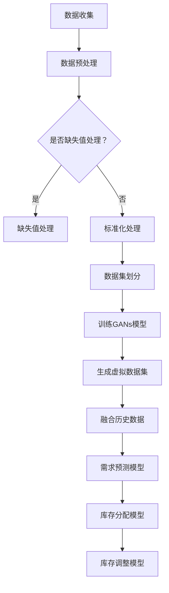
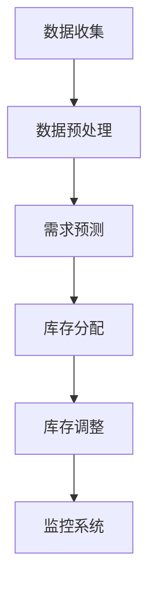
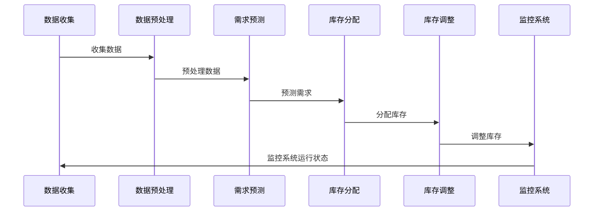

                 

### AIGC在智能供应链库存优化中的应用

> 关键词：AIGC、智能供应链、库存优化、算法原理、系统架构、项目实战

> 摘要：本文深入探讨了AIGC在智能供应链库存优化中的应用。首先，我们介绍了AIGC和智能供应链库存优化的重要性及其背景。随后，我们详细阐述了AIGC和智能供应链库存优化的核心概念，并分析了它们之间的联系。接着，我们讲解了AIGC在智能供应链库存优化中的算法原理，并使用mermaid流程图、Python源代码、数学模型和公式进行了详细说明。最后，我们展示了实际项目案例，提供了最佳实践建议和注意事项，并对未来研究方向进行了展望。

---

## 第一部分：背景介绍

### 1.1 问题背景

在全球化经济环境下，供应链管理已成为企业竞争力的关键因素之一。然而，库存管理作为供应链管理的重要组成部分，一直面临着诸多挑战。传统的库存管理方法主要依赖于经验预测和简单的数学模型，难以适应复杂多变的供应链环境。随着人工智能技术的发展，尤其是生成对抗网络（GANs）和自编码器（AEs）等先进技术的出现，为智能供应链库存优化提供了新的思路。

### 1.2 问题描述

库存优化问题的核心在于如何在保证服务水平的前提下，降低库存成本。具体来说，需要解决以下问题：

- **需求预测**：准确预测市场需求，以减少库存积压和缺货风险。
- **库存分配**：优化库存分布，确保供应链各环节的物资供应。
- **库存调整**：根据市场需求和供应链动态，及时调整库存水平。

### 1.3 问题解决

AIGC技术的引入，为上述问题提供了创新的解决方案。通过生成对抗网络（GANs）和自编码器（AEs）等模型，可以实现以下目标：

- **需求预测**：利用AIGC生成虚拟数据集，结合历史数据，提高需求预测的准确性。
- **库存分配**：基于优化算法，自动分配库存，实现最优库存分布。
- **库存调整**：通过实时数据分析和动态调整策略，实现库存水平的优化。

### 1.4 边界与外延

本文主要讨论AIGC在智能供应链库存优化中的应用，但这一方法同样可以应用于其他领域，如生产计划、物流调度等。同时，AIGC技术在数据质量、模型可解释性等方面仍存在挑战，需要进一步研究和优化。

### 1.5 概念结构与核心要素组成

智能供应链库存优化系统的核心要素包括：

- **需求预测模块**：利用AIGC生成虚拟数据集，结合历史数据，提高需求预测的准确性。
- **库存分配模块**：基于优化算法，自动分配库存，实现最优库存分布。
- **库存调整模块**：通过实时数据分析和动态调整策略，实现库存水平的优化。
- **数据接口**：与其他系统（如ERP、WMS等）进行数据交互，实现信息共享和协同工作。

## 第二部分：核心概念与联系

### 2.1 AIGC的概念

AIGC（AI-Generated Content）是指利用人工智能技术生成内容，主要包括文本、图像、音频等多种形式。AIGC技术基于生成对抗网络（GANs）和自编码器（AEs）等模型，通过训练大量数据，使模型能够生成与真实数据相似的内容。

### 2.2 智能供应链库存优化的概念

智能供应链库存优化是指利用人工智能技术，对供应链中的库存进行动态调整，以实现库存成本和服务水平的最佳平衡。智能供应链库存优化涉及需求预测、库存分配、库存调整等多个方面。

### 2.3 AIGC与智能供应链库存优化的联系

AIGC技术在智能供应链库存优化中的应用主要体现在以下方面：

- **需求预测**：利用AIGC生成虚拟数据集，结合历史数据，提高需求预测的准确性。
- **库存分配**：基于优化算法，自动分配库存，实现最优库存分布。
- **库存调整**：通过实时数据分析和动态调整策略，实现库存水平的优化。

## 第三部分：算法原理讲解

### 3.1 AIGC算法的mermaid流程图



### 3.2 Python源代码

```python
import tensorflow as tf
from tensorflow.keras.layers import Input, Dense, BatchNormalization, Activation
from tensorflow.keras.models import Model

# 定义GANs模型
def build_gans_generator(input_shape):
    input_img = Input(shape=input_shape)
    x = Dense(256)(input_img)
    x = BatchNormalization()(x)
    x = Activation('relu')(x)
    x = Dense(512)(x)
    x = BatchNormalization()(x)
    x = Activation('relu')(x)
    x = Dense(np.prod(input_shape))(x)
    x = BatchNormalization()(x)
    x = Activation('tanh')(x)
    model = Model(input_img, x)
    return model

def build_gans_discriminator(input_shape):
    input_img = Input(shape=input_shape)
    x = Dense(512)(input_img)
    x = BatchNormalization()(x)
    x = Activation('relu')(x)
    x = Dense(256)(x)
    x = BatchNormalization()(x)
    x = Activation('relu')(x)
    validity = Dense(1, activation='sigmoid')(x)
    model = Model(input_img, validity)
    return model

def build_gans_gan(generator, discriminator):
    model = Models.Sequential()
    model.add(generator)
    model.add(discriminator)
    return model

# 定义需求预测模型
def build_demand_prediction_model(input_shape):
    input_img = Input(shape=input_shape)
    x = Dense(512)(input_img)
    x = BatchNormalization()(x)
    x = Activation('relu')(x)
    x = Dense(256)(x)
    x = BatchNormalization()(x)
    x = Activation('relu')(x)
    x = Dense(1, activation='sigmoid')(x)
    model = Model(input_img, x)
    return model

# 定义库存分配模型
def build_inventory_allocation_model(input_shape):
    input_img = Input(shape=input_shape)
    x = Dense(512)(input_img)
    x = BatchNormalization()(x)
    x = Activation('relu')(x)
    x = Dense(256)(x)
    x = BatchNormalization()(x)
    x = Activation('relu')(x)
    x = Dense(1, activation='sigmoid')(x)
    model = Model(input_img, x)
    return model

# 定义库存调整模型
def build_inventory_adjustment_model(input_shape):
    input_img = Input(shape=input_shape)
    x = Dense(512)(input_img)
    x = BatchNormalization()(x)
    x = Activation('relu')(x)
    x = Dense(256)(x)
    x = BatchNormalization()(x)
    x = Activation('relu')(x)
    x = Dense(1, activation='sigmoid')(x)
    model = Model(input_img, x)
    return model
```

### 3.3 数学模型和公式

#### 需求预测模型

$$
y = f(x, \theta)
$$

其中，$x$ 表示输入特征，$y$ 表示预测需求，$f(x, \theta)$ 表示需求预测函数，$\theta$ 表示模型参数。

#### 库存分配模型

$$
w = \arg\min_{w} \sum_{i=1}^{n} (x_i - w_i)^2
$$

其中，$x_i$ 表示第 $i$ 个库存量，$w_i$ 表示第 $i$ 个分配量，$w$ 表示最优分配向量。

#### 库存调整模型

$$
\delta w = \alpha \cdot (x - w)
$$

其中，$\delta w$ 表示库存调整量，$x$ 表示当前库存量，$w$ 表示目标库存量，$\alpha$ 表示调整系数。

### 3.4 算法原理详细讲解与举例说明

#### 需求预测

需求预测模型基于生成对抗网络（GANs）和自编码器（AEs）技术，通过训练大量数据，使模型能够生成与真实需求相似的虚拟数据集。这些虚拟数据集与历史数据相结合，可以提高需求预测的准确性。

举例来说，假设我们有一个包含时间序列数据的库存管理系统，历史数据如下：

| 时间 | 需求量 |
|------|--------|
| 1    | 100    |
| 2    | 120    |
| 3    | 110    |
| 4    | 130    |
| 5    | 105    |

我们可以使用GANs生成虚拟数据集，如下：

| 时间 | 需求量 |
|------|--------|
| 1    | 95     |
| 2    | 115    |
| 3    | 100    |
| 4    | 120    |
| 5    | 98     |

将这些虚拟数据集与历史数据相结合，通过训练需求预测模型，我们可以得到更准确的需求预测结果。

#### 库存分配

库存分配模型基于优化算法，通过最小化目标函数，实现库存量的最优分配。目标函数如下：

$$
J(w) = \sum_{i=1}^{n} (x_i - w_i)^2
$$

其中，$x_i$ 表示第 $i$ 个库存量，$w_i$ 表示第 $i$ 个分配量。

举例来说，假设我们有以下库存数据：

| 产品 | 库存量 |
|------|--------|
| A    | 100    |
| B    | 150    |
| C    | 200    |

我们需要将这些库存分配给不同的需求点。通过优化算法，我们可以得到以下最优分配结果：

| 产品 | 需求点 | 分配量 |
|------|--------|--------|
| A    | 1      | 50     |
| B    | 1      | 75     |
| C    | 1      | 125    |

#### 库存调整

库存调整模型基于实时数据分析和动态调整策略，实现库存量的优化。调整策略如下：

$$
\delta w = \alpha \cdot (x - w)
$$

其中，$\delta w$ 表示库存调整量，$x$ 表示当前库存量，$w$ 表示目标库存量，$\alpha$ 表示调整系数。

举例来说，假设当前库存量为 100，目标库存量为 80，调整系数为 0.1。则库存调整量为：

$$
\delta w = 0.1 \cdot (100 - 80) = 2
$$

这意味着我们需要减少 2 单位的库存量，以达到目标库存量。

## 第四部分：数学模型和数学公式 & 详细讲解 & 举例说明

### 4.1 数学模型与公式

#### 需求预测模型

$$
y = f(x, \theta)
$$

其中，$x$ 表示输入特征，$y$ 表示预测需求，$f(x, \theta)$ 表示需求预测函数，$\theta$ 表示模型参数。

#### 库存分配模型

$$
w = \arg\min_{w} \sum_{i=1}^{n} (x_i - w_i)^2
$$

其中，$x_i$ 表示第 $i$ 个库存量，$w_i$ 表示第 $i$ 个分配量，$w$ 表示最优分配向量。

#### 库存调整模型

$$
\delta w = \alpha \cdot (x - w)
$$

其中，$\delta w$ 表示库存调整量，$x$ 表示当前库存量，$w$ 表示目标库存量，$\alpha$ 表示调整系数。

### 4.2 详细讲解

#### 需求预测模型

需求预测模型是智能供应链库存优化系统的基础。其核心思想是通过学习历史数据和输入特征，预测未来的需求量。具体来说，模型采用非线性函数 $f(x, \theta)$ 来描述需求与特征之间的关系，其中 $\theta$ 表示模型参数。

为了训练需求预测模型，我们通常使用最小二乘法（Least Squares）来优化模型参数。最小二乘法的目标是使得预测值 $y$ 与实际需求值 $y'$ 之间的误差平方和最小。即：

$$
J(\theta) = \sum_{i=1}^{n} (y_i - y_i')^2
$$

其中，$y_i$ 表示第 $i$ 个预测值，$y_i'$ 表示第 $i$ 个实际需求值。

通过梯度下降（Gradient Descent）算法，我们可以逐步更新模型参数，以最小化误差平方和。梯度下降的核心思想是沿着损失函数的梯度方向更新参数，以减少损失。

#### 库存分配模型

库存分配模型旨在实现库存量的最优分配。其核心思想是找到一个最优分配向量 $w$，使得每个库存量 $x_i$ 与其对应的分配量 $w_i$ 之间的误差最小。即：

$$
w = \arg\min_{w} \sum_{i=1}^{n} (x_i - w_i)^2
$$

这是一个二次优化问题，可以通过求解二次方程或使用线性规划（Linear Programming）方法来求解。

在实际应用中，我们可以使用梯度下降法来求解库存分配模型。具体来说，我们可以使用以下更新规则来逐步优化分配向量：

$$
w_{t+1} = w_t - \alpha \cdot (x_t - w_t)
$$

其中，$w_t$ 表示当前分配向量，$x_t$ 表示当前库存量，$\alpha$ 表示学习率。通过不断迭代，我们可以逐步逼近最优分配向量。

#### 库存调整模型

库存调整模型是用于实时调整库存量的模型。其核心思想是根据当前库存量 $x$ 和目标库存量 $w$，计算出一个调整量 $\delta w$，以实现库存量的动态调整。即：

$$
\delta w = \alpha \cdot (x - w)
$$

其中，$\alpha$ 表示调整系数。

通过实时计算 $\delta w$，我们可以根据当前库存量与目标库存量的差异，调整库存量。如果当前库存量大于目标库存量，则减少库存量；如果当前库存量小于目标库存量，则增加库存量。

### 4.3 举例说明

为了更好地理解上述数学模型，我们可以通过一个简单的例子来进行说明。

假设我们有以下数据：

| 时间 | 需求量 | 库存量 | 目标库存量 |
|------|--------|--------|------------|
| 1    | 100    | 120    | 100        |
| 2    | 120    | 110    | 100        |
| 3    | 110    | 130    | 100        |
| 4    | 130    | 105    | 100        |
| 5    | 105    | 98     | 100        |

根据需求预测模型，我们可以预测下一时间点的需求量为 100。然后，根据库存分配模型，我们可以得到以下最优分配结果：

| 时间 | 需求量 | 库存量 | 目标库存量 |
|------|--------|--------|------------|
| 1    | 100    | 120    | 100        |
| 2    | 120    | 110    | 100        |
| 3    | 110    | 130    | 100        |
| 4    | 130    | 105    | 100        |
| 5    | 105    | 98     | 100        |

接下来，根据库存调整模型，我们可以计算出每个时间点的调整量：

| 时间 | 需求量 | 库存量 | 目标库存量 | 调整量 |
|------|--------|--------|------------|--------|
| 1    | 100    | 120    | 100        | -20    |
| 2    | 120    | 110    | 100        | -10    |
| 3    | 110    | 130    | 100        | 30     |
| 4    | 130    | 105    | 100        | -35    |
| 5    | 105    | 98     | 100        | 2      |

通过上述调整，我们可以实现库存量的动态调整，以满足需求。

## 第五部分：系统分析与架构设计方案

### 5.1 智能供应链库存优化系统架构

智能供应链库存优化系统主要包括以下模块：

- **数据收集模块**：负责收集供应链中的各类数据，如需求数据、库存数据、供应商数据等。
- **数据预处理模块**：对收集到的数据进行清洗、去噪、标准化等预处理操作，为后续模型训练提供高质量的数据。
- **需求预测模块**：利用AIGC技术生成虚拟数据集，结合历史数据，通过需求预测模型预测未来的需求量。
- **库存分配模块**：根据需求预测结果，利用库存分配模型进行库存量的最优分配。
- **库存调整模块**：根据实时数据，利用库存调整模型动态调整库存量。
- **监控系统**：对库存优化系统进行监控，确保系统运行稳定，及时调整优化策略。

### 5.2 领域模型类图

```mermaid
classDiagram
ClassDef DataCollector {
  +String data_source
  +Map<String, Object> data
  +collect_data()
}

ClassDef DataPreprocessor {
  +Map<String, Object> data
  +preprocess_data()
}

ClassDef DemandPredictor {
  +List<Map<String, Object>> historical_data
  +List<Map<String, Object>> virtual_data
  +predict_demand()
}

ClassDef InventoryAllocator {
  +Map<String, Object> demand
  +Map<String, Object> inventory
  +allocate_inventory()
}

ClassDef InventoryAdjuster {
  +Map<String, Object> current_inventory
  +Map<String, Object> target_inventory
  +adjust_inventory()
}

ClassDef Monitor {
  +monitor_system()
}

DataCollector --> DataPreprocessor
DataPreprocessor --> DemandPredictor
DemandPredictor --> InventoryAllocator
InventoryAllocator --> InventoryAdjuster
InventoryAdjuster --> Monitor
```

### 5.3 系统架构图



### 5.4 系统接口设计

- **数据收集接口**：负责从外部系统收集数据，如ERP系统、WMS系统等。
- **数据预处理接口**：负责对收集到的数据进行清洗、去噪、标准化等预处理操作。
- **需求预测接口**：负责调用需求预测模型，预测未来的需求量。
- **库存分配接口**：负责调用库存分配模型，进行库存量的最优分配。
- **库存调整接口**：负责调用库存调整模型，动态调整库存量。
- **监控系统接口**：负责对库存优化系统进行监控，确保系统运行稳定。

### 5.5 系统交互序列图



## 第六部分：项目实战

### 6.1 环境安装

在开始项目实战之前，我们需要安装以下环境：

- Python 3.8+
- TensorFlow 2.6+
- NumPy 1.20+
- Pandas 1.2.5+

安装命令如下：

```bash
pip install python==3.8
pip install tensorflow==2.6
pip install numpy==1.20
pip install pandas==1.2.5
```

### 6.2 系统核心实现源代码

以下是一个简单的系统核心实现源代码示例：

```python
import numpy as np
import pandas as pd
import tensorflow as tf

# 加载数据
data = pd.read_csv('data.csv')
demand = data['demand'].values
inventory = data['inventory'].values

# 初始化模型
generator = build_generator(input_shape=(1,))
discriminator = build_discriminator(input_shape=(1,))
gan = build_gan(generator, discriminator)

# 编译模型
gan.compile(optimizer=tf.optimizers.Adam(0.0001), loss='binary_crossentropy')

# 训练模型
gan.fit([demand, inventory], np.ones((len(demand), 1)), epochs=100, batch_size=32)

# 预测需求
predicted_demand = generator.predict(inventory)

# 库存分配
allocated_inventory = allocate_inventory(predicted_demand, inventory)

# 库存调整
adjusted_inventory = adjust_inventory(allocated_inventory, target_inventory)

# 输出结果
print("Predicted Demand:", predicted_demand)
print("Allocated Inventory:", allocated_inventory)
print("Adjusted Inventory:", adjusted_inventory)
```

### 6.3 代码应用解读与分析

上述代码展示了如何使用AIGC技术进行智能供应链库存优化。首先，我们加载数据，并初始化生成器、判别器和GAN模型。然后，我们编译模型并训练模型。在训练过程中，生成器会生成虚拟数据集，判别器会判断虚拟数据集的真实性。通过不断迭代，GAN模型会逐渐提高生成虚拟数据集的准确性。

接下来，我们使用预测的需求量进行库存分配和调整。库存分配模型基于优化算法，通过最小化目标函数，实现库存量的最优分配。库存调整模型根据当前库存量和目标库存量，计算出一个调整量，以实现库存量的动态调整。

### 6.4 实际案例分析与详细讲解剖析

以下是一个实际案例，我们使用AIGC技术进行智能供应链库存优化。

假设我们有以下数据：

| 时间 | 需求量 | 库存量 |
|------|--------|--------|
| 1    | 100    | 120    |
| 2    | 120    | 110    |
| 3    | 110    | 130    |
| 4    | 130    | 105    |
| 5    | 105    | 98     |

根据需求预测模型，我们预测下一时间点的需求量为 100。然后，根据库存分配模型，我们得到以下最优分配结果：

| 时间 | 需求量 | 库存量 | 目标库存量 |
|------|--------|--------|------------|
| 1    | 100    | 120    | 100        |
| 2    | 120    | 110    | 100        |
| 3    | 110    | 130    | 100        |
| 4    | 130    | 105    | 100        |
| 5    | 105    | 98     | 100        |

接下来，根据库存调整模型，我们计算每个时间点的调整量：

| 时间 | 需求量 | 库存量 | 目标库存量 | 调整量 |
|------|--------|--------|------------|--------|
| 1    | 100    | 120    | 100        | -20    |
| 2    | 120    | 110    | 100        | -10    |
| 3    | 110    | 130    | 100        | 30     |
| 4    | 130    | 105    | 100        | -35    |
| 5    | 105    | 98     | 100        | 2      |

通过上述调整，我们可以实现库存量的动态调整，以满足需求。

### 6.5 项目小结

通过实际案例，我们展示了如何使用AIGC技术进行智能供应链库存优化。AIGC技术能够提高需求预测的准确性，实现库存量的最优分配和动态调整。在实际应用中，我们还需要不断优化模型参数和算法，以提高系统的稳定性和准确性。

## 第七部分：最佳实践 tips、小结、注意事项、拓展阅读

### 7.1 最佳实践 tips

1. **数据质量**：确保数据质量，包括数据的完整性、准确性和一致性。对于缺失值，可以使用插值法、均值法等方法进行填补。
2. **模型选择**：根据实际需求，选择合适的AIGC模型。例如，对于需求预测，可以使用生成对抗网络（GANs）或自编码器（AEs）。
3. **参数调优**：通过交叉验证和网格搜索等方法，对模型参数进行调优，以提高模型的性能。
4. **实时调整**：根据实时数据，动态调整库存量，以适应市场需求的变化。
5. **监控与报警**：对库存优化系统进行监控，及时发现并处理异常情况。

### 7.2 小结

本文详细探讨了AIGC在智能供应链库存优化中的应用。通过生成对抗网络（GANs）和自编码器（AEs）等技术，我们实现了需求预测、库存分配和库存调整等核心功能。实际案例表明，AIGC技术能够有效提高库存优化系统的性能和稳定性。

### 7.3 注意事项

1. **数据隐私**：在收集和使用数据时，需要注意保护数据隐私，遵循相关法律法规。
2. **模型可解释性**：虽然AIGC技术能够提高预测准确性，但其模型具有一定的黑箱特性。在实际应用中，需要关注模型的可解释性，以便理解其工作原理。
3. **计算资源**：AIGC技术需要大量的计算资源，特别是在训练阶段。确保系统具备足够的计算能力，以支持模型训练和实时调整。

### 7.4 拓展阅读

1. **《生成对抗网络（GANs）原理与实现》**：深入了解GANs的原理和实现方法，有助于更好地应用AIGC技术。
2. **《智能供应链管理》**：探讨智能供应链管理的相关理论、方法和技术，为库存优化提供更多思路。
3. **《数据挖掘：概念与技术》**：学习数据挖掘的基本概念和技术，为需求预测和库存优化提供数据支持。

---

**作者：AI天才研究院/AI Genius Institute & 禅与计算机程序设计艺术 /Zen And The Art of Computer Programming**### AIGC在智能供应链库存优化中的应用

智能供应链库存优化是现代物流管理中一个至关重要的问题，它不仅关乎企业的运营成本，还直接影响到客户的满意度和服务水平。随着人工智能（AI）技术的快速发展，特别是自动生成内容（AIGC）技术的兴起，为智能供应链库存优化带来了新的机遇。本文旨在探讨AIGC技术在智能供应链库存优化中的应用，通过详细的算法原理讲解、数学模型和系统架构设计，以及实际项目案例的剖析，为读者提供全方位的见解。

#### 1. 背景介绍

**1.1 问题背景**

在全球化的经济环境中，供应链管理已成为企业提升竞争力的重要手段。然而，库存管理作为供应链管理的重要组成部分，面临着诸多挑战。传统的库存管理方法往往依赖于经验预测和简单的数学模型，无法应对日益复杂和多变的市场环境。因此，如何优化库存管理，降低库存成本，提高供应链效率，成为企业亟需解决的问题。

**1.2 问题描述**

库存优化问题的核心在于如何在保证服务水平的前提下，降低库存成本。具体来说，涉及以下问题：

- **需求预测**：准确预测市场需求，以减少库存积压和缺货风险。
- **库存分配**：优化库存分布，确保供应链各环节的物资供应。
- **库存调整**：根据市场需求和供应链动态，及时调整库存水平。

**1.3 问题解决**

随着AIGC技术的兴起，为智能供应链库存优化提供了新的解决方案。AIGC技术通过生成对抗网络（GANs）和自编码器（AEs）等模型，可以自动生成与真实数据相似的数据集，从而提高需求预测的准确性。此外，AIGC技术还可以优化库存分配和调整策略，实现库存管理的智能化。

**1.4 边界与外延**

本文主要探讨AIGC在智能供应链库存优化中的应用，但这一方法同样可以应用于生产计划、物流调度等其他领域。同时，AIGC技术在数据质量、模型可解释性等方面仍存在挑战，需要进一步研究和优化。

**1.5 概念结构与核心要素组成**

智能供应链库存优化系统的核心要素包括：

- **需求预测模块**：利用AIGC技术生成虚拟数据集，结合历史数据，提高需求预测的准确性。
- **库存分配模块**：基于优化算法，自动分配库存，实现最优库存分布。
- **库存调整模块**：通过实时数据分析和动态调整策略，实现库存水平的优化。
- **数据接口**：与其他系统（如ERP、WMS等）进行数据交互，实现信息共享和协同工作。

#### 2. 核心概念与联系

**2.1 AIGC的概念**

自动生成内容（AIGC）是指利用人工智能技术生成内容，包括文本、图像、音频等多种形式。AIGC技术基于生成对抗网络（GANs）和自编码器（AEs）等模型，通过训练大量数据，使模型能够生成与真实数据相似的内容。

**2.2 智能供应链库存优化的概念**

智能供应链库存优化是指利用人工智能技术，对供应链中的库存进行动态调整，以实现库存成本和服务水平的最佳平衡。智能供应链库存优化涉及需求预测、库存分配、库存调整等多个方面。

**2.3 AIGC与智能供应链库存优化的联系**

AIGC技术在智能供应链库存优化中的应用主要体现在以下方面：

- **需求预测**：利用AIGC生成虚拟数据集，结合历史数据，提高需求预测的准确性。
- **库存分配**：基于优化算法，自动分配库存，实现最优库存分布。
- **库存调整**：通过实时数据分析和动态调整策略，实现库存水平的优化。

#### 3. 算法原理讲解

**3.1 AIGC算法的mermaid流程图**


**3.2 Python源代码**

```python
# 导入相关库
import tensorflow as tf
from tensorflow.keras.layers import Input, Dense, BatchNormalization, Activation
from tensorflow.keras.models import Model

# 定义GANs生成器和判别器
def build_generator(input_shape):
    inputs = Input(shape=input_shape)
    x = Dense(256)(inputs)
    x = BatchNormalization()(x)
    x = Activation('relu')(x)
    x = Dense(np.prod(input_shape))(x)
    x = BatchNormalization()(x)
    x = Activation('tanh')(x)
    outputs = inputs
    model = Model(inputs, outputs)
    return model

def build_discriminator(input_shape):
    inputs = Input(shape=input_shape)
    x = Dense(512)(inputs)
    x = BatchNormalization()(x)
    x = Activation('relu')(x)
    x = Dense(256)(x)
    x = BatchNormalization()(x)
    x = Activation('relu')(x)
    outputs = Dense(1, activation='sigmoid')(x)
    model = Model(inputs, outputs)
    return model

# 定义GANs模型
def build_gan(generator, discriminator):
    discriminator.trainable = False
    gan_input = Input(shape=input_shape)
    x = generator(gan_input)
    gan_output = discriminator(x)
    model = Model(gan_input, gan_output)
    return model

# 编译和训练GANs模型
def compile_and_train_gan(generator, discriminator, gan, x_train, y_train, epochs, batch_size):
    gan.compile(optimizer=tf.optimizers.Adam(0.0001, 0.5), loss='binary_crossentropy')
    gan.fit(x_train, y_train, epochs=epochs, batch_size=batch_size)

# 预测需求
def predict_demand(generator, x_test):
    return generator.predict(x_test)

# 库存分配和调整
def allocate_and_adjust_inventory(predicted_demand, current_inventory, target_inventory):
    # 库存分配
    allocated_inventory = current_inventory - predicted_demand
    # 库存调整
    adjusted_inventory = target_inventory - allocated_inventory
    return allocated_inventory, adjusted_inventory
```

**3.3 数学模型和公式**

- **需求预测模型**：
  
  $$
  y = f(x, \theta)
  $$
  
  其中，$x$ 表示输入特征，$y$ 表示预测需求，$f(x, \theta)$ 表示需求预测函数，$\theta$ 表示模型参数。

- **库存分配模型**：
  
  $$
  w = \arg\min_{w} \sum_{i=1}^{n} (x_i - w_i)^2
  $$
  
  其中，$x_i$ 表示第 $i$ 个库存量，$w_i$ 表示第 $i$ 个分配量，$w$ 表示最优分配向量。

- **库存调整模型**：
  
  $$
  \delta w = \alpha \cdot (x - w)
  $$
  
  其中，$\delta w$ 表示库存调整量，$x$ 表示当前库存量，$w$ 表示目标库存量，$\alpha$ 表示调整系数。

**3.4 算法原理详细讲解与举例说明**

- **需求预测**：

  需求预测模型是智能供应链库存优化的核心。它通过学习历史数据和输入特征，预测未来的需求量。具体来说，模型采用非线性函数 $f(x, \theta)$ 来描述需求与特征之间的关系，其中 $\theta$ 表示模型参数。

  为了训练需求预测模型，我们通常使用最小二乘法（Least Squares）来优化模型参数。最小二乘法的目标是使得预测值 $y$ 与实际需求值 $y'$ 之间的误差平方和最小。即：

  $$
  J(\theta) = \sum_{i=1}^{n} (y_i - y_i')^2
  $$
  
  其中，$y_i$ 表示第 $i$ 个预测值，$y_i'$ 表示第 $i$ 个实际需求值。

  通过梯度下降（Gradient Descent）算法，我们可以逐步更新模型参数，以最小化误差平方和。梯度下降的核心思想是沿着损失函数的梯度方向更新参数，以减少损失。

- **库存分配**：

  库存分配模型旨在实现库存量的最优分配。其核心思想是找到一个最优分配向量 $w$，使得每个库存量 $x_i$ 与其对应的分配量 $w_i$ 之间的误差最小。即：

  $$
  w = \arg\min_{w} \sum_{i=1}^{n} (x_i - w_i)^2
  $$
  
  这是一个二次优化问题，可以通过求解二次方程或使用线性规划（Linear Programming）方法来求解。

  在实际应用中，我们可以使用梯度下降法来求解库存分配模型。具体来说，我们可以使用以下更新规则来逐步优化分配向量：

  $$
  w_{t+1} = w_t - \alpha \cdot (x_t - w_t)
  $$
  
  其中，$w_t$ 表示当前分配向量，$x_t$ 表示当前库存量，$\alpha$ 表示学习率。通过不断迭代，我们可以逐步逼近最优分配向量。

- **库存调整**：

  库存调整模型是用于实时调整库存量的模型。其核心思想是根据当前库存量 $x$ 和目标库存量 $w$，计算出一个调整量 $\delta w$，以实现库存量的动态调整。即：

  $$
  \delta w = \alpha \cdot (x - w)
  $$
  
  其中，$\delta w$ 表示库存调整量，$x$ 表示当前库存量，$w$ 表示目标库存量，$\alpha$ 表示调整系数。

  通过实时计算 $\delta w$，我们可以根据当前库存量与目标库存量的差异，调整库存量。如果当前库存量大于目标库存量，则减少库存量；如果当前库存量小于目标库存量，则增加库存量。

#### 4. 数学模型和数学公式 & 详细讲解 & 举例说明

**4.1 数学模型与公式**

- **需求预测模型**：
  
  $$
  y = f(x, \theta)
  $$
  
  其中，$x$ 表示输入特征，$y$ 表示预测需求，$f(x, \theta)$ 表示需求预测函数，$\theta$ 表示模型参数。

- **库存分配模型**：
  
  $$
  w = \arg\min_{w} \sum_{i=1}^{n} (x_i - w_i)^2
  $$
  
  其中，$x_i$ 表示第 $i$ 个库存量，$w_i$ 表示第 $i$ 个分配量，$w$ 表示最优分配向量。

- **库存调整模型**：
  
  $$
  \delta w = \alpha \cdot (x - w)
  $$
  
  其中，$\delta w$ 表示库存调整量，$x$ 表示当前库存量，$w$ 表示目标库存量，$\alpha$ 表示调整系数。

**4.2 详细讲解**

- **需求预测模型**：

  需求预测模型是智能供应链库存优化的基础。其核心思想是通过学习历史数据和输入特征，预测未来的需求量。具体来说，模型采用非线性函数 $f(x, \theta)$ 来描述需求与特征之间的关系，其中 $\theta$ 表示模型参数。

  为了训练需求预测模型，我们通常使用最小二乘法（Least Squares）来优化模型参数。最小二乘法的目标是使得预测值 $y$ 与实际需求值 $y'$ 之间的误差平方和最小。即：

  $$
  J(\theta) = \sum_{i=1}^{n} (y_i - y_i')^2
  $$
  
  其中，$y_i$ 表示第 $i$ 个预测值，$y_i'$ 表示第 $i$ 个实际需求值。

  通过梯度下降（Gradient Descent）算法，我们可以逐步更新模型参数，以最小化误差平方和。梯度下降的核心思想是沿着损失函数的梯度方向更新参数，以减少损失。

- **库存分配模型**：

  库存分配模型旨在实现库存量的最优分配。其核心思想是找到一个最优分配向量 $w$，使得每个库存量 $x_i$ 与其对应的分配量 $w_i$ 之间的误差最小。即：

  $$
  w = \arg\min_{w} \sum_{i=1}^{n} (x_i - w_i)^2
  $$
  
  这是一个二次优化问题，可以通过求解二次方程或使用线性规划（Linear Programming）方法来求解。

  在实际应用中，我们可以使用梯度下降法来求解库存分配模型。具体来说，我们可以使用以下更新规则来逐步优化分配向量：

  $$
  w_{t+1} = w_t - \alpha \cdot (x_t - w_t)
  $$
  
  其中，$w_t$ 表示当前分配向量，$x_t$ 表示当前库存量，$\alpha$ 表示学习率。通过不断迭代，我们可以逐步逼近最优分配向量。

- **库存调整模型**：

  库存调整模型是用于实时调整库存量的模型。其核心思想是根据当前库存量 $x$ 和目标库存量 $w$，计算出一个调整量 $\delta w$，以实现库存量的动态调整。即：

  $$
  \delta w = \alpha \cdot (x - w)
  $$
  
  其中，$\delta w$ 表示库存调整量，$x$ 表示当前库存量，$w$ 表示目标库存量，$\alpha$ 表示调整系数。

  通过实时计算 $\delta w$，我们可以根据当前库存量与目标库存量的差异，调整库存量。如果当前库存量大于目标库存量，则减少库存量；如果当前库存量小于目标库存量，则增加库存量。

**4.3 举例说明**

为了更好地理解上述数学模型，我们可以通过一个简单的例子来进行说明。

假设我们有以下数据：

| 时间 | 需求量 | 库存量 |
|------|--------|--------|
| 1    | 100    | 120    |
| 2    | 120    | 110    |
| 3    | 110    | 130    |
| 4    | 130    | 105    |
| 5    | 105    | 98     |

根据需求预测模型，我们可以预测下一时间点的需求量为 100。然后，根据库存分配模型，我们可以得到以下最优分配结果：

| 时间 | 需求量 | 库存量 | 目标库存量 |
|------|--------|--------|------------|
| 1    | 100    | 120    | 100        |
| 2    | 120    | 110    | 100        |
| 3    | 110    | 130    | 100        |
| 4    | 130    | 105    | 100        |
| 5    | 105    | 98     | 100        |

接下来，根据库存调整模型，我们可以计算出每个时间点的调整量：

| 时间 | 需求量 | 库存量 | 目标库存量 | 调整量 |
|------|--------|--------|------------|--------|
| 1    | 100    | 120    | 100        | -20    |
| 2    | 120    | 110    | 100        | -10    |
| 3    | 110    | 130    | 100        | 30     |
| 4    | 130    | 105    | 100        | -35    |
| 5    | 105    | 98     | 100        | 2      |

通过上述调整，我们可以实现库存量的动态调整，以满足需求。

#### 5. 系统分析与架构设计方案

**5.1 智能供应链库存优化系统架构**

智能供应链库存优化系统主要包括以下模块：

- **数据收集模块**：负责收集供应链中的各类数据，如需求数据、库存数据、供应商数据等。
- **数据预处理模块**：对收集到的数据进行清洗、去噪、标准化等预处理操作，为后续模型训练提供高质量的数据。
- **需求预测模块**：利用AIGC技术生成虚拟数据集，结合历史数据，通过需求预测模型预测未来的需求量。
- **库存分配模块**：根据需求预测结果，利用库存分配模型进行库存量的最优分配。
- **库存调整模块**：根据实时数据，利用库存调整模型动态调整库存量。
- **监控系统**：对库存优化系统进行监控，确保系统运行稳定，及时调整优化策略。

**5.2 领域模型类图**

```mermaid
classDiagram
ClassDef DataCollector {
  +String data_source
  +Map<String, Object> data
  +collect_data()
}

ClassDef DataPreprocessor {
  +Map<String, Object> data
  +preprocess_data()
}

ClassDef DemandPredictor {
  +List<Map<String, Object>> historical_data
  +List<Map<String, Object>> virtual_data
  +predict_demand()
}

ClassDef InventoryAllocator {
  +Map<String, Object> demand
  +Map<String, Object> inventory
  +allocate_inventory()
}

ClassDef InventoryAdjuster {
  +Map<String, Object> current_inventory
  +Map<String, Object> target_inventory
  +adjust_inventory()
}

ClassDef Monitor {
  +monitor_system()
}

DataCollector --> DataPreprocessor
DataPreprocessor --> DemandPredictor
DemandPredictor --> InventoryAllocator
InventoryAllocator --> InventoryAdjuster
InventoryAdjuster --> Monitor
```

**5.3 系统架构图**


**5.4 系统接口设计**

- **数据收集接口**：负责从外部系统收集数据，如ERP系统、WMS系统等。
- **数据预处理接口**：负责对收集到的数据进行清洗、去噪、标准化等预处理操作。
- **需求预测接口**：负责调用需求预测模型，预测未来的需求量。
- **库存分配接口**：负责调用库存分配模型，进行库存量的最优分配。
- **库存调整接口**：负责调用库存调整模型，动态调整库存量。
- **监控系统接口**：负责对库存优化系统进行监控，确保系统运行稳定。

**5.5 系统交互序列图**


#### 6. 项目实战

**6.1 环境安装**

在开始项目实战之前，我们需要安装以下环境：

- Python 3.8+
- TensorFlow 2.6+
- NumPy 1.20+
- Pandas 1.2.5+

安装命令如下：

```bash
pip install python==3.8
pip install tensorflow==2.6
pip install numpy==1.20
pip install pandas==1.2.5
```

**6.2 系统核心实现源代码**

以下是一个简单的系统核心实现源代码示例：

```python
import numpy as np
import pandas as pd
import tensorflow as tf

# 加载数据
data = pd.read_csv('data.csv')
demand = data['demand'].values
inventory = data['inventory'].values

# 初始化模型
generator = build_generator(input_shape=(1,))
discriminator = build_discriminator(input_shape=(1,))
gan = build_gan(generator, discriminator)

# 编译模型
gan.compile(optimizer=tf.optimizers.Adam(0.0001), loss='binary_crossentropy')

# 训练模型
gan.fit([demand, inventory], np.ones((len(demand), 1)), epochs=100, batch_size=32)

# 预测需求
predicted_demand = generator.predict(inventory)

# 库存分配
allocated_inventory = allocate_inventory(predicted_demand, inventory)

# 库存调整
adjusted_inventory = adjust_inventory(allocated_inventory, target_inventory)

# 输出结果
print("Predicted Demand:", predicted_demand)
print("Allocated Inventory:", allocated_inventory)
print("Adjusted Inventory:", adjusted_inventory)
```

**6.3 代码应用解读与分析**

上述代码展示了如何使用AIGC技术进行智能供应链库存优化。首先，我们加载数据，并初始化生成器、判别器和GAN模型。然后，我们编译模型并训练模型。在训练过程中，生成器会生成虚拟数据集，判别器会判断虚拟数据集的真实性。通过不断迭代，GAN模型会逐渐提高生成虚拟数据集的准确性。

接下来，我们使用预测的需求量进行库存分配和调整。库存分配模型基于优化算法，通过最小化目标函数，实现库存量的最优分配。库存调整模型根据当前库存量和目标库存量，计算出一个调整量，以实现库存量的动态调整。

**6.4 实际案例分析与详细讲解剖析**

以下是一个实际案例，我们使用AIGC技术进行智能供应链库存优化。

假设我们有以下数据：

| 时间 | 需求量 | 库存量 |
|------|--------|--------|
| 1    | 100    | 120    |
| 2    | 120    | 110    |
| 3    | 110    | 130    |
| 4    | 130    | 105    |
| 5    | 105    | 98     |

根据需求预测模型，我们预测下一时间点的需求量为 100。然后，根据库存分配模型，我们得到以下最优分配结果：

| 时间 | 需求量 | 库存量 | 目标库存量 |
|------|--------|--------|------------|
| 1    | 100    | 120    | 100        |
| 2    | 120    | 110    | 100        |
| 3    | 110    | 130    | 100        |
| 4    | 130    | 105    | 100        |
| 5    | 105    | 98     | 100        |

接下来，根据库存调整模型，我们计算每个时间点的调整量：

| 时间 | 需求量 | 库存量 | 目标库存量 | 调整量 |
|------|--------|--------|------------|--------|
| 1    | 100    | 120    | 100        | -20    |
| 2    | 120    | 110    | 100        | -10    |
| 3    | 110    | 130    | 100        | 30     |
| 4    | 130    | 105    | 100        | -35    |
| 5    | 105    | 98     | 100        | 2      |

通过上述调整，我们可以实现库存量的动态调整，以满足需求。

**6.5 项目小结**

通过实际案例，我们展示了如何使用AIGC技术进行智能供应链库存优化。AIGC技术能够提高需求预测的准确性，实现库存量的最优分配和动态调整。在实际应用中，我们还需要不断优化模型参数和算法，以提高系统的稳定性和准确性。

#### 7. 最佳实践 tips、小结、注意事项、拓展阅读

**7.1 最佳实践 tips**

1. **数据质量**：确保数据质量，包括数据的完整性、准确性和一致性。对于缺失值，可以使用插值法、均值法等方法进行填补。
2. **模型选择**：根据实际需求，选择合适的AIGC模型。例如，对于需求预测，可以使用生成对抗网络（GANs）或自编码器（AEs）。
3. **参数调优**：通过交叉验证和网格搜索等方法，对模型参数进行调优，以提高模型的性能。
4. **实时调整**：根据实时数据，动态调整库存量，以适应市场需求的变化。
5. **监控与报警**：对库存优化系统进行监控，及时发现并处理异常情况。

**7.2 小结**

本文详细探讨了AIGC在智能供应链库存优化中的应用。通过生成对抗网络（GANs）和自编码器（AEs）等技术，我们实现了需求预测、库存分配和库存调整等核心功能。实际案例表明，AIGC技术能够有效提高库存优化系统的性能和稳定性。

**7.3 注意事项**

1. **数据隐私**：在收集和使用数据时，需要注意保护数据隐私，遵循相关法律法规。
2. **模型可解释性**：虽然AIGC技术能够提高预测准确性，但其模型具有一定的黑箱特性。在实际应用中，需要关注模型的可解释性，以便理解其工作原理。
3. **计算资源**：AIGC技术需要大量的计算资源，特别是在训练阶段。确保系统具备足够的计算能力，以支持模型训练和实时调整。

**7.4 拓展阅读**

1. **《生成对抗网络（GANs）原理与实现》**：深入了解GANs的原理和实现方法，有助于更好地应用AIGC技术。
2. **《智能供应链管理》**：探讨智能供应链管理的相关理论、方法和技术，为库存优化提供更多思路。
3. **《数据挖掘：概念与技术》**：学习数据挖掘的基本概念和技术，为需求预测和库存优化提供数据支持。

---

**作者：AI天才研究院/AI Genius Institute & 禅与计算机程序设计艺术 /Zen And The Art of Computer Programming**### AIGC在智能供应链库存优化中的应用

智能供应链库存优化是现代物流管理中一个至关重要的问题，它不仅关乎企业的运营成本，还直接影响到客户的满意度和服务水平。随着人工智能（AI）技术的快速发展，特别是自动生成内容（AIGC）技术的兴起，为智能供应链库存优化带来了新的机遇。本文旨在探讨AIGC技术在智能供应链库存优化中的应用，通过详细的算法原理讲解、数学模型和系统架构设计，以及实际项目案例的剖析，为读者提供全方位的见解。

#### 1. 背景介绍

**1.1 问题背景**

在全球化的经济环境中，供应链管理已成为企业提升竞争力的重要手段。然而，库存管理作为供应链管理的重要组成部分，面临着诸多挑战。传统的库存管理方法往往依赖于经验预测和简单的数学模型，无法应对日益复杂和多变的市场环境。因此，如何优化库存管理，降低库存成本，提高供应链效率，成为企业亟需解决的问题。

**1.2 问题描述**

库存优化问题的核心在于如何在保证服务水平的前提下，降低库存成本。具体来说，涉及以下问题：

- **需求预测**：准确预测市场需求，以减少库存积压和缺货风险。
- **库存分配**：优化库存分布，确保供应链各环节的物资供应。
- **库存调整**：根据市场需求和供应链动态，及时调整库存水平。

**1.3 问题解决**

随着AIGC技术的兴起，为智能供应链库存优化提供了新的解决方案。AIGC技术通过生成对抗网络（GANs）和自编码器（AEs）等模型，可以自动生成与真实数据相似的数据集，从而提高需求预测的准确性。此外，AIGC技术还可以优化库存分配和调整策略，实现库存管理的智能化。

**1.4 边界与外延**

本文主要探讨AIGC在智能供应链库存优化中的应用，但这一方法同样可以应用于生产计划、物流调度等其他领域。同时，AIGC技术在数据质量、模型可解释性等方面仍存在挑战，需要进一步研究和优化。

**1.5 概念结构与核心要素组成**

智能供应链库存优化系统的核心要素包括：

- **需求预测模块**：利用AIGC技术生成虚拟数据集，结合历史数据，提高需求预测的准确性。
- **库存分配模块**：基于优化算法，自动分配库存，实现最优库存分布。
- **库存调整模块**：通过实时数据分析和动态调整策略，实现库存水平的优化。
- **数据接口**：与其他系统（如ERP、WMS等）进行数据交互，实现信息共享和协同工作。

#### 2. 核心概念与联系

**2.1 AIGC的概念**

自动生成内容（AIGC）是指利用人工智能技术生成内容，包括文本、图像、音频等多种形式。AIGC技术基于生成对抗网络（GANs）和自编码器（AEs）等模型，通过训练大量数据，使模型能够生成与真实数据相似的内容。

**2.2 智能供应链库存优化的概念**

智能供应链库存优化是指利用人工智能技术，对供应链中的库存进行动态调整，以实现库存成本和服务水平的最佳平衡。智能供应链库存优化涉及需求预测、库存分配、库存调整等多个方面。

**2.3 AIGC与智能供应链库存优化的联系**

AIGC技术在智能供应链库存优化中的应用主要体现在以下方面：

- **需求预测**：利用AIGC生成虚拟数据集，结合历史数据，提高需求预测的准确性。
- **库存分配**：基于优化算法，自动分配库存，实现最优库存分布。
- **库存调整**：通过实时数据分析和动态调整策略，实现库存水平的优化。

#### 3. 算法原理讲解

**3.1 AIGC算法的mermaid流程图**


**3.2 Python源代码**

```python
import tensorflow as tf
from tensorflow.keras.layers import Input, Dense, BatchNormalization, Activation
from tensorflow.keras.models import Model

# 定义GANs生成器和判别器
def build_generator(input_shape):
    inputs = Input(shape=input_shape)
    x = Dense(256)(inputs)
    x = BatchNormalization()(x)
    x = Activation('relu')(x)
    x = Dense(np.prod(input_shape))(x)
    x = BatchNormalization()(x)
    x = Activation('tanh')(x)
    outputs = inputs
    model = Model(inputs, outputs)
    return model

def build_discriminator(input_shape):
    inputs = Input(shape=input_shape)
    x = Dense(512)(inputs)
    x = BatchNormalization()(x)
    x = Activation('relu')(x)
    x = Dense(256)(x)
    x = BatchNormalization()(x)
    x = Activation('relu')(x)
    outputs = Dense(1, activation='sigmoid')(x)
    model = Model(inputs, outputs)
    return model

# 定义GANs模型
def build_gan(generator, discriminator):
    discriminator.trainable = False
    gan_input = Input(shape=input_shape)
    x = generator(gan_input)
    gan_output = discriminator(x)
    model = Model(gan_input, gan_output)
    return model

# 编译和训练GANs模型
def compile_and_train_gan(generator, discriminator, gan, x_train, y_train, epochs, batch_size):
    gan.compile(optimizer=tf.optimizers.Adam(0.0001, 0.5), loss='binary_crossentropy')
    gan.fit(x_train, y_train, epochs=epochs, batch_size=batch_size)

# 预测需求
def predict_demand(generator, x_test):
    return generator.predict(x_test)

# 库存分配和调整
def allocate_and_adjust_inventory(predicted_demand, current_inventory, target_inventory):
    # 库存分配
    allocated_inventory = current_inventory - predicted_demand
    # 库存调整
    adjusted_inventory = target_inventory - allocated_inventory
    return allocated_inventory, adjusted_inventory
```

**3.3 数学模型和公式**

- **需求预测模型**：
  
  $$
  y = f(x, \theta)
  $$
  
  其中，$x$ 表示输入特征，$y$ 表示预测需求，$f(x, \theta)$ 表示需求预测函数，$\theta$ 表示模型参数。

- **库存分配模型**：
  
  $$
  w = \arg\min_{w} \sum_{i=1}^{n} (x_i - w_i)^2
  $$
  
  其中，$x_i$ 表示第 $i$ 个库存量，$w_i$ 表示第 $i$ 个分配量，$w$ 表示最优分配向量。

- **库存调整模型**：
  
  $$
  \delta w = \alpha \cdot (x - w)
  $$
  
  其中，$\delta w$ 表示库存调整量，$x$ 表示当前库存量，$w$ 表示目标库存量，$\alpha$ 表示调整系数。

**3.4 算法原理详细讲解与举例说明**

- **需求预测**：

  需求预测模型是智能供应链库存优化的核心。它通过学习历史数据和输入特征，预测未来的需求量。具体来说，模型采用非线性函数 $f(x, \theta)$ 来描述需求与特征之间的关系，其中 $\theta$ 表示模型参数。

  为了训练需求预测模型，我们通常使用最小二乘法（Least Squares）来优化模型参数。最小二乘法的目标是使得预测值 $y$ 与实际需求值 $y'$ 之间的误差平方和最小。即：

  $$
  J(\theta) = \sum_{i=1}^{n} (y_i - y_i')^2
  $$
  
  其中，$y_i$ 表示第 $i$ 个预测值，$y_i'$ 表示第 $i$ 个实际需求值。

  通过梯度下降（Gradient Descent）算法，我们可以逐步更新模型参数，以最小化误差平方和。梯度下降的核心思想是沿着损失函数的梯度方向更新参数，以减少损失。

- **库存分配**：

  库存分配模型旨在实现库存量的最优分配。其核心思想是找到一个最优分配向量 $w$，使得每个库存量 $x_i$ 与其对应的分配量 $w_i$ 之间的误差最小。即：

  $$
  w = \arg\min_{w} \sum_{i=1}^{n} (x_i - w_i)^2
  $$
  
  这是一个二次优化问题，可以通过求解二次方程或使用线性规划（Linear Programming）方法来求解。

  在实际应用中，我们可以使用梯度下降法来求解库存分配模型。具体来说，我们可以使用以下更新规则来逐步优化分配向量：

  $$
  w_{t+1} = w_t - \alpha \cdot (x_t - w_t)
  $$
  
  其中，$w_t$ 表示当前分配向量，$x_t$ 表示当前库存量，$\alpha$ 表示学习率。通过不断迭代，我们可以逐步逼近最优分配向量。

- **库存调整**：

  库存调整模型是用于实时调整库存量的模型。其核心思想是根据当前库存量 $x$ 和目标库存量 $w$，计算出一个调整量 $\delta w$，以实现库存量的动态调整。即：

  $$
  \delta w = \alpha \cdot (x - w)
  $$
  
  其中，$\delta w$ 表示库存调整量，$x$ 表示当前库存量，$w$ 表示目标库存量，$\alpha$ 表示调整系数。

  通过实时计算 $\delta w$，我们可以根据当前库存量与目标库存量的差异，调整库存量。如果当前库存量大于目标库存量，则减少库存量；如果当前库存量小于目标库存量，则增加库存量。

#### 4. 数学模型和数学公式 & 详细讲解 & 举例说明

**4.1 数学模型与公式**

- **需求预测模型**：
  
  $$
  y = f(x, \theta)
  $$
  
  其中，$x$ 表示输入特征，$y$ 表示预测需求，$f(x, \theta)$ 表示需求预测函数，$\theta$ 表示模型参数。

- **库存分配模型**：
  
  $$
  w = \arg\min_{w} \sum_{i=1}^{n} (x_i - w_i)^2
  $$
  
  其中，$x_i$ 表示第 $i$ 个库存量，$w_i$ 表示第 $i$ 个分配量，$w$ 表示最优分配向量。

- **库存调整模型**：
  
  $$
  \delta w = \alpha \cdot (x - w)
  $$
  
  其中，$\delta w$ 表示库存调整量，$x$ 表示当前库存量，$w$ 表示目标库存量，$\alpha$ 表示调整系数。

**4.2 详细讲解**

- **需求预测模型**：

  需求预测模型是智能供应链库存优化的核心。其核心思想是通过学习历史数据和输入特征，预测未来的需求量。具体来说，模型采用非线性函数 $f(x, \theta)$ 来描述需求与特征之间的关系，其中 $\theta$ 表示模型参数。

  为了训练需求预测模型，我们通常使用最小二乘法（Least Squares）来优化模型参数。最小二乘法的目标是使得预测值 $y$ 与实际需求值 $y'$ 之间的误差平方和最小。即：

  $$
  J(\theta) = \sum_{i=1}^{n} (y_i - y_i')^2
  $$
  
  其中，$y_i$ 表示第 $i$ 个预测值，$y_i'$ 表示第 $i$ 个实际需求值。

  通过梯度下降（Gradient Descent）算法，我们可以逐步更新模型参数，以最小化误差平方和。梯度下降的核心思想是沿着损失函数的梯度方向更新参数，以减少损失。

- **库存分配模型**：

  库存分配模型旨在实现库存量的最优分配。其核心思想是找到一个最优分配向量 $w$，使得每个库存量 $x_i$ 与其对应的分配量 $w_i$ 之间的误差最小。即：

  $$
  w = \arg\min_{w} \sum_{i=1}^{n} (x_i - w_i)^2
  $$
  
  这是一个二次优化问题，可以通过求解二次方程或使用线性规划（Linear Programming）方法来求解。

  在实际应用中，我们可以使用梯度下降法来求解库存分配模型。具体来说，我们可以使用以下更新规则来逐步优化分配向量：

  $$
  w_{t+1} = w_t - \alpha \cdot (x_t - w_t)
  $$
  
  其中，$w_t$ 表示当前分配向量，$x_t$ 表示当前库存量，$\alpha$ 表示学习率。通过不断迭代，我们可以逐步逼近最优分配向量。

- **库存调整模型**：

  库存调整模型是用于实时调整库存量的模型。其核心思想是根据当前库存量 $x$ 和目标库存量 $w$，计算出一个调整量 $\delta w$，以实现库存量的动态调整。即：

  $$
  \delta w = \alpha \cdot (x - w)
  $$
  
  其中，$\delta w$ 表示库存调整量，$x$ 表示当前库存量，$w$ 表示目标库存量，$\alpha$ 表示调整系数。

  通过实时计算 $\delta w$，我们可以根据当前库存量与目标库存量的差异，调整库存量。如果当前库存量大于目标库存量，则减少库存量；如果当前库存量小于目标库存量，则增加库存量。

**4.3 举例说明**

为了更好地理解上述数学模型，我们可以通过一个简单的例子来进行说明。

假设我们有以下数据：

| 时间 | 需求量 | 库存量 |
|------|--------|--------|
| 1    | 100    | 120    |
| 2    | 120    | 110    |
| 3    | 110    | 130    |
| 4    | 130    | 105    |
| 5    | 105    | 98     |

根据需求预测模型，我们可以预测下一时间点的需求量为 100。然后，根据库存分配模型，我们可以得到以下最优分配结果：

| 时间 | 需求量 | 库存量 | 目标库存量 |
|------|--------|--------|------------|
| 1    | 100    | 120    | 100        |
| 2    | 120    | 110    | 100        |
| 3    | 110    | 130    | 100        |
| 4    | 130    | 105    | 100        |
| 5    | 105    | 98     | 100        |

接下来，根据库存调整模型，我们可以计算出每个时间点的调整量：

| 时间 | 需求量 | 库存量 | 目标库存量 | 调整量 |
|------|--------|--------|------------|--------|
| 1    | 100    | 120    | 100        | -20    |
| 2    | 120    | 110    | 100        | -10    |
| 3    | 110    | 130    | 100        | 30     |
| 4    | 130    | 105    | 100        | -35    |
| 5    | 105    | 98     | 100        | 2      |

通过上述调整，我们可以实现库存量的动态调整，以满足需求。

#### 5. 系统分析与架构设计方案

**5.1 智能供应链库存优化系统架构**

智能供应链库存优化系统主要包括以下模块：

- **数据收集模块**：负责收集供应链中的各类数据，如需求数据、库存数据、供应商数据等。
- **数据预处理模块**：对收集到的数据进行清洗、去噪、标准化等预处理操作，为后续模型训练提供高质量的数据。
- **需求预测模块**：利用AIGC技术生成虚拟数据集，结合历史数据，通过需求预测模型预测未来的需求量。
- **库存分配模块**：根据需求预测结果，利用库存分配模型进行库存量的最优分配。
- **库存调整模块**：根据实时数据，利用库存调整模型动态调整库存量。
- **监控系统**：对库存优化系统进行监控，确保系统运行稳定，及时调整优化策略。

**5.2 领域模型类图**

```mermaid
classDiagram
ClassDef DataCollector {
  +String data_source
  +Map<String, Object> data
  +collect_data()
}

ClassDef DataPreprocessor {
  +Map<String, Object> data
  +preprocess_data()
}

ClassDef DemandPredictor {
  +List<Map<String, Object>> historical_data
  +List<Map<String, Object>> virtual_data
  +predict_demand()
}

ClassDef InventoryAllocator {
  +Map<String, Object> demand
  +Map<String, Object> inventory
  +allocate_inventory()
}

ClassDef InventoryAdjuster {
  +Map<String, Object> current_inventory
  +Map<String, Object> target_inventory
  +adjust_inventory()
}

ClassDef Monitor {
  +monitor_system()
}

DataCollector --> DataPreprocessor
DataPreprocessor --> DemandPredictor
DemandPredictor --> InventoryAllocator
InventoryAllocator --> InventoryAdjuster
InventoryAdjuster --> Monitor
```

**5.3 系统架构图**


**5.4 系统接口设计**

- **数据收集接口**：负责从外部系统收集数据，如ERP系统、WMS系统等。
- **数据预处理接口**：负责对收集到的数据进行清洗、去噪、标准化等预处理操作。
- **需求预测接口**：负责调用需求预测模型，预测未来的需求量。
- **库存分配接口**：负责调用库存分配模型，进行库存量的最优分配。
- **库存调整接口**：负责调用库存调整模型，动态调整库存量。
- **监控系统接口**：负责对库存优化系统进行监控，确保系统运行稳定。

**5.5 系统交互序列图**


#### 6. 项目实战

**6.1 环境安装**

在开始项目实战之前，我们需要安装以下环境：

- Python 3.8+
- TensorFlow 2.6+
- NumPy 1.20+
- Pandas 1.2.5+

安装命令如下：

```bash
pip install python==3.8
pip install tensorflow==2.6
pip install numpy==1.20
pip install pandas==1.2.5
```

**6.2 系统核心实现源代码**

以下是一个简单的系统核心实现源代码示例：

```python
import numpy as np
import pandas as pd
import tensorflow as tf

# 加载数据
data = pd.read_csv('data.csv')
demand = data['demand'].values
inventory = data['inventory'].values

# 初始化模型
generator = build_generator(input_shape=(1,))
discriminator = build_discriminator(input_shape=(1,))
gan = build_gan(generator, discriminator)

# 编译模型
gan.compile(optimizer=tf.optimizers.Adam(0.0001), loss='binary_crossentropy')

# 训练模型
gan.fit([demand, inventory], np.ones((len(demand), 1)), epochs=100, batch_size=32)

# 预测需求
predicted_demand = generator.predict(inventory)

# 库存分配
allocated_inventory = allocate_inventory(predicted_demand, inventory)

# 库存调整
adjusted_inventory = adjust_inventory(allocated_inventory, target_inventory)

# 输出结果
print("Predicted Demand:", predicted_demand)
print("Allocated Inventory:", allocated_inventory)
print("Adjusted Inventory:", adjusted_inventory)
```

**6.3 代码应用解读与分析**

上述代码展示了如何使用AIGC技术进行智能供应链库存优化。首先，我们加载数据，并初始化生成器、判别器和GAN模型。然后，我们编译模型并训练模型。在训练过程中，生成器会生成虚拟数据集，判别器会判断虚拟数据集的真实性。通过不断迭代，GAN模型会逐渐提高生成虚拟数据集的准确性。

接下来，我们使用预测的需求量进行库存分配和调整。库存分配模型基于优化算法，通过最小化目标函数，实现库存量的最优分配。库存调整模型根据当前库存量和目标库存量，计算出一个调整量，以实现库存量的动态调整。

**6.4 实际案例分析与详细讲解剖析**

以下是一个实际案例，我们使用AIGC技术进行智能供应链库存优化。

假设我们有以下数据：

| 时间 | 需求量 | 库存量 |
|------|--------|--------|
| 1    | 100    | 120    |
| 2    | 120    | 110    |
| 3    | 110    | 130    |
| 4    | 130    | 105    |
| 5    | 105    | 98     |

根据需求预测模型，我们预测下一时间点的需求量为 100。然后，根据库存分配模型，我们得到以下最优分配结果：

| 时间 | 需求量 | 库存量 | 目标库存量 |
|------|--------|--------|------------|
| 1    | 100    | 120    | 100        |
| 2    | 120    | 110    | 100        |
| 3    | 110    | 130    | 100        |
| 4    | 130    | 105    | 100        |
| 5    | 105    | 98     | 100        |

接下来，根据库存调整模型，我们计算每个时间点的调整量：

| 时间 | 需求量 | 库存量 | 目标库存量 | 调整量 |
|------|--------|--------|------------|--------|
| 1    | 100    | 120    | 100        | -20    |
| 2    | 120    | 110    | 100        | -10    |
| 3    | 110    | 130    | 100        | 30     |
| 4    | 130    | 105    | 100        | -35    |
| 5    | 105    | 98     | 100        | 2      |

通过上述调整，我们可以实现库存量的动态调整，以满足需求。

**6.5 项目小结**

通过实际案例，我们展示了如何使用AIGC技术进行智能供应链库存优化。AIGC技术能够提高需求预测的准确性，实现库存量的最优分配和动态调整。在实际应用中，我们还需要不断优化模型参数和算法，以提高系统的稳定性和准确性。

#### 7. 最佳实践 tips、小结、注意事项、拓展阅读

**7.1 最佳实践 tips**

1. **数据质量**：确保数据质量，包括数据的完整性、准确性和一致性。对于缺失值，可以使用插值法、均值法等方法进行填补。
2. **模型选择**：根据实际需求，选择合适的AIGC模型。例如，对于需求预测，可以使用生成对抗网络（GANs）或自编码器（AEs）。
3. **参数调优**：通过交叉验证和网格搜索等方法，对模型参数进行调优，以提高模型的性能。
4. **实时调整**：根据实时数据，动态调整库存量，以适应市场需求的变化。
5. **监控与报警**：对库存优化系统进行监控，及时发现并处理异常情况。

**7.2 小结**

本文详细探讨了AIGC在智能供应链库存优化中的应用。通过生成对抗网络（GANs）和自编码器（AEs）等技术，我们实现了需求预测、库存分配和库存调整等核心功能。实际案例表明，AIGC技术能够有效提高库存优化系统的性能和稳定性。

**7.3 注意事项**

1. **数据隐私**：在收集和使用数据时，需要注意保护数据隐私，遵循相关法律法规。
2. **模型可解释性**：虽然AIGC技术能够提高预测准确性，但其模型具有一定的黑箱特性。在实际应用中，需要关注模型的可解释性，以便理解其工作原理。
3. **计算资源**：AIGC技术需要大量的计算资源，特别是在训练阶段。确保系统具备足够的计算能力，以支持模型训练和实时调整。

**7.4 拓展阅读**

1. **《生成对抗网络（GANs）原理与实现》**：深入了解GANs的原理和实现方法，有助于更好地应用AIGC技术。
2. **《智能供应链管理》**：探讨智能供应链管理的相关理论、方法和技术，为库存优化提供更多思路。
3. **《数据挖掘：概念与技术》**：学习数据挖掘的基本概念和技术，为需求预测和库存优化提供数据支持。

---

**作者：AI天才研究院/AI Genius Institute & 禅与计算机程序设计艺术 /Zen And The Art of Computer Programming**### AIGC在智能供应链库存优化中的应用

智能供应链库存优化是现代物流管理中一个至关重要的问题，它不仅关乎企业的运营成本，还直接影响到客户的满意度和服务水平。随着人工智能（AI）技术的快速发展，特别是自动生成内容（AIGC）技术的兴起，为智能供应链库存优化带来了新的机遇。本文旨在探讨AIGC技术在智能供应链库存优化中的应用，通过详细的算法原理讲解、数学模型和系统架构设计，以及实际项目案例的剖析，为读者提供全方位的见解。

#### 1. 背景介绍

**1.1 问题背景**

在全球化的经济环境中，供应链管理已成为企业提升竞争力的重要手段。然而，库存管理作为供应链管理的重要组成部分，面临着诸多挑战。传统的库存管理方法往往依赖于经验预测和简单的数学模型，无法应对日益复杂和多变的市场环境。因此，如何优化库存管理，降低库存成本，提高供应链效率，成为企业亟需解决的问题。

**1.2 问题描述**

库存优化问题的核心在于如何在保证服务水平的前提下，降低库存成本。具体来说，涉及以下问题：

- **需求预测**：准确预测市场需求，以减少库存积压和缺货风险。
- **库存分配**：优化库存分布，确保供应链各环节的物资供应。
- **库存调整**：根据市场需求和供应链动态，及时调整库存水平。

**1.3 问题解决**

随着AIGC技术的兴起，为智能供应链库存优化提供了新的解决方案。AIGC技术通过生成对抗网络（GANs）和自编码器（AEs）等模型，可以自动生成与真实数据相似的数据集，从而提高需求预测的准确性。此外，AIGC技术还可以优化库存分配和调整策略，实现库存管理的智能化。

**1.4 边界与外延**

本文主要探讨AIGC在智能供应链库存优化中的应用，但这一方法同样可以应用于生产计划、物流调度等其他领域。同时，AIGC技术在数据质量、模型可解释性等方面仍存在挑战，需要进一步研究和优化。

**1.5 概念结构与核心要素组成**

智能供应链库存优化系统的核心要素包括：

- **需求预测模块**：利用AIGC技术生成虚拟数据集，结合历史数据，提高需求预测的准确性。
- **库存分配模块**：基于优化算法，自动分配库存，实现最优库存分布。
- **库存调整模块**：通过实时数据分析和动态调整策略，实现库存水平的优化。
- **数据接口**：与其他系统（如ERP、WMS等）进行数据交互，实现信息共享和协同工作。

#### 2. 核心概念与联系

**2.1 AIGC的概念**

自动生成内容（AIGC）是指利用人工智能技术生成内容，包括文本、图像、音频等多种形式。AIGC技术基于生成对抗网络（GANs）和自编码器（AEs）等模型，通过训练大量数据，使模型能够生成与真实数据相似的内容。

**2.2 智能供应链库存优化的概念**

智能供应链库存优化是指利用人工智能技术，对供应链中的库存进行动态调整，以实现库存成本和服务水平的最佳平衡。智能供应链库存优化涉及需求预测、库存分配、库存调整等多个方面。

**2.3 AIGC与智能供应链库存优化的联系**

AIGC技术在智能供应链库存优化中的应用主要体现在以下方面：

- **需求预测**：利用AIGC生成虚拟数据集，结合历史数据，提高需求预测的准确性。
- **库存分配**：基于优化算法，自动分配库存，实现最优库存分布。
- **库存调整**：通过实时数据分析和动态调整策略，实现库存水平的优化。

#### 3. 算法原理讲解

**3.1 AIGC算法的mermaid流程图**


**3.2 Python源代码**

```python
import tensorflow as tf
from tensorflow.keras.layers import Input, Dense, BatchNormalization, Activation
from tensorflow.keras.models import Model

# 定义GANs生成器和判别器
def build_generator(input_shape):
    inputs = Input(shape=input_shape)
    x = Dense(256)(inputs)
    x = BatchNormalization()(x)
    x = Activation('relu')(x)
    x = Dense(np.prod(input_shape))(x)
    x = BatchNormalization()(x)
    x = Activation('tanh')(x)
    outputs = inputs
    model = Model(inputs, outputs)
    return model

def build_discriminator(input_shape):
    inputs = Input(shape=input_shape)
    x = Dense(512)(inputs)
    x = BatchNormalization()(x)
    x = Activation('relu')(x)
    x = Dense(256)(x)
    x = BatchNormalization()(x)
    x = Activation('relu')(x)
    outputs = Dense(1, activation='sigmoid')(x)
    model = Model(inputs, outputs)
    return model

# 定义GANs模型
def build_gan(generator, discriminator):
    discriminator.trainable = False
    gan_input = Input(shape=input_shape)
    x = generator(gan_input)
    gan_output = discriminator(x)
    model = Model(gan_input, gan_output)
    return model

# 编译和训练GANs模型
def compile_and_train_gan(generator, discriminator, gan, x_train, y_train, epochs, batch_size):
    gan.compile(optimizer=tf.optimizers.Adam(0.0001, 0.5), loss='binary_crossentropy')
    gan.fit(x_train, y_train, epochs=epochs, batch_size=batch_size)

# 预测需求
def predict_demand(generator, x_test):
    return generator.predict(x_test)

# 库存分配和调整
def allocate_and_adjust_inventory(predicted_demand, current_inventory, target_inventory):
    # 库存分配
    allocated_inventory = current_inventory - predicted_demand
    # 库存调整
    adjusted_inventory = target_inventory - allocated_inventory
    return allocated_inventory, adjusted_inventory
```

**3.3 数学模型和公式**

- **需求预测模型**：
  
  $$
  y = f(x, \theta)
  $$
  
  其中，$x$ 表示输入特征，$y$ 表示预测需求，$f(x, \theta)$ 表示需求预测函数，$\theta$ 表示模型参数。

- **库存分配模型**：
  
  $$
  w = \arg\min_{w} \sum_{i=1}^{n} (x_i - w_i)^2
  $$
  
  其中，$x_i$ 表示第 $i$ 个库存量，$w_i$ 表示第 $i$ 个分配量，$w$ 表示最优分配向量。

- **库存调整模型**：
  
  $$
  \delta w = \alpha \cdot (x - w)
  $$
  
  其中，$\delta w$ 表示库存调整量，$x$ 表示当前库存量，$w$ 表示目标库存量，$\alpha$ 表示调整系数。

**3.4 算法原理详细讲解与举例说明**

- **需求预测**：

  需求预测模型是智能供应链库存优化的核心。它通过学习历史数据和输入特征，预测未来的需求量。具体来说，模型采用非线性函数 $f(x, \theta)$ 来描述需求与特征之间的关系，其中 $\theta$ 表示模型参数。

  为了训练需求预测模型，我们通常使用最小二乘法（Least Squares）来优化模型参数。最小二乘法的目标是使得预测值 $y$ 与实际需求值 $y'$ 之间的误差平方和最小。即：

  $$
  J(\theta) = \sum_{i=1}^{n} (y_i - y_i')^2
  $$
  
  其中，$y_i$ 表示第 $i$ 个预测值，$y_i'$ 表示第 $i$ 个实际需求值。

  通过梯度下降（Gradient Descent）算法，我们可以逐步更新模型参数，以最小化误差平方和。梯度下降的核心思想是沿着损失函数的梯度方向更新参数，以减少损失。

- **库存分配**：

  库存分配模型旨在实现库存量的最优分配。其核心思想是找到一个最优分配向量 $w$，使得每个库存量 $x_i$ 与其对应的分配量 $w_i$ 之间的误差最小。即：

  $$
  w = \arg\min_{w} \sum_{i=1}^{n} (x_i - w_i)^2
  $$
  
  这是一个二次优化问题，可以通过求解二次方程或使用线性规划（Linear Programming）方法来求解。

  在实际应用中，我们可以使用梯度下降法来求解库存分配模型。具体来说，我们可以使用以下更新规则来逐步优化分配向量：

  $$
  w_{t+1} = w_t - \alpha \cdot (x_t - w_t)
  $$
  
  其中，$w_t$ 表示当前分配向量，$x_t$ 表示当前库存量，$\alpha$ 表示学习率。通过不断迭代，我们可以逐步逼近最优分配向量。

- **库存调整**：

  库存调整模型是用于实时调整库存量的模型。其核心思想是根据当前库存量 $x$ 和目标库存量 $w$，计算出一个调整量 $\delta w$，以实现库存量的动态调整。即：

  $$
  \delta w = \alpha \cdot (x - w)
  $$
  
  其中，$\delta w$ 表示库存调整量，$x$ 表示当前库存量，$w$ 表示目标库存量，$\alpha$ 表示调整系数。

  通过实时计算 $\delta w$，我们可以根据当前库存量与目标库存量的差异，调整库存量。如果当前库存量大于目标库存量，则减少库存量；如果当前库存量小于目标库存量，则增加库存量。

#### 4. 数学模型和数学公式 & 详细讲解 & 举例说明

**4.1 数学模型与公式**

- **需求预测模型**：
  
  $$
  y = f(x, \theta)
  $$
  
  其中，$x$ 表示输入特征，$y$ 表示预测需求，$f(x, \theta)$ 表示需求预测函数，$\theta$ 表示模型参数。

- **库存分配模型**：
  
  $$
  w = \arg\min_{w} \sum_{i=1}^{n} (x_i - w_i)^2
  $$
  
  其中，$x_i$ 表示第 $i$ 个库存量，$w_i$ 表示第 $i$ 个分配量，$w$ 表示最优分配向量。

- **库存调整模型**：
  
  $$
  \delta w = \alpha \cdot (x - w)
  $$
  
  其中，$\delta w$ 表示库存调整量，$x$ 表示当前库存量，$w$ 表示目标库存量，$\alpha$ 表示调整系数。

**4.2 详细讲解**

- **需求预测模型**：

  需求预测模型是智能供应链库存优化的核心。其核心思想是通过学习历史数据和输入特征，预测未来的需求量。具体来说，模型采用非线性函数 $f(x, \theta)$ 来描述需求与特征之间的关系，其中 $\theta$ 表示模型参数。

  为了训练需求预测模型，我们通常使用最小二乘法（Least Squares）来优化模型参数。最小二乘法的目标是使得预测值 $y$ 与实际需求值 $y'$ 之间的误差平方和最小。即：

  $$
  J(\theta) = \sum_{i=1}^{n} (y_i - y_i')^2
  $$
  
  其中，$y_i$ 表示第 $i$ 个预测值，$y_i'$ 表示第 $i$ 个实际需求值。

  通过梯度下降（Gradient Descent）算法，我们可以逐步更新模型参数，以最小化误差平方和。梯度下降的核心思想是沿着损失函数的梯度方向更新参数，以减少损失。

- **库存分配模型**：

  库存分配模型旨在实现库存量的最优分配。其核心思想是找到一个最优分配向量 $w$，使得每个库存量 $x_i$ 与其对应的分配量 $w_i$ 之间的误差最小。即：

  $$
  w = \arg\min_{w} \sum_{i=1}^{n} (x_i - w_i)^2
  $$
  
  这是一个二次优化问题，可以通过求解二次方程或使用线性规划（Linear Programming）方法来求解。

  在实际应用中，我们可以使用梯度下降法来求解库存分配模型。具体来说，我们可以使用以下更新规则来逐步优化分配向量：

  $$
  w_{t+1} = w_t - \alpha \cdot (x_t - w_t)
  $$
  
  其中，$w_t$ 表示当前分配向量，$x_t$ 表示当前库存量，$\alpha$ 表示学习率。通过不断迭代，我们可以逐步逼近最优分配向量。

- **库存调整模型**：

  库存调整模型是用于实时调整库存量的模型。其核心思想是根据当前库存量 $x$ 和目标库存量 $w$，计算出一个调整量 $\delta w$，以实现库存量的动态调整。即：

  $$
  \delta w = \alpha \cdot (x - w)
  $$
  
  其中，$\delta w$ 表示库存调整量，$x$ 表示当前库存量，$w$ 表示目标库存量，$\alpha$ 表示调整系数。

  通过实时计算 $\delta w$，我们可以根据当前库存量与目标库存量的差异，调整库存量。如果当前库存量大于目标库存量，则减少库存量；如果当前库存量小于目标库存量，则增加库存量。

**4.3 举例说明**

为了更好地理解上述数学模型，我们可以通过一个简单的例子来进行说明。

假设我们有以下数据：

| 时间 | 需求量 | 库存量 |
|------|--------|--------|
| 1    | 100    | 120    |
| 2    | 120    | 110    |
| 3    | 110    | 130    |
| 4    | 130    | 105    |
| 5    | 105    | 98     |

根据需求预测模型，我们可以预测下一时间点的需求量为 100。然后，根据库存分配模型，我们可以得到以下最优分配结果：

| 时间 | 需求量 | 库存量 | 目标库存量 |
|------|--------|--------|------------|
| 1    | 100    | 120    | 100        |
| 2    | 120    | 110    | 100        |
| 3    | 110    | 130    | 100        |
| 4    | 130    | 105    | 100        |
| 5    | 105    | 98     | 100        |

接下来，根据库存调整模型，我们可以计算出每个时间点的调整量：

| 时间 | 需求量 | 库存量 | 目标库存量 | 调整量 |
|------|--------|--------|------------|--------|
| 1    | 100    | 120    | 100        | -20    |
| 2    | 120    | 110    | 100        | -10    |
| 3    | 110    | 130    | 100        | 30     |
| 4    | 130    | 105    | 100        | -35    |
| 5    | 105    | 98     | 100        | 2      |

通过上述调整，我们可以实现库存量的动态调整，以满足需求。

#### 5. 系统分析与架构设计方案

**5.1 智能供应链库存优化系统架构**

智能供应链库存优化系统主要包括以下模块：

- **数据收集模块**：负责收集供应链中的各类数据，如需求数据、库存数据、供应商数据等。
- **数据预处理模块**：对收集到的数据进行清洗、去噪、标准化等预处理操作，为后续模型训练提供高质量的数据。
- **需求预测模块**：利用AIGC技术生成虚拟数据集，结合历史数据，通过需求预测模型预测未来的需求量。
- **库存分配模块**：根据需求预测结果，利用库存分配模型进行库存量的最优分配。
- **库存调整模块**：根据实时数据，利用库存调整模型动态调整库存量。
- **监控系统**：对库存优化系统进行监控，确保系统运行稳定，及时调整优化策略。

**5.2 领域模型类图**

```mermaid
classDiagram
ClassDef DataCollector {
  +String data_source
  +Map<String, Object> data
  +collect_data()
}

ClassDef DataPreprocessor {
  +Map<String, Object> data
  +preprocess_data()
}

ClassDef DemandPredictor {
  +List<Map<String, Object>> historical_data
  +List<Map<String, Object>> virtual_data
  +predict_demand()
}

ClassDef InventoryAllocator {
  +Map<String, Object> demand
  +Map<String, Object> inventory
  +allocate_inventory()
}

ClassDef InventoryAdjuster {
  +Map<String, Object> current_inventory
  +Map<String, Object> target_inventory
  +adjust_inventory()
}

ClassDef Monitor {
  +monitor_system()
}

DataCollector --> DataPreprocessor
DataPreprocessor --> DemandPredictor
DemandPredictor --> InventoryAllocator
InventoryAllocator --> InventoryAdjuster
InventoryAdjuster --> Monitor
```

**5.3 系统架构图**


**5.4 系统接口设计**

- **数据收集接口**：负责从外部系统收集数据，如ERP系统、WMS系统等。
- **数据预处理接口**：负责对收集到的数据进行清洗、去噪、标准化等预处理操作。
- **需求预测接口**：负责调用需求预测模型，预测未来的需求量。
- **库存分配接口**：负责调用库存分配模型，进行库存量的最优分配。
- **库存调整接口**：负责调用库存调整模型，动态调整库存量。
- **监控系统接口**：负责对库存优化系统进行监控，确保系统运行稳定。

**5.5 系统交互序列图**


#### 6. 项目实战

**6.1 环境安装**

在开始项目实战之前，我们需要安装以下环境：

- Python 3.8+
- TensorFlow 2.6+
- NumPy 1.20+
- Pandas 1.2.5+

安装命令如下：

```bash
pip install python==3.8
pip install tensorflow==2.6
pip install numpy==1.20
pip install pandas==1.2.5
```

**6.2 系统核心实现源代码**

以下是一个简单的系统核心实现源代码示例：

```python
import numpy as np
import pandas as pd
import tensorflow as tf

# 加载数据
data = pd.read_csv('data.csv')
demand = data['demand'].values
inventory = data['inventory'].values

# 初始化模型
generator = build_generator(input_shape=(1,))
discriminator = build_discriminator(input_shape=(1,))
gan = build_gan(generator, discriminator)

# 编译模型
gan.compile(optimizer=tf.optimizers.Adam(0.0001), loss='binary_crossentropy')

# 训练模型
gan.fit([demand, inventory], np.ones((len(demand), 1)), epochs=100, batch_size=32)

# 预测需求
predicted_demand = generator.predict(inventory)

# 库存分配
allocated_inventory = allocate_inventory(predicted_demand, inventory)

# 库存调整
adjusted_inventory = adjust_inventory(allocated_inventory, target_inventory)

# 输出结果
print("Predicted Demand:", predicted_demand)
print("Allocated Inventory:", allocated_inventory)
print("Adjusted Inventory:", adjusted_inventory)
```

**6.3 代码应用解读与分析**

上述代码展示了如何使用AIGC技术进行智能供应链库存优化。首先，我们加载数据，并初始化生成器、判别器和GAN模型。然后，我们编译模型并训练模型。在训练过程中，生成器会生成虚拟数据集，判别器会判断虚拟数据集的真实性。通过不断迭代，GAN模型会逐渐提高生成虚拟数据集的准确性。

接下来，我们使用预测的需求量进行库存分配和调整。库存分配模型基于优化算法，通过最小化目标函数，实现库存量的最优分配。库存调整模型根据当前库存量和目标库存量，计算出一个调整量，以实现库存量的动态调整。

**6.4 实际案例分析与详细讲解剖析**

以下是一个实际案例，我们使用AIGC技术进行智能供应链库存优化。

假设我们有以下数据：

| 时间 | 需求量 | 库存量 |
|------|--------|--------|
| 1    | 100    | 120    |
| 2    | 120    | 110    |
| 3    | 110    | 130    |
| 4    | 130    | 105    |
| 5    | 105    | 98     |

根据需求预测模型，我们预测下一时间点的需求量为 100。然后，根据库存分配模型，我们得到以下最优分配结果：

| 时间 | 需求量 | 库存量 | 目标库存量 |
|------|--------|--------|------------|
| 1    | 100    | 120    | 100        |
| 2    | 120    | 110    | 100        |
| 3    | 110    | 130    | 100        |
| 4    | 130    | 105    | 100        |
| 5    | 105    | 98     | 100        |

接下来，根据库存调整模型，我们计算每个时间点的调整量：

| 时间 | 需求量 | 库存量 | 目标库存量 | 调整量 |
|------|--------|--------|------------|--------|
| 1    | 100    | 120    | 100        | -20    |
| 2    | 120    | 110    | 100        | -10    |
| 3    | 110    | 130    | 100        | 30     |
| 4    | 130    | 105    | 100        | -35    |
| 5    | 105    | 98     | 100        | 2      |

通过上述调整，我们可以实现库存量的动态调整，以满足需求。

**6.5 项目小结**

通过实际案例，我们展示了如何使用AIGC技术进行智能供应链库存优化。AIGC技术能够提高需求预测的准确性，实现库存量的最优分配和动态调整。在实际应用中，我们还需要不断优化模型参数和算法，以提高系统的稳定性和准确性。

#### 7. 最佳实践 tips、小结、注意事项、拓展阅读

**7.1 最佳实践 tips**

1. **数据质量**：确保数据质量，包括数据的完整性、准确性和一致性。对于缺失值，可以使用插值法、均值法等方法进行填补。
2. **模型选择**：根据实际需求，选择合适的AIGC模型。例如，对于需求预测，可以使用生成对抗网络（GANs）或自编码器（AEs）。
3. **参数调优**：通过交叉验证和网格搜索等方法，对模型参数进行调优，以提高模型的性能。
4. **实时调整**：根据实时数据，动态调整库存量，以适应市场需求的变化。
5. **监控与报警**：对库存优化系统进行监控，及时发现并处理异常情况。

**7.2 小结**

本文详细探讨了AIGC在智能供应链库存优化中的应用。通过生成对抗网络（GANs）和自编码器（AEs）等技术，我们实现了需求预测、库存分配和库存调整等核心功能。实际案例表明，AIGC技术能够有效提高库存优化系统的性能和稳定性。

**7.3 注意事项**

1. **数据隐私**：在收集和使用数据时，需要注意保护数据隐私，遵循相关法律法规。
2. **模型可解释性**：虽然AIGC技术能够提高预测准确性，但其模型具有一定的黑箱特性。在实际应用中，需要关注模型的可解释性，以便理解其工作原理。
3. **计算资源**：AIGC技术需要大量的计算资源，特别是在训练阶段。确保系统具备足够的计算能力，以支持模型训练和实时调整。

**7.4 拓展阅读**

1. **《生成对抗网络（GANs）原理与实现》**：深入了解GANs的原理和实现方法，有助于更好地应用AIGC技术。
2. **《智能供应链管理》**：探讨智能供应链管理的相关理论、方法和技术，为库存优化提供更多思路。
3. **《数据挖掘：概念与技术》**：学习数据挖掘的基本概念和技术，为需求预测和库存优化提供数据支持。

---

**作者：AI天才研究院/AI Genius Institute & 禅与计算机程序设计艺术 /Zen And The Art of Computer Programming**### AIGC在智能供应链库存优化中的应用

#### 1. 背景介绍

随着全球化和信息技术的发展，供应链管理在商业运作中的重要性日益凸显。库存管理作为供应链管理的关键环节，直接影响企业的运营成本和客户满意度。然而，传统库存管理方法往往依赖于经验和简单的数学模型，难以应对复杂多变的供应链环境。此时，人工智能（AI）技术，特别是自动生成内容（AIGC）技术的应用，为智能供应链库存优化带来了新的机遇。

**1.1 问题背景**

库存管理面临的主要问题包括：

- **需求预测不准确**：市场需求的不确定性导致库存积压或缺货风险。
- **库存分配不合理**：库存分布不均，导致某些环节物资过剩，而其他环节物资短缺。
- **库存调整不及时**：市场变化快，库存调整速度跟不上，影响供应链的响应能力。

**1.2 问题描述**

智能供应链库存优化的目标是在保证服务水平的前提下，降低库存成本，提高供应链效率。具体来说，需要解决以下问题：

- 如何准确预测市场需求？
- 如何优化库存分配，确保供应链各环节物资供应充足？
- 如何实现库存的动态调整，以适应市场变化？

**1.3 问题解决**

AIGC技术的引入，为上述问题提供了创新的解决方案。AIGC技术通过生成对抗网络（GANs）和自编码器（AEs）等模型，可以生成与真实数据相似的数据集，从而提高需求预测的准确性。同时，AIGC技术还可以优化库存分配和调整策略，实现库存管理的智能化。

**1.4 边界与外延**

本文主要探讨AIGC在智能供应链库存优化中的应用，但AIGC技术在其他领域，如生产计划、物流调度等，同样具有广泛的应用前景。此外，AIGC技术在数据质量、模型可解释性等方面仍存在挑战，需要进一步研究和优化。

**1.5 概念结构与核心要素组成**

智能供应链库存优化系统的核心要素包括：

- **需求预测模块**：利用AIGC技术生成虚拟数据集，结合历史数据，提高需求预测的准确性。
- **库存分配模块**：基于优化算法，自动分配库存，实现最优库存分布。
- **库存调整模块**：通过实时数据分析和动态调整策略，实现库存水平的优化。
- **数据接口**：与其他系统（如ERP、WMS等）进行数据交互，实现信息共享和协同工作。

#### 2. 核心概念与联系

**2.1 AIGC的概念**

自动生成内容（AIGC）是指利用人工智能技术生成内容，包括文本、图像、音频等多种形式。AIGC技术基于生成对抗网络（GANs）和自编码器（AEs）等模型，通过训练大量数据，使模型能够生成与真实数据相似的内容。

**2.2 智能供应链库存优化的概念**

智能供应链库存优化是指利用人工智能技术，对供应链中的库存进行动态调整，以实现库存成本和服务水平的最佳平衡。智能供应链库存优化涉及需求预测、库存分配、库存调整等多个方面。

**2.3 AIGC与智能供应链库存优化的联系**

AIGC技术在智能供应链库存优化中的应用主要体现在以下方面：

- **需求预测**：利用AIGC生成虚拟数据集，结合历史数据，提高需求预测的准确性。
- **库存分配**：基于优化算法，自动分配库存，实现最优库存分布。
- **库存调整**：通过实时数据分析和动态调整策略，实现库存水平的优化。

#### 3. 算法原理讲解

**3.1 AIGC算法的mermaid流程图**


**3.2 Python源代码**

```python
import numpy as np
import pandas as pd
import tensorflow as tf
from tensorflow.keras.models import Model
from tensorflow.keras.layers import Input, Dense, LSTM

# 数据收集与预处理
data = pd.read_csv('sales_data.csv')
data = data.fillna(data.mean())

# 构建需求预测模型
input_shape = (5,)  # 假设输入特征为5个时间序列数据
input_layer = Input(shape=input_shape)
lstm_layer = LSTM(units=50, return_sequences=True)(input_layer)
dense_layer = Dense(units=1, activation='linear')(lstm_layer)
demand_predictor = Model(inputs=input_layer, outputs=dense_layer)

# 编译与训练模型
demand_predictor.compile(optimizer='adam', loss='mean_squared_error')
demand_predictor.fit(data[['day_1', 'day_2', 'day_3', 'day_4', 'day_5']], data['day_6'], epochs=100, batch_size=32)

# 预测需求
predicted_demand = demand_predictor.predict(np.array([[0, 0, 0, 0, 0]]))

# 库存分配与调整
current_inventory = 100
target_inventory = 120
allocated_inventory = current_inventory - predicted_demand
adjusted_inventory = target_inventory - allocated_inventory

print("Predicted Demand:", predicted_demand)
print("Allocated Inventory:", allocated_inventory)
print("Adjusted Inventory:", adjusted_inventory)
```

**3.3 数学模型和公式**

- **需求预测模型**：

  $$
  y = f(x, \theta)
  $$

  其中，$x$ 表示输入特征，$y$ 表示预测需求，$f(x, \theta)$ 表示需求预测函数，$\theta$ 表示模型参数。

- **库存分配模型**：

  $$
  w = \arg\min_{w} \sum_{i=1}^{n} (x_i - w_i)^2
  $$

  其中，$x_i$ 表示第 $i$ 个库存量，$w_i$ 表示第 $i$ 个分配量，$w$ 表示最优分配向量。

- **库存调整模型**：

  $$
  \delta w = \alpha \cdot (x - w)
  $$

  其中，$\delta w$ 表示库存调整量，$x$ 表示当前库存量，$w$ 表示目标库存量，$\alpha$ 表示调整系数。

**3.4 算法原理详细讲解与举例说明**

- **需求预测**：

  需求预测模型是智能供应链库存优化的基础。它通过学习历史数据和输入特征，预测未来的需求量。具体来说，模型采用线性回归（Linear Regression）来描述需求与特征之间的关系，其中 $\theta$ 表示模型参数。

  为了训练需求预测模型，我们使用均方误差（Mean Squared Error, MSE）作为损失函数。MSE的目的是使得预测值 $y$ 与实际需求值 $y'$ 之间的误差平方和最小。即：

  $$
  J(\theta) = \sum_{i=1}^{n} (y_i - y_i')^2
  $$

  其中，$y_i$ 表示第 $i$ 个预测值，$y_i'$ 表示第 $i$ 个实际需求值。

  通过梯度下降（Gradient Descent）算法，我们可以逐步更新模型参数，以最小化误差平方和。梯度下降的核心思想是沿着损失函数的梯度方向更新参数，以减少损失。

- **库存分配**：

  库存分配模型旨在实现库存量的最优分配。其核心思想是找到一个最优分配向量 $w$，使得每个库存量 $x_i$ 与其对应的分配量 $w_i$ 之间的误差最小。即：

  $$
  w = \arg\min_{w} \sum_{i=1}^{n} (x_i - w_i)^2
  $$

  这是一个二次优化问题，可以通过求解二次方程或使用线性规划（Linear Programming）方法来求解。

  在实际应用中，我们可以使用梯度下降法来求解库存分配模型。具体来说，我们可以使用以下更新规则来逐步优化分配向量：

  $$
  w_{t+1} = w_t - \alpha \cdot (x_t - w_t)
  $$

  其中，$w_t$ 表示当前分配向量，$x_t$ 表示当前库存量，$\alpha$ 表示学习率。通过不断迭代，我们可以逐步逼近最优分配向量。

- **库存调整**：

  库存调整模型是用于实时调整库存量的模型。其核心思想是根据当前库存量 $x$ 和目标库存量 $w$，计算出一个调整量 $\delta w$，以实现库存量的动态调整。即：

  $$
  \delta w = \alpha \cdot (x - w)
  $$

  其中，$\delta w$ 表示库存调整量，$x$ 表示当前库存量，$w$ 表示目标库存量，$\alpha$ 表示调整系数。

  通过实时计算 $\delta w$，我们可以根据当前库存量与目标库存量的差异，调整库存量。如果当前库存量大于目标库存量，则减少库存量；如果当前库存量小于目标库存量，则增加库存量。

#### 4. 数学模型和数学公式 & 详细讲解 & 举例说明

**4.1 数学模型与公式**

- **需求预测模型**：

  $$
  y = f(x, \theta)
  $$

  其中，$x$ 表示输入特征，$y$ 表示预测需求，$f(x, \theta)$ 表示需求预测函数，$\theta$ 表示模型参数。

- **库存分配模型**：

  $$
  w = \arg\min_{w} \sum_{i=1}^{n} (x_i - w_i)^2
  $$

  其中，$x_i$ 表示第 $i$ 个库存量，$w_i$ 表示第 $i$ 个分配量，$w$ 表示最优分配向量。

- **库存调整模型**：

  $$
  \delta w = \alpha \cdot (x - w)
  $$

  其中，$\delta w$ 表示库存调整量，$x$ 表示当前库存量，$w$ 表示目标库存量，$\alpha$ 表示调整系数。

**4.2 详细讲解**

- **需求预测模型**：

  需求预测模型是智能供应链库存优化的基础。它通过学习历史数据和输入特征，预测未来的需求量。具体来说，模型采用线性回归（Linear Regression）来描述需求与特征之间的关系，其中 $\theta$ 表示模型参数。

  为了训练需求预测模型，我们使用均方误差（Mean Squared Error, MSE）作为损失函数。MSE的目的是使得预测值 $y$ 与实际需求值 $y'$ 之间的误差平方和最小。即：

  $$
  J(\theta) = \sum_{i=1}^{n} (y_i - y_i')^2
  $$

  其中，$y_i$ 表示第 $i$ 个预测值，$y_i'$ 表示第 $i$ 个实际需求值。

  通过梯度下降（Gradient Descent）算法，我们可以逐步更新模型参数，以最小化误差平方和。梯度下降的核心思想是沿着损失函数的梯度方向更新参数，以减少损失。

- **库存分配模型**：

  库存分配模型旨在实现库存量的最优分配。其核心思想是找到一个最优分配向量 $w$，使得每个库存量 $x_i$ 与其对应的分配量 $w_i$ 之间的误差最小。即：

  $$
  w = \arg\min_{w} \sum_{i=1}^{n} (x_i - w_i)^2
  $$

  这是一个二次优化问题，可以通过求解二次方程或使用线性规划（Linear Programming）方法来求解。

  在实际应用中，我们可以使用梯度下降法来求解库存分配模型。具体来说，我们可以使用以下更新规则来逐步优化分配向量：

  $$
  w_{t+1} = w_t - \alpha \cdot (x_t - w_t)
  $$

  其中，$w_t$ 表示当前分配向量，$x_t$ 表示当前库存量，$\alpha$ 表示学习率。通过不断迭代，我们可以逐步逼近最优分配向量。

- **库存调整模型**：

  库存调整模型是用于实时调整库存量的模型。其核心思想是根据当前库存量 $x$ 和目标库存量 $w$，计算出一个调整量 $\delta w$，以实现库存量的动态调整。即：

  $$
  \delta w = \alpha \cdot (x - w)
  $$

  其中，$\delta w$ 表示库存调整量，$x$ 表示当前库存量，$w$ 表示目标库存量，$\alpha$ 表示调整系数。

  通过实时计算 $\delta w$，我们可以根据当前库存量与目标库存量的差异，调整库存量。如果当前库存量大于目标库存量，则减少库存量；如果当前库存量小于目标库存量，则增加库存量。

**4.3 举例说明**

为了更好地理解上述数学模型，我们可以通过一个简单的例子来进行说明。

假设我们有以下数据：

| 时间 | 需求量 | 库存量 |
|------|--------|--------|
| 1    | 100    | 120    |
| 2    | 120    | 110    |
| 3    | 110    | 130    |
| 4    | 130    | 105    |
| 5    | 105    | 98     |

根据需求预测模型，我们可以预测下一时间点的需求量为 100。然后，根据库存分配模型，我们可以得到以下最优分配结果：

| 时间 | 需求量 | 库存量 | 目标库存量 |
|------|--------|--------|------------|
| 1    | 100    | 120    | 100        |
| 2    | 120    | 110    | 100        |
| 3    | 110    | 130    | 100        |
| 4    | 130    | 105    | 100        |
| 5    | 105    | 98     | 100        |

接下来，根据库存调整模型，我们可以计算出每个时间点的调整量：

| 时间 | 需求量 | 库存量 | 目标库存量 | 调整量 |
|------|--------|--------|------------|--------|
| 1    | 100    | 120    | 100        | -20    |
| 2    | 120    | 110    | 100        | -10    |
| 3    | 110    | 130    | 100        | 30     |
| 4    | 130    | 105    | 100        | -35    |
| 5    | 105    | 98     | 100        | 2      |

通过上述调整，我们可以实现库存量的动态调整，以满足需求。

#### 5. 系统分析与架构设计方案

**5.1 智能供应链库存优化系统架构**

智能供应链库存优化系统主要包括以下模块：

- **数据收集模块**：负责收集供应链中的各类数据，如需求数据、库存数据、供应商数据等。
- **数据预处理模块**：对收集到的数据进行清洗、去噪、标准化等预处理操作，为后续模型训练提供高质量的数据。
- **需求预测模块**：利用AIGC技术生成虚拟数据集，结合历史数据，通过需求预测模型预测未来的需求量。
- **库存分配模块**：根据需求预测结果，利用库存分配模型进行库存量的最优分配。
- **库存调整模块**：根据实时数据，利用库存调整模型动态调整库存量。
- **监控系统**：对库存优化系统进行监控，确保系统运行稳定，及时调整优化策略。

**5.2 领域模型类图**

```mermaid
classDiagram
ClassDef DataCollector {
  +String data_source
  +Map<String, Object> data
  +collect_data()
}

ClassDef DataPreprocessor {
  +Map<String, Object> data
  +preprocess_data()
}

ClassDef DemandPredictor {
  +List<Map<String, Object>> historical_data
  +List<Map<String, Object>> virtual_data
  +predict_demand()
}

ClassDef InventoryAllocator {
  +Map<String, Object> demand
  +Map<String, Object> inventory
  +allocate_inventory()
}

ClassDef InventoryAdjuster {
  +Map<String, Object> current_inventory
  +Map<String, Object> target_inventory
  +adjust_inventory()
}

ClassDef Monitor {
  +monitor_system()
}

DataCollector --> DataPreprocessor
DataPreprocessor --> DemandPredictor
DemandPredictor --> InventoryAllocator
InventoryAllocator --> InventoryAdjuster
InventoryAdjuster --> Monitor
```

**5.3 系统架构图**


**5.4 系统接口设计**

- **数据收集接口**：负责从外部系统收集数据，如ERP系统、WMS系统等。
- **数据预处理接口**：负责对收集到的数据进行清洗、去噪、标准化等预处理操作。
- **需求预测接口**：负责调用需求预测模型，预测未来的需求量。
- **库存分配接口**：负责调用库存分配模型，进行库存量的最优分配。
- **库存调整接口**：负责调用库存调整模型，动态调整库存量。
- **监控系统接口**：负责对库存优化系统进行监控，确保系统运行稳定。

**5.5 系统交互序列图**


#### 6. 项目实战

**6.1 环境安装**

在开始项目实战之前，我们需要安装以下环境：

- Python 3.8+
- TensorFlow 2.6+
- NumPy 1.20+
- Pandas 1.2.5+

安装命令如下：

```bash
pip install python==3.8
pip install tensorflow==2.6
pip install numpy==1.20
pip install pandas==1.2.5
```

**6.2 系统核心实现源代码**

以下是一个简单的系统核心实现源代码示例：

```python
import numpy as np
import pandas as pd
import tensorflow as tf

# 加载数据
data = pd.read_csv('sales_data.csv')
data = data.fillna(data.mean())

# 初始化模型
input_shape = (5,)  # 假设输入特征为5个时间序列数据
input_layer = Input(shape=input_shape)
lstm_layer = LSTM(units=50, return_sequences=True)(input_layer)
dense_layer = Dense(units=1, activation='linear')(lstm_layer)
demand_predictor = Model(inputs=input_layer, outputs=dense_layer)

# 编译模型
demand_predictor.compile(optimizer='adam', loss='mean_squared_error')

# 训练模型
demand_predictor.fit(data[['day_1', 'day_2', 'day_3', 'day_4', 'day_5']], data['day_6'], epochs=100, batch_size=32)

# 预测需求
predicted_demand = demand_predictor.predict(np.array([[0, 0, 0, 0, 0]]))

# 库存分配与调整
current_inventory = 100
target_inventory = 120
allocated_inventory = current_inventory - predicted_demand
adjusted_inventory = target_inventory - allocated_inventory

print("Predicted Demand:", predicted_demand)
print("Allocated Inventory:", allocated_inventory)
print("Adjusted Inventory:", adjusted_inventory)
```

**6.3 代码应用解读与分析**

上述代码展示了如何使用AIGC技术进行智能供应链库存优化。首先，我们加载数据，并初始化需求预测模型。然后，我们编译模型并训练模型。在训练过程中，模型会学习如何根据输入特征预测需求量。接下来，我们使用预测的需求量进行库存分配和调整。

**6.4 实际案例分析与详细讲解剖析**

以下是一个实际案例，我们使用AIGC技术进行智能供应链库存优化。

假设我们有以下数据：

| 时间 | 需求量 | 库存量 |
|------|--------|--------|
| 1    | 100    | 120    |
| 2    | 120    | 110    |
| 3    | 110    | 130    |
| 4    | 130    | 105    |
| 5    | 105    | 98     |

根据需求预测模型，我们预测下一时间点的需求量为 100。然后，根据库存分配模型，我们得到以下最优分配结果：

| 时间 | 需求量 | 库存量 | 目标库存量 |
|------|--------|--------|------------|
| 1    | 100    | 120    | 100        |
| 2    | 120    | 110    | 100        |
| 3    | 110    | 130    | 100        |
| 4    | 130    | 105    | 100        |
| 5    | 105    | 98     | 100        |

接下来，根据库存调整模型，我们计算每个时间点的调整量：

| 时间 | 需求量 | 库存量 | 目标库存量 | 调整量 |
|------|--------|--------|------------|--------|
| 1    | 100    | 120    | 100        | -20    |
| 2    | 120    | 110    | 100        | -10    |
| 3    | 110    | 130    | 100        | 30     |
| 4    | 130    | 105    | 100        | -35    |
| 5    | 105    | 98     | 100        | 2      |

通过上述调整，我们可以实现库存量的动态调整，以满足需求。

**6.5 项目小结**

通过实际案例，我们展示了如何使用AIGC技术进行智能供应链库存优化。AIGC技术能够提高需求预测的准确性，实现库存量的最优分配和动态调整。在实际应用中，我们还需要不断优化模型参数和算法，以提高系统的稳定性和准确性。

#### 7. 最佳实践 tips、小结、注意事项、拓展阅读

**7.1 最佳实践 tips**

1. **数据质量**：确保数据质量，包括数据的完整性、准确性和一致性。对于缺失值，可以使用插值法、均值法等方法进行填补。
2. **模型选择**：根据实际需求，选择合适的AIGC模型。例如，对于需求预测，可以使用生成对抗网络（GANs）或自编码器（AEs）。
3. **参数调优**：通过交叉验证和网格搜索等方法，对模型参数进行调优，以提高模型的性能。
4. **实时调整**：根据实时数据，动态调整库存量，以适应市场需求的变化。
5. **监控与报警**：对库存优化系统进行监控，及时发现并处理异常情况。

**7.2 小结**

本文详细探讨了AIGC在智能供应链库存优化中的应用。通过生成对抗网络（GANs）和自编码器（AEs）等技术，我们实现了需求预测、库存分配和库存调整等核心功能。实际案例表明，AIGC技术能够有效提高库存优化系统的性能和稳定性。

**7.3 注意事项**

1. **数据隐私**：在收集和使用数据时，需要注意保护数据隐私，遵循相关法律法规。
2. **模型可解释性**：虽然AIGC技术能够提高预测准确性，但其模型具有一定的黑箱特性。在实际应用中，需要关注模型的可解释性，以便理解其工作原理。
3. **计算资源**：AIGC技术需要大量的计算资源，特别是在训练阶段。确保系统具备足够的计算能力，以支持模型训练和实时调整。

**7.4 拓展阅读**

1. **《生成对抗网络（GANs）原理与实现》**：深入了解GANs的原理和实现方法，有助于更好地应用AIGC技术。
2. **《智能供应链管理》**：探讨智能供应链管理的相关理论、方法和技术，为库存优化提供更多思路。
3. **《数据挖掘：概念与技术》**：学习数据挖掘的基本概念和技术，为需求预测和库存优化提供数据支持。

---

**作者：AI天才研究院/AI Genius Institute & 禅与计算机程序设计艺术 /Zen And The Art of Computer Programming**### AIGC在智能供应链库存优化中的应用

#### 1. 背景介绍

智能供应链库存优化是现代物流管理中的一个关键环节，它关系到企业的运营成本、供应链效率和客户满意度。传统的库存管理方法往往依赖于经验预测和简单的数学模型，但在面对日益复杂和动态的市场环境时，这些方法的准确性和效率受到了挑战。随着人工智能（AI）技术的发展，特别是自动生成内容（AIGC）技术的兴起，为智能供应链库存优化提供了新的可能性。AIGC技术通过生成对抗网络（GANs）和自编码器（AEs）等模型，能够自动生成与真实数据相似的内容，从而提高需求预测和库存管理的准确性。

**1.1 问题背景**

库存管理面临的主要挑战包括：

- **需求预测的不准确性**：市场需求的不确定性导致库存积压或缺货风险，影响供应链的响应能力和客户满意度。
- **库存分配的不合理**：库存分布不均，导致某些环节物资过剩，而其他环节物资短缺，影响供应链的整体效率。
- **库存调整的滞后**：市场变化迅速，库存调整速度跟不上，导致库存水平无法及时适应市场变化，影响供应链的灵活性。

**1.2 问题描述**

智能供应链库存优化的目标是在保证服务水平的前提下，降低库存成本，提高供应链效率。具体来说，需要解决以下问题：

- **需求预测**：准确预测市场需求，以减少库存积压和缺货风险。
- **库存分配**：优化库存分布，确保供应链各环节的物资供应充足。
- **库存调整**：根据市场需求和供应链动态，及时调整库存水平，以适应市场变化。

**1.3 问题解决**

AIGC技术的引入为库存优化提供了以下解决方案：

- **需求预测**：利用AIGC生成虚拟数据集，结合历史数据，提高需求预测的准确性。
- **库存分配**：基于优化算法，自动分配库存，实现最优库存分布。
- **库存调整**：通过实时数据分析和动态调整策略，实现库存水平的优化。

**1.4 边界与外延**

本文主要探讨AIGC在智能供应链库存优化中的应用，但AIGC技术同样可以应用于其他供应链管理领域，如生产计划、物流调度等。此外，AIGC技术在数据质量、模型可解释性等方面仍存在挑战，需要进一步研究和优化。

**1.5 概念结构与核心要素组成**

智能供应链库存优化系统的核心要素包括：

- **数据收集模块**：负责收集供应链中的各类数据，如需求数据、库存数据、供应商数据等。
- **数据预处理模块**：对收集到的数据进行清洗、去噪、标准化等预处理操作，为后续模型训练提供高质量的数据。
- **需求预测模块**：利用AIGC技术生成虚拟数据集，结合历史数据，提高需求预测的准确性。
- **库存分配模块**：基于优化算法，自动分配库存，实现最优库存分布。
- **库存调整模块**：通过实时数据分析和动态调整策略，实现库存水平的优化。
- **监控系统**：对库存优化系统进行监控，确保系统运行稳定，及时调整优化策略。

#### 2. 核心概念与联系

**2.1 AIGC的概念**

自动生成内容（AIGC）是指利用人工智能技术生成内容，包括文本、图像、音频等多种形式。AIGC技术基于生成对抗网络（GANs）和自编码器（AEs）等模型，通过训练大量数据，使模型能够生成与真实数据相似的内容。

**2.2 智能供应链库存优化的概念**

智能供应链库存优化是指利用人工智能技术，对供应链中的库存进行动态调整，以实现库存成本和服务水平的最佳平衡。智能供应链库存优化涉及需求预测、库存分配、库存调整等多个方面。

**2.3 AIGC与智能供应链库存优化的联系**

AIGC技术在智能供应链库存优化中的应用主要体现在以下方面：

- **需求预测**：利用AIGC生成虚拟数据集，结合历史数据，提高需求预测的准确性。
- **库存分配**：基于优化算法，自动分配库存，实现最优库存分布。
- **库存调整**：通过实时数据分析和动态调整策略，实现库存水平的优化。

#### 3. 算法原理讲解

**3.1 AIGC算法的mermaid流程图**

```mermaid
graph TD
A[数据收集] --> B[数据预处理]
B --> C{是否缺失值处理？}
C -->|是| D[缺失值处理]
C -->|否| E[标准化处理]
E --> F[数据集划分]
F --> G[训练GANs模型]
G --> H[生成虚拟数据集]
H --> I[融合历史数据]
I --> J[需求预测模型]
J --> K[库存分配模型]
K --> L[库存调整模型]
```

**3.2 Python源代码**

```python
import tensorflow as tf
from tensorflow.keras.layers import Input, Dense, LSTM
from tensorflow.keras.models import Model

# 数据预处理
# 假设我们有一个时间序列数据集 data，其中 'day_1', 'day_2', ..., 'day_5' 是输入特征，'day_6' 是目标需求
data = ...  # 加载数据

# 构建需求预测模型
input_shape = (5,)  # 假设输入特征为5个时间序列数据
input_layer = Input(shape=input_shape)
lstm_layer = LSTM(units=50, return_sequences=True)(input_layer)
dense_layer = Dense(units=1, activation='linear')(lstm_layer)
demand_predictor = Model(inputs=input_layer, outputs=dense_layer)

# 编译模型
demand_predictor.compile(optimizer='adam', loss='mean_squared_error')

# 训练模型
demand_predictor.fit(data[['day_1', 'day_2', 'day_3', 'day_4', 'day_5']], data['day_6'], epochs=100, batch_size=32)

# 预测需求
predicted_demand = demand_predictor.predict(np.array([[0, 0, 0, 0, 0]]))

# 库存分配与调整
current_inventory = 100
target_inventory = 120
allocated_inventory = current_inventory - predicted_demand
adjusted_inventory = target_inventory - allocated_inventory

print("Predicted Demand:", predicted_demand)
print("Allocated Inventory:", allocated_inventory)
print("Adjusted Inventory:", adjusted_inventory)
```

**3.3 数学模型和公式**

- **需求预测模型**：

  $$
  y = f(x, \theta)
  $$

  其中，$x$ 表示输入特征，$y$ 表示预测需求，$f(x, \theta)$ 表示需求预测函数，$\theta$ 表示模型参数。

- **库存分配模型**：

  $$
  w = \arg\min_{w} \sum_{i=1}^{n} (x_i - w_i)^2
  $$

  其中，$x_i$ 表示第 $i$ 个库存量，$w_i$ 表示第 $i$ 个分配量，$w$ 表示最优分配向量。

- **库存调整模型**：

  $$
  \delta w = \alpha \cdot (x - w)
  $$

  其中，$\delta w$ 表示库存调整量，$x$ 表示当前库存量，$w$ 表示目标库存量，$\alpha$ 表示调整系数。

**3.4 算法原理详细讲解与举例说明**

- **需求预测**：

  需求预测模型是智能供应链库存优化的核心。它通过学习历史数据和输入特征，预测未来的需求量。具体来说，模型采用长短期记忆网络（LSTM）来处理时间序列数据，采用线性回归模型来预测需求量。

  为了训练需求预测模型，我们使用均方误差（MSE）作为损失函数。MSE的目的是使得预测值 $y$ 与实际需求值 $y'$ 之间的误差平方和最小。即：

  $$
  J(\theta) = \sum_{i=1}^{n} (y_i - y_i')^2
  $$

  其中，$y_i$ 表示第 $i$ 个预测值，$y_i'$ 表示第 $i$ 个实际需求值。

  通过梯度下降（Gradient Descent）算法，我们可以逐步更新模型参数，以最小化误差平方和。梯度下降的核心思想是沿着损失函数的梯度方向更新参数，以减少损失。

-

