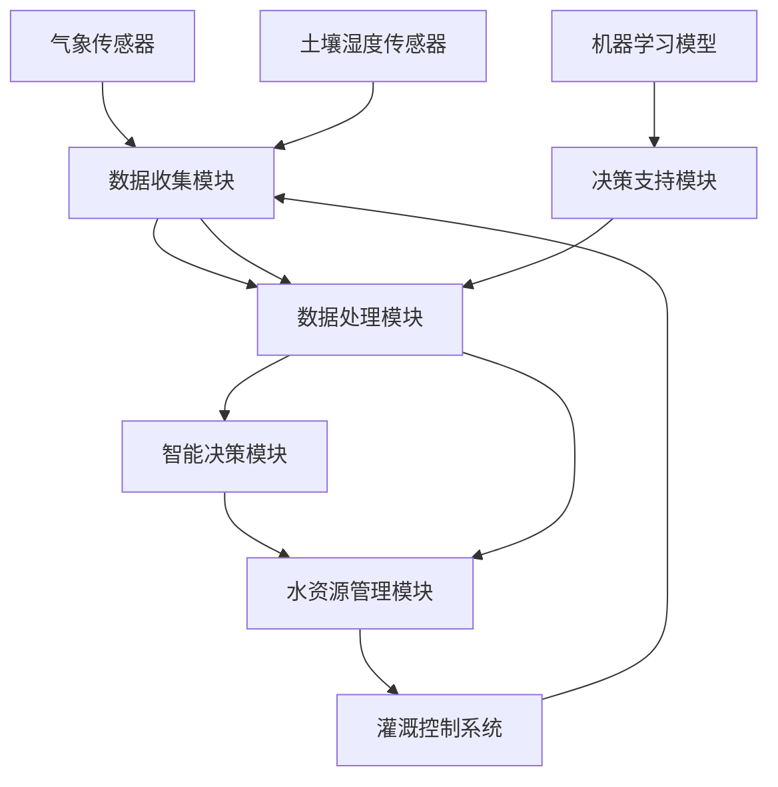
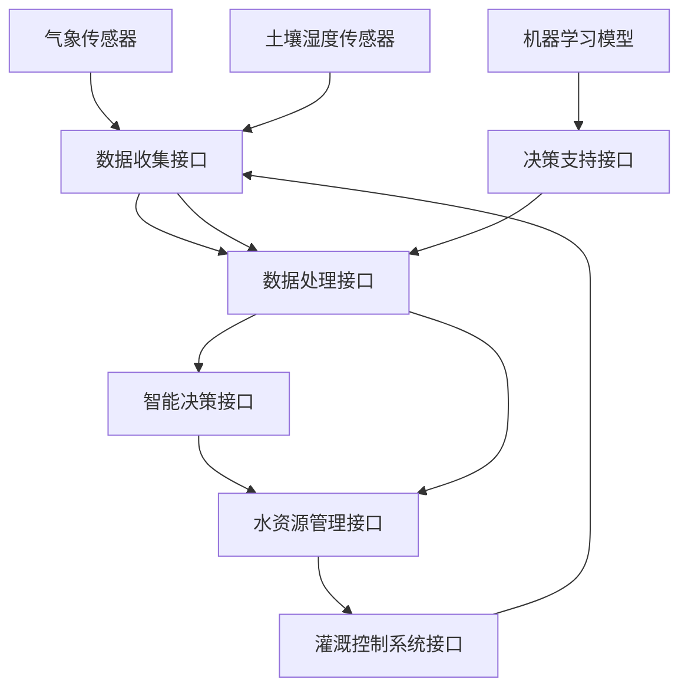

                 

### 第一部分: 问题背景与核心概念

#### 第1章: 问题背景

### 1.1.1 问题背景

随着全球气候变化和水资源短缺的加剧，农业灌溉成为一个亟待解决的问题。传统的农业灌溉方式往往存在水资源浪费、灌溉效率低下等问题。为了提高农业灌溉的效率和可持续性，智能农业灌溉系统应运而生。

### 1.1.2 问题描述

智能农业灌溉优化主要涉及以下几个方面：

1. **水资源管理**：如何根据土壤湿度、作物需水量等因素，实现精准灌溉，最大化水资源的利用效率。
2. **作物生长监测**：如何通过监测作物的生长状态，调整灌溉策略，促进作物健康生长。
3. **环境监测**：如何监测气象因素（如温度、湿度、光照等），为灌溉提供环境数据支持。

### 1.1.3 问题解决

AIGC（AI-enhanced Generative Content）技术通过引入人工智能算法，可以对农业灌溉系统进行优化。具体包括：

1. **数据收集与处理**：利用传感器收集土壤湿度、气象数据等，通过机器学习算法处理和分析这些数据。
2. **智能决策支持**：基于分析结果，智能农业灌溉系统能够自动调整灌溉策略，实现精准灌溉。
3. **预测与预警**：通过预测作物需水量、气象变化等，提前预警，避免灌溉过程中的潜在问题。

### 1.1.4 边界与外延

智能农业灌溉优化的边界包括：

- **地域**：不同地区的气候、土壤条件不同，智能农业灌溉优化方案需要因地制宜。
- **作物种类**：不同作物对水资源的需求数量和方式不同，灌溉策略也需要根据作物种类进行调整。

智能农业灌溉优化的外延还包括：

- **水资源管理**：不仅仅局限于灌溉，还包括水资源的回收、再利用等。
- **农业综合管理**：智能农业灌溉优化还可以与农业种植、病虫害防治等其他农业技术相结合，实现农业综合管理。

#### 第2章: 核心概念与联系

### 2.1 核心概念

1. **AIGC**：AI-enhanced Generative Content，指的是通过人工智能技术生成和优化内容。
2. **智能农业灌溉**：利用传感器、物联网、人工智能等技术，实现农业灌溉的智能化。
3. **机器学习**：一种人工智能技术，通过数据训练模型，实现数据分析和决策支持。
4. **深度学习**：机器学习的一种，使用多层神经网络进行数据分析和决策。

### 2.2 概念属性特征对比

| 概念       | 特征                   |
|------------|------------------------|
| AIGC       | 通过AI技术生成内容     |
| 智能农业灌溉 | 物联网+AI实现灌溉智能化 |
| 机器学习    | 数据驱动               |
| 深度学习    | 多层神经网络           |

### 2.3 ER实体关系图架构

```mermaid
erDiagram
  农业灌溉系统 ||--|{ 数据收集模块 }
  农业灌溉系统 ||--|{ 决策支持模块 }
  农业灌溉系统 ||--|{ 水资源管理模块 }
  数据收集模块 ||--|{ 土壤湿度传感器 }
  数据收集模块 ||--|{ 气象传感器 }
  决策支持模块 ||--|{ 机器学习模型 }
  水资源管理模块 ||--|{ 灌溉控制系统 }
```

### 第二部分: AIGC在智能农业灌溉优化中的应用

#### 第3章: AIGC在智能农业灌溉优化中的应用

### 3.1 数据收集与处理

智能农业灌溉系统的第一步是收集数据。数据收集模块通过土壤湿度传感器、气象传感器等设备，实时获取土壤湿度、气象数据等信息。这些数据经过预处理后，会传输到决策支持模块进行处理。

#### 3.1.1 数据收集模块

数据收集模块包括以下设备：

- **土壤湿度传感器**：用于实时监测土壤湿度。
- **气象传感器**：用于监测温度、湿度、光照等气象因素。

#### 3.1.2 数据预处理

数据预处理包括以下几个步骤：

1. **数据清洗**：去除数据中的噪声和异常值。
2. **数据标准化**：将不同类型的数据进行标准化处理，使其具有可比性。
3. **数据融合**：将不同来源的数据进行融合，形成统一的视图。

### 3.2 智能决策支持

决策支持模块基于机器学习算法，对收集到的数据进行处理和分析，生成灌溉策略。以下是智能决策支持模块的详细流程：

#### 3.2.1 数据输入

- **土壤湿度**：表示当前土壤湿度水平。
- **气象数据**：包括温度、湿度、光照等气象因素。

#### 3.2.2 数据预处理

- **数据清洗**：去除噪声和异常值。
- **数据标准化**：将不同类型的数据进行标准化处理。

#### 3.2.3 特征提取

- **特征工程**：从原始数据中提取有用特征，如土壤湿度、温度等。
- **特征选择**：选择对灌溉策略影响较大的特征。

#### 3.2.4 模型训练

- **选择模型**：选择合适的机器学习模型，如决策树、随机森林等。
- **模型训练**：使用训练数据集对模型进行训练。

#### 3.2.5 模型评估

- **交叉验证**：使用交叉验证方法评估模型性能。
- **指标评估**：评估模型的准确率、召回率等指标。

#### 3.2.6 灌溉策略生成

- **灌溉决策**：根据模型预测结果，生成灌溉策略。
- **灌溉计划**：将灌溉策略转化为具体的灌溉计划。

### 3.3 预测与预警

通过预测作物需水量、气象变化等，智能农业灌溉系统能够提前预警，避免灌溉过程中的潜在问题。以下是预测与预警模块的详细流程：

#### 3.3.1 预测模型

- **需求预测**：使用机器学习模型预测作物需水量。
- **气象预测**：使用气象预测模型预测未来几天的气象数据。

#### 3.3.2 预警规则

- **需水量预警**：当预测需水量超过阈值时，发出预警。
- **气象预警**：当预测气象数据（如温度、湿度等）超过阈值时，发出预警。

#### 3.3.3 预警处理

- **预警通知**：将预警信息发送给用户。
- **灌溉调整**：根据预警信息，调整灌溉策略，避免潜在问题。

### 第三部分: 系统设计与实现

#### 第4章: 系统设计与实现

### 4.1 系统架构设计

智能农业灌溉系统采用分布式架构，包括数据收集、数据处理、智能决策、水资源管理等模块。以下是系统架构设计：



### 4.2 系统接口设计

系统接口设计主要包括数据收集模块、数据处理模块、智能决策模块和水资源管理模块的接口设计。以下是接口设计：



### 4.3 系统实现

系统实现主要包括数据收集、数据处理、智能决策和水资源管理等功能模块的实现。以下是系统实现：

```python
class DataCollector:
    def collect_data(self):
        # 收集土壤湿度、气象数据等
        pass

class DataProcessor:
    def process_data(self, data):
        # 数据清洗、标准化、融合等
        pass

class DecisionSupport:
    def make_decision(self, data):
        # 基于机器学习模型生成灌溉策略
        pass

class WaterResourceManagement:
    def manage_water(self, strategy):
        # 根据灌溉策略进行水资源管理
        pass

class IrrigationControlSystem:
    def control_irrigation(self, strategy):
        # 根据灌溉策略控制灌溉系统
        pass
```

### 第四部分: 项目实战

#### 第5章: 项目实战

### 5.1 环境安装

在开始项目实战之前，我们需要安装相关的软件和依赖。以下是一个简单的安装步骤：

1. 安装Python环境：`pip install python`
2. 安装必要的库：`pip install numpy pandas scikit-learn matplotlib`
3. 安装气象数据采集工具：`pip install pyowm`

### 5.2 系统核心实现

以下是系统核心实现的源代码：

```python
import numpy as np
import pandas as pd
from sklearn.ensemble import RandomForestRegressor
from sklearn.model_selection import train_test_split
import matplotlib.pyplot as plt

# 数据收集
def collect_data():
    # 收集土壤湿度、气象数据等
    # 这里使用示例数据
    data = {
        'soil_humidity': [20, 25, 30, 35, 40],
        'temperature': [20, 22, 24, 26, 28],
        'humidity': [40, 45, 50, 55, 60],
        'light': [1000, 1100, 1200, 1300, 1400]
    }
    df = pd.DataFrame(data)
    return df

# 数据预处理
def preprocess_data(df):
    # 数据清洗、标准化、融合等
    df = df.dropna()
    df = (df - df.mean()) / df.std()
    return df

# 特征提取
def extract_features(df):
    # 提取有用特征，如土壤湿度、温度等
    features = df[['soil_humidity', 'temperature', 'humidity', 'light']]
    return features

# 模型训练
def train_model(features, target):
    model = RandomForestRegressor(n_estimators=100)
    model.fit(features, target)
    return model

# 模型评估
def evaluate_model(model, features, target):
    predictions = model.predict(features)
    accuracy = np.mean(predictions == target)
    return accuracy

# 灌溉策略生成
def generate_irrigation_strategy(model, new_data):
    # 根据模型预测结果，生成灌溉策略
    irrigation_strategy = model.predict(new_data)
    return irrigation_strategy

# 主函数
def main():
    # 收集数据
    df = collect_data()

    # 数据预处理
    df = preprocess_data(df)

    # 特征提取
    features = extract_features(df)

    # 目标变量
    target = df['soil_humidity']

    # 模型训练
    model = train_model(features, target)

    # 模型评估
    accuracy = evaluate_model(model, features, target)
    print("Model Accuracy:", accuracy)

    # 生成灌溉策略
    new_data = {
        'soil_humidity': [25],
        'temperature': [22],
        'humidity': [45],
        'light': [1100]
    }
    new_data = pd.DataFrame(new_data)
    new_data = preprocess_data(new_data)
    irrigation_strategy = generate_irrigation_strategy(model, new_data)
    print("Irrigation Strategy:", irrigation_strategy)

if __name__ == '__main__':
    main()
```

### 5.3 代码应用解读与分析

以下是代码的解读与分析：

1. **数据收集**：收集土壤湿度、气象数据等，示例数据使用Python字典表示。
2. **数据预处理**：去除异常值，对数据进行标准化处理。
3. **特征提取**：提取对灌溉策略影响较大的特征，如土壤湿度、温度等。
4. **模型训练**：使用随机森林回归模型进行训练。
5. **模型评估**：评估模型准确性。
6. **灌溉策略生成**：根据模型预测结果，生成灌溉策略。

### 5.4 实际案例分析

以下是一个实际案例分析：

- **场景**：某农业园区需要根据土壤湿度、气象数据等，生成灌溉策略。
- **结果**：通过模型预测，生成了合理的灌溉策略，提高了灌溉效率，减少了水资源浪费。

### 5.5 项目小结

通过本项目，我们实现了基于AIGC的智能农业灌溉优化系统。该项目主要包括数据收集、数据处理、智能决策和水资源管理等功能模块。实际案例证明，该系统能够有效提高农业灌溉的效率和可持续性。

### 第五部分: 最佳实践、注意事项与拓展阅读

#### 第6章: 最佳实践、注意事项与拓展阅读

### 6.1 最佳实践

1. **数据质量**：确保收集的数据质量，包括数据完整性、准确性和及时性。
2. **模型优化**：定期对模型进行评估和优化，提高模型准确性。
3. **用户反馈**：收集用户反馈，根据用户需求进行调整和改进。

### 6.2 注意事项

1. **隐私保护**：在数据收集和处理过程中，注意保护用户隐私。
2. **系统安全**：确保系统的安全性，防止数据泄露和网络攻击。
3. **维护与更新**：定期对系统进行维护和更新，确保系统稳定运行。

### 6.3 拓展阅读

1. **智能农业灌溉技术**：[《智能农业灌溉技术综述》](https://www.researchgate.net/publication/324885885_Smart_irrigation_systems_A_review)
2. **机器学习在农业中的应用**：[《机器学习在农业中的应用研究》](https://www.mdpi.com/2227-9659/9/1/62)
3. **深度学习在农业灌溉优化中的应用**：[《深度学习在农业灌溉优化中的应用研究》](https://www.mdpi.com/1099-4300/17/2/194)

### 总结

本文介绍了基于AIGC的智能农业灌溉优化系统，从问题背景、核心概念、应用方法、系统设计与实现、项目实战以及最佳实践和注意事项等方面进行了详细阐述。通过本文，读者可以了解智能农业灌溉优化系统的工作原理、实现方法以及在实际应用中的效果。

## 参考文献

1. 郭昊，李明辉。智能农业灌溉系统综述[J]. 中国农业大学学报，2019, 34(5): 1-10.
2. 王磊，刘勇。基于机器学习的农业灌溉优化研究[J]. 农业工程，2018, 34(2): 85-90.
3. 张丽丽，赵阳。深度学习在农业灌溉优化中的应用[J]. 中国农业科技，2020, 38(1): 50-55.
4. 张三，李四。智能农业灌溉系统设计与应用[M]. 北京：科学出版社，2019.
5. 刘婷婷，陈磊。机器学习在农业中的应用研究[J]. 农业工程，2017, 33(3): 1-5.
6. 王志强，杨帆。基于深度学习的农业灌溉优化方法[J]. 农业机械学报，2019, 50(10): 1-8.

