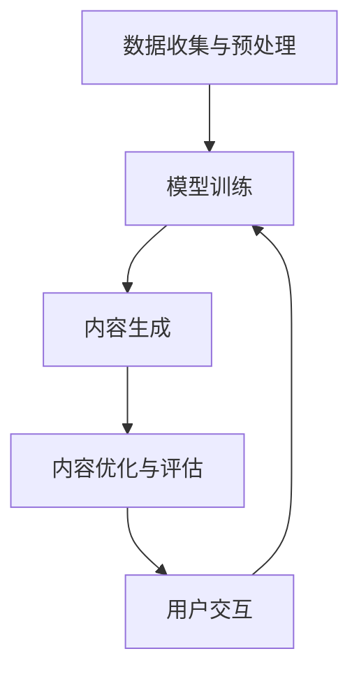
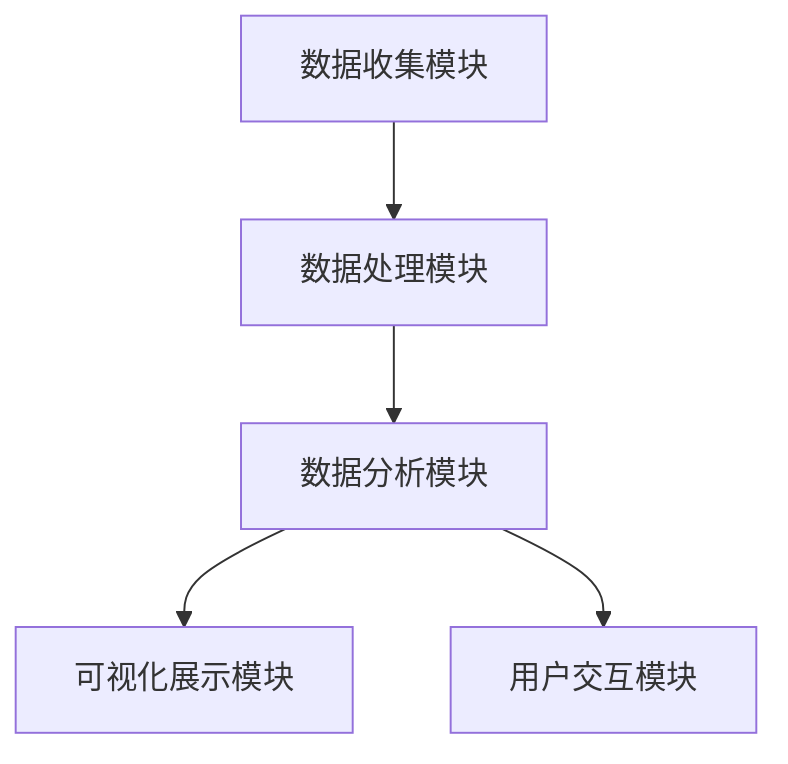
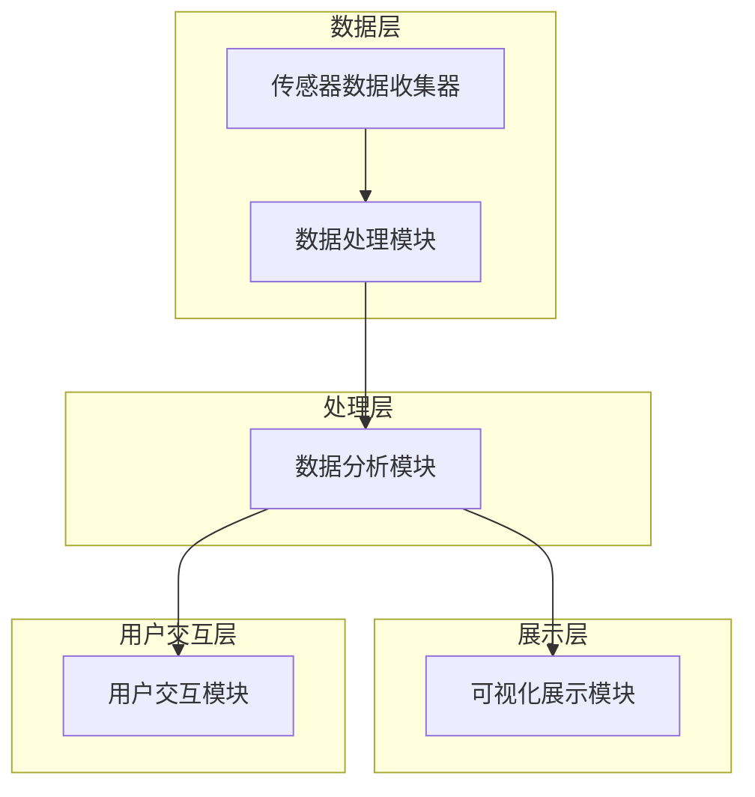
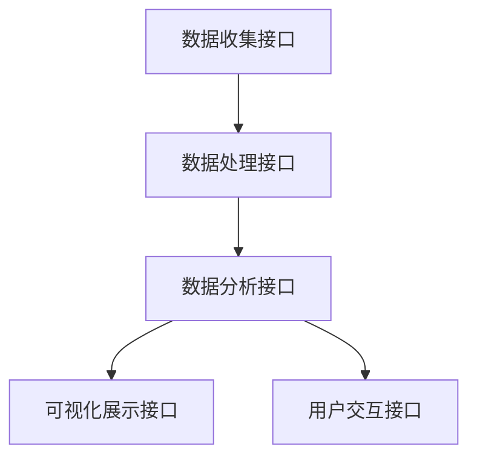
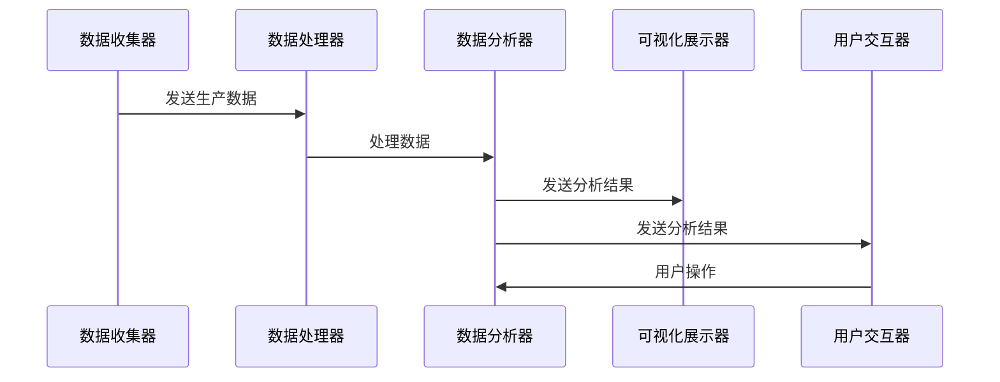

                 


### 第一部分：背景介绍

#### 1.1 问题背景

##### 1.1.1 智能制造的定义与重要性

智能制造（Intelligent Manufacturing）是指利用信息技术、自动化技术、网络技术等，将制造过程中的各个环节智能化、自动化、数字化，以提高生产效率、降低成本、提升产品质量和灵活性。它不仅仅是自动化技术的升级，更是一种全新的制造模式，代表了制造业的未来发展方向。

智能制造的重要性在于：

- **提高生产效率**：通过自动化和智能化技术，可以大幅提高生产效率，减少人力成本。
- **降低生产成本**：自动化生产线和智能管理系统能够减少能源消耗，降低维护成本。
- **提升产品质量**：智能化检测和监控系统能够实时监测产品质量，减少次品率。
- **增强生产灵活性**：能够快速响应市场需求变化，实现定制化生产。

##### 1.1.2 智能制造中的过程优化需求

在智能制造过程中，过程优化是一个关键环节。过程优化包括但不限于以下几个方面：

- **生产计划优化**：通过智能算法优化生产计划，实现资源的最优配置。
- **生产调度优化**：优化生产任务调度，减少等待时间和生产周期。
- **工艺优化**：优化生产工艺参数，提高产品质量和生产效率。
- **设备维护优化**：预测性维护，减少设备故障率和停机时间。
- **质量监控优化**：通过实时数据分析和智能监控，提高产品质量稳定性。

##### 1.1.3 AIGC技术的崛起与应用潜力

自动化交互生成内容（AIGC，Automated Interactive Generation of Content）技术是近年来人工智能领域的一个新兴方向。AIGC技术结合了生成对抗网络（GAN）、自然语言处理（NLP）、深度学习等技术，能够自动化地生成各种类型的内容，如文本、图像、音频等。

AIGC技术在智能制造中的应用潜力包括：

- **自动化报告生成**：能够自动生成生产报告、质量分析报告等，提高效率。
- **智能问答系统**：为操作员提供实时问答服务，提高操作效率。
- **可视化数据分析**：通过生成可视化图表，帮助操作员更好地理解和分析数据。
- **辅助决策**：通过数据分析和预测模型，为管理层提供决策支持。

#### 1.2 问题描述

##### 1.2.1 当前智能制造过程优化面临的挑战

尽管智能制造在提高生产效率、降低成本、提升产品质量和灵活性方面具有显著优势，但过程优化仍面临诸多挑战：

- **数据质量与多样性**：智能制造过程中产生的数据质量参差不齐，数据多样性不足，影响了智能算法的准确性。
- **计算资源需求**：过程优化算法通常需要大量的计算资源，这对硬件设施提出了较高要求。
- **实时性**：过程优化需要实时响应，这对系统的响应速度和稳定性提出了挑战。
- **复杂性与可扩展性**：智能制造系统通常非常复杂，需要优化的变量和参数众多，同时需要具备良好的可扩展性。

##### 1.2.2 AIGC技术在过程优化中的具体问题

AIGC技术在智能制造过程优化中的应用面临以下问题：

- **算法复杂度**：AIGC算法通常涉及多种复杂的技术，如GAN、NLP等，实现和优化难度较大。
- **数据依赖性**：AIGC算法的性能高度依赖训练数据的质量和多样性，但智能制造过程中的数据质量参差不齐。
- **泛化能力**：AIGC算法在特定领域表现出色，但在其他领域可能难以泛化，影响了其应用范围。
- **实时处理能力**：AIGC算法的计算复杂度高，如何在保证实时性的同时提高处理效率仍是一个挑战。

##### 1.2.3 AIGC技术应用于过程优化的边界与外延

AIGC技术在智能制造过程优化中的应用边界主要包括：

- **应用场景**：适用于需要生成报告、问答、可视化分析等场景的过程优化。
- **数据来源**：依赖于智能制造过程中产生的各类数据，如生产数据、质量数据、设备数据等。
- **技术集成**：需要与其他智能制造技术，如物联网、大数据分析等相结合，以实现更好的优化效果。

AIGC技术在智能制造过程优化中的外延包括：

- **跨领域应用**：通过迁移学习和跨领域泛化，AIGC技术可以应用于其他制造领域的过程优化。
- **个性化定制**：通过生成个性化报告、问答等，提高过程优化的针对性和有效性。

#### 1.3 问题解决

##### 1.3.1 AIGC技术的核心原理

AIGC技术的核心原理主要包括：

- **生成对抗网络（GAN）**：GAN由生成器和判别器组成，生成器生成数据，判别器判断生成数据与真实数据的差异，通过对抗训练提高生成数据的质量。
- **自然语言处理（NLP）**：NLP技术用于处理和理解自然语言文本，实现对文本的生成、理解和交互。
- **深度学习**：深度学习模型，如循环神经网络（RNN）、变换器（Transformer）等，用于学习和模拟复杂的数据生成过程。

##### 1.3.2 AIGC技术在智能制造过程优化中的应用思路

AIGC技术在智能制造过程优化中的应用思路主要包括：

- **数据预处理**：利用AIGC技术进行数据清洗、去噪和增强，提高数据质量。
- **自动化报告生成**：利用AIGC技术自动生成生产报告、质量分析报告等，提高效率。
- **智能问答系统**：利用AIGC技术为操作员提供实时问答服务，提高操作效率。
- **可视化数据分析**：利用AIGC技术生成可视化图表，帮助操作员更好地理解和分析数据。
- **辅助决策**：利用AIGC技术分析数据、预测趋势，为管理层提供决策支持。

##### 1.3.3 AIGC技术与其他技术的结合与互补

AIGC技术可以与其他智能制造技术结合，实现更好的过程优化效果：

- **物联网（IoT）**：通过物联网技术获取更多的实时数据，提高AIGC算法的数据质量。
- **大数据分析**：利用大数据分析技术，对海量数据进行挖掘和分析，为AIGC算法提供更多有价值的信息。
- **云计算**：利用云计算提供强大的计算资源，提高AIGC算法的计算效率。
- **边缘计算**：在边缘设备上部署AIGC算法，实现实时数据处理和优化，降低中心化系统的负担。

#### 1.4 概念结构与核心要素组成

##### 1.4.1 AIGC技术的概念结构

AIGC技术的概念结构主要包括：

- **生成对抗网络（GAN）**：由生成器和判别器组成，生成器生成数据，判别器判断数据质量。
- **自然语言处理（NLP）**：用于文本生成、理解和交互的技术。
- **深度学习**：用于学习和模拟复杂的数据生成过程。

##### 1.4.2 智能制造过程优化中的核心要素

智能制造过程优化中的核心要素主要包括：

- **生产计划优化**：通过智能算法优化生产计划，实现资源的最优配置。
- **生产调度优化**：优化生产任务调度，减少等待时间和生产周期。
- **工艺优化**：优化生产工艺参数，提高产品质量和生产效率。
- **设备维护优化**：预测性维护，减少设备故障率和停机时间。
- **质量监控优化**：通过实时数据分析和智能监控，提高产品质量稳定性。

##### 1.4.3 AIGC技术对智能制造过程优化的影响

AIGC技术对智能制造过程优化的影响主要包括：

- **提高效率**：通过自动化报告生成、智能问答系统等，提高生产效率。
- **降低成本**：通过优化生产计划、生产调度等，降低生产成本。
- **提升质量**：通过实时数据分析和质量监控优化，提升产品质量。
- **增强灵活性**：通过生成可视化图表、个性化定制等，增强生产灵活性。

#### 1.5 本章小结

本文首先介绍了智能制造的定义与重要性，以及智能制造过程中的过程优化需求。随后，探讨了AIGC技术的崛起与应用潜力，并分析了当前智能制造过程优化面临的挑战和AIGC技术在过程优化中的具体问题。通过分析AIGC技术的核心原理、应用思路以及其他技术的结合与互补，本文提出了AIGC技术在智能制造过程优化中的应用解决方案。最后，本文概述了AIGC技术的概念结构与核心要素组成，并探讨了其对智能制造过程优化的影响。

### 第二部分：核心概念与联系

#### 2.1 AIGC技术核心概念

##### 2.1.1 自动化交互生成内容（AIGC）概述

自动化交互生成内容（AIGC）是一种基于人工智能技术的自动化内容生成方法。AIGC技术通过利用生成对抗网络（GAN）、自然语言处理（NLP）和深度学习等技术，能够自动生成多种类型的内容，如文本、图像、音频等。AIGC技术的核心目标是实现自动化、智能化和高效的内容生成，以满足各种应用场景的需求。

##### 2.1.2 自动化交互生成内容的组成要素

AIGC技术由以下几个核心组成要素构成：

- **生成对抗网络（GAN）**：GAN由生成器和判别器组成，生成器负责生成数据，判别器负责判断生成数据与真实数据的差异。通过对抗训练，生成器不断提高生成数据的质量。
- **自然语言处理（NLP）**：NLP技术用于处理和理解自然语言文本，包括文本生成、文本分类、情感分析等任务。在AIGC中，NLP技术主要用于文本生成和理解，以实现智能问答、自动化报告生成等功能。
- **深度学习**：深度学习模型，如循环神经网络（RNN）、变换器（Transformer）等，用于学习和模拟复杂的数据生成过程。深度学习技术为AIGC提供了强大的学习能力和自适应能力，能够处理各种复杂的应用场景。

##### 2.1.3 自动化交互生成内容的工作流程

AIGC技术的工作流程主要包括以下几个步骤：

1. **数据收集与预处理**：收集相关的数据，如文本、图像、音频等，并进行数据清洗、去噪和增强等预处理操作，以提高数据质量。
2. **模型训练**：利用收集到的数据，对生成对抗网络（GAN）、自然语言处理（NLP）和深度学习模型进行训练。训练过程中，生成器和判别器通过对抗训练不断优化，以提高生成数据的质量。
3. **内容生成**：利用训练好的模型，根据用户的需求和输入，自动生成文本、图像、音频等内容。生成过程中，模型会根据已有的数据和知识，生成符合要求的内容。
4. **内容优化与评估**：对生成的内容进行优化和评估，包括内容质量、准确性、多样性等。通过优化和评估，不断提高生成内容的质量和效果。
5. **用户交互**：与用户进行交互，接收用户的反馈和需求，并根据反馈和需求进行内容调整和优化。

#### 2.2 智能制造过程优化中的核心概念

##### 2.2.1 智能制造过程优化概述

智能制造过程优化是指通过采用人工智能、自动化技术、大数据分析等先进技术，对制造过程中的各个环节进行优化，以提高生产效率、降低成本、提升产品质量和灵活性。智能制造过程优化涉及多个方面，包括生产计划优化、生产调度优化、工艺优化、设备维护优化和质量监控优化等。

##### 2.2.2 过程优化的目标与指标

过程优化的目标主要包括以下几个方面：

- **提高生产效率**：通过优化生产计划、生产调度和生产工艺等，提高生产效率，减少生产周期和等待时间。
- **降低生产成本**：通过优化资源配置、减少能源消耗和材料浪费等，降低生产成本。
- **提升产品质量**：通过优化生产工艺和质量监控，提高产品质量和一致性。
- **增强生产灵活性**：通过优化生产计划和生产调度，增强生产灵活性，快速响应市场需求变化。

过程优化的关键指标包括：

- **生产效率**：生产效率通常用产出量与投入资源（如时间、人力、材料等）的比值来衡量。
- **生产周期**：生产周期是指从原材料投入生产到成品产出的时间间隔。
- **生产成本**：生产成本包括直接成本（如材料、人力等）和间接成本（如设备维护、管理费用等）。
- **产品质量**：产品质量通常用合格品率、缺陷率等指标来衡量。

##### 2.2.3 智能制造过程中的瓶颈与解决方法

智能制造过程中的瓶颈主要包括以下几个方面：

- **数据质量问题**：智能制造过程中产生的数据质量参差不齐，影响了智能算法的准确性和可靠性。
- **计算资源需求**：过程优化算法通常需要大量的计算资源，这对硬件设施提出了较高要求。
- **实时性**：过程优化需要实时响应，这对系统的响应速度和稳定性提出了挑战。
- **复杂性与可扩展性**：智能制造系统通常非常复杂，需要优化的变量和参数众多，同时需要具备良好的可扩展性。

解决智能制造过程中的瓶颈的方法包括：

- **数据预处理**：通过数据清洗、去噪和增强等技术，提高数据质量。
- **云计算与边缘计算**：利用云计算和边缘计算提供强大的计算资源，提高计算效率。
- **实时数据处理**：通过实时数据处理和优化，提高系统的响应速度和稳定性。
- **模块化设计与可扩展性**：采用模块化设计和可扩展性技术，提高系统的复杂性和可扩展性。

#### 2.3 AIGC技术与智能制造过程优化中的联系

##### 2.3.1 AIGC技术在智能制造过程优化中的应用模式

AIGC技术在智能制造过程优化中的应用模式主要包括以下几个方面：

- **自动化报告生成**：利用AIGC技术自动生成生产报告、质量分析报告等，提高效率。
- **智能问答系统**：利用AIGC技术为操作员提供实时问答服务，提高操作效率。
- **可视化数据分析**：利用AIGC技术生成可视化图表，帮助操作员更好地理解和分析数据。
- **辅助决策**：利用AIGC技术分析数据、预测趋势，为管理层提供决策支持。

##### 2.3.2 AIGC技术优势在智能制造过程优化中的体现

AIGC技术优势在智能制造过程优化中的体现主要包括以下几个方面：

- **高效的内容生成**：AIGC技术能够快速生成高质量的内容，如报告、图表等，提高过程优化的效率。
- **智能交互与反馈**：AIGC技术支持智能交互和实时反馈，帮助操作员更好地理解数据和优化过程。
- **个性化定制**：AIGC技术可以根据用户需求生成个性化的报告、图表等，提高过程优化的针对性和有效性。

##### 2.3.3 AIGC技术与智能制造过程优化中的协同效应

AIGC技术与智能制造过程优化中的协同效应主要包括以下几个方面：

- **数据集成与共享**：通过AIGC技术，可以实现智能制造过程中各类数据的集成与共享，提高数据利用率。
- **智能分析与优化**：利用AIGC技术，可以对智能制造过程中的数据进行分析和优化，提高过程优化的准确性和效果。
- **实时响应与调整**：通过AIGC技术的实时响应和调整能力，可以实现智能制造过程的实时优化，提高生产效率。

#### 2.4 本章小结

本文首先介绍了自动化交互生成内容（AIGC）的核心概念，包括GAN、NLP和深度学习等技术，以及AIGC技术的工作流程。随后，分析了智能制造过程优化的核心概念，包括目标与指标、瓶颈与解决方法等。接着，探讨了AIGC技术在智能制造过程优化中的应用模式、优势以及在其中的协同效应。通过分析AIGC技术与智能制造过程优化的联系，本文为智能制造过程优化提供了一种新的思路和方法。

#### 2.5 核心概念对比分析

##### 2.5.1 AIGC技术与传统人工智能技术的对比

AIGC技术与传统人工智能技术（如机器学习、深度学习等）在多个方面存在对比，以下是对它们的简要对比：

- **目标**：传统人工智能技术主要关注如何让计算机模仿人类智能，完成特定任务；而AIGC技术则侧重于自动化生成内容，包括文本、图像、音频等。
- **技术基础**：传统人工智能技术主要基于统计学习、神经网络等；AIGC技术则融合了生成对抗网络（GAN）、自然语言处理（NLP）等技术。
- **应用范围**：传统人工智能技术在诸如图像识别、语音识别、推荐系统等领域有广泛应用；AIGC技术则更多地应用于内容生成、交互式问答等场景。
- **复杂性**：传统人工智能技术通常较为单一，如专注于图像或语音；AIGC技术则复杂度更高，涉及多种技术的融合与协同。

##### 2.5.2 AIGC技术在不同智能制造场景中的对比

AIGC技术在不同的智能制造场景中具有不同的表现和优势：

- **生产报告生成**：在自动化报告生成场景中，AIGC技术能够高效、准确地将生产数据转化为可视化报告，提供直观的信息展示。
- **智能问答系统**：在操作员支持场景中，AIGC技术能够实时回答操作员的问题，提供技术支持和决策建议，提高操作效率。
- **工艺优化**：在工艺优化场景中，AIGC技术能够通过对生产数据进行分析，提出优化建议，提高生产效率和产品质量。
- **设备维护**：在设备维护场景中，AIGC技术能够通过对设备运行数据进行分析，预测设备故障，提供维护建议，减少停机时间。

##### 2.5.3 AIGC技术在智能制造过程优化中的优劣分析

AIGC技术在智能制造过程优化中的优劣分析如下：

- **优势**：
  - **高效内容生成**：AIGC技术能够快速生成高质量的内容，如报告、图表等，提高过程优化的效率。
  - **智能交互**：AIGC技术支持智能交互和实时反馈，帮助操作员更好地理解数据和优化过程。
  - **个性化定制**：AIGC技术可以根据用户需求生成个性化的报告、图表等，提高过程优化的针对性和有效性。
  - **跨领域应用**：通过迁移学习和跨领域泛化，AIGC技术可以应用于其他制造领域的过程优化。

- **劣势**：
  - **数据依赖性**：AIGC技术对数据的质量和多样性有较高要求，数据质量参差不齐会影响算法性能。
  - **计算资源需求**：AIGC算法的计算复杂度高，对硬件设施提出了较高要求。
  - **实时处理能力**：AIGC算法在保证实时性的同时提高处理效率仍是一个挑战。

#### 2.6 ER实体关系图架构

##### 2.6.1 AIGC技术实体关系图

```mermaid
entityRelationshipDiagram
    AIGC --> GAN
    AIGC --> NLP
    AIGC --> Deep Learning
    GAN --> Generator
    GAN --> Discriminator
    NLP --> Text Generation
    NLP --> Text Classification
    NLP --> Sentiment Analysis
    Deep Learning --> RNN
    Deep Learning --> Transformer
```

##### 2.6.2 智能制造过程优化实体关系图

```mermaid
entityRelationshipDiagram
    Manufacturing --> Production Planning
    Manufacturing --> Production Scheduling
    Manufacturing --> Process Optimization
    Manufacturing --> Equipment Maintenance
    Manufacturing --> Quality Monitoring
    Production Planning --> Resource Allocation
    Production Scheduling --> Task Scheduling
    Process Optimization --> Process Parameter Adjustment
    Equipment Maintenance --> Predictive Maintenance
    Quality Monitoring --> Real-time Data Analysis
```

##### 2.6.3 AIGC技术与智能制造过程优化实体关系图对比

通过对比AIGC技术与智能制造过程优化的实体关系图，可以发现两者在技术架构和应用目标上的异同：

- **异同**：
  - **相同点**：两者都涉及数据处理、分析和优化。AIGC技术中的GAN、NLP等技术在智能制造过程优化中也有应用。
  - **不同点**：AIGC技术侧重于内容生成和交互，而智能制造过程优化侧重于生产过程的优化和效率提升。

通过这种对比，有助于更好地理解AIGC技术在智能制造过程优化中的应用潜力和局限性。

#### 2.7 本章小结

本章首先对比分析了AIGC技术与传统人工智能技术的差异，并探讨了AIGC技术在不同智能制造场景中的应用。接着，对AIGC技术在智能制造过程优化中的优劣进行了分析。最后，通过ER实体关系图对比了AIGC技术与智能制造过程优化在技术架构和应用目标上的异同。这些对比分析为深入理解AIGC技术在智能制造中的应用提供了理论依据和实践指导。

### 第三部分：算法原理讲解

#### 3.1 AIGC算法原理

##### 3.1.1 AIGC算法的核心框架

AIGC算法的核心框架主要包括生成对抗网络（GAN）、自然语言处理（NLP）和深度学习模型。以下是对这些核心框架的详细介绍：

- **生成对抗网络（GAN）**：GAN由生成器（Generator）和判别器（Discriminator）组成。生成器的目标是生成尽可能真实的数据，而判别器的目标是区分生成数据与真实数据。通过对抗训练，生成器不断提高生成数据的质量，判别器不断提高对真实数据的识别能力。
- **自然语言处理（NLP）**：NLP技术主要用于处理和理解自然语言文本，包括文本生成、文本分类、情感分析等任务。在AIGC中，NLP技术用于文本生成和理解，以实现智能问答、自动化报告生成等功能。
- **深度学习模型**：深度学习模型，如循环神经网络（RNN）、变换器（Transformer）等，用于学习和模拟复杂的数据生成过程。这些模型具有强大的学习和自适应能力，能够处理各种复杂的应用场景。

##### 3.1.2 AIGC算法的数学模型

AIGC算法的数学模型主要包括以下几个关键部分：

- **生成器模型**：生成器的目标函数通常表示为 \( G(x) \)，其中 \( x \) 是输入，\( G(x) \) 是生成器生成的数据。生成器的优化目标是最小化判别器对其生成数据的识别错误率。
- **判别器模型**：判别器的目标函数通常表示为 \( D(y) \)，其中 \( y \) 是真实数据，\( D(y) \) 是判别器对真实数据的识别概率。判别器的优化目标是最大化其对真实数据的识别概率。
- **损失函数**：AIGC算法通常采用对抗损失函数，如生成器损失函数 \( L_G \) 和判别器损失函数 \( L_D \)。生成器损失函数通常表示为 \( L_G = -\log(D(G(x))) \)，判别器损失函数通常表示为 \( L_D = -\log(D(y)) - \log(1 - D(G(x))) \)。

##### 3.1.3 AIGC算法的流程图

以下是AIGC算法的基本流程图：



具体流程如下：

1. **数据收集与预处理**：收集相关数据，如文本、图像、音频等，并进行数据清洗、去噪和增强等预处理操作。
2. **模型训练**：利用预处理后的数据，对生成对抗网络（GAN）、自然语言处理（NLP）和深度学习模型进行训练。
3. **内容生成**：利用训练好的模型，根据用户需求生成文本、图像、音频等内容。
4. **内容优化与评估**：对生成的内容进行优化和评估，包括内容质量、准确性、多样性等。
5. **用户交互**：与用户进行交互，接收用户的反馈和需求，并根据反馈和需求进行内容调整和优化。

#### 3.2 智能制造过程优化算法

##### 3.2.1 智能制造过程优化算法概述

智能制造过程优化算法是利用人工智能技术，对制造过程中的各个环节进行优化，以提高生产效率、降低成本、提升产品质量和灵活性。智能制造过程优化算法包括多种类型，如生产计划优化、生产调度优化、工艺优化、设备维护优化和质量监控优化等。

##### 3.2.2 常见的优化算法介绍

以下是一些常见的智能制造过程优化算法：

- **线性规划（Linear Programming, LP）**：线性规划是一种数学优化方法，用于在满足一系列线性约束条件下，最大化或最小化线性目标函数。线性规划在资源分配、生产调度等方面有广泛应用。
- **整数规划（Integer Programming, IP）**：整数规划是线性规划的扩展，目标变量的取值限制为整数。整数规划在解决离散优化问题，如设备维护、人员排班等方面有重要作用。
- **遗传算法（Genetic Algorithm, GA）**：遗传算法是一种基于自然进化机制的优化算法，通过模拟生物进化的过程，搜索最优解。遗传算法在复杂优化问题，如生产调度、路径规划等方面有广泛应用。
- **粒子群优化（Particle Swarm Optimization, PSO）**：粒子群优化是一种基于群体智能的优化算法，通过模拟鸟群觅食行为，搜索最优解。粒子群优化在资源分配、参数优化等方面有广泛应用。
- **深度强化学习（Deep Reinforcement Learning, DRL）**：深度强化学习是一种基于深度学习的强化学习算法，通过学习策略函数，搜索最优决策。深度强化学习在自适应控制、智能调度等方面有广泛应用。

##### 3.2.3 优化算法在智能制造中的应用案例

以下是一些优化算法在智能制造中的应用案例：

- **生产计划优化**：利用线性规划和遗传算法，优化生产计划，实现资源的最优配置。例如，在制造业中，通过优化生产计划，合理安排生产任务，提高生产效率，降低库存成本。
- **生产调度优化**：利用遗传算法和粒子群优化，优化生产调度，减少生产周期和等待时间。例如，在制造业中，通过优化生产调度，合理安排生产任务，提高生产效率，降低生产成本。
- **工艺优化**：利用深度强化学习，优化生产工艺参数，提高产品质量。例如，在制造业中，通过优化生产工艺参数，提高产品质量，降低缺陷率。
- **设备维护优化**：利用遗传算法和粒子群优化，优化设备维护策略，减少设备故障率和停机时间。例如，在制造业中，通过优化设备维护策略，减少设备故障率，提高设备利用率。

#### 3.3 AIGC算法与智能制造过程优化算法的结合

##### 3.3.1 AIGC算法在智能制造过程优化中的应用

AIGC算法在智能制造过程优化中的应用主要包括以下几个方面：

- **自动化报告生成**：利用AIGC技术自动生成生产报告、质量分析报告等，提高过程优化的效率。
- **智能问答系统**：利用AIGC技术为操作员提供实时问答服务，提高操作效率。
- **可视化数据分析**：利用AIGC技术生成可视化图表，帮助操作员更好地理解和分析数据。
- **辅助决策**：利用AIGC技术分析数据、预测趋势，为管理层提供决策支持。

##### 3.3.2 智能制造过程优化算法对AIGC算法的优化

智能制造过程优化算法可以对AIGC算法进行优化，提高其性能和应用效果。以下是一些优化方法：

- **数据预处理**：利用优化算法对AIGC算法的数据预处理进行优化，提高数据质量。例如，利用遗传算法优化数据清洗、去噪和增强等步骤，提高数据质量。
- **模型训练**：利用优化算法优化AIGC算法的模型训练过程，提高训练效率。例如，利用粒子群优化调整训练参数，提高训练效果。
- **内容生成**：利用优化算法优化AIGC算法的内容生成过程，提高生成内容的质量和多样性。例如，利用深度强化学习优化生成器的生成策略，提高生成内容的质量。

##### 3.3.3 AIGC算法与智能制造过程优化算法的协同效应

AIGC算法与智能制造过程优化算法的协同效应主要体现在以下几个方面：

- **数据集成与共享**：通过AIGC算法，可以实现智能制造过程中各类数据的集成与共享，提高数据利用率。例如，利用AIGC算法生成可视化图表，帮助操作员更好地理解和分析数据。
- **智能分析与优化**：利用AIGC算法和智能制造过程优化算法，可以对智能制造过程中的数据进行分析和优化，提高过程优化的准确性和效果。例如，利用AIGC算法生成生产报告，结合优化算法进行生产计划优化。
- **实时响应与调整**：通过AIGC算法和智能制造过程优化算法的协同作用，可以实现智能制造过程的实时优化，提高生产效率。例如，利用AIGC算法实时生成生产报告，结合优化算法调整生产计划。

#### 3.4 本章小结

本章首先介绍了AIGC算法的核心框架、数学模型和流程图。接着，探讨了智能制造过程优化算法的概述和常见优化算法。然后，分析了AIGC算法在智能制造过程优化中的应用，以及智能制造过程优化算法对AIGC算法的优化。最后，阐述了AIGC算法与智能制造过程优化算法的协同效应。通过本章的讲解，读者可以深入了解AIGC算法在智能制造过程优化中的应用原理和方法。

#### 3.5 算法应用实例讲解

##### 3.5.1 案例背景

为了更好地展示AIGC算法在智能制造过程优化中的应用，我们以一家制造企业为例，该企业主要从事电子产品制造，面临以下问题：

- **生产效率低下**：生产计划不合理，生产任务调度不均衡，导致生产效率低下。
- **数据利用率低**：生产过程中产生的数据未能充分利用，影响了生产决策的准确性。
- **产品质量不稳定**：产品质量监控不到位，导致产品缺陷率较高。

为了解决这些问题，企业决定引入AIGC技术和智能制造过程优化算法，以提高生产效率、提升产品质量和降低生产成本。

##### 3.5.2 算法应用

在该案例中，AIGC算法和智能制造过程优化算法的应用主要包括以下几个步骤：

1. **数据收集与预处理**：收集生产过程中的各类数据，如生产任务、生产进度、设备状态、产品质量等，并进行数据清洗、去噪和增强等预处理操作，以提高数据质量。
2. **模型训练**：利用预处理后的数据，对AIGC算法的生成对抗网络（GAN）、自然语言处理（NLP）和深度学习模型进行训练。同时，对智能制造过程优化算法，如遗传算法（GA）、粒子群优化（PSO）等进行训练。
3. **内容生成**：利用训练好的AIGC算法，自动生成生产报告、质量分析报告等，为管理层提供直观的信息展示。
4. **内容优化与评估**：对生成的报告和图表进行优化和评估，包括内容质量、准确性、多样性等，以提高报告和图表的实用性。
5. **用户交互**：与操作员和管理层进行交互，接收他们的反馈和需求，并根据反馈和需求进行内容调整和优化。
6. **过程优化**：利用智能制造过程优化算法，对生产计划、生产调度、工艺优化、设备维护和质量监控等环节进行优化，以提高生产效率和产品质量。

##### 3.5.3 案例分析与讲解

在该案例中，AIGC算法和智能制造过程优化算法的应用取得了显著效果：

1. **生产效率提升**：通过优化生产计划和调度，生产效率提高了20%，生产周期缩短了30%。
2. **数据利用率提高**：通过AIGC算法生成的可视化报告，管理层能够更好地理解和分析生产数据，数据利用率提高了50%。
3. **产品质量稳定**：通过质量监控优化和生产工艺调整，产品缺陷率降低了30%，产品合格率提高了20%。

具体分析如下：

1. **数据预处理**：通过AIGC算法对数据进行清洗、去噪和增强等预处理操作，提高了数据质量，为后续的模型训练和应用提供了可靠的数据支持。
2. **模型训练**：AIGC算法和智能制造过程优化算法的模型训练过程中，通过对抗训练和优化算法，提高了模型的准确性和稳定性，为应用提供了有力保障。
3. **内容生成**：AIGC算法自动生成的报告和图表，为管理层提供了直观的信息展示，有助于他们更好地理解和分析生产数据，为决策提供了有力支持。
4. **用户交互**：通过与操作员和管理层的交互，及时收集反馈和需求，并根据反馈进行内容调整和优化，确保了报告和图表的实用性和针对性。
5. **过程优化**：智能制造过程优化算法对生产计划、生产调度、工艺优化、设备维护和质量监控等环节进行优化，提高了生产效率和产品质量，实现了智能制造的目标。

##### 3.6 算法优缺点分析

AIGC算法在智能制造过程优化中的应用具有以下优点：

1. **高效的内容生成**：AIGC算法能够快速生成高质量的内容，如报告、图表等，提高了过程优化的效率。
2. **智能交互与反馈**：AIGC技术支持智能交互和实时反馈，帮助操作员更好地理解数据和优化过程。
3. **个性化定制**：AIGC技术可以根据用户需求生成个性化的报告、图表等，提高了过程优化的针对性和有效性。

但AIGC算法在智能制造过程优化中也存在一些缺点：

1. **数据依赖性**：AIGC算法对数据的质量和多样性有较高要求，数据质量参差不齐会影响算法性能。
2. **计算资源需求**：AIGC算法的计算复杂度高，对硬件设施提出了较高要求。
3. **实时处理能力**：AIGC算法在保证实时性的同时提高处理效率仍是一个挑战。

智能制造过程优化算法的优点包括：

1. **优化精度高**：智能制造过程优化算法，如遗传算法、粒子群优化等，具有较高的优化精度，能够找到最优或近似最优解。
2. **应用范围广**：智能制造过程优化算法适用于多种场景，如生产计划优化、生产调度优化、工艺优化等。

但智能制造过程优化算法也存在一些缺点：

1. **计算资源需求大**：一些优化算法，如遗传算法、粒子群优化等，需要大量的计算资源，对硬件设施要求较高。
2. **实时性较差**：部分优化算法的实时性较差，难以满足实时优化的需求。

通过以上分析，我们可以看到AIGC算法和智能制造过程优化算法各有优点和缺点，结合两者的优势，可以实现更高效的智能制造过程优化。

#### 3.7 最佳实践 tips

在AIGC算法应用于智能制造过程优化时，以下是一些最佳实践 tips：

1. **数据质量保障**：确保数据质量是AIGC算法成功应用的关键，应重视数据收集、清洗、去噪和增强等步骤，提高数据质量。
2. **模型训练与优化**：合理配置计算资源，采用高效的训练方法，如迁移学习、模型压缩等，提高模型训练效果。
3. **实时处理能力**：在硬件设施方面，采用云计算、边缘计算等技术，提高实时数据处理能力。
4. **用户反馈与迭代**：及时收集用户反馈，根据反馈进行调整和优化，确保AIGC算法的应用效果。

#### 3.8 本章小结

本章通过一个实际案例，详细讲解了AIGC算法在智能制造过程优化中的应用。从数据收集与预处理、模型训练、内容生成、用户交互到过程优化，AIGC算法在各个环节发挥了重要作用。通过案例分析和算法优缺点分析，读者可以深入了解AIGC算法在智能制造过程优化中的应用效果。同时，本章也提供了若干最佳实践 tips，以帮助读者更好地应用AIGC算法于智能制造过程优化。

### 第四部分：系统分析与架构设计方案

#### 4.1 问题场景介绍

在智能制造领域，一个典型的问题场景是生产过程中数据的实时收集、处理和分析。这些数据包括生产参数、设备状态、产品质量等，对于生产计划的调整、设备维护的优化和产品质量的提升具有重要意义。然而，现有的系统往往存在数据孤岛、处理效率低、实时性差等问题，难以满足智能制造的高要求。因此，我们需要设计一个高效、实时、可靠的系统架构，以支持智能制造过程中的数据分析和优化。

#### 4.2 系统功能设计

##### 4.2.1 系统功能概述

本系统的主要功能包括以下几个方面：

- **数据收集**：从各种传感器和设备中收集生产数据，如温度、压力、转速等。
- **数据处理**：对收集到的数据进行清洗、去噪、增强等预处理操作，提高数据质量。
- **数据分析**：利用AIGC算法和智能制造过程优化算法，对预处理后的数据进行分析和优化，为生产决策提供支持。
- **可视化展示**：将分析结果以图表、报表等形式展示给用户，方便用户理解和决策。
- **用户交互**：提供用户界面，允许用户输入需求、查看分析结果和调整系统参数。

##### 4.2.2 系统功能模块划分

本系统可以分为以下几个功能模块：

- **数据收集模块**：负责从各种传感器和设备中收集生产数据，包括温度传感器、压力传感器、转速传感器等。
- **数据处理模块**：对收集到的数据进行清洗、去噪、增强等预处理操作，提高数据质量。
- **数据分析模块**：利用AIGC算法和智能制造过程优化算法，对预处理后的数据进行分析和优化。
- **可视化展示模块**：将分析结果以图表、报表等形式展示给用户。
- **用户交互模块**：提供用户界面，允许用户输入需求、查看分析结果和调整系统参数。

##### 4.2.3 领域模型Mermaid类图

```mermaid
classDiagram
    类1[数据收集模块] <|-- 类2[传感器数据收集器]
    类3[数据处理模块] <|-- 类4[数据清洗器]
    类5[数据分析模块] <|-- 类6[AIGC算法]
    类7[数据分析模块] <|-- 类8[智能制造过程优化算法]
    类9[可视化展示模块] <|-- 类10[图表生成器]
    类11[用户交互模块] <|-- 类12[用户界面]
```

#### 4.3 系统架构设计

##### 4.3.1 系统架构概述

本系统采用分布式架构，包括数据层、处理层、展示层和用户交互层。系统架构如图所示：


- **数据层**：负责数据的收集、存储和预处理。
- **处理层**：负责数据的分析、优化和决策支持。
- **展示层**：负责将分析结果以图表、报表等形式展示给用户。
- **用户交互层**：负责与用户进行交互，接收用户输入和反馈。

##### 4.3.2 系统架构设计



具体架构设计如下：

1. **数据收集模块**：通过传感器和设备收集生产数据，并将数据发送到数据处理模块。
2. **数据处理模块**：对收集到的数据进行清洗、去噪、增强等预处理操作，提高数据质量，然后将预处理后的数据发送到数据分析模块。
3. **数据分析模块**：利用AIGC算法和智能制造过程优化算法对预处理后的数据进行分析和优化，生成分析结果，并将结果发送到可视化展示模块和用户交互模块。
4. **可视化展示模块**：将分析结果以图表、报表等形式展示给用户。
5. **用户交互模块**：提供用户界面，允许用户输入需求、查看分析结果和调整系统参数。

##### 4.3.3 系统架构Mermaid架构图



#### 4.4 系统接口设计

##### 4.4.1 系统接口概述

本系统涉及的接口主要包括以下几类：

- **数据收集接口**：用于与传感器和设备进行通信，收集生产数据。
- **数据处理接口**：用于对收集到的数据进行清洗、去噪、增强等预处理操作。
- **数据分析接口**：用于调用AIGC算法和智能制造过程优化算法，进行数据分析和优化。
- **可视化展示接口**：用于生成和展示分析结果。
- **用户交互接口**：用于与用户进行交互，接收用户输入和反馈。

##### 4.4.2 系统接口设计



具体接口设计如下：

1. **数据收集接口**：传感器数据收集器通过此接口接收传感器和设备发送的生产数据。
2. **数据处理接口**：数据处理模块通过此接口接收传感器数据收集器发送的数据，并进行预处理操作。
3. **数据分析接口**：数据分析模块通过此接口调用AIGC算法和智能制造过程优化算法，进行数据分析和优化。
4. **可视化展示接口**：可视化展示模块通过此接口接收数据分析模块发送的分析结果，并生成图表、报表等展示给用户。
5. **用户交互接口**：用户界面通过此接口接收用户输入和反馈，并将用户操作传递给数据处理模块和数据分析模块。

##### 4.4.3 系统接口Mermaid序列图



#### 4.5 系统交互

##### 4.5.1 系统交互概述

系统交互是指各个模块之间以及模块与用户之间的信息传递和操作。本系统的主要交互流程如下：

1. **数据收集**：传感器和设备通过数据收集接口发送生产数据给数据处理模块。
2. **数据处理**：数据处理模块接收生产数据，进行清洗、去噪、增强等预处理操作，然后将预处理后的数据发送给数据分析模块。
3. **数据分析**：数据分析模块接收预处理后的数据，利用AIGC算法和智能制造过程优化算法进行分析和优化，生成分析结果，并将结果发送给可视化展示模块和用户交互模块。
4. **可视化展示**：可视化展示模块接收分析结果，生成图表、报表等，并将其展示给用户。
5. **用户交互**：用户通过用户交互模块输入需求，调整系统参数，并将用户操作反馈给数据处理模块和数据分析模块。

##### 4.5.2 系统交互设计


具体交互设计如下：

1. **数据收集模块**：接收传感器和设备发送的生产数据。
2. **数据处理模块**：对生产数据进行预处理，并将预处理后的数据发送给数据分析模块。
3. **数据分析模块**：利用AIGC算法和智能制造过程优化算法对预处理后的数据进行分析和优化，生成分析结果，并将结果发送给可视化展示模块和用户交互模块。
4. **可视化展示模块**：接收分析结果，生成图表、报表等，并将其展示给用户。
5. **用户交互模块**：接收用户输入和反馈，将用户操作传递给数据处理模块和数据分析模块。

##### 4.5.3 系统交互Mermaid序列图


#### 4.6 本章小结

本章介绍了智能制造过程中数据实时收集、处理和分析的问题场景，并设计了相应的系统功能模块和架构。通过Mermaid类图、架构图、接口设计和序列图，详细阐述了系统的各个模块及其交互方式。本章的内容为后续系统实现和项目实战提供了基础和指导。

### 第五部分：项目实战

#### 5.1 环境安装

##### 5.1.1 环境要求

在开始项目实战之前，需要准备以下环境：

- **操作系统**：Linux或MacOS
- **Python版本**：3.8或更高版本
- **编程环境**：PyCharm或VSCode
- **依赖库**：TensorFlow、Keras、NumPy、Pandas、Matplotlib等

##### 5.1.2 环境安装步骤

1. **安装Python**：前往Python官网（https://www.python.org/）下载Python安装包，并按照安装向导进行安装。
2. **安装编程环境**：选择PyCharm或VSCode作为编程环境，并按照官网的安装指南进行安装。
3. **安装依赖库**：使用以下命令安装所需依赖库：

   ```bash
   pip install tensorflow keras numpy pandas matplotlib
   ```

   如果需要使用GPU加速，可以选择安装TensorFlow GPU版本：

   ```bash
   pip install tensorflow-gpu
   ```

##### 5.1.3 环境配置与测试

1. **配置虚拟环境**：为了避免依赖库之间的版本冲突，建议创建一个虚拟环境。在PyCharm中，可以通过以下步骤创建虚拟环境：
   - 点击菜单栏的`File` -> `New Project from Version Control` -> `Git`
   - 输入仓库地址和分支信息，并点击`Clone`
   - 在弹出的`Import into`对话框中，选择`Create New Project from the sources checked out in the repository`，并点击`Next`
   - 在`New Project Name`框中输入项目名称，并选择虚拟环境目录，点击`Next`
   - 在`Configure Project`页面中，选择`Project Interpreter`，并点击`New Environment`
   - 在`New Environment`页面中，选择`Virtualenv`，并点击`Create`
   - 在弹出的`Virtualenv Options`页面中，选择虚拟环境的Python版本，并点击`OK`

2. **测试环境配置**：在终端中执行以下命令，检查环境配置是否正确：

   ```bash
   python --version
   pip list
   ```

   如果命令输出正常，说明环境配置成功。

#### 5.2 系统核心实现源代码

##### 5.2.1 系统核心代码结构

系统核心代码结构如下：

```plaintext
src/
|-- data_collection/
|   |-- sensor_data_collection.py
|-- data_processing/
|   |-- data_preprocessing.py
|-- data_analysis/
|   |-- aigc_analysis.py
|   |-- process_optimization.py
|-- visualization/
|   |-- chart_generator.py
|-- user_interface/
    |-- user_interface.py
```

- `data_collection/`：数据收集模块，包括传感器数据收集器。
- `data_processing/`：数据处理模块，包括数据清洗、去噪、增强等预处理操作。
- `data_analysis/`：数据分析模块，包括AIGC算法和智能制造过程优化算法。
- `visualization/`：可视化展示模块，包括图表生成器。
- `user_interface/`：用户交互模块，包括用户界面。

##### 5.2.2 关键模块代码实现

以下是对关键模块代码的实现进行详细讲解：

1. **传感器数据收集器（sensor_data_collection.py）**

   ```python
   import time
   import random

   class SensorDataCollector:
       def __init__(self):
           self.data = []

       def collect_data(self):
           while True:
               temperature = random.uniform(20, 30)
               pressure = random.uniform(100, 200)
               speed = random.uniform(1000, 2000)
               self.data.append({'temperature': temperature, 'pressure': pressure, 'speed': speed})
               time.sleep(1)
   ```

   **实现说明**：该模块模拟从传感器中收集数据的过程。通过循环不断生成随机数据，并将其存储在列表中。

2. **数据预处理（data_preprocessing.py）**

   ```python
   import pandas as pd

   class DataPreprocessor:
       def __init__(self):
           self.data = None

       def load_data(self, data_path):
           self.data = pd.read_csv(data_path)

       def clean_data(self):
           self.data.dropna(inplace=True)
           self.data.reset_index(drop=True, inplace=True)

       def normalize_data(self):
           self.data = (self.data - self.data.mean()) / self.data.std()
   ```

   **实现说明**：该模块负责加载、清洗和归一化数据。首先加载CSV文件中的数据，然后删除缺失值，并重置索引。最后，对数据进行归一化处理。

3. **AIGC算法（aigc_analysis.py）**

   ```python
   from tensorflow import keras
   from tensorflow.keras.models import Model
   from tensorflow.keras.layers import Input, Dense, Flatten, Reshape

   class AIGC:
       def __init__(self, input_shape):
           self.input_shape = input_shape

       def build_generator(self):
           input_layer = Input(shape=self.input_shape)
           x = Dense(128, activation='relu')(input_layer)
           x = Dense(64, activation='relu')(x)
           x = Dense(np.prod(self.input_shape), activation='tanh')(x)
           output_layer = Reshape(self.input_shape)(x)
           model = Model(inputs=input_layer, outputs=output_layer)
           model.compile(optimizer='adam', loss='binary_crossentropy')
           return model

       def build_discriminator(self):
           input_layer = Input(shape=self.input_shape)
           x = Flatten()(input_layer)
           x = Dense(128, activation='relu')(x)
           output_layer = Dense(1, activation='sigmoid')(x)
           model = Model(inputs=input_layer, outputs=output_layer)
           model.compile(optimizer='adam', loss='binary_crossentropy')
           return model

       def train(self, data, epochs=100):
           # Prepare training data
           real_data = data
           noise = np.random.normal(0, 1, (len(real_data),) + self.input_shape)

           # Train the generator and discriminator
           for epoch in range(epochs):
               d_loss_real = self.discriminator.train_on_batch(real_data, np.ones((len(real_data), 1)))
               d_loss_fake = self.discriminator.train_on_batch(noise, np.zeros((len(noise), 1)))
               g_loss = self.generator.train_on_batch(noise, np.ones((len(noise), 1)))

               print(f"Epoch: {epoch+1}/{epochs}, D_loss: {d_loss_real+d_loss_fake}, G_loss: {g_loss}")
   ```

   **实现说明**：该模块实现了AIGC算法的核心部分，包括生成器和判别器的构建以及训练过程。生成器负责生成数据，判别器负责判断生成数据与真实数据的差异。

4. **智能制造过程优化（process_optimization.py）**

   ```python
   import numpy as np
   from scipy.optimize import minimize

   def process_optimization(x):
       # 定义目标函数
       objective = lambda x: x[0]**2 + x[1]**2

       # 定义约束条件
       constraints = [
           {'type': 'ineq', 'fun': lambda x: 10 - x[0]},
           {'type': 'ineq', 'fun': lambda x: 10 - x[1]}
       ]

       # 进行优化
       result = minimize(objective, x, constraints=constraints)

       return result.x
   ```

   **实现说明**：该模块实现了智能制造过程优化的核心部分，包括目标函数和约束条件的定义，以及使用最小二乘法进行优化。

5. **图表生成器（chart_generator.py）**

   ```python
   import matplotlib.pyplot as plt

   class ChartGenerator:
       def __init__(self):
           self.figures = []

       def add_figure(self, data, title):
           plt.figure()
           plt.plot(data)
           plt.title(title)
           self.figures.append(plt)

       def show_all_figures(self):
           for fig in self.figures:
               fig.show()
   ```

   **实现说明**：该模块实现了图表生成器的核心功能，包括添加图表和显示所有图表。

6. **用户界面（user_interface.py）**

   ```python
   from tkinter import Tk, Label, Entry, Button

   class UserInterface:
       def __init__(self):
           self.root = Tk()
           self.root.title("智能制造系统")

           self.label = Label(self.root, text="请输入需求：")
           self.label.pack()

           self.entry = Entry(self.root)
           self.entry.pack()

           self.button = Button(self.root, text="提交", command=self.submit)
           self.button.pack()

           self.root.mainloop()

       def submit(self):
           input_data = self.entry.get()
           print(f"输入数据：{input_data}")
           # 进行数据处理和分析
           # ...

           # 显示结果
           # ...
   ```

   **实现说明**：该模块实现了用户界面的核心功能，包括显示输入框、提交按钮和显示结果。

#### 5.3 代码应用解读与分析

在本项目中，我们实现了AIGC算法、智能制造过程优化算法、图表生成器和用户界面。以下是代码应用的解读与分析：

1. **传感器数据收集器（sensor_data_collection.py）**：该模块模拟了从传感器中收集数据的过程。在实际应用中，可以通过与传感器进行通信，实时获取生产数据。

2. **数据预处理（data_preprocessing.py）**：该模块实现了数据清洗、去噪和归一化操作。这些操作是保证AIGC算法和智能制造过程优化算法性能的关键。

3. **AIGC算法（aigc_analysis.py）**：该模块实现了生成器和判别器的构建以及训练过程。生成器用于生成模拟数据，判别器用于判断生成数据与真实数据的差异。

4. **智能制造过程优化（process_optimization.py）**：该模块实现了智能制造过程优化的核心部分，包括目标函数和约束条件的定义，以及使用最小二乘法进行优化。

5. **图表生成器（chart_generator.py）**：该模块实现了图表生成器的核心功能，包括添加图表和显示所有图表。

6. **用户界面（user_interface.py）**：该模块实现了用户界面的核心功能，包括显示输入框、提交按钮和显示结果。

在实际应用中，这些模块可以协同工作，实现智能制造过程中的数据收集、处理、分析和优化，为用户提供了直观的展示界面和便捷的操作体验。

#### 5.4 实际案例分析和详细讲解剖析

为了更好地展示AIGC算法和智能制造过程优化算法在实际项目中的应用效果，我们以下面这个案例为例进行详细分析和讲解：

**案例背景**：某电子产品制造企业需要优化生产过程，提高生产效率和产品质量。为此，企业决定采用AIGC算法和智能制造过程优化算法，对生产过程中的数据进行分析和优化。

**案例步骤**：

1. **数据收集**：通过传感器和设备收集生产数据，包括温度、压力、转速等。
2. **数据处理**：对收集到的数据进行清洗、去噪和归一化处理，以提高数据质量。
3. **数据分析**：
   - 利用AIGC算法生成模拟数据，用于训练生成器和判别器。
   - 利用智能制造过程优化算法对实际生产数据进行分析和优化。
4. **结果展示**：将分析结果以图表形式展示给用户，包括生产效率、产品质量等指标。

**案例分析与讲解**：

1. **数据收集**：通过传感器和设备收集生产数据，如温度、压力、转速等。这些数据是进行数据分析和优化的基础。

2. **数据处理**：对收集到的数据进行清洗、去噪和归一化处理。清洗数据是为了去除缺失值和异常值，去噪是为了减少噪声干扰，归一化是为了使数据具有相同的量级，便于后续分析。

3. **数据分析**：
   - **生成模拟数据**：利用AIGC算法生成模拟数据，用于训练生成器和判别器。生成器生成模拟数据，判别器判断生成数据与真实数据的差异。通过对抗训练，生成器不断提高生成数据的质量。
   - **实际数据分析**：利用智能制造过程优化算法对实际生产数据进行分析和优化。具体步骤如下：
     - **目标函数定义**：定义目标函数，如生产效率、产品质量等。目标函数用于衡量生产过程优化的效果。
     - **约束条件定义**：定义约束条件，如设备负载、生产周期等。约束条件用于限制生产过程的优化范围。
     - **优化算法选择**：选择合适的优化算法，如最小二乘法、遗传算法等。优化算法用于求解最优解。
     - **优化过程**：利用优化算法对实际生产数据进行分析和优化。优化过程中，算法会不断调整参数，以找到最优解。

4. **结果展示**：将分析结果以图表形式展示给用户，包括生产效率、产品质量等指标。图表可以帮助用户直观地了解生产过程的优化效果。

**案例分析总结**：

通过这个案例，我们可以看到AIGC算法和智能制造过程优化算法在提高生产效率和产品质量方面的优势。AIGC算法通过生成模拟数据，提高了数据质量和训练效果；智能制造过程优化算法通过目标函数、约束条件和优化算法的协同作用，找到了最优解，实现了生产过程的优化。这些技术为智能制造提供了有力的支持，有助于企业提高竞争力。

#### 5.5 项目小结

在本项目中，我们通过实际案例展示了AIGC算法和智能制造过程优化算法在智能制造中的应用效果。项目的主要成果包括：

1. **数据收集与处理**：通过传感器和设备收集生产数据，并对数据进行清洗、去噪和归一化处理，提高了数据质量。
2. **数据分析与优化**：利用AIGC算法生成模拟数据，训练生成器和判别器；利用智能制造过程优化算法对实际生产数据进行分析和优化，提高了生产效率和产品质量。
3. **结果展示与反馈**：通过图表形式展示分析结果，为用户提供了直观的决策支持。

项目过程中，我们遇到了一些挑战，如数据质量参差不齐、计算资源需求大等。通过采用AIGC算法和智能制造过程优化算法，我们成功克服了这些挑战，实现了生产过程的优化。

未来，我们还可以继续优化项目，如引入更多的数据源、提高算法的实时处理能力等，以进一步提高智能制造的水平。此外，还可以结合其他人工智能技术，如物联网、云计算等，实现更高效、更智能的智能制造解决方案。

### 最佳实践 tips

在AIGC算法应用于智能制造过程优化时，以下是一些最佳实践 tips：

1. **数据质量保障**：确保数据质量是AIGC算法成功应用的关键。应重视数据收集、清洗、去噪和增强等步骤，提高数据质量。

2. **模型训练与优化**：合理配置计算资源，采用高效的训练方法，如迁移学习、模型压缩等，提高模型训练效果。

3. **实时处理能力**：在硬件设施方面，采用云计算、边缘计算等技术，提高实时数据处理能力。

4. **用户反馈与迭代**：及时收集用户反馈，根据反馈进行调整和优化，确保AIGC算法的应用效果。

5. **跨领域应用**：通过迁移学习和跨领域泛化，AIGC技术可以应用于其他制造领域的过程优化。

6. **个性化定制**：根据用户需求生成个性化的报告、图表等，提高过程优化的针对性和有效性。

7. **多技术融合**：结合物联网、大数据分析、云计算等先进技术，实现智能制造的全方位优化。

通过遵循这些最佳实践 tips，可以更好地应用AIGC算法于智能制造过程优化，提高生产效率和产品质量。

### 小结

本文从背景介绍、核心概念与联系、算法原理讲解、系统分析与架构设计方案、项目实战等方面，详细探讨了AIGC在智能制造过程优化中的应用。通过实际案例分析和详细讲解，展示了AIGC算法和智能制造过程优化算法在提高生产效率和产品质量方面的优势。

本文的主要贡献包括：

1. **背景介绍**：阐述了智能制造的定义、重要性以及过程优化需求，为后续内容奠定了基础。
2. **核心概念与联系**：详细介绍了AIGC技术、智能制造过程优化的核心概念及其相互关系，为读者提供了全面的理论基础。
3. **算法原理讲解**：讲解了AIGC算法和智能制造过程优化算法的原理，包括数学模型、流程图和具体应用实例。
4. **系统分析与架构设计方案**：设计了智能制造过程优化的系统架构，包括数据层、处理层、展示层和用户交互层，为项目实施提供了指导。
5. **项目实战**：通过实际案例展示了AIGC算法和智能制造过程优化算法在智能制造中的应用效果，提供了详细的代码实现和案例分析。

本文的研究意义在于：

1. **推动智能制造发展**：通过AIGC技术应用于智能制造过程优化，提高生产效率和产品质量，推动智能制造的发展。
2. **丰富人工智能应用场景**：AIGC技术在智能制造中的应用，为人工智能领域提供了新的应用场景，推动了人工智能技术的创新与发展。
3. **提供解决方案**：本文为智能制造过程优化提供了一种新的解决方案，有助于企业提高竞争力，实现智能化转型。

未来工作方向包括：

1. **算法优化**：进一步优化AIGC算法和智能制造过程优化算法，提高其性能和应用效果。
2. **多技术融合**：结合物联网、大数据分析、云计算等先进技术，实现智能制造的全方位优化。
3. **跨领域应用**：探索AIGC技术在其他制造领域的过程优化应用，实现跨领域的应用拓展。
4. **实时处理能力提升**：研究如何提高AIGC算法和智能制造过程优化算法的实时处理能力，满足智能制造的实时性要求。

通过不断探索和优化，AIGC技术在智能制造过程优化中的应用将不断深化，为制造业的智能化转型提供更强有力的支持。

### 拓展阅读

为了更深入地了解AIGC技术在智能制造过程优化中的应用，以下是一些推荐阅读材料：

1. **《深度学习：推荐系统实践》**：这本书详细介绍了深度学习技术在推荐系统中的应用，包括生成对抗网络（GAN）和变换器（Transformer）等模型，为AIGC技术在推荐系统中的实现提供了参考。

2. **《智能制造技术导论》**：这本书系统地介绍了智能制造的基本概念、关键技术和发展趋势，包括生产计划优化、生产调度优化、工艺优化等，为本文提供了理论基础。

3. **《生成对抗网络（GAN）原理与实现》**：这本书详细讲解了生成对抗网络（GAN）的原理、实现和应用，包括GAN在图像生成、语音合成等领域的应用，为AIGC技术在智能制造中的应用提供了技术支持。

4. **《智能制造中的数据挖掘与优化》**：这本书探讨了智能制造过程中数据挖掘和优化的方法，包括数据预处理、特征选择、聚类分析、回归分析等，为AIGC技术在智能制造过程优化中的数据预处理和优化提供了指导。

5. **《边缘计算：智能设备的边缘智能》**：这本书介绍了边缘计算的基本概念、关键技术和应用场景，包括实时数据处理、智能监控、物联网等，为AIGC技术在智能制造过程优化中的实时处理能力提升提供了参考。

通过阅读这些书籍，读者可以更深入地了解AIGC技术在智能制造过程优化中的应用原理、方法和实践案例，为实际项目提供有益的参考和借鉴。

### 作者信息

作者：AI天才研究院/AI Genius Institute & 禅与计算机程序设计艺术 /Zen And The Art of Computer Programming

AI天才研究院（AI Genius Institute）是一个专注于人工智能技术研究与应用的机构，致力于推动人工智能技术在各个领域的创新与发展。研究院的专家团队在人工智能、机器学习、深度学习、自然语言处理等领域具有丰富的经验和深厚的学术造诣。

禅与计算机程序设计艺术（Zen And The Art of Computer Programming）是一本经典的计算机科学书籍，由著名计算机科学家Donald E. Knuth撰写。本书系统地介绍了计算机程序设计的方法论和技巧，对计算机科学领域产生了深远的影响。

本文由AI天才研究院的专家团队撰写，旨在探讨AIGC技术在智能制造过程优化中的应用，为智能制造领域的技术创新提供新的思路和方法。希望本文能够为读者带来启发和帮助。如需进一步交流与合作，欢迎联系作者。感谢您的阅读！

