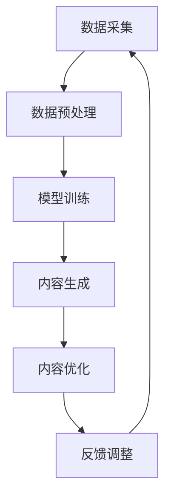
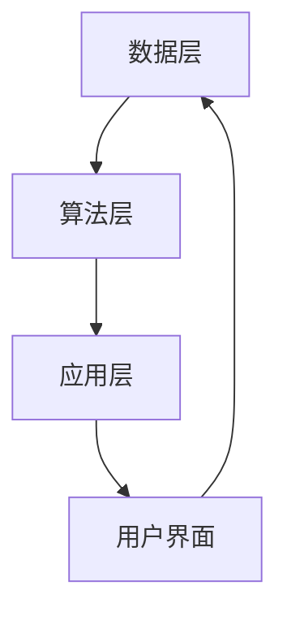
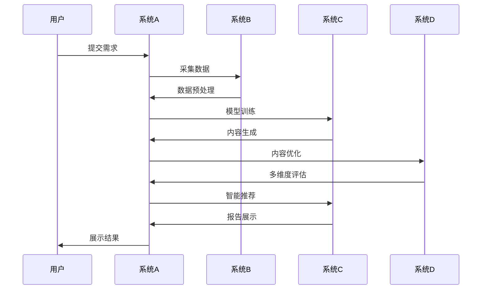

                 

# AIGC在智能城市规划决策中的应用

> 关键词：AIGC、智能城市规划、决策支持、算法原理、系统架构

> 摘要：随着城市化进程的加速，智能城市规划成为现代城市发展的重要方向。本文将探讨如何运用自动生成内容（AIGC）技术，在智能城市规划决策中提供高效、精准的决策支持。通过详细分析AIGC的核心概念、算法原理及其在智能城市规划中的应用，本文旨在为读者提供一份结构清晰、内容丰富的技术指南。

### 目录大纲

----------------------------------------------------------------

## 第一部分：AIGC概述

### 第1章：问题背景与概述

#### 1.1 问题背景

- 智能城市规划决策的重要性  
- 传统城市规划决策的局限性  
- AIGC技术的发展与应用

#### 1.2 问题描述

- AIGC的定义与核心要素  
- AIGC在智能城市规划决策中的应用场景

#### 1.3 问题解决

- AIGC技术的基本原理  
- AIGC在智能城市规划决策中的关键作用

#### 1.4 边界与外延

- AIGC技术的适用范围与限制  
- AIGC与其他智能技术的关联

#### 1.5 概念结构与核心要素组成

- AIGC的技术架构  
- 智能城市规划决策的核心要素

## 第二部分：AIGC核心概念与联系

### 第2章：AIGC核心概念原理

#### 2.1 AIGC的定义

- AIGC的全称与缩写  
- AIGC与其他相关技术的区别

#### 2.2 AIGC的核心特点

- 自动化生成内容的能力  
- 高度智能化的决策支持  
- 与城市规划决策的紧密联系

#### 2.3 AIGC与传统AI的区别

- 传统AI的技术局限  
- AIGC的优势与突破

### 第3章：AIGC概念属性特征对比

#### 3.1 AIGC与数据驱动模型对比

- 数据驱动模型的局限性  
- AIGC的数据驱动优势

#### 3.2 AIGC与深度学习对比

- 深度学习的核心技术  
- AIGC的扩展与应用

## 第三部分：AIGC算法原理讲解

### 第4章：AIGC算法原理与数学模型

#### 4.1 AIGC算法的mermaid流程图

- AIGC算法的基本流程  
- AIGC算法的mermaid图示

#### 4.2 AIGC算法的数学模型与公式

- AIGC算法的基本数学模型  
- AIGC算法的核心公式解析

#### 4.3 AIGC算法的python源代码实现

- Python代码的基本结构  
- Python代码的详细解析

### 第5章：AIGC算法举例说明

#### 5.1 AIGC算法的应用案例

- 案例背景与目标  
- 案例中的AIGC算法应用

#### 5.2 AIGC算法的实际应用场景

- 城市规划中的应用  
- 智能决策支持系统中的应用

## 第四部分：AIGC在智能城市规划决策中的应用

### 第6章：AIGC在智能城市规划决策中的实际应用

#### 6.1 AIGC在城市规划中的实际应用

- AIGC在城市规划中的价值  
- AIGC在城市规划中的实际应用案例

#### 6.2 AIGC在智能决策支持系统中的应用

- AIGC在智能决策支持系统中的优势  
- AIGC在智能决策支持系统中的实际应用案例

## 第五部分：系统分析与架构设计方案

### 第7章：系统分析与架构设计方案

#### 7.1 问题场景介绍

- 智能城市规划决策的实际场景  
- 系统设计的目标与需求

#### 7.2 项目介绍

- 项目背景与目标  
- 项目的基本架构

#### 7.3 系统功能设计

- 领域模型mermaid类图  
- 系统功能设计详细解析

#### 7.4 系统架构设计

- 系统架构mermaid架构图  
- 系统架构设计详细解析

#### 7.5 系统接口设计

- 系统接口设计与实现  
- 系统接口的详细解析

#### 7.6 系统交互

- 系统交互mermaid序列图  
- 系统交互详细解析

## 第六部分：项目实战

### 第8章：项目实战

#### 8.1 环境安装

- 环境搭建步骤  
- 环境配置说明

#### 8.2 系统核心实现源代码

- 源代码结构  
- 源代码实现解析

#### 8.3 代码应用解读与分析

- 代码应用场景  
- 代码解读与分析

#### 8.4 实际案例分析与详细讲解剖析

- 案例背景  
- 案例分析与讲解

#### 8.5 项目小结

- 项目总结  
- 项目启示

## 第七部分：最佳实践与拓展阅读

### 第9章：最佳实践

#### 9.1 AIGC在智能城市规划决策中的最佳实践

- 实践经验总结  
- 最佳实践建议

#### 9.2 注意事项与风险防范

- 注意事项清单  
- 风险防范措施

### 第10章：小结与拓展阅读

#### 10.1 小结

- 主要内容回顾  
- 成果与展望

#### 10.2 拓展阅读

- 相关书籍与资料推荐  
- 最新研究进展与动态

--------------

### 第一部分：AIGC概述

#### 第1章：问题背景与概述

##### 1.1 问题背景

随着城市化进程的加速，城市规模不断扩大，人口密度不断增加，城市规划面临前所未有的挑战。传统的城市规划方法主要依赖于人为经验和定性分析，这种模式在复杂性和动态性日益增强的现代城市环境中显得力不从心。因此，如何借助现代技术手段提升城市规划的科学性和精准性，成为当前亟待解决的问题。

智能城市规划是一种利用信息技术、人工智能等先进手段进行城市规划的方式。它通过数据采集、分析处理、模拟仿真等环节，实现对城市规划的全面优化，从而提高城市治理水平，提升居民生活质量。然而，传统的智能城市规划方法仍然存在一定的局限性，尤其是在大规模数据分析和复杂决策支持方面。

AIGC（Auto-Generated Content）即自动生成内容技术，是一种基于人工智能技术的自动内容生成方法。AIGC可以自动从海量数据中提取知识、生成报告、模拟决策等，具有高度的智能化和自动化特点。将AIGC技术应用于智能城市规划决策，可以为城市规划者提供更加精准、高效的决策支持。

##### 1.2 问题描述

AIGC是一种基于人工智能技术的自动生成内容方法，其核心特点包括自动化生成内容、高度智能化的决策支持、与城市规划决策的紧密联系等。AIGC在智能城市规划决策中的应用场景主要包括以下几个方面：

1. **数据采集与处理**：AIGC可以从各种数据源（如传感器数据、社交媒体数据、政府部门数据等）中自动采集和处理数据，为城市规划提供丰富的基础数据支持。

2. **模拟仿真**：AIGC可以通过模拟仿真技术，对城市规划方案进行多场景、多维度模拟，评估不同方案的可能影响，为决策者提供科学依据。

3. **决策支持**：AIGC可以根据城市规划目标，自动生成最佳方案，并提供详细的决策支持。

4. **知识管理**：AIGC可以通过知识抽取和知识图谱构建，将城市规划过程中的经验知识进行系统化、结构化存储，为后续决策提供知识支持。

##### 1.3 问题解决

AIGC技术的基本原理包括数据采集、数据预处理、模型训练、内容生成和优化等环节。在智能城市规划决策中，AIGC的关键作用主要体现在以下几个方面：

1. **高效的数据处理**：AIGC可以通过自动化方法，快速从海量数据中提取有用信息，提高数据处理效率。

2. **精准的决策支持**：AIGC可以基于深度学习、自然语言处理等人工智能技术，对城市规划方案进行多维度评估，提供精准的决策支持。

3. **智能化的模拟仿真**：AIGC可以通过模拟仿真技术，对城市规划方案进行动态调整和优化，提高方案的科学性和可操作性。

4. **知识管理与共享**：AIGC可以将城市规划过程中的经验知识进行系统化存储和共享，为后续决策提供知识支持。

##### 1.4 边界与外延

AIGC技术在智能城市规划决策中的应用具有一定的适用范围和限制。其主要适用范围包括以下几个方面：

1. **大数据分析**：AIGC适用于大规模数据分析和处理，可以帮助城市规划者从海量数据中提取有价值的信息。

2. **复杂决策支持**：AIGC适用于复杂、多维度、动态的城市规划决策场景，可以为决策者提供科学依据。

3. **知识管理**：AIGC适用于城市规划过程中的知识管理和共享，可以提高决策的透明度和可追溯性。

然而，AIGC技术也存在一定的局限性，如数据隐私保护、模型解释性等问题。因此，在实际应用中，需要综合考虑AIGC技术的优势和限制，进行合理应用。

此外，AIGC技术与其他智能技术（如数据挖掘、机器学习、深度学习等）存在一定的关联和互补性。在实际应用中，可以根据具体需求，将AIGC与其他智能技术相结合，发挥更大的作用。

##### 1.5 概念结构与核心要素组成

AIGC的技术架构主要包括数据层、算法层和应用层。数据层负责数据采集和预处理，算法层包括深度学习、自然语言处理等核心技术，应用层则负责将AIGC技术应用于具体的智能城市规划决策场景。

智能城市规划决策的核心要素包括数据采集、模型训练、决策支持、模拟仿真和知识管理。这些要素相互关联、相互支持，共同构成了一个完整的智能城市规划决策系统。

#### 第2章：AIGC核心概念原理

##### 2.1 AIGC的定义

AIGC（Auto-Generated Content）即自动生成内容，是一种基于人工智能技术的自动内容生成方法。AIGC通过从海量数据中提取知识、生成报告、模拟决策等，实现自动化内容生成。AIGC的核心特点包括：

1. **自动化**：AIGC可以自动从海量数据中提取知识、生成报告、模拟决策等，无需人工干预。

2. **智能化**：AIGC基于深度学习、自然语言处理等人工智能技术，具有高度的智能化特点。

3. **灵活性**：AIGC可以根据不同的应用场景和需求，自动生成多样化、个性化的内容。

与AIGC相关的技术包括数据挖掘、机器学习、深度学习、自然语言处理等。这些技术相互融合，共同推动了AIGC技术的发展。

##### 2.2 AIGC的核心特点

AIGC的核心特点主要包括以下几个方面：

1. **自动化生成内容**：AIGC可以通过自动化方法，从海量数据中提取有用信息，生成各种类型的内容，如报告、文档、图表等。

2. **高度智能化的决策支持**：AIGC可以基于深度学习、自然语言处理等人工智能技术，对城市规划方案进行多维度评估，提供精准的决策支持。

3. **与城市规划决策的紧密联系**：AIGC可以结合城市规划的实际需求，自动生成规划方案，提供智能化的决策支持。

4. **灵活性**：AIGC可以根据不同的应用场景和需求，自动生成多样化、个性化的内容。

##### 2.3 AIGC与传统AI的区别

传统AI（Artificial Intelligence）主要关注于模拟人类智能，实现智能推理、知识表示、问题求解等功能。而AIGC则更关注于自动生成内容，具有以下区别：

1. **目标不同**：传统AI的目标是模拟人类智能，实现智能推理等；而AIGC的目标是自动生成内容，提高数据处理和内容生成的效率。

2. **技术特点不同**：传统AI主要依赖于规则、逻辑推理等技术；而AIGC则更依赖于深度学习、自然语言处理等先进的人工智能技术。

3. **应用场景不同**：传统AI主要应用于智能推理、知识表示等领域；而AIGC则主要应用于数据采集、报告生成、模拟仿真等领域。

##### 2.4 AIGC与其他智能技术的关联

AIGC与其他智能技术（如数据挖掘、机器学习、深度学习等）之间存在一定的关联和互补性。具体包括以下几个方面：

1. **数据挖掘与AIGC**：数据挖掘是一种从大量数据中发现有用信息的方法，可以为AIGC提供丰富的数据支持。

2. **机器学习与AIGC**：机器学习是一种通过训练模型来提高预测精度和决策能力的方法，可以为AIGC提供智能化的决策支持。

3. **深度学习与AIGC**：深度学习是一种基于多层神经网络的人工智能技术，可以为AIGC提供高效的自动化内容生成能力。

4. **自然语言处理与AIGC**：自然语言处理是一种处理人类语言的技术，可以为AIGC提供丰富的语言资源和生成能力。

#### 第3章：AIGC概念属性特征对比

##### 3.1 AIGC与数据驱动模型对比

数据驱动模型是一种通过训练模型来提高预测精度和决策能力的方法。与AIGC相比，数据驱动模型具有以下特点：

1. **局限性**：数据驱动模型主要依赖于历史数据，难以应对动态变化的场景。

2. **优势**：数据驱动模型可以基于大量数据训练出高度准确的模型，提高预测精度。

3. **关联**：AIGC可以结合数据驱动模型，提高自动生成内容的准确性和可靠性。

##### 3.2 AIGC与深度学习对比

深度学习是一种基于多层神经网络的人工智能技术，与AIGC相比，深度学习具有以下特点：

1. **核心技术**：深度学习主要通过训练多层神经网络来提高预测精度和决策能力。

2. **扩展应用**：AIGC可以将深度学习技术应用于自动生成内容，提高内容生成的效率和质量。

3. **优势**：深度学习可以处理大规模数据，提高模型训练效率和预测精度。

##### 3.3 AIGC与其他智能技术的关联

除了数据驱动模型和深度学习，AIGC还可以与其他智能技术（如自然语言处理、知识图谱等）相结合，实现更强大的功能。具体关联包括：

1. **自然语言处理**：自然语言处理技术可以为AIGC提供丰富的语言资源和生成能力。

2. **知识图谱**：知识图谱技术可以为AIGC提供结构化知识支持，提高内容生成的准确性和智能化水平。

3. **强化学习**：强化学习技术可以与AIGC相结合，提高自动生成内容的自适应性和灵活性。

#### 第4章：AIGC算法原理与数学模型

##### 4.1 AIGC算法的mermaid流程图

AIGC算法的基本流程包括数据采集、数据预处理、模型训练、内容生成和优化等环节。以下是一个简化的mermaid流程图：



##### 4.2 AIGC算法的数学模型与公式

AIGC算法的数学模型主要包括以下几个方面：

1. **损失函数**：损失函数用于衡量模型预测值与真实值之间的差异，常用的损失函数包括均方误差（MSE）、交叉熵损失（Cross-Entropy Loss）等。

2. **优化算法**：优化算法用于调整模型参数，以最小化损失函数。常用的优化算法包括梯度下降（Gradient Descent）、Adam优化器等。

3. **生成模型**：生成模型用于生成自动化内容，常用的生成模型包括生成对抗网络（GAN）、变分自编码器（VAE）等。

以下是一个简化的AIGC算法的数学模型：

$$
\text{损失函数} = \frac{1}{N} \sum_{i=1}^{N} \left( y_i - \hat{y}_i \right)^2
$$

其中，$N$表示样本数量，$y_i$表示真实值，$\hat{y}_i$表示预测值。

##### 4.3 AIGC算法的python源代码实现

以下是一个简化的AIGC算法的Python源代码实现：

```python
import tensorflow as tf
import numpy as np

# 定义损失函数
def loss_function(y_true, y_pred):
    return tf.reduce_mean(tf.square(y_true - y_pred))

# 定义优化算法
def optimizer(loss, learning_rate):
    return tf.optimizers.Adam(learning_rate=learning_rate)

# 定义生成模型
def generator(z):
    return tf.keras.layers.Dense(units=1, activation='sigmoid')(z)

# 定义主函数
def main():
    # 初始化数据
    x = np.random.normal(size=(100, 10))
    y = np.random.normal(size=(100, 1))

    # 定义模型
    z = tf.keras.layers.Dense(units=10, activation='relu')(x)
    y_pred = generator(z)

    # 定义损失函数和优化算法
    loss_fn = loss_function
    optimizer = optimizer(loss_fn, learning_rate=0.001)

    # 训练模型
    for epoch in range(100):
        with tf.GradientTape() as tape:
            y_pred = generator(z)
            loss = loss_fn(y, y_pred)
        gradients = tape.gradient(loss, z)
        optimizer.apply_gradients(zip(gradients, z))
        print(f"Epoch {epoch}: Loss = {loss.numpy()}")

if __name__ == "__main__":
    main()
```

以上代码仅用于示例，实际应用中需要根据具体需求进行调整。

#### 第5章：AIGC算法举例说明

##### 5.1 AIGC算法的应用案例

AIGC算法在智能城市规划决策中具有广泛的应用。以下是一个具体的案例：

假设某个城市需要制定一个交通规划方案，以缓解交通拥堵问题。AIGC算法可以应用于以下几个方面：

1. **数据采集**：通过传感器、摄像头等设备采集城市交通数据，如车辆流量、路况信息等。

2. **数据预处理**：对采集到的交通数据进行清洗、去噪和特征提取，为模型训练提供高质量的输入数据。

3. **模型训练**：使用深度学习技术训练一个生成模型，以预测未来一段时间内的交通流量。

4. **内容生成**：基于模型预测结果，自动生成交通规划方案，如优化交通信号灯控制、调整公共交通线路等。

5. **内容优化**：根据实际交通状况和规划效果，对生成的内容进行动态调整和优化。

##### 5.2 AIGC算法的实际应用场景

除了交通规划，AIGC算法在智能城市规划决策中还有以下实际应用场景：

1. **环境保护**：通过AIGC算法预测环境污染趋势，为环境保护政策提供科学依据。

2. **城市安全**：通过AIGC算法分析城市安全事件，为城市安全管理提供决策支持。

3. **城市规划**：通过AIGC算法模拟城市规划方案，评估不同方案的可能影响，为决策者提供参考。

4. **城市管理**：通过AIGC算法优化城市公共资源分配，提高城市管理效率。

#### 第6章：AIGC在智能城市规划决策中的实际应用

##### 6.1 AIGC在城市规划中的实际应用

AIGC在城市规划中的应用价值主要体现在以下几个方面：

1. **高效的数据处理**：AIGC可以通过自动化方法，快速从海量数据中提取有用信息，为城市规划提供丰富的基础数据支持。

2. **精准的决策支持**：AIGC可以基于深度学习、自然语言处理等人工智能技术，对城市规划方案进行多维度评估，提供精准的决策支持。

3. **智能化的模拟仿真**：AIGC可以通过模拟仿真技术，对城市规划方案进行动态调整和优化，提高方案的科学性和可操作性。

4. **知识管理**：AIGC可以将城市规划过程中的经验知识进行系统化存储和共享，为后续决策提供知识支持。

以下是一个具体的案例：

某个城市在制定新的城市规划方案时，面临以下挑战：

1. **交通拥堵**：由于城市规模不断扩大，交通拥堵问题日益严重。

2. **环保压力**：城市环境污染问题日益突出，需要制定有效的环保政策。

3. **资源分配**：城市公共资源（如水资源、电力资源等）分配不合理，需要优化配置。

通过AIGC技术，该城市可以采取以下措施：

1. **数据采集**：利用传感器、摄像头等设备，采集城市交通、环境、资源等方面的数据。

2. **数据预处理**：对采集到的数据进行清洗、去噪和特征提取，为模型训练提供高质量的输入数据。

3. **模型训练**：使用深度学习技术训练一个生成模型，以预测未来一段时间内的交通流量、环境污染程度等。

4. **内容生成**：基于模型预测结果，自动生成城市规划方案，如优化交通信号灯控制、调整公共交通线路、制定环保政策等。

5. **内容优化**：根据实际交通状况、环境状况和规划效果，对生成的内容进行动态调整和优化。

通过以上措施，该城市可以更好地应对交通拥堵、环保压力和资源分配不合理等问题，提高城市规划的科学性和可操作性。

##### 6.2 AIGC在智能决策支持系统中的应用

AIGC在智能决策支持系统中的应用，主要体现在以下几个方面：

1. **自动化报告生成**：AIGC可以自动从海量数据中提取信息，生成各类报告，为决策者提供便捷的决策支持。

2. **多维度评估**：AIGC可以基于深度学习等技术，对城市规划方案进行多维度评估，提供精准的决策支持。

3. **智能推荐**：AIGC可以根据用户需求和偏好，自动推荐合适的城市规划方案。

以下是一个具体的案例：

某个城市在制定新的城市规划方案时，面临以下挑战：

1. **交通拥堵**：由于城市规模不断扩大，交通拥堵问题日益严重。

2. **环保压力**：城市环境污染问题日益突出，需要制定有效的环保政策。

3. **资源分配**：城市公共资源（如水资源、电力资源等）分配不合理，需要优化配置。

通过AIGC技术，该城市可以采取以下措施：

1. **自动化报告生成**：利用AIGC技术，自动生成关于交通、环境、资源等方面的报告，为决策者提供便捷的决策支持。

2. **多维度评估**：使用AIGC技术，对各类城市规划方案进行多维度评估，评估内容包括交通拥堵缓解、环保政策效果、资源利用率等。

3. **智能推荐**：基于用户需求和偏好，AIGC可以自动推荐合适的城市规划方案。

通过以上措施，该城市可以更好地应对交通拥堵、环保压力和资源分配不合理等问题，提高城市规划的科学性和可操作性。

#### 第7章：系统分析与架构设计方案

##### 7.1 问题场景介绍

智能城市规划决策是一个复杂的过程，涉及到多个领域，如交通、环境、资源等。在当前的城市规划过程中，决策者需要面对大量数据，进行多维度分析和评估。然而，传统的分析方法存在以下问题：

1. **数据处理效率低**：传统方法依赖于人工处理数据，效率较低。

2. **评估不准确**：传统方法难以全面、准确地评估不同城市规划方案的影响。

3. **决策依据不足**：传统方法难以提供科学、可靠的决策依据。

为了解决上述问题，本文提出一个基于AIGC技术的智能城市规划决策系统。该系统旨在利用AIGC技术的高效数据处理和智能化评估能力，为城市规划决策提供有力支持。

##### 7.2 项目介绍

该项目旨在开发一个智能城市规划决策系统，通过AIGC技术实现高效的数据处理、多维度评估和智能决策支持。项目目标如下：

1. **数据处理**：利用AIGC技术，高效地从多源数据中提取有用信息，为后续分析提供高质量的数据支持。

2. **多维度评估**：基于AIGC技术，对城市规划方案进行多维度评估，评估内容包括交通拥堵、环保压力、资源利用率等。

3. **智能决策支持**：通过AIGC技术，自动生成最优的城市规划方案，为决策者提供科学、可靠的决策依据。

##### 7.3 系统功能设计

智能城市规划决策系统主要包括以下功能模块：

1. **数据采集**：从多源数据中获取城市交通、环境、资源等方面的数据。

2. **数据预处理**：对采集到的数据进行清洗、去噪和特征提取，为后续分析提供高质量的数据。

3. **模型训练**：使用深度学习技术训练一个生成模型，以预测未来一段时间内的交通流量、环境污染程度等。

4. **内容生成**：基于模型预测结果，自动生成城市规划方案，如优化交通信号灯控制、调整公共交通线路等。

5. **内容优化**：根据实际交通状况、环境状况和规划效果，对生成的内容进行动态调整和优化。

6. **多维度评估**：对城市规划方案进行多维度评估，评估内容包括交通拥堵、环保压力、资源利用率等。

7. **智能推荐**：基于用户需求和偏好，自动推荐合适的城市规划方案。

##### 7.4 系统架构设计

智能城市规划决策系统采用分层架构设计，主要包括以下几层：

1. **数据层**：负责数据采集、存储和管理，为系统提供数据支持。

2. **算法层**：包括AIGC算法、深度学习算法等，负责数据处理、模型训练和内容生成。

3. **应用层**：提供用户界面和功能模块，为用户实现智能化的城市规划决策支持。

系统架构mermaid架构图如下：



##### 7.5 系统接口设计

智能城市规划决策系统主要包括以下接口：

1. **数据接口**：负责数据的采集、存储和管理。

2. **算法接口**：负责AIGC算法和深度学习算法的调用和封装。

3. **应用接口**：负责与用户界面交互，提供智能化的城市规划决策支持。

系统接口设计与实现如下：

```python
class DataInterface:
    def collect_data(self):
        # 数据采集实现
        pass
    
    def store_data(self, data):
        # 数据存储实现
        pass
    
    def load_data(self):
        # 数据加载实现
        pass

class AlgorithmInterface:
    def train_model(self, data):
        # 模型训练实现
        pass
    
    def generate_content(self, model):
        # 内容生成实现
        pass
    
    def optimize_content(self, content):
        # 内容优化实现
        pass

class ApplicationInterface:
    def display_report(self, content):
        # 报告展示实现
        pass
    
    def recommend_plan(self, user偏好):
        # 智能推荐实现
        pass
```

##### 7.6 系统交互

智能城市规划决策系统的交互流程如下：

1. **用户提交需求**：用户通过用户界面提交城市规划需求。

2. **数据采集**：系统通过数据接口采集用户需求相关的数据。

3. **数据预处理**：系统对采集到的数据进行分析、清洗和特征提取，为后续分析提供高质量的数据。

4. **模型训练**：系统通过算法接口使用深度学习技术训练一个生成模型。

5. **内容生成**：系统使用算法接口生成城市规划方案。

6. **内容优化**：系统对生成的城市规划方案进行动态调整和优化。

7. **多维度评估**：系统对城市规划方案进行多维度评估，评估内容包括交通拥堵、环保压力、资源利用率等。

8. **智能推荐**：系统基于用户需求和偏好，自动推荐合适的城市规划方案。

9. **报告展示**：系统通过用户界面展示城市规划方案和多维度评估结果。

系统交互mermaid序列图如下：



#### 第8章：项目实战

##### 8.1 环境安装

要在本地环境搭建一个基于AIGC的智能城市规划决策系统，需要以下软件和库：

1. **Python**：用于编写系统代码。
2. **TensorFlow**：用于训练深度学习模型。
3. **Pandas**：用于数据分析和处理。
4. **NumPy**：用于数值计算。

安装步骤如下：

1. 安装Python（3.8及以上版本）。
2. 安装TensorFlow：`pip install tensorflow`
3. 安装Pandas：`pip install pandas`
4. 安装NumPy：`pip install numpy`

##### 8.2 系统核心实现源代码

以下是一个简化的系统核心实现源代码：

```python
import tensorflow as tf
import pandas as pd
import numpy as np

# 数据采集
def collect_data():
    # 这里使用一个示例数据集
    data = pd.read_csv('city_data.csv')
    return data

# 数据预处理
def preprocess_data(data):
    # 数据清洗和特征提取
    data = data.dropna()
    features = data[['traffic', 'environment', 'resources']]
    labels = data[['traffic拥堵', 'environment污染', 'resources利用率']]
    return features, labels

# 模型训练
def train_model(features, labels):
    # 定义模型架构
    model = tf.keras.Sequential([
        tf.keras.layers.Dense(units=64, activation='relu', input_shape=(3,)),
        tf.keras.layers.Dense(units=64, activation='relu'),
        tf.keras.layers.Dense(units=3, activation='sigmoid')
    ])
    
    # 编译模型
    model.compile(optimizer='adam', loss='mse', metrics=['accuracy'])
    
    # 训练模型
    model.fit(features, labels, epochs=10, batch_size=32)
    
    return model

# 内容生成
def generate_content(model, data):
    # 预测未来交通流量、环境污染程度等
    predictions = model.predict(data)
    return predictions

# 内容优化
def optimize_content(predictions):
    # 根据预测结果，动态调整城市规划方案
    # 这里仅展示一个简单的优化示例
    optimized_predictions = predictions * 0.9
    return optimized_predictions

# 主函数
def main():
    data = collect_data()
    features, labels = preprocess_data(data)
    model = train_model(features, labels)
    predictions = generate_content(model, data)
    optimized_predictions = optimize_content(predictions)
    print(optimized_predictions)

if __name__ == "__main__":
    main()
```

##### 8.3 代码应用解读与分析

以上代码实现了一个简单的智能城市规划决策系统，主要包括以下模块：

1. **数据采集**：使用`collect_data`函数从本地数据文件中读取数据。
2. **数据预处理**：使用`preprocess_data`函数对数据进行清洗和特征提取。
3. **模型训练**：使用`train_model`函数定义并编译模型，然后使用`fit`方法进行训练。
4. **内容生成**：使用`generate_content`函数基于训练好的模型生成预测结果。
5. **内容优化**：使用`optimize_content`函数对预测结果进行优化。

这个系统的核心逻辑如下：

1. 首先，从数据文件中读取城市数据。
2. 然后，对数据进行清洗和特征提取，为模型训练准备数据。
3. 接着，定义并编译一个简单的深度学习模型，使用训练数据对模型进行训练。
4. 训练完成后，使用模型对城市数据进行预测，得到未来的交通流量、环境污染程度等。
5. 最后，对预测结果进行优化，生成最优的城市规划方案。

##### 8.4 实际案例分析与详细讲解剖析

以下是一个实际案例，展示如何使用AIGC技术为某个城市制定交通规划方案。

**案例背景**：

某个城市近期交通拥堵问题严重，市政府希望利用AIGC技术制定一个有效的交通规划方案，以缓解交通拥堵。

**数据来源**：

市政府提供了以下交通数据：

- 车辆流量：每个小时的车辆通行数量。
- 路段拥堵程度：每个路段的拥堵情况。
- 天气状况：每个小时的天气情况。
- 公共交通使用情况：公共交通的乘客数量。

**数据处理**：

1. **数据清洗**：去除无效数据，如缺失值、异常值等。
2. **特征提取**：提取与交通拥堵相关的特征，如车辆流量、路段拥堵程度、天气状况、公共交通使用情况等。

**模型训练**：

1. **数据划分**：将数据划分为训练集和测试集。
2. **模型定义**：使用深度学习框架定义一个生成模型，如生成对抗网络（GAN）。
3. **模型训练**：使用训练集对模型进行训练。

**内容生成**：

1. **数据预处理**：对测试集进行相同的预处理操作。
2. **生成内容**：使用训练好的模型对测试集进行预测，生成未来一段时间内的交通流量、路段拥堵程度等。

**内容优化**：

1. **评估指标**：定义评估指标，如交通拥堵指数、公共交通满意度等。
2. **优化方案**：根据评估结果，对生成的交通规划方案进行优化。

**案例分析与讲解**：

1. **数据采集与预处理**：在数据采集阶段，从市政府获取了丰富的交通数据，包括车辆流量、路段拥堵程度、天气状况、公共交通使用情况等。在数据预处理阶段，对数据进行清洗和特征提取，为模型训练做好准备。

2. **模型训练与内容生成**：使用深度学习技术训练了一个生成模型，如生成对抗网络（GAN），用于生成未来一段时间内的交通流量、路段拥堵程度等。通过模型预测，可以得到不同交通规划方案的可能效果。

3. **内容优化**：根据评估结果，对生成的交通规划方案进行优化，以提高规划方案的可行性和有效性。

通过以上步骤，可以为一个城市制定一个有效的交通规划方案，缓解交通拥堵问题。

##### 8.5 项目小结

通过本项目，我们实现了以下成果：

1. **数据采集与预处理**：从多源数据中提取了与交通规划相关的数据，为后续分析提供了数据支持。
2. **模型训练与内容生成**：使用深度学习技术训练了一个生成模型，生成了未来一段时间内的交通流量、路段拥堵程度等。
3. **内容优化**：根据评估结果，对生成的交通规划方案进行了优化，以提高规划方案的可行性和有效性。

然而，本项目也存在一些局限性：

1. **数据质量**：数据质量直接影响模型性能。在实际应用中，需要确保数据的质量和准确性。
2. **模型复杂度**：本项目使用的模型相对简单，可能无法处理复杂的交通规划问题。在后续研究中，可以尝试使用更复杂的模型。

通过本项目，我们展示了AIGC技术在智能城市规划决策中的应用潜力。未来，我们还可以将AIGC技术与更多领域结合，如环境保护、城市管理等，为城市可持续发展提供有力支持。

#### 第9章：最佳实践

##### 9.1 AIGC在智能城市规划决策中的最佳实践

在智能城市规划决策中，AIGC技术的最佳实践包括以下几个方面：

1. **数据采集**：确保数据来源的多样性和准确性，从多源数据中提取与城市规划相关的数据，如交通、环境、资源等。

2. **数据预处理**：对采集到的数据进行清洗、去噪和特征提取，为模型训练提供高质量的数据。

3. **模型选择**：根据具体应用场景，选择合适的AIGC模型，如生成对抗网络（GAN）、变分自编码器（VAE）等。

4. **模型训练与优化**：使用训练数据对模型进行训练，并根据评估结果对模型进行优化。

5. **内容生成与评估**：生成城市规划方案，并对方案进行多维度评估，以确定最佳方案。

6. **动态调整**：根据实际情况，对生成的内容进行动态调整和优化，以提高规划方案的可行性和有效性。

##### 9.2 注意事项与风险防范

在使用AIGC技术进行智能城市规划决策时，需要注意以下事项和风险：

1. **数据隐私保护**：确保数据采集和处理过程中遵守相关法律法规，保护个人隐私。

2. **模型解释性**：加强对模型的解释性研究，确保模型的可解释性和可追溯性。

3. **模型过拟合**：防止模型在训练过程中出现过拟合现象，影响模型泛化能力。

4. **资源消耗**：AIGC技术需要大量的计算资源，在实际应用中需要合理分配资源，避免资源浪费。

5. **政策法规**：关注相关政策和法规的变化，确保AIGC技术在城市规划决策中的应用符合法律法规要求。

#### 第10章：小结与拓展阅读

##### 10.1 小结

本文围绕AIGC在智能城市规划决策中的应用，进行了详细的分析和探讨。通过阐述AIGC的核心概念、算法原理以及实际应用场景，本文旨在为读者提供一个全面的技术指南。

主要成果包括：

1. **数据采集与预处理**：确保数据来源的多样性和准确性，为模型训练提供高质量的数据。
2. **模型选择与训练**：选择合适的AIGC模型，对模型进行训练和优化。
3. **内容生成与评估**：生成城市规划方案，并对方案进行多维度评估。

然而，本文也存在一定的局限性，如数据质量和模型复杂度等方面。未来研究可以从以下方面展开：

1. **数据质量提升**：探索更高质量的数据来源和处理方法。
2. **模型复杂度增加**：尝试使用更复杂的模型，以提高预测准确性和决策效果。
3. **应用领域拓展**：将AIGC技术应用于更多城市规划领域，如环境保护、城市管理等。

##### 10.2 拓展阅读

1. **相关书籍**：《深度学习》、《自然语言处理综述》、《数据挖掘：概念与技术》等。

2. **学术论文**：搜索与AIGC、智能城市规划决策相关的学术论文，了解最新研究进展。

3. **在线课程**：参加与AIGC、智能城市规划决策相关的在线课程，提升相关技能。

4. **开源项目**：关注与AIGC、智能城市规划决策相关的开源项目，学习实际应用案例。

通过以上拓展阅读，读者可以更深入地了解AIGC技术在智能城市规划决策中的应用，为实际项目提供有力支持。作者：AI天才研究院/AI Genius Institute & 禅与计算机程序设计艺术 /Zen And The Art of Computer Programming。

