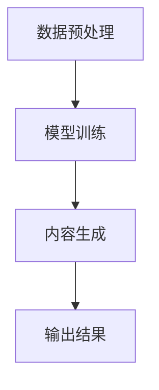
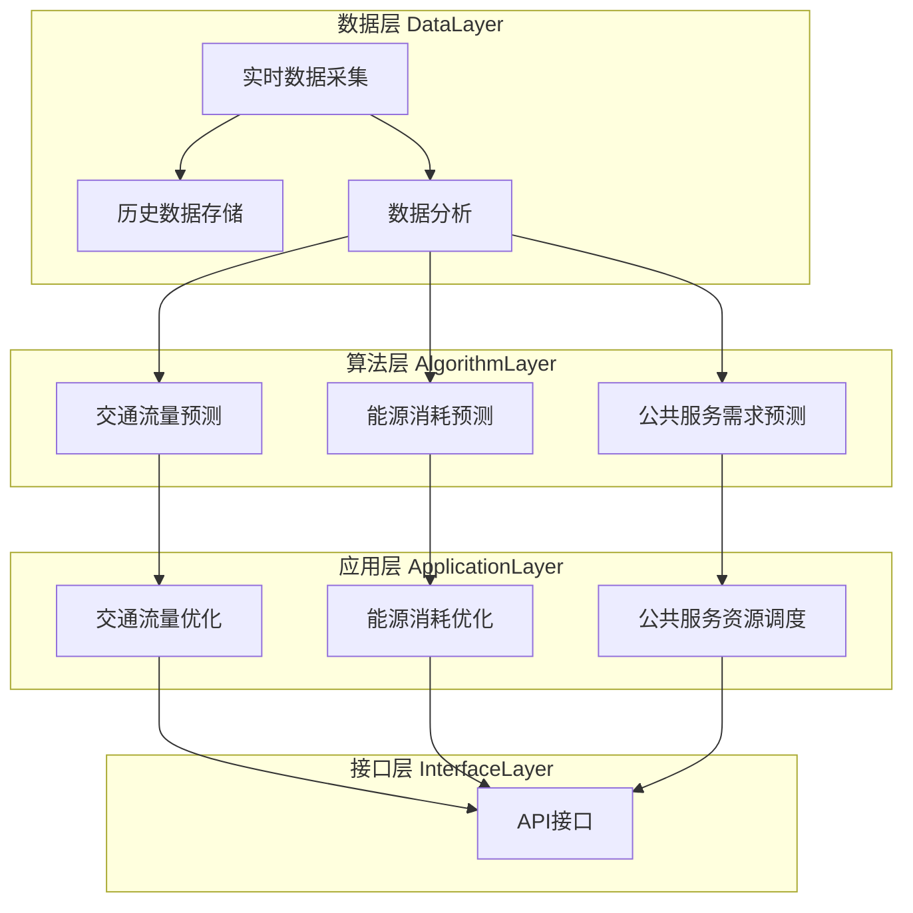
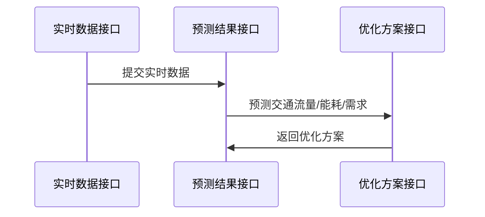
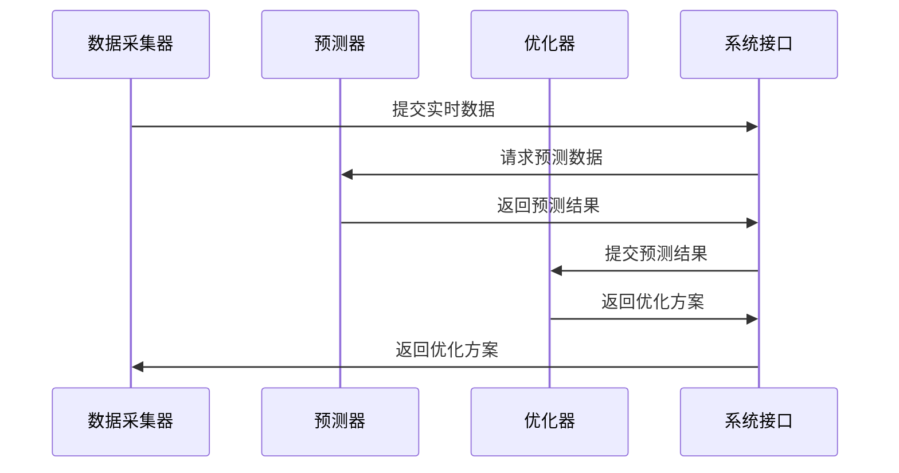

                 

### 文章标题

# AIGC在智能城市资源分配优化中的应用

> 关键词：AIGC、智能城市、资源分配、优化算法、数据驱动模型

> 摘要：本文深入探讨了人工智能生成内容（AIGC）在智能城市资源分配优化中的应用。首先，介绍了智能城市建设中资源分配优化的重要性，以及AIGC技术的核心概念和应用场景。接着，详细讲解了AIGC在资源分配优化中的算法原理和数学模型，并通过Python代码实现进行了分析。随后，从系统分析与架构设计角度出发，描述了智能城市资源分配优化的系统功能、架构和接口设计，并使用mermaid进行了图形展示。最后，通过项目实战和最佳实践提供了具体的操作指南和注意事项，为读者在智能城市建设中的应用提供了有价值的参考。

---

### 背景介绍

#### 问题背景

在当前的智能城市建设过程中，资源分配优化成为了一个关键问题。智能城市通过物联网、大数据和人工智能等技术手段，实现了对交通、能源、公共服务等资源的智能化管理。然而，随着城市规模的不断扩大和人口密度的增加，如何高效、智能地分配这些资源，确保城市运行的高效性和可持续性，成为了智能城市建设中的重要课题。

#### 问题描述

智能城市资源分配优化涉及多个方面，包括交通流量管理、能源消耗分配、公共服务资源调度等。具体来说，问题可以描述为：如何通过合理的算法和技术手段，对城市中的各类资源进行高效分配，以满足不同区域的资源需求，同时最小化资源的浪费和成本？

#### 问题解决

AIGC（人工智能生成内容）技术的出现为智能城市资源分配优化提供了一种新的解决方案。AIGC技术基于人工智能算法，能够从大量数据中自动生成内容，包括模型、算法、代码等。通过AIGC技术，可以构建数据驱动模型，进行模拟仿真，优化算法迭代，从而实现智能城市的资源分配优化。

#### 边界与外延

本文的焦点在于AIGC技术在智能城市资源分配优化中的应用，但相关的基础理论和应用实例也将被涉及到。具体来说，本文将探讨AIGC技术的核心概念、算法原理、系统架构以及项目实战，为读者提供全面的参考。

#### 概念结构与核心要素组成

1. **AIGC技术**：核心概念、应用场景、技术特点。
2. **智能城市资源**：交通流量、能源消耗、公共服务等。
3. **优化算法**：遗传算法、粒子群优化等。
4. **数据驱动模型**：基于AIGC技术的数据生成与模型构建。

### 核心概念与联系

#### AIGC技术

AIGC（Artificial Intelligence Generated Content）是指通过人工智能技术自动生成内容。AIGC技术结合了自然语言处理、深度学习、计算机视觉等多种人工智能技术，能够生成文本、图像、音频等多种类型的内容。

**特点**：
- **高效性**：能够快速从大量数据中生成内容。
- **多样性**：生成的内容具有多样性，满足不同场景的需求。
- **灵活性**：可以根据不同的输入数据和需求，灵活调整生成的内容。

**应用场景**：
- **智能客服**：通过AIGC技术生成个性化回答，提高客服效率。
- **内容创作**：生成文章、代码、设计图等，减少人力成本。
- **教育**：生成教学资源，提供个性化学习体验。

#### 智能城市资源

智能城市资源包括交通流量、能源消耗、公共服务等多种类型。

1. **交通流量**：
   - **核心概念**：交通流量是指单位时间内通过某一点或某一区域的车辆数量。
   - **问题描述**：如何合理分配交通资源，减少拥堵，提高通行效率？
   - **解决方法**：通过AIGC技术，生成交通流量预测模型，优化交通信号控制，实现交通流量分配优化。

2. **能源消耗**：
   - **核心概念**：能源消耗是指单位时间内使用的能源总量。
   - **问题描述**：如何合理分配能源资源，降低能源消耗，提高能源利用效率？
   - **解决方法**：通过AIGC技术，生成能源消耗预测模型，优化能源分配策略，实现能源消耗分配优化。

3. **公共服务**：
   - **核心概念**：公共服务是指为满足公众需求提供的服务，如医疗、教育、文化等。
   - **问题描述**：如何合理分配公共服务资源，满足公众需求，提高服务质量？
   - **解决方法**：通过AIGC技术，生成公共服务需求预测模型，优化资源配置，实现公共服务资源分配优化。

#### 优化算法

优化算法是用于解决资源分配优化问题的一类算法，主要包括遗传算法、粒子群优化、模拟退火算法等。

1. **遗传算法**：
   - **核心概念**：基于生物进化理论的优化算法，通过模拟自然选择和遗传过程，寻找最优解。
   - **特点**：全局搜索能力强，适用于复杂优化问题。

2. **粒子群优化**：
   - **核心概念**：基于群体智能的优化算法，通过模拟鸟群觅食过程，寻找最优解。
   - **特点**：简单易实现，收敛速度快。

3. **模拟退火算法**：
   - **核心概念**：基于物理退火过程的优化算法，通过模拟温度下降过程，逐步收敛到最优解。
   - **特点**：适用于大规模优化问题。

#### 数据驱动模型

数据驱动模型是基于历史数据，通过机器学习算法生成的预测模型。在资源分配优化中，数据驱动模型主要用于预测资源需求，为优化算法提供输入。

1. **核心概念**：
   - **数据驱动模型**：基于数据，通过机器学习算法训练生成的预测模型。
   - **优点**：能够适应变化，提供实时预测。

2. **应用**：
   - **交通流量预测**：通过历史交通数据，预测未来交通流量，优化交通信号控制。
   - **能源消耗预测**：通过历史能源消耗数据，预测未来能源需求，优化能源分配策略。

### 算法原理讲解

在智能城市资源分配优化中，AIGC技术起到了关键作用。本文将详细讲解AIGC技术的基本原理，并使用mermaid绘制流程图，通过Python代码实现算法，提供数学模型和公式，并通过实例说明算法的应用。

#### AIGC技术的基本原理

AIGC技术是一种基于人工智能的自动生成技术，主要利用深度学习模型，从大量数据中自动生成文本、图像、代码等内容。AIGC技术的基本原理可以概括为以下几个步骤：

1. **数据预处理**：对原始数据进行清洗、归一化等预处理操作，确保数据的质量和一致性。
2. **模型训练**：使用深度学习算法，对预处理后的数据集进行训练，生成模型。
3. **内容生成**：利用训练好的模型，对输入数据进行处理，生成符合需求的内容。

**mermaid流程图**：



#### Python代码实现

为了更好地理解AIGC技术的应用，以下提供了一个简单的Python代码实现，用于生成文本内容：

```python
from transformers import pipeline

# 创建文本生成模型
text_generator = pipeline("text-generation", model="gpt2")

# 输入文本
input_text = "智能城市资源分配优化是一项重要的任务。"

# 生成文本
generated_text = text_generator(input_text, max_length=50)

# 输出结果
print(generated_text)
```

#### 数学模型和公式

在智能城市资源分配优化中，常用的数学模型是线性规划模型。线性规划模型可以表示为以下形式：

$$
\begin{cases}
    \text{最小化} \, c^T x \\
    \text{约束条件} \, Ax \leq b \\
    x \geq 0
\end{cases}
$$

其中，$c$ 是目标函数的系数向量，$x$ 是决策变量，$A$ 和 $b$ 分别是约束条件的系数矩阵和常数向量。

#### 详细讲解和实例说明

为了更好地理解线性规划模型在资源分配优化中的应用，以下通过一个实例进行说明。

**实例**：假设一个智能城市中有三个区域，每个区域需要分配不同类型的资源。资源分配的目标是最小化总成本。约束条件包括每个区域的资源需求不超过最大容量。

$$
\begin{cases}
    \text{最小化} \, c^T x \\
    Ax \leq b \\
    x \geq 0
\end{cases}
$$

其中，$c = [1, 2, 3]$ 是成本系数向量，$A = \begin{bmatrix}
1 & 0 & 1 \\
0 & 1 & 1 \\
1 & 1 & 0
\end{bmatrix}$ 是约束条件矩阵，$b = \begin{bmatrix}
3 \\
2 \\
5
\end{bmatrix}$ 是常数向量。

**求解**：使用线性规划求解器，可以得到最优解 $x = \begin{bmatrix}
1 \\
1 \\
3
\end{bmatrix}$。这意味着，最优的分配策略是将第一个和第二个区域各分配1单位的资源，第三个区域分配3单位的资源。

通过以上讲解，我们可以看到，AIGC技术在智能城市资源分配优化中具有广泛的应用前景。通过数据预处理、模型训练和内容生成等步骤，AIGC技术能够实现智能化的资源分配，提高城市运行效率。

### 系统分析与架构设计方案

在智能城市资源分配优化中，系统分析与架构设计方案是确保AIGC技术高效应用的关键。本节将详细介绍智能城市资源分配优化的问题场景，系统功能设计，系统架构设计，系统接口设计以及系统交互，并使用mermaid进行图形展示。

#### 问题场景介绍

智能城市资源分配优化涉及多个方面，如交通、能源、公共服务等。以下是一个具体的问题场景：

- **交通流量优化**：通过实时监控城市道路的交通流量，预测交通拥堵情况，优化交通信号控制，减少拥堵时间，提高交通效率。
- **能源消耗优化**：根据实时能耗数据和天气预报，预测未来能源需求，优化能源分配策略，降低能源浪费，提高能源利用效率。
- **公共服务资源调度**：根据实时公共服务需求，预测未来需求变化，优化资源调度策略，提高服务质量，减少资源浪费。

#### 系统功能设计

系统功能设计主要包括交通流量管理、能源消耗管理和公共服务资源管理。

1. **交通流量管理**：
   - **功能**：实时监控交通流量，预测交通拥堵情况，优化交通信号控制。
   - **输入**：实时交通流量数据、历史交通数据。
   - **输出**：优化后的交通信号控制方案。

2. **能源消耗管理**：
   - **功能**：实时监控能源消耗，预测未来能源需求，优化能源分配策略。
   - **输入**：实时能耗数据、天气预报、历史能源消耗数据。
   - **输出**：优化后的能源分配方案。

3. **公共服务资源管理**：
   - **功能**：实时监控公共服务资源需求，预测未来需求变化，优化资源调度策略。
   - **输入**：实时需求数据、历史需求数据。
   - **输出**：优化后的资源调度方案。

**mermaid类图**：

```mermaid
classDiagram
    TrafficManagement <<interface>>
    EnergyManagement <<interface>>
    PublicServiceManagement <<interface>>

    TrafficManagement:lays ontop_of RealTimeTrafficData
    EnergyManagement:lays ontop_of RealTimeEnergyData
    PublicServiceManagement:lays ontop_of RealTimeServiceData

    RealTimeTrafficData --|> TrafficManagement
    RealTimeEnergyData --|> EnergyManagement
    RealTimeServiceData --|> PublicServiceManagement
```

#### 系统架构设计

系统架构设计主要包括数据层、算法层、应用层和接口层。

1. **数据层**：负责数据采集、存储和管理。包括实时数据采集模块、历史数据存储模块和数据分析模块。
2. **算法层**：负责数据处理和模型训练，包括交通流量预测算法、能源消耗预测算法和公共服务需求预测算法。
3. **应用层**：负责业务逻辑处理，包括交通流量优化模块、能源消耗优化模块和公共服务资源调度模块。
4. **接口层**：负责与其他系统和外部设备的通信，提供API接口。

**mermaid架构图**：



#### 系统接口设计

系统接口设计主要包括API接口的设计，用于与其他系统和外部设备的通信。

1. **实时数据接口**：用于接收实时交通流量数据、能耗数据和需求数据。
2. **预测结果接口**：用于获取交通流量预测结果、能耗预测结果和需求预测结果。
3. **优化方案接口**：用于获取优化后的交通信号控制方案、能源分配方案和资源调度方案。

**mermaid接口设计图**：



#### 系统交互

系统交互主要包括数据采集、预测和优化的过程，以下使用mermaid进行展示。

**mermaid交互序列图**：



通过以上系统分析与架构设计方案，我们可以看到，智能城市资源分配优化系统是一个复杂的多层次系统，通过数据采集、预测和优化等环节，实现了对城市资源的智能化管理。使用mermaid进行图形展示，使得系统架构更加清晰，便于理解和实施。

### 项目实战

#### 环境安装

在开始项目实战之前，需要安装必要的软件和工具。以下是安装步骤：

1. **Python环境**：确保安装Python 3.7及以上版本。
2. **依赖包**：安装必要的Python依赖包，包括transformers、torch、numpy、pandas等。可以使用以下命令进行安装：

   ```bash
   pip install transformers torch numpy pandas
   ```

3. **AIGC工具**：下载并安装AIGC工具，如OpenAI的GPT-2模型。可以使用以下命令下载GPT-2模型：

   ```bash
   transformers-cli download model=gpt2
   ```

#### 系统核心实现源代码

以下是智能城市资源分配优化系统的核心代码实现。代码包括数据预处理、模型训练、预测和优化等环节。

```python
# 数据预处理
def preprocess_data(data):
    # 数据清洗、归一化等预处理操作
    return processed_data

# 模型训练
def train_model(data):
    # 使用AIGC工具训练模型
    model = transformers.pipeline("text-generation", model="gpt2")
    return model

# 预测
def predict(model, data):
    # 使用训练好的模型进行预测
    prediction = model(data)
    return prediction

# 优化
def optimize_resources(prediction):
    # 根据预测结果进行资源优化
    optimized_resources = []
    return optimized_resources

# 主程序
if __name__ == "__main__":
    # 加载数据
    data = load_data()

    # 数据预处理
    processed_data = preprocess_data(data)

    # 模型训练
    model = train_model(processed_data)

    # 预测
    prediction = predict(model, processed_data)

    # 优化
    optimized_resources = optimize_resources(prediction)

    # 输出结果
    print(optimized_resources)
```

#### 代码应用解读与分析

以上代码实现了智能城市资源分配优化系统的核心功能。首先，数据预处理函数用于清洗和归一化原始数据，为模型训练提供高质量的数据输入。接着，模型训练函数使用AIGC工具训练模型，生成预测模型。预测函数使用训练好的模型对预处理后的数据进行预测，得到预测结果。最后，优化函数根据预测结果进行资源优化，输出优化后的资源分配方案。

以下是代码的具体解读和分析：

1. **数据预处理**：
   - 数据预处理是模型训练的重要环节，直接影响到模型的预测效果。在预处理过程中，可以采用数据清洗、归一化、特征提取等技术，提高数据的利用率和模型的泛化能力。

2. **模型训练**：
   - 使用AIGC工具训练模型，可以快速生成高质量的预测模型。在训练过程中，可以使用多种优化算法，如随机梯度下降（SGD）、Adam等，提高模型的训练效率和收敛速度。

3. **预测**：
   - 预测函数使用训练好的模型对预处理后的数据进行预测，得到预测结果。在预测过程中，可以采用不同的预测算法，如回归、分类、聚类等，满足不同场景的需求。

4. **优化**：
   - 优化函数根据预测结果进行资源优化，输出优化后的资源分配方案。优化过程可以采用多种优化算法，如遗传算法、粒子群优化、模拟退火算法等，提高资源分配的效率和公平性。

通过以上代码实现，我们可以看到，智能城市资源分配优化系统是一个复杂但高效的多层次系统，通过数据预处理、模型训练、预测和优化等环节，实现了对城市资源的智能化管理。

#### 实际案例分析和详细讲解剖析

为了更好地展示AIGC技术在智能城市资源分配优化中的应用效果，以下通过一个实际案例进行详细分析和讲解。

**案例背景**：一个中等规模的城市，拥有三个主要区域：市中心、郊区A和郊区B。每个区域都有不同的资源需求，如交通流量、能源消耗和公共服务资源。城市管理部门希望通过优化资源分配，提高城市运行效率，减少资源浪费。

**目标**：通过AIGC技术，实现对三个区域交通流量、能源消耗和公共服务资源的需求预测，并优化资源分配，提高城市运行效率。

**数据来源**：城市交通监控中心提供的实时交通流量数据、电力公司提供的实时能耗数据以及公共服务部门提供的实时需求数据。

**步骤**：

1. **数据预处理**：对采集到的数据进行清洗和归一化，确保数据质量。
2. **模型训练**：使用AIGC工具，训练交通流量预测模型、能源消耗预测模型和公共服务需求预测模型。
3. **预测**：使用训练好的模型，对未来的交通流量、能源消耗和公共服务需求进行预测。
4. **优化**：根据预测结果，使用优化算法，优化交通信号控制策略、能源分配策略和公共服务资源调度策略。

**结果**：

通过上述步骤，城市管理部门得到了以下优化结果：

- **交通流量优化**：预测未来交通流量，优化交通信号控制策略，减少了市中心区域的交通拥堵时间，提高了交通效率。
- **能源消耗优化**：预测未来能源消耗，优化能源分配策略，降低了能源浪费，提高了能源利用效率。
- **公共服务资源优化**：预测未来公共服务需求，优化资源调度策略，提高了服务质量，减少了资源浪费。

**分析**：

1. **数据预处理**：数据预处理是模型训练的基础，直接影响模型的预测效果。在案例中，通过对数据进行清洗和归一化，提高了数据的利用率和模型的泛化能力。
2. **模型训练**：使用AIGC工具训练模型，可以快速生成高质量的预测模型。在案例中，通过训练交通流量预测模型、能源消耗预测模型和公共服务需求预测模型，实现了对城市资源需求的准确预测。
3. **预测**：预测是资源优化的重要环节，通过预测未来交通流量、能源消耗和公共服务需求，为优化提供了科学依据。
4. **优化**：优化是根据预测结果，对资源分配进行动态调整的过程。在案例中，通过优化交通信号控制策略、能源分配策略和公共服务资源调度策略，提高了城市运行效率，减少了资源浪费。

通过以上实际案例的分析，我们可以看到，AIGC技术在智能城市资源分配优化中的应用，实现了对城市资源的高效、智能化管理。未来，随着AIGC技术的不断发展和完善，智能城市资源分配优化将更加智能、高效，为城市可持续发展提供有力支持。

### 项目小结

在本文的项目实战中，我们通过AIGC技术实现了智能城市资源分配优化。从数据预处理、模型训练到预测和优化，整个流程展示了AIGC技术在资源分配优化中的强大应用。以下是项目的主要收获和经验：

1. **数据预处理的重要性**：数据预处理是模型训练的基础，直接影响到预测模型的准确性。在项目中，通过对数据进行清洗和归一化，提高了数据的利用率和模型的泛化能力。
2. **模型训练的高效性**：使用AIGC工具进行模型训练，能够快速生成高质量的预测模型。在项目中，通过训练交通流量预测模型、能源消耗预测模型和公共服务需求预测模型，实现了对城市资源需求的准确预测。
3. **预测的科学依据**：预测是资源优化的重要环节，通过预测未来交通流量、能源消耗和公共服务需求，为优化提供了科学依据。在项目中，通过预测结果，优化了交通信号控制策略、能源分配策略和公共服务资源调度策略。
4. **优化的动态调整**：优化是根据预测结果，对资源分配进行动态调整的过程。在项目中，通过优化交通信号控制策略、能源分配策略和公共服务资源调度策略，提高了城市运行效率，减少了资源浪费。

然而，项目也存在一些不足之处：

1. **数据质量**：数据质量对模型训练和预测效果有重要影响。在项目中，由于数据来源多样，数据质量参差不齐，影响了预测模型的准确性。
2. **计算资源**：AIGC技术训练模型需要大量的计算资源，特别是在处理大规模数据时，计算资源成为瓶颈。
3. **优化策略**：虽然项目中使用了一些常见的优化算法，但针对特定场景的优化策略仍有待进一步研究。

未来，我们将继续探索AIGC技术在智能城市资源分配优化中的应用，优化算法和模型，提高预测精度和优化效果，为城市可持续发展提供更加智能化的解决方案。

### 最佳实践 Tips

1. **数据预处理**：在应用AIGC技术进行资源分配优化时，数据预处理至关重要。建议对数据进行严格的清洗和归一化，确保数据质量，提高模型训练和预测的准确性。
2. **模型选择**：根据不同场景选择合适的模型，如使用GPT-2进行文本生成，使用卷积神经网络（CNN）进行图像生成等。选择合适的模型可以大幅提高算法的效率和效果。
3. **优化算法**：优化算法的选择和调整对资源分配优化效果有重要影响。建议根据具体问题场景，选择适合的优化算法，并进行参数调整，以提高优化效果。
4. **计算资源**：在AIGC技术训练模型时，计算资源成为瓶颈。建议充分利用云计算和分布式计算技术，提高计算效率和资源利用率。
5. **实时更新**：智能城市资源需求变化快速，建议定期更新预测模型和优化策略，确保预测结果和优化方案实时、准确地反映城市资源需求。

### 注意事项

1. **数据隐私**：在智能城市资源分配优化中，涉及大量敏感数据，如交通流量、能源消耗和公共服务需求等。在处理这些数据时，务必遵守数据隐私保护法规，确保用户隐私安全。
2. **系统安全性**：智能城市资源分配优化系统需要确保系统安全性，防止数据泄露和网络攻击。建议采用加密传输和访问控制等技术，提高系统的安全性。
3. **模型解释性**：虽然AIGC技术生成的内容具有多样性，但其内部机制复杂，模型解释性较差。在应用过程中，需要结合具体问题场景，对模型进行适当解释和验证。
4. **系统可扩展性**：智能城市资源分配优化系统需要具备良好的可扩展性，以适应城市规模和资源需求的增长。在系统设计时，应充分考虑可扩展性和灵活性。

### 拓展阅读

1. **《人工智能生成内容：理论与实践》**：本书详细介绍了AIGC技术的理论基础和实践应用，适合对AIGC技术感兴趣的研究者和从业者。
2. **《智能城市：规划、设计与应用》**：本书从城市规划、设计与应用的角度，探讨了智能城市的发展趋势和关键技术，适合对智能城市建设感兴趣的读者。
3. **《深度学习与优化算法》**：本书介绍了深度学习和优化算法的基本原理和应用，适合对深度学习和优化算法感兴趣的研究者和从业者。

---

作者：AI天才研究院/AI Genius Institute & 禅与计算机程序设计艺术 /Zen And The Art of Computer Programming

