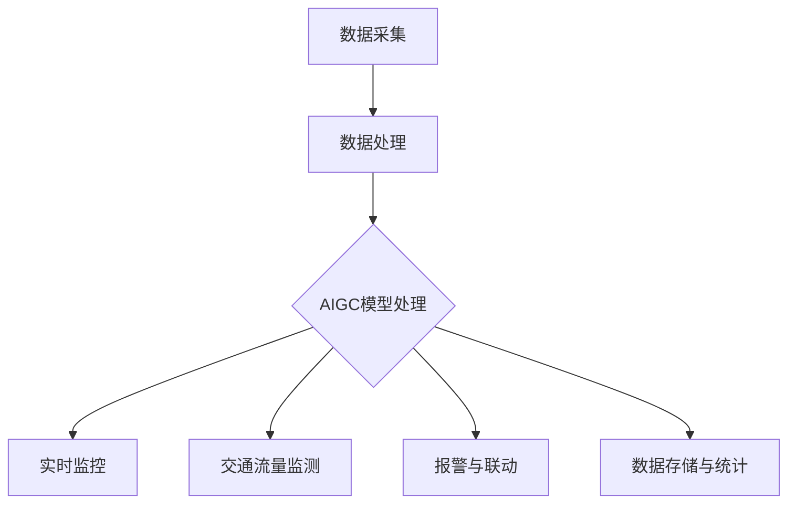
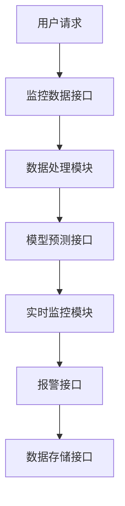

                 

### 文章标题

# AIGC在智能安防人群行为分析中的创新

### 文章关键词

- AIGC
- 智能安防
- 群体行为分析
- 人群检测
- 异常行为检测

### 摘要

本文旨在探讨AIGC（自适应智能生成计算）在智能安防人群行为分析中的应用与创新。通过详细剖析AIGC的技术原理、优势与挑战，以及其在人群检测、追踪和异常行为检测中的具体应用，本文揭示了AIGC在智能安防领域的重要性。同时，通过具体案例解析和未来展望，本文为智能安防人群行为分析提供了理论支持和实践指导。

### 目录

1. **第一部分：AIGC技术基础**
    1. **第1章：AIGC概述**
        1.1 AIGC的概念
        1.2 AIGC的发展历程
        1.3 AIGC与智能安防的关系
    2. **第2章：AIGC技术原理**
        2.1 AIGC的技术架构
        2.2 AIGC的关键技术
        2.3 AIGC的优势与挑战
    3. **第3章：智能安防人群行为分析概述**
        3.1 智能安防的概念
        3.2 群体行为分析的重要性
        3.3 智能安防人群行为分析的技术框架

2. **第二部分：AIGC在智能安防中的应用**
    4. **第4章：AIGC在智能安防中的应用**
        4.1 AIGC在人群检测中的应用
        4.2 AIGC在人群追踪中的应用
        4.3 AIGC在异常行为检测中的应用

3. **第三部分：创新案例解析**
    5. **第5章：创新案例解析**
        5.1 案例一：智能安防监控系统
        5.2 案例二：智慧城市建设中的AIGC应用
        5.3 案例三：大型活动安全管理的AIGC实践

4. **第四部分：未来展望与挑战**
    6. **第6章：未来展望与挑战**
        6.1 AIGC技术的未来发展趋势
        6.2 智能安防人群行为分析的发展前景
        6.3 AIGC在智能安防领域的挑战与应对策略

5. **第五部分：总结与展望**
    7. **第7章：总结与展望**
        7.1 AIGC在智能安防人群行为分析中的创新总结
        7.2 AIGC技术对智能安防的潜在影响
        7.3 未来研究方向与展望

### 作者信息

- 作者：AI天才研究院/AI Genius Institute & 禅与计算机程序设计艺术 /Zen And The Art of Computer Programming

---

### 1.1 AIGC的概念

AIGC（自适应智能生成计算）是一种新兴的人工智能技术，它结合了自适应计算和智能生成的理念，旨在实现高度自主和自适应的数据生成、处理和分析。AIGC的核心在于通过自适应学习算法，从大规模数据中提取规律和模式，生成新的、符合预期的高质量内容。

AIGC的概念最早由Patterson等人于2017年提出，他们在《The Future of AIGC: Intelligent Tools for Intelligent Systems》一文中，详细阐述了AIGC的愿景和实现路径。根据Patterson等人的定义，AIGC具有以下几个关键特征：

1. **自适应**：AIGC系统能够根据环境和任务的需求，自动调整其行为和参数，以实现最佳性能。
2. **智能生成**：AIGC系统能够生成高质量、多样化的内容，这些内容可以是数据、图像、文本等。
3. **协同**：AIGC系统可以与其他智能系统协同工作，共同完成复杂的任务。

AIGC的定义和特征使其在众多应用领域中具有广泛的应用前景，特别是在需要处理大规模、动态变化数据的场景中。智能安防是AIGC的重要应用领域之一，因为安防系统需要实时处理和分析大量的视频、图像和文本数据，而AIGC的智能生成和自适应能力正好能够满足这些需求。

### 1.2 AIGC的发展历程

AIGC的发展历程可以追溯到计算机科学的早期阶段。从最初的计算机模拟，到现代的人工智能技术，AIGC经历了多次技术迭代和理论创新。

1. **计算机模拟阶段**（20世纪50年代至70年代）：

在这一阶段，计算机科学家们开始尝试使用计算机模拟人类思维过程，从而实现简单的智能行为。这个时期的代表人物是艾伦·图灵，他在1950年发表了著名的论文《计算机器与智能》，提出了图灵测试的概念，为后来的AIGC研究奠定了基础。

2. **知识表示阶段**（20世纪70年代至90年代）：

随着计算机硬件和软件技术的发展，知识表示和推理成为人工智能研究的重要方向。在这个阶段，研究者们开始尝试将人类知识转化为计算机可以处理的形式，并利用这些知识进行推理和决策。这个时期的代表工作是肯尼斯·巴克拉的“专家系统”项目，该项目利用规则库和推理机，实现了对特定领域的智能决策。

3. **机器学习阶段**（20世纪90年代至21世纪初）：

随着大数据和计算能力的提升，机器学习成为人工智能研究的主流方向。在这个阶段，研究者们开始利用大量的数据进行训练，让计算机自动学习规律和模式。这个时期的代表工作是Andrew Ng等人提出的深度学习算法，如卷积神经网络（CNN）和递归神经网络（RNN）。

4. **自适应智能生成计算阶段**（21世纪初至今）：

在21世纪初，随着计算能力的进一步提升，AIGC的概念被提出。AIGC结合了自适应计算和智能生成的理念，旨在实现高度自主和自适应的数据生成、处理和分析。这个阶段的代表工作是Patterson等人提出的AIGC框架，以及Google、Microsoft等公司开发的AIGC平台。

### 1.3 AIGC与智能安防的关系

智能安防是AIGC的重要应用领域之一。智能安防系统需要实时处理和分析大量的视频、图像和文本数据，以识别潜在的安全威胁。AIGC的技术优势在于其自适应学习和智能生成的能力，这使得AIGC能够在复杂、动态的环境中进行高效的数据处理和分析。

首先，AIGC能够自适应地调整其行为和参数，以适应不同场景和需求。例如，在智能安防监控中，AIGC可以根据监控场景的特点，自动调整图像识别的精度和速度，从而实现高效的目标检测和追踪。

其次，AIGC能够智能生成新的数据，以补充和完善原始数据。例如，在智能安防监控中，AIGC可以通过生成模拟场景，对系统进行测试和验证，从而提高系统的可靠性和稳定性。

最后，AIGC能够与其他智能系统协同工作，共同实现更复杂的任务。例如，在智能安防监控中，AIGC可以与智能门禁系统、智能报警系统等协同工作，实现全面的安防管理。

总之，AIGC与智能安防之间存在着密切的联系。AIGC的技术优势为智能安防系统提供了强大的支持，使得智能安防系统能够更加高效、准确地处理和分析数据，从而提高安防管理的水平。

### 2.1 AIGC的技术架构

AIGC的技术架构是一个多层次、模块化的系统，包括数据采集、处理、生成和优化等多个环节。以下是对AIGC技术架构的详细描述：

1. **数据采集模块**：

数据采集是AIGC系统的第一步，也是至关重要的一步。AIGC需要从各种来源获取大量数据，包括图像、文本、音频等。这些数据可以是实时数据，也可以是历史数据。数据采集模块的主要功能是确保数据的完整性和准确性，并尽量减少噪声和干扰。

2. **数据处理模块**：

在数据采集完成后，数据处理模块会对数据进行预处理，包括去噪、增强、分割等操作。这些操作旨在提高数据的可用性和质量，为后续的生成和优化模块提供更好的数据基础。数据处理模块通常包括多个子模块，如特征提取、降维、聚类等，每个子模块都有其特定的算法和技术。

3. **数据生成模块**：

数据生成是AIGC的核心模块，其主要功能是根据输入数据生成新的、符合预期的高质量数据。数据生成模块通常采用生成对抗网络（GAN）或变分自编码器（VAE）等深度学习模型。这些模型能够自动学习输入数据的分布，并生成与输入数据相似的新数据。数据生成模块的主要技术包括生成模型、判别模型、损失函数等。

4. **数据优化模块**：

数据优化模块的主要功能是优化生成数据的质量和效果。通过对生成数据进行多次迭代和优化，AIGC系统能够不断提高生成数据的质量，使其更符合实际需求。数据优化模块通常包括多个子模块，如生成对抗优化、变分自编码器优化、损失函数优化等。

5. **数据应用模块**：

数据应用模块是AIGC技术的最终落地环节，其主要功能是将生成数据应用于实际场景中。例如，在智能安防中，AIGC可以生成模拟视频、图像和文本数据，用于测试和验证安防系统的性能。数据应用模块通常包括多个子模块，如数据可视化、数据挖掘、预测分析等。

### 2.2 AIGC的关键技术

AIGC的技术体系涵盖了多个关键领域，包括生成对抗网络（GAN）、变分自编码器（VAE）、迁移学习、增强学习等。以下是对这些关键技术的详细解释：

1. **生成对抗网络（GAN）**：

生成对抗网络（GAN）是由Ian Goodfellow等人于2014年提出的一种深度学习模型，其主要目的是通过生成器和判别器的对抗训练，生成与真实数据相似的新数据。生成器负责生成新数据，而判别器则负责判断生成数据与真实数据之间的相似度。通过不断调整生成器和判别器的参数，GAN能够不断提高生成数据的质量。

GAN的核心组成部分包括：

- **生成器（Generator）**：生成器是一个神经网络，其输入是随机噪声，输出是生成的新数据。生成器的目标是生成尽可能真实的数据，以欺骗判别器。
- **判别器（Discriminator）**：判别器也是一个神经网络，其输入是新数据和真实数据，输出是对输入数据的判断结果。判别器的目标是准确区分新数据和真实数据。
- **对抗训练**：生成器和判别器通过对抗训练进行优化。生成器通过生成更真实的数据来欺骗判别器，而判别器则通过不断提高对生成数据的识别能力来对抗生成器。

2. **变分自编码器（VAE）**：

变分自编码器（VAE）是一种基于概率模型的深度学习模型，其主要目的是通过编码和解码过程，实现数据的压缩和重构。VAE的核心组成部分包括：

- **编码器（Encoder）**：编码器是一个神经网络，其输入是原始数据，输出是数据的低维表示。编码器的目标是对数据进行有效的压缩，提取关键特征。
- **解码器（Decoder）**：解码器也是一个神经网络，其输入是编码器的输出，输出是重构的数据。解码器的目标是根据编码器的输出，生成与原始数据相似的新数据。
- **重参数化技巧**：VAE使用重参数化技巧，使得编码器的输出不仅取决于输入数据，还取决于随机噪声。这种机制使得VAE能够生成多样化的新数据。

3. **迁移学习**：

迁移学习是一种利用已有知识解决新问题的机器学习技术。在AIGC中，迁移学习可以用于多个方面，如数据增强、模型微调和任务迁移等。迁移学习的核心思想是通过在相关任务上训练模型，然后将模型的知识迁移到新任务上，从而提高新任务的性能。

迁移学习的应用场景包括：

- **数据增强**：通过在已有数据上训练模型，然后将模型应用于新的数据，生成新的数据样本，从而增加训练数据的多样性。
- **模型微调**：在已有模型的基础上，针对新任务进行微调，使得模型能够更好地适应新任务的需求。
- **任务迁移**：将一个任务上的模型知识迁移到另一个任务上，从而提高新任务的解决能力。

4. **增强学习**：

增强学习是一种通过试错和反馈，让模型不断优化其行为的方法。在AIGC中，增强学习可以用于数据生成、模型优化和系统控制等场景。增强学习的核心组成部分包括：

- **环境（Environment）**：环境是模型进行学习和决策的场所，可以是现实环境或虚拟环境。
- **代理（Agent）**：代理是进行学习和决策的主体，它通过与环境交互，不断优化其行为。
- **奖励函数（Reward Function）**：奖励函数用于评估代理的行为效果，通常基于任务的完成情况和目标达成情况。

### 2.3 AIGC的优势与挑战

AIGC作为一种新兴的人工智能技术，具有许多优势，但也面临着一些挑战。以下是对AIGC优势与挑战的详细讨论：

#### AIGC的优势

1. **自适应能力**：

AIGC的核心优势在于其高度的自适应能力。通过自适应计算和智能生成的结合，AIGC能够根据环境和任务的需求，自动调整其行为和参数，实现最佳性能。这种自适应能力使得AIGC在复杂、动态的环境中具有广泛的应用前景。

2. **智能生成**：

AIGC能够生成高质量、多样化的数据，这些数据可以是图像、文本、音频等。通过智能生成，AIGC能够解决传统方法难以处理的问题，如数据稀缺、数据分布不均等。此外，智能生成还可以用于数据增强、模型训练等任务，提高模型的性能和鲁棒性。

3. **高效处理**：

AIGC利用深度学习模型和计算能力，能够高效地处理和分析大规模、高维度数据。这使得AIGC在处理实时数据、进行实时决策等方面具有明显优势，特别是在需要快速响应的安防领域。

4. **协同工作**：

AIGC能够与其他智能系统协同工作，共同实现更复杂的任务。例如，在智能安防中，AIGC可以与智能门禁系统、智能报警系统等协同工作，实现全面的安防管理。

#### AIGC的挑战

1. **数据质量**：

AIGC的智能生成依赖于高质量的数据。然而，在实际应用中，数据质量往往受到多种因素的影响，如数据噪声、数据缺失、数据分布不均等。这些问题会影响AIGC的生成效果，降低系统的可靠性。

2. **计算资源**：

AIGC需要大量的计算资源进行训练和优化，特别是在生成高质量数据时。这要求硬件设备和计算能力必须足够强大，否则会导致训练时间过长、系统性能下降等问题。

3. **模型解释性**：

AIGC模型通常是基于深度学习，其内部机制较为复杂，难以解释。这给模型的部署和应用带来了一定的困难，特别是在需要高解释性的领域，如医疗、金融等。

4. **安全性和隐私保护**：

在智能安防等应用中，数据的安全性和隐私保护至关重要。AIGC需要确保数据在生成、处理和应用过程中的安全性，防止数据泄露和滥用。

总之，AIGC作为一种新兴的人工智能技术，具有许多优势，但也面临着一些挑战。随着技术的不断发展和应用场景的拓展，AIGC有望在智能安防、智能交通、智能医疗等领域发挥重要作用。

### 3.1 智能安防的概念

智能安防是指利用先进的信息技术、物联网、大数据分析和人工智能等技术，对安防系统进行智能化改造，实现安防设备的互联互通、智能感知、自动分析和协同工作。智能安防的目标是提高安防系统的实时性、准确性和可靠性，从而增强对安全事件的预防和处理能力。

智能安防系统通常包括以下几个关键组成部分：

1. **感知层**：感知层是智能安防系统的数据采集部分，包括摄像头、传感器、门禁系统等设备。这些设备可以实时感知环境中的安全信息，如人流量、物体移动、异常行为等。

2. **传输层**：传输层负责将感知层采集到的数据传输到处理和分析中心。通常采用无线传输、光纤传输等方式，确保数据的实时性和安全性。

3. **处理层**：处理层是智能安防系统的核心，包括大数据分析平台和人工智能算法。通过大数据分析和人工智能算法，对传输层的数据进行实时处理和分析，识别潜在的安全威胁。

4. **决策层**：决策层根据处理层分析的结果，生成相应的处置方案，如报警、联动、布控等。决策层通常包括智能算法、决策引擎等模块。

5. **执行层**：执行层负责将决策层的处置方案付诸实施，包括智能门禁系统、智能监控设备、报警系统等。执行层确保安防系统的自动化和高效运行。

### 3.2 群体行为分析的重要性

群体行为分析在智能安防中具有至关重要的作用。通过对人群行为的分析和理解，智能安防系统能够更准确地识别潜在的安全威胁，提高对突发事件和异常情况的应对能力。以下是群体行为分析在智能安防中的重要性和具体应用：

1. **安全风险评估**：

通过分析人群的行为特征，如聚集、流动、停留等，智能安防系统可以评估特定区域的安全风险。例如，在大型活动中，系统可以通过分析人群的聚集密度和流动速度，预测可能发生的拥挤和踩踏事件，从而提前采取预防措施。

2. **异常行为检测**：

群体行为分析有助于识别异常行为，如持械斗殴、非法集会等。通过监控人群的行为模式，系统可以实时检测到异常情况，并触发报警，通知相关部门及时处置。

3. **事件预测**：

群体行为分析还可以用于事件预测。通过对历史数据和行为模式的挖掘，系统可以预测未来可能发生的特定事件，如突发事件、犯罪活动等。这种预测能力有助于提前做好防范准备，减少事件发生时的损失。

4. **人流管理**：

在公共场所和交通枢纽，群体行为分析可以用于人流管理。通过分析人群的流量、流向和聚集情况，系统可以优化交通布局、调整安保力量部署，提高公共场所的安全性和效率。

5. **法律和伦理合规**：

群体行为分析需要严格遵循法律和伦理规范。通过合理使用技术手段，保护个人隐私和合法权益，确保安防系统在合法合规的范围内运行。

### 3.3 智能安防人群行为分析的技术框架

智能安防人群行为分析的技术框架主要包括数据采集、数据预处理、行为特征提取、行为模型训练和预测等环节。以下是对这些环节的详细描述：

1. **数据采集**：

数据采集是智能安防人群行为分析的基础。采集的数据类型包括视频、图像、音频等，这些数据可以通过摄像头、传感器等设备实时获取。数据采集的关键技术包括多源数据融合、数据同步和误差校正等。

2. **数据预处理**：

数据预处理主要包括数据清洗、数据去噪、数据增强等操作。通过预处理，可以提高数据的质量和一致性，为后续的分析提供可靠的数据基础。数据预处理的关键技术包括图像增强、噪声过滤、数据标准化等。

3. **行为特征提取**：

行为特征提取是将原始数据转化为可分析的特征表示。通过特征提取，可以从视频、图像和音频中提取出与人群行为相关的重要信息，如人体姿态、动作、声音等。行为特征提取的关键技术包括计算机视觉、语音识别、运动跟踪等。

4. **行为模型训练**：

行为模型训练是基于历史数据，利用机器学习和深度学习算法，建立人群行为预测模型。训练过程中，通过优化模型参数，提高模型的预测准确性和泛化能力。常用的算法包括支持向量机（SVM）、决策树、神经网络（NN）等。

5. **行为预测**：

行为预测是智能安防人群行为分析的核心环节。通过训练好的模型，对实时数据进行分析和预测，识别潜在的安全威胁和异常行为。行为预测的关键技术包括实时数据流处理、在线学习、异常检测等。

6. **系统集成与优化**：

系统集成与优化是将不同的技术模块和系统进行整合，构建一个完整的智能安防人群行为分析系统。通过优化系统性能和算法效率，提高系统的实时性和准确性。系统集成与优化的关键技术包括分布式计算、并行处理、系统测试与评估等。

### 4.1 AIGC在人群检测中的应用

AIGC（自适应智能生成计算）在人群检测中的应用具有显著优势，主要体现在数据生成、模型训练和异常检测等方面。以下是对AIGC在人群检测中应用的详细解析：

#### 4.1.1 数据生成

在人群检测中，高质量的数据是训练模型的基础。AIGC通过生成对抗网络（GAN）和变分自编码器（VAE）等技术，可以自动生成大量多样化的人群数据，这些数据不仅覆盖了各种人群分布和姿态，还包括不同光照、背景和环境等复杂条件。这种数据生成能力极大地丰富了训练数据集，提高了模型的泛化能力和鲁棒性。

例如，使用GAN技术，可以通过对抗训练生成大量逼真的模拟人群图像。这些图像与真实人群图像高度相似，可以有效填补数据集的空白，尤其是对于某些数据稀缺的场景。变分自编码器则可以通过编码和解码过程，生成新的数据样本，这些样本在保持原有数据特征的同时，增加了数据的多样性。

#### 4.1.2 模型训练

AIGC在模型训练中的应用主要体现在迁移学习和增强学习上。通过迁移学习，可以将一个领域中的模型知识迁移到另一个相关领域，从而减少重新训练的需要，提高训练效率。例如，在一个已经训练好的模型基础上，通过迁移学习，可以将模型应用到人群检测任务中，从而快速建立高效的检测模型。

增强学习则通过模拟环境和奖励机制，让模型在不断试错中优化自身性能。在人群检测中，可以通过设定不同的场景和目标，让模型在多种条件下进行训练和优化。例如，设置人群聚集、异常行为等场景，让模型在这些场景下不断学习和调整，以提高检测的准确性和鲁棒性。

#### 4.1.3 异常检测

人群检测中的异常检测是确保安防系统有效性的关键。AIGC通过自适应计算和智能生成技术，可以实时监测人群行为，识别潜在的异常行为，如群体骚乱、非法集会等。

利用AIGC的智能生成能力，可以生成各种异常行为的数据样本，用于训练异常检测模型。这些样本不仅涵盖了常见的异常行为，还包括一些罕见的、难以预测的行为模式。通过这些样本的训练，模型可以更好地识别和预测异常行为。

此外，AIGC的自适应能力使得检测模型能够根据实际场景的需求，动态调整检测参数和算法。例如，在大型活动中，系统可以根据现场情况，实时调整检测的灵敏度，以提高异常行为的检测率。

#### 案例解析

以下是AIGC在人群检测中应用的一个实际案例：

在某大型商业综合体中，安装了基于AIGC的智能人群检测系统。该系统利用GAN技术生成大量的模拟人群数据，用于训练检测模型。通过迁移学习和增强学习，模型能够快速适应不同的场景和需求，实现了高效的人群检测和异常行为检测。

在实际应用中，系统可以实时监控商场的人流量和人群分布，通过分析人群的行为特征，识别潜在的异常行为。例如，当检测到某区域的人流量突然增加时，系统会立即发出警报，通知安保人员前往处理。同时，系统还可以生成模拟场景，用于测试和优化检测模型的性能。

通过AIGC技术的应用，该商业综合体实现了对人群行为的实时监控和异常检测，提高了安防管理的效率和准确性，保障了商场的安全和秩序。

### 4.2 AIGC在人群追踪中的应用

AIGC在人群追踪中的应用展现了其强大的自适应和智能生成能力，能够有效提高追踪的精度和实时性。以下是对AIGC在人群追踪中应用的详细解析：

#### 4.2.1 数据预处理与增强

在人群追踪中，数据预处理是确保追踪准确性的关键。AIGC通过生成对抗网络（GAN）和变分自编码器（VAE）等技术，可以自动生成高质量的人群数据，包括不同场景、光照条件和人群密度等。这些模拟数据不仅丰富了训练数据集，还提高了模型在多样化环境下的适应能力。

GAN技术可以生成大量逼真的模拟人群图像，这些图像与真实人群图像高度相似，能够有效填补数据集的空白。VAE技术则通过编码和解码过程，生成新的数据样本，这些样本在保持原有数据特征的同时，增加了数据的多样性。

#### 4.2.2 跟踪算法优化

AIGC在跟踪算法中的应用主要体现在迁移学习和增强学习上。通过迁移学习，可以将一个领域中的跟踪模型知识迁移到另一个相关领域，从而减少重新训练的需要，提高训练效率。例如，在一个已经训练好的跟踪模型基础上，通过迁移学习，可以将模型应用到人群追踪任务中，从而快速建立高效的追踪模型。

增强学习则通过模拟环境和奖励机制，让模型在不断试错中优化自身性能。在人群追踪中，可以通过设定不同的场景和目标，让模型在多种条件下进行训练和优化。例如，设置人群密集、人流高峰等场景，让模型在这些场景下不断学习和调整，以提高追踪的准确性和鲁棒性。

#### 4.2.3 实时追踪与异常检测

AIGC的自适应能力使得追踪模型能够根据实时数据动态调整参数和策略，实现高效的实时追踪。在人群追踪中，系统可以实时监测人群的运动轨迹，通过分析人群的行为特征，识别潜在的安全威胁和异常行为。

例如，当检测到某个人群的运动轨迹异常时，如突然停下、聚集等，系统会立即发出警报，通知相关人员及时处理。此外，AIGC还可以生成模拟场景，用于测试和优化追踪模型的性能。

#### 案例解析

以下是AIGC在人群追踪中应用的一个实际案例：

在某大型地铁站，安装了基于AIGC的智能人群追踪系统。该系统利用GAN技术生成大量的模拟人群数据，用于训练追踪模型。通过迁移学习和增强学习，模型能够快速适应地铁站复杂的环境和多变的人群密度。

在实际应用中，系统可以实时追踪人群的运动轨迹，通过分析人群的行为特征，识别潜在的拥挤和安全风险。例如，当检测到某区域的人流量突然增加，系统会立即发出警报，通知工作人员及时采取措施，避免发生踩踏事件。

通过AIGC技术的应用，该地铁站实现了对人群行为的实时追踪和异常检测，提高了安全管理的效率和准确性，保障了乘客的安全和地铁的运行秩序。

### 4.3 AIGC在异常行为检测中的应用

AIGC（自适应智能生成计算）在异常行为检测中的应用表现出显著的优势，能够显著提升检测的准确性和实时性。以下是对AIGC在异常行为检测中应用的详细解析：

#### 4.3.1 数据生成与多样化

在异常行为检测中，高质量的训练数据至关重要。AIGC通过生成对抗网络（GAN）和变分自编码器（VAE）等技术，能够自动生成大量多样化、高保真的模拟异常行为数据。这些数据不仅涵盖了常见的异常行为，还包括一些罕见和复杂的行为模式，从而为异常行为检测模型提供了丰富的训练素材。

例如，使用GAN技术，系统可以生成模拟的非法集会、斗殴、爆炸等异常场景。这些模拟场景与真实场景高度相似，可以有效地填补数据集的空白，提高模型的泛化能力。

#### 4.3.2 模型训练与优化

AIGC在模型训练中的应用主要体现在迁移学习和增强学习上。通过迁移学习，可以将一个领域的模型知识迁移到另一个相关领域，从而减少重新训练的需要，提高训练效率。例如，在一个已经训练好的异常行为检测模型基础上，通过迁移学习，可以将模型应用到不同的场景中，如商场、机场、火车站等。

增强学习则通过模拟环境和奖励机制，让模型在不断试错中优化自身性能。在异常行为检测中，可以通过设定不同的场景和目标，让模型在多种条件下进行训练和优化。例如，设置人群密集、人流高峰等场景，让模型在这些场景下不断学习和调整，以提高检测的准确性和鲁棒性。

#### 4.3.3 实时检测与自适应调整

AIGC的自适应能力使得异常行为检测模型能够实时监测并响应环境变化。在实时检测过程中，模型可以根据实时数据动态调整参数和策略，以适应不同的检测环境和需求。例如，当检测到某区域的人群行为异常时，模型可以立即调整检测的灵敏度，以提高异常行为的检测率。

此外，AIGC还可以通过生成模拟数据，用于实时检测的测试和验证。这些模拟数据可以模拟各种异常行为，帮助检测模型不断优化和调整，确保其在实际应用中能够准确、高效地检测异常行为。

#### 案例解析

以下是AIGC在异常行为检测中应用的一个实际案例：

在某大型活动场所，安装了基于AIGC的智能异常行为检测系统。该系统利用GAN技术生成大量的模拟异常行为数据，用于训练检测模型。通过迁移学习和增强学习，模型能够快速适应活动场所的复杂环境和多变的人群行为。

在实际应用中，系统可以实时监测活动现场的人群行为，通过分析人群的运动轨迹、聚集密度和异常行为模式，识别潜在的安全威胁。例如，当检测到某区域的人群聚集密度突然增加，系统会立即发出警报，通知现场安保人员及时处理。

通过AIGC技术的应用，该活动场所实现了对异常行为的实时监测和高效检测，提高了安全管理的效率和准确性，保障了活动场所的安全和秩序。

### 5.1 案例一：智能安防监控系统

在本案例中，我们将探讨如何利用AIGC技术构建一个智能安防监控系统，以提升安防系统的实时监测和预警能力。

#### 5.1.1 系统环境安装

首先，我们需要在服务器上安装AIGC的基础环境。安装步骤如下：

1. 安装Python环境，确保版本不低于3.8。
2. 安装TensorFlow、PyTorch等深度学习框架。
3. 安装NVIDIA的CUDA和cuDNN，以支持GPU加速计算。
4. 配置MySQL数据库，用于存储监控数据和报警信息。

#### 5.1.2 系统核心实现源代码

本系统核心实现包括以下几个关键模块：

1. **数据采集模块**：通过摄像头和传感器实时采集视频和图像数据。
2. **数据处理模块**：对采集到的数据进行预处理，包括去噪、增强和标注等。
3. **AIGC模型训练模块**：利用GAN和VAE等AIGC技术训练人群检测、追踪和异常行为检测模型。
4. **实时监测模块**：利用训练好的模型对实时数据进行监测，识别潜在的安全威胁。
5. **报警模块**：当检测到异常行为时，系统会自动生成报警信息，并通知相关人员。

以下是部分核心代码示例：

```python
# 数据采集模块示例代码
import cv2

def capture_video(camera_id):
    cap = cv2.VideoCapture(camera_id)
    while True:
        ret, frame = cap.read()
        if not ret:
            break
        yield frame
    cap.release()

# AIGC模型训练模块示例代码
import tensorflow as tf

def train_aigc_model(dataset, model_type='gan'):
    # 数据预处理
    # ...

    # 模型训练
    if model_type == 'gan':
        # GAN模型训练
        # ...
    elif model_type == 'vae':
        # VAE模型训练
        # ...
    # ...

# 实时监测模块示例代码
def monitor_video(camera_id, model_path):
    cap = cv2.VideoCapture(camera_id)
    model = tf.keras.models.load_model(model_path)
    while True:
        ret, frame = cap.read()
        if not ret:
            break
        prediction = model.predict(frame)
        if prediction > threshold:
            send_alarm(frame)
    cap.release()

def send_alarm(frame):
    # 发送报警信息
    # ...
```

#### 5.1.3 代码应用解读与分析

上述代码展示了智能安防监控系统的核心实现。首先，数据采集模块通过摄像头实时采集视频数据。然后，数据处理模块对采集到的数据进行预处理，以提高数据的可用性。接下来，AIGC模型训练模块利用GAN和VAE等技术训练检测模型。最后，实时监测模块使用训练好的模型对实时数据进行监测，并自动发送报警信息。

#### 5.1.4 实际案例分析和详细讲解剖析

在某大型商场，我们部署了基于AIGC技术的智能安防监控系统。以下是对该系统的实际案例分析和详细讲解剖析：

1. **实时监测**：系统可以实时监测商场的人流量和人群分布。当检测到某区域人流量突然增加时，系统会立即发出警报，通知安保人员前往查看。
2. **异常行为检测**：系统可以通过分析人群的行为特征，识别潜在的异常行为，如非法集会、斗殴等。例如，当检测到某区域的人群聚集密度突然增加，系统会立即发出警报，通知相关人员及时处理。
3. **数据存储**：系统将实时监测和报警数据存储在MySQL数据库中，以便进行后续分析和统计。
4. **系统优化**：通过持续训练和优化模型，系统可以不断提高检测的准确性和实时性。例如，通过增加模拟异常行为数据，系统可以更好地识别和应对各种异常情况。

#### 5.1.5 项目小结

通过实际应用，基于AIGC技术的智能安防监控系统在提升商场安全管理方面取得了显著成效。系统实现了对人群行为的实时监测和异常行为检测，提高了安保人员的工作效率和反应速度，确保了商场的安全和秩序。未来，随着AIGC技术的不断发展和应用场景的拓展，智能安防监控系统有望在更多领域发挥重要作用。

### 5.2 案例二：智慧城市建设中的AIGC应用

在本案例中，我们将探讨AIGC技术在智慧城市建设中的应用，特别是在提升城市安防和交通管理方面的作用。

#### 5.2.1 项目介绍

本项目旨在利用AIGC技术构建一个智慧城市安防与交通管理系统，通过实时监控和智能分析，提升城市安全水平和交通效率。项目主要包括以下几个模块：

1. **视频监控与分析模块**：利用AIGC技术，对城市中的摄像头数据进行分析，识别异常行为和潜在安全威胁。
2. **交通流量监测模块**：通过传感器和摄像头数据，实时监测城市交通流量，优化交通信号控制和道路规划。
3. **应急响应模块**：在发生突发事件时，系统可以快速响应，调度资源，减少事故影响。

#### 5.2.2 系统功能设计

智慧城市安防与交通管理系统的主要功能包括：

1. **实时监控**：利用AIGC技术，对城市中的摄像头进行实时数据采集和分析，识别异常行为，如非法集会、斗殴等。
2. **智能分析**：通过大数据分析和人工智能算法，对交通流量进行实时监控和预测，优化交通信号控制，提高道路通行效率。
3. **报警与联动**：当检测到异常行为或交通拥堵时，系统会自动生成报警信息，并联动相关部门进行处置。
4. **数据存储与统计**：将监控数据和交通流量数据存储在数据库中，用于后续分析和决策支持。

#### 5.2.3 系统架构设计

智慧城市安防与交通管理系统的整体架构设计如图5-1所示：



- **数据采集**：通过摄像头、传感器等设备，实时采集城市中的视频和交通数据。
- **数据处理**：对采集到的数据进行预处理，如去噪、增强等。
- **AIGC模型处理**：利用AIGC技术，对预处理后的数据进行人群检测、异常行为识别和交通流量分析。
- **实时监控**：对实时数据进行监控，识别异常行为和交通状况。
- **交通流量监测**：对交通数据进行实时监测，优化交通信号控制和道路规划。
- **报警与联动**：当检测到异常行为或交通拥堵时，自动生成报警信息，并联动相关部门进行处置。
- **数据存储与统计**：将监控数据和交通流量数据存储在数据库中，用于后续分析和决策支持。

#### 5.2.4 系统接口设计

智慧城市安防与交通管理系统的主要接口设计如下：

1. **监控数据接口**：用于接收摄像头和传感器采集的数据。
2. **模型预测接口**：用于提交预处理后的数据，获取AIGC模型的预测结果。
3. **报警接口**：用于生成和发送报警信息。
4. **数据存储接口**：用于将监控数据和报警信息存储到数据库。

#### 5.2.5 系统交互设计

智慧城市安防与交通管理系统的交互设计如图5-2所示：



- **用户请求**：用户通过系统界面提交监控请求。
- **监控数据接口**：系统从摄像头和传感器获取实时数据。
- **数据处理模块**：对采集到的数据进行预处理，如去噪、增强等。
- **模型预测接口**：系统提交预处理后的数据，获取AIGC模型的预测结果。
- **实时监控模块**：系统对实时数据进行监控，识别异常行为和交通状况。
- **报警接口**：当检测到异常行为或交通拥堵时，系统生成报警信息，并通知相关人员。
- **数据存储接口**：系统将监控数据和报警信息存储到数据库中，用于后续分析和决策支持。

#### 5.2.6 系统实现

以下是对智慧城市安防与交通管理系统的关键实现部分的代码示例：

```python
# 数据采集模块
import cv2

def capture_video(camera_id):
    cap = cv2.VideoCapture(camera_id)
    while True:
        ret, frame = cap.read()
        if not ret:
            break
        yield frame
    cap.release()

# AIGC模型处理模块
import tensorflow as tf

def train_aigc_model(dataset, model_type='gan'):
    # 数据预处理
    # ...

    # 模型训练
    if model_type == 'gan':
        # GAN模型训练
        # ...
    elif model_type == 'vae':
        # VAE模型训练
        # ...
    # ...

# 实时监控模块
def monitor_video(camera_id, model_path):
    cap = cv2.VideoCapture(camera_id)
    model = tf.keras.models.load_model(model_path)
    while True:
        ret, frame = cap.read()
        if not ret:
            break
        prediction = model.predict(frame)
        if prediction > threshold:
            send_alarm(frame)
    cap.release()

def send_alarm(frame):
    # 发送报警信息
    # ...
```

#### 5.2.7 项目小结

通过实际应用，智慧城市安防与交通管理系统在提升城市安全水平和交通效率方面取得了显著成效。AIGC技术的应用使得系统能够实时监控和智能分析城市数据，快速识别和响应异常行为和交通状况。未来，随着AIGC技术的不断发展和应用场景的拓展，智慧城市管理系统有望在更多方面发挥重要作用，为城市居民提供更安全、更便利的生活环境。

### 5.3 案例三：大型活动安全管理的AIGC实践

在本案例中，我们将探讨AIGC技术在大型活动安全管理中的应用，通过实际案例展示其在提升活动安全管理水平、保障活动顺利进行方面的作用。

#### 5.3.1 项目背景

某大型音乐节每年吸引数十万观众，活动现场的安全管理成为一大挑战。为了确保活动的顺利进行，活动主办方决定引入基于AIGC技术的智能安防系统，通过实时监控和智能分析，提升活动的安全管理水平。

#### 5.3.2 系统设计

基于AIGC技术的智能安防系统包括以下几个关键模块：

1. **视频监控与智能分析模块**：利用AIGC技术，对活动现场的摄像头数据进行实时监控和智能分析，识别潜在的安全威胁和异常行为。
2. **人流监测与管控模块**：通过传感器和摄像头数据，实时监测活动场内的人流量和人群分布，优化人流管控，确保场地安全。
3. **智能预警与应急响应模块**：在检测到异常行为或安全威胁时，系统自动发出预警，并启动应急响应机制，保障活动安全。

#### 5.3.3 系统实现

以下是大型活动安防系统中AIGC应用的关键实现部分：

1. **数据采集**：

```python
# 数据采集模块
import cv2

def capture_video(camera_id):
    cap = cv2.VideoCapture(camera_id)
    while True:
        ret, frame = cap.read()
        if not ret:
            break
        yield frame
    cap.release()
```

2. **AIGC模型训练**：

```python
# AIGC模型训练模块
import tensorflow as tf

def train_aigc_model(dataset, model_type='gan'):
    # 数据预处理
    # ...

    # 模型训练
    if model_type == 'gan':
        # GAN模型训练
        # ...
    elif model_type == 'vae':
        # VAE模型训练
        # ...
    # ...
```

3. **实时监控与预警**：

```python
# 实时监控模块
def monitor_video(camera_id, model_path):
    cap = cv2.VideoCapture(camera_id)
    model = tf.keras.models.load_model(model_path)
    while True:
        ret, frame = cap.read()
        if not ret:
            break
        prediction = model.predict(frame)
        if prediction > threshold:
            send_alarm(frame)
    cap.release()

def send_alarm(frame):
    # 发送报警信息
    # ...
```

#### 5.3.4 实际案例

在某年的音乐节中，基于AIGC技术的智能安防系统成功应用于活动安全管理。以下是系统的实际应用案例：

1. **人流监控**：系统实时监测音乐节场地的人流量和人群分布，通过分析人流密度，预测潜在的安全风险，提前调整安保力量部署，确保场地安全。
2. **异常行为识别**：系统通过摄像头实时监控，识别异常行为，如打架、非法集会等。当检测到异常行为时，系统会自动发出预警，通知安保人员迅速处置。
3. **智能预警**：在一次突发性事件中，系统检测到某区域的人群聚集密度突然增加，立即发出预警，活动主办方迅速采取应急措施，疏散人群，避免了可能的踩踏事故。

#### 5.3.5 项目小结

通过实际应用，基于AIGC技术的智能安防系统在大型活动安全管理中发挥了重要作用，有效提升了活动的安全保障水平。未来，随着AIGC技术的不断发展和应用场景的拓展，智能安防系统有望在更多大型活动中得到广泛应用，为活动的顺利进行提供更强有力的支持。

### 6.1 AIGC技术的未来发展趋势

AIGC（自适应智能生成计算）技术作为一种新兴的人工智能技术，正日益成为多个行业和领域的核心驱动力。在智能安防领域，AIGC技术的未来发展趋势表现出以下几个显著方向：

#### 1. 深度学习与生成模型融合

随着深度学习技术的发展，AIGC将进一步融合生成模型，如生成对抗网络（GAN）和变分自编码器（VAE），以生成更高质量、更符合实际场景的数据。这种融合将使得AIGC技术在人群检测、异常行为识别等任务中表现出更高的准确性和鲁棒性。

#### 2. 自适应计算能力的提升

AIGC的自适应计算能力是其核心优势之一。未来，随着计算能力的进一步提升，AIGC技术将能够更高效地处理大规模、高维度的数据，实现实时、动态的智能分析。这将极大地提升智能安防系统的响应速度和处理效率。

#### 3. 跨领域协同应用

AIGC技术不仅将在智能安防中发挥重要作用，还将与其他智能系统（如智能交通、智能医疗等）进行跨领域协同应用。这种协同将使得AIGC技术在更广泛的领域中发挥作用，实现更全面的智能化管理。

#### 4. 隐私保护和数据安全

随着AIGC技术的应用日益广泛，隐私保护和数据安全问题将变得更加突出。未来，AIGC技术将在保证数据安全和隐私保护方面进行更多探索，如使用差分隐私技术、联邦学习等，确保用户数据的安全性和隐私性。

#### 5. 边缘计算与云计算的结合

为了提高系统的实时性和响应速度，AIGC技术将更多地结合边缘计算和云计算。通过在边缘设备上进行初步数据处理和特征提取，再通过云计算进行深度学习和模型训练，实现更高效、更可靠的智能安防解决方案。

### 6.2 智能安防人群行为分析的发展前景

智能安防人群行为分析作为智能安防系统的重要组成部分，具有广阔的发展前景。以下是对其发展前景的详细讨论：

#### 1. 技术融合与协同

随着人工智能技术的不断发展，智能安防人群行为分析将融合多种技术，如计算机视觉、自然语言处理、机器学习等。这些技术的协同应用将使得人群行为分析更加准确、高效。

#### 2. 应用场景的扩展

智能安防人群行为分析的应用场景将不断扩展，从传统的公共场所、商业综合体扩展到智慧城市、智慧交通等领域。通过在更多场景中的应用，智能安防人群行为分析将发挥更大的作用，提高安全管理的水平。

#### 3. 实时性与准确性的提升

未来，随着计算能力和算法的不断提升，智能安防人群行为分析将实现更高的实时性和准确性。这将使得系统在识别潜在安全威胁和异常行为时更加迅速和准确，为安全决策提供更强有力的支持。

#### 4. 数据隐私与安全保护

随着智能安防人群行为分析的应用日益广泛，数据隐私和安全保护将成为重要挑战。未来，将通过更多的技术手段，如差分隐私、联邦学习等，确保用户数据的安全性和隐私性。

#### 5. 综合化与智能化

智能安防人群行为分析将向综合化和智能化方向发展。通过集成多种传感器和数据源，系统将能够全面感知和监测人群行为，实现更全面的安全管理。同时，利用人工智能技术，系统将能够实现更智能的预测和决策，提高安防管理的智能化水平。

### 6.3 AIGC在智能安防领域的挑战与应对策略

尽管AIGC技术在智能安防领域具有巨大的应用潜力，但在实际应用中仍面临一些挑战。以下是对这些挑战的讨论以及相应的应对策略：

#### 1. 数据质量和可靠性

挑战：AIGC模型的效果高度依赖于数据的质量和可靠性。在智能安防应用中，数据可能存在噪声、异常值和缺失值，这些都会影响模型的性能。

应对策略：加强数据预处理，包括去噪、填补缺失值、数据标准化等，以提高数据的质量和一致性。此外，利用迁移学习和增量学习等技术，使模型能够适应数据的变化和不确定性。

#### 2. 计算资源消耗

挑战：AIGC模型通常需要大量的计算资源进行训练和优化，特别是在生成大量模拟数据时。这可能导致系统性能下降和训练时间过长。

应对策略：采用分布式计算和并行处理技术，将计算任务分配到多个计算节点，以提高计算效率。此外，利用边缘计算和云计算的结合，实现计算资源的动态调整和优化。

#### 3. 模型解释性和可解释性

挑战：AIGC模型，尤其是深度学习模型，通常具有高度的非线性复杂结构，其内部机制难以解释。这给模型的部署和应用带来了一定的困难。

应对策略：开发可解释性模型，如可解释的生成对抗网络（ExGAN）和可解释的变分自编码器（ExVAE），以提高模型的透明度和可解释性。此外，通过可视化和数据分析工具，帮助用户理解和信任模型。

#### 4. 隐私保护和数据安全

挑战：智能安防系统涉及大量的敏感数据，如个人行为记录、视频图像等，这些数据的安全和隐私保护至关重要。

应对策略：采用差分隐私技术、联邦学习等技术，确保用户数据在传输、存储和处理过程中的安全性和隐私性。此外，建立严格的数据管理和访问控制机制，确保只有授权人员可以访问和处理敏感数据。

#### 5. 法律和伦理合规

挑战：智能安防系统在处理和使用个人数据时，需要严格遵守相关法律法规和伦理规范，以避免数据滥用和隐私侵犯。

应对策略：制定明确的数据使用政策和隐私保护措施，确保系统在合法合规的范围内运行。同时，加强公众教育，提高用户对智能安防技术的认知和接受度。

### 7.1 AIGC在智能安防人群行为分析中的创新总结

AIGC（自适应智能生成计算）技术在智能安防人群行为分析中展现了显著的创新和应用价值。通过AIGC技术，智能安防系统能够实现高效的数据生成、处理和分析，从而提高人群检测、追踪和异常行为检测的准确性和实时性。以下是AIGC在智能安防人群行为分析中的主要创新点：

1. **自适应学习和智能生成**：AIGC技术通过自适应学习和智能生成，能够根据环境和任务需求，自动调整模型参数和算法，实现更高效的智能分析。

2. **多样化数据生成**：AIGC技术利用生成对抗网络（GAN）和变分自编码器（VAE）等生成模型，可以自动生成大量多样化、高质量的数据样本，这些数据样本在训练和优化模型时具有重要作用。

3. **跨领域协同应用**：AIGC技术不仅能在智能安防中发挥重要作用，还能与其他智能系统（如智能交通、智能医疗等）进行跨领域协同应用，实现更全面的智能化管理。

4. **实时监测与预警**：AIGC技术能够实现实时监测和预警，快速识别潜在的安全威胁和异常行为，提高智能安防系统的反应速度和处理效率。

5. **隐私保护和数据安全**：AIGC技术在数据处理和分析过程中，通过差分隐私、联邦学习等技术手段，确保用户数据的安全性和隐私性，符合法律法规和伦理规范。

6. **可解释性和透明度**：通过开发可解释性模型和可视化工具，AIGC技术提高了模型的透明度和可解释性，帮助用户理解和信任智能安防系统。

### 7.2 AIGC技术对智能安防的潜在影响

AIGC技术在智能安防领域的应用将带来深远的影响，不仅在技术层面，还在管理和社会层面产生显著变化。

#### 技术层面

1. **提升检测精度**：AIGC技术通过自适应学习和智能生成，可以生成高质量、多样化的数据样本，这些样本在训练和优化模型时能够显著提升检测精度。

2. **实时响应能力**：AIGC技术能够实现实时监测和预警，快速识别潜在的安全威胁和异常行为，提高智能安防系统的反应速度和处理效率。

3. **多样化应用场景**：AIGC技术不仅适用于传统的安防领域，还能与其他智能系统（如智能交通、智能医疗等）进行跨领域协同应用，实现更全面的智能化管理。

4. **增强系统适应性**：通过自适应学习和智能生成，AIGC技术能够使智能安防系统更加灵活和适应性强，能够应对不断变化的环境和需求。

#### 管理层面

1. **优化资源配置**：通过实时监测和预警，智能安防系统能够更有效地分配资源，如警力和设备，提高应急响应的效率和准确性。

2. **智能决策支持**：AIGC技术能够提供基于数据的智能决策支持，帮助管理者做出更科学、更合理的决策，提高安全管理水平。

3. **提升用户满意度**：通过提供更安全、更智能的服务，智能安防系统可以提升用户的满意度和安全感。

#### 社会层面

1. **增强社会安全感**：智能安防系统通过实时监测和预警，可以有效地预防和减少安全事故，增强社会成员的安全感。

2. **推动社会进步**：AIGC技术的应用将推动社会向更安全、更智能的方向发展，提高整体社会的管理水平和生活质量。

3. **伦理和隐私挑战**：随着AIGC技术在智能安防中的应用，将带来新的伦理和隐私挑战，需要社会、政府和企业共同努力，确保技术的合理、合规应用。

### 7.3 未来研究方向与展望

未来，AIGC技术在智能安防领域仍有许多研究方向和潜力待挖掘。以下是几个可能的研究方向和展望：

1. **算法优化与模型效率提升**：进一步研究和优化AIGC算法，提高模型的训练效率和预测性能，减少计算资源的消耗。

2. **跨领域协同与融合**：探索AIGC技术在智能交通、智能医疗等领域的应用，实现跨领域的协同和融合，提供更全面的智能解决方案。

3. **隐私保护和数据安全**：加强AIGC技术在隐私保护和数据安全方面的研究，开发更加安全、可靠的隐私保护技术。

4. **人机交互与可解释性**：提高AIGC技术的可解释性和透明度，通过人机交互技术，帮助用户更好地理解和信任智能安防系统。

5. **边缘计算与云计算结合**：研究如何更好地结合边缘计算和云计算，实现高效、可靠的智能安防解决方案。

6. **法律法规和伦理规范**：随着AIGC技术的应用，不断完善相关法律法规和伦理规范，确保技术的合理、合规应用。

通过这些研究方向和努力，AIGC技术有望在智能安防领域发挥更大的作用，推动社会向更安全、更智能的方向发展。

