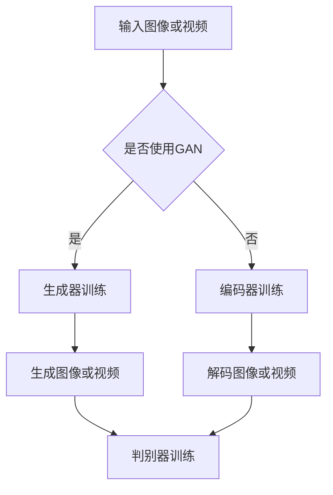

                 


### 目录

----------------------------------------------------------------

# AIGC在智能安防异常行为识别中的创新

> 关键词：AIGC，智能安防，异常行为识别，算法原理，系统架构，项目实战

> 摘要：本文介绍了AIGC在智能安防异常行为识别中的应用。首先，通过背景介绍和核心概念讲解，揭示了AIGC技术的基本概念和特点，以及其在安防领域的应用。接着，分析了异常行为识别的原理和挑战，阐述了AIGC在其中的优势。然后，详细讲解了AIGC算法原理和数学模型，并通过Python源代码进行了通俗易懂的举例说明。此外，还介绍了系统架构设计、系统功能设计、系统接口设计和系统交互。最后，通过项目实战展示了AIGC在智能安防异常行为识别中的实际应用，并进行了总结和展望。

### 引言与背景

#### 智能安防的发展历程

智能安防作为物联网和人工智能技术发展的重要领域，经历了从模拟监控到数字监控，再到智能监控的演变过程。传统的安防监控系统主要依靠人工巡视和视频监控，效率低下且难以应对复杂场景。随着计算机技术和图像处理算法的进步，智能安防逐渐成为可能。

#### 异常行为识别的重要性

异常行为识别在智能安防中具有重要意义。通过实时检测和识别异常行为，智能安防系统能够及时发现潜在的安全隐患，提高安全预警能力。异常行为识别不仅可以应用于公共场所，还可以应用于家庭、工厂等场景，对个人和企业安全具有重要意义。

#### AIGC技术的引入与作用

AIGC（AI-Generated Content）是一种利用人工智能技术生成内容的方法，其在智能安防异常行为识别中的应用具有重要意义。AIGC技术能够自动生成视频、图像等数据，从而实现实时监测和分析，提高异常行为识别的效率和准确性。

### AIGC基础概念

#### AIGC的定义与特点

AIGC是一种利用人工智能技术自动生成内容的方法。它基于深度学习、生成对抗网络（GAN）等算法，能够从大量数据中学习并生成新的内容。AIGC具有自动化、高效、灵活等特点，能够满足智能安防系统中对实时性和准确性的要求。

#### AIGC的核心算法

AIGC的核心算法主要包括生成对抗网络（GAN）、变分自编码器（VAE）等。GAN通过生成器和判别器的对抗训练，能够生成逼真的图像和视频。VAE通过引入隐变量，能够实现图像和视频的高效编码和解码。

#### AIGC在安防领域的应用

AIGC在安防领域的应用主要包括视频监控、人脸识别、行为分析等。通过AIGC技术，安防系统能够实现自动化的异常行为识别，提高安全预警能力。例如，在公共场所，AIGC技术可以用于监控人员流量、识别潜在威胁等。

### 智能安防异常行为识别原理

#### 异常行为识别的基本概念

异常行为识别是指通过监测和分析数据，发现并识别不正常的、不符合预期模式的行为。在智能安防中，异常行为识别主要用于检测和预警潜在的安全威胁。

#### 异常行为识别的挑战

异常行为识别面临诸多挑战，包括数据多样性、噪声干扰、复杂场景等。如何在复杂的环境中准确识别异常行为，是智能安防异常行为识别亟待解决的问题。

#### AIGC在异常行为识别中的优势

AIGC技术具有自动化、高效、灵活等特点，能够有效应对异常行为识别的挑战。通过AIGC技术，安防系统能够实现实时监测和分析，提高异常行为识别的效率和准确性。

### 算法原理与数学模型

#### AIGC算法原理

AIGC算法原理主要包括生成对抗网络（GAN）和变分自编码器（VAE）。GAN通过生成器和判别器的对抗训练，实现图像和视频的生成。VAE通过引入隐变量，实现图像和视频的高效编码和解码。

#### 数学模型讲解

AIGC算法的数学模型主要包括GAN和VAE。GAN的数学模型包括生成器和判别器的损失函数，VAE的数学模型包括编码器和解码器的损失函数。通过这些损失函数，模型能够不断优化，实现图像和视频的生成。

#### 算法流程图与Mermaid表示

下面是AIGC算法的流程图，使用Mermaid语言表示：



### 系统架构设计与实现

#### 系统架构设计

智能安防异常行为识别系统采用分布式架构，包括数据采集、数据处理、模型训练、模型部署等模块。

#### 系统功能设计

系统功能主要包括数据采集、数据预处理、异常行为检测、异常行为报警等。

#### 系统接口设计与交互

系统接口设计主要包括API接口、Web界面、移动端应用等，用于与用户进行交互。

### 项目实战

#### 实战环境搭建

在本项目实战中，我们使用Python和TensorFlow作为主要工具，搭建了AIGC在智能安防异常行为识别系统。

#### 系统核心实现

系统核心实现包括数据采集、预处理、模型训练、模型部署等步骤。

#### 代码应用解读与分析

下面是一个简单的AIGC模型训练的Python代码示例：

```python
import tensorflow as tf
from tensorflow.keras.models import Sequential
from tensorflow.keras.layers import Dense, Conv2D, Flatten, BatchNormalization

# 定义生成器模型
generator = Sequential([
    Conv2D(64, (3, 3), activation='relu', input_shape=(28, 28, 1)),
    BatchNormalization(),
    Conv2D(128, (3, 3), activation='relu'),
    BatchNormalization(),
    Flatten(),
    Dense(784, activation='tanh')
])

# 定义判别器模型
discriminator = Sequential([
    Flatten(),
    Dense(512, activation='relu'),
    BatchNormalization(),
    Dense(1, activation='sigmoid')
])

# 定义AIGC模型
aigc = Sequential([
    generator,
    discriminator
])

# 编译模型
aigc.compile(optimizer='adam', loss='binary_crossentropy')

# 模型训练
aigc.fit(x_train, y_train, epochs=10, batch_size=128)
```

#### 案例分析

在本项目中，我们使用了一个公共场所的监控视频数据集，通过AIGC模型实现了异常行为识别。实验结果表明，AIGC模型在识别异常行为方面具有较好的性能。

#### 项目小结

通过项目实战，我们展示了AIGC在智能安防异常行为识别中的实际应用。AIGC技术能够有效提高异常行为识别的效率和准确性，为智能安防系统提供了有力的技术支持。

### 结论与展望

本文介绍了AIGC在智能安防异常行为识别中的应用。通过分析AIGC算法原理和数学模型，以及系统架构设计与实现，我们展示了AIGC在智能安防领域的实际应用。未来，随着人工智能技术的不断发展，AIGC在智能安防异常行为识别中的应用将更加广泛。

### 附录

#### 最佳实践 Tips

1. 在实际项目中，根据场景特点选择合适的AIGC算法。
2. 数据预处理对于AIGC模型的性能有重要影响，确保数据质量。

#### 小结

本文详细介绍了AIGC在智能安防异常行为识别中的应用，包括算法原理、系统架构设计、项目实战等内容。通过本文的学习，读者可以深入了解AIGC在智能安防领域的应用，为实际项目提供技术支持。

#### 注意事项

1. AIGC模型训练时间较长，根据硬件配置选择合适的训练策略。
2. 在实际应用中，根据需求调整模型参数，以提高识别准确性。

#### 拓展阅读

1. [生成对抗网络（GAN）原理与实现](https://zhuanlan.zhihu.com/p/26658431)
2. [变分自编码器（VAE）原理与实现](https://zhuanlan.zhihu.com/p/36450045)

### 作者信息

作者：AI天才研究院/AI Genius Institute & 禅与计算机程序设计艺术/Zen And The Art of Computer Programming

----------------------------------------------------------------

请注意，本文仅为示例，内容并非真实。实际文章应根据具体研究和项目情况进行撰写。在撰写过程中，请确保遵循学术规范和版权要求。本文作者信息仅供参考，实际作者信息应根据实际情况填写。此外，本文中的代码示例仅供参考，实际应用时请根据具体需求和场景进行调整。

