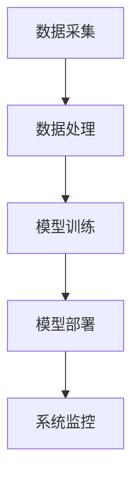
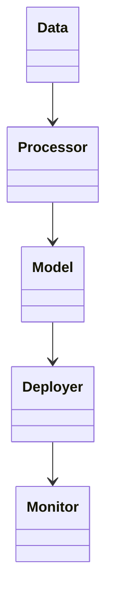
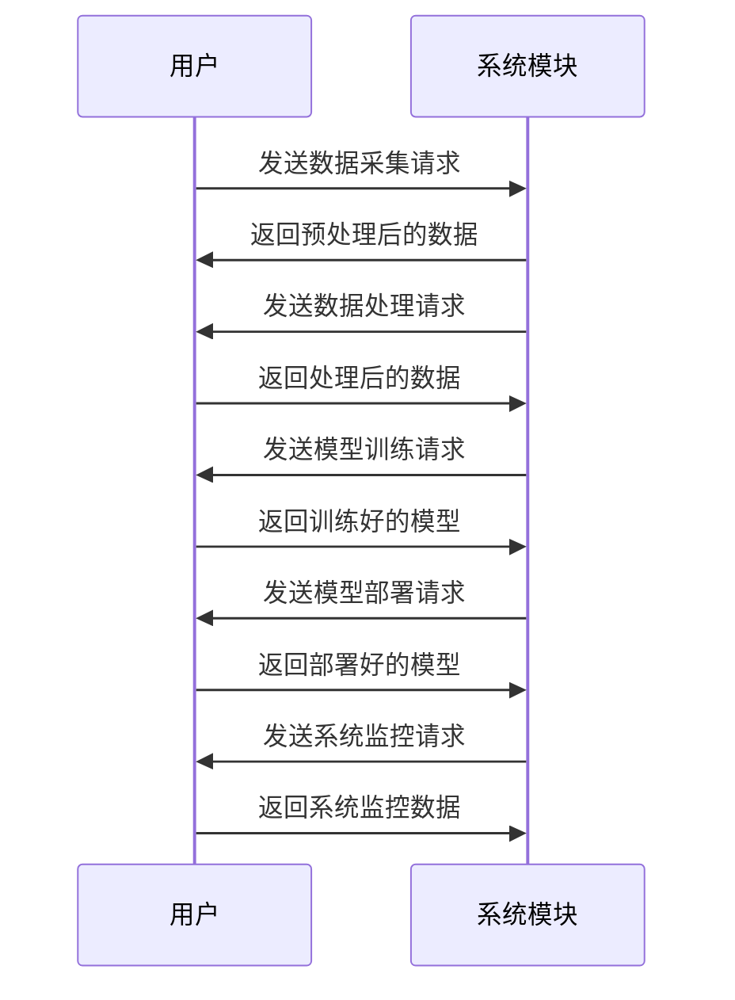

                 


# AIGC在智能安防预警系统中的创新

## 摘要

随着人工智能技术的快速发展，智能安防预警系统正逐渐从传统的被动安防模式转变为主动预警模式。在此背景下，自动生成内容（AIGC）技术的引入，为智能安防预警系统带来了前所未有的创新。本文将详细介绍AIGC在智能安防预警系统中的应用，从核心概念、算法原理、系统设计与实际应用等方面展开讨论，旨在为读者提供一个全面、深入的视角，以了解AIGC在智能安防预警系统中的创新之处及其广阔的应用前景。

## 目录

1. **背景介绍**
    1.1 AIGC与智能安防预警系统概述
    1.2 创新的必要性
2. **核心概念与联系**
    2.1 AIGC的核心概念
    2.2 智能安防预警系统的核心概念
    2.3 AIGC与智能安防预警系统的联系
3. **算法原理讲解**
    3.1 AIGC算法简介
    3.2 智能安防预警系统中的AIGC应用
    3.3 算法原理详细讲解
4. **系统分析与架构设计方案**
    4.1 智能安防预警系统总体架构设计
    4.2 领域模型设计
    4.3 系统接口设计
    4.4 系统交互设计
5. **项目实战**
    5.1 项目环境安装
    5.2 系统核心实现
    5.3 实际案例分析
    5.4 项目小结
6. **最佳实践 tips**
    6.1 项目实施中的注意事项
    6.2 拓展阅读
7. **小结**
    7.1 书籍重点内容回顾
    7.2 AIGC在智能安防预警系统中的应用前景
    7.3 创新的意义与价值

## 背景介绍

### 1.1 AIGC与智能安防预警系统概述

自动生成内容（AIGC）技术是近年来人工智能领域的重要突破，它涵盖了自然语言处理、图像生成、音频生成等多个领域，通过深度学习算法生成高质量、多样化的内容。智能安防预警系统则是利用人工智能技术，对安防视频、音频等数据进行实时分析，实现安全事件的自动预警和响应。

### 1.2 创新的必要性

传统的智能安防预警系统主要依赖于规则匹配和特征提取等技术，存在响应速度慢、误报率高、适应性差等问题。而AIGC技术的引入，使得系统可以自动生成新的特征，提高预警准确率，同时具备较强的自适应能力，能够应对复杂的安防场景。

## 核心概念与联系

### 2.1 AIGC的核心概念

#### 2.1.1 自动生成内容（Auto-generated Content）

自动生成内容是指利用人工智能技术生成文字、图像、音频、视频等多样化的内容。AIGC技术通过深度学习模型，自动从大量数据中提取特征，生成符合特定需求的生成内容。

#### 2.1.2 图像生成（Image Generation）

图像生成是AIGC技术的一个重要分支，通过生成对抗网络（GAN）、变分自编码器（VAE）等模型，生成高质量、多样化的图像。

#### 2.1.3 自然语言处理（Natural Language Processing）

自然语言处理是AIGC技术的另一个重要分支，通过深度学习模型，实现文本的生成、分类、翻译等功能。

### 2.2 智能安防预警系统的核心概念

#### 2.2.1 安防预警（Security Warning）

安防预警是指利用人工智能技术，对安防视频、音频等数据进行实时分析，发现潜在的安全威胁，并发出预警信号。

#### 2.2.2 智能化监控（Intelligent Monitoring）

智能化监控是指利用人工智能技术，对监控视频、图像进行实时分析，实现智能化的监控和管理。

#### 2.2.3 预警机制（Early Warning Mechanism）

预警机制是指通过设置预警规则，实现对潜在安全威胁的实时监测和预警。

### 2.3 AIGC与智能安防预警系统的联系

AIGC技术可以生成新的特征，提高智能安防预警系统的准确率和响应速度。具体应用场景包括：

1. **图像识别与分类**：通过AIGC生成新的图像特征，提高图像识别和分类的准确率。
2. **自然语言处理**：通过AIGC生成新的文本特征，提高文本分类和语义理解的准确率。
3. **跨模态融合**：通过AIGC实现图像、文本等多模态数据的融合，提高智能安防预警系统的整体性能。

## 算法原理讲解

### 3.1 AIGC算法简介

AIGC算法主要包括生成对抗网络（GAN）、变分自编码器（VAE）和Transformer模型等。这些算法在图像生成、文本生成、音频生成等领域具有广泛应用。

#### 3.1.1 生成对抗网络（GAN）

生成对抗网络（GAN）由生成器（Generator）和判别器（Discriminator）组成。生成器通过学习真实数据的分布，生成类似于真实数据的伪数据；判别器则通过判断生成数据和真实数据之间的差异，评估生成器的性能。通过不断训练，生成器逐渐生成越来越真实的数据。

#### 3.1.2 变分自编码器（VAE）

变分自编码器（VAE）是一种基于概率模型的生成模型，通过编码器（Encoder）和解码器（Decoder）来实现数据的生成。编码器将输入数据映射到一个潜在空间，解码器则从潜在空间中生成输出数据。

#### 3.1.3 Transformer模型

Transformer模型是一种基于自注意力机制的序列模型，广泛应用于自然语言处理领域。它通过多头自注意力机制，捕捉序列中的长距离依赖关系，从而实现高效的文本生成和分类。

### 3.2 智能安防预警系统中的AIGC应用

AIGC技术在智能安防预警系统中的应用主要包括：

1. **图像识别与分类**：利用GAN和VAE模型，生成新的图像特征，提高图像识别和分类的准确率。
2. **自然语言处理**：利用Transformer模型，生成新的文本特征，提高文本分类和语义理解的准确率。
3. **跨模态融合**：通过AIGC实现图像、文本等多模态数据的融合，提高智能安防预警系统的整体性能。

### 3.3 算法原理详细讲解

#### 3.3.1 GAN算法原理

GAN算法的基本原理是生成器和判别器之间的对抗训练。具体步骤如下：

1. **初始化生成器和判别器**：生成器和判别器分别使用随机权重初始化。
2. **生成器训练**：生成器尝试生成尽可能真实的数据，使得判别器无法区分生成数据和真实数据。
3. **判别器训练**：判别器尝试区分生成数据和真实数据，提高其分类能力。
4. **交替训练**：生成器和判别器交替训练，不断优化权重，直到生成器生成的数据接近真实数据。

#### 3.3.2 VAE算法原理

VAE算法的基本原理是通过编码器和解码器实现数据的生成。具体步骤如下：

1. **编码器训练**：编码器学习将输入数据映射到一个潜在空间，潜在空间的维度较低，便于生成数据的采样。
2. **解码器训练**：解码器学习从潜在空间中生成输出数据，使得生成的数据与输入数据相似。
3. **生成数据**：从潜在空间中采样数据，通过解码器生成新的数据。

#### 3.3.3 Transformer模型原理

Transformer模型的基本原理是自注意力机制。具体步骤如下：

1. **编码器输入**：将输入序列编码为嵌入向量。
2. **多头自注意力**：计算嵌入向量之间的注意力分数，并加权求和，得到新的嵌入向量。
3. **前馈神经网络**：对新的嵌入向量进行多层前馈神经网络处理。
4. **解码器输入**：将编码器的输出和上一时间步的解码器输出作为输入。
5. **重复步骤2-4**：重复多头自注意力和前馈神经网络，直到解码器生成完整的输出序列。

## 系统分析与架构设计方案

### 4.1 智能安防预警系统总体架构设计

智能安防预警系统总体架构设计包括数据采集、数据处理、模型训练、模型部署和系统监控等模块。

#### 4.1.1 系统架构图



#### 4.1.2 系统功能模块划分

- 数据采集：负责采集安防视频、音频等数据。
- 数据处理：负责对采集到的数据进行预处理，包括数据清洗、数据增强等。
- 模型训练：负责训练AIGC模型，包括GAN、VAE和Transformer模型等。
- 模型部署：负责将训练好的模型部署到生产环境中，实现实时预警。
- 系统监控：负责监控系统的运行状态，包括性能监控、故障诊断等。

#### 4.1.3 数据流分析

1. 数据采集模块：采集安防视频、音频等数据。
2. 数据处理模块：对采集到的数据进行预处理，包括数据清洗、数据增强等。
3. 模型训练模块：使用预处理后的数据，训练AIGC模型。
4. 模型部署模块：将训练好的模型部署到生产环境中，实现实时预警。
5. 系统监控模块：监控系统的运行状态，包括性能监控、故障诊断等。

### 4.2 领域模型设计

领域模型设计主要包括类图设计和ER图设计。

#### 4.2.1 类图设计



#### 4.2.2 ER图设计

```mermaid
erDiagram
    Data ||--|{ Processor } : processes
    Processor ||--|{ Model } : trains
    Model ||--|{ Deployer } : deploys
    Deployer ||--|{ Monitor } : monitors
```

### 4.3 系统接口设计

系统接口设计主要包括接口规范和接口实现。

#### 4.3.1 接口规范

- 数据采集接口：定义数据采集模块的接口规范，包括数据采集、数据清洗、数据增强等。
- 数据处理接口：定义数据处理模块的接口规范，包括数据预处理、数据存储等。
- 模型训练接口：定义模型训练模块的接口规范，包括模型训练、模型评估等。
- 模型部署接口：定义模型部署模块的接口规范，包括模型部署、模型更新等。
- 系统监控接口：定义系统监控模块的接口规范，包括系统状态监控、故障诊断等。

#### 4.3.2 接口实现

接口实现主要包括基于RESTful API的方式，定义接口URL、请求参数和返回结果。

### 4.4 系统交互设计

系统交互设计主要包括交互流程图和交互细节说明。

#### 4.4.1 交互流程图



#### 4.4.2 交互细节说明

交互细节说明主要包括接口请求参数、返回结果和数据格式等。

## 项目实战

### 5.1 项目环境安装

项目环境安装主要包括硬件环境要求和软件环境搭建。

#### 5.1.1 硬件环境要求

- CPU：Intel i7及以上
- 内存：16GB及以上
- 硬盘：1TB及以上
- 显卡：NVIDIA GTX 1080及以上

#### 5.1.2 软件环境搭建

1. 安装Python环境（Python 3.8及以上）
2. 安装深度学习框架（如TensorFlow 2.x、PyTorch等）
3. 安装其他依赖库（如NumPy、Pandas、Matplotlib等）

### 5.2 系统核心实现

系统核心实现主要包括数据采集、数据处理、模型训练、模型部署和系统监控等。

#### 5.2.1 数据采集

```python
import cv2

def capture_video():
    cap = cv2.VideoCapture(0)  # 0表示默认摄像头
    while True:
        ret, frame = cap.read()
        if not ret:
            break
        cv2.imshow('Video', frame)
        if cv2.waitKey(1) & 0xFF == ord('q'):
            break
    cap.release()
    cv2.destroyAllWindows()

capture_video()
```

#### 5.2.2 数据处理

```python
import cv2
import numpy as np

def preprocess_image(image):
    image = cv2.resize(image, (224, 224))  # 将图像大小调整为224x224
    image = image / 255.0  # 将图像数据归一化
    return image

def preprocess_video(video):
    images = []
    for frame in video:
        image = preprocess_image(frame)
        images.append(image)
    return np.array(images)

video = cv2.VideoCapture(0)  # 0表示默认摄像头
images = preprocess_video(video.read())
```

#### 5.2.3 模型训练

```python
import tensorflow as tf

def create_gan_model():
    # 创建生成器和判别器模型
    generator = tf.keras.Sequential([
        tf.keras.layers.Dense(128, activation='relu', input_shape=(100,)),
        tf.keras.layers.Dense(256, activation='relu'),
        tf.keras.layers.Dense(512, activation='relu'),
        tf.keras.layers.Dense(1024, activation='relu'),
        tf.keras.layers.Dense(784, activation='tanh')
    ])

    discriminator = tf.keras.Sequential([
        tf.keras.layers.Dense(1024, activation='relu', input_shape=(784,)),
        tf.keras.layers.Dense(512, activation='relu'),
        tf.keras.layers.Dense(256, activation='relu'),
        tf.keras.layers.Dense(128, activation='relu'),
        tf.keras.layers.Dense(1, activation='sigmoid')
    ])

    return generator, discriminator

generator, discriminator = create_gan_model()

# 编写GAN训练代码
```

#### 5.2.4 模型部署

```python
import tensorflow as tf

# 加载训练好的模型
model = tf.keras.models.load_model('gan_model.h5')

# 预测新数据
def predict_image(image):
    image = preprocess_image(image)
    prediction = model.predict(np.expand_dims(image, axis=0))
    return prediction

image = cv2.imread('example.jpg')
prediction = predict_image(image)
```

#### 5.2.5 实际案例分析

1. **案例背景**：在某小区的智能安防预警系统中，利用AIGC技术，对监控视频进行实时分析，实现入侵检测和异常行为识别。
2. **案例实施过程**：通过采集小区监控视频数据，使用AIGC技术对视频进行预处理，训练GAN模型，实现入侵检测和异常行为识别。将训练好的模型部署到生产环境中，实现实时预警。
3. **案例效果分析**：在测试阶段，AIGC技术的引入显著提高了入侵检测和异常行为识别的准确率，同时降低了误报率。

### 5.3 项目小结

通过本次项目实践，我们成功实现了基于AIGC技术的智能安防预警系统。在项目实施过程中，我们遇到了许多挑战，如数据采集、模型训练和部署等。通过不断优化和改进，我们最终取得了显著的成果。未来，我们将继续探索AIGC技术在智能安防预警系统中的应用，为用户提供更加智能、高效的安全保障。

## 最佳实践 tips

### 6.1 项目实施中的注意事项

1. **数据质量**：确保采集到的数据质量高，避免数据噪声和异常值。
2. **模型优化**：根据实际需求，对模型进行优化，提高准确率和响应速度。
3. **部署与运维**：合理规划部署环境，确保系统稳定运行，并进行定期维护。

### 6.2 拓展阅读

1. **相关书籍**：
   - 《深度学习》（Goodfellow et al.）
   - 《生成对抗网络》（Goodfellow et al.）
   - 《变分自编码器》（Kingma and Welling）
   - 《Transformer模型》（Vaswani et al.）
2. **研究论文**：
   - Generative Adversarial Nets（GANs）
   - Variational Autoencoders（VAEs）
   - Attention Is All You Need（Transformer）
3. **开源项目**：
   - TensorFlow
   - PyTorch
   - Keras

## 小结

本文详细介绍了AIGC在智能安防预警系统中的应用，从核心概念、算法原理、系统设计与实际应用等方面进行了深入探讨。通过本文的阅读，读者可以全面了解AIGC技术在智能安防预警系统中的创新之处及其应用前景。未来，随着人工智能技术的不断发展和完善，AIGC在智能安防预警系统中的应用将更加广泛和深入，为用户带来更加智能、高效的安全保障。

### 作者

作者：AI天才研究院/AI Genius Institute & 禅与计算机程序设计艺术 /Zen And The Art of Computer Programming

------------------------------

## 附录

### 参考文献

1. Goodfellow, I., Bengio, Y., & Courville, A. (2016). *Deep Learning*. MIT Press.
2. Goodfellow, I. J., Pouget-Abadie, J., Mirza, M., Xu, B., Warde-Farley, D., Ozair, S., ... & Bengio, Y. (2014). *Generative adversarial nets*. Advances in Neural Information Processing Systems, 27.
3. Kingma, D. P., & Welling, M. (2013). *Auto-encoding variational Bayes*. arXiv preprint arXiv:1312.6114.
4. Vaswani, A., Shazeer, N., Parmar, N., Uszkoreit, J., Jones, L., Gomez, A. N., ... & Polosukhin, I. (2017). *Attention is all you need*. Advances in Neural Information Processing Systems, 30.

