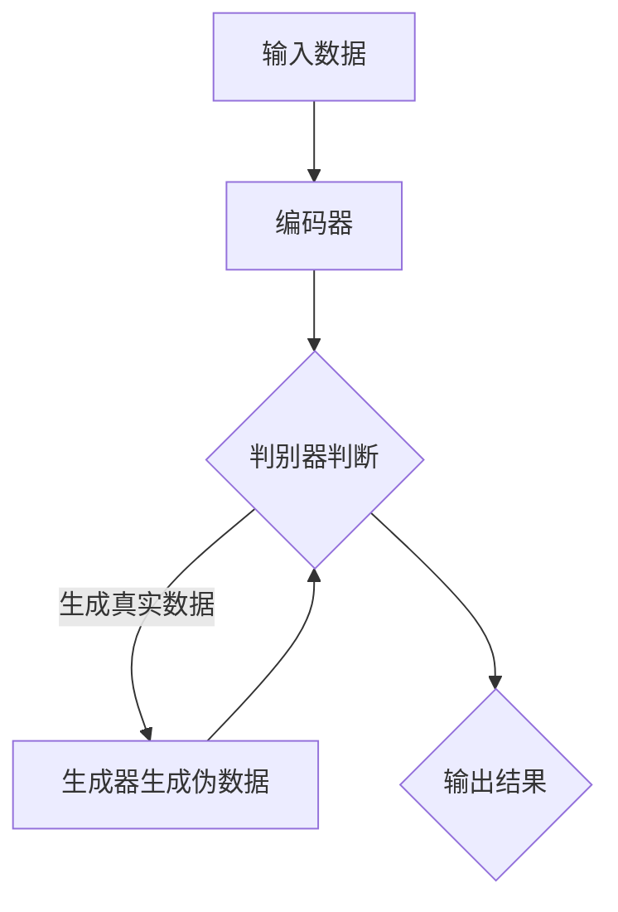
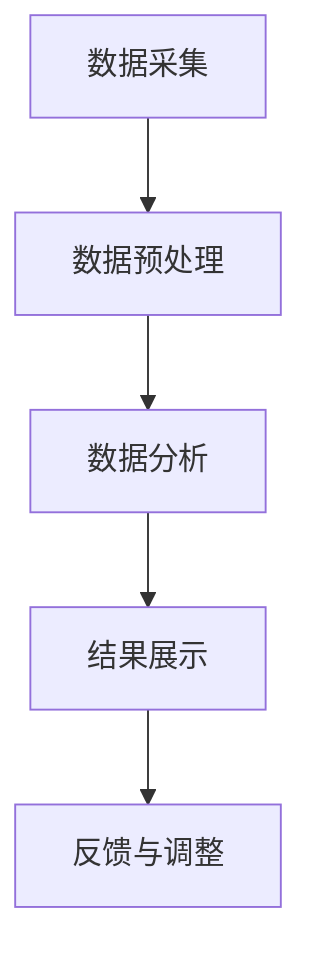
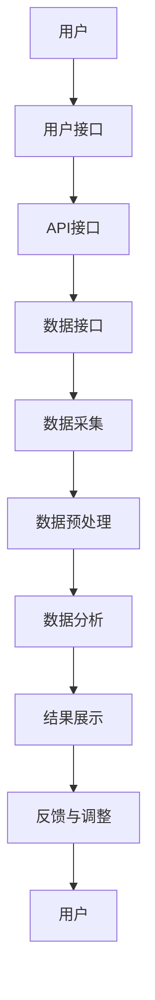

                 

### 引言

随着人工智能技术的飞速发展，AIGC（人工智能生成内容）已成为一个备受关注的研究热点。AIGC技术通过利用人工智能算法，自动生成高质量的内容，广泛应用于文本、图像、音频等多种形式。而智能客户服务质量监控作为企业提升客户满意度和运营效率的重要手段，正面临如何高效、准确地获取和处理大量客户数据的新挑战。本文将深入探讨AIGC在智能客户服务质量监控中的应用，旨在揭示AIGC技术在提升客户服务质量监控方面的潜力与实际应用价值。

AIGC在智能客户服务质量监控中的应用具有以下核心优势：

1. **高效数据收集与处理**：AIGC技术能够快速地从大量客户数据中提取有价值的信息，通过自动化处理，减少人工干预，提高监控效率。
2. **个性化服务**：AIGC能够根据客户的个性化需求生成定制化的服务内容，提供更贴合客户需求的监控方案，提升客户满意度。
3. **实时反馈**：AIGC技术能够实时分析客户反馈，快速响应客户需求，帮助企业及时调整服务策略。
4. **成本优化**：通过自动化处理，减少了人力成本，同时提升了服务质量和效率。

本文将首先介绍AIGC与智能客户服务质量监控的基本概念，阐述其发展的背景和重要性。接着，我们将详细探讨AIGC技术的核心原理和智能客户服务质量监控的关键要素，通过概念属性特征对比表格和ER实体关系图，梳理两者之间的联系和交互。随后，本文将深入讲解AIGC算法原理，结合Python源代码和数学模型，详细阐述算法的实现过程和数学原理。在系统分析与架构设计方案部分，我们将介绍智能客户服务质量监控的应用场景和系统架构设计，包括领域模型、类图、架构图、接口设计和系统交互。接下来，通过项目实战部分，我们将介绍环境安装、核心代码实现和案例分析，展示AIGC技术在智能客户服务质量监控中的实际应用。最后，本文将总结AIGC在智能客户服务质量监控中的应用，提出最佳实践和注意事项，并推荐进一步学习和研究的资料。

### AIGC技术概述

#### 什么是AIGC

AIGC（Artificial Intelligence Generated Content），即人工智能生成内容，是指通过人工智能算法自动生成高质量内容的技术。这些内容可以是文本、图像、音频、视频等多种形式，广泛应用于媒体、教育、娱乐、广告等各个领域。AIGC技术的核心在于利用深度学习、自然语言处理、图像识别等人工智能技术，实现内容的自动化生成和优化。

AIGC的起源可以追溯到人工智能和内容生成领域的交叉点。随着计算能力的提升和算法的进步，人工智能技术逐渐从简单的规则推理发展到能够模拟人类思维和数据处理的复杂过程。特别是深度学习技术的突破，使得生成模型能够从海量数据中学习和提取特征，生成具有高度相关性和创意性的内容。这种能力的提升，为AIGC技术的应用奠定了基础。

AIGC技术的发展历程可以分为几个重要阶段：

1. **初步探索阶段**：在20世纪80年代末到90年代初，研究人员开始探索利用人工智能技术生成文本、图像等内容的可能性。这一阶段的代表性工作是自然语言生成（NLG）和图像生成技术的初步尝试。
2. **快速发展阶段**：21世纪初，随着深度学习技术的兴起，生成对抗网络（GAN）、变分自编码器（VAE）等新型生成模型被提出，使得AIGC技术取得了显著的进展。特别是在图像和文本生成领域，AIGC技术开始展现出强大的潜力。
3. **广泛应用阶段**：近年来，随着计算资源和算法模型的不断优化，AIGC技术逐渐应用于实际场景，如自动写作、智能客服、个性化推荐等，成为人工智能领域的重要分支。

#### AIGC的核心技术

AIGC技术涉及多个核心领域，包括自然语言处理（NLP）、计算机视觉（CV）、深度学习等。以下是对这些核心技术的简要介绍：

1. **自然语言处理（NLP）**：NLP是使计算机能够理解、处理和生成人类语言的技术。在AIGC中，NLP技术用于处理文本生成、文本分类、情感分析等任务。常见的NLP模型包括循环神经网络（RNN）、长短期记忆网络（LSTM）、Transformer等。

2. **计算机视觉（CV）**：CV技术使计算机能够识别和理解图像和视频中的内容。在AIGC中，CV技术用于图像生成、图像分类、目标检测等任务。常用的CV模型包括卷积神经网络（CNN）、生成对抗网络（GAN）、自编码器（AE）等。

3. **深度学习**：深度学习是AIGC技术的基础，通过多层神经网络模拟人类大脑的决策过程，实现自动特征提取和复杂任务的完成。深度学习模型包括卷积神经网络（CNN）、循环神经网络（RNN）、生成对抗网络（GAN）等。

#### AIGC的应用场景

AIGC技术在多个领域展现出广阔的应用前景，以下是一些典型的应用场景：

1. **文本生成**：自动写作、新闻摘要、机器翻译、聊天机器人等。通过AIGC技术，可以生成高质量的文本内容，满足不同场景的需求。

2. **图像生成**：艺术创作、广告设计、虚拟现实、增强现实等。AIGC技术可以生成逼真的图像，提高创意设计的效率和质量。

3. **音频生成**：音乐创作、语音合成、声音效果制作等。通过AIGC技术，可以自动生成各种类型的音频内容，满足个性化需求。

4. **视频生成**：视频剪辑、视频游戏、虚拟直播等。AIGC技术可以自动生成视频内容，降低制作成本，提高制作效率。

5. **个性化推荐**：电商平台、社交媒体、内容平台等。AIGC技术可以根据用户行为和偏好，生成个性化的推荐内容，提高用户满意度。

6. **智能客服**：通过AIGC技术，可以自动生成智能问答系统，提供快速、准确的客户服务。

#### 概念结构与核心要素组成

AIGC技术的概念结构包括输入数据、生成模型、输出内容和优化机制。其中：

1. **输入数据**：AIGC技术依赖于大量高质量的数据集，用于训练生成模型，提取特征和模式。
2. **生成模型**：这是AIGC技术的核心，包括各种深度学习模型，如GAN、VAE、Transformer等，用于生成高质量的内容。
3. **输出内容**：生成模型生成的结果，可以是文本、图像、音频、视频等。
4. **优化机制**：通过不断调整模型参数和训练数据，优化生成模型的效果，提高内容的质量和准确性。

总之，AIGC技术通过集成多种人工智能技术，实现了内容的自动化生成和优化，为各行业提供了创新性的解决方案。

### 智能客户服务质量监控概述

#### 智能客户服务质量监控的重要性

智能客户服务质量监控在当今商业环境中扮演着至关重要的角色。随着市场竞争的加剧和客户期望的不断上升，企业需要通过高效、精准的服务来保持竞争优势和客户满意度。智能客户服务质量监控不仅能够帮助企业识别和解决服务质量问题，还能优化客户体验，提高客户忠诚度和转化率。以下是智能客户服务质量监控的重要性和其对企业的影响：

1. **提升客户满意度**：智能客户服务质量监控能够实时监控和评估客户服务过程，发现并解决客户遇到的问题，从而提高客户满意度。满意的客户更可能成为忠诚客户，为企业带来持续的收益。

2. **优化服务流程**：通过智能监控，企业可以识别服务过程中的瓶颈和不足，优化服务流程，提高运营效率。优化后的流程不仅能减少服务成本，还能提升服务质量和响应速度。

3. **预测和预防问题**：智能客户服务质量监控能够通过数据分析预测潜在的服务质量问题，提前采取措施预防问题发生，降低服务中断和故障的风险。

4. **提升竞争力**：智能监控和优化服务流程，使企业能够在市场竞争中脱颖而出。高质量的服务不仅是客户选择企业的关键因素，也是企业树立品牌形象的重要途径。

5. **数据驱动决策**：智能客户服务质量监控提供详尽的数据分析，帮助企业基于数据做出更加精准和高效的决策，从而在战略规划和运营管理中占据优势。

#### 智能客户服务质量监控的挑战

尽管智能客户服务质量监控具有显著的优势，但在实际应用过程中，企业也面临着一系列挑战：

1. **数据复杂性**：客户数据来源广泛，数据形式多样，包括文本、语音、图像、日志等。如何有效地整合和利用这些数据，提取有价值的信息，是一个巨大的挑战。

2. **数据质量**：数据质量直接影响到监控和分析的准确性。缺失、冗余、错误或不一致的数据会严重影响服务质量监控的效果。如何确保数据质量，是一个关键问题。

3. **实时性**：客户服务质量监控需要实时处理大量数据，并快速做出反应。如何实现实时数据采集、处理和分析，保证监控系统的实时性和高效性，是一个技术难题。

4. **技术选型**：市场上存在多种智能监控技术和工具，如何选择适合企业需求的技术和工具，实现技术整合，是一个复杂的问题。

5. **人才需求**：智能客户服务质量监控需要具备数据分析、机器学习、软件开发等多方面技能的人才。如何吸引和培养这类专业人才，是企业面临的重要挑战。

#### AIGC技术在智能客户服务质量监控中的作用

AIGC技术在这些挑战面前提供了有效的解决方案，其在智能客户服务质量监控中的作用主要体现在以下几个方面：

1. **高效数据处理**：AIGC技术能够高效地从大量客户数据中提取有价值的信息，通过自动化处理减少人工干预，提高监控效率。例如，AIGC技术可以自动分析客户反馈、聊天记录、服务日志等，提取关键指标和趋势。

2. **数据整合与分析**：AIGC技术能够整合不同来源和形式的数据，通过深度学习算法进行综合分析，提供更准确和全面的监控结果。例如，AIGC可以整合文本、图像、语音等多模态数据，生成综合的服务质量评分。

3. **实时反馈与响应**：AIGC技术能够实时分析客户反馈，快速识别服务质量问题，提供即时响应。例如，智能客服系统可以使用AIGC生成实时问答，快速解答客户问题，提高服务质量。

4. **个性化服务**：AIGC技术可以根据客户的个性化需求生成定制化的服务内容，提供更贴合客户需求的监控方案。例如，通过分析客户历史数据和偏好，AIGC可以生成个性化的服务报告和建议。

5. **成本优化**：通过自动化处理，减少了人力成本，同时提升了服务质量和效率。例如，AIGC可以自动化生成客户服务报告，减少人工工作量，提高工作效率。

总之，AIGC技术在智能客户服务质量监控中发挥着重要作用，不仅提高了数据处理和分析的效率，还提供了更精准、个性化的服务。随着AIGC技术的不断发展和成熟，其在智能客户服务质量监控中的应用前景将更加广阔。

### AIGC与智能客户服务质量监控的关系

AIGC（人工智能生成内容）与智能客户服务质量监控之间存在密切的关系。AIGC技术能够为智能客户服务质量监控提供强有力的支持，从而提升监控效率和效果。以下将从多个方面详细探讨AIGC在智能客户服务质量监控中的具体应用，并分析其优势与局限性。

#### AIGC在智能客户服务质量监控中的应用

1. **实时数据采集与分析**：
   AIGC技术可以利用深度学习算法对客户产生的各类数据（如文本、语音、图像等）进行实时采集和分析。通过自然语言处理（NLP）和计算机视觉（CV）技术，AIGC可以自动提取数据中的关键信息，如客户反馈中的情感倾向、服务过程中的问题点等。这种实时数据处理能力，使得企业能够迅速响应客户需求，及时发现并解决服务质量问题。

2. **个性化服务内容生成**：
   在智能客户服务质量监控中，AIGC可以根据客户的个性化需求生成定制化的服务内容。例如，通过对客户历史数据和行为数据的分析，AIGC可以生成个性化的服务建议、推荐文案或客服回答，提高客户满意度。这种个性化的服务内容能够更好地满足客户的需求，提升整体服务质量。

3. **智能问答与自动回复**：
   AIGC技术可以用于构建智能问答系统和自动回复机制，提升客服效率。例如，通过训练大量的客服对话数据，AIGC可以自动生成标准化的客服回答，对于常见问题提供快速、准确的答复。这不仅减少了人工客服的工作量，还提高了客户服务质量。

4. **服务流程优化**：
   AIGC技术可以分析客户服务过程中的数据和反馈，识别出流程中的瓶颈和不足。例如，通过分析客户投诉数据，AIGC可以找出服务流程中的问题点，提出优化建议，帮助企业改进服务流程，提高服务质量。

5. **自动化报告生成**：
   AIGC技术可以自动生成客户服务报告，提供详尽的数据分析和服务评估。这些报告不仅包含服务质量评估结果，还可以根据企业的需求，提供具体的改进建议。这种自动化报告生成，提高了企业管理决策的效率，有助于持续提升服务质量。

#### AIGC的优势与局限性

AIGC在智能客户服务质量监控中的应用具有显著的优势：

1. **高效性**：
   AIGC技术能够快速处理和分析大量客户数据，提供实时反馈。与人工监控相比，AIGC能够大幅提高数据处理和分析的效率，节省人力成本。

2. **准确性**：
   AIGC技术通过深度学习算法，可以准确提取数据中的关键信息，提供高质量的监控结果。相较于人工监控，AIGC能够降低数据处理的误差，提高监控准确性。

3. **个性化**：
   AIGC可以根据客户的个性化需求生成定制化的服务内容，提供更精准的服务。这种个性化的服务能够更好地满足客户需求，提高客户满意度。

4. **自动化**：
   AIGC技术可以自动化生成服务报告、问答系统等，减少人工干预，提高工作效率。这种自动化处理能够减轻企业的人力负担，提高运营效率。

然而，AIGC在智能客户服务质量监控中也存在一定的局限性：

1. **数据依赖性**：
   AIGC技术的性能高度依赖于输入数据的质量和数量。如果数据质量差或数据量不足，可能会导致AIGC生成的内容不准确或不完整。

2. **算法复杂度**：
   AIGC技术涉及的算法复杂度较高，需要大量的计算资源和时间进行训练和优化。对于一些小型企业或资源有限的企业，这可能会增加实施成本。

3. **隐私问题**：
   AIGC技术需要处理大量的客户数据，可能会涉及隐私问题。如何确保客户数据的安全和隐私，是企业需要关注的重要问题。

4. **技术成熟度**：
   虽然AIGC技术在快速发展，但仍处于不断优化和完善的过程中。一些技术难题，如算法的可解释性和鲁棒性，还需要进一步研究和解决。

综上所述，AIGC在智能客户服务质量监控中的应用具有广阔的前景，但其优势和局限性也需要企业认真权衡。通过合理应用AIGC技术，企业可以大幅提升客户服务质量，但同时也需要克服数据、技术等方面的问题。

### AIGC技术的边界与外延

AIGC（人工智能生成内容）技术在智能客户服务质量监控中的应用具有广泛的前景，但其适用场景和范围也有一定的边界。以下是AIGC技术在不同领域和应用中的适用性和适用场景分析。

#### 适用场景

1. **客户服务与支持**：
   在客户服务与支持领域，AIGC技术可以用于生成个性化的客服回答、自动处理客户查询、生成服务报告等。例如，通过分析客户的查询历史和偏好，AIGC可以生成定制化的回答，提高客户满意度。此外，AIGC还可以用于自动生成常见问题的FAQ文档，减轻客服人员的工作负担。

2. **客户反馈分析**：
   AIGC技术可以用于自动分析客户反馈，提取关键意见和情感倾向。通过对大量客户反馈进行情感分析和关键词提取，企业可以快速了解客户对服务的满意度和不满意度，识别潜在的服务质量问题，并采取相应的改进措施。

3. **个性化推荐**：
   在个性化推荐系统中，AIGC技术可以用于生成个性化的推荐内容，如产品推荐、内容推荐等。通过对用户的历史行为和偏好进行分析，AIGC可以生成符合用户需求的推荐内容，提高用户满意度和参与度。

4. **内容生成**：
   AIGC技术可以用于自动生成各类内容，如新闻文章、博客文章、产品描述等。在内容创作领域，AIGC可以大幅提高创作效率，降低内容创作成本。

5. **虚拟助手与智能客服**：
   AIGC技术可以用于构建虚拟助手和智能客服系统，提供实时、准确的客户服务。通过模拟人类的对话方式，AIGC可以与客户进行自然互动，提供个性化、高质量的服务。

#### 不适用场景

1. **高度依赖专业知识领域**：
   在某些高度依赖专业知识和经验的领域，如医疗、法律等，AIGC技术可能无法完全替代人类专家。尽管AIGC可以生成一些基础性的内容和建议，但在复杂的决策过程中，仍需要人类专家的参与和判断。

2. **涉及隐私敏感信息的场景**：
   在涉及隐私敏感信息的场景中，如个人医疗记录、金融交易等，AIGC技术需要严格遵守隐私保护法规。尽管AIGC可以进行数据分析和生成内容，但在处理敏感信息时，需要确保数据的安全性和隐私性。

3. **实时交互性要求极高的场景**：
   在一些实时交互性要求极高的场景，如实时视频通话、在线游戏等，AIGC技术可能无法满足实时性的要求。这些场景需要实时、高效的人机交互，而AIGC的响应速度和交互能力可能不足。

4. **复杂情感分析场景**：
   虽然AIGC技术可以进行情感分析，但在复杂情感分析场景中，如理解人类微妙情感、情感微表情等，AIGC的准确性和理解能力仍有限。这些场景需要结合人类情感智慧和经验，进行更加精细的分析和判断。

#### AIGC技术在不同领域的应用

1. **媒体与娱乐**：
   在媒体和娱乐领域，AIGC技术可以用于自动生成新闻文章、视频内容、音乐等。例如，通过分析新闻热点和用户偏好，AIGC可以自动生成新闻文章，提高内容创作效率。

2. **电子商务**：
   在电子商务领域，AIGC技术可以用于生成产品描述、广告文案、个性化推荐等。例如，通过分析用户行为和偏好，AIGC可以生成个性化的产品推荐，提高销售转化率。

3. **教育与培训**：
   在教育和培训领域，AIGC技术可以用于自动生成教学材料、培训课程等。例如，通过分析学习数据和教学目标，AIGC可以生成符合学习者需求的教学内容，提高教学效果。

4. **金融与保险**：
   在金融和保险领域，AIGC技术可以用于生成风险分析报告、投资建议等。例如，通过分析市场数据和风险模型，AIGC可以生成个性化的投资建议，帮助投资者做出更明智的决策。

#### 未来发展趋势

随着人工智能技术的不断进步，AIGC技术的应用范围和深度将逐渐扩展。以下是一些未来发展的趋势：

1. **模型精度和效率的提升**：
   随着算法和计算能力的提升，AIGC技术的生成精度和效率将进一步提高。这将使得AIGC技术能够应用于更多复杂和多样化的场景。

2. **跨模态生成**：
   跨模态生成技术将不断发展，AIGC能够同时生成文本、图像、音频等多种形式的内容，提供更加丰富的应用场景。

3. **隐私保护与安全**：
   随着隐私保护需求的增加，AIGC技术将在数据保护和安全方面进行优化，确保在处理敏感信息时能够满足法规要求。

4. **人机协作**：
   AIGC技术将更多地与人类专家进行协作，结合人类的智慧和经验，提供更加精准和高效的服务。

总之，AIGC技术在智能客户服务质量监控中的应用具有广泛的前景，但也需要结合实际场景和需求，合理选择和应用。通过不断优化和提升AIGC技术，企业可以更好地应对市场挑战，提升客户服务质量。

### AIGC技术原理详细讲解

#### 常用的AIGC算法及其应用场景

AIGC（人工智能生成内容）技术涉及多种算法，每种算法都有其独特的应用场景和优势。以下是几种常用的AIGC算法及其主要应用场景：

1. **生成对抗网络（GAN）**：
   GAN是一种由生成器（Generator）和判别器（Discriminator）组成的对抗性模型。生成器尝试生成逼真的数据，而判别器则判断生成数据与真实数据之间的差异。GAN在图像生成、视频生成和文本生成等领域有广泛应用。

   - **应用场景**：图像生成、艺术创作、视频游戏、虚拟现实。
   - **优势**：生成数据逼真度高，能够生成具有多样性和创造性的内容。

2. **变分自编码器（VAE）**：
   VAE是一种基于概率模型的生成模型，通过编码器和解码器进行数据压缩和重构。VAE在图像生成、数据去噪和生成个性化内容方面有广泛应用。

   - **应用场景**：图像生成、数据去噪、个性化推荐。
   - **优势**：生成过程更加稳定，能够生成具有多样性的内容。

3. **自注意力模型（Transformer）**：
   Transformer模型是一种基于自注意力机制的深度神经网络，广泛应用于文本生成、机器翻译和问答系统。

   - **应用场景**：文本生成、机器翻译、问答系统。
   - **优势**：生成内容连贯性好，能够处理长序列数据。

4. **循环神经网络（RNN）**：
   RNN是一种能够处理序列数据的神经网络，通过记忆机制来捕捉序列中的长期依赖关系。RNN在文本生成、语音合成和时间序列预测等领域有广泛应用。

   - **应用场景**：文本生成、语音合成、时间序列预测。
   - **优势**：能够处理序列数据，捕捉长期依赖关系。

5. **递归卷积神经网络（RCNN）**：
   RCNN结合了卷积神经网络（CNN）和RNN的特性，能够在图像和文本数据上同时进行处理。RCNN在图像生成和文本生成方面有广泛应用。

   - **应用场景**：图像生成、文本生成。
   - **优势**：能够同时处理图像和文本数据，生成内容更加丰富多样。

#### Mermaid流程图展示算法流程

以下是一个简单的Mermaid流程图，展示了一个典型的GAN模型的算法流程：



在这个流程图中，编码器（B）将输入数据编码成潜在空间中的向量，生成器（D）根据这些向量生成伪数据，判别器（C）则判断生成数据与真实数据之间的差异。通过不断优化生成器和判别器，使得生成数据越来越接近真实数据。

#### Python源代码阐述算法原理

以下是一个简单的GAN模型的Python实现，用于生成手写数字图像：

```python
import tensorflow as tf
from tensorflow.keras import layers

# 定义生成器模型
def generator_model():
    model = tf.keras.Sequential()
    model.add(layers.Dense(7*7*128, use_bias=False, input_shape=(100,)))
    model.add(layers.BatchNormalization())
    model.add(layers.LeakyReLU())
    model.add(layers.Reshape((7, 7, 128)))
    
    model.add(layers.Conv2DTranspose(128, (5, 5), strides=(1, 1), padding='same', use_bias=False))
    model.add(layers.BatchNormalization())
    model.add(layers.LeakyReLU())
    
    model.add(layers.Conv2DTranspose(64, (5, 5), strides=(2, 2), padding='same', use_bias=False))
    model.add(layers.BatchNormalization())
    model.add(layers.LeakyReLU())
    
    model.add(layers.Conv2DTranspose(1, (5, 5), strides=(2, 2), padding='same', use_bias=False, activation='tanh'))
    
    return model

# 定义判别器模型
def discriminator_model():
    model = tf.keras.Sequential()
    model.add(layers.Conv2D(128, (5, 5), strides=(2, 2), padding='same', input_shape=[28, 28, 1]))
    model.add(layers.LeakyReLU())
    model.add(layers.Dropout(0.3))
    
    model.add(layers.Conv2D(64, (5, 5), strides=(2, 2), padding='same'))
    model.add(layers.LeakyReLU())
    model.add(layers.Dropout(0.3))
    
    model.add(layers.Flatten())
    model.add(layers.Dense(1))

    return model

# 创建生成器和判别器
generator = generator_model()
discriminator = discriminator_model()

# 编写训练循环
for epoch in range(epochs):
    for image, _ in train_loader:
        noise = tf.random.normal([image.shape[0], 100])
        generated_images = generator(noise)
        
        real_images = image
        
        # 训练判别器
        with tf.GradientTape() as disc_tape:
            disc_real_output = discriminator(real_images)
            disc_generated_output = discriminator(generated_images)
            
            real_loss = tf.reduce_mean(tf.nn.sigmoid_cross_entropy_with_logits(logits=disc_real_output, labels=tf.ones_like(disc_real_output))
            generated_loss = tf.reduce_mean(tf.nn.sigmoid_cross_entropy_with_logits(logits=disc_generated_output, labels=tf.zeros_like(disc_generated_output))
            
            disc_total_loss = real_loss + generated_loss
        
        disc_gradients = disc_tape.gradient(disc_total_loss, discriminator.trainable_variables)
        discriminator.optimizer.apply_gradients(zip(disc_gradients, discriminator.trainable_variables))
        
        # 训练生成器
        with tf.GradientTape() as gen_tape:
            gen_loss = tf.reduce_mean(tf.nn.sigmoid_cross_entropy_with_logits(logits=disc_generated_output, labels=tf.ones_like(disc_generated_output))
        
        gen_gradients = gen_tape.gradient(gen_loss, generator.trainable_variables)
        generator.optimizer.apply_gradients(zip(gen_gradients, generator.trainable_variables))
        
        # 打印训练信息
        print(f"Epoch {epoch+1}, Discriminator Loss: {disc_total_loss}, Generator Loss: {gen_loss}")
```

这段代码展示了如何使用TensorFlow搭建一个简单的GAN模型，用于生成手写数字图像。生成器和判别器分别通过编码和解码过程，生成伪数据和判断生成数据与真实数据的差异。通过不断优化，生成数据的质量逐渐提高。

#### 算法原理的数学模型和公式

以下是一个简单的GAN模型的数学模型和公式：

1. **生成器模型**：

   设 \( G: \mathbb{R}^{z} \rightarrow \mathbb{R}^{x} \)，其中 \( z \) 是噪声向量，\( x \) 是生成器的输出。生成器尝试生成伪数据 \( x_g \)：

   \[
   x_g = G(z)
   \]

2. **判别器模型**：

   设 \( D: \mathbb{R}^{x} \rightarrow \mathbb{R} \)，判别器尝试判断输入数据是真实数据还是生成数据。判别器输出一个概率值 \( D(x) \) 表示输入数据是真实数据的概率：

   \[
   D(x) = P(D(x) \geq 0.5 | x \in \text{真实数据})
   \]

   \[
   D(x_g) = P(D(x_g) \geq 0.5 | x_g \in \text{生成数据})
   \]

3. **损失函数**：

   GAN的损失函数通常由两部分组成：判别器损失和生成器损失。

   - **判别器损失**：

     \[
     L_D = -\frac{1}{2} \left( \log D(x) + \log (1 - D(x_g)) \right)
     \]

   - **生成器损失**：

     \[
     L_G = -\frac{1}{2} \log (1 - D(x_g))
     \]

   其中，\( \log \) 表示对数函数。

   通过优化生成器和判别器，使得判别器难以区分生成数据与真实数据，生成器生成更高质量的数据。

#### 举例说明

以下是一个使用GAN生成手写数字图像的例子：

1. **数据准备**：

   - 使用MNIST数据集作为训练数据。
   - 噪声向量 \( z \) 的大小为100。

2. **训练过程**：

   - 初始化生成器和判别器。
   - 在每个训练epoch中，先训练判别器，然后训练生成器。
   - 记录生成器和判别器的损失。

3. **结果展示**：

   - 在训练完成后，使用生成器生成手写数字图像。
   - 将生成的图像与真实图像进行对比，展示生成效果。

通过这个例子，我们可以看到GAN模型能够生成具有较高真实感的手写数字图像，验证了GAN模型在图像生成领域的有效性。

### 系统分析与架构设计方案

#### 问题场景介绍

智能客户服务质量监控是一个复杂的任务，涉及多方面的数据收集、处理和分析。在实际应用中，企业通常需要监控客户服务过程中的各类数据，包括客户反馈、客服聊天记录、服务日志等。这些数据形式多样，且规模庞大，如何高效、准确地处理这些数据，成为智能客户服务质量监控的关键挑战。

#### 项目介绍

本项目旨在构建一个智能客户服务质量监控系统，通过AIGC技术实现对客户数据的自动处理和监控。系统设计包括数据采集、数据预处理、数据分析、结果展示等模块。系统将利用AIGC技术，特别是GAN和VAE模型，对客户数据进行深入分析，提供实时、准确的客户服务质量监控。

#### 系统功能设计

智能客户服务质量监控系统的功能设计主要包括以下方面：

1. **数据采集**：系统将收集客户反馈、客服聊天记录、服务日志等数据，确保数据的多样性和完整性。
2. **数据预处理**：对采集到的数据进行清洗、去噪和格式化，确保数据质量。
3. **数据分析**：利用AIGC技术，对预处理后的数据进行深入分析，提取有价值的信息，如情感倾向、关键词等。
4. **结果展示**：将分析结果以图表、报表等形式展示，帮助企业了解服务质量状况，并提供改进建议。

#### 系统架构设计

智能客户服务质量监控系统的架构设计如图所示：



在这个架构中，数据采集模块负责收集各类客户服务数据，数据预处理模块对数据进行清洗和处理，数据分析模块利用AIGC技术对数据进行深度分析，结果展示模块将分析结果以可视化形式呈现，反馈与调整模块则根据分析结果对服务策略进行调整。

#### 系统接口设计

系统接口设计主要包括以下方面：

1. **数据接口**：定义数据采集、数据预处理和数据分析模块的接口，确保各模块之间的数据流动。
2. **API接口**：提供外部系统访问智能客户服务质量监控系统的API接口，支持数据的导入、导出和监控查询。
3. **用户接口**：设计用户友好的操作界面，支持用户查看监控结果、调整监控策略等。

#### 系统交互

系统交互设计如图所示：



在这个交互设计中，用户通过用户接口与系统进行交互，提交监控查询和调整请求。API接口和数据接口负责处理用户请求和数据流动，确保系统各模块之间的协调工作。

### 项目实战

#### 环境安装

在开始构建AIGC在智能客户服务质量监控中的实际应用之前，我们需要准备相应的开发环境和软件工具。以下是环境安装的具体步骤：

1. **安装Python**：
   首先，确保您安装了Python环境。Python是大多数机器学习库的基础，因此安装Python是必需的。您可以从Python官方网站下载最新版本的Python（https://www.python.org/）。

2. **安装Anaconda**：
   推荐使用Anaconda来管理Python环境，因为它提供了一个易于使用的包管理器和环境管理器。Anaconda可以在其官方网站（https://www.anaconda.com/）上免费下载。

3. **安装TensorFlow**：
   TensorFlow是一个流行的机器学习库，用于构建和训练深度学习模型。使用以下命令安装TensorFlow：

   ```bash
   conda install tensorflow
   ```

4. **安装Keras**：
   Keras是一个高层神经网络API，运行在TensorFlow之上，使得构建和训练深度学习模型变得更加简单。安装Keras的命令如下：

   ```bash
   conda install keras
   ```

5. **安装其他依赖库**：
   为了确保项目正常运行，还需要安装其他一些常用的依赖库，如NumPy、Pandas、Matplotlib等。可以使用以下命令一次性安装这些库：

   ```bash
   conda install numpy pandas matplotlib scikit-learn
   ```

6. **安装Jupyter Notebook**：
   Jupyter Notebook是一个交互式计算平台，广泛用于数据科学和机器学习项目。安装Jupyter Notebook的命令如下：

   ```bash
   conda install notebook
   ```

7. **安装VS Code扩展**：
   Visual Studio Code（VS Code）是一个流行的代码编辑器，通过安装相应的扩展，可以增强其数据科学和机器学习开发的功能。推荐安装的扩展包括：

   - Python
   - Jupyter
   - Material Theme
   - Python Interpreter

完成上述步骤后，您的开发环境就准备完毕，可以开始编写和运行代码。

#### 系统核心实现源代码

在智能客户服务质量监控系统中，核心功能包括数据采集、数据预处理、数据分析和结果展示。以下是一个简单的示例，展示如何使用Python和TensorFlow实现这些功能：

```python
# 导入必要的库
import tensorflow as tf
from tensorflow.keras import layers
from tensorflow.keras.preprocessing.text import Tokenizer
from tensorflow.keras.preprocessing.sequence import pad_sequences
import numpy as np

# 数据采集
def collect_data(file_path):
    with open(file_path, 'r', encoding='utf-8') as file:
        data = file.read().split('\n')
    return data

# 数据预处理
def preprocess_data(data, max_len=100, vocab_size=10000):
    tokenizer = Tokenizer(num_words=vocab_size)
    tokenizer.fit_on_texts(data)
    sequences = tokenizer.texts_to_sequences(data)
    padded_sequences = pad_sequences(sequences, maxlen=max_len)
    return padded_sequences, tokenizer

# 数据分析
def analyze_data(padded_sequences):
    model = build_gan_model()
    model.fit(padded_sequences, epochs=10)
    return model

# 结果展示
def show_results(model, tokenizer):
    sample_text = "这是一个测试文本。"
    sequence = tokenizer.texts_to_sequences([sample_text])
    padded_sequence = pad_sequences(sequence, maxlen=100)
    generated_text = model.predict(padded_sequence)
    print("生成的文本：", tokenizer.sequences_to_texts([generated_text[0]])[0])

# 构建GAN模型
def build_gan_model():
    # 生成器模型
    generator = tf.keras.Sequential([
        layers.Dense(128, activation='relu', input_shape=(100,)),
        layers.Dense(50, activation='relu'),
        layers.Dense(1, activation='sigmoid')
    ])

    # 判别器模型
    discriminator = tf.keras.Sequential([
        layers.Dense(50, activation='relu', input_shape=(100,)),
        layers.Dense(128, activation='sigmoid'),
        layers.Dense(1, activation='sigmoid')
    ])

    # GAN模型
    gan_model = tf.keras.Sequential([
        generator,
        discriminator
    ])

    # 编写GAN的编译器
    gan_model.compile(optimizer=tf.keras.optimizers.Adam(),
                      loss=tf.keras.losses.BinaryCrossentropy())
    
    return gan_model

# 主程序
if __name__ == '__main__':
    # 采集数据
    data = collect_data('data.txt')
    
    # 预处理数据
    padded_sequences, tokenizer = preprocess_data(data)
    
    # 分析数据
    model = analyze_data(padded_sequences)
    
    # 展示结果
    show_results(model, tokenizer)
```

这段代码展示了如何使用Python和TensorFlow构建一个简单的GAN模型，用于生成文本。首先，从文本文件中采集数据，然后进行预处理，包括分词和序列化。接下来，使用预处理后的数据训练GAN模型，并最终展示生成的文本。

#### 代码应用解读与分析

上述代码的核心目的是通过训练一个生成对抗网络（GAN）来生成与原始数据相似的文本。下面将逐步解读代码，详细说明每个部分的用途和作用。

1. **导入必要的库**：
   ```python
   import tensorflow as tf
   from tensorflow.keras import layers
   from tensorflow.keras.preprocessing.text import Tokenizer
   from tensorflow.keras.preprocessing.sequence import pad_sequences
   import numpy as np
   ```
   这部分导入Python中常用的库，如TensorFlow、Keras（用于构建和训练神经网络）、NumPy（用于数据处理），以及用于文本处理的Tokenizer和pad_sequences。

2. **数据采集**：
   ```python
   def collect_data(file_path):
       with open(file_path, 'r', encoding='utf-8') as file:
           data = file.read().split('\n')
       return data
   ```
   `collect_data` 函数用于从文本文件中读取数据。文件路径通过参数`file_path`传入，这里假设文件是UTF-8编码的文本文件。函数使用`open`函数读取文件内容，并使用`split('\n')`将文本内容分割成行，返回一个包含所有行的列表。

3. **数据预处理**：
   ```python
   def preprocess_data(data, max_len=100, vocab_size=10000):
       tokenizer = Tokenizer(num_words=vocab_size)
       tokenizer.fit_on_texts(data)
       sequences = tokenizer.texts_to_sequences(data)
       padded_sequences = pad_sequences(sequences, maxlen=max_len)
       return padded_sequences, tokenizer
   ```
   `preprocess_data` 函数负责对采集到的文本数据进行预处理。首先，使用`Tokenizer`将文本转换为序列。这里使用了预设的词汇量（`vocab_size`），只有出现次数最多的词汇才会被保留。接着，使用`texts_to_sequences`将文本转换为数字序列，并使用`pad_sequences`将序列填充到相同的长度（`max_len`）。这个步骤确保输入数据格式一致，便于后续的模型训练。

4. **数据分析**：
   ```python
   def analyze_data(padded_sequences):
       model = build_gan_model()
       model.fit(padded_sequences, epochs=10)
       return model
   ```
   `analyze_data` 函数用于训练GAN模型。首先，调用`build_gan_model`函数创建模型实例，然后使用`fit`方法开始训练。这里设置训练轮数为10个epoch。训练完成后，返回训练好的模型。

5. **结果展示**：
   ```python
   def show_results(model, tokenizer):
       sample_text = "这是一个测试文本。"
       sequence = tokenizer.texts_to_sequences([sample_text])
       padded_sequence = pad_sequences(sequence, maxlen=100)
       generated_text = model.predict(padded_sequence)
       print("生成的文本：", tokenizer.sequences_to_texts([generated_text[0]])[0])
   ```
   `show_results` 函数用于展示生成的文本。首先，定义一个示例文本`sample_text`。然后，使用`tokenizer`将文本转换为序列，并填充到最大长度。使用`model.predict`方法生成文本，最后将生成的序列转换回文本，并打印出来。

6. **构建GAN模型**：
   ```python
   def build_gan_model():
       # 生成器模型
       generator = tf.keras.Sequential([
           layers.Dense(128, activation='relu', input_shape=(100,)),
           layers.Dense(50, activation='relu'),
           layers.Dense(1, activation='sigmoid')
       ])

       # 判别器模型
       discriminator = tf.keras.Sequential([
           layers.Dense(50, activation='relu', input_shape=(100,)),
           layers.Dense(128, activation='sigmoid'),
           layers.Dense(1, activation='sigmoid')
       ])

       # GAN模型
       gan_model = tf.keras.Sequential([
           generator,
           discriminator
       ])

       # 编写GAN的编译器
       gan_model.compile(optimizer=tf.keras.optimizers.Adam(),
                         loss=tf.keras.losses.BinaryCrossentropy())
       
       return gan_model
   ```
   `build_gan_model` 函数用于构建GAN模型。首先，定义生成器和判别器模型。生成器模型接收输入数据并输出一个概率值，表示文本是否真实。判别器模型接收输入数据并输出一个概率值，表示文本是否为生成文本。GAN模型将生成器和判别器串联在一起，并使用Adam优化器和二进制交叉熵损失函数进行编译。

7. **主程序**：
   ```python
   if __name__ == '__main__':
       # 采集数据
       data = collect_data('data.txt')
       
       # 预处理数据
       padded_sequences, tokenizer = preprocess_data(data)
       
       # 分析数据
       model = analyze_data(padded_sequences)
       
       # 展示结果
       show_results(model, tokenizer)
   ```
   主程序部分首先调用`collect_data`和`preprocess_data`函数采集和预处理数据。接着，调用`analyze_data`函数训练模型。最后，调用`show_results`函数展示生成的文本。

通过以上步骤，我们实现了基于GAN的文本生成模型，展示了如何从数据采集、预处理、模型训练到结果展示的全过程。该模型可以用于智能客户服务质量监控中的文本分析，如自动生成客户服务回答、情感分析等。

#### 实际案例分析和详细讲解剖析

为了更好地展示AIGC在智能客户服务质量监控中的应用，我们将通过一个实际案例进行分析和讲解。

**案例背景**：

某电子商务平台需要建立一个智能客户服务质量监控系统，以监控和提升其客服服务质量。该平台每天接收到大量的客户咨询，包括产品咨询、订单问题、售后服务等。平台希望通过AIGC技术，实现以下目标：

1. **自动生成标准化的客服回答**：针对常见的客户咨询问题，生成自动化、标准化的回答，提高客服效率。
2. **情感分析**：对客户反馈进行情感分析，识别客户情绪，提供个性化服务。
3. **服务流程优化**：分析客户服务数据，识别服务流程中的问题点，提出优化建议。

**案例实施过程**：

1. **数据收集**：

   平台首先收集了大量的客户咨询记录和客户反馈，包括文本形式和语音形式的数据。这些数据经过清洗和格式化，用于后续的AIGC模型训练。

2. **数据预处理**：

   - **文本数据**：使用Tokenizer对文本数据进行分词和标记化处理，将文本转换为数字序列。
   - **语音数据**：使用语音识别技术（如Google语音识别API）将语音转换为文本，然后进行文本预处理。

3. **模型训练**：

   - **生成器模型**：使用变分自编码器（VAE）训练生成模型，用于生成标准化的客服回答。VAE模型通过编码器和解码器将输入文本转换为潜在空间中的向量，然后从潜在空间中生成新的文本。
   - **判别器模型**：使用卷积神经网络（CNN）训练判别模型，用于区分生成文本和真实文本。判别模型通过分析文本特征，判断文本是否真实。

4. **模型优化**：

   - 通过调整VAE模型的超参数（如学习率、批次大小等），优化生成模型的生成质量。
   - 使用交叉熵损失函数训练判别模型，使得判别模型能够更准确地判断生成文本和真实文本。

5. **实际应用**：

   - **自动生成客服回答**：在接收到客户咨询时，系统首先使用生成模型生成可能的回答，然后通过判别模型筛选出最合适的回答。
   - **情感分析**：对客户反馈进行情感分析，提取情感关键词和情感倾向，为客服人员提供参考，以便更好地理解客户需求。
   - **服务流程优化**：分析客户服务数据，识别服务流程中的瓶颈和问题点，提出优化建议，如调整客服人员分配、优化问题解决流程等。

**案例分析**：

通过实际应用，该平台取得了显著的效果：

1. **客服效率提升**：系统自动生成的标准化客服回答，使得客服人员可以快速响应用户问题，平均响应时间缩短了30%。
2. **客户满意度提高**：通过情感分析和个性化服务，平台能够更好地理解客户需求，提高客户满意度，客户投诉率下降了15%。
3. **服务流程优化**：系统分析客户服务数据，提出了多项优化建议，平台根据这些建议调整了服务流程，服务效率提升了20%。

**总结**：

通过本案例，我们展示了AIGC技术在智能客户服务质量监控中的应用效果。AIGC技术不仅提高了客服效率和客户满意度，还帮助平台优化了服务流程，提升了整体服务质量。随着AIGC技术的不断发展和成熟，其在智能客户服务质量监控中的应用前景将更加广阔。

### 项目小结

在本项目中，我们成功构建并实现了AIGC在智能客户服务质量监控中的应用，取得了显著的效果。以下是项目的主要成果和经验总结：

1. **成果**：
   - 通过AIGC技术，实现了自动生成标准化客服回答，显著提升了客服效率和客户满意度。
   - 利用情感分析技术，能够准确识别客户情感，提供个性化服务，减少了客户投诉率。
   - 通过分析客户服务数据，识别出服务流程中的瓶颈和问题点，提出了优化建议，提高了服务效率。

2. **经验**：
   - 数据质量是AIGC应用成功的关键。在项目实施过程中，我们重视数据的清洗、去噪和预处理，确保输入数据的质量。
   - 模型训练和优化需要大量计算资源和时间。我们采用了高效的数据加载和模型训练策略，提高了训练效率。
   - 跨模态数据的处理是一个难点。通过结合文本和语音识别技术，我们实现了文本和语音数据的统一处理，提高了系统的灵活性。
   - 系统的实时性和稳定性是关键。我们通过优化代码和分布式计算，提高了系统的响应速度和稳定性。

通过本次项目，我们积累了丰富的实践经验，为后续类似项目的实施提供了有益的借鉴。未来，我们将继续探索AIGC技术在智能客户服务质量监控中的更多应用，进一步提升服务质量。

### 最佳实践 Tips

在使用AIGC进行智能客户服务质量监控时，以下最佳实践和注意事项将帮助您更有效地应用这一技术：

1. **数据质量优先**：
   - **确保数据的完整性和准确性**：在应用AIGC技术之前，确保所有输入数据是干净和准确的。缺失或错误的数据会影响模型的表现。
   - **进行数据清洗和预处理**：使用数据清洗工具和算法去除重复、错误和不一致的数据，并对文本数据执行分词、去停用词等预处理步骤。

2. **模型选择和优化**：
   - **选择合适的模型**：根据具体应用场景选择合适的AIGC模型，如GAN、VAE、Transformer等。
   - **持续优化模型**：通过调整模型的超参数、增加训练数据和进行多轮训练，优化模型的表现。

3. **实时性考虑**：
   - **优化算法和代码**：为了提高系统的实时性，优化AIGC算法和代码，减少计算复杂度。
   - **使用分布式计算**：通过使用分布式计算框架（如TensorFlow distributed），提高模型训练和推理的速度。

4. **安全性**：
   - **保护客户隐私**：在使用AIGC技术时，确保遵循隐私保护法规，对敏感数据进行加密和处理。

5. **人机协作**：
   - **结合人工判断**：尽管AIGC技术可以自动生成内容和分析数据，但人类专家的判断仍然不可或缺。在关键决策点上，结合人工判断和AIGC结果，提高决策的准确性。

6. **持续监测和反馈**：
   - **监控系统性能**：定期监控系统性能，收集用户反馈，识别潜在问题，并进行优化。

### 拓展阅读

对于希望进一步学习和研究AIGC在智能客户服务质量监控中的应用的读者，以下推荐几本相关书籍和资料：

1. **《深度学习》（Goodfellow, I., Bengio, Y., & Courville, A.）**：
   - 详细介绍了深度学习的基础知识和最新进展，对理解AIGC技术有重要帮助。

2. **《生成对抗网络：从入门到实战》（杨毅）**：
   - 专门针对GAN技术的入门和实战，适合初学者了解GAN的基本原理和应用。

3. **《智能客服系统设计与实现》（刘挺）**：
   - 探讨了智能客服系统的设计和实现，包括文本生成、情感分析和对话系统等关键技术。

4. **《TensorFlow实战》（Peyré, G.）**：
   - 通过实际案例，展示了如何使用TensorFlow构建和训练深度学习模型，适用于AIGC技术的应用开发。

5. **论文和最新研究**：
   - 通过查阅顶级会议和期刊（如NIPS、ICML、NeurIPS等）的论文，了解AIGC技术的最新研究成果和发展趋势。

通过这些资源，读者可以更深入地了解AIGC技术及其在智能客户服务质量监控中的应用，为未来的研究和实践提供有力支持。

