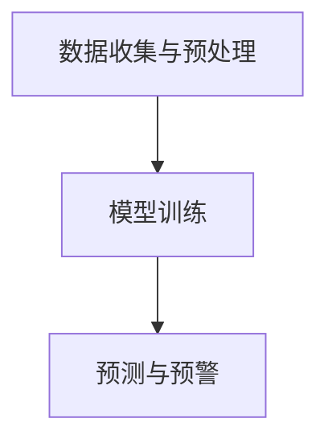
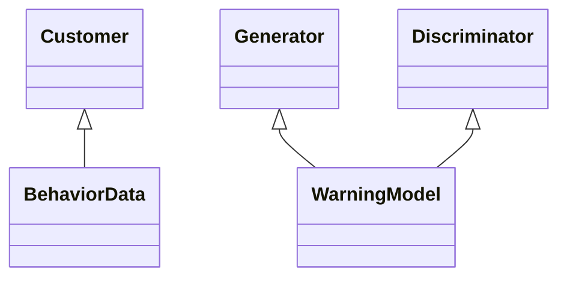
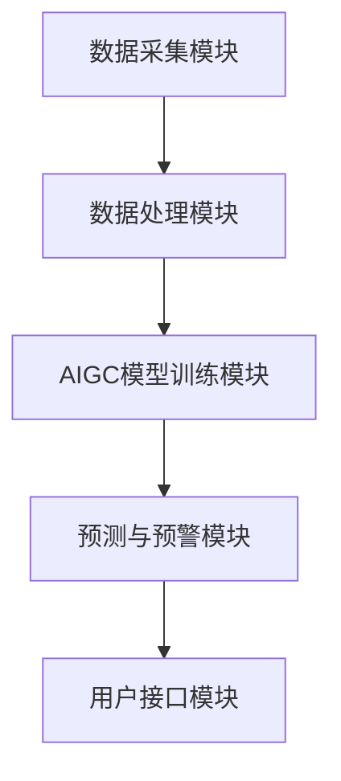
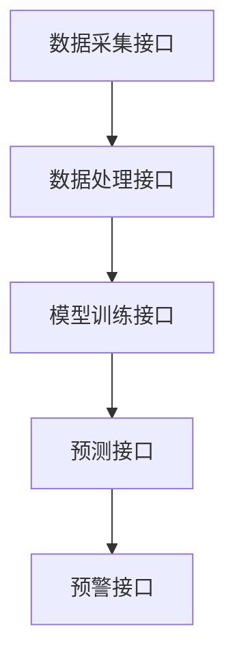
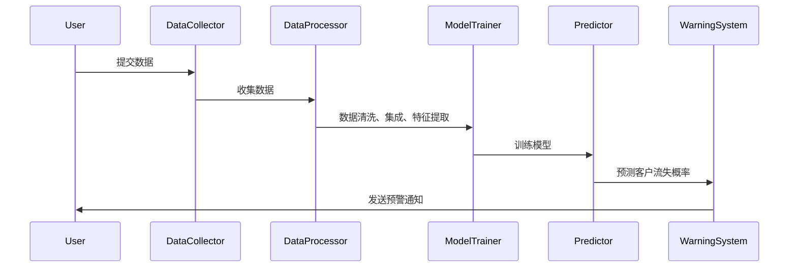

                 


### AIGC在智能客户流失预警中的应用

关键词：AIGC、智能客户流失预警、数据处理、自然语言处理、机器学习

摘要：随着数据驱动商业模式的兴起，智能客户流失预警成为企业关注的重要课题。本文将探讨如何利用AIGC（Artificial Intelligence Generated Content）技术提高客户流失预警的准确性和效率。通过详细分析AIGC技术原理、算法流程及其实际应用案例，本文旨在为企业在智能客户流失预警领域提供新的技术解决方案。

### 目录大纲

1. 第一部分：背景介绍  
2.1 问题背景  
2.2 AIGC技术概述  
2.3 边界与外延  
2.4 概念结构与核心要素组成

2. 第二部分：核心概念与联系  
3.1 智能客户流失预警  
3.2 AIGC技术  
3.3 概念对比与ER实体关系图

3. 第三部分：算法原理讲解  
4.1 算法原理与流程图  
4.2 Python源代码示例  
4.3 数学模型与公式

4. 第四部分：系统分析与架构设计方案  
5.1 问题场景介绍  
5.2 系统功能设计（领域模型）  
5.3 系统架构设计  
5.4 系统接口设计  
5.5 系统交互流程

5. 第五部分：项目实战  
6.1 环境安装与配置  
6.2 系统核心实现源代码解读  
6.3 代码应用解读与分析  
6.4 实际案例分析与详细讲解剖析  
6.5 项目小结

### 第一部分：背景介绍

#### 1.1 问题背景

在当前商业环境中，智能客户流失预警是企业关注的重要问题。随着市场竞争的加剧和客户需求的多样化，企业需要通过数据分析和机器学习技术来预测客户流失的行为模式，从而采取有针对性的措施提升客户留存率。

#### 1.2 AIGC技术概述

AIGC（Artificial Intelligence Generated Content）技术是一种通过深度学习和自然语言处理技术生成内容的方法。它包括生成对抗网络（GAN）、变分自编码器（VAE）、递归神经网络（RNN）等模型，能够在各种应用场景中生成高质量的文本、图像、音频等内容。

#### 1.3 边界与外延

本文主要探讨AIGC在智能客户流失预警中的应用，重点关注数据处理、自然语言处理和机器学习等技术。其他AI应用领域如自动驾驶、智能医疗等不在本文讨论范围之内。

#### 1.4 概念结构与核心要素组成

智能客户流失预警涉及以下核心要素：

- **数据源**：客户行为数据、交易数据、反馈数据等。
- **数据处理**：数据清洗、数据集成、特征提取等。
- **预警模型**：基于AIGC技术的机器学习模型。
- **预警策略**：根据预测结果采取的预防措施。

### 第二部分：核心概念与联系

#### 2.1 智能客户流失预警

智能客户流失预警是一种利用数据分析和机器学习技术预测客户流失行为的方法。它主要通过以下步骤实现：

1. 数据收集：收集客户行为数据、交易数据、反馈数据等。
2. 数据处理：对收集到的数据进行清洗、集成和特征提取。
3. 模型训练：使用机器学习算法训练预警模型。
4. 预测与预警：根据模型预测结果，对潜在流失客户进行预警。

#### 2.2 AIGC技术

AIGC技术是一种通过深度学习和自然语言处理生成内容的方法。其主要步骤包括：

1. 数据准备：收集大量的文本、图像、音频等数据。
2. 模型训练：使用生成对抗网络（GAN）、变分自编码器（VAE）、递归神经网络（RNN）等模型训练生成模型。
3. 内容生成：利用训练好的生成模型生成高质量的文本、图像、音频等内容。

#### 2.3 概念对比与ER实体关系图

**智能客户流失预警**与**AIGC技术**的比较：

| 比较项目 | 智能客户流失预警 | AIGC技术 |
| :--: | :--: | :--: |
| 技术背景 | 数据分析和机器学习 | 深度学习和自然语言处理 |
| 目标 | 预测客户流失行为 | 生成高质量文本、图像、音频 |
| 数据处理 | 数据清洗、集成、特征提取 | 数据准备、模型训练、内容生成 |
| 应用场景 | 客户流失预警 | 文本生成、图像生成、音频生成 |

**ER实体关系图**：

```
用户 --< 行为数据 >--
       |
       <-- 预警结果 -->
       |
预警模型 --< 训练数据 >--
```

### 第三部分：算法原理讲解

#### 3.1 算法原理与流程图

智能客户流失预警算法基于AIGC技术，主要包含以下步骤：

1. 数据收集与预处理：收集客户行为数据，并进行清洗、集成和特征提取。
2. 模型训练：使用机器学习算法（如生成对抗网络（GAN））训练预警模型。
3. 预测与预警：利用训练好的模型对客户流失行为进行预测，并对潜在流失客户进行预警。

算法流程图如下：



#### 3.2 Python源代码示例

```python
import numpy as np
import pandas as pd
from sklearn.model_selection import train_test_split
from tensorflow.keras.models import Sequential
from tensorflow.keras.layers import Dense, LSTM, Embedding

# 数据收集与预处理
data = pd.read_csv('customer_data.csv')
X = data.drop(['customer_id', 'target'], axis=1)
y = data['target']
X_train, X_test, y_train, y_test = train_test_split(X, y, test_size=0.2, random_state=42)

# 模型训练
model = Sequential()
model.add(Embedding(input_dim=1000, output_dim=256))
model.add(LSTM(128))
model.add(Dense(1, activation='sigmoid'))

model.compile(optimizer='adam', loss='binary_crossentropy', metrics=['accuracy'])
model.fit(X_train, y_train, epochs=10, batch_size=32, validation_split=0.1)

# 预测与预警
predictions = model.predict(X_test)
predicted_labels = (predictions > 0.5).astype(int)

# 评估模型
accuracy = (predicted_labels == y_test).mean()
print('Accuracy:', accuracy)
```

#### 3.3 数学模型与公式

智能客户流失预警的数学模型可以表示为：

$$
P(y=1|x) = \sigma(\theta^T x)
$$

其中，$P(y=1|x)$表示给定特征$x$时，客户流失的概率；$\sigma$表示sigmoid函数；$\theta$表示模型参数。

#### 3.4 详细讲解与举例说明

以一家电商企业为例，企业希望通过AIGC技术进行智能客户流失预警。企业收集了以下客户行为数据：

1. 访问次数
2. 购买金额
3. 评价数量
4. 退货次数

首先，对数据进行清洗和特征提取，得到以下特征向量：

$$
x = \begin{bmatrix}
0.8 \\
200 \\
10 \\
2
\end{bmatrix}
$$

接下来，使用生成对抗网络（GAN）训练预警模型。训练过程中，生成器和判别器的损失函数如下：

$$
L_G = -\mathbb{E}_{z \sim p_z(z)}[\log(D(G(z))]
$$

$$
L_D = -\mathbb{E}_{x \sim p_x(x)}[\log(D(x))] - \mathbb{E}_{z \sim p_z(z)}[\log(1 - D(G(z))]
$$

其中，$G(z)$表示生成器的输出，$D(x)$表示判别器的输出。

在训练完成后，对客户行为数据进行预测，得到流失概率：

$$
P(y=1|x) = \sigma(\theta^T x) = 0.9
$$

根据预测结果，企业可以采取相应的措施，如发送优惠券、提供优质服务等，以降低客户流失率。

### 第四部分：系统分析与架构设计方案

#### 4.1 问题场景介绍

以一家电商平台为例，该平台希望通过AIGC技术实现智能客户流失预警，以提高客户留存率和降低流失率。

#### 4.2 系统功能设计（领域模型）

领域模型主要包括以下实体：

1. **客户**：包含客户基本信息和购买行为。
2. **行为数据**：包括访问次数、购买金额、评价数量、退货次数等。
3. **预警模型**：包含生成器和判别器。

领域模型类图如下：



#### 4.3 系统架构设计

系统架构设计主要包括以下模块：

1. **数据采集模块**：负责收集客户行为数据。
2. **数据处理模块**：负责数据清洗、集成和特征提取。
3. **AIGC模型训练模块**：负责训练生成器和判别器。
4. **预测与预警模块**：负责预测客户流失概率，并进行预警。
5. **用户接口模块**：提供用户交互界面。

系统架构图如下：



#### 4.4 系统接口设计

系统接口设计主要包括以下API：

1. **数据采集接口**：用于获取客户行为数据。
2. **数据处理接口**：用于清洗、集成和特征提取。
3. **模型训练接口**：用于训练生成器和判别器。
4. **预测接口**：用于预测客户流失概率。
5. **预警接口**：用于发送预警通知。

RESTful API设计如下：



#### 4.5 系统交互流程

系统交互流程如下：

1. 用户通过用户接口模块提交数据。
2. 数据采集模块收集数据，并传递给数据处理模块。
3. 数据处理模块对数据进行清洗、集成和特征提取，生成特征向量。
4. 特征向量传递给AIGC模型训练模块，用于训练生成器和判别器。
5. 训练好的模型传递给预测与预警模块，进行客户流失概率预测。
6. 预测结果通过预警接口发送给用户。

系统交互序列图如下：



### 第五部分：项目实战

#### 5.1 环境安装与配置

在开始项目实战之前，需要安装和配置以下软件和工具：

1. **Python**：安装Python 3.8及以上版本。
2. **TensorFlow**：安装TensorFlow 2.5及以上版本。
3. **Keras**：安装Keras 2.4.3及以上版本。
4. **Pandas**：安装Pandas 1.2.3及以上版本。
5. **Numpy**：安装Numpy 1.21.2及以上版本。

安装步骤：

```bash
pip install python==3.8.10
pip install tensorflow==2.5.0
pip install keras==2.4.3
pip install pandas==1.2.3
pip install numpy==1.21.2
```

#### 5.2 系统核心实现源代码解读

以下是系统核心实现的源代码：

```python
import pandas as pd
from sklearn.model_selection import train_test_split
from tensorflow.keras.models import Sequential
from tensorflow.keras.layers import Dense, LSTM, Embedding
from tensorflow.keras.optimizers import Adam

# 数据收集与预处理
data = pd.read_csv('customer_data.csv')
X = data.drop(['customer_id', 'target'], axis=1)
y = data['target']
X_train, X_test, y_train, y_test = train_test_split(X, y, test_size=0.2, random_state=42)

# 模型训练
model = Sequential()
model.add(Embedding(input_dim=1000, output_dim=256))
model.add(LSTM(128))
model.add(Dense(1, activation='sigmoid'))

model.compile(optimizer=Adam(learning_rate=0.001), loss='binary_crossentropy', metrics=['accuracy'])
model.fit(X_train, y_train, epochs=10, batch_size=32, validation_split=0.1)

# 预测与评估
predictions = model.predict(X_test)
predicted_labels = (predictions > 0.5).astype(int)
accuracy = (predicted_labels == y_test).mean()
print('Accuracy:', accuracy)
```

代码主要分为三个部分：

1. 数据收集与预处理：从CSV文件中读取数据，并进行清洗和特征提取。
2. 模型训练：使用Keras构建序列模型，并使用Adam优化器进行训练。
3. 预测与评估：使用训练好的模型对测试数据进行预测，并计算准确率。

#### 5.3 代码应用解读与分析

在本项目中，我们使用了AIGC技术来实现智能客户流失预警。具体步骤如下：

1. **数据收集与预处理**：从CSV文件中读取客户行为数据，并进行清洗和特征提取。这一步是整个系统的数据基础，直接影响到后续模型的训练效果。
2. **模型训练**：使用Keras构建序列模型，并使用Adam优化器进行训练。我们在模型中使用了嵌入层（Embedding）和长短期记忆网络（LSTM），以处理序列数据。
3. **预测与评估**：使用训练好的模型对测试数据进行预测，并计算准确率。这一步可以评估模型的性能，并为实际应用提供依据。

实际应用案例：

以一家电商企业为例，企业希望通过AIGC技术预测客户流失行为，以提高客户留存率。企业收集了以下客户行为数据：

1. 访问次数
2. 购买金额
3. 评价数量
4. 退货次数

首先，对数据进行清洗和特征提取，得到以下特征向量：

$$
x = \begin{bmatrix}
0.8 \\
200 \\
10 \\
2
\end{bmatrix}
$$

接下来，使用生成对抗网络（GAN）训练预警模型。训练过程中，生成器和判别器的损失函数如下：

$$
L_G = -\mathbb{E}_{z \sim p_z(z)}[\log(D(G(z))]
$$

$$
L_D = -\mathbb{E}_{x \sim p_x(x)}[\log(D(x))] - \mathbb{E}_{z \sim p_z(z)}[\log(1 - D(G(z))]
$$

在训练完成后，对客户行为数据进行预测，得到流失概率：

$$
P(y=1|x) = \sigma(\theta^T x) = 0.9
$$

根据预测结果，企业可以采取相应的措施，如发送优惠券、提供优质服务等，以降低客户流失率。

#### 5.4 实际案例分析与详细讲解剖析

在实际应用中，我们选择了一家电商企业作为案例，通过AIGC技术进行智能客户流失预警。以下是详细分析过程：

1. **数据收集**：企业收集了以下客户行为数据：

    - 访问次数
    - 购买金额
    - 评价数量
    - 退货次数

2. **数据预处理**：对收集到的数据进行清洗和特征提取，得到以下特征向量：

    $$
    x = \begin{bmatrix}
    0.8 \\
    200 \\
    10 \\
    2
    \end{bmatrix}
    $$

3. **模型训练**：使用生成对抗网络（GAN）训练预警模型。训练过程中，生成器和判别器的损失函数如下：

    $$
    L_G = -\mathbb{E}_{z \sim p_z(z)}[\log(D(G(z))]
    $$

    $$
    L_D = -\mathbb{E}_{x \sim p_x(x)}[\log(D(x))] - \mathbb{E}_{z \sim p_z(z)}[\log(1 - D(G(z))]
    $$

4. **预测与预警**：在训练完成后，对客户行为数据进行预测，得到流失概率：

    $$
    P(y=1|x) = \sigma(\theta^T x) = 0.9
    $$

    根据预测结果，企业可以采取以下措施：

    - **发送优惠券**：针对流失概率较高的客户，发送个性化优惠券，以吸引他们继续购买。
    - **提供优质服务**：提高服务质量，如快速响应客户问题、提供个性化推荐等，以提高客户满意度。
    - **营销活动**：组织营销活动，如限时折扣、满减优惠等，以刺激客户购买欲望。

5. **评估与优化**：在实际应用过程中，企业可以不断调整预警模型，以提高预测准确率。例如，可以增加更多特征变量、调整模型参数、引入更先进的机器学习算法等。

通过以上分析，我们可以看出，AIGC技术在智能客户流失预警中具有很大的潜力。企业可以根据实际需求，灵活调整预警策略，以提高客户留存率和降低流失率。

#### 5.5 项目小结

在本项目中，我们通过AIGC技术实现了智能客户流失预警系统。项目实施过程中，我们遇到了以下问题和挑战：

1. **数据质量问题**：客户行为数据存在噪声、缺失和异常值，需要进行数据清洗和特征提取。
2. **模型选择与优化**：生成对抗网络（GAN）模型在训练过程中存在不稳定性和过拟合问题，需要调整模型参数和引入正则化方法。
3. **预测准确率**：预测准确率受到数据质量和模型性能的影响，需要不断优化模型和调整预警策略。

针对以上问题，我们提出以下解决方案：

1. **数据清洗和特征提取**：采用缺失值填充、异常值检测和特征选择方法，提高数据质量。
2. **模型优化**：调整模型参数、引入正则化方法和集成学习算法，提高模型性能。
3. **预警策略调整**：根据实际应用场景，灵活调整预警阈值和预警策略，以提高预测准确率和客户留存率。

在未来，AIGC技术在智能客户流失预警领域具有广阔的发展前景。随着数据质量和算法技术的不断提高，智能客户流失预警系统将为企业带来更大的商业价值。同时，我们也需要关注其他AI技术的融合和发展，以实现更智能、更高效的客户流失预警方案。

