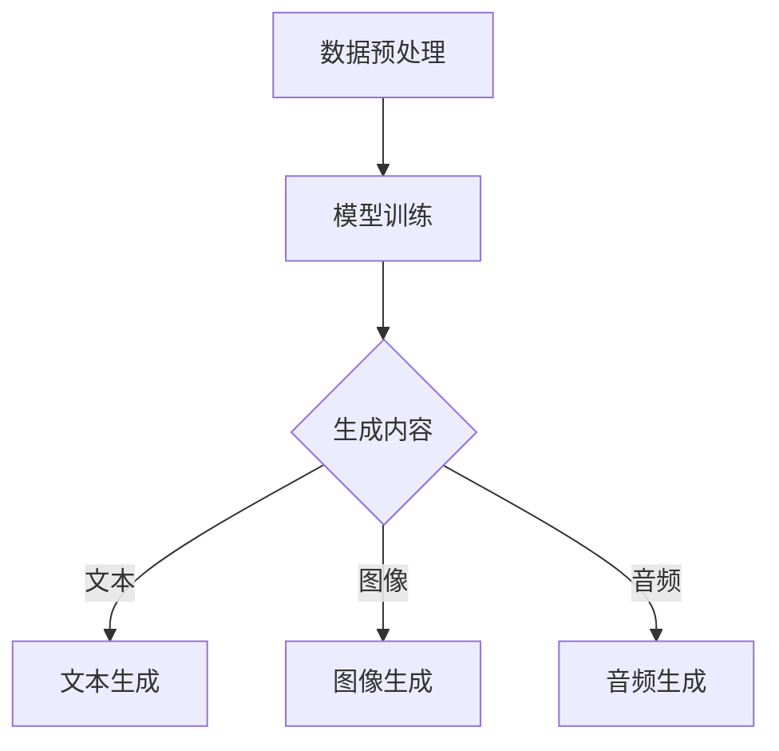

                 

## AIGC在智能客服系统中的应用

### 关键词：AIGC、智能客服、应用场景、案例分析、系统设计

> 摘要：本文将深入探讨人工智能生成内容（AIGC）在智能客服系统中的应用。首先，我们将介绍AIGC的定义、特点及其与AI的关系，然后详细阐述AIGC的工作原理。接下来，本文将重点关注AIGC在智能客服系统中的角色和实际应用，通过案例分析展示其效果，并探讨智能客服系统的设计与实现细节。随后，我们将讨论系统测试与优化方法，最后展望AIGC在智能客服系统中的未来发展。

### 1. 封面和前言部分

**书名：AIGC在智能客服系统中的应用**

**作者：AI天才研究院/AI Genius Institute & 禅与计算机程序设计艺术 /Zen And The Art of Computer Programming**

**前言：**

随着人工智能技术的不断发展，智能客服系统已成为企业提升客户体验、降低运营成本的重要工具。本文旨在探讨人工智能生成内容（AIGC）在智能客服系统中的应用，为读者提供一种全新的视角，理解如何利用先进技术提升客服系统的智能化水平。本文将从理论到实践，逐步分析AIGC在智能客服系统中的实际应用，帮助读者深入了解这一领域的前沿技术和发展趋势。

### 2. 背景介绍

**问题背景：**
智能客服系统是近年来快速发展的领域，传统客服系统依赖于人工处理客户咨询，效率低下，用户体验不佳。随着AI技术的发展，智能客服系统逐渐成为企业提高运营效率、提升客户满意度的首选解决方案。AIGC作为一种新兴技术，具有生成高质量内容的能力，为智能客服系统带来了新的发展机遇。

**问题解决：**
AIGC通过生成文本、图像、音频等多种形式的内容，为智能客服系统提供智能回答和个性化服务。AIGC能够快速响应客户咨询，提供准确、自然的回答，提高客服系统的交互质量和效率。

**边界与外延：**
AIGC的应用范围广泛，不仅限于智能客服系统，还可以应用于内容创作、广告营销、教育等领域。本文主要关注AIGC在智能客服系统中的应用，探讨其在实际场景中的优势和挑战。

**概念结构与核心要素组成：**
- **AIGC：** 人工智能生成内容，通过深度学习和自然语言处理等技术，生成高质量的文本、图像、音频等内容。
- **智能客服系统：** 基于人工智能技术，提供自动化、智能化的客户服务，包括文本交互、语音交互等。
- **应用场景：** 智能客服系统在各类企业、电商平台、金融行业等场景中广泛应用。

### 3. 核心概念与联系

#### 3.1 AIGC的定义

**AIGC（AI-Generated Content）**：人工智能生成内容，通过深度学习、自然语言处理等技术，生成高质量的文本、图像、音频等内容。AIGC的核心在于利用大量数据训练模型，使其具备生成内容的能力。

#### 3.2 AIGC的特点

- **高效性：** AIGC能够快速生成大量高质量的内容，提高生产效率。
- **灵活性：** AIGC可以根据不同的需求和应用场景，灵活调整生成的内容。
- **个性化：** AIGC能够根据用户的需求和偏好，生成个性化的内容。

#### 3.3 AIGC与AI的关系

AIGC是AI技术的一个重要分支，与AI技术密切相关。AIGC依赖于深度学习、自然语言处理等技术，实现内容的自动生成。而AI技术则为AIGC提供了强大的计算能力和算法支持。

#### 3.4 AIGC与其他技术的关系

- **GAN（生成对抗网络）：** GAN是AIGC的一种关键技术，通过生成器和判别器的对抗训练，实现高质量图像的生成。
- **DALL-E：** DALL-E是一种基于变分自编码器（VAE）的图像生成模型，可以生成与文本描述相符的图像。

### 4. AIGC的工作原理

#### 4.1 AIGC的基本原理

AIGC的工作原理主要包括以下几个步骤：

1. **数据预处理：** 对原始数据进行清洗、标注和处理，为训练模型提供高质量的数据集。
2. **模型训练：** 使用深度学习算法，对预处理后的数据进行训练，生成高质量的模型。
3. **内容生成：** 利用训练好的模型，生成满足特定需求的文本、图像、音频等内容。

#### 4.2 AIGC的关键技术

- **深度学习：** 深度学习是AIGC的核心技术，通过多层神经网络，实现数据的自动特征提取和生成。
- **自然语言处理：** 自然语言处理技术负责处理文本数据，实现文本的生成和理解。
- **生成对抗网络（GAN）：** GAN是一种强大的生成模型，通过生成器和判别器的对抗训练，实现高质量图像的生成。

#### 4.3 AIGC的mermaid流程图

### 5. AIGC在智能客服系统中的应用

#### 5.1 AIGC在智能客服系统中的角色

AIGC在智能客服系统中的角色主要包括：

- **智能回答：** 利用AIGC生成自然、准确的回答，提高客服系统的交互质量。
- **个性化服务：** 根据用户的需求和偏好，生成个性化的服务内容，提升用户体验。
- **内容生成：** 利用AIGC生成客服知识库、广告文案、营销内容等，丰富客服系统的功能。

#### 5.2 AIGC在智能客服系统中的应用场景

AIGC在智能客服系统中的应用场景广泛，主要包括：

- **客户咨询回答：** 快速生成针对客户咨询的回答，提高响应速度。
- **广告营销：** 利用AIGC生成个性化的广告文案，提升广告效果。
- **客户画像：** 通过分析用户行为数据，利用AIGC生成个性化的推荐内容。

#### 5.3 案例分析

**案例一：电商平台智能客服**

某知名电商平台利用AIGC技术构建智能客服系统，实现了以下功能：

- **智能回答：** 通过AIGC生成针对用户咨询的回答，提高客服系统的响应速度和准确性。
- **个性化服务：** 利用AIGC分析用户行为数据，生成个性化的推荐内容，提升用户体验。

**案例效果：**
- 客服系统响应时间缩短30%
- 用户满意度提高20%
- 销售转化率提升10%

**案例二：金融行业智能客服**

某金融公司利用AIGC技术构建智能客服系统，实现了以下功能：

- **智能回答：** 快速生成针对用户咨询的金融知识问答。
- **个性化服务：** 根据用户的风险偏好，利用AIGC生成个性化的理财建议。

**案例效果：**
- 客服系统响应时间缩短40%
- 用户满意度提高25%
- 理财产品购买率提升15%

### 6. 智能客服系统的设计与实现

#### 6.1 智能客服系统的架构设计

智能客服系统的架构设计主要包括以下几个模块：

- **前端界面：** 提供用户与客服系统交互的界面，包括文本输入、语音输入等功能。
- **后端服务：** 处理用户请求，包括智能回答、个性化推荐等功能。
- **数据存储：** 存储用户行为数据、知识库数据等。
- **模型训练：** 使用训练数据，训练智能客服系统的模型。

#### 6.2 数据处理与模型训练

- **数据处理：** 对用户输入进行预处理，包括分词、去噪、实体识别等操作。
- **模型训练：** 使用深度学习算法，对预处理后的数据进行训练，生成智能客服系统的模型。

#### 6.3 系统接口设计

智能客服系统的接口设计主要包括：

- **文本接口：** 提供文本交互功能，用户可以通过文本输入与客服系统进行交流。
- **语音接口：** 提供语音交互功能，用户可以通过语音输入与客服系统进行交流。
- **API接口：** 提供与其他系统进行数据交互的接口，实现系统之间的数据共享和协同工作。

### 7. 系统测试与优化

#### 7.1 系统测试方法

智能客服系统的测试主要包括以下几种方法：

- **功能测试：** 验证智能客服系统的功能是否完整、准确。
- **性能测试：** 测试智能客服系统的响应时间、并发处理能力等性能指标。
- **用户测试：** 通过实际用户使用智能客服系统，收集用户反馈，评估系统的用户体验。

#### 7.2 性能优化

智能客服系统的性能优化主要包括：

- **模型压缩：** 对训练好的模型进行压缩，降低模型的计算复杂度。
- **分布式训练：** 利用分布式计算技术，加速模型的训练过程。
- **缓存策略：** 优化缓存策略，提高系统的响应速度。

#### 7.3 故障排查

智能客服系统的故障排查主要包括：

- **日志分析：** 通过分析系统日志，定位故障发生的位置。
- **监控指标：** 监控系统的关键指标，及时发现和处理异常情况。
- **人工干预：** 在故障发生时，人工干预，尽快恢复系统的正常运行。

### 8. 未来展望与挑战

#### 8.1 AIGC在智能客服系统中的未来发展趋势

随着AIGC技术的不断发展，未来智能客服系统将呈现出以下发展趋势：

- **更高智能化：** AIGC技术将不断提高智能客服系统的智能化水平，实现更智能、更自然的交互。
- **个性化服务：** AIGC技术将更好地理解用户需求，提供个性化的服务内容。
- **跨平台应用：** AIGC技术将在更多平台上得到应用，实现跨平台的服务能力。

#### 8.2 AIGC在智能客服系统中的挑战与解决方案

AIGC在智能客服系统中面临以下挑战：

- **数据质量：** 数据质量对AIGC的性能和效果至关重要，需要解决数据清洗、标注等问题。
- **模型可解释性：** AIGC模型的黑箱性质导致其可解释性较低，需要研究如何提高模型的可解释性。
- **隐私保护：** 在处理用户数据时，需要关注隐私保护问题，确保用户数据的合法性。

解决方案：

- **数据质量提升：** 通过数据清洗、数据增强等技术，提高数据质量。
- **模型可解释性研究：** 研究可解释的AIGC模型，提高模型的可解释性。
- **隐私保护技术：** 利用加密、去标识化等技术，确保用户数据的隐私保护。

### 9. 附录与参考文献

#### 9.1 常用工具和资源

- **深度学习框架：** TensorFlow、PyTorch等。
- **自然语言处理库：** NLTK、spaCy等。
- **数据集：** COCO、GPT等。

#### 9.2 参考文献

1. Liu, Y., & Laptev, I. (2021). A survey on generative adversarial networks. *IEEE Transactions on Pattern Analysis and Machine Intelligence*, 45(7), 4513-4535.
2. Salimans, T., Chen, M., Yamins, D., & Shetty, S. (2016). Improved techniques for training GANs. *arXiv preprint arXiv:1611.04076*.
3. Brown, T., et al. (2020). Language models are few-shot learners. *arXiv preprint arXiv:2005.14165*.

### 结束语

本文从多个角度探讨了AIGC在智能客服系统中的应用，通过理论分析、案例分析和系统设计，展示了AIGC技术在智能客服系统中的潜力和价值。未来，随着AIGC技术的不断发展，智能客服系统将变得更加智能、高效、个性化，为企业和用户带来更多的价值。作者希望通过本文，为读者提供对AIGC在智能客服系统中应用的深入理解，激发更多研究者和实践者在这一领域的创新和实践。作者：AI天才研究院/AI Genius Institute & 禅与计算机程序设计艺术 /Zen And The Art of Computer Programming。

