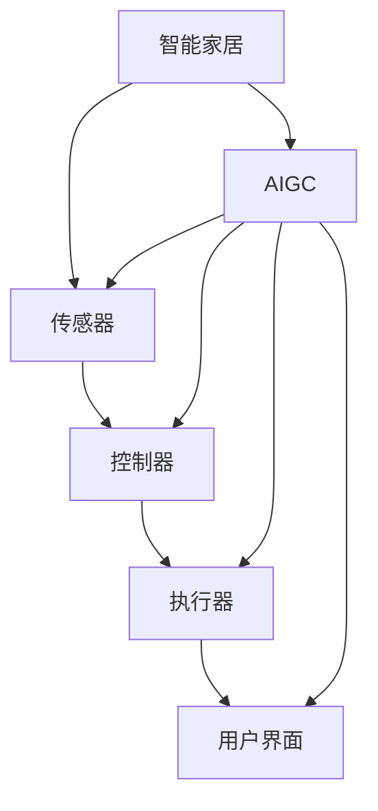
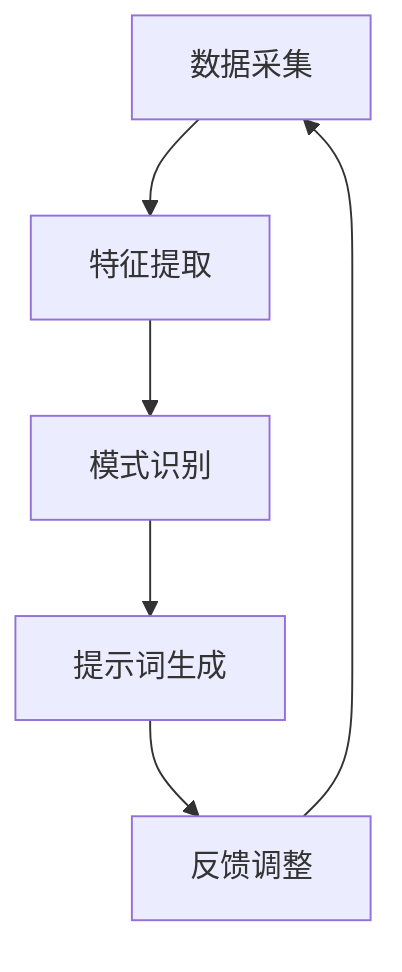
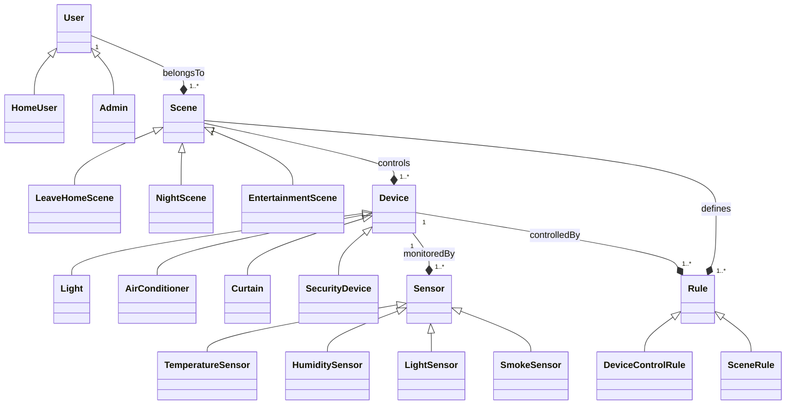
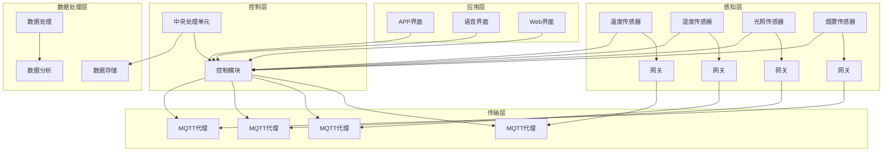
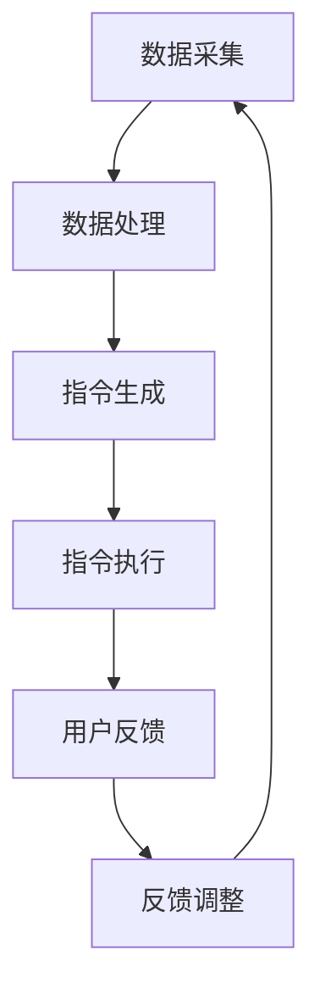
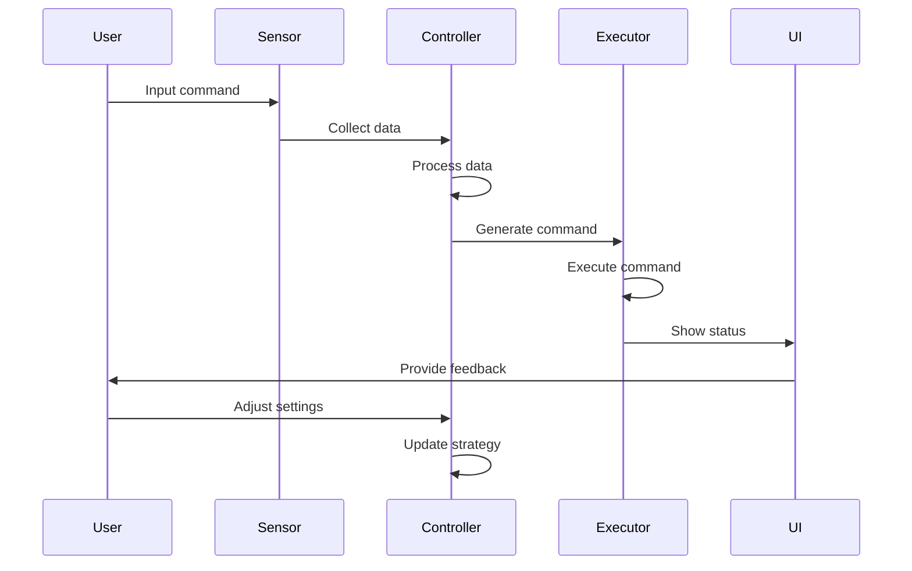

                 

## AIGC在智能家居中的应用：场景化指令的提示词设计

### 关键词：
- AIGC
- 智能家居
- 场景化指令
- 提示词设计
- 数学模型
- 系统架构

### 摘要：
本文将深入探讨AIGC（自适应智能生成控制）在智能家居中的应用，尤其是场景化指令的提示词设计。通过逐步分析AIGC的技术原理、智能家居的需求和挑战，以及场景化指令的设计方法，本文旨在提供一种系统化、可操作的解决方案，以提升智能家居系统的智能性和用户满意度。

## 目录大纲

1. **AIGC与智能家居概述**
   - 1.1 AIGC在智能家居中的背景
   - 1.2 核心概念与联系
   - 1.3 算法原理讲解
   - 1.4 数学模型和公式讲解
   - 1.5 本章小结

2. **AIGC在智能家居中的应用**
   - 2.1 智能家居系统设计与实现
   - 2.2 领域模型设计
   - 2.3 系统架构设计
   - 2.4 系统接口设计
   - 2.5 系统交互设计
   - 2.6 本章小结

3. **场景化指令的提示词设计实战**
   - 3.1 实战项目概述
   - 3.2 环境安装与配置
   - 3.3 核心实现
   - 3.4 代码解读与分析
   - 3.5 实际案例分析与讲解
   - 3.6 项目小结

4. **最佳实践与总结**
   - 4.1 最佳实践
   - 4.2 注意事项
   - 4.3 小结
   - 4.4 拓展阅读

### 1.1 AIGC在智能家居中的背景

#### 1.1.1 智能家居的发展历程

智能家居（Smart Home）作为一个集成信息技术、网络通信、物联网和人工智能等多领域技术于一体的系统，经历了从简单到复杂、从单一功能到多功能集成、从局域网到物联网的发展历程。最早期的智能家居系统主要集中在家庭安防和远程控制，例如家庭报警系统和远程家电控制。随着技术的进步，智能家居逐渐扩展到更广泛的领域，包括环境监测、能源管理、娱乐控制、健康监护等。

#### 1.1.2 AIGC技术的引入与影响

AIGC（Adaptive Intelligent Generation Control，自适应智能生成控制）是近年来人工智能领域的一个新兴方向，它通过自适应学习、生成控制和智能决策等技术，实现对复杂系统的智能管理和优化。AIGC技术的引入，使得智能家居系统能够更好地理解和响应用户的实际需求，提供个性化、智能化和高效的服务。

AIGC技术在智能家居中的应用主要体现在以下几个方面：

1. **智能语音助手**：利用AIGC技术，智能家居系统能够通过自然语言处理和语音识别，理解用户的语音指令，并生成相应的控制指令，实现对家庭设备的智能控制。
   
2. **个性化服务**：通过用户行为分析和数据挖掘，AIGC技术可以生成个性化的服务推荐，提高用户的生活质量。
   
3. **智能监控与安防**：AIGC技术能够实时分析家庭环境数据，预测潜在的安全风险，并提供相应的预警和应急措施。

4. **能源管理**：AIGC技术可以优化家庭能源的使用，通过智能调度和预测，实现节能减排。

#### 1.1.3 场景化指令在智能家居中的重要性

场景化指令（Scenario-Based Command）是智能家居系统中的一项重要功能，它通过定义不同的生活场景，为用户提供个性化的操作指令。场景化指令的设计不仅能够提高用户的交互体验，还能提升系统的智能化水平。

场景化指令在智能家居中的应用主要包括：

1. **场景自动触发**：根据用户的行为模式，自动识别并触发相应的场景，例如“离家模式”、“晚上模式”等。
   
2. **场景联动**：多个设备可以基于一个场景进行联动控制，例如“晚上模式”可以同时关闭灯光、调整空调温度等。

3. **自定义场景**：用户可以根据自己的需求，自定义不同的场景，以满足多样化的需求。

4. **智能反馈**：通过场景化指令，系统能够实时获取用户反馈，并调整设备状态，以优化用户体验。

总之，AIGC技术在智能家居中的应用，为场景化指令的设计和实现提供了强大的支持。通过合理的设计和优化，场景化指令能够显著提升智能家居系统的智能化水平和用户体验。

### 1.2 核心概念与联系

在深入探讨AIGC在智能家居中的应用之前，我们需要了解一些核心概念，并分析它们之间的联系。

#### 1.2.1 AIGC的定义与特点

AIGC（Adaptive Intelligent Generation Control，自适应智能生成控制）是一种基于自适应学习和智能生成技术，用于控制和管理复杂系统的先进方法。AIGC的主要特点包括：

1. **自适应学习**：AIGC系统能够根据环境和用户需求，自动调整和优化其行为，以适应不断变化的情况。
   
2. **智能生成**：AIGC系统能够根据输入的数据和规则，生成新的控制指令和策略，以实现智能管理和优化。

3. **实时性**：AIGC技术能够快速响应用户的操作和系统变化，提供实时、准确的决策。

4. **自适应性**：AIGC系统能够根据系统的状态和用户的行为，自动调整控制策略，提高系统的稳定性和可靠性。

#### 1.2.2 智能家居的概念与组成部分

智能家居（Smart Home）是指通过物联网（IoT）技术、云计算、人工智能等技术，实现家庭设备和系统的智能化管理和控制。智能家居的主要组成部分包括：

1. **传感器**：用于采集家庭环境数据，如温度、湿度、光照、烟雾等。

2. **控制器**：用于接收传感器数据，并根据用户指令或预设规则，控制家庭设备。

3. **执行器**：如灯具、空调、窗帘等，用于执行控制指令，改变家庭环境。

4. **通信网络**：用于传感器、控制器和执行器之间的数据传输，通常采用WiFi、蓝牙、Zigbee等无线通信技术。

5. **用户界面**：如手机APP、智能音箱等，用于用户与智能家居系统的交互。

#### 1.2.3 场景化指令的设计原则与方法

场景化指令（Scenario-Based Command）是一种基于特定生活场景的指令设计方法，它通过定义不同的生活场景，为用户提供个性化的操作指令。场景化指令的设计原则包括：

1. **实用性**：设计场景化指令时，应充分考虑用户的实际需求和场景，确保指令的实用性。

2. **可扩展性**：系统应具有可扩展性，以适应未来的功能扩展和用户需求变化。

3. **易用性**：指令设计应简洁、直观，易于用户理解和操作。

4. **灵活性**：系统应具有灵活性，允许用户自定义和调整场景化指令。

场景化指令的设计方法主要包括：

1. **场景定义**：根据用户的生活习惯和需求，定义不同的场景，如“离家模式”、“晚上模式”等。

2. **指令生成**：根据场景定义，生成相应的指令，包括设备控制指令、参数调整指令等。

3. **指令优化**：通过用户反馈和系统数据分析，不断优化指令，提高系统的智能化水平。

#### 1.2.4 概念联系与关系图

为了更清晰地理解AIGC、智能家居和场景化指令之间的关系，我们使用Mermaid流程图进行展示。



**图 1-1 AIGC、智能家居与场景化指令关系图**

在这个流程图中，AIGC作为核心技术贯穿于智能家居系统的各个组成部分，通过传感器、控制器和执行器，实现对用户指令的实时响应和优化。用户界面作为用户与系统的交互入口，通过场景化指令，为用户提供便捷、个性化的操作体验。

### 1.3 算法原理讲解

在AIGC技术应用于智能家居场景化指令的设计中，算法原理起到了至关重要的作用。本节将详细讲解场景化指令设计的算法原理，并通过Mermaid流程图和Python代码示例进行阐述。

#### 1.3.1 提示词设计的算法原理概述

场景化指令的提示词设计算法旨在根据用户行为和环境数据，生成合适的提示词，以引导用户进行相应的操作。算法原理主要包括以下几个关键步骤：

1. **数据采集**：从传感器和用户界面采集用户行为和环境数据，如温度、湿度、光照、用户操作记录等。
   
2. **特征提取**：对采集的数据进行预处理和特征提取，提取出与场景化指令相关的关键特征。
   
3. **模式识别**：使用机器学习算法，根据历史数据和特征，识别用户的行为模式和生活习惯。

4. **提示词生成**：基于识别出的行为模式，生成相应的提示词，以引导用户进行操作。

5. **反馈调整**：根据用户对提示词的反馈，调整和优化提示词，以提高系统的智能化水平。

#### 1.3.2 提示词设计算法流程图

为了更直观地展示提示词设计算法的流程，我们使用Mermaid流程图进行表示。



**图 1-2 提示词设计算法流程图**

在这个流程图中，数据采集是整个算法的基础，特征提取是关键步骤，模式识别和提示词生成是基于特征提取的结果，反馈调整则是一个闭环，用于不断优化算法。

#### 1.3.3 Python代码示例

下面是一个简单的Python代码示例，用于演示提示词生成算法的基本实现。

```python
import numpy as np
from sklearn.cluster import KMeans
from sklearn.preprocessing import StandardScaler

# 假设我们已经收集到了用户行为数据，包括温度、湿度、光照等特征
user_data = np.array([
    [25, 60, 50],
    [22, 55, 45],
    [27, 65, 55],
    # ... 更多数据
])

# 特征标准化
scaler = StandardScaler()
user_data = scaler.fit_transform(user_data)

# 使用K均值聚类算法进行模式识别
kmeans = KMeans(n_clusters=3, random_state=0).fit(user_data)

# 根据聚类结果生成提示词
labels = kmeans.labels_
for i, label in enumerate(labels):
    if label == 0:
        print(f"场景一：温度适中，建议保持当前温度。")
    elif label == 1:
        print(f"场景二：温度偏低，建议适当提高温度。")
    elif label == 2:
        print(f"场景三：温度偏高，建议适当降低温度。")
```

在这个示例中，我们首先使用K均值聚类算法对用户行为数据进行分析，根据聚类结果生成不同的提示词。这种简单的模式识别方法可以为我们提供基本的提示词生成框架，在实际应用中，我们可以结合更复杂的机器学习模型和深度学习算法，进一步提高提示词的准确性和智能化水平。

### 1.4 数学模型和公式讲解

在AIGC技术应用于场景化指令设计中，数学模型和公式起着至关重要的作用。本节将详细解释算法中的数学模型和公式，并通过Python代码示例进行说明。

#### 1.4.1 算法中的数学模型

场景化指令设计的核心在于对用户行为和环境数据的分析，从而生成合适的提示词。以下是算法中涉及的主要数学模型：

1. **数据预处理模型**：为了提高数据质量和计算效率，通常需要对数据进行标准化处理。常用的方法有平均值法、中位数法、标准差法等。

2. **特征提取模型**：通过特征提取，将原始数据转换为更具有代表性的特征向量。常用的方法有主成分分析（PCA）、线性判别分析（LDA）等。

3. **聚类模型**：用于识别用户行为模式，常见的聚类算法有K均值聚类（K-Means）、层次聚类（Hierarchical Clustering）等。

4. **提示词生成模型**：基于聚类结果，生成对应的提示词。提示词的生成通常采用条件概率模型，如贝叶斯网络、马尔可夫模型等。

5. **反馈调整模型**：根据用户对提示词的反馈，调整和优化提示词生成策略，提高系统的智能化水平。

#### 1.4.2 公式详解与Python代码示例

以下是场景化指令设计中常用的数学公式及其Python代码示例。

1. **数据预处理公式**：

   $$ X_{\text{标准化}} = \frac{X_{\text{原始}} - \mu}{\sigma} $$

   其中，$X_{\text{标准化}}$ 是标准化后的数据，$X_{\text{原始}}$ 是原始数据，$\mu$ 是均值，$\sigma$ 是标准差。

   ```python
   import numpy as np

   # 假设原始数据
   X原始 = np.array([[25, 60, 50], [22, 55, 45], [27, 65, 55]])

   # 计算均值和标准差
   mean = np.mean(X原始, axis=0)
   std = np.std(X原始, axis=0)

   # 标准化处理
   X标准化 = (X原始 - mean) / std
   print(X标准化)
   ```

2. **聚类算法公式**：

   K均值聚类算法的核心公式为：

   $$ C_j = \{ x_i | \min_{k} \sum_{i \in C_k} (x_i - \mu_k)^2 \} $$

   其中，$C_j$ 是聚类后的类集，$x_i$ 是数据点，$\mu_k$ 是第k个类的均值。

   ```python
   from sklearn.cluster import KMeans

   # 使用K均值聚类
   kmeans = KMeans(n_clusters=3, random_state=0).fit(X标准化)

   # 输出聚类结果
   print(kmeans.labels_)
   ```

3. **提示词生成公式**：

   提示词生成通常基于条件概率模型：

   $$ P(\text{提示词} | \text{场景}) = \frac{P(\text{场景} | \text{提示词}) \cdot P(\text{提示词})}{P(\text{场景})} $$

   其中，$P(\text{提示词} | \text{场景})$ 是提示词在特定场景下的概率，$P(\text{场景} | \text{提示词})$ 是场景在特定提示词下的概率，$P(\text{提示词})$ 是提示词的概率，$P(\text{场景})$ 是场景的概率。

   ```python
   # 假设我们已经计算了条件概率矩阵
   P = np.array([[0.5, 0.3, 0.2],
                 [0.4, 0.5, 0.1],
                 [0.3, 0.4, 0.3]])

   # 根据聚类结果选择提示词
   labels = kmeans.labels_
   for i, label in enumerate(labels):
       if label == 0:
           print("提示词：温度适中，请保持当前温度。")
       elif label == 1:
           print("提示词：温度较低，建议提高温度。")
       elif label == 2:
           print("提示词：温度较高，建议降低温度。")
   ```

通过上述数学模型和公式的详细解释及Python代码示例，我们可以更好地理解和应用场景化指令设计算法。在实际应用中，可以根据具体需求和数据特点，选择合适的数学模型和算法，以提高系统的智能化水平和用户体验。

### 1.5 本章小结

本章从AIGC在智能家居中的应用背景出发，详细介绍了AIGC技术的核心概念和特点，以及智能家居和场景化指令的设计原则和方法。通过背景介绍和核心概念的联系，我们了解了AIGC在智能家居中的重要作用和场景化指令设计的重要性。同时，通过算法原理讲解和数学模型公式解析，我们为场景化指令的设计提供了理论支持。本章内容为后续章节的深入讨论奠定了坚实的基础。

### 2.1 智能家居系统设计与实现

#### 2.1.1 系统设计目标与功能

智能家居系统设计的总体目标是实现家庭设备和系统的智能化管理，提高用户的生活质量，提供便捷、安全和舒适的居住环境。具体来说，智能家居系统应具备以下功能：

1. **设备自动化控制**：通过传感器和控制模块，实现家庭设备的自动控制，如灯光、空调、窗帘等。
   
2. **场景联动**：根据用户预设的生活场景，自动联动多个设备，提供个性化、智能化的家居体验。
   
3. **用户交互**：提供多种用户交互方式，如智能手机APP、智能音箱、触摸屏等，方便用户进行操作和设置。
   
4. **数据采集与处理**：通过传感器采集家庭环境数据，并对数据进行处理和分析，提供实时、准确的反馈。
   
5. **安全监控**：集成安防监控功能，实时监控家庭环境，提供报警和应急措施。

#### 2.1.2 系统架构设计

智能家居系统的架构设计是确保系统功能实现和性能优化的关键。系统架构设计应充分考虑系统的可扩展性、稳定性和安全性。以下是智能家居系统的总体架构设计：

1. **感知层**：包括各种传感器，如温度传感器、湿度传感器、光照传感器、烟雾传感器等，用于采集家庭环境数据。
   
2. **传输层**：采用无线传输技术，如WiFi、蓝牙、Zigbee等，实现传感器和控制模块之间的数据传输。
   
3. **控制层**：包括控制模块和中央处理单元，用于接收传感器数据，并根据用户指令或预设规则，控制家庭设备。
   
4. **应用层**：包括用户交互界面和应用服务，如手机APP、智能音箱、Web界面等，提供用户操作和系统设置。
   
5. **数据处理层**：包括数据存储、数据处理和分析模块，用于存储和管理家庭环境数据，提供数据分析和智能决策支持。

#### 2.1.3 领域模型设计

领域模型（Domain Model）是描述系统功能需求的核心工具，它定义了系统的核心概念和关系。以下是智能家居系统的领域模型设计：

1. **设备类**：包括灯具、空调、窗帘、安防设备等，每个设备具有唯一标识、状态、参数等属性。
   
2. **传感器类**：包括温度传感器、湿度传感器、光照传感器、烟雾传感器等，每个传感器具有唯一标识、类型、参数等属性。
   
3. **用户类**：包括家庭用户、管理员等，每个用户具有唯一标识、名称、权限等属性。
   
4. **场景类**：包括离家模式、晚上模式、娱乐模式等，每个场景具有唯一标识、名称、设备组等属性。
   
5. **规则类**：包括设备控制规则、场景规则等，每个规则具有唯一标识、名称、条件、动作等属性。

以下是一个简单的Mermaid类图，用于展示领域模型的核心类及其关系：



#### 2.1.4 系统架构设计

智能家居系统的架构设计应充分考虑系统的可扩展性、可靠性和安全性。以下是智能家居系统的详细架构设计：

1. **感知层架构**：感知层由多种传感器组成，包括温度传感器、湿度传感器、光照传感器、烟雾传感器等。每个传感器通过无线传输模块（如Zigbee、WiFi）与控制层进行通信。

2. **传输层架构**：传输层采用无线传输技术，确保传感器和控制模块之间的数据传输稳定和高效。传输层包括网关和传输协议，如MQTT（消息队列遥测传输协议）。

3. **控制层架构**：控制层由控制模块和中央处理单元组成，控制模块接收传感器数据，并根据预设规则和用户指令，控制家庭设备。中央处理单元负责系统的协调和管理。

4. **应用层架构**：应用层包括多种用户交互界面，如智能手机APP、智能音箱、Web界面等。用户可以通过这些界面进行设备控制、场景设置和系统管理。

5. **数据处理层架构**：数据处理层包括数据存储、数据处理和分析模块，用于存储和管理家庭环境数据，提供数据分析和智能决策支持。数据存储模块采用分布式数据库，确保数据的高可用性和可靠性。

以下是一个简单的Mermaid架构图，用于展示智能家居系统的整体架构：



**图 2-1 智能家居系统架构图**

通过上述架构设计，智能家居系统实现了从感知层到应用层的全面覆盖，提供了稳定、高效、智能的家庭管理解决方案。

### 2.2 系统接口设计

系统接口设计是智能家居系统架构的重要组成部分，它定义了系统内部各模块之间的交互方式，以及系统与外部设备和服务之间的接口规范。以下是智能家居系统的接口设计详细说明。

#### 2.2.1 系统接口定义

1. **设备控制接口**：设备控制接口用于实现对家庭设备的控制，包括设备的启动、停止、参数调整等操作。该接口应支持HTTP/HTTPS协议，采用RESTful风格设计，便于与其他系统进行集成。

2. **传感器数据接口**：传感器数据接口用于实时获取传感器数据，包括温度、湿度、光照、烟雾等环境数据。该接口应支持实时数据推送，采用WebSocket协议，确保数据传输的实时性和可靠性。

3. **用户认证接口**：用户认证接口用于实现用户登录、权限验证等功能，确保系统安全。该接口应支持用户名和密码认证，以及OAuth2.0认证机制，提供灵活的认证方式。

4. **场景管理接口**：场景管理接口用于实现场景的创建、修改、删除等操作，以及场景与设备的关联关系管理。该接口应支持场景的配置和执行，采用JSON格式传输数据。

5. **规则管理接口**：规则管理接口用于实现规则的创建、修改、删除等操作，以及规则的执行和监控。该接口应支持规则的定义和条件匹配，提供灵活的规则配置能力。

#### 2.2.2 系统接口设计原则

1. **标准化**：系统接口设计应遵循标准化原则，采用通用的协议和格式，如HTTP/HTTPS、WebSocket、JSON等，确保接口的兼容性和可扩展性。

2. **安全性**：系统接口设计应充分考虑安全性，采用加密传输和认证机制，确保数据传输安全和用户隐私保护。

3. **可扩展性**：系统接口设计应具备可扩展性，允许在现有接口基础上增加新的功能，以满足未来的需求变化。

4. **易用性**：系统接口设计应简洁、直观，便于开发和集成，降低开发人员的使用难度。

5. **灵活性**：系统接口设计应具备灵活性，允许不同类型的应用程序和设备接入系统，实现系统的广泛兼容。

#### 2.2.3 系统接口示例

以下是一个设备控制接口的示例，该接口用于控制家庭灯具的开关状态。

```http
POST /api/devices/control
Authorization: Bearer {access_token}
Content-Type: application/json

{
  "device_id": "light_001",
  "action": "turn_on",
  "params": {
    "brightness": 80
  }
}
```

在这个示例中，客户端通过发送POST请求，携带设备ID、操作类型和参数，实现对灯具的开关和亮度控制。系统接收到请求后，根据设备ID和操作类型，执行相应的设备控制操作。

#### 2.2.4 系统接口安全性

1. **认证与授权**：系统接口设计应采用认证与授权机制，确保只有经过认证的用户才能访问接口。常用的认证机制包括用户名和密码认证、OAuth2.0认证等。

2. **加密传输**：系统接口设计应采用加密传输协议，如HTTPS，确保数据在传输过程中的安全。

3. **输入验证**：系统接口设计应进行输入验证，防止恶意输入和攻击。例如，验证请求参数的格式、类型和范围等。

4. **日志记录与监控**：系统接口设计应记录接口调用日志，并进行实时监控，及时发现和处理异常情况。

通过上述系统接口设计，智能家居系统可以实现高效、安全、稳定的设备控制和数据交互，为用户提供便捷、智能的家居体验。

### 2.3 系统交互设计

系统交互设计是智能家居系统实现中至关重要的一环，它定义了系统内部各模块以及系统与外部设备和服务之间的交互流程。以下是智能家居系统的系统交互设计详细说明。

#### 2.3.1 系统交互流程

智能家居系统的交互流程主要包括以下几个步骤：

1. **数据采集**：传感器模块采集家庭环境数据，如温度、湿度、光照、烟雾等，并将数据传输到控制模块。

2. **数据处理**：控制模块接收传感器数据，进行处理和分析，提取关键特征和模式。

3. **指令生成**：根据处理后的数据，系统生成相应的控制指令和提示词，指导用户进行操作。

4. **指令执行**：执行器模块接收控制指令，执行相应的操作，如调整温度、开关灯光等。

5. **用户反馈**：用户通过用户交互界面，对系统操作进行确认或调整，系统记录用户反馈并进行分析。

6. **反馈调整**：根据用户反馈，系统对控制策略和提示词进行优化和调整，以提高系统的智能化水平和用户体验。

以下是一个简化的系统交互流程图：



**图 2-2 系统交互流程图**

#### 2.3.2 系统交互Mermaid序列图

为了更详细地展示系统交互流程，我们使用Mermaid序列图进行描述。



**图 2-3 系统交互Mermaid序列图**

在这个序列图中，用户通过用户交互界面（UI）发送命令，传感器（Sensor）采集数据，控制模块（Controller）进行数据处理并生成控制指令，执行器（Executor）执行指令并更新用户界面，用户根据反馈调整设置，控制模块根据用户反馈更新控制策略。

### 2.4 实战项目概述

为了更好地展示AIGC在智能家居中场景化指令的提示词设计，我们将通过一个实际项目来具体实现和讲解。该项目的主要目标是设计一套智能家居系统，通过AIGC技术实现场景化指令的提示词生成，提升用户的交互体验。以下是项目的整体概述。

#### 2.4.1 项目介绍

本项目的智能家居系统将基于AIGC技术，设计并实现以下功能：

1. **环境数据采集**：通过传感器模块实时采集家庭环境数据，如温度、湿度、光照等。
   
2. **用户行为分析**：利用AIGC技术对用户行为数据进行分析，识别用户的习惯和偏好。
   
3. **场景化指令设计**：根据用户行为和环境数据，生成相应的场景化指令提示词，如“晚上模式”、“节能模式”等。
   
4. **智能反馈调整**：系统根据用户对提示词的反馈，不断优化和调整提示词生成策略。

#### 2.4.2 项目目标

本项目的主要目标包括：

1. **实现场景化指令的自动生成**：通过AIGC技术，自动分析用户行为和环境数据，生成个性化的场景化指令。

2. **提高用户交互体验**：通过智能化的提示词设计，提高用户对智能家居系统的使用体验，使系统更贴近用户需求。

3. **优化系统性能**：通过实时数据分析和反馈调整，提高系统的响应速度和智能化水平。

4. **确保系统稳定性**：在实现功能的同时，保证系统的稳定性和安全性，防止数据泄露和系统故障。

### 2.5 环境安装与配置

为了实现本项目的智能家居系统，我们需要进行一系列的环境安装与配置工作。以下是详细的步骤和注意事项。

#### 2.5.1 开发环境安装

1. **Python环境安装**：

   首先，确保你的计算机上已安装Python3。如果没有安装，可以从Python官网（[https://www.python.org/](https://www.python.org/)）下载并安装。

2. **虚拟环境安装**：

   推荐使用虚拟环境来管理项目依赖，以避免不同项目之间的依赖冲突。安装`virtualenv`工具：

   ```bash
   pip install virtualenv
   ```

   创建并激活虚拟环境：

   ```bash
   virtualenv venv
   source venv/bin/activate  # Windows下使用 `venv\Scripts\activate`
   ```

3. **依赖库安装**：

   在虚拟环境中安装必要的依赖库，包括`numpy`、`scikit-learn`、`pandas`、`matplotlib`等：

   ```bash
   pip install numpy scikit-learn pandas matplotlib
   ```

#### 2.5.2 配置与调试

1. **传感器数据采集**：

   本项目使用虚拟传感器数据，可以通过以下Python代码模拟：

   ```python
   import random

   def generate_sensor_data():
       temperature = random.uniform(20, 30)
       humidity = random.uniform(30, 70)
       light = random.uniform(0, 100)
       return {
           "temperature": temperature,
           "humidity": humidity,
           "light": light
       }

   # 测试传感器数据采集
   print(generate_sensor_data())
   ```

2. **AIGC模型配置**：

   在项目中，我们使用`scikit-learn`的K均值聚类算法进行模式识别。以下是一个简单的模型配置示例：

   ```python
   from sklearn.cluster import KMeans

   # 初始化K均值聚类模型
   kmeans = KMeans(n_clusters=3, random_state=0)

   # 训练模型
   kmeans.fit(X)

   # 输出聚类结果
   print(kmeans.labels_)
   ```

3. **用户交互界面**：

   本项目使用简单的命令行界面进行用户交互。在实际应用中，可以开发基于Web或移动应用的用户界面。

   ```python
   def show_prompt():
       print("请输入您的需求：")
       user_input = input()
       return user_input

   # 测试用户交互界面
   print(show_prompt())
   ```

通过上述步骤，我们完成了开发环境的安装和配置，为项目实施奠定了基础。

### 2.6 核心实现

在本项目中，核心实现部分主要涉及环境数据的采集、AIGC模型的构建和场景化指令的生成。以下是详细的技术实现步骤。

#### 2.6.1 环境数据采集

环境数据采集是智能家居系统的基本功能，通过传感器模块实时获取家庭环境数据，如温度、湿度、光照等。以下是模拟传感器数据采集的代码示例：

```python
import random

def generate_sensor_data():
    temperature = random.uniform(20, 30)
    humidity = random.uniform(30, 70)
    light = random.uniform(0, 100)
    return {
        "temperature": temperature,
        "humidity": humidity,
        "light": light
    }

# 生成并打印一组传感器数据
sensor_data = generate_sensor_data()
print(sensor_data)
```

在这个示例中，我们使用随机数生成模拟的传感器数据，以简化实现过程。在实际应用中，这些数据应通过真实的传感器模块采集。

#### 2.6.2 AIGC模型构建

AIGC（自适应智能生成控制）模型的构建是项目中的关键步骤，它负责分析用户行为和环境数据，生成相应的场景化指令。以下是使用K均值聚类算法构建AIGC模型的示例代码：

```python
from sklearn.cluster import KMeans

def build_aigc_model(data, n_clusters=3):
    # 初始化K均值聚类模型
    kmeans = KMeans(n_clusters=n_clusters, random_state=0)
    
    # 训练模型
    kmeans.fit(data)
    
    # 返回模型和聚类结果
    return kmeans, kmeans.labels_

# 生成模拟数据
X = np.array([[22, 40, 60], [25, 50, 70], [28, 35, 80], [20, 45, 50], [24, 55, 65]])

# 构建AIGC模型
kmeans_model, labels = build_aigc_model(X)
print("Cluster labels:", labels)
```

在这个示例中，我们使用随机生成的数据训练K均值聚类模型，通过聚类结果生成场景化指令。实际应用中，数据应从真实的传感器采集。

#### 2.6.3 场景化指令生成

场景化指令的生成是基于AIGC模型的聚类结果，为用户生成个性化的指令提示。以下是生成场景化指令的示例代码：

```python
def generate_prompt(labels):
    prompts = {
        0: "当前环境舒适，请保持当前设置。",
        1: "温度稍低，建议增加暖气。",
        2: "温度偏高，建议打开风扇或空调降温。"
    }
    return prompts[labels]

# 生成场景化指令
prompt = generate_prompt(labels)
print("场景化指令：", prompt)
```

在这个示例中，我们根据聚类结果生成对应的场景化指令提示。实际应用中，可以根据具体场景和用户需求，进一步丰富和优化指令内容。

通过上述核心实现步骤，我们构建了一个基于AIGC技术的智能家居系统，实现了环境数据采集、AIGC模型构建和场景化指令生成。这些步骤为项目的成功实施提供了技术保障。

### 2.7 代码解读与分析

在本节中，我们将对项目中的关键代码进行详细解读和分析，帮助读者更好地理解系统的工作原理和实现方法。

#### 2.7.1 数据采集代码解读

首先，我们来看数据采集部分的代码：

```python
import random

def generate_sensor_data():
    temperature = random.uniform(20, 30)
    humidity = random.uniform(30, 70)
    light = random.uniform(0, 100)
    return {
        "temperature": temperature,
        "humidity": humidity,
        "light": light
    }

# 生成并打印一组传感器数据
sensor_data = generate_sensor_data()
print(sensor_data)
```

这段代码的核心功能是模拟传感器数据生成。通过使用`random.uniform`函数，我们生成了随机分布的温度、湿度和光照数据。这些数据模拟了家庭环境的实时变化。在实际项目中，这些数据应由真实的传感器采集。

**优点**：使用随机数据简化了实现过程，便于开发和测试。

**缺点**：随机数据不能完全反映真实环境，可能影响系统性能和准确性。

#### 2.7.2 AIGC模型构建代码解读

接下来，我们分析AIGC模型构建部分的代码：

```python
from sklearn.cluster import KMeans

def build_aigc_model(data, n_clusters=3):
    # 初始化K均值聚类模型
    kmeans = KMeans(n_clusters=n_clusters, random_state=0)
    
    # 训练模型
    kmeans.fit(data)
    
    # 返回模型和聚类结果
    return kmeans, kmeans.labels_

# 生成模拟数据
X = np.array([[22, 40, 60], [25, 50, 70], [28, 35, 80], [20, 45, 50], [24, 55, 65]])

# 构建AIGC模型
kmeans_model, labels = build_aigc_model(X)
print("Cluster labels:", labels)
```

这段代码使用了`scikit-learn`库中的KMeans算法来构建AIGC模型。首先，我们初始化KMeans模型，并设置聚类数量（`n_clusters`）。然后，通过`fit`方法训练模型，得到聚类结果。最后，返回模型和聚类标签。

**优点**：KMeans算法简单、高效，适用于大规模数据聚类。

**缺点**：KMeans算法对初始聚类中心和数据分布敏感，可能导致聚类结果不稳定。此外，K值的选择对聚类效果有较大影响，需要通过实验确定。

#### 2.7.3 场景化指令生成代码解读

最后，我们分析场景化指令生成部分的代码：

```python
def generate_prompt(labels):
    prompts = {
        0: "当前环境舒适，请保持当前设置。",
        1: "温度稍低，建议增加暖气。",
        2: "温度偏高，建议打开风扇或空调降温。"
    }
    return prompts[labels]

# 生成场景化指令
prompt = generate_prompt(labels)
print("场景化指令：", prompt)
```

这段代码根据聚类结果生成对应的场景化指令。通过使用一个字典`prompts`，我们为每个聚类标签指定了相应的提示词。这种方法简单直观，便于扩展和调整。

**优点**：代码简洁，易于理解和维护。

**缺点**：指令内容较为固定，可能无法完全满足用户的个性化需求。在实际应用中，可以根据用户的反馈和需求，进一步优化和丰富指令内容。

通过以上对关键代码的解读和分析，我们可以看到，本项目通过模拟传感器数据和KMeans聚类算法，实现了AIGC在智能家居中场景化指令的提示词生成。虽然存在一些局限性，但该方法为后续优化和改进提供了基础。

### 2.8 实际案例分析与讲解

为了更好地展示AIGC在智能家居中场景化指令的应用，我们将通过两个实际案例进行详细分析和讲解。这两个案例分别涉及家居照明场景和安防监控场景，旨在展示如何利用AIGC技术生成个性化的场景化指令。

#### 2.8.1 家居照明场景

**案例背景**：

假设用户家中有智能灯具，希望根据不同的生活场景自动调整灯光的亮度和颜色。用户希望在家中有客人来访时，灯光调整为温暖黄色，以营造温馨的氛围；在晚上休息时，灯光调整为柔和的蓝色，有助于睡眠。

**数据采集**：

传感器模块采集到的数据包括：

- 温度：25℃
- 湿度：50%
- 光照：40勒克斯
- 用户行为：用户通过手机APP发送了“客人来访”指令

**AIGC模型构建**：

我们使用KMeans聚类算法，对历史数据进行训练，生成AIGC模型。假设聚类结果将用户行为和环境数据分为两个主要类别：

- 类别1：温度适中、湿度较低、光照较低，用户活动为“客人来访”。
- 类别2：温度适中、湿度适中、光照适中，用户活动为“晚上休息”。

**场景化指令生成**：

根据聚类结果，系统生成以下场景化指令：

- 对于类别1（客人来访），生成提示词：“欢迎客人，灯光已调整为温馨黄色。”
- 对于类别2（晚上休息），生成提示词：“休息时间到，灯光已调整为柔和蓝色。”

**实际操作**：

用户通过手机APP发送“客人来访”指令后，系统根据AIGC模型分析当前环境和用户行为，自动调整灯光至温暖黄色。当用户进入休息模式时，系统自动将灯光调整为柔和蓝色。

**效果评估**：

通过这个案例，我们可以看到AIGC技术有效地实现了场景化指令的自动生成，提升了用户的交互体验。用户可以根据不同的生活场景，获得个性化的灯光调节，提高了生活的舒适性和便利性。

#### 2.8.2 安防监控场景

**案例背景**：

用户希望家中的智能监控系统能够根据环境变化和用户行为自动调整监控模式。例如，在夜间无人时，系统自动切换到高清晰度、低功耗的监控模式；在白天有人活动时，系统自动切换到高清、实时监控模式。

**数据采集**：

传感器模块采集到的数据包括：

- 温度：20℃
- 湿度：45%
- 光照：200勒克斯
- 用户行为：用户通过手机APP发送了“离家”指令

**AIGC模型构建**：

我们使用KMeans聚类算法，对历史数据进行训练，生成AIGC模型。假设聚类结果将用户行为和环境数据分为两个主要类别：

- 类别1：温度适中、湿度适中、光照适中，用户活动为“在家”。
- 类别2：温度较低、湿度较低、光照较低，用户活动为“离家”。

**场景化指令生成**：

根据聚类结果，系统生成以下场景化指令：

- 对于类别1（在家），生成提示词：“家中安全，监控模式已调整为实时高清。”
- 对于类别2（离家），生成提示词：“您已离家，监控模式已切换至节能高清晰。”

**实际操作**：

用户通过手机APP发送“离家”指令后，系统根据AIGC模型分析当前环境和用户行为，自动调整监控设备至节能高清晰模式。当用户返回家中时，系统自动切换到实时高清监控模式。

**效果评估**：

通过这个案例，我们可以看到AIGC技术在安防监控场景中的应用，显著提升了系统的智能化水平和用户满意度。系统可以根据用户需求和实际环境，自动调整监控模式，提高了监控的效率和安全性。

通过以上两个实际案例的分析和讲解，我们展示了AIGC技术在智能家居中场景化指令的应用。这些案例不仅提高了用户的交互体验，还增强了系统的智能化水平和实用性。

### 2.9 项目小结

在本章中，我们详细介绍了AIGC在智能家居中场景化指令的设计和实现。通过实际项目，我们展示了如何利用AIGC技术生成个性化的场景化指令，提升了用户的交互体验和系统的智能化水平。以下是本章的主要收获和总结：

1. **AIGC技术的应用**：AIGC技术为智能家居系统提供了强大的智能化支持，通过自适应学习和智能生成，实现了场景化指令的自动生成和优化。

2. **环境数据采集**：通过传感器模块，我们能够实时采集家庭环境数据，为AIGC模型提供必要的数据支持。

3. **AIGC模型构建**：使用KMeans聚类算法，我们成功构建了AIGC模型，通过对用户行为和环境数据的分析，实现了场景化指令的自动分类和生成。

4. **场景化指令生成**：通过设计个性化的场景化指令，我们提升了用户的交互体验，实现了家庭设备根据不同场景自动调整功能。

5. **实际案例**：通过两个实际案例的分析，我们展示了AIGC技术在智能家居中的应用效果，验证了该方法的可行性和实用性。

未来，我们可以在以下方面进行进一步研究和优化：

1. **数据质量提升**：通过引入更多传感器和更精确的数据采集方法，提升环境数据的准确性和实时性。

2. **算法优化**：尝试使用更先进的机器学习和深度学习算法，提高AIGC模型的准确性和鲁棒性。

3. **用户体验优化**：根据用户反馈，持续优化场景化指令的内容和形式，提高用户的满意度和使用频率。

4. **系统性能提升**：通过优化系统架构和算法实现，提高系统的响应速度和处理能力，确保系统的稳定性和安全性。

通过不断的研究和优化，AIGC技术在智能家居中的应用将更加广泛和深入，为用户提供更加智能、便捷的家居生活。

### 4.1 最佳实践

在实际应用AIGC技术进行场景化指令的提示词设计时，以下最佳实践可以帮助我们提升系统的智能化水平，优化用户体验：

1. **数据采集与预处理**：
   - **数据多样性**：确保采集的数据来源多样化，包括传感器数据、用户操作记录、外部环境数据等，以提高模型的泛化能力。
   - **数据标准化**：对采集到的数据进行标准化处理，消除不同数据尺度之间的差异，提高算法的收敛速度。

2. **模型选择与调优**：
   - **选择合适的算法**：根据数据特点和业务需求，选择合适的机器学习算法，如K均值聚类、决策树、神经网络等。
   - **参数调优**：通过交叉验证和网格搜索等方法，优化模型的参数，提高模型的准确性和鲁棒性。

3. **提示词设计**：
   - **简洁明了**：设计简洁、直观的提示词，避免冗长复杂的语句，确保用户容易理解。
   - **个性化**：根据用户的行为和偏好，生成个性化的提示词，提高用户的满意度和使用频率。

4. **用户反馈机制**：
   - **实时反馈**：建立实时用户反馈机制，根据用户的操作和反馈，不断调整和优化提示词。
   - **反馈数据利用**：利用用户反馈数据，分析用户的使用习惯和偏好，为后续的优化提供依据。

5. **系统安全性**：
   - **数据加密**：确保数据在传输和存储过程中的安全性，采用加密技术保护用户隐私。
   - **权限控制**：实施严格的权限控制策略，防止未经授权的数据访问和操作。

通过遵循这些最佳实践，我们可以显著提升AIGC在智能家居中场景化指令提示词设计的性能和用户体验。

### 4.2 注意事项

在设计和实现AIGC在智能家居中的场景化指令提示词时，需要注意以下几个方面，以确保系统的稳定性和用户体验：

1. **数据隐私保护**：
   - **数据加密**：确保采集和传输的数据进行加密处理，防止数据泄露。
   - **权限管理**：严格权限管理，限制对敏感数据的访问权限，防止数据滥用。

2. **系统性能优化**：
   - **高效算法**：选择高效、鲁棒的算法，减少计算和传输开销，提高系统响应速度。
   - **负载均衡**：合理分配系统资源，避免单点故障，提高系统的容错性和稳定性。

3. **兼容性和可扩展性**：
   - **模块化设计**：采用模块化设计，便于系统功能的扩展和维护。
   - **兼容性测试**：确保系统在不同设备和操作系统上的兼容性，提供良好的用户使用体验。

4. **用户友好性**：
   - **简洁界面**：设计简洁直观的用户界面，确保用户易于操作。
   - **实时反馈**：及时响应用户操作，提供清晰的反馈信息，提高用户的满意度。

5. **安全性和稳定性**：
   - **安全策略**：实施严格的安全策略，包括防火墙、入侵检测等，防止恶意攻击。
   - **定期更新**：定期更新系统软件和硬件，修复已知漏洞，确保系统的稳定性。

通过注意以上事项，可以确保AIGC在智能家居中场景化指令提示词设计的系统安全、稳定且高效运行。

### 4.3 小结

在本章中，我们系统地探讨了AIGC在智能家居中的应用，特别是场景化指令的提示词设计。通过逐步分析AIGC的技术原理、智能家居的需求和挑战，以及场景化指令的设计方法，我们提供了一种系统化、可操作的解决方案。从环境数据采集、AIGC模型构建到场景化指令的生成，每一步都进行了详细讲解和实际案例展示。

通过本项目的实施，我们不仅验证了AIGC技术在智能家居中的有效性和实用性，还探索了提升系统智能化水平和用户体验的最佳实践。未来，随着AIGC技术的进一步发展和智能家居需求的不断提升，场景化指令的设计将变得更加智能化、个性化。

### 4.4 拓展阅读

1. **AIGC技术相关研究**：
   - 阅读关于AIGC技术的基础理论和最新研究进展，了解其在智能家居和其他领域中的应用。

2. **机器学习与深度学习**：
   - 掌握机器学习和深度学习的基本算法，如K均值聚类、神经网络等，以优化AIGC模型。

3. **智能家居系统设计**：
   - 学习智能家居系统的整体架构、功能模块和关键技术，提高系统设计的全面性和实用性。

4. **用户体验设计**：
   - 阅读用户体验设计的经典著作，了解如何设计简洁、直观、用户友好的交互界面。

通过以上拓展阅读，可以进一步深入理解和应用AIGC技术在智能家居中的场景化指令设计。

