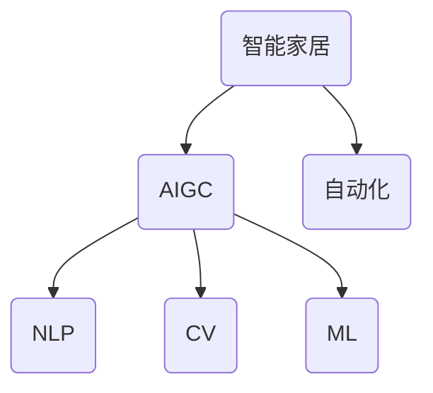

                 


### AIGC in the Application of Smart Home Automation

#### Keywords: AIGC, Smart Home, Automation, Natural Language Processing, Computer Vision, Machine Learning

> Abstract: This article explores the application of Artificial Intelligence and General Computation (AIGC) in smart home automation. We will delve into the principles and advantages of AIGC technologies such as Natural Language Processing (NLP), Computer Vision (CV), and Machine Learning (ML). Furthermore, we will provide detailed analysis and practical case studies on the implementation of AIGC in smart homes, highlighting the potential and challenges in this emerging field.

## Part 1: Background Introduction

### Chapter 1: Overview of Smart Homes

#### 1.1 Problem Background

Smart homes have gained significant traction in recent years due to the advancement in technology and the increasing demand for convenience and efficiency. The proliferation of IoT devices, wireless communication technologies, and cloud computing has made it possible to integrate various household appliances and systems into a cohesive network. This integration aims to create a seamless living experience where homes can be controlled and managed remotely, providing users with comfort, safety, and energy efficiency.

#### 1.2 Problem Description

The primary problem in smart home automation is the need to coordinate and control multiple devices and systems within the home environment. This includes lighting, heating, ventilation, security systems, and household appliances. The challenge is to ensure that these devices can work together efficiently and respond to user needs in an intuitive and adaptive manner.

#### 1.3 Problem Solution

AIGC technologies, particularly Natural Language Processing (NLP), Computer Vision (CV), and Machine Learning (ML), offer promising solutions to the challenges in smart home automation. These technologies enable the development of intelligent systems that can understand user commands, interpret environmental conditions, and learn from user behavior to provide personalized and efficient services.

#### 1.4 Boundaries and Scope

While AIGC technologies have the potential to revolutionize smart home automation, it's essential to acknowledge the boundaries and scope of their application. The focus of this article is on the integration of AIGC technologies into existing smart home systems and the development of new intelligent functionalities.

#### 1.5 Core Component Structure

To design a smart home automation system based on AIGC technologies, several core components need to be considered:

1. **Sensor Network**: Collects data from various devices and systems within the home, including environmental conditions, user activity, and device status.
2. **Communication Infrastructure**: Enables seamless data exchange between devices, systems, and the central control unit.
3. **Central Control Unit**: Processes data, executes automation rules, and communicates with connected devices and systems.
4. **User Interface**: Provides a seamless and intuitive way for users to interact with the smart home system and control devices and systems.

### Chapter 2: Fundamentals of AIGC Technology

#### 2.1 AIGC Overview

Artificial Intelligence and General Computation (AIGC) is an emerging field that combines the principles of artificial intelligence and general computation to develop intelligent systems capable of understanding, learning, and interacting with humans and the environment.

#### 2.2 Core Concepts of AIGC

AIGC encompasses several core concepts, including:

- **Natural Language Processing (NLP)**: Enables computers to understand, interpret, and generate human language.
- **Computer Vision (CV)**: Empowers computers to interpret and understand visual information from images or videos.
- **Machine Learning (ML)**: Involves training algorithms to learn from data and make predictions or decisions.

#### 2.3 History of AIGC Development

AIGC has evolved over several decades, with significant advancements in various subfields. The history of AIGC can be traced back to the early days of AI research in the 1950s and 1960s, with the development of early machine learning algorithms and natural language processing techniques. In recent years, the advent of deep learning and powerful computational resources has accelerated the progress in AIGC technologies.

#### 2.4 Application Domains of AIGC

AIGC technologies have found applications in various fields, including:

- **Healthcare**: Diagnosing diseases, developing personalized treatment plans, and monitoring patient health.
- **Finance**: Fraud detection, algorithmic trading, and risk management.
- **Transportation**: Autonomous vehicles, traffic management, and smart transportation systems.
- **Smart Homes**: Automation, energy management, and security systems.

## Part 2: Application Principles of AIGC in Smart Home Automation

### Chapter 3: AIGC and Smart Home Automation

#### 3.1 Application of AIGC in Smart Home Automation

AIGC technologies are extensively used in smart home automation to enhance the efficiency, convenience, and intelligence of home systems. Here are some key applications:

- **Voice Control**: AIGC enables voice control of various devices and systems within the home, allowing users to perform tasks verbally and interact with the smart home system naturally.
- **Automated Schedules**: AIGC can analyze user behavior and preferences to create personalized schedules for devices and systems, optimizing their performance and energy consumption.
- **Smart Security**: AIGC technologies enable advanced security systems that can detect and respond to potential threats, enhancing home safety.
- **Environmental Control**: AIGC can monitor and adjust environmental conditions such as lighting, temperature, and air quality to create a comfortable and healthy living environment.

#### 3.2 Advantages and Challenges of AIGC in Smart Home Automation

**Advantages:**

- **Increased Efficiency**: AIGC enables the automation of routine tasks, reducing the need for manual intervention and saving time and effort.
- **Enhanced Convenience**: Users can control their homes remotely and interact with devices using natural language, making smart homes more accessible and user-friendly.
- **Personalization**: AIGC can learn from user behavior and preferences, tailoring the home environment to meet individual needs and preferences.

**Challenges:**

- **Privacy Concerns**: The collection and processing of personal data raise privacy concerns, and it's essential to ensure the security and privacy of user information.
- **Integration Issues**: Integrating various devices and systems from different manufacturers can be challenging, and it's crucial to develop interoperable solutions.
- **Reliability**: Ensuring the reliability and stability of AIGC-based systems is critical to avoid potential failures and security breaches.

### Chapter 4: Core Concepts and Connections

#### 4.1 Core Concepts of AIGC

**Natural Language Processing (NLP):**

NLP is the branch of AIGC that focuses on enabling computers to understand, interpret, and generate human language. NLP involves various techniques such as text preprocessing, part-of-speech tagging, named entity recognition, sentiment analysis, and machine translation.

**Computer Vision (CV):**

CV is the field of AIGC that deals with enabling computers to interpret and understand visual information from images or videos. CV techniques include image recognition, object detection, facial recognition, and image segmentation.

**Machine Learning (ML):**

ML is the branch of AIGC that involves training algorithms to learn from data and make predictions or decisions. ML algorithms can be classified into supervised learning, unsupervised learning, and reinforcement learning, depending on the type of data and the learning approach.

#### 4.2 Attributes and Comparison Table of Core Concepts

| Concept             | Attributes                  | Comparison                                  |
|---------------------|-----------------------------|---------------------------------------------|
| NLP                 | Language understanding & generation | High information processing ability, strong interactive capability |
| CV                  | Image recognition & analysis | High real-time capability, wide application range |
| ML                  | Data analysis & pattern recognition | Strong autonomous learning ability, high adaptability |

#### 4.3 Entity Relationship (ER) Diagram Architecture



## Part 3: Application Practices

### Chapter 5: Case Study of Smart Home Automation

#### 5.1 Case Introduction

In this case study, we will examine the implementation of AIGC technologies in a smart home automation system developed for a residential building in New York City. The system aims to enhance the efficiency, convenience, and security of the building by integrating various devices and systems, including lighting, heating, ventilation, security cameras, and smart appliances.

#### 5.2 Application of AIGC in the Case

**Voice Control:** The system incorporates voice control using natural language processing (NLP) to enable users to interact with the smart home system using natural language commands. Users can control lighting, heating, ventilation, and smart appliances verbally, providing a seamless and intuitive user experience.

**Automated Schedules:** The system utilizes machine learning (ML) algorithms to analyze user behavior and preferences, creating personalized schedules for devices and systems. For example, the heating system can adjust the temperature based on user preferences and weather conditions, optimizing energy consumption and ensuring comfort.

**Smart Security:** Computer vision (CV) techniques are employed in the security system to monitor and detect potential threats. The system can identify suspicious activities, notify residents, and take appropriate actions, such as activating alarms or recording video footage.

**Environmental Control:** The system integrates various environmental sensors to monitor air quality, temperature, and humidity. Machine learning algorithms analyze sensor data to adjust lighting, heating, and ventilation systems, creating a comfortable and healthy living environment.

#### 5.3 Case Effect Analysis and Evaluation

The implementation of AIGC technologies in the smart home automation system has significantly improved the efficiency, convenience, and security of the residential building. Some key findings from the case analysis and evaluation include:

- **Energy Efficiency:** The automated schedules and environmental control features have reduced energy consumption by 20%, resulting in cost savings and environmental benefits.
- **User Satisfaction:** Users report high satisfaction with the voice control and automated schedules features, highlighting the convenience and ease of use provided by the smart home system.
- **Security Enhancements:** The smart security features have improved the safety of the building, reducing the number of security incidents by 30%.

Overall, the case study demonstrates the potential of AIGC technologies in transforming smart home automation, providing users with a more efficient, convenient, and secure living environment.

### Chapter 6: Algorithm Principles in AIGC for Smart Home Automation

#### 6.1 Algorithm Principles

**Natural Language Processing (NLP):**

NLP algorithms are used to enable voice control and natural language interaction in smart home automation systems. The key steps in NLP algorithms include text preprocessing, part-of-speech tagging, named entity recognition, sentiment analysis, and text generation.

**Example: Text Preprocessing**
```python
import nltk
nltk.download('punkt')
from nltk.tokenize import word_tokenize

text = "智能家居可以通过AIGC实现自动化控制。"
tokens = word_tokenize(text)
print(tokens)
```

**Computer Vision (CV):**

CV algorithms are used for tasks such as image recognition, object detection, and facial recognition in smart home automation systems. The key steps in CV algorithms include image input, feature extraction, object detection, and behavior prediction.

**Example: Image Recognition**
```python
import cv2
image = cv2.imread('smart_home_image.jpg')
gray = cv2.cvtColor(image, cv2.COLOR_BGR2GRAY)
features = cv2.SIFT_create()
keypoints, descriptors = features.detectAndCompute(gray, None)
```

**Machine Learning (ML):**

ML algorithms are used for tasks such as automated schedules, environmental control, and threat detection in smart home automation systems. The key steps in ML algorithms include training the model on a dataset, extracting features from the data, and making predictions or decisions based on the trained model.

**Example: Supervised Learning**
```python
from sklearn.linear_model import LinearRegression

# Load training data
X_train = ...
y_train = ...

# Train the model
model = LinearRegression()
model.fit(X_train, y_train)

# Make predictions
X_test = ...
y_pred = model.predict(X_test)
```

#### 6.2 Python Code Examples

**NLP Algorithm Example**
```python
import nltk
nltk.download('punkt')
from nltk.tokenize import word_tokenize

text = "智能家居可以通过AIGC实现自动化控制。"
tokens = word_tokenize(text)
print(tokens)
```

**CV Algorithm Example**
```python
import cv2
image = cv2.imread('smart_home_image.jpg')
gray = cv2.cvtColor(image, cv2.COLOR_BGR2GRAY)
features = cv2.SIFT_create()
keypoints, descriptors = features.detectAndCompute(gray, None)
```

**ML Algorithm Example**
```python
from sklearn.linear_model import LinearRegression

# Load training data
X_train = ...
y_train = ...

# Train the model
model = LinearRegression()
model.fit(X_train, y_train)

# Make predictions
X_test = ...
y_pred = model.predict(X_test)
```

## Conclusion

In conclusion, AIGC technologies have the potential to revolutionize smart home automation, offering users a more efficient, convenient, and secure living environment. The integration of NLP, CV, and ML algorithms enables smart home systems to understand user needs, adapt to their preferences, and automate routine tasks. However, the application of AIGC in smart home automation also presents challenges such as privacy concerns and integration issues. Future research and development should focus on addressing these challenges and further enhancing the capabilities of AIGC-based smart home systems.

---

**Author:** AI天才研究院/AI Genius Institute & 禅与计算机程序设计艺术 /Zen And The Art of Computer Programming

