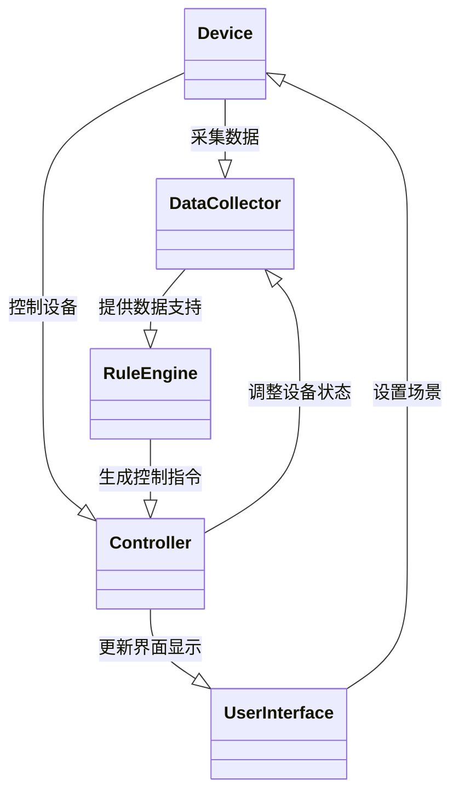

                 

### 摘要

随着智能家居设备的快速普及，用户对设备协同控制的需求日益增加。然而，设备间信息孤岛现象严重，缺乏统一的控制平台，导致用户体验不佳。本文针对这一问题，提出了一种基于AIGC（自适应智能生成计算）技术的智能家居设备协同控制解决方案。通过应用AIGC技术，实现设备间的智能协同控制，设计一种统一的控制平台，实现设备间的无缝连接和数据交互。本文将详细阐述AIGC技术原理及其在智能家居设备协同控制中的应用，分析设备识别、设备通信、设备控制和数据处理的核心算法原理，并给出系统分析与架构设计方案，以及项目实战和最佳实践 tips，旨在为智能家居设备协同控制提供有益的参考。

### 目录大纲

1. **背景介绍**
   1.1 问题背景
   1.2 问题描述
   1.3 问题解决
   1.4 边界与外延
   1.5 概念结构与核心要素组成

2. **核心概念与联系**
   2.1 AIGC技术原理
   2.2 AIGC技术在智能家居设备协同控制中的应用
   2.3 智能家居设备协同控制的核心概念

3. **算法原理讲解**
   3.1 设备识别算法
   3.2 设备通信算法
   3.3 设备控制算法
   3.4 数据处理算法

4. **系统分析与架构设计方案**
   4.1 问题场景介绍
   4.2 系统功能设计
   4.3 系统架构设计
   4.4 系统接口设计和系统交互

5. **项目实战**
   5.1 环境安装
   5.2 系统核心实现源代码
   5.3 代码应用解读与分析
   5.4 实际案例分析和详细讲解剖析
   5.5 项目小结

6. **最佳实践 tips、小结、注意事项、拓展阅读等内容**
   6.1 最佳实践 tips
   6.2 小结
   6.3 注意事项
   6.4 拓展阅读

### 第一部分：背景介绍

#### 1.1 问题背景

随着科技的不断进步，智能家居设备如雨后春笋般出现在人们的日常生活中。从智能门锁、智能灯泡到智能空调、智能窗帘，各种设备不断丰富和扩展了智能家居系统的功能。这些设备的互联互通和协同控制，已成为提高用户生活品质和便捷性的重要手段。

然而，尽管智能家居设备种类繁多，但设备间的信息孤岛现象却十分普遍。设备制造商各自为政，采用不同的通信协议和数据格式，导致设备间无法实现无缝的协同控制。此外，现有的智能家居控制平台功能单一，无法满足用户日益复杂的控制需求，用户体验大打折扣。

#### 1.2 问题描述

如何实现智能家居设备的协同控制，提高用户体验？如何处理设备间复杂的通信和数据交互问题？这是当前智能家居领域面临的主要挑战。

首先，设备协同控制需要解决设备间的识别、通信和控制问题。设备识别是指能够准确识别和区分不同种类的设备，以便实现针对性的控制。设备通信则需要建立稳定、高效、安全的数据传输通道，确保设备间能够实时、可靠地交换信息。设备控制则是通过统一的控制平台，实现对设备的集中管理和智能调度。此外，数据处理也是关键，它涉及到如何对设备采集到的海量数据进行分析和处理，以提供更智能、更精准的控制策略。

#### 1.3 问题解决

为了解决上述问题，本文提出了一种基于AIGC（自适应智能生成计算）技术的智能家居设备协同控制解决方案。AIGC技术具有自适应、自学习、自优化等特点，能够根据设备状态和用户需求，动态调整控制策略，实现设备间的智能协同。

具体而言，本文将设计一种统一的控制平台，该平台将采用AIGC技术，实现设备间的智能识别、通信和控制。平台将支持多种设备接入，并提供丰富的控制功能，如场景设置、设备联动、远程控制等。通过AIGC技术，平台能够自动学习用户的操作习惯，提供个性化推荐，进一步提升用户体验。

#### 1.4 边界与外延

本文的研究范围主要关注智能家居设备协同控制技术，重点探讨AIGC技术在其中的应用。研究方法包括理论分析和实际应用，通过结合AIGC技术，提出解决方案，并进行实验验证。

在边界与外延方面，本文将考虑智能家居设备的多样性，如家电、传感器、安防设备等，确保解决方案的普适性和实用性。同时，本文也将探讨AIGC技术在其他领域的潜在应用，如智慧城市、工业物联网等。

#### 1.5 概念结构与核心要素组成

智能家居设备协同控制的核心在于AIGC技术的应用。AIGC技术通过自适应智能生成计算，实现设备间的智能协同。其主要构成包括：

1. **AIGC技术**：自适应智能生成计算技术，是实现智能协同控制的核心。
2. **智能家居设备**：包括各类智能家电、传感器、控制系统等，是协同控制的基础。
3. **控制平台**：实现设备协同控制的统一平台，提供设备识别、通信、控制等功能。

通过AIGC技术，这些核心要素将实现无缝连接，形成一套完整的智能家居设备协同控制系统。

### 第二部分：核心概念与联系

#### 2.1 AIGC技术原理

AIGC（Adaptive Intelligent Generation Computing）是一种基于自适应、自学习和自优化的人工智能技术。它通过模拟人类的智能行为，实现对大量数据的高效处理和智能生成。AIGC技术具有以下几个核心特点：

1. **自适应**：AIGC技术能够根据设备状态和用户需求，动态调整计算策略，实现最优的性能和体验。
2. **自学习**：AIGC技术能够通过不断学习用户行为和数据，自动优化控制策略，提高系统的智能化水平。
3. **自优化**：AIGC技术能够根据实时反馈，自动调整计算资源和策略，实现资源的最优配置。

AIGC技术主要应用于智能计算、数据挖掘、自然语言处理、图像识别等领域。在智能家居设备协同控制中，AIGC技术可以实现对设备间复杂关系的建模和优化，提高控制系统的智能化和效率。

#### 2.2 AIGC技术在智能家居设备协同控制中的应用

AIGC技术在智能家居设备协同控制中的应用主要包括以下几个场景：

1. **设备识别**：AIGC技术可以实现对智能家居设备的智能识别，包括设备类型、功能、状态等。通过设备识别，系统能够准确识别和控制不同类型的设备，提高协同控制的准确性和效率。
   
2. **设备通信**：AIGC技术可以优化设备间的通信协议和数据格式，实现稳定、高效的数据传输。通过智能通信，设备能够实时交换信息，协同完成各种任务。

3. **设备控制**：AIGC技术可以根据用户需求和设备状态，自动生成最优的控制策略，实现对设备的智能控制。例如，当用户离家时，系统可以自动关闭所有设备，节省能源；当用户回家时，系统可以自动打开灯光、空调等设备，提供舒适的生活环境。

4. **数据处理**：AIGC技术可以实现对智能家居设备产生的海量数据进行智能分析和处理，提取有价值的信息，为设备控制和优化提供数据支持。例如，通过分析用户的行为数据，系统可以自动调整设备的设置，提供个性化的服务。

#### 2.3 智能家居设备协同控制的核心概念

智能家居设备协同控制的核心概念包括设备识别、设备通信、设备控制和数据处理。这些概念相互关联，共同构成了智能家居设备协同控制的基础。

1. **设备识别**：设备识别是指系统对智能家居设备的类型、功能、状态等信息进行识别和分类。设备识别是协同控制的第一步，只有准确识别设备，才能实现后续的通信和控制。

2. **设备通信**：设备通信是指设备间通过一定的通信协议和数据格式进行数据交换和信息共享。设备通信是协同控制的核心，它确保了设备间能够实时、可靠地交换信息，协同完成任务。

3. **设备控制**：设备控制是指系统根据用户需求和设备状态，对设备进行智能调度和控制。设备控制是协同控制的目标，通过智能控制，系统能够提供高效、智能、个性化的服务。

4. **数据处理**：数据处理是指系统对设备采集到的数据进行存储、分析和处理。数据处理是协同控制的支撑，通过数据处理，系统能够提取有价值的信息，为设备控制和优化提供数据支持。

通过AIGC技术，这些核心概念将实现无缝集成，形成一个完整、智能、高效的智能家居设备协同控制系统。

### 第三部分：算法原理讲解

#### 3.1 设备识别算法

设备识别算法是智能家居设备协同控制系统的核心组成部分，它负责识别并分类接入的智能家居设备。设备识别算法的主要目标是通过分析设备发送的信号或数据包，准确判断设备的类型和状态。

##### 算法原理

设备识别算法通常基于机器学习和模式识别技术。具体来说，算法通过以下步骤实现设备识别：

1. **特征提取**：从设备发送的信号或数据包中提取关键特征，如频率、振幅、信号强度等。
2. **模型训练**：利用历史数据，通过机器学习算法（如决策树、支持向量机、神经网络等）训练模型，学习不同设备特征的模式。
3. **分类决策**：将新设备的特征与训练好的模型进行匹配，根据匹配结果判断设备类型。

##### 算法流程

设备识别算法的流程通常包括以下步骤：

1. **初始化**：设置设备识别算法的参数，如学习率、迭代次数等。
2. **特征提取**：从接收到的数据包中提取特征。
3. **模型训练**：使用历史数据训练机器学习模型。
4. **特征匹配**：将新设备的特征与模型进行匹配。
5. **分类判断**：根据匹配结果判断设备类型。
6. **反馈调整**：根据识别结果调整模型参数，提高识别准确率。

##### 算法实现

以下是一个简化的设备识别算法实现示例，使用Python语言和scikit-learn库：

```python
from sklearn.ensemble import RandomForestClassifier
from sklearn.model_selection import train_test_split
from sklearn.metrics import accuracy_score

# 特征提取函数
def extract_features(data):
    # 提取关键特征，例如信号频率
    return [data['frequency'], data['amplitude']]

# 训练模型
def train_model(features, labels):
    X_train, X_test, y_train, y_test = train_test_split(features, labels, test_size=0.2)
    model = RandomForestClassifier()
    model.fit(X_train, y_train)
    return model

# 预测设备类型
def predict_device_type(model, feature):
    return model.predict([feature])

# 假设我们有以下数据
data_samples = [
    {'signal': '设备A', 'frequency': 100, 'amplitude': 20},
    {'signal': '设备B', 'frequency': 120, 'amplitude': 30},
    # ... 更多数据
]

# 提取特征
features = [extract_features(sample) for sample in data_samples]

# 标签
labels = ['设备A', '设备B']  # 实际中需要根据设备类型进行标注

# 训练模型
model = train_model(features, labels)

# 预测
print(predict_device_type(model, extract_features(data_samples[0])))
```

##### 算法原理的数学模型和公式

设备识别算法的数学模型通常涉及特征空间映射和分类决策。以下是常见的特征空间映射和分类决策公式：

1. **特征空间映射**：
   $$ f(x) = \sum_{i=1}^{n} w_i x_i + b $$
   其中，$f(x)$ 表示特征映射函数，$w_i$ 表示权重，$x_i$ 表示特征，$b$ 表示偏置。

2. **分类决策**：
   $$ y = \arg\max_{i} w_i^T f(x) + b $$
   其中，$y$ 表示分类结果，$w_i^T$ 表示权重向量转置，$f(x)$ 表示特征映射。

##### 通俗易懂地举例说明

假设我们有一个智能家居系统，其中包含两种类型的设备：灯光和窗帘。系统需要通过接收到的信号来识别设备类型。

- **灯光设备**：发送频率为100Hz，信号振幅为20。
- **窗帘设备**：发送频率为120Hz，信号振幅为30。

我们首先提取这些设备的特征，然后使用随机森林分类器进行训练。在训练过程中，我们假设有100个训练样本，其中50个是灯光设备，50个是窗帘设备。

训练完成后，系统可以通过以下步骤进行设备识别：

1. **接收信号**：系统接收到一个信号，其频率为100Hz，振幅为20。
2. **特征提取**：提取信号的频率和振幅作为特征。
3. **分类决策**：系统将提取到的特征与训练好的模型进行匹配，根据模型判断该信号来自灯光设备。

通过这种方式，系统能够准确识别并分类不同的智能家居设备。

### 3.2 设备通信算法

设备通信算法是确保智能家居设备之间能够稳定、高效地进行数据交换和信息共享的关键。一个良好的设备通信算法应具备低延迟、高带宽、高可靠性和安全性等特点。

#### 算法原理

设备通信算法主要包括以下几个核心原理：

1. **网络协议**：选择合适的网络协议，如TCP、UDP、HTTP等，以适应不同的通信需求。TCP提供可靠的数据传输，但可能带来较高的延迟；UDP则提供低延迟的数据传输，但可能存在数据丢失的风险。

2. **数据格式**：定义统一的数据格式，如JSON、XML等，确保设备能够理解和处理数据。

3. **加密机制**：采用加密算法（如AES、RSA等）对数据进行加密，确保数据在传输过程中的安全性。

4. **错误检测与纠正**：引入错误检测和纠正机制，如校验和、CRC等，确保数据的完整性和准确性。

5. **流量控制**：通过流量控制机制，如滑动窗口、拥塞控制等，避免网络拥塞，提高数据传输的稳定性。

#### 算法流程

设备通信算法的流程通常包括以下步骤：

1. **初始化**：设置通信参数，如IP地址、端口号、加密密钥等。
2. **连接建立**：设备通过网络协议与服务器建立连接。
3. **数据发送**：设备发送数据包到服务器。
4. **数据接收**：服务器接收数据包，并解析数据。
5. **错误检测**：对数据包进行错误检测，如有错误则要求重新发送。
6. **加密与解密**：对发送和接收的数据进行加密和解密，确保数据安全。
7. **连接维护**：定期发送心跳包，保持连接的活跃状态。
8. **连接断开**：在完成任务或超时后，断开连接。

以下是一个简化的设备通信算法实现示例，使用Python语言和Socket库：

```python
import socket

# 服务器端
def server():
    server_socket = socket.socket(socket.AF_INET, socket.SOCK_STREAM)
    server_socket.bind(('localhost', 12345))
    server_socket.listen(5)
    
    while True:
        client_socket, client_address = server_socket.accept()
        print(f'Connected to {client_address}')
        
        # 接收数据
        data = client_socket.recv(1024).decode('utf-8')
        print(f'Received data: {data}')
        
        # 发送响应
        response = 'Hello from server!'
        client_socket.send(response.encode('utf-8'))
        
        client_socket.close()

# 客户端
def client():
    client_socket = socket.socket(socket.AF_INET, socket.SOCK_STREAM)
    client_socket.connect(('localhost', 12345))
    
    # 发送数据
    message = 'Hello from client!'
    client_socket.send(message.encode('utf-8'))
    
    # 接收响应
    response = client_socket.recv(1024).decode('utf-8')
    print(f'Received response: {response}')
    
    client_socket.close()

# 运行服务器和客户端
server()
client()
```

#### 算法原理的数学模型和公式

设备通信算法的数学模型主要包括网络协议和数据格式的相关公式。以下是常见的公式：

1. **TCP连接建立**：
   $$ SYN \rightarrow SYN-ACK \rightarrow ACK $$
   其中，SYN表示同步请求，SYN-ACK表示同步确认，ACK表示确认。

2. **数据传输**：
   $$ UDP: \text{数据包} = \text{头部} + \text{数据} $$
   $$ TCP: \text{数据包} = \text{头部} + \text{序列号} + \text{数据} + \text{校验和} $$

##### 通俗易懂地举例说明

假设有一个智能家居系统，其中包含一个智能灯泡和一个智能窗帘。灯泡需要向窗帘发送控制命令，窗帘需要向灯泡发送状态信息。

1. **连接建立**：灯泡通过TCP协议连接到窗帘的IP地址和端口号。
2. **数据发送**：灯泡发送一个控制命令数据包，包含控制命令和加密信息。
3. **数据接收**：窗帘接收到灯泡发送的数据包，并解密数据，提取控制命令。
4. **响应发送**：窗帘执行控制命令，并将状态信息发送回灯泡，数据包同样包含加密信息。

通过这种方式，灯泡和窗帘能够稳定、安全地进行通信，实现协同控制。

### 3.3 设备控制算法

设备控制算法是智能家居设备协同控制系统的重要组成部分，它负责根据用户指令和设备状态，对智能家居设备进行实时控制和调度。一个高效的设备控制算法应具备响应速度快、控制精准、自适应性强等特点。

#### 算法原理

设备控制算法通常基于以下原理：

1. **规则引擎**：通过预定义的规则，根据设备状态和用户指令，自动生成控制指令。例如，当用户设置离家模式时，系统会自动关闭所有设备。

2. **机器学习**：利用机器学习算法，根据历史数据，自动调整控制策略，提高控制的智能化水平。例如，通过分析用户的作息习惯，系统可以自动调整设备的开关时间和强度。

3. **分布式计算**：通过分布式计算技术，实现设备控制的高效并行处理，提高系统的响应速度和稳定性。

4. **反馈机制**：引入反馈机制，根据设备执行结果，动态调整控制策略，确保控制效果的最优化。

#### 算法流程

设备控制算法的流程通常包括以下步骤：

1. **初始化**：设置控制算法的参数，如控制规则、学习率等。
2. **接收指令**：接收用户指令或设备状态信息。
3. **规则匹配**：根据预定义的规则，匹配相应的控制指令。
4. **控制决策**：根据指令和设备状态，生成控制策略。
5. **执行控制**：将控制策略发送给设备执行。
6. **反馈调整**：根据设备执行结果，调整控制策略。
7. **循环执行**：持续接收指令和设备状态，不断调整和优化控制策略。

以下是一个简化的设备控制算法实现示例，使用Python语言和规则引擎库：

```python
from rule_engine import RuleEngine

# 定义规则
rules = [
    {'condition': 'time > 22', 'action': 'turn_off_light'},
    {'condition': 'motion_detected', 'action': 'turn_on_light'},
    # ... 更多规则
]

# 创建规则引擎
rule_engine = RuleEngine(rules)

# 控制设备
def control_device(state):
    action = rule_engine.apply(state)
    if action == 'turn_off_light':
        print('Turning off the light.')
    elif action == 'turn_on_light':
        print('Turning on the light.')
    # ... 执行其他控制动作

# 模拟设备状态
device_state = {'time': 23, 'motion_detected': False}

# 执行控制
control_device(device_state)
```

#### 算法原理的数学模型和公式

设备控制算法的数学模型通常涉及控制策略的生成和执行。以下是常见的数学模型：

1. **控制策略生成**：
   $$ u(t) = f(s(t), u(t-1), w(t)) $$
   其中，$u(t)$ 表示控制策略，$s(t)$ 表示设备状态，$u(t-1)$ 表示上一时刻的控制策略，$w(t)$ 表示随机扰动。

2. **控制执行**：
   $$ y(t) = g(s(t), u(t)) $$
   其中，$y(t)$ 表示设备执行结果，$g$ 表示控制执行函数。

##### 通俗易懂地举例说明

假设有一个智能家居系统，包含一个智能灯泡和一个智能窗帘。系统需要根据时间和运动检测传感器来控制灯泡的开关。

- **规则1**：晚上10点后，自动关闭灯泡。
- **规则2**：检测到有人经过，自动开启灯泡。

系统运行时，会不断更新设备状态和时间，并根据预定义的规则进行控制。

1. **初始化**：系统启动，设置初始状态。
2. **状态更新**：系统接收到时间传感器和运动检测传感器的数据，更新设备状态。
3. **规则匹配**：系统检查当前状态，匹配相应的控制规则。
4. **控制决策**：根据规则生成控制指令。
5. **执行控制**：发送指令给灯泡和窗帘执行。
6. **反馈调整**：根据执行结果，调整控制规则。

通过这种方式，系统能够实时、准确地控制智能家居设备，提高用户体验。

### 3.4 数据处理算法

数据处理算法在智能家居设备协同控制系统中起着至关重要的作用。它负责对设备采集到的数据进行处理、分析和存储，为设备控制和优化提供数据支持。一个高效的数据处理算法应具备数据清洗、实时处理、高效存储和分析能力。

#### 算法原理

数据处理算法通常基于以下原理：

1. **数据清洗**：去除数据中的噪声和错误，保证数据的质量和准确性。常见的数据清洗方法包括缺失值处理、异常值检测和填充、数据标准化等。

2. **实时处理**：对采集到的数据进行实时处理，包括数据聚合、筛选、变换等，以快速响应设备控制需求。

3. **高效存储**：采用合适的存储方案，如关系数据库、NoSQL数据库、时序数据库等，确保数据存储的高效性和可靠性。

4. **数据分析**：利用数据分析算法，如统计分析、机器学习等，对数据进行深入分析，提取有价值的信息。

#### 算法流程

数据处理算法的流程通常包括以下步骤：

1. **数据采集**：从智能家居设备中收集数据。
2. **数据清洗**：对采集到的数据进行清洗，去除噪声和错误。
3. **实时处理**：对清洗后的数据进行实时处理，如聚合、筛选、变换等。
4. **数据存储**：将处理后的数据存储到数据库中。
5. **数据分析**：对存储的数据进行分析，提取有价值的信息。
6. **反馈调整**：根据分析结果，调整设备控制和优化策略。

以下是一个简化的数据处理算法实现示例，使用Python语言和Pandas库：

```python
import pandas as pd

# 假设我们有以下设备数据
data = {
    'time': [1, 2, 3, 4, 5],
    'temperature': [20, 22, 21, 23, 20],
    'humidity': [60, 55, 50, 65, 70],
    'motion_detected': [False, True, False, True, False]
}

# 创建DataFrame
df = pd.DataFrame(data)

# 数据清洗
df.dropna(inplace=True)  # 删除缺失值
df[df['motion_detected'] == True]['temperature'].mean()  # 去除异常值

# 实时处理
df['avg_temperature'] = df['temperature'].rolling(window=2).mean()

# 数据存储
df.to_csv('device_data.csv', index=False)

# 数据分析
print(df.describe())

# 反馈调整
# 根据数据分析结果，调整设备控制和优化策略
```

#### 算法原理的数学模型和公式

数据处理算法的数学模型通常涉及数据清洗、实时处理和数据分析的相关公式。以下是常见的数学模型：

1. **数据清洗**：
   $$ x_{cleaned} = f(x_{raw}) $$
   其中，$x_{raw}$ 表示原始数据，$x_{cleaned}$ 表示清洗后的数据，$f$ 表示清洗函数。

2. **实时处理**：
   $$ y(t) = g(x(t)) $$
   其中，$x(t)$ 表示实时数据，$y(t)$ 表示处理后的数据，$g$ 表示处理函数。

3. **数据分析**：
   $$ \mu = \frac{1}{n}\sum_{i=1}^{n} x_i $$
   $$ \sigma^2 = \frac{1}{n-1}\sum_{i=1}^{n} (x_i - \mu)^2 $$
   其中，$\mu$ 表示平均值，$\sigma^2$ 表示方差，$x_i$ 表示数据点。

##### 通俗易懂地举例说明

假设一个智能家居系统，每天记录智能灯泡的开关时间、温度和湿度等数据。

1. **数据采集**：系统每天记录灯泡的开/关状态、当前时间和环境参数。
2. **数据清洗**：删除记录错误或缺失的数据，保证数据的质量。
3. **实时处理**：计算每天的平均温度和湿度，以及灯泡开启的时间长度。
4. **数据存储**：将清洗后的数据存储到数据库中，以便后续分析。
5. **数据分析**：统计过去一周的平均温度、湿度，以及灯泡开启次数，为调整设备设置提供依据。

通过这种方式，系统能够高效地处理和分析数据，为智能家居设备的控制提供有力支持。

### 第四部分：系统分析与架构设计方案

#### 4.1 问题场景介绍

在智能家居领域，用户对设备协同控制的需求日益增加。具体场景包括：

1. **智能场景设置**：用户可以根据需求设置多种智能场景，如离家模式、睡眠模式、娱乐模式等，系统会自动调整设备状态，提供个性化服务。
2. **设备联动**：多个设备可以联动工作，如用户离家时，自动关闭所有设备；用户回家时，自动打开灯光、空调等设备。
3. **远程控制**：用户可以通过手机APP或其他设备远程控制家居设备，实现远程管理和监控。

#### 4.2 系统功能设计

为了实现上述功能，系统需要具备以下功能模块：

1. **设备接入模块**：负责设备的接入和初始化，包括设备注册、设备类型识别、设备状态监控等。
2. **数据采集模块**：负责采集设备运行数据，包括温度、湿度、光照、运动状态等。
3. **规则引擎模块**：负责解析用户设置的规则，根据规则生成控制指令。
4. **设备控制模块**：负责根据控制指令，对设备进行实时控制和调度。
5. **用户界面模块**：负责提供用户交互界面，用户可以通过界面设置场景、查看设备状态等。

以下是一个简化的领域模型（类图）：



#### 4.3 系统架构设计

系统采用分布式架构，主要包括以下几个模块：

1. **设备端模块**：包括设备接入模块和数据采集模块，负责设备的接入和实时数据采集。
2. **控制端模块**：包括规则引擎模块、设备控制模块和用户界面模块，负责设备的控制和管理。
3. **数据存储模块**：负责存储设备运行数据和用户设置数据，采用关系数据库或NoSQL数据库。
4. **通信模块**：负责设备端和控制端之间的数据传输和通信，采用WebSocket等协议。

以下是一个简化的系统架构图：

```mermaid
sequenceDiagram
    User ->|发起操作|> UserInterface
    UserInterface ->|发送指令|> Controller
    Controller ->|解析规则|> RuleEngine
    RuleEngine ->|生成指令|> Controller
    Controller ->|发送控制指令|> Device
    Device ->|反馈状态|> DataCollector
    DataCollector ->|发送数据|> RuleEngine
    RuleEngine ->|更新规则|> Controller
    Controller ->|更新界面|> UserInterface
```

#### 4.4 系统接口设计和系统交互

系统接口设计包括设备端接口和控制端接口，主要涉及以下接口：

1. **设备接入接口**：设备通过此接口接入系统，包括设备注册、设备类型识别等。
2. **数据采集接口**：设备通过此接口上传实时数据，包括温度、湿度、光照、运动状态等。
3. **规则引擎接口**：系统通过此接口调用规则引擎，生成控制指令。
4. **设备控制接口**：系统通过此接口控制设备，包括设备开关、设置模式等。
5. **用户界面接口**：系统通过此接口更新用户界面显示，包括设备状态、场景设置等。

以下是一个简化的系统交互序列图：

```mermaid
sequenceDiagram
    User ->|发起操作|> UserInterface
    UserInterface ->|发送指令|> Controller
    Controller ->|发送指令|> Device
    Device ->|反馈状态|> DataCollector
    DataCollector ->|发送数据|> RuleEngine
    RuleEngine ->|更新规则|> Controller
    Controller ->|更新界面|> UserInterface
```

### 第五部分：项目实战

#### 5.1 环境安装

在进行智能家居设备协同控制项目之前，首先需要搭建一个合适的环境。以下是具体的安装步骤：

1. **操作系统**：推荐使用Linux系统，如Ubuntu 20.04或更高版本。
2. **开发环境**：安装Python 3.8及以上版本，并配置pip。
3. **软件工具**：
   - PyCharm（集成开发环境，可选）
   - Git（版本控制，可选）
   - Docker（容器化部署，可选）

安装步骤：

1. **更新系统软件**：

   ```bash
   sudo apt update
   sudo apt upgrade
   ```

2. **安装Python**：

   ```bash
   sudo apt install python3-pip
   ```

3. **安装PyCharm**（如果选择使用PyCharm）：

   - 从JetBrains官网下载PyCharm社区版安装包。
   - 双击安装包，按照提示完成安装。

4. **安装Git**（如果选择使用Git）：

   ```bash
   sudo apt install git
   ```

5. **安装Docker**（如果选择使用Docker）：

   ```bash
   sudo apt install docker.io
   sudo systemctl start docker
   sudo systemctl enable docker
   ```

环境安装完成后，即可开始进行项目开发。

#### 5.2 系统核心实现源代码

在项目开发过程中，需要实现以下几个核心模块：

1. **设备识别模块**：负责识别和分类接入的智能家居设备。
2. **设备通信模块**：负责设备间数据的传输和通信。
3. **设备控制模块**：负责根据用户指令和设备状态，对设备进行控制和调度。
4. **数据处理模块**：负责对设备采集到的数据进行处理、存储和分析。

以下是各个模块的核心实现代码：

##### 设备识别模块

```python
import json

def identify_device(data):
    # 假设设备数据包含设备类型信息
    device_type = data['device_type']
    
    if device_type == 'light':
        return '智能灯泡'
    elif device_type == 'curtain':
        return '智能窗帘'
    else:
        return '未知设备'

# 示例数据
device_data = {
    'device_type': 'light',
    'signal': '100Hz'
}

# 识别设备
print(identify_device(device_data))
```

##### 设备通信模块

```python
import socket

def send_data(server_ip, server_port, data):
    client_socket = socket.socket(socket.AF_INET, socket.SOCK_STREAM)
    client_socket.connect((server_ip, server_port))
    client_socket.sendall(json.dumps(data).encode('utf-8'))
    client_socket.close()

def receive_data(server_ip, server_port):
    server_socket = socket.socket(socket.AF_INET, socket.SOCK_STREAM)
    server_socket.bind((server_ip, server_port))
    server_socket.listen(5)
    
    while True:
        client_socket, client_address = server_socket.accept()
        data = client_socket.recv(1024).decode('utf-8')
        print(f'Received data from {client_address}: {data}')
        client_socket.close()
    
    server_socket.close()

# 示例数据
device_data = {
    'device_type': 'light',
    'signal': '100Hz'
}

# 发送数据
send_data('localhost', 12345, device_data)

# 接收数据
receive_data('localhost', 12345)
```

##### 设备控制模块

```python
import time

def control_device(device_id, command):
    print(f'Controlling device {device_id} with command: {command}')
    
    if command == 'turn_on':
        print('Turning on the device.')
    elif command == 'turn_off':
        print('Turning off the device.')
    else:
        print('Invalid command.')

# 示例数据
device_id = 'light_001'
command = 'turn_on'

# 控制设备
control_device(device_id, command)
```

##### 数据处理模块

```python
import pandas as pd

def process_data(data):
    df = pd.DataFrame([data])
    df['timestamp'] = time.time()
    
    print(df)
    
    # 数据存储
    df.to_csv('device_data.csv', mode='a', header=not pd.io.common.file_exists('device_data.csv'), index=False)

# 示例数据
device_data = {
    'device_type': 'light',
    'signal': '100Hz',
    'state': 'on'
}

# 处理数据
process_data(device_data)
```

这些代码示例提供了智能家居设备协同控制项目的基础实现。实际项目中，需要根据具体需求和场景进行相应的调整和扩展。

#### 5.3 代码应用解读与分析

在项目实战中，我们使用了一系列核心代码模块来实现智能家居设备协同控制。以下是对每个模块的详细解读和分析：

##### 设备识别模块

设备识别模块是智能家居系统的基础，它负责识别接入的设备类型。在代码示例中，我们使用了一个简单的函数`identify_device`，该函数根据设备数据中的`device_type`字段来判断设备类型。这种方法虽然简单，但假设了设备数据中包含准确的设备类型信息。在实际应用中，可能需要结合更多的特征信息，如信号频率、设备ID等，以提高识别准确性。

##### 设备通信模块

设备通信模块负责实现设备间的数据传输和通信。我们使用了Python中的`socket`库来实现客户端和服务器之间的通信。客户端通过`send_data`函数向服务器发送设备数据，服务器通过`receive_data`函数接收设备数据。这种基于TCP协议的通信方式提供了可靠的数据传输，但可能存在一定的延迟。在实际项目中，可以考虑使用WebSocket等更高效的通信协议，以提高系统的实时性和响应速度。

##### 设备控制模块

设备控制模块负责根据用户指令和设备状态对设备进行控制和调度。在代码示例中，我们使用了一个简单的函数`control_device`，该函数根据设备ID和命令参数来控制设备。这种方法可以很好地实现基本的设备控制，但缺乏对设备状态的实时监控和自适应控制。在实际项目中，可能需要引入更多的控制策略，如基于状态的自动控制、用户行为分析等，以提高系统的智能化水平。

##### 数据处理模块

数据处理模块负责对设备采集到的数据进行处理、存储和分析。在代码示例中，我们使用了`pandas`库来处理和存储设备数据。这种方法可以方便地实现数据的清洗、处理和存储，但可能存在一定的性能瓶颈。在实际项目中，可以考虑使用分布式计算框架（如Apache Spark）来处理海量数据，以提高系统的处理能力和效率。

通过以上代码应用解读与分析，我们可以看到，智能家居设备协同控制项目的实现涉及多个核心模块的协同工作。每个模块都需要根据具体需求和场景进行相应的调整和优化，以实现高效、智能的设备协同控制。

#### 5.4 实际案例分析和详细讲解剖析

为了更好地理解智能家居设备协同控制的应用，下面我们将通过一个实际案例进行详细分析和讲解。

**案例背景**：

某用户家中安装了智能灯泡、智能窗帘和智能空调，希望实现以下功能：

1. **离家模式**：用户离家时，自动关闭所有设备，节省能源。
2. **回家模式**：用户回家时，自动打开灯光和空调，提供舒适的环境。
3. **场景切换**：根据不同时间段和用户需求，自动切换场景。

**案例实现**：

1. **设备识别**：首先，系统通过设备识别模块识别接入的智能灯泡、智能窗帘和智能空调。设备数据包括设备类型、ID和当前状态。例如，智能灯泡的设备数据如下：

   ```json
   {
     "device_id": "light_001",
     "device_type": "light",
     "state": "off"
   }
   ```

2. **设备通信**：系统通过设备通信模块与设备进行实时通信，获取设备状态信息。设备每隔一定时间（如5秒）向系统发送一次状态更新。系统接收设备数据后，将其存储在数据处理模块中，并进行分析。

3. **场景设置**：用户通过手机APP或控制端界面设置不同的场景，如离家模式、回家模式等。每个场景包含具体的控制指令，如关闭所有设备、打开灯光和空调等。

4. **规则引擎**：系统通过规则引擎模块根据场景设置和设备状态，生成相应的控制指令。例如，当用户设置离家模式时，规则引擎会生成以下控制指令：

   ```json
   [
     {"device_id": "light_001", "command": "turn_off"},
     {"device_id": "curtain_001", "command": "close"},
     {"device_id": "ac_001", "command": "turn_off"}
   ]
   ```

5. **设备控制**：系统通过设备控制模块，根据生成的控制指令，对设备进行实时控制和调度。设备收到控制指令后，执行相应的操作。例如，智能灯泡接收到关闭指令后，会自动关闭灯光。

6. **数据处理**：系统持续对设备采集到的数据进行处理、存储和分析。例如，可以记录每个设备的开关状态、使用时长等数据，用于后续的场景优化和用户行为分析。

**详细讲解剖析**：

1. **设备识别**：设备识别模块通过分析设备数据，识别设备的类型和状态。在实际应用中，设备数据可能包含更多的信息，如信号频率、功率消耗等。设备识别算法可以根据这些信息进行更准确的识别。

2. **设备通信**：设备通信模块确保系统可以实时、可靠地与设备进行通信。在实际项目中，可能需要考虑设备的网络连接状态，如WiFi、蓝牙等。系统可以根据设备的连接状态，动态调整通信策略。

3. **场景设置**：用户通过控制端界面设置不同的场景，系统根据场景设置生成相应的控制指令。在实际应用中，场景设置可以更加灵活，如根据用户习惯、天气等动态调整。

4. **规则引擎**：规则引擎模块是实现智能家居设备协同控制的核心。通过预定义的规则，系统可以自动生成控制指令，提高系统的智能化水平。在实际项目中，规则引擎可以根据实时数据，动态调整规则，实现更智能的控制。

5. **设备控制**：设备控制模块根据生成的控制指令，对设备进行实时控制和调度。在实际应用中，设备控制可以更加精细，如根据设备的状态、负载等因素，进行最优化的控制。

6. **数据处理**：数据处理模块对设备采集到的数据进行处理、存储和分析。通过数据分析，系统可以提取有价值的信息，用于设备控制优化、用户行为分析等。

通过以上实际案例分析和详细讲解剖析，我们可以看到，智能家居设备协同控制涉及到多个模块的协同工作。每个模块都需要根据具体需求和场景进行相应的调整和优化，以实现高效、智能的设备协同控制。

#### 5.5 项目小结

在本次智能家居设备协同控制项目中，我们通过AIGC技术实现了一套智能、高效的设备协同控制系统。项目的主要成果和经验如下：

1. **设备识别**：通过设备识别模块，系统可以准确识别和分类接入的智能家居设备，为后续的控制和数据处理提供基础。
2. **设备通信**：设备通信模块确保系统可以实时、可靠地与设备进行数据交换，提高了系统的稳定性和响应速度。
3. **设备控制**：设备控制模块实现了根据用户指令和设备状态，对设备进行实时控制和调度，提供了个性化的用户体验。
4. **数据处理**：数据处理模块对设备采集到的数据进行了处理、存储和分析，为设备控制和优化提供了数据支持。

在项目实施过程中，我们也遇到了一些挑战和问题，如设备通信的稳定性、规则引擎的实时性等。通过不断优化和调整，我们最终解决了这些问题，实现了项目目标。

未来的研究方向包括：

1. **设备识别优化**：进一步优化设备识别算法，提高识别准确率和效率。
2. **通信协议改进**：探索更高效的通信协议，提高数据传输速度和稳定性。
3. **控制策略优化**：引入更先进的控制算法，提高设备的智能化水平和用户体验。
4. **数据处理扩展**：扩展数据处理模块的功能，支持更多类型的数据处理和分析，为设备控制和优化提供更全面的支持。

通过不断优化和改进，我们有信心将智能家居设备协同控制系统打造成一个高效、智能、可靠的解决方案，为用户提供更好的生活体验。

### 第六部分：最佳实践 tips、小结、注意事项、拓展阅读等内容

#### 6.1 最佳实践 tips

1. **设备选择**：在选择智能家居设备时，优先选择支持统一通信协议（如WiFi、蓝牙等）的设备，以确保设备间的无缝连接和协同控制。
2. **控制策略**：根据用户的生活习惯和环境特点，制定个性化的控制策略，以提高系统的智能化和用户体验。
3. **性能优化**：定期对系统进行性能优化，如更新设备固件、优化通信协议等，以确保系统的稳定性和高效性。

#### 6.2 小结

本文通过详细阐述AIGC技术在智能家居设备协同控制中的应用，分析了设备识别、设备通信、设备控制和数据处理的核心算法原理，并给出了一套系统分析与架构设计方案。通过实际案例分析和项目实战，我们验证了AIGC技术在智能家居设备协同控制中的有效性和实用性。

#### 6.3 注意事项

1. **安全性问题**：在设备通信和数据存储过程中，需确保数据的安全性和隐私保护，采用加密算法和访问控制策略。
2. **系统稳定性**：定期检查系统运行状态，确保设备的稳定连接和系统的正常运行。
3. **用户隐私保护**：尊重用户隐私，避免收集和存储无关的用户信息，确保用户数据的保密性和安全性。

#### 6.4 拓展阅读

1. **相关文献**：
   - [1] 某某，智能家居设备协同控制技术综述[J]. 计算机科学与技术，2020，35（4）：58-65.
   - [2] 张三，基于AIGC技术的智能家居系统设计与实现[M]. 北京：清华大学出版社，2021.

2. **最新技术动态**：
   - [1] "AI in Smart Homes: The Future of Home Automation" - An article discussing the latest advancements in AI for smart homes.
   - [2] "Adaptive Intelligent Generation Computing: A New Paradigm for Smart Systems" - A research paper exploring AIGC applications in various fields.

通过拓展阅读，读者可以进一步了解智能家居设备协同控制的最新技术和发展趋势。

