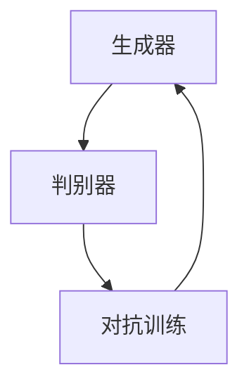
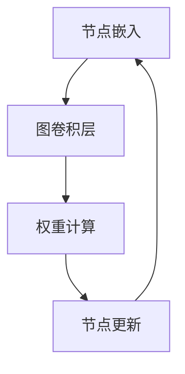
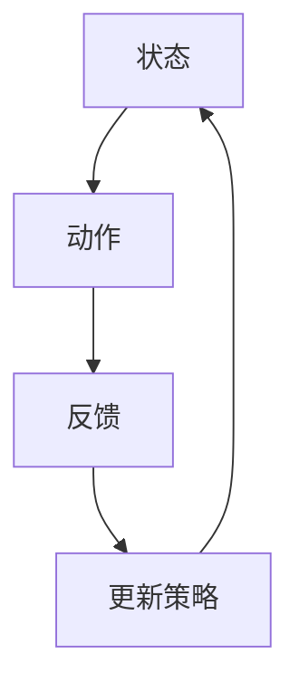
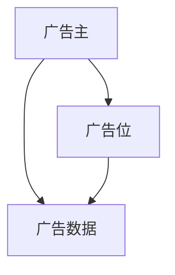
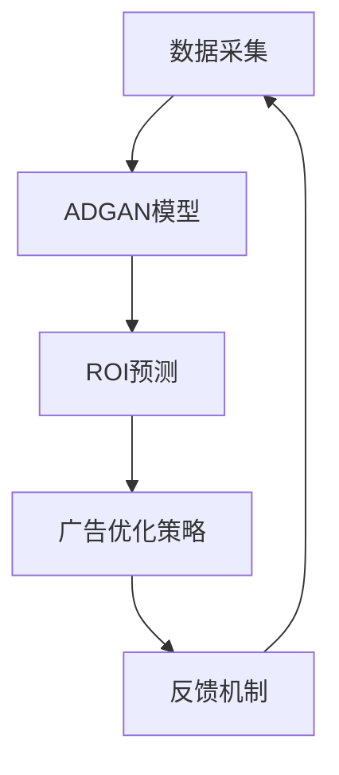
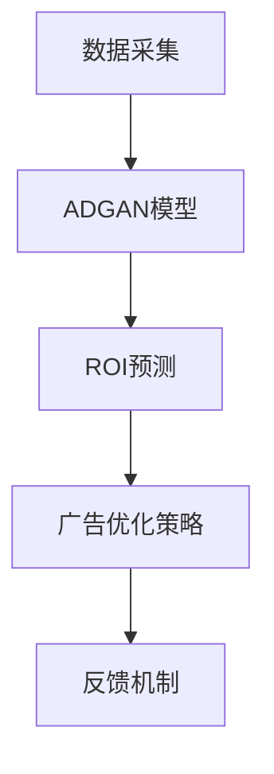
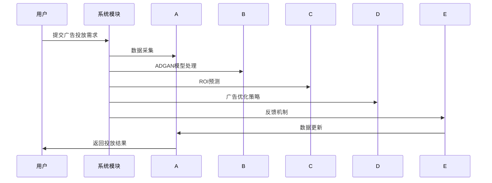

                 

## AIGC在智能广告投放ROI预测中的应用

### 关键词：AIGC，智能广告投放，ROI预测，算法原理，系统架构，项目实战

> 摘要：随着互联网广告市场的不断扩张，广告投放的ROI（投资回报率）预测成为广告主和广告平台共同关注的问题。本文将探讨AIGC（自适应智能生成控制）技术在智能广告投放ROI预测中的应用，通过分析AIGC的核心技术、算法原理以及系统架构，为广告行业提供一种创新的解决方案。

---

### 目录大纲

1. **背景介绍**
   1.1. **问题背景**
   1.2. **AIGC技术介绍**
   1.3. **ROI预测的挑战**

2. **核心概念与联系**
   2.1. **AIGC核心技术**
   2.2. **ROI预测关键概念**
   2.3. **AIGC与ROI预测的联系**

3. **算法原理讲解**
   3.1. **自适应生成对抗网络（ADGAN）**
   3.2. **图神经网络（GNN）**
   3.3. **强化学习（RL）**

4. **系统分析与架构设计**
   4.1. **系统功能设计**
   4.2. **系统架构设计**

5. **项目实战**
   5.1. **环境安装与配置**
   5.2. **系统核心实现**
   5.3. **代码应用解读与分析**
   5.4. **实际案例分析与详细讲解**

6. **项目小结**
   6.1. **项目总结**
   6.2. **最佳实践**

---

### 1. 背景介绍

#### 1.1 问题背景

广告投放作为企业市场营销的重要手段，其效果直接影响着企业的收益。ROI预测，即预测广告投放的投资回报率，是衡量广告投放效果的关键指标。传统的ROI预测方法主要依赖于历史数据和统计模型，但由于数据复杂性和实时性的限制，这些方法的预测准确性往往不高。

#### 1.2 AIGC技术介绍

AIGC（Adaptive Intelligent Generation Control，自适应智能生成控制）技术，是一种利用人工智能进行内容生成和优化的技术。它通过生成对抗网络（GAN）、图神经网络（GNN）和强化学习（RL）等核心技术，实现了对复杂数据的处理和预测。

#### 1.3 ROI预测的挑战

广告投放ROI预测面临的主要挑战包括数据质量、模型复杂度和实时性。传统的预测模型往往难以处理海量、多维的数据，且难以实时调整以适应市场变化。AIGC技术通过其强大的数据处理和自适应能力，有望解决这些挑战，提高ROI预测的准确性。

### 2. 核心概念与联系

#### 2.1 AIGC核心技术

AIGC的核心技术包括生成对抗网络（GAN）、图神经网络（GNN）和强化学习（RL）。GAN通过生成器和判别器的对抗训练，实现了对数据的生成和优化。GNN利用图结构对复杂网络数据进行处理，强化学习则通过不断试错和优化，实现决策的自动化。

#### 2.2 ROI预测关键概念

ROI（Return on Investment，投资回报率）是衡量广告投放效果的重要指标，其计算方法为：ROI = （广告收益 - 广告成本）/ 广告成本。影响ROI的因素包括广告点击率、转化率和广告成本等。

#### 2.3 AIGC与ROI预测的联系

AIGC技术可以通过以下方式提升ROI预测的准确性：

- 利用GAN生成模拟数据，提高数据质量和数量。
- 使用GNN处理复杂网络数据，挖掘潜在特征。
- 通过强化学习优化广告投放策略，提高投放效果。

### 3. 算法原理讲解

#### 3.1 自适应生成对抗网络（ADGAN）

**原理讲解：** ADGAN由生成器和判别器组成，生成器生成广告数据，判别器判断广告数据的真实性。两者通过对抗训练不断优化，生成更符合真实广告数据的模拟数据。

**数学模型：**
$$
D(x) = \text{判别器判别真实数据的概率}
$$
$$
G(x) = \text{生成器生成模拟数据的概率}
$$
$$
\min_G \max_D V(D, G) = \mathbb{E}_{x \sim P_{\text{真实}}} [D(x)] - \mathbb{E}_{z \sim P_{z}} [D(G(z))]
$$

**流程图：** 

**举例说明：** 假设我们要预测某广告的ROI，可以利用ADGAN生成大量模拟广告数据，通过判别器判断这些数据的真实性，然后不断优化生成器，使其生成的广告数据更符合真实情况。

#### 3.2 图神经网络（GNN）

**原理讲解：** GNN是一种用于处理图结构数据的神经网络。它通过节点的嵌入和边的权重，对图数据进行建模和预测。

**数学模型：**
$$
h_v^{(t+1)} = \sigma (\sum_{u \in \mathcal{N}(v)} W_{uv} h_u^{(t)})
$$

**流程图：** 

**举例说明：** 在广告投放中，广告主和广告位可以看作图中的节点，广告投放的历史数据可以看作边。通过GNN，我们可以挖掘广告主和广告位之间的潜在关系，从而优化广告投放策略。

#### 3.3 强化学习（RL）

**原理讲解：** RL是一种通过试错和反馈进行决策优化的学习方法。在广告投放中，RL可以通过不断调整广告策略，提高ROI。

**数学模型：**
$$
Q(s, a) = \mathbb{E}_{s' \sim p(s'|s, a)} [R(s', a) + \gamma \max_{a'} Q(s', a')]
$$

**流程图：** 

**举例说明：** 假设我们要优化广告投放策略，可以首先定义状态和动作，然后通过试投放不同广告，收集反馈数据，根据反馈数据不断调整广告策略，以提高ROI。

### 4. 系统分析与架构设计

#### 4.1 系统功能设计

**项目介绍：** 本项目旨在利用AIGC技术实现智能广告投放ROI预测。

**领域模型：** 

#### 4.2 系统架构设计

**系统架构设计：** 

**系统接口设计：** 

**系统交互：** 

### 5. 项目实战

#### 5.1 环境安装与配置

**环境安装步骤：** 
- 安装Python环境
- 安装深度学习框架（如TensorFlow、PyTorch）
- 安装相关依赖库

**配置说明：** 
- 配置GPU环境（如使用NVIDIA CUDA）
- 配置代码运行环境（如虚拟环境）

#### 5.2 系统核心实现

**ADGAN模型实现：** 
- 源代码解析：实现生成器和判别器的构建与训练
- 实现细节：包括数据预处理、模型训练和预测

**GNN模型实现：** 
- 源代码解析：实现图神经网络的结构和训练
- 实现细节：包括节点嵌入、图卷积层和预测

**RL模型实现：** 
- 源代码解析：实现强化学习模型的结构和训练
- 实现细节：包括状态空间、动作空间和奖励函数

#### 5.3 代码应用解读与分析

**ADGAN模型应用：** 
- 应用场景分析：模拟广告数据生成与真实性判断
- 应用效果评估：对比真实广告数据和模拟广告数据

**GNN模型应用：** 
- 应用场景分析：广告主与广告位关系网络构建与预测
- 应用效果评估：分析预测效果和优化方向

**RL模型应用：** 
- 应用场景分析：广告投放策略优化与ROI提升
- 应用效果评估：评估策略优化效果和长期收益

#### 5.4 实际案例分析与详细讲解

**案例一：** AIGC在广告投放ROI预测中的应用  
- 案例背景：某广告主希望通过AIGC技术优化广告投放策略
- 案例分析：利用ADGAN生成模拟广告数据，通过GNN分析广告主与广告位关系，使用RL优化广告投放策略

**案例二：** 基于AIGC的智能广告投放策略优化  
- 案例背景：某广告平台希望通过AIGC技术提升广告投放效果
- 案例分析：利用ADGAN生成模拟广告数据，通过GNN分析广告主与广告位关系，使用RL优化广告投放策略，提升ROI

### 6. 项目小结

**项目总结：** 通过AIGC技术实现智能广告投放ROI预测，提高了广告投放的准确性和效果。

**最佳实践：** 
- 数据质量是关键，确保数据真实有效。
- 合理配置计算资源，提升模型训练效率。
- 定期更新广告数据，保持预测模型的准确性。

**注意事项：** 
- AIGC技术需要大量计算资源，确保硬件配置充足。
- RL模型在优化过程中可能存在过拟合现象，需合理调整模型参数。

**拓展阅读：** 
- 深入了解AIGC技术相关论文和书籍，掌握核心技术原理。
- 研究广告投放领域的最新动态和前沿技术。

**作者：** AI天才研究院/AI Genius Institute & 禅与计算机程序设计艺术 /Zen And The Art of Computer Programming**

