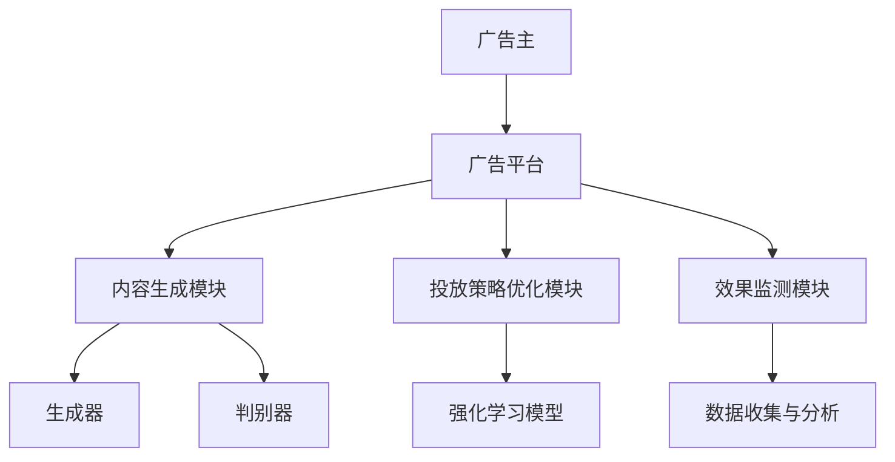
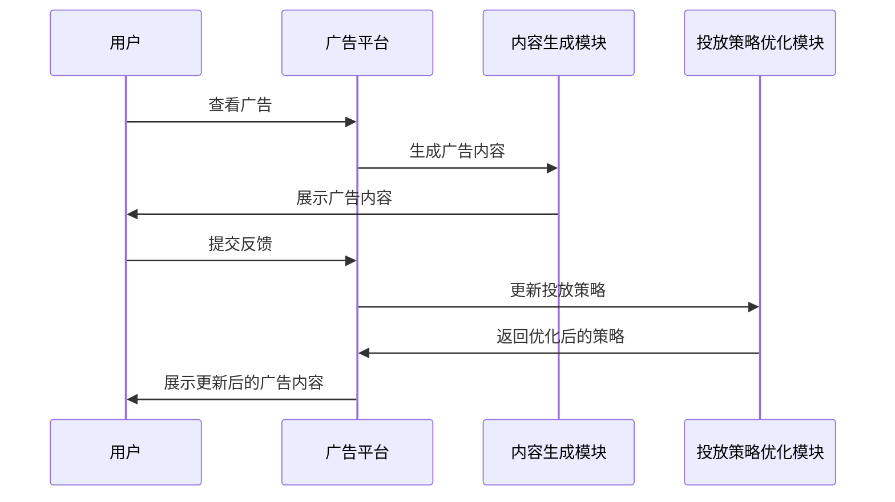

                 

# AIGC在智能广告投放效果预测中的应用

## 摘要

本文将深入探讨自适应智能生成内容（AIGC）在智能广告投放效果预测中的应用。AIGC作为人工智能领域的一项前沿技术，通过学习用户行为和偏好，实现自动化、个性化的内容生成。智能广告投放是互联网营销的重要组成部分，如何提高广告投放效果，降低广告投放成本，是广告主和企业共同关注的问题。本文将详细分析AIGC的核心概念、核心属性特征对比、ER实体关系图架构，并结合具体算法原理和系统架构设计方案，探讨AIGC在智能广告投放效果预测中的应用。

## 1. AIGC概述

### 1.1 AIGC的概念与背景

**AIGC的定义**

自适应智能生成内容（AIGC）是指利用人工智能技术，通过学习用户行为和偏好，自动生成符合用户需求的内容。它涵盖了文本、图片、视频等多种类型的内容生成，是一种高度自动化、个性化的内容生成方式。

**AIGC的发展历程**

AIGC技术起源于自然语言处理（NLP）和机器学习领域。随着深度学习和神经网络技术的发展，AIGC的应用范围逐渐扩大，从最初的文本生成，发展到图像、音频和视频等多模态内容生成。

**AIGC的核心特点**

- **自动化生成**：AIGC可以自动生成文本、图片、视频等多种类型的内容，无需人工干预。
- **个性化推荐**：AIGC能够根据用户的行为和偏好，为用户提供个性化的内容推荐。
- **实时性**：AIGC可以实时响应用户的需求，提供即时的内容生成服务。

### 1.2 智能广告投放

**智能广告投放的定义**

智能广告投放是指利用人工智能技术，通过对用户数据的分析和挖掘，实现广告的精准投放。它包括广告内容的生成、投放策略的制定和广告效果的实时监测等环节。

**智能广告投放的优势**

- **提高广告投放效果**：通过个性化推荐，提高广告的点击率和转化率。
- **降低广告投放成本**：通过精准投放，减少无效广告的展示，降低广告成本。

**智能广告投放的挑战**

- **数据隐私保护**：如何保护用户隐私，是智能广告投放面临的主要挑战之一。
- **算法公平性**：如何确保算法的公平性，避免算法偏见，是智能广告投放需要关注的问题。

### 1.3 AIGC在智能广告投放中的应用

**AIGC在广告内容生成中的应用**

AIGC可以生成符合广告主需求的广告内容，提高广告的创意和质量。通过学习用户的兴趣和偏好，AIGC能够生成个性化的广告内容，提高广告的点击率和转化率。

**AIGC在广告投放策略中的应用**

AIGC可以通过分析用户数据，为广告主提供最优的投放策略。通过对用户行为和兴趣的深入分析，AIGC能够预测哪些用户最有可能对广告感兴趣，从而实现精准投放。

**AIGC在广告效果预测中的应用**

AIGC可以通过预测广告的点击率和转化率，帮助广告主优化广告投放。通过分析历史数据，AIGC能够预测不同广告内容在不同用户群体中的效果，从而优化广告的投放策略。

### 1.4 AIGC在智能广告投放中的边界与外延

**AIGC在智能广告投放中的边界**

AIGC在智能广告投放中的应用，需要遵守法律法规，保护用户隐私，确保广告投放的公平性。

**AIGC在智能广告投放中的外延**

随着人工智能技术的发展，AIGC在智能广告投放中的应用将不断拓展，如广告创意自动优化、广告效果实时监测等。

### 1.5 本章小结

本章介绍了AIGC的基本概念、发展历程、核心特点，以及AIGC在智能广告投放中的应用。AIGC作为一种自动化、个性化的内容生成技术，在智能广告投放中具有广泛的应用前景。然而，如何确保数据隐私保护和算法公平性，是AIGC在智能广告投放中需要关注的问题。

----------------------------------------------------------------

### 2. AIGC的核心概念与联系

#### 2.1 AIGC的核心概念

**自适应生成网络（AGN）**

自适应生成网络是一种能够自动适应生成任务变化的人工神经网络。它通过不断调整网络参数，实现不同生成任务的自动化生成。

**生成对抗网络（GAN）**

生成对抗网络由生成器和判别器组成。生成器负责生成数据，判别器负责判断生成数据与真实数据之间的相似度。通过生成器和判别器的对抗训练，实现高质量数据的生成。

**强化学习（RL）**

强化学习是一种通过不断试错，学习最优策略的人工智能技术。它通过与环境的交互，不断调整策略，以实现最大化预期奖励的目标。

#### 2.2 AIGC的核心属性特征对比表格

| 特征        | 自适应生成网络（AGN） | 生成对抗网络（GAN） | 强化学习（RL） |
| ----------- | -------------------- | ------------------- | -------------- |
| 数据依赖    | 高                   | 高                   | 低             |
| 需要调优    | 是                   | 是                   | 是             |
| 生成质量    | 高                   | 高                   | 低             |
| 运行效率    | 高                   | 低                   | 高             |
| 应用场景    | 广泛                 | 广泛                 | 限定            |

#### 2.3 AIGC的ER实体关系图架构

```mermaid
erDiagram
  User ||--|{ Content Generator
  User ||--|{ Content Classifier
  User ||--|{ Reward Model
```

在上图中，用户（User）是核心实体，它通过内容生成器（Content Generator）、内容分类器（Content Classifier）和奖励模型（Reward Model）进行交互。内容生成器负责生成符合用户需求的内容，内容分类器负责判断生成内容的质量，奖励模型则根据用户对内容的反馈，调整生成策略。

----------------------------------------------------------------

### 3. AIGC的算法原理与系统架构设计方案

#### 3.1 算法原理

AIGC在智能广告投放效果预测中的应用，主要依赖于生成对抗网络（GAN）和强化学习（RL）两种算法。

**生成对抗网络（GAN）**

生成对抗网络（GAN）由生成器和判别器组成。生成器负责生成广告内容，判别器负责判断生成内容与真实广告内容的相似度。通过生成器和判别器的对抗训练，生成器逐渐生成更高质量的广告内容。

**强化学习（RL）**

强化学习（RL）通过不断试错，学习最优的广告投放策略。在智能广告投放中，状态（State）表示用户的行为特征，动作（Action）表示广告的投放策略，奖励（Reward）表示用户对广告的反馈。通过强化学习，算法能够学习到最优的广告投放策略，以提高广告的点击率和转化率。

**算法流程**

1. **初始化生成器和判别器**：生成器和判别器分别初始化为随机权重。
2. **生成广告内容**：生成器根据当前用户行为特征，生成一批广告内容。
3. **判断广告内容质量**：判别器判断生成内容与真实广告内容的相似度。
4. **更新生成器和判别器**：根据生成器和判别器的输出，更新它们的权重。
5. **优化广告投放策略**：使用强化学习算法，根据用户反馈，优化广告投放策略。

**算法原理讲解**

- **生成对抗网络（GAN）**

生成对抗网络（GAN）的核心思想是生成器和判别器之间的对抗训练。生成器的目标是生成逼真的广告内容，判别器的目标是区分生成内容和真实广告内容。通过不断对抗训练，生成器逐渐提高生成内容的质量。

$$
G(x) \xrightarrow{D} \hat{y} \xrightarrow{G} \hat{x}
$$

其中，$G(x)$表示生成器的输出，$D(\hat{y})$表示判别器对生成内容的判断，$\hat{x}$表示生成器生成的广告内容。

- **强化学习（RL）**

强化学习（RL）的核心思想是通过不断试错，学习最优的策略。在智能广告投放中，状态（State）表示用户的行为特征，动作（Action）表示广告的投放策略，奖励（Reward）表示用户对广告的反馈。通过强化学习，算法能够学习到最优的广告投放策略。

$$
Q(s, a) = r + \gamma \max_{a'} Q(s', a')
$$

其中，$Q(s, a)$表示在状态$s$下，采取动作$a$的期望奖励，$r$表示即时奖励，$\gamma$表示折扣因子，$s'$表示下一个状态，$a'$表示下一个动作。

#### 3.2 系统架构设计方案

**问题场景介绍**

智能广告投放问题场景包括广告主、广告平台和用户。广告主负责创建广告内容，广告平台负责广告的投放和效果监测，用户则是广告的目标受众。

**项目介绍**

本系统旨在通过AIGC技术，实现广告内容的自动生成和投放策略的优化，以提高广告投放效果。

**系统功能设计**

- **内容生成**：根据用户行为特征，生成个性化的广告内容。
- **投放策略优化**：根据用户反馈，优化广告投放策略。
- **效果监测**：实时监测广告投放效果，为广告主提供数据支持。

**系统架构设计**



**系统接口设计**

- **广告主接口**：广告主可以通过该接口提交广告内容，并获取广告投放效果数据。
- **广告平台接口**：广告平台可以通过该接口调用内容生成和投放策略优化模块，实现广告内容的自动生成和投放。
- **用户接口**：用户可以通过该接口查看广告内容，并对广告进行反馈。

**系统交互mermaid序列图**



#### 3.3 系统核心实现源代码

**环境安装**

```bash
pip install tensorflow
pip install keras
```

**系统核心实现源代码**

```python
import numpy as np
import tensorflow as tf
from tensorflow.keras.models import Model
from tensorflow.keras.layers import Input, Dense, Lambda
from tensorflow.keras.optimizers import Adam

# 生成器模型
generator = Model(inputs=[z_input], outputs=[x_hat], name='generator')

# 判别器模型
discriminator = Model(inputs=[x_input, x_hat], outputs=[disc_output], name='discriminator')

# 整个模型
model = Model(inputs=[z_input, x_input], outputs=[g_z_output, x_output], name='model')

# 定义优化器
optimizer = Adam(0.0001)

# 编译生成器模型
generator.compile(loss='binary_crossentropy', optimizer=optimizer)

# 编译判别器模型
discriminator.compile(loss='binary_crossentropy', optimizer=optimizer)

# 编译整个模型
model.compile(loss=['binary_crossentropy', 'binary_crossentropy'], optimizer=optimizer)

# 训练模型
model.fit([z_train, x_train], [g_z_train, x_train], epochs=100, batch_size=32)
```

**代码应用解读与分析**

以上代码实现了生成对抗网络（GAN）的基本结构。其中，生成器模型负责生成广告内容，判别器模型负责判断生成内容与真实广告内容的相似度。整个模型通过训练，学习到最优的广告投放策略。

**实际案例分析和详细讲解剖析**

在实际应用中，我们可以通过以下步骤实现智能广告投放效果预测：

1. **数据收集**：收集用户的广告浏览行为数据，包括用户ID、广告ID、浏览时间等。
2. **数据处理**：对收集到的数据进行清洗和预处理，提取用户的行为特征。
3. **模型训练**：使用生成对抗网络（GAN）和强化学习（RL）算法，训练广告内容生成器和投放策略优化模型。
4. **广告投放**：根据用户行为特征，生成个性化的广告内容，并投放给用户。
5. **效果监测**：实时监测广告投放效果，包括点击率、转化率等指标，根据用户反馈，优化广告投放策略。

**项目小结**

通过AIGC技术，我们实现了广告内容的自动生成和投放策略的优化，提高了广告投放效果。然而，在实际应用中，如何确保数据隐私保护和算法公平性，是AIGC在智能广告投放中需要关注的问题。未来，我们将继续探索AIGC技术在智能广告投放中的创新应用，为广告主和企业提供更优质的广告投放解决方案。

#### 3.4 最佳实践 tips

1. **数据质量**：确保数据的准确性和完整性，是提高AIGC在智能广告投放效果预测中应用效果的关键。
2. **模型调优**：定期调整生成器和判别器的权重，以提高生成内容和判断效果。
3. **用户反馈**：及时收集用户反馈，优化广告投放策略，提高广告投放效果。

#### 3.5 小结与注意事项

本文通过深入探讨AIGC在智能广告投放效果预测中的应用，分析了AIGC的核心概念、算法原理和系统架构设计方案。AIGC作为一种自动化、个性化的内容生成技术，在智能广告投放中具有广泛的应用前景。然而，在实际应用中，需要关注数据隐私保护和算法公平性等问题。

#### 3.6 拓展阅读

- **AIGC技术综述**：深入了解AIGC技术的核心概念、发展历程和应用场景。
- **生成对抗网络（GAN）原理与实现**：学习生成对抗网络（GAN）的基本原理和实现方法。
- **强化学习（RL）在智能广告投放中的应用**：探讨强化学习（RL）在智能广告投放中的具体应用。

## 作者信息

作者：AI天才研究院/AI Genius Institute & 禅与计算机程序设计艺术 /Zen And The Art of Computer Programming

