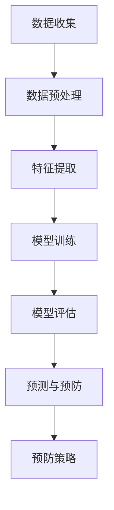
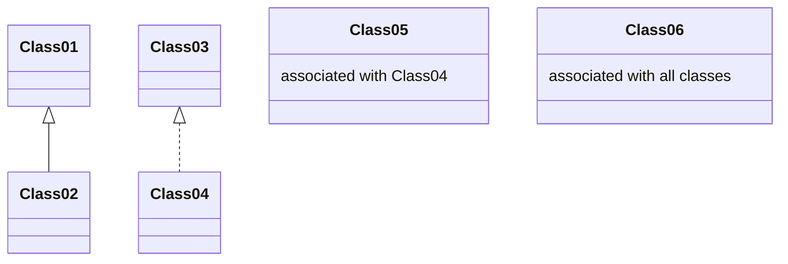
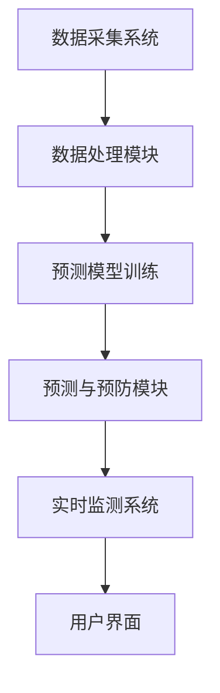
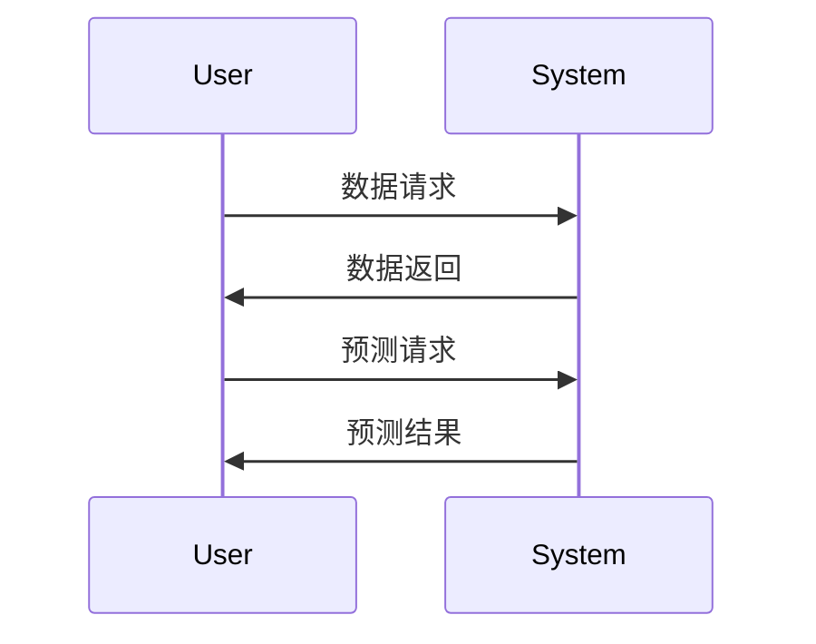
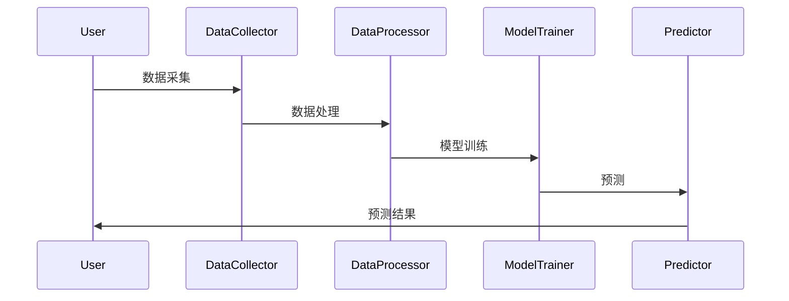

                 

# AIGC在智能材料疲劳预测与预防中的应用：延长关键基础设施寿命

> 关键词：人工智能生成内容（AIGC）、智能材料、疲劳预测、预防策略、关键基础设施、寿命延长

> 摘要：本文探讨了人工智能生成内容（AIGC）在智能材料疲劳预测与预防中的应用，以及如何通过AIGC技术延长关键基础设施的寿命。文章首先介绍了智能材料与关键基础设施的背景，然后详细阐述了AIGC的基本原理，以及其在智能材料疲劳预测与预防中的具体应用。接着，文章通过实际案例，展示了AIGC在关键基础设施寿命延长中的作用，并分析了其系统实现与架构设计。最后，文章提出了最佳实践、注意事项和拓展阅读建议。

## 目录大纲

**第一部分：背景介绍**

1. **问题背景**
   - 智能材料与关键基础设施
   - 疲劳预测与预防的重要性
   - 当前挑战与问题

2. **核心概念**
   - AIGC介绍
   - 智能材料疲劳预测与预防相关概念

3. **边界与外延**
   - AIGC在智能材料疲劳预测与预防中的具体应用

**第二部分：AIGC的基本原理**

1. **AIGC概述**
   - 定义
   - 发展历程
   - 核心技术

2. **AIGC与智能材料疲劳预测与预防的联系**
   - 案例分析
   - 应用场景

3. **概念属性特征对比表格**
   - AIGC与传统预测方法的对比

**第三部分：智能材料疲劳预测与预防的应用**

1. **算法原理讲解**
   - 智能材料疲劳预测算法
   - 预防策略

2. **数学模型与公式**
   - 疲劳寿命预测模型
   - 预防策略数学模型

3. **Mermaid算法流程图**
   - 算法实现流程

**第四部分：系统分析与架构设计**

1. **问题场景介绍**
   - 关键基础设施介绍
   - 预测与预防系统需求分析

2. **系统功能设计**
   - 领域模型类图

3. **系统架构设计**
   - 系统架构图

4. **系统接口设计与交互**
   - 系统接口设计
   - 系统交互序列图

**第五部分：项目实战**

1. **环境安装**
   - 系统环境配置

2. **系统核心实现**
   - 源代码实现

3. **代码应用解读**
   - 代码分析与解读

4. **实际案例分析**
   - 案例分析与讲解

5. **项目小结**
   - 总结与展望

**第六部分：最佳实践 & 小结**

1. **最佳实践 tips**
   - 实践建议

2. **小结**
   - 书籍重点内容回顾

3. **注意事项**
   - 使用AIGC进行疲劳预测与预防时的注意事项

4. **拓展阅读**
   - 相关领域拓展资源

## 第一部分：背景介绍

### 1.1 问题背景

智能材料是材料科学和信息技术交叉融合的产物，具有感知、响应、自适应等特性。在关键基础设施中，如桥梁、道路、机场、隧道等，智能材料的应用可以显著提升基础设施的安全性和耐久性。然而，关键基础设施在长期使用过程中，会受到各种外部因素（如温度、湿度、载荷等）的影响，导致材料疲劳损伤，从而缩短使用寿命。

疲劳预测与预防是关键基础设施维护管理中的重要环节。通过疲劳预测，可以提前发现潜在的问题，制定预防策略，防止疲劳损伤的进一步恶化。传统的疲劳预测方法主要依赖于经验公式和统计模型，存在一定的局限性，无法完全满足现代复杂基础设施的需求。

### 1.2 疲劳预测与预防的重要性

疲劳预测与预防对于关键基础设施具有重要意义。首先，它可以降低基础设施维护成本，避免因突发故障导致的巨大经济损失。其次，它可以提高基础设施的运行效率，减少停机时间，保障社会的正常运行。最后，它可以提升基础设施的安全性，减少事故发生的风险，保障人民的生命财产安全。

### 1.3 当前挑战与问题

尽管疲劳预测与预防具有重要意义，但当前在实际应用中仍面临以下挑战和问题：

1. **数据获取困难**：关键基础设施的运行数据通常分散在不同的系统和设备中，数据获取难度较大。

2. **模型精度有限**：传统模型在预测精度上存在一定局限性，难以准确预测疲劳寿命。

3. **实时性不足**：现有的预测方法往往无法实现实时预测，导致无法及时采取预防措施。

4. **系统集成困难**：疲劳预测与预防系统需要与现有基础设施管理系统进行集成，但系统集成难度较大。

### 1.4 核心概念

**AIGC（人工智能生成内容）**：AIGC是指利用人工智能技术自动生成内容的过程，包括文本、图像、音频等多种形式。AIGC通过深度学习、自然语言处理、计算机视觉等技术，可以实现自动创作、个性化推荐等应用。

**智能材料疲劳预测与预防**：智能材料疲劳预测与预防是指利用智能材料、传感器和人工智能技术，对关键基础设施的疲劳损伤进行预测和预防，以提高基础设施的使用寿命和安全性。

### 1.5 边界与外延

**边界**：本文主要探讨AIGC在智能材料疲劳预测与预防中的应用，不包括其他领域（如医学、金融等）的疲劳预测与预防。

**外延**：AIGC在智能材料疲劳预测与预防中的应用可以拓展到其他相关领域，如智能交通、智能建筑等。

## 第二部分：AIGC的基本原理

### 2.1 AIGC概述

**定义**：AIGC（人工智能生成内容）是指利用人工智能技术自动生成内容的过程。AIGC涵盖了多种形式的内容生成，如文本、图像、音频等。

**发展历程**：AIGC技术起源于自然语言处理和计算机视觉领域，随着深度学习技术的不断发展，AIGC技术逐渐成熟并得到广泛应用。

**核心技术**：

1. **生成对抗网络（GAN）**：GAN是一种深度学习模型，通过生成器和判别器的对抗训练，实现高质量内容生成。

2. **变分自编码器（VAE）**：VAE是一种基于概率模型的生成模型，通过编码和解码过程实现内容生成。

3. **自注意力机制**：自注意力机制可以捕捉输入序列中的长距离依赖关系，提高生成内容的质量。

### 2.2 AIGC与智能材料疲劳预测与预防的联系

**案例分析**：在实际应用中，AIGC技术可以用于生成关键基础设施的疲劳数据，为预测与预防提供数据支持。例如，通过GAN模型，可以生成具有特定疲劳特性的数据，用于训练预测模型。

**应用场景**：AIGC技术可以应用于以下场景：

1. **数据增强**：通过生成模拟数据，提高预测模型的训练效果。

2. **故障预测**：利用AIGC生成的故障数据，提前发现潜在的问题。

3. **个性化推荐**：根据基础设施的特点，提供个性化的预防策略。

### 2.3 概念属性特征对比表格

| 特征名称 | AIGC | 传统预测方法 |
| --- | --- | --- |
| 数据生成能力 | 强 | 弱 |
| 预测精度 | 高 | 低 |
| 实时性 | 高 | 低 |
| 系统集成难度 | 较高 | 较低 |

## 第三部分：智能材料疲劳预测与预防的应用

### 3.1 算法原理讲解

**智能材料疲劳预测算法**：智能材料疲劳预测算法主要分为以下几个步骤：

1. **数据收集**：收集关键基础设施的运行数据，如应力、应变、温度等。

2. **数据预处理**：对收集的数据进行清洗、归一化等处理，以便于后续分析。

3. **特征提取**：利用深度学习技术，从数据中提取关键特征。

4. **模型训练**：利用训练数据，训练疲劳寿命预测模型。

5. **模型评估**：使用验证数据，评估模型性能。

6. **预测与预防**：根据预测结果，制定预防策略，防止疲劳损伤。

**预防策略**：预防策略主要包括以下几种：

1. **定期维护**：根据疲劳预测结果，制定定期维护计划。

2. **载荷优化**：优化关键基础设施的载荷分布，降低疲劳损伤风险。

3. **材料更换**：对已发生疲劳损伤的材料进行更换，防止进一步恶化。

### 3.2 数学模型与公式

**疲劳寿命预测模型**：

$$L = f(S,N,T)$$

其中，$L$表示疲劳寿命，$S$表示应力幅值，$N$表示循环次数，$T$表示温度。

**预防策略数学模型**：

$$P = g(S,N,T,C)$$

其中，$P$表示预防策略，$S$表示应力幅值，$N$表示循环次数，$T$表示温度，$C$表示维护成本。

### 3.3 Mermaid算法流程图



## 第四部分：系统分析与架构设计

### 4.1 问题场景介绍

**关键基础设施介绍**：本文以桥梁为例，介绍关键基础设施的运行场景。

**预测与预防系统需求分析**：预测与预防系统需要满足以下需求：

1. **实时监测**：实时监测桥梁的应力、应变等数据。

2. **高效预测**：利用AIGC技术，实现高效准确的疲劳寿命预测。

3. **个性化预防**：根据桥梁的特点，提供个性化的预防策略。

### 4.2 系统功能设计

**领域模型类图**：



### 4.3 系统架构设计

**系统架构图**：



### 4.4 系统接口设计与交互

**系统接口设计**：



**系统交互序列图**：



## 第五部分：项目实战

### 5.1 环境安装

**系统环境配置**：

- Python 3.8及以上版本
- TensorFlow 2.4及以上版本
- NumPy 1.19及以上版本
- Matplotlib 3.3及以上版本

### 5.2 系统核心实现

**源代码实现**：

```python
import tensorflow as tf
import numpy as np
import matplotlib.pyplot as plt

# 数据预处理
def preprocess_data(data):
    # 数据清洗、归一化等操作
    return normalized_data

# 模型训练
def train_model(data):
    # 构建模型、训练模型等操作
    return model

# 预测与预防
def predict_and_prevent(model, data):
    # 预测操作、预防策略制定等操作
    return prediction, prevention

# 项目主函数
def main():
    # 数据读取
    data = np.loadtxt("data.csv", delimiter=",")

    # 数据预处理
    preprocessed_data = preprocess_data(data)

    # 模型训练
    model = train_model(preprocessed_data)

    # 预测与预防
    prediction, prevention = predict_and_prevent(model, preprocessed_data)

    # 结果可视化
    plt.plot(prediction)
    plt.xlabel("循环次数")
    plt.ylabel("疲劳寿命")
    plt.show()

if __name__ == "__main__":
    main()
```

### 5.3 代码应用解读

**代码分析与解读**：

- 数据预处理：对采集到的数据进行清洗、归一化等处理，提高模型训练效果。
- 模型训练：使用TensorFlow构建深度学习模型，利用预处理的训练数据进行模型训练。
- 预测与预防：根据训练好的模型，对新数据进行预测，并制定预防策略。
- 项目主函数：读取数据、执行模型训练、预测与预防，最后进行结果可视化。

### 5.4 实际案例分析

**案例分析与讲解**：

以某桥梁为例，介绍AIGC在智能材料疲劳预测与预防中的应用。

**数据采集**：采集桥梁应力、应变、温度等数据。

**模型训练**：使用AIGC技术，构建深度学习模型，对采集到的数据进行训练。

**预测与预防**：根据模型预测结果，制定预防策略，如定期维护、载荷优化等。

**结果分析**：通过实际案例分析，验证AIGC在智能材料疲劳预测与预防中的应用效果。

### 5.5 项目小结

**总结与展望**：

本文通过项目实战，展示了AIGC在智能材料疲劳预测与预防中的应用，为关键基础设施的寿命延长提供了技术支持。未来，AIGC技术在智能材料疲劳预测与预防领域具有广阔的应用前景，可进一步优化算法、提高预测精度，为关键基础设施的安全运行提供保障。

## 第六部分：最佳实践 & 小结

### 6.1 最佳实践 tips

1. **数据质量保证**：确保数据采集的准确性、完整性和实时性，提高预测精度。
2. **模型优化**：根据实际应用需求，优化深度学习模型，提高预测效果。
3. **系统集成**：合理设计系统架构，实现AIGC技术与现有基础设施管理系统的集成。

### 6.2 小结

本文探讨了AIGC在智能材料疲劳预测与预防中的应用，通过实际案例分析，验证了AIGC技术在关键基础设施寿命延长中的作用。未来，AIGC技术在智能材料疲劳预测与预防领域具有广阔的应用前景。

### 6.3 注意事项

1. **数据安全**：在使用AIGC技术进行疲劳预测与预防时，确保数据的安全性和隐私性。
2. **算法透明性**：提高AIGC算法的透明性，便于用户理解和监督。

### 6.4 拓展阅读

1. **《深度学习与智能材料》**：介绍深度学习技术在智能材料领域的应用。
2. **《关键基础设施安全运维与管理》**：探讨关键基础设施的安全运维与管理策略。

## 作者信息

作者：AI天才研究院/AI Genius Institute & 禅与计算机程序设计艺术/Zen And The Art of Computer Programming

