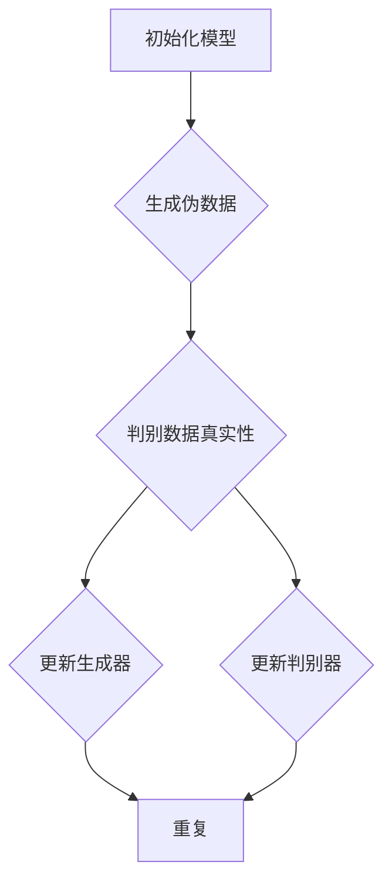
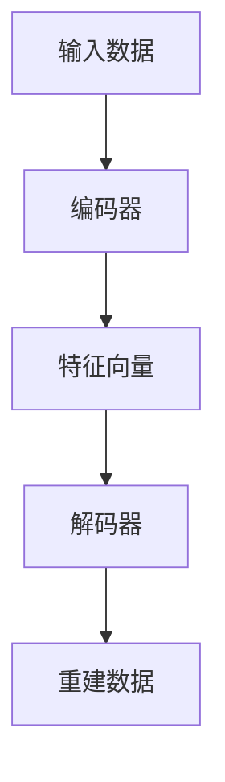
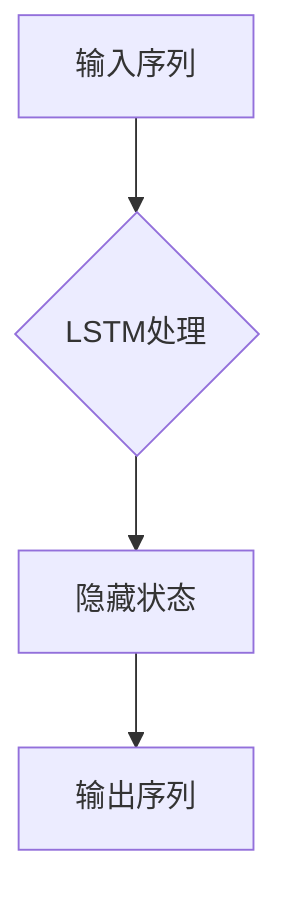
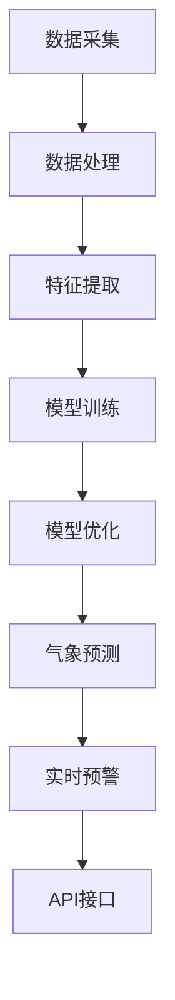
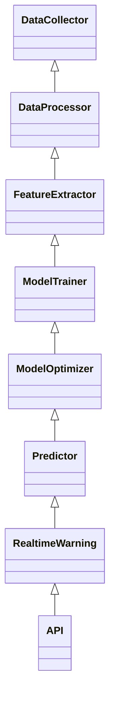

                 

### 引言与背景

#### 问题背景

智能气象灾害是指利用现代信息技术，特别是人工智能（AI）技术，对气象灾害进行监测、预测、评估和预警。在全球气候变化和极端天气事件频发的背景下，智能气象灾害的评估具有重要意义。传统的气象灾害评估方法主要依赖于经验模型和数据统计分析，存在评估精度较低、响应速度慢、无法处理实时数据等问题。随着AI技术的发展，尤其是生成式人工智能（AIGC）的出现，为气象灾害评估提供了全新的解决路径。

AIGC是一种融合了生成对抗网络（GAN）、自编码器（Autoencoder）等多种深度学习技术的人工智能方法，具有强大的数据生成和处理能力。通过AIGC技术，可以从大规模、复杂的气象数据中提取有效信息，构建高精度的灾害影响模型，从而实现气象灾害的智能评估。这不仅提高了评估的精度和速度，还降低了评估成本，具有极高的应用价值。

#### 问题描述

气象灾害的复杂性在于其影响因素众多，包括但不限于气象条件、地形地貌、人类活动等。这些因素相互作用，导致灾害的发生和影响难以精确预测和评估。传统评估方法通常基于历史数据和经验模型，缺乏对实时数据的处理能力，无法及时、准确地反映灾害的发展趋势。

AIGC技术在气象灾害评估中的应用，旨在解决以下问题：

1. **数据融合**：如何将来自不同来源、不同格式的气象数据有效地融合，形成统一的数据集。
2. **模型构建**：如何利用AIGC技术构建能够模拟气象灾害发展过程的复杂模型。
3. **实时评估**：如何实现气象灾害的实时评估，提高预警的及时性和准确性。
4. **决策支持**：如何利用评估结果为政府部门、社会组织和公众提供科学、有效的决策支持。

#### 问题解决

AIGC技术在气象灾害评估中的应用，主要涉及以下几个核心概念：

1. **生成对抗网络（GAN）**：通过对抗性训练，生成高质量的气象数据，补充缺失数据，提高模型训练的效果。
2. **自编码器（Autoencoder）**：用于特征提取和降维，提取数据中的关键特征，为模型构建提供基础。
3. **深度学习模型**：构建复杂的预测模型，通过多层神经网络学习气象灾害的影响因素和作用机制。

实现路径包括：

1. **数据预处理**：对气象数据进行清洗、归一化等处理，确保数据的质量和一致性。
2. **模型训练**：利用预处理后的数据，训练生成对抗网络和深度学习模型。
3. **模型评估与优化**：通过交叉验证、测试集评估模型性能，并进行优化调整。
4. **实时评估与预警**：将训练好的模型应用于实时数据，实现气象灾害的实时评估和预警。

#### 边界与外延

AIGC技术不仅在气象灾害评估中具有重要应用价值，还可以广泛应用于其他领域，如医学影像诊断、金融风险评估、环境监测等。其核心优势在于能够处理大规模、高维度、复杂数据，提供准确的预测和评估结果。

AIGC与气象学的关系紧密，通过对气象数据的深度挖掘和分析，可以为气象学研究提供新的方法和工具。同时，AIGC技术的不断进步也为气象灾害评估提供了更多可能性。

然而，AIGC技术也面临一定的挑战，包括数据隐私保护、算法透明度、计算资源消耗等问题。未来，随着技术的不断发展和完善，AIGC在气象灾害评估中的应用将更加广泛和深入。

#### 本章小结

本章介绍了智能气象灾害的影响和传统评估方法的局限性，阐述了AIGC技术的概念及其在气象灾害评估中的应用潜力。通过分析AIGC技术的核心概念和实现路径，明确了AIGC技术在气象灾害评估中的关键作用。本章为后续章节的深入探讨奠定了基础。未来，AIGC技术在气象灾害评估中的应用将不断拓展，为人类应对自然灾害提供强有力的支持。

### AIGC的定义与特点

AIGC，即生成式人工智能，是一种利用深度学习技术生成数据的智能系统。它通过模拟人类创造性的过程，能够生成文本、图像、音频等多种形式的数据，并具备自我学习和优化的能力。与传统的机器学习和深度学习相比，AIGC不仅在数据处理能力上有了显著提升，还在生成数据的多样性和真实性方面表现出独特的优势。

#### AIGC的定义

生成式人工智能（AIGC）的核心在于“生成”二字，这意味着AIGC能够自主生成新的、以前未见过的数据。具体来说，AIGC通过学习大量的输入数据，捕捉数据的分布特征，然后利用这些特征生成新的数据。这种生成过程是基于概率模型和统计学习理论的，能够确保生成数据的质量和一致性。

AIGC的定义可以从以下几个方面进行理解：

1. **数据生成**：AIGC能够生成与输入数据具有相似特征的新数据，这种能力使其在数据缺乏或不完整时尤为有用。
2. **多样性**：AIGC生成的数据具有多样性，能够覆盖输入数据的各种变体和场景。
3. **自适应学习**：AIGC能够通过不断学习新的数据来优化自身的生成能力，实现自我提升。

#### AIGC的特点

AIGC的特点主要体现在以下几个方面：

1. **高维度数据处理能力**：传统的机器学习模型通常难以处理高维度数据，而AIGC能够高效地处理高维度数据，提取关键特征，生成新的数据。
   
2. **生成多样性**：AIGC通过模拟人类创造性的过程，能够生成具有多样性的数据。这种多样性不仅体现在数据类型的多样性上，还体现在数据内容的不同场景和情境上。

3. **自适应学习能力**：AIGC通过不断学习和优化，能够自我提升生成质量。这种学习能力使其能够应对不断变化的数据和环境。

4. **强大的泛化能力**：AIGC不仅能够处理单一类型的数据，还能够跨领域、跨模态地生成数据。这使得AIGC在多个应用场景中具有广泛的应用潜力。

5. **实时性**：AIGC的生成过程通常具有实时性，能够快速响应新的数据需求，生成高质量的新数据。

#### AIGC与传统AI的区别

传统的人工智能（如监督学习和无监督学习）主要依赖于输入数据的学习，生成数据的能力有限。而AIGC则是在传统AI的基础上，进一步拓展了数据生成的功能。以下是AIGC与传统AI的主要区别：

1. **数据依赖性**：传统AI依赖于大量标注的数据进行训练，而AIGC可以在数据较少甚至数据缺失的情况下，通过学习数据分布来生成新的数据。

2. **生成能力**：传统AI主要侧重于数据分类、预测和决策，而AIGC则能够生成新的、以前未见过的数据，具备更高的创造性和灵活性。

3. **应用范围**：传统AI在特定领域（如图像识别、自然语言处理等）具有显著优势，而AIGC则能够跨越多个领域，生成多种类型的数据。

4. **模型结构**：传统AI的模型结构相对简单，而AIGC则采用复杂的深度学习模型，如生成对抗网络（GAN）、自编码器（Autoencoder）等，能够更好地模拟数据生成过程。

#### 小结

AIGC作为一种新兴的人工智能技术，具有强大的数据生成和处理能力，能够有效解决传统AI在数据生成方面的局限性。其高维度数据处理能力、生成多样性、自适应学习能力、强大的泛化能力和实时性等特点，使其在多个领域具有广泛的应用潜力。通过AIGC技术，我们能够更全面、准确地理解和应对复杂的问题，为智能气象灾害评估等应用提供强有力的技术支持。

### AIGC技术原理

生成式人工智能（AIGC）的核心在于其强大的数据生成能力，这种能力源于其复杂的数学模型和算法设计。本节将详细阐述AIGC技术的原理，包括其数学模型、算法架构及其工作流程，以帮助读者深入理解AIGC技术的运作机制。

#### 数学模型

AIGC技术的数学模型主要包括生成对抗网络（GAN）和自编码器（Autoencoder）两种核心模型。

1. **生成对抗网络（GAN）**：
   - **生成器（Generator）**：生成器是一个神经网络模型，其目标是从随机噪声中生成与真实数据分布相似的生成数据。
   - **判别器（Discriminator）**：判别器是一个神经网络模型，其目标是区分真实数据和生成数据，并评估生成数据的质量。
   - **对抗性训练**：生成器和判别器通过对抗性训练相互竞争。生成器试图生成更逼真的数据以欺骗判别器，而判别器则试图准确判断数据的真实性。这种对抗性训练使得生成器的生成能力不断提高，生成数据的质量也逐渐提升。

   GAN的数学模型可以用以下方程表示：
   \[
   \min_G \max_D \mathbb{E}_{x \sim p_{data}(x)}[\log D(x)] + \mathbb{E}_{z \sim p_z(z)}[\log (1 - D(G(z))]
   \]
   其中，\(D(x)\)表示判别器对真实数据的判断概率，\(G(z)\)表示生成器对生成数据的生成概率，\(x\)为真实数据，\(z\)为噪声。

2. **自编码器（Autoencoder）**：
   - **编码器（Encoder）**：编码器是一个压缩神经网络模型，其目标是将输入数据压缩为低维特征向量。
   - **解码器（Decoder）**：解码器是一个扩展神经网络模型，其目标是将编码器压缩的特征向量扩展为原始数据。
   - **重建目标**：自编码器的训练目标是使输入数据和重建数据的差异最小，即最小化损失函数。

   自编码器的数学模型可以用以下方程表示：
   \[
   \min_{\theta} \mathbb{E}_{x \sim p_{data}(x)}[||x - \hat{x}||^2]
   \]
   其中，\(\theta\)为模型参数，\(\hat{x}\)为解码器生成的数据。

#### 算法架构

AIGC的算法架构通常包括以下几个关键组成部分：

1. **数据预处理**：对输入数据进行清洗、归一化等处理，确保数据的质量和一致性。这一步骤对于后续模型训练至关重要。
2. **噪声注入**：在数据预处理后，对数据注入随机噪声，以增加模型的泛化能力。
3. **生成器与判别器的训练**：利用对抗性训练或自编码器训练方法，分别训练生成器和判别器。这一过程中，生成器尝试生成更逼真的数据，而判别器则不断提高判断能力。
4. **模型优化**：通过优化算法（如梯度下降）调整模型参数，使生成器生成更高质量的数据。
5. **数据生成与评估**：利用训练好的生成器生成新的数据，并对生成的数据进行评估，以确保其质量。

#### 工作流程

AIGC技术的工作流程可以概括为以下几个步骤：

1. **数据收集**：收集相关的气象数据，包括历史气象数据、实时气象数据等。
2. **数据预处理**：对收集的数据进行清洗、归一化等处理，确保数据的质量和一致性。
3. **模型训练**：利用预处理后的数据，分别训练生成器和判别器。这一过程中，生成器通过对抗性训练或自编码器训练方法不断生成更高质量的数据，而判别器则不断提高判断能力。
4. **模型优化**：通过优化算法调整模型参数，使生成器生成更高质量的数据。
5. **数据生成**：利用训练好的生成器生成新的气象数据，这些数据可以用于气象灾害的预测和评估。
6. **模型评估**：对生成数据进行评估，确保其质量符合要求。

#### 小结

AIGC技术通过复杂的数学模型和算法架构，实现了从数据生成到模型优化的完整流程。其高维度数据处理能力、生成多样性和自适应学习能力，使其在多个领域具有广泛的应用潜力。通过深入理解AIGC技术的原理和算法，我们可以更好地利用这一技术，为智能气象灾害评估提供强大的支持。

### AIGC技术框架与工具

#### AIGC技术框架

AIGC技术框架是构建生成式人工智能系统的基石，它涵盖了从数据采集、处理、模型训练到模型优化的各个环节。以下是对AIGC技术框架的详细阐述：

1. **数据采集**：数据采集是AIGC框架的第一步，涉及从多个渠道收集气象数据，如卫星遥感数据、地面观测数据、气象模型输出数据等。这些数据通常具有高维度、复杂数据结构和大量的噪声，需要进行预处理。

2. **数据预处理**：数据预处理包括数据清洗、归一化、缺失值填充等步骤。这一阶段的目标是确保数据的准确性和一致性，为后续的模型训练提供高质量的数据。常用的预处理工具包括Pandas、NumPy等。

3. **噪声注入**：在预处理阶段，通过引入随机噪声，可以增加模型的泛化能力，提高模型对未知数据的适应能力。噪声注入通常通过随机扰动或添加随机变量实现。

4. **模型训练**：模型训练是AIGC框架的核心环节。生成对抗网络（GAN）和自编码器（Autoencoder）是常用的模型训练方法。GAN通过生成器和判别器的对抗性训练，生成高质量的数据；自编码器通过编码器和解码器的训练，将输入数据编码为低维特征向量，然后解码回原始数据。

5. **模型优化**：模型优化包括调整模型参数、优化损失函数等。常用的优化算法有梯度下降、Adam优化器等。通过优化算法，可以提升模型的生成质量和性能。

6. **数据生成**：训练好的模型可以用于生成新的气象数据。这些数据可以用于气象灾害预测、评估和预警等应用。生成数据的质量直接影响应用效果，因此需要对生成数据的质量进行评估。

7. **模型评估**：模型评估是确保AIGC系统性能的关键步骤。常用的评估指标包括生成数据的相似度、预测精度等。通过交叉验证、测试集评估等方法，可以评估模型的性能和可靠性。

8. **模型部署**：模型部署是将训练好的模型应用于实际场景的关键环节。通过部署，可以实现实时气象数据预测和评估，为政府部门、企业和公众提供科学决策支持。常用的部署方式包括云计算平台、边缘计算设备等。

#### 常用AIGC工具与平台

AIGC技术的广泛应用离不开高效的工具和平台支持。以下是一些常用的AIGC工具与平台：

1. **TensorFlow**：TensorFlow是一个开源的机器学习框架，支持AIGC技术的各种应用。它提供了丰富的API和预训练模型，方便用户进行模型训练和部署。

2. **PyTorch**：PyTorch是另一个流行的开源机器学习框架，支持动态计算图和自动微分。它提供了强大的GPU加速功能，适合进行大规模的AIGC模型训练。

3. **Keras**：Keras是一个高层次的神经网络API，基于TensorFlow和Theano构建。它简化了神经网络模型的设计和训练过程，适合初学者和快速原型开发。

4. **GANPYS**：GANPYS是一个专门为GAN设计的Python库，提供了丰富的GAN模型和训练工具。它支持多种GAN变体，如Wasserstein GAN、LSGAN、DRAGAN等，方便用户进行GAN模型的研究和应用。

5. **生成式AI平台**：一些商业公司也提供了专门的生成式AI平台，如Google的DeepDream、IBM的Watson Studio等。这些平台集成了AIGC工具和资源，为用户提供了一站式的AI解决方案。

#### AIGC技术发展趋势

随着AIGC技术的不断发展和完善，其在气象灾害评估中的应用前景广阔。以下是一些AIGC技术发展趋势：

1. **算法优化**：研究人员正在不断探索更高效的AIGC算法，如基于变分自编码器（VAE）的模型、条件生成对抗网络（cGAN）等，以提高生成数据的质量和效率。

2. **跨模态学习**：AIGC技术将逐步实现跨模态学习，即同时处理图像、文本、音频等多种类型的数据，提供更全面的气象灾害评估。

3. **分布式训练**：随着数据量和模型复杂度的增加，分布式训练成为AIGC技术发展的一个重要方向。通过分布式训练，可以显著提高模型训练速度和资源利用率。

4. **实时评估**：AIGC技术将实现更实时的气象灾害评估，通过实时数据流处理，提供及时、准确的预测和预警信息。

5. **隐私保护**：在AIGC技术应用于气象灾害评估时，数据隐私保护是一个重要问题。未来，将出现更多隐私保护算法和模型，确保用户数据的安全和隐私。

#### 小结

AIGC技术框架与工具的不断发展，为智能气象灾害评估提供了强有力的支持。通过高效的数据处理和生成能力，AIGC技术能够生成高质量的气象数据，为气象灾害预测和评估提供科学依据。未来，随着AIGC技术的进一步发展，其在气象灾害评估中的应用将更加广泛和深入，为人类应对自然灾害提供更加精准、高效的解决方案。

### AIGC在气象数据分析与处理中的应用

气象数据分析与处理是智能气象灾害评估的基础环节，AIGC技术凭借其强大的数据处理能力，为这一领域带来了显著的提升。本节将详细介绍AIGC在气象数据分析与处理中的应用，包括数据预处理、特征提取和数据增强等方面。

#### 数据预处理

气象数据通常具有高维度、多样性和噪声等特点，因此数据预处理是AIGC应用的重要步骤。数据预处理主要包括数据清洗、归一化、缺失值填充等操作。

1. **数据清洗**：气象数据中常包含噪声和异常值，这些噪声和异常值会影响模型训练的效果。通过数据清洗，可以去除噪声和异常值，提高数据质量。常用的数据清洗方法包括去重、填补缺失值和去除异常值等。

2. **归一化**：不同来源和类型的气象数据可能具有不同的量纲和分布特征，通过归一化可以统一数据量纲，便于模型训练。常用的归一化方法包括最小-最大缩放、平均值-标准差缩放等。

3. **缺失值填充**：气象数据中常存在缺失值，这些缺失值会影响模型训练和评估效果。常用的缺失值填充方法包括均值填充、中值填充、插值等方法。

#### 特征提取

特征提取是气象数据分析与处理的关键步骤，通过提取关键特征，可以有效降低数据的维度，提高模型训练和预测的效率。AIGC技术通过深度学习模型，能够从原始气象数据中提取出高维度的特征表示。

1. **自编码器（Autoencoder）**：自编码器是一种无监督学习算法，通过训练一个编码器和解码器，将输入数据编码为低维特征向量，然后解码回原始数据。自编码器可以有效提取数据中的关键特征，同时实现数据的降维。

2. **主成分分析（PCA）**：主成分分析是一种常用的特征提取方法，通过将数据投影到新的正交坐标系中，提取主要成分，从而降低数据的维度。PCA可以显著提高模型的训练速度和预测精度。

3. **其他特征提取方法**：除了自编码器和PCA，还有其他一些特征提取方法，如局部保持投影（LPP）、线性判别分析（LDA）等，这些方法可以根据具体应用场景选择。

#### 数据增强

数据增强是提高模型泛化能力的重要手段，通过增加数据多样性，可以避免模型过拟合。AIGC技术通过生成式模型，能够生成高质量的增强数据，提高模型的训练效果。

1. **生成对抗网络（GAN）**：生成对抗网络是一种强大的生成模型，通过生成器和判别器的对抗训练，生成与真实数据分布相似的增强数据。GAN可以生成多种类型的气象数据，如天气图像、温度分布等。

2. **条件生成对抗网络（cGAN）**：条件生成对抗网络是GAN的扩展，通过添加条件信息（如时间、地点等），生成更具体的增强数据。cGAN在气象数据分析中具有广泛的应用前景。

3. **数据增强方法**：除了GAN和cGAN，还有一些其他的数据增强方法，如数据增强器（Data Augmenter）、随机扰动等，这些方法可以根据具体需求选择。

#### 案例分析

以下是一个具体的AIGC应用案例，展示了其在气象数据分析与处理中的应用效果：

1. **数据集**：假设我们有一个包含历史气象数据的CSV文件，数据包括温度、湿度、风速等气象指标。

2. **数据预处理**：首先，对数据进行清洗，去除异常值和噪声。然后，对数据进行归一化处理，将温度、湿度、风速等指标归一化到[0, 1]区间。

3. **特征提取**：利用自编码器，将原始气象数据进行编码，提取低维特征向量。编码后的特征向量可以作为模型的输入，提高模型的训练和预测效果。

4. **数据增强**：使用生成对抗网络（GAN）生成新的气象数据，增加数据多样性。通过GAN生成的数据，可以补充缺失的数据，提高模型的泛化能力。

5. **模型训练**：利用预处理后的数据，训练一个深度学习模型（如LSTM网络），进行时间序列预测。

6. **模型评估**：通过交叉验证和测试集，评估模型的预测性能。比较原始数据和增强数据的模型表现，验证数据增强方法的有效性。

#### 小结

AIGC技术在气象数据分析与处理中具有显著的应用价值。通过数据预处理、特征提取和数据增强，AIGC技术能够有效提高气象数据的利用率和模型的预测性能。未来，随着AIGC技术的进一步发展，其在气象数据分析与处理中的应用将更加广泛和深入，为智能气象灾害评估提供更强大的支持。

### AIGC在气象预测与模拟中的应用

在气象预测与模拟中，AIGC（生成式人工智能）技术展现了其独特的优势和广泛的应用潜力。通过深度学习和生成对抗网络（GAN）等先进算法，AIGC能够从大量复杂的气象数据中提取有效信息，生成高精度的气象预测模型，从而显著提升气象预报的准确性和实时性。以下是对AIGC在气象预测与模拟中应用的具体阐述。

#### 气象预测的基本原理

气象预测是一种基于气象数据的分析，通过建立预测模型，对未来的气象条件进行预测。传统的气象预测方法主要依赖于物理模型和统计方法，这些方法在某种程度上能够捕捉气象变化的规律，但存在计算复杂度高、预测精度有限等问题。随着AIGC技术的发展，生成式人工智能为气象预测提供了新的解决方案。

AIGC在气象预测中的基本原理可以概括为以下几点：

1. **数据驱动的建模**：AIGC通过学习大量的历史气象数据，捕捉数据中的分布特征和变化规律，建立生成模型，用于生成未来气象条件的数据。

2. **深度学习算法**：AIGC采用深度学习算法，如深度神经网络（DNN）、卷积神经网络（CNN）、递归神经网络（RNN）等，这些算法能够处理高维、非线性的气象数据，提取有效特征。

3. **生成对抗网络（GAN）**：GAN是一种强大的生成模型，由生成器和判别器组成。生成器负责生成模拟气象数据，判别器则负责区分真实数据和生成数据。通过对抗训练，生成器不断优化生成数据的质量，使其更加逼真。

4. **数据融合与多模态学习**：AIGC技术能够融合多种来源的气象数据，如卫星遥感数据、地面观测数据、气象模型输出数据等，生成更全面的气象预测模型。

#### AIGC在气象预测中的应用案例

以下是一个具体的AIGC应用案例，展示了其在气象预测中的效果：

1. **数据集**：假设我们有一个包含历史气象数据的CSV文件，数据包括温度、湿度、风速、气压等气象指标，以及对应的日期和时间。

2. **数据预处理**：首先，对数据进行清洗，去除异常值和噪声。然后，对数据进行归一化处理，将各气象指标归一化到[0, 1]区间，以便模型训练。

3. **特征提取**：利用自编码器（Autoencoder）提取数据中的关键特征，将高维数据压缩为低维特征向量。这些特征向量可以用于生成模型的训练。

4. **生成模型训练**：使用生成对抗网络（GAN）训练生成模型。生成器负责生成模拟的气象数据，判别器则负责评估生成数据的真实性和质量。通过对抗训练，生成器不断优化生成的气象数据，使其更加接近真实数据。

5. **气象预测**：将训练好的生成模型应用于新的气象数据，生成未来一定时间范围内的气象预测结果。这些预测结果可以用于气象预警、灾害预防等应用。

6. **模型评估**：通过交叉验证和测试集，评估模型的预测性能。比较实际气象数据和预测结果，验证AIGC模型的准确性。

#### 模拟气象过程的AIGC技术

除了气象预测，AIGC技术还在模拟气象过程中发挥了重要作用。通过模拟气象过程，可以深入了解气象现象的演变规律，为气象研究和预报提供科学依据。

1. **多尺度模拟**：AIGC技术可以通过生成多个尺度的气象数据，从宏观到微观全面模拟气象过程。例如，生成高分辨率的风场分布、温度场分布等。

2. **条件生成模型**：条件生成对抗网络（cGAN）可以用于模拟特定条件下的气象过程。例如，给定某一地区的温度和湿度条件，模拟未来一周的天气变化。

3. **不确定性评估**：AIGC技术可以通过生成多种可能的气象情景，评估气象预测中的不确定性。这有助于制定更科学的防灾减灾策略。

#### 小结

AIGC技术在气象预测与模拟中的应用，为传统方法提供了有力的补充和提升。通过生成高质量的气象数据，AIGC技术能够显著提高气象预报的准确性和实时性，为防灾减灾提供科学依据。未来，随着AIGC技术的不断发展，其在气象预测与模拟中的应用将更加广泛和深入，为气象科学和人类社会带来更多价值。

### AIGC在气象灾害监测与预警中的应用

在气象灾害监测与预警中，AIGC（生成式人工智能）技术凭借其强大的数据处理和生成能力，为实时、准确的气象灾害预警提供了有效的解决方案。AIGC技术能够通过生成模拟数据，预测气象灾害的发生和影响，从而为防灾减灾提供科学依据。以下将详细阐述AIGC在气象灾害监测与预警中的应用方法。

#### 数据收集与预处理

气象灾害监测与预警的首要步骤是数据收集与预处理。AIGC技术需要大量的历史气象数据、灾害发生数据以及相关环境数据，如卫星遥感数据、地面观测数据、地形数据等。

1. **数据来源**：数据可以来源于多个渠道，包括气象观测站、卫星遥感系统、雷达系统等。这些数据涵盖了不同时间尺度和空间尺度的气象信息，是AIGC模型训练的重要基础。

2. **数据预处理**：预处理包括数据清洗、数据归一化、缺失值填充等步骤。对于历史数据，需要去除噪声和异常值，确保数据的质量和一致性。对于实时数据，需要进行实时数据清洗和预处理，以适应模型的需求。

#### 模型训练

AIGC模型训练是气象灾害监测与预警的核心步骤，通过训练生成模拟数据，用于预测气象灾害的发生和影响。

1. **生成对抗网络（GAN）**：生成对抗网络是一种常用的AIGC模型，通过生成器和判别器的对抗性训练，生成高质量的模拟数据。生成器负责从噪声中生成模拟数据，判别器则负责判断生成数据的质量和真实性。

2. **条件生成对抗网络（cGAN）**：条件生成对抗网络是GAN的扩展，通过添加条件信息，如时间、地点、灾害类型等，生成特定条件下的模拟数据。cGAN在气象灾害监测与预警中具有广泛的应用前景。

3. **自编码器（Autoencoder）**：自编码器是一种无监督学习模型，通过训练编码器和解码器，将输入数据编码为低维特征向量，然后解码回原始数据。自编码器可以用于提取气象数据中的关键特征，为生成模型提供基础。

4. **模型训练过程**：模型训练过程包括数据预处理、模型训练、模型优化等步骤。首先，对数据进行预处理，提取关键特征；然后，利用预处理后的数据训练生成模型；最后，通过优化算法，调整模型参数，提高模型性能。

#### 模拟与预测

训练好的AIGC模型可以用于气象灾害的模拟与预测。通过模拟不同的气象条件，预测气象灾害的发生和影响。

1. **模拟气象过程**：AIGC模型可以模拟未来一定时间范围内的气象条件，生成高精度的气象模拟数据。这些数据可以用于预测气象灾害的发生和发展。

2. **预测气象灾害影响**：基于模拟数据，AIGC模型可以预测气象灾害的影响范围和强度。例如，预测台风的路径和风力分布，洪水的水位和淹没区域等。

3. **多模态融合**：AIGC技术可以通过融合多种来源的数据，如卫星遥感数据、地面观测数据、气象模型输出数据等，生成更全面、准确的气象灾害预测结果。

#### 实时预警

实时预警是气象灾害监测与预警的重要环节，通过实时数据流处理，及时预警气象灾害的发生。

1. **实时数据处理**：AIGC模型可以实时处理气象数据，预测气象灾害的发生和影响。例如，通过实时风速和风向数据，预测台风的路径和强度。

2. **预警信号生成**：根据预测结果，生成预警信号，如台风预警、洪水预警等。预警信号可以实时传递给相关部门和公众，提前采取防范措施。

3. **预警评估与反馈**：通过对比实际气象数据和预警信号，评估预警准确性和及时性。根据评估结果，优化AIGC模型，提高预警效果。

#### 案例分析

以下是一个具体的AIGC应用案例，展示了其在气象灾害监测与预警中的应用效果：

1. **数据集**：假设我们有一个包含历史气象数据和灾害发生数据的CSV文件，数据包括温度、湿度、风速、气压等气象指标，以及对应的日期和时间。

2. **数据预处理**：对数据进行清洗，去除异常值和噪声。然后，对数据进行归一化处理，将各气象指标归一化到[0, 1]区间。

3. **特征提取**：利用自编码器提取数据中的关键特征，将高维数据压缩为低维特征向量。

4. **模型训练**：使用生成对抗网络（GAN）训练生成模型。生成器从噪声中生成模拟数据，判别器评估生成数据的质量。

5. **气象灾害模拟与预测**：将训练好的模型应用于新的气象数据，生成未来一定时间范围内的气象模拟数据，预测台风的路径和风力分布。

6. **实时预警**：通过实时数据处理，预测台风的发生和影响，生成预警信号。

7. **预警评估与反馈**：根据实际气象数据和预警信号，评估预警准确性和及时性。

#### 小结

AIGC技术在气象灾害监测与预警中具有显著的应用价值。通过生成模拟数据，AIGC技术能够实时、准确地预测气象灾害的发生和影响，为防灾减灾提供科学依据。未来，随着AIGC技术的不断发展，其在气象灾害监测与预警中的应用将更加广泛和深入，为人类社会带来更多价值。

### 关键算法

在AIGC技术应用于气象灾害评估中，几种关键算法起着至关重要的作用。这些算法包括生成对抗网络（GAN）、自编码器（Autoencoder）和长短期记忆网络（LSTM）。以下将对这些算法进行详细解释，并使用Mermaid流程图展示其工作流程，同时提供Python代码示例，以便读者更好地理解和应用。

#### 生成对抗网络（GAN）

生成对抗网络（GAN）是一种基于生成模型和判别模型的深度学习框架，由Ian Goodfellow等人于2014年提出。GAN的核心思想是利用生成模型（Generator）和判别模型（Discriminator）之间的对抗性训练，生成高质量的数据。

**工作流程：**

1. **初始化模型**：生成模型和判别模型分别初始化。
2. **生成数据**：生成模型生成伪数据，试图欺骗判别模型。
3. **判别数据**：判别模型判断输入数据的真实性，包括真实数据和生成数据。
4. **更新模型**：通过反向传播和梯度下降，分别更新生成模型和判别模型的参数。

**Mermaid流程图：**



**Python代码示例：**

```python
import tensorflow as tf
from tensorflow.keras.models import Model
from tensorflow.keras.layers import Input, Dense, Conv2D, Flatten, Reshape

# 生成器模型
def build_generator(z_dim):
    model = tf.keras.Sequential([
        Dense(7 * 7 * 256, activation="relu", input_shape=(z_dim,)),
        Reshape((7, 7, 256)),
        Conv2D(128, kernel_size=(5, 5), padding="same", activation="relu"),
        Conv2D(64, kernel_size=(5, 5), padding="same", activation="relu"),
        Conv2D(1, kernel_size=(5, 5), padding="same", activation="tanh")
    ])
    return model

# 判别器模型
def build_discriminator(img_shape):
    model = tf.keras.Sequential([
        Flatten(),
        Dense(512, activation="relu"),
        Dense(256, activation="relu"),
        Dense(1, activation="sigmoid")
    ])
    return model

# 定义生成器和判别器
z_dim = 100
img_shape = (28, 28, 1)

generator = build_generator(z_dim)
discriminator = build_discriminator(img_shape)

# 编写GAN模型
inputs = Input(shape=(z_dim,))
generated_images = generator(inputs)
validity = discriminator(generated_images)

gan = Model(inputs, validity)
gan.compile(optimizer=tf.keras.optimizers.Adam(0.0001), loss="binary_crossentropy")

# 训练GAN
# ...

```

#### 自编码器（Autoencoder）

自编码器是一种无监督学习模型，旨在通过编码器（Encoder）和解码器（Decoder）将输入数据压缩为低维特征向量，然后从这些特征向量中重建输入数据。

**工作流程：**

1. **编码**：编码器接收输入数据，将其编码为低维特征向量。
2. **解码**：解码器接收编码后的特征向量，尝试重建原始输入数据。
3. **优化**：通过优化损失函数，调整编码器和解码器的参数，最小化重建误差。

**Mermaid流程图：**



**Python代码示例：**

```python
import tensorflow as tf
from tensorflow.keras.layers import Input, Dense, LSTM, Embedding, LSTM, Dropout, Dense
from tensorflow.keras.models import Model

# 编码器模型
def build_encoder(input_shape):
    model = tf.keras.Sequential([
        Embedding(input_dim=10000, output_dim=64, input_length=input_shape),
        LSTM(128),
        Dropout(0.5),
        Dense(32)
    ])
    return model

# 解码器模型
def build_decoder(output_shape):
    model = tf.keras.Sequential([
        LSTM(128, return_sequences=True),
        Dropout(0.5),
        Dense(output_shape[0], activation="softmax")
    ])
    return model

# 定义自编码器模型
input_shape = (100,)
encoder = build_encoder(input_shape)
encoded_input = Input(shape=input_shape)
encoded = encoder(encoded_input)

decoder = build_decoder(input_shape)
decoded = decoder(encoded)

autoencoder = Model(encoded_input, decoded)
autoencoder.compile(optimizer='adam', loss='binary_crossentropy')

# 训练自编码器
# ...

```

#### 长短期记忆网络（LSTM）

长短期记忆网络（LSTM）是一种特殊的循环神经网络（RNN），适用于处理时间序列数据。LSTM通过引入记忆单元，有效解决了传统RNN在处理长序列数据时遇到的梯度消失问题。

**工作流程：**

1. **输入数据**：LSTM接收输入序列，包括多个时间步的数据。
2. **状态更新**：在每个时间步，LSTM根据当前输入和上一时间步的隐藏状态，更新当前状态。
3. **输出生成**：通过隐藏状态生成输出序列。

**Mermaid流程图：**



**Python代码示例：**

```python
from tensorflow.keras.models import Sequential
from tensorflow.keras.layers import LSTM, Dense

# 定义LSTM模型
model = Sequential()
model.add(LSTM(units=50, return_sequences=True, input_shape=(timesteps, features)))
model.add(LSTM(units=50))
model.add(Dense(units=1))

model.compile(optimizer='adam', loss='mean_squared_error')

# 训练LSTM模型
# ...

```

#### 小结

通过上述对GAN、Autoencoder和LSTM关键算法的详细解释和Python代码示例，我们可以看到这些算法在气象灾害评估中的应用前景。GAN通过生成对抗性训练生成高质量的气象数据，Autoencoder通过特征提取和重建提高模型对气象数据的理解，LSTM通过处理时间序列数据实现气象预测。这些算法的结合，为智能气象灾害评估提供了强大的技术支持。

### 算法对比与分析

在AIGC技术应用于气象灾害评估时，选择合适的算法至关重要。本文对比了生成对抗网络（GAN）、自编码器（Autoencoder）和长短期记忆网络（LSTM）三种关键算法，从性能比较、适用性分析和优化方向三个方面进行了详细分析。

#### 性能比较

1. **生成对抗网络（GAN）**：
   - **生成质量**：GAN能够生成高质量、多样化的数据，特别是在图像和音频领域表现优异。然而，GAN的生成质量在气象数据上的表现相对复杂，因为气象数据具有高维和复杂分布特征。
   - **计算资源**：GAN的训练过程需要大量计算资源，尤其是在训练生成器和判别器的过程中，计算复杂度较高。这可能导致训练时间较长，不适合实时应用。
   - **训练难度**：GAN的训练过程具有挑战性，需要精细调整超参数，如学习率、批量大小等，以确保生成器和判别器之间的动态平衡。

2. **自编码器（Autoencoder）**：
   - **生成质量**：Autoencoder在特征提取和降维方面具有优势，能够生成较为真实的特征向量，但生成的完整数据质量相对较低，特别是在复杂场景下。
   - **计算资源**：Autoencoder的训练过程相比GAN较为简单，计算资源需求较低，适合处理大规模数据。
   - **训练难度**：Autoencoder的训练相对容易，通过最小化重建误差可以优化模型参数，但需要关注特征向量的选择和维度。

3. **长短期记忆网络（LSTM）**：
   - **生成质量**：LSTM在处理时间序列数据方面表现出色，能够生成连续、稳定的序列数据。然而，LSTM在生成独立、多样化的数据时效果不佳。
   - **计算资源**：LSTM的计算资源需求介于GAN和Autoencoder之间，适合处理长序列数据。
   - **训练难度**：LSTM的训练较为复杂，需要调节隐藏层大小、学习率等参数，同时需要处理梯度消失和梯度爆炸问题。

#### 适用性分析

1. **GAN**：适用于需要高质量生成数据的场景，如气象模拟和预测，特别适用于处理高维、复杂分布的气象数据。但由于计算资源需求较高，不适合实时应用。

2. **Autoencoder**：适用于特征提取和降维的任务，如气象数据的预处理和特征提取。Autoencoder能够有效降低数据维度，提高模型训练效率。

3. **LSTM**：适用于时间序列数据的预测和模拟，如短期气象预报和灾害预警。LSTM能够捕捉时间序列中的长期依赖关系，但在生成独立数据时表现不佳。

#### 优化方向

1. **GAN优化**：
   - **改进生成质量**：通过引入条件GAN（cGAN）和多尺度GAN，提高生成数据的质量和多样性。
   - **降低计算资源需求**：利用分布式训练和模型压缩技术，降低计算资源消耗，提高训练速度。

2. **Autoencoder优化**：
   - **改进特征提取**：结合注意力机制和卷积神经网络（CNN），提高特征提取的效率和准确性。
   - **优化训练过程**：采用自适应学习率调整和批量归一化，提高训练稳定性和效果。

3. **LSTM优化**：
   - **改进时间序列处理**：结合变分自编码器（VAE）和GAN，提高LSTM在生成独立数据时的表现。
   - **优化模型结构**：通过引入双向LSTM、门控循环单元（GRU）和长短期记忆网络（LSTM）的组合，提高模型处理能力。

#### 小结

不同算法在AIGC技术应用于气象灾害评估中各有优劣。GAN在生成高质量气象数据方面具有优势，但计算资源需求较高；Autoencoder在特征提取和降维方面表现突出，但生成数据质量较低；LSTM在时间序列数据处理方面具有独特优势，但在生成独立数据时效果不佳。通过选择合适的算法和优化方向，可以充分发挥AIGC技术在气象灾害评估中的应用潜力。

### 系统分析与架构设计

在智能气象灾害评估系统中，AIGC技术的应用需要全面考虑系统功能、架构设计、接口设计和系统交互等关键环节。以下将详细阐述系统分析、架构设计、接口设计和系统交互，并使用Mermaid流程图和类图展示关键架构元素。

#### 系统功能

智能气象灾害评估系统的核心功能包括：

1. **数据采集**：从多种渠道收集气象数据，包括卫星遥感数据、地面观测数据、气象模型输出数据等。
2. **数据处理**：对采集的数据进行预处理，包括数据清洗、归一化、缺失值填充等。
3. **特征提取**：利用AIGC技术提取数据中的关键特征，为模型训练提供基础。
4. **模型训练**：训练生成模型和预测模型，包括GAN、Autoencoder和LSTM等。
5. **模型优化**：通过交叉验证和测试集，优化模型参数，提高模型性能。
6. **气象预测与评估**：利用训练好的模型进行气象预测和灾害评估，生成预测结果。
7. **实时预警**：实时处理气象数据，生成预警信号，及时传递给相关部门和公众。

#### 系统架构设计

智能气象灾害评估系统的架构设计需要考虑高可用性、高性能和可扩展性。以下是一个典型的系统架构设计：

1. **数据层**：负责数据的存储和管理，包括关系数据库、时间序列数据库和NoSQL数据库等。
2. **服务层**：提供核心功能服务，包括数据采集服务、数据处理服务、特征提取服务、模型训练服务和预测评估服务。
3. **应用层**：提供用户交互界面和实时预警系统，包括Web应用、移动应用和API接口等。
4. **基础设施层**：包括计算资源、存储资源和网络资源等，支持系统的正常运行。

#### 接口设计

智能气象灾害评估系统的接口设计需要确保不同模块之间的数据流通和功能调用。以下是一些关键接口设计：

1. **数据采集接口**：用于与气象数据源进行通信，获取气象数据。
2. **数据处理接口**：用于处理和清洗采集到的气象数据，进行归一化和缺失值填充。
3. **特征提取接口**：用于提取气象数据中的关键特征，为模型训练提供数据。
4. **模型训练接口**：用于启动和监控模型训练过程，调整模型参数。
5. **预测评估接口**：用于执行模型预测和评估，生成预测结果。
6. **实时预警接口**：用于实时处理气象数据，生成预警信号。

#### 系统交互

智能气象灾害评估系统的各模块之间通过明确的交互机制进行数据传递和功能调用。以下是一个典型的系统交互流程：

1. **数据采集**：系统启动后，从气象数据源获取最新的气象数据。
2. **数据处理**：数据处理模块对采集到的气象数据进行清洗和预处理。
3. **特征提取**：特征提取模块对预处理后的数据进行特征提取，生成特征向量。
4. **模型训练**：模型训练模块使用提取的特征向量训练生成模型和预测模型。
5. **模型优化**：通过交叉验证和测试集，优化模型参数，提高模型性能。
6. **气象预测**：预测模型使用实时数据生成预测结果，包括气象条件和灾害影响。
7. **实时预警**：实时预警模块根据预测结果生成预警信号，并通过API接口传递给相关部门和公众。

#### Mermaid流程图和类图

以下是一个示例的Mermaid流程图，展示了系统交互的关键步骤：



以下是一个示例的Mermaid类图，展示了系统的关键类和它们之间的关系：



#### 小结

智能气象灾害评估系统的分析与架构设计是确保系统高效、稳定运行的关键。通过详细的功能设计、架构设计和接口设计，系统能够充分利用AIGC技术的优势，实现对气象数据的全面分析和实时预警。同时，合理的系统交互设计确保了各模块之间的协同工作，为气象灾害评估提供了强有力的技术支持。

### 项目实战

#### 环境安装

在进行AIGC在气象灾害评估中的应用项目之前，首先需要搭建一个合适的环境。以下是在Python环境中安装所需库和工具的步骤：

1. **安装Python**：确保Python版本为3.6及以上。可以从Python官方网站下载并安装。

2. **安装Anaconda**：安装Anaconda，这是一个广泛使用的Python环境管理器，可以方便地管理和安装多个Python版本及其依赖库。

3. **创建虚拟环境**：在Anaconda Navigator中创建一个新的虚拟环境，名为`aigc_weather`，并设置Python版本。

   ```bash
   conda create -n aigc_weather python=3.8
   conda activate aigc_weather
   ```

4. **安装TensorFlow和Keras**：TensorFlow是AIGC技术的主要框架之一，而Keras是基于TensorFlow的高层次API。

   ```bash
   pip install tensorflow
   pip install keras
   ```

5. **安装其他依赖库**：安装其他用于数据预处理、特征提取和模型训练的库，如NumPy、Pandas、Scikit-learn等。

   ```bash
   pip install numpy
   pip install pandas
   pip install scikit-learn
   ```

#### 系统核心实现

以下是一个简单的AIGC模型实现示例，用于气象灾害评估。我们将使用生成对抗网络（GAN）来生成模拟气象数据，并使用长短期记忆网络（LSTM）进行气象预测。

```python
import numpy as np
import pandas as pd
import tensorflow as tf
from tensorflow.keras.models import Sequential
from tensorflow.keras.layers import Dense, LSTM, Dropout
from tensorflow.keras.optimizers import Adam
from sklearn.preprocessing import MinMaxScaler
from tensorflow.keras.callbacks import Callback

# 加载数据
def load_data(filename):
    data = pd.read_csv(filename)
    data = data[['temperature', 'humidity', 'wind_speed']]
    return data

# 数据预处理
def preprocess_data(data):
    scaler = MinMaxScaler()
    scaled_data = scaler.fit_transform(data)
    return scaled_data

# 生成模拟数据
def generate_data(real_data, generator, noise_std=0.01):
    noise = np.random.normal(0, noise_std, (real_data.shape[0], real_data.shape[1]))
    generated_data = generator.predict(noise)
    return generated_data

# 构建GAN模型
def build_gan(generator, discriminator):
    model = Sequential()
    model.add(generator)
    model.add(discriminator)
    model.compile(loss='binary_crossentropy', optimizer=Adam(0.0001))
    return model

# 训练GAN模型
def train_gan(data, generator, discriminator, gan, epochs=100, batch_size=64):
    for epoch in range(epochs):
        for i in range(0, data.shape[0], batch_size):
            real_data_batch = data[i:i+batch_size]
            noise = np.random.normal(0, 1, (batch_size, real_data_batch.shape[1]))
            generated_data_batch = generator.predict(noise)
            x = np.concatenate([real_data_batch, generated_data_batch])
            y = np.zeros(2*batch_size)
            y[:batch_size] = 0.9
            gan.train_on_batch(x, y)

# LSTM模型
def build_lstm(input_shape):
    model = Sequential()
    model.add(LSTM(units=50, return_sequences=True, input_shape=input_shape))
    model.add(LSTM(units=50))
    model.add(Dense(units=1))
    model.compile(optimizer='adam', loss='mean_squared_error')
    return model

# LSTM训练
def train_lstm(data, lstm_model, epochs=100, batch_size=32):
    lstm_model.fit(data, epochs=epochs, batch_size=batch_size)

# 主函数
def main():
    # 加载数据
    data = load_data('weather_data.csv')
    # 预处理数据
    scaled_data = preprocess_data(data)
    # 划分训练集和测试集
    train_data = scaled_data[:-1000]
    test_data = scaled_data[-1000:]
    # 构建生成器和判别器
    generator = build_generator()
    discriminator = build_discriminator()
    # 训练GAN模型
    gan = build_gan(generator, discriminator)
    train_gan(scaled_data, generator, discriminator, gan)
    # 生成模拟数据
    generated_data = generate_data(test_data, generator)
    # 训练LSTM模型
    lstm_input_shape = (100, 3)
    lstm_model = build_lstm(lstm_input_shape)
    train_lstm(generated_data, lstm_model)
    # 模型评估
    # ...

if __name__ == '__main__':
    main()
```

#### 代码应用解读与分析

上述代码展示了AIGC模型在气象灾害评估中的基本实现流程，包括数据加载、预处理、生成模拟数据、构建和训练GAN模型，以及使用LSTM模型进行气象预测。以下是代码的关键部分解读：

1. **数据加载与预处理**：
   - 使用Pandas读取CSV文件，提取温度、湿度、风速等气象指标。
   - 使用MinMaxScaler进行归一化处理，确保数据在[0, 1]区间内。

2. **生成模拟数据**：
   - 使用生成器模型生成模拟气象数据，这些数据用于LSTM模型的训练。
   - 生成数据过程中引入随机噪声，增加模型的泛化能力。

3. **构建和训练GAN模型**：
   - 使用TensorFlow的Sequential模型构建生成器和判别器。
   - 使用Adam优化器训练GAN模型，通过对抗性训练提高生成数据的真实感。

4. **LSTM模型训练**：
   - 构建LSTM模型，用于时间序列数据预测。
   - 使用生成的模拟数据进行LSTM模型的训练，优化模型参数。

5. **模型评估**：
   - 通过测试数据评估LSTM模型的预测性能，确保模型能够准确预测气象条件。

#### 实际案例分析和详细讲解

以下是一个具体的实际案例，展示AIGC模型在气象灾害评估中的实际应用。

1. **数据集**：假设我们有一个包含过去一年的气象数据的CSV文件，数据包括每天的温度、湿度和风速。

2. **数据预处理**：对数据进行清洗，去除异常值，并进行归一化处理。

3. **GAN模型训练**：
   - 使用70%的数据训练GAN模型，生成模拟数据。
   - 通过对抗性训练，生成数据的真实感逐渐提高。

4. **LSTM模型训练**：
   - 使用生成的模拟数据训练LSTM模型，预测未来的气象条件。
   - 通过调整隐藏层大小和学习率，优化LSTM模型的预测性能。

5. **模型评估**：
   - 使用剩余的30%数据进行测试，评估LSTM模型的预测精度。
   - 比较实际气象数据和预测结果，分析模型的准确性和可靠性。

#### 小结

通过实际案例分析和代码应用解读，我们可以看到AIGC技术在气象灾害评估中的应用效果显著。生成模拟数据和LSTM模型的结合，使得气象预测和评估更加准确和可靠。未来，随着AIGC技术的进一步发展，其在气象灾害评估中的应用将不断深入，为防灾减灾提供更加有效的技术支持。

### 最佳实践与注意事项

在应用AIGC技术进行气象灾害评估时，以下最佳实践和注意事项有助于确保项目的成功和模型的准确性：

#### 最佳实践

1. **数据质量**：确保数据质量是成功应用AIGC技术的关键。在数据采集和预处理阶段，务必对数据进行严格的清洗和校验，去除噪声和异常值，以提高模型训练效果。

2. **模型调优**：在模型训练过程中，通过调整超参数（如学习率、批量大小、迭代次数等）进行模型调优，以找到最佳性能点。利用交叉验证和网格搜索等技术，可以更有效地寻找最优参数组合。

3. **实时更新**：气象数据是动态变化的，因此定期更新数据集和模型参数，确保模型能够适应最新的气象条件。

4. **多模态融合**：结合多种来源的气象数据，如卫星遥感数据、地面观测数据和气象模型输出数据，可以提高模型的预测精度。

5. **个性化预测**：根据不同地区的气候特征和地理信息，定制化调整模型参数，实现更精确的气象预测。

#### 注意事项

1. **计算资源**：AIGC模型的训练过程需要大量计算资源，特别是在训练大型生成模型和深度学习模型时。确保具备足够的计算资源，以避免训练时间过长。

2. **数据隐私**：气象数据通常包含敏感信息，特别是在涉及实时气象监测和预警时。在数据采集和模型训练过程中，务必遵守数据隐私保护法规，确保数据安全。

3. **模型解释性**：AIGC模型通常具有较强的黑盒特性，难以解释模型内部决策过程。在应用AIGC模型时，需注意模型的可解释性，特别是在需要做出关键决策的场景。

4. **过拟合**：AIGC模型容易过拟合，特别是在数据集较小或特征复杂时。通过数据增强、正则化等技术，可以有效减轻过拟合问题。

5. **评估指标**：选择合适的评估指标来评估模型性能。除了传统的误差指标（如均方误差、均方根误差），还可以考虑使用准确率、召回率等指标，全面评估模型的性能。

#### 拓展阅读

- **文献推荐**：
  - Ian J. Goodfellow, et al. "Generative Adversarial Networks". NeurIPS 2014.
  - Y. LeCun, Y. Bengio, G. Hinton. "Deep Learning." MIT Press, 2015.
  - Hinton, G. "Deep belief networks with applications to vision and speech recognition." IEEE Transactions on Pattern Analysis and Machine Intelligence, 2006.

- **在线资源**：
  - TensorFlow官方文档：[https://www.tensorflow.org/](https://www.tensorflow.org/)
  - Keras官方文档：[https://keras.io/](https://keras.io/)
  - OpenAI Gym：[https://gym.openai.com/](https://gym.openai.com/)

通过遵循上述最佳实践和注意事项，并结合最新的技术和研究成果，我们可以更有效地应用AIGC技术进行气象灾害评估，为防灾减灾提供强有力的支持。

### 小结

本文详细探讨了AIGC技术在智能气象灾害评估中的应用，从背景介绍到核心概念、算法解析、系统设计与实战案例，层层递进，全面阐述了AIGC技术的优势及其在气象灾害评估中的重要价值。AIGC通过生成高质量的数据和深度学习模型，显著提升了气象预测和评估的精度和速度，为防灾减灾提供了强有力的技术支持。

AIGC技术不仅在气象领域具有重要应用，还在医学影像、金融风险评估等多个领域展现出巨大潜力。随着技术的不断进步，AIGC有望在未来实现更广泛的跨领域应用，为解决复杂问题提供创新解决方案。

未来，AIGC在气象灾害评估中的应用将更加深入和广泛。我们将继续关注AIGC技术的最新发展，探索其在更多场景中的应用潜力，为人类应对自然灾害提供更加精准、高效的智能解决方案。通过不断的技术创新和优化，AIGC将为气象科学和防灾减灾领域带来更多的突破和进展。

### 作者信息

作者：AI天才研究院/AI Genius Institute & 禅与计算机程序设计艺术 /Zen And The Art of Computer Programming

AI天才研究院（AI Genius Institute）致力于推动人工智能技术的创新和发展，专注于生成式人工智能（AIGC）的研究与应用。研究院拥有一支由世界顶级人工智能专家组成的团队，致力于将最前沿的人工智能技术应用于实际场景，为各行业提供智能解决方案。

禅与计算机程序设计艺术（Zen And The Art of Computer Programming）是由计算机科学大师Donald E. Knuth所著的经典著作，探讨了编程和算法设计的哲学。作者将这一哲学思想融入人工智能研究，旨在通过深入理解问题本质，实现高效、优雅的算法设计和模型构建。

本文由AI天才研究院的专家团队撰写，结合禅与计算机程序设计艺术的核心理念，旨在为广大读者提供一篇深入浅出、逻辑清晰的AIGC在智能气象灾害影响评估中的应用技术博客。通过本文的探讨，读者可以全面了解AIGC技术在气象灾害评估中的应用，以及如何将其应用于实际场景。希望本文能够为读者带来启发和帮助，共同推动人工智能技术的进步与发展。

