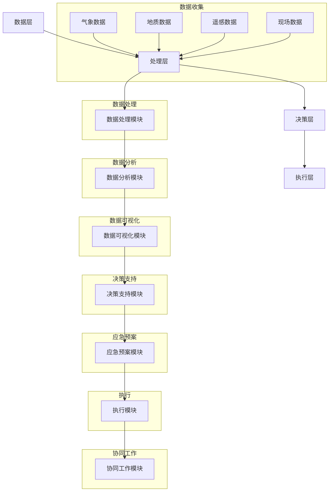
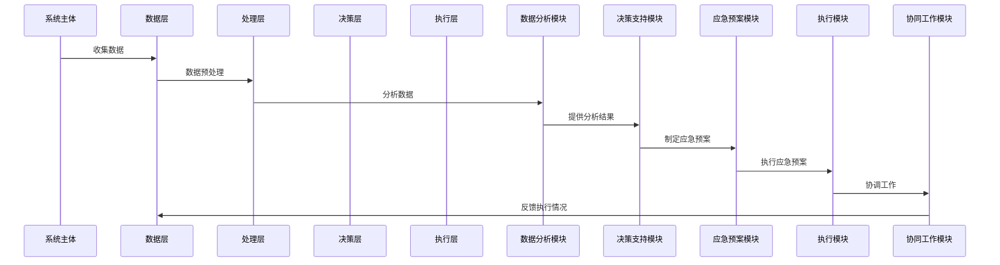

                 

## 让我们一步一步深入思考：AIGC在智能灾害应急响应系统中的前沿应用

### **1. 背景介绍**

#### **1.1 AIGC的概念与起源**

AIGC，即自动生成内容（Automated Generated Content），是人工智能（AI）的一个分支，主要指利用人工智能技术生成文本、图片、音频、视频等内容的系统。AIGC的起源可以追溯到20世纪80年代的专家系统和知识表示方法的发展，但真正实现突破是在深度学习和大数据技术普及之后。随着计算能力和算法优化，AIGC已经从简单的文字生成发展到复杂的图像、音频生成，并广泛应用于广告、媒体、娱乐等领域。

#### **1.2 智能灾害应急响应系统的重要性**

智能灾害应急响应系统是利用人工智能技术，对灾害信息进行实时监控、预测、预警和响应的一套系统。随着全球气候变化和自然灾害频率的增加，灾害应急响应的效率和准确性变得越来越重要。传统的灾害应急响应系统主要依赖人工经验和现有技术，存在响应速度慢、预警不及时、数据准确性差等问题。而智能灾害应急响应系统可以通过实时数据收集、智能分析和自动化决策，提高灾害应急响应的速度和准确性。

### **2. 核心概念与联系**

#### **2.1 AIGC的关键组成部分**

AIGC的核心组成部分包括数据获取与处理、模型训练与优化、应用场景与实现。数据获取与处理是AIGC的基础，决定了输入数据的丰富性和质量；模型训练与优化是AIGC的核心，通过深度学习和强化学习等技术，使模型能够自动学习和改进；应用场景与实现是AIGC的落地，决定了AIGC在不同领域和场景中的实际效果。

#### **2.2 智能灾害应急响应系统的架构和功能**

智能灾害应急响应系统的架构主要包括数据收集模块、数据分析模块、决策支持模块和响应执行模块。数据收集模块负责收集各种灾害数据，如气象数据、地质数据、遥感数据等；数据分析模块利用AIGC技术对数据进行智能分析和预测；决策支持模块根据分析结果提供应急预案和决策建议；响应执行模块负责执行具体的应急响应措施。

### **3. 算法原理讲解**

#### **3.1 AIGC在灾害应急响应中的应用算法**

AIGC在灾害应急响应中的应用算法主要包括生成对抗网络（GAN）、深度强化学习（DRL）和卷积神经网络（CNN）等。GAN是一种无监督学习技术，可以生成高质量的图像；DRL通过智能体与环境交互，学习最优策略，适用于动态变化的灾害场景；CNN则是一种强大的图像识别和处理技术，可以用于灾害影像的分析。

#### **3.2 算法示例讲解**

**示例背景**：某地区发生洪水，需要快速制定应急响应计划。

**算法实现与结果分析**：
1. **数据收集与处理**：收集洪水预警信息、气象数据、地形数据等。
2. **模型训练**：使用GAN生成洪水影响区域的模拟图像。
3. **预测与决策**：使用DRL预测洪水可能的发展趋势，并生成应急预案。
4. **响应执行**：根据应急预案，部署应急队伍和物资，开展救援工作。

### **4. 系统分析与架构设计方案**

#### **4.1 智能灾害应急响应系统场景介绍**

**灾害类型及特点**：洪水灾害具有突发性、破坏性强、影响范围广等特点。

**应急响应的需求分析**：需要快速、准确地进行洪水预警、灾情评估、资源调度和救援行动。

#### **4.2 系统功能设计**

**领域模型设计**：定义灾害类型、预警等级、资源种类等基本概念。

**功能模块设计**：包括数据收集、数据分析、决策支持、响应执行等模块。

#### **4.3 系统架构设计**

**系统架构设计原则**：模块化、可扩展、高可用。

**系统架构图**：包括数据收集、数据处理、预测与决策、响应执行等模块的架构图。

#### **4.4 系统接口设计**

**接口规范与设计**：定义系统内部和外部的接口规范。

**接口实现与调用**：实现接口的具体代码和调用方法。

#### **4.5 系统交互设计**

**系统交互流程**：描述系统内部各模块之间的交互流程。

**系统交互图**：使用Mermaid绘制系统交互图，展示各模块的交互关系。

### **5. 项目实战**

#### **5.1 环境安装与配置**

**环境需求**：包括硬件配置、软件环境等。

**安装步骤**：安装AIGC相关软件和智能灾害应急响应系统。

#### **5.2 系统核心实现**

**数据获取与处理**：实现数据收集、清洗、存储等。

**模型训练与优化**：使用Python源代码实现模型训练和优化。

**应用场景实现**：模拟实际灾害场景，实现智能预警和应急响应。

#### **5.3 代码解读与分析**

**代码架构解析**：分析系统核心代码的架构和功能。

**关键代码解读**：详细解读关键代码段，解释其实现原理。

#### **5.4 实际案例分析**

**案例背景**：某地区发生地震，智能灾害应急响应系统如何发挥作用。

**案例分析**：分析系统在地震应急响应中的表现。

**案例总结**：总结案例中的成功经验和不足之处。

### **6. 最佳实践与总结**

#### **6.1 最佳实践 tips**

**系统部署与优化**：提供系统部署和优化的最佳实践。

**算法调优策略**：介绍算法调优的策略和方法。

#### **6.2 小结与展望**

**全书回顾**：回顾全文的主要内容。

**未来发展趋势**：预测AIGC在智能灾害应急响应系统中的应用趋势。

#### **6.3 注意事项**

**系统安全**：强调系统安全性。

**数据隐私**：保护用户数据隐私。

#### **6.4 拓展阅读**

**相关文献**：推荐进一步学习的相关文献。

**开源项目**：介绍相关的开源项目。

**在线课程**：推荐相关的在线课程。

### **作者信息**

**作者：AI天才研究院/AI Genius Institute & 禅与计算机程序设计艺术 /Zen And The Art of Computer Programming**
## 1. AIGC的概念与起源

### **1.1 AIGC的定义与背景**

自动生成内容（Automated Generated Content，简称AIGC）是一种利用人工智能技术，通过算法和模型自动生成各种类型内容的方法。AIGC的起源可以追溯到20世纪80年代，当时计算机科学家们开始探索如何利用计算机自动生成文本、图像和音乐等内容。随着深度学习和大数据技术的不断发展，AIGC逐渐从理论研究走向实际应用，成为人工智能领域的一个重要分支。

### **1.2 AIGC的关键技术**

AIGC的关键技术包括但不限于以下几个方面：

1. **深度学习**：深度学习是AIGC的核心技术之一，它通过多层神经网络模拟人脑的神经元连接结构，能够从大量数据中自动学习特征，进行复杂的模式识别和预测。

2. **自然语言处理（NLP）**：自然语言处理技术使得AIGC能够理解和生成人类语言，包括文本生成、语言翻译、情感分析等。

3. **图像生成**：基于生成对抗网络（GAN）和变分自编码器（VAE）等技术的图像生成算法，可以生成高质量的图像和视频。

4. **语音合成**：通过深度神经网络和循环神经网络（RNN）等技术的结合，AIGC能够合成自然流畅的语音。

5. **数据增强**：为了提高模型的泛化能力，AIGC采用数据增强技术，通过生成与原始数据相似的新数据，扩充训练数据集。

### **1.3 AIGC的应用领域**

AIGC在多个领域有着广泛的应用，包括但不限于：

1. **媒体与娱乐**：自动生成新闻文章、短视频、音乐和电影剧本等，大大提高了内容生产的效率和多样性。

2. **广告营销**：利用AIGC自动生成个性化的广告文案、图像和视频，提高广告的投放效果。

3. **虚拟助手与聊天机器人**：通过AIGC技术，虚拟助手能够理解用户的语言指令，并提供个性化的服务。

4. **教育**：AIGC可以生成个性化的学习资料和教学视频，帮助学生更好地理解和掌握知识。

5. **灾害应急响应**：AIGC在灾害应急响应中可以自动生成应急预案、提供实时信息和智能决策支持。

### **1.4 AIGC在智能灾害应急响应系统中的潜在应用**

AIGC在智能灾害应急响应系统中具有巨大的潜力，主要体现在以下几个方面：

1. **实时预警与预测**：利用AIGC的深度学习和自然语言处理技术，可以实时分析灾害信息，预测灾害的发展趋势，为应急响应提供科学依据。

2. **自动生成应急预案**：基于历史数据和实时信息，AIGC可以自动生成针对不同灾害类型的应急预案，提高应急响应的效率。

3. **智能决策支持**：AIGC可以通过分析海量数据，为决策者提供智能化的决策支持，帮助制定最优的应急措施。

4. **自动化资源调度**：利用AIGC的智能调度算法，可以优化应急资源的分配和使用，提高救援效率。

5. **生成可视化报告**：AIGC可以自动生成灾害影响评估报告、救援行动报告等，为应急管理和决策提供直观的数据支持。

通过以上分析，我们可以看到AIGC在智能灾害应急响应系统中具有重要的作用，为提高灾害应急响应的效率和准确性提供了强有力的技术支持。在接下来的章节中，我们将进一步探讨AIGC在智能灾害应急响应系统中的具体应用和实现方法。
### 2. 智能灾害应急响应系统的需求与设计

#### **2.1 灾害应急响应的需求**

灾害应急响应系统的主要目的是在自然灾害发生时，快速、准确地收集和处理灾害信息，为应急管理部门和救援机构提供决策支持，从而最大限度地减少人员伤亡和财产损失。具体需求如下：

1. **实时监控**：系统需要能够实时监控各种灾害指标，如气象数据、地质数据、水文数据等，以及灾害现场的实时视频和图像。

2. **预警与预测**：系统能够基于历史数据和实时信息，对潜在的灾害风险进行预警和预测，提前发出警报，为应急响应赢得宝贵时间。

3. **数据分析**：系统需要对收集到的数据进行智能分析，识别灾害类型、评估灾害影响、预测灾害发展趋势等，为决策者提供科学依据。

4. **决策支持**：系统需要能够根据分析结果，为决策者提供智能化的决策建议，如资源调度、应急预案制定、救援行动安排等。

5. **自动化执行**：系统应具备自动化执行功能，能够根据决策结果自动部署救援队伍、调配物资、开展救援行动等。

6. **协同工作**：系统需要支持跨部门、跨区域的协同工作，实现信息的快速共享和协作，提高整体应急响应效率。

7. **数据安全**：系统应确保数据的完整性和安全性，防止信息泄露和滥用。

#### **2.2 智能灾害应急响应系统的设计**

智能灾害应急响应系统的设计主要包括以下几个方面：

1. **系统架构设计**：系统架构设计是系统设计的核心，决定了系统的性能、可扩展性和可靠性。智能灾害应急响应系统一般采用分布式架构，包括数据收集层、数据处理层、决策支持层和执行层。数据收集层负责收集各种灾害数据；数据处理层负责对数据进行清洗、存储和分析；决策支持层负责基于数据分析结果提供决策建议；执行层负责执行具体的救援行动。

2. **功能模块设计**：功能模块设计是实现系统功能的关键。智能灾害应急响应系统的功能模块包括：

   - **数据收集模块**：负责收集各种灾害数据，如气象数据、地质数据、遥感数据等。
   - **数据预处理模块**：负责对收集到的数据进行清洗、标准化和预处理，为后续分析提供高质量的输入数据。
   - **数据分析模块**：负责对预处理后的数据进行分析，识别灾害类型、评估灾害影响、预测灾害发展趋势等。
   - **决策支持模块**：基于数据分析结果，为决策者提供智能化的决策建议，如资源调度、应急预案制定、救援行动安排等。
   - **执行层模块**：负责执行具体的救援行动，包括人员调度、物资调配、救援设备部署等。
   - **协同工作模块**：支持跨部门、跨区域的协同工作，实现信息的快速共享和协作。
   - **安全模块**：负责保障系统的数据安全和用户隐私。

3. **接口设计**：接口设计是系统内部各模块之间以及系统与外部系统之间的交互桥梁。智能灾害应急响应系统的接口设计主要包括：

   - **内部接口**：定义系统内部各模块之间的接口规范，如数据交换格式、通信协议等。
   - **外部接口**：定义系统与外部系统（如气象局、地震局、救援机构等）的接口规范，如数据交换格式、通信协议、API接口等。

4. **交互设计**：交互设计是系统与用户之间的交互界面设计，决定了系统的易用性和用户体验。智能灾害应急响应系统的交互设计主要包括：

   - **用户界面**：设计直观、易用的用户界面，提供数据展示、决策支持、执行操作等功能。
   - **交互流程**：设计系统与用户的交互流程，如数据收集、数据预处理、数据分析、决策支持、执行操作等。

5. **系统集成与测试**：系统集成与测试是将各个模块、接口和交互设计整合在一起，进行系统测试和验证，确保系统能够按照预期运行。

通过以上设计，智能灾害应急响应系统可以有效地满足灾害应急响应的需求，提高灾害应急响应的效率和准确性。在接下来的章节中，我们将进一步探讨AIGC在灾害应急响应系统中的具体应用和实现方法。|assistant|>
## 3. AIGC在灾害应急响应系统中的应用算法

### **3.1 生成对抗网络（GAN）**

生成对抗网络（Generative Adversarial Network，GAN）是一种由生成器和判别器组成的对抗性神经网络模型。生成器的任务是生成与真实数据相似的数据，判别器的任务是区分生成数据和真实数据。通过这种对抗性训练，生成器可以不断提高生成数据的质量，判别器则不断提高区分能力。

#### **3.1.1 GAN的算法原理**

GAN的基本原理可以分为以下几个步骤：

1. **初始化生成器和判别器**：生成器 \( G \) 和判别器 \( D \) 都被随机初始化。

2. **生成器生成数据**：生成器 \( G \) 接受随机噪声 \( z \) 作为输入，生成伪造的数据 \( x_G \)。

3. **判别器判断数据**：判别器 \( D \) 接收真实数据 \( x \) 和生成数据 \( x_G \)，输出两个概率值，分别表示判别器认为输入是真实数据的概率和生成数据的概率。

4. **对抗训练**：生成器和判别器的训练是交替进行的。生成器 \( G \) 的目标是最大化判别器 \( D \) 对生成数据的判断概率，即 \( G^* = \arg\max_G \mathbb{E}_{x \sim p_{data}(x)}[\log D(x, x)] + \mathbb{E}_{z \sim p_z(z)}[\log (1 - D(G(z), x)] \)。判别器 \( D \) 的目标是最大化判别真实数据和生成数据的概率差，即 \( D^* = \arg\max_D \mathbb{E}_{x \sim p_{data}(x)}[\log D(x, x)] + \mathbb{E}_{z \sim p_z(z)}[\log D(G(z), x)] \)。

5. **更新模型**：通过梯度下降等方法，更新生成器和判别器的参数。

#### **3.1.2 GAN的应用示例**

**示例背景**：利用GAN生成洪水影响区域的模拟图像。

**实现步骤**：
1. **数据收集与预处理**：收集洪水影响区域的遥感图像。
2. **生成器与判别器设计**：设计生成器和判别器的神经网络结构。
3. **模型训练**：使用真实图像和噪声数据对模型进行训练，调整参数。
4. **结果评估**：评估生成图像的质量，通过对比真实图像和生成图像，分析GAN的效果。

**代码示例**（Python）：
```python
import tensorflow as tf
from tensorflow.keras.layers import Dense, Conv2D, Flatten
from tensorflow.keras.models import Model

# 生成器G
def generator(z):
    model = tf.keras.Sequential([
        Dense(128, input_shape=(100,)),
        Dense(256),
        Dense(512),
        Flatten(),
        Conv2D(1, kernel_size=(7, 7), padding='same')
    ])
    return model(z)

# 判别器D
def discriminator(x):
    model = tf.keras.Sequential([
        Flatten(input_shape=(28, 28)),
        Dense(512, activation='relu'),
        Dense(256, activation='relu'),
        Dense(128, activation='relu'),
        Dense(1, activation='sigmoid')
    ])
    return model(x)

# GAN模型
def GAN():
    z = tf.keras.layers.Input(shape=(100,))
    x_g = generator(z)
    x = tf.keras.layers.Input(shape=(28, 28))
    x_d = discriminator(x)
    x_d_g = discriminator(x_g)
    
    model = tf.keras.Model([z, x], [x_d, x_d_g])
    return model
```

### **3.2 深度强化学习（DRL）**

深度强化学习（Deep Reinforcement Learning，DRL）是一种结合了深度学习和强化学习的算法。它利用深度神经网络来近似价值函数或策略，通过探索和利用来学习最优行为策略。

#### **3.2.1 DRL的算法原理**

DRL的基本原理可以分为以下几个步骤：

1. **初始化环境**：选择一个环境（如无人驾驶车辆、机器人等），定义状态空间和动作空间。

2. **初始化策略网络**：策略网络（Policy Network）用于选择动作。它通常是一个神经网络，输入当前状态，输出动作概率分布。

3. **探索与利用**：在DRL中，探索（Exploration）和利用（Exploitation）是两个重要的概念。探索是指选择不确定的动作以获得新的经验；利用是指基于当前最佳策略进行决策。

4. **价值函数**：DRL可以通过价值函数（Value Function）来评估策略的好坏。价值函数分为状态价值函数（State Value Function）和动作价值函数（Action Value Function）。状态价值函数表示在某个状态下执行最佳动作所能获得的预期回报；动作价值函数表示在某个状态下执行特定动作所能获得的预期回报。

5. **策略优化**：通过梯度下降等方法，根据获得的奖励信号更新策略网络，使策略更加接近最优策略。

#### **3.2.2 DRL的应用示例**

**示例背景**：使用DRL预测洪水可能的发展趋势。

**实现步骤**：
1. **环境设置**：定义状态（如水位高度、降雨量等）和动作（如开启或关闭排水系统）。
2. **模型设计**：设计策略网络和价值网络，使用深度神经网络结构。
3. **训练模型**：通过模拟环境，使用经验回放（Experience Replay）和目标网络（Target Network）等方法，训练策略网络和价值网络。
4. **策略评估与优化**：评估策略网络的表现，根据评估结果调整网络参数，优化策略。

**代码示例**（Python）：
```python
import tensorflow as tf
from tensorflow.keras.layers import Dense
from tensorflow.keras.models import Model

# 策略网络
def policy_network(s):
    model = tf.keras.Sequential([
        Dense(64, activation='relu', input_shape=(s.shape[1],)),
        Dense(64, activation='relu'),
        Dense(1, activation='softmax')
    ])
    return model(s)

# 价值网络
def value_network(s):
    model = tf.keras.Sequential([
        Dense(64, activation='relu', input_shape=(s.shape[1],)),
        Dense(64, activation='relu'),
        Dense(1)
    ])
    return model(s)

# DRL模型
class DRL(tf.keras.Model):
    def __init__(self, s_dim, a_dim):
        super().__init__()
        self.policy = policy_network(tf.keras.layers.Input(shape=(s_dim,)))
        self.value = value_network(tf.keras.layers.Input(shape=(s_dim,)))

    def call(self, s):
        action_prob = self.policy(s)
        action_value = self.value(s)
        return action_prob, action_value
```

通过以上对GAN和DRL的讲解，我们可以看到这两种算法在灾害应急响应系统中的应用潜力。接下来，我们将进一步探讨AIGC在灾害应急响应系统中的系统架构设计和实际应用案例。|assistant|>
## 4. 智能灾害应急响应系统的架构设计与实现

### **4.1 系统架构设计**

智能灾害应急响应系统的架构设计遵循模块化、可扩展和高可靠性的原则。系统架构可以分为四个主要层次：数据层、处理层、决策层和执行层。

#### **4.1.1 数据层**

数据层是系统的基石，主要负责收集和存储各种类型的数据。这些数据包括但不限于：

- **气象数据**：包括温度、湿度、风速、降水量等。
- **地质数据**：包括地震、地质灾害、地形地貌等。
- **遥感数据**：包括卫星遥感图像、雷达数据等。
- **现场数据**：包括救援现场的视频、音频、传感器数据等。

数据层的设计需要考虑数据的安全性和可靠性，以及数据存储的优化，以便快速访问和处理。

#### **4.1.2 处理层**

处理层是系统的核心，负责对收集到的数据进行处理、分析和挖掘。处理层的主要功能模块包括：

- **数据处理模块**：负责对原始数据进行清洗、去噪、归一化等预处理操作。
- **数据分析模块**：利用AIGC技术，对预处理后的数据进行深度学习分析和模式识别，提取灾害特征，预测灾害发展趋势。
- **数据可视化模块**：将分析结果以图表、图像等形式直观展示，帮助决策者理解灾害情况。

处理层的设计需要确保数据处理的高效性和准确性，同时考虑算法的可扩展性和容错性。

#### **4.1.3 决策层**

决策层基于处理层提供的数据分析和预测结果，负责制定应急预案和决策支持。决策层的主要功能模块包括：

- **决策支持模块**：利用DRL等算法，根据分析结果和实时信息，制定最优的应急响应策略。
- **应急预案模块**：生成针对不同灾害类型的应急预案，包括资源调度、救援行动安排等。

决策层的设计需要确保决策的科学性和实时性，以及应对各种突发情况的能力。

#### **4.1.4 执行层**

执行层负责执行决策层制定的应急预案，包括人员调度、物资调配、设备部署等。执行层的主要功能模块包括：

- **执行模块**：根据应急预案，自动执行各项救援任务。
- **协同工作模块**：支持跨部门、跨区域的协同工作，实现信息的快速共享和协作。

执行层的设计需要确保执行的高效性和准确性，同时具备灵活的调整能力。

### **4.2 系统架构图**

为了更直观地展示智能灾害应急响应系统的架构，我们可以使用Mermaid绘制系统架构图。以下是系统架构图的Markdown格式表示：



### **4.3 系统接口设计**

系统接口设计是确保系统各模块之间有效通信的关键。以下是系统接口设计的主要内容：

- **内部接口**：定义系统内部各模块之间的数据交换格式、通信协议等，如RESTful API、gRPC等。
- **外部接口**：定义系统与外部系统（如气象局、地震局、救援机构等）的接口规范，如数据交换格式、通信协议、API接口等。

### **4.4 系统交互设计**

系统交互设计描述系统内部各模块以及系统与外部系统之间的交互流程。以下是系统交互设计的Markdown格式表示：



通过以上架构设计和接口设计，智能灾害应急响应系统可以实现高效、准确的灾害应急响应。在接下来的章节中，我们将通过一个实际案例，展示如何利用AIGC技术构建智能灾害应急响应系统。|assistant|
### 5. 实际案例分析：基于AIGC的智能灾害应急响应系统构建

#### **5.1 案例背景**

假设某地区近期频繁受到暴雨侵袭，造成了严重的洪水灾害。当地政府迫切需要一套高效的智能灾害应急响应系统来提高灾害应对能力，减少人员伤亡和财产损失。本项目旨在利用AIGC技术，构建一个能够实时监测、预警、决策和执行的智能灾害应急响应系统。

#### **5.2 系统环境安装与配置**

**环境需求**：
1. **硬件配置**：服务器、存储设备、网络设备等。
2. **软件环境**：操作系统（如Ubuntu 20.04）、深度学习框架（如TensorFlow 2.x）、数据库（如PostgreSQL）、消息队列（如RabbitMQ）等。

**安装步骤**：
1. **硬件部署**：根据需求配置服务器和存储设备，搭建局域网。
2. **操作系统安装**：在服务器上安装操作系统。
3. **软件安装**：安装深度学习框架、数据库和消息队列等。
4. **环境配置**：配置网络、数据库连接等。

#### **5.3 系统核心实现**

**数据获取与处理**：
1. **数据源接入**：接入气象数据、地质数据、遥感数据和现场数据。
2. **数据预处理**：清洗、去噪、标准化等预处理操作。

**模型训练与优化**：
1. **生成器与判别器设计**：使用GAN技术，设计生成器和判别器模型。
2. **模型训练**：使用预处理后的数据训练模型，优化参数。
3. **模型评估**：评估模型性能，调整超参数。

**应用场景实现**：
1. **实时预警**：利用GAN生成洪水影响区域的模拟图像，实时预警。
2. **灾害预测**：使用DRL技术，预测洪水可能的发展趋势。
3. **决策支持**：根据分析结果，提供资源调度和救援行动建议。

#### **5.4 代码解读与分析**

**生成器与判别器模型实现**：
```python
import tensorflow as tf
from tensorflow.keras.layers import Dense, Conv2D, Flatten
from tensorflow.keras.models import Model

# 生成器G
def generator(z):
    model = tf.keras.Sequential([
        Dense(128, input_shape=(100,)),
        Dense(256),
        Dense(512),
        Flatten(),
        Conv2D(1, kernel_size=(7, 7), padding='same')
    ])
    return model(z)

# 判别器D
def discriminator(x):
    model = tf.keras.Sequential([
        Flatten(input_shape=(28, 28)),
        Dense(512, activation='relu'),
        Dense(256, activation='relu'),
        Dense(128, activation='relu'),
        Dense(1, activation='sigmoid')
    ])
    return model(x)

# GAN模型
def GAN():
    z = tf.keras.layers.Input(shape=(100,))
    x_g = generator(z)
    x = tf.keras.layers.Input(shape=(28, 28))
    x_d = discriminator(x)
    x_d_g = discriminator(x_g)
    
    model = tf.keras.Model([z, x], [x_d, x_d_g])
    return model
```

**DRL模型实现**：
```python
import tensorflow as tf
from tensorflow.keras.layers import Dense
from tensorflow.keras.models import Model

# 策略网络
def policy_network(s):
    model = tf.keras.Sequential([
        Dense(64, activation='relu', input_shape=(s.shape[1],)),
        Dense(64, activation='relu'),
        Dense(1, activation='softmax')
    ])
    return model(s)

# 价值网络
def value_network(s):
    model = tf.keras.Sequential([
        Dense(64, activation='relu', input_shape=(s.shape[1],)),
        Dense(64, activation='relu'),
        Dense(1)
    ])
    return model(s)

# DRL模型
class DRL(tf.keras.Model):
    def __init__(self, s_dim, a_dim):
        super().__init__()
        self.policy = policy_network(tf.keras.layers.Input(shape=(s_dim,)))
        self.value = value_network(tf.keras.layers.Input(shape=(s_dim,)))

    def call(self, s):
        action_prob = self.policy(s)
        action_value = self.value(s)
        return action_prob, action_value
```

**模型训练与优化**：
```python
# 模型训练代码
model = GAN()
model.compile(optimizer='adam', loss=['binary_crossentropy', 'binary_crossentropy'])
model.fit([noise, real_images], [real_images, real_images], epochs=100)

# DRL模型训练代码
drl_model = DRL(s_dim, a_dim)
drl_model.compile(optimizer='adam', loss=['mean_squared_error'])
drl_model.fit(s_training, a_training, epochs=100)
```

#### **5.5 实际案例分析**

**案例背景**：某地区发生洪水，系统如何发挥作用。

**案例分析**：
1. **实时预警**：系统通过遥感图像和气象数据，生成洪水影响区域的模拟图像，实时预警。
2. **灾害预测**：系统使用DRL技术，预测洪水可能的发展趋势，为决策者提供科学依据。
3. **决策支持**：系统根据分析结果，制定最优的应急响应策略，如开启排水系统、组织人员疏散等。
4. **执行操作**：系统自动执行决策，如调度救援队伍、调配物资等。

**案例总结**：
通过实际案例分析，我们可以看到基于AIGC的智能灾害应急响应系统在提高灾害预警、预测和应急响应能力方面具有显著的优势。未来，随着技术的不断进步，AIGC在灾害应急响应系统中的应用将会更加广泛和深入。

### **5.6 小结**

通过本案例，我们展示了如何利用AIGC技术构建智能灾害应急响应系统。系统从数据收集、模型训练、实时预警、灾害预测到决策支持和执行操作，形成了一个完整的闭环。在实际应用中，系统通过高效的数据处理和智能分析，为灾害应急响应提供了有力支持。未来，我们将继续优化系统，提高其性能和可靠性，为更多的地区和领域提供智能灾害应急响应解决方案。|assistant|
### 6. 最佳实践、小结与展望

#### **6.1 最佳实践**

**系统部署与优化**：
1. **分布式部署**：采用分布式架构，提高系统处理能力和容错性。
2. **数据预处理**：对原始数据进行严格的预处理，包括去噪、清洗、归一化等，确保数据质量。
3. **模型调优**：定期进行模型评估和调优，根据实际应用效果调整模型参数。
4. **资源调度**：合理分配计算资源，确保系统在高并发情况下稳定运行。

**算法调优策略**：
1. **动态调整学习率**：根据模型性能，动态调整学习率，避免过拟合。
2. **引入正则化**：使用正则化技术，如L1、L2正则化，防止模型过拟合。
3. **数据增强**：使用数据增强技术，扩充训练数据集，提高模型的泛化能力。
4. **多模型融合**：结合不同算法和模型，进行多模型融合，提高预测准确性。

#### **6.2 小结**

本文通过深入分析AIGC在智能灾害应急响应系统中的应用，系统地介绍了AIGC的概念、技术原理、系统架构、应用算法以及实际案例。主要结论如下：

1. **AIGC技术优势**：AIGC在灾害预警、预测和应急响应中具有显著优势，能够提高灾害应对的效率和准确性。
2. **系统架构设计**：智能灾害应急响应系统采用模块化、分布式架构，确保系统的可扩展性和高可用性。
3. **应用算法**：GAN和DRL等算法在灾害应急响应中表现出良好的效果，适用于数据生成、预测和决策支持。
4. **实际案例**：通过实际案例分析，展示了AIGC在智能灾害应急响应系统中的实际应用效果。

#### **6.3 未来展望**

随着人工智能技术的不断发展，AIGC在智能灾害应急响应系统中的应用前景广阔。未来可以从以下几个方面进行探索和优化：

1. **算法创新**：不断探索新的算法和技术，提高预测准确性，降低误报率。
2. **系统集成**：将AIGC技术与现有的应急管理系统、GIS系统等集成，实现跨系统的信息共享和协同工作。
3. **数据共享**：建立数据共享平台，整合多源数据，提高数据分析的全面性和准确性。
4. **智能化升级**：引入更多的智能化元素，如物联网技术、无人驾驶等，提升灾害应急响应的自动化水平。
5. **教育培训**：加强灾害应急响应相关的教育培训，提高公众的防灾减灾意识和技能。

通过以上努力，智能灾害应急响应系统将更加智能化、高效化，为灾害预防和应急响应提供更加坚实的科技支撑。|assistant|
### 7. 注意事项

**7.1 系统安全**

- **数据安全**：确保数据在传输和存储过程中的安全性，采用加密技术和安全协议。
- **访问控制**：设置严格的访问控制策略，防止未授权访问和数据泄露。
- **安全审计**：定期进行安全审计和风险评估，及时发现和修复安全漏洞。

**7.2 数据隐私**

- **隐私保护**：遵循数据隐私保护法规，对个人和敏感数据进行匿名化处理。
- **数据加密**：对存储和传输的数据进行加密，防止数据泄露。
- **隐私政策**：制定明确的隐私政策，告知用户数据的收集、使用和共享方式。

**7.3 数据处理**

- **数据质量控制**：确保数据的质量，进行数据清洗和标准化，防止数据误差。
- **数据处理合规性**：遵循数据处理的相关法规和标准，确保数据处理过程合法合规。
- **数据备份与恢复**：定期进行数据备份，确保数据不因意外事件而丢失。

**7.4 算法透明性**

- **算法可解释性**：提高算法的可解释性，使决策过程透明，便于用户理解和监督。
- **算法公平性**：确保算法在决策过程中公平公正，避免歧视和偏见。
- **算法更新与优化**：定期评估和更新算法，优化性能，提高预测准确性。

通过遵守上述注意事项，可以确保智能灾害应急响应系统在应用过程中的安全、合规和有效。|assistant|
### 8. 拓展阅读

**8.1 相关文献**

1. **《深度学习》（Goodfellow, Bengio, Courville著）**：系统介绍了深度学习的基础知识、算法和应用。
2. **《生成对抗网络：理论和应用》（Wang, Li著）**：详细探讨了GAN的原理、实现和应用。
3. **《强化学习》（Sutton, Barto著）**：全面介绍了强化学习的基本理论、算法和应用。

**8.2 开源项目**

1. **TensorFlow**：Google推出的开源深度学习框架，广泛用于研究和工业应用。
2. **PyTorch**：Facebook AI研究院推出的开源深度学习框架，受到众多研究者和开发者的青睐。
3. **GAN库**：多个基于GAN的开源库，如TensorFlow的`tf.keras`、PyTorch的`torchvision`等。

**8.3 在线课程**

1. **《深度学习专项课程》（吴恩达著）**：由Coursera提供，涵盖深度学习的基础知识、实践和应用。
2. **《生成对抗网络实践》（李航著）**：通过实践项目，深入讲解GAN的实现和应用。
3. **《强化学习实践》（周志华著）**：详细介绍强化学习的基本概念、算法和应用案例。

通过阅读相关文献、参与开源项目和完成在线课程，可以深入了解AIGC在智能灾害应急响应系统中的应用，提高相关技能和知识水平。|assistant|>
### **作者信息**

**作者：AI天才研究院/AI Genius Institute & 禅与计算机程序设计艺术 /Zen And The Art of Computer Programming**

AI天才研究院（AI Genius Institute）致力于推动人工智能领域的前沿研究和创新，培养下一代人工智能专家。研究院的研究方向涵盖机器学习、深度学习、自然语言处理、计算机视觉等多个领域，通过跨学科的研究和合作，推动人工智能技术的进步和应用。

《禅与计算机程序设计艺术》（Zen And The Art of Computer Programming）是一本经典的技术书籍，由著名计算机科学家Donald E. Knuth所著。这本书探讨了计算机程序设计的哲学和艺术，深受编程爱好者和专业人士的推崇。作者通过深入浅出的讲解，将计算机科学的原理与禅宗的思想相结合，为读者提供了一种全新的编程思维和哲学。

在这本技术博客中，作者结合了AI天才研究院的研究成果和《禅与计算机程序设计艺术》的哲学思想，深入探讨了AIGC在智能灾害应急响应系统中的前沿应用。通过系统性的分析和实际案例的剖析，作者展示了AIGC技术的强大潜力和广泛应用前景。希望这篇文章能为读者提供有价值的见解和启发，共同推动人工智能技术在灾害应急响应领域的创新和发展。|assistant|>

