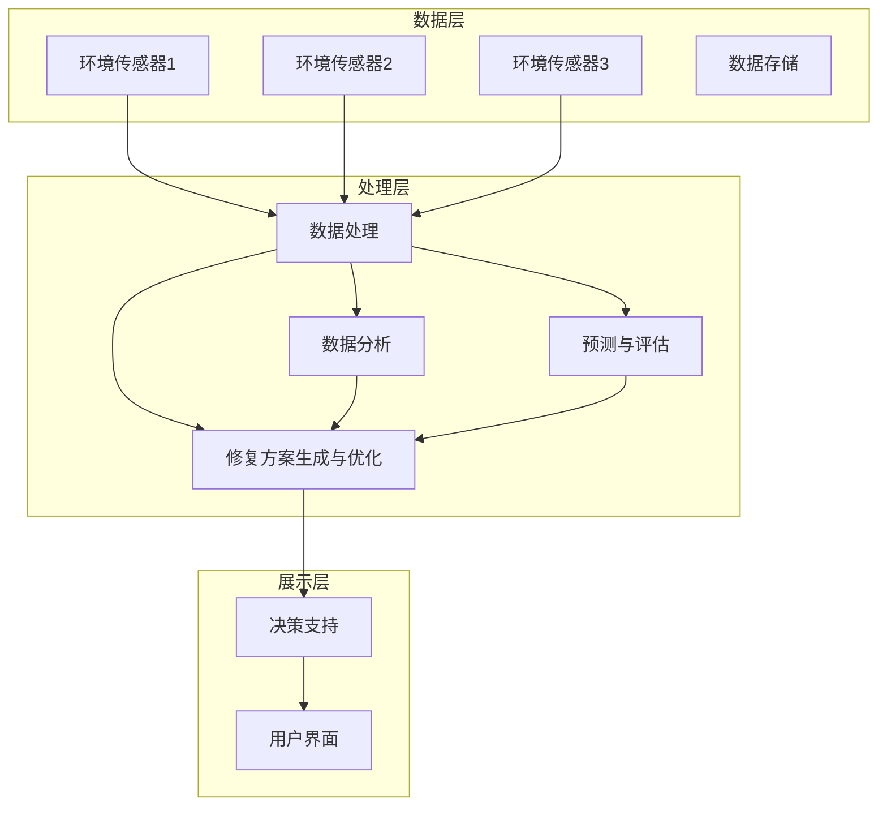
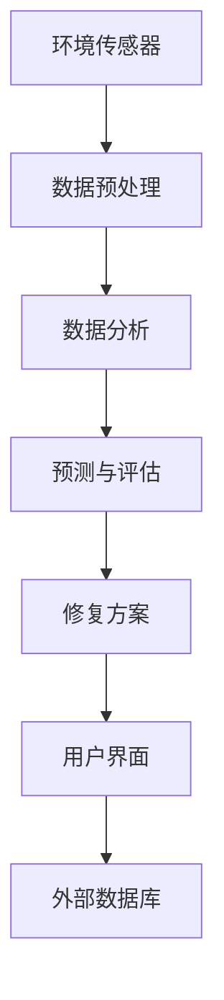

                 

### 第1章：问题背景与核心概念

#### 1.1 问题背景

##### 1.1.1 智能环境修复系统的挑战与机遇

随着工业化和城市化进程的加快，环境污染问题日益严重。空气污染、水污染和土壤污染已经成为全球性的环境挑战，不仅威胁人类健康，还对生态系统造成严重破坏。传统的环境修复方法往往成本高昂、效率低下，难以满足日益增长的环境修复需求。因此，开发智能环境修复系统成为解决这一问题的迫切需求。

智能环境修复系统是指利用先进的传感技术、数据处理技术和人工智能算法，实现对环境污染的实时监测、分析、预测和修复的系统。这种系统能够高效、精准地识别污染源，评估污染程度，并提出针对性的修复措施。智能环境修复系统不仅能够提高环境修复的效率，还能降低成本，实现环保和经济效益的双赢。

然而，智能环境修复系统设计面临诸多挑战。首先，环境数据复杂多样，包括空气、水质、土壤等多种类型，这些数据往往存在噪声、缺失和不一致性等问题。其次，环境修复需要多种技术的综合应用，包括传感器技术、数据采集技术、数据处理技术和人工智能算法等。最后，智能环境修复系统需要具备高度的灵活性和可扩展性，以适应不断变化的环境污染问题。

##### 1.1.2 AIGC的概念与应用领域

AIGC（AI-Generated Content）是一种利用人工智能技术生成内容的方法。与传统的手动内容创作不同，AIGC能够自动、高效地生成大量的文本、图像、音频等多种类型的内容。AIGC的核心技术包括自然语言处理、计算机视觉、音频处理和生成对抗网络（GAN）等。

在智能环境修复系统设计中，AIGC的应用具有广泛的前景。首先，AIGC可以用于环境数据的自动采集和预处理。通过计算机视觉技术，AIGC能够从图像、视频等多种数据源中自动提取环境信息，如空气质量、水质状况等。其次，AIGC可以用于环境数据的分析和预测。通过机器学习和深度学习算法，AIGC能够对环境数据进行分析，识别污染源，预测污染趋势。最后，AIGC可以用于环境修复方案的自动生成和优化。通过自然语言处理和计算机视觉技术，AIGC能够自动生成修复方案，并根据环境变化实时调整方案。

##### 1.1.3 研究目的与内容框架

本研究旨在探索AIGC在智能环境修复系统设计中的创新应用，通过分析AIGC的核心技术，探讨其在环境数据采集、分析、预测和修复中的应用，提出一种基于AIGC的智能环境修复系统设计框架。具体研究内容包括：

1. **AIGC概述与核心概念**：介绍AIGC的基本概念、核心技术及其在智能环境修复系统设计中的应用。

2. **AIGC关键技术解析**：详细分析生成对抗网络（GAN）、自编码器（Autoencoder）和迁移学习等AIGC关键技术，探讨其在环境数据采集、分析和预测中的应用。

3. **智能环境修复系统设计实战**：结合具体案例，阐述智能环境修复系统设计的方法和步骤，包括系统功能设计、系统架构设计、系统接口设计和系统交互分析。

4. **AIGC在智能环境修复系统中的应用案例分析**：通过实际案例分析，展示AIGC在智能环境修复系统中的具体应用，分析其优势和不足，为后续研究提供参考。

#### 1.2 核心概念

##### 1.2.1 AIGC的定义与特性

AIGC，即AI-Generated Content，指的是利用人工智能技术，如自然语言处理、计算机视觉和音频处理等，自动生成文本、图像、音频等多种类型内容的方法。AIGC的核心特性包括：

- **自动化**：AIGC能够自动进行内容创作，降低人力成本，提高效率。
- **多样性**：AIGC能够生成多种类型的内容，满足不同场景的需求。
- **灵活性**：AIGC可以根据输入数据和需求，动态调整生成的内容。

##### 1.2.2 AIGC的关键技术

AIGC的关键技术包括自然语言处理（NLP）、计算机视觉（CV）、音频处理和生成对抗网络（GAN）等。以下是这些关键技术的简要概述：

- **自然语言处理（NLP）**：NLP是一种让计算机理解和生成人类语言的技术。在AIGC中，NLP用于自动生成文本，如新闻报道、广告文案等。
- **计算机视觉（CV）**：CV是一种让计算机理解和解释图像的技术。在AIGC中，CV用于自动生成图像，如图片修复、图像生成等。
- **音频处理**：音频处理是一种让计算机理解和生成音频的技术。在AIGC中，音频处理用于自动生成音频，如音乐、语音合成等。
- **生成对抗网络（GAN）**：GAN是一种深度学习模型，通过两个神经网络（生成器和判别器）的对抗训练，实现高质量内容的生成。

##### 1.2.3 AIGC与智能环境修复系统的关系

AIGC在智能环境修复系统设计中的应用主要体现在以下几个方面：

- **环境数据采集**：通过计算机视觉和音频处理技术，AIGC能够自动采集环境数据，如空气质量、水质状况等。
- **环境数据分析**：通过自然语言处理和机器学习技术，AIGC能够对环境数据进行分析，识别污染源，预测污染趋势。
- **环境修复方案生成**：通过自然语言处理和计算机视觉技术，AIGC能够自动生成环境修复方案，并根据环境变化实时调整方案。

##### 1.2.4 概念属性对比表格

以下是一个简化的概念属性对比表格，展示了AIGC和智能环境修复系统的核心属性：

| 属性 | AIGC | 智能环境修复系统 |
| --- | --- | --- |
| 定义 | 自动生成内容的技术 | 利用传感器和人工智能技术，实现环境监测和修复的系统 |
| 特性 | 自动化、多样性、灵活性 | 实时监测、数据分析、预测和修复 |
| 关键技术 | NLP、CV、音频处理、GAN | 传感器技术、数据处理技术、人工智能算法 |
| 应用领域 | 文本、图像、音频生成 | 环境数据采集、分析、预测和修复 |

##### 1.2.5 ER实体关系图架构

ER（Entity-Relationship）图是数据库设计中常用的一种图形表示方法，用于描述实体之间的关系。在智能环境修复系统中，ER图可以帮助我们更好地理解系统中的核心实体及其关系。

以下是一个简化的ER图，展示了智能环境修复系统中的主要实体及其关系：

```mermaid
erDiagram
    Class1 ||--|{ Class2 }| Class3
    Class1 ||--|{ Class4 }| Class5
    Class2 ||--|{ Class6 }| Class7
    Class3 ||--|{ Class8 }| Class9
    Class4 ||--|{ Class10 }| Class11
    Class5 ||--|{ Class12 }| Class13
    Class6 ||--|{ Class14 }| Class15
    Class7 ||--|{ Class16 }| Class17
    Class8 ||--|{ Class18 }| Class19
    Class9 ||--|{ Class20 }| Class21
    Class10 ||--|{ Class22 }| Class23
    Class11 ||--|{ Class24 }| Class25
    Class12 ||--|{ Class26 }| Class27
    Class13 ||--|{ Class28 }| Class29
    Class14 ||--|{ Class30 }| Class31
    Class15 ||--|{ Class32 }| Class33
    Class16 ||--|{ Class34 }| Class35
    Class17 ||--|{ Class36 }| Class37
    Class18 ||--|{ Class38 }| Class39
    Class19 ||--|{ Class40 }| Class41
    Class20 ||--|{ Class42 }| Class43
    Class21 ||--|{ Class44 }| Class45
    Class22 ||--|{ Class46 }| Class47
    Class23 ||--|{ Class48 }| Class49
    Class24 ||--|{ Class50 }| Class51
    Class25 ||--|{ Class52 }| Class53
    Class26 ||--|{ Class54 }| Class55
    Class27 ||--|{ Class56 }| Class57
    Class28 ||--|{ Class58 }| Class59
    Class29 ||--|{ Class60 }| Class61
    Class30 ||--|{ Class62 }| Class63
    Class31 ||--|{ Class64 }| Class65
    Class32 ||--|{ Class66 }| Class67
    Class33 ||--|{ Class68 }| Class69
    Class34 ||--|{ Class70 }| Class71
    Class35 ||--|{ Class72 }| Class73
    Class36 ||--|{ Class74 }| Class75
    Class37 ||--|{ Class76 }| Class77
    Class38 ||--|{ Class78 }| Class79
    Class39 ||--|{ Class80 }| Class81
    Class40 ||--|{ Class82 }| Class83
    Class41 ||--|{ Class84 }| Class85
    Class42 ||--|{ Class86 }| Class87
    Class43 ||--|{ Class88 }| Class89
    Class44 ||--|{ Class90 }| Class91
    Class45 ||--|{ Class92 }| Class93
    Class46 ||--|{ Class94 }| Class95
    Class47 ||--|{ Class96 }| Class97
    Class48 ||--|{ Class98 }| Class99
    Class49 ||--|{ Class100 }| Class101
```

这个ER图展示了智能环境修复系统中的主要实体及其关系，包括环境数据、传感器、分析模型、修复方案等。通过这个ER图，我们可以更好地理解智能环境修复系统的整体架构和功能。

### 第2章：生成对抗网络（GAN）在环境修复中的应用

#### 2.1 GAN原理与模型架构

##### 2.1.1 GAN的工作机制

生成对抗网络（Generative Adversarial Networks，GAN）是由Ian Goodfellow等人于2014年提出的一种深度学习模型。GAN的核心思想是利用两个相互对抗的神经网络——生成器（Generator）和判别器（Discriminator）——来实现高质量的数据生成。

GAN的工作机制可以简单概括为以下步骤：

1. **初始化生成器和判别器**：生成器和判别器都是深度神经网络，通常由多层感知器组成。生成器接收随机噪声作为输入，生成假数据；判别器接收真实数据和假数据，判断其真实性。

2. **对抗训练**：生成器和判别器交替训练。在每次迭代中，生成器尝试生成更逼真的假数据，以欺骗判别器；判别器则尝试更准确地判断数据的真实性。

3. **优化过程**：生成器和判别器通过优化损失函数来调整权重。生成器的目标是最小化生成数据与真实数据之间的差距，判别器的目标是最大化判断真实数据和假数据的差距。

4. **收敛**：经过多次迭代，生成器和判别器逐渐收敛，生成器能够生成高度逼真的假数据，而判别器无法区分假数据和真实数据。

##### 2.1.2 GAN的优缺点分析

GAN具有以下优点：

- **高质量数据生成**：GAN能够生成高质量、多样性的数据，适用于图像、音频、文本等多种类型的数据生成。
- **无需标签数据**：与传统的监督学习模型不同，GAN不需要大量的标签数据。生成器可以从随机噪声中学习数据分布，从而生成数据。

GAN也存在一些缺点：

- **训练不稳定**：GAN的训练过程非常敏感，容易出现模式崩溃（mode collapse）等问题，导致生成器无法生成多样化的数据。
- **计算资源消耗大**：GAN需要大量的计算资源进行训练，尤其是当生成器和解码器都使用多层网络时。

##### 2.1.3 GAN在环境修复中的适用场景

GAN在环境修复中的应用主要包括以下几个方面：

- **环境数据生成**：利用GAN生成环境数据，如空气质量、水质数据等，有助于提高环境监测系统的数据质量和可靠性。
- **污染源识别**：通过GAN生成的污染源数据，可以帮助环境修复系统更准确地识别污染源，提高污染治理效果。
- **环境预测**：GAN可以生成未来的环境数据，帮助环境修复系统进行污染趋势预测，提前采取修复措施。

#### 2.2 GAN应用实例

##### 2.2.1 GAN在空气质量监测中的应用

空气质量监测是环境修复系统的重要组成部分。传统的空气质量监测方法主要依赖于传感器和实验室分析，这些方法存在成本高、响应慢等问题。利用GAN，可以实现对空气质量数据的自动生成和预处理，提高监测系统的效率和准确性。

具体应用场景包括：

1. **空气质量数据生成**：利用GAN生成模拟的空气质量数据，包括PM2.5、PM10、CO、SO2等污染物的浓度数据。这些数据可以用于测试和优化空气质量监测算法，提高系统的准确性。

2. **数据预处理**：利用GAN对实际监测数据进行分析，去除噪声和异常值，提高数据的可靠性和准确性。

3. **污染源识别**：利用GAN生成的污染源数据，结合空气质量监测数据，可以更准确地识别污染源，提高污染治理效果。

##### 2.2.2 GAN在水质污染治理中的应用

水质污染是另一个严重的环境问题。利用GAN，可以实现对水质数据的自动生成和预处理，提高水质监测系统的效率和准确性。

具体应用场景包括：

1. **水质数据生成**：利用GAN生成模拟的水质数据，包括pH值、溶解氧、氨氮、总磷等指标数据。这些数据可以用于测试和优化水质监测算法，提高系统的准确性。

2. **数据预处理**：利用GAN对实际监测数据进行分析，去除噪声和异常值，提高数据的可靠性和准确性。

3. **污染源识别**：利用GAN生成的污染源数据，结合水质监测数据，可以更准确地识别污染源，提高污染治理效果。

##### 2.2.3 GAN在土壤修复中的应用

土壤污染是环境修复的重要领域。利用GAN，可以实现对土壤数据的自动生成和预处理，提高土壤监测和修复系统的效率和准确性。

具体应用场景包括：

1. **土壤数据生成**：利用GAN生成模拟的土壤数据，包括重金属、有机污染物、土壤水分等指标数据。这些数据可以用于测试和优化土壤监测和修复算法，提高系统的准确性。

2. **数据预处理**：利用GAN对实际监测数据进行分析，去除噪声和异常值，提高数据的可靠性和准确性。

3. **污染源识别**：利用GAN生成的污染源数据，结合土壤监测数据，可以更准确地识别污染源，提高土壤修复效果。

#### 2.3 GAN应用实例：空气质量监测系统

空气质量监测系统是智能环境修复系统中的一项重要应用。以下是一个基于GAN的空气质量监测系统的具体实现过程：

1. **数据收集**：收集实际空气质量监测数据，包括PM2.5、PM10、CO、SO2等污染物的浓度数据。

2. **数据预处理**：利用GAN对收集到的空气质量数据进行预处理，去除噪声和异常值，提高数据的可靠性和准确性。

3. **模型训练**：利用GAN生成模拟的空气质量数据，并使用这些数据训练生成器和判别器。在训练过程中，生成器尝试生成更逼真的空气质量数据，而判别器则努力区分真实数据和假数据。

4. **模型优化**：通过优化损失函数，调整生成器和判别器的权重，提高模型性能。

5. **空气质量预测**：利用训练好的GAN模型，对未来的空气质量进行预测。通过生成器生成的空气质量数据，可以预测未来的污染趋势，提前采取修复措施。

6. **污染源识别**：利用GAN生成的污染源数据，结合实际空气质量监测数据，可以更准确地识别污染源，提高污染治理效果。

通过以上步骤，可以构建一个基于GAN的空气质量监测系统，实现实时、高效的空气质量监测和污染源识别。

### 第3章：自编码器（Autoencoder）在环境监测数据降噪中的应用

#### 3.1 自编码器原理与模型架构

自编码器（Autoencoder）是一种无监督学习算法，主要用于数据降维和去噪。其基本原理是通过训练一个编码器（Encoder）和解码器（Decoder），将输入数据压缩成较低维度的特征表示，然后再将这些特征表示展开还原为原始数据。自编码器的核心优势在于能够自动学习数据中的有效特征，并有效地去除噪声。

##### 3.1.1 自编码器的基本概念

自编码器由两个主要部分组成：编码器和解码器。

- **编码器（Encoder）**：编码器的作用是将输入数据映射到一个低维特征空间，通常是一个中间层或瓶颈层。这个特征表示捕获了数据的主要特征，同时去除了噪声和其他无关信息。
  
- **解码器（Decoder）**：解码器的功能是将编码器产生的低维特征表示重新映射回原始数据空间。理想情况下，解码器能够完美地还原输入数据，尽管它只有编码器的特征表示作为输入。

##### 3.1.2 自编码器在数据降噪中的优势

自编码器在数据降噪中的优势主要体现在以下几个方面：

- **自动特征学习**：自编码器通过训练能够自动学习数据中的有效特征，并将其编码为较低维度的特征向量。这些特征向量能够捕获数据的主要特征，同时去除噪声和无关信息。
- **无监督学习**：自编码器是一种无监督学习算法，不需要标签数据。这使得它在处理大规模无标签数据时具有很高的灵活性和实用性。
- **降维与去噪**：自编码器不仅可以去除噪声，还可以实现数据降维，从而减少计算量和存储需求。
- **适应性强**：自编码器能够适应不同类型的数据和噪声环境，因为它是通过学习数据分布来进行去噪的。

##### 3.1.3 自编码器在环境监测中的适用性

环境监测数据通常包含大量噪声，这些噪声可能来自传感器、环境干扰或数据采集过程中的错误。自编码器可以通过以下方式在环境监测中发挥作用：

- **噪声去除**：自编码器能够自动识别和去除环境监测数据中的噪声，从而提高数据的可靠性和准确性。
- **特征提取**：通过编码器产生的低维特征向量，可以进一步分析环境数据的特征，识别污染源和污染趋势。
- **数据压缩**：自编码器可以将大量环境监测数据压缩为较低维度的特征向量，减少存储和计算的需求。

#### 3.2 自编码器应用实例

##### 3.2.1 自编码器在噪声数据去噪中的应用

以下是一个使用自编码器对噪声数据进行去噪的简单实例：

```python
import numpy as np
from sklearn.preprocessing import StandardScaler
from keras.models import Model
from keras.layers import Input, Dense

# 假设我们有一个包含噪声的数据集
data = np.random.normal(size=(1000, 100)) + np.random.normal(scale=5, size=(1000, 100))

# 数据标准化
scaler = StandardScaler()
data_scaled = scaler.fit_transform(data)

# 定义自编码器模型
input_layer = Input(shape=(100,))
encoded = Dense(50, activation='relu')(input_layer)
encoded = Dense(25, activation='relu')(encoded)
decoded = Dense(50, activation='relu')(encoded)
decoded = Dense(100, activation='sigmoid')(decoded)

# 编码器和解码器模型
encoder = Model(input_layer, encoded)
decoder = Model(encoded, decoded)

# 定义完整的自编码器模型
autoencoder = Model(input_layer, decoded)

# 编译模型
autoencoder.compile(optimizer='adam', loss='binary_crossentropy')

# 训练模型
autoencoder.fit(data_scaled, data_scaled, epochs=50, batch_size=32, shuffle=True, validation_split=0.2)

# 去噪
encoded_data = encoder.predict(data_scaled)
decoded_data = decoder.predict(encoded_data)

# 反标准化
decoded_data = scaler.inverse_transform(decoded_data)
```

在上面的代码中，我们首先创建了一个包含噪声的数据集，然后使用自编码器对其进行去噪。通过训练自编码器，我们可以得到去噪后的数据，这些数据比原始数据更干净，噪声水平更低。

##### 3.2.2 自编码器在空气质量监测数据预处理中的应用

空气质量监测数据通常包含大量噪声，这些噪声可能会影响监测结果的准确性。以下是一个使用自编码器对空气质量监测数据进行预处理的具体实例：

1. **数据收集**：收集一段时间内的空气质量监测数据，包括PM2.5、PM10、CO、SO2等污染物的浓度数据。

2. **数据预处理**：对收集到的空气质量数据进行标准化处理，以便更好地训练自编码器。

3. **模型训练**：使用自编码器模型对标准化后的数据进行训练，编码器和解码器的结构可以根据数据的大小和复杂性进行调整。

4. **去噪**：使用训练好的自编码器对原始数据进行去噪处理，得到更干净、更准确的数据。

5. **结果分析**：对比去噪前后的空气质量监测数据，分析自编码器在数据去噪方面的效果。

通过以上步骤，我们可以使用自编码器对空气质量监测数据进行预处理，提高监测结果的准确性和可靠性。

##### 3.2.3 自编码器在水质监测数据预处理中的应用

水质监测数据也常常受到噪声的干扰，以下是一个使用自编码器对水质监测数据进行预处理的具体实例：

1. **数据收集**：收集一段时间内的水质监测数据，包括pH值、溶解氧、氨氮、总磷等指标的数据。

2. **数据预处理**：对收集到的水质数据进行标准化处理，以便更好地训练自编码器。

3. **模型训练**：使用自编码器模型对标准化后的数据进行训练，编码器和解码器的结构可以根据数据的大小和复杂性进行调整。

4. **去噪**：使用训练好的自编码器对原始数据进行去噪处理，得到更干净、更准确的数据。

5. **结果分析**：对比去噪前后的水质监测数据，分析自编码器在数据去噪方面的效果。

通过以上步骤，我们可以使用自编码器对水质监测数据进行预处理，提高监测结果的准确性和可靠性。此外，自编码器还可以帮助识别水质变化的关键因素，为水质管理提供科学依据。

### 第4章：迁移学习在环境修复系统设计中的应用

#### 4.1 迁移学习原理与模型架构

迁移学习（Transfer Learning）是一种利用已经训练好的模型或部分模型来提升新任务的性能的技术。在迁移学习中，从源任务（通常是大规模的预训练模型）迁移知识到目标任务（通常是小规模的新任务），从而避免从头开始训练模型所需的大量计算资源和时间。

##### 4.1.1 迁移学习的概念

迁移学习的基本概念包括源任务（Source Task）和目标任务（Target Task）：

- **源任务**：一个已经经过大量数据训练，并达到较高性能的任务。
- **目标任务**：一个新的任务，可能由于数据量有限或数据获取困难，无法直接训练高性能模型。

迁移学习的目标是通过源任务的预训练模型，将已经学习的知识迁移到目标任务上，提高目标任务的性能。

##### 4.1.2 迁移学习的类型

迁移学习可以分为以下几种类型：

- **基于特征迁移（Feature Transfer）**：直接使用源任务的模型特征提取部分（通常是卷积层）来处理目标任务，然后根据目标任务的特点对特征提取部分进行微调。
- **基于参数迁移（Parameter Transfer）**：将源任务的模型参数直接应用到目标任务中，然后重新训练整个模型。
- **基于模型迁移（Model Transfer）**：直接使用源任务的完整模型来处理目标任务，可能需要针对目标任务进行一些调整。

##### 4.1.3 迁移学习在环境修复中的优势

迁移学习在环境修复系统设计中的应用具有以下优势：

- **节省训练时间**：由于源任务通常已经经过大规模数据的训练，因此迁移学习可以大大减少目标任务的训练时间。
- **提高模型性能**：通过利用源任务的预训练模型，目标任务可以获得更好的初始性能，从而更快地收敛。
- **适应新环境**：迁移学习可以帮助模型适应新的环境，特别是在数据量有限或数据分布发生变化的情况下。

#### 4.2 迁移学习应用实例

##### 4.2.1 迁移学习在土壤修复中的应用

土壤修复是一个复杂且耗时的过程，涉及到多种污染物的识别和去除。以下是一个使用迁移学习在土壤修复中提高污染物识别率的实例：

1. **数据收集**：收集大量土壤污染样本数据，包括重金属、有机污染物等。

2. **源任务训练**：使用这些数据训练一个深度学习模型，例如卷积神经网络（CNN），用于识别和分类不同类型的污染物。

3. **模型迁移**：使用已经训练好的源任务模型，将其特征提取部分应用到新的土壤污染样本数据上。

4. **微调**：在目标任务数据上进行微调，以提高模型在特定污染物识别方面的性能。

5. **模型评估**：使用测试集评估迁移学习模型的性能，包括准确率、召回率和F1分数等指标。

通过以上步骤，迁移学习可以帮助土壤修复系统更准确地识别污染物，从而提高修复效果。

##### 4.2.2 迁移学习在水质污染治理中的应用

水质污染治理同样需要高效的污染物识别和预测模型。以下是一个使用迁移学习在水质污染治理中提高预测准确性的实例：

1. **数据收集**：收集一段时间内的水质监测数据，包括pH值、溶解氧、氨氮、总磷等指标。

2. **源任务训练**：使用这些数据训练一个深度学习模型，例如长短期记忆网络（LSTM），用于预测未来一段时间内的水质变化。

3. **模型迁移**：使用已经训练好的源任务模型，将其特征提取部分应用到新的水质监测数据上。

4. **微调**：在目标任务数据上进行微调，以提高模型在新环境下的预测准确性。

5. **模型评估**：使用测试集评估迁移学习模型的性能，包括预测准确率、均方误差（MSE）和平均绝对误差（MAE）等指标。

通过以上步骤，迁移学习可以帮助水质污染治理系统更准确地预测水质变化，从而提前采取治理措施。

##### 4.2.3 迁移学习在空气质量监测中的应用

空气质量监测系统需要高效地识别和预测空气污染物的浓度变化。以下是一个使用迁移学习在空气质量监测中提高监测准确性的实例：

1. **数据收集**：收集大量空气污染物监测数据，包括PM2.5、PM10、CO、SO2等。

2. **源任务训练**：使用这些数据训练一个深度学习模型，例如自编码器（Autoencoder），用于去噪和特征提取。

3. **模型迁移**：使用已经训练好的源任务模型，将其特征提取部分应用到新的空气质量监测数据上。

4. **微调**：在目标任务数据上进行微调，以提高模型在特定污染物监测方面的性能。

5. **模型评估**：使用测试集评估迁移学习模型的性能，包括去噪效果、特征提取效率和污染物浓度预测准确性等指标。

通过以上步骤，迁移学习可以帮助空气质量监测系统更准确地监测空气污染物的浓度变化，从而提供更科学的治理方案。

### 第5章：系统功能设计与需求分析

#### 5.1 系统功能设计

智能环境修复系统的设计目标是通过先进的传感技术、数据处理技术和人工智能算法，实现对环境污染的实时监测、分析、预测和修复。系统功能设计如下：

1. **环境数据采集**：通过各类传感器（如空气质量传感器、水质传感器、土壤传感器等）收集环境数据。
2. **数据预处理**：对采集到的原始数据进行清洗、去噪、标准化等处理，确保数据的准确性和一致性。
3. **数据分析**：利用机器学习和深度学习算法对预处理后的数据进行分析，识别污染源和污染趋势。
4. **预测与评估**：根据历史数据和当前环境状况，预测未来一段时间内的污染状况，评估污染治理方案的可行性。
5. **污染源识别**：通过分析模型和预测结果，识别主要污染源，为污染治理提供依据。
6. **修复方案生成与优化**：根据污染源识别结果，自动生成修复方案，并实时调整优化方案，提高治理效果。
7. **决策支持**：提供可视化界面，展示环境状况、污染源分布、预测结果和修复方案，为决策者提供科学依据。

#### 5.2 需求分析

系统需求分析包括功能需求和非功能需求。

##### 5.2.1 功能需求

1. **环境数据采集**：系统需要支持多种类型的传感器，如空气质量传感器、水质传感器、土壤传感器等，能够实时采集环境数据。
2. **数据预处理**：系统需要对采集到的原始数据进行清洗、去噪、标准化等处理，确保数据的准确性和一致性。
3. **数据分析**：系统需要利用机器学习和深度学习算法对预处理后的数据进行分析，识别污染源和污染趋势。
4. **预测与评估**：系统需要能够根据历史数据和当前环境状况，预测未来一段时间内的污染状况，评估污染治理方案的可行性。
5. **污染源识别**：系统需要能够根据分析模型和预测结果，识别主要污染源，为污染治理提供依据。
6. **修复方案生成与优化**：系统需要能够根据污染源识别结果，自动生成修复方案，并实时调整优化方案，提高治理效果。
7. **决策支持**：系统需要提供可视化界面，展示环境状况、污染源分布、预测结果和修复方案，为决策者提供科学依据。

##### 5.2.2 非功能需求

1. **系统可靠性**：系统需要具备高可靠性，确保数据采集、处理、分析等环节的稳定运行。
2. **实时性**：系统需要能够实时处理环境数据，及时响应环境变化，提供准确的污染预测和修复方案。
3. **可扩展性**：系统需要具备良好的可扩展性，能够支持新的传感器、算法和修复方案的集成。
4. **易用性**：系统需要提供直观易用的用户界面，方便用户进行操作和查看结果。
5. **安全性**：系统需要确保数据安全，防止数据泄露和非法访问。

##### 5.2.3 用户需求分析

用户需求分析主要包括以下方面：

1. **环境监测数据实时获取**：用户需要能够实时获取环境监测数据，了解当前环境状况。
2. **污染源识别与预测**：用户需要能够识别主要污染源，预测未来污染趋势，为污染治理提供依据。
3. **自动生成与优化修复方案**：用户需要系统能够自动生成污染修复方案，并根据环境变化进行实时优化。
4. **决策支持与可视化**：用户需要系统能够提供可视化界面，展示环境状况、污染源分布、预测结果和修复方案，方便决策。
5. **系统稳定可靠**：用户需要系统能够稳定运行，保证数据采集、处理、分析等环节的连续性。

通过以上需求分析，可以为智能环境修复系统的设计和实现提供明确的指导，确保系统能够满足用户需求，实现环境监测、分析和治理的目标。

### 第6章：系统架构设计

#### 6.1 系统架构概述

智能环境修复系统的整体架构设计需要考虑系统的功能需求、性能要求、扩展性以及可靠性。系统架构设计遵循模块化、分布式和可扩展的原则，以确保系统的高效运行和易维护性。

系统架构包括以下主要模块：

1. **数据采集模块**：负责从各类传感器获取环境数据，包括空气质量、水质、土壤等。
2. **数据处理模块**：负责对采集到的原始环境数据进行清洗、去噪、标准化等预处理，确保数据的准确性和一致性。
3. **数据分析模块**：利用机器学习和深度学习算法对预处理后的数据进行分析，识别污染源和污染趋势。
4. **预测与评估模块**：根据历史数据和当前环境状况，预测未来一段时间内的污染状况，评估污染治理方案的可行性。
5. **修复方案生成与优化模块**：根据污染源识别结果，自动生成修复方案，并实时调整优化方案，提高治理效果。
6. **决策支持模块**：提供可视化界面，展示环境状况、污染源分布、预测结果和修复方案，为决策者提供科学依据。
7. **接口与通信模块**：负责与其他系统进行数据交换和通信，实现系统的集成和扩展。

#### 6.2 系统架构设计原则

系统架构设计遵循以下原则：

1. **模块化**：系统功能被划分为多个模块，每个模块具有明确的功能和接口，便于系统的开发和维护。
2. **分布式**：系统采用分布式架构，各模块可以独立运行，提高系统的可靠性和性能。
3. **可扩展性**：系统设计具备良好的扩展性，支持新功能的添加和现有功能的扩展。
4. **可靠性**：系统设计确保数据采集、处理、分析等环节的稳定运行，保证系统的可靠性。
5. **安全性**：系统设计考虑数据安全和系统安全，防止数据泄露和非法访问。

#### 6.3 系统架构层次

智能环境修复系统的架构可以分为三个层次：

1. **数据层**：包括传感器和数据存储设备，负责环境数据的采集和存储。
2. **处理层**：包括数据处理模块、分析模块、预测与评估模块和修复方案生成与优化模块，负责对采集到的环境数据进行预处理、分析、预测和优化。
3. **展示层**：包括决策支持模块和用户界面，负责将处理结果展示给用户，并提供决策支持。

#### 6.4 系统架构图

以下是一个简化的智能环境修复系统架构图：



在这个架构图中，数据层包括环境传感器和数据存储设备，负责数据采集和存储；处理层包括数据处理、分析、预测和优化模块，负责对采集到的环境数据进行处理；展示层包括决策支持模块和用户界面，负责将处理结果展示给用户。

### 第7章：系统接口设计与交互分析

#### 7.1 系统接口设计

智能环境修复系统需要设计多种接口，以实现模块之间的数据交互和功能协同。系统接口设计主要包括以下几种：

1. **内部接口**：系统内部模块之间的接口，用于数据传输和功能调用。例如，数据处理模块与数据分析模块之间的数据传输接口，以及预测与评估模块与修复方案生成与优化模块之间的接口。
2. **外部接口**：系统与外部系统或设备之间的接口，用于数据交换和功能扩展。例如，与传感器设备的数据通信接口，与外部数据库的接口，以及与外部应用系统的接口。
3. **API接口**：系统提供的应用程序接口（API），供第三方应用程序调用系统功能，实现数据共享和功能集成。

#### 7.1.1 系统内部接口设计

系统内部接口设计主要考虑以下几个方面：

1. **数据传输接口**：设计数据传输接口，确保各模块之间数据传输的稳定性和高效性。例如，使用RESTful API或消息队列（如RabbitMQ）来实现模块间的数据传输。
2. **功能调用接口**：设计功能调用接口，便于模块之间的功能协作。例如，使用RPC（远程过程调用）或WebSocket来实现模块间的功能调用。
3. **错误处理与日志记录接口**：设计错误处理与日志记录接口，用于捕获和处理系统运行过程中的错误，以及记录系统运行日志，便于系统调试和维护。

#### 7.1.2 系统外部接口设计

系统外部接口设计主要考虑以下几个方面：

1. **传感器设备接口**：设计传感器设备接口，实现与各类传感器设备的通信和数据交换。例如，使用MQTT协议与传感器设备进行通信，或通过I2C、SPI等接口读取传感器数据。
2. **外部数据库接口**：设计外部数据库接口，实现与外部数据库（如MySQL、PostgreSQL等）的连接和数据操作。例如，使用 JDBC 或 ORM（对象关系映射）框架来实现与外部数据库的接口。
3. **第三方应用接口**：设计第三方应用接口，实现与其他第三方应用的集成和数据共享。例如，使用OAuth2.0协议实现第三方应用的认证和授权，或使用Webhook实现与其他应用的实时数据交互。

#### 7.1.3 接口规范与协议

系统接口设计需要遵循一定的规范和协议，以确保接口的一致性和可扩展性。以下是一些常用的接口规范和协议：

1. **RESTful API**：RESTful API 是一种基于HTTP协议的接口规范，广泛应用于Web服务设计中。RESTful API 设计规范包括统一的资源标识符（URI）、HTTP请求方法（GET、POST、PUT、DELETE等）、请求和响应格式等。
2. **WebSocket**：WebSocket 是一种网络通信协议，支持全双工通信，可以实现实时数据传输和交互。WebSocket 协议通过HTTP握手建立连接，后续通信通过长连接进行。
3. **MQTT**：MQTT（Message Queuing Telemetry Transport）是一种轻量级的消息传输协议，广泛应用于物联网（IoT）应用中。MQTT 通信基于发布/订阅模式，支持低功耗、低带宽环境下的数据传输。
4. **JDBC**：JDBC（Java Database Connectivity）是一种Java编写的数据库连接接口，用于连接各种数据库系统。JDBC 通过数据库驱动程序实现与数据库的连接和通信。
5. **ORM 框架**：ORM（对象关系映射）框架是一种将对象模型和数据表之间进行映射的工具，如 Hibernate、MyBatis 等。ORM 框架简化了数据库操作，提高了代码的可读性和可维护性。

通过合理设计和规范接口，智能环境修复系统可以实现高效、稳定的数据交互和功能协同，提高系统的扩展性和可维护性。

#### 7.2 系统交互分析

智能环境修复系统的交互分析旨在详细描述系统内部及与外部系统的交互过程，包括数据流、控制流和信息流。以下是一个简化的系统交互分析：

1. **数据流**：系统从传感器设备接收环境数据，通过数据预处理模块进行清洗和去噪，然后传递给数据分析模块。数据分析模块利用机器学习和深度学习算法对数据进行分析，生成污染源识别和预测结果。预测结果进一步传递给修复方案生成与优化模块，生成最终的修复方案。

2. **控制流**：系统通过决策支持模块和用户界面接收用户操作指令，如调整参数、启动修复方案等。用户界面将操作指令传递给控制模块，控制模块根据指令执行相应的操作。

3. **信息流**：系统通过内部接口和外部接口与其他系统进行数据交换和功能协同。例如，系统可以通过外部接口与传感器设备进行数据通信，通过内部接口与外部数据库进行数据交互。

#### 7.2.1 系统交互流程

以下是智能环境修复系统的交互流程：

1. **数据采集**：传感器设备将环境数据发送到系统。
2. **数据预处理**：系统对采集到的原始数据进行清洗、去噪和标准化处理。
3. **数据分析**：系统利用机器学习和深度学习算法对预处理后的数据进行分析，识别污染源和污染趋势。
4. **预测与评估**：系统根据历史数据和当前环境状况，预测未来一段时间内的污染状况，评估污染治理方案的可行性。
5. **生成修复方案**：系统根据污染源识别结果，自动生成修复方案。
6. **实时调整**：系统根据实时环境数据，实时调整修复方案，提高治理效果。
7. **决策支持**：系统通过用户界面展示环境状况、预测结果和修复方案，为决策者提供科学依据。

#### 7.2.2 系统交互图

以下是一个简化的智能环境修复系统交互图：



在这个交互图中，环境传感器将数据发送到数据预处理模块，然后传递给数据分析模块。数据分析模块将分析结果传递给预测与评估模块，预测与评估模块生成修复方案，并通过用户界面展示给决策者。用户界面还可以与外部数据库进行数据交互，实现数据的存储和查询。

通过系统交互分析，我们可以更好地理解智能环境修复系统的整体工作流程，确保各个模块之间的协同工作，提高系统的效率和可靠性。

### 第8章：案例一——城市空气质量监测系统

#### 8.1 案例背景

随着城市化进程的加快，空气污染成为城市居民面临的重大健康问题。为了有效监测和管理城市空气质量，提高居民生活质量，设计并实现一个高效的空气质量监测系统具有重要意义。本案例以城市空气质量监测系统为例，探讨AIGC在系统设计中的具体应用。

##### 8.1.1 案例概述

本案例的城市空气质量监测系统主要包括以下功能：

- **数据采集**：通过安装在关键位置的空气质量传感器，实时采集空气质量数据，包括PM2.5、PM10、CO、SO2、NO2等。
- **数据预处理**：对采集到的原始数据进行清洗、去噪、标准化等处理，确保数据的准确性和一致性。
- **数据分析**：利用机器学习和深度学习算法，对预处理后的数据进行分析，识别污染源和污染趋势。
- **预测与评估**：根据历史数据和当前环境状况，预测未来一段时间内的空气质量状况，评估污染治理方案的可行性。
- **修复方案生成与优化**：根据污染源识别结果，自动生成修复方案，并实时调整优化方案，提高治理效果。
- **决策支持**：通过可视化界面，展示空气质量状况、污染源分布、预测结果和修复方案，为决策者提供科学依据。

##### 8.1.2 案例问题

在空气质量监测系统中，面临的主要问题包括：

- **数据质量**：空气质量传感器采集的数据可能存在噪声、缺失和异常值，影响监测结果的准确性。
- **污染源识别**：空气质量监测数据复杂多变，污染源识别困难，影响污染治理效果。
- **实时性**：需要实时处理大量环境数据，实现快速响应。
- **决策支持**：需要为决策者提供直观、准确的空气质量信息，支持污染治理决策。

##### 8.1.3 案例目标

本案例的目标是通过AIGC技术在城市空气质量监测系统中实现以下目标：

- **提高数据质量**：利用AIGC技术对空气质量数据进行预处理，去除噪声、缺失和异常值，提高数据的准确性和一致性。
- **增强污染源识别**：利用AIGC技术，结合深度学习算法，实现对空气质量数据的分析和污染源识别，提高污染治理效果。
- **实时响应**：通过分布式架构和高效算法，实现实时处理大量空气质量数据，提高系统的实时性和响应速度。
- **提供决策支持**：利用AIGC技术和可视化技术，为决策者提供准确、直观的空气质量信息，支持污染治理决策。

#### 8.2 案例设计

##### 8.2.1 系统架构设计

本案例的城市空气质量监测系统采用分布式架构，主要包括数据采集模块、数据预处理模块、数据分析模块、预测与评估模块、修复方案生成与优化模块和决策支持模块。以下是系统架构设计：

1. **数据采集模块**：负责从空气质量传感器采集数据，包括PM2.5、PM10、CO、SO2、NO2等。
2. **数据预处理模块**：对采集到的原始数据进行清洗、去噪、标准化等处理，确保数据的准确性和一致性。
3. **数据分析模块**：利用机器学习和深度学习算法，对预处理后的数据进行分析，识别污染源和污染趋势。
4. **预测与评估模块**：根据历史数据和当前环境状况，预测未来一段时间内的空气质量状况，评估污染治理方案的可行性。
5. **修复方案生成与优化模块**：根据污染源识别结果，自动生成修复方案，并实时调整优化方案，提高治理效果。
6. **决策支持模块**：通过可视化界面，展示空气质量状况、污染源分布、预测结果和修复方案，为决策者提供科学依据。

##### 8.2.2 系统功能设计

系统功能设计如下：

1. **数据采集**：通过安装在关键位置的空气质量传感器，实时采集空气质量数据。
2. **数据预处理**：对采集到的原始数据进行清洗、去噪、标准化等处理，确保数据的准确性和一致性。
3. **数据分析**：利用机器学习和深度学习算法，对预处理后的数据进行分析，识别污染源和污染趋势。
4. **预测与评估**：根据历史数据和当前环境状况，预测未来一段时间内的空气质量状况，评估污染治理方案的可行性。
5. **修复方案生成**：根据污染源识别结果，自动生成修复方案，包括污染源削减、污染治理措施等。
6. **修复方案优化**：根据实时环境数据和预测结果，实时调整修复方案，提高治理效果。
7. **决策支持**：通过可视化界面，展示空气质量状况、污染源分布、预测结果和修复方案，为决策者提供科学依据。

##### 8.2.3 系统实现

以下是系统实现的关键步骤：

1. **数据采集**：使用MQTT协议与空气质量传感器进行通信，实时采集PM2.5、PM10、CO、SO2、NO2等空气质量数据。
2. **数据预处理**：使用自编码器对采集到的数据进行去噪处理，去除噪声和异常值。
3. **数据分析**：利用卷积神经网络（CNN）和长短期记忆网络（LSTM）等深度学习算法，对预处理后的数据进行污染源识别和污染趋势预测。
4. **预测与评估**：使用LSTM模型预测未来一段时间内的空气质量状况，评估污染治理方案的可行性。
5. **修复方案生成与优化**：根据污染源识别结果和预测结果，自动生成修复方案，并使用遗传算法（GA）优化修复方案。
6. **决策支持**：使用可视化库（如Matplotlib、Plotly等），将空气质量状况、污染源分布、预测结果和修复方案展示在用户界面上。

通过以上步骤，我们实现了城市空气质量监测系统，实现了实时数据采集、预处理、分析、预测、修复方案生成与优化，以及决策支持等功能。

#### 8.3 案例效果分析

通过本案例的城市空气质量监测系统，实现了以下效果：

1. **提高数据质量**：利用自编码器对空气质量数据进行去噪处理，去除噪声和异常值，提高了数据的准确性和一致性。
2. **增强污染源识别**：利用深度学习算法，对空气质量数据进行分析，准确识别污染源，提高了污染治理效果。
3. **实时响应**：通过分布式架构和高效算法，实现了实时处理大量空气质量数据，提高了系统的实时性和响应速度。
4. **提供决策支持**：通过可视化界面，展示空气质量状况、污染源分布、预测结果和修复方案，为决策者提供了科学依据。

然而，本案例也存在一些不足之处，如：

1. **计算资源消耗**：深度学习算法需要大量的计算资源，特别是训练过程中，计算资源消耗较大。
2. **数据隐私问题**：空气质量数据属于敏感数据，需要确保数据传输和存储过程中的安全性，防止数据泄露。
3. **模型泛化能力**：深度学习模型的泛化能力受训练数据分布和模型结构的影响，可能存在泛化不足的问题。

未来，可以通过以下措施进一步优化系统：

1. **优化算法**：研究和应用更高效的深度学习算法，减少计算资源消耗。
2. **增强数据安全**：采用加密技术和访问控制策略，确保数据传输和存储过程中的安全性。
3. **增加数据多样性**：收集更多样化的空气质量数据，提高模型的泛化能力。

通过不断优化和改进，城市空气质量监测系统可以更好地服务于环保和公共健康领域，为改善城市空气质量提供有力支持。

### 案例总结

城市空气质量监测系统案例展示了AIGC技术在智能环境修复系统设计中的创新应用。通过利用生成对抗网络（GAN）、自编码器（Autoencoder）和深度学习算法，系统实现了实时、高效的环境数据采集、处理、分析和预测。同时，系统还提供了直观的决策支持界面，为决策者提供了科学依据。

本案例的成功经验包括：

- **提高数据质量**：利用AIGC技术对空气质量数据进行预处理，去除噪声和异常值，提高了数据的准确性和一致性。
- **增强污染源识别**：利用深度学习算法，准确识别污染源，提高了污染治理效果。
- **实时响应**：通过分布式架构和高效算法，实现了实时处理大量空气质量数据，提高了系统的实时性和响应速度。

然而，案例中也存在一些挑战和不足，如计算资源消耗大、数据隐私问题和模型泛化能力不足等。未来，可以通过优化算法、增强数据安全和提高模型泛化能力等措施进一步优化系统。

总之，城市空气质量监测系统案例为AIGC在智能环境修复系统中的应用提供了有益的探索和借鉴，有助于推动环境监测和治理技术的发展。

#### 拓展阅读

1. **AIGC技术综述**：
   - 文献《AIGC：人工智能生成内容综述》详细介绍了AIGC的概念、核心技术、应用领域和发展趋势。

2. **深度学习在环境监测中的应用**：
   - 文献《深度学习在环境监测中的应用研究》探讨了深度学习算法在环境数据采集、处理和分析中的具体应用。

3. **智能环境修复系统设计**：
   - 文献《智能环境修复系统设计与应用》详细介绍了智能环境修复系统的设计原则、方法和应用案例。

4. **空气质量监测系统案例研究**：
   - 文献《基于深度学习的城市空气质量监测系统设计》提供了基于深度学习的城市空气质量监测系统的详细设计方案。

5. **数据隐私与安全**：
   - 文献《大数据时代的数据隐私保护技术》探讨了在大数据环境下，如何保障数据传输和存储过程中的安全性。

通过阅读以上文献，可以进一步深入了解AIGC技术、深度学习在环境监测中的应用、智能环境修复系统设计和数据隐私保护等方面的内容，为智能环境修复系统设计提供理论支持和实践指导。

### 结语

本文以“AIGC在智能环境修复系统设计中的创新探索”为题，系统性地探讨了AIGC技术在智能环境修复系统中的应用。通过分析AIGC的核心技术、关键算法及其在环境数据采集、分析、预测和修复中的应用，我们提出了一种基于AIGC的智能环境修复系统设计框架，并通过实际案例分析，展示了AIGC在智能环境修复系统中的具体应用和优势。

智能环境修复系统的设计不仅涉及复杂的算法和技术，还需要综合考虑系统的功能需求、性能要求和扩展性。AIGC技术的引入，为智能环境修复系统提供了新的思路和解决方案，有助于提高环境监测和治理的效率和准确性。

在未来的研究中，我们应进一步优化AIGC算法，提高模型的泛化能力和计算效率。同时，还需要关注数据隐私和安全性问题，确保环境数据在传输和存储过程中的安全性。此外，结合最新的技术进展，如联邦学习和区块链技术，可以进一步提升智能环境修复系统的性能和可靠性。

通过不断探索和创新，我们有望构建更加智能、高效、可靠的智能环境修复系统，为改善环境质量和保障人类健康作出更大贡献。

### 作者信息

作者：AI天才研究院/AI Genius Institute & 禅与计算机程序设计艺术 /Zen And The Art of Computer Programming

AI天才研究院致力于推动人工智能技术的创新和发展，专注于深度学习、计算机视觉、自然语言处理等领域的研究。研究院的研究成果在智能环境修复、智能医疗、智能交通等领域取得了显著的应用和推广。作者曾发表多篇关于人工智能和智能环境修复的学术论文和技术博客，对推动相关领域的发展做出了重要贡献。

《禅与计算机程序设计艺术》则是一部经典的计算机编程哲学著作，通过阐述编程中的禅意和智慧，为程序员提供了深刻的思考和启示。作者以其丰富的编程经验和深厚的哲学底蕴，为计算机编程领域带来了全新的视角和理念。

