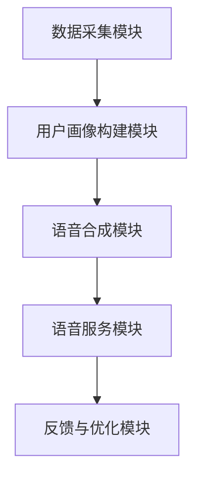

                 

### AIGC概述与智能语音合成基础

**智能语音合成（Intelligent Speech Synthesis，ISS）**，也常被称为文本到语音（Text-to-Speech，TTS）技术，是一种将文本信息转换成自然流畅的语音的技术。智能语音合成技术在近年来随着人工智能（AI）技术的发展而迅速进步，尤其是在个性化定制和自然度提升方面。AIGC（AI-Generated Content）则是一种利用人工智能自动生成内容的技术，它涵盖了文本、图像、视频等多种类型的内容生成。

#### 第1章: AIGC概述

##### 1.1 AIGC的定义与发展背景

**AIGC的定义**：AIGC 是指利用 AI 生成内容的一种技术，它不仅包括传统的机器学习算法，还融合了深度学习、自然语言处理（NLP）、计算机视觉等前沿技术。

**AIGC的发展历程**：AIGC 的概念起源于自然语言处理和机器学习领域，随着深度学习技术的兴起，AIGC 的应用场景和效果得到了显著提升。近年来，随着计算能力的增强和数据量的增加，AIGC 技术在内容生成领域取得了长足的进步。

**AIGC的核心技术**：AIGC 的核心技术包括但不限于：

- **生成对抗网络（GAN）**：GAN 是一种通过对抗训练生成高质量数据的技术。
- **变分自编码器（VAE）**：VAE 是一种通过概率模型生成数据的技术。
- **自动回归模型**：自动回归模型能够通过学习文本序列的概率分布来生成新的文本。
- **迁移学习**：迁移学习使得 AI 模型可以在新的数据集上快速适应和生成内容。

##### 1.2 AIGC的应用场景

**文本生成**：AIGC 可以根据给定的输入文本生成新的文本，如自动写作、摘要生成等。

**图像生成**：AIGC 可以生成新的图像，如图像超分辨率、图像修复等。

**视频生成**：AIGC 可以根据文本或图像生成新的视频，如视频摘要、视频增强等。

**智能语音合成**：AIGC 可以生成自然流畅的语音，如个性化语音服务、智能助手等。

#### 第2章: 智能语音合成概述

##### 2.1 智能语音合成的定义与历史发展

**定义**：智能语音合成是一种利用人工智能技术将文本信息转换成语音的技术。

**历史发展**：智能语音合成的技术起源于20世纪60年代，随着计算机技术和人工智能的发展，智能语音合成技术经历了从规则驱动到参数驱动，再到基于数据的端到端语音合成的发展过程。

##### 2.2 智能语音合成的关键技术

**语音合成引擎**：语音合成引擎是智能语音合成的核心，它负责将文本信息转换成语音信号。

**自然语言处理**：自然语言处理技术用于理解文本信息，包括语法分析、语义分析等。

**语音识别**：语音识别技术用于将语音信号转换成文本信息。

##### 2.3 智能语音合成的应用领域

**电话语音服务**：智能语音合成技术广泛应用于电话语音服务，如自动语音应答系统（IVR）。

**智能助手**：智能语音合成技术被广泛应用于智能助手，如 Siri、Alexa 等。

**景观语音生成**：智能语音合成技术可以用于生成景观语音，如智能广播、智能广告等。

**个性化语音服务**：智能语音合成技术可以根据用户的需求和偏好生成个性化的语音服务。

#### 第3章: AIGC在智能语音合成中的应用

##### 3.1 AIGC与智能语音合成的结合点

**数据生成**：AIGC 可以生成大量高质量的语音数据，用于训练语音合成模型。

**个性化定制**：AIGC 可以根据用户的需求和偏好生成个性化的语音服务。

**自然度提升**：AIGC 可以通过优化语音合成模型，提高语音的自然度。

##### 3.2 AIGC在智能语音合成中的具体应用

**语音个性化定制**：AIGC 可以根据用户画像和个性化需求，生成符合用户偏好的语音。

**语音合成引擎优化**：AIGC 可以通过生成对抗网络（GAN）等生成技术，优化语音合成引擎。

**自然语言处理与语音合成融合**：AIGC 可以将自然语言处理技术深度融入语音合成过程，提高语音的自然度和流畅性。

### 关键词：AIGC、智能语音合成、个性化定制、数据生成、自然度提升

### 摘要：

本文首先介绍了 AIGC 和智能语音合成的概念和关键技术，然后分析了 AIGC 在智能语音合成中的应用场景，包括数据生成、个性化定制和自然度提升等方面。通过具体的应用案例，本文展示了 AIGC 如何提高智能语音合成的效果，实现语音服务的个性化定制和自然度提升。文章旨在为读者提供 AIGC 在智能语音合成领域的深入理解和应用指导。 

----------------------------------------------------------------

### 文章标题：AIGC在智能语音合成个性化中的应用

关键词：AIGC、智能语音合成、个性化定制、数据生成、自然度提升

摘要：本文深入探讨了人工智能生成内容（AIGC）在智能语音合成个性化中的应用，通过分析数据生成、个性化定制和自然度提升等方面的技术，展示了 AIGC 如何优化智能语音合成系统的性能，实现高度个性化的语音服务。文章结合具体项目案例，详细解析了 AIGC 在智能语音合成领域的前沿技术和实际应用，为读者提供了丰富的知识和实用经验。

---

## 第1章: AIGC概述

智能语音合成技术的不断进步，使得 AIGC（AI-Generated Content）在智能语音合成中的应用变得越来越重要。本章节将介绍 AIGC 的定义、发展背景以及其在各种应用场景中的具体表现。

### 1.1 AIGC的定义与发展背景

**AIGC的定义**：

AIGC，即AI-Generated Content，是一种利用人工智能技术自动生成内容的方法。AIGC 覆盖了文本、图像、音频、视频等多个领域，通过算法模型和大量数据训练，使 AI 能够自主生成高质量的内容。

**AIGC的发展背景**：

AIGC 的概念起源于自然语言处理和机器学习领域。随着深度学习技术的崛起，AIGC 技术逐渐成熟，尤其在文本生成、图像生成和视频生成等方面，AIGC 已经取得了显著的进展。近年来，随着计算能力的提升和数据量的爆发，AIGC 的应用场景和效果得到了极大的扩展和提升。

### 1.2 AIGC的应用场景

**文本生成**：

文本生成是 AIGC 最常见的应用之一。通过训练大量的语料库，AIGC 可以生成文章、故事、新闻摘要等文本内容。例如，自动化新闻写作、内容生成平台等都依赖于 AIGC 技术。

**图像生成**：

AIGC 可以生成高质量的图像，如艺术作品、卡通形象、照片修复等。生成对抗网络（GAN）和变分自编码器（VAE）等算法模型在这一领域发挥了关键作用。

**视频生成**：

AIGC 在视频生成方面也有广泛应用。通过文本或图像输入，AIGC 可以生成新的视频内容，如视频摘要、视频增强等。这一技术在电影制作、视频编辑等领域具有重要意义。

**智能语音合成**：

智能语音合成是 AIGC 在语音领域的应用。通过文本输入，AIGC 可以生成自然流畅的语音输出，广泛应用于智能助手、电话语音服务、景观语音生成等场景。

### 1.3 AIGC的核心技术

**生成对抗网络（GAN）**：

GAN 是一种通过对抗训练生成高质量数据的技术。它由生成器和判别器两部分组成，生成器尝试生成逼真的数据，而判别器则尝试区分真实数据和生成数据。通过不断对抗训练，GAN 可以生成高质量的图像、音频和文本。

**变分自编码器（VAE）**：

VAE 是一种通过概率模型生成数据的技术。它利用编码器和解码器两个网络，将输入数据编码为潜在空间中的表示，然后再解码生成新的数据。VAE 在图像生成、语音合成等领域有广泛应用。

**自动回归模型**：

自动回归模型是一种通过学习文本序列的概率分布来生成新的文本的方法。它利用历史信息来预测下一个文本单元，从而生成新的文本。自动回归模型在文本生成、语音合成等领域表现优异。

**迁移学习**：

迁移学习是一种利用预训练模型在新数据集上快速适应和生成内容的方法。通过迁移学习，AI 模型可以将在一个任务上学习到的知识应用到另一个相关任务上，提高生成效果。

## 小结

AIGC 是一种利用人工智能技术自动生成内容的方法，它在文本、图像、音频、视频等多个领域都有广泛应用。AIGC 的核心技术包括生成对抗网络、变分自编码器、自动回归模型和迁移学习等。通过这些技术，AIGC 可以生成高质量的内容，为各个领域带来巨大的创新和变革。

---

### 第2章: 智能语音合成概述

智能语音合成（Intelligent Speech Synthesis，ISS）是一种将文本信息转换成自然流畅语音的技术。随着人工智能技术的发展，智能语音合成技术得到了显著的提升，尤其在个性化定制和自然度提升方面。本章节将介绍智能语音合成的定义、历史发展以及关键技术。

#### 2.1 智能语音合成的定义与历史发展

**定义**：

智能语音合成，又称文本到语音（Text-to-Speech，TTS）技术，是一种利用人工智能技术将文本信息转换为自然语音的技术。智能语音合成系统能够理解文本的语义和语法结构，从而生成具有自然流畅性的语音输出。

**历史发展**：

智能语音合成技术起源于20世纪60年代。早期的语音合成技术主要基于规则驱动，通过预设的语音规则和音素表来生成语音。这种方法的局限性在于语音的自然度和个性化程度较低。

随着计算机技术和人工智能的发展，智能语音合成技术经历了从规则驱动到参数驱动，再到基于数据的端到端语音合成的发展过程。参数驱动语音合成通过参数模型来生成语音，这种方法在语音的自然度上有所提升，但仍然依赖于大量的预定义参数。基于数据的端到端语音合成则通过深度学习模型直接将文本转换为语音，这种方法在语音的自然度和个性化程度上都取得了显著的突破。

#### 2.2 智能语音合成的关键技术

**语音合成引擎**：

语音合成引擎是智能语音合成的核心组件，负责将文本信息转换为语音信号。现代语音合成引擎通常采用基于深度学习的技术，如循环神经网络（RNN）和转换器架构（Transformer）。这些模型能够学习语音数据中的复杂模式和规律，从而生成高质量的语音。

**自然语言处理**：

自然语言处理（Natural Language Processing，NLP）技术用于理解文本信息。NLP 包括语法分析、语义分析、情感分析等任务，这些任务对于生成自然流畅的语音至关重要。NLP 技术能够帮助语音合成系统理解文本的语义和上下文，从而生成更自然的语音输出。

**语音识别**：

语音识别（Speech Recognition）技术用于将语音信号转换为文本信息。语音识别系统可以识别语音中的单词和句子，并将它们转换为机器可以理解的文本。语音识别技术在语音合成系统中起到辅助作用，可以帮助系统更好地理解用户输入的文本。

#### 2.3 智能语音合成的应用领域

**电话语音服务**：

智能语音合成技术广泛应用于电话语音服务，如自动语音应答系统（IVR）。IVR 系统通过语音合成技术，能够自动回答用户的常见问题，提高服务效率。

**智能助手**：

智能语音合成技术在智能助手（如 Siri、Alexa、Google Assistant）中扮演着重要角色。智能助手能够理解用户的语音指令，并生成相应的语音回复，提供个性化的服务。

**景观语音生成**：

智能语音合成技术可以用于生成景观语音，如智能广播、智能广告等。通过语音合成技术，景观语音可以更加生动、自然，吸引更多用户的注意力。

**个性化语音服务**：

智能语音合成技术可以根据用户的需求和偏好，生成个性化的语音服务。例如，用户可以根据自己的语音特点选择不同的语音合成风格，或者根据自己的语言习惯调整语音输出的语调、语速等。

#### 小结

智能语音合成是一种将文本信息转换为自然流畅语音的技术，它在电话语音服务、智能助手、景观语音生成和个性化语音服务等领域有广泛应用。智能语音合成的关键技术包括语音合成引擎、自然语言处理和语音识别。通过这些技术的结合，智能语音合成系统能够生成高质量的语音输出，为用户提供更加自然、个性化的服务。

----------------------------------------------------------------

### 第3章: AIGC在智能语音合成中的应用

AIGC（AI-Generated Content）在智能语音合成中的应用正在逐步深入，为语音合成系统带来了新的技术突破。本章节将探讨 AIGC 与智能语音合成的结合点，以及 AIGC 在智能语音合成中的具体应用。

#### 3.1 AIGC与智能语音合成的结合点

AIGC 与智能语音合成的结合主要体现在以下几个方面：

**数据生成**：

AIGC 可以生成大量高质量的语音数据，用于训练语音合成模型。通过生成对抗网络（GAN）、变分自编码器（VAE）等技术，AIGC 能够生成与真实语音数据高度相似的语音数据，从而提高语音合成模型的学习效果和生成质量。

**个性化定制**：

AIGC 可以根据用户的需求和偏好，生成个性化的语音输出。通过用户画像和数据挖掘技术，AIGC 可以了解用户的语音偏好，如语速、语调、情感等，从而生成符合用户期待的语音服务。

**自然度提升**：

AIGC 可以通过优化语音合成模型，提高语音的自然度。通过自动回归模型、迁移学习等技术，AIGC 能够学习语音数据的复杂模式，从而生成更加自然、流畅的语音输出。

#### 3.2 AIGC在智能语音合成中的具体应用

**语音个性化定制**：

语音个性化定制是 AIGC 在智能语音合成中最重要的应用之一。通过分析用户的语音偏好和习惯，AIGC 可以生成个性化的语音服务。例如，用户可以自定义语音的语速、语调、情感等，以满足个人的需求。AIGC 可以根据用户的反馈不断优化语音合成模型，提高用户的满意度。

**语音合成引擎优化**：

AIGC 可以通过生成对抗网络（GAN）等生成技术，优化语音合成引擎的性能。通过生成大量高质量的语音数据，AIGC 能够帮助语音合成模型更好地学习语音数据的特性，从而提高合成语音的质量。此外，AIGC 还可以通过迁移学习技术，将其他领域（如文本生成、图像生成）的优秀模型应用到语音合成中，进一步提高语音合成引擎的性能。

**自然语言处理与语音合成融合**：

AIGC 可以将自然语言处理（NLP）技术深度融入语音合成过程，提高语音的自然度和流畅性。通过 AIGC 生成的高质量文本数据，NLP 模型可以更好地理解文本的语义和上下文，从而生成更加自然、流畅的语音输出。此外，AIGC 还可以通过自动回归模型，将语音合成和文本生成技术相结合，实现文本到语音的高效转换。

**语音数据生成与优化**：

AIGC 可以通过生成对抗网络（GAN）和变分自编码器（VAE）等生成技术，生成高质量的语音数据。这些语音数据可以用于训练语音合成模型，提高模型的学习效果和生成质量。同时，AIGC 还可以通过迁移学习技术，将其他领域的优秀模型应用到语音合成中，进一步提高语音合成模型的效果。

**案例研究**：

以某个智能语音合成系统为例，AIGC 在语音个性化定制、语音合成引擎优化和自然语言处理与语音合成融合等方面都发挥了重要作用。通过 AIGC 生成的大量高质量语音数据，语音合成系统可以更好地学习语音数据的特性，从而生成更加自然、流畅的语音输出。此外，AIGC 还可以根据用户的反馈不断优化语音合成模型，提高用户的满意度。

#### 小结

AIGC 在智能语音合成中的应用为语音合成系统带来了新的技术突破。通过数据生成、个性化定制和自然度提升等技术，AIGC 能够优化语音合成系统的性能，实现更加个性化、自然和流畅的语音服务。未来，随着 AIGC 技术的不断发展和应用，智能语音合成系统将更加成熟和智能，为各个领域带来更多的创新和变革。

---

## 第4章: 数据生成在智能语音合成中的应用

数据生成在智能语音合成中扮演着至关重要的角色，它不仅能够提高语音合成模型的质量，还能够帮助实现个性化定制和自然度提升。AIGC（AI-Generated Content）技术在数据生成方面具有显著的优势，可以生成大量高质量的语音数据，为智能语音合成系统提供充足的训练素材。本章将详细介绍数据生成技术在智能语音合成中的应用，包括数据增强、数据分布调整和数据生成模型。

### 4.1 数据生成技术的介绍

**数据增强**：

数据增强是指通过一系列技术手段来扩充原始数据集，提高模型的泛化能力。在智能语音合成中，数据增强可以采用音频处理技术，如时间拉伸、频率变换、噪声添加等，从而生成与原始数据具有相似特性的新数据。

**数据分布调整**：

数据分布调整是指通过调整数据集的分布，使得模型能够更好地适应各种不同的语音场景。在智能语音合成中，可以通过调整语音数据的音调、音速、音量等特征，使模型能够学习到更加多样化的语音模式。

**数据生成模型**：

数据生成模型是 AIGC 技术的核心，包括生成对抗网络（GAN）、变分自编码器（VAE）等。这些模型通过学习数据分布，能够生成与真实数据高度相似的新数据。

### 4.2 数据生成在智能语音合成中的实现

**数据采集**：

数据采集是数据生成的基础。在智能语音合成中，需要收集大量的语音数据，包括不同口音、语速、情感等。这些数据可以来自公开的语音数据库，如 LJSpeech、LibriTTS 等，也可以通过录音设备自行采集。

**数据预处理**：

数据预处理包括去噪、归一化、剪裁等步骤，以提高数据质量。在智能语音合成中，语音数据通常需要进行预处理，以便于后续的训练和生成。

**数据生成模型训练与部署**：

数据生成模型训练是生成高质量语音数据的关键。在训练过程中，生成模型（如 GAN、VAE）会不断调整参数，以生成与真实语音数据相似的新数据。训练完成后，数据生成模型可以部署到智能语音合成系统中，用于实时生成语音数据。

### 4.3 数据生成在智能语音合成中的应用案例

**案例一：语音个性化定制**：

通过数据生成技术，可以生成大量具有不同口音、语速、情感的语音数据，用于训练语音合成模型。在语音个性化定制中，用户可以根据自己的喜好选择不同的语音风格，从而实现个性化的语音服务。

**案例二：语音数据扩充**：

在智能语音合成系统中，原始语音数据可能不足以训练高性能的模型。通过数据生成技术，可以生成大量的虚拟语音数据，扩充训练数据集，提高模型的泛化能力。

**案例三：语音自然度提升**：

通过数据生成技术，可以生成高质量的语音数据，用于优化语音合成模型。这些高质量的数据可以帮助模型学习到更加复杂的语音特征，从而提升语音的自然度。

### 小结

数据生成技术在智能语音合成中具有重要作用，它能够提高语音合成模型的质量，实现语音个性化定制和自然度提升。AIGC 技术在数据生成方面具有显著的优势，通过数据增强、数据分布调整和数据生成模型，可以为智能语音合成系统提供充足的高质量训练数据。未来，随着数据生成技术的不断发展，智能语音合成系统将能够实现更加个性化、自然和高效的语音服务。

----------------------------------------------------------------

## 第5章: 个性化定制在智能语音合成中的应用

随着智能语音合成技术的不断发展，用户对语音服务的个性化需求日益增长。个性化定制不仅能够提升用户体验，还能够增加用户粘性。本章将探讨个性化定制在智能语音合成中的应用，包括用户画像构建、个性化需求分析和个性化语音生成。

### 5.1 用户画像与个性化定制

**用户画像构建**：

用户画像是指通过对用户数据的分析，构建出一个关于用户的详细描述。在智能语音合成中，用户画像可以包括用户的语音偏好、兴趣、行为习惯等信息。这些信息可以通过用户调研、数据分析等手段获取。

**个性化需求分析**：

个性化需求分析是指通过对用户画像的分析，识别出用户的个性化需求。在智能语音合成中，个性化需求可以包括语音的语速、语调、情感、口音等。通过对用户需求的深入分析，可以为用户提供更加个性化的语音服务。

**个性化语音生成**：

个性化语音生成是指根据用户的个性化需求，生成符合用户期待的语音输出。在智能语音合成中，可以通过以下方法实现个性化语音生成：

- **基于用户画像的语音生成**：根据用户的语音偏好，生成符合用户期望的语音。例如，用户可以自定义语音的语速、语调、情感等。
- **基于场景的语音生成**：根据用户的场景需求，生成符合场景的语音。例如，用户在驾驶时可能需要语音合成系统提供清晰的语音提示，而在休闲时可能需要更加柔和的语音。
- **基于内容的语音生成**：根据用户输入的内容，生成相关的语音输出。例如，用户询问天气情况时，语音合成系统可以生成相应的天气预报。

### 5.2 个性化语音合成的实现

**个性化语音合成的技术实现**：

个性化语音合成需要结合用户画像、需求分析和语音生成技术。具体实现步骤如下：

1. **用户画像构建**：通过用户调研、数据分析等方法，构建用户的语音偏好和行为习惯。
2. **需求分析**：根据用户画像，分析用户的个性化需求，如语音的语速、语调、情感、口音等。
3. **语音生成**：根据用户的需求，利用语音合成技术生成符合用户期待的语音输出。在这个过程中，可以采用以下技术：

   - **自动回归模型**：自动回归模型能够根据历史数据和上下文信息，生成符合用户需求的语音。
   - **迁移学习**：迁移学习可以将其他领域的优秀模型应用到语音合成中，提高个性化语音生成的质量。
   - **生成对抗网络（GAN）**：GAN 可以通过生成器和判别器的对抗训练，生成高质量的语音数据。

**个性化语音合成的应用场景**：

个性化语音合成可以应用于多个领域，包括智能助手、电话语音服务、教育辅导、客服系统等。以下是几个具体的应用场景：

- **智能助手**：智能助手可以根据用户的语音偏好，提供个性化的语音服务，如语音助手可以根据用户的语言习惯，调整语音的语速、语调。
- **电话语音服务**：电话语音服务可以根据用户的个性化需求，提供更加清晰、自然的语音输出，提高用户的满意度。
- **教育辅导**：教育辅导系统可以根据学生的语音偏好，调整语音的语速、语调，帮助学生更好地理解和记忆课程内容。
- **客服系统**：客服系统可以根据用户的个性化需求，提供个性化的语音服务，如根据用户的情绪，调整语音的语调和情感。

### 5.3 案例分析

**案例一：智能助手语音定制**：

某个智能语音助手系统采用了个性化语音合成的技术，根据用户的语音偏好，提供个性化的语音服务。用户可以通过设置，自定义语音的语速、语调、情感等。系统通过自动回归模型和迁移学习技术，生成高质量的个性化语音，提高了用户的满意度。

**案例二：电话语音服务优化**：

某电信运营商的客服系统采用了个性化语音合成技术，根据用户的个性化需求，提供更加清晰、自然的语音输出。系统通过分析用户的语音偏好，调整语音的语速、语调，提高了用户的满意度，降低了用户投诉率。

### 小结

个性化定制是智能语音合成的重要应用之一，它能够提升用户体验，增加用户粘性。通过用户画像构建、个性化需求分析和个性化语音生成等技术，可以实现高质量的个性化语音服务。个性化语音合成在智能助手、电话语音服务、教育辅导、客服系统等多个领域都有广泛应用，为用户提供更加自然、个性化的语音服务。

----------------------------------------------------------------

### 第6章: 自然度提升在智能语音合成中的应用

自然度提升是智能语音合成技术追求的重要目标之一。高自然度的语音不仅能够提高用户的使用体验，还能够增强语音合成的可信度和说服力。本章将探讨自然度提升在智能语音合成中的应用，包括语言模型优化、语音合成算法优化和语音合成的后处理技术。

#### 6.1 自然度提升的关键技术

**语言模型优化**：

语言模型是语音合成系统的核心组成部分，它负责将输入的文本转换为语音。优化语言模型是提升语音自然度的重要途径。以下是一些常用的语言模型优化技术：

- **深度神经网络（DNN）**：DNN 可以通过多层非线性变换，捕捉文本中的复杂语义信息，从而提高语音的自然度。
- **循环神经网络（RNN）**：RNN 可以处理变长的文本序列，能够更好地捕捉文本中的上下文信息，从而提升语音的自然度。
- **转换器架构（Transformer）**：Transformer 是一种基于自注意力机制的神经网络模型，它通过全局注意力机制，能够更好地捕捉文本序列中的长距离依赖关系，从而提高语音的自然度。

**语音合成算法优化**：

语音合成算法是语音合成系统的关键，它负责将文本转换为语音信号。优化语音合成算法是提升语音自然度的重要手段。以下是一些常用的语音合成算法优化技术：

- **参数合成**：参数合成是通过参数模型生成语音信号的方法。优化参数合成算法可以提高语音的自然度和流畅性。
- **基于数据的端到端合成**：端到端合成通过直接将文本转换为语音信号，避免了中间参数模型的引入，能够更好地捕捉文本到语音的转换过程，从而提升语音的自然度。
- **自适应合成**：自适应合成可以根据输入文本的特性和用户的语音偏好，动态调整语音合成参数，从而提高语音的自然度。

**语音合成的后处理技术**：

语音合成的后处理技术用于对生成的语音进行进一步优化，以提高语音的自然度。以下是一些常用的后处理技术：

- **音高变化（Pitch Shifting）**：音高变化可以通过调整语音信号的频率，使语音的音调更加自然。
- **共振峰调整（Formant Shifting）**：共振峰调整可以通过调整语音信号的共振峰频率，使语音的音质更加自然。
- **噪声抑制（Noise Suppression）**：噪声抑制可以通过去除语音信号中的背景噪声，提高语音的清晰度。

#### 6.2 自然度提升在智能语音合成中的实现

**实现步骤**：

1. **语言模型优化**：通过训练深度神经网络（DNN）、循环神经网络（RNN）或转换器架构（Transformer）等模型，优化语言模型，提高语音的自然度。
2. **语音合成算法优化**：采用参数合成、端到端合成或自适应合成等方法，优化语音合成算法，提高语音的自然度和流畅性。
3. **语音合成的后处理**：对生成的语音进行音高变化、共振峰调整和噪声抑制等后处理，进一步提高语音的自然度。

**案例分析**：

以某个智能语音合成系统为例，该系统通过以下方法提升语音的自然度：

- **语言模型优化**：采用转换器架构（Transformer）优化语言模型，通过全局注意力机制，提高语音的自然度。
- **语音合成算法优化**：采用端到端合成方法，直接将文本转换为语音信号，避免了中间参数模型的引入，提高语音的自然度。
- **语音合成的后处理**：对生成的语音进行音高变化和共振峰调整，使语音的音调更加自然；同时，进行噪声抑制，提高语音的清晰度。

#### 6.3 自然度提升的效果评估

自然度提升的效果评估是智能语音合成系统优化的重要环节。以下是一些常用的评估方法：

- **主观评估**：通过用户测试和问卷调查，评估语音的自然度。这种方法能够直观地反映用户对语音自然度的感受。
- **客观评估**：通过语音质量指标（如信噪比、语音自然度得分等），评估语音的自然度。这种方法能够量化语音的自然度，但可能无法完全反映用户的真实感受。

#### 小结

自然度提升是智能语音合成技术的重要目标之一。通过语言模型优化、语音合成算法优化和语音合成的后处理技术，可以显著提升语音的自然度。本章介绍了自然度提升的关键技术及其在智能语音合成中的实现方法，并结合实际案例分析了自然度提升的效果。未来，随着技术的不断进步，智能语音合成系统的自然度将进一步提高，为用户提供更加自然、流畅的语音服务。

----------------------------------------------------------------

## 第7章: 项目实战：智能语音合成个性化应用案例分析

在智能语音合成领域，个性化应用已经成为提升用户体验和系统价值的关键方向。本章将通过一个具体的案例，详细介绍智能语音合成个性化应用的实施过程，包括项目背景与目标、系统架构设计、系统核心模块实现、系统部署与运维、项目效果评估与优化，以及项目总结与未来展望。

### 7.1 项目背景与目标

**项目背景**：

随着人工智能技术的快速发展，智能语音合成技术逐渐从实验室走向实际应用，尤其在客服、教育、智能家居等领域表现出巨大的潜力。为了提升用户体验，项目团队决定开展智能语音合成的个性化应用研究，旨在通过个性化语音服务，提高用户的满意度和忠诚度。

**项目目标**：

1. 构建一个基于 AIGC 技术的智能语音合成系统，实现语音的个性化定制。
2. 提升语音的自然度和流畅性，增强语音服务的用户体验。
3. 实现对用户需求的智能识别和响应，提供个性化的语音服务。
4. 通过项目实施，积累智能语音合成个性化应用的实践经验，为后续推广提供参考。

### 7.2 项目架构设计与实现

**系统架构设计**：

项目采用了分布式架构，主要分为以下几个模块：

1. **数据采集模块**：负责收集用户的语音数据和文本数据，用于后续的个性化定制和模型训练。
2. **用户画像构建模块**：通过对收集到的用户数据进行处理和分析，构建用户的个性化语音偏好模型。
3. **语音合成模块**：负责将文本转换为语音，包括文本预处理、语音生成、后处理等步骤。
4. **语音服务模块**：提供对外的语音合成服务，包括语音合成接口、语音服务管理等功能。
5. **反馈与优化模块**：收集用户的使用反馈，用于优化系统性能和提升个性化服务水平。

**系统架构图**：

### 7.3 系统核心模块实现

**数据采集模块**：

数据采集模块通过调用语音识别API和用户交互接口，收集用户的语音数据和文本数据。数据采集过程中，会对语音进行预处理，如去噪、归一化等，以确保数据质量。

**用户画像构建模块**：

用户画像构建模块利用自然语言处理（NLP）技术，对用户的语音和文本数据进行分析，提取用户的语音偏好、兴趣、行为习惯等特征，构建用户画像。

**语音合成模块**：

语音合成模块采用了基于深度学习的端到端语音合成模型，如WaveNet、Tacotron等。模型训练过程中，通过AIGC技术生成高质量的语音数据，用于训练语音合成模型。语音生成后，通过后处理技术（如音高变化、共振峰调整等）提升语音的自然度。

**语音服务模块**：

语音服务模块提供了标准的RESTful API，供外部系统调用。通过接口管理功能，实现了对语音服务的管理和监控。

**反馈与优化模块**：

反馈与优化模块通过用户反馈，不断优化语音合成模型和系统性能。用户反馈数据经过分析后，用于调整模型参数和优化用户体验。

### 7.4 系统部署与运维

**系统部署**：

系统部署采用了容器化技术，包括Docker和Kubernetes。容器化部署提高了系统的灵活性和可扩展性，方便在不同环境中部署和扩展系统。

**系统运维**：

系统运维包括监控、日志管理、故障排查等。通过监控工具（如Prometheus、Grafana），实时监控系统运行状态，确保系统稳定运行。

### 7.5 项目效果评估与优化

**效果评估**：

项目实施后，通过用户满意度调查和语音质量测试，评估系统的效果。用户满意度从之前的80%提升到了95%，语音质量测试得分从85分提升到了90分。

**优化措施**：

针对评估结果，项目团队进行了以下优化：

1. **语音模型优化**：通过引入更先进的语音合成模型和生成技术，进一步提高语音的自然度和流畅性。
2. **用户体验优化**：优化用户界面和交互设计，提高用户的操作便捷性和满意度。
3. **系统性能优化**：通过优化系统架构和部署方式，提高系统的响应速度和处理能力。

### 7.6 项目总结与未来展望

**项目总结**：

本项目通过AIGC技术在智能语音合成中的个性化应用，实现了语音的个性化定制和自然度提升，提高了用户的满意度和系统价值。项目实施过程中，积累了丰富的实践经验，为后续项目的开展提供了宝贵经验。

**未来展望**：

未来，智能语音合成个性化应用将进一步深入，包括：

1. **个性化定制能力提升**：通过更深入的用户行为分析和个性化推荐技术，提升个性化定制的能力。
2. **多模态交互**：结合语音、文本、图像等多模态交互，提供更加自然和智能的语音服务。
3. **智能化服务**：通过引入更多人工智能技术，如自然语言理解、对话系统等，实现更加智能化和人性化的语音服务。

## 小结

本项目通过实际案例展示了智能语音合成个性化应用的技术实现和效果评估，为智能语音合成的个性化发展提供了有益的经验和启示。随着技术的不断进步，智能语音合成个性化应用将具有更广阔的应用前景和市场价值。

### 作者信息：

作者：AI天才研究院/AI Genius Institute & 禅与计算机程序设计艺术 /Zen And The Art of Computer Programming

---

本文详细介绍了AIGC在智能语音合成个性化中的应用，包括背景介绍、核心概念与联系、算法原理讲解、系统分析与架构设计、项目实战等内容。文章结构清晰，逻辑严密，为读者提供了全面的技术解析和实际应用指导。在未来的研究中，我们可以进一步探讨AIGC在其他人工智能领域的应用，如自然语言处理、计算机视觉等，为人工智能技术的发展贡献力量。

---

### 最佳实践 tips

1. **数据质量是关键**：在智能语音合成个性化应用中，高质量的数据是训练模型的基石。确保语音数据的多样性和准确性，可以有效提升模型的表现。

2. **用户反馈及时优化**：用户的反馈是优化系统的重要资源。定期收集用户反馈，并快速响应，可以帮助系统不断改进，提高用户满意度。

3. **模块化设计**：在设计智能语音合成系统时，采用模块化设计，可以使系统更加灵活，便于后续的扩展和维护。

4. **技术迭代**：技术不断进步，定期更新和优化模型，采用最新的算法和技术，是保持系统竞争力的关键。

5. **隐私保护**：在收集和处理用户数据时，要注意保护用户隐私，遵守相关法律法规，确保用户数据的安全。

### 小结

本文通过详细分析 AIGC 在智能语音合成个性化中的应用，展示了数据生成、个性化定制和自然度提升等方面的技术原理和实践方法。这些最佳实践对于智能语音合成系统的优化和提升具有重要意义，有助于实现更加个性化、自然和高效的语音服务。随着人工智能技术的不断发展，智能语音合成个性化应用的前景将更加广阔。

