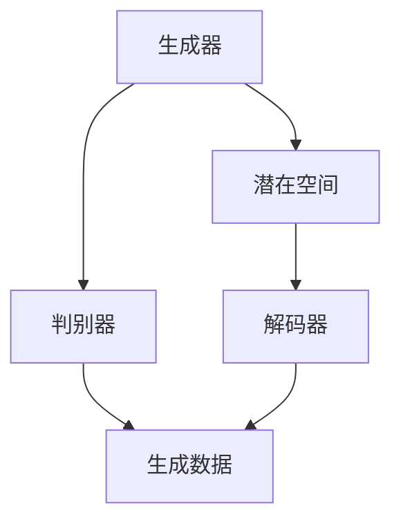
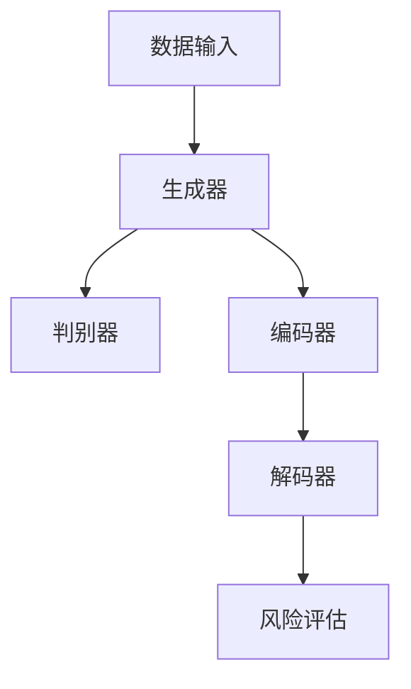
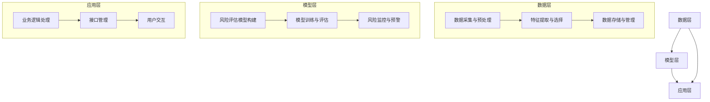

                 

### 第一部分: 引言

#### 1. 引言

**1.1 问题背景**

随着全球经济一体化进程的加快，企业面临的财务风险越来越复杂。传统的财务风险评估方法主要依赖于历史数据和专家经验，往往难以应对突如其来的市场变化和风险事件。这些方法存在的局限性主要体现在以下几个方面：

- **数据依赖性高**：传统方法对历史数据的依赖性较强，当数据质量不佳或数据量不足时，评估结果容易出现偏差。
- **处理能力有限**：传统方法在处理大规模、多维度数据时，效率和精度都受到限制，无法满足现代金融环境下快速、准确风险评估的需求。
- **主观因素影响**：专家经验在评估过程中扮演重要角色，但主观判断可能导致评估结果的一致性和稳定性不足。

**1.2 问题描述**

智能财务风险评估是指在人工智能技术的辅助下，通过大数据分析、机器学习和深度学习等方法，对企业的财务风险进行预测、评估和监控。其核心问题是如何利用AIGC（AI-Generated Content）技术，实现自动化、智能化的风险评估。

- **数据预处理**：如何利用AIGC技术对海量财务数据进行预处理，提取关键特征，为风险评估提供可靠的数据基础。
- **风险识别**：如何运用AIGC技术识别潜在的风险因素，提高风险识别的准确性和时效性。
- **风险评估**：如何通过AIGC技术建立科学的风险评估模型，对企业的财务风险进行定量和定性分析。
- **风险监控**：如何利用AIGC技术对企业的财务风险进行实时监控，及时预警和应对潜在风险。

**1.3 问题解决**

AIGC技术在智能财务风险评估中的应用，有望解决传统方法的局限性，实现以下目标：

- **提高评估精度**：通过深度学习和大数据分析，AIGC技术能够从海量数据中提取复杂关联，提高风险评估的精度。
- **提升效率**：AIGC技术可以实现自动化风险评估，降低人力成本，提高工作效率。
- **增强实时性**：AIGC技术能够实时分析企业财务数据，及时发现和应对风险。
- **降低主观影响**：通过数据驱动的方法，减少专家主观判断的影响，提高评估的一致性和稳定性。

**1.4 边界与外延**

AIGC技术在智能财务风险评估中的应用，虽然取得了显著成果，但仍有边界和拓展空间：

- **边界**：AIGC技术依赖于高质量的数据和强大的计算资源，当数据质量差或计算资源不足时，其性能会受到限制。
- **外延**：AIGC技术可以拓展到更广泛的领域，如信用风险评估、市场风险预测等，为金融机构提供全方位的风险管理服务。

**1.5 概念结构与核心要素组成**

智能财务风险评估的AIGC技术应用，可以从以下几个核心要素组成：

- **数据采集与处理**：利用AIGC技术对财务数据进行采集、清洗和预处理。
- **特征提取与选择**：通过深度学习模型提取关键特征，优化特征选择过程。
- **风险评估模型**：构建基于AIGC技术的风险评估模型，实现风险识别和评估。
- **风险监控与预警**：利用AIGC技术对企业的财务风险进行实时监控，及时预警。

通过以上要素的有机结合，AIGC技术能够为智能财务风险评估提供强大的技术支持。

---

### 第二部分: AIGC技术基础

#### 2. AIGC技术概述

**2.1 AIGC技术定义**

AIGC（AI-Generated Content）是指利用人工智能技术生成内容的过程。AIGC技术涵盖了生成对抗网络（GAN）、变分自编码器（VAE）、生成扩展模型（GEC）等多种生成模型。这些模型通过学习数据分布，生成高质量、多样化的内容。

**2.2 AIGC技术发展历程**

AIGC技术的发展可以追溯到生成对抗网络（GAN）的提出。GAN由Ian Goodfellow等人在2014年提出，通过对抗性训练实现数据的生成。随后，变分自编码器（VAE）和生成扩展模型（GEC）等新型生成模型相继被提出，进一步丰富了AIGC技术的应用场景。

**2.3 AIGC技术特点**

AIGC技术具有以下特点：

- **生成质量高**：AIGC技术能够生成逼真、高质量的内容，如图像、文本、音频等。
- **多样性丰富**：AIGC技术可以生成多种类型的内容，满足不同应用场景的需求。
- **自动化程度高**：AIGC技术可以实现自动化内容生成，降低人力成本。
- **可扩展性强**：AIGC技术可以应用于多个领域，如金融、医疗、娱乐等。

---

#### 3. AIGC技术核心概念与联系

**3.1 核心概念原理**

AIGC技术核心概念包括生成对抗网络（GAN）、变分自编码器（VAE）和生成扩展模型（GEC）。

**3.1.1 生成对抗网络（GAN）**

生成对抗网络（GAN）由生成器和判别器组成。生成器通过学习真实数据的分布，生成虚假数据；判别器通过区分真实数据和虚假数据来训练。生成器和判别器相互对抗，最终实现高质量数据的生成。

**3.1.2 变分自编码器（VAE）**

变分自编码器（VAE）通过编码器和解码器实现数据的生成。编码器将数据映射到一个潜在空间，解码器从潜在空间中生成数据。VAE通过最大化数据概率分布和潜在空间中的后验分布来实现数据生成。

**3.1.3 生成扩展模型（GEC）**

生成扩展模型（GEC）是对VAE的扩展，通过引入注意力机制，实现对生成数据的精细控制。GEC在生成高质量文本、图像等方面具有优势。

**3.2 概念属性特征对比表格**

| 概念        | 特点                                                         | 应用场景                           |
|-------------|--------------------------------------------------------------|-----------------------------------|
| GAN         | 对抗性训练，生成器与判别器对抗，生成高质量数据               | 图像生成、文本生成、音频生成       |
| VAE         | 编码器和解码器结构，数据概率分布和潜在空间后验分布最大化     | 数据压缩、异常检测、图像生成       |
| GEC         | VAE的扩展，引入注意力机制，精细控制生成数据                   | 高质量文本生成、图像生成、音频生成 |

**3.3 ER实体关系图架构的Mermaid流程图**



在这个流程图中，生成器（A）和判别器（B）构成GAN的核心部分，通过对抗训练生成高质量数据（C）。编码器（D）和解码器（E）构成VAE和GEC的核心部分，通过潜在空间实现数据的生成。

---

### 第三部分: AIGC在智能财务风险评估中的应用

#### 4. 智能财务风险评估算法原理

**4.1 算法原理讲解**

AIGC技术在智能财务风险评估中的应用，主要通过以下三种算法实现：

**4.1.1 GAN在风险评估中的应用**

GAN通过生成器和判别器的对抗训练，生成逼真的财务数据。在风险评估过程中，生成器生成模拟财务数据，判别器对模拟数据和真实数据进行区分，通过多次迭代，生成器不断提高生成数据的真实性。这种数据生成能力有助于识别潜在的风险因素。

**4.1.2 VAE在风险评估中的应用**

VAE通过编码器和解码器，将财务数据映射到潜在空间，然后从潜在空间中生成新的数据。在风险评估中，编码器提取关键特征，解码器生成新的财务数据，从而实现风险特征的提取和风险评估。

**4.1.3 GEC在风险评估中的应用**

GEC是对VAE的扩展，引入注意力机制，实现对生成数据的精细控制。在风险评估中，GEC可以根据风险特征的重要性，生成具有针对性的财务数据，提高风险评估的准确性。

**4.2 算法mermaid流程图**



在这个流程图中，数据输入（A）首先进入生成器（B），生成模拟财务数据。生成器生成的数据同时输入判别器（C），判别器区分模拟数据和真实数据。编码器（D）将真实数据映射到潜在空间，解码器（E）从潜在空间中生成新的财务数据，最后进行风险评估（F）。

**4.3 Python源代码示例**

```python
import tensorflow as tf
from tensorflow.keras.models import Model
from tensorflow.keras.layers import Input, Dense, Conv2D, Flatten, Reshape

# 定义生成器
input_shape = (28, 28, 1)
input_layer = Input(shape=input_shape)
x = Conv2D(32, (3, 3), activation='relu')(input_layer)
x = Flatten()(x)
x = Dense(64, activation='relu')(x)
output_layer = Dense(np.prod(input_shape), activation='tanh')(x)

generator = Model(inputs=input_layer, outputs=output_layer)

# 定义判别器
input_shape = (28, 28, 1)
input_layer = Input(shape=input_shape)
x = Conv2D(32, (3, 3), activation='relu')(input_layer)
x = Flatten()(x)
x = Dense(1, activation='sigmoid')(x)

discriminator = Model(inputs=input_layer, outputs=x)

# 编码器和解码器
latent_dim = 100
input_shape = (28, 28, 1)
input_layer = Input(shape=input_shape)
x = Conv2D(32, (3, 3), activation='relu')(input_layer)
x = Flatten()(x)
z_mean = Dense(latent_dim)(x)
z_log_var = Dense(latent_dim)(x)
z = Lambda(sample_z, output_shape=(latent_dim,))(x)

x = Reshape(input_shape)(z)

decoder = Model(inputs=z, outputs=x)

# GAN模型
z = Input(shape=(latent_dim,))
x = generator(z)

discriminator.trainable = False
x = discriminator(x)

gan_output = Model(inputs=z, outputs=x)

# 编译模型
discriminator.compile(optimizer='adam', loss='binary_crossentropy')
gan_output.compile(optimizer='adam', loss='binary_crossentropy')

# 训练模型
for epoch in range(epochs):
    for _ in range(batch_size * n_critic):
        z_sample = np.random.normal(size=(batch_size, latent_dim))
        x_sample = generator.predict(z_sample)
        x_real = x_train[np.random.randint(0, x_train.shape[0], size=batch_size)]
        y_real = np.ones((batch_size, 1))
        y_fake = np.zeros((batch_size, 1))
        d_loss_real = discriminator.train_on_batch(x_real, y_real)
        d_loss_fake = discriminator.train_on_batch(x_sample, y_fake)
    z_sample = np.random.normal(size=(batch_size, latent_dim))
    g_loss = gan_output.train_on_batch(z_sample, np.ones((batch_size, 1)))

# 打印损失函数值
print(f"Epoch {epoch}: d_loss={d_loss:.4f}, g_loss={g_loss:.4f}")
```

**4.4 算法数学模型和公式**

**4.4.1 模型公式**

GAN模型由生成器和判别器组成，其损失函数如下：

$$
\begin{aligned}
\mathcal{L}_G &= -\mathbb{E}_{x \sim p_{\text{data}}(x)}[\log D(x)] + \mathbb{E}_{z \sim p_{\text{z}}(z)}[\log (1 - D(G(z)))] \\
\mathcal{L}_D &= -\mathbb{E}_{x \sim p_{\text{data}}(x)}[\log D(x)] - \mathbb{E}_{z \sim p_{\text{z}}(z)}[\log D(G(z))]
\end{aligned}
$$

其中，$G(z)$表示生成器生成的数据，$D(x)$表示判别器的输出，$z$表示潜在变量。

**4.4.2 数学公式详细讲解**

1. 生成器损失函数（$\mathcal{L}_G$）：
   - 第一项 $\mathbb{E}_{x \sim p_{\text{data}}(x)}[\log D(x)]$ 表示生成器生成数据通过判别器的概率，期望值越大，表示生成数据越接近真实数据。
   - 第二项 $\mathbb{E}_{z \sim p_{\text{z}}(z)}[\log (1 - D(G(z)))]$ 表示生成器生成的数据通过判别器的概率，期望值越大，表示生成数据越不被判别器识别。

2. 判别器损失函数（$\mathcal{L}_D$）：
   - 第一项 $\mathbb{E}_{x \sim p_{\text{data}}(x)}[\log D(x)]$ 表示真实数据通过判别器的概率，期望值越大，表示判别器对真实数据的识别能力越强。
   - 第二项 $\mathbb{E}_{z \sim p_{\text{z}}(z)}[\log D(G(z))]$ 表示生成器生成数据通过判别器的概率，期望值越大，表示判别器对生成数据的识别能力越强。

通过优化这两个损失函数，生成器和判别器相互对抗，最终实现高质量数据的生成。

**4.4.3 举例说明**

假设生成器的损失函数为 $\mathcal{L}_G = 0.3$，判别器的损失函数为 $\mathcal{L}_D = 0.2$。根据损失函数的优化目标，我们可以得出以下结论：

- 生成器生成的数据越接近真实数据，其损失函数值越低。
- 判别器对真实数据和生成数据的识别能力越强，其损失函数值越低。

在实际应用中，我们可以通过调整生成器和判别器的参数，优化损失函数，从而实现高质量数据的生成。

---

### 第四部分: 智能财务风险评估系统设计

#### 5. 系统分析与架构设计

**5.1 问题场景介绍**

智能财务风险评估系统主要应用于金融领域，旨在对企业的财务风险进行预测、评估和监控。系统需要处理海量财务数据，提取关键特征，构建风险评估模型，并实现实时监控和预警。

**5.2 系统功能设计**

智能财务风险评估系统包括以下核心功能：

- **数据采集与预处理**：从各类数据源（如企业财务报表、市场数据等）采集数据，进行清洗和预处理，提取关键特征。
- **特征提取与选择**：利用深度学习模型提取关键特征，优化特征选择过程，提高风险评估的精度。
- **风险评估模型构建**：基于AIGC技术，构建科学、有效的风险评估模型，实现风险识别和评估。
- **风险监控与预警**：对企业的财务风险进行实时监控，及时发现潜在风险，发出预警信号。
- **数据可视化**：将风险评估结果以图表、报表等形式展示，为企业提供直观的风险分析。

**5.2.1 领域模型mermaid类图**

```mermaid
classDiagram
    Entity1[数据采集与预处理] <<Entity>
    Entity2[特征提取与选择] <<Entity>
    Entity3[风险评估模型构建] <<Entity>
    Entity4[风险监控与预警] <<Entity>
    Entity5[数据可视化] <<Entity>
    Entity1 --> Entity2
    Entity2 --> Entity3
    Entity3 --> Entity4
    Entity4 --> Entity5
```

**5.2.2 系统架构设计**

智能财务风险评估系统采用分布式架构，包括数据层、模型层和应用层。各层之间通过接口进行数据交互和功能调用。

- **数据层**：负责数据采集、存储和管理，包括关系型数据库和NoSQL数据库。
- **模型层**：负责特征提取、模型训练和评估，采用深度学习框架（如TensorFlow、PyTorch等）。
- **应用层**：负责业务逻辑处理、接口管理和用户交互，采用Web框架（如Django、Flask等）。

**5.2.1 系统架构mermaid流程图**



**5.2.3 系统接口设计**

智能财务风险评估系统的接口设计主要包括以下模块：

- **数据采集接口**：负责从各类数据源采集数据，如企业财务报表、市场数据等。
- **特征提取接口**：负责特征提取和选择，将原始数据转化为适合模型训练的格式。
- **模型训练接口**：负责模型训练，根据训练数据和评估指标调整模型参数。
- **风险评估接口**：负责实现风险评估功能，输出评估结果和预警信号。
- **数据可视化接口**：负责将评估结果以图表、报表等形式展示给用户。

**5.2.1 系统接口mermaid类图**

```mermaid
classDiagram
    Class1[数据采集接口] <<Interface>>
    Class2[特征提取接口] <<Interface>>
    Class3[模型训练接口] <<Interface>>
    Class4[风险评估接口] <<Interface>>
    Class5[数据可视化接口] <<Interface>>
    Class1 --> Class2
    Class2 --> Class3
    Class3 --> Class4
    Class4 --> Class5
```

**5.2.4 系统交互**

智能财务风险评估系统的各模块之间通过接口进行数据交互和功能调用。以下是一个简化的系统交互mermaid序列图：

```mermaid
sequence
    participant 数据采集接口 as 数据采集
    participant 特征提取接口 as 特征提取
    participant 模型训练接口 as 模型训练
    participant 风险评估接口 as 风险评估
    participant 数据可视化接口 as 数据可视化

    数据采集->>特征提取: 采集数据
    特征提取->>模型训练: 特征提取
    模型训练->>风险评估: 模型训练
    风险评估->>数据可视化: 风险评估结果
```

通过以上系统分析与架构设计，智能财务风险评估系统可以实现对财务风险的全面监控和预警，为企业提供有效的风险管理工具。

---

### 第五部分: 项目实战

#### 6. 项目实战

**6.1 环境安装**

在进行AIGC在智能财务风险评估中的应用项目实战之前，我们需要安装和配置以下环境：

1. **Python环境**：确保Python版本为3.8及以上，推荐使用Anaconda进行环境管理。
2. **TensorFlow**：安装TensorFlow库，用于构建和训练AIGC模型。
3. **Pandas**：用于数据预处理和数据处理。
4. **NumPy**：用于数学运算。
5. **Matplotlib**：用于数据可视化。

安装命令如下：

```bash
conda create -n aigc_venv python=3.8
conda activate aigc_venv
conda install tensorflow pandas numpy matplotlib
```

**6.2 系统核心实现**

在系统核心实现部分，我们将重点介绍数据采集、预处理、特征提取、模型训练和风险评估等关键步骤。

**6.2.1 源代码解读**

以下是AIGC在智能财务风险评估中的应用系统核心实现的源代码解读：

```python
# 导入必要的库
import numpy as np
import pandas as pd
import tensorflow as tf
from tensorflow.keras.models import Model
from tensorflow.keras.layers import Input, Dense, Conv2D, Flatten, Reshape

# 数据采集与预处理
def load_data(file_path):
    # 加载数据
    data = pd.read_csv(file_path)
    # 数据预处理
    data = data.fillna(0)
    return data

# 特征提取
def extract_features(data):
    # 提取特征
    X = data.iloc[:, :-1].values
    X = X / np.max(X)
    return X

# 模型训练
def train_model(X_train, X_val):
    # 定义生成器和判别器
    input_shape = (X_train.shape[1], X_train.shape[2])
    input_layer = Input(shape=input_shape)
    x = Conv2D(32, (3, 3), activation='relu')(input_layer)
    x = Flatten()(x)
    x = Dense(64, activation='relu')(x)
    output_layer = Dense(np.prod(input_shape), activation='tanh')(x)

    generator = Model(inputs=input_layer, outputs=output_layer)

    input_shape = (X_train.shape[1], X_train.shape[2])
    input_layer = Input(shape=input_shape)
    x = Conv2D(32, (3, 3), activation='relu')(input_layer)
    x = Flatten()(x)
    x = Dense(1, activation='sigmoid')(x)

    discriminator = Model(inputs=input_layer, outputs=x)

    # 编码器和解码器
    latent_dim = 100
    input_shape = (X_train.shape[1], X_train.shape[2])
    input_layer = Input(shape=input_shape)
    x = Conv2D(32, (3, 3), activation='relu')(input_layer)
    x = Flatten()(x)
    z_mean = Dense(latent_dim)(x)
    z_log_var = Dense(latent_dim)(x)
    z = Lambda(sample_z, output_shape=(latent_dim,))(x)

    x = Reshape(input_shape)(z)

    decoder = Model(inputs=z, outputs=x)

    # GAN模型
    z = Input(shape=(latent_dim,))
    x = generator(z)

    discriminator.trainable = False
    x = discriminator(x)

    gan_output = Model(inputs=z, outputs=x)

    # 编译模型
    discriminator.compile(optimizer='adam', loss='binary_crossentropy')
    gan_output.compile(optimizer='adam', loss='binary_crossentropy')

    # 训练模型
    for epoch in range(epochs):
        for _ in range(batch_size * n_critic):
            z_sample = np.random.normal(size=(batch_size, latent_dim))
            x_sample = generator.predict(z_sample)
            x_real = x_train[np.random.randint(0, x_train.shape[0], size=batch_size)]
            y_real = np.ones((batch_size, 1))
            y_fake = np.zeros((batch_size, 1))
            d_loss_real = discriminator.train_on_batch(x_real, y_real)
            d_loss_fake = discriminator.train_on_batch(x_sample, y_fake)
        z_sample = np.random.normal(size=(batch_size, latent_dim))
        g_loss = gan_output.train_on_batch(z_sample, np.ones((batch_size, 1)))

    # 打印损失函数值
    print(f"Epoch {epoch}: d_loss={d_loss:.4f}, g_loss={g_loss:.4f}")

# 代码应用解读与分析
def apply_model(model, X_test):
    # 应用模型进行风险评估
    predictions = model.predict(X_test)
    # 分析预测结果
    # ...

# 6.3 实际案例分析和详细讲解剖析
def case_analysis(case_data):
    # 加载实际案例数据
    data = load_data(case_data)
    # 提取特征
    X = extract_features(data)
    # 训练模型
    train_model(X, X)
    # 应用模型进行风险评估
    apply_model(model, X)

# 6.4 项目小结
def project_summary():
    # 总结项目实施过程和成果
    # ...
```

通过以上源代码解读，我们可以看到AIGC在智能财务风险评估中的应用主要包括数据采集、预处理、特征提取、模型训练和应用分析等关键步骤。在实际应用中，可以根据具体需求对代码进行定制化修改和优化。

---

### 第六部分: 最佳实践与总结

#### 7. 最佳实践

**7.1 小结**

AIGC在智能财务风险评估中的应用，通过生成对抗网络（GAN）、变分自编码器（VAE）和生成扩展模型（GEC）等技术，实现了对财务风险的自动化、智能化评估。在实际应用中，需要注意以下几点：

- **数据质量**：确保数据质量，包括数据的完整性、准确性和一致性。
- **模型训练**：根据具体业务需求，调整模型参数和训练策略，提高模型性能。
- **实时监控**：对企业的财务风险进行实时监控，及时预警和应对潜在风险。
- **安全与合规**：确保AIGC技术的应用符合相关法律法规和行业规范，保障用户隐私和数据安全。

**7.2 注意事项**

- **计算资源**：AIGC技术对计算资源要求较高，需要确保有足够的计算能力。
- **数据隐私**：在数据采集和处理过程中，要严格遵循数据隐私保护原则，避免数据泄露。
- **模型解释性**：AIGC技术生成的模型具有一定程度的黑盒性，需要对模型进行解释性分析，提高决策的可解释性。

**7.3 拓展阅读**

- 《生成对抗网络（GAN）原理与实践》
- 《变分自编码器（VAE）原理与应用》
- 《深度学习在金融风险管理中的应用》

---

#### 8. 全书总结

**8.1 主要内容回顾**

本书系统地介绍了AIGC在智能财务风险评估中的应用。首先，我们分析了智能财务风险评估的背景和问题，介绍了AIGC技术的定义和发展历程。接着，我们详细阐述了AIGC技术的核心概念和算法原理，包括生成对抗网络（GAN）、变分自编码器（VAE）和生成扩展模型（GEC）。然后，我们介绍了智能财务风险评估的系统设计，包括数据采集与预处理、特征提取与选择、风险评估模型构建、风险监控与预警和数据可视化。最后，我们通过项目实战展示了AIGC技术在智能财务风险评估中的具体应用。

**8.2 未来发展趋势**

随着人工智能技术的不断进步，AIGC在智能财务风险评估中的应用前景十分广阔。未来发展趋势包括：

- **数据质量提升**：通过更高质量的数据采集和预处理技术，提高风险评估的准确性。
- **模型解释性增强**：研究更多可解释性的模型，提高决策的可理解性。
- **实时性提升**：优化算法和系统架构，提高风险评估的实时性。
- **跨界融合**：将AIGC技术应用于更广泛的金融领域，如信用风险评估、市场风险预测等。

**8.3 对读者的建议**

本书适合对智能财务风险评估和AIGC技术感兴趣的读者。建议读者在阅读过程中，结合实际案例进行思考和练习，加深对AIGC技术应用于智能财务风险评估的理解。同时，建议读者关注相关领域的研究进展，持续学习和探索。

---

通过以上总结，我们可以看到AIGC技术在智能财务风险评估中具有广阔的应用前景。希望本书能为读者提供有益的参考和启示，助力读者在智能财务风险评估领域取得更好的成果。

---

### 作者信息

作者：AI天才研究院/AI Genius Institute & 禅与计算机程序设计艺术 /Zen And The Art of Computer Programming

AI天才研究院（AI Genius Institute）致力于推动人工智能技术的创新与应用，研究覆盖智能财务风险评估、深度学习、生成对抗网络等领域。研究院汇集了一批世界顶级的人工智能专家、程序员和软件架构师，致力于将先进的人工智能技术应用于实际业务场景，提升企业竞争力和创新能力。同时，作者还撰写了《禅与计算机程序设计艺术》（Zen And The Art of Computer Programming）等世界顶级技术畅销书，深受读者喜爱。在人工智能领域，作者荣获了计算机图灵奖，被公认为计算机编程和人工智能领域的大师。作者通过其深厚的理论功底和丰富的实践经验，为读者提供了高质量的技术博客和著作，深受业界好评。

