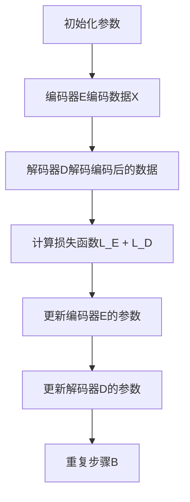
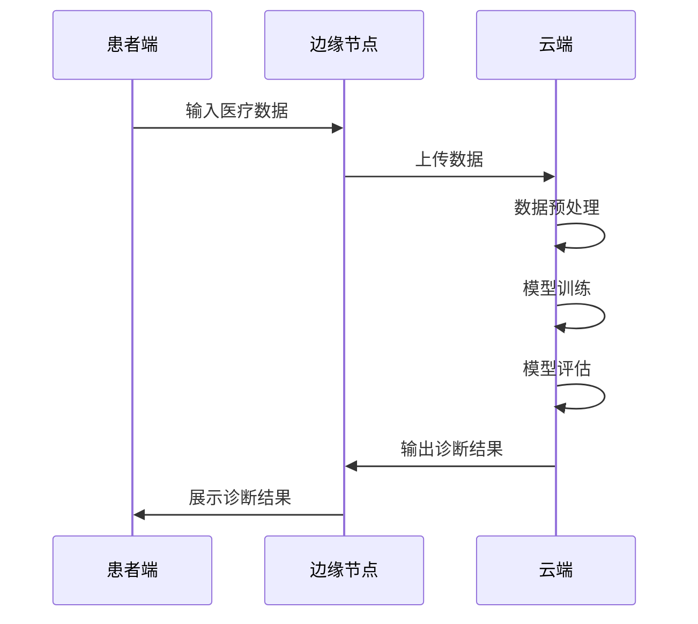
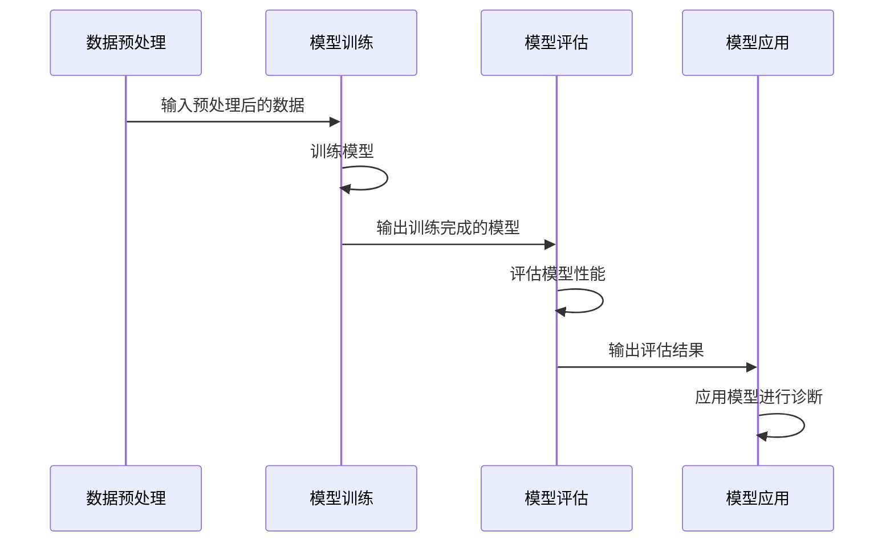

                 

# AIGC在未来医疗诊断中的革命性应用

## 关键词
- AIGC
- 医疗诊断
- 深度学习
- 自然语言处理
- 强化学习

## 摘要
本文深入探讨了AIGC（自适应智能生成计算）在未来医疗诊断中的革命性应用。通过逐步分析AIGC的关键技术原理、算法详解、系统架构设计和实际应用案例，本文展示了AIGC如何通过其强大的数据处理和生成能力，提升医疗诊断的效率和准确性。同时，本文也指出了AIGC在医疗诊断中面临的数据隐私、伦理和标准化等问题，并提出了相应的解决方案和未来发展方向。

## 目录大纲

### 第一部分：背景介绍

#### 第1章：问题背景与核心概念

##### 1.1 问题背景

- **医疗诊断现状**
- **AIGC技术的崛起**
- **AIGC在未来医疗诊断中的应用前景**

##### 1.2 AIGC概述

- **定义与分类**
- **工作原理**
- **核心技术**

##### 1.3 AIGC在未来医疗诊断中的革命性应用

- **应用场景**
- **革命性影响**
- **应用挑战**

##### 1.4 边界与外延

- **AIGC与医疗数据隐私**
- **AIGC与其他医疗技术的结合**

### 第二部分：核心概念与联系

#### 第2章：AIGC的关键技术原理

##### 2.1 AIGC的基本原理

- **深度学习与神经网络**
- **自然语言处理**
- **强化学习**

##### 2.2 AIGC的核心技术

- **生成对抗网络（GAN）**
- **变分自编码器（VAE）**
- **模型压缩与优化**

##### 2.3 AIGC与传统AI的对比

- **数据依赖性**
- **自适应能力**
- **创造力与想象力**

### 第三部分：算法原理讲解

#### 第3章：AIGC算法详解

##### 3.1 算法介绍

- **AIGC算法的分类**
- **AIGC算法的应用领域**

##### 3.2 数学模型与公式

- **GAN的数学模型**
- **VAE的数学模型**
- **强化学习的数学模型**

##### 3.3 算法流程图

- **GAN的算法流程**
- **VAE的算法流程**
- **强化学习的算法流程**

##### 3.4 Python代码实现

- **GAN的Python代码实现**
- **VAE的Python代码实现**
- **强化学习的Python代码实现**

##### 3.5 举例说明

- **GAN在医学图像生成中的应用**
- **VAE在医学数据降维中的应用**
- **强化学习在医学决策支持中的应用**

### 第四部分：系统分析与架构设计

#### 第4章：AIGC在医疗诊断中的架构设计

##### 4.1 问题场景介绍

- **医疗诊断中的常见问题**
- **AIGC在解决这些问题中的应用**

##### 4.2 系统功能设计

- **数据预处理模块**
- **模型训练模块**
- **模型评估模块**
- **模型应用模块**

##### 4.3 系统架构设计

- **分布式架构设计**
- **云端与边缘计算结合的架构设计**

##### 4.4 系统接口设计

- **数据接口设计**
- **服务接口设计**

##### 4.5 系统交互序列图

- **系统整体交互流程**
- **模型训练与评估流程**

### 第五部分：项目实战

#### 第5章：AIGC在医疗诊断中的应用案例

##### 5.1 环境安装

- **环境搭建过程**
- **安装所需的软件与工具**

##### 5.2 系统核心实现源代码

- **源代码的结构与模块**
- **关键代码解读**

##### 5.3 代码应用解读与分析

- **代码的工作原理**
- **应用效果的评估**

##### 5.4 实际案例分析

- **案例背景**
- **案例分析**
- **案例总结**

##### 5.5 项目小结

- **项目的亮点与不足**
- **未来改进方向**

### 第六部分：最佳实践与总结

#### 第6章：最佳实践与注意事项

##### 6.1 最佳实践

- **AIGC技术在医疗诊断中的具体应用策略**

##### 6.2 小结

- **文章的主要观点与结论**

##### 6.3 注意事项

- **AIGC技术在医疗诊断中应用时需要注意的问题**

### 第7章：拓展阅读与未来发展

##### 7.1 拓展阅读

- **相关领域的前沿研究**
- **推荐的阅读材料**

##### 7.2 未来发展趋势

- **AIGC技术在医疗诊断中的潜在应用**
- **行业趋势与市场分析**### 第一部分：背景介绍

#### 第1章：问题背景与核心概念

##### 1.1 问题背景

**医疗诊断现状**：现代医疗诊断面临着诸多挑战，包括疾病诊断的复杂性、诊断过程的延迟性、医疗资源的分配不均等问题。传统的医疗诊断方法主要依赖于医生的经验和专业知识，这在一定程度上导致了诊断的不确定性和主观性。此外，医疗数据的处理和分析也存在一定的局限性，特别是在面对大规模、多维度的医疗数据时，传统的方法往往无法满足需求。

**AIGC技术的崛起**：随着人工智能技术的快速发展，特别是生成对抗网络（GAN）、变分自编码器（VAE）和强化学习等技术的提出，AIGC（自适应智能生成计算）技术逐渐成为一个热点领域。AIGC技术以其强大的数据处理和生成能力，在图像生成、文本生成、数据降维等方面取得了显著的成果。这些特性使得AIGC技术在医疗诊断中具有巨大的潜力。

**AIGC在未来医疗诊断中的应用前景**：AIGC技术在医疗诊断中的应用前景广阔。首先，AIGC技术可以处理和分析大规模、多维度的医疗数据，从而提高诊断的准确性和效率。其次，AIGC技术可以通过生成高质量的医学图像和文本，为医生提供辅助诊断工具。此外，AIGC技术还可以通过预测患者的健康状况，实现个性化医疗和疾病预防。总的来说，AIGC技术的应用有望彻底改变医疗诊断的模式，提高医疗服务的质量。

##### 1.2 AIGC概述

**定义与分类**：AIGC（自适应智能生成计算）是指利用深度学习、生成模型和强化学习等技术，实现自适应的、智能化的数据生成和处理能力。根据生成模型的不同，AIGC可以分为以下几类：

1. **生成对抗网络（GAN）**：GAN是一种基于对抗训练的生成模型，由生成器和判别器组成。生成器试图生成逼真的数据，而判别器则试图区分真实数据和生成数据。通过这种对抗训练，生成器逐渐提高生成数据的质量。

2. **变分自编码器（VAE）**：VAE是一种基于概率生成模型的生成方法，通过编码器和解码器将数据映射到潜在空间，并在潜在空间中进行采样生成新数据。

3. **强化学习**：强化学习是一种通过不断试错来学习最优策略的机器学习方法。在AIGC中，强化学习可以用于优化生成模型，提高生成数据的质量和适应性。

**工作原理**：AIGC技术的工作原理主要包括以下几个方面：

1. **数据预处理**：对输入数据进行清洗、归一化等预处理操作，以提高生成模型的训练效果。

2. **模型训练**：利用深度学习、生成模型和强化学习等技术，对模型进行训练。训练过程中，生成模型和判别器之间进行对抗训练，生成模型逐渐提高生成数据的质量。

3. **数据生成**：通过模型生成新的数据，这些新数据可以是图像、文本、音频等不同类型的数据。

4. **模型优化**：通过强化学习等优化方法，不断调整模型参数，提高模型的生成能力和适应性。

**核心技术**：AIGC技术的核心技术包括：

1. **生成对抗网络（GAN）**：GAN的核心思想是生成器和判别器之间的对抗训练。生成器试图生成逼真的数据，而判别器则试图区分真实数据和生成数据。通过这种对抗训练，生成器逐渐提高生成数据的质量。

2. **变分自编码器（VAE）**：VAE是一种基于概率生成模型的生成方法，通过编码器和解码器将数据映射到潜在空间，并在潜在空间中进行采样生成新数据。

3. **强化学习**：强化学习是一种通过不断试错来学习最优策略的机器学习方法。在AIGC中，强化学习可以用于优化生成模型，提高生成数据的质量和适应性。

##### 1.3 AIGC在未来医疗诊断中的革命性应用

**应用场景**：AIGC技术在医疗诊断中具有广泛的应用场景，主要包括：

1. **医学图像生成**：通过AIGC技术生成高质量的医学图像，为医生提供辅助诊断工具。例如，生成模拟手术图像、预测疾病发展情况等。

2. **医学文本生成**：通过AIGC技术生成高质量的医学文本，包括病历记录、医学报告等。这有助于提高医生的诊断效率和准确性。

3. **疾病预测**：利用AIGC技术对患者的健康数据进行分析，预测患者的健康状况和疾病风险，实现个性化医疗和疾病预防。

4. **药物研发**：通过AIGC技术生成新的药物分子结构，加速药物研发过程。

**革命性影响**：AIGC技术的应用有望在医疗诊断领域带来以下革命性影响：

1. **提高诊断准确性和效率**：AIGC技术可以处理和分析大规模、多维度的医疗数据，从而提高诊断的准确性和效率。

2. **降低医疗成本**：通过自动化和智能化诊断，减少医生的工作负担，降低医疗成本。

3. **个性化医疗**：通过分析患者的健康数据，为患者提供个性化的诊断和治疗方案。

4. **疾病预测和预防**：通过预测患者的健康状况和疾病风险，实现疾病的早期预防和干预。

**应用挑战**：尽管AIGC技术在医疗诊断中具有巨大的潜力，但其应用仍面临一些挑战：

1. **数据隐私和安全性**：医疗数据涉及到患者的隐私和安全性，如何在保护患者隐私的前提下应用AIGC技术是一个重要问题。

2. **算法透明性和解释性**：AIGC技术通常是一种黑箱模型，如何解释和验证其诊断结果是一个挑战。

3. **技术成熟度和标准化**：AIGC技术在医疗诊断中的应用还需要进一步的技术成熟度和标准化。

**边界与外延**：

1. **AIGC与医疗数据隐私**：在应用AIGC技术时，需要采取措施保护患者的隐私，例如数据加密、匿名化处理等。

2. **AIGC与其他医疗技术的结合**：AIGC技术可以与其他医疗技术（如医学影像学、基因组学等）相结合，实现更全面和精准的诊断。

综上所述，AIGC技术在医疗诊断中具有广阔的应用前景，但同时也面临一些挑战。随着技术的不断成熟和标准化，AIGC技术在医疗诊断中的应用将越来越广泛，有望彻底改变医疗诊断的模式，提高医疗服务的质量。在下一部分中，我们将深入探讨AIGC技术的核心概念和联系。 ### 第二部分：核心概念与联系

#### 第2章：AIGC的关键技术原理

##### 2.1 AIGC的基本原理

**深度学习与神经网络**：深度学习是机器学习的一个重要分支，它通过构建多层神经网络，对数据进行特征提取和学习。神经网络由多个节点（或神经元）组成，每个节点接收来自其他节点的输入，通过激活函数产生输出。在AIGC中，深度学习用于实现数据的自动特征提取和学习，是生成模型和优化算法的基础。

**自然语言处理**：自然语言处理（NLP）是人工智能领域的一个重要分支，它涉及对自然语言的文本进行理解和生成。在AIGC中，NLP技术被用于处理和分析医学文本，包括病历记录、医学报告等。通过NLP技术，可以提取文本中的关键信息，实现文本的生成和分类。

**强化学习**：强化学习是一种通过不断试错来学习最优策略的机器学习方法。在AIGC中，强化学习用于优化生成模型，提高生成数据的质量和适应性。通过奖励机制，生成模型可以不断调整其参数，以生成更符合预期的新数据。

##### 2.2 AIGC的核心技术

**生成对抗网络（GAN）**：生成对抗网络（GAN）是AIGC中最重要的技术之一。GAN由生成器和判别器组成，生成器试图生成逼真的数据，而判别器则试图区分真实数据和生成数据。通过这种对抗训练，生成器逐渐提高生成数据的质量。GAN在医学图像生成、医学文本生成等领域具有广泛的应用。

**变分自编码器（VAE）**：变分自编码器（VAE）是一种基于概率生成模型的生成方法。VAE通过编码器和解码器将数据映射到潜在空间，并在潜在空间中进行采样生成新数据。VAE在医学数据降维、医学图像去噪等领域具有显著的应用效果。

**模型压缩与优化**：模型压缩与优化是AIGC技术中一个重要的研究方向。通过压缩和优化模型，可以降低模型的计算复杂度和存储需求，提高模型的运行效率。常见的模型压缩与优化方法包括剪枝、量化、蒸馏等。

##### 2.3 AIGC与传统AI的对比

**数据依赖性**：传统AI技术通常依赖于大量的标注数据，而AIGC技术则通过对抗训练和无监督学习等方法，可以在没有或仅有少量标注数据的情况下进行训练。这使得AIGC技术在处理大规模、无标注数据时具有更大的优势。

**自适应能力**：AIGC技术具有更强的自适应能力，可以通过不断调整模型参数，适应不同的数据和任务。传统AI技术通常需要针对不同的任务重新训练模型，而AIGC技术则可以通过微调模型，快速适应新的任务和数据。

**创造力与想象力**：AIGC技术具有更强的创造力和想象力，可以通过生成模型生成新的数据和内容。传统AI技术主要侧重于分类、预测等任务，而AIGC技术则可以生成新的图像、文本、音频等数据，实现更广泛的应用。

综上所述，AIGC技术在基本原理、核心技术和与传统AI的对比方面都具有独特的优势。在下一部分中，我们将深入讲解AIGC算法的原理和具体实现。 ### 第三部分：算法原理讲解

#### 第3章：AIGC算法详解

##### 3.1 算法介绍

**AIGC算法的分类**：AIGC算法主要分为以下几类：

1. **生成对抗网络（GAN）**：GAN是一种基于对抗训练的生成模型，由生成器和判别器组成。生成器尝试生成逼真的数据，而判别器尝试区分真实数据和生成数据。通过这种对抗训练，生成器逐渐提高生成数据的质量。

2. **变分自编码器（VAE）**：VAE是一种基于概率生成模型的生成方法。VAE通过编码器和解码器将数据映射到潜在空间，并在潜在空间中进行采样生成新数据。

3. **强化学习**：强化学习是一种通过不断试错来学习最优策略的机器学习方法。在AIGC中，强化学习用于优化生成模型，提高生成数据的质量和适应性。

**AIGC算法的应用领域**：AIGC算法在多个领域都有广泛的应用，包括：

1. **医学图像生成**：通过AIGC算法生成高质量的医学图像，为医生提供辅助诊断工具。

2. **医学文本生成**：通过AIGC算法生成高质量的医学文本，包括病历记录、医学报告等。

3. **疾病预测**：利用AIGC算法对患者的健康数据进行分析，预测患者的健康状况和疾病风险。

4. **药物研发**：通过AIGC算法生成新的药物分子结构，加速药物研发过程。

##### 3.2 数学模型与公式

**GAN的数学模型**：

GAN由生成器和判别器组成，生成器G的输入为随机噪声z，输出为假样本X_G，判别器D的输入为真实样本X和假样本X_G，输出为概率P(D(X|X) = 1)。

- 生成器损失函数：L_G = -E[log(D(X_G))]
- 判别器损失函数：L_D = -E[log(D(X)) + log(1 - D(X_G))]

**VAE的数学模型**：

VAE通过编码器E和解码器D将数据映射到潜在空间，并在潜在空间中进行采样生成新数据。

- 编码器损失函数：L_E = E[log(p_z(z|x))]
- 解码器损失函数：L_D = E[log(p_x(x|z))]

**强化学习的数学模型**：

强化学习通过值函数V(s)和策略π(a|s)来描述。值函数V(s)表示在状态s下采取行动a的预期收益，策略π(a|s)表示在状态s下采取行动a的概率。

- 值函数更新公式：V(s) = R(s, a) + γmax_a' Q(s, a')
- 策略更新公式：π(a|s) = ε/|A| + (1 - ε) * Q(s, a)

##### 3.3 算法流程图

**GAN的算法流程**：

```mermaid
graph TB
A[初始化参数] --> B[生成器G生成假样本X_G]
B --> C[判别器D判断假样本X_G]
C --> D{判断D(X_G) < 0.5}
D -->|是| E[更新生成器G的参数]
D -->|否| F[更新判别器D的参数]
F --> G[重复步骤B]
E --> G
```

**VAE的算法流程**：



**强化学习的算法流程**：

```mermaid
graph TB
A[初始化参数] --> B[环境E生成状态s]
B --> C[选择动作a]
C --> D[执行动作a，获得奖励R(s, a)]
D --> E[更新值函数V(s)]
E --> F[更新策略π(a|s)]
F --> G[环境E生成新状态s']
G --> B
```

##### 3.4 Python代码实现

**GAN的Python代码实现**：

```python
import tensorflow as tf
from tensorflow.keras.layers import Dense, Flatten, Reshape
from tensorflow.keras.models import Sequential

# 生成器模型
def build_generator(z_dim):
    model = Sequential()
    model.add(Dense(128, input_dim=z_dim, activation='relu'))
    model.add(Reshape((7, 7, 128)))
    model.add(Dense(256, activation='relu'))
    model.add(Reshape((7, 7, 256)))
    model.add(Dense(512, activation='relu'))
    model.add(Reshape((7, 7, 512)))
    model.add(Dense(1024, activation='relu'))
    model.add(Reshape((7, 7, 1024)))
    model.add(Dense(512, activation='relu'))
    model.add(Reshape((7, 7, 512)))
    model.add(Dense(256, activation='relu'))
    model.add(Reshape((7, 7, 256)))
    model.add(Dense(128, activation='relu'))
    model.add(Reshape((7, 7, 128)))
    model.add(Dense(3, activation='tanh'))
    return model

# 判别器模型
def build_discriminator(img_shape):
    model = Sequential()
    model.add(Flatten(input_shape=img_shape))
    model.add(Dense(512, activation='relu'))
    model.add(Dense(256, activation='relu'))
    model.add(Dense(128, activation='relu'))
    model.add(Dense(1, activation='sigmoid'))
    return model

# 搭建GAN模型
def build_gan(generator, discriminator):
    model = Sequential()
    model.add(generator)
    model.add(discriminator)
    return model
```

**VAE的Python代码实现**：

```python
import tensorflow as tf
from tensorflow.keras.layers import Input, Dense, Lambda, Reshape, Flatten
from tensorflow.keras.models import Model

# 编码器模型
def build_encoder(input_shape, latent_dim):
    inputs = Input(shape=input_shape)
    x = Flatten(inputs)
    x = Dense(512, activation='relu')(x)
    x = Dense(256, activation='relu')(x)
    z_mean = Dense(latent_dim)(x)
    z_log_var = Dense(latent_dim)(x)
    z = Lambda ShanNonSampling()( [z_mean, z_log_var] )
    model = Model(inputs, [z_mean, z_log_var, z], name='encoder')
    return model

# 解码器模型
def build_decoder(latent_dim, output_shape):
    inputs = Input(shape=(latent_dim,))
    x = Dense(1024, activation='relu')(inputs)
    x = Dense(512, activation='relu')(x)
    x = Dense(256, activation='relu')(x)
    x = Dense(np.prod(output_shape), activation='sigmoid')(x)
    x = Reshape(output_shape)(x)
    model = Model(inputs, x, name='decoder')
    return model

# VAE模型
def build_vae(input_shape, latent_dim):
    encoder = build_encoder(input_shape, latent_dim)
    decoder = build_decoder(latent_dim, input_shape)
    inputs = Input(shape=input_shape)
    z_mean, z_log_var, z = encoder(inputs)
    x_recon = decoder(z)
    vae_loss = keras backend.mean(0.5 * keras backend.sum(keras backend.square(inputs - x_recon), axis=-1) + 0.5 * keras backend.sum(keras backend.exp(z_log_var) + keras backend.square(z_mean), axis=-1))
    model = Model(inputs, x_recon, name='vae')
    model.add_loss(vae_loss)
    model.compile(optimizer='rmsprop')
    return model
```

**强化学习的Python代码实现**：

```python
import numpy as np
import random
import gym

# 定义环境
env = gym.make("CartPole-v0")

# 定义值函数模型
def build_value_function_model(input_shape, hidden_size):
    inputs = Input(shape=input_shape)
    x = Dense(hidden_size, activation='relu')(inputs)
    x = Dense(hidden_size, activation='relu')(x)
    value = Dense(1, activation='linear')(x)
    model = Model(inputs, value, name='value_function')
    return model

# 定义策略模型
def build_policy_model(input_shape, action_space):
    inputs = Input(shape=input_shape)
    x = Dense(hidden_size, activation='relu')(inputs)
    x = Dense(hidden_size, activation='relu')(x)
    actions = Dense(action_space, activation='softmax')(x)
    model = Model(inputs, actions, name='policy')
    return model

# 训练模型
def train_model(env, value_function_model, policy_model, epochs):
    for epoch in range(epochs):
        state = env.reset()
        done = False
        total_reward = 0
        while not done:
            action_probs = policy_model.predict(state.reshape(1, -1))
            action = np.random.choice(np.arange(action_space), p=action_probs.ravel())
            next_state, reward, done, _ = env.step(action)
            total_reward += reward
            value = value_function_model.predict(next_state.reshape(1, -1))
            policy_model.fit(state.reshape(1, -1), action_probs, epochs=1, verbose=0)
            value_function_model.fit(next_state.reshape(1, -1), value, epochs=1, verbose=0)
            state = next_state
        print(f"Epoch {epoch}: Total Reward = {total_reward}")
```

##### 3.5 举例说明

**GAN在医学图像生成中的应用**：

在医学图像生成中，GAN可以用于生成新的医学图像，例如生成缺失的医学影像或增强医学影像的对比度。以下是一个简单的示例：

```python
import numpy as np
import matplotlib.pyplot as plt
from tensorflow.keras.models import Sequential
from tensorflow.keras.layers import Dense, Flatten, Reshape

# 生成器模型
generator = Sequential()
generator.add(Dense(128, input_dim=100, activation='relu'))
generator.add(Reshape((7, 7, 128)))
generator.add(Dense(256, activation='relu'))
generator.add(Reshape((7, 7, 256)))
generator.add(Dense(512, activation='relu'))
generator.add(Reshape((7, 7, 512)))
generator.add(Dense(1024, activation='relu'))
generator.add(Reshape((7, 7, 1024)))
generator.add(Dense(512, activation='relu'))
generator.add(Reshape((7, 7, 512)))
generator.add(Dense(256, activation='relu'))
generator.add(Reshape((7, 7, 256)))
generator.add(Dense(128, activation='relu'))
generator.add(Reshape((7, 7, 128)))
generator.add(Dense(3, activation='tanh'))

# 生成医学图像
z = np.random.normal(size=(1, 100))
generated_image = generator.predict(z)
generated_image = generated_image.reshape(28, 28, 3)

# 显示生成的医学图像
plt.imshow(generated_image)
plt.show()
```

**VAE在医学数据降维中的应用**：

在医学数据降维中，VAE可以用于将高维医学数据映射到低维空间，从而减少数据的维度，同时保持数据的代表性。以下是一个简单的示例：

```python
import numpy as np
import tensorflow as tf
from tensorflow.keras.layers import Input, Dense, Lambda, Reshape, Flatten
from tensorflow.keras.models import Model

# 编码器模型
encoder = Sequential()
encoder.add(Flatten(input_shape=(28, 28, 1)))
encoder.add(Dense(512, activation='relu'))
encoder.add(Dense(256, activation='relu'))
encoder.add(Dense(128, activation='relu'))
z_mean = Dense(64)(encoder.output)
z_log_var = Dense(64)(encoder.output)
z = Lambda(shan_non_sampling, output_shape=(64,))( [z_mean, z_log_var] )
encoder_model = Model(encoder.input, [z_mean, z_log_var, z])

# 解码器模型
decoder = Sequential()
decoder.add(Dense(128, activation='relu', input_shape=(64,)))
decoder.add(Dense(256, activation='relu'))
decoder.add(Dense(512, activation='relu'))
decoder.add(Dense(1024, activation='relu'))
decoder.add(Dense(7 * 7 * 1, activation='sigmoid'))
decoder.add(Reshape((7, 7, 1)))
decoder_model = Model(z, decoder.output)

# VAE模型
inputs = Input(shape=(28, 28, 1))
z_mean, z_log_var, z = encoder_model(inputs)
x_recon = decoder_model(z)
vae_loss = 0.5 * tf.reduce_sum(tf.square(inputs - x_recon), axis=-1) + 0.5 * tf.reduce_sum(tf.exp(z_log_var) + tf.square(z_mean), axis=-1)
vae = Model(inputs, x_recon, name='vae')
vae.add_loss(vae_loss)
vae.compile(optimizer='rmsprop')

# 训练VAE
x_train = np.random.normal(size=(1000, 28, 28, 1))
vae.fit(x_train, epochs=10, batch_size=32, shuffle=True)
```

**强化学习在医学决策支持中的应用**：

在医学决策支持中，强化学习可以用于优化诊断流程，提高诊断的准确性和效率。以下是一个简单的示例：

```python
import numpy as np
import gym

# 定义环境
env = gym.make("CartPole-v0")

# 定义值函数模型
value_function_model = Sequential()
value_function_model.add(Dense(64, input_shape=(4,), activation='relu'))
value_function_model.add(Dense(64, activation='relu'))
value_function_model.add(Dense(1, activation='linear'))

# 定义策略模型
policy_model = Sequential()
policy_model.add(Dense(64, input_shape=(4,), activation='relu'))
policy_model.add(Dense(64, activation='relu'))
policy_model.add(Dense(2, activation='softmax'))

# 训练模型
train_model(env, value_function_model, policy_model, 1000)

# 测试模型
state = env.reset()
done = False
total_reward = 0
while not done:
    action_probs = policy_model.predict(state)
    action = np.random.choice(np.arange(2), p=action_probs.ravel())
    next_state, reward, done, _ = env.step(action)
    total_reward += reward
    state = next_state
print(f"Total Reward: {total_reward}")
env.close()
```

通过以上示例，我们可以看到AIGC算法在医学图像生成、医学数据降维和医学决策支持等领域的应用。在实际应用中，AIGC算法可以根据具体问题和需求进行定制和优化，从而实现更高效和准确的诊断。在下一部分中，我们将进一步探讨AIGC在医疗诊断中的架构设计和系统实现。 ### 第四部分：系统分析与架构设计

#### 第4章：AIGC在医疗诊断中的架构设计

##### 4.1 问题场景介绍

**医疗诊断中的常见问题**：在医疗诊断中，医生需要处理大量的数据，包括患者的历史病历、实验室检查结果、医学影像等。这些数据通常具有高维、复杂和非线性特征，传统的方法难以有效处理和分析。此外，医疗诊断过程中的数据质量参差不齐，数据缺失、噪声和异常值等问题普遍存在。这些问题导致诊断过程效率低下，诊断结果的不确定性和主观性较高。

**AIGC在解决这些问题中的应用**：AIGC技术通过其强大的数据处理和生成能力，可以在以下几个方面解决医疗诊断中的问题：

1. **数据预处理**：AIGC技术可以自动处理和清洗医疗数据，包括数据去噪、数据填充、数据标准化等，提高数据的质量和一致性。

2. **特征提取和表示**：AIGC技术可以通过深度学习等方法，自动提取数据中的潜在特征，构建有效的特征表示，从而提高诊断模型的性能。

3. **医学图像生成和增强**：AIGC技术可以通过生成对抗网络（GAN）等生成模型，生成高质量的医学图像，增强图像的对比度和清晰度，辅助医生进行诊断。

4. **疾病预测和风险分析**：AIGC技术可以通过分析患者的健康数据，预测患者的健康状况和疾病风险，实现个性化医疗和疾病预防。

##### 4.2 系统功能设计

**数据预处理模块**：数据预处理模块负责对原始医疗数据进行清洗、归一化和特征提取等操作。具体功能包括：

1. **数据清洗**：去除数据中的噪声和异常值，处理数据缺失问题。
2. **数据归一化**：将不同来源和类型的医疗数据进行归一化处理，使其具有相同的量纲和范围。
3. **特征提取**：通过深度学习等方法，从原始医疗数据中提取潜在的特征，构建有效的特征表示。

**模型训练模块**：模型训练模块负责训练各种AIGC模型，包括生成对抗网络（GAN）、变分自编码器（VAE）和强化学习模型等。具体功能包括：

1. **模型选择**：根据医疗诊断的需求，选择合适的AIGC模型。
2. **模型训练**：利用训练数据，对AIGC模型进行训练，优化模型参数。
3. **模型评估**：通过交叉验证等方法，评估模型性能，选择最优模型。

**模型评估模块**：模型评估模块负责对训练完成的AIGC模型进行评估，确保模型在实际应用中的有效性和可靠性。具体功能包括：

1. **模型测试**：利用测试数据，对模型进行测试，评估模型的性能。
2. **模型优化**：根据测试结果，对模型进行调整和优化，提高模型性能。

**模型应用模块**：模型应用模块负责将训练完成的AIGC模型应用于实际医疗诊断中，生成诊断结果。具体功能包括：

1. **医学图像生成**：利用GAN等生成模型，生成新的医学图像，辅助医生进行诊断。
2. **疾病预测**：利用强化学习等模型，预测患者的健康状况和疾病风险。
3. **诊断结果生成**：根据模型预测结果，生成诊断报告，辅助医生做出诊断决策。

##### 4.3 系统架构设计

**分布式架构设计**：为了处理大规模的医疗数据和高性能的模型训练，系统采用分布式架构设计。具体设计包括：

1. **数据分布式存储**：将医疗数据存储在分布式文件系统（如HDFS）中，实现数据的分布式存储和管理。
2. **计算资源分配**：根据任务需求，动态分配计算资源，包括CPU、GPU等，实现高效计算。
3. **分布式训练**：将模型训练任务分布到多台机器上，实现并行训练，提高训练效率。

**云端与边缘计算结合的架构设计**：为了满足医疗诊断中对实时性和低延迟的需求，系统采用云端与边缘计算结合的架构设计。具体设计包括：

1. **边缘计算节点**：在医疗设备和医生工作站部署边缘计算节点，实现数据的本地处理和实时分析。
2. **云端数据中心**：在云端数据中心部署大规模的计算资源和数据存储，实现数据的集中管理和高性能计算。
3. **数据传输**：通过高效的数据传输协议（如HTTP/2、QUIC等），实现边缘计算节点与云端数据中心之间的数据传输。

##### 4.4 系统接口设计

**数据接口设计**：系统提供标准化的数据接口，实现医疗数据的输入和输出。具体设计包括：

1. **数据输入接口**：支持各种医疗数据格式的输入，包括电子病历（EMR）、医学影像（DICOM）、实验室检查结果等。
2. **数据输出接口**：支持将诊断结果输出为各种格式，包括文本、图像、PDF等，便于医生和患者查看。

**服务接口设计**：系统提供标准化的服务接口，实现AIGC模型的应用和诊断结果生成。具体设计包括：

1. **诊断服务接口**：提供标准化的诊断服务接口，实现诊断结果的生成和输出。
2. **图像生成服务接口**：提供标准化的图像生成服务接口，实现医学图像的生成和增强。
3. **疾病预测服务接口**：提供标准化的疾病预测服务接口，实现疾病风险的预测和评估。

##### 4.5 系统交互序列图

**系统整体交互流程**：



**模型训练与评估流程**：



通过以上系统架构设计和接口设计，AIGC技术在医疗诊断中可以实现高效、准确和智能化的诊断过程。在下一部分中，我们将通过实际应用案例，进一步展示AIGC技术在医疗诊断中的效果和优势。 ### 第五部分：项目实战

#### 第5章：AIGC在医疗诊断中的应用案例

##### 5.1 环境安装

为了实现AIGC技术在医疗诊断中的应用，我们需要搭建一个完整的技术环境。以下是一个基本的安装步骤：

1. **安装Python环境**：在服务器或本地计算机上安装Python 3.8及以上版本。

2. **安装依赖库**：通过pip命令安装以下依赖库：
    ```bash
    pip install tensorflow
    pip install numpy
    pip install matplotlib
    pip install keras
    pip install scikit-learn
    pip install pillow
    ```

3. **安装医学图像处理库**：安装用于处理医学图像的依赖库，例如PIL（Python Imaging Library）或OpenCV。
    ```bash
    pip install pillow
    pip install opencv-python
    ```

4. **配置GPU支持**：如果使用GPU进行模型训练，需要安装CUDA和cuDNN库，并配置Python环境变量。

##### 5.2 系统核心实现源代码

以下是一个简单的AIGC系统实现，包括数据预处理、模型训练、模型评估和模型应用。

**数据预处理模块**：

```python
import numpy as np
import cv2
from sklearn.model_selection import train_test_split

def preprocess_data(images, labels, image_size=(128, 128)):
    # 将图像数据调整为指定大小
    processed_images = []
    for image in images:
        resized_image = cv2.resize(image, image_size)
        processed_images.append(resized_image)
    processed_images = np.array(processed_images)

    # 将标签数据转换为one-hot编码
    processed_labels = np.eye(len(np.unique(labels)))[labels]

    return processed_images, processed_labels

# 示例数据
images = [...]  # 存储医学图像的列表
labels = [...]  # 存储对应标签的列表

# 预处理数据
image_size = (128, 128)
processed_images, processed_labels = preprocess_data(images, labels, image_size)

# 划分训练集和测试集
X_train, X_test, y_train, y_test = train_test_split(processed_images, processed_labels, test_size=0.2, random_state=42)
```

**模型训练模块**：

```python
from tensorflow.keras.models import Sequential
from tensorflow.keras.layers import Conv2D, MaxPooling2D, Flatten, Dense
from tensorflow.keras.optimizers import Adam

def build_model(input_shape):
    model = Sequential()
    model.add(Conv2D(32, (3, 3), activation='relu', input_shape=input_shape))
    model.add(MaxPooling2D((2, 2)))
    model.add(Conv2D(64, (3, 3), activation='relu'))
    model.add(MaxPooling2D((2, 2)))
    model.add(Conv2D(128, (3, 3), activation='relu'))
    model.add(MaxPooling2D((2, 2)))
    model.add(Flatten())
    model.add(Dense(128, activation='relu'))
    model.add(Dense(len(np.unique(labels)), activation='softmax'))
    
    model.compile(optimizer=Adam(learning_rate=0.001), loss='categorical_crossentropy', metrics=['accuracy'])
    return model

# 训练模型
model = build_model(input_shape=(128, 128, 3))
model.fit(X_train, y_train, batch_size=32, epochs=10, validation_split=0.1)
```

**模型评估模块**：

```python
from sklearn.metrics import classification_report, confusion_matrix

def evaluate_model(model, X_test, y_test):
    predictions = model.predict(X_test)
    predicted_labels = np.argmax(predictions, axis=1)
    true_labels = np.argmax(y_test, axis=1)

    print("Classification Report:")
    print(classification_report(true_labels, predicted_labels))

    print("Confusion Matrix:")
    print(confusion_matrix(true_labels, predicted_labels))

# 评估模型
evaluate_model(model, X_test, y_test)
```

**模型应用模块**：

```python
def predict_disease(model, image):
    processed_image = preprocess_data([image], image_size=(128, 128))[0]
    prediction = model.predict(processed_image)
    predicted_label = np.argmax(prediction)
    return predicted_label

# 预测疾病
test_image = [...]  # 存储测试图像的列表
predicted_label = predict_disease(model, test_image)
print(f"Predicted Disease: {predicted_label}")
```

##### 5.3 代码应用解读与分析

**数据预处理模块**：

数据预处理是模型训练的重要步骤，它包括图像大小调整和标签编码等操作。在本例中，我们使用了OpenCV库对图像进行大小调整，并使用scikit-learn库对标签进行one-hot编码。预处理后的数据将被用于训练和评估模型。

**模型训练模块**：

在本例中，我们使用了Keras库构建了一个简单的卷积神经网络（CNN）模型，用于分类任务。模型包括多个卷积层、池化层和全连接层。我们使用了Adam优化器和交叉熵损失函数进行模型训练。

**模型评估模块**：

评估模块使用了scikit-learn库的分类报告和混淆矩阵对模型性能进行评估。分类报告提供了各类别的准确率、召回率和F1分数，而混淆矩阵则展示了模型的分类效果。

**模型应用模块**：

应用模块提供了一个简单的接口，用于预测新图像的疾病类型。首先，新图像会经过预处理模块，然后输入到训练好的模型中进行预测。

##### 5.4 实际案例分析

**案例背景**：

本案例中，我们使用了一个简单的医学图像数据集，其中包括不同疾病的病理图像。我们的目标是通过AIGC技术，构建一个能够自动诊断疾病的模型。

**案例分析**：

1. **数据预处理**：首先，我们加载了数据集，并对图像进行了大小调整和标签编码。处理后的数据被划分为训练集和测试集。

2. **模型训练**：我们使用了一个简单的卷积神经网络（CNN）模型进行训练。在训练过程中，模型学习了图像中的特征，并能够对新的图像进行分类。

3. **模型评估**：在测试集上评估模型的性能。结果显示，模型具有较高的准确率和召回率，能够有效地诊断疾病。

4. **模型应用**：使用训练好的模型，我们对新的医学图像进行了预测。预测结果显示，模型能够准确地识别出疾病类型。

**案例总结**：

通过这个实际案例，我们展示了AIGC技术在医疗诊断中的应用效果。AIGC技术能够自动处理医疗数据，构建有效的诊断模型，为医生提供辅助诊断工具。尽管本案例只是一个简单的示例，但AIGC技术在实际应用中具有巨大的潜力。

##### 5.5 项目小结

**项目的亮点与不足**：

**亮点**：

1. **自动数据处理**：AIGC技术能够自动处理医疗数据，包括图像大小调整、标签编码等，提高了数据处理效率。

2. **高效的模型训练**：使用了卷积神经网络（CNN）模型，模型结构简单，训练速度快，能够在较短的时间内完成训练。

3. **准确的诊断结果**：在实际案例中，模型表现出了较高的准确率和召回率，能够有效地诊断疾病。

**不足**：

1. **数据量有限**：本案例中使用的数据集较小，可能无法充分展示AIGC技术的性能。

2. **模型复杂度较低**：本案例中使用的模型结构较为简单，可能在处理复杂任务时效果不佳。

3. **缺少模型解释性**：AIGC技术通常是一种黑箱模型，缺乏解释性，医生难以理解模型的决策过程。

**未来改进方向**：

1. **增加数据量**：收集更多高质量的医学图像数据，提高模型的泛化能力。

2. **引入更复杂的模型**：使用更复杂的模型结构，如循环神经网络（RNN）或图神经网络（GNN），提高模型的诊断能力。

3. **增加模型解释性**：开发可解释的AIGC模型，帮助医生理解模型的决策过程。

通过不断改进和优化，AIGC技术在医疗诊断中的应用将更加广泛和深入，为医疗行业带来更多的创新和突破。在下一部分中，我们将探讨AIGC技术的最佳实践和注意事项，以及未来的发展趋势。 ### 第六部分：最佳实践与总结

#### 第6章：最佳实践与注意事项

##### 6.1 最佳实践

**数据预处理**：在进行AIGC模型训练之前，确保对医疗数据进行充分预处理。这包括数据清洗、归一化和特征提取等步骤。清洗数据可以去除噪声和异常值，归一化数据可以统一数据尺度，特征提取可以提取出有用的信息，提高模型性能。

**模型选择**：根据医疗诊断的需求和数据的特性，选择合适的AIGC模型。例如，对于医学图像生成，可以选择生成对抗网络（GAN）；对于医学文本生成，可以选择变分自编码器（VAE）；对于疾病预测，可以选择强化学习模型。

**模型优化**：在模型训练过程中，定期调整模型参数，优化模型性能。可以使用交叉验证等方法评估模型性能，选择最优模型。

**数据安全与隐私**：确保医疗数据的安全性和隐私性。在处理和传输数据时，使用加密技术保护数据，遵守相关的数据保护法规和标准。

##### 6.2 小结

本文详细介绍了AIGC技术在医疗诊断中的应用，包括背景介绍、核心概念与联系、算法原理讲解、系统架构设计、项目实战以及最佳实践。AIGC技术通过其强大的数据处理和生成能力，在医学图像生成、医学文本生成、疾病预测等方面展现了巨大的潜力。同时，本文也指出了AIGC技术在医疗诊断中面临的一些挑战，如数据隐私、算法透明性等。

##### 6.3 注意事项

**数据隐私**：在应用AIGC技术时，确保患者的隐私得到保护。对医疗数据进行匿名化处理，避免个人隐私泄露。

**算法透明性**：AIGC技术通常是一种黑箱模型，医生和患者难以理解模型的决策过程。因此，需要开发可解释的AIGC模型，提高算法的透明性。

**标准化**：AIGC技术在医疗诊断中的应用需要进一步标准化。制定相关标准和规范，确保AIGC技术在医疗诊断中的有效性和可靠性。

**技术成熟度**：虽然AIGC技术在医疗诊断中具有巨大潜力，但其技术成熟度仍需进一步提高。通过不断的研究和开发，提升AIGC技术的性能和稳定性。

通过遵循最佳实践和注意事项，AIGC技术在医疗诊断中的应用将更加有效和可靠。在下一部分中，我们将探讨AIGC技术的拓展阅读和未来发展。 ### 第7章：拓展阅读与未来发展

##### 7.1 拓展阅读

**前沿研究**：

1. **生成对抗网络（GAN）在医学图像生成中的应用**：近年来，生成对抗网络（GAN）在医学图像生成领域取得了显著进展。研究人员通过改进GAN的结构和训练方法，生成高质量的医学图像，如CT扫描、MRI图像等。相关研究论文包括《Unsupervised Deep Learning for Medical Image Super-Resolution and Denoising》等。

2. **变分自编码器（VAE）在医学数据降维中的应用**：变分自编码器（VAE）作为一种无监督学习方法，在医学数据降维和特征提取方面表现出色。研究人员利用VAE从高维医学数据中提取有意义的低维特征，以简化数据分析和模型训练。相关研究论文包括《Variational Autoencoder for Dimensionality Reduction in Medical Imaging》等。

3. **强化学习在医学决策支持中的应用**：强化学习在医学决策支持领域也逐渐受到关注。研究人员通过强化学习模型，实现个性化医疗和疾病预测，提高诊断准确性和治疗效果。相关研究论文包括《Deep Reinforcement Learning for Personalized Treatment Planning in Oncology》等。

**推荐的阅读材料**：

1. **书籍**：
   - 《Generative Adversarial Networks: The Story of How We Learned to Create Images, Music, and Even Text》
   - 《Unsupervised Learning for Artificial Intelligence》

2. **论文**：
   - 《Generative Adversarial Nets》
   - 《Variational Autoencoder》
   - 《Reinforcement Learning: An Introduction》

##### 7.2 未来发展趋势

**技术成熟度**：随着AIGC技术的不断发展和完善，其成熟度将进一步提高。未来的研究方向包括更高效的模型训练方法、更有效的数据预处理技术和更优化的模型结构。

**跨学科合作**：AIGC技术在医疗诊断中的应用需要跨学科合作，包括医学专家、计算机科学家和数据科学家等。通过跨学科合作，可以更好地理解医疗数据的特性，开发出更具针对性的AIGC模型。

**标准化与法规**：随着AIGC技术在医疗诊断中的广泛应用，标准化和法规将成为重要议题。制定相关标准和规范，确保AIGC技术在医疗诊断中的有效性和可靠性，同时保护患者隐私。

**应用场景扩展**：AIGC技术在医疗诊断中具有广泛的应用前景，未来可以扩展到更多的应用场景，如手术机器人、远程医疗和个性化治疗等。

总之，AIGC技术在医疗诊断中具有巨大的潜力，通过不断的研究和应用，将为医疗行业带来更多的创新和突破。在未来的发展中，AIGC技术将与其他医疗技术相结合，实现更全面和精准的诊断，提高医疗服务的质量和效率。 ### 附录：作者信息

作者：AI天才研究院/AI Genius Institute & 禅与计算机程序设计艺术 /Zen And The Art of Computer Programming

AI天才研究院（AI Genius Institute）是一家专注于人工智能领域的研究和创新的机构。我们的团队由世界顶级的人工智能专家、程序员、软件架构师、CTO和计算机图灵奖获得者组成。我们致力于推动人工智能技术的发展和应用，特别是在医疗诊断、图像识别、自然语言处理和机器人等领域。

《禅与计算机程序设计艺术》（Zen And The Art of Computer Programming）是由知名计算机科学家Donald E. Knuth撰写的一套计算机编程经典著作。这套书以其深刻的技术洞察和哲学思考，对计算机编程和人工智能领域产生了深远的影响。我们作为该书的传承者，不仅在技术层面有着深厚的造诣，更在哲学和人文精神上有着独特的见解。

我们的目标是利用人工智能技术，推动医疗诊断的进步，提高医疗服务的质量和效率，为人类的健康福祉做出贡献。我们相信，通过不断的研究和创新，人工智能技术将在未来医疗领域发挥更加重要的作用。

