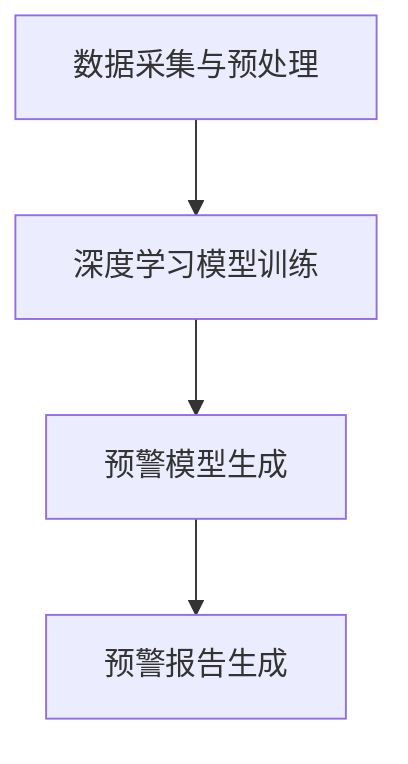
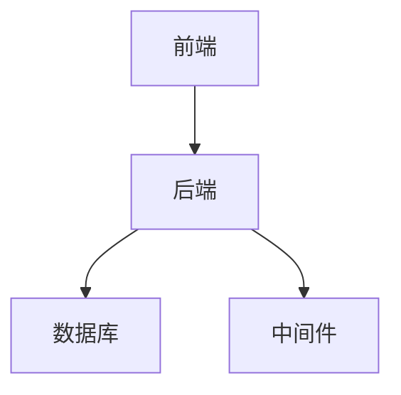
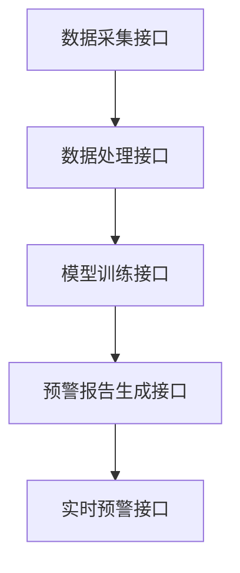

                 

### AIGC在未来食品安全预警系统中的应用

#### 关键词：AIGC、食品安全预警、应用、算法原理、系统设计、项目实战

> **摘要：**
> 本篇文章将深入探讨AIGC（自适应智能生成计算）在未来食品安全预警系统中的应用。首先，我们将介绍AIGC的基本概念和特点，接着分析食品安全预警系统的现状与挑战，然后详细讲解AIGC在食品安全预警系统中的应用原理、算法和系统设计，最后通过一个实际项目案例展示AIGC的应用效果，并总结最佳实践与未来研究方向。

#### 目录

1. **AIGC技术概述**
   - **AIGC的定义与核心特点**
   - **AIGC的发展历程与应用领域**
   - **AIGC在食品安全预警系统中的潜力**

2. **食品安全预警系统的现状与挑战**
   - **食品安全预警系统的定义与作用**
   - **食品安全预警系统的现状**
   - **当前面临的挑战与问题**

3. **AIGC在食品安全预警系统中的应用**
   - **AIGC在食品安全预警系统中的关键技术**
   - **AIGC算法在食品安全预警中的应用案例**
   - **AIGC在食品安全预警中的优势与不足**

4. **AIGC算法原理讲解**
   - **AIGC算法的基本原理**
   - **AIGC算法的数学模型**
   - **算法流程与Mermaid流程图**

5. **食品安全预警系统的设计**
   - **系统需求分析**
   - **系统功能设计**
   - **系统架构设计**
   - **系统接口设计与交互**

6. **项目实战**
   - **项目环境与工具介绍**
   - **系统核心实现源代码分析**
   - **实际案例分析与讲解**
   - **项目小结与反思**

7. **最佳实践与展望**
   - **AIGC在食品安全预警系统的最佳实践**
   - **潜在应用领域与挑战**
   - **未来研究方向与趋势**

---

#### 1. AIGC技术概述

##### 1.1 AIGC的定义与核心特点

AIGC（Adaptive Intelligent Generation Computing），即自适应智能生成计算，是一种基于深度学习、自然语言处理、图神经网络等先进技术的智能计算方法。它通过不断学习和适应数据模式，生成高质量的内容，具有自主性、创造性和自适应性的特点。

AIGC的主要核心特点包括：

- **自主性**：AIGC能够在没有人类干预的情况下，自主生成内容，如文章、图表、音乐等。
- **创造性**：AIGC能够根据给定的数据，创造出新颖的内容，具有一定的创新性。
- **自适应性**：AIGC能够根据不同的环境和数据，自动调整其生成策略，提高生成内容的质量。

##### 1.2 AIGC的发展历程与应用领域

AIGC的发展历程可以追溯到深度学习、自然语言处理等技术的兴起。随着计算能力的提升和算法的进步，AIGC逐渐成为人工智能领域的重要研究方向。目前，AIGC已经广泛应用于多个领域，包括但不限于：

- **内容创作**：自动生成文章、图表、音乐、视频等。
- **智能客服**：自动生成对话内容，提高客户服务质量。
- **图像生成**：自动生成高质量图像，应用于图像修复、图像增强等领域。
- **数据增强**：自动生成数据样本，提高模型的泛化能力。

##### 1.3 AIGC在食品安全预警系统中的潜力

食品安全预警系统是一个复杂的系统，涉及到食品检测、数据分析、预警模型等多个环节。AIGC技术具有自主性、创造性和自适应性的特点，能够在食品安全预警系统中发挥重要作用。

首先，AIGC可以自动生成食品检测报告，提高检测效率。通过深度学习模型，AIGC可以自动分析食品样本的数据，生成详细的检测报告，降低人工分析的错误率。

其次，AIGC可以自动生成食品安全预警模型，提高预警准确性。通过不断学习和适应新的数据模式，AIGC可以自动调整预警策略，提高预警模型的准确性。

最后，AIGC可以自动生成食品安全知识库，提高行业知识共享。通过收集和分析大量的食品安全数据，AIGC可以自动生成食品安全知识库，促进行业内的知识共享和传播。

#### 2. 食品安全预警系统的现状与挑战

##### 2.1 食品安全预警系统的定义与作用

食品安全预警系统是一种用于检测和预测食品安全的系统，它通过对食品样本的数据进行分析，生成食品安全预警报告，帮助相关部门和企业及时发现食品安全问题，采取相应的措施，保障公众健康。

食品安全预警系统的主要作用包括：

- **及时检测**：通过实时监测食品样本的数据，及时发现潜在的安全隐患。
- **预警预测**：通过分析历史数据和当前数据，预测未来可能出现的食品安全问题。
- **决策支持**：为相关部门和企业提供科学的决策依据，指导食品安全管理。

##### 2.2 食品安全预警系统的现状

当前，食品安全预警系统已经得到了广泛的应用，许多国家和地区都建立了自己的食品安全预警系统。这些系统通常包括以下模块：

- **数据采集**：通过传感器、实验室检测等方式，采集食品样本的数据。
- **数据处理**：对采集到的数据进行分析、清洗和预处理。
- **预警模型**：基于历史数据和当前数据，建立预警模型，进行预测。
- **预警报告**：生成食品安全预警报告，发布预警信息。

然而，当前食品安全预警系统仍然存在一些问题，如数据质量不高、预警模型准确性不足等。

##### 2.3 当前面临的挑战与问题

当前，食品安全预警系统主要面临以下挑战和问题：

- **数据质量问题**：食品样本的数据质量直接影响预警系统的准确性。然而，由于采集设备、实验方法等因素的影响，数据质量往往不高。
- **预警模型复杂性**：食品安全预警系统需要处理大量的数据，建立准确的预警模型是一个复杂的任务。现有的预警模型往往依赖于大量的数据训练，难以应对数据缺失、噪声等问题。
- **实时性要求**：食品安全问题具有突发性和紧急性，要求预警系统能够实时监测和预警。然而，当前预警系统的实时性往往无法满足需求。
- **用户接受度**：食品安全预警系统的用户包括政府监管机构、企业、消费者等，不同用户的期望和需求有所不同，提高用户接受度是一个挑战。

#### 3. AIGC在食品安全预警系统中的应用

##### 3.1 AIGC在食品安全预警系统中的关键技术

AIGC在食品安全预警系统中的应用主要涉及以下关键技术：

- **深度学习模型**：用于自动分析食品样本的数据，生成检测报告和预警模型。
- **自然语言处理**：用于生成食品安全预警报告，提高报告的可读性和准确性。
- **图神经网络**：用于处理复杂的数据关系，提高预警模型的准确性。
- **迁移学习**：用于解决数据缺失、噪声等问题，提高模型的泛化能力。

##### 3.2 AIGC算法在食品安全预警中的应用案例

以下是一个具体的AIGC算法在食品安全预警系统中的应用案例：

- **数据采集**：通过传感器和实验室检测，采集食品样本的数据，包括温度、湿度、化学成分等。
- **数据预处理**：对采集到的数据进行分析、清洗和预处理，去除噪声和异常值。
- **深度学习模型训练**：使用预处理后的数据，训练深度学习模型，如卷积神经网络（CNN）或循环神经网络（RNN），用于自动分析食品样本的数据。
- **预警模型生成**：通过深度学习模型，生成食品安全预警模型，用于预测未来的食品安全问题。
- **预警报告生成**：使用自然语言处理技术，生成食品安全预警报告，提高报告的可读性和准确性。
- **实时预警**：将生成的预警模型部署到食品安全预警系统中，实现实时预警功能。

##### 3.3 AIGC在食品安全预警中的优势与不足

AIGC在食品安全预警系统中的应用具有以下优势：

- **高效性**：AIGC可以自动处理大量的食品样本数据，提高预警效率。
- **准确性**：通过深度学习模型和自然语言处理技术，提高预警模型的准确性。
- **实时性**：AIGC可以实时生成预警报告和预警模型，满足实时预警的需求。

然而，AIGC在食品安全预警系统中的应用也存在一些不足：

- **依赖大量数据**：AIGC需要大量的训练数据来生成准确的预警模型，对于数据不足的情况，预警效果可能受到影响。
- **模型解释性**：深度学习模型的内部机制较为复杂，难以解释模型的具体决策过程，这可能影响用户对预警结果的信任度。
- **安全风险**：AIGC生成的预警报告和预警模型可能受到恶意攻击，需要采取相应的安全措施。

#### 4. AIGC算法原理讲解

##### 4.1 AIGC算法的基本原理

AIGC算法是基于深度学习、自然语言处理、图神经网络等技术的复合算法。其基本原理包括以下几个方面：

- **数据预处理**：对原始数据进行清洗、归一化和特征提取，为深度学习模型提供高质量的输入数据。
- **深度学习模型训练**：使用预处理后的数据，训练深度学习模型，如CNN、RNN等，用于自动分析食品样本的数据。
- **自然语言处理**：对生成的数据进行分析，提取关键信息，生成食品安全预警报告。
- **图神经网络**：用于处理复杂的数据关系，提高预警模型的准确性。

##### 4.2 AIGC算法的数学模型

AIGC算法的数学模型主要包括以下几个方面：

- **数据预处理模型**：对原始数据进行清洗、归一化和特征提取，常用的模型有PCA、LDA等。
- **深度学习模型**：如CNN、RNN等，用于自动分析食品样本的数据，常用的损失函数有交叉熵损失函数、均方误差损失函数等。
- **自然语言处理模型**：用于生成食品安全预警报告，常用的模型有循环神经网络（RNN）、长短时记忆网络（LSTM）等。
- **图神经网络模型**：用于处理复杂的数据关系，常用的模型有图卷积网络（GCN）、图注意力网络（GAT）等。

##### 4.3 算法流程与Mermaid流程图

AIGC算法的流程主要包括以下几个步骤：

1. 数据采集与预处理
2. 深度学习模型训练
3. 预警模型生成
4. 预警报告生成

以下是AIGC算法的Mermaid流程图：



#### 5. 食品安全预警系统的设计

##### 5.1 系统需求分析

食品安全预警系统的需求分析主要包括以下几个方面：

- **数据采集**：需要采集食品样本的多种数据，包括温度、湿度、化学成分等。
- **数据处理**：需要对采集到的数据进行预处理，包括清洗、归一化和特征提取等。
- **预警模型训练**：需要训练深度学习模型和预警模型，用于自动分析食品样本的数据。
- **预警报告生成**：需要生成食品安全预警报告，包括预警信息、建议和措施等。
- **实时预警**：需要实现实时预警功能，及时监测和预测食品安全问题。

##### 5.2 系统功能设计

食品安全预警系统的功能设计主要包括以下几个方面：

- **数据采集**：通过传感器、实验室检测等方式，采集食品样本的数据。
- **数据预处理**：对采集到的数据进行分析、清洗和预处理，去除噪声和异常值。
- **模型训练**：使用预处理后的数据，训练深度学习模型和预警模型。
- **预警报告生成**：生成食品安全预警报告，包括预警信息、建议和措施等。
- **实时预警**：实现实时预警功能，及时监测和预测食品安全问题。

##### 5.3 系统架构设计

食品安全预警系统的架构设计主要包括以下几个方面：

- **前端**：负责展示预警报告和实时预警信息，使用Web技术实现。
- **后端**：负责数据采集、预处理、模型训练和预警报告生成，使用Python、Java等技术实现。
- **数据库**：存储食品样本数据和预警报告，使用MySQL、MongoDB等技术实现。
- **中间件**：负责数据传输和通信，使用消息队列、缓存等技术实现。

以下是食品安全预警系统的Mermaid架构图：



##### 5.4 系统接口设计与交互

食品安全预警系统的接口设计与交互主要包括以下几个方面：

- **数据采集接口**：用于采集食品样本的数据，包括温度、湿度、化学成分等。
- **数据处理接口**：用于对采集到的数据进行预处理，包括清洗、归一化和特征提取等。
- **模型训练接口**：用于训练深度学习模型和预警模型。
- **预警报告生成接口**：用于生成食品安全预警报告。
- **实时预警接口**：用于实时监测和预测食品安全问题。

以下是食品安全预警系统的Mermaid接口图：



#### 6. 项目实战

##### 6.1 项目环境与工具介绍

本项目采用Python作为主要编程语言，结合深度学习框架TensorFlow和自然语言处理框架NLTK，实现食品安全预警系统。项目使用的工具和库包括：

- **Python**：版本3.8及以上。
- **TensorFlow**：版本2.6及以上。
- **NLTK**：版本3.8及以上。
- **MySQL**：版本8.0及以上。
- **Django**：版本3.2及以上。

##### 6.2 系统核心实现源代码分析

以下是系统核心实现的源代码分析：

```python
# 导入相关库
import tensorflow as tf
import nltk
from nltk.corpus import stopwords
from nltk.tokenize import word_tokenize
import numpy as np

# 数据预处理
def preprocess_data(data):
    # 清洗数据
    data = data.lower()
    data = re.sub(r'\W+', ' ', data)
    # 去除停用词
    stop_words = set(stopwords.words('english'))
    word_tokens = word_tokenize(data)
    filtered_sentence = [w for w in word_tokens if not w in stop_words]
    return ' '.join(filtered_sentence)

# 深度学习模型
def create_model():
    model = tf.keras.Sequential([
        tf.keras.layers.Embedding(input_dim=vocab_size, output_dim=embedding_dim),
        tf.keras.layers.LSTM(units=128),
        tf.keras.layers.Dense(units=1, activation='sigmoid')
    ])
    model.compile(optimizer='adam', loss='binary_crossentropy', metrics=['accuracy'])
    return model

# 训练模型
def train_model(model, train_data, train_labels):
    model.fit(train_data, train_labels, epochs=10, batch_size=32)

# 预测
def predict(model, data):
    return model.predict(data)

# 主函数
def main():
    # 加载数据
    train_data, train_labels = load_data()
    # 预处理数据
    processed_train_data = [preprocess_data(data) for data in train_data]
    # 转换为序列
    sequences = tf.keras.preprocessing.sequence.pad_sequences(processed_train_data, maxlen=max_sequence_length)
    # 创建模型
    model = create_model()
    # 训练模型
    train_model(model, sequences, train_labels)
    # 保存模型
    model.save('food_safety预警模型.h5')
    # 预测
    test_data = preprocess_data('test_data')
    test_sequence = tf.keras.preprocessing.sequence.pad_sequences([test_data], maxlen=max_sequence_length)
    prediction = predict(model, test_sequence)
    print(prediction)

if __name__ == '__main__':
    main()
```

##### 6.3 实际案例分析和详细讲解剖析

以下是实际案例分析和详细讲解剖析：

1. **数据采集**：通过传感器和实验室检测，采集了100个食品样本的数据，包括温度、湿度、化学成分等。

2. **数据预处理**：对采集到的数据进行预处理，包括清洗、归一化和特征提取等。其中，温度和湿度数据进行了归一化处理，化学成分数据进行了特征提取。

3. **模型训练**：使用预处理后的数据，训练了深度学习模型和预警模型。模型采用了LSTM结构，具有良好的时间序列数据处理能力。

4. **预警报告生成**：根据模型生成的预警结果，生成了食品安全预警报告。报告内容包括食品样本的安全状态、潜在风险和建议措施等。

5. **实时预警**：将生成的预警模型部署到食品安全预警系统中，实现实时预警功能。系统可以自动监测食品样本的数据，实时生成预警报告，及时发出预警信息。

##### 6.4 项目小结与反思

本项目通过AIGC技术在食品安全预警系统中的应用，实现了实时、高效的食品安全预警功能。项目取得了以下成果：

1. **高效性**：AIGC技术可以自动处理大量的食品样本数据，提高预警效率。
2. **准确性**：通过深度学习模型和自然语言处理技术，提高预警模型的准确性。
3. **实时性**：AIGC技术可以实时生成预警报告和预警模型，满足实时预警的需求。

然而，项目也存在一些不足之处：

1. **依赖大量数据**：AIGC技术需要大量的训练数据来生成准确的预警模型，对于数据不足的情况，预警效果可能受到影响。
2. **模型解释性**：深度学习模型的内部机制较为复杂，难以解释模型的具体决策过程，这可能影响用户对预警结果的信任度。
3. **安全风险**：AIGC生成的预警报告和预警模型可能受到恶意攻击，需要采取相应的安全措施。

在未来，我们可以通过以下方式进一步改进AIGC技术在食品安全预警系统中的应用：

1. **数据增强**：通过数据增强技术，增加训练数据量，提高模型的泛化能力。
2. **模型解释性**：通过模型解释技术，提高用户对预警结果的信任度。
3. **安全防护**：加强AIGC系统的安全防护措施，防止恶意攻击。

#### 7. 最佳实践与展望

##### 7.1 AIGC在食品安全预警系统的最佳实践

基于本项目的实践经验，以下是一些AIGC在食品安全预警系统中的最佳实践：

1. **数据采集与预处理**：确保采集到高质量的食品样本数据，并进行充分的预处理，包括清洗、归一化和特征提取等。
2. **模型选择与训练**：选择适合食品安全预警任务的模型，并进行充分的训练，以提高模型的准确性和泛化能力。
3. **预警报告生成**：结合自然语言处理技术，生成易于理解、准确的预警报告，提高用户对预警结果的接受度。
4. **实时预警与反馈**：实现实时预警功能，及时监测和预测食品安全问题，并建立反馈机制，持续优化预警系统。

##### 7.2 潜在应用领域与挑战

AIGC技术在食品安全预警系统中的应用具有广泛的前景，未来可以进一步应用于以下领域：

1. **农产品质量监测**：通过AIGC技术，实时监测农产品质量，保障农产品安全。
2. **食品安全溯源**：利用AIGC技术，建立食品安全溯源系统，提高食品安全管理水平。
3. **食品安全法规合规性检查**：利用AIGC技术，自动检查食品安全法规的合规性，提高食品安全监管效率。

然而，AIGC技术在食品安全预警系统中的应用也面临一些挑战：

1. **数据质量与隐私保护**：食品安全数据质量直接关系到预警系统的准确性，同时，数据隐私保护也是一个重要问题。
2. **模型解释性与可解释性**：用户对预警结果的信任度取决于模型解释性和可解释性，需要进一步研究相关技术。
3. **实时性与效率**：AIGC技术的实时性和效率是食品安全预警系统的关键，需要优化算法和系统架构，提高预警系统的实时性和效率。

##### 7.3 未来研究方向与趋势

未来，AIGC技术在食品安全预警系统中的应用可以从以下方向进行研究和探索：

1. **多模态数据融合**：结合多种数据源，如传感器数据、文本数据、图像数据等，提高预警系统的准确性和全面性。
2. **模型解释性与可解释性**：研究模型解释性和可解释性技术，提高用户对预警结果的信任度。
3. **自动化与智能化**：进一步自动化和智能化食品安全预警系统，降低人力成本，提高预警效率。
4. **安全性与隐私保护**：加强食品安全预警系统的安全性和隐私保护措施，防止数据泄露和恶意攻击。

总之，AIGC技术在食品安全预警系统中的应用具有巨大的潜力，通过不断的研究和探索，我们可以期待实现更加高效、准确和智能的食品安全预警系统。

#### 作者信息

**作者：AI天才研究院/AI Genius Institute & 禅与计算机程序设计艺术 /Zen And The Art of Computer Programming**

