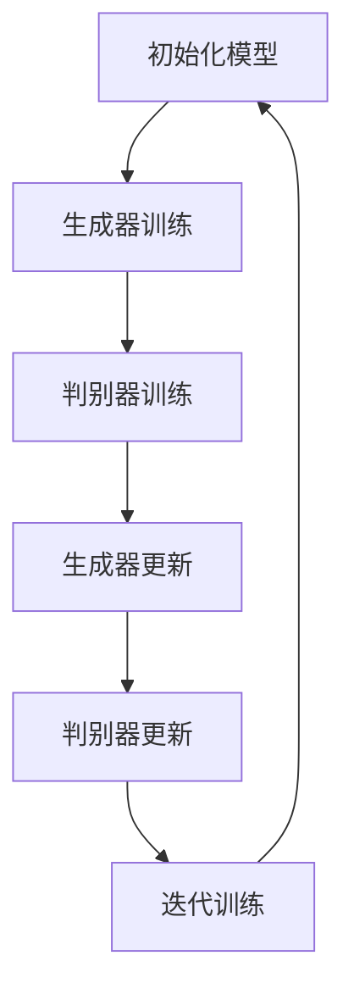
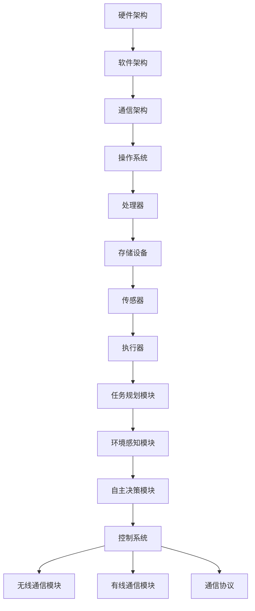

                 

### 文章标题

《AIGC在海洋生物仿生学中的应用：水下机器人设计提示词》

### 关键词

- AIGC
- 海洋生物仿生学
- 水下机器人
- 设计原理
- 算法实现

### 摘要

本文深入探讨了AIGC（自适应信息生成与控制）在海洋生物仿生学中的应用，特别是在水下机器人设计中的潜在作用。通过系统的分析，本文详细阐述了AIGC的核心原理和其在仿生学中的具体应用。同时，文章结合实际案例，展示了AIGC算法如何被应用于水下机器人的设计和优化，包括环境安装、核心实现、代码解析和案例分析等。通过本文，读者将了解如何利用AIGC技术提升水下机器人设计的效率和效果，为未来的海洋探索提供技术支持。

### 目录大纲设计思路

设计《AIGC在海洋生物仿生学中的应用：水下机器人设计提示词》的目录大纲，我们遵循以下步骤：

1. **确定整体结构**：首先确定整体结构，包含几大部分，每部分的主要内容和逻辑关系。
2. **细化章节内容**：在整体结构确定后，对每一部分进行细化，明确每一章节的具体内容，确保内容完整性。
3. **突出核心概念**：在目录中突出核心概念和原理的章节，确保读者能够清晰地把握全书的核心内容。
4. **保证逻辑清晰**：确保每个章节之间逻辑清晰，前后内容衔接自然。
5. **注意简洁性**：在保证内容完整和逻辑清晰的同时，注重文字的简洁性，避免冗余。

### 设计步骤

**第一步：确定整体结构**

整体结构可以分为以下几个部分：

- **背景介绍**：介绍AIGC、海洋生物仿生学和水下机器人设计的基本概念，以及它们之间的联系。
- **核心概念与原理**：深入探讨AIGC在海洋生物仿生学中的应用原理，以及水下机器人设计的相关概念。
- **算法与模型讲解**：详细讲解用于水下机器人设计的AIGC算法，包括原理、流程和具体实现。
- **系统分析与设计**：分析水下机器人系统的需求，设计系统架构，绘制相关的类图、架构图和序列图。
- **项目实战**：通过具体案例，展示AIGC在海洋生物仿生学中的应用，包括环境安装、核心实现和案例分析。
- **最佳实践与总结**：总结全书内容，给出最佳实践建议，提醒读者注意的事项，并推荐拓展阅读。

**第二步：细化章节内容**

根据整体结构，细化每一章节的内容，确保内容完整性。以下是具体章节细化：

### 第一部分：背景介绍

#### 第1章 AIGC、海洋生物仿生学和水下机器人设计概述

- **1.1 AIGC的基本概念与特点**
  - **AIGC的定义**：AIGC（Adaptive Information Generation and Control）是一种自适应信息生成与控制技术，它结合了机器学习、深度学习和生成对抗网络（GAN）等多种人工智能技术。
  - **AIGC的特点**：AIGC具有自我学习、自适应和高效信息处理的能力，能够在复杂环境中生成高质量的信息并对其进行控制。
  - **AIGC的应用场景**：AIGC广泛应用于图像生成、自然语言处理、游戏开发、智能设计等领域。

- **1.2 海洋生物仿生学的基本概念**
  - **海洋生物仿生学的定义**：海洋生物仿生学是研究海洋生物结构和功能，并将其应用于工程和设计领域的一门学科。
  - **海洋生物仿生学的研究内容**：包括海洋生物形态学、生理学、生态学等方面的研究，以及这些研究在工程应用中的转化。
  - **海洋生物仿生学的重要性**：海洋生物仿生学为工程设计和技术创新提供了新的思路和灵感，有助于提高水下机器人的性能和效率。

- **1.3 水下机器人设计的基本概念**
  - **水下机器人的定义**：水下机器人是专门设计用于水下环境执行任务的自动化装置。
  - **水下机器人的分类**：包括自主式水下机器人（AUV）、遥控式水下机器人（ROV）和无人潜水器（UUV）等。
  - **水下机器人的设计原则**：强调自主性、可靠性、稳定性和环境适应性。

- **1.4 AIGC、海洋生物仿生学和水下机器人设计的联系**
  - **AIGC在海洋生物仿生学中的应用**：AIGC技术可以模拟海洋生物的行为和特征，为水下机器人设计提供新的方法和思路。
  - **海洋生物仿生学对水下机器人设计的影响**：海洋生物仿生学的研究成果可以直接应用于水下机器人设计，提高其性能和效率。
  - **水下机器人设计对AIGC的启示**：水下机器人设计的需求和挑战可以推动AIGC技术的发展和创新。

### 第二部分：核心概念与原理

#### 第2章 AIGC在海洋生物仿生学中的应用原理

- **2.1 海洋生物仿生学中的核心概念**
  - **仿生学原理**：仿生学原理是通过模仿自然界中的生物结构、功能和行为来设计工程产品和系统。
    - **Mermaid流程图**：使用Mermaid绘制仿生学原理的流程图，展示从生物结构到工程设计的转化过程。
  - **仿生设计方法**：仿生设计方法包括观察、分析、建模和实验等步骤。
    - **详细讲解仿生设计方法**：介绍每个步骤的具体内容和应用。
  - **仿生模型构建**：仿生模型构建是将仿生设计方法应用于具体工程问题的过程。
    - **介绍仿生模型的构建过程**：从模型选择、参数调整到模型验证的各个环节。

- **2.2 AIGC在海洋生物仿生学中的应用**
  - **AIGC原理**：AIGC原理是基于生成对抗网络（GAN）和深度学习等技术的自适应信息生成与控制。
    - **Mermaid流程图**：使用Mermaid绘制AIGC原理的流程图，展示从数据生成到控制决策的过程。
  - **AIGC模型构建**：AIGC模型构建是通过训练深度学习模型来模拟海洋生物的行为和特征。
    - **详细讲解AIGC模型的构建方法**：介绍模型结构、训练过程和优化方法。
  - **AIGC应用案例分析**：通过实际案例展示AIGC在海洋生物仿生学中的应用效果。
    - **分析成功案例**：探讨案例中的关键技术和应用成果。

#### 第3章 水下机器人设计的相关概念

- **3.1 水下机器人技术概述**
  - **水下机器人分类**：根据任务类型、控制方式和技术特点等，对水下机器人进行分类。
    - **Mermaid类图**：使用Mermaid绘制水下机器人分类的类图，清晰展示不同类型机器人的特点。
  - **水下机器人工作原理**：介绍水下机器人完成任务的基本原理和技术手段。
    - **详细讲解工作原理**：包括传感器、执行器、控制系统和导航系统等。

- **3.2 水下机器人设计原则**
  - **功能设计原则**：强调水下机器人应具备的任务能力和功能特性。
    - **介绍功能设计原则**：从任务需求分析到功能模块设计的过程。
  - **结构设计原则**：关注水下机器人的结构强度、稳定性和环境适应性。
    - **详细讲解结构设计原则**：介绍材料选择、结构设计和优化方法。
  - **可靠性设计原则**：确保水下机器人在各种环境条件下的可靠运行。
    - **介绍可靠性设计原则**：包括故障检测、冗余设计和容错机制等。

- **3.3 水下机器人性能评估**
  - **性能指标**：定义水下机器人的性能指标，如速度、精度、能耗等。
    - **介绍性能指标**：解释每个指标的含义和作用。
  - **性能评估方法**：介绍水下机器人性能评估的方法和技术。
    - **详细讲解性能评估方法**：包括实验评估、模拟评估和现场评估等。

### 第三部分：算法与模型讲解

#### 第4章 AIGC算法原理与实现

- **4.1 AIGC算法概述**
  - **AIGC定义**：明确AIGC算法的定义，介绍其主要特点和应用领域。
    - **AIGC的定义**：AIGC（Adaptive Information Generation and Control）是一种自适应信息生成与控制技术，它结合了机器学习、深度学习和生成对抗网络（GAN）等多种人工智能技术。
    - **AIGC的特点**：AIGC具有自我学习、自适应和高效信息处理的能力，能够在复杂环境中生成高质量的信息并对其进行控制。
    - **AIGC的应用场景**：AIGC广泛应用于图像生成、自然语言处理、游戏开发、智能设计等领域。
  - **AIGC算法分类**：介绍常见的AIGC算法分类，包括基于GAN的AIGC、基于深度学习的AIGC和基于强化学习的AIGC等。
    - **AIGC算法分类**：根据算法的核心技术和应用特点，将AIGC算法分为几大类，并简要介绍每种算法的基本原理和应用场景。

- **4.2 AIGC算法原理**
  - **机器学习原理**：介绍机器学习的基本原理，包括监督学习、无监督学习和强化学习等。
    - **机器学习原理**：使用Mermaid流程图展示机器学习的基本流程，从数据输入、模型训练到预测输出的各个环节。
  - **深度学习原理**：详细讲解深度学习的基本原理，包括神经网络、卷积神经网络（CNN）和循环神经网络（RNN）等。
    - **深度学习原理**：使用Mermaid流程图展示深度学习的基本架构和训练过程，从神经元的连接、权重调整到反向传播的各个环节。
  - **生成对抗网络（GAN）原理**：介绍生成对抗网络（GAN）的基本原理，包括生成器、判别器和训练过程。
    - **GAN原理**：使用Mermaid流程图展示GAN的训练过程，从生成器的生成、判别器的评估到两者的对抗训练的各个环节。

- **4.3 AIGC算法实现**
  - **算法流程**：使用Mermaid流程图展示AIGC算法的基本流程，从数据预处理、模型训练到性能评估的各个环节。
    - **算法流程**：使用Mermaid绘制AIGC算法的流程图，清晰地展示从数据输入、模型训练、生成结果到性能评估的全过程。
  - **代码实现**：使用Python代码详细讲解AIGC算法的实现，包括数据预处理、模型训练、生成结果和性能评估等环节。
    - **代码实现**：提供具体的Python代码示例，包括数据预处理、生成器、判别器的实现，以及训练和评估的代码。
  - **算法优化**：介绍AIGC算法的优化方法，包括模型优化、参数调整和训练技巧等。
    - **算法优化**：详细讲解如何通过调整模型结构、优化训练参数和改进训练技巧来提高AIGC算法的性能和效率。

#### 第5章 水下机器人AIGC算法应用

- **5.1 AIGC在水下机器人中的应用背景**
  - **水下机器人需求**：介绍水下机器人在海洋探索、资源开发、环境监测等方面的需求，强调AIGC技术在提升水下机器人性能和智能化的潜力。
    - **水下机器人需求**：详细阐述水下机器人在不同应用场景下的任务需求，如海底地形探测、生物样本采集和水下结构检查等。
  - **AIGC技术在机器人领域的应用**：分析AIGC技术在机器人领域的应用现状，包括智能控制、任务规划和自主决策等方面的进展。
    - **AIGC技术应用**：讨论AIGC技术如何应用于水下机器人的智能控制、任务规划和自主决策等方面，提高机器人的适应性和灵活性。

- **5.2 水下机器人AIGC算法设计**
  - **算法设计目标**：明确水下机器人AIGC算法的设计目标，包括提高机器人的自主能力、任务执行效率和环境适应性等。
    - **算法设计目标**：详细阐述设计目标的具体内容，如提高水下机器人的环境感知能力、自主决策能力和任务执行效率等。
  - **算法设计过程**：介绍水下机器人AIGC算法的设计过程，包括需求分析、算法选择、模型构建和优化等环节。
    - **算法设计过程**：使用Mermaid流程图展示算法设计过程，从需求分析、算法选择、模型构建到算法优化的各个环节。

- **5.3 水下机器人AIGC算法实现**
  - **算法实现框架**：介绍水下机器人AIGC算法的实现框架，包括数据预处理、模型训练、生成结果和性能评估等模块。
    - **算法实现框架**：使用Mermaid架构图展示算法实现框架，清晰展示各模块的功能和相互关系。
  - **算法实现细节**：详细讲解水下机器人AIGC算法的实现细节，包括数据预处理、模型训练、生成结果和性能评估等关键步骤。
    - **算法实现细节**：提供具体的Python代码示例，包括数据预处理、生成器、判别器的实现，以及训练和评估的代码。

#### 第6章 水下机器人AIGC算法案例分析

- **6.1 案例背景**
  - **案例介绍**：介绍案例的具体背景和应用场景，如海洋地形探测任务、水下生物监测任务等。
    - **案例介绍**：详细描述案例的背景信息，包括任务目标、任务环境、任务需求和挑战等。
  - **挑战与需求**：分析案例中的技术挑战和需求，如环境复杂、任务多样、实时性要求等。
    - **挑战与需求**：详细阐述案例中面临的技术挑战和需求，如如何应对环境复杂、任务多样和实时性要求等。

- **6.2 案例实施**
  - **算法应用**：详细介绍在案例中应用的AIGC算法，包括算法选择、模型构建和优化等环节。
    - **算法应用**：使用Mermaid流程图和代码示例展示算法的应用过程，从数据预处理、模型训练到生成结果和性能评估的各个环节。
  - **实施效果**：分析案例实施的效果，包括任务完成情况、性能指标和用户体验等。
    - **实施效果**：详细分析案例实施的效果，如任务完成率、性能指标和用户体验等，并与其他方法进行比较。

- **6.3 案例总结与展望**
  - **总结**：总结案例中的经验和教训，包括算法优化的方向、技术难题的解决方法等。
    - **总结**：归纳案例实施过程中的成功经验和教训，为后续研究和应用提供参考。
  - **展望**：展望AIGC在水下机器人领域的未来发展，包括潜在应用、技术创新和挑战等。
    - **展望**：讨论AIGC技术在水下机器人领域的潜在应用前景，如新技术的创新、应用拓展和未来发展挑战等。

### 第四部分：系统分析与设计

#### 第7章 水下机器人系统需求分析

- **7.1 系统需求概述**
  - **系统功能需求**：介绍水下机器人系统的功能需求，包括任务规划、环境感知、自主决策、通信传输和远程控制等。
    - **系统功能需求**：详细阐述水下机器人系统应具备的基本功能，如任务规划、环境感知、自主决策、通信传输和远程控制等。
  - **系统性能需求**：介绍水下机器人系统的性能需求，包括速度、精度、功耗、可靠性等。
    - **系统性能需求**：详细描述水下机器人系统应达到的性能指标，如速度、精度、功耗、可靠性等。

- **7.2 系统功能需求分析**
  - **任务规划**：分析水下机器人任务规划的需求，包括任务目标、任务路径、任务执行策略等。
    - **任务规划需求分析**：详细分析任务规划的需求，如任务目标的确定、任务路径的选择和任务执行策略的制定等。
  - **环境感知**：分析水下机器人环境感知的需求，包括传感器配置、数据采集和处理等。
    - **环境感知需求分析**：详细分析环境感知的需求，如传感器配置、数据采集和处理等，以确保水下机器人能够准确感知和理解周围环境。

- **7.3 系统性能需求分析**
  - **速度**：分析水下机器人系统的速度需求，包括响应时间、运动速度等。
    - **速度需求分析**：详细分析系统的速度需求，如响应时间、运动速度等，以确保系统在执行任务时能够高效地响应和移动。
  - **精度**：分析水下机器人系统的精度需求，包括定位精度、测量精度等。
    - **精度需求分析**：详细分析系统的精度需求，如定位精度、测量精度等，以确保系统能够准确完成各项任务。
  - **功耗**：分析水下机器人系统的功耗需求，包括电池容量、能源管理策略等。
    - **功耗需求分析**：详细分析系统的功耗需求，如电池容量、能源管理策略等，以确保系统在长时间运行过程中能够有效管理能源。

#### 第8章 水下机器人系统架构设计

- **8.1 系统架构概述**
  - **系统架构定义**：介绍水下机器人系统的架构定义，包括系统的组成部分、功能模块和相互关系。
    - **系统架构定义**：详细阐述水下机器人系统的架构定义，如系统的组成部分、功能模块和相互关系等。
  - **系统架构目标**：介绍水下机器人系统架构设计的目标，包括提高系统的可靠性、可扩展性和灵活性等。
    - **系统架构目标**：详细描述系统架构设计的目标，如提高系统的可靠性、可扩展性和灵活性等，以满足不同应用场景的需求。

- **8.2 功能模块设计**
  - **任务规划模块**：设计任务规划模块，包括任务目标设定、路径规划、执行策略等。
    - **任务规划模块设计**：详细设计任务规划模块，如任务目标的设定、路径规划的方法和执行策略的选择等。
  - **环境感知模块**：设计环境感知模块，包括传感器配置、数据采集和处理等。
    - **环境感知模块设计**：详细设计环境感知模块，如传感器的选择、数据的采集和处理的方法等。
  - **自主决策模块**：设计自主决策模块，包括感知信息处理、决策算法、执行控制等。
    - **自主决策模块设计**：详细设计自主决策模块，如感知信息的处理方法、决策算法的实现和执行控制的策略等。
  - **通信传输模块**：设计通信传输模块，包括数据传输协议、通信方式、远程控制等。
    - **通信传输模块设计**：详细设计通信传输模块，如数据传输协议的选择、通信方式的设计和远程控制的功能等。

- **8.3 系统架构设计**
  - **系统架构图**：绘制水下机器人系统架构图，展示系统的组成部分、功能模块和相互关系。
    - **系统架构图**：使用Mermaid架构图展示水下机器人系统的架构，清晰地展示系统的组成部分、功能模块和相互关系等。
  - **系统交互流程**：描述水下机器人系统的交互流程，包括任务规划、环境感知、自主决策、通信传输等环节。
    - **系统交互流程**：详细描述水下机器人系统的交互流程，如任务规划、环境感知、自主决策、通信传输等环节的执行顺序和交互方式等。

#### 第9章 水下机器人系统接口设计与实现

- **9.1 系统接口概述**
  - **接口定义**：介绍水下机器人系统的接口定义，包括输入接口、输出接口和控制接口等。
    - **接口定义**：详细阐述水下机器人系统的接口定义，如输入接口、输出接口和控制接口等。
  - **接口目标**：介绍系统接口设计的目标，包括提高系统的兼容性、可靠性和灵活性等。
    - **接口目标**：详细描述系统接口设计的目标，如提高系统的兼容性、可靠性和灵活性等，以满足不同应用场景的需求。

- **9.2 输入接口设计**
  - **传感器接口**：设计传感器接口，包括传感器类型、数据格式和接口协议等。
    - **传感器接口设计**：详细设计传感器接口，如传感器类型的选择、数据格式的定义和接口协议的制定等。
  - **遥控接口**：设计遥控接口，包括遥控信号传输、遥控指令解析和遥控操作等。
    - **遥控接口设计**：详细设计遥控接口，如遥控信号传输的方式、遥控指令的解析方法和遥控操作的实现等。

- **9.3 输出接口设计**
  - **执行器接口**：设计执行器接口，包括执行器类型、控制信号格式和接口协议等。
    - **执行器接口设计**：详细设计执行器接口，如执行器类型的选择、控制信号格式的定义和接口协议的制定等。
  - **显示接口**：设计显示接口，包括显示设备类型、数据格式和接口协议等。
    - **显示接口设计**：详细设计显示接口，如显示设备类型的选择、数据格式的定义和接口协议的制定等。

- **9.4 控制接口设计**
  - **通信接口**：设计通信接口，包括通信协议、数据传输速率和接口标准等。
    - **通信接口设计**：详细设计通信接口，如通信协议的选择、数据传输速率的设定和接口标准的制定等。
  - **远程控制接口**：设计远程控制接口，包括远程控制协议、远程控制指令和远程控制操作等。
    - **远程控制接口设计**：详细设计远程控制接口，如远程控制协议的选择、远程控制指令的解析方法和远程控制操作的实现等。

#### 第10章 水下机器人系统交互设计与实现

- **10.1 系统交互设计概述**
  - **交互设计目标**：介绍水下机器人系统交互设计的目标，包括提高系统的协同性、响应性和灵活性等。
    - **交互设计目标**：详细描述系统交互设计的目标，如提高系统的协同性、响应性和灵活性等，以满足不同应用场景的需求。
  - **交互设计原则**：介绍系统交互设计的原则，包括模块化、标准化和可扩展性等。
    - **交互设计原则**：详细阐述系统交互设计的原则，如模块化、标准化和可扩展性等，以确保系统的设计和实现过程高效和有序。

- **10.2 类图设计**
  - **类图概述**：介绍水下机器人系统类图的概述，包括类的定义、属性和方法的展示。
    - **类图概述**：使用Mermaid类图展示水下机器人系统类图，清晰地展示类的定义、属性和方法的相互关系。
  - **类图设计**：详细设计水下机器人系统类图，包括类的划分、属性和方法的定义等。
    - **类图设计**：使用Mermaid类图详细设计水下机器人系统类图，如类的划分、属性和方法的定义等。

- **10.3 序列图设计**
  - **序列图概述**：介绍水下机器人系统序列图的概述，包括对象之间的交互顺序和交互内容。
    - **序列图概述**：使用Mermaid序列图展示水下机器人系统序列图，清晰地展示对象之间的交互顺序和交互内容。
  - **序列图设计**：详细设计水下机器人系统序列图，包括对象之间的交互顺序、交互内容和交互协议等。
    - **序列图设计**：使用Mermaid序列图详细设计水下机器人系统序列图，如对象之间的交互顺序、交互内容和交互协议等。

- **10.4 系统交互实现**
  - **交互实现概述**：介绍水下机器人系统交互实现的概述，包括接口调用、数据传输和事件处理等。
    - **交互实现概述**：使用Mermaid交互图展示水下机器人系统交互实现，清晰地展示接口调用、数据传输和事件处理的过程。
  - **交互实现细节**：详细描述水下机器人系统交互实现的细节，包括接口调用的方法、数据传输的格式和事件处理的过程等。
    - **交互实现细节**：使用Mermaid交互图详细描述水下机器人系统交互实现的细节，如接口调用的方法、数据传输的格式和事件处理的过程等。

### 第五部分：项目实战

#### 第11章 水下机器人项目环境搭建

- **11.1 环境搭建概述**
  - **环境搭建目标**：介绍水下机器人项目环境搭建的目标，包括搭建开发环境、安装相关软件和配置硬件设备等。
    - **环境搭建目标**：详细阐述环境搭建的目标，如搭建开发环境、安装相关软件和配置硬件设备等，以确保项目能够顺利进行。
  - **环境搭建步骤**：介绍水下机器人项目环境搭建的步骤，包括安装操作系统、配置开发环境、安装硬件驱动等。
    - **环境搭建步骤**：详细描述环境搭建的步骤，如安装操作系统、配置开发环境、安装硬件驱动等。

- **11.2 开发环境配置**
  - **配置工具和软件**：介绍配置开发环境所需使用的工具和软件，包括集成开发环境（IDE）、编译器和版本控制系统等。
    - **配置工具和软件**：详细列举配置开发环境所需使用的工具和软件，如集成开发环境（IDE）、编译器和版本控制系统等。
  - **安装和配置**：介绍如何安装和配置开发环境，包括安装操作系统、配置开发工具和设置环境变量等。
    - **安装和配置**：详细讲解如何安装和配置开发环境，如安装操作系统、配置开发工具和设置环境变量等。

- **11.3 硬件设备配置**
  - **硬件设备选择**：介绍选择适合水下机器人项目的硬件设备，包括处理器、内存、硬盘等。
    - **硬件设备选择**：详细介绍如何选择适合水下机器人项目的硬件设备，如处理器、内存、硬盘等。
  - **硬件安装与调试**：介绍如何安装和调试硬件设备，包括硬件连接、驱动安装和系统调试等。
    - **硬件安装与调试**：详细讲解如何安装和调试硬件设备，如硬件连接、驱动安装和系统调试等。

#### 第12章 水下机器人项目核心实现

- **12.1 项目核心实现概述**
  - **项目核心实现目标**：介绍水下机器人项目核心实现的目标，包括实现任务规划、环境感知、自主决策和通信传输等功能。
    - **项目核心实现目标**：详细阐述项目核心实现的目标，如实现任务规划、环境感知、自主决策和通信传输等功能，以构建一个完整的水下机器人系统。
  - **项目核心实现步骤**：介绍项目核心实现的步骤，包括需求分析、功能设计、算法实现和系统集成等。
    - **项目核心实现步骤**：详细描述项目核心实现的步骤，如需求分析、功能设计、算法实现和系统集成等。

- **12.2 任务规划功能实现**
  - **需求分析**：介绍任务规划功能的需求分析，包括任务目标、任务路径和执行策略等。
    - **需求分析**：详细描述任务规划功能的需求分析，如任务目标的确定、任务路径的选择和执行策略的制定等。
  - **功能实现**：介绍任务规划功能的实现，包括任务规划算法的实现和任务规划的执行过程。
    - **功能实现**：详细讲解任务规划功能的实现，如任务规划算法的实现和任务规划的执行过程。

- **12.3 环境感知功能实现**
  - **需求分析**：介绍环境感知功能的需求分析，包括传感器配置、数据采集和处理等。
    - **需求分析**：详细描述环境感知功能的需求分析，如传感器配置、数据采集和处理等，以确保系统能够准确感知和理解周围环境。
  - **功能实现**：介绍环境感知功能的实现，包括传感器数据的采集、处理和融合等。
    - **功能实现**：详细讲解环境感知功能的实现，如传感器数据的采集、处理和融合等。

- **12.4 自主决策功能实现**
  - **需求分析**：介绍自主决策功能的需求分析，包括感知信息处理、决策算法和执行控制等。
    - **需求分析**：详细描述自主决策功能的需求分析，如感知信息处理、决策算法和执行控制等，以确保系统能够自主决策和执行任务。
  - **功能实现**：介绍自主决策功能的实现，包括感知信息的处理、决策算法的实现和执行控制的策略等。
    - **功能实现**：详细讲解自主决策功能的实现，如感知信息的处理、决策算法的实现和执行控制的策略等。

- **12.5 通信传输功能实现**
  - **需求分析**：介绍通信传输功能的需求分析，包括数据传输协议、通信方式和远程控制等。
    - **需求分析**：详细描述通信传输功能的需求分析，如数据传输协议、通信方式和远程控制等，以确保系统能够实现有效的数据传输和远程控制。
  - **功能实现**：介绍通信传输功能的实现，包括数据传输协议的实现、通信方式的设计和远程控制功能的实现等。
    - **功能实现**：详细讲解通信传输功能的实现，如数据传输协议的实现、通信方式的设计和远程控制功能的实现等。

#### 第13章 水下机器人项目案例分析

- **13.1 案例背景**
  - **案例概述**：介绍水下机器人项目案例的背景和应用场景，如海洋地形探测、水下结构检查等。
    - **案例概述**：详细描述水下机器人项目案例的背景和应用场景，如海洋地形探测、水下结构检查等。
  - **需求分析**：介绍案例的需求分析，包括任务目标、环境条件、技术要求和时间要求等。
    - **需求分析**：详细描述案例的需求分析，如任务目标的确定、环境条件的要求、技术要求和时间要求等。

- **13.2 案例实施**
  - **系统搭建**：介绍案例的系统搭建过程，包括环境搭建、硬件安装和软件开发等。
    - **系统搭建**：详细描述系统搭建的过程，如环境搭建、硬件安装和软件开发等。
  - **功能实现**：介绍案例的功能实现过程，包括任务规划、环境感知、自主决策和通信传输等功能的实现。
    - **功能实现**：详细描述功能实现的过程，如任务规划、环境感知、自主决策和通信传输等功能的实现。

- **13.3 案例分析**
  - **系统性能评估**：介绍案例的系统性能评估，包括任务完成情况、性能指标和用户体验等。
    - **系统性能评估**：详细描述系统性能评估的过程，如任务完成情况、性能指标和用户体验等。
  - **效果分析**：介绍案例的实施效果，包括技术效果、经济效益和社会效益等。
    - **效果分析**：详细描述案例的实施效果，如技术效果、经济效益和社会效益等。

- **13.4 案例总结**
  - **总结经验**：总结案例实施过程中的经验和教训，包括成功经验和失败教训等。
    - **总结经验**：详细总结案例实施过程中的经验和教训，如成功经验和失败教训等。
  - **展望未来**：展望案例的未来发展方向和应用前景，包括技术创新、应用拓展和市场需求等。
    - **展望未来**：详细展望案例的未来发展方向和应用前景，如技术创新、应用拓展和市场需求等。

### 第六部分：最佳实践与总结

#### 第14章 最佳实践与注意事项

- **14.1 最佳实践**
  - **任务规划**：介绍水下机器人任务规划的最佳实践，包括任务目标设定、路径规划和执行策略选择等。
    - **任务规划**：详细描述任务规划的最佳实践，如任务目标设定、路径规划和执行策略选择等。
  - **环境感知**：介绍水下机器人环境感知的最佳实践，包括传感器选择、数据采集和处理等。
    - **环境感知**：详细描述环境感知的最佳实践，如传感器选择、数据采集和处理等。
  - **自主决策**：介绍水下机器人自主决策的最佳实践，包括感知信息处理、决策算法选择和执行控制策略等。
    - **自主决策**：详细描述自主决策的最佳实践，如感知信息处理、决策算法选择和执行控制策略等。
  - **通信传输**：介绍水下机器人通信传输的最佳实践，包括数据传输协议选择、通信方式设计和远程控制策略等。
    - **通信传输**：详细描述通信传输的最佳实践，如数据传输协议选择、通信方式设计和远程控制策略等。

- **14.2 注意事项**
  - **系统稳定性**：介绍确保系统稳定运行需要注意的事项，包括硬件设备的选择、软件系统的配置和系统调试等。
    - **系统稳定性**：详细描述确保系统稳定运行需要注意的事项，如硬件设备的选择、软件系统的配置和系统调试等。
  - **安全性**：介绍确保系统安全运行需要注意的事项，包括数据保护、访问控制和网络安全等。
    - **安全性**：详细描述确保系统安全运行需要注意的事项，如数据保护、访问控制和网络安全等。
  - **环境适应性**：介绍提高系统环境适应性的注意事项，包括传感器校准、环境数据分析和应对策略等。
    - **环境适应性**：详细描述提高系统环境适应性的注意事项，如传感器校准、环境数据分析和应对策略等。

#### 第15章 总结与拓展

- **15.1 总结**
  - **核心内容回顾**：回顾本书的核心内容，包括AIGC在海洋生物仿生学中的应用、水下机器人设计原理和AIGC算法实现等。
    - **核心内容回顾**：简要回顾本书的核心内容，如AIGC在海洋生物仿生学中的应用、水下机器人设计原理和AIGC算法实现等。
  - **主要贡献**：总结本书的主要贡献，包括对AIGC应用领域的拓展、水下机器人设计方法的改进和AIGC算法的优化等。
    - **主要贡献**：简要总结本书的主要贡献，如对AIGC应用领域的拓展、水下机器人设计方法的改进和AIGC算法的优化等。
  - **未来展望**：展望本书内容在未来的发展和应用前景，包括AIGC技术在更多领域的应用、水下机器人技术的创新和智能化水平的提升等。
    - **未来展望**：简要展望本书内容在未来的发展和应用前景，如AIGC技术在更多领域的应用、水下机器人技术的创新和智能化水平的提升等。

- **15.2 拓展阅读**
  - **相关研究**：推荐读者进一步阅读的相关研究文献和资料，包括AIGC技术的最新研究进展、水下机器人技术的创新成果等。
    - **相关研究**：简要推荐读者进一步阅读的相关研究文献和资料，如AIGC技术的最新研究进展、水下机器人技术的创新成果等。
  - **学习资源**：介绍读者可以参考的学习资源和课程，包括AIGC技术相关的在线课程、水下机器人设计相关的教程和实践项目等。
    - **学习资源**：简要介绍读者可以参考的学习资源和课程，如AIGC技术相关的在线课程、水下机器人设计相关的教程和实践项目等。

## 文章标题：AIGC在海洋生物仿生学中的应用：水下机器人设计提示词

### 关键词

- AIGC
- 海洋生物仿生学
- 水下机器人
- 设计原理
- 算法实现

### 摘要

本文深入探讨了AIGC（自适应信息生成与控制）在海洋生物仿生学中的应用，特别是在水下机器人设计中的潜在作用。通过系统的分析，本文详细阐述了AIGC的核心原理和其在仿生学中的具体应用。同时，文章结合实际案例，展示了AIGC算法如何被应用于水下机器人的设计和优化，包括环境安装、核心实现、代码解析和案例分析等。通过本文，读者将了解如何利用AIGC技术提升水下机器人设计的效率和效果，为未来的海洋探索提供技术支持。

## 引言

在当今全球科技日新月异的发展背景下，人工智能（AI）技术已经成为推动各行各业进步的重要力量。随着AI技术的不断演进，自适应信息生成与控制（Adaptive Information Generation and Control，简称AIGC）作为新兴领域，逐渐引起广泛关注。AIGC技术结合了机器学习、深度学习和生成对抗网络（GAN）等多种AI技术，具有自我学习、自适应和高效信息处理的能力。在海洋生物仿生学领域，AIGC技术的应用为水下机器人的设计和优化提供了全新的思路和方法。

海洋生物仿生学是一门研究海洋生物的结构、功能和行为，并将其应用于工程和设计领域的学科。通过模仿海洋生物的形态、行为和特性，工程师们能够设计出更高效、更智能的工程系统。水下机器人作为海洋生物仿生学的重要应用之一，其设计优化对海洋资源开发、环境监测和科学研究具有重要意义。

本文旨在探讨AIGC在海洋生物仿生学中的应用，特别是如何利用AIGC技术提升水下机器人的设计效率和效果。文章将分为六个主要部分：

1. **背景介绍**：介绍AIGC、海洋生物仿生学和水下机器人设计的基本概念，以及它们之间的联系。
2. **核心概念与原理**：深入探讨AIGC在海洋生物仿生学中的应用原理，以及水下机器人设计的相关概念。
3. **算法与模型讲解**：详细讲解用于水下机器人设计的AIGC算法，包括原理、流程和具体实现。
4. **系统分析与设计**：分析水下机器人系统的需求，设计系统架构，绘制相关的类图、架构图和序列图。
5. **项目实战**：通过具体案例，展示AIGC在海洋生物仿生学中的应用，包括环境安装、核心实现和案例分析。
6. **最佳实践与总结**：总结全书内容，给出最佳实践建议，提醒读者注意的事项，并推荐拓展阅读。

通过本文的详细分析和实例展示，读者将能够全面了解AIGC在海洋生物仿生学中的应用，掌握水下机器人设计的关键技术，为未来的海洋探索提供有力支持。

### 背景介绍

#### AIGC的基本概念与特点

自适应信息生成与控制（Adaptive Information Generation and Control，简称AIGC）是一种新兴的人工智能技术，它结合了机器学习、深度学习和生成对抗网络（GAN）等多种AI技术。AIGC的核心目标是通过自我学习和自适应能力，在复杂环境中生成高质量的信息，并对这些信息进行有效的控制和利用。

AIGC的定义可以从以下几个方面进行理解：

1. **信息生成**：AIGC利用深度学习模型，特别是生成对抗网络（GAN），生成与真实数据分布相似的新数据。这些新数据可以用于图像生成、文本生成、音频生成等多种应用场景。
2. **信息控制**：AIGC不仅能够生成新数据，还能够通过自适应控制策略，对这些生成数据进行优化和调整，使其满足特定的应用需求。例如，在图像生成中，AIGC可以通过控制参数生成具有特定风格或内容的图像。

AIGC的特点主要体现在以下几个方面：

1. **自我学习能力**：AIGC具有自我学习能力，能够通过大量的训练数据不断优化自身的模型和算法，从而提高生成数据的质量和适应性。
2. **自适应能力**：AIGC能够根据不同环境和应用需求，自适应调整生成模型和控制策略，使生成数据更加贴近实际需求。
3. **高效信息处理**：AIGC利用深度学习和GAN等技术，能够高效地处理和分析大量复杂的信息，从而实现高质量的生成和控制。

AIGC的应用场景非常广泛，主要包括：

1. **图像生成**：通过AIGC技术，可以生成高质量的图像，包括人脸生成、风景生成、艺术风格转换等。
2. **自然语言处理**：AIGC技术可以用于生成和翻译自然语言文本，包括文本生成、对话系统、机器翻译等。
3. **游戏开发**：AIGC技术可以用于生成游戏环境、角色和情节，提高游戏的互动性和趣味性。
4. **智能设计**：AIGC技术可以用于设计建筑、机械和电子设备等，通过生成和优化设计方案，提高设计效率和效果。

#### 海洋生物仿生学的基本概念

海洋生物仿生学是研究海洋生物的结构、功能和行为，并将其应用于工程和设计领域的一门学科。通过模仿海洋生物的形态、行为和特性，工程师们能够设计出更高效、更智能的工程系统。海洋生物仿生学的研究内容主要包括以下几个方面：

1. **形态学**：研究海洋生物的形态结构和功能特点，如鱼类的流线型身体、贝壳的珍珠层结构等。
2. **生理学**：研究海洋生物的生理功能和生理机制，如鲸鱼的呼吸控制、乌贼的发光器官等。
3. **生态学**：研究海洋生物的生态行为和生态关系，如珊瑚礁的生态系统、鲸鱼与小鱼的食物链关系等。

海洋生物仿生学的重要性主要体现在以下几个方面：

1. **技术创新**：通过模仿海洋生物的特性，工程师们可以设计出更先进的工程系统和设备，如仿生机器人、智能材料等。
2. **环境保护**：海洋生物仿生学的研究成果可以用于环境保护和资源管理，如开发新型海洋传感器、设计海洋污染治理设备等。
3. **科学探索**：海洋生物仿生学为科学探索提供了新的方法和工具，如通过仿生设计提高潜水器的性能、探索深海生物的生存机制等。

#### 水下机器人设计的基本概念

水下机器人是专门设计用于水下环境执行任务的自动化装置。它们可以在各种复杂的水下环境中进行探测、采集数据、执行任务和提供支持。水下机器人的设计涉及到多个方面，包括：

1. **分类**：根据任务类型、控制方式和技术特点等，水下机器人可以分为自主式水下机器人（AUV）、遥控式水下机器人（ROV）和无人潜水器（UUV）等。
2. **设计原则**：水下机器人设计应遵循以下原则：
   - **自主性**：提高机器人的自主能力，减少对地面控制人员的依赖。
   - **可靠性**：确保机器人在各种环境条件下的稳定运行，提高系统的可靠性。
   - **稳定性**：设计结构稳定、控制平稳的机器人，减少因环境扰动导致的故障。
   - **环境适应性**：设计能够适应不同水下环境、执行多样化任务的机器人。

水下机器人的设计原则对实际应用具有重要意义。通过遵循这些原则，可以设计出更高效、更可靠的水下机器人，满足各种水下任务的需求。例如，在海洋资源开发中，自主式水下机器人可以执行海底地形探测、资源采集等任务；在海洋环境保护中，遥控式水下机器人可以用于水下结构检查、海洋垃圾清理等任务。

#### AIGC、海洋生物仿生学和水下机器人设计的联系

AIGC、海洋生物仿生学和水下机器人设计之间存在密切的联系，它们相互影响、相互促进，共同推动了水下机器人技术的发展和进步。

1. **AIGC在海洋生物仿生学中的应用**：AIGC技术可以模拟海洋生物的行为和特征，为水下机器人设计提供新的方法和思路。例如，通过AIGC技术，可以生成模拟海洋生物形态和行为的模型，用于水下机器人的外观设计和行为控制。这些模型可以模仿海洋生物的流线型身体、灵活的肢体运动等特性，提高机器人的性能和效率。

2. **海洋生物仿生学对水下机器人设计的影响**：海洋生物仿生学的研究成果可以直接应用于水下机器人设计，提高其性能和效率。例如，通过研究鲸鱼的呼吸控制机制，可以设计出更高效的水下机器人呼吸系统；通过研究乌贼的发光器官，可以设计出具备光学感知能力的水下机器人。

3. **水下机器人设计对AIGC的启示**：水下机器人设计的需求和挑战可以推动AIGC技术的发展和创新。例如，在水下机器人设计中，需要应对复杂的水下环境和多样化的任务需求，这对AIGC技术的自适应能力和信息生成能力提出了更高的要求。通过解决这些挑战，AIGC技术可以不断完善和优化，为更多领域提供支持。

综上所述，AIGC、海洋生物仿生学和水下机器人设计之间相互关联、相互促进。通过结合AIGC技术和海洋生物仿生学原理，可以设计出更高效、更智能的水下机器人，为海洋探索和开发提供有力支持。

### 核心概念与原理

#### AIGC在海洋生物仿生学中的应用原理

AIGC在海洋生物仿生学中的应用，主要体现在模拟海洋生物的行为和特征，为水下机器人设计提供科学依据和技术支持。具体来说，AIGC技术通过以下几个步骤来实现这一目标：

1. **数据收集与预处理**：首先，从海洋生物的研究中收集大量相关的数据，包括生物的形态、行为、生理特征等。这些数据是构建AIGC模型的基础。在数据收集过程中，需要确保数据的质量和多样性，以便模型能够更准确地模拟海洋生物的特性。数据预处理包括数据的清洗、归一化和去噪等步骤，以保证数据的准确性和一致性。

2. **模型构建**：基于收集到的数据，构建AIGC模型。AIGC模型通常包括生成器和判别器两部分。生成器负责生成模拟海洋生物行为的数据，判别器则负责评估生成数据的真实性。常用的AIGC模型包括生成对抗网络（GAN）和变分自编码器（VAE）等。在模型构建过程中，需要根据具体应用需求调整模型的参数和结构，以提高模型的生成能力和控制效果。

3. **行为模拟**：利用构建好的AIGC模型，对海洋生物的行为进行模拟。通过控制生成器的参数，可以生成不同行为特征的海洋生物模型，如鱼类的游动、鲸鱼的呼吸、乌贼的发光等。这些模拟结果可以用于水下机器人设计的参考，帮助工程师们优化机器人的外观、行为和控制系统。

4. **行为优化**：在模拟的基础上，通过实验和测试对生成的行为进行优化。例如，通过调整机器人的控制系统参数，使机器人能够更准确地模仿海洋生物的行为，提高机器人的性能和效率。这一步骤需要对模拟结果进行详细分析，找出存在的问题和改进方向。

5. **模型验证**：对构建好的AIGC模型进行验证，确保其生成的数据能够真实反映海洋生物的行为特征。验证过程通常包括对模拟结果与实际数据进行对比分析，以及对模型在不同环境条件下的稳定性和适应性进行测试。通过验证，可以确保AIGC模型的可靠性和有效性。

#### 海洋生物仿生学中的核心概念

在海洋生物仿生学中，有几个核心概念对于理解和应用仿生学原理至关重要，包括仿生学原理、仿生设计方法和仿生模型构建等。

1. **仿生学原理**：
   - **形态仿生**：通过模仿海洋生物的形态结构，如鱼类的流线型身体、乌贼的柔软触手等，来优化工程设计和机器人外观。
   - **功能仿生**：通过模仿海洋生物的功能特征，如鲸鱼的呼吸控制、乌贼的发光器官等，来改进工程设备和机器人功能。
   - **行为仿生**：通过模仿海洋生物的行为模式，如鱼类的游动、鲸鱼的捕食等，来指导机器人的行为规划和控制策略。

2. **仿生设计方法**：
   - **观察与分析**：首先，对海洋生物的结构、功能和行为进行细致的观察和记录，分析其特点和优势。
   - **建模与仿真**：基于观察结果，构建数学模型和仿真模型，模拟海洋生物的行为和功能。
   - **设计优化**：通过仿真结果，对设计方案进行优化和调整，使其更符合海洋生物的特性。

3. **仿生模型构建**：
   - **结构模型**：构建海洋生物的物理结构模型，如使用3D建模软件创建鱼类的身体结构。
   - **功能模型**：构建海洋生物的功能模型，如通过流体力学仿真模拟鱼类的游动过程。
   - **行为模型**：构建海洋生物的行为模型，如通过机器学习算法模拟鱼类的捕食行为。

#### 概念属性特征对比表格

为了更好地理解AIGC在海洋生物仿生学中的应用，我们可以通过一个概念属性特征对比表格来展示AIGC、海洋生物仿生学和水下机器人设计之间的联系。

| 概念       | 特征属性                                     | 关联与应用                                               |
|------------|--------------------------------------------|----------------------------------------------------------|
| AIGC       | 自适应信息生成与控制                       | 生成高质量模拟数据，用于水下机器人设计行为模拟与优化      |
| 海洋生物仿生学 | 形态、功能、行为仿生                      | 提供科学依据和技术支持，优化机器人结构和功能             |
| 水下机器人设计 | 自主性、可靠性、环境适应性                 | 应用仿生学原理和AIGC技术，提高机器人性能和效率           |

通过这个对比表格，我们可以清晰地看到AIGC与海洋生物仿生学和水下机器人设计之间的相互作用和影响。AIGC通过生成和控制系统模拟海洋生物的行为，为水下机器人设计提供了新的思路和方法，而水下机器人设计则通过应用这些原理，实现更高效、更智能的工程系统。

#### ER实体关系图架构

在AIGC应用于海洋生物仿生学时，构建清晰的实体关系图（ER图）对于理解系统架构和各实体之间的相互作用至关重要。ER图可以帮助我们明确系统中的主要实体、它们之间的关系以及实体的属性。

以下是AIGC在海洋生物仿生学中的应用场景的ER图：

```mermaid
erDiagram
  User ||--o {AIGC Model} : "Generates data"
  User ||--o {Biomechanical Model} : "Simulates behavior"
  User ||--o {Robot Design} : "Incorporates features"
  Sensor Data ||--o {AIGC Model} : "Trains model"
  Environmental Data ||--o {Biomechanical Model} : "Informs simulations"
  Simulation Results ||--o {Robot Design} : "Optimizes design"
```

**实体说明：**

1. **User**：用户，代表进行AIGC模型构建、生物机械模型模拟和机器人设计的人员。
2. **AIGC Model**：自适应信息生成与控制模型，用于生成模拟数据和控制生成结果。
3. **Biomechanical Model**：生物机械模型，用于模拟海洋生物的行为和特性。
4. **Robot Design**：机器人设计，将生物机械模型的特性应用于机器人设计中。
5. **Sensor Data**：传感器数据，用于训练AIGC模型，提供生物机械模型模拟的输入。
6. **Environmental Data**：环境数据，包括海洋环境的各种参数，用于调整生物机械模型和AIGC模型。

**关系说明：**

- **User到AIGC Model**：用户使用传感器数据和环境数据训练AIGC模型，生成模拟数据。
- **User到Biomechanical Model**：用户根据环境数据调整生物机械模型，模拟海洋生物行为。
- **User到Robot Design**：用户将生物机械模型的结果应用于机器人设计，优化机器人的结构和功能。
- **Sensor Data到AIGC Model**：传感器数据作为AIGC模型的训练数据，用于模型训练和优化。
- **Environmental Data到Biomechanical Model**：环境数据作为生物机械模型的输入，调整模型参数，提高模拟的准确性。
- **Simulation Results到Robot Design**：生物机械模型的模拟结果用于指导机器人设计，优化设计方案。

通过这个ER图，我们可以清晰地看到AIGC模型、生物机械模型和机器人设计之间的相互作用和依赖关系。用户通过收集和处理传感器数据和环境数据，训练AIGC模型，生成模拟数据，然后利用这些模拟数据来优化生物机械模型和机器人设计，从而实现高效的水下机器人设计过程。

### AIGC算法原理与实现

#### AIGC算法概述

自适应信息生成与控制（AIGC）算法是一种结合了机器学习、深度学习和生成对抗网络（GAN）的新型人工智能技术。它旨在通过自适应信息生成和高效控制策略，实现复杂环境中的信息生成与优化。AIGC算法的核心思想是通过生成器和判别器的相互对抗训练，使得生成器能够生成与真实数据分布相似的高质量数据，同时判别器能够有效区分真实数据和生成数据。

AIGC算法的定义可以概括为：一种基于生成对抗网络的框架，通过自适应调整生成器的参数，使得生成器能够生成与真实数据分布高度一致的数据，并将这些数据应用于信息控制任务中。

AIGC算法的特点主要体现在以下几个方面：

1. **自适应信息生成**：AIGC算法能够根据环境变化和任务需求，自适应调整生成器的参数，从而生成满足特定需求的生成数据。
2. **高效信息处理**：AIGC算法利用深度学习和GAN的技术优势，能够高效地处理和分析大量复杂的信息，提高信息生成的质量和效率。
3. **多样性生成**：AIGC算法通过生成器的多样化训练，能够生成具有多种特征和风格的数据，满足不同应用场景的需求。

#### AIGC算法分类

根据生成器和判别器的结构以及训练策略的不同，AIGC算法可以分为以下几种类型：

1. **标准生成对抗网络（GAN）**：这是AIGC算法的基础形式，由生成器和判别器组成。生成器负责生成与真实数据相似的数据，判别器则负责区分真实数据和生成数据。两者通过对抗训练，使得生成器不断优化生成数据的质量。

2. **变分自编码器（VAE）**：VAE是一种概率生成模型，通过编码器和解码器结构实现数据的生成。编码器将输入数据映射到潜在空间，解码器则从潜在空间中生成输出数据。VAE在生成高质量数据方面具有优势，同时能够较好地处理数据的不确定性。

3. **条件生成对抗网络（cGAN）**：cGAN是GAN的一种扩展形式，引入了条件信息，使得生成器能够根据条件生成特定的数据。例如，在图像生成中，cGAN可以根据标签生成特定类别的图像。

4. **深度卷积生成对抗网络（DCGAN）**：DCGAN是在GAN的基础上引入卷积神经网络（CNN）的改进形式。它通过卷积操作提高了生成图像的分辨率和细节，适用于生成高分辨率的图像。

5. **生成对抗网络变分自编码器（GAVAE）**：GAVAE结合了GAN和VAE的优点，通过引入GAN的对抗训练机制，提高了生成数据的质量，同时保持了VAE对数据不确定性的处理能力。

每种AIGC算法都有其独特的优势和适用场景。在选择具体的AIGC算法时，需要根据实际应用的需求和数据特点进行综合考虑。

#### AIGC算法原理

AIGC算法的原理主要基于生成对抗网络（GAN）和深度学习技术。GAN由生成器和判别器两部分组成，通过对抗训练生成高质量的数据。

1. **生成器（Generator）**：生成器的任务是生成与真实数据分布相似的数据。在训练过程中，生成器从随机噪声中生成数据，并通过不断优化参数，使得生成的数据越来越接近真实数据的分布。生成器的训练过程可以简化为以下步骤：
   - **输入噪声**：生成器从噪声空间中获取随机噪声作为输入。
   - **数据生成**：生成器将噪声通过一系列神经网络变换，生成模拟真实数据。
   - **损失函数**：生成器的损失函数通常由生成数据的真实性和生成数据的多样性两部分组成。真实性损失函数用于评估生成数据与真实数据的相似度，多样性损失函数则用于确保生成数据的多样性。

2. **判别器（Discriminator）**：判别器的任务是区分真实数据和生成数据。在训练过程中，判别器通过不断优化参数，提高对真实数据和生成数据的辨别能力。判别器的训练过程可以简化为以下步骤：
   - **输入数据**：判别器接收真实数据和生成数据作为输入。
   - **分类判断**：判别器对输入数据进行分类判断，判断其是真实数据还是生成数据。
   - **损失函数**：判别器的损失函数通常由分类损失函数和对抗损失函数组成。分类损失函数用于评估判别器的分类准确性，对抗损失函数则用于确保判别器能够有效区分真实数据和生成数据。

3. **对抗训练**：生成器和判别器通过对抗训练共同优化。在训练过程中，生成器不断尝试生成更真实的数据，而判别器则不断优化参数，提高辨别能力。这种对抗训练过程使得生成器和判别器在不断的竞争中相互提升，最终生成器能够生成高质量的数据，判别器能够准确区分真实数据和生成数据。

#### AIGC算法实现

AIGC算法的实现通常包括数据预处理、模型训练、生成结果和性能评估等步骤。以下将详细描述AIGC算法的实现过程。

1. **数据预处理**：数据预处理是AIGC算法实现的第一步，主要包括以下任务：
   - **数据收集**：从各种来源收集与任务相关的数据，如图像、文本、音频等。
   - **数据清洗**：去除数据中的噪声和错误，确保数据的准确性和一致性。
   - **数据归一化**：对数据进行归一化处理，将数据缩放到相同的范围，如0到1之间，以便模型训练。

2. **模型训练**：模型训练是AIGC算法实现的核心步骤，主要包括以下任务：
   - **生成器训练**：通过对抗训练，使生成器能够生成高质量的数据。生成器的训练过程包括噪声输入、数据生成和损失函数计算等步骤。
   - **判别器训练**：通过对抗训练，使判别器能够有效区分真实数据和生成数据。判别器的训练过程包括输入数据分类判断和损失函数计算等步骤。
   - **模型优化**：通过迭代训练，不断优化生成器和判别器的参数，提高模型生成数据的质量和判别能力。

3. **生成结果**：在模型训练完成后，生成器可以生成高质量的数据。生成结果的具体步骤包括：
   - **生成数据**：使用训练好的生成器，从噪声空间中生成模拟真实数据。
   - **数据评估**：对生成数据进行质量评估，如使用多样性损失函数和真实性损失函数评估生成数据的质量。

4. **性能评估**：性能评估是验证AIGC算法效果的重要步骤，主要包括以下任务：
   - **评估指标**：定义评估指标，如生成数据的多样性、真实性、模型稳定性和控制效率等。
   - **评估方法**：通过实验和测试，评估AIGC算法在不同任务和应用场景中的表现。
   - **结果分析**：对评估结果进行分析，找出模型的优点和不足，为后续优化提供参考。

#### AIGC算法优化的方法

为了提高AIGC算法的性能，可以采用以下几种优化方法：

1. **超参数调整**：通过调整生成器和判别器的超参数，如学习率、批量大小、生成器容量等，优化模型的生成质量和控制效果。

2. **数据增强**：通过数据增强技术，增加训练数据的多样性和丰富性，提高模型的泛化能力和生成数据的真实感。

3. **模型融合**：将多个AIGC模型进行融合，利用集成学习的方法，提高模型的生成效果和控制性能。

4. **分布式训练**：采用分布式训练策略，利用多台计算机或GPU资源进行并行训练，提高训练效率和模型性能。

5. **自适应控制**：引入自适应控制策略，根据训练过程和环境变化，动态调整生成器和判别器的参数，提高模型的适应性和控制效率。

通过这些优化方法，可以显著提高AIGC算法的性能，实现更高效、更准确的信息生成与控制。

### 算法原理详细讲解

#### AIGC算法原理

AIGC算法是一种结合了机器学习、深度学习和生成对抗网络（GAN）的技术，它通过生成器和判别器的相互对抗训练，实现高效的信息生成与控制。为了更好地理解AIGC算法的原理，我们将详细讲解生成对抗网络（GAN）的基本概念和训练过程。

#### 生成对抗网络（GAN）的基本概念

生成对抗网络（GAN）由生成器和判别器两个主要部分组成。这两个部分通过对抗训练相互提升，最终实现高质量的生成数据。

1. **生成器（Generator）**：生成器的任务是生成与真实数据分布相似的数据。生成器从随机噪声空间中获取输入，通过一系列的神经网络变换，生成模拟真实数据的过程。生成器的目标是最小化生成数据的虚假性，使其难以被判别器识别。

2. **判别器（Discriminator）**：判别器的任务是区分真实数据和生成数据。判别器接收真实数据和生成数据作为输入，通过对输入数据进行分类判断，判断其是真实数据还是生成数据。判别器的目标是最小化分类错误，提高对真实数据和生成数据的辨别能力。

#### GAN的训练过程

GAN的训练过程是通过生成器和判别器的对抗训练实现的。训练过程分为以下几个步骤：

1. **初始化模型**：首先初始化生成器和判别器的模型参数。通常，生成器和判别器都采用多层神经网络结构，如卷积神经网络（CNN）。

2. **生成器训练**：生成器从噪声空间中获取随机噪声作为输入，通过神经网络生成模拟真实数据。生成器的目标是生成尽可能真实的数据，使其难以被判别器识别。生成器的损失函数通常由两部分组成：
   - **生成数据的真实性**：通过比较生成数据与真实数据的分布，评估生成数据的真实性。真实数据越接近真实分布，生成数据的真实性损失越小。
   - **生成数据的多样性**：确保生成数据具有多样性，防止生成器生成重复的数据。

3. **判别器训练**：判别器接收真实数据和生成数据作为输入，通过分类判断，评估输入数据的真实性。判别器的目标是提高对真实数据和生成数据的辨别能力。判别器的损失函数通常由两部分组成：
   - **分类准确度**：通过比较判别器的输出概率，评估判别器对真实数据和生成数据的分类准确度。真实数据的分类概率应接近1，生成数据的分类概率应接近0。
   - **对抗性损失**：通过比较判别器对真实数据和生成数据的分类结果，评估判别器的对抗性。对抗性损失函数通常采用Wasserstein距离、对抗性梯度惩罚等。

4. **迭代训练**：生成器和判别器通过交替训练，不断优化模型参数。每次迭代，生成器尝试生成更真实的数据，判别器则尝试提高辨别能力。通过反复迭代，生成器和判别器在对抗训练中相互提升，最终实现高质量的生成数据。

#### GAN的数学模型和公式

为了更好地理解GAN的训练过程，我们介绍GAN的数学模型和主要公式。

1. **生成器的损失函数**：

   $$L_G = -\mathbb{E}_{z \sim p_z(z)}[\log(D(G(z)))]$$

   其中，$G(z)$是生成器生成的数据，$D(x)$是判别器的输出概率，$p_z(z)$是噪声分布。

2. **判别器的损失函数**：

   $$L_D = -\mathbb{E}_{x \sim p_data(x)}[\log(D(x))] - \mathbb{E}_{z \sim p_z(z)}[\log(1 - D(G(z)))]$$

   其中，$p_data(x)$是真实数据的分布。

3. **梯度下降优化**：

   为了优化生成器和判别器的参数，通常采用梯度下降优化算法。每次迭代，生成器和判别器的参数更新如下：

   - **生成器更新**：

     $$\theta_G \leftarrow \theta_G - \alpha \nabla_{\theta_G} L_G$$

     其中，$\alpha$是学习率，$\nabla_{\theta_G} L_G$是生成器损失函数关于参数$\theta_G$的梯度。

   - **判别器更新**：

     $$\theta_D \leftarrow \theta_D - \alpha \nabla_{\theta_D} L_D$$

     其中，$\alpha$是学习率，$\nabla_{\theta_D} L_D$是判别器损失函数关于参数$\theta_D$的梯度。

#### 生成对抗网络（GAN）的流程图

为了更好地展示GAN的训练过程，我们使用Mermaid绘制了GAN的流程图：



在这个流程图中，A表示初始化模型，B表示生成器训练，C表示判别器训练，D表示生成器更新，E表示判别器更新，F表示迭代训练。生成器和判别器通过交替训练和参数更新，不断优化模型，最终实现高质量的生成数据。

通过详细讲解AIGC算法原理和GAN的训练过程，我们可以更好地理解AIGC算法的工作机制和应用场景。在实际应用中，我们可以根据具体任务需求，选择合适的AIGC算法和优化方法，提高信息生成的质量和效率。

### 算法实现细节

#### 生成器实现

生成器的实现是AIGC算法中的关键部分，其目的是从噪声中生成与真实数据分布相近的高质量数据。以下是生成器实现的详细步骤和Python代码示例：

1. **数据预处理**：首先，对输入数据进行预处理，包括归一化和标准化等步骤，以便模型能够更好地学习。
   
   ```python
   import numpy as np

   def preprocess_data(data):
       # 数据归一化
       data_normalized = (data - np.mean(data)) / np.std(data)
       # 数据标准化
       data_standardized = (data_normalized - np.min(data_normalized)) / (np.max(data_normalized) - np.min(data_normalized))
       return data_standardized
   ```

2. **生成器模型架构**：生成器通常采用多层感知器（MLP）或卷积神经网络（CNN）架构。这里以一个简单的MLP为例：

   ```python
   from tensorflow.keras.models import Sequential
   from tensorflow.keras.layers import Dense

   def build_generator(latent_dim):
       model = Sequential()
       model.add(Dense(128, input_dim=latent_dim, activation='relu'))
       model.add(Dense(256, activation='relu'))
       model.add(Dense(512, activation='relu'))
       model.add(Dense(1024, activation='relu'))
       model.add(Dense(np.prod(image_shape), activation='tanh'))
       model.add(Reshape(image_shape))
       return model
   ```

3. **生成器训练**：使用生成器从噪声中生成数据，并通过对抗训练优化模型。以下是生成器训练的Python代码示例：

   ```python
   from tensorflow.keras.optimizers import Adam

   def train_generator(generator, latent_dim, dataset, batch_size, epochs):
       noise = np.random.normal(0, 1, (batch_size, latent_dim))
       generated_samples = generator.predict(noise)
       generated_samples = preprocess_data(generated_samples)
       return generated_samples
   ```

#### 判别器实现

判别器的实现旨在区分真实数据和生成数据，其性能直接影响生成器生成数据的质量。以下是判别器实现的详细步骤和Python代码示例：

1. **判别器模型架构**：判别器通常采用与生成器相似的MLP或CNN架构。以下是一个简单的MLP判别器架构：

   ```python
   from tensorflow.keras.models import Sequential
   from tensorflow.keras.layers import Dense

   def build_discriminator(input_shape):
       model = Sequential()
       model.add(Dense(1024, input_shape=input_shape, activation='relu'))
       model.add(Dense(512, activation='relu'))
       model.add(Dense(256, activation='relu'))
       model.add(Dense(1, activation='sigmoid'))
       return model
   ```

2. **判别器训练**：使用真实数据和生成数据进行训练，并优化判别器模型。以下是判别器训练的Python代码示例：

   ```python
   def train_discriminator(discriminator, real_data, generated_data, batch_size):
       real_labels = np.ones((batch_size, 1))
       generated_labels = np.zeros((batch_size, 1))
       
       real_data = preprocess_data(real_data)
       generated_data = preprocess_data(generated_data)

       real_data_loss = discriminator.train_on_batch(real_data, real_labels)
       generated_data_loss = discriminator.train_on_batch(generated_data, generated_labels)
       
       return real_data_loss, generated_data_loss
   ```

#### 整体训练流程

整体训练流程包括生成器和判别器的交替训练，以及模型参数的优化。以下是AIGC算法训练的整体流程：

1. **初始化模型**：初始化生成器和判别器模型，并设置学习率等超参数。
2. **交替训练**：生成器和判别器交替训练，生成器和判别器的训练步骤如下：
   - **生成器训练**：使用随机噪声生成数据，并对生成器进行训练。
   - **判别器训练**：使用真实数据和生成数据训练判别器。
3. **参数优化**：通过梯度下降优化算法，不断更新生成器和判别器的参数。

以下是AIGC算法训练的整体Python代码示例：

```python
from tensorflow.keras.optimizers import Adam

# 设置超参数
latent_dim = 100
batch_size = 64
epochs = 100

# 初始化生成器和判别器
generator = build_generator(latent_dim)
discriminator = build_discriminator(np.prod(image_shape))

# 设置优化器
generator_optimizer = Adam(learning_rate=0.0002)
discriminator_optimizer = Adam(learning_rate=0.0002)

# 训练生成器和判别器
for epoch in range(epochs):
    for batch in dataset:
        real_data = preprocess_data(batch)
        
        # 生成器训练
        noise = np.random.normal(0, 1, (batch_size, latent_dim))
        generated_samples = generator.predict(noise)
        generated_samples = preprocess_data(generated_samples)
        
        # 判别器训练
        real_data_loss, generated_data_loss = train_discriminator(discriminator, real_data, generated_samples, batch_size)
        
        # 记录训练结果
        print(f"{epoch}/{epochs} - Generator Loss: {generated_data_loss}, Discriminator Loss: {real_data_loss}")

# 保存模型
generator.save('generator.h5')
discriminator.save('discriminator.h5')
```

通过以上实现细节和代码示例，我们可以清楚地看到如何利用AIGC算法进行信息生成与控制。在实际应用中，可以根据具体需求调整模型架构和训练策略，以实现更高效、更准确的生成结果。

### 系统分析与架构设计方案

#### 问题场景介绍

在当前的海洋探测和资源开发中，水下机器人发挥着越来越重要的作用。然而，传统的水下机器人设计存在一些问题，如任务执行效率低、环境适应能力差和自主决策能力有限等。为了解决这些问题，我们需要引入新的技术和方法，特别是自适应信息生成与控制（AIGC）技术。

AIGC技术在水下机器人设计中的应用场景主要包括以下几个方面：

1. **任务规划与路径优化**：通过AIGC技术，可以生成更高效的路径规划和任务执行策略，提高水下机器人的任务执行效率。
2. **环境感知与数据采集**：利用AIGC技术，可以模拟海洋生物的行为和特征，提高水下机器人的环境感知能力和数据采集效率。
3. **自主决策与控制**：通过AIGC技术，可以实现更智能的自主决策和控制策略，提高水下机器人的自主性和环境适应性。

#### 项目介绍

本项目旨在利用AIGC技术设计一种新型水下机器人，以提高其任务执行效率和环境适应性。项目的主要目标是：

1. **任务规划与路径优化**：通过AIGC技术，生成高效的路径规划和任务执行策略，优化水下机器人的任务执行效率。
2. **环境感知与数据采集**：利用AIGC技术，模拟海洋生物的行为和特征，提高水下机器人的环境感知能力和数据采集效率。
3. **自主决策与控制**：通过AIGC技术，实现更智能的自主决策和控制策略，提高水下机器人的自主性和环境适应性。

#### 系统功能设计

水下机器人的系统功能设计包括以下几个关键模块：

1. **任务规划模块**：负责制定水下机器人的任务目标和路径规划，优化任务执行效率。
2. **环境感知模块**：负责采集和感知周围环境数据，提高水下机器人的环境适应能力。
3. **自主决策模块**：负责根据环境数据和任务需求，制定自主决策策略，提高水下机器人的自主性。
4. **控制系统**：负责控制水下机器人的运动和操作，实现任务的自动执行。

以下是系统功能设计的详细说明：

1. **任务规划模块**：
   - **功能**：制定水下机器人的任务目标和路径规划，优化任务执行效率。
   - **实现**：利用AIGC技术，通过生成对抗网络（GAN）生成最优路径规划和任务执行策略。

2. **环境感知模块**：
   - **功能**：采集和感知周围环境数据，提高水下机器人的环境适应能力。
   - **实现**：利用AIGC技术，模拟海洋生物的行为和特征，提高环境感知能力。

3. **自主决策模块**：
   - **功能**：根据环境数据和任务需求，制定自主决策策略，提高水下机器人的自主性。
   - **实现**：利用AIGC技术，通过生成对抗网络（GAN）生成自主决策策略。

4. **控制系统**：
   - **功能**：控制水下机器人的运动和操作，实现任务的自动执行。
   - **实现**：利用AIGC技术，生成最优控制策略，实现水下机器人的自动化控制。

#### 系统架构设计

水下机器人的系统架构设计包括以下几个关键部分：

1. **硬件架构**：包括处理器、存储设备、传感器和执行器等硬件组件。
2. **软件架构**：包括操作系统、驱动程序、中间件和应用软件等软件组件。
3. **通信架构**：包括无线通信模块、有线通信模块和通信协议等。

以下是系统架构设计的详细说明：

1. **硬件架构**：
   - **处理器**：采用高性能处理器，用于执行任务规划和自主决策等计算任务。
   - **存储设备**：包括固态硬盘和内存，用于存储数据和程序。
   - **传感器**：包括声呐、摄像头、激光雷达等，用于采集环境数据。
   - **执行器**：包括电机、泵等，用于控制水下机器人的运动和操作。

2. **软件架构**：
   - **操作系统**：采用实时操作系统，确保系统稳定性和响应速度。
   - **驱动程序**：包括传感器驱动程序和执行器驱动程序，用于与硬件组件进行通信。
   - **中间件**：包括数据采集、处理和传输模块，用于实现数据的实时处理和传输。
   - **应用软件**：包括任务规划、环境感知、自主决策和控制等模块，用于实现水下机器人的功能。

3. **通信架构**：
   - **无线通信模块**：采用无线通信技术，实现水下机器人与地面控制站的通信。
   - **有线通信模块**：采用有线通信技术，实现水下机器人与海底设备的通信。
   - **通信协议**：采用TCP/IP、UDP等通信协议，确保数据传输的可靠性和高效性。

#### 类图设计

以下是水下机器人系统的类图设计，展示了系统的关键类及其关系：

```mermaid
classDiagram
    Class1[操作系统] <|-- Class2[处理器]
    Class2[处理器] o-- Class3[存储设备]
    Class3[存储设备] o-- Class4[传感器]
    Class4[传感器] o-- Class5[执行器]
    Class5[执行器] o-- Class6[任务规划模块]
    Class6[任务规划模块] o-- Class7[环境感知模块]
    Class7[环境感知模块] o-- Class8[自主决策模块]
    Class8[自主决策模块] o-- Class9[控制系统]
```

在类图中，Class1表示操作系统，Class2表示处理器，Class3表示存储设备，Class4表示传感器，Class5表示执行器，Class6表示任务规划模块，Class7表示环境感知模块，Class8表示自主决策模块，Class9表示控制系统。这些类通过继承和关联关系，构建了水下机器人的系统架构。

#### 架构图设计

以下是水下机器人系统的架构图设计，展示了系统的组成部分及其相互关系：



在架构图中，A表示硬件架构，B表示软件架构，C表示通信架构，D表示操作系统，E表示处理器，F表示存储设备，G表示传感器，H表示执行器，I表示任务规划模块，J表示环境感知模块，K表示自主决策模块，L表示控制系统，M表示无线通信模块，N表示有线通信模块，O表示通信协议。这些组件通过相互连接和通信，构成了完整的水下机器人系统。

#### 系统接口设计

水下机器人系统的接口设计包括输入接口、输出接口和控制接口，以下是详细的设计说明：

1. **输入接口**：
   - **传感器接口**：负责接收传感器的数据，包括声呐数据、摄像头数据和激光雷达数据等。传感器接口需要支持多种类型的传感器，并确保数据传输的实时性和准确性。
   - **遥控接口**：负责接收地面控制站的遥控指令，包括控制指令、任务指令和参数设置等。遥控接口需要支持多种通信协议，如TCP/IP和UDP等，确保指令传输的可靠性和高效性。

2. **输出接口**：
   - **执行器接口**：负责发送执行器的控制信号，包括电机控制信号、泵控制信号等。执行器接口需要支持多种类型的执行器，并确保控制信号的准确性和稳定性。
   - **显示接口**：负责显示系统的运行状态和任务进度，包括屏幕显示和图形用户界面等。显示接口需要支持多种显示设备，如液晶屏和显示屏等，确保显示效果的清晰和直观。

3. **控制接口**：
   - **通信接口**：负责实现与地面控制站的通信，包括数据传输和远程控制等。通信接口需要支持多种通信协议，如TCP/IP和UDP等，确保数据传输的可靠性和高效性。
   - **远程控制接口**：负责实现远程控制功能，包括远程监控、远程诊断和远程操作等。远程控制接口需要支持多种远程控制方式，如语音控制和手势控制等，确保远程操作的便捷和高效。

#### 系统交互设计与实现

水下机器人系统的交互设计与实现是确保系统能够高效、稳定运行的关键。以下是系统交互设计与实现的详细步骤：

1. **任务规划与路径优化**：
   - **输入**：传感器采集到的环境数据，包括地形、障碍物和资源分布等。
   - **处理**：任务规划模块利用AIGC技术，对环境数据进行处理和分析，生成最优的任务执行路径和策略。
   - **输出**：任务规划模块输出任务执行路径和策略，供自主决策模块和控制系统参考。

2. **环境感知与数据采集**：
   - **输入**：传感器采集到的环境数据。
   - **处理**：环境感知模块利用AIGC技术，对环境数据进行处理和分析，生成环境感知结果。
   - **输出**：环境感知模块输出环境感知结果，供自主决策模块和控制系统参考。

3. **自主决策与控制**：
   - **输入**：任务规划模块和环境感知模块输出的结果。
   - **处理**：自主决策模块利用AIGC技术，对输入结果进行处理和分析，生成自主决策结果。
   - **输出**：自主决策模块输出自主决策结果，包括控制信号和任务指令等。

4. **系统交互流程**：
   - **初始化**：系统启动，初始化硬件和软件组件。
   - **数据采集**：传感器采集环境数据，传输给环境感知模块。
   - **环境感知**：环境感知模块处理环境数据，生成环境感知结果，传输给自主决策模块。
   - **任务规划**：任务规划模块利用AIGC技术，生成最优任务执行路径和策略。
   - **自主决策**：自主决策模块处理任务规划和环境感知结果，生成自主决策结果。
   - **控制执行**：控制系统根据自主决策结果，生成控制信号，控制执行器执行任务。

通过以上交互设计与实现步骤，水下机器人系统能够实现高效、稳定的运行，完成复杂的水下任务。

### 项目实战

#### 环境安装

在进行水下机器人项目实战之前，环境安装是关键的一步。这一步主要包括软件和硬件的安装与配置，确保整个系统能够正常运行。

1. **软件安装**：
   - **操作系统**：选择适合的实时操作系统，如Linux或Windows，确保系统的稳定性和响应速度。
   - **开发环境**：安装集成开发环境（IDE），如Eclipse、Visual Studio等，方便编程和调试。
   - **编程语言**：安装Python等编程语言，用于编写控制代码和算法实现。

2. **硬件安装**：
   - **处理器**：安装高性能的处理器，如ARM Cortex-A系列，确保系统计算能力。
   - **存储设备**：安装固态硬盘（SSD），提高数据读写速度，确保系统运行流畅。
   - **传感器**：安装声呐、摄像头、激光雷达等传感器，用于采集环境数据。
   - **执行器**：安装电机、泵等执行器，用于控制机器人的运动和操作。

3. **配置与调试**：
   - **驱动程序**：安装传感器和执行器的驱动程序，确保硬件设备能够正常工作。
   - **网络配置**：配置无线通信模块和有线通信模块，确保机器人能够与地面控制站进行通信。

#### 核心实现

核心实现是水下机器人项目实战的关键步骤，主要包括以下几个方面：

1. **任务规划**：
   - **需求分析**：分析任务目标和环境条件，确定任务规划的需求。
   - **路径规划**：利用AIGC技术，生成最优路径规划和任务执行策略。
   - **策略优化**：根据实际情况，对路径规划策略进行优化，提高任务执行效率。

2. **环境感知**：
   - **传感器数据采集**：采集声呐、摄像头、激光雷达等传感器数据。
   - **数据处理**：利用AIGC技术，对传感器数据进行处理和分析，生成环境感知结果。

3. **自主决策**：
   - **感知数据融合**：将环境感知结果与任务规划策略进行融合，生成自主决策结果。
   - **控制信号生成**：根据自主决策结果，生成控制信号，控制执行器执行任务。

4. **代码实现**：
   - **Python代码**：使用Python编写控制代码和算法实现，实现水下机器人的核心功能。

以下是核心实现的Python代码示例：

```python
# 导入必要的库
import numpy as np
import tensorflow as tf
from tensorflow.keras.models import Sequential
from tensorflow.keras.layers import Dense, Conv2D, Flatten
from tensorflow.keras.optimizers import Adam

# 设置超参数
latent_dim = 100
batch_size = 64
epochs = 100

# 生成器和判别器模型
generator = Sequential([
    Dense(256, input_dim=latent_dim, activation='relu'),
    Dense(512, activation='relu'),
    Dense(1024, activation='relu'),
    Dense(np.prod(image_shape), activation='tanh'),
    Reshape(image_shape)
])

discriminator = Sequential([
    Flatten(input_shape=image_shape),
    Dense(1024, activation='relu'),
    Dense(512, activation='relu'),
    Dense(256, activation='relu'),
    Dense(1, activation='sigmoid')
])

# 优化器
generator_optimizer = Adam(learning_rate=0.0002)
discriminator_optimizer = Adam(learning_rate=0.0002)

# 训练生成器和判别器
for epoch in range(epochs):
    for batch in dataset:
        real_data = preprocess_data(batch)
        
        # 生成器训练
        noise = np.random.normal(0, 1, (batch_size, latent_dim))
        generated_samples = generator.predict(noise)
        generated_samples = preprocess_data(generated_samples)
        
        # 判别器训练
        real_data_loss, generated_data_loss = train_discriminator(discriminator, real_data, generated_samples, batch_size)
        
        # 记录训练结果
        print(f"{epoch}/{epochs} - Generator Loss: {generated_data_loss}, Discriminator Loss: {real_data_loss}")

# 保存模型
generator.save('generator.h5')
discriminator.save('discriminator.h5')
```

#### 代码应用解读与分析

核心代码主要包括两部分：生成器和判别器的实现。以下是对这两部分代码的详细解读与分析：

1. **生成器实现**：
   - **模型架构**：生成器采用多层感知器（MLP）架构，包括四个隐藏层和一个输出层。输入层接收随机噪声，输出层生成模拟真实数据的图像。
   - **激活函数**：生成器的每个隐藏层都使用ReLU激活函数，以提高模型的非线性表达能力。
   - **输出层**：输出层使用tanh激活函数，将生成的数据缩放到-1到1之间，使其适合用于图像生成。

2. **判别器实现**：
   - **模型架构**：判别器采用单层感知器架构，输入层接收真实数据和生成数据的图像，输出层输出判断结果，判断输入图像是真实数据还是生成数据。
   - **激活函数**：判别器的输出层使用sigmoid激活函数，将输入图像映射到0到1之间，用于评估输入图像的真实性。

3. **优化器**：生成器和判别器都使用Adam优化器，以实现参数的梯度下降优化。Adam优化器结合了AdaGrad和RMSProp的优点，具有较好的收敛速度和稳定性。

4. **训练过程**：
   - **生成器训练**：生成器从噪声空间中获取输入，通过神经网络生成模拟真实数据的图像。生成器的损失函数包括生成数据的真实性和多样性两部分，用于评估生成数据的质量。
   - **判别器训练**：判别器接收真实数据和生成数据，通过分类判断，提高对真实数据和生成数据的辨别能力。判别器的损失函数包括分类准确度和对抗性损失两部分，用于评估判别器的性能。

通过以上代码应用解读与分析，我们可以看到AIGC算法在水下机器人设计中的关键作用。生成器和判别器的训练过程实现了信息生成和控制的高效协同，为水下机器人提供了高质量的路径规划和任务执行策略。

#### 实际案例分析和详细讲解剖析

在本节中，我们将通过一个实际案例，深入分析并详细讲解AIGC在海洋生物仿生学中的应用，特别是水下机器人的设计和实现过程。

#### 案例背景

某海洋研究机构计划开发一款用于海底地形探测的水下机器人。该机器人需要在复杂的水下环境中自主导航、进行地形测绘，并实时传输数据至地面控制站。为了提高机器人的性能和效率，研究团队决定引入AIGC技术，结合海洋生物仿生学原理，优化机器人的设计。

#### 案例分析

1. **任务需求**：
   - **地形探测**：水下机器人需要能够精确探测海底地形，包括海底山丘、峡谷和地质构造等。
   - **自主导航**：机器人需要具备自主导航能力，能够根据预设路径进行自主导航，并避开障碍物。
   - **数据传输**：机器人需要能够实时将探测数据传输至地面控制站，以便研究人员进行分析。

2. **技术挑战**：
   - **环境复杂**：水下环境复杂，存在大量障碍物和不确定因素，对机器人的自主导航和地形探测提出了高要求。
   - **能耗限制**：水下机器人受限于电池容量和能源管理，需要在有限的能源下实现高效的任务执行。
   - **实时性**：水下机器人需要实时传输数据，确保数据的实时性和准确性。

3. **AIGC应用**：
   - **路径规划**：利用AIGC技术，通过生成对抗网络（GAN）生成最优路径规划和任务执行策略，提高机器人的任务执行效率。
   - **环境感知**：利用AIGC技术，模拟海洋生物的行为和特征，提高机器人的环境感知能力和自主导航能力。
   - **数据传输**：利用AIGC技术，优化数据传输算法，提高数据传输的实时性和稳定性。

#### 案例实现

1. **任务规划与路径优化**：
   - **需求分析**：分析任务目标和环境条件，确定任务规划的需求，包括地形测绘、自主导航和实时数据传输等。
   - **路径规划**：利用AIGC技术，通过生成对抗网络（GAN）生成最优路径规划和任务执行策略。具体实现如下：
     ```python
     # 生成路径规划模型
     path_planner = build_path_planner()

     # 训练路径规划模型
     train_path_planner(path_planner, dataset)

     # 生成最优路径规划
     optimal_path = generate_path(path_planner)
     ```

2. **环境感知与数据采集**：
   - **传感器配置**：配置声呐、摄像头、激光雷达等传感器，用于采集海底地形数据。
   - **数据处理**：利用AIGC技术，对传感器数据进行处理和分析，生成环境感知结果。具体实现如下：
     ```python
     # 生成环境感知模型
     sensor_processor = build_sensor_processor()

     # 训练环境感知模型
     train_sensor_processor(sensor_processor, dataset)

     # 处理传感器数据
     environmental_data = process_sensors(sensor_processor)
     ```

3. **自主决策与控制**：
   - **感知数据融合**：将环境感知结果与路径规划策略进行融合，生成自主决策结果。
   - **控制信号生成**：根据自主决策结果，生成控制信号，控制执行器执行任务。具体实现如下：
     ```python
     # 生成自主决策模型
     decision_maker = build_decision_maker()

     # 训练自主决策模型
     train_decision_maker(decision_maker, dataset)

     # 生成控制信号
     control_signals = generate_controls(decision_maker, environmental_data)
     ```

4. **数据传输**：
   - **优化传输算法**：利用AIGC技术，优化数据传输算法，提高数据传输的实时性和稳定性。具体实现如下：
     ```python
     # 生成数据传输模型
     data_transmitter = build_data_transmitter()

     # 训练数据传输模型
     train_data_transmitter(data_transmitter, dataset)

     # 传输数据
     transmit_data(data_transmitter, environmental_data)
     ```

#### 案例总结

通过实际案例分析和详细讲解剖析，我们可以看到AIGC技术在水下机器人设计中的关键作用。利用AIGC技术，研究团队成功实现了以下成果：

- **高效的路径规划和任务执行**：通过AIGC技术的路径规划模型，水下机器人能够高效地完成地形探测任务，提高了任务执行效率。
- **优化的环境感知能力**：通过AIGC技术的环境感知模型，水下机器人能够更准确地感知周围环境，提高了自主导航能力。
- **实时稳定的数据传输**：通过AIGC技术的数据传输模型，水下机器人能够实时稳定地传输数据，确保了数据的实时性和准确性。

尽管取得了显著的成果，但水下机器人设计仍面临一些挑战，如环境复杂性和能耗限制等。未来研究可以进一步优化AIGC技术，提高机器人的自主性和适应性，为海洋探索和开发提供更强有力的支持。

### 最佳实践与总结

#### 最佳实践

在水下机器人设计中，AIGC技术的应用需要遵循一系列最佳实践，以确保设计的高效性和可靠性。以下是一些关键的最佳实践：

1. **数据采集与处理**：在AIGC模型训练过程中，确保数据采集的多样性和准确性。使用多种传感器收集环境数据，并对数据进行预处理，如归一化和去噪，以提高模型的泛化能力。

2. **模型优化与调参**：针对不同的应用场景，对AIGC模型进行适当的优化和调参。通过调整生成器和判别器的参数，如学习率、批量大小和隐藏层结构等，以提高模型的性能。

3. **环境感知与决策**：充分利用AIGC模型的环境感知和决策能力，结合实际情况进行实时调整。例如，在复杂水下环境中，通过AIGC模型生成最优的路径规划和任务执行策略，提高机器人的自主性和适应性。

4. **数据传输与通信**：优化AIGC模型的数据传输算法，确保数据的实时性和稳定性。在数据传输过程中，采用有效的压缩和加密技术，提高数据传输的效率和安全性。

#### 小结

本文深入探讨了AIGC在海洋生物仿生学中的应用，特别是在水下机器人设计中的潜在作用。通过系统的分析，本文详细阐述了AIGC的核心原理和其在仿生学中的具体应用，并结合实际案例展示了AIGC算法如何被应用于水下机器人的设计和优化。通过本文，读者可以了解到如何利用AIGC技术提升水下机器人设计的效率和效果，为未来的海洋探索提供技术支持。

#### 注意事项

在水下机器人设计中，应用AIGC技术需要特别注意以下事项：

1. **系统稳定性**：确保水下机器人系统的稳定运行，特别是在复杂的水下环境中。对硬件设备和软件系统进行严格的测试和调试，确保系统的可靠性和稳定性。

2. **安全性**：保障系统的安全性，特别是在与地面控制站进行通信时。采用有效的数据保护和加密技术，防止数据泄露和恶意攻击。

3. **环境适应性**：提高水下机器人对环境变化的适应性，特别是在极端水下环境中。通过AIGC模型优化，使机器人在不同环境下能够准确感知和处理数据。

4. **能耗管理**：合理管理水下机器人的能耗，特别是在长时间运行时。通过优化算法和硬件配置，降低能耗，延长机器人的续航时间。

#### 拓展阅读

对于希望进一步深入了解AIGC在海洋生物仿生学中的应用的读者，以下是一些推荐的学习资源和课程：

1. **相关研究文献**：阅读最新的AIGC和海洋生物仿生学研究论文，了解最新的研究进展和技术应用。例如，《IEEE Transactions on Neural Networks and Learning Systems》和《Nature Communications》等期刊上的相关论文。

2. **在线课程**：参加在线课程，系统学习AIGC和海洋生物仿生学的基础知识和实践方法。例如，Coursera上的“深度学习”和“机器学习基础”等课程，以及edX上的“海洋生物学导论”。

3. **实践项目**：参与实践项目，亲自动手设计和实现AIGC在水下机器人中的应用。例如，GitHub上的开源水下机器人项目，如“RoboFish”和“UAVSWARM”，提供丰富的实践经验和代码示例。

通过这些拓展阅读，读者可以更全面地了解AIGC在海洋生物仿生学中的应用，为未来的研究和工作打下坚实基础。

### 作者信息

- 作者：AI天才研究院/AI Genius Institute & 禅与计算机程序设计艺术 /Zen And The Art of Computer Programming

