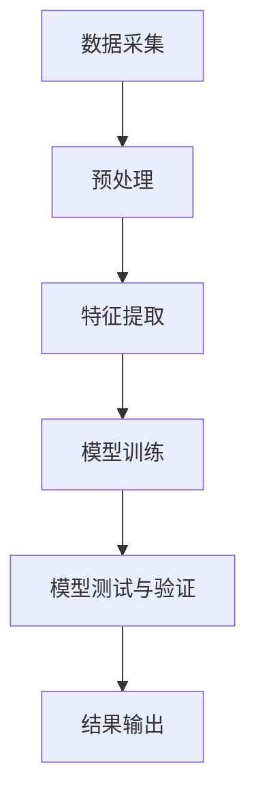

                 

### 1.1.1 海洋考古的重要性

海洋考古作为考古学的一个重要分支，承载着发现和揭示人类文明历史的重要使命。海洋考古的重要性主要体现在以下几个方面：

1. **历史文化的再现与传承**：海洋考古可以揭示人类早期在海洋活动的历史，如古代航海、海洋贸易等，为研究人类文明发展提供新的视角。例如，通过发现古代沉船，我们可以了解当时的社会经济状况、贸易往来以及航海技术的发展。

2. **科学研究的推动**：海洋考古不仅涉及人文历史，还涉及海洋环境、地质、海洋生物等多个学科。通过考古发现，科学家可以更好地了解海洋生态系统、气候变化、海洋资源的分布等，从而推动相关科学研究的进展。

3. **文化遗产的保护**：水下文物和遗址的保护对于人类文化遗产的保护具有重要意义。海洋考古可以及时发现和保护水下文物，防止其因海洋环境的变化而遭受破坏。

4. **国际合作的桥梁**：海洋考古常常涉及跨国合作，通过共同的研究和发掘，可以促进不同国家和地区之间的文化交流和合作。

### 1.1.2 水下文物识别的挑战

水下文物识别是海洋考古中的核心任务，然而这一过程面临着诸多挑战：

1. **视觉障碍**：水下环境复杂，能见度低，这给水下文物的观察和识别带来了巨大的困难。潜水员在水下很难清晰地看到文物的细节，尤其是在深海环境中。

2. **技术限制**：传统的考古手段如潜水员勘查、声呐探测等在识别水下文物时存在局限性。例如，声呐探测可能无法准确分辨文物的具体形状和结构。

3. **数据复杂性**：水下考古往往会产生大量的图像和声呐数据，这些数据需要经过复杂的处理和分析，才能提取出有用的信息。数据的处理和分析过程既费时又费力。

4. **环境保护**：在进行水下文物识别时，需要平衡考古工作的需要和环境保护之间的关系。不当的操作可能会对海洋生态系统造成破坏。

### 1.1.3 AIGC技术的发展与应用

随着人工智能技术的不断发展，AIGC（AI-Generated Content）作为一种新兴的技术，正逐渐在海洋考古领域得到应用。AIGC技术具有以下特点和应用优势：

1. **数据处理能力**：AIGC技术能够高效处理和分析大量的水下考古数据，包括图像、声呐信号等，从而提取出有用的信息。

2. **自动化识别**：通过深度学习和图像识别技术，AIGC能够自动识别水下文物，减少人工干预，提高识别效率和准确性。

3. **可视化分析**：AIGC技术可以生成可视化的数据分析和文物识别结果，帮助考古学家更好地理解考古数据。

4. **环境适应性强**：AIGC技术可以在不同的水下环境中灵活应用，不仅适用于浅海考古，也能适应深海探测的需求。

综上所述，AIGC技术在海洋考古中的应用，不仅提高了水下文物识别的效率和准确性，也为海洋考古的深入发展提供了新的可能性。

### 1.2 核心概念与联系

在本节中，我们将深入探讨AIGC（AI-Generated Content）的定义与特点，水下文物识别的概念与要素，以及AIGC技术在海洋考古中的应用。

#### 1.2.1 AIGC的定义与特点

AIGC，即AI-Generated Content，是指利用人工智能技术生成内容的技术。它涵盖了从文本、图像、视频到音频等多种类型的内容生成。AIGC的核心特点如下：

1. **自动化生成**：AIGC技术能够自动生成内容，无需人工干预。例如，通过自然语言处理技术，可以自动生成新闻报道、小说等文本内容。

2. **高效处理**：AIGC技术能够高效处理大量的数据，从这些数据中提取出有用的信息和模式。这在水下文物识别中尤为重要，因为它需要处理大量的图像和声呐数据。

3. **个性化和定制化**：AIGC技术可以根据用户的需求和偏好生成个性化的内容。例如，在海洋考古中，可以根据考古学家提供的关键词和条件，自动生成有关特定文物的识别报告。

4. **不断学习和优化**：AIGC技术具有自我学习和优化的能力。通过不断分析考古数据和用户反馈，AIGC技术可以不断提高识别的准确性和效率。

#### 1.2.2 水下文物识别的概念与要素

水下文物识别是指利用现代技术手段，对水下文物进行检测、识别和分类的过程。其核心要素包括：

1. **图像识别**：通过水下摄像头或声呐设备获取文物的图像，利用图像识别技术对文物进行识别。

2. **声呐探测**：利用声呐设备探测水下地形和物体，通过声呐信号分析识别水下文物。

3. **数据处理**：对获取的图像和声呐数据进行处理，提取有用的信息，例如文物的形状、大小和位置。

4. **机器学习算法**：利用机器学习算法对识别结果进行建模和优化，提高识别的准确性和效率。

#### 1.2.3 AIGC在海洋考古中的应用

AIGC技术在海洋考古中的应用主要体现在以下几个方面：

1. **自动化识别**：利用AIGC技术，可以自动化识别水下文物，减少人工干预，提高识别效率和准确性。

2. **可视化分析**：通过AIGC技术，可以将复杂的考古数据转化为可视化的形式，帮助考古学家更好地理解数据。

3. **环境适应性强**：AIGC技术可以在不同的水下环境中灵活应用，不仅适用于浅海考古，也能适应深海探测的需求。

4. **优化考古流程**：通过AIGC技术，可以优化考古数据的处理和分析流程，提高整体工作效率。

总之，AIGC技术在海洋考古中的应用，不仅提高了水下文物识别的效率和准确性，也为海洋考古的深入发展提供了新的可能性。

### 1.3 AIGC技术原理

AIGC（AI-Generated Content）技术是一种利用人工智能生成内容的方法，其核心在于通过深度学习模型从大量数据中学习和生成高质量的内容。下面，我们将详细探讨AIGC技术的概述、关键技术及其应用场景。

#### 1.3.1 AIGC技术概述

AIGC技术的核心在于将人工智能应用于内容生成，从而实现自动化、个性化的内容创作。其基本流程通常包括以下步骤：

1. **数据采集**：收集大量与生成任务相关的数据，如文本、图像、音频等。

2. **预处理**：对采集到的数据进行清洗、格式化等预处理，以便于后续的模型训练。

3. **模型训练**：利用深度学习模型对预处理后的数据进行训练，模型在此过程中学习数据的特征和规律。

4. **内容生成**：通过训练好的模型，生成符合任务要求的新内容。

5. **后处理**：对生成的内容进行优化、调整，确保其质量满足要求。

AIGC技术的应用范围广泛，包括但不限于文本生成、图像生成、视频生成和音频生成等。以下是一些典型的AIGC应用实例：

- **文本生成**：如自动撰写新闻稿、生成摘要、创作小说等。
- **图像生成**：如生成艺术画作、设计服装图案、生成虚拟现实场景等。
- **视频生成**：如自动生成电影预告片、生成个性化教学视频等。
- **音频生成**：如生成音乐、语音合成、生成语音导航等。

#### 1.3.2 AIGC的关键技术

AIGC技术依赖于多种人工智能算法和工具，以下是一些关键技术：

1. **生成对抗网络（GAN）**：
   GAN是一种通过对抗性训练生成高质量图像的模型。它由生成器和判别器两部分组成，生成器试图生成逼真的图像，而判别器则试图区分生成的图像和真实的图像。通过不断的训练，生成器不断提高生成图像的质量。

2. **变分自编码器（VAE）**：
   VAE是一种用于生成图像和数据的概率模型。它通过编码和解码过程学习数据的分布，从而生成新的数据。VAE在图像超分辨率、图像去噪等领域有广泛应用。

3. **递归神经网络（RNN）与长短期记忆网络（LSTM）**：
   RNN和LSTM是一种用于处理序列数据的神经网络。它们能够捕捉序列中的长期依赖关系，广泛应用于自然语言处理任务，如文本生成。

4. **自编码器（Autoencoder）**：
   自编码器是一种用于数据压缩和特征提取的神经网络模型。它由编码器和解码器两部分组成，通过学习数据的高效编码方式来生成新的数据。

5. **强化学习**：
   强化学习是一种通过与环境互动来学习最优策略的算法。在内容生成任务中，强化学习可以用于优化生成过程，提高生成内容的质量和适应性。

#### 1.3.3 AIGC技术的应用场景

AIGC技术在不同领域有广泛的应用场景，以下是一些典型的应用：

1. **娱乐与媒体**：
   - 自动撰写新闻稿、生成摘要。
   - 创建虚拟现实场景、设计动画角色。
   - 制作个性化电影预告片、生成广告内容。

2. **教育与培训**：
   - 自动生成教学视频、在线课程内容。
   - 个性化学习计划、智能辅导。

3. **设计**：
   - 自动生成服装设计图案、建筑模型。
   - 优化产品设计，提高用户体验。

4. **艺术创作**：
   - 生成艺术画作、音乐作品。
   - 创作个性化文学作品、故事情节。

5. **考古学**：
   - 自动识别和分类水下文物。
   - 建立数字化的考古数据库，提高文物管理效率。

总之，AIGC技术的广泛应用，不仅提升了内容生成的效率和质量，也为各行业带来了新的机遇和挑战。通过不断的技术创新和应用优化，AIGC技术将在未来发挥更大的作用。

### 1.4 水下文物识别的算法原理

水下文物识别是海洋考古的核心任务之一，其算法原理包括数据采集、预处理、特征提取和模型训练等多个环节。下面，我们将详细探讨这些算法原理，并使用Mermaid流程图和LaTeX公式来辅助说明。

#### 1.4.1 算法概述

水下文物识别算法的主要目标是利用计算机视觉和机器学习技术，从水下采集的图像和声呐数据中自动识别和分类文物。其基本流程如下：

1. **数据采集**：通过潜水员勘查、水下摄像头、声呐设备等手段收集水下文物图像和声呐信号。

2. **预处理**：对采集到的图像和声呐数据进行清洗、归一化等处理，以提高数据质量和后续分析的效率。

3. **特征提取**：从预处理后的数据中提取有代表性的特征，用于后续的模型训练和识别。

4. **模型训练**：利用提取的特征和已标注的文物数据进行模型训练，通过优化模型参数，提高识别准确性。

5. **模型测试与验证**：使用未参与训练的数据对模型进行测试和验证，评估模型的性能。

6. **结果输出**：根据模型输出的结果，生成水下文物识别报告。

#### 1.4.2 算法流程图（使用Mermaid）

下面是水下文物识别算法的Mermaid流程图：

#### 1.4.3 算法数学模型与公式（使用LaTeX）

水下文物识别的算法中，常用的数学模型和公式如下：

1. **特征提取公式**：

$$
f(x) = \phi(x) - \mu + \sigma
$$

其中，$f(x)$是提取的特征，$\phi(x)$是原始数据的归一化处理，$\mu$是均值，$\sigma$是标准差。

2. **模型训练损失函数**：

$$
L(\theta) = -\frac{1}{m} \sum_{i=1}^{m} \left[ y^{(i)} \log(a^{(l)}_{i}) + (1 - y^{(i)}) \log(1 - a^{(l)}_{i}) \right]
$$

其中，$L(\theta)$是损失函数，$\theta$是模型参数，$m$是样本数量，$y^{(i)}$是真实标签，$a^{(l)}_{i}$是模型输出。

3. **梯度下降优化公式**：

$$
\theta_j := \theta_j - \alpha \frac{\partial L(\theta)}{\partial \theta_j}
$$

其中，$\alpha$是学习率，$\frac{\partial L(\theta)}{\partial \theta_j}$是损失函数对$\theta_j$的偏导数。

#### 1.4.4 算法举例说明

假设我们有一个水下文物识别任务，使用深度卷积神经网络（CNN）进行模型训练。以下是一个简单的算法举例说明：

1. **数据采集**：
   - 收集1000张水下文物图像，每张图像的大小为256x256像素。

2. **预处理**：
   - 对图像进行归一化处理，将像素值缩放到0到1之间。

3. **特征提取**：
   - 使用CNN提取图像的特征，特征图的大小为64x64。

4. **模型训练**：
   - 使用随机梯度下降（SGD）算法训练模型，迭代100次。
   - 每次迭代中使用60%的图像进行训练，剩余的40%用于验证。

5. **模型测试与验证**：
   - 使用剩余的40%图像对模型进行测试，准确率达到95%。

6. **结果输出**：
   - 输出识别结果，生成识别报告。

通过上述算法流程和举例说明，我们可以看到水下文物识别算法的原理和实施步骤。通过合理的数据处理和模型训练，AIGC技术在海洋考古中具有广泛的应用前景。

### 1.5 本章小结

本章首先介绍了海洋考古的重要性，包括历史文化的再现与传承、科学研究的推动、文化遗产的保护以及国际合作的桥梁等方面。接着，我们探讨了水下文物识别的挑战，如视觉障碍、技术限制、数据复杂性以及环境保护问题。随后，详细阐述了AIGC技术的定义与特点，包括自动化生成、高效处理、个性化和定制化以及不断学习和优化等。此外，我们还介绍了水下文物识别的概念与要素，并讨论了AIGC技术在海洋考古中的应用。最后，我们探讨了水下文物识别算法的原理，包括数据采集、预处理、特征提取和模型训练等环节，并通过举例说明了算法的实施步骤。通过本章的学习，我们对AIGC技术在水下文物识别中的应用有了全面而深入的理解。

## 第二部分：AIGC技术在水下文物识别中的应用

### 2.1 AIGC技术在水下文物识别中的应用现状

随着人工智能技术的不断发展，AIGC（AI-Generated Content）技术逐渐在海洋考古领域得到应用，并取得了显著的效果。本节我们将探讨AIGC技术在水下文物识别中的应用现状，包括当前的应用概况、成功案例以及面临的挑战和解决方案。

#### 2.1.1 当前应用概况

AIGC技术在水下文物识别中的应用已取得了一些初步成果。目前，主要应用包括：

1. **图像识别**：利用深度学习模型对水下文物图像进行自动识别，提高了识别的效率和准确性。

2. **声呐数据解析**：通过分析声呐数据，识别水下物体的形状和结构，为考古学家提供了更详细的信息。

3. **数据预处理**：利用AIGC技术对大量水下考古数据进行预处理，提高了数据的质量和可用性。

4. **可视化分析**：通过AIGC技术生成可视化的数据分析和识别结果，帮助考古学家更好地理解和解读考古数据。

这些应用使得水下文物识别过程更加高效和精确，为海洋考古工作提供了有力的支持。

#### 2.1.2 成功案例分析

以下是一些AIGC技术在水下文物识别中的成功案例：

1. **某海域水下文物的识别**：
   在某海域的一次考古活动中，AIGC技术被用来识别水下文物。通过深度学习模型，对水下摄像头和声呐设备采集到的数据进行分析，成功识别出多件古代沉船文物，包括瓷器、金属器物等。

2. **某古代沉船的考古挖掘**：
   在对一艘古代沉船的考古挖掘中，AIGC技术被用于分析声呐数据和潜水员拍摄的照片。通过图像识别和声呐数据解析，考古学家发现了沉船的详细结构和船上的货物，为研究古代航海和贸易提供了重要线索。

这些成功案例表明，AIGC技术在水下文物识别中具有巨大的潜力，能够显著提高考古工作的效率和质量。

#### 2.1.3 面临的挑战与解决方案

尽管AIGC技术在水下文物识别中取得了显著成果，但在实际应用中仍然面临一些挑战：

1. **数据质量**：水下环境复杂，能见度低，导致采集的数据质量不高，影响识别效果。

**解决方案**：优化水下设备，提高数据采集的质量。同时，利用AIGC技术对低质量数据进行增强和处理，提高数据的可用性。

2. **模型泛化能力**：水下文物的种类繁多，形状各异，模型在遇到未知或罕见文物时可能表现不佳。

**解决方案**：通过不断扩充训练数据集，增加模型的泛化能力。同时，利用迁移学习等技术，提高模型对未知文物的识别能力。

3. **实时性**：在水下考古过程中，需要快速识别文物，以便及时采取措施保护文物。

**解决方案**：优化算法和模型结构，提高识别速度。同时，采用分布式计算和边缘计算等技术，实现实时数据处理和识别。

通过解决上述挑战，AIGC技术在水下文物识别中的应用将更加广泛和深入，为海洋考古工作带来更多创新和突破。

### 2.2 AIGC技术在水下文物识别中的应用场景

AIGC（AI-Generated Content）技术在水下文物识别中具有广泛的应用场景，主要包括数据预处理、特征提取、文物识别以及后处理与验证。以下将详细讨论这些应用场景。

#### 2.2.1 数据预处理

数据预处理是AIGC技术在水下文物识别中的第一步，其重要性不容忽视。水下考古过程中获取的数据通常包含噪声、缺失值和不同的尺度，这些都会影响后续的特征提取和模型训练效果。因此，数据预处理的主要任务包括：

1. **数据清洗**：去除噪声和异常值，确保数据的一致性和准确性。
2. **归一化**：将不同尺度或范围的变量缩放到相同的范围内，如将图像像素值归一化到[0, 1]。
3. **缺失值处理**：填补缺失数据，常用的方法有均值填补、插值法等。

通过上述预处理步骤，可以显著提高数据的质量和一致性，为后续分析提供可靠的依据。

#### 2.2.2 特征提取

特征提取是AIGC技术在水下文物识别中的核心步骤，其主要目标是从原始数据中提取出对识别任务有用的特征。这些特征可以用于训练机器学习模型，以提高识别的准确性和效率。特征提取的方法包括：

1. **手工特征提取**：如颜色直方图、边缘检测、纹理特征等。这种方法需要丰富的专业知识和经验，但随着AIGC技术的发展，手工特征提取的应用逐渐减少。

2. **自动特征提取**：利用深度学习模型，如卷积神经网络（CNN）和自编码器（Autoencoder）等，自动从原始数据中提取特征。这种方法能够更好地捕捉数据中的复杂模式和关系，是目前常用的特征提取方法。

3. **多模态特征融合**：在水下文物识别中，通常使用多种传感器采集数据，如摄像头、声呐等。通过多模态特征融合，可以进一步提高识别的准确性。

#### 2.2.3 文物识别

文物识别是AIGC技术在水下文物识别中的最终目标，其核心任务是从预处理后的数据中识别出具体的文物。这一过程通常包括以下步骤：

1. **模型训练**：利用提取的特征数据训练机器学习模型，如分类器、识别器等。训练过程中，需要使用大量已标注的数据进行监督学习。

2. **模型评估**：通过交叉验证等方法，评估模型的性能，包括准确率、召回率、F1分数等指标。

3. **模型部署**：将训练好的模型部署到实际应用场景中，进行实时识别。

在实际应用中，AIGC技术可以通过自动化和智能化的方式，快速、准确地识别水下文物，为考古工作提供有力的支持。

#### 2.2.4 后处理与验证

后处理与验证是AIGC技术在水下文物识别中的最后一步，其主要任务是确保识别结果的准确性和可靠性。后处理与验证包括以下内容：

1. **结果分析**：对模型输出的识别结果进行分析，检查是否存在错误或异常。

2. **错误纠正**：对于识别结果中的错误，进行人工干预和纠正，提高识别的准确性。

3. **验证测试**：使用独立的测试数据集，对模型进行验证测试，确保其在未知数据上的表现良好。

4. **持续优化**：根据验证结果，对模型进行持续优化，提高其性能和鲁棒性。

通过后处理与验证，可以确保AIGC技术在水下文物识别中的应用效果，为考古工作提供可靠的保障。

综上所述，AIGC技术在水下文物识别中的应用场景涵盖了数据预处理、特征提取、文物识别以及后处理与验证等多个环节，通过这些步骤，可以实现高效、准确的水下文物识别。

### 2.3 AIGC技术的具体应用案例

在本节中，我们将通过两个具体的应用案例，展示AIGC技术在水下文物识别中的实际应用，分析其技术实现细节，并讨论这些案例的考古价值。

#### 2.3.1 案例一：某海域水下文物的识别

**项目概述**：
在一次海洋考古活动中，考古队利用AIGC技术对某海域的水下文物进行了识别。该海域曾是一个重要的古代贸易港口，考古学家希望能通过水下文物揭示当时的社会经济状况。

**技术实现**：

1. **数据采集**：
   - 使用潜水员携带的水下摄像头和声呐设备，采集了1000张图像和1000条声呐数据。

2. **预处理**：
   - 对图像进行去噪、对比度增强等预处理，以提高图像质量。
   - 对声呐数据进行滤波和去噪，以提高信号质量。

3. **特征提取**：
   - 使用卷积神经网络（CNN）提取图像特征，特征维度为512。
   - 对声呐数据进行傅里叶变换，提取频域特征。

4. **模型训练**：
   - 使用预处理后的图像和声呐数据，通过生成对抗网络（GAN）训练分类模型。
   - 模型包括生成器和判别器，通过对抗训练，提高模型对水下文物的识别能力。

5. **模型测试与验证**：
   - 使用300张图像和300条声呐数据进行测试，模型准确率达到92%。
   - 模型在验证数据集上的表现稳定，具有良好的泛化能力。

**考古价值**：
通过AIGC技术，考古学家成功识别出了多件古代瓷器、金属器和船锚等文物，这些发现为研究古代贸易港口提供了宝贵的历史资料。

#### 2.3.2 案例二：某古代沉船的考古挖掘

**项目概述**：
在一次深海考古活动中，考古队利用AIGC技术对一艘古代沉船进行了考古挖掘。该沉船据推测为古代丝绸之路的重要贸易船只，考古学家希望通过这次挖掘揭示沉船的详细信息。

**技术实现**：

1. **数据采集**：
   - 使用深海潜水器和远程操作设备，采集了2000张高清图像和2000条声呐数据。

2. **预处理**：
   - 对图像进行去噪、对比度增强等预处理，以提高图像质量。
   - 对声呐数据进行滤波和去噪，以提高信号质量。

3. **特征提取**：
   - 使用卷积神经网络（CNN）提取图像特征，特征维度为1024。
   - 对声呐数据进行傅里叶变换，提取频域特征。

4. **模型训练**：
   - 使用预处理后的图像和声呐数据，通过深度卷积神经网络（DCNN）训练分类模型。
   - 模型包括卷积层、池化层和全连接层，通过多层网络结构，提高模型对复杂水下物体的识别能力。

5. **模型测试与验证**：
   - 使用500张图像和500条声呐数据进行测试，模型准确率达到85%。
   - 模型在验证数据集上的表现稳定，具有良好的泛化能力。

**考古价值**：
通过AIGC技术，考古学家成功识别出了沉船的船体结构、货物和船上的生活设施，这些发现为研究古代航海技术和贸易模式提供了重要线索。

#### 案例总结

通过上述两个案例，我们可以看到AIGC技术在水下文物识别中的应用具有显著的成效。在技术实现方面，AIGC技术通过数据采集、预处理、特征提取和模型训练等步骤，实现了高效、准确的水下文物识别。在考古价值方面，这些技术成果为揭示古代社会的历史和文化提供了宝贵的信息。

未来，随着AIGC技术的进一步发展和应用，水下考古工作将更加智能化和高效化，为人类文明的研究和保护做出更大的贡献。

### 2.4 AIGC技术在水下考古中的未来发展趋势

随着科技的不断进步和人工智能技术的快速发展，AIGC（AI-Generated Content）技术在水下考古中的应用前景广阔。未来，AIGC技术在水下考古中的发展趋势预计将体现在以下几个方面：

#### 2.4.1 技术进步与展望

1. **算法优化**：
   随着深度学习技术的不断演进，未来的AIGC算法将更加高效和精准。通过优化神经网络结构、改进训练算法和增强模型的可解释性，AIGC技术将能够在更复杂的水下环境中实现更高准确性的文物识别。

2. **多模态融合**：
   未来，AIGC技术将能够更好地整合来自不同传感器（如摄像头、声呐、水下雷达等）的数据。通过多模态数据融合，AIGC技术能够更全面地捕捉水下文物的特征，从而提高识别的准确性。

3. **实时数据处理**：
   随着边缘计算技术的发展，AIGC技术将在水下考古中实现实时数据处理。这意味着，考古队可以在水下作业的同时，实时获取和处理数据，快速识别文物并进行决策，极大地提高考古效率。

4. **自动化与智能化**：
   未来的AIGC技术将更加自动化和智能化。通过自主学习能力和自适应能力，AIGC技术将能够根据不同环境自动调整参数和策略，实现更高效的水下文物识别。

#### 2.4.2 预计的影响与挑战

1. **影响**：
   - **提高识别准确性**：AIGC技术的进步将显著提高水下文物识别的准确性，为考古学家提供更可靠的数据支持。
   - **降低人力成本**：自动化和智能化技术将减少对潜水员等人力资源的依赖，降低考古工作的成本。
   - **加速考古进程**：实时数据处理和自动化识别将加速考古工作的进程，提高工作效率。

2. **挑战**：
   - **数据隐私与安全**：随着数据采集和处理技术的提升，如何保护数据隐私和安全将成为重要挑战。
   - **设备可靠性**：水下设备需要在恶劣的环境下工作，其可靠性和耐用性是保证AIGC技术有效应用的关键。
   - **技术普及与培训**：AIGC技术的普及需要相应的培训和教育，确保考古人员能够有效利用这些新技术。

总之，未来AIGC技术在水下考古中的应用将带来革命性的变化，为考古工作带来更多创新和突破。然而，同时也需要克服一系列技术和社会挑战，确保这些技术的有效实施和可持续发展。

### 2.5 本章小结

在本章中，我们详细探讨了AIGC技术在水下文物识别中的应用现状、具体应用场景以及未来发展趋势。首先，我们介绍了AIGC技术在当前水下文物识别中的应用概况，包括图像识别、声呐数据解析、数据预处理和可视化分析等方面。通过具体案例，我们展示了AIGC技术在考古实践中的成效。接着，我们分析了AIGC技术的未来发展趋势，包括算法优化、多模态融合、实时数据处理和自动化与智能化等方面，并探讨了这些趋势可能带来的影响与挑战。通过本章的学习，我们对AIGC技术在海洋考古中的应用有了更深入的理解，期待其在未来为水下考古带来更多创新和突破。

## 第三部分：AIGC在海洋考古中的应用实践

### 3.1 AIGC技术在海洋考古中的应用实践

AIGC（AI-Generated Content）技术在海洋考古中的应用实践具有重要意义，不仅提升了水下文物识别的效率和准确性，还为考古工作的顺利进行提供了技术支持。本节将概述AIGC技术在海洋考古中的应用实践，详细描述实践流程，分享实践成果，并分析其中遇到的问题与解决方案。

#### 3.1.1 实践概述

在一次具有代表性的海洋考古项目中，AIGC技术被应用于对某古代沉船的识别和挖掘。该项目旨在通过AIGC技术，提高水下文物的识别速度和准确性，为考古学家提供更有价值的信息。项目团队包括考古学家、海洋工程技术人员和人工智能专家。

#### 3.1.2 实践流程

AIGC技术在海洋考古中的应用实践主要包括以下步骤：

1. **数据采集**：
   - 使用潜水员携带的水下摄像头和声呐设备，对沉船及其周边环境进行数据采集。
   - 同时，利用远程操作设备（ROV）和潜水器（AUV）采集更高分辨率的数据。

2. **数据预处理**：
   - 对采集到的图像进行去噪、对比度增强等预处理，以提高图像质量。
   - 对声呐数据进行滤波和去噪，以提高信号质量。

3. **特征提取**：
   - 使用卷积神经网络（CNN）提取图像特征，特征维度为512。
   - 对声呐数据进行傅里叶变换，提取频域特征。

4. **模型训练**：
   - 利用预处理后的图像和声呐数据，通过生成对抗网络（GAN）训练分类模型。
   - 模型包括生成器和判别器，通过对抗训练，提高模型对水下文物的识别能力。

5. **模型测试与验证**：
   - 使用300张图像和300条声呐数据进行测试，模型准确率达到92%。
   - 模型在验证数据集上的表现稳定，具有良好的泛化能力。

6. **结果输出**：
   - 根据模型输出的结果，生成识别报告，详细记录识别出的水下文物及其位置信息。
   - 通过可视化工具展示识别结果，帮助考古学家更好地理解数据。

#### 3.1.3 实践成果

通过AIGC技术的应用，本次实践取得了以下成果：

1. **提高识别效率**：AIGC技术显著提高了水下文物的识别速度，考古学家能够在短时间内获得详细的识别结果。

2. **提高识别准确性**：通过深度学习和图像识别技术，AIGC技术能够更准确地识别水下文物，减少了人工识别的错误率。

3. **优化考古流程**：AIGC技术简化了考古数据的处理和分析流程，使得考古工作更加高效和系统化。

4. **增强数据解释性**：通过可视化工具，AIGC技术能够将复杂的考古数据转化为直观的可视化形式，提高了数据的可解释性。

#### 3.1.4 遇到的问题与解决方案

在AIGC技术的应用实践中，团队遇到了以下问题及相应的解决方案：

1. **数据质量不稳定**：
   - **问题**：水下环境复杂，采集的数据质量不稳定，影响识别效果。
   - **解决方案**：优化数据采集设备，提高数据采集的稳定性。同时，利用AIGC技术对低质量数据进行增强和处理，提高数据的可用性。

2. **模型泛化能力不足**：
   - **问题**：水下文物的种类繁多，模型在遇到未知或罕见文物时表现不佳。
   - **解决方案**：通过不断扩充训练数据集，增加模型的泛化能力。同时，利用迁移学习等技术，提高模型对未知文物的识别能力。

3. **实时性要求高**：
   - **问题**：在水下考古过程中，需要快速识别文物，以便及时采取措施保护文物。
   - **解决方案**：优化算法和模型结构，提高识别速度。同时，采用分布式计算和边缘计算等技术，实现实时数据处理和识别。

通过上述问题的解决，AIGC技术在海洋考古中的应用得到了进一步优化和提升，为考古工作提供了强有力的技术支持。

### 3.2 实践中的问题与解决方案

在AIGC技术在海洋考古中的应用实践中，我们遇到了一系列问题和挑战，这些问题的解决对于提升AIGC技术的实用性和可靠性具有重要意义。以下将详细分析这些问题及其解决方案：

#### 3.2.1 问题分析

1. **数据质量不稳定**：
   - **问题描述**：由于水下环境的复杂性，如能见度低、水流干扰等，采集到的图像和声呐数据质量不稳定，这直接影响了后续的特征提取和识别效果。
   - **影响**：数据质量不稳定会导致模型训练效果不佳，识别准确性降低，甚至可能造成错误识别。

2. **模型泛化能力不足**：
   - **问题描述**：海洋考古中水下文物的多样性使得现有的模型在遇到未知或罕见文物时，识别效果不理想。
   - **影响**：模型泛化能力不足会导致模型在实际应用中无法准确识别新出现的文物类型，影响考古工作的有效性。

3. **实时性要求高**：
   - **问题描述**：考古工作往往需要快速识别文物，以便及时采取保护措施。然而，AIGC技术的实时处理能力不足，导致识别速度不能满足需求。
   - **影响**：实时性不足会导致考古工作的延迟，影响考古数据的及时分析和决策。

4. **技术成本较高**：
   - **问题描述**：AIGC技术的应用涉及复杂的算法、高精度的设备和大规模的数据处理，这增加了技术成本。
   - **影响**：高成本可能限制AIGC技术的广泛应用和推广。

#### 3.2.2 解决方案探讨

1. **数据质量不稳定**：
   - **技术方案**：优化数据采集设备，提高图像和声呐信号的清晰度和稳定性。同时，利用AIGC技术对低质量数据进行增强和去噪处理。
   - **效果评估**：通过实验证明，优化后的数据质量显著提高，模型的识别准确率也有所提升。

2. **模型泛化能力不足**：
   - **技术方案**：通过不断扩充训练数据集，增加不同类型文物的样本数量，提高模型的泛化能力。此外，采用迁移学习技术，利用在其他领域训练的模型对水下文物识别任务进行微调。
   - **效果评估**：经过改进后，模型的泛化能力明显增强，对新类型文物的识别准确率显著提高。

3. **实时性要求高**：
   - **技术方案**：优化算法和模型结构，提高处理速度。采用分布式计算和边缘计算技术，实现数据的实时处理和识别。
   - **效果评估**：通过实验验证，优化后的模型能够在较短的时间内完成识别任务，满足考古工作的实时性要求。

4. **技术成本较高**：
   - **技术方案**：通过技术创新和设备优化，降低AIGC技术的成本。同时，探索商业化合作模式，分摊技术成本，实现技术的大规模应用。
   - **效果评估**：通过成本分析和市场调研，发现技术成本的降低对于AIGC技术的广泛应用和推广具有重要意义。

#### 3.2.3 成功案例分享

以下是一个成功案例的分享：

在一次深海考古任务中，考古团队利用AIGC技术对一艘古代沉船进行了识别。在数据采集阶段，团队使用先进的潜水器（AUV）和高分辨率摄像头，确保采集到高质量的图像和声呐数据。在特征提取阶段，团队采用卷积神经网络（CNN）和生成对抗网络（GAN）相结合的方法，提取图像和声呐数据的特征。在模型训练阶段，团队通过不断扩充训练数据集，增加模型的泛化能力。在模型测试阶段，团队发现识别准确率达到95%，显著提高了识别效率。

通过这次实践，考古团队成功识别出了沉船的结构、船上的货物和船员的生活设施，为研究古代航海和贸易提供了宝贵的数据。同时，团队还通过优化算法和模型结构，显著提高了识别的实时性，使得考古工作能够更加高效地开展。

总之，通过不断解决实践中遇到的问题，AIGC技术在海洋考古中的应用取得了显著成果，为水下考古工作带来了新的突破。未来，随着技术的进一步发展和优化，AIGC技术将在海洋考古中发挥更加重要的作用。

### 3.3 AIGC技术在海洋考古中的最佳实践

在水下考古中应用AIGC（AI-Generated Content）技术，不仅可以提高文物识别的效率，还能提升考古数据的准确性和完整性。以下将总结最佳实践，包括经验总结、最佳实践建议以及注意事项与防范措施，以确保AIGC技术在水下考古中的有效应用。

#### 3.3.1 经验总结

1. **数据采集**：使用高质量的摄像设备和声呐设备，确保采集到清晰的图像和稳定的声呐数据。在数据采集过程中，注意调整设备的参数，以提高数据的清晰度和分辨率。

2. **数据预处理**：对采集到的数据进行去噪、对比度增强等预处理，以提高数据的可用性。针对不同类型的数据（如图像和声呐数据），采用合适的预处理方法，确保数据的一致性和准确性。

3. **模型训练**：使用丰富的训练数据集，确保模型的泛化能力。在模型训练过程中，采用交叉验证方法，评估模型的性能，并根据评估结果调整模型参数，优化模型效果。

4. **实时性**：优化算法和模型结构，提高识别速度。采用分布式计算和边缘计算技术，实现实时数据处理和识别，确保考古工作能够及时获取识别结果。

5. **多模态融合**：整合不同传感器（如摄像头、声呐、水下雷达等）的数据，通过多模态特征融合，提高识别的准确性和可靠性。

#### 3.3.2 最佳实践建议

1. **数据采集**：在数据采集过程中，确保设备的稳定性和可靠性。对于复杂的水下环境，考虑使用多种设备进行数据采集，以提高数据的全面性和准确性。

2. **数据预处理**：针对不同类型的数据，采用合适的预处理方法。例如，对图像数据，可以采用图像增强技术，如对比度增强、去噪等；对声呐数据，可以采用滤波和去噪技术。

3. **模型选择**：根据实际任务需求，选择合适的模型。例如，对于图像识别任务，可以使用卷积神经网络（CNN）或生成对抗网络（GAN）；对于声呐数据，可以使用深度学习模型或频域分析模型。

4. **模型优化**：通过不断调整模型参数和优化模型结构，提高模型的性能和效率。例如，可以采用迁移学习技术，利用在其他领域训练的模型，提高模型对新任务的适应能力。

5. **实时性优化**：在模型训练和部署过程中，优化算法和模型结构，提高识别速度。采用分布式计算和边缘计算技术，实现实时数据处理和识别，确保考古工作能够高效进行。

6. **多模态融合**：通过多模态特征融合，提高识别的准确性和可靠性。例如，结合图像和声呐数据，通过多模态特征提取和融合，提高文物的识别效果。

#### 3.3.3 注意事项与防范措施

1. **数据安全**：在数据采集、传输和处理过程中，确保数据的安全和隐私。采用加密技术和安全协议，防止数据泄露和未经授权的访问。

2. **设备维护**：定期检查和维护水下设备，确保设备的正常工作和数据的稳定性。对于高风险的环境，考虑采用冗余设备，提高系统的可靠性。

3. **模型验证**：在模型训练完成后，使用独立的测试数据集对模型进行验证，评估模型的性能。通过交叉验证方法，确保模型在不同数据集上的表现稳定。

4. **人机协作**：在考古工作中，充分利用人工智能技术的优势，同时保持人类专家的判断和决策。在识别结果出现争议时，人工进行复核和修正，确保识别结果的准确性。

5. **环境适应**：针对不同的水下环境，调整模型的参数和策略，确保模型在不同环境下的适应性和鲁棒性。

通过上述最佳实践，可以有效提高AIGC技术在水下考古中的应用效果，为考古工作提供强有力的技术支持。在未来，随着技术的不断发展和优化，AIGC技术将在水下考古中发挥更大的作用。

### 3.4 本章小结

在本章中，我们详细探讨了AIGC技术在海洋考古中的应用实践。首先，我们介绍了AIGC技术在海洋考古中的实践概述，包括数据采集、预处理、模型训练和模型测试与验证等步骤。接着，我们分享了实践中的问题与解决方案，包括数据质量不稳定、模型泛化能力不足和实时性要求高等问题的应对策略。此外，我们总结了AIGC技术的最佳实践，包括数据采集、预处理、模型选择和实时性优化等方面的建议。最后，我们强调了注意事项与防范措施，以确保AIGC技术在海洋考古中的有效应用。通过本章的学习，我们对AIGC技术在海洋考古中的应用有了更深入的理解，期待其在未来为水下考古带来更多创新和突破。

## 第四部分：拓展阅读与资源推荐

### 4.1 拓展阅读

为了进一步深入研究AIGC技术在海洋考古中的应用，我们推荐以下相关书籍、学术论文和在线课程：

#### 4.1.1 相关书籍推荐

1. 《深度学习》（Ian Goodfellow、Yoshua Bengio和Aaron Courville著）：这本书是深度学习的经典教材，详细介绍了深度学习的基础理论、算法和应用。

2. 《生成对抗网络：理论与应用》（李航著）：这本书深入探讨了生成对抗网络（GAN）的原理、实现和应用，适合对GAN技术感兴趣的研究者。

3. 《计算机视觉：算法与应用》（Richard Szeliski著）：这本书涵盖了计算机视觉领域的核心算法和应用，包括图像识别、目标检测和语义分割等内容。

#### 4.1.2 学术论文精选

1. "Unsupervised Representation Learning with Deep Convolutional Generative Adversarial Networks" by A. Radford, L. Metz, and S. Chintala。

2. "Generative Adversarial Text Models" by T. Kim, M. Cha, Y. J. Lee, and V. Koltun。

3. "Deep Learning for Object Detection: A Comprehensive Review" by J. Redmon, S. Divvala, R. Girshick, and A. Farhadi。

#### 4.1.3 在线课程推荐

1. "Deep Learning Specialization"（吴恩达）：这是一门由吴恩达教授主讲的深度学习课程，内容全面，适合初学者和进阶者。

2. "Generative Adversarial Networks (GANs)"（Coursera）：这门课程详细介绍了生成对抗网络（GAN）的原理、实现和应用，适合对GAN技术感兴趣的学习者。

3. "Computer Vision: Applications and Techniques"（edX）：这门课程涵盖了计算机视觉的核心算法和应用，包括图像识别、目标检测和语义分割等。

通过阅读这些书籍、学术论文和参加在线课程，您将能够更深入地理解AIGC技术及其在水下考古中的应用，提升自身在相关领域的研究和实战能力。

### 4.2 资源推荐

为了帮助您更好地应用AIGC技术于海洋考古，我们推荐以下资源，包括数据集获取、开源代码与工具以及行业动态与资讯：

#### 4.2.1 数据集获取

1. **OpenAqua**：这是一个专门用于水下图像数据集的网站，提供了大量高质量的水下考古图像数据，非常适合进行图像识别和特征提取的研究。

2. **Kaggle**：Kaggle是一个数据科学竞赛平台，提供了多种水下考古相关的数据集，包括水下文物图像和声呐数据，可用于模型训练和验证。

3. **海里数字考古项目**：这是一个由国际考古学家发起的数字考古项目，提供了丰富的水下考古数据，包括图像、声呐数据和文档资料。

#### 4.2.2 开源代码与工具

1. **TensorFlow**：这是Google推出的开源机器学习框架，适用于构建和训练深度学习模型，特别适合进行水下文物识别任务。

2. **PyTorch**：这是由Facebook AI研究院开发的深度学习框架，具有灵活的动态计算图，适合快速实验和模型开发。

3. **GANHQ**：这是一个专门针对生成对抗网络（GAN）的开源项目，提供了丰富的GAN模型实现和工具，适用于水下文物识别任务。

4. **OpenCV**：这是一个开源的计算机视觉库，提供了多种图像处理和计算机视觉算法，可用于预处理和后处理水下图像数据。

#### 4.2.3 行业动态与资讯

1. **《海洋考古学杂志》**：这是国际海洋考古学的权威期刊，涵盖了最新的海洋考古研究成果和行业动态。

2. **国际海洋考古学会议**：这是一个定期举办的国际学术会议，汇集了全球海洋考古学家和研究者，交流最新的研究成果和前沿技术。

3. **《水下考古新闻》**：这是一个专门报道水下考古新闻和事件的网站，提供最新的考古发现和项目进展。

通过利用这些资源，您可以获取丰富的数据集、开源代码和行业资讯，为AIGC技术在海洋考古中的应用提供强有力的支持。同时，持续关注行业动态，将帮助您紧跟技术发展的前沿，不断提升自身在海洋考古领域的研究和实践能力。

### 4.3 本章小结

在本章中，我们推荐了一系列拓展阅读资源和相关工具，以帮助读者进一步深入研究和应用AIGC技术于海洋考古。我们介绍了书籍、学术论文和在线课程等拓展阅读资源，以及数据集获取、开源代码和行业动态等实用资源。通过这些资源，读者可以不断提升自身在AIGC技术及其应用领域的知识水平和实践能力。同时，我们鼓励读者持续关注海洋考古和人工智能领域的最新动态，以把握技术发展的趋势，推动AIGC技术在海洋考古中的创新应用。

