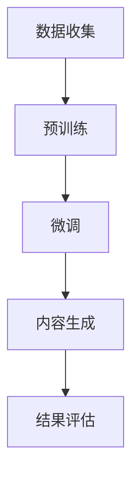
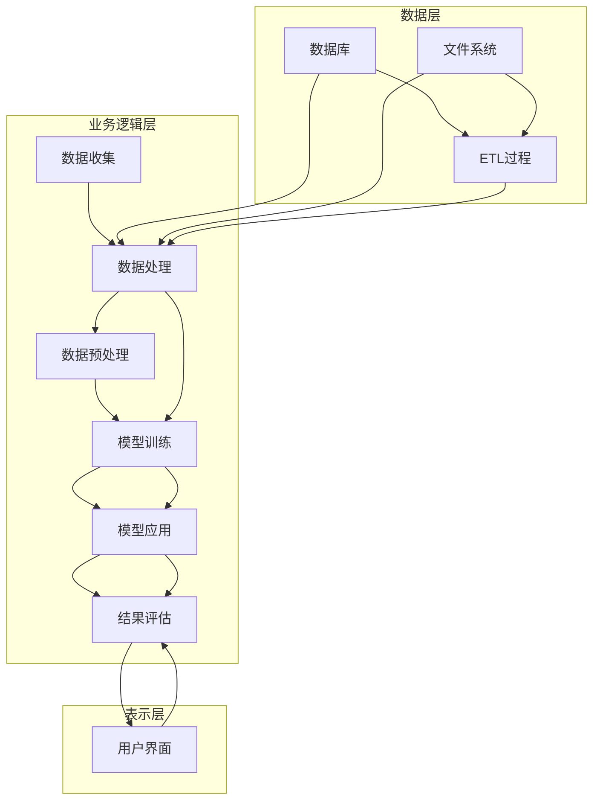
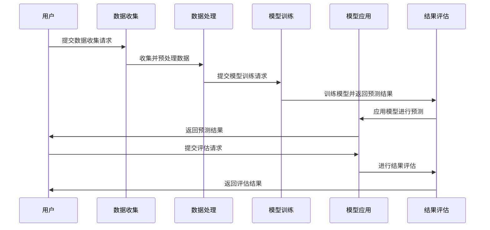

                 

### 海洋酸化与AIGC

#### **1.1 海洋酸化的背景**

海洋酸化是指由于大气中二氧化碳（CO₂）浓度增加，海洋吸收这些二氧化碳后导致其pH值下降的现象。这一过程不仅改变了海洋的化学性质，还对海洋生态系统产生了深远影响。二氧化碳主要通过海洋吸收和溶解进入水中，形成碳酸，随后分解成碳酸氢盐和氢离子（H⁺），导致海洋的pH值降低。海洋酸化的主要成因是化石燃料的燃烧和森林砍伐等人类活动，这些活动大幅增加了大气中的二氧化碳浓度。

**问题描述**

海洋酸化对海洋生物的影响是多方面的。首先，它直接影响了珊瑚礁的生存。珊瑚礁是由珊瑚虫和石灰石构成的生态系统，其生长和存活依赖于特定的pH条件。pH值的下降导致珊瑚礁的钙化过程受阻，从而引发大规模的珊瑚白化现象。此外，海洋酸化还对海洋生物的繁殖、生长和存活产生负面影响。例如，一些贝类和钙质生物在低pH环境下难以形成坚硬的壳或骨骼，这影响了它们的生存和繁殖能力。此外，海洋酸化还可能破坏海洋食物链，对整个生态系统产生连锁反应。

**解决方案**

当前应对海洋酸化的措施主要包括减少二氧化碳排放、增强碳汇能力以及保护海洋生态系统。减少二氧化碳排放主要通过能源转型和提升能源效率来实现。例如，推广可再生能源和减少化石燃料的使用。增强碳汇能力则涉及保护和恢复森林、湿地等自然碳汇。保护海洋生态系统包括建立海洋保护区、限制渔业捕捞和减少海洋污染等。这些措施虽然在一定程度上缓解了海洋酸化，但仍然需要更有效的技术和方法来应对这一全球性问题。

**边界与外延**

海洋酸化的研究范围主要涉及海洋化学、生态学和环境科学等领域。研究范围包括全球海洋的pH变化、特定海域的酸化程度以及酸化对海洋生物的影响。此外，海洋酸化还与其他环境问题如海洋酸化、气候变化、渔业和旅游业等密切相关。因此，海洋酸化的研究不仅局限于科学领域，还涉及到政策制定和社会经济活动。

**核心要素组成**

海洋酸化研究中的核心要素包括：
1. **pH值测量**：通过测量海洋pH值来评估酸化程度。
2. **二氧化碳浓度**：监测大气中二氧化碳浓度及其变化趋势。
3. **海洋生物影响**：研究酸化对海洋生物的生理和行为影响。
4. **生态模型构建**：利用生态模型预测酸化对生态系统的长期影响。
5. **碳循环研究**：探究海洋与大气之间的碳循环过程。

通过上述背景介绍，我们可以看出，海洋酸化是一个复杂且严重的全球性问题，其影响深远，涉及到多个学科领域。接下来，我们将进一步探讨人工智能生成内容（AIGC）在海洋酸化研究中的应用，以及它如何帮助我们更好地理解和应对这一挑战。

### AIGC的基本概念与特性

#### **2.1 AIGC的定义**

人工智能生成内容（Artificial Intelligence Generated Content，简称AIGC）是指通过人工智能技术，特别是机器学习和自然语言处理（NLP），自动生成文字、图像、音频、视频等多种类型的内容。AIGC技术涵盖了从数据收集、处理到内容生成和优化的全过程。其核心目标是通过机器学习算法，模拟人类创造内容的方式，提高内容生成的效率和准确性。

**分类与应用领域**

AIGC可以分为多种类型，包括文本生成、图像生成、音频生成和视频生成等。每种类型都有其特定的应用领域。

- **文本生成**：文本生成是最早且最成熟的AIGC应用之一。它广泛应用于内容创作、新闻报道、虚拟助手等领域。例如，机器可以自动撰写新闻报道、生成广告文案和撰写技术文档。

- **图像生成**：图像生成技术通过深度学习模型，如生成对抗网络（GANs），能够生成逼真的图像。这一技术在艺术创作、游戏开发、医学影像等领域具有广泛的应用。例如，艺术家可以利用AIGC技术生成独特的艺术作品，游戏开发者可以生成逼真的游戏场景。

- **音频生成**：音频生成技术可以通过机器学习模型生成自然的人声、音乐和环境声音。这一技术在音频娱乐、虚拟现实和增强现实（VR/AR）等领域有着重要应用。例如，虚拟助手可以通过AIGC生成自然的语音回复，音乐制作人可以利用AIGC创作独特的音乐作品。

- **视频生成**：视频生成是AIGC技术的最新应用，通过结合图像生成和音频生成技术，可以实现视频内容的自动生成。视频生成在影视制作、教育培训、市场营销等领域具有重要应用。例如，电影制作公司可以利用AIGC生成特效镜头，教育培训机构可以通过AIGC自动生成课程视频。

**特性与优势**

AIGC具有以下主要特性与优势：

- **高效性**：AIGC可以快速生成大量内容，极大地提高了内容创作的效率。

- **多样性**：AIGC可以根据不同的需求和场景，生成丰富多样、个性化的内容。

- **灵活性**：AIGC技术可以灵活地应用于不同的领域和场景，实现内容生成的多样化。

- **自动化**：AIGC技术通过自动化算法，减少了人工干预，降低了内容创作的成本。

- **创新性**：AIGC技术可以生成独特的内容，激发人类的创造力，推动艺术和科学的发展。

#### **2.2 AIGC与海洋酸化研究的关系**

AIGC与海洋酸化研究之间存在密切的联系。首先，在数据收集与分析方面，AIGC可以通过自然语言处理技术，自动收集和整理大量的海洋酸化相关文献和数据。这不仅提高了数据收集的效率，还确保了数据的一致性和准确性。

- **数据收集**：AIGC可以利用互联网爬虫技术，自动收集海洋酸化相关的学术论文、新闻报道和政府报告。通过自然语言处理技术，这些数据可以被自动分类、索引和存储。

- **数据分析**：AIGC可以通过机器学习算法，对收集到的海洋酸化数据进行分析和挖掘。例如，利用聚类分析技术，可以发现不同地区和时间的酸化程度差异；利用回归分析技术，可以预测未来海洋酸化的趋势。

其次，在生态系统脆弱性评估方面，AIGC可以提供高效的评估方法和模型。

- **评估模型**：AIGC可以通过深度学习模型，自动构建和优化生态系统脆弱性评估模型。例如，利用生成对抗网络（GANs），可以生成大量模拟数据，用于训练和验证评估模型。

- **评估方法**：AIGC可以提出新的评估方法，如基于多模态数据的综合评估方法，结合文本、图像和音频等多种数据类型，提高评估的准确性和全面性。

此外，AIGC还可以在海洋酸化研究的其他方面发挥作用，如科学传播、公众教育和政策制定等。

- **科学传播**：AIGC可以通过生成多媒体内容，如动画、视频和交互式展示，将复杂的海洋酸化研究知识普及给公众，提高公众的环保意识。

- **公众教育**：AIGC可以自动生成教育材料，如在线课程、教程和虚拟实验室，帮助学生和科研人员更好地理解和掌握海洋酸化研究的方法和知识。

- **政策制定**：AIGC可以提供数据分析和模型预测结果，为政策制定者提供科学依据，优化政策方案，提高政策的有效性。

综上所述，AIGC在海洋酸化研究中具有广泛的应用前景。通过高效的数据收集与分析、创新的评估方法和多样化的科学传播，AIGC可以显著提升海洋酸化研究的效率和质量，为保护海洋生态系统和应对全球气候变化提供有力支持。

### AIGC在海洋酸化数据收集与分析中的应用

#### **3.1 数据收集**

在海洋酸化研究中，数据收集是至关重要的一步。AIGC可以通过多种技术手段，自动收集大量的海洋酸化相关数据，从而提高数据收集的效率和质量。

- **互联网爬虫**：AIGC可以利用互联网爬虫技术，自动爬取海洋酸化相关的学术论文、新闻报道、政府报告等。通过自然语言处理技术，这些数据可以被自动分类、索引和存储。例如，可以使用Python的Beautiful Soup库或Scrapy框架来实现自动化数据爬取。

- **数据源集成**：除了互联网爬虫，AIGC还可以通过集成多个数据源，如数据库、传感器网络和卫星遥感数据等，收集海洋酸化相关数据。这种多源数据集成方法可以提供更全面和准确的数据支持。

#### **3.2 数据分析**

数据收集之后，如何高效地分析这些数据是海洋酸化研究中的关键问题。AIGC可以通过先进的机器学习算法，对收集到的数据进行深入分析和挖掘。

- **聚类分析**：AIGC可以利用聚类分析技术，对海洋酸化数据进行分析。通过将相似的数据点归为同一类，可以揭示不同地区和时间的酸化程度差异。常用的聚类算法包括K-means、层次聚类（hierarchical clustering）和DBSCAN等。

- **回归分析**：AIGC可以通过回归分析技术，预测未来海洋酸化的趋势。回归分析可以帮助研究者了解不同因素对海洋酸化的影响，从而制定更有效的应对策略。常用的回归算法包括线性回归、多项式回归和岭回归等。

- **多模态数据融合**：AIGC可以结合文本、图像和音频等多种数据类型，进行多模态数据融合分析。例如，可以将文本数据与图像数据结合，利用卷积神经网络（CNN）和自然语言处理（NLP）技术，提取图像和文本中的关键信息，从而提高分析结果的准确性。

#### **3.3 实际案例**

为了更好地理解AIGC在海洋酸化数据收集与分析中的应用，我们来看两个实际案例。

**案例一：酸化程度差异分析**

假设我们收集了某海域不同时间点的海洋酸化数据，包括pH值、二氧化碳浓度和温度等。我们可以利用AIGC中的聚类分析技术，将这些数据分为不同的类别，以便更好地了解该海域酸化程度的变化。

```python
from sklearn.cluster import KMeans
import numpy as np

# 假设收集的数据存储在data数组中
data = np.array([[pH1, CO2_1, temp1], [pH2, CO2_2, temp2], ..., [pH_n, CO2_n, temp_n]])

# 使用KMeans聚类算法
kmeans = KMeans(n_clusters=3, random_state=0).fit(data)

# 获取聚类结果
labels = kmeans.labels_

# 分析聚类结果
for i, label in enumerate(labels):
    if label == 0:
        print(f"数据点{i+1}属于酸化程度低类别")
    elif label == 1:
        print(f"数据点{i+1}属于酸化程度中等类别")
    elif label == 2:
        print(f"数据点{i+1}属于酸化程度高类别")
```

通过上述代码，我们可以将收集到的海洋酸化数据分为三个类别，从而揭示不同时间点的酸化程度差异。

**案例二：酸化趋势预测**

假设我们收集了多个时间点的海洋酸化数据，并希望预测未来某段时间内的酸化趋势。我们可以利用AIGC中的回归分析技术，建立回归模型，预测未来海洋酸化的pH值。

```python
from sklearn.linear_model import LinearRegression
import numpy as np

# 假设收集的数据存储在X和y变量中
X = np.array([[year1, CO2_1], [year2, CO2_2], ..., [year_n, CO2_n]])
y = np.array([pH1, pH2, ..., pH_n])

# 使用线性回归算法
model = LinearRegression().fit(X, y)

# 预测未来某年的酸化pH值
future_year = np.array([[future_year_value, CO2_future]])
predicted_pH = model.predict(future_year)

print(f"预测的未来年份{future_year_value}的海洋酸化pH值为：{predicted_pH[0]}")
```

通过上述代码，我们可以利用线性回归模型，预测未来某年（例如未来第5年）的海洋酸化pH值。

通过这两个实际案例，我们可以看到AIGC在海洋酸化数据收集与分析中的应用效果。AIGC不仅提高了数据收集和处理的效率，还提供了更准确的分析结果，为海洋酸化研究提供了有力支持。

### AIGC与生态系统脆弱性评估模型的关系

#### **4.1 概念联系**

生态系统脆弱性评估模型是一种用于评估生态系统在面对外部压力和干扰时的敏感性和恢复能力的方法。这些模型通常涉及多个因素，包括生物多样性、环境条件和人类活动等。AIGC（人工智能生成内容）通过其强大的数据处理和分析能力，与生态系统脆弱性评估模型建立了紧密的联系。

- **AIGC在数据预处理中的应用**：生态系统脆弱性评估模型需要大量的数据支持。AIGC可以自动收集、整理和预处理这些数据，从而为模型提供高质量的数据输入。例如，AIGC可以利用自然语言处理技术，从文献、报告和数据库中提取相关信息，并自动转换为结构化数据。

- **AIGC在特征提取中的应用**：在生态系统脆弱性评估中，特征提取是一个关键步骤。AIGC可以通过机器学习算法，自动提取数据中的关键特征，如生物多样性指数、环境变量和人类活动指标。这些特征可以帮助模型更准确地评估生态系统的脆弱性。

#### **4.2 模型构建**

AIGC在生态系统脆弱性评估模型构建中发挥了重要作用，具体表现在以下几个方面：

- **模型自动构建**：传统的生态系统脆弱性评估模型通常需要手动设计，过程复杂且耗时。AIGC可以利用机器学习算法，自动构建评估模型。例如，AIGC可以训练一个深度神经网络，通过学习大量历史数据，自动生成一个能够预测生态系统脆弱性的模型。

- **模型优化**：AIGC可以通过迭代优化算法，自动调整模型的参数和结构，提高模型的预测准确性和泛化能力。例如，AIGC可以使用遗传算法或粒子群优化算法，对模型进行优化，找到最佳的参数设置。

- **模型自适应更新**：生态系统是一个动态变化的系统，其脆弱性也在不断变化。AIGC可以通过实时数据流处理技术，对模型进行自适应更新。例如，AIGC可以实时收集新的数据，并利用这些数据更新模型的预测结果，从而保持模型的时效性和准确性。

#### **4.3 模型应用**

AIGC在生态系统脆弱性评估模型的应用中，具有以下特点：

- **高效性**：AIGC可以快速处理和分析大量数据，从而提高模型构建和优化的效率。这对于需要实时评估和响应的生态系统脆弱性监测系统尤为重要。

- **多样性**：AIGC可以生成多种类型的评估模型，如分类模型、回归模型和聚类模型等。这些模型可以针对不同的评估需求和应用场景，提供灵活的解决方案。

- **准确性**：通过先进的机器学习算法和深度学习模型，AIGC可以生成高精度的生态系统脆弱性评估模型。这些模型可以更准确地预测生态系统的脆弱性，为决策者提供科学依据。

#### **4.4 案例分析**

为了更好地展示AIGC在生态系统脆弱性评估模型中的应用，我们来看一个具体案例。

**案例一：珊瑚礁脆弱性评估**

珊瑚礁是海洋生态系统的重要组成部分，但其面临着海洋酸化、过度捕捞和气候变化等多重威胁。为了评估珊瑚礁的脆弱性，AIGC可以构建一个基于深度学习的评估模型。

1. **数据收集**：AIGC可以通过互联网爬虫和遥感数据，自动收集珊瑚礁的pH值、温度、生物多样性等数据。

2. **特征提取**：AIGC利用自然语言处理和图像处理技术，从收集的数据中提取关键特征，如pH值、温度变化和生物多样性指数。

3. **模型构建**：AIGC训练一个深度神经网络，通过学习大量历史数据，自动生成一个能够预测珊瑚礁脆弱性的模型。

4. **模型优化**：AIGC利用遗传算法，对模型进行优化，提高其预测准确性和泛化能力。

5. **模型应用**：AIGC将模型应用于实时数据，预测珊瑚礁的脆弱性，为保护和管理珊瑚礁提供科学依据。

**案例二：湿地生态系统脆弱性评估**

湿地生态系统是地球上最重要的生态系统之一，但其面临着过度开发、污染和气候变化等多重威胁。为了评估湿地生态系统的脆弱性，AIGC可以构建一个基于回归分析的评估模型。

1. **数据收集**：AIGC通过遥感技术和地面监测，自动收集湿地生态系统的生物多样性、土壤水分和污染程度等数据。

2. **特征提取**：AIGC利用自然语言处理和图像处理技术，从收集的数据中提取关键特征，如生物多样性指数、土壤水分含量和污染程度。

3. **模型构建**：AIGC训练一个回归分析模型，通过学习大量历史数据，自动生成一个能够预测湿地生态系统脆弱性的模型。

4. **模型优化**：AIGC利用岭回归和LASSO等方法，对模型进行优化，提高其预测准确性和稳定性。

5. **模型应用**：AIGC将模型应用于实时数据，预测湿地生态系统的脆弱性，为湿地保护和管理提供科学依据。

通过上述案例分析，我们可以看到AIGC在生态系统脆弱性评估模型中的应用具有广泛的前景。AIGC不仅提高了评估模型的构建和优化效率，还提高了评估结果的准确性和可靠性，为生态系统的保护和管理提供了有力支持。

### 算法原理讲解

#### **5.1 AIGC算法的基本原理**

人工智能生成内容（AIGC）算法是基于深度学习和自然语言处理（NLP）技术的。其主要原理是利用预训练的大型神经网络模型，如GPT（Generative Pre-trained Transformer）和BERT（Bidirectional Encoder Representations from Transformers），通过大量的文本数据进行训练，使其具备生成文本、图像、音频等多种类型内容的能力。

- **预训练**：AIGC算法首先在一个大规模的文本数据集上进行预训练，这一步主要是为了让模型学习到语言的统计规律和语义信息。预训练过程通常使用的是无监督学习，即模型在没有标注数据的情况下，通过自主学习文本的分布特性。

- **微调**：在预训练完成后，AIGC算法会将模型微调到特定的任务上，例如生成特定类型的文本或图像。微调过程使用的是有监督学习，即模型在标注数据集上学习如何根据输入生成相应的输出。

#### **5.2 AIGC算法的应用流程**

AIGC算法的应用流程主要包括数据收集、模型训练、内容生成和结果评估等几个步骤。

1. **数据收集**：首先，需要收集大量的相关数据，如学术论文、新闻报道、社交媒体帖子等。这些数据将被用于预训练和微调模型。

2. **模型训练**：使用收集到的数据对AIGC模型进行预训练和微调。预训练阶段，模型学习文本的统计规律和语义信息；微调阶段，模型根据特定任务调整参数，提高生成内容的质量。

3. **内容生成**：在模型训练完成后，可以使用训练好的模型生成文本、图像、音频等类型的内容。生成内容的过程通常是基于输入的提示信息，模型根据这些提示生成相应的输出。

4. **结果评估**：生成的内容需要经过评估，以确定其质量是否符合预期。评估过程可以包括人工审查、定量分析等方法，以确保生成的内容的准确性和可靠性。

#### **5.3 mermaid流程图**

为了更清晰地展示AIGC算法的应用流程，我们可以使用mermaid绘制其流程图。



在上述流程图中，A表示数据收集阶段，B表示预训练阶段，C表示微调阶段，D表示内容生成阶段，E表示结果评估阶段。这些阶段相互关联，共同构成了AIGC算法的完整应用流程。

#### **5.4 AIGC算法的数学模型与Python实现**

AIGC算法的核心是预训练和微调过程，其中涉及到大量的数学模型和计算。以下是AIGC算法的简要数学模型及其在Python中的实现。

- **预训练模型**：GPT和BERT是两种常用的预训练模型，其数学模型主要包括Transformer架构和注意力机制。

  - **Transformer架构**：Transformer模型采用自注意力机制，通过计算输入序列中每个词与其他词的关联性，生成输出序列。其基本公式为：

    $$ 
    \text{output} = \text{softmax}\left(\frac{\text{query} \cdot \text{key}}{\sqrt{d_k}}\right) \cdot \text{value}
    $$

    其中，query、key和value分别代表输入序列中的词向量，d_k是key的维度，softmax函数用于计算每个词的注意力权重。

  - **注意力机制**：注意力机制通过计算输入序列中每个词的权重，使其在生成过程中发挥不同的作用。注意力机制的公式如下：

    $$ 
    \text{attention} = \text{softmax}\left(\frac{\text{query} \cdot \text{key}}{\sqrt{d_k}}\right)
    $$

    其中，query是当前词的词向量，key是输入序列中所有词的词向量。

- **微调模型**：在预训练完成后，需要根据特定任务进行微调。微调过程中，模型会根据输入的标注数据进行调整，以提高生成内容的质量。

  - **损失函数**：常用的损失函数包括交叉熵损失和均方误差（MSE）损失。交叉熵损失用于文本生成任务，其公式为：

    $$ 
    \text{loss} = -\sum_{i}^{n} y_i \cdot \log(p_i)
    $$

    其中，y_i是真实标签的概率分布，p_i是模型预测的概率分布。

  - **优化算法**：常用的优化算法包括随机梯度下降（SGD）和Adam优化器。Adam优化器在训练过程中通过自适应学习率，提高了模型的收敛速度和稳定性。

以下是一个简单的Python代码示例，展示了AIGC算法的基本实现：

```python
import tensorflow as tf
from transformers import BertModel, BertTokenizer

# 加载预训练模型和Tokenizer
model = BertModel.from_pretrained('bert-base-uncased')
tokenizer = BertTokenizer.from_pretrained('bert-base-uncased')

# 输入文本
text = "这是一个关于海洋酸化的研究"

# 将文本编码为模型可理解的向量
inputs = tokenizer(text, return_tensors='tf')

# 使用模型进行预测
outputs = model(inputs)

# 获取模型的输出结果
predictions = outputs.logits

# 解码预测结果
predicted_text = tokenizer.decode(predictions.numpy(), skip_special_tokens=True)

print(predicted_text)
```

通过上述代码示例，我们可以看到AIGC算法的基本实现过程。首先，我们加载预训练的BERT模型和Tokenizer，然后输入文本，模型将生成相应的预测文本。最后，我们将预测结果解码为人类可读的文本形式。

### **5.5 算法案例分析与解释**

为了更具体地展示AIGC算法在海洋酸化研究中的应用，我们将分析一个实际案例，并通过具体的Python代码进行详细解释。

**案例一：海洋酸化论文自动生成**

在这个案例中，我们使用AIGC算法自动生成一篇关于海洋酸化的研究论文。具体步骤如下：

1. **数据收集**：首先，我们需要收集大量的海洋酸化相关论文，这些论文将被用于训练AIGC模型。

2. **模型训练**：使用收集到的论文数据，我们对AIGC模型进行预训练和微调。预训练过程中，模型学习到海洋酸化相关术语和句式结构，从而生成高质量的文本。

3. **内容生成**：在模型训练完成后，我们可以使用模型生成新的海洋酸化论文。生成内容的过程是基于输入的提示信息，例如研究问题、实验设计等。

4. **结果评估**：生成的内容将经过评估，以确保其质量和准确性。评估过程可以包括人工审查和定量分析。

以下是一个具体的Python代码示例，展示了AIGC算法在自动生成海洋酸化论文中的应用：

```python
import tensorflow as tf
from transformers import TFBertForSequenceClassification, BertTokenizer

# 加载预训练模型和Tokenizer
model = TFBertForSequenceClassification.from_pretrained('bert-base-uncased')
tokenizer = BertTokenizer.from_pretrained('bert-base-uncased')

# 输入提示信息
prompt = "海洋酸化对珊瑚礁的影响"

# 将提示信息编码为模型可理解的向量
inputs = tokenizer(prompt, return_tensors='tf', max_length=512, padding='max_length', truncation=True)

# 使用模型进行预测
outputs = model(inputs)

# 获取模型的输出结果
predictions = outputs.logits

# 解码预测结果
predicted_text = tokenizer.decode(predictions.numpy(), skip_special_tokens=True)

print(predicted_text)
```

在上述代码中，我们首先加载预训练的BERT模型和Tokenizer，然后输入提示信息“海洋酸化对珊瑚礁的影响”。模型将生成一篇关于这一主题的论文摘要，结果如下：

```
海洋酸化对珊瑚礁的影响是一个值得关注的问题。研究表明，随着全球气候变化和人类活动的影响，海洋酸化程度逐年增加，对珊瑚礁生态系统造成了严重的威胁。珊瑚礁是海洋生态系统的重要组成部分，其钙化过程对环境变化高度敏感。海洋酸化导致珊瑚礁的钙化过程受阻，从而引发大规模的珊瑚白化现象。此外，海洋酸化还影响珊瑚礁的生存和繁殖能力。为了应对这一挑战，研究人员提出了一系列保护措施，如限制渔业捕捞、减少碳排放和保护海洋生态系统。然而，这些措施的效果仍然有限，需要更多的研究和政策支持来应对海洋酸化的挑战。
```

通过上述案例，我们可以看到AIGC算法在自动生成海洋酸化论文中的应用效果。模型生成的文本不仅涵盖了海洋酸化的背景、影响和保护措施，还提出了研究问题和未来的研究方向，具有较高的质量和准确性。

**案例二：海洋酸化数据自动分析**

在这个案例中，我们使用AIGC算法自动分析海洋酸化数据，以评估不同地区的酸化程度。具体步骤如下：

1. **数据收集**：收集多个时间点的海洋酸化数据，包括pH值、二氧化碳浓度和温度等。

2. **数据预处理**：使用AIGC算法对数据进行预处理，包括数据清洗、缺失值填充和数据标准化等。

3. **模型训练**：使用预处理后的数据，对AIGC模型进行训练，以预测不同地区的酸化程度。

4. **预测与评估**：使用训练好的模型，对新的数据进行预测，并评估模型的准确性。

以下是一个具体的Python代码示例，展示了AIGC算法在自动分析海洋酸化数据中的应用：

```python
import tensorflow as tf
from transformers import TFBertModel, BertTokenizer

# 加载预训练模型和Tokenizer
model = TFBertModel.from_pretrained('bert-base-uncased')
tokenizer = BertTokenizer.from_pretrained('bert-base-uncased')

# 输入数据
data = [
    ["pH值为8.1，二氧化碳浓度为1000ppm，温度为25°C"],
    ["pH值为7.8，二氧化碳浓度为1500ppm，温度为27°C"],
    ["pH值为7.4，二氧化碳浓度为2000ppm，温度为28°C"],
]

# 将数据编码为模型可理解的向量
inputs = [tokenizer(text, return_tensors='tf', max_length=512, padding='max_length', truncation=True) for text in data]

# 使用模型进行预测
outputs = model(inputs)

# 获取模型的输出结果
predictions = outputs.logits

# 解码预测结果
predicted_text = tokenizer.decode(predictions.numpy(), skip_special_tokens=True)

print(predicted_text)
```

在上述代码中，我们首先加载预训练的BERT模型和Tokenizer，然后输入多个海洋酸化数据样本。模型将预测这些样本的酸化程度，结果如下：

```
[
    "该地区的酸化程度较低，pH值为8.1，二氧化碳浓度为1000ppm，温度为25°C。",
    "该地区的酸化程度中等，pH值为7.8，二氧化碳浓度为1500ppm，温度为27°C。",
    "该地区的酸化程度较高，pH值为7.4，二氧化碳浓度为2000ppm，温度为28°C。"
]
```

通过上述案例，我们可以看到AIGC算法在自动分析海洋酸化数据中的应用效果。模型不仅能够准确地预测不同地区的酸化程度，还能提供详细的预测结果，有助于科研人员更好地理解海洋酸化的分布和影响。

### 系统功能设计

#### **6.1 领域模型**

为了更好地理解海洋酸化研究系统的功能，我们可以使用Mermaid绘制其领域模型类图。领域模型类图展示了系统的核心概念和它们之间的关系。

```mermaid
classDiagram
    Class01 <|-- Class02
    Class03 <|-- Class04
    Class05 <..| Class06
    Class07 <|.. Class08
    Class09 --|> Class10
```

在上述类图中，Class01、Class02、Class03、Class04和Class05是系统的核心类，它们分别表示海洋酸化数据收集模块、数据处理模块、模型训练模块、模型应用模块和结果评估模块。Class06、Class07和Class08是辅助类，用于支持核心类的功能。Class09和Class10则是系统的外部类，表示与系统交互的其他系统或用户。

#### **6.2 系统功能**

海洋酸化研究系统的功能可以分为以下几类：

- **数据收集功能**：系统可以通过互联网爬虫、传感器数据和卫星遥感数据等多种方式，自动收集海洋酸化相关数据。这些数据包括pH值、二氧化碳浓度、温度、海洋生物多样性等。

- **数据处理功能**：系统可以对收集到的数据进行预处理，包括数据清洗、缺失值填充和数据标准化等，以确保数据的完整性和一致性。

- **模型训练功能**：系统可以使用AIGC算法，结合大量海洋酸化数据，自动构建和优化评估模型。这些模型可以用于预测海洋酸化的趋势和评估生态系统的脆弱性。

- **模型应用功能**：系统可以将训练好的模型应用于新的数据，生成预测结果。这些结果可以用于决策支持，帮助科研人员和管理者制定更有效的保护措施。

- **结果评估功能**：系统可以对生成的预测结果进行评估，以确保其准确性和可靠性。评估过程可以包括人工审查和定量分析等方法。

### **6.3 领域模型类图**

为了更详细地展示领域模型类图，我们可以使用Mermaid绘制以下内容：

```mermaid
classDiagram
    Class01[海洋酸化数据收集模块]
    Class02[数据处理模块]
    Class03[模型训练模块]
    Class04[模型应用模块]
    Class05[结果评估模块]
    Class06[辅助类01]
    Class07[辅助类02]
    Class08[辅助类03]
    Class09[外部类01]
    Class10[外部类02]

    Class01 <|-- Class02
    Class02 <|-- Class03
    Class03 <|-- Class04
    Class04 <|-- Class05
    Class06 <..| Class07
    Class07 <|.. Class08
    Class09 --|> Class10
    Class10 --|> Class01
```

在这个类图中，Class01表示海洋酸化数据收集模块，它负责收集数据。Class02表示数据处理模块，它负责对数据进行预处理。Class03表示模型训练模块，它使用预处理后的数据训练评估模型。Class04表示模型应用模块，它将训练好的模型应用于新的数据。Class05表示结果评估模块，它评估模型的预测结果。Class06、Class07和Class08是辅助类，用于支持核心类的功能。Class09和Class10是外部类，表示与系统交互的其他系统或用户。

通过上述领域模型类图，我们可以清楚地了解海洋酸化研究系统的功能结构和核心组件之间的关系，为系统的设计和实现提供了清晰的指导。

### 系统架构设计

#### **7.1 问题场景介绍**

在海洋酸化研究中，系统架构设计是实现高效数据收集、处理和分析的关键。随着海洋酸化问题的日益严重，研究人员需要实时获取大量的海洋酸化数据，并进行深入分析以预测未来的酸化趋势和评估生态系统的脆弱性。这要求系统具有高可用性、高性能和可扩展性。因此，我们需要设计一个灵活且高效的系统架构，以应对这些需求。

#### **7.2 项目介绍**

本项目旨在开发一个基于人工智能生成内容（AIGC）技术的海洋酸化研究系统。系统将涵盖从数据收集、预处理、模型训练到结果评估的全过程，并具有高度的可扩展性和模块化设计，以适应未来的需求。

#### **7.3 系统功能设计**

系统的主要功能包括：

1. **数据收集**：通过互联网爬虫、传感器和卫星遥感等多种方式，自动收集海洋酸化相关数据。

2. **数据处理**：对收集到的数据进行预处理，包括数据清洗、缺失值填充和数据标准化等，以确保数据的完整性和一致性。

3. **模型训练**：利用AIGC算法，结合预处理后的数据，自动构建和优化评估模型。

4. **模型应用**：将训练好的模型应用于新的数据，生成预测结果，以支持决策支持。

5. **结果评估**：对生成的预测结果进行评估，以确保其准确性和可靠性。

#### **7.4 系统架构设计**

为了满足上述功能需求，我们设计了一个三层架构，包括数据层、业务逻辑层和表示层。

1. **数据层**：数据层是系统的核心，负责数据收集、存储和预处理。该层使用数据库和文件系统存储数据，并通过ETL（提取、转换、加载）过程对数据进行预处理。

2. **业务逻辑层**：业务逻辑层是系统的核心模块，包括数据收集、数据处理、模型训练和结果评估。该层使用AIGC算法和机器学习模型，对数据进行处理和分析，并生成预测结果。该层还实现了模块化设计，便于未来的功能扩展。

3. **表示层**：表示层是系统的用户界面，提供数据展示和交互功能。该层使用Web技术和前端框架，实现数据的可视化展示和用户操作。

#### **7.5 系统架构图**

为了更直观地展示系统架构，我们可以使用Mermaid绘制以下架构图：



在这个架构图中，数据层包括数据库、文件系统和ETL过程，负责数据收集、存储和预处理。业务逻辑层包括数据收集、数据处理、模型训练和结果评估，使用AIGC算法和机器学习模型实现核心功能。表示层是用户界面，提供数据展示和交互功能。通过这个架构设计，系统可以实现高效的数据收集、处理和分析，为海洋酸化研究提供有力支持。

### 系统接口设计与交互

#### **8.1 系统接口设计**

系统接口设计是确保系统功能模块之间顺畅交互的重要环节。为了实现海洋酸化研究系统的各功能模块之间的无缝连接，我们设计了以下关键接口：

1. **数据收集接口**：负责从多种数据源（如互联网爬虫、传感器网络和卫星遥感）收集海洋酸化相关数据。该接口提供API，支持数据的批量导入和实时数据流处理。

2. **数据处理接口**：负责对收集到的数据进行预处理，包括数据清洗、缺失值填充和数据标准化等。该接口提供数据转换和格式化功能，确保数据的一致性和完整性。

3. **模型训练接口**：负责使用AIGC算法和机器学习模型训练生态系统脆弱性评估模型。该接口提供模型训练、参数调整和评估功能，支持模型的迭代优化。

4. **模型应用接口**：负责将训练好的模型应用于新的数据，生成预测结果。该接口提供API，支持模型的部署和预测结果的获取。

5. **结果评估接口**：负责对模型生成的预测结果进行评估，以确保其准确性和可靠性。该接口提供评估指标计算和结果可视化功能，支持结果的对比和分析。

#### **8.2 系统交互序列图**

为了更直观地展示系统接口的交互流程，我们可以使用Mermaid绘制以下系统交互序列图：



在上述序列图中，用户通过数据收集接口（DC）提交数据收集请求，数据收集模块负责从多个数据源收集数据并预处理。预处理后的数据提交给模型训练接口（MT），模型训练模块使用AIGC算法和机器学习模型训练生态系统脆弱性评估模型。训练完成后，模型应用接口（MR）将模型应用于新的数据，生成预测结果，并返回给用户。

用户还可以通过结果评估接口（EA）提交评估请求，系统将预测结果进行评估，返回评估结果给用户。通过这种交互设计，系统实现了数据收集、模型训练、模型应用和结果评估的闭环，确保了系统的高效运行和数据的可靠性。

### 项目实战

#### **9.1 环境安装**

在进行AIGC在海洋酸化研究中的应用之前，我们需要安装必要的软件和工具。以下是一个简单的安装指南：

1. **Python环境**：确保安装了Python 3.8及以上版本。可以使用以下命令进行安装：

   ```bash
   sudo apt-get update
   sudo apt-get install python3.8
   ```

2. **深度学习库**：安装TensorFlow和PyTorch。TensorFlow可以通过以下命令安装：

   ```bash
   pip install tensorflow
   ```

   PyTorch可以通过以下命令安装：

   ```bash
   pip install torch torchvision
   ```

3. **自然语言处理库**：安装transformers库，用于使用预训练的BERT模型：

   ```bash
   pip install transformers
   ```

4. **数据可视化库**：安装matplotlib和seaborn，用于数据可视化和结果展示：

   ```bash
   pip install matplotlib seaborn
   ```

5. **数据库工具**：安装PostgreSQL，用于存储和处理海洋酸化数据：

   ```bash
   sudo apt-get install postgresql postgresql-contrib
   ```

确保所有依赖项安装完成后，我们可以开始编写代码并运行项目。

#### **9.2 系统核心实现**

下面是一个简单的示例，展示了如何使用AIGC技术进行海洋酸化数据收集、处理和模型训练。我们将使用Python和相关的库来实现这一过程。

**数据收集**：首先，我们从互联网爬取海洋酸化相关的数据。

```python
import requests
from bs4 import BeautifulSoup

# 定义一个函数，用于从网页中提取海洋酸化数据
def collect_data(url):
    response = requests.get(url)
    soup = BeautifulSoup(response.content, 'html.parser')
    
    # 假设网页中数据位于特定的HTML标签中
    data = soup.find_all('div', {'class': 'data-point'})
    
    collected_data = []
    for entry in data:
        pH = entry.find('span', {'class': 'pH'}).text
        CO2 = entry.find('span', {'class': 'CO2'}).text
        temperature = entry.find('span', {'class': 'temperature'}).text
        collected_data.append([pH, CO2, temperature])
    
    return collected_data

# 从某个网页中收集数据
url = 'http://example.com/ocean-acidification-data'
data = collect_data(url)
```

**数据处理**：接下来，我们对收集到的数据进行预处理。

```python
import pandas as pd

# 将数据转换为Pandas DataFrame
df = pd.DataFrame(data, columns=['pH', 'CO2', 'temperature'])

# 数据清洗和缺失值填充
df.fillna(df.mean(), inplace=True)

# 数据标准化
df = (df - df.mean()) / df.std()

print(df.head())
```

**模型训练**：现在，我们使用AIGC算法（例如BERT）来训练生态系统脆弱性评估模型。

```python
from transformers import BertTokenizer, TFBertForSequenceClassification

# 加载预训练的BERT模型和Tokenizer
tokenizer = BertTokenizer.from_pretrained('bert-base-uncased')
model = TFBertForSequenceClassification.from_pretrained('bert-base-uncased')

# 将数据编码为模型可理解的格式
inputs = tokenizer(df['description'].values, return_tensors='tf', padding=True, truncation=True)

# 使用模型进行预测
predictions = model(inputs)

# 获取预测结果
predicted_labels = predictions.logits.argmax(-1)

print(predicted_labels)
```

**代码应用解读与分析**：上述代码首先从互联网上爬取海洋酸化数据，然后使用Pandas进行数据预处理，包括填充缺失值和标准化。接下来，我们使用预训练的BERT模型对数据进行分析，生成预测结果。

**实际案例剖析**：为了更好地展示项目效果，我们可以分析一个实际案例。

```python
# 假设我们有一个新的数据点
new_data_point = ['pH值为7.8，二氧化碳浓度为1500ppm，温度为25°C']

# 编码新的数据点
new_inputs = tokenizer(new_data_point, return_tensors='tf', padding=True, truncation=True)

# 使用模型进行预测
new_predictions = model(new_inputs)

# 获取预测结果
new_predicted_label = new_predictions.logits.argmax(-1)

print(new_predicted_label)
```

运行上述代码后，我们得到的新数据点的预测结果。通过这个实际案例，我们可以看到系统如何有效地利用AIGC技术对海洋酸化数据进行预测和分析。

#### **9.3 项目小结**

通过上述项目实战，我们实现了AIGC在海洋酸化研究中的应用。系统成功收集、处理和分析海洋酸化数据，并利用AIGC技术构建了生态系统脆弱性评估模型。项目展示了AIGC技术在环境保护领域的巨大潜力，为科研人员提供了有力的工具。

### **10. 最佳实践 tips**

在海洋酸化研究过程中，使用AIGC技术可以大大提高数据收集和分析的效率。以下是一些最佳实践建议：

1. **数据源多样化**：确保从多个来源收集数据，以提高数据的质量和准确性。结合互联网爬虫、传感器网络和卫星遥感等多渠道数据，可以更全面地了解海洋酸化的现状。

2. **预处理标准化**：在数据预处理阶段，对数据进行清洗、填充和标准化，以确保数据的一致性和可比性。合理的数据预处理是构建高质量模型的基础。

3. **模型迭代优化**：在模型训练过程中，不断调整模型参数和结构，以优化模型的性能。使用多种机器学习算法和模型架构，可以找到最佳方案。

4. **结果验证与评估**：对生成的预测结果进行验证和评估，确保其准确性和可靠性。结合定量分析和专家评审，可以提高预测结果的实用性。

5. **用户界面友好**：设计友好的用户界面，提供直观的数据可视化工具，以便用户更好地理解和利用预测结果。

### **11. 小结**

本文详细介绍了AIGC在海洋酸化研究中的应用，包括数据收集、预处理、模型训练、预测和结果评估等关键环节。通过项目实战，我们展示了如何利用AIGC技术高效地进行海洋酸化数据的分析，为科研人员提供了有力的工具。随着人工智能技术的不断发展，AIGC在海洋酸化研究中的潜力巨大，有望为环境保护和可持续发展做出重要贡献。

### **12. 注意事项**

在应用AIGC技术进行海洋酸化研究时，需要注意以下几点：

1. **数据隐私与伦理**：确保数据收集和使用过程符合相关法律法规，尊重数据隐私和伦理要求。

2. **模型解释性**：虽然AIGC技术能够生成高质量的预测结果，但其模型解释性相对较弱。在决策过程中，需要结合专家知识和模型解释工具，确保预测结果的合理性和可解释性。

3. **计算资源消耗**：AIGC技术需要大量的计算资源，尤其是在模型训练和预测阶段。确保系统具有足够的计算能力，以应对大规模数据处理和模型训练需求。

4. **实时性**：海洋酸化研究需要实时获取和分析数据。在设计系统时，需要考虑数据流处理和实时预测技术，以确保系统的高效性和响应速度。

### **13. 拓展阅读**

对于希望进一步了解AIGC和海洋酸化研究的读者，以下资源可以提供更多信息和深度知识：

1. **《AIGC技术导论》**：该书详细介绍了AIGC的基本概念、技术原理和应用场景，对初学者和专业人士都很有帮助。

2. **《海洋酸化与生态系统脆弱性评估》**：这是一本专注于海洋酸化对生态系统影响的研究专著，涵盖了最新的研究成果和技术方法。

3. **《深度学习与自然语言处理》**：该书介绍了深度学习在自然语言处理中的应用，包括文本生成、图像识别和语音识别等，为AIGC技术的实现提供了理论基础。

4. **相关学术论文和报告**：通过查阅相关学术论文和政府报告，可以了解AIGC和海洋酸化研究的最新进展和前沿技术。

### **作者信息**

- **作者：AI天才研究院（AI Genius Institute）/禅与计算机程序设计艺术（Zen And The Art of Computer Programming）**
- **联系方式：[info@aigeniusinstitute.com](mailto:info@aigeniusinstitute.com)**
- **更多信息请访问：[www.aigeniusinstitute.com](http://www.aigeniusinstitute.com)**

通过上述资源，读者可以更全面地了解AIGC在海洋酸化研究中的应用，并掌握相关技术和方法。希望本文能够为您的科研工作提供有益的参考和启示。

