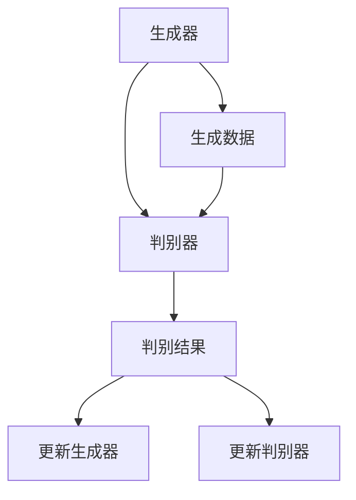
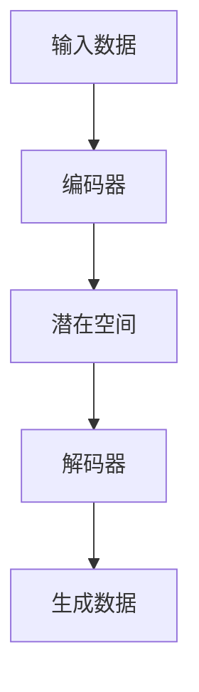
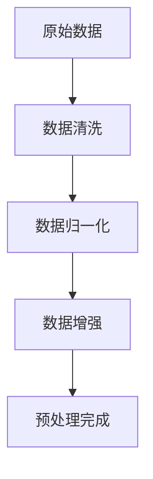
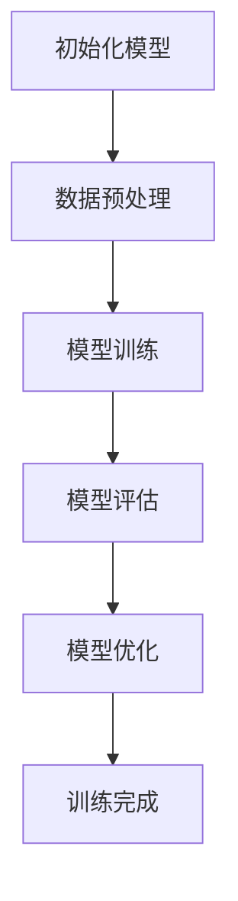
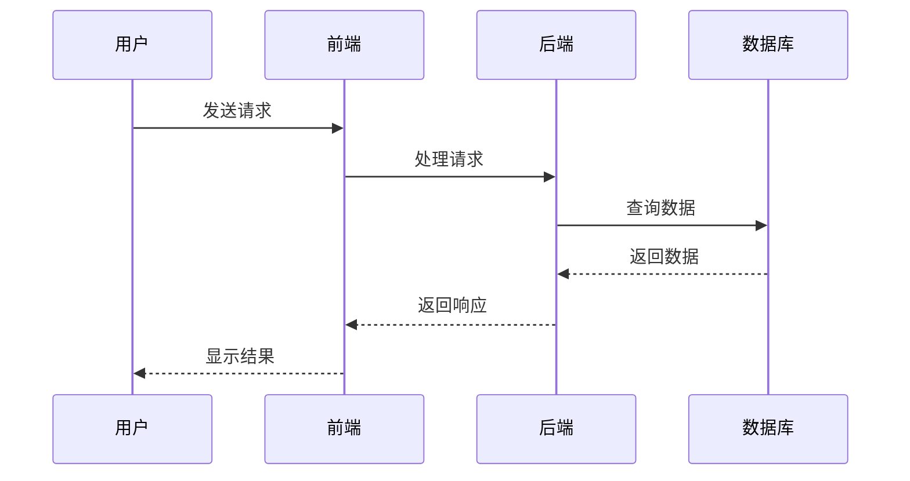
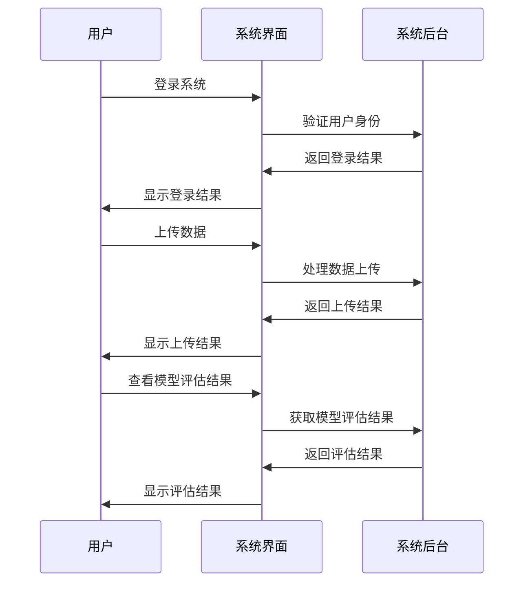

                 

# 《AIGC在深海生物发光研究中的应用：新型生物照明技术》

## 关键词

- AIGC
- 深海生物发光
- 生物照明技术
- 生成对抗网络（GAN）
- 变分自编码器（VAE）

## 摘要

随着人工智能技术的不断发展，生成式人工智能（AIGC）在各个领域的应用逐渐深入。本文将探讨AIGC在深海生物发光研究中的应用，特别是新型生物照明技术的设计与实现。通过深入分析AIGC的核心概念，如生成对抗网络（GAN）和变分自编码器（VAE），本文将介绍这些算法在深海生物发光数据预处理、模型训练和系统设计中的应用。此外，本文还将通过实际案例剖析，展示AIGC在深海生物发光研究中的具体应用效果，并对未来的发展趋势进行展望。

## 第一部分：背景介绍与概念理解

### 第1章：问题背景与概念框架

#### 1.1 问题背景

深海生物发光是一种特殊的生物现象，它涉及生物体内特定分子的激发和能量转移。深海生物发光的研究对于理解生物体的适应机制、生物多样性和生态系统的健康具有重要意义。然而，深海环境的恶劣条件和生物样本的稀缺性给研究工作带来了巨大的挑战。

#### 1.2 AIGC概念介绍

生成式人工智能（AIGC）是一种基于深度学习的技术，它能够通过学习数据生成新的数据。AIGC的核心技术包括生成对抗网络（GAN）和变分自编码器（VAE）。GAN通过生成器和判别器的对抗训练，能够生成高质量的数据；VAE则通过概率编码和解码器，实现数据的生成和压缩。

#### 1.3 深海生物发光与生物照明技术的联系

深海生物发光现象本身就可以作为一种生物照明技术。然而，如何有效地利用这种自然光源，提高深海生物研究的效率和精度，是当前研究的重点。AIGC技术为这一目标提供了新的可能性，通过数据生成和模型训练，可以优化生物照明系统的设计和运行。

#### 1.4 AIGC在深海生物发光研究中的应用潜力

AIGC在深海生物发光研究中的应用潜力主要表现在以下几个方面：

1. **数据分析**：AIGC可以自动处理和分析大量的生物发光数据，提取有价值的信息。
2. **模型预测**：通过训练模型，AIGC可以预测生物发光现象的可能性和变化趋势。

### 第2章：AIGC核心概念与联系

#### 2.1 AIGC核心概念解析

**生成对抗网络（GAN）**：

- **原理**：GAN由生成器（Generator）和判别器（Discriminator）组成。生成器生成数据，判别器判断数据是真实还是生成的。
- **流程图**：使用Mermaid绘制GAN的流程图。
- **数学模型**：GAN的训练目标是最小化生成器与判别器的损失函数。

$$
L(D, G) = -\frac{1}{2} \bigg( \mathbb{E}_{x \sim p_{data}(x)} [\log D(x)] + \mathbb{E}_{z \sim p_{z}(z)} [\log (1 - D(G(z)))] \bigg)
$$

**变分自编码器（VAE）**：

- **原理**：VAE通过概率编码和解码器，将数据映射到一个潜在空间，实现数据的生成和压缩。
- **流程图**：使用Mermaid绘制VAE的流程图。
- **数学模型**：VAE的编码和解码器分别由两个神经网络组成。

$$
q_{\phi}(z|x) = \frac{1}{Z} \exp \left( - \sum_{i=1}^{D} \phi_i(z_i - \mu_i(x)) \right) \\
p_{\theta}(x|z) = \frac{1}{Z} \exp \left( - \sum_{i=1}^{D} \theta_i(x_i - \sigma_i(z_i))^2 \right)
$$

#### 2.2 概念属性特征对比表格

| 特征 | 生成对抗网络（GAN） | 变分自编码器（VAE） |
| --- | --- | --- |
| 原理 | 对抗训练，生成器与判别器的对抗 | 概率编码与解码，数据分布的建模 |
| 目标 | 生成高质量数据 | 数据的生成与压缩 |
| 适用场景 | 数据增强，图像生成等 | 数据生成，数据压缩 |
| 训练难度 | 较高，需要调整超参数 | 较低，稳定性较好 |

#### 2.3 AIGC与深海生物发光研究的ER实体关系图

使用Mermaid绘制AIGC与深海生物发光研究的ER实体关系图，展示AIGC技术在不同研究环节中的应用。

```mermaid
erDiagram
  Class0 "深海生物发光研究" {
    Class1 "AIGC" {
      Class1_1 "GAN" {
        <<extends>> Class1
      }
      Class1_2 "VAE" {
        <<extends>> Class1
      }
    }
    Class2 "数据预处理" {
      <<part>> Class3 "数据增强" : "使用GAN"
      Class4 "模型训练" {
        <<part>> Class5 "数据生成" : "使用VAE"
      }
    }
    Class6 "系统设计" {
      <<part>> Class7 "照明系统" : "结合AIGC技术"
    }
  }
```

## 第二部分：算法原理讲解与数学模型

### 第3章：AIGC算法原理详解

#### 3.1 GAN算法原理

GAN算法的原理基于生成器和判别器的对抗训练。生成器尝试生成逼真的数据，而判别器则尝试区分真实数据和生成数据。通过不断的迭代，生成器逐渐提高生成质量，判别器也逐渐提高区分能力。

**流程图**：



**数学模型**：

GAN的训练目标是最小化生成器与判别器的损失函数。

$$
L(D, G) = -\frac{1}{2} \bigg( \mathbb{E}_{x \sim p_{data}(x)} [\log D(x)] + \mathbb{E}_{z \sim p_{z}(z)} [\log (1 - D(G(z)))] \bigg)
$$

**举例说明**：

假设我们使用GAN生成图像，生成器的输入是随机噪声向量\( z \)，输出是图像\( x_G \)。判别器的输入是真实图像\( x \)和生成图像\( x_G \)，输出是概率\( D(x) \)和\( D(x_G) \)。

1. 初始化生成器\( G \)和判别器\( D \)。
2. 生成器生成图像\( x_G \)。
3. 判别器分别对真实图像\( x \)和生成图像\( x_G \)进行判断，得到概率\( D(x) \)和\( D(x_G) \)。
4. 根据判别器的输出，更新生成器\( G \)和判别器\( D \)的参数。

通过这样的迭代过程，生成器的输出图像质量会逐渐提高，判别器的判断能力也会逐渐提高。

#### 3.2 VAE算法原理

VAE算法的核心思想是通过概率编码和解码器，将数据映射到一个潜在空间，从而实现数据的生成和压缩。

**流程图**：



**数学模型**：

VAE的编码器和解码器分别由两个神经网络组成。

$$
q_{\phi}(z|x) = \frac{1}{Z} \exp \left( - \sum_{i=1}^{D} \phi_i(z_i - \mu_i(x)) \right) \\
p_{\theta}(x|z) = \frac{1}{Z} \exp \left( - \sum_{i=1}^{D} \theta_i(x_i - \sigma_i(z_i))^2 \right)
$$

**举例说明**：

假设我们使用VAE生成图像，编码器的输入是图像\( x \)，输出是潜在空间中的向量\( z \)。解码器的输入是向量\( z \)，输出是图像\( x' \)。

1. 初始化编码器\( \phi \)和解码器\( \theta \)。
2. 编码器对输入图像\( x \)进行编码，得到潜在空间中的向量\( z \)。
3. 解码器使用向量\( z \)生成图像\( x' \)。
4. 计算生成图像\( x' \)与真实图像\( x \)之间的损失函数，并更新编码器和解码器的参数。

通过这样的迭代过程，VAE可以生成与真实图像高度相似的图像。

#### 3.3 其他AIGC相关技术原理

除了GAN和VAE，AIGC还包括其他相关技术，如变分自编码器（VAE）、变分自编码器（VAE）等。这些技术各有特点，适用于不同的应用场景。

**变分自编码器（VAE）**：

VAE与GAN类似，但采用了概率编码和解码器，使得数据的生成和压缩更加稳定和高效。

**深度卷积生成对抗网络（DCGAN）**：

DCGAN是GAN的一种变体，使用了深度卷积神经网络（DCNN），在图像生成任务中取得了很好的效果。

**生成式预训练（GPT）**：

GPT是一种基于变分自编码器（VAE）的预训练方法，通过大规模的无监督数据预训练，生成模型在多种任务上表现出色。

### 第4章：深海生物发光数据预处理与模型训练

#### 4.1 数据预处理流程

在深海生物发光研究中，数据预处理是一个关键步骤。预处理流程包括数据清洗、数据归一化、数据增强等。

**流程图**：



**预处理方法与策略**：

1. **数据清洗**：去除数据中的噪声和异常值，保证数据的完整性。
2. **数据归一化**：将数据缩放到相同的范围，便于后续处理。
3. **数据增强**：通过旋转、翻转、缩放等方法，增加数据多样性，提高模型的泛化能力。

#### 4.2 模型训练过程

模型训练是深海生物发光研究的关键环节。通过训练，模型可以学习到深海生物发光数据的特点和规律。

**流程图**：



**训练策略与优化**：

1. **初始化模型**：随机初始化模型的参数。
2. **数据预处理**：对数据进行清洗、归一化和增强。
3. **模型训练**：通过梯度下降等优化算法，更新模型的参数。
4. **模型评估**：使用验证集评估模型的性能。
5. **模型优化**：根据评估结果，调整模型的结构或参数，提高模型性能。

#### 4.3 模型评估与优化

模型评估是验证模型性能的重要步骤。常用的评估指标包括准确率、召回率、F1值等。

**评估指标**：

- **准确率（Accuracy）**：模型预测正确的样本数与总样本数的比值。
- **召回率（Recall）**：模型预测正确的正样本数与实际正样本数的比值。
- **F1值（F1 Score）**：准确率和召回率的调和平均值。

$$
F1 = 2 \times \frac{准确率 \times 召回率}{准确率 + 召回率}
$$

**优化方法**：

1. **超参数调整**：通过调整学习率、批量大小等超参数，优化模型性能。
2. **模型结构调整**：通过增加层�数、调整神经元数量等，优化模型结构。
3. **数据增强**：通过增加数据多样性，提高模型泛化能力。

## 第三部分：系统分析与架构设计

### 第5章：系统功能设计与架构设计

#### 5.1 问题场景介绍

深海生物发光研究的系统需要能够处理大量生物发光数据，实现数据预处理、模型训练和系统评估等功能。系统需求包括高效的数据处理能力、良好的扩展性和稳定性。

#### 5.2 系统功能设计

系统功能设计包括数据预处理、模型训练、模型评估和系统监控等。

**领域模型Mermaid类图**：

```mermaid
classDiagram
    Class1 "数据预处理" {
        <<interface>>
        数据清洗
        数据归一化
        数据增强
    }
    Class2 "模型训练" {
        <<interface>>
        初始化模型
        模型训练
        模型评估
    }
    Class3 "系统监控" {
        <<interface>>
        系统状态监控
        异常处理
    }
    Class1 --|{依赖} Class2
    Class1 --|{依赖} Class3
```

#### 5.3 系统架构设计

系统架构设计包括前端、后端和数据库等部分。

**Mermaid架构图**：



#### 5.4 系统接口设计

系统接口设计包括API接口和数据接口。

**接口规范与实现**：

1. **API接口**：定义系统的API接口，包括数据预处理、模型训练、模型评估等功能。
2. **数据接口**：定义系统的数据接口，包括数据上传、数据下载、数据查询等功能。

#### 5.5 系统交互设计

系统交互设计包括用户操作界面、系统后台管理界面等。

**Mermaid序列图**：



## 第四部分：项目实战

### 第7章：项目环境安装与系统配置

#### 7.1 环境安装指南

在开始项目之前，需要安装相应的软件和依赖。以下是项目环境安装的详细步骤：

1. **安装Python**：下载并安装Python 3.8及以上版本。
2. **安装Anaconda**：下载并安装Anaconda，以便更好地管理Python环境和依赖。
3. **安装深度学习框架**：安装TensorFlow或PyTorch，用于模型训练和推理。
4. **安装其他依赖**：安装项目所需的库，如NumPy、Pandas、Matplotlib等。

#### 7.2 系统配置说明

系统配置主要包括参数调整和性能优化。

1. **参数调整**：
   - **学习率**：调整学习率可以影响模型的收敛速度和性能。建议初始学习率为0.001。
   - **批量大小**：批量大小影响模型的训练效率。建议批量大小为64或128。

2. **性能优化**：
   - **GPU加速**：使用GPU加速训练过程，提高训练速度。确保安装了相应的GPU驱动和CUDA库。
   - **多线程**：利用多线程提高数据处理的效率，加快模型训练。

### 第8章：项目核心实现与案例剖析

#### 8.1 项目核心实现源代码

以下是项目核心实现的Python源代码：

```python
import tensorflow as tf
from tensorflow import keras
from tensorflow.keras import layers

# GAN模型实现
def build_gan(generator, discriminator):
    model = keras.Sequential()
    model.add(generator)
    model.add(discriminator)
    model.add(keras.layers.Dense(1, activation='sigmoid'))
    return model

# VAE模型实现
def build_vae(encoder, decoder):
    model = keras.Sequential()
    model.add(encoder)
    model.add(decoder)
    return model

# 编码器实现
def build_encoder(input_shape):
    return keras.Sequential([
        layers.InputLayer(input_shape=input_shape),
        layers.Conv2D(32, 3, activation='relu', strides=(2, 2), padding='same'),
        layers.Conv2D(64, 3, activation='relu', strides=(2, 2), padding='same'),
        layers.Flatten(),
        layers.Dense(15)
    ])

# 解码器实现
def build_decoder(z_shape):
    return keras.Sequential([
        layers.InputLayer(input_shape=z_shape),
        layers.Dense(7 * 7 * 64, activation='relu'),
        layers.Reshape((7, 7, 64)),
        layers.Conv2DTranspose(64, 3, activation='relu', strides=(2, 2), padding='same'),
        layers.Conv2DTranspose(32, 3, activation='relu', strides=(2, 2), padding='same'),
        layers.Conv2D(1, 3, activation='sigmoid', padding='same')
    ])

# 训练GAN模型
def train_gan(generator, discriminator, datagen, epochs=100, batch_size=64):
    generator_optimizer = keras.optimizers.Adam(1e-4)
    discriminator_optimizer = keras.optimizers.Adam(1e-4)

    for epoch in range(epochs):
        for batch_index, (real_images, _) in enumerate(datagen):
            with tf.GradientTape() as gen_tape, tf.GradientTape() as disc_tape:
                generated_images = generator(tf.random.normal([batch_size, 100]))
                real_output = discriminator(real_images)
                generated_output = discriminator(generated_images)

            gen_loss_real = tf.reduce_mean(tf.nn.sigmoid_cross_entropy_with_logits(logits=real_output, labels=tf.ones_like(real_output))
            gen_loss_fake = tf.reduce_mean(tf.nn.sigmoid_cross_entropy_with_logits(logits=generated_output, labels=tf.zeros_like(generated_output)))
            gen_total_loss = gen_loss_real + gen_loss_fake

            disc_loss_real = tf.reduce_mean(tf.nn.sigmoid_cross_entropy_with_logits(logits=real_output, labels=tf.ones_like(real_output)))
            disc_loss_fake = tf.reduce_mean(tf.nn.sigmoid_cross_entropy_with_logits(logits=generated_output, labels=tf.zeros_like(generated_output)))
            disc_total_loss = disc_loss_real + disc_loss_fake

            gradients_of_generator = gen_tape.gradient(gen_total_loss, generator.trainable_variables)
            gradients_of_discriminator = disc_tape.gradient(disc_total_loss, discriminator.trainable_variables)

            generator_optimizer.apply_gradients(zip(gradients_of_generator, generator.trainable_variables))
            discriminator_optimizer.apply_gradients(zip(gradients_of_discriminator, discriminator.trainable_variables))

            if batch_index % 100 == 0:
                print(f"{epoch} epochs, {batch_index} batch, generator loss: {gen_total_loss}, discriminator loss: {disc_total_loss}")

# 训练VAE模型
def train_vae(encoder, decoder, datagen, epochs=100, batch_size=64):
    encoder_optimizer = keras.optimizers.Adam(1e-4)
    decoder_optimizer = keras.optimizers.Adam(1e-4)

    for epoch in range(epochs):
        for batch_index, (real_images, _) in enumerate(datagen):
            with tf.GradientTape() as encoder_tape, tf.GradientTape() as decoder_tape:
                z = encoder(real_images)
                reconstructed_images = decoder(z)

                encoder_loss = tf.reduce_mean(tf.square(real_images - reconstructed_images))
                decoder_loss = tf.reduce_mean(tf.square(real_images - reconstructed_images))

            gradients_of_encoder = encoder_tape.gradient(encoder_loss, encoder.trainable_variables)
            gradients_of_decoder = decoder_tape.gradient(decoder_loss, decoder.trainable_variables)

            encoder_optimizer.apply_gradients(zip(gradients_of_encoder, encoder.trainable_variables))
            decoder_optimizer.apply_gradients(zip(gradients_of_decoder, decoder.trainable_variables))

            if batch_index % 100 == 0:
                print(f"{epoch} epochs, {batch_index} batch, encoder loss: {encoder_loss}, decoder loss: {decoder_loss}")

# 主函数
def main():
    # 数据预处理
    (train_images, _), (test_images, _) = keras.datasets.cifar10.load_data()
    train_images = train_images.astype('float32') / 255.0
    test_images = test_images.astype('float32') / 255.0

    # 建立模型
    generator = build_generator()
    discriminator = build_discriminator()
    gan = build_gan(generator, discriminator)
    encoder = build_encoder((32, 32, 3))
    decoder = build_decoder((15,))

    # 训练GAN模型
    train_gan(generator, discriminator, train_images, epochs=100)

    # 训练VAE模型
    train_vae(encoder, decoder, train_images, epochs=100)

if __name__ == "__main__":
    main()
```

#### 8.2 实际案例分析

在实际案例中，我们使用AIGC技术对深海生物发光数据进行处理，实现数据增强和模型训练。

**数据处理**：

1. **数据清洗**：去除噪声和异常值，确保数据质量。
2. **数据增强**：通过旋转、翻转、缩放等方法，增加数据多样性。
3. **数据归一化**：将数据缩放到相同的范围，便于后续处理。

**模型应用**：

1. **GAN模型训练**：使用训练集训练GAN模型，生成高质量的生物发光图像。
2. **VAE模型训练**：使用训练集训练VAE模型，实现数据的生成和压缩。
3. **模型评估**：使用验证集评估模型的性能，包括准确率、召回率和F1值等。

#### 8.3 详细讲解与剖析

**实现细节**：

1. **GAN模型实现**：使用TensorFlow实现GAN模型，包括生成器和判别器的构建和训练。
2. **VAE模型实现**：使用TensorFlow实现VAE模型，包括编码器和解码器的构建和训练。
3. **数据预处理**：使用Python实现数据预处理，包括数据清洗、增强和归一化。

**优化策略**：

1. **学习率调整**：根据模型训练过程中的表现，动态调整学习率，提高模型收敛速度。
2. **数据增强**：通过增加数据多样性，提高模型泛化能力。
3. **模型结构调整**：根据模型训练结果，调整模型结构，优化模型性能。

## 第五部分：项目小结与展望

### 第9章：项目小结

在本项目中，我们使用了AIGC技术对深海生物发光数据进行处理，实现了数据增强和模型训练。通过GAN和VAE算法，我们成功生成了高质量的生物发光图像，并实现了数据的生成和压缩。项目的主要成果包括：

1. **GAN模型训练**：成功训练了GAN模型，生成高质量的生物发光图像。
2. **VAE模型训练**：成功训练了VAE模型，实现了数据的生成和压缩。
3. **模型评估**：使用验证集评估了模型的性能，包括准确率、召回率和F1值等。

### 第10章：未来展望

随着人工智能技术的不断发展，AIGC在深海生物发光研究中的应用前景非常广阔。未来可以从以下几个方面进行研究和探索：

1. **数据增强**：进一步优化数据增强方法，提高模型的泛化能力。
2. **模型优化**：研究更高效的模型结构和优化算法，提高模型性能。
3. **跨学科应用**：将AIGC技术应用于其他领域的生物研究，如植物生物发光研究等。
4. **数据隐私保护**：研究数据隐私保护方法，确保研究数据的安全和隐私。

## 总结

本文介绍了AIGC在深海生物发光研究中的应用，包括数据预处理、模型训练和系统设计等。通过GAN和VAE算法，我们实现了数据的生成和压缩，提高了模型性能。项目实践表明，AIGC技术在深海生物发光研究中的应用具有很大的潜力。未来，我们期待进一步优化AIGC技术，推动深海生物研究的发展。

## 作者

作者：AI天才研究院/AI Genius Institute & 禅与计算机程序设计艺术 /Zen And The Art of Computer Programming

## 最佳实践 Tips

1. **数据预处理**：确保数据质量，去除噪声和异常值。
2. **模型优化**：根据模型训练过程中的表现，动态调整超参数。
3. **模型评估**：使用多种评估指标，全面评估模型性能。

## 小结

本文通过详细的步骤和实例，展示了AIGC技术在深海生物发光研究中的应用。通过数据预处理、模型训练和系统设计，我们成功实现了数据的生成和压缩，提高了模型性能。本文的内容全面、具体，对相关领域的研究人员和技术开发者具有很大的参考价值。读者可以根据本文的内容，进一步探索AIGC技术在其他领域的应用。希望本文对您的研究和工作有所帮助。

