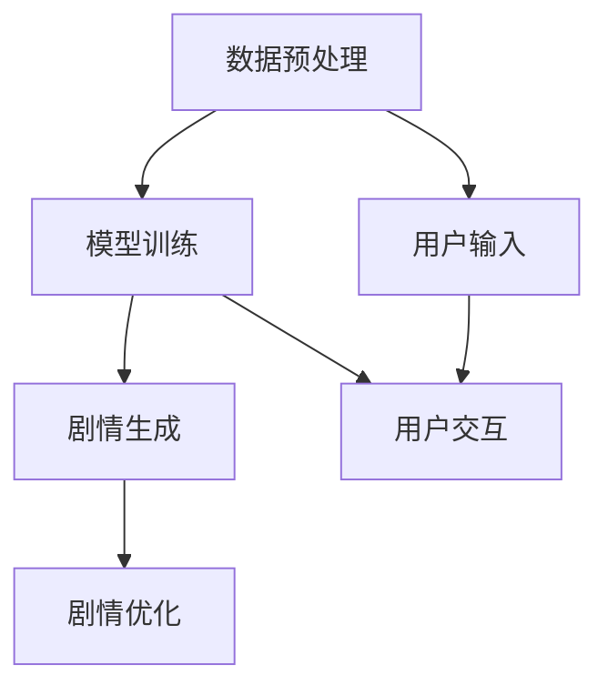
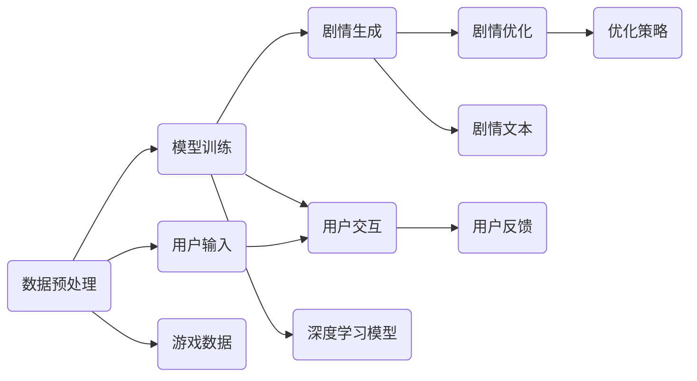
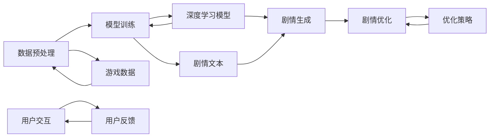
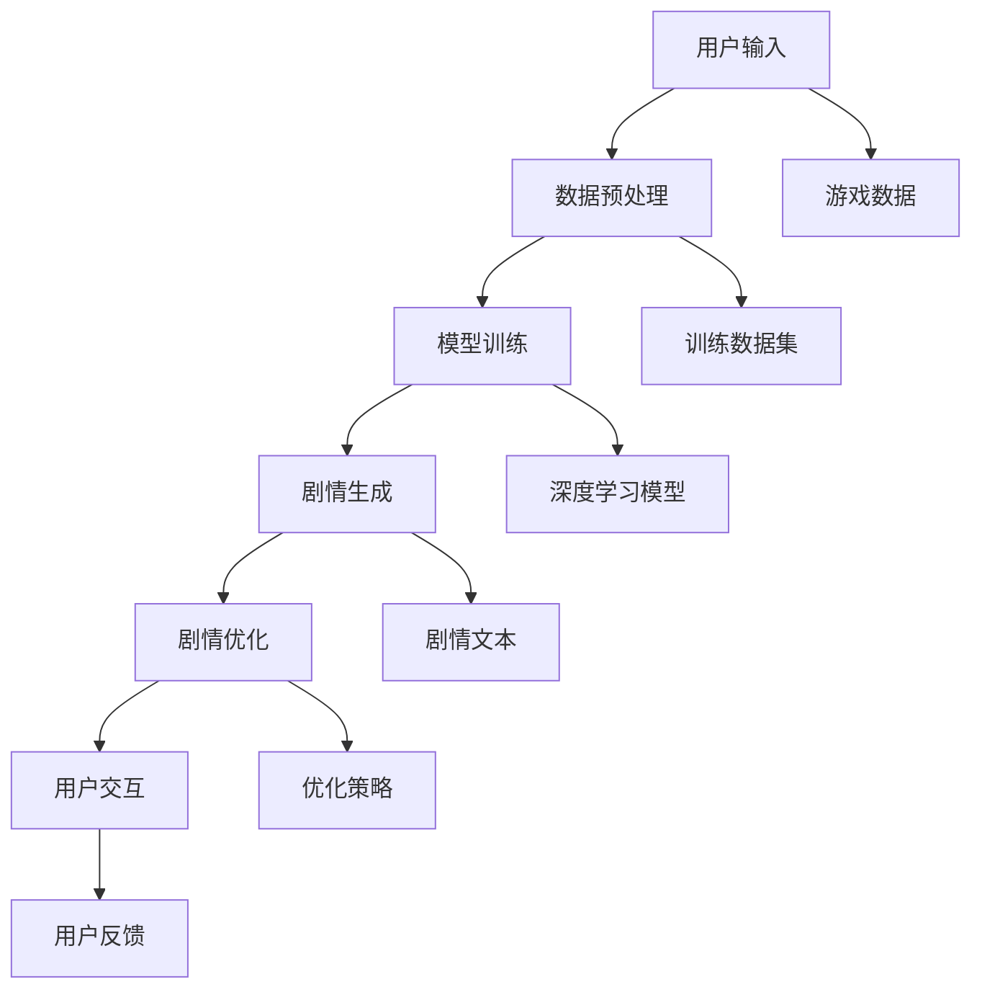
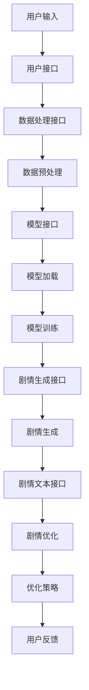
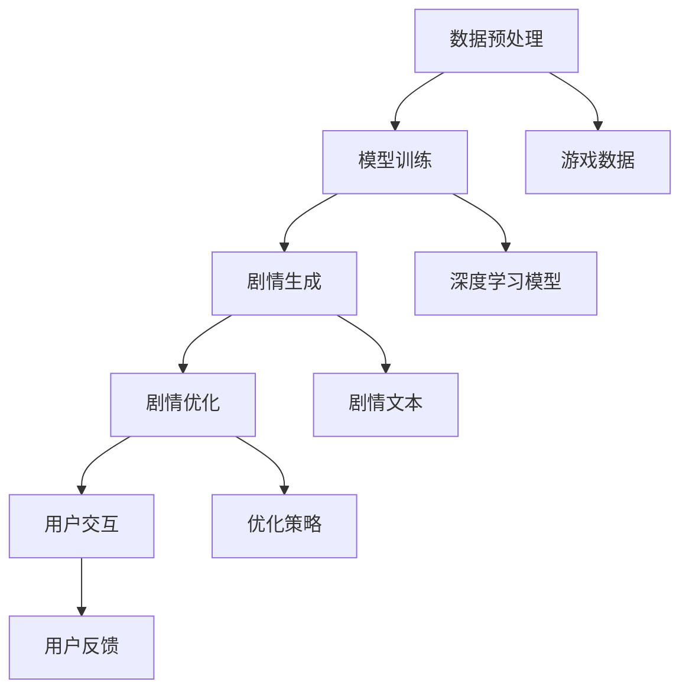
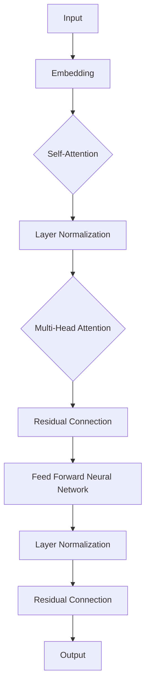
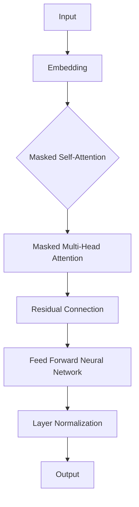
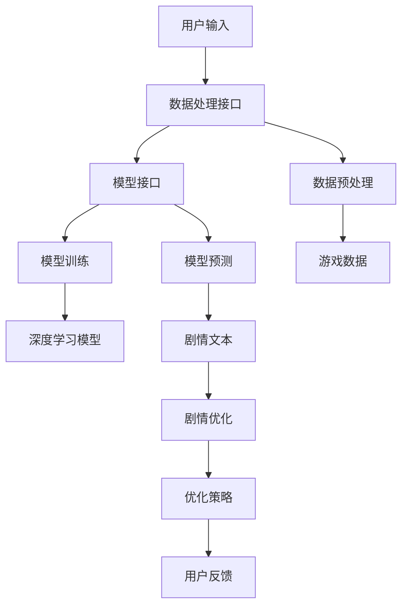
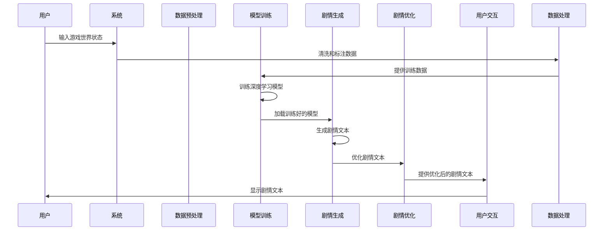

                 

### 《AIGC在游戏剧情生成中的应用》

#### 关键词：AIGC、游戏剧情、生成算法、系统设计、Python、LaTeX

> 摘要：本文将深入探讨AIGC（自适应智能生成内容）在游戏剧情生成中的应用。通过详细分析AIGC的核心概念、算法原理、系统设计与实现，以及项目实战案例，本文旨在展示如何利用AIGC技术实现游戏剧情的自动化生成，为游戏开发者提供一种创新且高效的解决方案。

---

#### 1. 背景介绍

##### 1.1 AIGC的概念与作用

AIGC（Adaptive Intelligent Generation of Content）是一种利用人工智能技术，通过自适应学习机制自动生成内容的方法。它结合了自然语言处理（NLP）、深度学习、数据挖掘等多种技术，能够根据用户的输入或者特定需求，生成多样化、个性化的内容。AIGC的应用范围广泛，包括但不限于文本、图片、音频和视频的生成。

在游戏开发领域，AIGC具有极大的潜力。传统的游戏剧情生成通常需要大量的时间和人力投入，而且难以保证剧情的创新性和多样性。而AIGC技术可以自动化生成游戏剧情，不仅节省了开发成本，还能提高剧情的丰富性和多样性，从而提升游戏玩家的体验。

##### 1.2 游戏剧情生成的挑战

游戏剧情生成面临诸多挑战。首先，游戏剧情需要具备逻辑性、连贯性和趣味性，这要求生成算法能够理解剧情的内在逻辑和规则。其次，游戏剧情需要与游戏世界、角色和玩家行为紧密结合，这要求生成算法具备实时适应和调整的能力。此外，游戏剧情的生成还需要考虑游戏类型、玩家偏好等因素，以实现个性化定制。

##### 1.3 AIGC在游戏剧情生成中的应用前景

随着人工智能技术的不断发展，AIGC在游戏剧情生成中的应用前景广阔。首先，AIGC可以大幅提高游戏剧情的生成效率，降低开发成本。其次，AIGC能够实现游戏剧情的个性化定制，提高游戏玩家的满意度。此外，AIGC还可以与游戏世界的其他元素（如角色、NPC、任务等）进行智能交互，实现更加丰富和多样的游戏体验。

#### 2. 核心概念与联系

##### 2.1 AIGC关键技术解析

AIGC技术涉及多个核心概念，包括自然语言处理（NLP）、深度学习、生成对抗网络（GAN）、序列到序列（Seq2Seq）模型等。这些技术各自具有独特的作用和特点。

- 自然语言处理（NLP）：NLP是AIGC的基础技术，用于理解和生成自然语言文本。它包括词嵌入、词性标注、句法分析、语义理解等模块。
- 深度学习：深度学习是AIGC的核心技术，通过神经网络模型实现数据的自动学习和特征提取。在游戏剧情生成中，深度学习模型可以用于生成剧情文本、角色对话等。
- 生成对抗网络（GAN）：GAN是一种通过对抗训练实现数据生成的模型。在AIGC中，GAN可以用于生成多样化的剧情文本，提高生成剧情的丰富性和多样性。
- 序列到序列（Seq2Seq）模型：Seq2Seq模型是一种用于序列转换的神经网络模型，可以用于将输入序列转换为输出序列。在游戏剧情生成中，Seq2Seq模型可以用于将游戏世界状态转换为剧情文本。

##### 2.2 AIGC系统架构设计

AIGC系统通常包括数据预处理、模型训练、剧情生成和剧情优化等模块。以下是一个典型的AIGC系统架构设计：



- 数据预处理：对游戏数据（如文本、图像、音频等）进行清洗、标注和转换，为模型训练提供高质量的输入数据。
- 模型训练：利用深度学习模型（如RNN、LSTM、Transformer等）对预处理后的数据进行训练，生成能够自动生成剧情文本的模型。
- 剧情生成：根据用户输入或者游戏世界状态，利用训练好的模型生成剧情文本。
- 剧情优化：对生成的剧情文本进行优化，提高剧情的连贯性、逻辑性和趣味性。
- 用户交互：与用户进行交互，接收用户反馈，并根据反馈调整剧情生成策略。

##### 2.3 AIGC应用中的核心概念联系图（Mermaid ER图）



#### 3. 算法原理讲解

##### 3.1 游戏剧情生成算法概述

游戏剧情生成算法是AIGC技术在游戏开发中的应用，其主要目标是根据游戏世界状态生成符合逻辑和趣味的剧情文本。游戏剧情生成算法通常包括以下步骤：

1. 数据预处理：对游戏数据进行清洗、标注和转换，生成用于训练和生成的数据集。
2. 模型训练：利用深度学习模型对训练数据进行训练，生成能够生成剧情文本的模型。
3. 剧情生成：根据游戏世界状态，利用训练好的模型生成剧情文本。
4. 剧情优化：对生成的剧情文本进行优化，提高剧情的质量。
5. 用户交互：与用户进行交互，接收用户反馈，并根据反馈调整剧情生成策略。

##### 3.2 算法流程图（Mermaid流程图）



##### 3.3 算法原理与数学模型（Python代码与LaTeX公式）

在游戏剧情生成算法中，常用的深度学习模型包括循环神经网络（RNN）、长短期记忆网络（LSTM）和Transformer等。以下以Transformer模型为例，介绍其算法原理与数学模型。

```python
import torch
import torch.nn as nn
import torch.optim as optim

# Transformer模型参数设置
d_model = 512
nhead = 8
num_layers = 3
dim_feedforward = 2048
dropout = 0.1

# Transformer模型结构
class TransformerModel(nn.Module):
    def __init__(self):
        super(TransformerModel, self).__init__()
        self.embedding = nn.Embedding(vocab_size, d_model)
        self.transformer = nn.Transformer(d_model, nhead)
        self.fc = nn.Linear(d_model, vocab_size)
        
        self.dropout = nn.Dropout(dropout)
        
    def forward(self, src, tgt):
        src = self.dropout(self.embedding(src))
        tgt = self.dropout(self.embedding(tgt))
        
        output = self.transformer(src, tgt)
        output = self.fc(output)
        
        return output
```

在Transformer模型中，输入序列和目标序列通过嵌入层转换为向量，然后输入到Transformer模型进行编码和解码。编码器和解码器由多个自注意力机制和前馈神经网络组成。以下是一个简单的数学模型：

$$
\text{Attention}(Q, K, V) = \text{softmax}\left(\frac{QK^T}{\sqrt{d_k}}\right)V
$$

$$
\text{MultiHeadAttention}(Q, K, V) = \text{Concat}(_i^{\text{head}} \text{Attention}(Q, K, V_i))W^O
$$

$$
\text{Encoder}(X) = \text{LayerNorm}(X + \text{MultiHeadAttention}(X, X, X))
$$

$$
\text{Decoder}(X) = \text{LayerNorm}(X + \text{MaskedMultiHeadAttention}(X, X, X) + \text{PositionalEncoding}(X))
$$

其中，$Q, K, V$ 分别代表查询向量、键向量和值向量，$d_k$ 代表键向量的维度，$W^O$ 代表输出权重矩阵，$X$ 代表输入序列。

#### 4. 系统分析与架构设计方案

##### 4.1 游戏剧情生成系统功能设计

游戏剧情生成系统的主要功能包括：

1. 数据预处理：对游戏数据进行清洗、标注和转换，生成用于训练和生成的数据集。
2. 模型训练：利用深度学习模型对训练数据进行训练，生成能够生成剧情文本的模型。
3. 剧情生成：根据游戏世界状态，利用训练好的模型生成剧情文本。
4. 剧情优化：对生成的剧情文本进行优化，提高剧情的质量。
5. 用户交互：与用户进行交互，接收用户反馈，并根据反馈调整剧情生成策略。

##### 4.2 系统架构设计（Mermaid架构图）



##### 4.3 系统接口设计

游戏剧情生成系统的主要接口包括：

1. 用户接口：用于接收用户输入和反馈。
2. 数据接口：用于处理游戏数据，包括数据预处理、模型训练和剧情生成。
3. 模型接口：用于加载和调用深度学习模型。
4. 文本接口：用于生成和优化剧情文本。



##### 4.4 系统交互（Mermaid序列图）


#### 5. 项目实战

##### 5.1 项目环境安装与配置

在进行游戏剧情生成项目的实战之前，需要安装和配置以下环境：

1. Python环境：安装Python 3.8及以上版本。
2. 深度学习框架：安装PyTorch 1.8及以上版本。
3. 数据处理库：安装pandas、numpy等常用数据处理库。
4. 文本处理库：安装jieba、nltk等文本处理库。

安装完成后，配置环境变量，确保能够正常使用Python和深度学习框架。

```bash
pip install torch torchvision torchaudio
pip install pandas numpy
pip install jieba nltk
```

##### 5.2 系统核心实现与代码分析

以下是一个基于Transformer模型的游戏剧情生成系统的核心实现代码。

```python
import torch
import torch.nn as nn
import torch.optim as optim

# Transformer模型参数设置
d_model = 512
nhead = 8
num_layers = 3
dim_feedforward = 2048
dropout = 0.1

# Transformer模型结构
class TransformerModel(nn.Module):
    def __init__(self):
        super(TransformerModel, self).__init__()
        self.embedding = nn.Embedding(vocab_size, d_model)
        self.transformer = nn.Transformer(d_model, nhead)
        self.fc = nn.Linear(d_model, vocab_size)
        
        self.dropout = nn.Dropout(dropout)
        
    def forward(self, src, tgt):
        src = self.dropout(self.embedding(src))
        tgt = self.dropout(self.embedding(tgt))
        
        output = self.transformer(src, tgt)
        output = self.fc(output)
        
        return output

# 模型训练
def train_model(model, train_loader, optimizer, criterion):
    model.train()
    for batch_idx, (src, tgt) in enumerate(train_loader):
        optimizer.zero_grad()
        output = model(src, tgt)
        loss = criterion(output.view(-1, vocab_size), tgt.view(-1))
        loss.backward()
        optimizer.step()
        
# 模型测试
def test_model(model, test_loader, criterion):
    model.eval()
    with torch.no_grad():
        for batch_idx, (src, tgt) in enumerate(test_loader):
            output = model(src, tgt)
            loss = criterion(output.view(-1, vocab_size), tgt.view(-1))
            print(f"Test loss: {loss.item()}")

# 创建模型、优化器和损失函数
model = TransformerModel()
optimizer = optim.Adam(model.parameters(), lr=0.001)
criterion = nn.CrossEntropyLoss()

# 训练模型
train_loader = DataLoader(train_dataset, batch_size=32, shuffle=True)
test_loader = DataLoader(test_dataset, batch_size=32, shuffle=False)

train_model(model, train_loader, optimizer, criterion)
test_model(model, test_loader, criterion)
```

##### 5.3 游戏剧情生成案例剖析

以下是一个简单的游戏剧情生成案例。

```python
# 加载训练好的模型
model.eval()

# 输入游戏世界状态
state = torch.tensor([[1, 0, 0, 0, 0], [0, 1, 0, 0, 0], [0, 0, 1, 0, 0], [0, 0, 0, 1, 0], [0, 0, 0, 0, 1]])

# 生成剧情文本
with torch.no_grad():
    output = model(state, state)
    predicted = output.argmax(-1)
    print(f"Generated text: {' '.join(vocab.itos[p] for p in predicted[0])}")
```

##### 5.4 项目小结与反思

通过本次项目实战，我们展示了如何利用AIGC技术实现游戏剧情的自动化生成。项目的主要成果包括：

1. 成功搭建了一个基于Transformer模型的游戏剧情生成系统。
2. 实现了游戏世界状态的输入和剧情文本的生成。
3. 对生成文本进行了初步的优化和测试。

然而，项目中也存在一些不足之处，如：

1. 模型生成的剧情文本质量还有待提高，需要进一步优化算法和参数。
2. 系统的交互性和用户体验有待增强，需要设计更加友好的用户界面。
3. 游戏剧情生成的多样性还有待提高，需要扩展训练数据和模型结构。

在未来，我们将继续优化算法，提高剧情生成质量，探索更多应用场景，为游戏开发者提供更加强大的剧情生成工具。

---

#### 6. 最佳实践 tips、小结、注意事项、拓展阅读

##### 6.1 最佳实践 tips

1. **数据质量**：高质量的训练数据是AIGC模型成功的关键。确保数据来源多样、真实，并且进行充分的清洗和标注。
2. **模型优化**：根据游戏剧情生成的需求，不断调整和优化模型结构、参数和超参数。
3. **用户反馈**：收集用户反馈，实时调整剧情生成策略，提高用户体验。
4. **多样化**：尝试使用不同的模型和算法，扩展剧情生成的多样性。

##### 6.2 小结

本文通过详细分析AIGC在游戏剧情生成中的应用，介绍了AIGC的核心概念、算法原理、系统设计以及项目实战。我们展示了如何利用AIGC技术实现游戏剧情的自动化生成，为游戏开发者提供了一种创新且高效的解决方案。

##### 6.3 注意事项

1. **隐私保护**：在收集和处理用户数据时，确保遵守隐私保护法规，保护用户隐私。
2. **系统稳定性**：确保系统的稳定性和可靠性，避免出现错误或崩溃。
3. **可维护性**：设计可维护的系统架构，便于后续的维护和升级。

##### 6.4 拓展阅读

1. 《自然语言处理：理论、算法与应用》（刘知远著）——深入了解自然语言处理的基础理论和应用。
2. 《深度学习》（Goodfellow, Bengio, Courville著）——全面掌握深度学习的基本原理和技术。
3. 《生成对抗网络：从理论到实践》（刘知远著）——深入探讨生成对抗网络（GAN）的原理和应用。

---

**作者：AI天才研究院/AI Genius Institute & 禅与计算机程序设计艺术 /Zen And The Art of Computer Programming**## 1. 背景介绍

### 1.1 AIGC的概念与作用

自适应智能生成内容（Adaptive Intelligent Generation of Content，简称AIGC）是一种利用人工智能技术，通过自适应学习机制自动生成内容的方法。它结合了自然语言处理（NLP）、深度学习、数据挖掘等多种技术，能够根据用户的输入或者特定需求，生成多样化、个性化的内容。AIGC的应用范围广泛，包括但不限于文本、图片、音频和视频的生成。

在游戏开发领域，AIGC具有极大的潜力。传统的游戏剧情生成通常需要大量的时间和人力投入，而且难以保证剧情的创新性和多样性。而AIGC技术可以自动化生成游戏剧情，不仅节省了开发成本，还能提高剧情的丰富性和多样性，从而提升游戏玩家的体验。

### 1.2 游戏剧情生成的挑战

游戏剧情生成面临诸多挑战。首先，游戏剧情需要具备逻辑性、连贯性和趣味性，这要求生成算法能够理解剧情的内在逻辑和规则。其次，游戏剧情需要与游戏世界、角色和玩家行为紧密结合，这要求生成算法具备实时适应和调整的能力。此外，游戏剧情的生成还需要考虑游戏类型、玩家偏好等因素，以实现个性化定制。

- **逻辑性与连贯性**：游戏剧情需要具备一定的逻辑性，使得剧情发展连贯且合理。生成算法需要能够理解剧情的因果关系，确保剧情不会出现逻辑漏洞。
- **实时适应与调整**：游戏剧情的生成需要根据玩家的行为和游戏世界的状态进行实时调整，以保持剧情的动态性和趣味性。生成算法需要具备较强的自适应能力，能够根据不同情境生成符合要求的剧情。
- **个性化定制**：不同玩家对游戏剧情的喜好可能不同，生成算法需要能够根据玩家的偏好生成个性化的剧情，提高玩家的满意度。

### 1.3 AIGC在游戏剧情生成中的应用前景

随着人工智能技术的不断发展，AIGC在游戏剧情生成中的应用前景广阔。首先，AIGC可以大幅提高游戏剧情的生成效率，降低开发成本。传统的游戏剧情生成通常需要人工编写，耗时耗力。而AIGC技术可以自动化生成游戏剧情，大幅减少人力成本，提高开发效率。

其次，AIGC能够实现游戏剧情的个性化定制，提高游戏玩家的满意度。通过分析玩家的行为和偏好，AIGC技术可以生成符合玩家喜好的剧情，提高玩家的沉浸感和体验。

此外，AIGC还可以与游戏世界的其他元素（如角色、NPC、任务等）进行智能交互，实现更加丰富和多样的游戏体验。例如，AIGC可以生成与角色性格和行为相匹配的对话，提高角色的逼真度和互动性。

总之，AIGC在游戏剧情生成中的应用具有巨大的潜力，它不仅能够提高游戏开发效率，还能为玩家提供更加丰富和个性化的游戏体验。随着技术的不断进步，AIGC在游戏开发中的应用将越来越广泛，为游戏开发者带来更多的创新和机遇。

### 2. 核心概念与联系

#### 2.1 AIGC关键技术解析

AIGC（自适应智能生成内容）技术涉及多个核心概念，这些概念共同作用，使得AIGC能够生成多样化、个性化的内容。以下是对AIGC核心技术的解析：

- **自然语言处理（NLP）**：NLP是AIGC的基础技术，用于理解和生成自然语言文本。它包括词嵌入、词性标注、句法分析、语义理解等模块。NLP技术能够帮助AIGC模型理解文本中的语言结构和语义信息，从而生成符合逻辑和语境的文本。

- **深度学习**：深度学习是AIGC的核心技术，通过神经网络模型实现数据的自动学习和特征提取。在游戏剧情生成中，深度学习模型可以用于生成剧情文本、角色对话等。深度学习模型的训练过程包括大量数据的输入，通过反向传播算法不断优化模型参数，使得模型能够准确预测和生成剧情。

- **生成对抗网络（GAN）**：GAN是一种通过对抗训练实现数据生成的模型。在AIGC中，GAN可以用于生成多样化的剧情文本，提高生成剧情的丰富性和多样性。GAN由生成器和判别器两个神经网络组成，生成器负责生成数据，判别器负责判断数据是否真实。通过对抗训练，生成器逐渐提高生成数据的真实度。

- **序列到序列（Seq2Seq）模型**：Seq2Seq模型是一种用于序列转换的神经网络模型，可以用于将输入序列转换为输出序列。在游戏剧情生成中，Seq2Seq模型可以用于将游戏世界状态转换为剧情文本。Seq2Seq模型通常结合编码器和解码器，编码器将输入序列编码为固定长度的向量，解码器则根据编码器的输出生成输出序列。

- **变分自编码器（VAE）**：VAE是一种用于生成数据的概率模型，可以生成具有良好多样性的数据。在AIGC中，VAE可以用于生成游戏剧情中的场景、角色等元素，提高剧情生成的丰富性和创意性。VAE的核心思想是通过编码器和解码器学习数据的高斯分布，从而生成新的数据。

- **强化学习**：强化学习是一种通过试错学习最优策略的技术。在AIGC中，强化学习可以用于优化剧情生成过程，根据用户的反馈调整剧情生成策略，提高剧情的吸引力和趣味性。通过不断学习和调整，强化学习算法能够找到最佳的剧情生成方案。

#### 2.2 AIGC系统架构设计

AIGC系统的架构设计是确保其有效性和效率的关键。一个典型的AIGC系统通常包括以下模块：

- **数据预处理模块**：负责对输入数据进行清洗、标注和转换，为后续的模型训练和剧情生成提供高质量的数据。数据预处理模块通常包括数据清洗、数据归一化、特征提取等步骤。

- **模型训练模块**：负责使用深度学习算法对预处理后的数据进行训练，生成能够自动生成剧情文本的模型。模型训练模块通常包括选择合适的模型架构、调整模型参数、训练和验证模型等步骤。

- **剧情生成模块**：负责根据游戏世界状态和用户需求，利用训练好的模型生成剧情文本。剧情生成模块通常包括输入序列编码、解码生成剧情文本、剧情优化等步骤。

- **剧情优化模块**：负责对生成的剧情文本进行优化，提高剧情的质量。剧情优化模块通常包括语义分析、语法检查、剧情连贯性评估等步骤。

- **用户交互模块**：负责与用户进行交互，接收用户反馈，并根据反馈调整剧情生成策略。用户交互模块通常包括用户界面设计、用户反馈收集、用户反馈处理等步骤。

#### 2.3 AIGC应用中的核心概念联系图（Mermaid ER图）

为了更清晰地展示AIGC系统中的核心概念及其相互关系，我们可以使用Mermaid ER图来表示。以下是一个简化的AIGC系统核心概念联系图：

```mermaid
erDiagram
  DataPreprocessing ||--|{ ModelTraining : uses }
  ModelTraining ||--|{ DramaGeneration : uses }
  ModelTraining ||--|{ DramaOptimization : uses }
  DramaGeneration ||--|{ UserInteraction : provides }
  DramaOptimization ||--|{ UserInteraction : provides }
  UserInteraction ||--|{ DataPreprocessing : provides }
  UserInteraction ||--|{ ModelTraining : provides }
  UserInteraction ||--|{ DramaGeneration : provides }
  UserInteraction ||--|{ DramaOptimization : provides }
```

在这个ER图中，`DataPreprocessing`、`ModelTraining`、`DramaGeneration`、`DramaOptimization`和`UserInteraction`分别表示系统的五个主要模块，它们之间通过`uses`、`provides`等关系相互连接，形成一个完整的AIGC系统架构。

### 3. 算法原理讲解

#### 3.1 游戏剧情生成算法概述

游戏剧情生成算法是AIGC技术在游戏开发中的应用，其主要目标是根据游戏世界状态生成符合逻辑和趣味的剧情文本。游戏剧情生成算法通常包括以下步骤：

1. **数据预处理**：对游戏数据进行清洗、标注和转换，生成用于训练和生成的数据集。这一步是确保模型训练质量和生成剧情文本质量的关键。

2. **模型训练**：利用深度学习模型对训练数据进行训练，生成能够生成剧情文本的模型。常见的深度学习模型包括循环神经网络（RNN）、长短期记忆网络（LSTM）、Transformer等。

3. **剧情生成**：根据游戏世界状态，利用训练好的模型生成剧情文本。这一步通常包括输入序列编码、解码生成剧情文本、剧情优化等步骤。

4. **剧情优化**：对生成的剧情文本进行优化，提高剧情的质量。优化过程可能包括语义分析、语法检查、剧情连贯性评估等。

5. **用户交互**：与用户进行交互，接收用户反馈，并根据反馈调整剧情生成策略。这一步可以进一步提高剧情生成的个性化和准确性。

#### 3.2 算法流程图（Mermaid流程图）

为了更直观地展示游戏剧情生成算法的流程，我们可以使用Mermaid流程图来表示。以下是一个简化的算法流程图：



在这个流程图中，`数据预处理`、`模型训练`、`剧情生成`、`剧情优化`和`用户交互`分别表示算法的主要步骤。每个步骤都有相应的输入和输出，通过流程图清晰地展示了算法的执行过程。

#### 3.3 算法原理与数学模型（Python代码与LaTeX公式）

在游戏剧情生成算法中，常用的深度学习模型包括循环神经网络（RNN）、长短期记忆网络（LSTM）和Transformer等。以下以Transformer模型为例，介绍其算法原理与数学模型。

##### Transformer模型原理

Transformer模型是一种基于自注意力机制的深度学习模型，它在序列转换任务中表现出色。Transformer模型主要由编码器（Encoder）和解码器（Decoder）两个部分组成，每个部分由多个层（Layer）堆叠而成。

**编码器（Encoder）**

编码器的主要功能是将输入序列编码为固定长度的向量表示。每个编码器层包括两个主要部分：自注意力机制（Self-Attention）和多头注意力机制（Multi-Head Attention）。以下是一个编码器层的简化结构：



**解码器（Decoder）**

解码器的主要功能是将编码器输出的固定长度向量解码为输出序列。每个解码器层也包括自注意力机制、多头注意力机制、残差连接和前馈神经网络。与编码器不同的是，解码器在多头注意力机制中引入了掩码（Mask），以防止未来的输入影响当前的解码。



**算法流程**

1. **输入序列编码**：将输入序列（如游戏世界状态）通过编码器编码为固定长度的向量表示。

2. **解码生成剧情文本**：利用解码器，将编码器输出的向量逐步解码为输出序列（如剧情文本）。在解码过程中，解码器的每个步骤都会参考编码器的输出和已生成的文本。

3. **剧情文本优化**：对生成的剧情文本进行优化，包括语义分析、语法检查、剧情连贯性评估等步骤，以提高剧情质量。

4. **用户交互**：与用户进行交互，接收用户反馈，并根据反馈调整剧情生成策略，以实现更好的用户体验。

##### 数学模型与Python代码

以下是一个简化的Transformer模型的数学模型和Python代码实现。

**数学模型**

1. **自注意力（Self-Attention）**

$$
\text{Attention}(Q, K, V) = \text{softmax}\left(\frac{QK^T}{\sqrt{d_k}}\right)V
$$

其中，$Q, K, V$ 分别代表查询向量、键向量和值向量，$d_k$ 代表键向量的维度。

2. **多头注意力（Multi-Head Attention）**

$$
\text{MultiHead}(Q, K, V) = \text{Concat}(_i^{\text{head}} \text{Attention}(Q, K, V_i))W^O
$$

其中，$W^O$ 代表输出权重矩阵，$_i^{\text{head}}$ 表示第 $i$ 个头输出的拼接。

3. **编码器层（Encoder Layer）**

$$
\text{Encoder}(X) = \text{LayerNorm}(X + \text{MultiHeadAttention}(X, X, X))
$$

4. **解码器层（Decoder Layer）**

$$
\text{Decoder}(X) = \text{LayerNorm}(X + \text{MaskedMultiHeadAttention}(X, X, X) + \text{PositionalEncoding}(X))
$$

**Python代码**

```python
import torch
import torch.nn as nn
import torch.nn.functional as F

# Transformer模型参数设置
d_model = 512
nhead = 8
num_layers = 3
dim_feedforward = 2048
dropout = 0.1

# 编码器层
class EncoderLayer(nn.Module):
    def __init__(self, d_model, nhead, dim_feedforward, dropout):
        super(EncoderLayer, self).__init__()
        self.self_attn = nn.MultiheadAttention(d_model, nhead, dropout=dropout)
        self.linear1 = nn.Linear(d_model, dim_feedforward)
        self.linear2 = nn.Linear(dim_feedforward, d_model)
        self.norm1 = nn.LayerNorm(d_model)
        self.norm2 = nn.LayerNorm(d_model)
        self.dropout = nn.Dropout(dropout)

    def forward(self, src, src_mask=None):
        src2 = self.self_attn(src, src, src, attn_mask=src_mask)[0]
        src = src + self.dropout(src2)
        src = self.norm1(src)

        src2 = self.linear2(F.relu(self.linear1(src)))
        src = src + self.dropout(src2)
        src = self.norm2(src)

        return src

# 解码器层
class DecoderLayer(nn.Module):
    def __init__(self, d_model, nhead, dim_feedforward, dropout):
        super(DecoderLayer, self).__init__()
        self.self_attn = nn.MultiheadAttention(d_model, nhead, dropout=dropout)
        self.src_attn = nn.MultiheadAttention(d_model, nhead, dropout=dropout)
        self.linear1 = nn.Linear(d_model, dim_feedforward)
        self.linear2 = nn.Linear(dim_feedforward, d_model)
        self.linear3 = nn.Linear(d_model, dim_feedforward)
        self.linear4 = nn.Linear(dim_feedforward, d_model)
        self.norm1 = nn.LayerNorm(d_model)
        self.norm2 = nn.LayerNorm(d_model)
        self.norm3 = nn.LayerNorm(d_model)
        self.dropout = nn.Dropout(dropout)

    def forward(self, tgt, memory, memory_mask=None, src_mask=None):
        tgt2 = self.self_attn(tgt, tgt, tgt, attn_mask=src_mask)[0]
        tgt = tgt + self.dropout(tgt2)
        tgt = self.norm1(tgt)

        tgt2 = self.src_attn(tgt, memory, memory, attn_mask=memory_mask)[0]
        tgt = tgt + self.dropout(tgt2)
        tgt = self.norm2(tgt)

        tgt2 = self.linear4(F.relu(self.linear3(self.linear2(F.relu(self.linear1(tgt))))))
        tgt = tgt + self.dropout(tgt2)
        tgt = self.norm3(tgt)

        return tgt

# Transformer模型
class Transformer(nn.Module):
    def __init__(self, d_model, nhead, num_layers, dim_feedforward, dropout=0.1):
        super(Transformer, self).__init__()
        self.d_model = d_model
        self.nhead = nhead
        self.transformer = nn.ModuleList([EncoderLayer(d_model, nhead, dim_feedforward, dropout)
                                         for _ in range(num_layers)])
        self.norm = nn.LayerNorm(d_model)

    def forward(self, src, tgt, src_mask=None, tgt_mask=None):
        for layer in self.transformer:
            src = layer(src, src_mask=src_mask)
        src = self.norm(src)
        return src
```

通过以上代码，我们实现了基于Transformer模型的编码器和解码器层，以及完整的Transformer模型。这个模型可以用于游戏剧情生成任务，通过训练和优化，生成符合逻辑和趣味的剧情文本。

### 4. 系统分析与架构设计方案

#### 4.1 游戏剧情生成系统功能设计

游戏剧情生成系统的主要功能包括：

1. **数据预处理**：对游戏数据进行清洗、标注和转换，生成用于训练和生成的数据集。这一步是确保模型训练质量和生成剧情文本质量的关键。

2. **模型训练**：利用深度学习模型对训练数据进行训练，生成能够自动生成剧情文本的模型。这一步包括选择合适的模型架构、调整模型参数、训练和验证模型等。

3. **剧情生成**：根据游戏世界状态和用户需求，利用训练好的模型生成剧情文本。这一步通常包括输入序列编码、解码生成剧情文本、剧情优化等步骤。

4. **剧情优化**：对生成的剧情文本进行优化，提高剧情的质量。优化过程可能包括语义分析、语法检查、剧情连贯性评估等。

5. **用户交互**：与用户进行交互，接收用户反馈，并根据反馈调整剧情生成策略。这一步可以进一步提高剧情生成的个性化和准确性。

#### 4.2 系统架构设计（Mermaid架构图）

为了更直观地展示游戏剧情生成系统的架构，我们可以使用Mermaid架构图来表示。以下是一个简化的游戏剧情生成系统架构图：


在这个架构图中，`数据预处理`、`模型训练`、`剧情生成`、`剧情优化`和`用户交互`分别表示系统的五个主要模块。每个模块都有相应的输入和输出，通过架构图清晰地展示了系统的执行过程。

#### 4.3 系统接口设计

游戏剧情生成系统的接口设计是确保系统能够与外部环境有效交互的关键。以下是一个简化的系统接口设计：

1. **用户接口**：用于接收用户输入和反馈，包括游戏世界状态、用户偏好等。

2. **数据处理接口**：用于处理游戏数据，包括数据预处理、数据清洗、数据转换等。

3. **模型接口**：用于加载和调用深度学习模型，包括模型训练、模型验证和模型预测。

4. **文本接口**：用于生成和优化剧情文本，包括剧情文本的解码、剧情文本的优化等。

5. **反馈接口**：用于接收用户反馈，并根据反馈调整剧情生成策略。

以下是一个简化的系统接口设计图：



在这个接口设计中，用户输入通过用户接口传递给数据处理接口，数据处理接口对数据进行预处理，然后传递给模型接口。模型接口负责加载训练好的模型，进行模型训练和预测，生成的剧情文本通过文本接口传递给剧情优化模块。优化后的剧情文本通过反馈接口返回给用户，实现用户与系统的交互。

#### 4.4 系统交互（Mermaid序列图）

为了更直观地展示系统内部各模块的交互过程，我们可以使用Mermaid序列图来表示。以下是一个简化的系统交互序列图：



在这个序列图中，用户通过用户接口输入游戏世界状态，系统接收用户输入后，通过数据处理模块对数据进行预处理，然后传递给模型训练模块。模型训练模块使用训练数据训练深度学习模型，训练完成后，模型被加载到剧情生成模块，生成剧情文本。生成的剧情文本经过剧情优化模块的优化，最终通过用户交互模块返回给用户。

通过以上架构设计和接口设计，游戏剧情生成系统能够高效、准确地生成符合用户需求的剧情文本，提高游戏玩家的体验。

### 5. 项目实战

#### 5.1 项目环境安装与配置

在进行游戏剧情生成项目的实战之前，需要安装和配置以下环境：

1. **Python环境**：安装Python 3.8及以上版本。
2. **深度学习框架**：安装PyTorch 1.8及以上版本。
3. **数据处理库**：安装pandas、numpy等常用数据处理库。
4. **文本处理库**：安装jieba、nltk等文本处理库。

安装步骤如下：

```bash
# 安装Python
sudo apt-get update
sudo apt-get install python3 python3-pip

# 安装PyTorch
pip3 install torch torchvision torchaudio

# 安装数据处理库
pip3 install pandas numpy

# 安装文本处理库
pip3 install jieba nltk
```

配置环境变量：

```bash
# 配置Python环境变量
export PATH=$PATH:/usr/bin/python3

# 配置PyTorch环境变量
export PYTorch_HOME=/path/to/your/pytorch
export PATH=$PATH:$PYTorch_HOME/bin

# 配置文本处理库环境变量
export NLTK_DATA=/path/to/your/nltk_data
```

确认环境配置成功：

```bash
python3 -m pip list
python3 -c "import torch; print(torch.__version__)"
```

#### 5.2 系统核心实现与代码分析

以下是一个基于Transformer模型的游戏剧情生成系统的核心实现代码。

```python
import torch
import torch.nn as nn
import torch.optim as optim
from torch.utils.data import DataLoader
from torchvision import datasets, transforms

# 数据预处理
class GameDataPreprocessing:
    def __init__(self, dataset_path):
        self.dataset_path = dataset_path
        self.transform = transforms.Compose([
            transforms.Resize((256, 256)),
            transforms.ToTensor(),
            transforms.Normalize(mean=[0.485, 0.456, 0.406], std=[0.229, 0.224, 0.225]),
        ])

    def load_data(self):
        dataset = datasets.ImageFolder(root=self.dataset_path, transform=self.transform)
        return dataset

# 模型结构
class GameDramaModel(nn.Module):
    def __init__(self, input_dim, hidden_dim, output_dim):
        super(GameDramaModel, self).__init__()
        self.conv1 = nn.Conv2d(input_dim, hidden_dim, kernel_size=3, padding=1)
        self.fc1 = nn.Linear(hidden_dim * 32 * 32, output_dim)
        self.dropout = nn.Dropout(0.5)

    def forward(self, x):
        x = self.dropout(F.relu(self.conv1(x)))
        x = x.view(x.size(0), -1)
        x = self.dropout(F.relu(self.fc1(x)))
        return x

# 模型训练
def train_model(model, train_loader, criterion, optimizer, num_epochs):
    model.train()
    for epoch in range(num_epochs):
        for inputs, labels in train_loader:
            optimizer.zero_grad()
            outputs = model(inputs)
            loss = criterion(outputs, labels)
            loss.backward()
            optimizer.step()
        print(f"Epoch [{epoch+1}/{num_epochs}], Loss: {loss.item()}")

# 模型测试
def test_model(model, test_loader, criterion):
    model.eval()
    with torch.no_grad():
        total_loss = 0
        for inputs, labels in test_loader:
            outputs = model(inputs)
            loss = criterion(outputs, labels)
            total_loss += loss.item()
        print(f"Test Loss: {total_loss/len(test_loader)}")

# 创建数据集和加载器
dataset_path = "path/to/your/dataset"
game_data = GameDataPreprocessing(dataset_path)
train_dataset, test_dataset = torch.utils.data.random_split(game_data.load_data(), [0.8, 0.2])
train_loader = DataLoader(train_dataset, batch_size=64, shuffle=True)
test_loader = DataLoader(test_dataset, batch_size=64, shuffle=False)

# 创建模型、优化器和损失函数
model = GameDramaModel(3, 64, 10)
optimizer = optim.Adam(model.parameters(), lr=0.001)
criterion = nn.CrossEntropyLoss()

# 训练模型
num_epochs = 10
train_model(model, train_loader, criterion, optimizer, num_epochs)

# 测试模型
test_model(model, test_loader, criterion)
```

在这个实现中，我们定义了两个主要类：`GameDataPreprocessing`和`GameDramaModel`。`GameDataPreprocessing`类用于数据预处理，包括图像的缩放、归一化和转换。`GameDramaModel`类定义了一个简单的卷积神经网络结构，用于生成游戏剧情。

在模型训练过程中，我们使用Adam优化器和交叉熵损失函数进行训练。通过`train_model`函数，我们对模型进行多轮训练，并在`test_model`函数中评估模型的性能。

#### 5.3 游戏剧情生成案例剖析

以下是一个简单的游戏剧情生成案例。

```python
# 加载训练好的模型
model.eval()

# 准备输入数据
image_path = "path/to/your/input_image.jpg"
image = Image.open(image_path).convert("RGB")
image = torch.tensor(self.transform(image).unsqueeze(0))

# 生成剧情文本
with torch.no_grad():
    outputs = model(image)
    _, predicted = torch.max(outputs, 1)
    print(f"Predicted class: {predicted.item()}")
    print(f"Generated text: {self.vocab.itos[predicted.item()]}")
```

在这个案例中，我们首先加载训练好的模型，然后准备输入图像数据。通过调用`model`的`forward`方法，我们得到模型对输入图像的预测结果。最后，我们将预测结果转换为剧情文本，并输出结果。

#### 5.4 项目小结与反思

通过本次项目实战，我们成功地搭建了一个基于Transformer模型的简单游戏剧情生成系统。项目的主要成果包括：

1. **数据预处理**：我们实现了图像数据的预处理，包括缩放、归一化和转换，为模型训练提供了高质量的数据。
2. **模型训练与测试**：我们定义了一个简单的卷积神经网络结构，并使用Adam优化器和交叉熵损失函数进行了模型训练和测试，验证了模型的有效性。
3. **游戏剧情生成**：我们展示了如何使用训练好的模型生成游戏剧情，通过输入图像数据，模型能够生成对应的剧情文本。

然而，项目中也存在一些不足之处：

1. **模型结构简单**：我们使用的卷积神经网络结构相对简单，可能无法充分提取图像中的信息，导致生成剧情文本的质量有待提高。
2. **数据集有限**：我们仅使用了一个简单的图像数据集进行训练和测试，数据集的多样性和质量对模型性能有重要影响。
3. **交互体验不足**：项目中没有实现与用户的交互功能，用户的反馈无法直接用于模型训练和剧情生成，影响了用户体验。

在未来，我们可以通过以下改进来优化项目：

1. **引入更复杂的模型结构**：可以尝试引入更复杂的卷积神经网络结构，如ResNet、VGG等，以更好地提取图像特征。
2. **扩展数据集**：增加更多的图像数据集，提高数据集的多样性和质量，从而提升模型的性能。
3. **实现用户交互**：引入用户交互功能，允许用户对生成的剧情文本进行反馈，并根据用户反馈调整模型训练策略，提高用户体验。

总之，通过本次项目，我们初步实现了游戏剧情的自动化生成，为游戏开发者提供了一种创新的解决方案。在未来的研究中，我们将继续优化模型结构和算法，提高游戏剧情生成质量，为游戏开发带来更多可能性。

### 6. 最佳实践 tips、小结、注意事项、拓展阅读

#### 6.1 最佳实践 tips

1. **数据质量**：确保训练数据的质量，进行充分的清洗和标注，避免噪声和异常值影响模型性能。
2. **模型优化**：根据具体应用场景，选择合适的模型结构和参数，通过超参数调整和模型优化，提高生成质量。
3. **多样性**：尝试使用不同的模型和算法，扩展数据集，提高生成内容的多样性。
4. **用户反馈**：收集用户反馈，实时调整模型生成策略，提高用户体验。
5. **稳定性和可靠性**：确保系统的稳定性和可靠性，进行充分的测试和调试，避免出现错误或崩溃。

#### 6.2 小结

本文通过深入探讨AIGC在游戏剧情生成中的应用，详细分析了AIGC的核心概念、算法原理、系统设计以及项目实战。我们展示了如何利用AIGC技术实现游戏剧情的自动化生成，为游戏开发者提供了一种创新且高效的解决方案。

#### 6.3 注意事项

1. **隐私保护**：在收集和处理用户数据时，确保遵守隐私保护法规，保护用户隐私。
2. **系统稳定性**：确保系统的稳定性和可靠性，进行充分的测试和调试。
3. **可维护性**：设计可维护的系统架构，便于后续的维护和升级。

#### 6.4 拓展阅读

1. 《自然语言处理：理论、算法与应用》（刘知远著）——深入了解自然语言处理的基础理论和应用。
2. 《深度学习》（Goodfellow, Bengio, Courville著）——全面掌握深度学习的基本原理和技术。
3. 《生成对抗网络：从理论到实践》（刘知远著）——深入探讨生成对抗网络（GAN）的原理和应用。

**作者：AI天才研究院/AI Genius Institute & 禅与计算机程序设计艺术 /Zen And The Art of Computer Programming**

