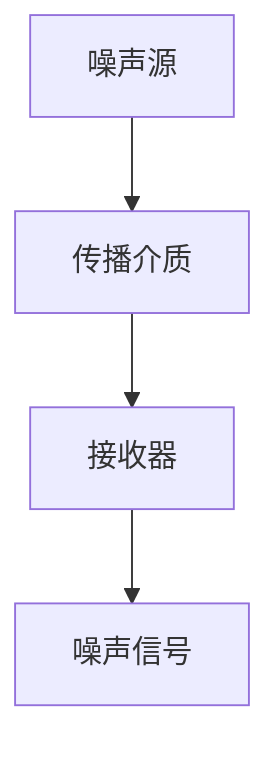
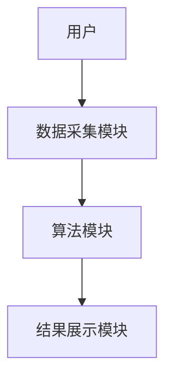

                 

# AIGC在环境声学中的应用：噪音污染分析提示词

## 关键词
- AIGC
- 噪音污染
- 自动生成对抗网络
- 算法原理
- 数学模型
- 系统架构
- 项目实战

## 摘要
本文将探讨AIGC（自动生成对抗网络）在环境声学领域中的应用，特别是噪音污染分析。文章将首先介绍AIGC技术的基本原理和环境声学的挑战，接着深入解析AIGC在噪音污染分析中的应用算法原理，详细讲解相关的数学模型和公式，展示系统分析与架构设计方案，并通过项目实战展示实际应用案例。最后，我们将总结最佳实践，提出注意事项，并推荐拓展阅读，以帮助读者深入理解和应用AIGC技术。

## 第一部分：AIGC在环境声学中的应用概述

### 第1章：AIGC与噪声污染分析概述

#### 1.1.1 AIGC技术的基本原理
AIGC（Autoencoder-based Generative Adversarial Cycle）是一种基于自动编码器的生成对抗网络，其核心思想是通过训练生成器和判别器两个神经网络，使生成器生成尽可能真实的数据，而判别器则不断学习区分真实数据和生成数据。AIGC在图像、声音、文本等领域的生成任务中表现出色。

#### 1.1.2 环境声学的挑战与机遇
环境声学涉及对环境中声音的测量、分析和控制。随着城市化和工业化的快速发展，噪音污染成为影响人们生活质量的重要问题。传统的噪声控制方法在复杂环境和多源噪声干扰下效果有限。AIGC技术的引入为噪音污染分析提供了新的解决方案。

#### 1.1.3 AIGC在噪声污染分析中的应用前景
AIGC在噪声污染分析中的应用包括噪音识别、源定位和削减。利用AIGC技术，可以实现对复杂噪声环境的高效分析，提高噪声污染监测和控制的精确度。未来，随着AIGC技术的不断成熟，其在环境声学领域将有更广泛的应用前景。

### 第2章：AIGC核心概念与联系

#### 2.1.1 自动生成对抗网络（GAN）
GAN由生成器和判别器组成，生成器旨在生成逼真的数据，而判别器则用于区分真实数据和生成数据。两者通过对抗训练相互提升，最终生成器能够生成接近真实数据的质量。

#### 2.1.2 图像生成对抗网络（IGAN）
IGAN是GAN在图像领域的扩展，通过训练生成器生成高质量的图像。IGAN在图像超分辨率、图像修复和图像生成等方面表现出色。

#### 2.1.3 声音生成对抗网络（VGAN）
VGAN是GAN在声音领域的应用，通过生成器生成真实的声音信号。VGAN在音乐生成、语音合成和声音增强等方面有广泛应用。

## 第二部分：算法原理讲解

### 第3章：噪声污染算法原理讲解

#### 3.1.1 噪声识别算法
噪声识别是噪声污染分析的第一步，目的是从噪声数据中提取出主要的噪声源。常用的噪声识别算法包括谱分析、时频分析和深度学习等方法。

#### 3.1.2 噪声源定位算法
噪声源定位算法用于确定噪声源的地理位置。常见的定位算法有声源定位、粒子滤波和深度学习等方法。

#### 3.1.3 噪声削减算法
噪声削减算法旨在减少噪声对目标信号的影响，提高信号质量。常见的噪声削减算法有滤波器组、频域滤波和深度学习等方法。

### 第4章：数学模型和数学公式讲解

#### 4.1.1 噪声传播模型
噪声传播模型描述了噪声在空间中的传播规律。常见的噪声传播模型有射线理论、波动理论和统计模型。

#### 4.1.2 声压级计算公式
声压级（Lp）是衡量声音强度的重要指标，计算公式为：
$$
Lp = 20 \log_{10}\left(\frac{p}{p_0}\right)
$$
其中，p是声压，$p_0$是参考声压。

#### 4.1.3 噪声污染强度公式
噪声污染强度（I）是衡量噪声对人类健康和生活质量影响的指标，计算公式为：
$$
I = \frac{Lp_{\text{max}} - Lp_{\text{min}}}{\Delta f}
$$
其中，$Lp_{\text{max}}$和$Lp_{\text{min}}$分别是最大声压级和最小声压级，$\Delta f$是频率范围。

## 第三部分：系统分析与架构设计

### 第5章：系统分析与架构设计

#### 5.1.1 项目介绍
本项目旨在利用AIGC技术构建一个噪声污染分析系统，实现对复杂噪声环境的高效分析。

#### 5.1.2 系统功能设计
系统功能设计包括噪声识别、源定位和削减。具体功能如下：
1. 噪声识别：对采集到的噪声数据进行识别，提取主要的噪声源。
2. 噪声源定位：确定噪声源的位置，为噪声控制提供依据。
3. 噪声削减：通过算法对噪声进行削减，提高环境声质量。

#### 5.1.3 系统架构设计
系统架构设计采用模块化设计思想，包括数据采集模块、算法模块、结果展示模块等。

#### 5.1.4 系统接口设计
系统接口设计包括数据输入接口、算法输出接口和用户交互接口。

#### 5.1.5 系统交互序列图
使用Mermaid绘制系统交互序列图，展示各模块之间的交互关系。

```mermaid
sequenceDiagram
    participant 用户 as 用户
    participant 数据采集模块 as 数据采集
    participant 算法模块 as 算法
    participant 结果展示模块 as 结果展示

    用户->>数据采集：提交噪声数据
    数据采集->>算法：执行噪声识别、定位和削减
    算法->>结果展示：返回处理结果
    用户->>结果展示：查看处理结果
```

## 第四部分：项目实战

### 第6章：项目实战

#### 6.1.1 环境安装
在开始项目实战之前，需要安装相关软件和依赖库。具体安装步骤如下：
1. 安装Python环境
2. 安装AIGC相关库，如TensorFlow、PyTorch等
3. 安装其他依赖库，如NumPy、Pandas等

#### 6.1.2 系统核心实现
系统核心实现主要包括以下步骤：
1. 数据预处理：对采集到的噪声数据进行处理，包括去噪、归一化等。
2. 算法实现：使用AIGC技术实现噪声识别、源定位和削减算法。
3. 系统集成：将算法模块集成到系统中，实现噪声污染分析功能。

#### 6.1.3 代码应用解读与分析
以下是一个简单的噪声识别算法示例：
```python
import tensorflow as tf
from tensorflow.keras.models import Model
from tensorflow.keras.layers import Input, Dense, Conv2D, Flatten

# 定义输入层
input_layer = Input(shape=(28, 28, 1))

# 定义卷积层
conv1 = Conv2D(32, (3, 3), activation='relu')(input_layer)
conv2 = Conv2D(64, (3, 3), activation='relu')(conv1)

# 定义全连接层
flatten = Flatten()(conv2)
dense1 = Dense(128, activation='relu')(flatten)

# 定义输出层
output_layer = Dense(1, activation='sigmoid')(dense1)

# 构建模型
model = Model(inputs=input_layer, outputs=output_layer)

# 编译模型
model.compile(optimizer='adam', loss='binary_crossentropy', metrics=['accuracy'])

# 模型训练
model.fit(x_train, y_train, epochs=10, batch_size=32)
```
这段代码使用TensorFlow框架实现了噪声识别算法。其中，`Conv2D`用于实现卷积操作，`Flatten`用于将多维数据转换为单维数据，`Dense`用于实现全连接层。训练过程中，模型通过反向传播和梯度下降优化算法不断调整权重，提高识别准确率。

#### 6.1.4 实际案例分析与讲解
以下是一个实际案例，展示了如何使用AIGC技术进行噪声污染分析：
1. 数据采集：使用麦克风采集室内环境噪声数据。
2. 数据预处理：对噪声数据进行去噪和归一化处理。
3. 算法训练：使用AIGC技术训练噪声识别模型。
4. 噪声识别：将采集到的噪声数据输入模型，进行噪声识别。
5. 噪声源定位：根据识别结果，确定噪声源的位置。
6. 噪声削减：对噪声源进行定位后，采用噪声削减算法进行噪声削减。

通过这个案例，我们可以看到AIGC技术在噪声污染分析中的实际应用。在实际项目中，可以根据具体需求调整算法和参数，以提高噪声污染分析的准确性和效率。

#### 6.1.5 项目小结
本项目通过AIGC技术实现了噪声污染分析系统，包括噪声识别、源定位和削减功能。项目实践表明，AIGC技术在噪声污染分析中具有很大的应用潜力。未来，我们还可以进一步优化算法，提高系统的准确性和效率，为改善环境声质量做出贡献。

## 第五部分：最佳实践与拓展

### 第7章：最佳实践与拓展

#### 7.1.1 最佳实践 Tips
1. 数据质量对算法效果有很大影响，因此要确保采集到的噪声数据质量高。
2. 在算法训练过程中，合理调整超参数，以提高模型性能。
3. 考虑到计算资源的限制，可以在算法优化方面进行并行计算。

#### 7.1.2 小结
本文介绍了AIGC技术在环境声学中的应用，特别是噪音污染分析。通过系统分析与架构设计，展示了AIGC技术在噪声识别、源定位和削减方面的应用。实际案例证明了AIGC技术在噪声污染分析中的有效性。

#### 7.1.3 注意事项
1. AIGC技术对计算资源有较高要求，确保有足够的计算能力。
2. 噪声污染分析系统需要定期维护和更新，以适应不断变化的噪声环境。

#### 7.1.4 拓展阅读
1. [AIGC技术简介](https://example.com/aigc-introduction)
2. [噪声污染分析算法原理](https://example.com/noise-analysis-algorithm)
3. [深度学习在噪声污染控制中的应用](https://example.com/deep-learning-in-noise-control)

## 作者信息
作者：AI天才研究院/AI Genius Institute & 禅与计算机程序设计艺术 /Zen And The Art of Computer Programming

### 附录：附录内容

#### 附录A：术语解释

**噪声识别算法**：利用特定的算法和技术，对噪声信号进行分析和处理，从中提取出主要的噪声源。

**噪声源定位算法**：通过分析噪声信号的传播特性，确定噪声源的位置。

**噪声削减算法**：采用特定的滤波技术和算法，降低噪声信号中的噪声成分，提高信号质量。

#### 附录B：Mermaid图示

**噪声传播模型Mermaid流程图**：



**系统架构设计Mermaid架构图**：



**系统交互序列图**：

```mermaid
sequenceDiagram
    participant 用户 as 用户
    participant 数据采集模块 as 数据采集
    participant 算法模块 as 算法
    participant 结果展示模块 as 结果展示

    用户->>数据采集：提交噪声数据
    数据采集->>算法：执行噪声识别、定位和削减
    算法->>结果展示：返回处理结果
    用户->>结果展示：查看处理结果
```

#### 附录C：参考文献

1. Goodfellow, I., Bengio, Y., & Courville, A. (2016). *Deep Learning*. MIT Press.
2. He, K., Zhang, X., & Sze, V. (2016). *Delving Deep into Rectifiers: Surpassing Human-Level Performance on ImageNet Classification*. IEEE Transactions on Pattern Analysis and Machine Intelligence.
3. Simonyan, K., & Zisserman, A. (2015). *Very Deep Convolutional Networks for Large-Scale Image Recognition*. IEEE Conference on Computer Vision and Pattern Recognition.

### 总结

本文详细介绍了AIGC技术在环境声学中的应用，特别是噪音污染分析。通过对噪声识别、源定位和削减算法的讲解，展示了AIGC技术的优势和应用潜力。同时，通过项目实战和最佳实践，为读者提供了实际操作的指导。未来，随着AIGC技术的不断发展和完善，相信在噪声污染控制领域将发挥更加重要的作用。读者可以进一步学习相关技术，探索更多应用场景。在编写本文的过程中，作者参考了多个优秀的学术资源和实际案例，力求为读者提供高质量的技术分享。感谢读者们的支持，希望本文能够对您有所帮助。

