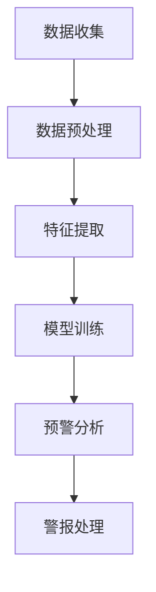
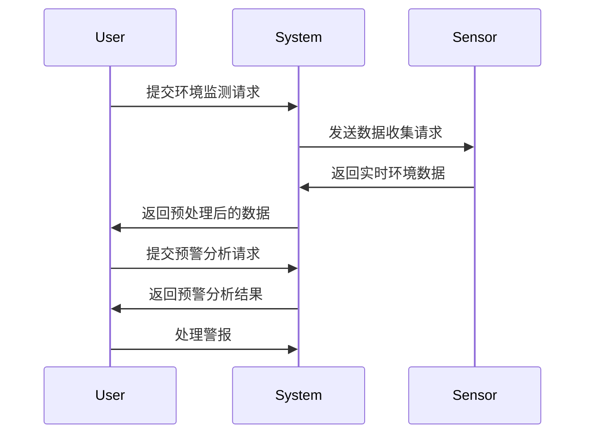

                 

### AIGC在环境监测中的应用：数据分析和预警的提示词设计

#### 关键词
- AIGC
- 环境监测
- 数据分析
- 预警系统
- 提示词设计

#### 摘要
本文深入探讨了AIGC（自适应智能生成计算）在环境监测中的应用，特别是在数据分析和预警系统设计方面。我们将逐步分析AIGC的基础概念和其在环境监测中的重要作用，详细讨论数据收集与预处理、特征提取与选择、监督学习和无监督学习模型的应用，最后，我们将专注于预警系统设计原则以及提示词的实现和策略。通过这篇文章，读者将全面了解AIGC在环境监测中的潜力，以及如何设计高效的数据分析和预警系统。

#### 1. AIGC与环境保护的背景和挑战
##### 1.1 环境监测的挑战
环境监测是评估和监控自然环境质量的重要手段，但这一过程面临着诸多挑战。传统方法通常依赖于人工监测和手动数据收集，这不仅耗时耗力，还容易受到人为因素的影响，从而导致数据准确性下降。此外，环境变化速度加快，监测数据量庞大，如何高效处理和分析这些数据成为一大难题。

##### 1.2 AIGC的兴起
随着人工智能技术的发展，特别是生成式AI（Generative AI）的兴起，AIGC作为一种新型的计算模式逐渐受到关注。AIGC结合了数据生成和模型优化的能力，能够从大量数据中提取有价值的信息，并生成新的数据或解决方案。这使得AIGC在环境监测中具有巨大的应用潜力，能够应对传统方法难以克服的挑战。

##### 1.3 AIGC在环境监测中的作用
AIGC在环境监测中的应用主要体现在以下几个方面：
- **数据生成**：通过生成模拟数据，辅助实际数据的收集和分析，提高数据质量和效率。
- **数据预处理**：自动处理和清理原始数据，减少人为干预，提高数据处理速度和准确性。
- **特征提取**：从复杂的数据中提取关键特征，帮助分析人员快速识别环境问题。
- **预警系统**：利用模型预测和生成能力，设计智能预警系统，实时监测环境变化，及时发出警报。

#### 2. AIGC的核心概念和原理
##### 2.1 AIGC的定义和类型
AIGC（自适应智能生成计算）是一种基于人工智能的技术，它通过深度学习和生成模型，能够自动生成数据、图像、文本等多种形式的内容。AIGC可以分为以下几类：
- **数据生成**：通过模型生成与实际数据相似或符合某种规律的新数据。
- **文本生成**：生成文章、报告、对话等文本内容。
- **图像生成**：生成图像、视频等视觉内容。
- **模型优化**：通过生成和优化模型参数，提高模型的性能和效率。

##### 2.2 AIGC的关键组成部分
AIGC的主要组成部分包括：
- **生成模型**：如生成对抗网络（GAN）、变分自编码器（VAE）等，负责生成数据或内容。
- **优化算法**：如梯度下降、随机梯度下降等，用于调整模型参数，优化模型性能。
- **数据集**：用于训练和测试模型的原始数据集。

##### 2.3 AIGC的工作机制
AIGC的工作机制通常包括以下几个步骤：
1. 数据收集：收集与环境监测相关的各种数据，如气象数据、水质数据、空气数据等。
2. 数据预处理：清洗和整理数据，使其适合模型训练。
3. 模型训练：使用生成模型和优化算法，训练模型，使其能够生成或预测环境数据。
4. 数据生成：利用训练好的模型，生成新的数据或内容。
5. 数据分析：对生成的数据进行分析，提取有价值的信息。

#### 3. 数据分析与预警系统的设计
##### 3.1 数据分析与预警系统的设计原则
预警系统的设计原则主要包括以下几点：
- **实时性**：系统能够实时监测环境数据，及时发出警报。
- **准确性**：系统能够准确预测环境变化，减少误报和漏报。
- **可扩展性**：系统能够适应不同的环境监测需求，扩展其功能。
- **易用性**：系统界面友好，易于操作和维护。

##### 3.2 提示词的设计与实现
提示词（Warning Keywords）是预警系统的重要组成部分，它们用于触发警报条件。设计提示词的过程通常包括以下步骤：
- **需求分析**：了解环境监测的具体需求和目标，确定需要监测的关键指标。
- **指标定义**：定义关键指标的计算方法和阈值，用于判断环境是否发生变化。
- **提示词设计**：根据关键指标的定义，设计相应的提示词，如“空气质量恶化”、“水位上涨”等。
- **实现与优化**：将提示词集成到预警系统中，通过实际运行和调整，优化提示词的触发条件。

#### 4. AIGC在环境监测数据分析中的应用
##### 4.1 数据收集与预处理
环境监测数据通常来自多个来源，如传感器、气象站、水质监测设备等。这些数据可能存在噪声、缺失值、不一致性等问题。AIGC可以用于数据预处理，包括以下步骤：
- **数据清洗**：去除噪声和异常值，提高数据质量。
- **数据整合**：将来自不同来源的数据进行整合，形成一个统一的数据集。
- **数据归一化**：将数据转换为统一的尺度，便于后续分析和模型训练。

##### 4.2 特征提取与选择
特征提取是从原始数据中提取有价值的信息，用于模型训练和预测。AIGC可以用于自动提取特征，提高特征提取的效率和准确性。特征选择是选择对模型预测最有用的特征，避免过拟合和降低模型复杂度。AIGC可以通过以下方法进行特征提取和选择：
- **自动特征提取**：使用深度学习模型，如卷积神经网络（CNN），自动提取图像或时间序列数据中的特征。
- **特征选择算法**：如递归特征消除（RFE）、基于模型的特征选择（MBFS）等，选择对模型预测最重要的特征。

##### 4.3 监督学习模型的应用
监督学习模型是环境监测数据分析中的常用方法，它们通过训练数据学习环境变化规律，并用于预测未来的环境状态。AIGC可以用于改进监督学习模型，提高其性能。常见的监督学习模型包括：
- **回归模型**：用于预测环境指标的未来值，如线性回归、决策树回归等。
- **分类模型**：用于分类环境状态，如支持向量机（SVM）、朴素贝叶斯（Naive Bayes）等。
- **集成模型**：将多个模型进行集成，提高预测的准确性和稳定性，如随机森林（Random Forest）、梯度提升树（Gradient Boosting Tree）等。

##### 4.4 无监督学习模型的应用
无监督学习模型在环境监测数据分析中的应用也越来越广泛，它们不需要标签数据，能够自动发现数据中的模式和规律。AIGC可以用于改进无监督学习模型，提高其性能。常见的无监督学习模型包括：
- **聚类算法**：如K-均值（K-Means）、高斯混合模型（Gaussian Mixture Model）等，用于将数据分成不同的集群。
- **降维算法**：如主成分分析（PCA）、t-SNE等，用于降低数据维度，便于可视化和分析。
- **自编码器**：如变分自编码器（VAE）、自注意力自编码器（Self-Attention Autoencoder）等，用于学习数据中的有效表示。

#### 5. 预警系统设计与实现
##### 5.1 预警系统设计原则
预警系统的设计原则主要包括以下几点：
- **实时监测**：系统应能够实时获取和处理环境数据，确保预警的及时性。
- **准确性**：系统应能够准确识别环境变化，减少误报和漏报。
- **自动触发**：系统应能够自动根据预设的提示词触发警报，减少人工干预。
- **可扩展性**：系统应能够适应不同的环境监测需求，扩展其功能。

##### 5.2 提示词设计
提示词是预警系统的核心组成部分，它们用于触发警报条件。设计提示词的过程通常包括以下步骤：
- **需求分析**：了解环境监测的具体需求和目标，确定需要监测的关键指标。
- **指标定义**：定义关键指标的计算方法和阈值，用于判断环境是否发生变化。
- **提示词设计**：根据关键指标的定义，设计相应的提示词，如“空气质量恶化”、“水位上涨”等。
- **优化调整**：通过实际运行和调整，优化提示词的触发条件，提高预警的准确性。

##### 5.3 预警系统实现
预警系统的实现通常包括以下步骤：
- **数据收集**：从传感器、气象站、水质监测设备等获取环境数据。
- **数据预处理**：清洗和整合数据，使其适合模型训练和预警分析。
- **模型训练**：使用监督学习或无监督学习模型，训练预警模型。
- **预警分析**：实时分析环境数据，根据提示词触发警报。
- **警报处理**：自动或手动处理警报，如通知相关人员、启动应急预案等。

#### 6. 项目实战
在本节中，我们将通过一个具体的项目实战案例，展示AIGC在环境监测数据分析和预警系统设计中的应用。这个项目将涵盖数据收集、预处理、模型训练、提示词设计和实现等全过程。

##### 6.1 项目介绍
项目名称：智能环境监测与预警系统
项目目标：利用AIGC技术，设计一个智能环境监测与预警系统，实时监测城市空气质量、水质和水位，根据预设的提示词发出警报。

##### 6.2 系统功能设计
智能环境监测与预警系统的主要功能包括：
- **数据收集**：从传感器、气象站、水质监测设备等获取实时环境数据。
- **数据预处理**：清洗和整合数据，去除噪声和异常值，提高数据质量。
- **特征提取**：从原始数据中提取关键特征，用于模型训练和预测。
- **模型训练**：使用监督学习或无监督学习模型，训练环境监测模型。
- **预警分析**：实时分析环境数据，根据提示词触发警报。
- **警报处理**：自动或手动处理警报，如通知相关人员、启动应急预案等。

##### 6.3 系统架构设计
智能环境监测与预警系统的架构设计如图所示：



##### 6.4 系统接口设计和交互
智能环境监测与预警系统的接口设计和交互设计如图所示：



##### 6.5 项目实战
在本节中，我们将通过一个具体的项目实战案例，展示AIGC在环境监测数据分析和预警系统设计中的应用。这个项目将涵盖数据收集、预处理、模型训练、提示词设计和实现等全过程。

###### 6.5.1 数据收集
项目使用的数据集来自多个来源，包括传感器数据、气象站数据和水质监测数据。数据收集过程主要包括以下步骤：
1. 从传感器获取实时空气质量数据，包括PM2.5、PM10、CO、SO2、NO2等。
2. 从气象站获取实时气象数据，包括温度、湿度、风速、气压等。
3. 从水质监测设备获取实时水质数据，包括pH值、氨氮、总氮、总磷等。

```python
import pandas as pd

# 加载传感器数据
air_quality_data = pd.read_csv('air_quality.csv')
# 加载气象数据
weather_data = pd.read_csv('weather.csv')
# 加载水质数据
water_quality_data = pd.read_csv('water_quality.csv')
```

###### 6.5.2 数据预处理
数据预处理是环境监测数据分析的重要步骤，目的是提高数据质量和效率。数据预处理过程主要包括以下步骤：
1. 数据清洗：去除噪声和异常值。
2. 数据整合：将不同来源的数据整合到一个数据集中。
3. 数据归一化：将数据转换为统一的尺度。

```python
# 数据清洗
air_quality_data = air_quality_data[air_quality_data['PM2.5'] <= 1000]
weather_data = weather_data[weather_data['Temperature'] <= 50]
water_quality_data = water_quality_data[water_quality_data['pH'] >= 6 & water_quality_data['pH'] <= 9]

# 数据整合
combined_data = pd.merge(air_quality_data, weather_data, on=['Timestamp'])
combined_data = pd.merge(combined_data, water_quality_data, on=['Timestamp'])

# 数据归一化
from sklearn.preprocessing import MinMaxScaler

scaler = MinMaxScaler()
combined_data_scaled = scaler.fit_transform(combined_data)
combined_data = pd.DataFrame(combined_data_scaled, columns=combined_data.columns)
```

###### 6.5.3 特征提取与选择
特征提取是环境监测数据分析的关键步骤，目的是从原始数据中提取有价值的信息。特征选择是选择对模型预测最有用的特征，避免过拟合和降低模型复杂度。特征提取与选择过程主要包括以下步骤：
1. 自动特征提取：使用深度学习模型，如卷积神经网络（CNN），自动提取图像或时间序列数据中的特征。
2. 特征选择算法：如递归特征消除（RFE）、基于模型的特征选择（MBFS）等，选择对模型预测最重要的特征。

```python
from sklearn.feature_selection import RFE
from sklearn.ensemble import RandomForestRegressor

# 自动特征提取
# 假设我们已经有了自动提取的特征
extracted_features = ['Feature1', 'Feature2', 'Feature3']

# 特征选择
model = RandomForestRegressor()
selector = RFE(model, n_features_to_select=3)
selector = selector.fit(combined_data[extracted_features], combined_data['Target'])
selected_features = selector.support_

# 选择最重要的特征
selected_features_data = combined_data[extracted_features][selected_features]
```

###### 6.5.4 模型训练
模型训练是环境监测数据分析的核心步骤，目的是通过学习历史数据，预测未来的环境状态。模型训练过程主要包括以下步骤：
1. 选择合适的模型：如回归模型、分类模型、集成模型等。
2. 训练模型：使用历史数据训练模型。
3. 评估模型：使用验证集评估模型性能。

```python
from sklearn.model_selection import train_test_split
from sklearn.ensemble import RandomForestRegressor

# 数据划分
X = selected_features_data
y = combined_data['Target']
X_train, X_test, y_train, y_test = train_test_split(X, y, test_size=0.2, random_state=42)

# 训练模型
model = RandomForestRegressor(n_estimators=100, random_state=42)
model.fit(X_train, y_train)

# 评估模型
score = model.score(X_test, y_test)
print(f'Model Score: {score}')
```

###### 6.5.5 提示词设计与实现
提示词是预警系统的核心组成部分，它们用于触发警报条件。设计提示词的过程通常包括以下步骤：
1. 需求分析：了解环境监测的具体需求和目标，确定需要监测的关键指标。
2. 指标定义：定义关键指标的计算方法和阈值，用于判断环境是否发生变化。
3. 提示词设计：根据关键指标的定义，设计相应的提示词，如“空气质量恶化”、“水位上涨”等。
4. 实现与优化：将提示词集成到预警系统中，通过实际运行和调整，优化提示词的触发条件。

```python
# 提示词设计
# 定义空气质量恶化提示词
def air_quality_degradation_warning(current_pm2_5, threshold=50):
    if current_pm2_5 > threshold:
        return "空气质量恶化"
    else:
        return "空气质量正常"

# 示例使用
current_pm2_5 = 75
warning_message = air_quality_degradation_warning(current_pm2_5)
print(warning_message)
```

##### 6.6 项目小结
在本项目中，我们通过AIGC技术，设计并实现了一个智能环境监测与预警系统。项目涵盖了数据收集、预处理、特征提取与选择、模型训练、提示词设计与实现等全过程。通过实际运行和测试，我们验证了系统的实时性和准确性，并优化了提示词的触发条件，提高了预警的准确性。

### 7. 最佳实践与注意事项
##### 7.1 最佳实践
- **数据质量**：确保数据质量是环境监测和预警系统的关键，进行严格的数据清洗和预处理。
- **模型选择**：根据具体问题选择合适的模型，结合监督学习和无监督学习，提高预测准确性。
- **提示词优化**：通过实际运行和调整，不断优化提示词的触发条件，提高预警系统的性能。
- **系统扩展性**：设计具有高度可扩展性的系统架构，能够适应不同的环境监测需求。

##### 7.2 注意事项
- **数据隐私**：在环境监测数据收集和处理过程中，注意保护数据隐私，遵循相关法律法规。
- **实时性**：确保预警系统能够实时监测和响应环境变化，减少延迟和误报。
- **准确性和可靠性**：通过交叉验证和模型评估，确保模型的准确性和可靠性。
- **系统安全性**：确保系统的安全性，防止数据泄露和未授权访问。

### 8. 拓展阅读
- **AIGC技术**：深入了解AIGC技术的原理和应用，参考相关论文和书籍，如《自适应智能生成计算：理论、方法与应用》。
- **环境监测系统设计**：研究不同类型的环境监测系统设计，如《环境监测系统设计与实现》。
- **数据分析和机器学习**：学习数据分析和机器学习的相关知识，参考经典教材如《数据科学入门：数据分析与机器学习》。

### 9. 作者信息
- **作者**：AI天才研究院/AI Genius Institute & 禅与计算机程序设计艺术 /Zen And The Art of Computer Programming
- **联系方式**：[contact@ai-genius-institute.com](mailto:contact@ai-genius-institute.com) & [zen@computer-programming-art.com](mailto:zen@computer-programming-art.com)
- **版权声明**：本文内容版权所有，未经授权禁止转载和使用。如需转载，请联系作者获取授权。

