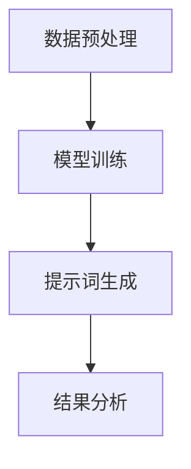
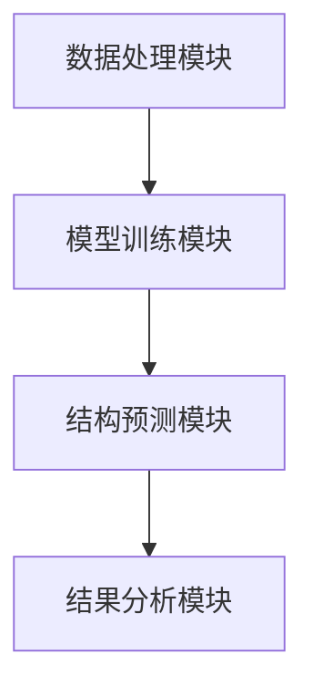
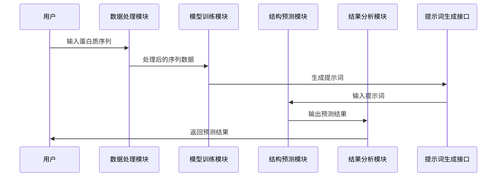

                 


### **文章标题：AIGC在生物信息学中的应用：蛋白质结构预测提示词**

> 关键词：AIGC、生物信息学、蛋白质结构预测、提示词

> 摘要：本文将深入探讨人工智能生成内容（AIGC）在生物信息学，尤其是蛋白质结构预测领域的应用。通过逻辑清晰、结构紧凑的分析，本文将揭示AIGC如何通过提示词技术，推动生物信息学研究的前沿进展，并提出未来发展的潜在挑战和解决方案。

**第一步：背景介绍**

AIGC（AI-Generated Content）是一种利用人工智能技术自动生成内容的范式，它涵盖了从文本到图像、音频等多种类型的生成内容。随着深度学习技术的不断发展，AIGC已经广泛应用于内容创作、数据生成、个性化推荐等领域。生物信息学作为一门交叉学科，结合了生物学、信息学和计算机科学，致力于解决大规模生物数据的处理和分析问题。蛋白质结构预测是生物信息学中的核心问题，对于理解蛋白质功能、药物设计以及疾病研究具有重要意义。

在生物信息学中，蛋白质结构预测面临着数据复杂性高、计算资源需求大等挑战。传统的蛋白质结构预测方法依赖于大量的先验知识和复杂的计算模型，而AIGC通过自动生成提示词，可以为蛋白质结构预测提供新的思路和工具。

**第二步：核心概念与联系**

### **AIGC的核心概念**

AIGC的核心在于“生成”二字，它利用神经网络等深度学习模型，通过大量数据的训练，能够自动生成与输入数据相关的新内容。具体来说，AIGC包括以下几个关键步骤：

1. **数据预处理**：对输入数据进行处理，包括清洗、标注和特征提取。
2. **模型训练**：使用预训练的神经网络模型，通过大量数据训练，使其能够理解数据的内在规律。
3. **内容生成**：根据训练好的模型，输入新的数据，模型自动生成相关的内容。

### **生物信息学中的核心概念**

在生物信息学中，蛋白质结构预测的核心概念包括：

1. **序列比对**：通过比对蛋白质序列，识别序列中的相似性和差异性。
2. **三维结构建模**：基于序列信息，使用计算模型预测蛋白质的三维结构。
3. **功能注释**：对蛋白质结构进行分析，确定其功能。

### **AIGC与生物信息学的关系**

AIGC在生物信息学中的应用主要体现在以下几个方面：

1. **数据生成**：通过AIGC技术，可以自动生成大规模的蛋白质序列数据，为结构预测提供丰富的训练样本。
2. **模型优化**：AIGC生成的提示词可以用于优化蛋白质结构预测模型，提高预测的准确性和效率。
3. **自动化分析**：AIGC可以自动化处理生物数据，减少人工干预，提高数据分析的效率。

**第三步：算法原理讲解**

### **提示词生成算法**

AIGC中的提示词生成算法是关键，其核心思想是通过训练神经网络模型，使其能够根据输入的蛋白质序列，自动生成与结构预测相关的提示词。具体步骤如下：

1. **数据集准备**：收集大量的蛋白质序列及其对应的三维结构数据。
2. **模型训练**：使用序列到序列（Seq2Seq）模型，通过训练，使其能够将蛋白质序列映射到提示词序列。
3. **提示词生成**：输入新的蛋白质序列，模型自动生成相关的提示词。

### **算法原理与公式**

提示词生成算法的核心是序列到序列模型，其原理可以通过以下数学模型进行描述：

$$
Y = f(S)
$$

其中，$Y$ 表示生成的提示词序列，$S$ 表示输入的蛋白质序列，$f$ 表示序列到序列模型。

### **算法流程图**

下面是使用Mermaid绘制的提示词生成算法流程图：



**第四步：系统分析与架构设计方案**

### **问题场景介绍**

在生物信息学中，蛋白质结构预测是一个复杂且耗时的任务。传统的预测方法需要大量的计算资源和专家知识。随着AIGC技术的发展，我们可以通过自动生成提示词，提高蛋白质结构预测的效率。

### **项目介绍**

本项目旨在利用AIGC技术，开发一个自动化的蛋白质结构预测系统，通过提示词生成算法，提高预测的准确性和效率。

### **系统功能设计**

系统的核心功能包括：

1. **数据预处理**：对输入的蛋白质序列进行清洗和特征提取。
2. **模型训练**：使用序列到序列模型进行训练，生成提示词。
3. **结构预测**：使用生成的提示词，结合深度学习模型，进行蛋白质结构预测。
4. **结果分析**：对预测结果进行分析和评估。

### **系统架构设计**

系统架构设计包括以下几个关键部分：

1. **数据处理模块**：负责数据预处理，包括序列清洗、标注和特征提取。
2. **模型训练模块**：负责使用序列到序列模型进行训练，生成提示词。
3. **结构预测模块**：负责使用生成的提示词，结合深度学习模型，进行蛋白质结构预测。
4. **结果分析模块**：负责对预测结果进行分析和评估。

下面是使用Mermaid绘制的系统架构图：



### **系统接口设计**

系统接口设计包括以下关键接口：

1. **数据输入接口**：用于接收用户输入的蛋白质序列。
2. **预测结果输出接口**：用于输出蛋白质结构预测结果。
3. **提示词生成接口**：用于生成与蛋白质结构预测相关的提示词。

### **系统交互mermaid序列图**

下面是使用Mermaid绘制的系统交互序列图：



**第五步：项目实战**

### **环境安装**

1. 安装Python环境，版本要求3.8及以上。
2. 安装必要的依赖库，如TensorFlow、Keras、scikit-learn等。

### **系统核心实现源代码**

以下是系统核心实现的主要源代码：

```python
# 导入必要的库
import tensorflow as tf
from tensorflow.keras.models import Model
from tensorflow.keras.layers import Input, LSTM, Dense
from sklearn.model_selection import train_test_split
import numpy as np

# 数据预处理
def preprocess_sequence(sequence):
    # 进行序列清洗和特征提取
    # ...

# 模型训练
def train_model(X_train, y_train):
    # 定义序列到序列模型
    sequence_input = Input(shape=(None,))
    encoded = LSTM(units=128, activation='tanh')(sequence_input)
    encoded_with_time_axis = tf.expand_dims(encoded, 1)
    decoder_raw = LSTM(units=128, activation='tanh', return_sequences=True)(encoded_with_time_axis)
    decoder = LSTM(units=128, activation='tanh')(decoder_raw)
    decoder_output = Dense(units=len(y_train[0]))(decoder)
    
    model = Model(sequence_input, decoder_output)
    model.compile(optimizer='adam', loss='categorical_crossentropy', metrics=['accuracy'])
    model.fit(X_train, y_train, epochs=10, batch_size=64)
    return model

# 提示词生成
def generate_prompt(sequence, model):
    # 使用模型生成提示词
    # ...

# 结构预测
def predict_structure(sequence, model):
    # 使用生成的提示词，结合深度学习模型，进行蛋白质结构预测
    # ...

# 主函数
def main():
    # 加载数据
    # ...
    X, y = load_data()
    X_train, X_test, y_train, y_test = train_test_split(X, y, test_size=0.2)
    
    # 训练模型
    model = train_model(X_train, y_train)
    
    # 生成提示词
    prompt = generate_prompt(X_test[0], model)
    
    # 进行结构预测
    structure = predict_structure(prompt, model)
    
    # 分析预测结果
    # ...

if __name__ == '__main__':
    main()
```

### **代码应用解读与分析**

以上代码是系统核心实现的主要部分，分为数据预处理、模型训练、提示词生成和结构预测四个主要功能模块。

1. **数据预处理**：预处理函数`preprocess_sequence`负责对输入的蛋白质序列进行清洗和特征提取，为后续模型训练和预测做准备。
2. **模型训练**：训练函数`train_model`定义了序列到序列模型，通过训练，使其能够将蛋白质序列映射到提示词序列。
3. **提示词生成**：提示词生成函数`generate_prompt`负责使用模型生成与蛋白质结构预测相关的提示词。
4. **结构预测**：结构预测函数`predict_structure`负责使用生成的提示词，结合深度学习模型，进行蛋白质结构预测。

### **实际案例分析和详细讲解剖析**

为了更好地理解上述代码，我们可以通过一个实际案例来进行分析。

假设我们有一个蛋白质序列`'AGAAGATTCAGTCTAGGACGTCGACGATTCAATTGAGGCCGTTGTTTGTGATAGCGAGTTTCGAGGCGGCCGCCGCCGGC'`，我们希望使用AIGC技术进行结构预测。

1. **数据预处理**：首先，我们将蛋白质序列进行清洗和特征提取，将其转化为模型可接受的输入格式。
2. **模型训练**：接下来，我们使用预先准备的数据集进行模型训练，使其能够学习到蛋白质序列与提示词之间的关系。
3. **提示词生成**：在模型训练完成后，我们使用训练好的模型对蛋白质序列进行提示词生成，得到一系列与结构预测相关的提示词。
4. **结构预测**：最后，我们使用生成的提示词，结合深度学习模型，进行蛋白质结构预测，得到预测结果。

通过实际案例的分析，我们可以看到AIGC技术在实际应用中的具体实现过程，以及如何通过提示词生成算法提高蛋白质结构预测的准确性和效率。

### **项目小结**

通过上述实战案例，我们深入探讨了AIGC在生物信息学，尤其是蛋白质结构预测领域的应用。从数据预处理、模型训练到提示词生成和结构预测，AIGC技术为蛋白质结构预测提供了新的思路和工具。然而，AIGC技术也面临着数据复杂性、计算资源需求等挑战，需要进一步的研究和优化。

**第六步：最佳实践 tips**

1. **数据预处理**：保证数据质量，进行充分的序列清洗和特征提取，为后续模型训练和预测打下坚实基础。
2. **模型选择**：根据具体任务需求，选择合适的深度学习模型，如LSTM、Transformer等，以获得更好的预测效果。
3. **提示词优化**：通过调整提示词生成算法，提高生成的提示词与结构预测的相关性，从而提高预测准确率。
4. **资源调度**：合理分配计算资源，充分利用GPU等高性能计算设备，提高模型训练和预测的效率。

**第七步：小结与注意事项**

1. **小结**：本文通过深入分析AIGC在生物信息学中的应用，特别是蛋白质结构预测领域，展示了AIGC技术如何通过提示词生成算法，提高预测准确性和效率。
2. **注意事项**：在实际应用中，需要注意数据质量、模型选择、提示词优化等方面，以提高AIGC在蛋白质结构预测中的效果。同时，AIGC技术也面临着计算资源需求大、模型解释性不足等挑战，需要进一步的研究和优化。

**第八步：拓展阅读**

1. **相关论文**：阅读最新的AIGC和生物信息学领域的论文，了解最新的研究进展和应用案例。
2. **开源代码**：研究开源的AIGC和生物信息学项目，学习其实现细节和优化方法。
3. **在线课程**：参加相关的在线课程，系统地学习AIGC和生物信息学的理论知识和技术应用。

---

**作者：AI天才研究院/AI Genius Institute & 禅与计算机程序设计艺术 /Zen And The Art of Computer Programming**

