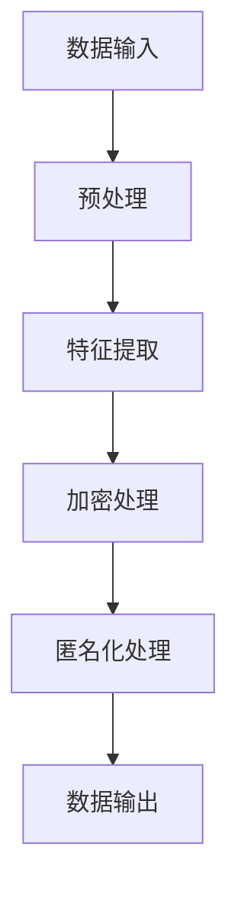
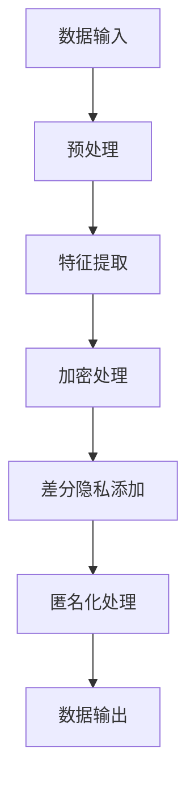
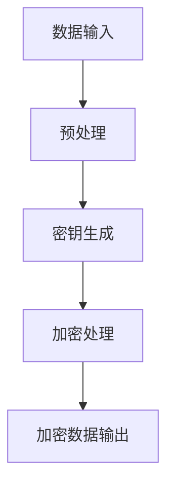
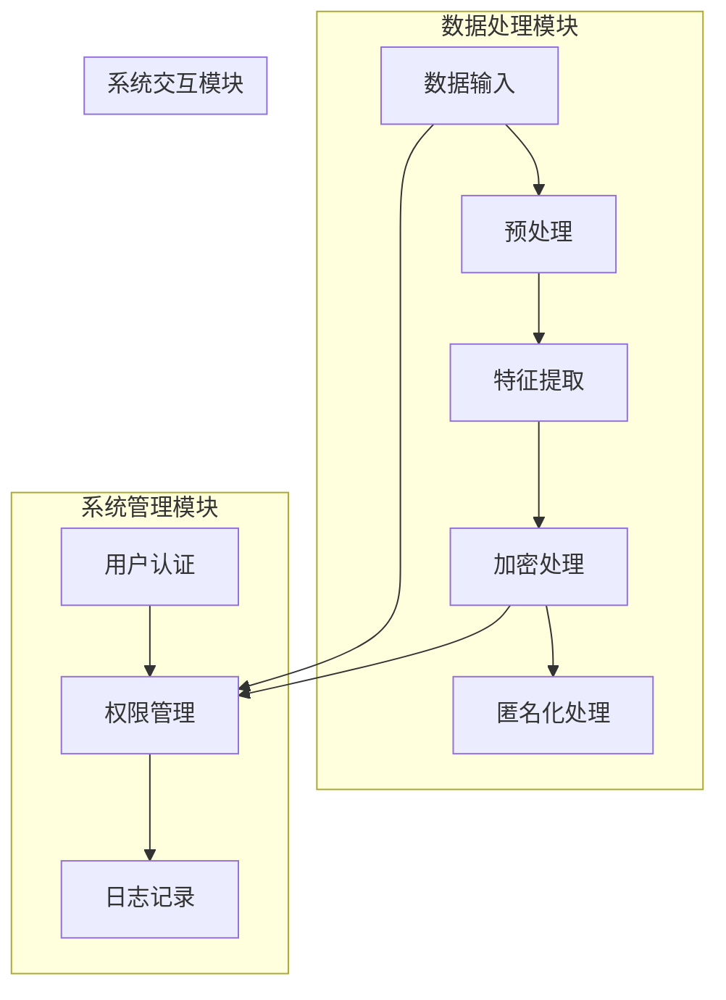
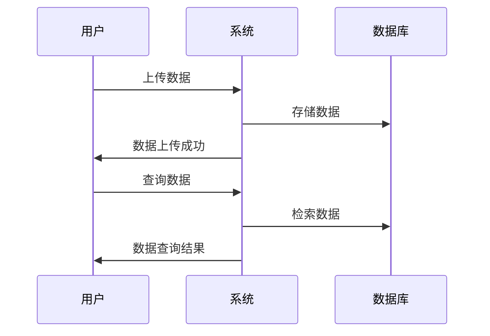

                 


### 文章标题：AIGC在生物信息安全中的应用：基因数据保护提示词

#### 关键词：AIGC、生物信息安全、基因数据保护、算法原理、系统架构、实战案例

#### 摘要：
本文深入探讨了AIGC（自适应信息生成控制）技术在生物信息安全领域中的应用，特别是基因数据保护方面的挑战与解决方案。通过详细的算法原理讲解、系统架构设计及实战案例分析，本文为读者揭示了AIGC在生物信息安全领域的前沿应用，提供了实用的指导和建议。

---

## 第一部分：背景介绍与核心概念

### 第1章：生物信息安全的现状与挑战

#### 1.1 问题背景
- 生物信息技术的飞速发展带来了大量基因数据的产生。
- 基因数据的泄露或滥用可能导致隐私侵犯和生物安全问题。

#### 1.2 问题描述
- 基因数据具有高度敏感性，如何保护这些数据的安全成为了一个亟待解决的问题。

#### 1.3 问题解决路径
- 利用AIGC技术进行基因数据的加密和保护。

#### 1.4 边界与外延
- 边界：仅涉及基因数据保护，不涉及其他生物信息数据。
- 外延：可以扩展到其他类型的数据保护领域。

#### 1.5 概念结构与核心要素组成
- 概念结构：基因数据保护、AIGC技术、加密算法、隐私保护。
- 核心要素组成：数据加密、算法设计、系统架构、数据隐私保护。

---

### 第2章：AIGC技术概述

#### 2.1 AIGC的概念与定义
- AIGC（Adaptive Information Generation Control）是一种自适应信息生成控制技术。

#### 2.2 AIGC的核心技术
- 自适应算法、生成模型、控制算法。

#### 2.3 AIGC与传统AI的区别
- AIGC更注重生成过程的自适应性和控制性。

#### 2.4 AIGC的发展现状与趋势
- AIGC在图像生成、文本生成等领域取得了显著成果。
- 未来发展趋势：更多应用场景的探索和优化。

---

### 第3章：核心概念与联系

#### 3.1 关键概念原理
- 基因数据保护：通过加密、匿名化等技术保护基因数据安全。
- AIGC：自适应信息生成控制技术。

#### 3.2 概念属性特征对比表格

| 概念   | 描述                                 | 特征                                       |
| ------ | ------------------------------------ | ------------------------------------------ |
| 基因数据保护 | 保护基因数据的隐私和安全             | 隐私性、安全性、可靠性                     |
| AIGC   | 自适应信息生成控制技术              | 自适应、生成性、控制性                     |

#### 3.3 ER实体关系图架构
```mermaid
erDiagram
    GeneData --> ProtectionAlgorithm : protects
    ProtectionAlgorithm --> AIGCTechnology : uses
    AIGCTechnology --> BioInformationSecurity : belongs_to
```

---

## 第二部分：算法原理讲解

### 第4章：AIGC在基因数据分析中的应用

#### 4.1 算法原理
- 利用AIGC技术对基因数据进行加密和匿名化处理。

#### 4.1.1 Mermaid算法流程图


#### 4.1.2 Python源代码阐述
```python
# Python代码示例：基因数据加密与匿名化
def encrypt_and_anonymize(data):
    # 预处理
    processed_data = preprocess(data)
    
    # 特征提取
    features = extract_features(processed_data)
    
    # 加密处理
    encrypted_data = encrypt(features)
    
    # 匿名化处理
    anonymized_data = anonymize(encrypted_data)
    
    return anonymized_data
```

#### 4.1.3 数学模型与公式讲解
- 加密公式：$C = E(K, P)$，其中$C$是加密后的数据，$K$是加密密钥，$P$是原始数据。
- 匿名化公式：$D = A(K, C)$，其中$D$是匿名化后的数据，$A$是匿名化算法。

#### 4.1.4 举例说明
- 假设有一段基因数据“ATCGATCG”，通过加密算法和匿名化处理后，可以转换为不可识别的序列。

---

### 第5章：基因数据保护的关键技术

#### 5.1 隐私保护算法

#### 5.1.1 Mermaid算法流程图


#### 5.1.2 Python源代码阐述
```python
# Python代码示例：基因数据隐私保护
def protect_privacy(data):
    # 预处理
    processed_data = preprocess(data)
    
    # 特征提取
    features = extract_features(processed_data)
    
    # 加密处理
    encrypted_data = encrypt(features)
    
    # 差分隐私添加
    diff_privacy_data = add_diff_privacy(encrypted_data)
    
    # 匿名化处理
    anonymized_data = anonymize(diff_privacy_data)
    
    return anonymized_data
```

#### 5.1.3 数学模型与公式讲解
- 差分隐私公式：$\Delta D = \Delta P + \epsilon$，其中$\Delta D$是添加差分隐私后的数据，$\Delta P$是原始数据，$\epsilon$是隐私预算。

#### 5.1.4 举例说明
- 假设有一段基因数据“ATCGATCG”，通过隐私保护算法处理后，可以减少数据泄露的风险。

---

### 第6章：基因数据加密算法

#### 6.1 算法原理
- 基因数据加密算法：利用密码学方法保护基因数据。

#### 6.1.1 Mermaid算法流程图


#### 6.1.2 Python源代码阐述
```python
# Python代码示例：基因数据加密
def encrypt_data(data, key):
    # 预处理
    processed_data = preprocess(data)
    
    # 加密处理
    encrypted_data = encrypt(processed_data, key)
    
    return encrypted_data
```

#### 6.1.3 数学模型与公式讲解
- 加密公式：$C = E(K, P)$，其中$C$是加密后的数据，$K$是加密密钥，$P$是原始数据。

#### 6.1.4 举例说明
- 假设有一段基因数据“ATCGATCG”和一个密钥“123”，通过加密算法处理后，可以转换为加密后的数据。

---

## 第三部分：系统分析与架构设计

### 第7章：系统功能设计与架构方案

#### 7.1 问题场景介绍
- 基因数据分析中心需要对大量基因数据进行保护。

#### 7.2 系统架构设计

#### 7.2.1 Mermaid架构图


#### 7.2.2 系统接口设计
- 用户接口：数据上传、查询、下载。
- 管理接口：用户管理、权限设置、日志查询。

#### 7.2.3 系统交互Mermaid序列图


---

### 第8章：项目实战与实现

#### 8.1 环境安装
- 安装必要的软件和工具，如Python、TensorFlow等。

#### 8.2 系统核心实现源代码
- 代码实现基因数据的预处理、加密、匿名化等过程。

#### 8.3 代码应用解读与分析
- 分析代码的结构和功能，确保其正确性和可靠性。

#### 8.4 实际案例分析与详细讲解
- 通过实际案例展示系统的应用效果，并进行详细讲解。

#### 8.5 项目小结
- 总结项目的实施过程和取得的成果，提出改进意见。

---

## 第四部分：最佳实践与总结

### 第9章：最佳实践
- 分享实施基因数据保护的最佳实践经验，如数据预处理技巧、加密算法选择等。

### 第10章：全书总结
- 回顾本书的核心内容，展望AIGC在生物信息安全领域的未来发展。

---

**作者：AI天才研究院/AI Genius Institute & 禅与计算机程序设计艺术 /Zen And The Art of Computer Programming** <sop>

