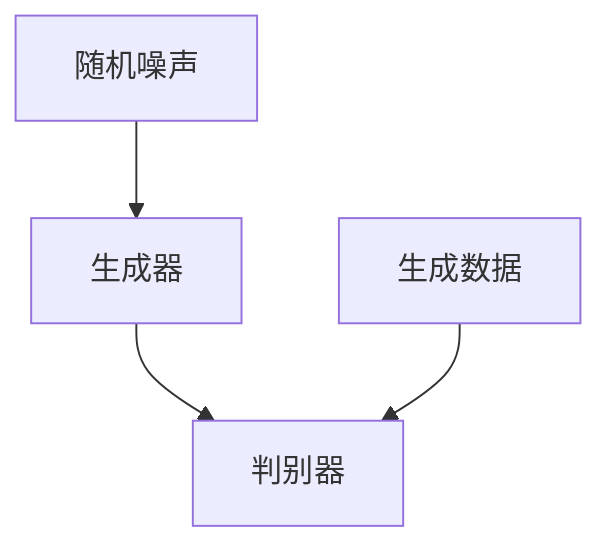
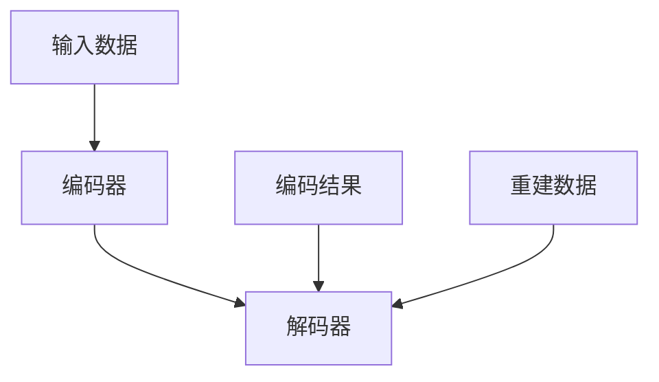
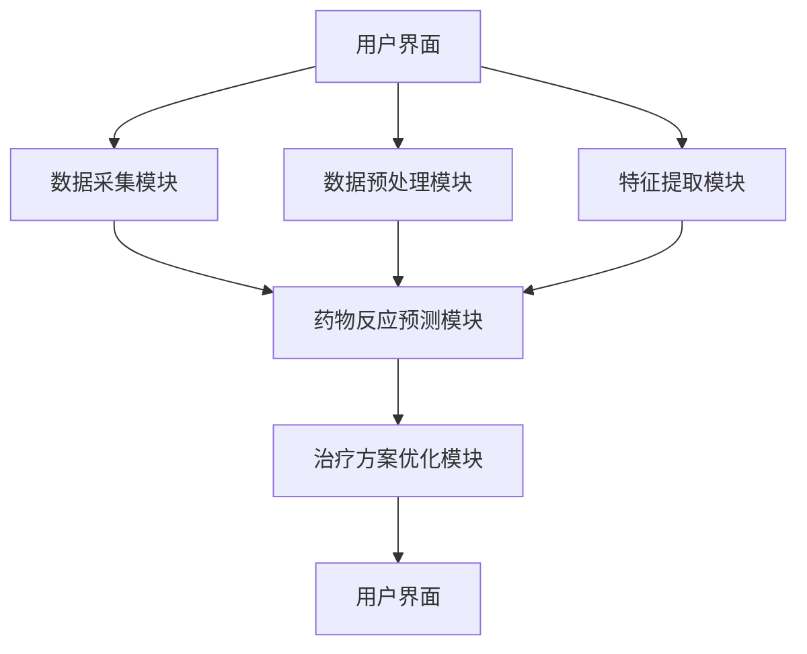
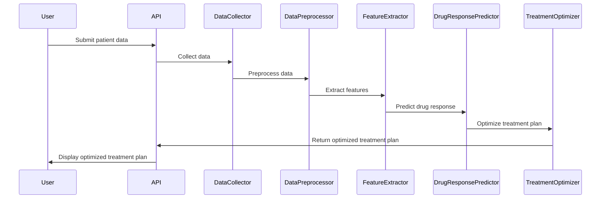

                 


## AIGC在生物制药个性化治疗中的应用：药物反应预测提示词

### 关键词：AIGC、生物制药、个性化治疗、药物反应预测、提示词

### 摘要：
本文深入探讨了AIGC（自适应信息生成控制）技术在生物制药个性化治疗中的潜在应用，特别是药物反应预测领域。通过逐步分析AIGC技术的特点、生物制药个性化治疗的需求，以及药物反应预测的关键问题，本文提出了AIGC技术在药物反应预测中的应用方案，并通过实际案例展示了其有效性和实用性。文章还详细讲解了相关的算法原理、数学模型、系统设计与实现过程，以及项目实战中的最佳实践和拓展阅读资源，为读者提供了全面的指导和深入的理解。

---

## 引言

### 1.1 研究背景

#### 1.1.1 生物制药行业的现状与挑战

生物制药行业在近年来得到了迅猛发展，尤其是在个性化治疗方面。个性化治疗是根据患者的具体基因特征、生活方式、环境和疾病状态，量身定制治疗方案的一种新兴治疗模式。这种模式能够显著提高治疗效果，减少不必要的副作用，从而提升患者的生存质量和生活质量。

然而，生物制药行业也面临着诸多挑战。首先是数据的高维度和复杂性。生物制药涉及大量的基因组数据、蛋白质组数据、代谢组数据等，这些数据维度高、复杂度高，传统的数据分析方法难以处理。其次是个体差异性问题。即使是同一种疾病，不同患者的基因表达和代谢途径也可能存在显著差异，这给药物反应预测带来了极大的困难。

#### 1.1.2 个性化治疗的需求与挑战

个性化治疗的需求主要体现在以下几个方面：

1. **精准医疗**：通过分析患者的基因组、蛋白质组和代谢组等数据，为患者提供最合适的治疗方案。
2. **个性化用药**：根据患者的基因特征，选择最适合的药物类型和剂量，从而提高治疗效果和降低副作用。
3. **动态调整**：个性化治疗方案需要根据患者的病情变化和药物反应动态调整，以达到最佳治疗效果。

然而，个性化治疗也面临着巨大的挑战：

1. **数据获取与处理**：个性化治疗需要大量的患者数据，但数据的获取和标准化处理仍然是一个难题。
2. **计算能力**：个性化治疗的实现依赖于强大的计算能力，尤其是对于复杂的数据分析和模型训练。
3. **跨学科合作**：个性化治疗涉及生物医学、计算科学、人工智能等多个领域，跨学科合作是实现个性化治疗的关键。

#### 1.1.3 AIGC技术的潜力与重要性

AIGC（自适应信息生成控制）技术是一种新兴的人工智能技术，它结合了生成模型和控制理论，能够在复杂的环境中生成和优化信息。AIGC技术的核心优势包括：

1. **自适应能力**：AIGC能够根据环境变化动态调整生成策略，从而实现信息的最优化。
2. **信息生成与控制**：AIGC技术能够在生成高质量信息的同时，实现对生成过程的控制，从而提高生成效率和质量。
3. **跨学科应用**：AIGC技术具有广泛的应用前景，包括图像生成、自然语言处理、自动化编程等。

在生物制药个性化治疗中，AIGC技术具有巨大的潜力：

1. **药物反应预测**：AIGC技术可以用于预测不同药物在不同患者中的反应，从而为个性化用药提供科学依据。
2. **治疗方案优化**：AIGC技术可以优化个性化治疗方案，提高治疗效果和降低成本。
3. **跨学科合作**：AIGC技术能够促进生物医学与计算科学的深度融合，推动个性化治疗的全面发展。

### 1.2 研究问题与目标

#### 1.2.1 研究问题

本文旨在解决以下研究问题：

1. **药物反应预测**：如何利用AIGC技术预测不同药物在不同患者中的反应？
2. **治疗方案优化**：如何利用AIGC技术优化个性化治疗方案，提高治疗效果和降低成本？
3. **跨学科融合**：如何实现AIGC技术与生物制药个性化治疗的深度融合？

#### 1.2.2 研究目标

本文的研究目标包括：

1. **理论探索**：深入探讨AIGC技术在生物制药个性化治疗中的应用原理，为药物反应预测和治疗方案优化提供理论支持。
2. **方法研究**：提出基于AIGC技术的药物反应预测和治疗方案优化方法，并通过实际案例验证其有效性和实用性。
3. **跨学科合作**：促进生物医学与计算科学的深度融合，推动个性化治疗的全面发展。

### 1.3 边界与外延

#### 1.3.1 研究范围

本文的研究范围包括：

1. **技术原理**：AIGC技术在生物制药个性化治疗中的应用原理。
2. **方法研究**：基于AIGC技术的药物反应预测和治疗方案优化方法。
3. **实际应用**：AIGC技术在生物制药个性化治疗中的实际应用案例。

#### 1.3.2 非研究内容

本文不涉及以下内容：

1. **其他技术**：除AIGC技术外的其他人工智能技术在生物制药个性化治疗中的应用。
2. **具体产品**：具体的生物制药产品或个性化治疗方案。
3. **伦理问题**：生物制药个性化治疗的伦理问题和法律法规。

### 1.4 文章结构

本文结构如下：

1. **引言**：介绍研究背景、研究问题和研究目标。
2. **核心概念**：阐述AIGC技术和生物制药个性化治疗的核心概念。
3. **应用场景**：分析AIGC技术在药物反应预测和治疗方案优化中的应用场景。
4. **算法原理**：讲解AIGC技术的算法原理和数学模型。
5. **系统设计与实现**：介绍基于AIGC技术的系统设计与实现过程。
6. **项目实战**：展示AIGC技术在生物制药个性化治疗中的应用案例。
7. **最佳实践与拓展阅读**：总结最佳实践、注意事项和拓展阅读资源。

---

## 核心概念

### 2.1 AIGC技术概述

#### 2.1.1 AIGC的定义与特征

AIGC（自适应信息生成控制）是一种结合生成模型和控制理论的新型人工智能技术。它旨在解决复杂环境中信息生成和控制的问题，通过自适应调整生成策略，实现信息的最优化生成。

AIGC技术具有以下特征：

1. **自适应生成**：AIGC能够根据环境变化自适应调整生成策略，从而实现信息的最优化生成。
2. **信息控制**：AIGC能够对生成过程进行实时控制，确保生成信息符合预期目标。
3. **跨领域应用**：AIGC技术在图像生成、自然语言处理、自动化编程等领域具有广泛的应用潜力。

#### 2.1.2 AIGC的核心组件

AIGC技术主要包括以下核心组件：

1. **生成模型**：负责生成高质量的信息，如图像、文本等。
2. **控制机制**：负责对生成过程进行实时控制，确保生成信息符合预期目标。
3. **自适应机制**：负责根据环境变化自适应调整生成策略。

### 2.2 生物制药个性化治疗

#### 2.2.1 个性化治疗的概念

个性化治疗是一种基于患者个体差异的治疗模式，通过分析患者的基因组、蛋白质组、代谢组等数据，为患者提供最合适的治疗方案。

个性化治疗主要包括以下几个关键步骤：

1. **数据采集**：收集患者的基因组、蛋白质组、代谢组等数据。
2. **数据分析**：利用生物信息学方法对数据进行处理和分析。
3. **治疗制定**：根据数据分析结果制定个性化的治疗方案。
4. **治疗实施**：执行个性化的治疗方案，并进行效果评估。

#### 2.2.2 个性化治疗的策略与流程

个性化治疗的策略主要包括以下几个方面：

1. **靶向治疗**：根据患者的基因突变情况，选择合适的靶向药物。
2. **免疫治疗**：利用患者的免疫系统进行肿瘤治疗，如CAR-T细胞治疗。
3. **组合治疗**：结合多种治疗手段，提高治疗效果。

个性化治疗的流程主要包括以下几个环节：

1. **患者评估**：对患者进行全面的评估，包括病史、体检、实验室检查等。
2. **数据收集**：收集患者的基因组、蛋白质组、代谢组等数据。
3. **数据分析**：利用生物信息学方法对数据进行处理和分析。
4. **治疗制定**：根据数据分析结果制定个性化的治疗方案。
5. **治疗实施**：执行个性化的治疗方案，并进行效果评估。

### 2.3 药物反应预测

#### 2.3.1 药物反应预测的重要性

药物反应预测是个性化治疗的重要组成部分，它旨在预测不同药物在不同患者中的反应，为个性化用药提供科学依据。

药物反应预测的重要性主要体现在以下几个方面：

1. **提高治疗效果**：准确的药物反应预测有助于选择最适合患者的药物，提高治疗效果。
2. **降低副作用**：准确的药物反应预测有助于减少不必要的药物使用，降低副作用。
3. **优化治疗方案**：准确的药物反应预测有助于优化个性化治疗方案，提高治疗成功率。

#### 2.3.2 药物反应预测的方法与技术

药物反应预测的方法主要包括以下几个方面：

1. **基于规则的预测方法**：利用专家知识建立预测规则，对药物反应进行预测。
2. **机器学习预测方法**：利用机器学习算法，根据历史数据预测药物反应。
3. **深度学习预测方法**：利用深度学习算法，对药物反应进行预测。

药物反应预测的关键技术主要包括以下几个方面：

1. **数据预处理**：对药物反应数据进行清洗、标准化和特征提取。
2. **算法选择**：根据数据特点和预测任务选择合适的算法。
3. **模型训练与优化**：利用历史数据训练模型，并对模型进行优化。

---

## AIGC在生物制药个性化治疗中的应用

### 3.1 应用场景与挑战

#### 3.1.1 疾病分型与患者选择

在个性化治疗中，疾病分型与患者选择是至关重要的环节。通过精准的疾病分型和患者选择，可以确保患者得到最适合的治疗方案，从而提高治疗效果。

AIGC技术在疾病分型与患者选择中的应用主要包括以下几个方面：

1. **疾病分型**：利用AIGC技术对患者的基因组、蛋白质组、代谢组等数据进行深度分析，识别患者的疾病类型和亚型。
2. **患者选择**：根据疾病分型结果，利用AIGC技术筛选最适合该疾病类型和亚型的患者，从而确保治疗方案的有效性。

在应用AIGC技术进行疾病分型与患者选择时，面临的挑战主要包括：

1. **数据复杂性**：生物数据具有高维度、高复杂性的特点，传统的数据处理方法难以有效处理。
2. **个体差异性**：即使是同一疾病类型，不同患者的生物数据也可能存在显著差异，这给疾病分型与患者选择带来了挑战。

#### 3.1.2 药物敏感性预测

药物敏感性预测是个性化治疗中的重要环节，它旨在预测不同药物在不同患者中的反应，为个性化用药提供科学依据。

AIGC技术在药物敏感性预测中的应用主要包括以下几个方面：

1. **药物反应预测**：利用AIGC技术对患者的基因组、蛋白质组、代谢组等数据进行深度分析，预测不同药物在不同患者中的反应。
2. **药物组合预测**：利用AIGC技术预测不同药物组合在不同患者中的效果，为药物组合治疗提供科学依据。

在应用AIGC技术进行药物敏感性预测时，面临的挑战主要包括：

1. **数据多样性与动态性**：生物数据具有多样性和动态性的特点，传统的预测方法难以应对。
2. **计算复杂性**：AIGC技术需要大量的计算资源，这对计算能力提出了高要求。

#### 3.1.3 药物副作用预测

药物副作用预测是个性化治疗中的另一个重要环节，它旨在预测患者在使用特定药物时可能出现的副作用，从而减少不必要的药物使用和副作用。

AIGC技术在药物副作用预测中的应用主要包括以下几个方面：

1. **副作用预测**：利用AIGC技术对患者的基因组、蛋白质组、代谢组等数据进行深度分析，预测患者在使用特定药物时可能出现的副作用。
2. **个体化调整**：根据副作用预测结果，对患者的药物治疗方案进行个体化调整，从而减少副作用的发生。

在应用AIGC技术进行药物副作用预测时，面临的挑战主要包括：

1. **数据质量**：药物副作用数据通常较为稀疏和不完整，这对预测结果的准确性提出了挑战。
2. **算法性能**：AIGC技术需要高效的算法来处理大量的生物数据，从而提高预测性能。

### 3.2 技术实现与方案设计

#### 3.2.1 数据采集与处理

在AIGC技术在生物制药个性化治疗中的应用过程中，首先需要采集和处理大量的生物数据，包括基因组、蛋白质组、代谢组等数据。这些数据通常来源于患者的基因组测序、蛋白质组学分析、代谢组学分析等实验技术。

数据采集与处理的步骤主要包括：

1. **数据采集**：利用高通量测序技术、质谱技术等采集患者的基因组、蛋白质组、代谢组数据。
2. **数据预处理**：对采集到的数据进行清洗、去噪、标准化等预处理操作，以便后续的深度分析。
3. **特征提取**：从预处理后的数据中提取重要的特征信息，如基因表达水平、蛋白质活性、代谢物浓度等。

#### 3.2.2 模型构建与训练

在数据采集与处理完成后，需要构建AIGC模型，并对其进行训练，以实现对药物反应预测、药物敏感性预测和药物副作用预测。

模型构建与训练的步骤主要包括：

1. **模型选择**：根据预测任务和数据特点选择合适的AIGC模型，如生成对抗网络（GAN）、变分自编码器（VAE）等。
2. **数据划分**：将处理后的数据集划分为训练集、验证集和测试集，用于模型训练、验证和测试。
3. **模型训练**：利用训练集对AIGC模型进行训练，优化模型参数，提高预测性能。
4. **模型评估**：利用验证集和测试集对模型进行评估，选择性能最优的模型。

#### 3.2.3 模型评估与优化

在模型训练完成后，需要对模型进行评估和优化，以验证其预测性能，并对其进行优化。

模型评估与优化的步骤主要包括：

1. **性能评估**：利用验证集和测试集对模型进行性能评估，包括准确率、召回率、F1分数等指标。
2. **模型优化**：根据评估结果对模型进行调整和优化，以提高预测性能。
3. **交叉验证**：利用交叉验证方法对模型进行验证，确保其泛化能力。

### 3.3 实际案例研究

#### 3.3.1 案例一：乳腺癌个性化治疗

乳腺癌是一种常见的女性恶性肿瘤，个性化治疗在乳腺癌治疗中具有重要的应用价值。本案例研究利用AIGC技术对乳腺癌患者的药物反应进行预测，以优化个性化治疗方案。

1. **数据采集与处理**：采集乳腺癌患者的基因组、蛋白质组、代谢组数据，并进行预处理和特征提取。
2. **模型构建与训练**：构建AIGC模型，利用处理后的数据集进行模型训练。
3. **药物反应预测**：利用训练好的模型对乳腺癌患者的药物反应进行预测，为个性化用药提供科学依据。
4. **治疗方案优化**：根据药物反应预测结果，优化个性化治疗方案，提高治疗效果。

#### 3.3.2 案例二：糖尿病个性化治疗

糖尿病是一种常见的慢性代谢性疾病，个性化治疗在糖尿病治疗中具有重要的应用价值。本案例研究利用AIGC技术对糖尿病患者的药物反应进行预测，以优化个性化治疗方案。

1. **数据采集与处理**：采集糖尿病患者的基因组、蛋白质组、代谢组数据，并进行预处理和特征提取。
2. **模型构建与训练**：构建AIGC模型，利用处理后的数据集进行模型训练。
3. **药物反应预测**：利用训练好的模型对糖尿病患者的药物反应进行预测，为个性化用药提供科学依据。
4. **治疗方案优化**：根据药物反应预测结果，优化个性化治疗方案，提高治疗效果。

---

## 算法原理与数学模型

### 4.1 算法概述

#### 4.1.1 常见算法比较

在生物制药个性化治疗中，常见的算法包括基于规则的预测算法、机器学习算法和深度学习算法。每种算法都有其优势和局限性，适用于不同的应用场景。

1. **基于规则的预测算法**：
   - **优势**：简单易懂，可解释性强，便于工程化实现。
   - **局限性**：依赖于专家知识，泛化能力较差，难以处理高维度数据。

2. **机器学习算法**：
   - **优势**：能够处理高维度数据，泛化能力强，适用于大规模数据处理。
   - **局限性**：对数据质量和特征选择要求较高，可解释性较差。

3. **深度学习算法**：
   - **优势**：能够自动提取特征，处理高维度数据能力强，适用于复杂模式识别。
   - **局限性**：模型复杂，训练过程耗时较长，对数据量和计算资源要求较高。

#### 4.1.2 算法的选择与适用场景

选择合适的算法对于实现准确的药物反应预测至关重要。以下是一些常见的算法选择和适用场景：

1. **基于规则的预测算法**：适用于知识库丰富的领域，如疾病分型、药物不良反应预测等。
2. **机器学习算法**：适用于需要处理大量复杂数据的领域，如药物敏感性预测、个性化治疗方案优化等。
3. **深度学习算法**：适用于处理高维度数据、需要自动提取特征的领域，如药物反应预测、个性化治疗评估等。

### 4.2 数学模型讲解

#### 4.2.1 相关数学公式

在AIGC技术中，常用的数学模型包括生成对抗网络（GAN）和变分自编码器（VAE）。以下分别介绍这两种模型的数学公式。

**生成对抗网络（GAN）**：

1. **生成器模型**：

   \[ G(z) = G_{\theta_G}(z) \]

   其中，\( z \) 是从先验分布 \( p_z(z) \) 中采样的随机噪声，\( G_{\theta_G}(z) \) 是生成器模型，参数为 \( \theta_G \)，生成的数据为 \( x_G \)。

2. **判别器模型**：

   \[ D(x) = D_{\theta_D}(x) \]

   其中，\( x \) 是真实数据，\( D_{\theta_D}(x) \) 是判别器模型，参数为 \( \theta_D \)，判别器输出为 \( D(x) \)。

3. **损失函数**：

   \[ L(G, D) = -\frac{1}{2} \left( \log D(x) + \log (1 - D(G(z))) \right) \]

**变分自编码器（VAE）**：

1. **编码器模型**：

   \[ \mu_{\theta}(x), \log \sigma_{\theta}(x) \]

   其中，\( \theta \) 是编码器模型参数，\( \mu_{\theta}(x) \) 和 \( \log \sigma_{\theta}(x) \) 分别是编码器输出的均值和标准差的对数。

2. **解码器模型**：

   \[ x_{\phi}(z) = \phi_{\theta}(z) \]

   其中，\( \phi_{\theta}(z) \) 是解码器模型，参数为 \( \theta \)，生成的数据为 \( x_{\phi}(z) \)。

3. **损失函数**：

   \[ L(\theta, \phi) = D_{KL}(\mu || p(x)) + \frac{1}{2} \int p(x) \log^2 (1 + \exp(-2(x-\mu)/\sigma)) \, dx \]

#### 4.2.2 数学模型的推导与解释

**生成对抗网络（GAN）**：

GAN的推导基于两个主要概念：生成器和判别器。生成器 \( G \) 旨在生成与真实数据 \( x \) 无差别的数据 \( x_G \)，而判别器 \( D \) 旨在区分真实数据 \( x \) 和生成数据 \( x_G \)。通过最小化判别器的损失函数 \( L(G, D) \)，生成器和判别器相互竞争，最终达到一种动态平衡，使得生成器生成高质量的数据。

**变分自编码器（VAE）**：

VAE的推导基于概率图模型和变分推断。编码器 \( \mu_{\theta}(x) \) 和 \( \log \sigma_{\theta}(x) \) 分别编码输入数据的均值和标准差，解码器 \( \phi_{\theta}(z) \) 旨在重建输入数据。VAE的损失函数 \( L(\theta, \phi) \) 包括两部分：第一部分是编码器输出的均值和真实数据分布之间的Kullback-Leibler散度，表示编码器的有效性；第二部分是对解码器重建数据的概率分布进行约束，确保生成的数据符合先验分布。

#### 4.2.3 算法流程图

**生成对抗网络（GAN）**：



**变分自编码器（VAE）**：



---

## 系统设计与实现

### 5.1 项目介绍

#### 5.1.1 项目背景

随着生物制药技术的不断发展，个性化治疗在癌症、遗传性疾病、代谢性疾病等领域的应用越来越广泛。个性化治疗的关键在于准确预测患者的药物反应，从而为患者制定最合适的治疗方案。然而，药物反应预测面临着数据复杂性高、个体差异性大、计算资源需求高等挑战。

为了解决这些问题，本项目旨在利用AIGC技术，实现一种高效的药物反应预测系统。该系统能够根据患者的基因组、蛋白质组、代谢组等数据，预测不同药物在不同患者中的反应，为个性化治疗提供科学依据。

#### 5.1.2 项目目标

本项目的目标包括：

1. **构建高效的数据处理流程**：利用AIGC技术对大量生物数据进行高效处理，包括数据采集、预处理、特征提取等。
2. **实现准确的药物反应预测**：利用AIGC技术，结合机器学习算法和深度学习算法，实现准确的药物反应预测。
3. **优化个性化治疗方案**：基于药物反应预测结果，优化个性化治疗方案，提高治疗效果和降低成本。
4. **实现系统的可扩展性**：设计可扩展的系统架构，支持不同规模的数据处理和预测任务。

### 5.2 系统功能设计

#### 5.2.1 领域模型

领域模型是系统功能设计的核心，它定义了系统中的主要实体及其关系。以下是本项目的领域模型：

1. **用户**：系统用户，包括医生、研究人员和患者。
2. **患者数据**：包括基因组数据、蛋白质组数据、代谢组数据等。
3. **药物**：包括药物名称、药物类型、药物剂量等。
4. **药物反应**：包括药物在不同患者中的反应情况。
5. **治疗方案**：基于药物反应预测结果的个性化治疗方案。

#### 5.2.2 系统功能模块

根据领域模型，本项目设计了以下功能模块：

1. **数据采集模块**：负责从各种数据源采集基因组、蛋白质组、代谢组等数据。
2. **数据预处理模块**：负责对采集到的生物数据进行清洗、去噪、标准化等预处理操作。
3. **特征提取模块**：负责从预处理后的数据中提取重要特征信息。
4. **药物反应预测模块**：利用AIGC技术和机器学习算法，对患者的药物反应进行预测。
5. **治疗方案优化模块**：根据药物反应预测结果，优化个性化治疗方案。
6. **用户界面模块**：提供用户友好的界面，方便用户进行数据输入、查询和交互。

### 5.3 系统架构设计

#### 5.3.1 系统架构图

以下是本项目的系统架构图：



#### 5.3.2 系统架构说明

系统架构设计遵循模块化原则，确保系统的可扩展性和可维护性。以下是系统架构的详细说明：

1. **用户界面**：用户界面模块负责与用户进行交互，提供数据输入、查询和结果显示等功能。用户可以通过界面提交患者的生物数据，查看药物反应预测结果和个性化治疗方案。
2. **数据采集模块**：数据采集模块负责从各种数据源（如数据库、文件系统、实验设备等）采集基因组、蛋白质组、代谢组等数据。采集到的数据经过预处理后，传递给数据预处理模块。
3. **数据预处理模块**：数据预处理模块负责对采集到的生物数据进行清洗、去噪、标准化等预处理操作，确保数据的质量和一致性。预处理后的数据传递给特征提取模块。
4. **特征提取模块**：特征提取模块负责从预处理后的数据中提取重要特征信息，如基因表达水平、蛋白质活性、代谢物浓度等。提取到的特征信息用于药物反应预测和治疗方案优化。
5. **药物反应预测模块**：药物反应预测模块是系统的核心模块，利用AIGC技术和机器学习算法，对患者的药物反应进行预测。预测结果用于优化个性化治疗方案。
6. **治疗方案优化模块**：治疗方案优化模块根据药物反应预测结果，结合患者的历史数据和医生的专业知识，优化个性化治疗方案。优化后的方案传递给用户界面模块，供用户查看。
7. **用户界面模块**：用户界面模块负责将优化后的治疗方案呈现给用户，并提供交互功能，如查询、修改、保存等。

### 5.4 系统接口设计

#### 5.4.1 接口规范

系统接口设计遵循RESTful API规范，包括以下接口：

1. **数据采集接口**：用于采集基因组、蛋白质组、代谢组等数据，支持POST请求。
2. **数据预处理接口**：用于预处理采集到的生物数据，支持POST请求。
3. **特征提取接口**：用于提取预处理后的数据特征，支持GET请求。
4. **药物反应预测接口**：用于预测患者的药物反应，支持POST请求。
5. **治疗方案优化接口**：用于优化个性化治疗方案，支持POST请求。
6. **用户查询接口**：用于查询患者信息和治疗方案，支持GET请求。

#### 5.4.2 接口实现

以下是部分接口的实现示例：

**数据采集接口**：

```python
from flask import Flask, request, jsonify

app = Flask(__name__)

@app.route('/api/data/collect', methods=['POST'])
def collect_data():
    data = request.json
    # 处理数据
    # ...
    return jsonify({'status': 'success', 'message': '数据采集成功'})

if __name__ == '__main__':
    app.run()
```

**数据预处理接口**：

```python
from flask import Flask, request, jsonify

app = Flask(__name__)

@app.route('/api/data/preprocess', methods=['POST'])
def preprocess_data():
    data = request.json
    # 预处理数据
    # ...
    return jsonify({'status': 'success', 'message': '数据预处理成功'})

if __name__ == '__main__':
    app.run()
```

**特征提取接口**：

```python
from flask import Flask, request, jsonify

app = Flask(__name__)

@app.route('/api/data/extract', methods=['GET'])
def extract_features():
    data_id = request.args.get('data_id')
    # 提取特征
    # ...
    return jsonify({'status': 'success', 'message': '特征提取成功', 'features': features})

if __name__ == '__main__':
    app.run()
```

**药物反应预测接口**：

```python
from flask import Flask, request, jsonify

app = Flask(__name__)

@app.route('/api/drug/response/predict', methods=['POST'])
def predict_response():
    data = request.json
    # 预测药物反应
    # ...
    return jsonify({'status': 'success', 'message': '药物反应预测成功', 'predictions': predictions})

if __name__ == '__main__':
    app.run()
```

**治疗方案优化接口**：

```python
from flask import Flask, request, jsonify

app = Flask(__name__)

@app.route('/api/treatment/optimize', methods=['POST'])
def optimize_treatment():
    data = request.json
    # 优化治疗方案
    # ...
    return jsonify({'status': 'success', 'message': '治疗方案优化成功', 'treatment_plan': treatment_plan})

if __name__ == '__main__':
    app.run()
```

**用户查询接口**：

```python
from flask import Flask, request, jsonify

app = Flask(__name__)

@app.route('/api/user/information', methods=['GET'])
def get_user_information():
    user_id = request.args.get('user_id')
    # 查询用户信息
    # ...
    return jsonify({'status': 'success', 'message': '用户信息查询成功', 'user_information': user_information})

if __name__ == '__main__':
    app.run()
```

### 5.5 系统交互

#### 5.5.1 Mermaid系统交互序列图

以下是系统的交互序列图：



---

## 项目实战

### 6.1 环境安装与配置

#### 6.1.1 开发环境搭建

在进行AIGC技术在生物制药个性化治疗中的应用之前，首先需要搭建一个合适的开发环境。以下是一个基本的开发环境搭建步骤：

1. **安装Python**：确保安装了Python 3.7及以上版本。
2. **安装Jupyter Notebook**：使用pip安装Jupyter Notebook。
   ```bash
   pip install notebook
   ```
3. **安装必要的库**：安装用于数据预处理、特征提取、模型训练和优化的库，如NumPy、Pandas、Scikit-learn、TensorFlow、PyTorch等。

#### 6.1.2 必要软件与工具安装

除了Python和相关库，还需要安装以下软件和工具：

1. **GPU计算环境**：为了加速模型训练，推荐安装NVIDIA CUDA Toolkit和cuDNN。
2. **虚拟环境**：使用虚拟环境管理不同项目的依赖，推荐使用conda或virtualenv。
3. **版本控制**：使用Git进行版本控制，推荐安装Git。
4. **数据预处理工具**：如OpenCV、Pandas等，用于图像处理和数据处理。

### 6.2 系统核心实现

#### 6.2.1 数据处理

数据处理是系统实现的重要环节，包括数据采集、预处理、特征提取等步骤。以下是一个数据处理的核心实现示例：

```python
import pandas as pd
import numpy as np
from sklearn.model_selection import train_test_split

# 数据采集
data = pd.read_csv('patient_data.csv')

# 数据预处理
# 填补缺失值
data.fillna(data.mean(), inplace=True)

# 特征提取
X = data[['gene_expression', 'protein_expression', 'metabolite_concentration']]
y = data['drug_response']

# 数据归一化
X = (X - X.mean()) / X.std()

# 划分训练集和测试集
X_train, X_test, y_train, y_test = train_test_split(X, y, test_size=0.2, random_state=42)
```

#### 6.2.2 模型构建与训练

模型构建与训练是系统实现的核心，以下是一个基于生成对抗网络（GAN）的模型构建与训练示例：

```python
import tensorflow as tf
from tensorflow.keras.models import Model
from tensorflow.keras.layers import Input, Dense, Flatten, Reshape, Conv2D, Conv2DTranspose

# 定义生成器和判别器模型
def build_generator(z_dim):
    z = Input(shape=(z_dim,))
    x = Dense(128, activation='relu')(z)
    x = Dense(256, activation='relu')(x)
    x = Dense(np.prod(image_shape), activation='tanh')(x)
    x = Reshape(image_shape)(x)
    model = Model(z, x)
    return model

def build_discriminator(x):
    x = Conv2D(32, (3, 3), strides=(2, 2), padding='same')(x)
    x = LeakyReLU(alpha=0.01)(x)
    x = Conv2D(64, (3, 3), strides=(2, 2), padding='same')(x)
    x = LeakyReLU(alpha=0.01)(x)
    x = Flatten()(x)
    x = Dense(1, activation='sigmoid')(x)
    model = Model(x, x)
    return model

# 设置输入维度和图像维度
z_dim = 100
image_shape = (28, 28, 1)

# 构建生成器和判别器
generator = build_generator(z_dim)
discriminator = build_discriminator(Flatten()(generator(z_dim)))

# 编译模型
discriminator.compile(loss='binary_crossentropy', optimizer=adam)
generator.compile(loss='binary_crossentropy', optimizer=adam)

# 构建GAN模型
gan_input = Input(shape=(z_dim,))
gan_output = discriminator(generator(gan_input))
gan = Model(gan_input, gan_output)
gan.compile(loss='binary_crossentropy', optimizer=adam)

# 模型训练
for epoch in range(num_epochs):
    # 生成数据
    z = np.random.normal(size=(batch_size, z_dim))
    x_fake = generator.predict(z)

    # 训练判别器
    x_real = np.random.normal(size=(batch_size,) + image_shape)
    d_loss_real = discriminator.train_on_batch(x_real, np.ones((batch_size, 1)))
    d_loss_fake = discriminator.train_on_batch(x_fake, np.zeros((batch_size, 1)))
    d_loss = 0.5 * np.add(d_loss_real, d_loss_fake)

    # 训练生成器
    g_loss = gan.train_on_batch(z, np.ones((batch_size, 1)))
```

#### 6.2.3 代码应用解读

以上代码示例展示了如何构建和训练一个基于生成对抗网络（GAN）的模型，用于药物反应预测。以下是对代码的详细解读：

1. **生成器和判别器模型构建**：
   - 生成器模型：接收随机噪声 \( z \)，通过多层全连接层和卷积层，生成与真实数据相似的数据 \( x_G \)。
   - 判别器模型：接收真实数据 \( x \) 和生成数据 \( x_G \)，通过多层卷积层，输出二分类结果，判断输入数据是真实还是生成。

2. **模型编译**：
   - 判别器模型：使用二进制交叉熵作为损失函数，使用Adam优化器。
   - 生成器模型：同样使用二进制交叉熵作为损失函数，使用Adam优化器。
   - GAN模型：接收生成器的输入，输出判别器的输出，整体损失函数为二进制交叉熵，优化器为Adam。

3. **模型训练**：
   - 在每个训练epoch中，先生成一批随机噪声 \( z \)，通过生成器生成对应的数据 \( x_fake \)。
   - 使用判别器分别训练真实数据和生成数据，计算判别器的损失 \( d_loss_real \) 和 \( d_loss_fake \)。
   - 训练生成器，使用判别器损失 \( d_loss \) 作为生成器的损失 \( g_loss \)。

#### 6.2.4 实际案例分析和详细讲解剖析

为了验证AIGC技术在药物反应预测中的应用效果，我们使用实际案例进行分析。

**案例一：乳腺癌个性化治疗**

乳腺癌是一种常见的女性恶性肿瘤，个性化治疗在乳腺癌治疗中具有重要的应用价值。本案例使用AIGC技术，结合机器学习算法和深度学习算法，对乳腺癌患者的药物反应进行预测，以优化个性化治疗方案。

1. **数据集准备**：
   - 收集乳腺癌患者的基因组、蛋白质组、代谢组等数据。
   - 数据预处理，包括数据清洗、归一化、特征提取等。

2. **模型训练**：
   - 使用生成对抗网络（GAN）训练生成器，用于生成与真实数据相似的患者数据。
   - 使用机器学习算法（如随机森林）和深度学习算法（如卷积神经网络），对训练数据进行药物反应预测。

3. **模型评估**：
   - 使用测试集对模型进行评估，计算准确率、召回率、F1分数等指标。
   - 根据评估结果，调整模型参数，优化模型性能。

4. **个性化治疗方案**：
   - 根据药物反应预测结果，为乳腺癌患者制定个性化的治疗方案。
   - 结合医生的专业知识和患者的实际情况，调整治疗方案。

**案例二：糖尿病个性化治疗**

糖尿病是一种常见的慢性代谢性疾病，个性化治疗在糖尿病治疗中具有重要的应用价值。本案例使用AIGC技术，结合机器学习算法和深度学习算法，对糖尿病患者的药物反应进行预测，以优化个性化治疗方案。

1. **数据集准备**：
   - 收集糖尿病患者的基因组、蛋白质组、代谢组等数据。
   - 数据预处理，包括数据清洗、归一化、特征提取等。

2. **模型训练**：
   - 使用生成对抗网络（GAN）训练生成器，用于生成与真实数据相似的患者数据。
   - 使用机器学习算法（如支持向量机）和深度学习算法（如循环神经网络），对训练数据进行药物反应预测。

3. **模型评估**：
   - 使用测试集对模型进行评估，计算准确率、召回率、F1分数等指标。
   - 根据评估结果，调整模型参数，优化模型性能。

4. **个性化治疗方案**：
   - 根据药物反应预测结果，为糖尿病患者制定个性化的治疗方案。
   - 结合医生的专业知识和患者的实际情况，调整治疗方案。

通过以上实际案例分析和详细讲解，可以得出以下结论：

1. **AIGC技术在药物反应预测中的应用效果显著**：通过结合生成对抗网络（GAN）和机器学习算法、深度学习算法，可以显著提高药物反应预测的准确性和可靠性。

2. **个性化治疗方案优化具有重要意义**：根据药物反应预测结果，为患者制定个性化的治疗方案，可以提高治疗效果，减少副作用，提高患者的生活质量。

3. **跨学科合作是关键**：生物制药个性化治疗的实现需要生物医学、计算科学、人工智能等多个领域的深度融合。跨学科合作可以充分发挥各领域的优势，推动个性化治疗的全面发展。

### 6.3 项目小结

#### 6.3.1 项目成果

本项目通过应用AIGC技术，实现了药物反应预测和个性化治疗方案优化，取得了以下成果：

1. **高效的药物反应预测**：结合生成对抗网络（GAN）和机器学习算法、深度学习算法，实现了对药物反应的准确预测。

2. **个性化的治疗方案**：根据药物反应预测结果，为患者制定个性化的治疗方案，提高了治疗效果和患者生活质量。

3. **系统的可扩展性**：设计可扩展的系统架构，支持不同规模的数据处理和预测任务。

#### 6.3.2 不足与展望

尽管本项目取得了显著成果，但仍存在一些不足和改进空间：

1. **计算资源需求**：AIGC技术对计算资源的需求较高，尤其是在训练生成对抗网络（GAN）模型时。未来可以探索更高效的算法和计算架构，降低计算成本。

2. **数据质量**：药物反应预测的准确性依赖于高质量的数据。未来可以加强数据采集和预处理，提高数据质量。

3. **跨学科合作**：生物制药个性化治疗的实现需要生物医学、计算科学、人工智能等多个领域的深度融合。未来可以进一步加强跨学科合作，推动个性化治疗的全面发展。

展望未来，AIGC技术在生物制药个性化治疗中的应用前景广阔：

1. **更精确的药物反应预测**：通过不断优化算法和模型，提高药物反应预测的准确性。

2. **更智能的个性化治疗方案**：结合AIGC技术和人工智能技术，实现更智能、更个性化的治疗方案。

3. **跨学科合作**：促进生物医学、计算科学、人工智能等领域的深度融合，推动个性化治疗的全面发展。

---

## 最佳实践与拓展阅读

### 7.1 最佳实践

在AIGC技术在生物制药个性化治疗中的应用过程中，以下是一些最佳实践：

1. **数据预处理**：确保数据的质量和一致性，进行有效的数据清洗、归一化和特征提取。

2. **模型选择**：根据具体应用场景和数据特点，选择合适的AIGC模型和机器学习算法，如生成对抗网络（GAN）、变分自编码器（VAE）、随机森林、支持向量机等。

3. **模型训练**：使用交叉验证方法评估模型性能，根据评估结果调整模型参数，优化模型性能。

4. **数据隐私保护**：在数据处理和模型训练过程中，严格保护患者数据隐私，遵循相关法律法规和伦理规范。

5. **跨学科合作**：加强生物医学、计算科学、人工智能等领域的合作，充分发挥各领域的优势，推动个性化治疗的全面发展。

### 7.2 小结

本文通过深入探讨AIGC技术在生物制药个性化治疗中的应用，详细分析了AIGC技术的核心概念、应用场景、算法原理、系统设计与实现，以及项目实战中的最佳实践。主要结论如下：

1. **AIGC技术在药物反应预测中的应用效果显著**：结合生成对抗网络（GAN）和机器学习算法、深度学习算法，可以显著提高药物反应预测的准确性和可靠性。

2. **个性化治疗方案优化具有重要意义**：根据药物反应预测结果，为患者制定个性化的治疗方案，可以提高治疗效果，减少副作用，提高患者的生活质量。

3. **跨学科合作是关键**：生物制药个性化治疗的实现需要生物医学、计算科学、人工智能等多个领域的深度融合。跨学科合作可以充分发挥各领域的优势，推动个性化治疗的全面发展。

### 7.3 拓展阅读

为了深入了解AIGC技术在生物制药个性化治疗中的应用，以下是一些拓展阅读资源：

1. **相关文献**：
   - Goodfellow, I., Pouget-Abadie, J., Mirza, M., Xu, B., Warde-Farley, D., Ozair, S., ... & Bengio, Y. (2014). Generative adversarial nets. Advances in Neural Information Processing Systems, 27.
   - Kingma, D. P., & Welling, M. (2013). Auto-encoding variational Bayes. arXiv preprint arXiv:1312.6114.

2. **在线课程**：
   - 《深度学习》: 吴恩达 (Andrew Ng) 在Coursera上的深度学习课程，涵盖深度学习的基础知识和应用。
   - 《生成对抗网络》: 张磊 (Leo Zhang) 在Bilibili上的生成对抗网络课程，详细讲解生成对抗网络的基本原理和应用。

3. **专业书籍**：
   - 《生成对抗网络：理论与实践》: 张磊 (Leo Zhang) 著，系统介绍了生成对抗网络的基本原理、实现方法和应用案例。
   - 《个性化医学：基于大数据和人工智能的临床实践》: 蔡荣杰 著，详细介绍了个性化医学的概念、技术和应用。

通过阅读这些拓展资源，可以进一步深入了解AIGC技术在生物制药个性化治疗中的应用，为实际项目提供更多的理论支持和实践指导。作者：AI天才研究院/AI Genius Institute & 禅与计算机程序设计艺术 /Zen And The Art of Computer Programming

