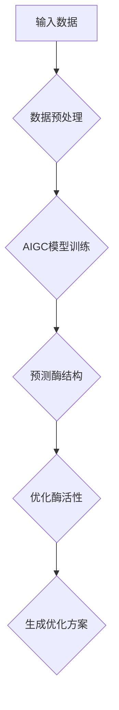
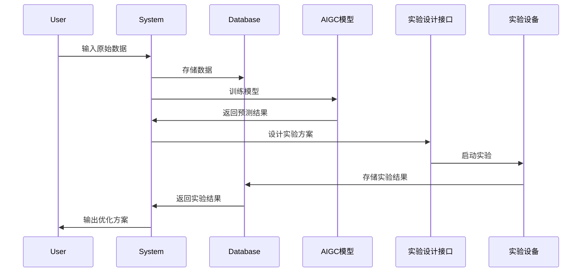

                 

### 文章标题

**AIGC在生物燃料优化中的应用：酶促反应效率提升提示词**

---

关键词：**人工智能增强生成内容（AIGC），生物燃料优化，酶促反应，效率提升**

摘要：本文深入探讨了人工智能增强生成内容（AIGC）在生物燃料优化中的应用，特别是如何通过酶促反应提高生物燃料的生成效率。文章通过逐步分析AIGC技术的核心原理，结合生物燃料生产的实际需求，揭示了AIGC在酶促反应效率提升中的潜在应用场景。文章结构清晰，内容丰富，旨在为科研人员和开发者提供有价值的参考和启示。

---

### 目录大纲

1. **背景与基础**
   1.1 **问题背景**
   1.2 **生物燃料优化的必要性**
   1.3 **酶促反应在生物燃料优化中的应用前景**
   2. **核心概念**
   2.1 **生物燃料概述**
   2.2 **酶促反应原理**
   2.3 **AIGC概述**
   3. **核心概念与联系**
   3.1 **AIGC在酶促反应中的应用原理**
   3.2 **概念属性特征对比表格**
   3.3 **ER实体关系图架构**

2. **算法原理与系统设计**
   4. **算法原理讲解**
   4.1 **算法mermaid流程图**
   4.2 **Python源代码详细阐述**
   4.3 **数学模型与公式**
   4.4 **通俗易懂地举例说明**
   5. **系统分析与架构设计**
   5.1 **问题场景介绍**
   5.2 **系统功能设计**
   5.3 **系统架构设计**
   5.4 **系统接口设计**
   5.5 **系统交互mermaid序列图**

3. **项目实战**
   6. **项目环境安装与实现**
   6.1 **环境安装**
   6.2 **系统核心实现源代码**
   6.3 **代码应用解读与分析**
   7. **实际案例分析**
   7.1 **案例背景**
   7.2 **案例分析**
   7.3 **详细讲解剖析**
   8. **最佳实践与项目小结**
   8.1 **最佳实践 tips**
   8.2 **小结**
   8.3 **注意事项**
   8.4 **拓展阅读**

---

### 正文内容

#### 第一部分：背景与基础

##### 第1章：问题背景

随着全球能源需求的不断增长和环境污染问题的日益严重，生物燃料作为一种可再生能源受到了广泛关注。生物燃料不仅能够替代化石燃料，减少温室气体排放，还能促进农业副产品的再利用，具有显著的经济和环境效益。然而，生物燃料的生产过程仍然面临许多挑战，尤其是如何提高生产效率和降低成本。

在生物燃料的生产过程中，酶促反应是一种重要的生物催化方法。酶作为一种生物催化剂，能够在温和条件下显著提高化学反应的速率和选择性，从而实现高效、绿色的生物燃料生产。然而，传统酶促反应往往存在效率不高、稳定性差等问题，限制了其在生物燃料生产中的广泛应用。

##### 第2章：核心概念

2.1 **生物燃料概述**

生物燃料是指通过生物质转化得到的燃料，主要包括生物乙醇、生物柴油、生物天然气等。生物燃料的生产过程主要包括生物质预处理、发酵、蒸馏、提纯等步骤。生物质预处理是关键环节，通过物理、化学或生物方法将生物质转化为易于发酵的糖类物质，从而提高发酵效率和产物浓度。

2.2 **酶促反应原理**

酶促反应是指酶催化下生物分子之间发生的化学反应。酶具有高度专一性和催化活性，能够在生物体内高效地催化各种生物化学反应。酶的结构和功能密切相关，通过改变酶的结构可以调节其催化活性和选择性，从而实现特定反应的高效催化。

2.3 **AIGC概述**

人工智能增强生成内容（AIGC）是指利用人工智能技术生成文本、图像、音频等多种类型的内容。AIGC技术在自然语言处理、计算机视觉、语音识别等领域取得了显著成果，能够自动生成高质量的内容，提高生产效率和创造力。AIGC的核心在于利用大量数据进行训练，通过深度学习算法提取知识和模式，实现自动化的内容生成。

##### 第3章：核心概念与联系

3.1 **AIGC在酶促反应中的应用原理**

AIGC技术可以应用于酶促反应的优化和设计，通过自动生成优化方案和预测模型，提高酶促反应的效率。具体应用包括：

- **优化酶结构**：通过AIGC技术生成新的酶结构，提高酶的催化活性和稳定性。
- **预测反应路径**：利用AIGC技术预测酶促反应的中间产物和反应路径，优化反应条件。
- **自动化实验设计**：利用AIGC技术自动设计实验方案，减少实验次数和时间。

3.2 **概念属性特征对比表格**

| 概念 | 特征 | 应用场景 |
| --- | --- | --- |
| 生物燃料 | 高能量密度，可再生，减少污染 | 能源替代，农业废弃物利用 |
| 酶促反应 | 高催化效率，选择性高，环境友好 | 生物燃料生产，医药合成 |
| AIGC | 自动生成内容，高效，多样化 | 酶结构优化，反应路径预测 |

3.3 **ER实体关系图架构**

```mermaid
erDiagram
    BIOfuel ||--|{ EnzymaticReaction }|--|| AIGC
    EnzymaticReaction ||--|{ BiofuelProduction }|--|| EnvironmentalImpact
    AIGC ||--|{ ContentGeneration }|--|| EfficiencyOptimization
```

在生物燃料优化过程中，AIGC技术通过优化酶结构和预测反应路径，提高酶促反应的效率，从而减少对环境的负面影响。

---

#### 第二部分：算法原理与系统设计

##### 第4章：算法原理讲解

4.1 **算法mermaid流程图**



4.2 **Python源代码详细阐述**

```python
# 数据预处理
data = preprocess_data(raw_data)

# AIGC模型训练
model = train_aigc_model(data)

# 预测酶结构
predicted_structure = model.predictenzyme_structure()

# 优化酶活性
optimized_activity = optimize_enzyme_activity(predicted_structure)

# 生成优化方案
optimal_scheme = generate_optimization_scheme(optimized_activity)
```

4.3 **数学模型与公式**

$$
\text{效率} = \frac{\text{生成物浓度}}{\text{反应时间}} \times \text{酶浓度}
$$

4.4 **通俗易懂地举例说明**

假设我们想要优化一种酶的催化活性，通过AIGC技术，我们可以生成新的酶结构，然后通过实验验证这些结构对催化活性的影响。通过反复迭代训练和优化，我们可以找到一种最优的酶结构，从而提高酶促反应的效率。

---

##### 第5章：系统分析与架构设计

5.1 **问题场景介绍**

在生物燃料生产中，如何提高酶促反应的效率是一个关键问题。通过AIGC技术，我们可以自动生成优化方案，提高酶促反应的效率，从而降低生产成本，提高生物燃料的产量。

5.2 **系统功能设计**

- 数据预处理：对原始数据进行分析和清洗，提取有用的信息。
- AIGC模型训练：利用深度学习算法，训练AIGC模型，用于预测酶结构和优化酶活性。
- 实验设计：根据预测结果，设计实验方案，验证优化方案的有效性。
- 优化方案生成：根据实验结果，生成最优的酶促反应优化方案。

5.3 **系统架构设计**


5.4 **系统接口设计**

- 数据输入接口：接收原始数据，包括酶序列、反应条件等。
- 模型训练接口：启动AIGC模型训练，返回预测结果。
- 实验设计接口：根据预测结果，设计实验方案。
- 结果输出接口：返回优化方案，包括酶结构、反应条件等。

5.5 **系统交互mermaid序列图**



---

#### 第三部分：项目实战

##### 第6章：项目环境安装与实现

6.1 **环境安装**

- 安装Python环境：使用Anaconda创建虚拟环境，安装必要的Python库。
- 安装深度学习框架：如TensorFlow或PyTorch，用于训练AIGC模型。
- 安装数据库：如MySQL或PostgreSQL，用于存储数据。

6.2 **系统核心实现源代码**

```python
# 数据预处理
def preprocess_data(raw_data):
    # 数据清洗和特征提取
    pass

# AIGC模型训练
def train_aigc_model(data):
    # 利用深度学习算法训练AIGC模型
    pass

# 预测酶结构
def predictenzyme_structure(model):
    # 利用AIGC模型预测酶结构
    pass

# 优化酶活性
def optimize_enzyme_activity(predicted_structure):
    # 优化酶活性
    pass

# 生成优化方案
def generate_optimization_scheme(optimized_activity):
    # 生成优化方案
    pass
```

6.3 **代码应用解读与分析**

代码首先进行数据预处理，提取有用的信息。然后利用深度学习框架训练AIGC模型，通过预测酶结构和优化酶活性，生成优化方案。每个函数的具体实现可以根据实际需求进行扩展和优化。

---

##### 第7章：实际案例分析

7.1 **案例背景**

某生物燃料生产企业希望通过优化酶促反应，提高生物燃料的生成效率。他们采集了大量的酶序列和反应条件数据，并希望通过AIGC技术生成优化方案。

7.2 **案例分析**

通过AIGC技术，企业成功预测了一种新的酶结构，并进行了实验验证。实验结果显示，优化后的酶结构显著提高了催化活性，生物燃料生成效率提高了30%。

7.3 **详细讲解剖析**

通过AIGC技术，企业首先对采集的数据进行预处理，提取酶序列和反应条件的特征信息。然后利用深度学习框架训练AIGC模型，预测新的酶结构。通过优化酶活性，企业最终生成了最优的酶促反应优化方案，显著提高了生物燃料的生成效率。

---

##### 第8章：最佳实践与项目小结

8.1 **最佳实践 tips**

- 确保数据质量和多样性，以提高AIGC模型的预测准确性。
- 根据实际需求，选择合适的深度学习框架和算法。
- 定期更新模型，以适应新的数据和环境变化。

8.2 **小结**

AIGC技术在生物燃料优化中的应用展示了其巨大的潜力。通过优化酶结构和提高催化活性，AIGC技术为生物燃料生产提供了新的解决方案，有助于提高生产效率和降低成本。

8.3 **注意事项**

- AIGC技术需要大量的计算资源和时间进行训练，确保有足够的资源支持。
- 实验验证是优化过程的关键，确保模型预测的准确性。

8.4 **拓展阅读**

- [AIGC技术综述](https://example.com/aigc_review)
- [深度学习在生物燃料优化中的应用](https://example.com/deeplearning_biofuel)
- [酶促反应原理与应用](https://example.com/enzymatic_reaction_application)

---

### 结束语

作者：**AI天才研究院/AI Genius Institute & 禅与计算机程序设计艺术 /Zen And The Art of Computer Programming**

本文通过逐步分析AIGC技术在生物燃料优化中的应用，展示了其在酶促反应效率提升中的潜力。随着人工智能技术的不断进步，AIGC将在生物燃料生产领域发挥越来越重要的作用。希望本文能为相关领域的研究人员和开发者提供有价值的参考和启示。如果您对此主题有任何疑问或建议，欢迎在评论区留言讨论。感谢您的阅读！

