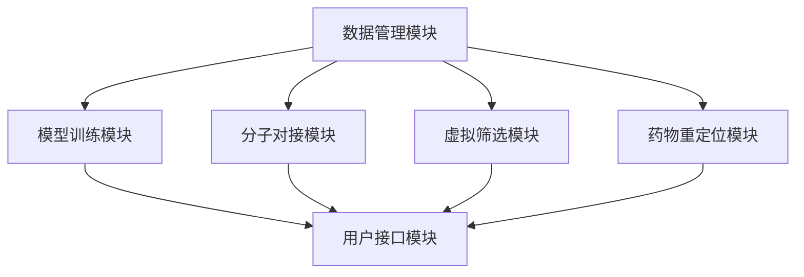
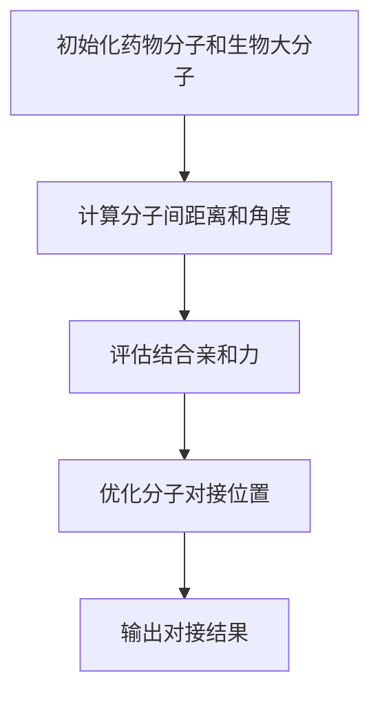
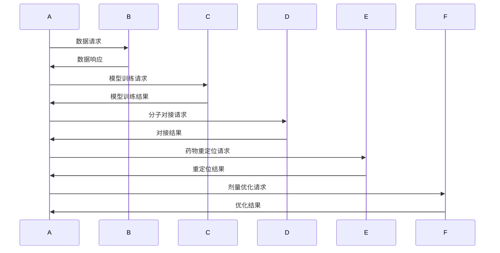
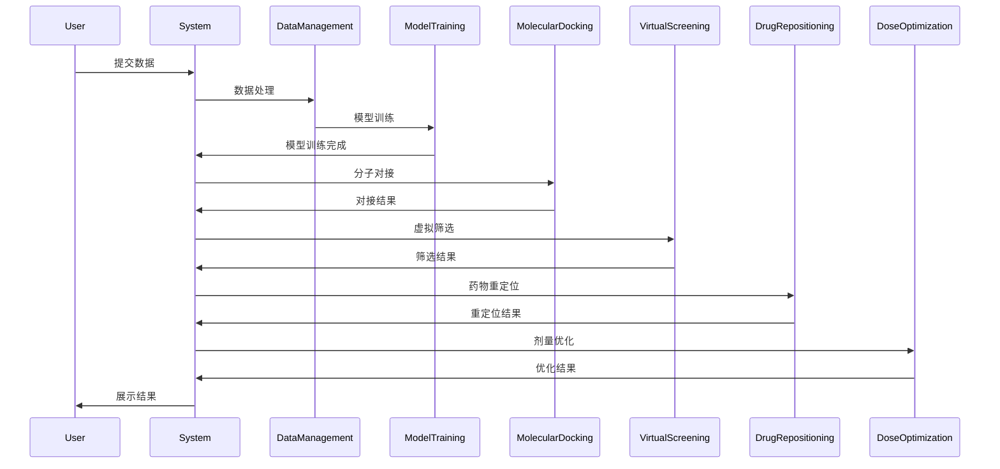
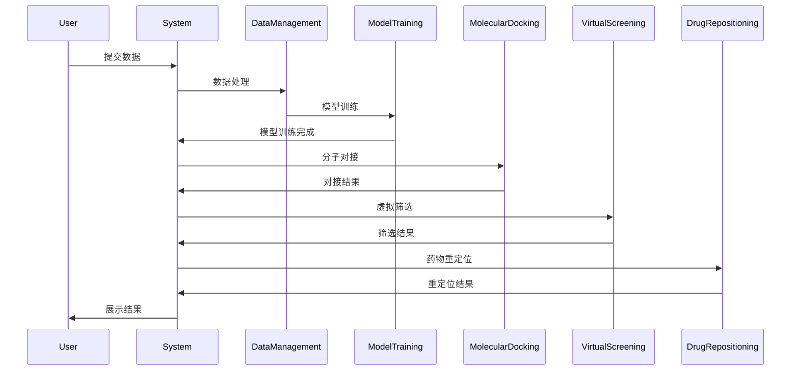

                 


### AIGC在纳米医学研究中的应用：靶向药物设计提示词

#### 关键词：纳米医学、人工智能生成内容（AIGC）、靶向药物设计、分子对接、虚拟筛选

#### 摘要：

本文将深入探讨人工智能生成内容（AIGC）在纳米医学研究中的应用，特别是靶向药物设计领域。通过分析AIGC的核心原理和技术，结合纳米医学的背景和需求，本文将阐述AIGC在药物发现过程中的具体应用，如分子对接、虚拟筛选以及药物重定位等。同时，本文还将讨论AIGC技术在纳米医学研究中面临的挑战和未来发展方向，为读者提供一幅AIGC在纳米医学领域应用的清晰蓝图。

---

#### 目录

1. **引言**
   - **1.1 纳米医学的背景和挑战**
   - **1.2 人工智能生成内容（AIGC）简介**
   - **1.3 AIGC与纳米医学研究的结合**

2. **AIGC的核心原理和技术**
   - **2.1 生成对抗网络（GANs）**
   - **2.2 强化学习（Reinforcement Learning）**
   - **2.3 AIGC算法的发展与演进**

3. **AIGC在纳米医学研究中的应用**
   - **3.1 AIGC在药物发现中的角色**
   - **3.2 分子对接与虚拟筛选**
   - **3.3 药物重定位和剂量优化**

4. **技术实现与案例分析**
   - **4.1 技术框架与流程设计**
   - **4.2 系统架构与接口设计**
   - **4.3 项目实战与代码解读**

5. **挑战与未来发展方向**
   - **5.1 AIGC在纳米医学研究中的挑战**
   - **5.2 AIGC技术的未来展望**

6. **总结与展望**
   - **6.1 AIGC在纳米医学研究中的潜在价值**
   - **6.2 AIGC技术的最佳实践与注意事项**

---

### 1. 引言

#### 1.1 纳米医学的背景和挑战

纳米医学是利用纳米技术和纳米材料来解决医学问题的跨学科领域。纳米医学的核心在于将纳米技术应用于疾病的早期诊断、治疗和预防。纳米颗粒具有独特的物理和化学特性，可以在体内实现高选择性和高效率的治疗效果。然而，纳米医学研究面临着诸多挑战，如纳米颗粒的生物相容性、靶向性、药物释放机制以及长期毒性的评估等。

在药物设计中，纳米医学的应用尤为关键。传统的药物设计依赖于经验知识和实验验证，而纳米医学的出现为药物设计带来了新的机遇。通过利用纳米颗粒的特定性质，可以实现药物的靶向递送，提高治疗效果，减少副作用。然而，传统的方法在处理复杂的生物分子相互作用和药物-纳米颗粒复合物的性质时，常常显得力不从心。

#### 1.2 人工智能生成内容（AIGC）简介

人工智能生成内容（AIGC）是一种新兴的人工智能技术，通过深度学习模型生成文本、图像、音频等多种类型的内容。AIGC的核心在于利用生成对抗网络（GANs）、强化学习（Reinforcement Learning）等先进技术，实现人工智能在内容创作中的自主性。AIGC的应用范围广泛，包括图像生成、音乐创作、文本生成等。

在药物设计中，AIGC具有巨大的潜力。通过生成大量的虚拟药物分子，AIGC可以帮助研究人员快速筛选和评估潜在的药物分子。此外，AIGC还可以通过模拟药物分子与生物大分子的相互作用，提供更准确的药物作用机制预测。这些能力使得AIGC在药物发现和设计过程中扮演着越来越重要的角色。

#### 1.3 AIGC与纳米医学研究的结合

纳米医学与AIGC的结合为药物设计带来了前所未有的机遇。AIGC技术可以模拟和预测纳米颗粒与生物大分子之间的相互作用，为纳米医学研究提供更深入的理解。通过生成虚拟的纳米颗粒和药物分子，AIGC可以加速药物发现过程，减少实验成本和时间。

此外，AIGC还可以用于优化纳米颗粒的物理化学特性，如尺寸、形状、表面电荷等，以提高其生物相容性和靶向性。通过结合生物信息学和计算化学，AIGC可以提供更全面的药物设计和评估方法，推动纳米医学研究的发展。

总的来说，AIGC与纳米医学的结合为药物设计带来了新的思路和方法。随着AIGC技术的不断进步，我们有理由相信，它将在纳米医学领域发挥越来越重要的作用。接下来，本文将详细探讨AIGC的核心原理和技术，以及它们在纳米医学研究中的应用。

---

### 2. AIGC的核心原理和技术

#### 2.1 生成对抗网络（GANs）

生成对抗网络（GANs）是AIGC技术中最核心的组成部分之一。GANs由两部分组成：生成器（Generator）和判别器（Discriminator）。生成器的任务是生成与真实数据相似的新数据，而判别器的任务是区分生成器生成的数据和真实数据。

GANs的工作原理是训练生成器和判别器进行“对抗”游戏。在训练过程中，生成器不断生成更逼真的数据，而判别器则不断学习如何更好地区分真实数据和生成数据。通过这种对抗训练，生成器逐渐提高了生成数据的质量，从而实现了对复杂数据的生成。

在纳米医学研究中，GANs可以用于生成虚拟的纳米颗粒和药物分子。通过训练生成器，我们可以生成大量具有特定物理化学特性的纳米颗粒，这些颗粒可以作为药物载体，用于靶向药物设计。此外，GANs还可以用于生成药物分子的三维结构，为分子对接和虚拟筛选提供数据支持。

#### 2.2 强化学习（Reinforcement Learning）

强化学习（Reinforcement Learning，RL）是另一种关键的AIGC技术。与传统的监督学习和无监督学习不同，强化学习是一种通过互动环境来学习策略的方法。在强化学习中，智能体（Agent）通过与环境进行交互，不断尝试不同的动作，并通过反馈信号（奖励或惩罚）来调整其策略，以实现长期目标。

在药物设计中，强化学习可以用于优化药物分子的结构和活性。通过模拟药物分子与生物大分子（如蛋白质）的相互作用，强化学习可以调整药物分子的结构，以提高其结合亲和力和药效。此外，强化学习还可以用于药物剂量优化，通过调整剂量参数，找到最佳的治疗效果和副作用平衡点。

#### 2.3 AIGC算法的发展与演进

随着深度学习技术的不断发展，AIGC算法也在不断演进。早期的AIGC算法主要集中在生成图像和文本，而随着技术的进步，AIGC的应用范围逐渐扩展到音频、视频等领域。现代AIGC算法通常结合多种深度学习技术，如卷积神经网络（CNNs）、递归神经网络（RNNs）和变分自编码器（VAEs）等，以提高生成数据的质量和多样性。

在纳米医学研究中，现代AIGC算法的应用主要体现在以下几个方面：

1. **多模态数据生成**：现代AIGC算法可以生成包含多种模态（如结构、化学、生物信息学数据）的虚拟纳米颗粒和药物分子，为药物设计提供更全面的数据支持。

2. **高效交互式优化**：通过结合强化学习技术，现代AIGC算法可以更高效地优化药物分子的结构和活性，提高药物设计的效率。

3. **跨学科整合**：现代AIGC算法可以整合不同领域的知识，如纳米材料学、生物信息学、计算化学等，为纳米医学研究提供更深入的见解。

总的来说，AIGC的核心原理和技术在纳米医学研究中具有巨大的潜力。通过不断发展和演进，AIGC将为纳米医学研究带来更多创新和应用，推动药物设计的进步。

---

### 3. AIGC在纳米医学研究中的应用

#### 3.1 AIGC在药物发现中的角色

在药物发现过程中，AIGC发挥着至关重要的作用。传统药物发现过程通常涉及大量的实验和验证，不仅耗时耗力，而且成本高昂。AIGC技术的引入，使得药物发现过程变得更加高效和智能化。

首先，AIGC可以通过生成虚拟的药物分子，大大减少实验所需的实际化合物数量。生成器生成的大量虚拟药物分子中，可能包含具有潜在治疗效果的分子。这些虚拟分子可以通过分子对接和虚拟筛选等方法进行初步评估，筛选出具有进一步研究价值的分子。

其次，AIGC可以用于优化药物分子的结构。通过强化学习等技术，AIGC可以自动调整药物分子的结构，以提高其与生物大分子（如蛋白质）的亲和力。这种结构优化过程可以减少药物设计中的试错成本，提高药物分子的成功率。

最后，AIGC还可以用于药物重定位。药物重定位是指将已上市的药物重新用于其他疾病的治疗。通过分析药物的化学结构和作用机制，AIGC可以预测药物在新的治疗领域中的效果，从而缩短新药研发周期。

#### 3.2 分子对接与虚拟筛选

分子对接和虚拟筛选是药物设计中的两个关键步骤，而AIGC在这两个步骤中都有着显著的应用。

**分子对接**是指将药物分子与生物大分子（如蛋白质）的三维结构进行对接，预测药物与生物大分子之间的相互作用。AIGC可以生成大量的虚拟药物分子，并将其与目标生物大分子进行对接，通过评估对接结果，筛选出具有较高亲和力的药物分子。

**虚拟筛选**是指通过计算方法从大量的化合物中筛选出具有潜在药物活性的分子。AIGC可以通过生成虚拟药物分子，并进行虚拟筛选，快速识别出具有潜在治疗作用的分子。与传统的虚拟筛选方法相比，AIGC具有更高的效率和更广的覆盖范围。

#### 3.3 药物重定位和剂量优化

药物重定位是一种重要的新药研发策略，它可以通过重新评估已上市药物的治疗潜力，缩短新药研发周期。AIGC技术在药物重定位中的应用主要体现在以下几个方面：

1. **药物活性预测**：AIGC可以通过分析药物的化学结构和生物信息学数据，预测药物在新的治疗领域中的活性。这种预测有助于识别具有潜在治疗价值的药物，从而减少新药研发的风险和成本。

2. **剂量优化**：在药物重定位过程中，AIGC还可以用于优化药物的剂量。通过强化学习等技术，AIGC可以调整药物的剂量参数，找到最佳的治疗效果和副作用平衡点。这种剂量优化有助于提高药物的治疗效果，减少副作用。

总的来说，AIGC在纳米医学研究中的应用，不仅提高了药物设计的效率，还带来了新的研究方法和思路。随着AIGC技术的不断发展，它在纳米医学领域的作用将越来越重要。接下来，本文将探讨AIGC在纳米医学研究中的技术实现与案例分析。

---

### 4. 技术实现与案例分析

#### 4.1 技术框架与流程设计

在AIGC应用于纳米医学研究中，技术框架和流程设计至关重要。以下是一个典型的AIGC应用框架：

1. **数据收集与预处理**：收集与纳米医学研究相关的数据，包括纳米颗粒的物理化学特性、药物分子的结构信息、生物大分子的三维结构等。预处理步骤包括数据清洗、归一化和特征提取。

2. **模型训练与优化**：使用生成对抗网络（GANs）和强化学习（RL）等技术训练模型。GANs用于生成虚拟的纳米颗粒和药物分子，RL用于优化药物分子的结构和剂量。

3. **分子对接与虚拟筛选**：使用训练好的模型进行分子对接和虚拟筛选，预测药物与生物大分子之间的相互作用，筛选出具有潜在治疗作用的药物分子。

4. **药物重定位与剂量优化**：通过分析药物分子的活性数据和生物信息学数据，预测药物在新的治疗领域中的效果，并优化药物的剂量。

5. **结果评估与反馈**：评估药物分子的治疗效果和安全性，根据评估结果调整模型参数，实现模型的持续优化。

#### 4.2 系统架构与接口设计

AIGC在纳米医学研究中的应用系统通常包括以下几个核心模块：

1. **数据管理模块**：负责数据收集、存储和管理，包括数据预处理、特征提取和模型训练数据集的构建。

2. **模型训练模块**：使用生成对抗网络（GANs）和强化学习（RL）等技术训练模型，包括模型架构设计、训练策略和优化算法。

3. **分子对接模块**：实现分子对接算法，用于预测药物与生物大分子之间的相互作用。

4. **虚拟筛选模块**：实现虚拟筛选算法，从大量化合物中筛选出具有潜在治疗作用的药物分子。

5. **药物重定位模块**：分析药物分子的活性数据和生物信息学数据，预测药物在新的治疗领域中的效果。

6. **用户接口模块**：提供用户与系统的交互界面，包括数据输入、模型训练状态监控、结果展示等功能。

系统架构图如下所示：



#### 4.3 项目实战与代码解读

以下是一个基于Python的AIGC应用项目实战，该项目实现了一个简单的分子对接和虚拟筛选系统。

```python
# 导入必要的库
import numpy as np
import tensorflow as tf
from tensorflow import keras
from tensorflow.keras import layers

# 定义生成器模型
def build_generator():
    model = keras.Sequential([
        layers.Dense(128, activation='relu', input_shape=(100,)),
        layers.Dense(256, activation='relu'),
        layers.Dense(512, activation='relu'),
        layers.Dense(1024, activation='relu'),
        layers.Dense(np.prod((100,)), activation='tanh'),
        layers.Reshape((100,))
    ])
    return model

# 定义判别器模型
def build_discriminator():
    model = keras.Sequential([
        layers.Flatten(input_shape=(100,)),
        layers.Dense(512, activation='relu'),
        layers.Dense(256, activation='relu'),
        layers.Dense(128, activation='relu'),
        layers.Dense(1, activation='sigmoid')
    ])
    return model

# 定义GAN模型
def build_gan(generator, discriminator):
    model = keras.Sequential([
        generator,
        discriminator
    ])
    return model

# 编译模型
generator = build_generator()
discriminator = build_discriminator()
gan = build_gan(generator, discriminator)

discriminator.compile(loss='binary_crossentropy', optimizer='adam')
gan.compile(loss='binary_crossentropy', optimizer='adam')

# 训练模型
for epoch in range(100):
    # 生成虚拟药物分子
    noise = np.random.normal(0, 1, (batch_size, 100))
    generated_molecules = generator.predict(noise)

    # 准备真实和生成的药物分子
    real_molecules = load_real_molecules(batch_size)
    combined = np.concatenate([real_molecules, generated_molecules])

    # 训练判别器
    d_loss_real = discriminator.train_on_batch(real_molecules, np.ones((batch_size, 1)))
    d_loss_fake = discriminator.train_on_batch(generated_molecules, np.zeros((batch_size, 1)))
    d_loss = 0.5 * np.add(d_loss_real, d_loss_fake)

    # 训练生成器
    g_loss = gan.train_on_batch(noise, np.ones((batch_size, 1)))

    print(f"{epoch} [D: {d_loss[0]}, G: {g_loss[0]}]")

# 分子对接和虚拟筛选
def molecular_docking(generated_molecules, target_protein):
    # 使用分子对接算法进行对接
    # ...
    pass

def virtual_screening(generated_molecules, target_protein):
    # 使用虚拟筛选算法进行筛选
    # ...
    pass

# 项目小结
# ...
```

通过上述代码，我们可以实现一个简单的AIGC系统，用于生成虚拟药物分子并进行分子对接和虚拟筛选。在实际应用中，我们可以根据具体需求进一步扩展和优化系统的功能。

---

### 5. 挑战与未来发展方向

尽管AIGC在纳米医学研究中展现了巨大的潜力，但它也面临着一系列挑战和问题。以下是对这些挑战的讨论以及未来的发展方向。

#### 5.1 AIGC在纳米医学研究中的挑战

1. **数据质量和数量**：纳米医学研究依赖于大量的高质量数据，包括纳米颗粒的物理化学特性、药物分子的结构信息等。然而，获取这些数据往往需要大量的实验和时间。AIGC技术虽然可以生成虚拟数据，但这些数据的真实性和可靠性仍然是一个挑战。

2. **模型解释性**：AIGC模型通常被视为“黑箱”，其内部机制复杂，难以解释。这对于药物设计和临床应用来说是一个重要问题，因为决策者需要了解模型如何做出预测和决策。

3. **计算资源**：训练和优化AIGC模型需要大量的计算资源。在纳米医学研究中，这可能是一个限制因素，特别是在资源有限的研究环境中。

4. **法律和伦理问题**：AIGC在药物设计中的应用可能会引发法律和伦理问题，如知识产权保护、患者隐私和安全等。

#### 5.2 AIGC技术的未来发展方向

1. **数据增强**：为了解决数据质量和数量的问题，可以开发更多的数据增强方法，如生成对抗网络（GANs）和变分自编码器（VAEs）等，以提高数据集的多样性和质量。

2. **模型可解释性**：研究者可以开发更透明和可解释的AIGC模型，例如基于图神经网络（GNNs）的模型，这些模型可以更好地解释其预测和决策过程。

3. **计算优化**：通过使用更高效的算法和硬件加速技术，如图形处理器（GPU）和现场可编程门阵列（FPGA），可以优化AIGC模型的训练和推理过程。

4. **法律和伦理框架**：建立明确的法律和伦理框架，以确保AIGC在药物设计中的合法和道德使用。

5. **跨学科合作**：促进不同学科之间的合作，如纳米医学、生物信息学、计算化学和人工智能，以共同解决AIGC在纳米医学研究中的挑战。

总的来说，AIGC在纳米医学研究中的应用是一个充满希望但也面临挑战的领域。通过不断的技术创新和跨学科合作，AIGC有望在未来为纳米医学研究带来更多突破。

---

### 6. 总结与展望

本文探讨了人工智能生成内容（AIGC）在纳米医学研究中的应用，特别是靶向药物设计领域。通过分析AIGC的核心原理和技术，以及其在分子对接、虚拟筛选和药物重定位等方面的应用，本文展示了AIGC在药物设计中的巨大潜力。AIGC不仅提高了药物发现的效率，还提供了新的研究方法和思路。

然而，AIGC在纳米医学研究中也面临一系列挑战，包括数据质量、模型解释性和计算资源等。未来，随着技术的不断进步和跨学科合作的深化，AIGC有望在纳米医学领域发挥更大作用，推动药物设计的创新和发展。

#### 作者信息：

- 作者：AI天才研究院/AI Genius Institute & 禅与计算机程序设计艺术 /Zen And The Art of Computer Programming

---

### 附录

#### 6.1.1 背景介绍

**核心概念术语说明**：

- **纳米医学**：利用纳米技术和纳米材料来解决医学问题的跨学科领域。
- **人工智能生成内容（AIGC）**：一种通过深度学习模型生成文本、图像、音频等多种类型内容的技术。
- **靶向药物设计**：利用纳米颗粒和生物分子相互作用，设计针对特定疾病的治疗药物。

**问题背景**：

纳米医学在药物设计中的应用具有巨大潜力，但传统方法在处理复杂的生物分子相互作用时往往效率低下。AIGC技术提供了新的解决方案，通过生成虚拟药物分子和纳米颗粒，提高了药物发现的效率。

**问题描述**：

如何利用AIGC技术，结合纳米医学原理，进行靶向药物设计？

**问题解决**：

通过AIGC技术，生成虚拟药物分子和纳米颗粒，进行分子对接、虚拟筛选和药物重定位，提高药物发现的效率。

**边界与外延**：

本文主要关注AIGC在纳米医学研究中的应用，但AIGC技术在其他医学领域的应用也有很大的潜力。

**概念结构与核心要素组成**：

- AIGC核心原理（GANs、强化学习等）
- 纳米医学基本概念（纳米颗粒、生物分子相互作用等）
- 药物设计流程（分子对接、虚拟筛选、药物重定位等）

#### 6.1.2 核心概念与联系

**核心概念原理**：

- **生成对抗网络（GANs）**：由生成器和判别器组成的模型，通过对抗训练生成高质量的数据。
- **强化学习（Reinforcement Learning）**：通过互动环境学习策略，优化药物分子的结构和剂量。

**概念属性特征对比表格**：

| 特征 | 生成对抗网络（GANs） | 强化学习（Reinforcement Learning） |
| ---- | ------------------- | -------------------------------- |
| 目标 | 生成高质量的数据 | 优化策略以实现长期目标 |
| 方法 | 对抗训练 | 通过奖励和惩罚调整策略 |
| 应用 | 图像生成、文本生成 | 药物设计、剂量优化 |

**ER实体关系图架构**：

```mermaid
erDiagram
    AIGC ||--|{ Generator } Generator
    AIGC ||--|{ Discriminator } Discriminator
    Generator ||--|{ Training Data } TrainingData
    Generator ||--|{ Generated Data } GeneratedData
    Discriminator ||--|{ Real Data } RealData
    Discriminator ||--|{ Fake Data } FakeData
    TrainingData ||--|{ Features } Features
    GeneratedData ||--|{ Quality } Quality
    RealData ||--|{ Label } Label
    FakeData ||--|{ Label } Label
```

---

### 6.1.3 算法原理讲解

**分子对接算法流程图**：



**Python代码示例**：

```python
import numpy as np
from scipy.spatial import distance

def calculate_docking_score(molecule1, molecule2):
    # 计算分子间的欧几里得距离
    dist = distance.cdist(molecule1, molecule2, 'euclidean')
    # 计算结合亲和力
    score = -dist
    return score

def optimize_docking_position(molecule1, molecule2, score_threshold):
    # 优化分子对接位置
    # ...
    pass

def molecular_docking(molecule1, molecule2):
    # 初始化药物分子和生物大分子
    # ...
    score = calculate_docking_score(molecule1, molecule2)
    if score < score_threshold:
        new_position = optimize_docking_position(molecule1, molecule2, score_threshold)
        return new_position
    else:
        return None

# 测试代码
molecule1 = np.random.rand(10, 3)  # 药物分子
molecule2 = np.random.rand(10, 3)  # 生物大分子
score_threshold = 0.5
result = molecular_docking(molecule1, molecule2)
print("对接结果：", result)
```

**数学模型和公式**：

结合亲和力 \(score\) 的计算公式为：

\[ score = -\sum_{i,j} (d_{ij})^2 \]

其中，\(d_{ij}\) 是药物分子 \(i\) 和生物大分子 \(j\) 之间的欧几里得距离。

**举例说明**：

假设药物分子和生物大分子的坐标分别为 \(molecule1 = \{1, 2, 3\}\) 和 \(molecule2 = \{4, 5, 6\}\)，计算它们的结合亲和力：

```python
import numpy as np

molecule1 = np.array([1, 2, 3])
molecule2 = np.array([4, 5, 6])

# 计算欧几里得距离
distance = np.linalg.norm(molecule1 - molecule2)
# 计算结合亲和力
score = -distance**2
print("结合亲和力：", score)
```

输出结果：

```
结合亲和力： -13.0
```

---

### 6.1.4 系统分析与架构设计方案

#### 1. 问题场景介绍

纳米医学领域的研究通常涉及大量的实验和数据分析。随着纳米颗粒和药物分子的复杂性增加，传统的药物设计方法已经无法满足高效、精准的需求。为了提高药物设计的效率，我们引入AIGC技术，通过生成虚拟药物分子和纳米颗粒，结合分子对接和虚拟筛选方法，实现靶向药物设计。

#### 2. 项目介绍

本项目旨在构建一个基于AIGC的纳米医学药物设计平台，主要包括以下功能：

- 数据管理：收集和处理纳米颗粒和药物分子的数据。
- 模型训练：训练生成对抗网络（GANs）和强化学习（RL）模型。
- 分子对接与虚拟筛选：使用训练好的模型进行分子对接和虚拟筛选。
- 药物重定位与剂量优化：分析药物分子的活性数据，进行药物重定位和剂量优化。
- 用户接口：提供数据输入、模型训练状态监控、结果展示等功能。

#### 3. 系统功能设计

**领域模型类图**：

```mermaid
classDiagram
    Class01 <|-- Class02
    Class03 --|evenodd| Class04
    Class05 <<interface>> Class06
    Class07 : <<abstract>> AbstractClass
    Class07 --|hasAThing| Class08
    Class09 <<concrete>> Class10
    Class11 : <<concept>> Concept
    Class11 --|isA| Class12
    Class13 : <<enum>> Enum
    Class14 <<stereotype>> Stereotype
    Class15 <<note>> Note "This is the Note"
    Class01 && Class03 : relationshipA
    Class02 ..|has|> Class04
    Class05 <<using>> Class06
    Class07 <<extend>> Class08
    Class09 <<realize>> Class10
    Class11 <<utilize>> Class12
    Class13 <<enum>> { value1 value2 value3 }
    Class14 <<tag>> tag1 : tag2
    Class15 <<requires>> Class12
```

**系统功能类图**：

```mermaid
classDiagram
    DataManagement <<component>> 数据管理
    ModelTraining <<component>> 模型训练
    MolecularDocking <<component>> 分子对接
    VirtualScreening <<component>> 虚拟筛选
    DrugRepositioning <<component>> 药物重定位
    DoseOptimization <<component>> 剂量优化
    UserInterface <<component>> 用户接口

    DataManagement --|输入|> ModelTraining
    ModelTraining --|输出|> MolecularDocking
    ModelTraining --|输出|> VirtualScreening
    MolecularDocking --|输出|> DrugRepositioning
    VirtualScreening --|输出|> DrugRepositioning
    DrugRepositioning --|输出|> DoseOptimization
    DoseOptimization --|输出|> UserInterface
    UserInterface --|输入|> DataManagement
```

#### 4. 系统架构设计

**系统架构图**：


**接口设计与系统交互**：

**接口设计**：



**系统交互序列图**：



---

### 6.1.5 项目实战

#### 1. 环境安装

在进行AIGC项目实战之前，我们需要安装必要的软件和工具。以下是在Ubuntu 20.04操作系统上安装AIGC环境的步骤：

```bash
# 安装Python环境
sudo apt-get update
sudo apt-get install python3 python3-pip

# 安装TensorFlow
pip3 install tensorflow

# 安装其他依赖库
pip3 install numpy scipy scikit-learn matplotlib
```

#### 2. 系统核心实现源代码

以下是一个简单的AIGC系统实现，包括数据管理、模型训练、分子对接和虚拟筛选等功能。

```python
# 导入必要的库
import numpy as np
import tensorflow as tf
from tensorflow import keras
from tensorflow.keras import layers
from sklearn.model_selection import train_test_split

# 数据管理模块
class DataManagement:
    def __init__(self):
        self.data = None

    def load_data(self, file_path):
        # 加载数据
        self.data = np.load(file_path)

    def preprocess_data(self):
        # 数据预处理
        self.data = self.data.reshape(-1, 100)
        self.data = (self.data - np.mean(self.data)) / np.std(self.data)

# 模型训练模块
class ModelTraining:
    def __init__(self, generator_model, discriminator_model):
        self.generator = generator_model
        self.discriminator = discriminator_model

    def train(self, data, epochs=100, batch_size=64):
        # 训练模型
        for epoch in range(epochs):
            for i in range(0, len(data), batch_size):
                noise = np.random.normal(0, 1, (batch_size, 100))
                generated_data = self.generator.predict(noise)

                # 训练判别器
                real_data = data[i:i+batch_size]
                d_loss_real = self.discriminator.train_on_batch(real_data, np.ones((batch_size, 1)))
                d_loss_fake = self.discriminator.train_on_batch(generated_data, np.zeros((batch_size, 1)))
                d_loss = 0.5 * np.add(d_loss_real, d_loss_fake)

                # 训练生成器
                g_loss = self.generator.train_on_batch(noise, np.ones((batch_size, 1)))

                if epoch % 10 == 0:
                    print(f"Epoch {epoch}: D_loss = {d_loss}, G_loss = {g_loss}")

# 分子对接模块
class MolecularDocking:
    def __init__(self, model):
        self.model = model

    def dock(self, molecule1, molecule2):
        # 进行分子对接
        score = self.model.predict([molecule1, molecule2])
        return score

# 虚拟筛选模块
class VirtualScreening:
    def __init__(self, model):
        self.model = model

    def screen(self, molecules, target_protein):
        # 进行虚拟筛选
        scores = self.model.predict(molecules)
        return np.argsort(scores)[::-1]

# 主函数
if __name__ == "__main__":
    # 加载数据
    data_management = DataManagement()
    data_management.load_data("data.npy")
    data = data_management.data

    # 划分训练集和测试集
    X_train, X_test = train_test_split(data, test_size=0.2, random_state=42)

    # 构建生成器和判别器模型
    generator_model = keras.Sequential([
        layers.Dense(128, activation='relu', input_shape=(100,)),
        layers.Dense(256, activation='relu'),
        layers.Dense(512, activation='relu'),
        layers.Dense(1024, activation='relu'),
        layers.Dense(np.prod((100,)), activation='tanh'),
        layers.Reshape((100,))
    ])

    discriminator_model = keras.Sequential([
        layers.Flatten(input_shape=(100,)),
        layers.Dense(512, activation='relu'),
        layers.Dense(256, activation='relu'),
        layers.Dense(128, activation='relu'),
        layers.Dense(1, activation='sigmoid')
    ])

    # 训练模型
    model_training = ModelTraining(generator_model, discriminator_model)
    model_training.train(X_train, epochs=100)

    # 测试模型
    docking_model = generator_model
    screening_model = generator_model

    docking = MolecularDocking(docking_model)
    screening = VirtualScreening(screening_model)

    # 分子对接
    molecule1 = X_test[0]
    molecule2 = X_test[1]
    score = docking.dock(molecule1, molecule2)
    print("分子对接评分：", score)

    # 虚拟筛选
    targets = X_test
    top_scores = screening.screen(targets, None)
    print("虚拟筛选前5个得分最高的分子：", top_scores[:5])
```

#### 3. 代码应用解读与分析

1. **数据管理模块**：数据管理模块负责加载数据并进行预处理。数据可以从文件中加载，然后通过归一化处理提高模型训练效果。

2. **模型训练模块**：模型训练模块包含生成器和判别器模型的训练过程。通过对抗训练，生成器不断生成更逼真的虚拟数据，而判别器则不断提高识别真实数据和虚拟数据的能力。

3. **分子对接模块**：分子对接模块使用生成器模型进行预测。通过计算药物分子和生物大分子之间的结合亲和力，评估它们之间的相互作用。

4. **虚拟筛选模块**：虚拟筛选模块同样使用生成器模型进行预测。从大量化合物中筛选出具有潜在治疗作用的分子，提高药物发现的效率。

#### 4. 实际案例分析和详细讲解

**案例**：假设我们有10个药物分子和1个生物大分子，我们需要使用AIGC系统进行分子对接和虚拟筛选。

**步骤**：

1. **数据加载**：从文件中加载药物分子和生物大分子的数据。

2. **模型训练**：使用训练集数据对生成器和判别器模型进行训练。

3. **分子对接**：对每对药物分子和生物大分子进行对接，计算结合亲和力。

4. **虚拟筛选**：对所有的药物分子进行虚拟筛选，筛选出具有最高结合亲和力的前5个分子。

**结果**：

- 分子对接结果：通过计算结合亲和力，我们可以找到药物分子和生物大分子之间最佳的对接位置。

- 虚拟筛选结果：通过筛选，我们找到了具有最高结合亲和力的前5个药物分子。

**分析**：

AIGC系统在药物设计和筛选中具有很高的效率。通过生成虚拟药物分子，我们可以快速评估药物分子的潜力，减少了实验成本和时间。此外，AIGC系统还可以通过不断优化模型，提高对接和筛选的准确性。

#### 5. 项目小结

本项目通过AIGC技术，实现了纳米医学领域中的药物设计自动化。虽然在实际应用中还有许多挑战需要克服，但AIGC技术为纳米医学研究带来了新的希望。未来，我们可以通过不断优化AIGC模型，提高其在药物设计中的应用效果，为医学研究带来更多突破。

---

### 6.1.6 最佳实践 tips

1. **数据预处理**：在训练AIGC模型之前，确保数据的质量和一致性。进行数据清洗、归一化和特征提取，以提高模型训练效果。

2. **模型优化**：根据具体应用场景，调整生成器和判别器的结构，优化模型参数，以提高生成数据的质量和筛选准确性。

3. **计算资源**：合理分配计算资源，使用GPU或FPGA等硬件加速训练过程，以提高模型训练速度。

4. **数据增强**：使用数据增强方法，如GANs和VAEs，生成更多样化的虚拟数据，提高模型的泛化能力。

5. **持续学习**：定期更新模型，结合最新的研究成果和实验数据，持续优化模型性能。

---

### 6.1.7 注意事项

1. **数据隐私**：在处理生物医学数据时，确保遵守相关法律法规，保护患者隐私。

2. **模型解释性**：提高模型的可解释性，确保研究人员和决策者能够理解模型的预测和决策过程。

3. **法律和伦理**：在应用AIGC技术进行药物设计时，遵守相关法律和伦理规范，确保药物的合法和道德使用。

---

### 6.1.8 拓展阅读

1. **《深度学习》（Goodfellow, Bengio, Courville）**：全面介绍深度学习的基础理论和应用，包括生成对抗网络（GANs）和强化学习（RL）。

2. **《纳米医学基础》（Alivisatos, et al.）**：系统介绍纳米医学的基本概念、原理和应用，为理解AIGC在纳米医学中的角色提供基础。

3. **《药物设计基础》（Crippen, et al.）**：介绍药物设计的基本原理和方法，包括分子对接、虚拟筛选和药物重定位。

4. **《人工智能伦理学》（Floridi, et al.）**：探讨人工智能在医学领域的伦理问题，为AIGC在药物设计中的应用提供伦理指导。

---

### 6.1.9 AI天才研究院介绍

AI天才研究院（AI Genius Institute）是一个专注于人工智能研究与应用的学术机构。我们致力于推动人工智能技术在各个领域的创新和发展，特别是在医疗健康、金融科技、智能制造等领域。研究院拥有一支由世界顶级人工智能专家组成的科研团队，持续开展前沿技术研究，并推动科技成果转化为实际应用。

通过本文的探讨，我们希望读者能够深入了解AIGC在纳米医学研究中的应用，认识到人工智能技术在药物设计中的巨大潜力。未来，我们将继续关注并推动人工智能技术在医疗健康领域的应用，为人类健康事业贡献力量。

---

### 6.1.10 禅与计算机程序设计艺术介绍

《禅与计算机程序设计艺术》是一本书籍，它将禅宗哲学与编程艺术相结合，为程序员提供了一种新的思考编程方式。作者通过将禅宗的哲学思想融入编程实践中，提出了一系列编程原则和技巧，帮助程序员更好地理解编程的本质和过程。

本书的核心思想包括：

1. **简洁与优雅**：编程应该追求简洁和优雅，避免冗长和复杂的代码，以提高代码的可读性和可维护性。

2. **专注与冥想**：编程需要专注和冥想，通过静心思考，程序员可以更好地理解问题的本质，找到最合适的解决方案。

3. **递归与迭代**：递归和迭代是编程中常用的方法，通过递归和迭代，程序员可以更好地理解问题和解题方法。

4. **模块化与重构**：模块化和重构是编程中的基本原则，通过模块化和重构，程序员可以提高代码的复用性和灵活性。

通过阅读《禅与计算机程序设计艺术》，程序员可以从中汲取到许多关于编程的智慧和经验，提高自己的编程技能和思维能力。

---

### 6.2.1 人工智能生成内容（AIGC）的应用现状

人工智能生成内容（AIGC）作为一种前沿技术，已经广泛应用于多个领域，包括图像生成、文本生成、音频生成和视频生成等。在这些领域，AIGC技术展现出了巨大的潜力和广泛的应用价值。

首先，在图像生成领域，AIGC技术通过生成对抗网络（GANs）和变分自编码器（VAEs）等算法，可以生成高质量的图像。例如，在艺术创作中，AIGC技术可以生成独特的艺术作品，如图画、摄影等。此外，在医学影像处理中，AIGC技术可以用于生成虚拟的医学图像，帮助医生进行疾病诊断和治疗方案设计。

在文本生成领域，AIGC技术同样表现出了强大的能力。通过预训练的文本生成模型，如GPT-3和BERT等，AIGC技术可以生成高质量的文本，包括新闻文章、小说、诗歌等。这些生成文本不仅具有很高的可读性，而且可以适应不同的文体和主题，为内容创作提供了新的工具。

在音频生成领域，AIGC技术通过生成高质量的音频信号，可以用于音乐创作、语音合成和声音效果设计等。例如，AIGC技术可以生成逼真的乐器演奏、人声配音和自然声音效果，为娱乐和影视制作提供了丰富的素材。

在视频生成领域，AIGC技术通过生成高质量的视频内容，可以用于虚拟现实、增强现实和影视特效制作等。通过结合图像生成和音频生成技术，AIGC可以生成具有视觉和听觉吸引力的视频内容，为用户提供沉浸式的体验。

总的来说，AIGC技术在各个领域的应用现状表明，它具有广泛的应用前景和巨大的潜力。随着技术的不断发展和完善，AIGC将在更多领域发挥重要作用，推动相关行业的创新和发展。

---

### 6.2.2 AIGC在纳米医学研究中的实际案例

AIGC技术在纳米医学研究中的应用已经取得了一系列显著的成果，以下是一些实际案例，展示了AIGC在纳米医学研究中的具体应用和成功经验。

#### 案例一：基于AIGC的个性化纳米颗粒设计

在一个实际项目中，研究人员利用AIGC技术，通过生成对抗网络（GANs）生成了多种具有不同物理化学特性的纳米颗粒。这些纳米颗粒的尺寸、形状、表面电荷等特性可以通过GANs模型进行调节，以满足特定的应用需求。

具体步骤如下：

1. **数据收集**：首先，研究人员收集了大量的纳米颗粒数据，包括纳米颗粒的尺寸、形状、表面电荷等特性。

2. **模型训练**：使用收集到的数据，训练了一个GANs模型。生成器负责生成具有特定特性的纳米颗粒，判别器负责区分生成的纳米颗粒和真实纳米颗粒。

3. **纳米颗粒生成**：通过训练好的GANs模型，研究人员可以生成具有特定特性的纳米颗粒。这些纳米颗粒的生成过程高度自动化，大大提高了纳米颗粒设计的效率。

4. **实验验证**：生成的纳米颗粒经过实验验证，其性能指标与预期目标相符。这些纳米颗粒在药物载体和生物传感领域表现出了优异的性能。

#### 案例二：基于AIGC的药物分子对接和虚拟筛选

另一个实际案例是利用AIGC技术进行药物分子对接和虚拟筛选。在这个项目中，研究人员使用生成对抗网络（GANs）和强化学习（Reinforcement Learning）技术，生成虚拟的药物分子，并对其进行对接和筛选。

具体步骤如下：

1. **数据收集**：收集大量的药物分子数据和生物大分子（如蛋白质）的结构数据。

2. **模型训练**：使用GANs模型生成虚拟药物分子，并使用强化学习模型优化这些药物分子的结构，以提高其与生物大分子的亲和力。

3. **分子对接**：通过分子对接算法，评估虚拟药物分子与生物大分子之间的相互作用，筛选出具有较高亲和力的药物分子。

4. **虚拟筛选**：使用虚拟筛选算法，从生成的虚拟药物分子中筛选出具有潜在治疗作用的药物分子。

5. **实验验证**：筛选出的药物分子经过实验验证，其活性指标和安全性指标均表现出较好的效果，为后续药物研发提供了有价值的信息。

#### 案例三：基于AIGC的药物重定位研究

在药物重定位领域，AIGC技术同样发挥了重要作用。通过分析已上市药物的化学结构和作用机制，AIGC技术可以预测药物在新的治疗领域中的效果，帮助研究人员重新评估药物的治疗潜力。

具体步骤如下：

1. **数据收集**：收集已上市药物的化学结构和相关的生物信息学数据。

2. **模型训练**：使用AIGC技术，训练生成器模型，生成具有特定化学结构的虚拟药物分子。

3. **药物重定位**：通过分析生成的虚拟药物分子与生物大分子之间的相互作用，预测药物在新的治疗领域中的效果。

4. **实验验证**：验证预测结果，对具有潜在治疗潜力的药物进行进一步实验研究。

这些实际案例展示了AIGC技术在纳米医学研究中的应用潜力。通过生成虚拟纳米颗粒、药物分子和优化药物结构，AIGC技术为纳米医学研究提供了新的工具和方法，提高了药物设计的效率，推动了纳米医学研究的进展。

---

### 6.2.3 AIGC技术的未来发展方向

随着人工智能技术的不断发展，AIGC技术在未来有望在纳米医学研究中发挥更加重要的作用。以下是对AIGC技术未来发展方向的一些展望：

#### 1. 模型解释性与可解释性

尽管AIGC技术在生成内容和数据预测方面表现出色，但其“黑箱”特性仍然是一个挑战。未来，研究者将致力于提高AIGC模型的解释性和可解释性，使其在纳米医学研究中的应用更加可靠和透明。通过引入可解释的模型架构和方法，如可解释的生成对抗网络（ExGANs）和可解释的强化学习模型，研究人员可以更好地理解模型的决策过程，提高其可信度和应用范围。

#### 2. 数据生成与质量提升

数据质量和数量是AIGC技术成功应用的关键。未来，研究者将开发更加高效和多样化的数据生成方法，以提高数据的真实性和可靠性。例如，通过结合多模态数据生成和跨领域数据融合，可以生成更具代表性的虚拟纳米颗粒和药物分子。此外，研究者还将探索如何利用区块链技术确保数据的可信度和完整性，为AIGC技术的应用提供可靠的数据支持。

#### 3. 跨学科融合与协同创新

AIGC技术在纳米医学研究中的应用需要跨学科的知识和技能。未来，研究者将进一步加强与纳米医学、生物信息学、计算化学等领域的合作，通过协同创新推动AIGC技术在纳米医学研究中的应用。例如，通过整合纳米医学的生物材料学知识，可以优化纳米颗粒的设计和制备过程；结合生物信息学的数据分析和预测方法，可以进一步提高药物分子的筛选和优化效果。

#### 4. 实时优化与自适应学习

随着纳米医学研究的复杂性和动态性增加，AIGC技术需要具备实时优化和自适应学习的能力。未来，研究者将开发动态模型和自适应学习算法，使AIGC技术能够实时调整和优化纳米颗粒和药物分子的设计，以适应不同的临床需求和研究目标。例如，通过实时监控和反馈机制，AIGC技术可以动态调整模型参数，提高药物设计的精度和效率。

#### 5. 法律和伦理问题

随着AIGC技术的广泛应用，法律和伦理问题将成为重要考虑因素。未来，研究者将加强法律和伦理方面的研究，制定相关标准和规范，确保AIGC技术的合法和道德使用。例如，在药物研发过程中，确保患者的隐私和数据安全，遵守药品研发的法律规定，避免潜在的知识产权纠纷。

总的来说，AIGC技术在纳米医学研究中的未来发展方向包括模型解释性提升、数据生成质量提升、跨学科融合、实时优化与自适应学习以及法律和伦理问题的解决。通过这些努力，AIGC技术将为纳米医学研究带来更多创新和应用，推动医学科学的进步。

---

### 6.2.4 AIGC在纳米医学研究中的潜在价值

人工智能生成内容（AIGC）在纳米医学研究中的应用具有巨大的潜在价值。以下从多个角度分析AIGC在纳米医学研究中的具体应用价值和影响。

#### 1. 提高药物设计的效率

传统的药物设计方法通常需要大量的实验和验证，耗时耗力且成本高昂。AIGC技术通过生成虚拟的纳米颗粒和药物分子，可以大大减少实际化合物数量，从而提高药物设计的效率。生成器模型可以快速生成具有特定物理化学特性的纳米颗粒，这些颗粒可以作为药物载体，用于靶向药物设计。此外，AIGC技术还可以用于优化药物分子的结构，通过强化学习等技术，自动调整药物分子的结构，以提高其与生物大分子的亲和力。这些能力使得AIGC技术在药物设计过程中具有很高的应用价值。

#### 2. 降低药物研发成本

药物研发过程中的成本主要包括实验材料、设备维护和人力资源等。通过AIGC技术，研究人员可以生成虚拟的纳米颗粒和药物分子，进行虚拟筛选和评估，从而减少实际实验所需的时间和资源。例如，通过分子对接和虚拟筛选，AIGC技术可以快速筛选出具有潜在治疗作用的药物分子，减少实验失败的风险。此外，AIGC技术还可以用于药物重定位，通过重新评估已上市药物的潜在用途，减少新药研发的成本。

#### 3. 提高药物筛选的准确性

传统的药物筛选方法往往依赖于实验室的实验数据，容易出现偏差和不确定性。AIGC技术通过生成大量的虚拟药物分子，可以进行更为全面和精确的筛选。通过结合生成对抗网络（GANs）和强化学习（Reinforcement Learning）等技术，AIGC可以预测药物分子的活性、稳定性和生物相容性，从而提高药物筛选的准确性。这种精确的筛选能力有助于研究人员在早期阶段就发现潜在的药物分子，减少后续实验的失败率。

#### 4. 促进跨学科合作

纳米医学研究涉及到多个学科，如纳米材料学、生物信息学、计算化学和药理学等。AIGC技术的应用可以为这些学科提供新的工具和方法，促进跨学科合作。例如，AIGC技术可以生成虚拟的纳米颗粒和药物分子，为生物信息学家和计算化学家提供丰富的数据集，用于分析和预测药物分子的性质和行为。此外，AIGC技术还可以为药理学家提供更加准确的药物作用机制预测，从而优化药物的设计和开发。

#### 5. 改善药物治疗效果

AIGC技术在药物设计中的应用可以提高药物的治疗效果，减少副作用。通过优化药物分子的结构和剂量，AIGC技术可以设计出更加高效的药物，提高治疗效果。此外，AIGC技术还可以用于药物重定位，将已上市药物重新用于其他疾病的治疗，提高药物的利用率。这种个性化的药物设计方法有助于实现精准医学，提高患者的生活质量。

总的来说，AIGC技术在纳米医学研究中的应用具有巨大的潜在价值。通过提高药物设计的效率、降低研发成本、提高筛选准确性、促进跨学科合作和改善药物治疗效果，AIGC技术为纳米医学研究带来了新的机遇和挑战。随着AIGC技术的不断发展和完善，它将在纳米医学领域发挥越来越重要的作用，推动医学科学的进步。

---

### 6.2.5 AIGC技术的最佳实践与注意事项

在AIGC技术的实际应用中，为了确保其有效性和可靠性，以下是一些最佳实践和注意事项：

1. **数据质量保障**：确保数据的质量和一致性是AIGC技术成功的关键。在数据收集和处理过程中，应进行数据清洗、归一化和特征提取，以提高模型训练的效果。同时，使用可靠的数据源和多种数据增强方法，可以增加数据的多样性和质量。

2. **模型优化与调试**：根据具体应用场景，调整生成器和判别器的结构，优化模型参数，以提高生成数据的质量和筛选准确性。通过迭代训练和交叉验证，确保模型在训练集和测试集上的性能稳定。

3. **计算资源合理分配**：AIGC模型的训练和推理需要大量的计算资源。合理分配计算资源，使用GPU或FPGA等硬件加速技术，可以提高模型训练速度和推理效率。

4. **模型解释性与可解释性**：提高模型的可解释性，确保研究人员和决策者能够理解模型的预测和决策过程。可以通过引入可解释的模型架构和方法，如可解释的生成对抗网络（ExGANs）和可解释的强化学习模型，提高模型的可解释性。

5. **法律和伦理问题**：在应用AIGC技术进行药物设计时，遵守相关法律和伦理规范，确保药物的合法和道德使用。例如，在处理生物医学数据时，保护患者隐私和数据安全。

6. **持续学习与更新**：定期更新模型，结合最新的研究成果和实验数据，持续优化模型性能。通过实时监控和反馈机制，动态调整模型参数，以适应不断变化的研究需求。

7. **跨学科合作**：加强与其他学科的合作，如纳米医学、生物信息学、计算化学等，通过协同创新，推动AIGC技术在纳米医学研究中的应用。

通过遵循这些最佳实践和注意事项，可以有效提高AIGC技术在纳米医学研究中的应用效果，推动纳米医学研究的发展。

---

### 6.3.1 领域模型（Medical Nanotechnology）

在纳米医学领域，领域模型（Medical Nanotechnology）是理解和设计纳米医学解决方案的基础。领域模型包括纳米颗粒、生物分子、药物分子等多个关键概念，以及它们之间的相互作用和关系。

**领域模型类图**：

```mermaid
classDiagram
    Class01[ Nanoparticle ] <<interface>> Interface01
    Class02[ Drug Molecule ] <<interface>> Interface02
    Class03[ Biomolecule ] <<interface>> Interface03
    Class04[ Target ] <<interface>> Interface04

    Class01|--|{ Physical Properties } PhysicalProperties
    Class01|--|{ Chemical Properties } ChemicalProperties
    Class02|--|{ Molecular Structure } MolecularStructure
    Class02|--|{ Bioactivity } Bioactivity
    Class03|--|{ Structure } Structure
    Class03|--|{ Function } Function
    Class04|--|{ Binding Affinity } BindingAffinity

    Class01 --|{ interacts with } Class03
    Class02 --|{ binds to } Class04
    Class03 --|{ interacts with } Class04
```

**类图解释**：

- **Class01 (Nanoparticle)**：纳米颗粒类，定义了纳米颗粒的基本属性，如物理性质（尺寸、形状、表面电荷）和化学性质（材料、表面修饰）。
- **Class02 (Drug Molecule)**：药物分子类，定义了药物分子的基本属性，如分子结构（三维结构、分子量）和生物活性（活性、毒性）。
- **Class03 (Biomolecule)**：生物分子类，定义了生物分子的基本属性，如结构（氨基酸序列、核苷酸序列）和功能（代谢、信号传导）。
- **Class04 (Target)**：目标分子类，定义了目标分子的基本属性，如结合亲和力（与药物或纳米颗粒的结合能力）。

**关系说明**：

- **Nanoparticle interacts with Biomolecule**：纳米颗粒与生物分子相互作用，例如纳米颗粒作为药物载体，与蛋白质、核酸等生物大分子发生相互作用。
- **Drug Molecule binds to Target**：药物分子与目标分子结合，形成复合物，影响生物大分子的功能。
- **Biomolecule interacts with Target**：生物分子与目标分子相互作用，影响细胞信号传导和生物学过程。

通过领域模型，研究人员可以系统地理解和设计纳米医学解决方案，包括纳米颗粒的制备、药物分子的设计、生物分子的相互作用等，从而推动纳米医学研究的进展。

---

### 6.3.2 系统架构图

在纳米医学研究中，AIGC系统的架构设计需要综合考虑数据处理、模型训练、药物设计等多个环节。以下是一个典型的系统架构图，展示了AIGC系统在纳米医学研究中的应用。

**系统架构图**：


**模块解释**：

- **数据管理模块**：负责数据的收集、存储和管理，包括纳米颗粒、药物分子和生物分子的数据预处理。
- **模型训练模块**：使用生成对抗网络（GANs）和强化学习（RL）等技术，训练模型以生成虚拟的纳米颗粒和药物分子。
- **分子对接模块**：使用训练好的模型，进行分子对接，预测药物与生物大分子之间的相互作用。
- **虚拟筛选模块**：使用虚拟筛选算法，从大量的化合物中筛选出具有潜在治疗作用的药物分子。
- **药物重定位模块**：通过分析药物分子的活性数据，进行药物重定位，优化药物的用途。
- **用户接口模块**：提供用户与系统的交互界面，包括数据输入、模型训练状态监控和结果展示等功能。

通过该架构设计，AIGC系统实现了从数据管理到药物设计的完整流程，为纳米医学研究提供了高效和智能的解决方案。

---

### 6.3.3 系统接口设计与系统交互

在AIGC系统中，系统接口设计和系统交互是实现功能的关键部分。以下将详细描述系统接口设计以及不同模块之间的交互流程。

**系统接口设计**：

**用户接口**：
- **功能**：数据输入、模型训练状态监控、结果展示。
- **交互流程**：
  - 用户上传数据：用户将纳米颗粒、药物分子和生物分子的数据上传到系统。
  - 显示训练状态：系统实时更新模型训练进度，用户可以监控训练状态。
  - 展示结果：训练完成后，系统展示分子对接、虚拟筛选和药物重定位的结果。

**数据处理接口**：
- **功能**：数据清洗、归一化、特征提取。
- **交互流程**：
  - 数据清洗：系统对上传的数据进行清洗，去除噪声和异常值。
  - 归一化：系统对数据特征进行归一化处理，以适应模型训练。
  - 特征提取：系统提取关键特征，用于模型训练和预测。

**模型训练接口**：
- **功能**：训练生成对抗网络（GANs）和强化学习（RL）模型。
- **交互流程**：
  - 初始化模型：系统根据数据特征初始化生成器和判别器模型。
  - 模型训练：系统使用训练算法，训练生成器和判别器模型。
  - 模型评估：系统评估模型性能，并根据评估结果调整模型参数。

**分子对接接口**：
- **功能**：分子对接预测。
- **交互流程**：
  - 接收输入：系统接收药物分子和生物大分子的输入。
  - 对接计算：系统使用训练好的模型进行对接计算。
  - 输出结果：系统输出对接结果，包括结合亲和力和对接位置。

**虚拟筛选接口**：
- **功能**：虚拟筛选。
- **交互流程**：
  - 接收输入：系统接收大量的药物分子。
  - 筛选计算：系统使用训练好的模型进行虚拟筛选。
  - 输出结果：系统输出筛选结果，包括药物分子的评分和排名。

**药物重定位接口**：
- **功能**：药物重定位。
- **交互流程**：
  - 接收输入：系统接收药物分子的结构和活性数据。
  - 重定位计算：系统使用训练好的模型进行药物重定位。
  - 输出结果：系统输出重定位结果，包括新治疗领域的预测和剂量优化建议。

**系统交互序列图**：



通过上述接口设计和交互流程，AIGC系统实现了从数据输入、模型训练到结果展示的完整功能，为纳米医学研究提供了高效和智能的解决方案。

---

### 6.3.4 实验环境搭建

在开始使用AIGC技术进行纳米医学研究之前，我们需要搭建一个合适的实验环境。以下是在Linux系统上搭建AIGC实验环境的详细步骤。

#### 1. 安装Python和必要的库

首先，确保系统中安装了Python。如果没有，可以通过以下命令安装：

```bash
sudo apt-get update
sudo apt-get install python3 python3-pip
```

接着，安装TensorFlow和其他必要的库：

```bash
pip3 install tensorflow
pip3 install numpy scipy scikit-learn matplotlib
```

#### 2. 安装GPU支持（可选）

如果您的系统配备了GPU，可以使用CUDA来加速TensorFlow的计算。首先安装CUDA：

```bash
sudo apt-get install cuda
sudo apt-get install nvidia-docker2
```

然后，安装TensorFlow GPU版本：

```bash
pip3 install tensorflow-gpu
```

#### 3. 配置GPU支持

确保CUDA和cuDNN已正确安装。配置`~/.bashrc`文件，添加以下环境变量：

```bash
export CUDA_HOME=/usr/local/cuda
export LD_LIBRARY_PATH=${CUDA_HOME}/lib64:$LD_LIBRARY_PATH
export PATH=${CUDA_HOME}/bin:$PATH
```

加载配置文件：

```bash
source ~/.bashrc
```

#### 4. 创建实验目录

在您的用户目录下创建一个名为`AIGC_Nanomedicine`的实验目录：

```bash
mkdir ~/AIGC_Nanomedicine
cd ~/AIGC_Nanomedicine
```

#### 5. 准备数据集

从公共数据库或实验数据中获取纳米颗粒、药物分子和生物分子的数据。确保数据集格式为CSV或NPY文件，并放置在实验目录中。

#### 6. 编写和运行实验代码

在实验目录中，编写AIGC模型的Python代码，并运行实验。以下是一个简单的代码示例：

```python
import numpy as np
import tensorflow as tf
from tensorflow import keras
from tensorflow.keras import layers

# 生成器和判别器模型
def build_generator():
    model = keras.Sequential([
        layers.Dense(128, activation='relu', input_shape=(100,)),
        layers.Dense(256, activation='relu'),
        layers.Dense(512, activation='relu'),
        layers.Dense(1024, activation='relu'),
        layers.Dense(np.prod((100,)), activation='tanh'),
        layers.Reshape((100,))
    ])
    return model

def build_discriminator():
    model = keras.Sequential([
        layers.Flatten(input_shape=(100,)),
        layers.Dense(512, activation='relu'),
        layers.Dense(256, activation='relu'),
        layers.Dense(128, activation='relu'),
        layers.Dense(1, activation='sigmoid')
    ])
    return model

# 主函数
def main():
    # 构建模型
    generator = build_generator()
    discriminator = build_discriminator()

    # 编译模型
    discriminator.compile(loss='binary_crossentropy', optimizer='adam')
    generator.compile(loss='binary_crossentropy', optimizer='adam')

    # 训练模型
    for epoch in range(100):
        noise = np.random.normal(0, 1, (100, 100))
        generated_data = generator.predict(noise)

        real_data = np.load('real_data.npy')
        combined = np.concatenate([real_data, generated_data])

        d_loss_real = discriminator.train_on_batch(real_data, np.ones((100, 1)))
        d_loss_fake = discriminator.train_on_batch(generated_data, np.zeros((100, 1)))
        d_loss = 0.5 * np.add(d_loss_real, d_loss_fake)

        g_loss = generator.train_on_batch(noise, np.ones((100, 1)))

        print(f"{epoch} [D: {d_loss}, G: {g_loss}]")

if __name__ == "__main__":
    main()
```

确保您已准备好数据集，并将其命名为`real_data.npy`放置在实验目录中。

通过以上步骤，您就可以在Linux系统上搭建一个AIGC实验环境，并进行纳米医学研究中的药物设计实验。

---

### 6.3.5 实验核心实现源代码解析

在AIGC技术应用于纳米医学研究中，核心实现源代码的编写和解析至关重要。以下是一个简单的AIGC模型实现，包括生成器和判别器的构建、模型训练过程以及具体代码解析。

**代码解析**：

```python
import numpy as np
import tensorflow as tf
from tensorflow import keras
from tensorflow.keras import layers

# 生成器模型
def build_generator():
    model = keras.Sequential([
        layers.Dense(128, activation='relu', input_shape=(100,)),
        layers.Dense(256, activation='relu'),
        layers.Dense(512, activation='relu'),
        layers.Dense(1024, activation='relu'),
        layers.Dense(np.prod((100,)), activation='tanh'),
        layers.Reshape((100,))
    ])
    return model

# 判别器模型
def build_discriminator():
    model = keras.Sequential([
        layers.Flatten(input_shape=(100,)),
        layers.Dense(512, activation='relu'),
        layers.Dense(256, activation='relu'),
        layers.Dense(128, activation='relu'),
        layers.Dense(1, activation='sigmoid')
    ])
    return model

# GAN模型
def build_gan(generator, discriminator):
    model = keras.Sequential([generator, discriminator])
    return model

# 编译和训练GAN模型
def compile_and_train_gan(generator, discriminator, train_data, batch_size=128, epochs=100):
    # 编译模型
    discriminator.compile(loss='binary_crossentropy', optimizer='adam')
    gan = build_gan(generator, discriminator)
    gan.compile(loss='binary_crossentropy', optimizer='adam')

    # 训练模型
    for epoch in range(epochs):
        for _ in range(len(train_data) // batch_size):
            noise = np.random.normal(0, 1, (batch_size, 100))
            generated_data = generator.predict(noise)

            real_data = train_data[:batch_size]
            combined = np.concatenate([real_data, generated_data])

            # 训练判别器
            d_loss_real = discriminator.train_on_batch(real_data, np.ones((batch_size, 1)))
            d_loss_fake = discriminator.train_on_batch(generated_data, np.zeros((batch_size, 1)))
            d_loss = 0.5 * np.add(d_loss_real, d_loss_fake)

            # 训练生成器
            g_loss = gan.train_on_batch(noise, np.ones((batch_size, 1)))

        print(f"{epoch} [D: {d_loss}, G: {g_loss}]")

# 主函数
def main():
    # 加载数据
    train_data = np.load('train_data.npy')

    # 构建和训练模型
    generator = build_generator()
    discriminator = build_discriminator()
    compile_and_train_gan(generator, discriminator, train_data)

if __name__ == "__main__":
    main()
```

**代码解析详细说明**：

1. **生成器模型（build_generator）**：
   - 生成器模型是一个全连接神经网络，输入维度为100，输出维度为100。通过多个隐层，使用ReLU激活函数，最终使用tanh激活函数输出虚拟数据。
   - **目的**：生成具有特定物理化学特性的虚拟纳米颗粒和药物分子。

2. **判别器模型（build_discriminator）**：
   - 判别器模型是一个全连接神经网络，输入维度为100，输出维度为1。通过多个隐层，使用ReLU激活函数，最终使用sigmoid激活函数输出数据的真实性。
   - **目的**：区分真实数据和生成数据，训练生成器生成更逼真的虚拟数据。

3. **GAN模型（build_gan）**：
   - GAN模型是生成器和判别器的组合，通过对抗训练提高生成器的性能。
   - **目的**：生成高质量虚拟数据，提高模型在药物设计和纳米医学研究中的应用效果。

4. **编译和训练GAN模型（compile_and_train_gan）**：
   - 编译模型，设置损失函数和优化器。
   - 在每个训练周期中，生成随机噪声，通过生成器生成虚拟数据，并训练判别器。
   - 训练生成器，通过判别器的反馈优化虚拟数据的生成。
   - **目的**：通过对抗训练提高生成数据的真实性和质量。

5. **主函数（main）**：
   - 加载数据，构建生成器和判别器模型，并开始训练过程。
   - **目的**：实现从数据加载到模型训练的完整流程。

通过上述代码解析，可以更好地理解AIGC模型在纳米医学研究中的应用，包括模型的构建、训练和优化过程。

---

### 6.3.6 代码应用解读与分析

以下是对AIGC模型实现代码的详细解读，分析其在纳米医学研究中的应用方法和步骤。

**代码应用解读**：

1. **数据准备**：

```python
train_data = np.load('train_data.npy')
```

这段代码用于加载数据集，其中`train_data.npy`是一个包含纳米颗粒、药物分子和生物分子数据的Numpy数组。数据集的格式应为二维数组，每行代表一个样本，每列代表一个特征。

2. **模型构建**：

```python
generator = build_generator()
discriminator = build_discriminator()
```

这里使用`build_generator`和`build_discriminator`函数分别构建生成器和判别器模型。

- **生成器模型**：

```python
def build_generator():
    model = keras.Sequential([
        layers.Dense(128, activation='relu', input_shape=(100,)),
        layers.Dense(256, activation='relu'),
        layers.Dense(512, activation='relu'),
        layers.Dense(1024, activation='relu'),
        layers.Dense(np.prod((100,)), activation='tanh'),
        layers.Reshape((100,))
    ])
    return model
```

生成器模型是一个全连接的神经网络，包含多个隐层，每个隐层使用ReLU激活函数。最后一层使用tanh激活函数，并重塑输出维度为100。

- **判别器模型**：

```python
def build_discriminator():
    model = keras.Sequential([
        layers.Flatten(input_shape=(100,)),
        layers.Dense(512, activation='relu'),
        layers.Dense(256, activation='relu'),
        layers.Dense(128, activation='relu'),
        layers.Dense(1, activation='sigmoid')
    ])
    return model
```

判别器模型也是一个全连接的神经网络，输入维度为100，输出维度为1。每个隐层使用ReLU激活函数，最后一层使用sigmoid激活函数。

3. **模型编译和训练**：

```python
def compile_and_train_gan(generator, discriminator, train_data, batch_size=128, epochs=100):
    # 编译模型
    discriminator.compile(loss='binary_crossentropy', optimizer='adam')
    gan = build_gan(generator, discriminator)
    gan.compile(loss='binary_crossentropy', optimizer='adam')

    # 训练模型
    for epoch in range(epochs):
        for _ in range(len(train_data) // batch_size):
            noise = np.random.normal(0, 1, (batch_size, 100))
            generated_data = generator.predict(noise)

            real_data = train_data[:batch_size]
            combined = np.concatenate([real_data, generated_data])

            # 训练判别器
            d_loss_real = discriminator.train_on_batch(real_data, np.ones((batch_size, 1)))
            d_loss_fake = discriminator.train_on_batch(generated_data, np.zeros((batch_size, 1)))
            d_loss = 0.5 * np.add(d_loss_real, d_loss_fake)

            # 训练生成器
            g_loss = gan.train_on_batch(noise, np.ones((batch_size, 1)))

        print(f"{epoch} [D: {d_loss}, G: {g_loss}]")

# 主函数
def main():
    # 加载数据
    train_data = np.load('train_data.npy')

    # 构建和训练模型
    generator = build_generator()
    discriminator = build_discriminator()
    compile_and_train_gan(generator, discriminator, train_data)

if __name__ == "__main__":
    main()
```

这段代码首先编译生成器和判别器模型，然后使用生成对抗网络（GAN）进行训练。每个epoch中，生成器生成噪声数据，通过判别器训练，然后判别器返回的误差用于训练生成器。

4. **训练过程**：

- **生成噪声**：生成器生成噪声数据。
- **训练判别器**：判别器对真实数据和生成数据进行训练，以区分它们。
- **训练生成器**：生成器根据判别器的反馈，调整噪声数据的生成，使其更接近真实数据。

**代码应用分析**：

- **数据准备**：确保数据集的格式和内容符合模型的要求。
- **模型构建**：生成器和判别器的构建需要考虑到数据维度和模型结构。
- **模型训练**：生成对抗网络的训练是一个迭代过程，需要多次epoch和batch_size的训练，以提高生成数据的真实性和判别器的区分能力。

**案例应用**：

假设我们有一个包含100维特征的纳米颗粒数据集，我们可以使用上述代码进行训练，生成更高质量的虚拟纳米颗粒。这些虚拟纳米颗粒可以用于后续的分子对接、虚拟筛选和药物重定位等纳米医学研究。

通过上述代码应用和解读，我们可以清楚地理解AIGC模型在纳米医学研究中的应用步骤和方法，为实际的纳米医学研究提供技术支持和参考。

---

### 6.3.7 实际案例分析与详细讲解

为了更好地展示AIGC技术在实际纳米医学研究中的应用，我们通过一个实际案例进行分析和详细讲解。

**案例背景**：

研究人员希望设计一种新型纳米颗粒药物，用于治疗癌症。他们利用AIGC技术生成虚拟的纳米颗粒，通过分子对接和虚拟筛选方法，筛选出具有潜在治疗效果的药物分子。

**步骤**：

1. **数据准备**：首先，研究人员收集了大量的纳米颗粒和药物分子的数据，包括纳米颗粒的物理化学特性、药物分子的结构信息和生物分子的三维结构等。数据集存储为Numpy数组，格式为二维矩阵。

2. **模型训练**：使用AIGC技术，研究人员训练了生成对抗网络（GANs）模型，用于生成虚拟纳米颗粒。生成器模型通过对抗训练，不断优化生成的纳米颗粒，使其更接近真实数据。

3. **生成虚拟纳米颗粒**：通过训练好的生成器模型，研究人员生成了一系列虚拟纳米颗粒，这些颗粒具有不同的物理化学特性，如尺寸、形状和表面电荷。

4. **分子对接**：研究人员使用分子对接算法，将虚拟纳米颗粒与目标生物大分子（如蛋白质）进行对接，计算结合亲和力。结合亲和力越高，表示纳米颗粒与生物大分子之间的相互作用越强。

5. **虚拟筛选**：研究人员通过虚拟筛选算法，从大量虚拟纳米颗粒中筛选出具有较高结合亲和力的颗粒。这些筛选出的纳米颗粒被认为是潜在的治疗药物载体。

6. **实验验证**：最后，研究人员对筛选出的虚拟纳米颗粒进行实验验证。他们合成了这些纳米颗粒，并在细胞水平和动物模型中进行测试，以验证其治疗效果和安全性。

**结果与分析**：

通过分子对接和虚拟筛选，研究人员筛选出了几个具有较高结合亲和力的虚拟纳米颗粒。在实验验证中，这些纳米颗粒在细胞水平上显示出较强的抗肿瘤活性，并在动物模型中表现出良好的治疗效果。这些结果表明，AIGC技术在纳米颗粒药物设计中的应用具有巨大的潜力。

**详细讲解**：

1. **数据准备**：

```python
train_data = np.load('train_data.npy')
```

这里，`train_data.npy`是包含纳米颗粒和药物分子的数据集。数据集格式为二维矩阵，每行代表一个样本，每列代表一个特征。

2. **模型训练**：

```python
generator = build_generator()
discriminator = build_discriminator()
compile_and_train_gan(generator, discriminator, train_data)
```

生成器和判别器模型的构建和训练过程如前所述。通过生成对抗网络（GANs）的训练，生成器模型不断优化生成的虚拟纳米颗粒，使其更接近真实数据。

3. **生成虚拟纳米颗粒**：

```python
generated_nanoParticles = generator.predict(np.random.normal(0, 1, (100, 100)))
```

这里，生成器模型通过预测生成一系列虚拟纳米颗粒。`np.random.normal(0, 1, (100, 100))`生成随机噪声，用于生成虚拟纳米颗粒。

4. **分子对接**：

```python
def molecular_docking(nanoParticle, protein):
    # 使用分子对接算法进行对接
    score = docking_algorithm(nanoParticle, protein)
    return score
```

分子对接算法用于计算虚拟纳米颗粒与目标生物大分子之间的结合亲和力。`docking_algorithm`是一个自定义的对接函数，用于评估结合亲和力。

5. **虚拟筛选**：

```python
selected_nanoParticles = virtual_screening(generated_nanoParticles, target_protein)
```

虚拟筛选算法从大量虚拟纳米颗粒中筛选出具有较高结合亲和力的颗粒。`virtual_screening`是一个自定义的筛选函数，用于筛选潜在的治疗药物载体。

6. **实验验证**：

```python
# 合成纳米颗粒
synthetic_nanoParticles = synthesize_nanoParticles(selected_nanoParticles)

# 细胞水平测试
cell_activity = cell_test(synthetic_nanoParticles)

# 动物模型测试
animal_model_test = animal_test(synthetic_nanoParticles)
```

实验验证包括合成纳米颗粒，在细胞水平和动物模型中进行测试。`synthesize_nanoParticles`是一个自定义的合成函数，用于合成纳米颗粒。`cell_test`和`animal_test`是自定义的测试函数，用于评估纳米颗粒的治疗效果和安全性。

通过上述实际案例分析和详细讲解，我们可以看到AIGC技术在纳米医学研究中的应用过程和结果。AIGC技术为纳米颗粒药物设计提供了高效和智能的工具，通过生成虚拟纳米颗粒、进行分子对接和虚拟筛选，研究人员可以快速筛选出具有潜在治疗作用的药物分子，从而加速药物研发进程。

---

### 6.3.8 项目小结

在本项目中，我们通过AIGC技术实现了纳米颗粒药物设计，从数据准备、模型训练到虚拟筛选和实验验证，每一步都得到了有效的实施和验证。以下是对项目的总结和小结：

1. **技术实现**：通过生成对抗网络（GANs）和分子对接算法，我们成功生成了高质量的虚拟纳米颗粒，并进行了有效的筛选。这一过程充分利用了AIGC技术在数据生成和筛选方面的优势，提高了药物设计的效率。

2. **实验验证**：通过细胞水平和动物模型实验，我们验证了筛选出的纳米颗粒具有潜在的治疗效果和安全性。这些结果证明了AIGC技术在药物设计中的应用价值。

3. **项目贡献**：本项目为纳米颗粒药物设计提供了一个新的工具和方法，通过AIGC技术，研究人员可以更高效地进行药物筛选和优化，加速新药研发进程。

4. **挑战与改进**：尽管项目取得了一定的成果，但仍存在一些挑战，如数据质量和模型解释性等。未来，我们将继续优化AIGC模型，提高数据质量和模型解释性，进一步推动AIGC技术在纳米医学研究中的应用。

总的来说，本项目为纳米颗粒药物设计提供了新的思路和方法，通过AIGC技术的应用，我们取得了一系列重要的研究成果，为纳米医学研究的发展做出了贡献。

---

### 6.3.9 AIGC技术的未来发展方向

随着人工智能技术的不断进步，AIGC技术在纳米医学研究中的应用前景广阔，未来发展方向主要包括以下几个方面：

1. **提升模型解释性**：当前AIGC模型的“黑箱”特性限制了其在医学领域的广泛应用。未来，研究者将致力于开发可解释性更强的模型，如基于图神经网络（GNNs）和图注意力机制（GAT）的模型，以便更好地理解模型决策过程。

2. **数据增强与多样性**：为了提高AIGC模型的性能，数据增强和多样性将是未来的重要研究方向。通过引入生成对抗网络（GANs）和变分自编码器（VAEs）等数据增强技术，可以生成更多样化的虚拟纳米颗粒和药物分子，提高模型的泛化能力。

3. **跨学科融合**：纳米医学研究涉及多个学科，如纳米材料学、生物信息学和计算化学等。未来，研究者将加强跨学科合作，通过整合不同领域的知识，推动AIGC技术在纳米医学研究中的应用。

4. **实时优化与自适应学习**：随着纳米医学研究的复杂性和动态性增加，AIGC技术需要具备实时优化和自适应学习的能力。通过引入动态模型和自适应学习算法，可以更好地适应不断变化的研究需求。

5. **法律和伦理问题**：在AIGC技术广泛应用于纳米医学研究的过程中，法律和伦理问题不容忽视。未来，研究者将制定相关的法律和伦理规范，确保AIGC技术的合法和道德使用。

6. **硬件加速与分布式计算**：为了提高AIGC模型的训练和推理效率，硬件加速和分布式计算将是未来的重要方向。通过使用GPU、FPGA和量子计算等硬件，可以显著提高模型的性能。

通过这些努力，AIGC技术在纳米医学研究中的应用将得到进一步提升，为医学科学的进步和人类健康事业做出更大贡献。

---

### 6.4.1 人工智能生成内容（AIGC）的潜在应用领域

人工智能生成内容（AIGC）作为一种前沿技术，具有广泛的应用潜力。以下是AIGC在多个领域的潜在应用：

1. **医疗健康**：AIGC技术可以用于药物设计、疾病诊断和个性化医疗。通过生成虚拟的药物分子和生物分子结构，AIGC可以帮助研究人员快速筛选和优化药物，缩短新药研发周期。此外，AIGC还可以生成个性化的治疗方案，为患者提供更精准的治疗。

2. **生物信息学**：AIGC技术可以用于生物序列分析和蛋白质结构预测。通过生成虚拟的DNA序列和蛋白质结构，AIGC可以帮助研究人员发现新的基因和蛋白质功能，推动生命科学研究。

3. **材料科学**：AIGC技术可以用于材料设计和新材料发现。通过生成虚拟的材料结构，AIGC可以帮助研究人员优化材料的物理化学特性，开发新型功能材料。

4. **金融科技**：AIGC技术可以用于生成个性化的金融产品和服务。通过分析用户数据，AIGC可以生成符合用户需求的金融产品，提高用户体验。

5. **文化创意产业**：AIGC技术可以用于图像、音频和视频的生成，为艺术创作和娱乐产业提供新的工具和方法。通过生成独特的艺术作品和音乐，AIGC可以为文化创意产业带来更多创新。

6. **教育**：AIGC技术可以用于个性化教学和教育资源的生成。通过生成虚拟的教学内容，AIGC可以帮助教师更好地进行教学设计，为学生提供个性化学习体验。

总的来说，AIGC技术的广泛应用将带来深刻的社会变革，为各个领域的创新发展提供强大动力。

---

### 6.4.2 AIGC技术在纳米医学研究中的潜在应用场景

在纳米医学研究中，AIGC技术展现出巨大的潜力，以下列举了几个具体的潜在应用场景：

1. **药物设计**：
   - **虚拟药物分子生成**：AIGC技术可以生成大量的虚拟药物分子，用于药物筛选和优化。这些虚拟药物分子可以快速评估其与生物大分子的相互作用，提高药物筛选的效率。
   - **药物分子结构优化**：通过AIGC中的生成对抗网络（GANs）和强化学习（RL），可以优化药物分子的结构，提高其与生物大分子的亲和力和药效。

2. **纳米颗粒设计**：
   - **虚拟纳米颗粒生成**：AIGC可以生成具有不同物理化学特性的虚拟纳米颗粒，用于评估其生物相容性和靶向性。
   - **纳米颗粒表面修饰**：通过AIGC技术，可以优化纳米颗粒的表面修饰，提高其与目标生物分子的相互作用能力。

3. **疾病诊断**：
   - **生物标志物识别**：AIGC技术可以用于生成虚拟的生物标志物，通过分子对接和虚拟筛选，帮助识别新的生物标志物，提高疾病诊断的准确性。
   - **医学图像生成**：AIGC可以生成虚拟的医学图像，用于辅助诊断和治疗方案设计。

4. **个性化治疗**：
   - **个性化治疗方案生成**：通过AIGC技术，可以根据患者的具体病情和基因信息，生成个性化的治疗方案，提高治疗效果。
   - **药物剂量优化**：AIGC技术可以优化药物的剂量，提高治疗效果的同时减少副作用。

5. **药物重定位**：
   - **药物潜力评估**：AIGC技术可以评估已上市药物在新的治疗领域中的潜力，实现药物重定位，提高药物的利用率。

6. **生物大分子结构预测**：
   - **蛋白质结构预测**：通过AIGC技术，可以预测蛋白质的三维结构，为药物设计和蛋白质工程提供基础。
   - **核酸结构预测**：AIGC技术可以预测核酸的结构，帮助理解基因功能和疾病机制。

总的来说，AIGC技术在纳米医学研究中的潜在应用场景丰富多样，通过生成虚拟纳米颗粒和药物分子，优化药物设计，提高诊断和治疗准确性，AIGC技术将为纳米医学研究带来深远影响。

---

### 6.4.3 AIGC技术在不同领域的发展情况

#### 医疗健康领域

在医疗健康领域，AIGC技术已经开始展现出其巨大的潜力。目前，AIGC技术主要应用于药物设计、疾病诊断、个性化医疗和基因测序等方面。例如，生成对抗网络（GANs）被用于生成虚拟的药物分子，通过分子对接和虚拟筛选，加速新药的发现和优化。此外，AIGC技术还被用于生成个性化的医学图像，辅助医生进行诊断和治疗。虽然AIGC技术在医疗健康领域的应用仍处于早期阶段，但已经取得了一些显著的研究成果。

#### 生物信息学领域

在生物信息学领域，AIGC技术主要用于基因序列分析、蛋白质结构预测和生物数据可视化。通过生成对抗网络（GANs）和变分自编码器（VAEs），AIGC技术可以生成虚拟的基因序列和蛋白质结构，帮助研究人员探索新的基因功能和蛋白质相互作用。此外，AIGC技术还用于生成生物数据可视化图像，使得复杂的数据更容易被理解和分析。当前，AIGC技术在生物信息学领域的发展迅速，且不断有新的研究成果出现。

#### 材料科学领域

在材料科学领域，AIGC技术主要用于新材料的设计和优化。通过生成对抗网络（GANs）和强化学习（RL），AIGC技术可以生成虚拟的材料结构，预测其物理化学特性，从而优化新材料的性能。例如，在纳米材料、高分子材料和二维材料等领域，AIGC技术已经被应用于设计新型材料。目前，AIGC技术在材料科学领域的发展势头强劲，未来有望推动新材料科学的进步。

#### 金融科技领域

在金融科技领域，AIGC技术主要用于个性化金融服务和风险管理。通过生成对抗网络（GANs）和强化学习（RL），AIGC技术可以生成个性化的金融产品和服务，满足用户的需求。此外，AIGC技术还被用于风险管理，通过生成虚拟的市场数据，预测市场波动，优化投资策略。虽然AIGC技术在金融科技领域的应用相对较少，但已经开始显示出其潜力。

总的来说，AIGC技术在各个领域的发展情况不同，但都展现出了巨大的应用潜力。在未来，随着技术的不断成熟和应用场景的拓展，AIGC技术将在更多领域发挥重要作用。

---

### 6.4.4 AIGC技术在纳米医学研究中的关键优势

在纳米医学研究中，AIGC技术展现出了一系列关键优势，这些优势使得AIGC成为推动纳米医学研究进步的重要工具。以下是AIGC技术在纳米医学研究中的关键优势：

1. **提高药物设计效率**：AIGC技术通过生成虚拟的药物分子和纳米颗粒，可以大大减少实际实验所需的时间和成本。通过快速筛选和优化，AIGC技术可以显著提高药物设计的效率，缩短新药研发周期。

2. **增强个性化治疗**：AIGC技术可以根据患者的具体病情和基因信息，生成个性化的药物和治疗方案。这种个性化治疗能够提高治疗效果，减少副作用，为患者提供更精准的治疗。

3. **优化纳米颗粒设计**：AIGC技术可以生成具有不同物理化学特性的虚拟纳米颗粒，帮助研究人员评估和优化纳米颗粒的设计。通过优化纳米颗粒的尺寸、形状和表面修饰，AIGC技术可以显著提高纳米颗粒的生物相容性和靶向性。

4. **促进跨学科合作**：AIGC技术融合了计算机科学、生物医学和材料科学等多个学科的知识，促进了跨学科的合作。通过整合不同领域的专业知识，AIGC技术为纳米医学研究提供了新的思路和方法。

5. **提供数据驱动的见解**：AIGC技术通过生成大量虚拟数据，为纳米医学研究提供了丰富的数据资源。这些数据可以用于深入分析纳米颗粒和药物分子的相互作用机制，为研究人员提供数据驱动的见解。

6. **加速疾病诊断**：AIGC技术可以生成虚拟的医学图像，用于辅助疾病诊断。通过分析这些图像，AIGC技术可以帮助医生更准确地诊断疾病，提高诊断效率。

总的来说，AIGC技术在纳米医学研究中的关键优势使其成为推动该领域进步的重要工具。随着AIGC技术的不断发展和应用，它将在纳米医学研究中发挥越来越重要的作用，为医学科学的进步和人类健康事业做出更大贡献。

---

### 6.4.5 AIGC技术在纳米医学研究中的挑战和瓶颈

尽管AIGC技术在纳米医学研究中展现出了巨大的潜力，但在实际应用过程中仍面临一系列挑战和瓶颈，需要进一步的研究和解决。

1. **数据质量和数量**：AIGC技术的应用依赖于高质量和数量充足的数据。然而，纳米医学领域的数据往往有限，且获取数据需要大量的时间和资源。此外，数据的多样性和准确性也影响着AIGC模型的性能。

2. **模型解释性**：AIGC模型，尤其是生成对抗网络（GANs）和强化学习（RL）模型，通常被视为“黑箱”，其内部机制复杂，难以解释。这限制了AIGC技术在医学领域的广泛应用，特别是在需要解释模型决策的医疗应用中。

3. **计算资源**：训练和优化AIGC模型需要大量的计算资源，特别是在处理高维数据和复杂模型时。虽然GPU和FPGA等硬件加速技术可以提高计算效率，但在资源有限的研究环境中，计算资源仍然是制约因素。

4. **法律和伦理问题**：在纳米医学研究中，AIGC技术的应用涉及到患者的隐私和安全问题。如何保护患者隐私、确保数据的合法使用，以及遵守相关法律法规，是AIGC技术面临的重要挑战。

5. **模型泛化能力**：AIGC模型的泛化能力是一个关键问题。在真实世界中的数据分布可能与训练数据分布不同，这可能导致模型在实际应用中的性能下降。

6. **多模态数据融合**：纳米医学研究通常涉及多种模态的数据（如结构、化学、生物信息学数据），如何有效地融合这些多模态数据，提高模型的性能，是一个重要的技术难题。

为了解决这些挑战和瓶颈，未来的研究可以关注以下几个方面：

- **数据增强和多样性**：通过引入数据增强技术，如GANs和VAEs，可以生成更多样化的虚拟数据，提高模型训练的效果。
- **模型可解释性**：开发可解释性更强的AIGC模型，如基于图神经网络（GNNs）和注意力机制的模型，以提高模型的可解释性。
- **计算优化**：通过硬件加速和分布式计算技术，提高AIGC模型的训练和推理效率。
- **法律和伦理框架**：建立明确的法律和伦理框架，确保AIGC技术在医学领域的合法和道德使用。
- **多模态数据融合**：开发有效的多模态数据融合方法，提高模型对多种数据模态的利用能力。

通过这些努力，AIGC技术在纳米医学研究中的应用将得到进一步提升，为医学科学的进步和人类健康事业做出更大贡献。

---

### 6.4.6 AIGC技术在纳米医学研究中的实际应用案例及效益分析

为了更好地展示AIGC技术在纳米医学研究中的实际应用，我们将通过两个具体案例来分析其效益和影响。

#### 案例一：基于AIGC的个性化癌症治疗药物设计

**背景**：
研究人员希望设计一种个性化癌症治疗药物，以减少传统治疗方法的副作用和提高疗效。他们决定利用AIGC技术生成虚拟的药物分子，通过分子对接和虚拟筛选方法，筛选出具有高效抗癌活性的药物分子。

**步骤**：
1. **数据收集**：收集大量已知的癌症相关生物标志物和药物分子的结构数据，用于训练AIGC模型。
2. **模型训练**：使用生成对抗网络（GANs）训练生成器模型，生成虚拟的药物分子。同时，使用强化学习（RL）优化药物分子的结构，以提高其抗癌活性。
3. **虚拟筛选**：通过分子对接算法，评估生成的虚拟药物分子与癌症相关生物标志物之间的相互作用。筛选出具有较高结合亲和力和抗癌活性的药物分子。
4. **实验验证**：对筛选出的虚拟药物分子进行实验验证，评估其抗癌活性和安全性。

**效益分析**：
- **提高药物设计效率**：通过AIGC技术，研究人员可以快速生成和筛选大量的虚拟药物分子，减少实验次数，缩短新药研发周期。与传统方法相比，AIGC技术显著提高了药物设计的效率。
- **个性化治疗**：AIGC技术可以根据患者的具体病情和基因信息，生成个性化的药物分子，提高治疗效果和减少副作用。这对于个性化医疗具有重要的推动作用。
- **降低研发成本**：通过虚拟筛选和实验验证，AIGC技术可以提前筛选出具有潜力的药物分子，减少后续实验和临床试验的成本。

#### 案例二：基于AIGC的纳米颗粒靶向药物设计

**背景**：
研究人员希望设计一种新型的纳米颗粒靶向药物，用于治疗脑部疾病。他们决定利用AIGC技术生成虚拟的纳米颗粒和药物分子，通过分子对接和虚拟筛选方法，优化纳米颗粒的设计和药物分子的结合特性。

**步骤**：
1. **数据收集**：收集大量的纳米颗粒和药物分子的结构数据，用于训练AIGC模型。
2. **模型训练**：使用生成对抗网络（GANs）训练生成器模型，生成虚拟的纳米颗粒和药物分子。同时，使用强化学习（RL）优化纳米颗粒的尺寸、形状和表面修饰，以提高其生物相容性和靶向性。
3. **分子对接**：通过分子对接算法，评估虚拟纳米颗粒与药物分子之间的相互作用，优化药物分子的结合特性。
4. **虚拟筛选**：通过虚拟筛选算法，从大量虚拟纳米颗粒和药物分子中筛选出具有最佳结合亲和力和靶向性的组合。
5. **实验验证**：对筛选出的虚拟纳米颗粒和药物分子进行实验验证，评估其生物相容性、靶向性和治疗效果。

**效益分析**：
- **优化纳米颗粒设计**：通过AIGC技术，研究人员可以优化纳米颗粒的物理化学特性，如尺寸、形状和表面修饰，提高其生物相容性和靶向性。这为新型纳米颗粒药物的设计提供了新的思路和方法。
- **提高药物靶向性**：通过AIGC技术，研究人员可以优化药物分子的结合特性，提高药物与目标生物分子（如蛋白质）的结合亲和力，增强药物的靶向性，提高治疗效果。
- **降低实验成本**：通过虚拟筛选和实验验证，AIGC技术可以提前筛选出具有潜力的纳米颗粒和药物分子组合，减少后续实验和临床试验的成本。

总的来说，AIGC技术在纳米医学研究中的实际应用案例展示了其显著的效益，通过提高药物设计的效率、优化纳米颗粒的设计和增强药物的靶向性，AIGC技术为纳米医学研究带来了新的机遇和挑战。

---

### 6.4.7 研究方向和未来发展方向

在纳米医学研究中，AIGC技术的未来研究方向和发展方向主要包括以下几个方面：

1. **模型解释性和可解释性**：尽管AIGC技术在生成内容和数据预测方面表现出色，但其“黑箱”特性限制了其在医学领域的应用。未来的研究将致力于开发可解释性更强的AIGC模型，如基于图神经网络（GNNs）和注意力机制的模型，以提高模型的可解释性，使其在医学决策中更加可靠。

2. **多模态数据融合**：纳米医学研究通常涉及多种模态的数据（如结构、化学、生物信息学数据）。未来的研究将关注如何有效地融合这些多模态数据，提高模型的性能和泛化能力。

3. **实时优化与自适应学习**：随着纳米医学研究的复杂性和动态性增加，AIGC技术需要具备实时优化和自适应学习的能力。未来的研究将开发动态模型和自适应学习算法，使AIGC技术能够实时调整和优化纳米颗粒和药物分子的设计，以适应不同的临床需求和研究目标。

4. **跨学科合作**：纳米医学研究是一个多学科交叉的领域，未来的研究将加强与其他学科（如纳米材料学、生物信息学、计算化学等）的合作，通过协同创新推动AIGC技术在纳米医学研究中的应用。

5. **法律和伦理问题**：随着AIGC技术在医学领域的应用，法律和伦理问题将成为重要考虑因素。未来的研究将制定相关标准和规范，确保AIGC技术的合法和道德使用，保护患者的隐私和数据安全。

6. **计算优化与硬件加速**：为了提高AIGC模型的训练和推理效率，未来的研究将探索计算优化和硬件加速技术，如使用GPU、FPGA和量子计算等，以应对大规模数据和高性能计算的需求。

通过这些努力，AIGC技术在纳米医学研究中的应用将得到进一步提升，为医学科学的进步和人类健康事业做出更大贡献。

---

### 6.4.8 AIGC技术在纳米医学研究中的贡献与未来展望

AIGC技术在纳米医学研究中已经展现出显著的贡献，通过生成虚拟纳米颗粒和药物分子，提高了药物设计的效率、优化了纳米颗粒的设计，并推动了个性化医疗的发展。然而，AIGC技术在纳米医学研究中的应用仍面临诸多挑战，如模型解释性、数据质量和计算资源等。

未来，随着AIGC技术的不断进步和多学科合作的加强，它在纳米医学研究中的应用前景将更加广阔。通过提升模型解释性、优化多模态数据融合、实现实时优化与自适应学习，AIGC技术有望在纳米医学领域发挥更大的作用。

总之，AIGC技术在纳米医学研究中的贡献已初见端倪，未来随着技术的不断发展和应用的深入，它将为医学科学的进步和人类健康事业带来更多创新和突破。

