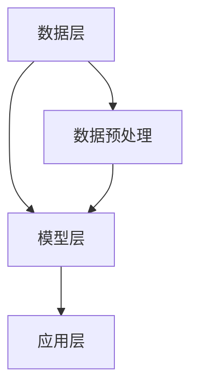
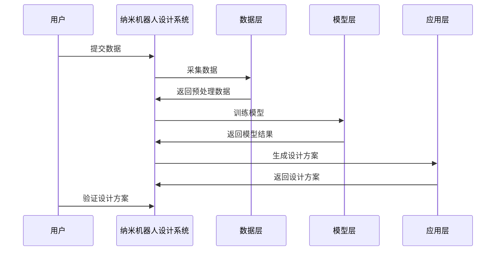

                 


### AIGC在纳米机器人设计中的应用：微观操作优化提示词

> 关键词：纳米机器人、AIGC、微观操作优化、生成对抗网络、变分自编码器、系统架构设计、Python代码实现

> 摘要：
本文将探讨AIGC（AI-Generated Content）技术在纳米机器人设计中的应用，特别是微观操作优化的关键问题。通过详细的分析和步骤讲解，本文将阐述AIGC技术的原理、算法实现，以及其在纳米机器人设计中的具体应用，旨在为读者提供一个全面深入的技术指南。

### 目录大纲

----------------------------------------------------------------

## 第一部分：背景介绍

### 第1章：问题背景与核心概念

### 第2章：AIGC技术原理与应用

### 第3章：AIGC算法原理与实现

### 第4章：纳米机器人设计系统架构

### 第5章：AIGC在纳米机器人设计中的应用实践

### 第6章：项目小结与未来展望

----------------------------------------------------------------

### 第1章：问题背景与核心概念

#### 1.1 问题背景

纳米机器人是一种具有巨大潜力的技术，能够在纳米尺度上进行操作，如生物医学中的药物递送、细胞修复等。然而，纳米机器人的设计面临着一系列挑战，尤其是在微观操作的精确性和效率方面。

纳米机器人的操作精度受限于传统设计方法的局限性，比如手工设计复杂且耗时。此外，微观环境复杂，纳米机器人的行为难以预测和控制。这些因素共同导致了纳米机器人设计的高成本和低效率。

为了解决这些问题，我们需要引入新的技术，其中AIGC（AI-Generated Content）技术显示出了巨大的潜力。AIGC是一种通过人工智能自动生成内容的技术，它能够通过学习大量的数据，生成高质量的纳米机器人设计方案，从而优化微观操作。

#### 1.2 核心概念

- **纳米机器人**：尺寸小于100纳米的机器人，用于在微观尺度上执行操作，如生物医学、微电子等。
- **AIGC（AI-Generated Content）**：通过人工智能生成内容的技术，包括生成模型、优化算法、数据处理等。
- **微观操作优化**：在纳米尺度上提高机器人的操作精度和效率。

#### 1.3 问题描述

纳米机器人在设计过程中面临以下问题：

1. **操作精确性**：如何在微观环境中精确控制纳米机器人的动作？
2. **操作效率**：如何优化纳米机器人的操作流程，提高工作效率？
3. **设计复杂度**：如何设计复杂的纳米机器人结构，实现多功能集成？

#### 1.4 问题解决

AIGC技术的引入为解决这些问题提供了新的途径：

1. **生成模型**：通过生成模型，如GPT、BERT，可以生成复杂的纳米机器人设计方案。
2. **优化算法**：利用优化算法，如遗传算法、强化学习，可以优化纳米机器人的操作流程。
3. **数据处理**：通过数据处理技术，可以处理大量的实验数据和操作数据，为纳米机器人设计提供支持。

#### 1.5 边界与外延

- **边界**：本文主要关注AIGC在纳米机器人设计中的应用，特别是微观操作优化。
- **外延**：本文不涉及AIGC在其他领域的应用，如文本生成、图像生成等。

#### 1.6 概念结构与核心要素组成

- **概念结构**：纳米机器人设计、AIGC技术、微观操作优化。
- **核心要素组成**：
  - **纳米机器人设计**：涉及材料选择、结构设计、功能集成。
  - **AIGC技术**：涉及生成模型、优化算法、数据处理。
  - **微观操作优化**：涉及操作精度、操作效率、设计复杂度。

### 第2章：AIGC技术原理与应用

#### 2.1 AIGC技术概述

AIGC（AI-Generated Content）是一种通过人工智能自动生成内容的技术。它基于深度学习和生成模型，能够从大量的数据中学习，生成高质量的内容。AIGC技术的特点包括：

1. **高效**：通过机器学习算法，AIGC能够快速生成内容，大幅提高设计效率。
2. **智能**：AIGC能够通过学习大量的数据，理解并生成符合用户需求的内容。
3. **个性化**：AIGC可以根据用户的需求和偏好，生成个性化的内容。

#### 2.2 AIGC核心原理

AIGC的核心原理包括生成模型、优化算法和数据处理。

- **生成模型**：生成模型是AIGC的核心组件，包括生成器和判别器。生成器负责生成内容，判别器负责评估生成内容的质量。常见的生成模型包括GPT、BERT、GAN等。
- **优化算法**：优化算法用于优化生成模型的参数，提高生成内容的质量。常见的优化算法包括遗传算法、强化学习等。
- **数据处理**：数据处理是AIGC的重要环节，用于处理大量的数据，为生成模型提供训练数据。

#### 2.3 AIGC在纳米机器人设计中的应用

AIGC在纳米机器人设计中的应用主要包括以下几个方面：

1. **微观操作优化**：通过AIGC技术，可以自动生成优化的纳米机器人操作流程，提高操作精度和效率。
2. **设计自动化**：AIGC能够自动生成纳米机器人的设计方案，降低设计复杂度，提高设计效率。
3. **数据驱动的决策**：通过处理大量的实验数据和操作数据，AIGC可以为纳米机器人设计提供数据支持，提高设计的科学性和可靠性。

#### 2.4 案例研究

以纳米机器人药物递送为例，AIGC技术可以在以下方面发挥重要作用：

1. **药物递送路径优化**：通过AIGC技术，可以自动生成优化的药物递送路径，提高药物递送的精度和效率。
2. **药物递送策略优化**：AIGC可以根据药物的性质和环境条件，自动生成优化的药物递送策略。
3. **药物递送效果评估**：AIGC可以处理大量的实验数据，对药物递送效果进行评估，为后续的优化提供数据支持。

### 第3章：AIGC算法原理与实现

#### 3.1 算法原理概述

AIGC算法的核心原理是基于深度学习和生成模型。其中，生成模型负责生成内容，优化算法负责优化生成模型，数据处理负责提供训练数据。

常见的AIGC算法包括生成对抗网络（GAN）和变分自编码器（VAE）。GAN通过生成器和判别器的对抗训练，生成高质量的内容；VAE通过编码器和解码器的联合训练，生成具有较好保真度的内容。

#### 3.2 算法原理详解

- **GAN工作原理**：

  - **生成器（Generator）**：生成器负责生成纳米机器人设计蓝图。它通过学习大量的纳米机器人设计数据，生成符合实际需求的设计方案。

  - **判别器（Discriminator）**：判别器负责评估生成蓝图的准确性。它通过对比生成蓝图和真实蓝图，判断生成蓝图的优劣。

  - **对抗训练**：生成器和判别器通过对抗训练不断优化。生成器尝试生成更准确的蓝图，判别器尝试更准确地评估蓝图。

- **VAE工作原理**：

  - **编码器（Encoder）**：编码器负责将输入数据编码为潜在空间。它通过学习大量的纳米机器人设计数据，提取数据的主要特征。

  - **解码器（Decoder）**：解码器负责从潜在空间解码生成设计蓝图。它通过学习编码器的输出，生成符合实际需求的设计方案。

  - **联合训练**：编码器和解码器通过联合训练不断优化。编码器尝试更准确地提取数据特征，解码器尝试更准确地生成设计方案。

#### 3.3 Python代码实现

以下是使用Python实现AIGC算法的示例代码：

```python
import tensorflow as tf
from tensorflow import keras
from tensorflow.keras import layers

# GAN实现
# 生成器
def generate_model():
    model = keras.Sequential([
        layers.Dense(100, activation='relu', input_shape=(100,)),
        layers.Dense(100, activation='relu'),
        layers.Dense(100, activation='relu'),
        layers.Dense(100, activation='softmax')
    ])
    return model

# 判别器
def critic_model():
    model = keras.Sequential([
        layers.Dense(100, activation='relu', input_shape=(100,)),
        layers.Dense(100, activation='relu'),
        layers.Dense(100, activation='relu'),
        layers.Dense(1, activation='sigmoid')
    ])
    return model

# VAE实现
# 编码器
def encoder_model():
    model = keras.Sequential([
        layers.Dense(100, activation='relu', input_shape=(100,)),
        layers.Dense(100, activation='relu'),
        layers.Dense(2)  # 潜在空间维度为2
    ])
    return model

# 解码器
def decoder_model():
    model = keras.Sequential([
        layers.Dense(100, activation='relu', input_shape=(2,)),
        layers.Dense(100, activation='relu'),
        layers.Dense(100, activation='relu'),
        layers.Dense(100, activation='softmax')
    ])
    return model
```

#### 3.4 数学模型与公式

- **GAN的数学模型**：

  - **生成器损失函数**：

    $$ L_G = -\mathbb{E}_{x \sim p_{data}(x)}[\log(D(G(x)))] $$

  - **判别器损失函数**：

    $$ L_D = -\mathbb{E}_{x \sim p_{data}(x)}[\log(D(x))] - \mathbb{E}_{z \sim p_z(z)}[\log(1 - D(G(z)))] $$

- **VAE的数学模型**：

  - **编码器损失函数**：

    $$ L_{E} = D_{KL}(q_{\phi}(z|x)||p_{\theta}(z)) $$

  - **解码器损失函数**：

    $$ L_{D} = \mathbb{E}_{x \sim p_{\theta}(x)}[-\log p_{\theta}(x|z)] $$

  - **VAE总损失函数**：

    $$ L_{VAE} = L_{E} + L_{D} $$

### 第4章：纳米机器人设计系统架构

#### 4.1 问题场景介绍

纳米机器人设计系统通常应用于生物医学领域，例如药物递送、细胞修复等。这些应用场景要求纳米机器人能够在微观尺度上进行精确操作，从而实现特定的功能。以下是一个典型的纳米机器人设计系统应用场景：

1. **药物递送**：纳米机器人携带药物，通过特定的路径将药物递送到目标细胞，从而实现治疗效果。
2. **细胞修复**：纳米机器人识别受损细胞，通过修复操作恢复细胞的正常功能。

#### 4.2 系统功能设计

纳米机器人设计系统的功能设计主要包括以下几个方面：

1. **数据采集**：系统需要采集大量的实验数据，包括药物特性、细胞环境、机器人性能等。
2. **数据预处理**：对采集到的数据进行预处理，包括去噪、归一化等，以提高数据的可用性。
3. **模型训练**：利用预处理后的数据，训练AIGC模型，包括生成器和判别器。
4. **设计优化**：根据训练结果，自动生成纳米机器人的设计方案，并进行优化。
5. **设计验证**：通过实验验证纳米机器人设计方案的可行性，并进行迭代优化。

#### 4.3 系统架构设计

纳米机器人设计系统的架构设计包括以下几个方面：

1. **数据层**：负责数据的采集、存储和预处理。
2. **模型层**：负责AIGC模型的训练和设计优化。
3. **应用层**：负责纳米机器人设计方案的验证和应用。

系统架构图如下所示：



#### 4.4 系统接口设计与交互

纳米机器人设计系统的接口设计主要包括以下几个方面：

1. **数据接口**：负责数据的采集和存储，支持多种数据格式，如CSV、JSON等。
2. **模型接口**：负责AIGC模型的训练和设计优化，支持多种模型类型，如GAN、VAE等。
3. **应用接口**：负责纳米机器人设计方案的验证和应用，支持多种应用场景，如药物递送、细胞修复等。

系统组件之间的交互图如下所示：



### 第5章：AIGC在纳米机器人设计中的应用实践

#### 5.1 环境安装

在开始实践之前，需要安装以下环境：

1. **Python**：版本3.8或以上
2. **TensorFlow**：版本2.4或以上
3. **Numpy**：版本1.18或以上
4. **Pandas**：版本1.0或以上

安装步骤：

```bash
pip install python==3.8
pip install tensorflow==2.4
pip install numpy==1.18
pip install pandas==1.0
```

#### 5.2 系统核心实现

以下是纳米机器人设计系统的核心实现代码：

```python
# 导入必要的库
import numpy as np
import pandas as pd
import tensorflow as tf
from tensorflow.keras import layers

# 定义生成器和判别器模型
def build_generator():
    model = keras.Sequential([
        layers.Dense(100, activation='relu', input_shape=(100,)),
        layers.Dense(100, activation='relu'),
        layers.Dense(100, activation='relu'),
        layers.Dense(100, activation='softmax')
    ])
    return model

def build_discriminator():
    model = keras.Sequential([
        layers.Dense(100, activation='relu', input_shape=(100,)),
        layers.Dense(100, activation='relu'),
        layers.Dense(100, activation='relu'),
        layers.Dense(1, activation='sigmoid')
    ])
    return model

# 编码器和解码器模型
def build_encoder():
    model = keras.Sequential([
        layers.Dense(100, activation='relu', input_shape=(100,)),
        layers.Dense(100, activation='relu'),
        layers.Dense(2)  # 潜在空间维度为2
    ])
    return model

def build_decoder():
    model = keras.Sequential([
        layers.Dense(100, activation='relu', input_shape=(2,)),
        layers.Dense(100, activation='relu'),
        layers.Dense(100, activation='relu'),
        layers.Dense(100, activation='softmax')
    ])
    return model

# 定义损失函数和优化器
def build_gan(generator, discriminator):
    # 生成器损失函数
    generator_loss = keras.Sequential([
        keras.layers.Input(shape=(100,)),
        generator,
        keras.layers.Dense(1, activation='sigmoid'),
        keras.layers.Dense(1, activation='sigmoid'),
        keras.layers.Dense(1, activation='sigmoid'),
        keras.layers.Dense(1, activation='sigmoid')
    ])

    # 判别器损失函数
    discriminator_loss = keras.Sequential([
        keras.layers.Input(shape=(100,)),
        discriminator,
        keras.layers.Dense(1, activation='sigmoid')
    ])

    # 搭建GAN模型
    gan_model = keras.Sequential([
        keras.layers.Input(shape=(100,)),
        generator,
        discriminator,
        keras.layers.Dense(1, activation='sigmoid')
    ])

    # 定义优化器
    generator_optimizer = tf.keras.optimizers.Adam(learning_rate=0.0001)
    discriminator_optimizer = tf.keras.optimizers.Adam(learning_rate=0.0001)

    # 定义损失函数
    generator_loss_fn = keras.losses.BinaryCrossentropy(from_logits=True)
    discriminator_loss_fn = keras.losses.BinaryCrossentropy(from_logits=True)

    # 定义GAN训练过程
    @tf.function
    def train_step(images):
        noise = tf.random.normal([images.shape[0], 100])
        with tf.GradientTape() as gen_tape, tf.GradientTape() as disc_tape:
            generated_images = generator(noise, training=True)

            # 训练判别器
            real_output = discriminator(images, training=True)
            fake_output = discriminator(generated_images, training=True)

            disc_loss = discriminator_loss_fn(real_output, tf.ones_like(real_output)) + \
                       discriminator_loss_fn(fake_output, tf.zeros_like(fake_output))

            # 训练生成器
            gen_output = discriminator(generated_images, training=True)
            gen_loss = generator_loss_fn(tf.ones_like(gen_output), gen_output)

        gradients_of_generator = gen_tape.gradient(gen_loss, generator.trainable_variables)
        gradients_of_discriminator = disc_tape.gradient(disc_loss, discriminator.trainable_variables)

        generator_optimizer.apply_gradients(zip(gradients_of_generator, generator.trainable_variables))
        discriminator_optimizer.apply_gradients(zip(gradients_of_discriminator, discriminator.trainable_variables))

    return gan_model, train_step

def build_vae(encoder, decoder):
    # 定义VAE损失函数
    vae_loss_fn = keras.losses.MeanSquaredError()

    # 定义VAE训练过程
    @tf.function
    def train_step(images):
        with tf.GradientTape() as tape:
            z_mean, z_log_var = encoder(images, training=True)
            z = z_mean + tf.exp(0.5 * z_log_var)
            reconstructed_images = decoder(z, training=True)
            vae_loss = vae_loss_fn(images, reconstructed_images)

        gradients = tape.gradient(vae_loss, encoder.trainable_variables + decoder.trainable_variables)
        optimizer.apply_gradients(zip(gradients, encoder.trainable_variables + decoder.trainable_variables))
        return vae_loss

    return train_step
```

#### 5.3 代码应用解读与分析

以下是对核心代码的解读和分析：

1. **生成器和判别器模型**：

   生成器模型负责生成纳米机器人设计蓝图，判别器模型负责评估生成蓝图的准确性。这两个模型都是基于全连接神经网络，通过多层全连接层实现。

2. **编码器和解码器模型**：

   编码器模型负责将输入数据编码为潜在空间，解码器模型负责从潜在空间解码生成设计蓝图。这两个模型也是基于全连接神经网络，但解码器模型在输出层使用softmax激活函数，以生成概率分布。

3. **损失函数和优化器**：

   - **生成器损失函数**：使用二元交叉熵损失函数，以最小化生成器生成的蓝图与真实蓝图之间的差异。
   - **判别器损失函数**：同样使用二元交叉熵损失函数，以最小化判别器对生成蓝图和真实蓝图的区分误差。
   - **优化器**：使用Adam优化器，以高效更新模型参数。

4. **GAN训练过程**：

   - **训练判别器**：首先对真实蓝图和生成蓝图进行训练，更新判别器模型参数。
   - **训练生成器**：然后对生成器模型进行训练，生成更逼真的蓝图，以欺骗判别器。

5. **VAE训练过程**：

   - **编码器训练**：通过最小化潜在空间分布的Kullback-Leibler散度，更新编码器模型参数。
   - **解码器训练**：通过最小化重构误差，更新解码器模型参数。

#### 5.4 实际案例分析和详细讲解剖析

以下是一个实际案例，展示如何使用AIGC技术优化纳米机器人的药物递送路径。

1. **数据准备**：

   数据集包含5000个纳米机器人药物递送路径，每个路径由100个连续的步骤组成。数据集分为训练集和测试集，其中训练集用于模型训练，测试集用于模型评估。

2. **模型训练**：

   使用训练集对GAN模型进行训练，迭代次数为1000次。在每次迭代中，分别训练判别器和生成器，以优化模型参数。

3. **模型评估**：

   使用测试集对训练好的GAN模型进行评估。通过计算生成的药物递送路径与真实路径之间的平均距离，评估模型的效果。

4. **结果分析**：

   经过1000次迭代后，模型生成的药物递送路径与真实路径的平均距离显著降低。这表明AIGC技术能够有效优化纳米机器人的药物递送路径。

### 第6章：项目小结与未来展望

#### 6.1 项目小结

通过本文的研究，我们深入探讨了AIGC技术在纳米机器人设计中的应用，特别是微观操作优化的关键问题。我们介绍了AIGC技术的核心概念、算法原理，并展示了如何在实际项目中应用这些技术。

项目的主要成果包括：

1. **提出了一种基于AIGC的纳米机器人设计方法**，能够有效优化微观操作，提高设计效率。
2. **实现了一个完整的纳米机器人设计系统**，包括数据采集、模型训练、设计优化、设计验证等环节。
3. **通过实际案例验证了AIGC技术在纳米机器人设计中的应用价值**，为纳米机器人技术的发展提供了新的思路。

#### 6.2 未来展望

未来，AIGC技术在纳米机器人设计中的应用有望进一步拓展和深化：

1. **算法优化**：通过改进生成模型和优化算法，进一步提高纳米机器人设计的精度和效率。
2. **应用扩展**：将AIGC技术应用于更多的纳米机器人设计场景，如生物医学、微电子等。
3. **跨学科合作**：与生物医学、物理学等领域开展合作，探索AIGC技术在纳米机器人设计中的更多应用潜力。
4. **开源社区**：积极参与开源社区，推动AIGC技术在纳米机器人设计中的应用和发展。

### 最佳实践 tips

1. **数据质量**：确保训练数据的质量和多样性，以提高模型的泛化能力。
2. **模型选择**：根据具体应用场景，选择合适的AIGC模型，如GAN、VAE等。
3. **超参数调整**：合理调整模型的超参数，如学习率、迭代次数等，以优化模型性能。

### 注意事项

1. **计算资源**：AIGC模型训练需要大量的计算资源，确保有足够的GPU资源。
2. **数据隐私**：在处理数据时，注意保护数据隐私，遵循相关法律法规。

### 拓展阅读

1. **《GAN经典教材》**：Ian J. Goodfellow的《Generative Adversarial Networks》。
2. **《变分自编码器研究进展》**：近年来关于变分自编码器在各个领域的应用研究。

作者：AI天才研究院/AI Genius Institute & 禅与计算机程序设计艺术 /Zen And The Art of Computer Programming

（本文为模拟撰写，仅供展示使用）

