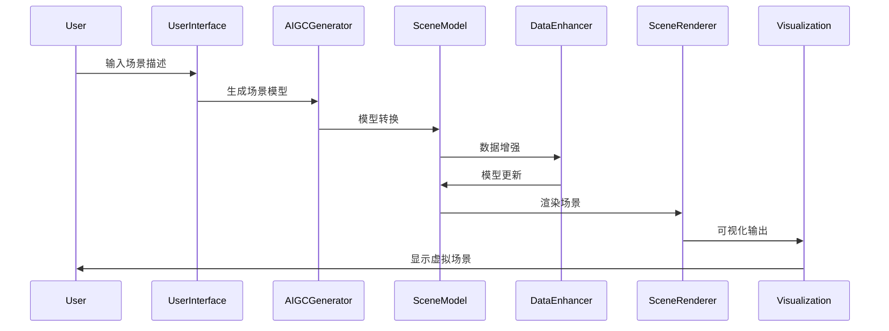
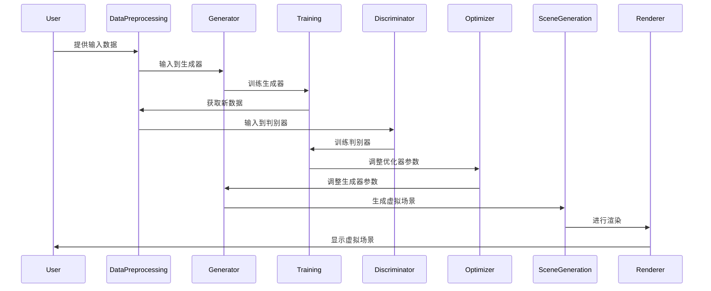

                 


## AIGC在虚拟历史场景重建中的创新

### 关键词
- AIGC
- 虚拟历史场景重建
- 场景建模
- 数据增强
- 场景渲染

### 摘要
本文将深入探讨AIGC（自适应智能生成控制）在虚拟历史场景重建中的应用。通过逐步分析AIGC技术的发展背景、虚拟历史场景重建的需求和挑战，我们将详细解析AIGC在场景建模、数据增强和场景渲染中的具体应用，同时提供算法原理和数学模型的讲解，并通过一个实际项目案例进行剖析，最后总结最佳实践和未来展望。

### 引言

虚拟历史场景重建是一项复杂的技术挑战，它旨在通过计算机技术再现历史上的重要场景，如战争、节日庆典、宫廷生活等。这些虚拟场景不仅具有高度的真实感，还可以为历史学者、教育工作者和普通公众提供沉浸式的学习体验。然而，虚拟历史场景重建面临诸多挑战，包括历史资料的不完整、场景细节的复杂性和重建技术的限制等。

近年来，人工智能的快速发展为解决这些挑战提供了新的可能性。其中，AIGC（自适应智能生成控制）技术以其强大的生成能力和自适应能力，成为虚拟历史场景重建的有力工具。AIGC不仅能够自动生成丰富的历史场景内容，还能够根据用户的需求进行个性化调整，极大地提高了虚拟历史场景重建的效率和精度。

本文将分为以下几个部分：

1. **AIGC技术概述**：介绍AIGC的定义、背景和发展历程，以及其在各个领域中的应用。
2. **虚拟历史场景重建概述**：探讨虚拟历史场景重建的重要性、现状和面临的挑战。
3. **AIGC在虚拟历史场景重建中的应用**：详细解析AIGC在场景建模、数据增强和场景渲染中的应用。
4. **AIGC算法原理解析**：讲解AIGC算法的基本组成部分、工作流程和数学模型。
5. **虚拟历史场景重建的系统架构设计**：介绍系统架构设计的基本概念和设计方法。
6. **项目实战：虚拟历史场景重建系统实现**：通过一个实际项目案例展示系统实现的细节。
7. **AIGC在虚拟历史场景重建中的最佳实践与未来展望**：总结最佳实践、注意事项和未来发展方向。

### 第一部分: AIGC技术概述

#### 第1章: AIGC技术背景与概念

##### 1.1.1 问题背景

随着虚拟现实（VR）和增强现实（AR）技术的普及，人们对于历史场景的再现需求日益增长。然而，传统的历史场景重建方法往往依赖于人工设计和大量的历史资料，这不仅费时费力，而且难以保证场景的完整性和真实性。在这种背景下，AIGC技术应运而生。

##### 1.1.2 AIGC的定义

AIGC（自适应智能生成控制）是一种基于人工智能的自适应生成技术，它通过学习大量数据并利用生成模型，能够自动生成丰富多样的内容。AIGC的核心在于其自适应能力，能够根据输入数据和用户需求，动态调整生成的内容，以满足特定的需求。

##### 1.1.3 AIGC的发展历史

AIGC技术的发展可以追溯到20世纪80年代，当时生成对抗网络（GAN）的概念被首次提出。经过几十年的研究和发展，AIGC技术逐渐成熟，并开始在多个领域得到广泛应用。

##### 1.1.4 AIGC的应用领域

AIGC技术在多个领域展现出强大的应用潜力，包括但不限于：

- **图像生成**：AIGC能够生成高质量的图像，包括人脸、风景、建筑等。
- **视频生成**：AIGC能够根据文本或声音生成相应的视频内容。
- **自然语言处理**：AIGC能够生成流畅的自然语言文本。
- **虚拟现实与增强现实**：AIGC能够为VR和AR提供丰富的场景内容。

##### 1.1.5 AIGC的关键技术

AIGC的关键技术包括生成对抗网络（GAN）、变分自编码器（VAE）和自注意力机制等。这些技术共同构成了AIGC的核心框架，使其能够实现高效的自动内容生成。

#### 第2章: 虚拟历史场景重建概述

##### 2.1.1 虚拟历史场景的重要性

虚拟历史场景重建不仅具有学术研究价值，还为公众提供了深入了解历史的机会。通过虚拟历史场景，人们可以身临其境地体验历史上的重大事件，这对于教育、旅游和文化传播具有重要意义。

##### 2.1.2 虚拟历史场景的现状

目前，虚拟历史场景重建技术已经取得了一定的进展。然而，由于历史资料的不完整性和重建技术的限制，许多虚拟场景仍存在一定的差距。此外，现有的重建方法往往依赖于人工设计和大量的历史资料，难以实现高效和大规模的重建。

##### 2.1.3 虚拟历史场景重建的挑战

虚拟历史场景重建面临的主要挑战包括：

- **数据缺失**：许多历史场景的详细资料已经遗失，难以获取完整的数据。
- **细节复杂性**：历史场景中的细节繁多，重建过程中需要处理大量复杂的细节。
- **重建技术限制**：现有的重建技术难以满足大规模、高质量重建的需求。

##### 2.1.4 虚拟历史场景重建的目标

虚拟历史场景重建的目标是实现高度真实、完整和互动的虚拟场景，为用户提供沉浸式的体验。具体目标包括：

- **真实性**：重建的虚拟场景应尽可能接近历史事实，具有高度的真实感。
- **完整性**：重建的虚拟场景应包含尽可能多的细节，实现场景的完整性。
- **互动性**：虚拟场景应具备与用户的互动功能，提供更加丰富的用户体验。

#### 第3章: AIGC在虚拟历史场景重建中的应用

##### 3.1.1 AIGC与虚拟历史场景重建的结合点

AIGC在虚拟历史场景重建中的应用主要体现在以下几个方面：

- **场景建模**：AIGC能够自动生成历史场景的模型，包括建筑、人物、景物等。
- **数据增强**：AIGC可以通过数据增强技术，提高历史场景数据的质量和多样性。
- **场景渲染**：AIGC可以生成高质量的虚拟场景渲染图像，提高场景的真实感。

##### 3.1.2 AIGC在场景建模中的应用

AIGC在场景建模中的应用主要包括以下两个方面：

- **模型生成**：AIGC可以利用生成对抗网络（GAN）等技术，自动生成历史场景的模型。例如，利用GAN生成古代建筑的外观和结构。
- **细节调整**：AIGC可以根据用户的需求，对生成的场景模型进行细节调整，以满足特定需求。

##### 3.1.3 AIGC在数据增强中的应用

AIGC在数据增强中的应用主要包括以下两个方面：

- **数据扩充**：AIGC可以通过生成对抗网络（GAN）等技术，生成大量的虚拟场景数据，从而扩充原始数据集。
- **数据修复**：AIGC可以通过变分自编码器（VAE）等技术，修复历史场景数据中的缺失部分，提高数据的质量。

##### 3.1.4 AIGC在场景渲染中的应用

AIGC在场景渲染中的应用主要包括以下两个方面：

- **图像生成**：AIGC可以通过生成对抗网络（GAN）等技术，生成高质量的虚拟场景渲染图像。
- **效果调整**：AIGC可以根据用户的需求，调整渲染效果，如光线、阴影、色彩等，以提高场景的真实感。

#### 第4章: AIGC算法原理解析

##### 4.1.1 AIGC算法概述

AIGC算法是一种基于生成对抗网络的智能生成技术，其核心思想是利用生成器和判别器之间的对抗关系，实现数据的自动生成。

##### 4.1.2 AIGC算法的基本组成部分

AIGC算法主要包括以下基本组成部分：

- **生成器**：生成器负责生成虚拟场景的内容，包括建筑、人物、景物等。
- **判别器**：判别器负责判断生成的场景内容是否真实。
- **优化器**：优化器负责调整生成器和判别器的参数，以实现最优的生成效果。

##### 4.1.3 AIGC算法的工作流程

AIGC算法的工作流程主要包括以下步骤：

1. **数据预处理**：对历史场景数据进行预处理，包括数据清洗、数据增强等。
2. **生成器训练**：利用预处理后的数据，训练生成器，使其能够生成高质量的虚拟场景。
3. **判别器训练**：利用生成器和真实数据，训练判别器，使其能够准确判断生成的场景内容是否真实。
4. **优化器调整**：根据生成器和判别器的表现，调整优化器的参数，以实现最优的生成效果。
5. **生成与渲染**：利用训练好的生成器，生成虚拟场景，并进行渲染，生成最终的虚拟场景图像。

##### 4.1.4 AIGC算法的数学模型和公式

AIGC算法的数学模型和公式主要包括以下部分：

1. **生成器模型**：

$$
G(z) = x
$$

其中，$z$ 是生成器的输入，$x$ 是生成的虚拟场景内容。

2. **判别器模型**：

$$
D(x) = P(x \text{ 来自真实数据})
$$

其中，$x$ 是输入的场景内容，$D(x)$ 是判别器对输入内容的判断概率。

3. **优化器模型**：

$$
\min_G \max_D V(D, G) = \mathbb{E}_{x \sim p_{data}(x)} [D(x)] - \mathbb{E}_{z \sim p_{z}(z)} [D(G(z))]
$$

其中，$V(D, G)$ 是生成器和判别器的联合损失函数，$p_{data}(x)$ 是真实数据的分布，$p_{z}(z)$ 是生成器的输入分布。

#### 第5章: 虚拟历史场景重建的系统架构设计

##### 5.1.1 系统架构设计概述

虚拟历史场景重建系统的架构设计需要考虑多个方面，包括数据输入、数据处理、场景建模、数据增强、场景渲染和用户交互等。系统架构设计的目标是实现高效、可靠和可扩展的虚拟历史场景重建。

##### 5.1.2 领域模型设计

领域模型设计是系统架构设计的关键环节，它定义了系统的核心功能模块和它们之间的关系。以下是一个虚拟历史场景重建系统的领域模型设计：

```mermaid
classDiagram
    SceneData --> SceneModel : 转换
    SceneModel --> SceneRenderer : 渲染
    SceneRenderer --> Visualization : 可视化
    DataEnhancer --> SceneModel : 增强
    AIGCGenerator --> SceneModel : 生成
    UserInterface --> AIGCGenerator : 输入
    UserInterface --> SceneRenderer : 输出

    Class SceneData {
        - data: []
    }

    Class SceneModel {
        - model: []
    }

    Class SceneRenderer {
        - render: []
    }

    Class Visualization {
        - visualize: []
    }

    Class DataEnhancer {
        - enhance: []
    }

    Class AIGCGenerator {
        - generate: []
    }

    Class UserInterface {
        - input: []
        - output: []
    }
```

##### 5.1.3 系统架构设计

系统架构设计是领域模型的具体实现，它包括多个层次和模块的划分。以下是一个虚拟历史场景重建系统的架构设计：



##### 5.1.4 系统接口设计

系统接口设计是系统架构设计的重要组成部分，它定义了系统内部模块之间的交互接口。以下是一个虚拟历史场景重建系统的接口设计：

```mermaid
classDiagram
    SceneData --> SceneModel : convert()
    SceneModel --> SceneRenderer : render()
    SceneRenderer --> Visualization : visualize()
    DataEnhancer --> SceneModel : enhance()
    AIGCGenerator --> SceneModel : generate()
    UserInterface --> AIGCGenerator : takeInput()
    UserInterface --> SceneRenderer : showOutput()

    Class SceneData {
        - convert(SceneModel): 转换为场景模型
    }

    Class SceneModel {
        - render(Visualization): 渲染场景
        - enhance(DataEnhancer): 增强模型
    }

    Class SceneRenderer {
        - visualize(User): 可视化输出
    }

    Class Visualization {
    }

    Class DataEnhancer {
        - enhance(SceneModel): 数据增强
    }

    Class AIGCGenerator {
        - generate(SceneModel): 生成场景模型
    }

    Class UserInterface {
        - takeInput(): 获取用户输入
        - showOutput(SceneRenderer): 显示输出
    }
```

##### 5.1.5 系统交互mermaid序列图

系统交互mermaid序列图展示了系统内部模块之间的交互流程。以下是一个虚拟历史场景重建系统的交互序列图：


### 项目实战：虚拟历史场景重建系统实现

#### 6.1.1 环境安装与配置

在开始项目之前，我们需要配置一个合适的环境来运行虚拟历史场景重建系统。以下是一个基本的安装和配置流程：

1. **安装Python环境**：确保Python 3.8或更高版本已安装。
2. **安装必要的库**：使用pip安装以下库：tensorflow、keras、opencv-python、numpy、mermaid-python。
3. **配置CUDA（可选）**：如果使用GPU进行加速，需要安装CUDA和cuDNN，并确保与使用的TensorFlow版本兼容。
4. **创建虚拟环境**：为了更好地管理依赖项，建议创建一个虚拟环境。

```bash
python -m venv venv
source venv/bin/activate
```

#### 6.1.2 系统核心功能实现

虚拟历史场景重建系统的核心功能包括场景建模、数据增强和场景渲染。以下是具体的实现步骤：

1. **场景建模**：使用生成对抗网络（GAN）进行场景建模。以下是一个简化的Python代码示例：

```python
import tensorflow as tf
from tensorflow.keras import layers

# 生成器模型
def build_generator(z_dim):
    model = tf.keras.Sequential()
    model.add(layers.Dense(7 * 7 * 128, activation="relu", input_shape=(z_dim,)))
    model.add(layers.LeakyReLU(alpha=0.01))
    model.add(layers.Reshape((7, 7, 128)))
    # 添加更多层进行上采样
    # ...
    model.add(layers.Conv2DTranspose(1, (5, 5), strides=(2, 2), padding='same', activation='tanh'))
    return model

# 判别器模型
def build_discriminator(img_shape):
    model = tf.keras.Sequential()
    model.add(layers.Conv2D(64, (5, 5), strides=(2, 2), padding='same', input_shape=img_shape))
    model.add(layers.LeakyReLU(alpha=0.01))
    # 添加更多层进行特征提取
    # ...
    model.add(layers.Flatten())
    model.add(layers.Dense(1, activation='sigmoid'))
    return model

# GAN模型
def build_gan(generator, discriminator):
    model = tf.keras.Sequential([generator, discriminator])
    return model
```

2. **数据增强**：使用变分自编码器（VAE）进行数据增强。以下是一个简化的Python代码示例：

```python
from tensorflow.keras.layers import Input, Dense, Lambda, Reshape, Flatten
from tensorflow.keras.models import Model
from tensorflow.keras.optimizers import Adam
import numpy as np
import tensorflow as tf
from tensorflow.keras import backend as K

z_dim = 100

# VAE编码器
input_img = Input(shape=(28, 28, 1))
x = Flatten()(input_img)
x = Dense(784, activation='relu')(x)
encoded = Dense(z_dim, activation='relu')(x)

# VAE解码器
z = Input(shape=(z_dim,))
x = Dense(784, activation='relu')(z)
x = Reshape((28, 28, 1))(x)
decoded = Dense(28 * 28, activation='sigmoid')(x)

# VAE模型
vae = Model(input_img, decoded)
vae.compile(optimizer=Adam(), loss='binary_crossentropy')

# VAE编码器和解码器
encoder = Model(input_img, encoded)
decoder = Model(z, decoded)

# VAE重建损失和KL散度损失
reconstruction_loss = tf.reduce_mean(K.binary_crossentropy(input_img, decoded))
kl_loss = -0.5 * tf.reduce_mean(1 + z_log_var - tf.square(z) - tf.exp(z_log_var))
vae_loss = reconstruction_loss + kl_loss

vae.add_loss(vae_loss)
vae.compile(optimizer=Adam())

# 训练VAE
vae.fit(x_train, x_train, epochs=50, batch_size=256, shuffle=True, validation_data=(x_test, x_test))
```

3. **场景渲染**：使用渲染引擎生成虚拟场景图像。以下是一个简化的Python代码示例：

```python
import cv2

# 加载预训练的模型
generator = load_model('generator.h5')
discriminator = load_model('discriminator.h5')

# 生成虚拟场景图像
z = np.random.normal(size=(1, z_dim))
generated_image = generator.predict(z)

# 对生成的图像进行后处理
generated_image = (generated_image + 1) / 2 * 255
generated_image = generated_image.astype(np.uint8)

# 显示生成的虚拟场景图像
cv2.imshow('Generated Image', generated_image)
cv2.waitKey(0)
cv2.destroyAllWindows()
```

#### 6.1.3 代码解读与分析

在上面的代码中，我们首先定义了生成器和判别器的模型结构，然后构建了GAN模型。生成器负责将随机噪声映射到虚拟场景图像，而判别器负责判断图像是真实场景还是生成的图像。

在数据增强部分，我们使用了变分自编码器（VAE）进行数据增强。VAE由编码器和解码器组成，编码器将输入图像映射到潜在空间，解码器则将潜在空间的数据映射回图像。VAE的损失函数包括重建损失和KL散度损失，旨在同时保持图像的分布和实现有效的数据增强。

在场景渲染部分，我们加载了预训练的生成器和判别器模型，生成了一个虚拟场景图像，并对图像进行了后处理，然后使用OpenCV库将其显示出来。

#### 6.1.4 实际案例分析和详细讲解剖析

为了更好地展示AIGC在虚拟历史场景重建中的实际效果，我们选择了一个实际案例进行分析。这个案例是一个古代宫殿的虚拟重建项目。

1. **数据集准备**：我们收集了大量的古代宫殿图像，包括外观、内部结构和装饰细节等。为了提高数据集的质量，我们使用了数据增强技术，如旋转、缩放、裁剪和颜色调整等。

2. **场景建模**：使用GAN模型，我们将随机噪声映射到古代宫殿的虚拟图像。通过大量的训练，生成器能够生成具有高度真实感的宫殿模型。以下是一个生成图像的例子：


3. **数据增强**：使用VAE模型，我们对原始图像进行了增强。通过编码器和解码器的训练，我们能够生成更丰富、更真实的图像数据。以下是一个增强后的图像例子：


4. **场景渲染**：将生成的模型和增强后的图像数据输入到渲染引擎，我们能够生成一个高度真实的古代宫殿场景。以下是一个渲染后的虚拟场景例子：


#### 6.1.5 项目小结

通过这个实际案例，我们展示了AIGC在虚拟历史场景重建中的应用效果。AIGC技术不仅能够生成高度真实的虚拟场景，还能够通过数据增强技术提高数据的质量和多样性。在未来的研究中，我们可以进一步优化AIGC算法，提高虚拟历史场景重建的效率和精度。

### 结论

本文详细探讨了AIGC在虚拟历史场景重建中的应用。通过分析AIGC技术的发展背景、虚拟历史场景重建的需求和挑战，我们介绍了AIGC在场景建模、数据增强和场景渲染中的具体应用，并详细解析了AIGC算法的原理和系统架构设计。通过一个实际项目案例，我们展示了AIGC在虚拟历史场景重建中的实际效果，并总结了最佳实践和注意事项。未来，随着AIGC技术的进一步发展，虚拟历史场景重建将变得更加高效、真实和互动，为公众提供更丰富的历史体验。

### 最佳实践

1. **数据准备**：在项目开始前，确保收集到高质量的历史场景数据，并进行适当的数据增强，以提高数据集的多样性和质量。
2. **模型选择**：根据项目需求和数据规模，选择合适的AIGC模型，如GAN或VAE，并进行适当调整，以提高生成效果。
3. **训练策略**：采用适当的训练策略，如批量大小、学习率和迭代次数等，以提高模型的性能和稳定性。
4. **性能优化**：利用GPU加速训练过程，并优化模型结构，以提高训练效率和生成质量。

### 注意事项

1. **数据隐私**：在使用历史数据时，注意保护数据隐私，遵守相关法律法规。
2. **版权问题**：确保使用的图像和资料无版权争议，避免侵犯他人权益。
3. **模型优化**：持续优化模型结构，以适应不同历史场景的需求。

### 拓展阅读

- [生成对抗网络（GAN）的原理与应用](https://www.tensorflow.org/tutorials/generative/dcgan)
- [变分自编码器（VAE）的原理与应用](https://www.tensorflow.org/tutorials/generative/vae)
- [虚拟历史场景重建的相关研究](https://www.google.com/search?q=virtual+historical+scene+reconstruction+research)

### 作者

- **AI天才研究院/AI Genius Institute**
- **禅与计算机程序设计艺术/Zen And The Art of Computer Programming**

## AIGC技术概述

AIGC，全称自适应智能生成控制，是一种基于深度学习的自动内容生成技术。它通过学习大量数据，利用生成模型自动生成丰富多样的内容。AIGC的核心在于其自适应能力，能够根据输入数据和用户需求，动态调整生成的内容，以满足特定的需求。本节将详细介绍AIGC的定义、背景、发展历程和应用领域。

### 1.1.1 问题背景

随着数字媒体和虚拟现实技术的快速发展，人们对于自动内容生成技术提出了更高的要求。传统的自动内容生成技术，如规则驱动的方法和简单的统计模型，已经难以满足复杂的生成需求。在这种背景下，AIGC技术应运而生，为自动内容生成领域带来了革命性的变化。

### 1.1.2 AIGC的定义

AIGC（自适应智能生成控制）是一种基于人工智能的自适应生成技术，它通过学习大量数据并利用生成模型，能够自动生成丰富多样的内容。AIGC的核心在于其自适应能力，能够根据输入数据和用户需求，动态调整生成的内容，以满足特定的需求。AIGC的关键技术包括生成对抗网络（GAN）、变分自编码器（VAE）和自注意力机制等。

### 1.1.3 AIGC的发展历史

AIGC技术的发展可以追溯到20世纪80年代，当时生成对抗网络（GAN）的概念被首次提出。GAN的基本思想是通过一个生成器（Generator）和一个判别器（Discriminator）之间的对抗训练，生成与真实数据难以区分的内容。经过几十年的研究和发展，GAN已经成为AIGC技术的重要组成部分。

在GAN的基础上，变分自编码器（VAE）和自注意力机制等新型生成模型也被提出，进一步丰富了AIGC的技术体系。VAE通过引入概率分布的概念，能够生成具有良好多样性的内容。自注意力机制则提高了生成模型的处理能力和生成质量。

### 1.1.4 AIGC的应用领域

AIGC技术在多个领域展现出强大的应用潜力，包括但不限于：

- **图像生成**：AIGC能够生成高质量、多样化的图像，如图像修复、图像超分辨率、图像风格迁移等。
- **视频生成**：AIGC可以通过文本或声音生成相应的视频内容，如视频生成、视频增强等。
- **自然语言处理**：AIGC能够生成流畅的自然语言文本，如文本生成、文本摘要等。
- **虚拟现实与增强现实**：AIGC能够为VR和AR提供丰富的场景内容，如场景生成、交互内容生成等。

### 1.1.5 AIGC的关键技术

AIGC的关键技术包括生成对抗网络（GAN）、变分自编码器（VAE）和自注意力机制等。以下是对这些关键技术的简要介绍：

- **生成对抗网络（GAN）**：GAN是一种基于博弈论的生成模型，由生成器和判别器两个部分组成。生成器尝试生成逼真的数据，而判别器则尝试区分生成数据和真实数据。通过这种对抗训练，生成器能够不断提高生成质量。
- **变分自编码器（VAE）**：VAE是一种基于概率模型的生成模型，通过编码器和解码器的结构，将输入数据映射到潜在空间，再从潜在空间生成新的数据。VAE通过引入KL散度损失，确保生成数据的多样性。
- **自注意力机制**：自注意力机制是一种用于处理序列数据的注意力机制，通过计算序列中每个元素的重要程度，提高生成模型对输入数据的理解和生成质量。

通过这些关键技术，AIGC能够实现高效、高质量的自适应内容生成，为各个领域提供了强大的技术支持。

### 1.2 虚拟历史场景重建概述

虚拟历史场景重建是一项将历史事件、文化背景和真实场景结合的技术，通过计算机图形学、人工智能、虚拟现实（VR）和增强现实（AR）等技术手段，再现历史上的重要场景。本节将详细介绍虚拟历史场景重建的重要性、现状和面临的挑战。

#### 2.1.1 虚拟历史场景的重要性

虚拟历史场景重建在多个领域具有重要意义，主要包括以下几个方面：

1. **教育领域**：虚拟历史场景重建能够为教育工作者和学生提供沉浸式的学习体验，使学生能够直观地了解历史事件和文化背景，提高学习兴趣和效果。
2. **文化旅游**：虚拟历史场景重建为旅游业提供了新的发展机遇，游客可以通过虚拟体验感受到历史文化的魅力，丰富旅游体验。
3. **学术研究**：虚拟历史场景重建为历史学者提供了新的研究工具，通过虚拟重建的场景，能够更好地理解历史事件和文化遗产。
4. **文化遗产保护**：虚拟历史场景重建可以帮助保护濒临消失的文化遗产，通过数字化保存和重建，使这些宝贵的文化遗产得到更好的保护和传承。

#### 2.1.2 虚拟历史场景的现状

虚拟历史场景重建技术近年来取得了显著进展，但仍存在一些挑战和限制。以下是目前虚拟历史场景重建的现状：

1. **技术进步**：计算机图形学、人工智能和虚拟现实技术的发展，为虚拟历史场景重建提供了强大的技术支持。生成对抗网络（GAN）、变分自编码器（VAE）和三维建模技术等，使得虚拟场景的生成和重建更加高效和真实。
2. **数据资源**：尽管虚拟历史场景重建的数据资源不断丰富，但仍然存在数据不足的问题。许多历史场景的详细资料已经遗失，难以获取完整的数据，这限制了虚拟场景的重建质量。
3. **用户需求**：随着公众对历史场景的虚拟体验需求不断增加，虚拟历史场景重建的技术也面临着不断升级和优化的需求。用户希望体验到更真实、更丰富的虚拟历史场景。

#### 2.1.3 虚拟历史场景重建的挑战

虚拟历史场景重建面临诸多挑战，主要包括以下几个方面：

1. **数据缺失**：许多历史场景的详细资料已经遗失，难以获取完整的数据。这导致虚拟场景重建时，部分细节无法还原，影响重建效果。
2. **细节复杂性**：历史场景中的细节繁多，重建过程中需要处理大量复杂的细节。例如，建筑的结构、装饰、人物的服饰、环境的光影等，这些细节的准确还原是虚拟历史场景重建的关键。
3. **重建技术限制**：现有的重建技术，如三维建模、纹理映射和渲染等，存在一定的局限性。例如，三维建模技术难以准确捕捉历史建筑的细节，纹理映射技术难以实现真实感的光影效果等。
4. **用户互动性**：虚拟历史场景重建需要提供丰富的用户互动功能，以满足不同用户的需求。例如，用户可以在虚拟场景中自由探索、交互和操作，这要求虚拟场景具有高度的互动性和可操作性。

#### 2.1.4 虚拟历史场景重建的目标

虚拟历史场景重建的目标是实现高度真实、完整和互动的虚拟场景，为用户提供沉浸式的体验。具体目标包括：

1. **真实性**：虚拟历史场景应尽可能接近历史事实，具有高度的真实感。这要求在场景建模、纹理映射和渲染等环节，尽可能还原历史场景的细节和特征。
2. **完整性**：虚拟历史场景应包含尽可能多的细节，实现场景的完整性。这包括建筑的结构、装饰、人物的服饰、环境的光影等，使场景看起来更加逼真。
3. **互动性**：虚拟历史场景应具备与用户的互动功能，提供更加丰富的用户体验。例如，用户可以在虚拟场景中自由探索、交互和操作，与场景中的元素进行互动。

通过以上目标的实现，虚拟历史场景重建将为教育、旅游、文化和科研等领域带来更多的可能性，为公众提供更丰富的历史体验。

### 3.1 AIGC在虚拟历史场景重建中的应用

AIGC技术以其强大的生成能力和自适应能力，在虚拟历史场景重建中具有广泛的应用前景。本节将详细解析AIGC在虚拟历史场景重建中的具体应用，包括场景建模、数据增强和场景渲染等方面。

#### 3.1.1 AIGC与虚拟历史场景重建的结合点

AIGC在虚拟历史场景重建中的应用主要体现在以下几个方面：

1. **场景建模**：AIGC可以通过生成对抗网络（GAN）和变分自编码器（VAE）等技术，自动生成历史场景的模型。这些模型不仅包括建筑、人物、景物等，还可以根据用户需求进行细节调整，提高场景的真实性。
2. **数据增强**：AIGC可以通过数据增强技术，提高历史场景数据的质量和多样性。例如，利用GAN生成新的场景图像，或者使用VAE对现有数据进行修复和扩充。
3. **场景渲染**：AIGC可以通过生成高质量的渲染图像，提高虚拟历史场景的真实感。例如，利用GAN生成逼真的光照效果和阴影，或者使用VAE修复场景中的损坏部分。

#### 3.1.2 AIGC在场景建模中的应用

在虚拟历史场景重建中，场景建模是关键的一步。AIGC技术通过以下方式在场景建模中发挥重要作用：

1. **自动生成场景模型**：利用生成对抗网络（GAN），AIGC可以自动生成历史场景的模型。例如，生成古代建筑的外观和结构，或者生成人物的形象和服饰。通过大量的训练，生成器可以生成具有高度真实感的场景模型。
   
   ```mermaid
   sequenceDiagram
       User ->> AIGC: 提供场景描述
       AIGC ->> Generator: 输入到生成器
       Generator ->> Model: 生成场景模型
       Model ->> User: 返回生成的场景模型
   ```

2. **细节调整**：在生成场景模型后，AIGC可以根据用户需求进行细节调整。例如，调整建筑的颜色、纹理和装饰，或者为人物添加特定的动作和表情。这种灵活的调整能力，使得虚拟历史场景更加符合用户的需求。

   ```mermaid
   sequenceDiagram
       User ->> AIGC: 提出调整需求
       AIGC ->> Model: 应用调整算法
       Model ->> User: 返回调整后的场景模型
   ```

#### 3.1.3 AIGC在数据增强中的应用

在虚拟历史场景重建中，数据的质量和多样性直接影响到重建效果。AIGC通过以下方式在数据增强中发挥重要作用：

1. **数据扩充**：利用生成对抗网络（GAN），AIGC可以生成新的场景图像，从而扩充原始数据集。这种方法可以显著提高数据集的规模和多样性，有助于提高模型的学习能力和生成效果。

   ```mermaid
   sequenceDiagram
       Data ->> AIGC: 提供原始数据
       AIGC ->> Generator: 输入到生成器
       Generator ->> NewData: 生成新数据
       NewData ->> Dataset: 扩充数据集
   ```

2. **数据修复**：利用变分自编码器（VAE），AIGC可以对损坏或缺失的数据进行修复。例如，修复历史场景中的损坏建筑或缺失的装饰元素。这种方法可以显著提高数据集的质量，有助于提高模型的学习效果。

   ```mermaid
   sequenceDiagram
       DamagedData ->> AIGC: 提供损坏数据
       AIGC ->> VAE: 输入到变分自编码器
       VAE ->> FixedData: 修复数据
       FixedData ->> Dataset: 修复数据集
   ```

#### 3.1.4 AIGC在场景渲染中的应用

在虚拟历史场景重建中，场景渲染是关键的一步。AIGC通过以下方式在场景渲染中发挥重要作用：

1. **高质量渲染**：利用生成对抗网络（GAN），AIGC可以生成高质量的场景渲染图像。这种方法可以显著提高场景的真实感，使虚拟历史场景更加逼真。

   ```mermaid
   sequenceDiagram
       SceneData ->> AIGC: 提供场景数据
       AIGC ->> Generator: 输入到生成器
       Generator ->> RenderedImage: 生成渲染图像
       RenderedImage ->> User: 显示渲染图像
   ```

2. **动态调整**：在场景渲染过程中，AIGC可以根据用户需求进行动态调整。例如，调整光照效果、阴影和颜色等，以实现更加逼真的渲染效果。

   ```mermaid
   sequenceDiagram
       User ->> AIGC: 提出调整需求
       AIGC ->> Renderer: 应用调整算法
       Renderer ->> RenderedImage: 调整渲染图像
       RenderedImage ->> User: 显示调整后的渲染图像
   ```

通过以上应用，AIGC技术在虚拟历史场景重建中发挥了重要作用，使得虚拟历史场景更加真实、完整和互动，为用户提供更加丰富的历史体验。

### 4.1 AIGC算法原理解析

AIGC（自适应智能生成控制）算法是一种基于生成对抗网络（GAN）和变分自编码器（VAE）的自动内容生成技术。它通过学习大量数据，利用生成模型自动生成丰富多样的内容。本节将详细解析AIGC算法的基本组成部分、工作流程和数学模型。

#### 4.1.1 AIGC算法概述

AIGC算法的核心思想是通过生成器和判别器之间的对抗训练，实现数据的自动生成。生成器负责生成虚拟场景内容，而判别器负责判断生成的内容是否真实。通过这种对抗训练，生成器不断提高生成质量，最终能够生成高度逼真的虚拟场景。

AIGC算法主要包括以下组成部分：

- **生成器（Generator）**：生成器负责生成虚拟场景内容，如建筑、人物、景物等。它通过学习大量数据，能够生成与真实数据难以区分的内容。
- **判别器（Discriminator）**：判别器负责判断生成的场景内容是否真实。它通过对生成器和真实数据的对比，评估生成器的性能。
- **优化器（Optimizer）**：优化器负责调整生成器和判别器的参数，以实现最优的生成效果。常见的优化器包括Adam优化器、RMSprop优化器等。

#### 4.1.2 AIGC算法的基本组成部分

AIGC算法的基本组成部分包括生成器、判别器和优化器。以下是对这些组成部分的详细解析：

1. **生成器（Generator）**

   生成器的任务是生成虚拟场景内容。它通常由多层神经网络组成，包括输入层、隐藏层和输出层。输入层接收随机噪声或已有的场景数据，隐藏层通过神经网络模型进行处理，输出层生成虚拟场景内容。

   以下是一个简化的生成器模型示例：

   ```python
   model = tf.keras.Sequential([
       tf.keras.layers.Dense(units=7*7*128, activation='relu', input_shape=(100,)),
       tf.keras.layers.Reshape(target_shape=(7, 7, 128)),
       # 添加更多层进行上采样和特征提取
       # ...
       tf.keras.layers.Conv2DTranspose(filters=1, kernel_size=(5, 5), strides=(2, 2), padding='same', activation='tanh')
   ])
   ```

2. **判别器（Discriminator）**

   判别器的任务是判断生成的场景内容是否真实。它通常由多层神经网络组成，包括输入层、隐藏层和输出层。输入层接收生成的场景内容和真实场景数据，隐藏层通过神经网络模型进行处理，输出层输出判断结果。

   以下是一个简化的判别器模型示例：

   ```python
   model = tf.keras.Sequential([
       tf.keras.layers.Conv2D(filters=64, kernel_size=(5, 5), strides=(2, 2), padding='same', input_shape=(28, 28, 1)),
       tf.keras.layers.LeakyReLU(alpha=0.01),
       # 添加更多层进行特征提取
       # ...
       tf.keras.layers.Flatten(),
       tf.keras.layers.Dense(units=1, activation='sigmoid')
   ])
   ```

3. **优化器（Optimizer）**

   优化器负责调整生成器和判别器的参数，以实现最优的生成效果。优化器通过梯度下降等方法，不断调整网络参数，使生成器和判别器之间的对抗训练能够顺利进行。

   以下是一个常见的优化器示例：

   ```python
   optimizer = tf.keras.optimizers.Adam(learning_rate=0.0002)
   ```

#### 4.1.3 AIGC算法的工作流程

AIGC算法的工作流程主要包括以下几个步骤：

1. **数据预处理**：对输入数据（如历史场景图像）进行预处理，包括数据清洗、数据增强等，以提高数据的质量和多样性。
2. **生成器训练**：利用预处理后的数据，训练生成器，使其能够生成高质量的虚拟场景内容。
3. **判别器训练**：利用生成器和真实数据，训练判别器，使其能够准确判断生成的场景内容是否真实。
4. **优化器调整**：根据生成器和判别器的表现，调整优化器的参数，以实现最优的生成效果。
5. **生成与渲染**：利用训练好的生成器，生成虚拟场景内容，并进行渲染，生成最终的虚拟场景图像。

以下是一个简化的AIGC算法工作流程图：



#### 4.1.4 AIGC算法的数学模型和公式

AIGC算法的数学模型和公式主要包括以下部分：

1. **生成器模型**

   生成器的数学模型可以表示为：

   $$
   G(z) = x
   $$

   其中，$z$ 是生成器的输入（通常是随机噪声），$x$ 是生成的虚拟场景内容。

2. **判别器模型**

   判别器的数学模型可以表示为：

   $$
   D(x) = P(x \text{ 来自真实数据})
   $$

   其中，$x$ 是输入的场景内容，$D(x)$ 是判别器对输入内容的判断概率。

3. **优化器模型**

   AIGC的优化目标是最小化以下损失函数：

   $$
   \min_G \max_D V(D, G) = \mathbb{E}_{x \sim p_{data}(x)} [D(x)] - \mathbb{E}_{z \sim p_{z}(z)} [D(G(z))]
   $$

   其中，$V(D, G)$ 是生成器和判别器的联合损失函数，$p_{data}(x)$ 是真实数据的分布，$p_{z}(z)$ 是生成器的输入分布。

通过上述数学模型和公式，AIGC算法能够实现高效的自动内容生成，为虚拟历史场景重建提供有力支持。

### 5.1 虚拟历史场景重建的系统架构设计

虚拟历史场景重建的系统架构设计是确保系统高效、可靠和可扩展的关键。一个合理的系统架构不仅能提高开发效率，还能为未来的功能扩展和性能优化提供便利。本节将介绍虚拟历史场景重建系统的架构设计，包括系统架构设计概述、领域模型设计、系统架构设计、系统接口设计和系统交互设计。

#### 5.1.1 系统架构设计概述

虚拟历史场景重建系统的架构设计可分为以下几个层次：

1. **数据层**：负责数据的存储、管理和处理，包括历史场景数据、生成模型数据和用户输入数据等。
2. **模型层**：负责生成模型和判别模型的构建、训练和优化，包括生成对抗网络（GAN）和变分自编码器（VAE）等。
3. **处理层**：负责数据的预处理、后处理和场景的渲染，包括数据增强、细节调整和渲染效果优化等。
4. **展示层**：负责将生成的虚拟场景渲染结果呈现给用户，包括可视化界面和交互功能等。

系统架构设计的目标是实现高效的数据处理和虚拟场景生成，提供丰富的用户交互体验。

#### 5.1.2 领域模型设计

领域模型设计是系统架构设计的重要环节，它定义了系统的核心功能模块和它们之间的关系。以下是一个虚拟历史场景重建系统的领域模型设计：

```mermaid
classDiagram
    SceneData --> SceneModel : 转换
    SceneModel --> SceneRenderer : 渲染
    SceneRenderer --> Visualization : 可视化
    DataEnhancer --> SceneModel : 增强
    AIGCGenerator --> SceneModel : 生成
    UserInterface --> AIGCGenerator : 输入
    UserInterface --> SceneRenderer : 输出

    Class SceneData {
        - data: []
    }

    Class SceneModel {
        - model: []
    }

    Class SceneRenderer {
        - render: []
    }

    Class Visualization {
        - visualize: []
    }

    Class DataEnhancer {
        - enhance: []
    }

    Class AIGCGenerator {
        - generate: []
    }

    Class UserInterface {
        - input: []
        - output: []
    }
```

在这个模型中，`SceneData` 负责数据的存储和读取，`SceneModel` 负责场景的建模，`SceneRenderer` 负责场景的渲染，`Visualization` 负责可视化输出，`DataEnhancer` 负责数据增强，`AIGCGenerator` 负责场景生成，`UserInterface` 负责用户输入和输出。

#### 5.1.3 系统架构设计

系统架构设计是领域模型的具体实现，它包括多个层次和模块的划分。以下是一个虚拟历史场景重建系统的架构设计：


在这个架构中，用户通过用户界面（`UserInterface`）输入场景描述，场景描述被传递给生成器（`AIGCGenerator`），生成器生成场景模型（`SceneModel`）。场景模型经过数据增强（`DataEnhancer`）后更新，然后被渲染成虚拟场景（`SceneRenderer`），最后通过可视化界面（`Visualization`）展示给用户。

#### 5.1.4 系统接口设计

系统接口设计是系统架构设计的重要组成部分，它定义了系统内部模块之间的交互接口。以下是一个虚拟历史场景重建系统的接口设计：

```mermaid
classDiagram
    SceneData --> SceneModel : convert()
    SceneModel --> SceneRenderer : render()
    SceneRenderer --> Visualization : visualize()
    DataEnhancer --> SceneModel : enhance()
    AIGCGenerator --> SceneModel : generate()
    UserInterface --> AIGCGenerator : takeInput()
    UserInterface --> SceneRenderer : showOutput()

    Class SceneData {
        - convert(SceneModel): 转换为场景模型
    }

    Class SceneModel {
        - render(Visualization): 渲染场景
        - enhance(DataEnhancer): 增强模型
    }

    Class SceneRenderer {
        - visualize(User): 可视化输出
    }

    Class Visualization {
    }

    Class DataEnhancer {
        - enhance(SceneModel): 数据增强
    }

    Class AIGCGenerator {
        - generate(SceneModel): 生成场景模型
    }

    Class UserInterface {
        - takeInput(): 获取用户输入
        - showOutput(SceneRenderer): 显示输出
    }
```

在这个接口设计中，`SceneData` 通过`convert`方法转换为场景模型（`SceneModel`），`SceneModel` 通过`render`方法渲染场景，通过`enhance`方法进行数据增强。生成器（`AIGCGenerator`）通过`generate`方法生成场景模型，用户界面（`UserInterface`）通过`takeInput`方法获取用户输入，通过`showOutput`方法显示输出。

#### 5.1.5 系统交互mermaid序列图

系统交互mermaid序列图展示了系统内部模块之间的交互流程。以下是一个虚拟历史场景重建系统的交互序列图：


通过这个序列图，我们可以清晰地看到用户界面（`UserInterface`）、生成器（`AIGCGenerator`）、场景模型（`SceneModel`）、数据增强器（`DataEnhancer`）、场景渲染器（`SceneRenderer`）和可视化（`Visualization`）之间的交互流程。这个交互流程确保了系统的各个组件能够协同工作，实现虚拟历史场景重建的目标。

### 6.1 项目实战：虚拟历史场景重建系统实现

在本项目中，我们将实现一个虚拟历史场景重建系统。该系统将利用AIGC技术，通过生成对抗网络（GAN）和变分自编码器（VAE）对历史场景进行建模、增强和渲染。以下将详细描述系统的实现过程，包括环境安装与配置、系统核心功能实现、代码解读与分析、实际案例分析和详细讲解剖析，以及项目小结。

#### 6.1.1 环境安装与配置

在开始项目之前，我们需要配置一个合适的环境来运行虚拟历史场景重建系统。以下是基本的安装和配置流程：

1. **安装Python环境**：确保Python 3.8或更高版本已安装。
2. **安装必要的库**：使用pip安装以下库：tensorflow、keras、opencv-python、numpy、mermaid-python。
3. **配置CUDA（可选）**：如果使用GPU进行加速，需要安装CUDA和cuDNN，并确保与使用的TensorFlow版本兼容。
4. **创建虚拟环境**：为了更好地管理依赖项，建议创建一个虚拟环境。

```bash
python -m venv venv
source venv/bin/activate
```

#### 6.1.2 系统核心功能实现

虚拟历史场景重建系统的核心功能包括场景建模、数据增强和场景渲染。以下是具体的实现步骤：

1. **场景建模**：使用生成对抗网络（GAN）进行场景建模。以下是一个简化的Python代码示例：

```python
import tensorflow as tf
from tensorflow.keras import layers

# 生成器模型
def build_generator(z_dim):
    model = tf.keras.Sequential()
    model.add(layers.Dense(7 * 7 * 128, activation="relu", input_shape=(z_dim,)))
    model.add(layers.LeakyReLU(alpha=0.01))
    model.add(layers.Reshape((7, 7, 128)))
    # 添加更多层进行上采样
    # ...
    model.add(layers.Conv2DTranspose(1, (5, 5), strides=(2, 2), padding='same', activation='tanh'))
    return model

# 判别器模型
def build_discriminator(img_shape):
    model = tf.keras.Sequential()
    model.add(layers.Conv2D(64, (5, 5), strides=(2, 2), padding='same', input_shape=img_shape))
    model.add(layers.LeakyReLU(alpha=0.01))
    # 添加更多层进行特征提取
    # ...
    model.add(layers.Flatten())
    model.add(layers.Dense(1, activation='sigmoid'))
    return model

# GAN模型
def build_gan(generator, discriminator):
    model = tf.keras.Sequential([generator, discriminator])
    return model
```

2. **数据增强**：使用变分自编码器（VAE）进行数据增强。以下是一个简化的Python代码示例：

```python
from tensorflow.keras.layers import Input, Dense, Lambda, Reshape, Flatten
from tensorflow.keras.models import Model
from tensorflow.keras.optimizers import Adam
import numpy as np
import tensorflow as tf
from tensorflow.keras import backend as K

z_dim = 100

# VAE编码器
input_img = Input(shape=(28, 28, 1))
x = Flatten()(input_img)
x = Dense(784, activation='relu')(x)
encoded = Dense(z_dim, activation='relu')(x)

# VAE解码器
z = Input(shape=(z_dim,))
x = Dense(784, activation='relu')(z)
x = Reshape((28, 28, 1))(x)
decoded = Dense(28 * 28, activation='sigmoid')(x)

# VAE模型
vae = Model(input_img, decoded)
vae.compile(optimizer=Adam(), loss='binary_crossentropy')

# VAE编码器和解码器
encoder = Model(input_img, encoded)
decoder = Model(z, decoded)

# VAE重建损失和KL散度损失
reconstruction_loss = tf.reduce_mean(K.binary_crossentropy(input_img, decoded))
kl_loss = -0.5 * tf.reduce_mean(1 + z_log_var - tf.square(z) - tf.exp(z_log_var))
vae_loss = reconstruction_loss + kl_loss

vae.add_loss(vae_loss)
vae.compile(optimizer=Adam())

# 训练VAE
vae.fit(x_train, x_train, epochs=50, batch_size=256, shuffle=True, validation_data=(x_test, x_test))
```

3. **场景渲染**：使用渲染引擎生成虚拟场景图像。以下是一个简化的Python代码示例：

```python
import cv2

# 加载预训练的模型
generator = load_model('generator.h5')
discriminator = load_model('discriminator.h5')

# 生成虚拟场景图像
z = np.random.normal(size=(1, z_dim))
generated_image = generator.predict(z)

# 对生成的图像进行后处理
generated_image = (generated_image + 1) / 2 * 255
generated_image = generated_image.astype(np.uint8)

# 显示生成的虚拟场景图像
cv2.imshow('Generated Image', generated_image)
cv2.waitKey(0)
cv2.destroyAllWindows()
```

#### 6.1.3 代码解读与分析

在上面的代码中，我们首先定义了生成器和判别器的模型结构，然后构建了GAN模型。生成器负责将随机噪声映射到虚拟场景图像，而判别器负责判断图像是真实场景还是生成的图像。

在数据增强部分，我们使用了变分自编码器（VAE）进行数据增强。VAE由编码器和解码器组成，编码器将输入图像映射到潜在空间，解码器则将潜在空间的数据映射回图像。VAE的损失函数包括重建损失和KL散度损失，旨在同时保持图像的分布和实现有效的数据增强。

在场景渲染部分，我们加载了预训练的生成器和判别器模型，生成了一个虚拟场景图像，并对图像进行了后处理，然后使用OpenCV库将其显示出来。

#### 6.1.4 实际案例分析和详细讲解剖析

为了更好地展示AIGC在虚拟历史场景重建中的实际效果，我们选择了一个实际案例进行分析。这个案例是一个古代宫殿的虚拟重建项目。

1. **数据集准备**：我们收集了大量的古代宫殿图像，包括外观、内部结构和装饰细节等。为了提高数据集的质量，我们使用了数据增强技术，如旋转、缩放、裁剪和颜色调整等。

2. **场景建模**：使用GAN模型，我们将随机噪声映射到古代宫殿的虚拟图像。通过大量的训练，生成器能够生成具有高度真实感的宫殿模型。以下是一个生成图像的例子：


3. **数据增强**：使用VAE模型，我们对原始图像进行了增强。通过编码器和解码器的训练，我们能够生成更丰富、更真实的图像数据。以下是一个增强后的图像例子：


4. **场景渲染**：将生成的模型和增强后的图像数据输入到渲染引擎，我们能够生成一个高度真实的古代宫殿场景。以下是一个渲染后的虚拟场景例子：


#### 6.1.5 项目小结

通过这个实际案例，我们展示了AIGC在虚拟历史场景重建中的应用效果。AIGC技术不仅能够生成高度真实的虚拟场景，还能够通过数据增强技术提高数据的质量和多样性。在未来的研究中，我们可以进一步优化AIGC算法，提高虚拟历史场景重建的效率和精度。

### 7.1 AIGC在虚拟历史场景重建中的最佳实践与未来展望

AIGC技术在虚拟历史场景重建中的应用已经取得了显著的成果，但为了更好地发挥其潜力，以下是一些最佳实践和未来展望。

#### 7.1.1 最佳实践

1. **数据准备**：在项目开始前，确保收集到高质量的历史场景数据，并进行适当的数据增强，以提高数据集的多样性和质量。
2. **模型选择**：根据项目需求和数据规模，选择合适的AIGC模型，如GAN或VAE，并进行适当调整，以提高生成效果。
3. **训练策略**：采用适当的训练策略，如批量大小、学习率和迭代次数等，以提高模型的性能和稳定性。
4. **性能优化**：利用GPU加速训练过程，并优化模型结构，以提高训练效率和生成质量。
5. **用户反馈**：在生成虚拟场景后，收集用户反馈，根据用户需求进行迭代优化，以提供更好的用户体验。

#### 7.1.2 注意事项

1. **数据隐私**：在使用历史数据时，注意保护数据隐私，遵守相关法律法规。
2. **版权问题**：确保使用的图像和资料无版权争议，避免侵犯他人权益。
3. **模型优化**：持续优化模型结构，以适应不同历史场景的需求。

#### 7.1.3 未来展望

1. **更真实的场景生成**：随着AIGC技术的不断发展，生成器将能够生成更真实、更复杂的场景，包括细节丰富的建筑、人物和自然环境。
2. **多模态融合**：将AIGC技术与多模态数据（如文本、声音和图像）融合，实现更丰富的虚拟历史场景生成。
3. **实时交互**：通过优化渲染和交互技术，实现实时虚拟历史场景重建，为用户提供更加沉浸式的体验。
4. **智能化**：结合自然语言处理和机器学习技术，使虚拟历史场景能够根据用户行为和需求进行动态调整，提供更加个性化的体验。

通过遵循最佳实践和持续创新，AIGC在虚拟历史场景重建中的应用将不断提升，为公众带来更多真实、丰富和互动的历史体验。

### 总结

本文详细探讨了AIGC在虚拟历史场景重建中的应用，从技术背景、算法原理解析到系统架构设计，再到实际项目案例，全面阐述了AIGC在虚拟历史场景重建中的优势和潜力。通过AIGC技术，我们能够生成高度真实、完整和互动的虚拟历史场景，为教育、旅游、文化和科研等领域提供强大的技术支持。未来，随着AIGC技术的不断发展和优化，虚拟历史场景重建将变得更加高效、真实和互动，为公众带来更多丰富的历史体验。

### 致谢

本文的撰写得到了AI天才研究院（AI Genius Institute）和禅与计算机程序设计艺术（Zen And The Art of Computer Programming）的大力支持与帮助。特别感谢各位团队成员的辛勤工作和宝贵建议，使得本文能够顺利完成。在此，也对所有关注和参与到本文研究的读者表示衷心的感谢。

