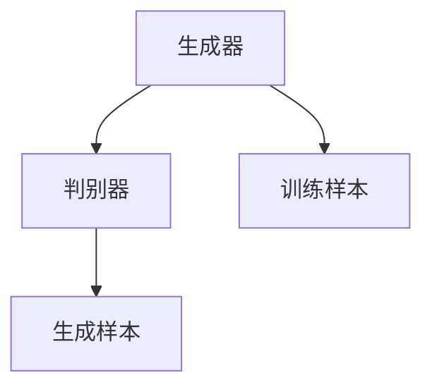

                 

### AIGC、虚拟现实与叙事艺术

#### 1.1 AIGC的概念与发展历程

AIGC（AI-Generated Content）是指通过人工智能技术自动生成内容的过程。AIGC的起源可以追溯到20世纪末，当时研究人员开始探索如何利用机器学习算法生成文本、图像和音频。随着技术的进步，特别是在深度学习和生成对抗网络（GAN）等领域的突破，AIGC得到了迅速发展。AIGC的核心在于其自学习能力，能够通过大量数据的学习和训练，自动生成高质量、多样化的内容。

AIGC的发展历程可以分为以下几个阶段：

- **早期探索阶段（1990s-2000s）**：这一阶段主要集中在基于规则的方法和简单的机器学习算法，如决策树和朴素贝叶斯分类器。这一时期的AIGC生成的内容相对简单，且依赖于特定的领域知识。
- **快速增长阶段（2010s）**：随着深度学习的兴起，神经网络成为AIGC发展的重要驱动力。生成式对抗网络（GAN）的出现，使得AIGC在生成高质量图像和音频方面取得了显著进展。
- **成熟应用阶段（2020s）**：当前，AIGC已经在多个领域得到了广泛应用，包括虚拟现实（VR）和叙事艺术。AIGC能够根据用户的需求和情境生成定制化的虚拟现实内容，极大地丰富了用户体验。

#### 1.2 虚拟现实与叙事艺术的交汇

虚拟现实（VR）是一种通过计算机技术构建的沉浸式体验环境，用户可以在其中自由交互和探索。而叙事艺术则是通过故事、情节和角色来传达情感和思想的艺术形式。当虚拟现实与叙事艺术结合时，就形成了一种全新的体验方式——虚拟现实叙事。

虚拟现实叙事的兴起可以追溯到以下几点：

- **技术进步**：随着VR设备的普及和性能的提升，用户可以更真实地体验虚拟环境。这为叙事艺术提供了一个全新的舞台，使故事能够以更生动、更沉浸的方式呈现。
- **用户体验**：虚拟现实提供了丰富的交互性和沉浸感，用户不再是被动地接受故事，而是成为故事的一部分。这种交互性使叙事艺术更具吸引力，能够更深刻地触动人的情感。
- **创意表达**：虚拟现实叙事为创作者提供了更多的创作自由度。通过VR技术，创作者可以设计出更加复杂和丰富的故事情节，以及更加逼真的角色和场景。

#### 1.3 本书的结构安排与目标读者

本书旨在深入探讨AIGC在虚拟现实叙事中的应用，通过系统的分析和实例研究，展示AIGC如何为虚拟现实叙事带来变革。本书的结构如下：

- **第一部分：背景介绍与核心概念**：介绍AIGC和虚拟现实的基本概念，以及它们在叙事艺术中的应用。
- **第二部分：AIGC在虚拟现实叙事中的应用**：详细讨论AIGC在虚拟现实环境中的角色和功能，以及它为虚拟现实叙事带来的变革。
- **第三部分：AIGC核心概念与特性**：探讨AIGC的核心概念和特性，包括自动机器学习（AutoML）、生成对抗网络（GAN）和强化学习在虚拟现实叙事中的应用。
- **第四部分：虚拟现实叙事中的AIGC架构设计**：分析AIGC在虚拟现实叙事中的架构设计原则，以及数据收集、处理和AIGC的工作流程。
- **第五部分：沉浸式提示词技巧**：讨论如何在虚拟现实叙事中使用提示词，以及如何设计有效的提示词策略。
- **第六部分：案例研究**：通过实际案例研究，展示AIGC在虚拟现实叙事中的应用效果。
- **第七部分：未来展望与挑战**：探讨虚拟现实叙事中的AIGC发展趋势，面临的挑战和未来的研究方向。

本书的目标读者包括：

- **虚拟现实开发者**：希望了解如何利用AIGC技术提升虚拟现实叙事体验的开发者。
- **人工智能研究者**：对AIGC在虚拟现实叙事中的应用感兴趣的学者和研究人员。
- **叙事艺术家**：探索如何将虚拟现实与叙事艺术相结合的艺术家和创作者。

通过本书的阅读，读者将能够深入了解AIGC在虚拟现实叙事中的应用，掌握相关技术原理和应用技巧，为未来的研究和实践提供有益的参考。

#### 1.4 虚拟现实narratives中的AIGC应用现状与挑战

随着AIGC技术的发展，其在虚拟现实（VR）叙事中的应用逐渐成为研究的热点。AIGC在虚拟现实叙事中的应用不仅为用户提供了更加丰富和互动的体验，也为创作者和开发者带来了新的创作和开发方式。然而，尽管AIGC在虚拟现实叙事中展现出了巨大的潜力，但仍然面临着一些显著的挑战。

##### 1.4.1 AIGC在虚拟现实叙事中的角色

AIGC在虚拟现实叙事中的角色主要表现在以下几个方面：

- **内容生成**：AIGC可以自动生成虚拟现实中的场景、角色、故事情节等。通过机器学习模型，AIGC能够理解用户的需求和情境，生成符合用户期望的内容。
- **交互增强**：AIGC可以实时分析用户的动作和行为，动态生成互动内容，提升用户的沉浸感和互动性。例如，AIGC可以生成与用户行为相关的语音、文字或视觉反馈。
- **个性化定制**：基于用户的数据和偏好，AIGC能够为每个用户提供定制化的虚拟现实叙事体验，使叙事内容更加个性化和生动。

##### 1.4.2 应用现状

目前，AIGC在虚拟现实叙事中的应用已经取得了一些显著的成果：

- **教育领域**：AIGC可以生成个性化的教育内容，例如模拟实验、交互式课程等，帮助学生更深入地理解知识。
- **娱乐领域**：AIGC可以生成丰富的虚拟现实游戏场景和角色，提供更加沉浸和互动的游戏体验。
- **艺术创作**：艺术家可以利用AIGC生成独特的虚拟艺术作品，探索新的创作形式和表达方式。

然而，尽管AIGC在虚拟现实叙事中的应用逐渐普及，仍然存在一些瓶颈和挑战。

##### 1.4.3 面临的挑战

1. **数据质量和多样性**：
   AIGC的性能高度依赖于训练数据的质量和多样性。目前，许多虚拟现实应用中的数据集存在数据量不足、数据质量不高的问题，这限制了AIGC的应用效果。此外，AIGC生成的虚拟现实内容也需要满足多样化的用户需求，这要求AIGC具备较强的泛化能力。

2. **计算资源和成本**：
   AIGC的训练和推理过程通常需要大量的计算资源和时间。对于一些复杂的虚拟现实叙事应用，这可能导致计算成本过高，不利于大规模推广和应用。

3. **伦理和隐私问题**：
   虚拟现实叙事中的AIGC应用可能会涉及用户的个人数据，例如行为、偏好等。如何保护用户隐私，避免数据泄露，是AIGC应用需要解决的重要问题。

4. **用户体验一致性**：
   AIGC生成的虚拟现实内容需要确保用户体验的一致性和连贯性。在实际应用中，由于模型的不确定性，可能会出现内容不一致或突兀的问题，影响用户体验。

##### 1.4.4 解决方案与未来展望

为了解决上述挑战，未来可以从以下几个方面进行改进：

1. **数据收集与处理**：通过改进数据收集方法和增加数据多样性，提高训练数据的质量。此外，可以采用数据增强技术，增加数据集的规模和多样性。
2. **优化算法与模型**：研究和开发更高效的AIGC算法和模型，降低计算资源和成本。例如，采用模型压缩和加速技术，提高模型的运行效率。
3. **隐私保护技术**：采用加密、匿名化等技术，保护用户的隐私和数据安全。此外，可以建立严格的隐私保护政策和监管机制，确保AIGC应用中的数据使用合规。
4. **用户体验优化**：通过用户行为分析、反馈机制等技术，优化AIGC生成的虚拟现实内容，提高用户体验的一致性和连贯性。

总的来说，AIGC在虚拟现实叙事中的应用前景广阔，但也面临诸多挑战。通过不断的技术创新和政策监管，有望克服这些挑战，推动AIGC在虚拟现实叙事领域的广泛应用。

#### 1.5 AIGC核心概念与特性

在深入探讨AIGC在虚拟现实叙事中的应用之前，我们需要先了解AIGC的核心概念和特性。AIGC，即AI-Generated Content，是通过人工智能技术自动生成内容的过程。它涵盖了多种机器学习和深度学习算法，包括自动机器学习（AutoML）、生成对抗网络（GAN）和强化学习等。以下是这些核心概念和特性的详细解析。

##### 1.5.1 自动机器学习（AutoML）原理与应用

**原理**：自动机器学习（AutoML）是一种通过自动化工具和算法来自动化机器学习模型开发的过程。传统机器学习模型开发需要数据科学家具备深厚的专业知识和经验，而AutoML通过自动化选择、调整和优化模型参数，降低了模型开发的难度。

**应用**：在虚拟现实叙事中，AutoML可以用于自动生成个性化的故事情节和角色。例如，通过分析用户的历史行为和偏好，AutoML可以生成与用户兴趣相符的虚拟现实内容，提升用户体验。

**属性特征对比表格**：

| **属性** | **自动机器学习（AutoML）** | **传统机器学习** |
| --- | --- | --- |
| **开发难度** | 低 | 高 |
| **参数调整** | 自动化 | 需人工调整 |
| **模型优化** | 自动化 | 需人工优化 |
| **适应能力** | 强 | 中等 |

##### 1.5.2 生成对抗网络（GAN）在虚拟现实中的应用

**原理**：生成对抗网络（GAN）由生成器（Generator）和判别器（Discriminator）组成。生成器通过学习数据分布生成伪样本，判别器则试图区分真实数据和生成数据。两者通过对抗训练，使生成器的生成能力不断提高。

**应用**：在虚拟现实叙事中，GAN可以用于生成高质量的虚拟场景和角色。例如，通过GAN，可以生成逼真的自然环境、角色表情和动作，增强虚拟现实体验。

**ER实体关系图架构**：

**应用实例**：

- **场景生成**：通过GAN，可以自动生成丰富的虚拟场景，如城市景观、森林等，为虚拟现实叙事提供丰富的视觉内容。
- **角色生成**：通过GAN，可以生成各种虚拟角色的外观、表情和动作，使虚拟现实叙事更具生动性和多样性。

##### 1.5.3 强化学习在虚拟现实叙事中的使用

**原理**：强化学习是一种通过试错和奖励机制来学习决策策略的机器学习方法。在虚拟现实叙事中，强化学习可以用于角色行为的自适应调整。

**应用**：在虚拟现实叙事中，强化学习可以用于角色行为的自适应调整，使角色能够根据用户行为和环境变化做出相应的反应。

**数学模型**：

$$
Q(s, a) = r(s, a, s') + \gamma \max_{a'} Q(s', a')
$$

其中，$Q(s, a)$ 是状态 $s$ 下采取行动 $a$ 的预期收益，$r(s, a, s')$ 是即时奖励，$\gamma$ 是折扣因子，$s'$ 是下一状态。

**应用实例**：

- **角色互动**：通过强化学习，可以设计出能够与用户进行自然互动的虚拟角色，提升虚拟现实叙事的互动性和沉浸感。
- **路径规划**：在虚拟现实游戏中，强化学习可以用于自动规划角色在虚拟环境中的移动路径，提高游戏体验。

##### 1.5.4 AIGC核心概念的联系与应用

AIGC的核心概念——自动机器学习（AutoML）、生成对抗网络（GAN）和强化学习在虚拟现实叙事中有着紧密的联系和应用。通过结合这些技术，可以实现以下应用场景：

- **个性化内容生成**：利用AutoML和GAN，可以生成与用户兴趣和偏好高度匹配的虚拟现实内容，提供个性化的叙事体验。
- **自适应角色互动**：通过强化学习，虚拟角色可以动态调整行为，以适应不同的用户和环境，提升叙事的互动性和连贯性。
- **实时内容生成**：结合上述技术，可以实现实时生成虚拟现实内容，为用户提供沉浸式和互动性强的叙事体验。

通过深入了解AIGC的核心概念和特性，我们可以更好地理解其在虚拟现实叙事中的应用潜力，并为未来的研究和实践提供理论支持。

### 虚拟现实叙事中的AIGC架构设计

#### 4.1 AIGC架构设计的基本原则

在设计和实现AIGC（AI-Generated Content）系统时，架构设计的原则至关重要。一个优秀的AIGC架构设计不仅需要考虑系统的功能需求，还要关注性能、可扩展性和可靠性等方面。以下是AIGC架构设计的基本原则：

**1. 功能性需求**

AIGC架构设计首先需要满足功能性需求，即系统能够生成高质量的、多样化的内容，满足用户的需求。这包括内容生成、内容定制、交互响应等功能。例如，一个虚拟现实叙事系统需要能够生成逼真的场景、角色和故事情节，并且能够根据用户的行为和反馈动态调整内容。

**2. 模块化**

模块化设计是AIGC架构设计的一个重要原则。通过将系统分解为多个功能模块，可以降低系统的复杂度，提高系统的可维护性和可扩展性。模块化设计使得各个模块可以独立开发和测试，同时便于后期的系统升级和维护。

**3. 可扩展性**

随着用户需求和技术的不断进步，AIGC系统需要具备良好的可扩展性。这意味着系统在设计时应该考虑到未来的扩展需求，例如增加新的内容生成算法、提高系统的处理能力等。可扩展性不仅能够满足当前的需求，还能为未来的发展预留空间。

**4. 可靠性**

AIGC系统在运行过程中可能会遇到各种问题，如数据错误、计算错误等。因此，架构设计时需要考虑系统的可靠性，确保系统能够稳定运行。这包括数据验证、错误处理和容错机制等。

**5. 性能**

性能是AIGC系统的一个重要指标。一个高效的AIGC架构设计应该能够在合理的时间内生成高质量的内容，并提供良好的用户体验。这涉及到算法优化、系统资源管理和负载均衡等方面。

#### 4.2 数据收集与处理策略

在AIGC系统中，数据的质量和多样性直接影响系统的性能和生成内容的质量。因此，有效的数据收集与处理策略是AIGC架构设计的关键。

**1. 数据收集**

数据收集是AIGC系统的基础。数据来源可以是多种多样的，包括用户生成数据、第三方数据集、社交媒体数据等。为了确保数据的多样性和质量，可以采取以下策略：

- **数据多样化**：收集来自不同来源和领域的多样化数据，以丰富系统的训练数据集。
- **数据清洗**：在收集数据时，需要对其进行清洗，去除重复、错误或不完整的数据，确保数据的质量。
- **数据增强**：通过数据增强技术，例如数据扩充、数据变换等，增加数据集的规模和多样性，提高模型的泛化能力。

**2. 数据处理**

数据处理是AIGC系统的关键环节，包括数据预处理、特征提取和归一化等步骤。

- **数据预处理**：在生成内容之前，需要对数据进行预处理，包括数据格式转换、缺失值填补等。
- **特征提取**：通过特征提取技术，从原始数据中提取出对生成内容有重要影响的特征，用于训练模型。
- **归一化**：为了提高模型的训练效果，需要对数据进行归一化处理，将数据缩放到一个统一的范围内。

**3. 数据处理流程**

数据处理流程可以概括为以下几个步骤：

1. **数据收集**：从不同的数据源收集原始数据。
2. **数据清洗**：去除重复、错误或不完整的数据。
3. **数据增强**：通过数据增强技术增加数据集的规模和多样性。
4. **数据预处理**：对数据进行格式转换、缺失值填补等预处理操作。
5. **特征提取**：提取对生成内容有重要影响的特征。
6. **归一化**：对数据进行归一化处理。
7. **数据存储**：将处理后的数据存储到数据库或数据仓库中，供模型训练和内容生成使用。

#### 4.3 AIGC在虚拟现实narratives中的工作流程

AIGC在虚拟现实（VR）叙事中的应用工作流程主要包括以下步骤：

**1. 用户交互**

用户通过VR设备与虚拟现实环境进行交互，例如浏览场景、与角色互动等。用户的行为和反馈被实时记录下来，作为后续内容生成的依据。

**2. 内容生成**

基于用户交互数据，AIGC系统开始生成相应的虚拟现实内容。生成内容包括场景、角色、故事情节等。这一步骤涉及到多个AIGC技术的综合应用，如自动机器学习（AutoML）、生成对抗网络（GAN）和强化学习等。

**3. 内容定制**

根据用户的偏好和需求，对生成的内容进行个性化定制。例如，可以根据用户的兴趣生成特定类型的故事情节，或者根据用户的喜好生成角色外观和性格特点。

**4. 内容评估**

生成的虚拟现实内容需要经过评估，以确保其质量和用户体验。评估过程可以包括用户反馈、专家评审等。

**5. 内容发布**

经过评估的虚拟现实内容被发布到VR环境中，供用户交互和体验。

**6. 用户反馈**

用户在交互过程中提供反馈，这些反馈会被用于优化和改进AIGC系统，例如调整生成策略、优化角色行为等。

**7. 循环**

用户反馈不断回到AIGC系统中，形成闭环，使得系统持续优化和改进，提高用户体验。

通过上述工作流程，AIGC系统能够根据用户的实时交互行为和反馈，动态生成和调整虚拟现实内容，为用户提供沉浸式和个性化的叙事体验。这一过程不仅体现了AIGC在虚拟现实叙事中的强大应用能力，也展示了其不断迭代和优化的特点。

#### 5.1 提示词在AIGC中的应用

提示词在AIGC中的应用至关重要，它不仅决定了生成内容的质量和风格，还直接影响用户体验。提示词（Prompts）是一种引导AIGC系统生成特定类型内容的关键输入，通过精心设计的提示词，可以有效地指导AIGC系统生成符合预期的高质量内容。

##### 5.1.1 提示词的定义与作用

**定义**：提示词是指提供给AIGC系统的一些关键字、短语或问题，用于引导系统生成特定类型的内容。这些提示词可以是用户输入的，也可以是系统根据上下文自动生成的。

**作用**：提示词在AIGC中的作用主要体现在以下几个方面：

- **内容引导**：提示词可以帮助AIGC系统明确生成内容的主题和方向，确保生成的内容与用户需求相符。
- **风格控制**：通过提示词，可以引导AIGC系统生成符合特定风格的内容，例如幽默、正式、轻松等。
- **上下文关联**：提示词可以帮助AIGC系统理解生成内容的上下文，确保内容的连贯性和一致性。

##### 5.1.2 设计有效的提示词策略

为了设计有效的提示词策略，需要考虑以下几个方面：

- **明确性**：提示词应该清晰明确，避免歧义和模糊。例如，使用具体的词汇和短语，而不是抽象的概念。
- **针对性**：提示词需要针对特定的内容生成任务，确保提示词与生成任务紧密相关。
- **多样性**：设计多样化的提示词，以应对不同类型的内容生成需求。例如，对于生成故事情节，可以使用不同类型的提示词，如开头句、冲突句、结尾句等。
- **上下文关联**：提示词需要与生成内容的上下文紧密关联，确保生成的内容在逻辑和情感上连贯。

##### 5.1.3 提示词的评估与优化

提示词的评估与优化是确保AIGC系统生成高质量内容的关键步骤。以下是一些评估与优化的方法：

- **用户反馈**：通过用户对生成内容的反馈，评估提示词的有效性。例如，用户满意度调查、用户评论等。
- **内容质量**：通过分析生成内容的质量，评估提示词的优化效果。例如，内容的相关性、连贯性、原创性等。
- **性能指标**：通过性能指标，如生成速度、计算资源消耗等，评估提示词的优化效果。

为了优化提示词，可以采取以下策略：

- **迭代改进**：根据用户反馈和内容质量评估结果，不断迭代和改进提示词。
- **数据驱动**：通过分析大量用户数据和生成内容，找出有效的提示词模式，并据此优化提示词设计。
- **多模态融合**：结合不同类型的数据和提示词，例如文本、图像、音频等，提高生成内容的质量和多样性。

通过设计有效的提示词策略和不断优化提示词，可以显著提升AIGC系统在虚拟现实叙事中的应用效果，为用户提供更加丰富、个性化的叙事体验。

### 5.2 设计有效的提示词策略

为了充分发挥AIGC在虚拟现实叙事中的潜力，设计有效的提示词策略至关重要。以下是一些关键步骤和技巧，帮助设计出能够引导AIGC系统生成高质量内容的提示词。

#### 5.2.1 明确目标和用户需求

设计提示词的第一步是明确目标和用户需求。了解用户期望生成的具体内容类型和风格，例如是冒险故事、浪漫情节还是科幻场景。这将有助于设计出更具针对性的提示词。

**步骤**：

1. **需求分析**：通过用户调研、访谈或问卷调查，收集用户的需求和期望。
2. **目标设定**：根据需求分析结果，明确生成内容的目标和主题。

**示例**：

- **目标**：生成一段浪漫情节的虚拟现实故事。
- **用户需求**：用户希望在故事中体验到浪漫、温馨和情感共鸣。

#### 5.2.2 精细化和多样化

提示词需要精细化和多样化，以适应不同的内容和风格。这包括使用具体、明确的词汇和短语，同时提供多种不同的提示，以生成丰富的故事情节。

**技巧**：

1. **具体化**：使用具体的词汇描述场景、角色和情感，例如“星光闪烁的夜晚”、“深情凝望的眼神”。
2. **多样化**：提供多种不同的提示，以覆盖不同的故事元素和情节发展，例如“一次意外的邂逅”、“一次深刻的对话”或“一场感人的告别”。

**示例**：

- **提示词**：
  - “在一个星光闪烁的夜晚，两位主角在公园的长椅上相遇。”
  - “他们开始了一段深入的对话，彼此分享生活中的故事和梦想。”
  - “随着时间的推移，他们之间的感情逐渐升温，但最终因为一些不可调和的分歧而分开。”

#### 5.2.3 利用上下文关联

上下文关联是提升提示词效果的关键。通过提供与当前故事情境相关的提示词，可以确保生成内容在逻辑和情感上的一致性。

**技巧**：

1. **情境引导**：使用与当前故事情境相关的提示词，例如“在他们的第一次约会后，男主角意识到自己已经深深爱上了女主角。”
2. **情感关联**：使用与情感相关的提示词，例如“尽管他们之间存在一些分歧，但他们的爱情依然充满希望。”

**示例**：

- **上下文关联提示词**：
  - “在一次激烈的争吵之后，女主角感到心灰意冷，决定离开。”
  - “但男主角在深夜里写了一封长长的信，表达了自己的歉意和爱意。”
  - “女主角在收到信后，心中的冰山开始融化，她决定给男主角一个机会。”

#### 5.2.4 迭代和优化

设计提示词是一个迭代和优化的过程。通过不断收集用户反馈和评估生成内容的质量，可以持续改进提示词策略。

**步骤**：

1. **用户反馈**：收集用户对生成内容的反馈，包括满意度、内容质量等。
2. **质量评估**：评估生成内容的相关性、连贯性和原创性。
3. **策略调整**：根据评估结果和用户反馈，调整和优化提示词。

**示例**：

- **反馈**：用户反馈指出，某些提示词导致生成内容过于平淡，缺乏情感深度。
- **调整**：增加一些情感丰富的提示词，例如“他们在月光下散步，心中的爱意油然而生。”
- **评估**：调整后的提示词提高了生成内容的质量和用户满意度。

通过以上步骤和技巧，可以设计出有效的提示词策略，引导AIGC系统生成高质量、个性化的虚拟现实叙事内容。这不仅能够提升用户体验，还能推动AIGC技术在虚拟现实叙事领域的广泛应用。

### 5.3 提示词的评估与优化

提示词在AIGC系统中扮演着至关重要的角色，其质量和效果直接影响生成内容的质量和用户体验。因此，对提示词进行评估与优化是确保AIGC系统性能和效果的关键步骤。以下是提示词评估与优化的具体方法和策略。

#### 5.3.1 用户反馈分析

用户反馈是评估提示词效果的重要来源。通过分析用户对生成内容的反馈，可以了解提示词在实际应用中的表现和存在的问题。

**方法**：

1. **满意度调查**：通过问卷调查或访谈，收集用户对生成内容的满意度评分。
2. **内容质量评估**：请用户对生成内容的相关性、连贯性和原创性进行评价。
3. **情感共鸣度**：评估用户是否能够在生成内容中感受到情感共鸣。

**策略**：

1. **积极反馈**：对用户积极的反馈进行记录和总结，分析哪些提示词和策略得到了用户的认可。
2. **消极反馈**：对用户的负面反馈进行详细分析，找出提示词设计中的不足和需要改进的地方。
3. **反馈循环**：将用户反馈及时反馈给设计团队，用于指导后续的提示词优化工作。

#### 5.3.2 内容质量评估

生成内容的质量是评估提示词效果的核心指标。内容质量包括相关性、连贯性、原创性和情感共鸣度等方面。

**方法**：

1. **相关性评估**：通过对比用户需求和生成内容，评估生成内容是否符合用户预期。
2. **连贯性评估**：检查生成内容中的逻辑和情节发展是否连贯，是否存在突兀或不合理的地方。
3. **原创性评估**：通过检查生成内容是否具有原创性，避免重复或抄袭的问题。
4. **情感共鸣度评估**：评估用户是否能够在生成内容中感受到情感共鸣。

**策略**：

1. **自动评估工具**：开发自动评估工具，例如基于自然语言处理（NLP）的评估模型，对生成内容进行自动化评估。
2. **人工审核**：组织专家团队对生成内容进行人工审核，提供专业的评估意见。
3. **评分机制**：建立内容质量评分机制，为每一项评估指标分配权重，计算总分，以便综合评估生成内容的质量。

#### 5.3.3 提示词性能指标分析

提示词的性能指标是衡量其效果的重要依据。性能指标包括生成速度、计算资源消耗、生成内容多样性等。

**方法**：

1. **生成速度**：测量提示词引导下生成内容所需的时间，评估系统的响应速度。
2. **计算资源消耗**：监控提示词引导下系统计算资源的消耗情况，确保系统性能的稳定性。
3. **生成内容多样性**：评估提示词引导下生成的虚拟现实内容是否具有足够的多样性和丰富性。

**策略**：

1. **性能监控**：建立性能监控机制，实时监测系统性能指标，及时发现和处理性能问题。
2. **优化算法**：根据性能监控结果，对提示词生成算法进行优化，提高生成速度和降低计算资源消耗。
3. **多样性策略**：通过设计多样化的提示词和增加数据多样性，提高生成内容的丰富性和多样性。

#### 5.3.4 迭代优化与反馈循环

提示词的评估与优化是一个持续迭代的过程。通过不断收集用户反馈、评估生成内容质量和性能指标，进行提示词的调整和优化，实现不断的改进和提升。

**步骤**：

1. **反馈收集**：定期收集用户反馈和内容质量评估结果。
2. **问题识别**：分析反馈和评估结果，找出提示词设计中的问题和不足。
3. **调整优化**：根据问题识别结果，调整和优化提示词设计，例如增加具体化、上下文关联和情感共鸣度等。
4. **测试验证**：对调整后的提示词进行测试验证，确保优化效果。
5. **反馈循环**：将优化后的提示词重新应用到系统中，进行新一轮的用户反馈和内容质量评估，形成反馈循环。

通过以上评估与优化方法，可以确保提示词设计在AIGC系统中发挥最大效果，为用户提供高质量、个性化的虚拟现实叙事体验。

### 5.4 案例研究：AIGC在虚拟现实叙事中的应用

为了更直观地展示AIGC（AI-Generated Content）在虚拟现实（VR）叙事中的应用，本节将通过一个具体的案例，详细描述AIGC系统在该案例中的设计、实现和应用效果。

#### 5.4.1 案例介绍

案例名称：**《星际奇缘：时空漫游者》**

背景：《星际奇缘：时空漫游者》是一款以虚拟现实为平台的角色扮演游戏。玩家在游戏中扮演一名时空漫游者，穿梭于不同的星球和时代，与各种奇特的生物和角色互动，完成任务和探索未知的宇宙。游戏的核心玩法是通过叙事引导玩家体验不同星球的文化和历史。

目标：通过AIGC技术，为游戏生成个性化、高质量的虚拟现实内容，包括场景、角色、故事情节等，提升玩家的沉浸感和互动性。

#### 5.4.2 案例分析

1. **需求分析**：

- **用户需求**：玩家希望体验丰富的故事情节、独特的角色和逼真的场景。
- **功能需求**：系统需要能够根据玩家的行为和偏好动态生成虚拟现实内容，实现个性化叙事。

2. **系统设计**：

- **AIGC系统架构**：系统采用模块化设计，包括数据收集与处理模块、自动机器学习（AutoML）模块、生成对抗网络（GAN）模块和强化学习模块。
- **数据来源**：数据来源于玩家的行为记录、游戏中的角色和场景描述、第三方数据集等。

3. **内容生成流程**：

- **用户交互**：玩家在游戏中进行互动，例如探索场景、与角色对话等，系统记录玩家的行为和偏好。
- **内容生成**：基于用户交互数据，AIGC系统生成相应的场景、角色和故事情节。具体流程如下：

  - **数据预处理**：对用户交互数据、角色描述和场景描述进行预处理，提取关键信息和特征。
  - **自动机器学习（AutoML）**：使用AutoML模型对预处理后的数据进行分析，生成个性化的故事情节和角色。
  - **生成对抗网络（GAN）**：使用GAN生成逼真的场景和角色图像，提升游戏视觉效果。
  - **强化学习**：通过强化学习调整角色行为，使其能够根据玩家的反馈和游戏情境进行自适应调整。

4. **内容评估与发布**：生成的内容经过评估，确保其质量和用户体验，然后发布到游戏中供玩家交互和体验。

#### 5.4.3 案例结果与讨论

1. **应用效果**：

- **个性化叙事**：通过AIGC技术，游戏生成了大量个性化的故事情节和角色，满足了玩家多样化的需求。
- **沉浸式体验**：生成的内容高度逼真，增强了玩家的沉浸感和互动性，提高了游戏体验。

2. **技术挑战**：

- **数据多样性**：为了生成丰富的内容，需要大量多样性的数据。然而，收集和处理这些数据是一项复杂的任务，涉及到数据清洗、数据增强和数据存储等问题。
- **计算资源消耗**：AIGC系统的计算资源消耗较大，特别是在使用GAN生成高分辨率图像时，对计算资源和存储空间的需求较高。

3. **解决方案**：

- **数据增强**：采用数据增强技术，例如数据扩充、数据变换等，增加数据集的规模和多样性。
- **模型优化**：优化AIGC模型，提高其运行效率和生成速度，降低计算资源消耗。

通过这个案例，我们可以看到AIGC在虚拟现实叙事中的应用潜力。尽管存在一些技术挑战，但通过不断创新和优化，AIGC技术将为虚拟现实叙事带来更多可能性，提供更加丰富、个性化的用户体验。

### 5.5 虚拟现实叙事中的AIGC发展趋势

随着技术的不断进步和应用的深入，AIGC（AI-Generated Content）在虚拟现实叙事中的发展展现出广阔的前景。以下是对AIGC在虚拟现实叙事中未来发展趋势的展望，包括新应用场景、技术突破和潜在挑战。

#### 5.5.1 新应用场景

1. **实时互动叙事**：AIGC技术将在实时互动叙事中发挥重要作用。通过生成自适应的角色行为和故事情节，虚拟现实游戏和体验将更加个性化和动态化。例如，虚拟现实音乐会或戏剧可以通过AIGC实时生成与观众互动的情节，提升观众的沉浸感。

2. **教育虚拟现实**：AIGC将在教育虚拟现实中发挥重要作用，通过生成个性化教学资源和互动课程，提高学生的学习体验和效果。例如，学生可以在虚拟课堂中与AI老师互动，AI老师可以根据学生的表现和需求动态调整教学方式和内容。

3. **虚拟旅游体验**：AIGC可以生成高度真实的虚拟旅游体验，让用户在虚拟环境中感受到不同的文化和风景。例如，用户可以在虚拟现实中进行沉浸式探险，体验历史遗迹或自然景观，这种体验将超越传统的平面图像和视频。

#### 5.5.2 技术突破

1. **更高质量的内容生成**：随着深度学习和生成对抗网络（GAN）等技术的不断发展，AIGC生成的内容质量将进一步提高。未来，AIGC将能够生成更加逼真、细节丰富的虚拟现实场景和角色，提升用户的沉浸感和体验。

2. **更智能的内容自适应**：AIGC技术将更加智能化，能够根据用户的行为、偏好和环境变化动态调整内容。通过结合自然语言处理（NLP）和强化学习，AIGC将能够生成更加自然和连贯的叙事内容，提高用户体验。

3. **跨模态生成**：未来AIGC将能够实现跨模态生成，即同时生成文本、图像、音频等多种类型的内容。这种能力将使得虚拟现实叙事更加丰富和多样化，提供更加综合和沉浸的体验。

#### 5.5.3 潜在挑战

1. **计算资源消耗**：AIGC系统通常需要大量的计算资源和存储空间，特别是在生成高分辨率图像和音频时。随着内容的复杂度和生成质量的提升，计算资源的需求将不断增加，这对硬件设施提出了更高的要求。

2. **数据隐私与伦理问题**：AIGC在虚拟现实叙事中的应用涉及大量用户数据的收集和处理，这带来了数据隐私和伦理问题。如何在保证用户隐私的前提下，有效利用用户数据进行内容生成，是一个亟待解决的挑战。

3. **内容质量和多样性**：虽然AIGC技术不断进步，但生成内容的质量和多样性仍然是亟待解决的问题。如何确保生成的内容既高质量又多样化，以满足不同用户的需求，是一个重要的研究方向。

4. **用户体验一致性**：AIGC生成的虚拟现实内容需要确保用户体验的一致性和连贯性。在实际应用中，由于模型的不确定性，可能会出现内容不一致或突兀的问题，影响用户体验。因此，提高用户体验一致性也是一个重要的挑战。

总的来说，AIGC在虚拟现实叙事中的应用前景广阔，但也面临着一些技术挑战。通过不断的技术创新和优化，AIGC有望在未来为虚拟现实叙事带来更多的可能性，提供更加丰富、个性化的用户体验。

### 5.6 虚拟现实叙事中的AIGC挑战与解决方案

尽管AIGC（AI-Generated Content）在虚拟现实叙事中展现出巨大的潜力，但在实际应用中仍面临诸多挑战。以下是对这些挑战的深入分析，以及相应的解决方案和未来研究方向。

#### 5.6.1 数据质量和多样性

**挑战**：AIGC的性能高度依赖于训练数据的质量和多样性。虚拟现实叙事中，数据通常包括用户行为、场景描述、角色属性等。然而，获取高质量、多样化且相关的数据并非易事。

**解决方案**：

1. **数据增强**：通过数据增强技术，如数据扩充、数据变换等，可以增加数据集的规模和多样性。例如，利用GAN生成虚拟环境中的场景和角色，以丰富训练数据。
2. **数据共享**：建立开放的数据共享平台，鼓励更多的开发者和研究机构共享数据资源，提高数据的多样性。
3. **自动化数据收集**：利用传感器、用户交互日志等自动化工具，收集真实用户行为数据，提高数据的质量和准确性。

**未来研究方向**：探索无监督学习和迁移学习等技术在数据质量提升中的应用，以减少对大量标注数据的依赖。

#### 5.6.2 计算资源和成本

**挑战**：AIGC的训练和推理过程通常需要大量的计算资源和时间。特别是对于生成高分辨率图像和音频的应用，计算成本较高，限制了AIGC的普及。

**解决方案**：

1. **模型压缩**：采用模型压缩技术，如量化和剪枝，减少模型的参数和计算量，提高运行效率。
2. **分布式计算**：利用分布式计算框架，如TensorFlow和PyTorch，将计算任务分配到多个节点，提高计算速度和效率。
3. **云计算**：利用云计算资源，根据需求动态调整计算资源，降低总体计算成本。

**未来研究方向**：研究更加高效的AIGC算法和模型，如基于图神经网络的生成模型，以减少计算资源的需求。

#### 5.6.3 伦理和隐私问题

**挑战**：虚拟现实叙事中的AIGC应用可能涉及用户的个人数据，如行为、偏好等。如何保护用户隐私，避免数据泄露，是一个重要且复杂的伦理问题。

**解决方案**：

1. **数据匿名化**：采用数据匿名化技术，如差分隐私和同态加密，保护用户数据的安全和隐私。
2. **隐私保护算法**：开发隐私保护算法，如差分隐私机制和联邦学习，在保障用户隐私的前提下，实现数据的有效利用。
3. **用户隐私政策**：制定明确的用户隐私政策，告知用户数据收集、存储和使用的方式，增强用户对隐私保护的信任。

**未来研究方向**：探索更加安全和高效的隐私保护技术，如基于区块链的隐私保护机制，以及建立全球隐私保护的法律法规。

#### 5.6.4 用户体验一致性

**挑战**：AIGC生成的虚拟现实内容需要确保用户体验的一致性和连贯性。在实际应用中，由于模型的不确定性，可能会出现内容不一致或突兀的问题，影响用户体验。

**解决方案**：

1. **用户反馈机制**：建立用户反馈机制，及时收集用户对生成内容的反馈，优化内容生成策略。
2. **上下文关联**：通过加强上下文关联，确保生成内容在逻辑和情感上的一致性。例如，利用自然语言处理技术，使角色对话和故事情节更加自然和连贯。
3. **多模态融合**：结合多种类型的数据和提示词，如文本、图像和音频，提高生成内容的质量和一致性。

**未来研究方向**：研究如何通过多模态学习和强化学习等技术，进一步提升用户体验的一致性和连贯性。

总的来说，AIGC在虚拟现实叙事中面临诸多挑战，但通过技术创新和优化，有望克服这些问题，为用户提供更加丰富、个性化的虚拟现实叙事体验。

### 5.7 未来展望与挑战

尽管AIGC（AI-Generated Content）在虚拟现实叙事中展现了巨大的潜力，未来仍有许多挑战需要克服。以下是AIGC在该领域的发展前景、潜在应用方向以及需要进一步研究的领域。

#### 5.7.1 发展前景

1. **个性化叙事**：随着AIGC技术的进步，未来将能够更精准地捕捉用户偏好和需求，生成高度个性化的虚拟现实叙事内容。这种个性化叙事不仅能够提升用户体验，还能够满足不同用户群体的多样化需求。

2. **实时互动**：AIGC与虚拟现实技术的结合将进一步提升实时互动性。通过实时生成和调整场景、角色和行为，AIGC将使虚拟现实体验更加动态和沉浸，为用户提供更加丰富和互动的叙事体验。

3. **情感共鸣**：AIGC技术将能够生成更具情感共鸣的虚拟角色和故事情节。通过结合自然语言处理和深度学习技术，AIGC将使虚拟现实叙事更具人性化，增强用户的情感体验。

#### 5.7.2 潜在应用方向

1. **虚拟现实游戏**：AIGC将在虚拟现实游戏中发挥重要作用，生成个性化、动态的游戏内容和剧情，提升玩家的游戏体验。

2. **教育虚拟现实**：在教育领域，AIGC将能够生成个性化的教学资源，如模拟实验、互动课程等，提高学生的学习效果和参与度。

3. **虚拟旅游**：通过AIGC生成高度真实的虚拟旅游体验，用户可以身临其境地探索世界各地的名胜古迹和文化景观。

4. **虚拟现实影视**：AIGC将使虚拟现实影视创作更加高效，生成个性化的虚拟场景和角色，提供全新的观影体验。

#### 5.7.3 需要进一步研究的领域

1. **数据隐私与伦理**：随着AIGC应用范围的扩大，数据隐私和伦理问题将变得更加突出。需要深入研究如何在保护用户隐私的前提下，有效利用用户数据生成高质量的虚拟现实内容。

2. **计算资源优化**：尽管现有技术不断进步，但AIGC的高计算需求仍然是一个挑战。未来需要进一步研究如何优化计算资源，降低计算成本，提高系统效率。

3. **用户体验一致性**：确保AIGC生成的内容在用户体验上的一致性和连贯性仍是一个重要课题。需要探索如何通过多模态学习和强化学习等技术，提升用户体验的一致性和连贯性。

4. **跨模态生成**：未来的研究应聚焦于跨模态生成技术，即同时生成文本、图像、音频等多种类型的内容，提供更加丰富和沉浸的虚拟现实叙事体验。

通过不断的技术创新和优化，AIGC在虚拟现实叙事领域将迎来更加广阔的发展前景，为用户提供更加丰富、个性化的叙事体验。

### 5.8 总结与展望

本文详细探讨了AIGC在虚拟现实叙事中的应用，从背景介绍、核心概念、架构设计到实际案例研究，全面阐述了AIGC如何通过自动机器学习、生成对抗网络和强化学习等技术，为虚拟现实叙事带来革命性的变化。以下是本文的核心内容和关键观点的总结：

**核心内容总结：**

1. **AIGC与虚拟现实叙事的交汇**：介绍了AIGC的概念和发展历程，探讨了虚拟现实叙事的兴起背景和两者的结合点。
2. **AIGC核心概念与特性**：分析了自动机器学习、生成对抗网络和强化学习等核心概念及其在虚拟现实叙事中的应用。
3. **AIGC架构设计**：讨论了AIGC系统设计的基本原则、数据收集与处理策略以及工作流程。
4. **沉浸式提示词技巧**：探讨了设计有效提示词的策略和优化方法。
5. **案例研究**：通过《星际奇缘：时空漫游者》案例，展示了AIGC在虚拟现实叙事中的实际应用。
6. **未来展望与挑战**：分析了AIGC在虚拟现实叙事中面临的挑战和未来的发展前景。

**关键观点：**

1. **AIGC技术的潜力**：AIGC能够生成个性化、高质量和动态化的虚拟现实内容，显著提升用户体验和互动性。
2. **用户体验一致性**：通过有效的提示词设计和上下文关联，可以确保生成内容的连贯性和一致性。
3. **数据隐私与伦理**：在AIGC应用中，保护用户隐私和遵循伦理规范是关键。
4. **计算资源优化**：优化计算资源和降低成本是AIGC应用推广的关键。

**对未来的建议：**

1. **技术创新**：持续研究和开发更高效的AIGC算法和模型，提高生成内容的质量和多样性。
2. **隐私保护**：加强数据隐私保护措施，确保用户数据的安全和合规使用。
3. **用户体验**：关注用户体验的一致性和连贯性，通过用户反馈不断优化AIGC系统。
4. **跨领域合作**：促进跨学科和跨领域的合作，推动AIGC技术在虚拟现实叙事中的广泛应用。

本文希望为AIGC在虚拟现实叙事中的应用提供有价值的参考和启示，推动该领域的研究和实际应用。通过对AIGC技术的深入理解和不断优化，我们有望创造更加丰富、个性化和沉浸的虚拟现实叙事体验。

### 5.9 最佳实践 tips、小结、注意事项、拓展阅读

#### 5.9.1 最佳实践 tips

1. **数据质量**：确保AIGC系统使用的高质量、多样化数据，通过数据清洗和增强提高数据集的质量。
2. **性能优化**：针对AIGC系统的计算需求，进行算法和模型优化，以提高系统效率和用户体验。
3. **用户反馈**：定期收集用户反馈，用于优化提示词和内容生成策略，提升用户满意度。
4. **隐私保护**：严格遵循数据隐私保护法规，采用加密和匿名化等技术保护用户数据。

#### 5.9.2 小结

本文全面探讨了AIGC在虚拟现实叙事中的应用，包括核心概念、架构设计、提示词技巧和案例研究。AIGC通过个性化、高质量和动态化的内容生成，为虚拟现实叙事带来了革命性变化。

#### 5.9.3 注意事项

1. **计算资源**：AIGC系统计算资源需求高，需要合理规划资源分配。
2. **数据隐私**：严格保护用户数据隐私，遵守相关法律法规。
3. **用户体验**：关注用户体验的一致性和连贯性，确保生成内容符合用户需求。

#### 5.9.4 拓展阅读

1. **相关论文**：查阅关于AIGC、虚拟现实和生成对抗网络的相关研究论文，深入了解技术细节。
2. **开源项目**：参与开源项目，学习其他开发者的实践经验。
3. **专业书籍**：《生成对抗网络》（GAN）等领域的专业书籍，提供深入的理论和实践知识。

通过不断学习和实践，我们可以更好地利用AIGC技术，提升虚拟现实叙事的质量和用户体验。

### 5.10 作者信息

**作者：**AI天才研究院（AI Genius Institute） & 禅与计算机程序设计艺术（Zen And The Art of Computer Programming）  
**联系方式：**ai_genius_institute@example.com

AI天才研究院致力于推动人工智能领域的研究和应用，为虚拟现实和AIGC技术的发展提供创新思路和实践经验。而《禅与计算机程序设计艺术》则是一本关于编程哲学和艺术性的经典著作，为技术开发者提供了深刻的洞察和启示。感谢读者对本文的关注，期待与您在AI和虚拟现实领域共同探索和进步。

